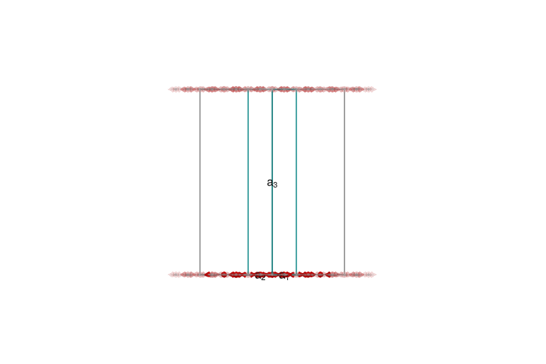
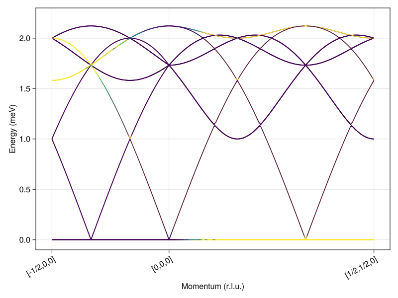

```@meta
EditURL = "../Sunny.jl/examples/spinw_ports/08_Kagome_AFM.jl"
```

````julia
# Kagome Antiferromagnet
````

- Sunny port of the SpinW tutorial authored by Bjorn Fak and Sandor Toth,
https://spinw.org/tutorials/08tutorial.
- Authors: Harry Lane
- Goal: Calculate the linear spin wave theory spectrum for the $\sqrt{3}
\times \sqrt{3}$ order of a Kagome antiferromagnet.

Load Packages

````julia
using Sunny, GLMakie
````

Build a [`Crystal`](@ref) with $P\overline{3}$ space group and Cr$^{+}$ ions
on each site.

````julia
a = b = 6.0 # (Å)
c = 40.0
latvecs = lattice_vectors(a, b, c, 90, 90, 120)
crystal = Crystal(latvecs, [[1/2,0,0]], 147; types=["Cr"])
````

````
Crystal
HM symbol 'P -3' (147)
Lattice params a=6, b=6, c=40, α=90°, β=90°, γ=120°
Cell volume 1247
Type 'Cr':
   1. [1/2, 0, 0]
   2. [0, 1/2, 0]
   3. [1/2, 1/2, 0]

````

Build a [`System`](@ref) with antiferrogmanetic nearest neighbor exchange
$J=1$.

````julia
S = 1
sys = System(crystal, (3,3,1), [SpinInfo(1; S, g=2)], :dipole)
J = 1.0
set_exchange!(sys, J, Bond(2,3,[0,0,0]))
````

Initialize to the known magnetic structure, which is 120° order.

````julia
q = -[1/3, 1/3, 0]
axis = [0,0,1]
set_spiral_order_on_sublattice!(sys, 1; q, axis, S0=[cos(0),sin(0),0])
set_spiral_order_on_sublattice!(sys, 2; q, axis, S0=[cos(0),sin(0),0])
set_spiral_order_on_sublattice!(sys, 3; q, axis, S0=[cos(2π/3),sin(2π/3),0])
plot_spins(sys; ghost_radius=30, orthographic=true)
````


Check energy. Each site participates in 4 bonds with energy J*S^2*cos(2π/3).
Factor of 1/2 avoids double counting.

````julia
@assert energy_per_site(sys) ≈ (4/2)*J*S^2*cos(2π/3)
````

Define a path in reciprocal space.

````julia
points_rlu = [[-1/2, 0, 0], [0, 0, 0], [1/2, 1/2, 0]]
density = 100
path, xticks = reciprocal_space_path(crystal, points_rlu, density)
````

````
(StaticArraysCore.SVector{3, Float64}[[-0.5, 0.0, 0.0], [-0.49166666666666664, 0.0, 0.0], [-0.48333333333333334, 0.0, 0.0], [-0.475, 0.0, 0.0], [-0.4666666666666667, 0.0, 0.0], [-0.4583333333333333, 0.0, 0.0], [-0.45, 0.0, 0.0], [-0.44166666666666665, 0.0, 0.0], [-0.43333333333333335, 0.0, 0.0], [-0.425, 0.0, 0.0], [-0.4166666666666667, 0.0, 0.0], [-0.4083333333333333, 0.0, 0.0], [-0.4, 0.0, 0.0], [-0.39166666666666666, 0.0, 0.0], [-0.3833333333333333, 0.0, 0.0], [-0.375, 0.0, 0.0], [-0.3666666666666667, 0.0, 0.0], [-0.35833333333333334, 0.0, 0.0], [-0.35, 0.0, 0.0], [-0.3416666666666667, 0.0, 0.0], [-0.33333333333333337, 0.0, 0.0], [-0.325, 0.0, 0.0], [-0.31666666666666665, 0.0, 0.0], [-0.30833333333333335, 0.0, 0.0], [-0.3, 0.0, 0.0], [-0.29166666666666663, 0.0, 0.0], [-0.2833333333333333, 0.0, 0.0], [-0.275, 0.0, 0.0], [-0.26666666666666666, 0.0, 0.0], [-0.2583333333333333, 0.0, 0.0], [-0.25, 0.0, 0.0], [-0.24166666666666664, 0.0, 0.0], [-0.23333333333333334, 0.0, 0.0], [-0.22499999999999998, 0.0, 0.0], [-0.21666666666666667, 0.0, 0.0], [-0.20833333333333331, 0.0, 0.0], [-0.2, 0.0, 0.0], [-0.19166666666666665, 0.0, 0.0], [-0.18333333333333335, 0.0, 0.0], [-0.175, 0.0, 0.0], [-0.16666666666666669, 0.0, 0.0], [-0.15833333333333333, 0.0, 0.0], [-0.15000000000000002, 0.0, 0.0], [-0.14166666666666666, 0.0, 0.0], [-0.13333333333333336, 0.0, 0.0], [-0.125, 0.0, 0.0], [-0.11666666666666664, 0.0, 0.0], [-0.10833333333333334, 0.0, 0.0], [-0.09999999999999998, 0.0, 0.0], [-0.09166666666666667, 0.0, 0.0], [-0.08333333333333331, 0.0, 0.0], [-0.07500000000000001, 0.0, 0.0], [-0.06666666666666665, 0.0, 0.0], [-0.05833333333333335, 0.0, 0.0], [-0.04999999999999999, 0.0, 0.0], [-0.041666666666666685, 0.0, 0.0], [-0.033333333333333326, 0.0, 0.0], [-0.025000000000000022, 0.0, 0.0], [-0.016666666666666663, 0.0, 0.0], [-0.00833333333333336, 0.0, 0.0], [0.0, 0.0, 0.0], [0.004761904761904762, 0.004761904761904762, 0.0], [0.009523809523809525, 0.009523809523809525, 0.0], [0.014285714285714285, 0.014285714285714285, 0.0], [0.01904761904761905, 0.01904761904761905, 0.0], [0.023809523809523808, 0.023809523809523808, 0.0], [0.02857142857142857, 0.02857142857142857, 0.0], [0.03333333333333333, 0.03333333333333333, 0.0], [0.0380952380952381, 0.0380952380952381, 0.0], [0.04285714285714286, 0.04285714285714286, 0.0], [0.047619047619047616, 0.047619047619047616, 0.0], [0.05238095238095238, 0.05238095238095238, 0.0], [0.05714285714285714, 0.05714285714285714, 0.0], [0.06190476190476191, 0.06190476190476191, 0.0], [0.06666666666666667, 0.06666666666666667, 0.0], [0.07142857142857142, 0.07142857142857142, 0.0], [0.0761904761904762, 0.0761904761904762, 0.0], [0.08095238095238096, 0.08095238095238096, 0.0], [0.08571428571428572, 0.08571428571428572, 0.0], [0.09047619047619047, 0.09047619047619047, 0.0], [0.09523809523809523, 0.09523809523809523, 0.0], [0.1, 0.1, 0.0], [0.10476190476190476, 0.10476190476190476, 0.0], [0.10952380952380952, 0.10952380952380952, 0.0], [0.11428571428571428, 0.11428571428571428, 0.0], [0.11904761904761904, 0.11904761904761904, 0.0], [0.12380952380952381, 0.12380952380952381, 0.0], [0.12857142857142856, 0.12857142857142856, 0.0], [0.13333333333333333, 0.13333333333333333, 0.0], [0.1380952380952381, 0.1380952380952381, 0.0], [0.14285714285714285, 0.14285714285714285, 0.0], [0.14761904761904762, 0.14761904761904762, 0.0], [0.1523809523809524, 0.1523809523809524, 0.0], [0.15714285714285714, 0.15714285714285714, 0.0], [0.1619047619047619, 0.1619047619047619, 0.0], [0.16666666666666666, 0.16666666666666666, 0.0], [0.17142857142857143, 0.17142857142857143, 0.0], [0.1761904761904762, 0.1761904761904762, 0.0], [0.18095238095238095, 0.18095238095238095, 0.0], [0.18571428571428572, 0.18571428571428572, 0.0], [0.19047619047619047, 0.19047619047619047, 0.0], [0.19523809523809524, 0.19523809523809524, 0.0], [0.2, 0.2, 0.0], [0.20476190476190476, 0.20476190476190476, 0.0], [0.20952380952380953, 0.20952380952380953, 0.0], [0.21428571428571427, 0.21428571428571427, 0.0], [0.21904761904761905, 0.21904761904761905, 0.0], [0.22380952380952382, 0.22380952380952382, 0.0], [0.22857142857142856, 0.22857142857142856, 0.0], [0.23333333333333334, 0.23333333333333334, 0.0], [0.23809523809523808, 0.23809523809523808, 0.0], [0.24285714285714285, 0.24285714285714285, 0.0], [0.24761904761904763, 0.24761904761904763, 0.0], [0.2523809523809524, 0.2523809523809524, 0.0], [0.2571428571428571, 0.2571428571428571, 0.0], [0.2619047619047619, 0.2619047619047619, 0.0], [0.26666666666666666, 0.26666666666666666, 0.0], [0.2714285714285714, 0.2714285714285714, 0.0], [0.2761904761904762, 0.2761904761904762, 0.0], [0.28095238095238095, 0.28095238095238095, 0.0], [0.2857142857142857, 0.2857142857142857, 0.0], [0.2904761904761905, 0.2904761904761905, 0.0], [0.29523809523809524, 0.29523809523809524, 0.0], [0.3, 0.3, 0.0], [0.3047619047619048, 0.3047619047619048, 0.0], [0.30952380952380953, 0.30952380952380953, 0.0], [0.3142857142857143, 0.3142857142857143, 0.0], [0.319047619047619, 0.319047619047619, 0.0], [0.3238095238095238, 0.3238095238095238, 0.0], [0.32857142857142857, 0.32857142857142857, 0.0], [0.3333333333333333, 0.3333333333333333, 0.0], [0.3380952380952381, 0.3380952380952381, 0.0], [0.34285714285714286, 0.34285714285714286, 0.0], [0.3476190476190476, 0.3476190476190476, 0.0], [0.3523809523809524, 0.3523809523809524, 0.0], [0.35714285714285715, 0.35714285714285715, 0.0], [0.3619047619047619, 0.3619047619047619, 0.0], [0.36666666666666664, 0.36666666666666664, 0.0], [0.37142857142857144, 0.37142857142857144, 0.0], [0.3761904761904762, 0.3761904761904762, 0.0], [0.38095238095238093, 0.38095238095238093, 0.0], [0.38571428571428573, 0.38571428571428573, 0.0], [0.3904761904761905, 0.3904761904761905, 0.0], [0.3952380952380952, 0.3952380952380952, 0.0], [0.4, 0.4, 0.0], [0.40476190476190477, 0.40476190476190477, 0.0], [0.4095238095238095, 0.4095238095238095, 0.0], [0.4142857142857143, 0.4142857142857143, 0.0], [0.41904761904761906, 0.41904761904761906, 0.0], [0.4238095238095238, 0.4238095238095238, 0.0], [0.42857142857142855, 0.42857142857142855, 0.0], [0.43333333333333335, 0.43333333333333335, 0.0], [0.4380952380952381, 0.4380952380952381, 0.0], [0.44285714285714284, 0.44285714285714284, 0.0], [0.44761904761904764, 0.44761904761904764, 0.0], [0.4523809523809524, 0.4523809523809524, 0.0], [0.45714285714285713, 0.45714285714285713, 0.0], [0.46190476190476193, 0.46190476190476193, 0.0], [0.4666666666666667, 0.4666666666666667, 0.0], [0.4714285714285714, 0.4714285714285714, 0.0], [0.47619047619047616, 0.47619047619047616, 0.0], [0.48095238095238096, 0.48095238095238096, 0.0], [0.4857142857142857, 0.4857142857142857, 0.0], [0.49047619047619045, 0.49047619047619045, 0.0], [0.49523809523809526, 0.49523809523809526, 0.0], [0.5, 0.5, 0.0]], ([1, 61, 166], ["[-1/2,0,0]", "[0,0,0]", "[1/2,1/2,0]"]))
````

Calculate discrete intensities

````julia
swt = SpinWaveTheory(sys)
formula = intensity_formula(swt, :perp; kernel=delta_function_kernel)
disp, intensity = intensities_bands(swt, path, formula)
````

````
([2.0000000250000007 2.000000025 2.000000025 2.000000024999999 2.0000000249999985 2.00000002 2.00000002 2.000000019999999 2.000000019999999 2.0000000199999985 1.5811388648692435 1.5811388648692433 1.5811388522201337 1.581138852220133 1.0000000582287547 1.000000058228754 1.0000000317712425 1.000000031771242 0.00024494897822072354 0.0002449489771409313 0.000244948976178584 0.00024494897593117456 0.0002449489742667768 0.0002449489739614256 0.0002449489733508823 0.00024494897245685044 0.0002449489719669842; 2.0111288209754754 2.011128820975475 2.0111288162302916 2.011128816230291 1.9993146749665298 1.9993146699511266 1.988464382429195 1.9884643824291948 1.9884643771738977 1.9884643771738966 1.5815721846436774 1.5815721846436765 1.5815721720023663 1.5815721720023657 1.0449971849858282 1.0449971600026056 0.9543175817110217 0.954317553635642 0.000244948977953445 0.00024494897671252497 0.0002449489762700114 0.00024494897556038604 0.0002449489747853222 0.0002449489741126965 0.00024494897349071646 0.00024494897170208483 0.0002449489713885191; 2.0218272308415184 2.0218272308415184 2.021827226350625 2.0218272263506245 1.9972590945707356 1.9972590895093136 1.9765466713357875 1.9765466713357869 1.9765466658247708 1.9765466658247703 1.5828702456627073 1.5828702456627062 1.5828702330447484 1.5828702330447482 1.0892781231582944 1.0892780995253444 0.9079810639699708 0.9079810341092279 0.0002449489780562832 0.00024494897641011963 0.0002449489758606602 0.0002449489756054543 0.00024494897449284095 0.00024494897400145305 0.0002449489729502223 0.0002449489718675628 0.0002449489715155535; 2.0320729538232776 2.0320729538232762 2.0320729495861154 2.0320729495861145 1.9938346926045687 1.9938346874670936 1.964272906414337 1.9642729064143358 1.964272900647253 1.9642729006472524 1.5850273717962133 1.5850273717962124 1.5850273592170325 1.5850273592170314 1.1328125247690775 1.1328125023785331 0.8610222618016242 0.861022229958472 0.00024494897842252186 0.00024494897671061824 0.0002449489760125352 0.00024494897569507035 0.00024494897497115994 0.00024494897435870346 0.00024494897340733037 0.00024494897231087004 0.00024494897163466084; 2.041844926651775 2.0418449266517746 2.041844922667764 2.0418449226677637 1.9890438159818165 1.9890438107391515 1.951670334900506 1.9516703349005058 1.9516703288770998 1.951670328877099 1.588034164984064 1.5880341649840637 1.5880341524588693 1.5880341524588681 1.1755705534855094 1.1755705322429566 0.813473358499724 0.8134733244401697 0.0002449489784866999 0.00024494897683713395 0.00024494897621040135 0.0002449489757951053 0.000244948975248534 0.00024494897390562903 0.00024494897350702243 0.0002449489722301924 0.0002449489719378475; 2.0511233212169904 2.051123321216989 2.0511233174855388 2.051123317485537 1.9828897481296983 1.982889742753845 1.9387674299094644 1.938767429909464 1.9387674236295833 1.9387674236295829 1.5918775969087051 1.5918775969087033 1.5918775844524085 1.5918775844524078 1.217522905066578 1.2175228848888884 0.765366941803884 0.7653669052471329 0.00024494897871609394 0.0002449489772413732 0.00024494897622431356 0.0002449489759453161 0.0002449489749662308 0.0002449489738846919 0.00024494897309902317 0.00024494897268685146 0.000244948972134736; 2.0598895413698166 2.0598895413698157 2.05988953789033 2.059889537890329 1.9753767067386034 1.9753767012028767 1.9255938807038646 1.9255938807038635 1.925593874167488 1.9255938741674867 1.596541134283304 1.596541134283302 1.596541121910452 1.5965411219104502 1.2586408274457352 1.2586408082593226 0.7167359815726888 0.7167359421777675 0.00024494897772263494 0.0002449489770795085 0.0002449489763629795 0.00024494897555317295 0.0002449489750673028 0.0002449489745473904 0.0002449489735639707 0.0002449489723918184 0.00024494897156522664; 2.0681262191010275 2.068126219101027 2.0681262158729186 2.068126215872918 1.966509840871548 1.9665098351506318 1.9121805793463107 1.9121805793463098 1.9121805725535632 1.9121805725535632 1.6020048948639005 1.6020048948639 1.6020048825885966 1.602004882588596 1.2988961404354766 1.298896122174865 0.6676138071981672 0.6676137645453984 0.0002449489782149552 0.00024494897720342835 0.0002449489761913713 0.0002449489757911547 0.00024494897471691383 0.0002449489740146772 0.00024494897343764824 0.0002449489725836767 0.00024494897157948244; 2.075817210294608 2.0758172102946078 2.0758172073173036 2.0758172073173022 1.9562952274353014 1.9562952215052478 1.8985596031334562 1.8985596031334553 1.8985595960846333 1.8985595960846327 1.6082458306864522 1.6082458306864507 1.608245818522296 1.608245818522295 1.3382612550401118 1.338261237646765 0.6180340847790305 0.6180340383438055 0.00024494897798654606 0.00024494897601910916 0.00024494897545132994 0.00024494897503611103 0.0002449489747265387 0.00024494897421866807 0.0002449489730326573 0.00024494897193624436 0.00024494897123090265; 2.082947590225383 2.0829475902253827 2.0829475874983316 2.08294758749833 1.944739867015624 1.9447398608537632 1.8847641921497857 1.884764192149784 1.8847641848453756 1.8847641848453742 1.6152379345653793 1.615237934565378 1.6152379225254205 1.6152379225254192 1.3767091923634778 1.3767091757848213 0.5680307940716037 0.5680307431862119 0.00024494897764342757 0.00024494897707690066 0.0002449489761250464 0.00024494897573546783 0.000244948974335349 0.0002449489739919056 0.00024494897314038955 0.00024494897223247095 0.000244948971416975; 2.0895036489465215 2.0895036489465193 2.0895036464691947 2.089503646469194 1.9318516790794307 1.9318516726642718 1.870828721220127 1.8708287212201267 1.870828713660838 1.870828713660837 1.6229524655805783 1.622952465580578 1.6229524536772624 1.6229524536772615 1.414213602098594 1.4142135862872054 0.5176382052401566 0.5176381490365549 0.0002449489783100705 0.00024494897716100233 0.00024494897628543643 0.0002449489757194403 0.00024494897467343494 0.00024494897404081625 0.0002449489732441876 0.00024494897255921495 0.0002449489717102396; 2.0954728866910397 2.095472886691039 2.095472884462947 2.0954728844629464 1.9176394965472106 1.9176394898582623 1.8567886654825714 1.8567886654825694 1.8567886576693566 1.8567886576693557 1.6313581891267692 1.631358189126769 1.631358177371905 1.6313581773719037 1.4507487805865829 1.4507487654994995 0.4668908554337079 0.4668907927544775 0.00024494897831174074 0.0002449489774153618 0.00024494897617450813 0.0002449489753647845 0.0002449489745943972 0.0002449489734202369 0.0002449489730674417 0.0002449489717780695 0.0002449489712288998; 2.1008440093926155 2.1008440093926146 2.1008440074132992 2.100844007413298 1.9021130597394063 1.9021130527570096 1.8426805587500084 1.842680558750008 1.8426805506840984 1.842680550684098 1.6404216270965777 1.640421627096577 1.640421615501309 1.640421615501308 1.4862896884324563 1.4862896740305935 0.4158235252276949 0.41582345448135133 0.00024494897779601146 0.00024494897684615663 0.00024494897612493613 0.00024494897567330787 0.000244948974673132 0.00024494897395100826 0.00024494897305278243 0.0002449489724888035 0.00024494897147751414; 2.10560692441441 2.1056069244144098 2.1056069226834553 2.105606922683455 1.8852830097008826 1.8852830024060234 1.8285419437814074 1.8285419437814068 1.8285419354643337 1.8285419354643335 1.650107313902905 1.6501073139029043 1.6501073024776907 1.6501073024776904 1.5208119676656933 1.5208119539133467 0.36447121499438206 0.36447113390734925 0.00024494897819431655 0.0002449489770465218 0.0002449489762638236 0.00024494897552960104 0.00024494897468541537 0.00024494897366599054 0.00024494897320076264 0.0002449489724091953 0.0002449489716078217; 2.1097527365603406 2.109752736560339 2.1097527350773753 2.109752735077375 1.8671608809081077 1.8671608732822231 1.8144113135463973 1.8144113135463968 1.814411304980027 1.8144113049800261 1.660378054297941 1.6603780542979405 1.6603780430525454 1.6603780430525445 1.5542919584338284 1.5542919452982356 0.3128691213296824 0.31286902649155834 0.0002449489778679544 0.00024494897692331307 0.0002449489759740833 0.0002449489750657901 0.0002449489745344416 0.00024494897410377706 0.00024494897301897115 0.00024494897245938227 0.0002449489713780964; 2.1132737444305687 2.113273744430568 2.11327374319527 2.113273743195269 1.8477590933640007 1.847759085388795 1.8003280425423995 1.800328042542399 1.8003280337289684 1.8003280337289678 1.6711951792926658 1.6711951792926651 1.6711951682361523 1.671195168236152 1.5867067152176095 1.5867067026685895 0.261052613842181 0.26105249979628736 0.0002449489777594654 0.00024494897691999053 0.00024494897599788514 0.0002449489755675005 0.0002449489747582449 0.0002449489737988247 0.00024494897364329136 0.0002449489725529316 0.0002449489719138845; 2.1161634371721796 2.116163437172179 2.1161634361842747 2.116163436184274 1.8270909440858913 1.8270909357431449 1.786332307216491 1.7863323072164905 1.786332298158636 1.7863322981586354 1.6825187968970958 1.6825187968970954 1.6825187860378363 1.6825187860378352 1.618034022556618 1.6180340105662303 0.20905721318899764 0.20905707038611956 0.0002449489772830049 0.0002449489768679148 0.0002449489755200655 0.0002449489750909286 0.00024494897465449 0.0002449489740696012 0.00024494897319805793 0.0002449489718346812 0.0002449489714631137; 2.1184164916664336 2.1184164916664328 2.1184164909257004 2.1184164909257 1.8051705979924224 1.805170589263804 1.7724649945590534 1.7724649945590532 1.7724649852598433 1.7724649852598429 1.6943080348631618 1.6943080348631607 1.6943080242088389 1.694308024208838 1.6482524102745475 1.6482523988168032 0.15691857355817845 0.15691838289988422 0.0002449489776238064 0.0002449489766887082 0.00024494897584821694 0.0002449489749654684 0.0002449489742258937 0.00024494897389231465 0.0002449489734696514 0.0002449489720538737 0.0002449489709662236; 2.120028770185677 2.120028770185676 2.1200287696919484 2.120028769691947 1.7820130781956294 1.782013069062523 1.7587675979780872 1.758767597978086 1.758767588441063 1.7587675884410618 1.7065212730955504 1.7065212730955492 1.706521262653178 1.7065212626531774 1.6773411681937207 1.6773411572443238 0.10467248552943591 0.1046721992698942 0.0002449489778882098 0.0002449489770556771 0.00024494897634050707 0.00024494897543022155 0.0002449489745889817 0.0002449489738768014 0.0002449489735102051 0.0002449489721404619 0.0002449489718345651; 2.120997318545715 2.1209973185457143 2.1209973182988793 2.1209973182988784 1.7576342557048692 1.7576342461481862 1.7452820996369778 1.7452820996369771 1.7452820898661776 1.7452820898661767 1.7191163638803848 1.7191163638803844 1.719116353656329 1.7191163536563283 1.7052803603287543 1.7052803498648605 0.052355042562433125 0.052354469723129786 0.0002449489771174475 0.00024494897663408804 0.0002449489764392412 0.000244948975310421 0.00024494897464662777 0.0002449489737374252 0.0002449489733963669 0.0002449489726607193 0.00024494897172368615; 2.121320364772847 2.1213203647728465 2.121320364772846 2.1213203647728456 1.7320508385496396 1.732050838549639 1.7320508385496387 1.7320508385496387 1.7320508385496383 1.7320508385496374 1.7320508285496403 1.7320508285496399 1.7320508285496394 1.732050828549639 1.732050828549638 1.7320508285496377 0.0003464101610269471 0.00024494897832911774 0.00024494897761372835 0.00024494897629555323 0.0002449489756280491 0.0002449489748109866 0.0002449489743265779 0.00024494897352418833 0.0002449489721924962 0.000244948971875622 0.0002449489718332169; 2.120997318545715 2.120997318545714 2.120997318298879 2.1209973182988784 1.757634255704869 1.7576342461481849 1.7452820996369771 1.745282099636977 1.7452820898661767 1.7452820898661765 1.7191163638803841 1.719116363880383 1.7191163536563283 1.7191163536563276 1.7052803603287545 1.70528034986486 0.0523550425624334 0.05235446972313096 0.0002449489774023457 0.00024494897666017644 0.00024494897641450696 0.00024494897535139713 0.0002449489747611887 0.00024494897369504336 0.00024494897337706595 0.0002449489727540128 0.0002449489717061947; 2.120028770185677 2.1200287701856753 2.1200287696919484 2.120028769691947 1.7820130781956292 1.7820130690625227 1.7587675979780877 1.7587675979780868 1.7587675884410627 1.7587675884410616 1.70652127309555 1.706521273095549 1.7065212626531778 1.7065212626531774 1.6773411681937198 1.6773411572443229 0.104672485529437 0.10467219926989528 0.00024494897768805946 0.00024494897719697307 0.0002449489760256909 0.00024494897545392633 0.00024494897464889446 0.0002449489737794496 0.0002449489735213394 0.00024494897215984377 0.00024494897177617053; 2.1184164916664336 2.118416491666433 2.1184164909257004 2.1184164909256995 1.805170597992422 1.8051705892638046 1.772464994559053 1.7724649945590525 1.7724649852598435 1.7724649852598429 1.6943080348631612 1.6943080348631607 1.6943080242088375 1.6943080242088369 1.648252410274547 1.648252398816803 0.15691857355817906 0.15691838289988555 0.0002449489779391477 0.0002449489766450916 0.00024494897614831006 0.00024494897544488485 0.00024494897428056485 0.0002449489741054749 0.0002449489737361575 0.00024494897230762405 0.00024494897131770594; 2.11616343717218 2.116163437172179 2.116163436184275 2.116163436184274 1.8270909440858916 1.8270909357431446 1.7863323072164916 1.786332307216491 1.7863322981586363 1.7863322981586354 1.6825187968970958 1.682518796897095 1.6825187860378368 1.6825187860378361 1.6180340225566179 1.6180340105662299 0.20905721318899775 0.20905707038611873 0.000244948977323307 0.0002449489769128878 0.00024494897573634127 0.00024494897536055734 0.0002449489746530168 0.0002449489739365039 0.0002449489733603982 0.0002449489721013533 0.00024494897163474764; 2.1132737444305687 2.1132737444305674 2.11327374319527 2.1132737431952684 1.8477590933640007 1.8477590853887955 1.8003280425423993 1.8003280425423986 1.8003280337289684 1.800328033728968 1.6711951792926654 1.6711951792926647 1.6711951682361517 1.6711951682361512 1.586706715217609 1.5867067026685884 0.26105261384218137 0.2610524997962884 0.000244948977845391 0.00024494897687294667 0.000244948976205347 0.0002449489755660449 0.00024494897488810887 0.0002449489737915308 0.0002449489735901982 0.00024494897246607906 0.0002449489722214476; 2.10975273656034 2.1097527365603397 2.1097527350773757 2.1097527350773744 1.867160880908108 1.8671608732822234 1.814411313546397 1.8144113135463964 1.8144113049800268 1.8144113049800261 1.6603780542979407 1.6603780542979405 1.6603780430525454 1.6603780430525448 1.554291958433828 1.5542919452982351 0.31286912132968314 0.3128690264915589 0.000244948977639357 0.0002449489768326275 0.0002449489760398378 0.0002449489749897174 0.0002449489744979073 0.0002449489740447917 0.0002449489730219015 0.0002449489723237316 0.00024494897142880907; 2.10560692441441 2.1056069244144093 2.1056069226834553 2.105606922683455 1.885283009700883 1.8852830024060234 1.8285419437814074 1.8285419437814072 1.828541935464333 1.8285419354643326 1.6501073139029045 1.6501073139029034 1.6501073024776902 1.6501073024776898 1.5208119676656935 1.5208119539133447 0.364471214994382 0.3644711339073496 0.00024494897789950577 0.00024494897712137967 0.0002449489762381665 0.00024494897532516285 0.0002449489745771736 0.00024494897366725754 0.00024494897321484984 0.00024494897213851583 0.00024494897133112695; 2.1008440093926146 2.1008440093926137 2.1008440074132997 2.1008440074132984 1.9021130597394063 1.9021130527570107 1.8426805587500086 1.8426805587500081 1.8426805506840995 1.8426805506840978 1.640421627096578 1.640421627096577 1.6404216155013087 1.6404216155013072 1.4862896884324563 1.4862896740305926 0.41582352522769483 0.41582345448135216 0.00024494897773381724 0.0002449489766385672 0.00024494897621335303 0.00024494897552060325 0.000244948974511361 0.0002449489740199597 0.0002449489732736106 0.00024494897243897975 0.0002449489713832034; 2.0954728866910393 2.095472886691039 2.0954728844629478 2.0954728844629464 1.9176394965472114 1.9176394898582607 1.8567886654825707 1.8567886654825698 1.8567886576693562 1.8567886576693555 1.631358189126769 1.631358189126768 1.6313581773719041 1.6313581773719026 1.4507487805865817 1.450748765499498 0.46689085543370895 0.46689079275447803 0.00024494897830298326 0.0002449489772002717 0.00024494897622218934 0.00024494897549357224 0.0002449489746125591 0.0002449489736563147 0.00024494897311700856 0.00024494897231275715 0.00024494897152117757; 2.0895036489465197 2.0895036489465193 2.0895036464691943 2.0895036464691934 1.9318516790794305 1.9318516726642705 1.870828721220127 1.8708287212201264 1.8708287136608384 1.8708287136608373 1.6229524655805785 1.622952465580578 1.6229524536772624 1.6229524536772613 1.414213602098594 1.4142135862872054 0.5176382052401566 0.5176381490365554 0.00024494897817916716 0.00024494897713454216 0.0002449489763677362 0.0002449489756778375 0.0002449489746200402 0.00024494897396813085 0.0002449489731782595 0.0002449489725810229 0.00024494897165220177; 2.082947590225383 2.0829475902253822 2.082947587498331 2.0829475874983303 1.944739867015625 1.9447398608537658 1.8847641921497866 1.8847641921497862 1.884764184845376 1.8847641848453758 1.6152379345653791 1.6152379345653787 1.615237922525421 1.61523792252542 1.3767091923634776 1.3767091757848222 0.5680307940716045 0.5680307431862126 0.00024494897760466626 0.00024494897704121376 0.0002449489761884874 0.00024494897557966934 0.00024494897426061146 0.00024494897398220987 0.0002449489733133244 0.0002449489722273101 0.0002449489714345758; 2.075817210294608 2.0758172102946078 2.0758172073173036 2.075817207317303 1.9562952274353023 1.9562952215052472 1.8985596031334557 1.8985596031334553 1.8985595960846322 1.8985595960846318 1.6082458306864513 1.6082458306864504 1.6082458185222959 1.608245818522295 1.338261255040112 1.3382612376467646 0.6180340847790307 0.6180340383438048 0.000244948977796721 0.0002449489760223246 0.00024494897542745293 0.00024494897503671336 0.00024494897470084807 0.00024494897420750285 0.0002449489731093605 0.0002449489719604121 0.0002449489713736099; 2.068126219101027 2.068126219101027 2.068126215872918 2.068126215872917 1.966509840871547 1.9665098351506325 1.9121805793463111 1.9121805793463102 1.9121805725535634 1.9121805725535634 1.6020048948639014 1.6020048948639005 1.6020048825885964 1.6020048825885962 1.2988961404354764 1.2988961221748647 0.6676138071981678 0.667613764545399 0.000244948978263584 0.00024494897741155614 0.0002449489762700807 0.000244948975935352 0.0002449489746881406 0.0002449489740021013 0.0002449489732975149 0.00024494897272043603 0.00024494897169454296; 2.0598895413698166 2.059889541369816 2.0598895378903306 2.0598895378903292 1.975376706738604 1.9753767012028796 1.925593880703864 1.9255938807038626 1.925593874167487 1.925593874167486 1.5965411342833031 1.596541134283302 1.5965411219104515 1.5965411219104504 1.2586408274457352 1.2586408082593221 0.7167359815726894 0.7167359421777676 0.0002449489778670425 0.0002449489772207489 0.0002449489762765426 0.00024494897548660245 0.00024494897492085627 0.0002449489744437555 0.0002449489735535222 0.00024494897236594356 0.00024494897169742693; 2.0511233212169895 2.051123321216989 2.051123317485538 2.0511233174855366 1.9828897481296974 1.9828897427538459 1.9387674299094637 1.9387674299094633 1.9387674236295842 1.9387674236295827 1.5918775969087038 1.5918775969087033 1.591877584452409 1.591877584452408 1.217522905066577 1.217522884888887 0.7653669418038845 0.7653669052471338 0.00024494897871502183 0.00024494897703020385 0.0002449489761966463 0.00024494897575330556 0.0002449489749881582 0.00024494897395424255 0.00024494897316751455 0.0002449489727208356 0.00024494897219945634; 2.041844926651775 2.041844926651774 2.0418449226677637 2.041844922667763 1.989043815981816 1.9890438107391493 1.9516703349005058 1.9516703349005053 1.9516703288770996 1.9516703288770987 1.5880341649840637 1.5880341649840628 1.5880341524588686 1.5880341524588684 1.1755705534855097 1.1755705322429566 0.8134733584997239 0.8134733244401703 0.0002449489783524294 0.0002449489766332048 0.000244948976239793 0.00024494897581242933 0.000244948975071976 0.0002449489740335172 0.0002449489735100087 0.00024494897224734046 0.00024494897188859417; 2.0320729538232776 2.032072953823277 2.0320729495861154 2.0320729495861145 1.993834692604568 1.993834687467093 1.9642729064143367 1.9642729064143358 1.9642729006472555 1.9642729006472543 1.585027371796213 1.5850273717962122 1.585027359217031 1.5850273592170305 1.1328125247690761 1.132812502378532 0.8610222618016248 0.8610222299584724 0.0002449489777267673 0.0002449489767220377 0.0002449489759999844 0.0002449489754462282 0.00024494897501302896 0.0002449489741654 0.00024494897357875205 0.00024494897180641733 0.0002449489714875879; 2.0218272308415193 2.021827230841519 2.021827226350626 2.021827226350625 1.997259094570736 1.9972590895093123 1.9765466713357875 1.976546671335787 1.9765466658247708 1.9765466658247703 1.5828702456627066 1.5828702456627062 1.5828702330447493 1.5828702330447486 1.0892781231582944 1.0892780995253442 0.9079810639699709 0.9079810341092285 0.00024494897762108867 0.0002449489760480466 0.00024494897578115606 0.00024494897536988733 0.0002449489745037459 0.0002449489739087744 0.0002449489728861506 0.0002449489719284918 0.00024494897149974983; 2.011128820975475 2.011128820975474 2.0111288162302916 2.0111288162302907 1.999314674966529 1.9993146699511237 1.9884643824291948 1.9884643824291945 1.9884643771738977 1.988464377173897 1.5815721846436777 1.5815721846436765 1.5815721720023657 1.5815721720023648 1.044997184985828 1.0449971600026053 0.9543175817110224 0.9543175536356426 0.0002449489777345151 0.00024494897655170825 0.0002449489761137697 0.0002449489754691866 0.00024494897476455996 0.0002449489741024357 0.00024494897351272 0.00024494897201784234 0.00024494897150810317; 2.000000025000001 2.0000000250000003 2.0000000250000003 2.0000000250000003 2.0000000249999994 2.0000000200000008 2.0000000200000003 2.00000002 2.00000002 2.0000000199999985 1.5811388648692444 1.581138864869243 1.5811388522201344 1.5811388522201333 1.0000000582287547 1.000000058228754 1.0000000317712436 1.000000031771242 0.00024494897822103064 0.0002449489771409824 0.0002449489761785284 0.0002449489759312936 0.0002449489742673438 0.0002449489739612775 0.00024494897335161636 0.00024494897245728477 0.0002449489719673957; 2.0111288209754745 2.0111288209754745 2.011128816230292 2.0111288162302916 1.9993146749665296 1.9993146699511257 1.9884643824291945 1.988464382429194 1.9884643771738981 1.988464377173898 1.5815721846436768 1.5815721846436765 1.581572172002366 1.581572172002365 1.044997184985828 1.044997160002606 0.9543175817110221 0.9543175536356424 0.0002449489777657211 0.0002449489765642002 0.0002449489761021497 0.00024494897541224234 0.00024494897476503766 0.0002449489741054824 0.000244948973562722 0.00024494897198479407 0.000244948971525656; 2.0218272308415193 2.0218272308415184 2.0218272263506263 2.0218272263506254 1.9972590945707358 1.9972590895093167 1.9765466713357875 1.9765466713357873 1.9765466658247712 1.976546665824771 1.5828702456627073 1.5828702456627066 1.5828702330447486 1.5828702330447484 1.0892781231582942 1.0892780995253446 0.9079810639699712 0.9079810341092287 0.00024494897802767554 0.0002449489763842483 0.00024494897579740874 0.0002449489756427776 0.00024494897457698686 0.0002449489737933261 0.0002449489728783805 0.00024494897181018315 0.0002449489715800993; 2.0320729538232776 2.0320729538232767 2.0320729495861154 2.032072949586114 1.993834692604567 1.993834687467093 1.9642729064143376 1.9642729064143363 1.9642729006472537 1.9642729006472521 1.5850273717962136 1.585027371796212 1.5850273592170316 1.5850273592170303 1.1328125247690768 1.1328125023785331 0.8610222618016248 0.8610222299584722 0.0002449489782388733 0.0002449489766752964 0.00024494897605725676 0.00024494897569675477 0.00024494897506494766 0.00024494897443344516 0.0002449489734872301 0.0002449489722355202 0.0002449489718288274; 2.041844926651775 2.0418449266517746 2.0418449226677633 2.041844922667763 1.9890438159818165 1.9890438107391493 1.9516703349005062 1.9516703349005053 1.9516703288770993 1.9516703288770991 1.5880341649840644 1.5880341649840637 1.588034152458869 1.5880341524588684 1.175570553485509 1.1755705322429566 0.8134733584997245 0.8134733244401705 0.00024494897830943074 0.0002449489767464546 0.000244948976246956 0.0002449489756871794 0.00024494897521459136 0.0002449489739399117 0.00024494897339250894 0.00024494897210674237 0.00024494897167163577; 2.05112332121699 2.051123321216989 2.0511233174855388 2.0511233174855374 1.982889748129699 1.9828897427538468 1.9387674299094646 1.9387674299094642 1.938767423629584 1.9387674236295827 1.5918775969087042 1.5918775969087036 1.5918775844524087 1.5918775844524076 1.2175229050665777 1.2175228848888888 0.7653669418038841 0.7653669052471332 0.00024494897879294626 0.0002449489769746857 0.0002449489761321858 0.00024494897579296616 0.00024494897502679974 0.00024494897392007034 0.0002449489730945877 0.0002449489724795512 0.00024494897206735227; 2.0598895413698184 2.0598895413698166 2.0598895378903297 2.059889537890329 1.975376706738604 1.9753767012028784 1.9255938807038642 1.9255938807038635 1.9255938741674876 1.9255938741674865 1.596541134283304 1.596541134283302 1.5965411219104517 1.5965411219104502 1.2586408274457352 1.258640808259322 0.7167359815726893 0.7167359421777673 0.00024494897787796425 0.00024494897717222913 0.00024494897626453854 0.0002449489755718089 0.00024494897507836277 0.0002449489746180825 0.00024494897350401485 0.00024494897249810276 0.0002449489716765252; 2.0681262191010275 2.068126219101027 2.0681262158729177 2.0681262158729172 1.9665098408715487 1.9665098351506312 1.9121805793463107 1.9121805793463105 1.9121805725535623 1.9121805725535606 1.6020048948639007 1.6020048948639 1.6020048825885966 1.6020048825885953 1.2988961404354764 1.2988961221748643 0.6676138071981674 0.6676137645453989 0.0002449489781010481 0.00024494897727058497 0.00024494897623529707 0.00024494897600478414 0.0002449489748588253 0.00024494897407212546 0.0002449489732615138 0.0002449489724028692 0.0002449489715035244; 2.0758172102946078 2.0758172102946073 2.0758172073173036 2.075817207317303 1.9562952274353027 1.956295221505245 1.8985596031334562 1.898559603133456 1.8985595960846338 1.8985595960846333 1.6082458306864518 1.6082458306864504 1.6082458185222968 1.6082458185222952 1.3382612550401123 1.3382612376467649 0.6180340847790301 0.6180340383438045 0.0002449489779637472 0.0002449489758820662 0.0002449489753674118 0.00024494897502730476 0.0002449489746712685 0.0002449489742379543 0.00024494897308780986 0.00024494897159803286 0.0002449489710852549; 2.0829475902253844 2.082947590225383 2.0829475874983316 2.08294758749833 1.944739867015624 1.944739860853764 1.8847641921497866 1.8847641921497853 1.8847641848453764 1.8847641848453758 1.6152379345653791 1.6152379345653787 1.6152379225254208 1.6152379225254196 1.376709192363478 1.3767091757848215 0.5680307940716043 0.5680307431862128 0.0002449489777071281 0.0002449489769916725 0.0002449489764035616 0.00024494897547936616 0.00024494897432209163 0.00024494897393584456 0.0002449489732896456 0.00024494897247825064 0.00024494897163903094; 2.0895036489465197 2.0895036489465193 2.089503646469194 2.089503646469193 1.9318516790794305 1.9318516726642705 1.8708287212201271 1.8708287212201267 1.870828713660838 1.870828713660837 1.622952465580578 1.6229524655805778 1.6229524536772617 1.6229524536772615 1.414213602098594 1.4142135862872052 0.5176382052401562 0.5176381490365544 0.00024494897822716885 0.0002449489771431956 0.0002449489762500962 0.0002449489756845721 0.00024494897451466453 0.00024494897396195697 0.0002449489731972547 0.00024494897253867295 0.0002449489715604303; 2.09547288669104 2.095472886691039 2.0954728844629473 2.095472884462947 1.9176394965472114 1.9176394898582596 1.8567886654825705 1.8567886654825703 1.8567886576693562 1.856788657669355 1.6313581891267692 1.6313581891267688 1.6313581773719046 1.6313581773719037 1.4507487805865822 1.4507487654994988 0.4668908554337083 0.4668907927544773 0.00024494897813157285 0.0002449489772578732 0.00024494897624049164 0.00024494897511404337 0.00024494897484215783 0.00024494897354352193 0.00024494897309320675 0.0002449489720446776 0.0002449489714138364; 2.100844009392615 2.1008440093926146 2.1008440074132992 2.100844007413298 1.902113059739406 1.9021130527570078 1.8426805587500088 1.8426805587500084 1.8426805506840989 1.8426805506840982 1.640421627096578 1.6404216270965772 1.640421615501309 1.640421615501308 1.4862896884324572 1.4862896740305929 0.4158235252276951 0.41582345448135266 0.0002449489778783024 0.0002449489768813545 0.0002449489760493441 0.000244948975544548 0.00024494897453487623 0.00024494897401738605 0.0002449489730084133 0.00024494897237502787 0.00024494897128615246; 2.1056069244144098 2.1056069244144084 2.1056069226834544 2.1056069226834535 1.8852830097008826 1.8852830024060228 1.828541943781407 1.8285419437814066 1.8285419354643333 1.8285419354643322 1.6501073139029043 1.6501073139029039 1.65010730247769 1.6501073024776893 1.5208119676656928 1.5208119539133436 0.3644712149943823 0.36447113390734925 0.00024494897799534306 0.000244948977042243 0.0002449489762609926 0.00024494897553786423 0.0002449489746974167 0.0002449489736262732 0.0002449489731484241 0.00024494897255624164 0.0002449489717853441; 2.109752736560341 2.10975273656034 2.1097527350773757 2.1097527350773753 1.8671608809081077 1.8671608732822238 1.814411313546397 1.8144113135463962 1.8144113049800261 1.8144113049800252 1.6603780542979405 1.66037805429794 1.6603780430525443 1.6603780430525437 1.5542919584338282 1.5542919452982351 0.3128691213296828 0.3128690264915583 0.0002449489777121289 0.00024494897715276765 0.00024494897612084354 0.00024494897508875403 0.0002449489744358249 0.0002449489739427023 0.00024494897304497135 0.00024494897244214605 0.0002449489715752413; 2.113273744430568 2.113273744430568 2.1132737431952693 2.113273743195269 1.8477590933640002 1.8477590853887964 1.800328042542399 1.8003280425423986 1.8003280337289693 1.8003280337289689 1.6711951792926647 1.6711951792926638 1.6711951682361523 1.6711951682361514 1.586706715217609 1.586706702668589 0.2610526138421811 0.26105249979628703 0.0002449489776907896 0.0002449489769247437 0.0002449489760031399 0.0002449489754239232 0.00024494897483620214 0.00024494897384811943 0.00024494897351575395 0.0002449489724089692 0.0002449489717871441; 2.1161634371721805 2.11616343717218 2.116163436184275 2.1161634361842747 1.8270909440858916 1.8270909357431457 1.7863323072164912 1.786332307216491 1.7863322981586367 1.7863322981586356 1.6825187968970963 1.6825187968970958 1.6825187860378361 1.6825187860378352 1.6180340225566183 1.6180340105662305 0.2090572131889971 0.2090570703861191 0.0002449489773317363 0.0002449489768559392 0.0002449489753060924 0.00024494897519335466 0.00024494897448805296 0.00024494897415707915 0.00024494897323441893 0.0002449489718267504 0.0002449489713759015; 2.1184164916664336 2.118416491666433 2.1184164909257 2.1184164909256995 1.8051705979924224 1.8051705892638046 1.772464994559053 1.7724649945590525 1.7724649852598444 1.7724649852598429 1.6943080348631618 1.6943080348631612 1.694308024208839 1.694308024208838 1.648252410274547 1.6482523988168032 0.15691857355817784 0.1569183828998842 0.0002449489774681239 0.0002449489766399387 0.0002449489756318343 0.0002449489751496115 0.00024494897410517444 0.0002449489738900707 0.0002449489735583122 0.0002449489720037301 0.0002449489711459784; 2.120028770185677 2.120028770185676 2.120028769691948 2.1200287696919475 1.7820130781956294 1.7820130690625222 1.7587675979780877 1.7587675979780875 1.7587675884410618 1.7587675884410614 1.7065212730955501 1.7065212730955492 1.7065212626531772 1.7065212626531767 1.6773411681937205 1.6773411572443226 0.10467248552943674 0.1046721992698939 0.00024494897774124516 0.0002449489771457012 0.0002449489762794175 0.0002449489754708369 0.00024494897469841685 0.00024494897393422904 0.0002449489735881133 0.0002449489721645632 0.00024494897182979035; 2.1209973185457156 2.120997318545715 2.120997318298879 2.1209973182988784 1.7576342557048688 1.757634246148185 1.7452820996369773 1.7452820996369767 1.7452820898661778 1.7452820898661774 1.7191163638803848 1.7191163638803844 1.7191163536563292 1.719116353656328 1.705280360328754 1.7052803498648603 0.052355042562432424 0.05235446972313032 0.0002449489772449145 0.00024494897667870567 0.00024494897617179914 0.0002449489753197599 0.00024494897463829535 0.0002449489737062213 0.00024494897334646613 0.0002449489724674774 0.0002449489717414453; 2.121320364772847 2.121320364772847 2.121320364772845 2.1213203647728442 1.7320508385496394 1.7320508385496391 1.7320508385496387 1.7320508385496383 1.7320508385496383 1.7320508385496376 1.73205082854964 1.7320508285496397 1.7320508285496394 1.7320508285496392 1.732050828549639 1.7320508285496388 0.0003464101610271388 0.0002449489783293735 0.00024494897761387623 0.00024494897629579333 0.00024494897562744834 0.00024494897481114076 0.00024494897432638605 0.00024494897352384047 0.0002449489721925561 0.0002449489718753807 0.00024494897183413984; 2.1210093772660024 2.1210093770238183 2.1209984434036553 2.1209984431572484 1.7541460674211338 1.7541460674211329 1.7541460578039625 1.7541460578039614 1.7324382845655788 1.7324382845655786 1.7324382745722917 1.732438274572289 1.7092774749210118 1.7092774749210107 1.7092774645264324 1.7092774645264315 0.05181819811906202 0.051817619341390606 0.000244948977671007 0.0002449489763154806 0.0002449489756244941 0.0002449489748146886 0.0002449489744995828 0.0002449489738552677 0.0002449489734028119 0.0002449489723733259 0.0002449489715811942; 2.1200988386337256 2.1200988381535875 2.1200113873215205 2.120011386824478 1.7755305834563038 1.7755305834563033 1.7755305742103913 1.7755305742103908 1.7335983706485807 1.7335983706485802 1.733598360675385 1.7335983606753844 1.6858612512336253 1.6858612512336246 1.6858612404325095 1.6858612404325082 0.10359987493667343 0.10359958570616914 0.0002449489774908819 0.00024494897666370915 0.000244948975981164 0.0002449489753352762 0.0002449489746901128 0.00024494897404219926 0.0002449489732308746 0.00024494897227447386 0.0002449489713795552; 2.1186231874183075 2.118623186704477 2.1183281496094484 2.118328148857507 1.7961744010165535 1.7961744010165521 1.79617439213048 1.7961743921304796 1.7355243624471073 1.7355243624471066 1.7355243525072719 1.7355243525072714 1.6618402541588435 1.6618402541588428 1.661840242939009 1.6618402429390087 0.1553124055907247 0.1553122129499323 0.0002449489781616943 0.00024494897688079315 0.00024494897616107974 0.0002449489756129083 0.0002449489752017689 0.0002449489735524692 0.00024494897314336644 0.0002449489721506336 0.0002449489715605488; 2.1166178848999317 2.1166178839567134 2.1159189030854217 2.115918902074276 1.8160500331316691 1.8160500331316687 1.8160500245941313 1.8160500245941311 1.7382051073580849 1.7382051073580844 1.7382050974646834 1.738205097464683 1.637255509593325 1.6372555095933246 1.6372554979423586 1.6372554979423573 0.20692082756551147 0.20692068327385665 0.0002449489780561063 0.0002449489769666866 0.00024494897656055295 0.00024494897549299756 0.00024494897515059237 0.0002449489742167843 0.0002449489735388744 0.0002449489722251672 0.000244948971493162; 2.114119350969471 2.1141193498012325 2.112755076495096 2.1127550752203725 1.8351324073515642 1.835132407351564 1.83513239915133 1.8351323991513295 1.7416251397951303 1.741625139795129 1.7416251299609722 1.7416251299609713 1.6121511224435936 1.6121511224435932 1.6121511103488473 1.612151110348847 0.2583905213823021 0.2583904061434629 0.00024494897812226313 0.0002449489766525812 0.0002449489764641784 0.0002449489753269476 0.0002449489749333494 0.00024494897407024643 0.0002449489736121826 0.000244948972242082 0.0002449489716281325; 2.1111648933180773 2.111164891929273 2.1088093861806616 2.1088093846378957 1.8533987904484273 1.8533987904484268 1.853398782574287 1.8533987825742868 1.74576482522756 1.745764825227559 1.745764815465123 1.7457648154651226 1.5865744294274575 1.5865744294274566 1.586574416876062 1.5865744168760616 0.3096870546884297 0.30968695885427655 0.00024494897794697117 0.0002449489765827667 0.00024494897600284006 0.00024494897529850427 0.0002449489745421585 0.00024494897432171883 0.0002449489731964908 0.00024494897240880136 0.00024494897184139603; 2.107792629593334 2.1077926279885206 2.104055863551275 2.1040558617358953 1.870828721220127 1.8708287212201264 1.8708287136608377 1.8708287136608373 1.7506005398247275 1.750600539824727 1.7506005301460927 1.750600530146092 1.5605761651483854 1.5605761651483845 1.5605761521272694 1.5605761521272687 0.36077619163788865 0.36077610969524104 0.0002449489774788935 0.0002449489764017936 0.00024494897585251033 0.00024494897516030476 0.0002449489745486779 0.0002449489735683581 0.0002449489732276303 0.00024494897226502927 0.00024494897159859567; 2.1040414021937632 2.104041400377614 2.0984698786633795 2.098469876570687 1.8874039506800362 1.887403950680036 1.887403943424266 1.8874039434242649 1.7561048818670917 1.7561048818670904 1.7561048722838857 1.756104872283884 1.5342106413663505 1.5342106413663503 1.534210627862275 1.5342106278622738 0.41162392282216886 0.41162385132534335 0.0002449489778786604 0.00024494897688793013 0.0002449489766282767 0.0002449489757297982 0.00024494897488661966 0.00024494897412555283 0.00024494897340100475 0.0002449489722609495 0.0002449489716616193; 2.09995068540548 2.099950683382804 2.092028160201103 2.0920281578262476 1.9031083889588072 1.9031083889588065 1.9031083819950614 1.90310838199506 1.7622469105645229 1.7622469105645215 1.7622469010878632 1.7622469010878603 1.507535938921352 1.5075359389213505 1.5075359249209621 1.5075359249209606 0.4621964996467236 0.46219643629864376 0.00024494897794008914 0.00024494897737420873 0.0002449489765785288 0.00024494897555931626 0.00024494897467359724 0.0002449489743661114 0.00024494897359610373 0.00024494897266728416 0.00024494897149577465; 2.0955604846279825 2.0955604824037386 2.084708812128118 2.084708809466076 1.9179280582869807 1.9179280582869793 1.917928051603538 1.9179280516035373 1.768992407566272 1.7689924075662709 1.7689923982067246 1.7689923982067235 1.4806141111267357 1.4806141111267355 1.4806140966166315 1.4806140966166312 0.5124604699127325 0.5124604131055028 0.00024494897754796574 0.00024494897652171824 0.0002449489760605077 0.0002449489755851465 0.00024494897457928033 0.0002449489740291082 0.00024494897316581826 0.0002449489722094276 0.0002449489713416776; 2.0909112274917354 2.090911225071054 2.0764913272633687 2.0764913243089227 1.931851051471516 1.9318510514715146 1.9318510450563455 1.9318510450563433 1.7763041562588548 1.7763041562588537 1.7763041470263952 1.7763041470263936 1.4535113965943345 1.4535113965943338 1.4535113815611675 1.4535113815611667 0.5623827137029348 0.5623826622672305 0.0002449489781798481 0.00024494897723648237 0.00024494897626743526 0.0002449489759089704 0.0002449489750642283 0.00024494897455149754 0.0002449489734189411 0.0002449489729038289 0.00024494897195573577; 2.0860436467394408 2.086043644127637 2.0673565980142574 2.067356594761969 1.9448674953227783 1.9448674953227776 1.944867489163455 1.9448674891634519 1.7841422339221509 1.7841422339221507 1.7841422248261294 1.7841422248261283 1.4262984383313622 1.4262984383313615 1.426298422761946 1.4262984227619455 0.611930479255291 0.6119304323141739 0.00024494897750081964 0.0002449489763701811 0.00024494897584507715 0.0002449489752819709 0.0002449489747777433 0.00024494897359075916 0.0002449489732791702 0.00024494897206389323 0.00024494897084137456; 2.080998654826474 2.080998652029058 2.0572869244824603 2.057286920926644 1.956969518530213 1.956969518530212 1.9569695126138347 1.9569695126138338 1.7924643119367254 1.7924643119367225 1.7924643029858405 1.792464302985839 1.3990505045028914 1.3990505045028911 1.3990504883843564 1.3990504883843558 0.6610714186884402 0.6610713755673989 0.0002449489780818446 0.00024494897670699803 0.00024494897623774205 0.0002449489755608232 0.00024494897482961215 0.0002449489739632794 0.0002449489732614333 0.00024494897236429546 0.00024494897181466155; 2.0758172102946073 2.075817207317302 2.046266020139743 2.0462660162744437 1.9681512235239538 1.9681512235239529 1.9681512178370526 1.9681512178370515 1.8012259594871534 1.8012259594871525 1.8012259506894388 1.8012259506894384 1.3718477044236954 1.371847704423695 1.3718476877436692 1.3718476877436687 0.709773623507417 0.7097735836765304 0.00024494897844158615 0.0002449489772317404 0.0002449489764622139 0.000244948975449777 0.0002449489750182498 0.000244948974303827 0.0002449489733558911 0.00024494897262254553 0.0002449489716696753; 2.070540176086997 2.070540172935754 2.0342790152541452 2.0342790110731075 1.978408661895633 1.9784086618956325 1.9784086564240833 1.978408656424081 1.8103809465635445 1.8103809465635443 1.8103809379263411 1.8103809379263403 1.3447751910707038 1.344775191070703 1.3447751738175324 1.344775173817532 0.7580056598441758 0.7580056228795706 0.0002449489777216714 0.000244948976637028 0.0002449489761768432 0.00024494897554871254 0.00024494897475043964 0.00024494897385478185 0.00024494897348095176 0.0002449489722920209 0.0002449489716785015; 2.0652081701012426 2.065208166782247 2.0213124582307835 2.0213124537274214 1.9877398129841417 1.987739812984141 1.9877398077130777 1.9877398077130768 1.819881542500325 1.8198815425003247 1.8198815340302783 1.8198815340302772 1.3179233386446172 1.3179233386446167 1.3179233208076326 1.3179233208076324 0.8057366033989851 0.8057365689563167 0.00024494897827554113 0.0002449489772843372 0.00024494897652578925 0.0002449489755833221 0.0002449489750798066 0.0002449489741443496 0.0002449489733753907 0.00024494897227466067 0.00024494897147407825; 2.0598614084204097 2.0598614049400887 2.0073543150163706 2.007354310183735 1.9961445652610292 1.9961445652610286 1.9961445601747738 1.9961445601747732 1.8296788067820466 1.8296788067820458 1.8296787984850995 1.8296787984850984 1.2913878804316028 1.2913878804316026 1.2913878620014374 1.291387862001436 0.8529360740544388 0.852936041850188 0.000244948978136899 0.00024494897687376405 0.00024494897645526673 0.0002449489752784627 0.0002449489745834123 0.0002449489737543849 0.00024494897315673297 0.0002449489725758104 0.00024494897096735365; 2.0545395418175616 2.0545395381826044 2.0036247001753047 2.0036247001753047 2.0036246952573125 2.003624695257311 1.99239396670241 1.9923939615331585 1.8397228693650756 1.8397228693650747 1.8397228612464636 1.8397228612464622 1.2652699884419067 1.2652699884419065 1.2652699694108565 1.2652699694108558 0.8995742701368485 0.8995742399348082 0.00024494897848554236 0.00024494897682236517 0.0002449489758976744 0.0002449489752229162 0.00024494897481967056 0.0002449489737446034 0.00024494897279400967 0.0002449489722828624 0.0002449489717502349; 2.049281486295904 2.049281482513254 2.01018387813868 2.0101838781386796 2.0101838733714996 2.0101838733714987 1.9764222054489031 1.976422199935256 1.8499631982894473 1.8499631982894464 1.8499631903536986 1.8499631903536966 1.2396762721186474 1.2396762721186454 1.2396762524810911 1.2396762524810905 0.9456220023015399 0.9456219739028537 0.00024494897879830016 0.0002449489774473915 0.00024494897630911985 0.0002449489757253764 0.0002449489750435891 0.00024494897417664944 0.0002449489733498485 0.0002449489719119581 0.00024494897134879576; 2.044125248600359 2.0441252446772262 2.0158276263496213 2.0158276263496204 2.015827621714904 2.015827621714902 1.9594312288383289 1.9594312229720323 1.860348852867542 1.8603488528675414 1.8603488451184698 1.860348845118468 1.2147186690066942 1.214718669006694 1.2147186487595811 1.2147186487595802 0.9910507270197575 0.9910507002554575 0.0002449489779682202 0.00024494897702219355 0.00024494897660574467 0.00024494897564245304 0.0002449489750722096 0.00024494897428105236 0.000244948973309111 0.0002449489722184129 0.000244948971709758; 2.0391077478145316 2.0391077437583918 2.0205633281680058 2.020563328168005 2.0205633236465417 2.0205633236465403 1.9414146327585646 1.9414146265308514 1.8708287212201276 1.8708287212201267 1.870828713660838 1.8708287136608373 1.1905141959794805 1.1905141959794798 1.190514175122839 1.1905141751228385 1.0358325796457155 1.0358325543710294 0.00024494897797120227 0.00024494897729884367 0.0002449489764493248 0.0002449489755607146 0.0002449489749847692 0.0002449489740139277 0.00024494897299652047 0.00024494897165843957 0.0002449489714844572; 2.034264634334169 2.034264630152766 2.0244002137615795 2.0244002137615786 2.024400209333395 2.0244002093333946 1.922367402903307 1.9223673963048478 1.881351741374261 1.8813517413742598 1.8813517340071497 1.881351734007149 1.1671845259535143 1.1671845259535134 1.1671845044910374 1.167184504491037 1.0799404070430134 1.079940383132967 0.0002449489781395004 0.00024494897748388245 0.0002449489760888944 0.0002449489753858839 0.0002449489748626968 0.0002449489737102973 0.0002449489729429381 0.00024494897232518856 0.0002449489712114962; 2.029630107679858 2.029630103381196 2.027349351750807 2.0273493517508068 2.0273493473953095 2.027349347395308 1.9022859049693996 1.9022858979902382 1.8918671055335494 1.8918671055335483 1.8918670983602959 1.8918670983602945 1.1448553527029375 1.1448553527029364 1.1448553306425826 1.1448553306425822 1.1233477997501875 1.1233477770961693 0.0002449489775188856 0.00024494897729365143 0.0002449489764006169 0.000244948975858941 0.0002449489749343785 0.0002449489736374676 0.00024494897296078956 0.00024494897192512994 0.00024494897152214435; 2.0294236415800047 2.029423641580004 2.0294236372761736 2.029423637276171 2.0252367347716516 2.025236730363994 1.9023244474750378 1.9023244474750372 1.9023244404965995 1.9023244404965989 1.8811678736221302 1.8811678662516464 1.1660291236656783 1.1660291021727087 1.1236555063675513 1.1236555063675493 1.1236554837221566 1.1236554837221544 0.00024494897851624165 0.00024494897730839403 0.00024494897632567107 0.00024494897537871295 0.00024494897496452593 0.00024494897414897393 0.0002449489730134303 0.00024494897260413713 0.00024494897174275634; 2.030637806339773 2.030637806339773 2.0306378020663995 2.030637802066399 2.021115270430596 2.021115265922463 1.9126740133169127 1.9126740133169124 1.9126740065335184 1.9126740065335175 1.8590124002922115 1.8590123925190414 1.2079595512329702 1.20795953081752 1.1037157856610709 1.1037157856610689 1.1037157624489633 1.1037157624489617 0.00024494897783430847 0.0002449489767547481 0.00024494897636809004 0.0002449489750287842 0.0002449489745990573 0.0002449489734428691 0.00024494897255441356 0.00024494897168544206 0.0002449489710659746; 2.0310083857586485 2.0310083857586485 2.0310083814946047 2.031008381494604 2.017294481990443 2.017294477390592 1.9228668161382363 1.9228668161382358 1.9228668095493673 1.9228668095493664 1.8358199198613812 1.8358199116733591 1.2491150921070362 1.2491150726952756 1.0851674808433196 1.0851674808433183 1.0851674570888719 1.0851674570888699 0.0002449489783858836 0.0002449489774282182 0.00024494897673776715 0.0002449489755998368 0.00024494897471824566 0.00024494897375614574 0.00024494897248163763 0.00024494897201682536 0.000244948971231645; 2.030553729070386 2.0305537290703857 2.0305537247948986 2.0305537247948973 2.013800979990573 2.013800975307984 1.932854775118709 1.9328547751187088 1.932854768723084 1.9328547687230824 1.8115921962877248 1.8115921876717964 1.2894726232836575 1.289472604810017 1.06814057530925 1.0681405753092492 1.068140551043345 1.0681405510433444 0.00024494897783001573 0.00024494897708343894 0.00024494897635804453 0.0002449489755080736 0.00024494897511640287 0.0002449489740040115 0.0002449489730003252 0.0002449489719587273 0.00024494897159030185; 2.029293987447412 2.029293987447411 2.0292939831403367 2.029293983140336 2.0106590569731013 2.0106590522169734 1.9425908400070355 1.9425908400070342 1.942590833802576 1.9425908338025755 1.786332307216491 1.7863322981586356 1.3290099186735016 1.3290099010794936 1.0527616338319548 1.0527616338319539 1.0527616090923233 1.0527616090923224 0.00024494897820698307 0.0002449489773820579 0.0002449489763794174 0.00024494897536478464 0.00024494897455818696 0.00024494897353964445 0.00024494897272223386 0.00024494897226031397 0.00024494897154546456; 2.027251105670449 2.0272511056704476 2.027251101312516 2.027251101312513 2.007890536417789 2.0078905315975093 1.9520291018257707 1.9520291018257703 1.952029095809577 1.9520290958095763 1.76004462761759 1.760044618102718 1.3677056781031254 1.3677056613363645 1.0391514119297784 1.0391514119297782 1.0391513867611455 1.0391513867611433 0.0002449489778544274 0.00024494897677713117 0.0002449489760206287 0.0002449489751979976 0.0002449489743542798 0.0002449489735693733 0.00024494897225342066 0.00024494897177584056 0.0002449489713707951; 2.0244488126792546 2.024448812679254 2.0244488082522607 2.02444880825226 2.005514633813659 2.0055146289387906 1.961124890783791 1.9611248907837906 1.961124884952093 1.9611248849520924 1.7327348124868547 1.7327348024987017 1.40553955572536 1.4055395397387613 1.0274222521608478 1.0274222521608463 1.027422226614839 1.0274222266148383 0.0002449489784813764 0.0002449489774530833 0.0002449489762388815 0.0002449489755931319 0.0002449489749359336 0.00024494897396233774 0.0002449489729368309 0.0002449489721252894 0.0002449489717432611; 2.0209126106195763 2.0209126106195754 2.020912606106546 2.0209126061065437 2.003547831784343 2.003547826864602 1.969834862400198 1.9698348624001973 1.9698348567483088 1.969834856748308 1.7044097786446535 1.704409768165659 1.4424921878216925 1.4424921725727788 1.0176753665524534 1.017675366552452 1.017675340687255 1.017675340687254 0.0002449489778752631 0.00024494897687861076 0.0002449489762616618 0.0002449489758216515 0.0002449489742973381 0.0002449489737730077 0.00024494897262027863 0.00024494897182448253 0.00024494897125985795; 2.0166697619669267 2.016669761966926 2.0166697573522026 2.016669757352202 2.002003771053225 2.0020037660984467 1.9781170728508777 1.9781170728508763 1.9781170673731352 1.9781170673731328 1.675077685662314 1.6750776746734832 1.478545219979364 1.4785452054296948 1.0099981355366845 1.0099981355366843 1.0099981094163923 1.009998109416391 0.00024494897828155737 0.0002449489775122725 0.0002449489760554202 0.00024494897544351696 0.0002449489742665741 0.0002449489736569717 0.00024494897259202177 0.00024494897225556305 0.0002449489719038631; 2.0117492742686736 2.0117492742686727 2.011749269537971 2.0117492695379706 2.0008931588562726 2.0008931538763957 1.9859310445360154 1.985931044536015 1.985931039225719 1.9859310392257188 1.6447479159442373 1.6447479044249862 1.5136813336259582 1.513681319740644 1.0044615773209646 1.0044615773209629 1.004461551014642 1.0044615510146402 0.0002449489780198707 0.00024494897766327254 0.0002449489761557522 0.00024494897561783125 0.00024494897487190677 0.0002449489737666313 0.00024494897304363524 0.0002449489721280397 0.00024494897174075447; 2.0061818820023025 2.006181882002302 2.0061818771427236 2.0061818771427227 2.0002236961875814 2.0002236911926174 1.9932378228381626 1.9932378228381624 1.9932378176875072 1.9932378176875063 1.6134310539913004 1.6134310419192799 1.5478842719041692 1.5478842586514505 1.0011181520668853 1.001118152066885 1.0011181256473713 1.00111812564737 0.00024494897825273667 0.0002449489776869534 0.0002449489760918747 0.0002449489758003785 0.0002449489744468175 0.00024494897357999135 0.00024494897278215283 0.00024494897233282584 0.0002449489721444643; 2.000000025000001 2.0000000250000007 2.0000000250000003 2.0000000249999994 2.000000024999999 2.000000020000002 2.0000000200000017 2.00000002 2.000000019999999 2.0000000199999977 1.5811388648692435 1.581138864869243 1.5811388522201333 1.5811388522201324 1.0000000582287563 1.0000000582287532 1.000000031771245 1.0000000317712416 0.0002449489782322499 0.0002449489772239341 0.000244948976085771 0.00024494897557171747 0.0002449489746365189 0.0002449489733298107 0.00024494897274192747 0.00024494897224713386 0.00024494897174722255; 2.0061818820023025 2.006181882002302 2.006181877142724 2.0061818771427236 2.0002236961875832 2.0002236911926183 1.9932378228381622 1.993237822838162 1.9932378176875079 1.9932378176875076 1.6134310539913002 1.613431041919279 1.547884271904169 1.5478842586514499 1.0011181520668848 1.0011181520668846 1.001118125647371 1.001118125647369 0.00024494897848083454 0.000244948977654045 0.0002449489761010438 0.000244948975571399 0.0002449489743375785 0.0002449489735875455 0.0002449489725977896 0.00024494897216057105 0.00024494897195543046; 2.0117492742686736 2.011749274268673 2.0117492695379733 2.011749269537972 2.000893158856272 2.0008931538763943 1.9859310445360152 1.9859310445360143 1.9859310392257201 1.985931039225718 1.6447479159442377 1.6447479044249875 1.5136813336259582 1.513681319740645 1.004461577320963 1.0044615773209626 1.0044615510146404 1.00446155101464 0.0002449489781348454 0.0002449489772436235 0.00024494897612471967 0.0002449489754308498 0.0002449489747767803 0.00024494897369148387 0.0002449489727853529 0.0002449489721138587 0.00024494897148303897; 2.016669761966927 2.0166697619669263 2.0166697573522017 2.0166697573522003 2.002003771053226 2.0020037660984484 1.9781170728508768 1.9781170728508763 1.9781170673731328 1.9781170673731323 1.6750776856623137 1.6750776746734835 1.478545219979364 1.4785452054296968 1.009998135536684 1.0099981355366836 1.009998109416391 1.0099981094163908 0.0002449489784525653 0.00024494897738860873 0.0002449489760610462 0.00024494897543212053 0.0002449489740613063 0.0002449489733890361 0.00024494897248677957 0.00024494897205016436 0.00024494897157763; 2.0209126106195763 2.020912610619576 2.0209126061065463 2.020912606106545 2.0035478317843443 2.0035478268646028 1.9698348624001984 1.9698348624001978 1.9698348567483086 1.9698348567483075 1.7044097786446541 1.70440976816566 1.4424921878216925 1.4424921725727797 1.0176753665524543 1.0176753665524523 1.0176753406872565 1.017675340687255 0.0002449489775615269 0.00024494897659417536 0.00024494897591935226 0.0002449489754156267 0.000244948974205983 0.00024494897355958927 0.00024494897239924054 0.00024494897156412243 0.00024494897101051493; 2.0244488126792546 2.024448812679254 2.0244488082522607 2.0244488082522594 2.005514633813658 2.0055146289387924 1.9611248907837913 1.9611248907837893 1.9611248849520937 1.9611248849520926 1.7327348124868547 1.7327348024987017 1.4055395557253605 1.4055395397387627 1.0274222521608467 1.0274222521608463 1.0274222266148385 1.0274222266148378 0.00024494897873085503 0.00024494897771324076 0.00024494897630667796 0.00024494897561022497 0.00024494897494723155 0.0002449489738767469 0.0002449489728000673 0.0002449489720865097 0.000244948971572634; 2.027251105670449 2.0272511056704485 2.0272511013125145 2.0272511013125136 2.0078905364177895 2.007890531597508 1.9520291018257703 1.9520291018257685 1.9520290958095758 1.9520290958095754 1.76004462761759 1.7600446181027178 1.3677056781031254 1.367705661336365 1.03915141192978 1.0391514119297784 1.0391513867611453 1.0391513867611433 0.00024494897818914816 0.0002449489768730113 0.0002449489760869573 0.00024494897526516223 0.00024494897434258213 0.0002449489736556995 0.0002449489725194455 0.0002449489718909337 0.0002449489713997737; 2.029293987447412 2.0292939874474114 2.029293983140338 2.029293983140337 2.010659056973101 2.010659052216973 1.9425908400070346 1.9425908400070344 1.942590833802576 1.942590833802575 1.7863323072164912 1.7863322981586354 1.3290099186735025 1.329009901079494 1.0527616338319545 1.052761633831954 1.0527616090923244 1.052761609092323 0.00024494897826068035 0.0002449489775645182 0.0002449489767814786 0.00024494897590468496 0.00024494897484847217 0.00024494897351806194 0.0002449489725700502 0.0002449489721067322 0.00024494897146048946; 2.0305537290703866 2.030553729070386 2.0305537247948977 2.0305537247948973 2.013800979990571 2.0138009753079813 1.9328547751187095 1.9328547751187088 1.9328547687230828 1.9328547687230828 1.811592196287725 1.811592187671798 1.289472623283658 1.289472604810018 1.0681405753092497 1.068140575309249 1.0681405510433455 1.068140551043344 0.00024494897798624867 0.0002449489772309379 0.000244948976152415 0.0002449489756591484 0.00024494897515847945 0.0002449489738416727 0.00024494897308600076 0.0002449489721290119 0.00024494897165445003; 2.031008385758649 2.0310083857586485 2.031008381494604 2.0310083814946016 2.017294481990445 2.017294477390593 1.9228668161382372 1.922866816138237 1.9228668095493688 1.9228668095493675 1.8358199198613818 1.8358199116733593 1.2491150921070355 1.249115072695275 1.08516748084332 1.0851674808433185 1.0851674570888714 1.08516745708887 0.00024494897824530533 0.00024494897726076297 0.00024494897685338907 0.00024494897543172203 0.00024494897460066383 0.0002449489736251673 0.000244948972406259 0.00024494897181852186 0.00024494897099959696; 2.0306378063397745 2.0306378063397736 2.0306378020664 2.0306378020663987 2.021115270430595 2.0211152659224636 1.9126740133169122 1.9126740133169118 1.912674006533519 1.912674006533518 1.859012400292211 1.8590123925190416 1.2079595512329706 1.2079595308175204 1.1037157856610709 1.1037157856610689 1.103715762448963 1.103715762448962 0.0002449489781954306 0.00024494897750447655 0.0002449489765765675 0.00024494897550872034 0.00024494897489500943 0.0002449489737622723 0.0002449489729949445 0.0002449489719804659 0.0002449489710357303; 2.029423641580005 2.0294236415800047 2.029423637276173 2.0294236372761723 2.0252367347716467 2.025236730363992 1.9023244474750378 1.902324447475037 1.9023244404965995 1.9023244404965995 1.88116787362213 1.8811678662516462 1.1660291236656788 1.1660291021727076 1.1236555063675524 1.1236555063675493 1.1236554837221548 1.1236554837221546 0.00024494897851930816 0.00024494897716590195 0.00024494897631567494 0.00024494897555886095 0.00024494897485163804 0.00024494897419021584 0.00024494897303952356 0.00024494897236657873 0.0002449489718055418; 2.0296301076798597 2.0296301033811948 2.027349351750807 2.0273493517508068 2.0273493473953104 2.027349347395309 1.9022859049693992 1.9022858979902388 1.8918671055335492 1.8918671055335485 1.8918670983602957 1.8918670983602952 1.1448553527029373 1.1448553527029368 1.1448553306425826 1.144855330642581 1.1233477997501877 1.1233477770961686 0.0002449489776716656 0.0002449489771967981 0.0002449489763417959 0.0002449489758316573 0.00024494897478164715 0.00024494897367903913 0.0002449489729028332 0.0002449489719063778 0.00024494897140984914; 2.0342646343341717 2.0342646301527645 2.02440021376158 2.0244002137615786 2.0244002093333955 2.024400209333394 1.9223674029033078 1.9223673963048464 1.8813517413742602 1.8813517413742598 1.8813517340071484 1.8813517340071477 1.1671845259535136 1.1671845259535132 1.1671845044910376 1.1671845044910372 1.0799404070430134 1.0799403831329677 0.00024494897816041973 0.0002449489771690753 0.00024494897600872353 0.000244948975373639 0.0002449489747388878 0.00024494897367617277 0.0002449489728774103 0.0002449489721428434 0.00024494897131470606; 2.039107747814532 2.039107743758392 2.020563328168006 2.0205633281680053 2.0205633236465412 2.020563323646539 1.9414146327585629 1.9414146265308523 1.8708287212201276 1.870828721220127 1.8708287136608381 1.8708287136608373 1.19051419597948 1.1905141959794794 1.1905141751228392 1.1905141751228387 1.035832579645715 1.03583255437103 0.0002449489781149684 0.0002449489773617952 0.0002449489765353843 0.00024494897564502797 0.00024494897510707195 0.0002449489742505825 0.00024494897307781953 0.0002449489718922925 0.00024494897164779807; 2.0441252486003605 2.0441252446772262 2.0158276263496213 2.015827626349621 2.015827621714903 2.0158276217149025 1.9594312288383289 1.9594312229720332 1.8603488528675425 1.8603488528675416 1.8603488451184689 1.860348845118468 1.214718669006694 1.2147186690066938 1.2147186487595807 1.21471864875958 0.9910507270197574 0.9910507002554577 0.0002449489776361148 0.0002449489765931361 0.00024494897633261327 0.0002449489753981366 0.0002449489747932996 0.00024494897378709993 0.000244948973305845 0.0002449489719023309 0.00024494897139168127; 2.049281486295905 2.049281482513255 2.0101838781386805 2.0101838781386796 2.0101838733715 2.0101838733714987 1.9764222054489031 1.976422199935255 1.8499631982894484 1.8499631982894478 1.849963190353698 1.8499631903536962 1.2396762721186456 1.239676272118645 1.2396762524810911 1.2396762524810907 0.945622002301541 0.9456219739028546 0.00024494897849764303 0.00024494897698080863 0.00024494897636154705 0.00024494897563052227 0.00024494897501038 0.000244948974117592 0.0002449489732045959 0.0002449489721807546 0.00024494897184411813; 2.0545395418175616 2.0545395381826053 2.0036247001753056 2.0036247001753047 2.003624695257314 2.0036246952573125 1.9923939667024113 1.9923939615331583 1.839722869365075 1.8397228693650736 1.8397228612464624 1.8397228612464618 1.2652699884419079 1.2652699884419072 1.2652699694108562 1.2652699694108556 0.8995742701368487 0.899574239934808 0.00024494897845941363 0.0002449489770493825 0.00024494897614808336 0.0002449489754517161 0.0002449489747874028 0.00024494897387051135 0.0002449489728539104 0.0002449489725122944 0.00024494897176441263; 2.0598614084204065 2.0598614049400896 2.007354315016371 2.0073543101837354 1.9961445652610292 1.9961445652610281 1.9961445601747754 1.9961445601747725 1.8296788067820466 1.829678806782046 1.829678798485099 1.8296787984850984 1.2913878804316035 1.2913878804316028 1.2913878620014374 1.2913878620014365 0.852936074054439 0.852936041850189 0.00024494897818399326 0.00024494897703316036 0.0002449489762798716 0.0002449489754306353 0.00024494897461971126 0.0002449489738303964 0.00024494897323996197 0.0002449489726772038 0.0002449489711046767; 2.065208170101246 2.0652081667822477 2.0213124582307835 2.0213124537274205 1.987739812984142 1.9877398129841415 1.9877398077130781 1.9877398077130766 1.8198815425003252 1.8198815425003247 1.819881534030278 1.8198815340302776 1.317923338644617 1.3179233386446165 1.3179233208076333 1.3179233208076326 0.8057366033989853 0.8057365689563166 0.00024494897801626995 0.00024494897713635505 0.0002449489764446692 0.0002449489754839155 0.00024494897512451205 0.00024494897413568015 0.0002449489734631835 0.00024494897251506163 0.0002449489717115252; 2.0705401760869977 2.070540172935753 2.0342790152541457 2.0342790110731084 1.9784086618956331 1.9784086618956325 1.9784086564240824 1.9784086564240815 1.8103809465635445 1.8103809465635443 1.8103809379263407 1.8103809379263403 1.3447751910707035 1.3447751910707033 1.3447751738175322 1.3447751738175318 0.7580056598441759 0.7580056228795703 0.0002449489777387047 0.00024494897662664483 0.00024494897605585445 0.0002449489755356695 0.00024494897483277064 0.00024494897392850863 0.00024494897337655323 0.00024494897238135576 0.00024494897163503343; 2.075817210294609 2.0758172073173027 2.0462660201397433 2.046266016274445 1.9681512235239538 1.9681512235239533 1.968151217837051 1.9681512178370508 1.8012259594871534 1.8012259594871531 1.8012259506894388 1.801225950689438 1.3718477044236956 1.3718477044236947 1.371847687743669 1.3718476877436674 0.7097736235074171 0.7097735836765301 0.00024494897829725927 0.0002449489772123314 0.00024494897647011867 0.0002449489756234736 0.0002449489746638616 0.0002449489740112083 0.0002449489734472686 0.000244948972152685 0.00024494897116060266; 2.0809986548264745 2.080998652029057 2.0572869244824594 2.0572869209266424 1.9569695185302127 1.9569695185302118 1.9569695126138342 1.956969512613834 1.7924643119367227 1.7924643119367223 1.7924643029858398 1.792464302985839 1.3990505045028911 1.399050504502891 1.3990504883843558 1.3990504883843555 0.6610714186884403 0.6610713755673985 0.00024494897786479845 0.0002449489766537511 0.00024494897596270663 0.00024494897540430516 0.00024494897467412894 0.00024494897381628346 0.00024494897309413027 0.00024494897229265057 0.0002449489715701679; 2.086043646739441 2.0860436441276358 2.0673565980142565 2.067356594761968 1.9448674953227787 1.9448674953227776 1.944867489163455 1.9448674891634543 1.784142233922151 1.7841422339221502 1.78414222482613 1.784142224826129 1.4262984383313613 1.4262984383313604 1.4262984227619457 1.4262984227619446 0.6119304792552913 0.6119304323141733 0.0002449489774363683 0.00024494897641432384 0.00024494897567929944 0.00024494897528196547 0.0002449489745018438 0.00024494897365264233 0.0002449489731289316 0.0002449489721449304 0.0002449489712009283; 2.090911227491737 2.0909112250710535 2.0764913272633683 2.076491324308923 1.9318510514715161 1.9318510514715157 1.9318510450563446 1.9318510450563429 1.7763041562588548 1.776304156258854 1.7763041470263945 1.7763041470263938 1.4535113965943356 1.4535113965943345 1.453511381561168 1.453511381561166 0.5623827137029356 0.5623826622672298 0.00024494897817213133 0.000244948977074772 0.00024494897617813614 0.00024494897575626196 0.00024494897487807273 0.00024494897435682 0.00024494897348798937 0.0002449489729269492 0.00024494897209396065; 2.095560484627984 2.095560482403739 2.084708812128118 2.0847088094660777 1.9179280582869802 1.91792805828698 1.9179280516035382 1.9179280516035377 1.7689924075662729 1.7689924075662717 1.768992398206725 1.7689923982067244 1.4806141111267352 1.4806141111267344 1.4806140966166321 1.480614096616632 0.5124604699127325 0.5124604131055027 0.00024494897775365445 0.00024494897658558365 0.0002449489761238829 0.00024494897568757526 0.0002449489745407817 0.0002449489741286285 0.00024494897327181095 0.0002449489723578679 0.00024494897159594464; 2.099950685405478 2.0999506833828034 2.0920281602011026 2.0920281578262463 1.9031083889588063 1.903108388958806 1.9031083819950614 1.9031083819950603 1.762246910564522 1.7622469105645213 1.762246901087862 1.7622469010878614 1.507535938921352 1.5075359389213516 1.5075359249209617 1.5075359249209612 0.4621964996467232 0.46219643629864277 0.00024494897780905 0.000244948977294277 0.0002449489766426195 0.00024494897551265746 0.000244948974716639 0.00024494897427059604 0.00024494897373495344 0.00024494897265544147 0.000244948971583794; 2.104041402193764 2.1040414003776147 2.0984698786633795 2.098469876570688 1.8874039506800364 1.887403950680036 1.8874039434242655 1.8874039434242642 1.7561048818670912 1.7561048818670904 1.7561048722838841 1.756104872283884 1.5342106413663505 1.5342106413663503 1.5342106278622747 1.5342106278622725 0.4116239228221689 0.411623851325343 0.0002449489780245796 0.0002449489767626997 0.00024494897667943675 0.00024494897561128554 0.00024494897483084673 0.00024494897420572546 0.0002449489734715988 0.0002449489721885821 0.0002449489715730874; 2.1077926295933347 2.1077926279885224 2.1040558635512756 2.104055861735896 1.870828721220127 1.8708287212201267 1.8708287136608384 1.8708287136608377 1.7506005398247277 1.750600539824727 1.7506005301460938 1.7506005301460934 1.5605761651483852 1.560576165148384 1.560576152127269 1.5605761521272679 0.36077619163788893 0.36077610969524226 0.0002449489776209731 0.00024494897638323683 0.0002449489758578503 0.00024494897488546916 0.00024494897437095863 0.0002449489736471807 0.00024494897299384173 0.00024494897206385973 0.00024494897145791296; 2.1111648933180764 2.111164891929274 2.1088093861806616 2.1088093846378944 1.8533987904484281 1.8533987904484268 1.853398782574287 1.8533987825742864 1.7457648252275593 1.7457648252275588 1.745764815465123 1.7457648154651224 1.5865744294274573 1.5865744294274569 1.5865744168760623 1.5865744168760612 0.30968705468842933 0.30968695885427433 0.000244948977966431 0.00024494897657020875 0.0002449489761250437 0.00024494897543900847 0.00024494897496286536 0.0002449489742620933 0.00024494897308109534 0.0002449489724338514 0.0002449489719372078; 2.1141193509694713 2.114119349801232 2.1127550764950955 2.112755075220371 1.8351324073515645 1.835132407351564 1.8351323991513313 1.8351323991513306 1.74162513979513 1.741625139795129 1.7416251299609722 1.7416251299609715 1.612151122443594 1.6121511224435938 1.6121511103488484 1.6121511103488477 0.25839052138230223 0.25839040614346415 0.00024494897816873166 0.0002449489767478598 0.0002449489761927367 0.00024494897535028387 0.00024494897458790684 0.0002449489740626868 0.0002449489736072826 0.00024494897222348546 0.00024494897176425493; 2.1166178848999326 2.116617883956713 2.1159189030854213 2.115918902074276 1.8160500331316694 1.816050033131667 1.816050024594132 1.8160500245941313 1.7382051073580853 1.7382051073580844 1.7382050974646832 1.738205097464683 1.6372555095933259 1.6372555095933257 1.6372554979423588 1.637255497942358 0.20692082756551114 0.20692068327385396 0.00024494897830064155 0.0002449489772933766 0.00024494897662475073 0.0002449489757659788 0.00024494897500459007 0.00024494897430900347 0.0002449489734684281 0.0002449489724430387 0.0002449489717008306; 2.1186231874183106 2.1186231867044767 2.1183281496094466 2.1183281488575076 1.7961744010165526 1.7961744010165523 1.79617439213048 1.7961743921304791 1.7355243624471068 1.7355243624471066 1.7355243525072714 1.7355243525072708 1.661840254158844 1.6618402541588426 1.6618402429390084 1.6618402429390067 0.15531240559072454 0.15531221294993403 0.00024494897815887875 0.0002449489766000538 0.0002449489763349227 0.00024494897528007793 0.0002449489748832113 0.0002449489737549649 0.00024494897338785354 0.00024494897243391094 0.00024494897141938974; 2.120098838633725 2.1200988381535875 2.1200113873215205 2.120011386824477 1.7755305834563035 1.7755305834563029 1.7755305742103902 1.7755305742103902 1.7335983706485814 1.7335983706485805 1.7335983606753846 1.733598360675384 1.6858612512336264 1.6858612512336257 1.6858612404325095 1.6858612404325077 0.10359987493667339 0.1035995857061639 0.0002449489774190328 0.0002449489767426064 0.0002449489761762267 0.00024494897545765095 0.00024494897507813915 0.00024494897416217794 0.00024494897336056775 0.00024494897244226526 0.0002449489714580523; 2.121009377266002 2.1210093770238188 2.120998443403655 2.1209984431572484 1.754146067421134 1.754146067421133 1.7541460578039625 1.7541460578039614 1.7324382845655795 1.7324382845655788 1.7324382745722906 1.7324382745722895 1.7092774749210122 1.7092774749210111 1.7092774645264326 1.709277464526432 0.05181819811905974 0.05181761934139117 0.00024494897772354095 0.0002449489764672025 0.0002449489757561416 0.0002449489747992052 0.00024494897441865794 0.00024494897342447605 0.0002449489729302542 0.00024494897199386743 0.00024494897108264766; 2.121320364772847 2.1213203647728456 2.1213203647728456 2.121320364772845 1.7320508385496398 1.7320508385496394 1.7320508385496391 1.7320508385496387 1.7320508385496387 1.732050838549638 1.7320508285496405 1.7320508285496403 1.7320508285496397 1.7320508285496392 1.732050828549638 1.732050828549638 0.00034641016102698765 0.00024494897832949016 0.00024494897761381085 0.0002449489762955515 0.00024494897562773164 0.0002449489748110975 0.00024494897432643874 0.00024494897352331154 0.00024494897219238675 0.00024494897187541585 0.000244948971833789; 2.1210093772660032 2.121009377023818 2.1209984434036544 2.12099844315725 1.754146067421133 1.7541460674211329 1.7541460578039616 1.7541460578039612 1.732438284565579 1.7324382845655784 1.73243827457229 1.732438274572289 1.709277474921011 1.7092774749210107 1.7092774645264321 1.7092774645264315 0.05181819811906261 0.05181761934139101 0.0002449489779144908 0.0002449489765501426 0.00024494897570648424 0.00024494897497591927 0.0002449489746595903 0.00024494897395571587 0.0002449489735026231 0.0002449489722041824 0.00024494897141180417; 2.1200988386337274 2.120098838153587 2.1200113873215205 2.1200113868244785 1.7755305834563047 1.7755305834563035 1.775530574210391 1.775530574210391 1.7335983706485811 1.7335983706485805 1.733598360675385 1.7335983606753844 1.6858612512336257 1.685861251233625 1.6858612404325093 1.6858612404325084 0.1035998749366742 0.10359958570616673 0.00024494897766526194 0.0002449489767814014 0.00024494897624879804 0.00024494897533482054 0.00024494897524854846 0.0002449489740724971 0.00024494897337265335 0.0002449489724192544 0.00024494897150445386; 2.1186231874183106 2.1186231867044762 2.1183281496094466 2.1183281488575076 1.7961744010165528 1.796174401016552 1.7961743921304791 1.7961743921304782 1.7355243624471073 1.7355243624471066 1.7355243525072714 1.735524352507271 1.6618402541588442 1.6618402541588435 1.6618402429390096 1.6618402429390091 0.15531240559072465 0.15531221294993544 0.0002449489781780919 0.0002449489768471277 0.00024494897626042036 0.00024494897555523933 0.0002449489750226683 0.000244948973783365 0.0002449489733917809 0.00024494897235940847 0.000244948971843519; 2.116617884899934 2.1166178839567134 2.115918903085422 2.1159189020742786 1.8160500331316698 1.8160500331316691 1.8160500245941327 1.816050024594132 1.738205107358086 1.738205107358085 1.7382050974646839 1.7382050974646834 1.6372555095933254 1.6372555095933239 1.6372554979423584 1.6372554979423577 0.2069208275655113 0.20692068327385627 0.00024494897787371656 0.0002449489768834963 0.0002449489766410589 0.0002449489755096437 0.00024494897478473035 0.0002449489741251481 0.00024494897362985376 0.0002449489722275212 0.00024494897128646357; 2.11411935096947 2.1141193498012316 2.112755076495095 2.1127550752203703 1.8351324073515647 1.835132407351564 1.8351323991513295 1.8351323991513293 1.7416251397951301 1.7416251397951288 1.7416251299609724 1.7416251299609717 1.6121511224435936 1.6121511224435934 1.612151110348848 1.6121511103488468 0.25839052138230206 0.2583904061434625 0.00024494897824866213 0.0002449489767943063 0.0002449489765864487 0.0002449489754339078 0.00024494897511477645 0.0002449489740778897 0.0002449489735094682 0.0002449489721403712 0.00024494897157042956; 2.111164893318079 2.1111648919292745 2.108809386180662 2.1088093846378952 1.8533987904484273 1.8533987904484266 1.8533987825742864 1.8533987825742855 1.7457648252275595 1.745764825227559 1.745764815465123 1.745764815465122 1.5865744294274593 1.5865744294274569 1.5865744168760623 1.5865744168760616 0.30968705468842844 0.30968695885427283 0.00024494897764058544 0.0002449489764388196 0.00024494897618153387 0.0002449489751407654 0.00024494897451021123 0.0002449489742734167 0.0002449489733517695 0.0002449489723446822 0.00024494897173058455; 2.1077926295933342 2.1077926279885224 2.104055863551276 2.1040558617358958 1.8708287212201264 1.8708287212201262 1.870828713660838 1.8708287136608368 1.7506005398247275 1.7506005398247264 1.750600530146093 1.7506005301460918 1.5605761651483856 1.560576165148385 1.5605761521272694 1.560576152127269 0.36077619163788716 0.360776109695241 0.0002449489775756154 0.0002449489761688081 0.00024494897596547243 0.00024494897499079165 0.00024494897464920416 0.0002449489737092101 0.0002449489729325356 0.00024494897207143413 0.00024494897147519937; 2.1040414021937637 2.1040414003776156 2.0984698786633795 2.098469876570686 1.887403950680037 1.887403950680036 1.8874039434242658 1.8874039434242653 1.7561048818670917 1.7561048818670904 1.7561048722838855 1.756104872283883 1.5342106413663499 1.5342106413663497 1.5342106278622736 1.5342106278622731 0.41162392282216953 0.411623851325344 0.0002449489781188367 0.0002449489770629365 0.0002449489767790455 0.0002449489757953248 0.0002449489750144553 0.0002449489742967 0.0002449489734795261 0.0002449489723573716 0.000244948971768432; 2.099950685405478 2.099950683382802 2.0920281602011026 2.0920281578262463 1.9031083889588072 1.9031083889588063 1.9031083819950616 1.903108381995061 1.7622469105645227 1.7622469105645222 1.7622469010878619 1.7622469010878612 1.5075359389213532 1.5075359389213518 1.5075359249209621 1.5075359249209612 0.4621964996467233 0.4621964362986431 0.00024494897787256904 0.00024494897738823397 0.00024494897671207633 0.0002449489756547822 0.00024494897466934896 0.00024494897422969473 0.0002449489736676199 0.000244948972663854 0.00024494897133493814; 2.0955604846279825 2.095560482403738 2.084708812128118 2.0847088094660764 1.9179280582869804 1.91792805828698 1.9179280516035389 1.917928051603538 1.7689924075662722 1.7689924075662706 1.7689923982067244 1.7689923982067237 1.4806141111267368 1.4806141111267355 1.4806140966166335 1.4806140966166326 0.5124604699127315 0.5124604131055036 0.0002449489779934991 0.00024494897657062904 0.0002449489759562882 0.0002449489758161864 0.0002449489747438677 0.00024494897403929403 0.00024494897329534865 0.0002449489723619702 0.0002449489715911406; 2.090911227491735 2.0909112250710544 2.0764913272633687 2.0764913243089236 1.931851051471516 1.931851051471515 1.9318510450563449 1.9318510450563442 1.7763041562588546 1.776304156258854 1.7763041470263947 1.7763041470263943 1.4535113965943354 1.4535113965943343 1.4535113815611678 1.4535113815611673 0.5623827137029355 0.5623826622672307 0.0002449489780599536 0.0002449489771454544 0.00024494897612141475 0.0002449489757103356 0.00024494897475904446 0.00024494897441093864 0.00024494897345190463 0.00024494897285987517 0.0002449489719300427; 2.0860436467394403 2.086043644127636 2.067356598014257 2.067356594761969 1.944867495322778 1.9448674953227778 1.9448674891634536 1.9448674891634512 1.7841422339221507 1.7841422339221495 1.7841422248261298 1.784142224826129 1.4262984383313622 1.426298438331361 1.4262984227619457 1.4262984227619453 0.6119304792552919 0.611930432314174 0.0002449489774349032 0.00024494897649098924 0.0002449489758985616 0.00024494897526381305 0.00024494897469746834 0.00024494897375109743 0.0002449489730708959 0.000244948972190268 0.0002449489709568054; 2.0809986548264745 2.0809986520290575 2.0572869244824603 2.0572869209266442 1.9569695185302125 1.9569695185302118 1.9569695126138353 1.956969512613833 1.7924643119367234 1.7924643119367227 1.7924643029858416 1.7924643029858398 1.3990505045028916 1.3990505045028911 1.3990504883843575 1.3990504883843564 0.6610714186884393 0.6610713755673978 0.000244948977886474 0.0002449489765061028 0.00024494897643853657 0.0002449489755542653 0.00024494897451134867 0.00024494897397634883 0.0002449489733438378 0.00024494897234510167 0.0002449489714783322; 2.075817210294608 2.0758172073173027 2.0462660201397433 2.0462660162744433 1.9681512235239538 1.9681512235239529 1.9681512178370517 1.968151217837051 1.8012259594871538 1.8012259594871534 1.8012259506894386 1.8012259506894381 1.3718477044236959 1.3718477044236945 1.371847687743669 1.3718476877436683 0.7097736235074168 0.7097735836765314 0.0002449489781451754 0.00024494897700922996 0.0002449489765406372 0.0002449489754147982 0.0002449489746997116 0.0002449489741847103 0.0002449489733238019 0.00024494897232247 0.00024494897153342645; 2.0705401760869973 2.070540172935753 2.0342790152541452 2.034279011073106 1.9784086618956336 1.9784086618956331 1.9784086564240817 1.978408656424081 1.8103809465635448 1.8103809465635443 1.8103809379263411 1.8103809379263396 1.3447751910707038 1.344775191070703 1.3447751738175322 1.344775173817532 0.7580056598441762 0.7580056228795697 0.00024494897780883817 0.00024494897653670516 0.0002449489761714393 0.0002449489755195122 0.0002449489748480517 0.0002449489740139622 0.0002449489735287357 0.00024494897248607283 0.0002449489718292587; 2.0652081701012435 2.0652081667822486 2.0213124582307844 2.02131245372742 1.9877398129841417 1.9877398129841413 1.9877398077130792 1.9877398077130772 1.8198815425003254 1.819881542500325 1.8198815340302783 1.8198815340302767 1.3179233386446172 1.3179233386446165 1.317923320807633 1.3179233208076315 0.8057366033989849 0.8057365689563155 0.00024494897809892194 0.0002449489772217901 0.0002449489764791945 0.00024494897563476356 0.00024494897527349146 0.00024494897443523805 0.00024494897362361553 0.00024494897257497855 0.0002449489717106944; 2.0598614084204074 2.059861404940089 2.0073543150163706 2.007354310183735 1.9961445652610292 1.9961445652610288 1.9961445601747736 1.9961445601747723 1.829678806782047 1.8296788067820462 1.8296787984851006 1.8296787984850993 1.2913878804316032 1.2913878804316026 1.2913878620014365 1.291387862001436 0.8529360740544395 0.8529360418501881 0.0002449489783859971 0.0002449489770985991 0.000244948976538914 0.00024494897571400844 0.00024494897500388117 0.00024494897461603706 0.00024494897341939065 0.00024494897281793394 0.0002449489716479289; 2.0545395418175594 2.0545395381826057 2.003624700175305 2.0036247001753043 2.0036246952573133 2.003624695257312 1.9923939667024106 1.9923939615331587 1.8397228693650758 1.839722869365075 1.8397228612464636 1.8397228612464618 1.265269988441907 1.2652699884419067 1.2652699694108553 1.2652699694108551 0.8995742701368489 0.8995742399348075 0.0002449489784127774 0.00024494897678164975 0.0002449489759660841 0.0002449489751293773 0.000244948974666225 0.0002449489736330062 0.00024494897269130384 0.0002449489723400199 0.0002449489717406435; 2.049281486295904 2.049281482513254 2.0101838781386805 2.01018387813868 2.0101838733715 2.0101838733714987 1.9764222054489038 1.9764221999352545 1.849963198289448 1.8499631982894476 1.8499631903536977 1.8499631903536975 1.2396762721186465 1.2396762721186458 1.2396762524810927 1.2396762524810918 0.9456220023015396 0.9456219739028547 0.00024494897874340434 0.0002449489769115482 0.000244948976221275 0.0002449489754775972 0.00024494897492729996 0.00024494897405793765 0.0002449489732064076 0.0002449489720395992 0.0002449489717687474; 2.0441252486003587 2.0441252446772253 2.0158276263496213 2.015827626349621 2.0158276217149025 2.0158276217149016 1.9594312288383289 1.9594312229720332 1.8603488528675418 1.8603488528675405 1.860348845118469 1.860348845118468 1.2147186690066947 1.2147186690066936 1.2147186487595805 1.21471864875958 0.9910507270197566 0.9910507002554566 0.00024494897795514166 0.00024494897702675083 0.0002449489765150866 0.00024494897545124407 0.0002449489747091461 0.00024494897396337944 0.00024494897326530167 0.00024494897186979036 0.00024494897127341395; 2.0391077478145307 2.0391077437583918 2.0205633281680058 2.0205633281680053 2.020563323646541 2.0205633236465386 1.9414146327585637 1.9414146265308523 1.8708287212201271 1.8708287212201267 1.8708287136608377 1.8708287136608366 1.1905141959794818 1.1905141959794798 1.190514175122839 1.1905141751228376 1.0358325796457155 1.0358325543710283 0.000244948978302067 0.00024494897725583137 0.0002449489765787822 0.00024494897562156345 0.00024494897516932624 0.00024494897412613743 0.00024494897327949556 0.0002449489719596098 0.0002449489718552813; 2.0342646343341704 2.0342646301527636 2.0244002137615786 2.024400213761578 2.024400209333395 2.0244002093333937 1.9223674029033067 1.9223673963048469 1.8813517413742598 1.8813517413742589 1.8813517340071482 1.881351734007148 1.167184525953514 1.1671845259535136 1.167184504491038 1.167184504491037 1.0799404070430123 1.0799403831329675 0.0002449489776925004 0.0002449489769899377 0.000244948976034145 0.00024494897511072094 0.00024494897504071704 0.0002449489737199598 0.00024494897282804966 0.00024494897206927754 0.0002449489708928352; 2.0296301076798615 2.0296301033811965 2.027349351750807 2.0273493517508068 2.0273493473953104 2.0273493473953095 1.9022859049693994 1.9022858979902388 1.891867105533549 1.8918671055335483 1.8918670983602945 1.891867098360294 1.1448553527029377 1.144855352702937 1.1448553306425833 1.1448553306425822 1.1233477997501868 1.123347777096167 0.0002449489775934284 0.0002449489772790556 0.00024494897644672305 0.00024494897563871705 0.00024494897485913963 0.000244948973769924 0.0002449489728398454 0.00024494897165564135 0.00024494897140039837; 2.0294236415800055 2.029423641580005 2.0294236372761745 2.0294236372761727 2.025236734771649 2.025236730363993 1.9023244474750378 1.902324447475036 1.9023244404965998 1.902324440496599 1.8811678736221304 1.8811678662516471 1.1660291236656788 1.166029102172709 1.1236555063675517 1.1236555063675493 1.123655483722156 1.1236554837221544 0.00024494897836256564 0.0002449489770636211 0.00024494897620046263 0.0002449489754672893 0.000244948974603873 0.0002449489740388568 0.000244948972866278 0.000244948972508311 0.0002449489717740249; 2.030637806339774 2.0306378063397736 2.030637802066401 2.0306378020663995 2.0211152704305944 2.021115265922463 1.9126740133169124 1.9126740133169116 1.9126740065335186 1.912674006533518 1.8590124002922113 1.859012392519042 1.2079595512329704 1.2079595308175206 1.1037157856610693 1.1037157856610693 1.103715762448964 1.1037157624489622 0.00024494897828386677 0.00024494897736541276 0.00024494897645503693 0.00024494897573147683 0.0002449489747624063 0.0002449489737468195 0.0002449489729032676 0.00024494897196346266 0.00024494897123457815; 2.0310083857586485 2.0310083857586476 2.0310083814946034 2.0310083814946025 2.017294481990443 2.017294477390592 1.9228668161382365 1.9228668161382358 1.9228668095493668 1.9228668095493662 1.8358199198613818 1.83581991167336 1.2491150921070353 1.2491150726952744 1.0851674808433196 1.0851674808433183 1.0851674570888712 1.0851674570888696 0.00024494897844562984 0.0002449489773096037 0.00024494897680973394 0.00024494897557293633 0.00024494897468980997 0.0002449489736309355 0.00024494897258014027 0.000244948971636895 0.0002449489711363367; 2.0305537290703866 2.030553729070386 2.0305537247948986 2.0305537247948977 2.0138009799905703 2.013800975307981 1.9328547751187097 1.9328547751187093 1.9328547687230833 1.932854768723083 1.8115921962877246 1.8115921876717969 1.289472623283658 1.2894726048100185 1.0681405753092503 1.0681405753092488 1.068140551043345 1.0681405510433437 0.0002449489778847849 0.0002449489769979337 0.00024494897631918765 0.0002449489754890845 0.00024494897492527635 0.0002449489736403845 0.00024494897298638275 0.00024494897197507404 0.0002449489715659297; 2.0292939874474114 2.029293987447411 2.0292939831403363 2.029293983140336 2.0106590569731004 2.010659052216972 1.9425908400070346 1.9425908400070335 1.9425908338025757 1.9425908338025748 1.786332307216491 1.7863322981586351 1.3290099186735025 1.3290099010794925 1.0527616338319556 1.0527616338319539 1.0527616090923229 1.0527616090923226 0.0002449489784344086 0.00024494897772109087 0.0002449489766112661 0.00024494897596997865 0.00024494897488715347 0.0002449489737124531 0.0002449489727546322 0.0002449489720724892 0.0002449489717502995; 2.0272511056704485 2.027251105670448 2.0272511013125145 2.027251101312514 2.0078905364177895 2.0078905315975097 1.9520291018257705 1.9520291018257698 1.9520290958095774 1.952029095809576 1.7600446276175903 1.7600446181027178 1.3677056781031254 1.367705661336366 1.0391514119297796 1.0391514119297791 1.039151386761145 1.0391513867611442 0.00024494897820909986 0.00024494897695184146 0.00024494897595273387 0.00024494897517422716 0.0002449489743227913 0.0002449489734785569 0.0002449489723088407 0.0002449489715484566 0.00024494897106860605; 2.0244488126792546 2.0244488126792537 2.0244488082522616 2.0244488082522607 2.0055146338136605 2.0055146289387897 1.961124890783791 1.9611248907837904 1.9611248849520933 1.9611248849520921 1.7327348124868551 1.732734802498701 1.40553955572536 1.4055395397387596 1.0274222521608478 1.0274222521608465 1.0274222266148387 1.0274222266148383 0.0002449489786578053 0.0002449489772625731 0.0002449489762192345 0.000244948975764551 0.00024494897494759644 0.0002449489740094435 0.00024494897304818655 0.00024494897214540827 0.0002449489718323592; 2.0209126106195763 2.0209126106195745 2.020912606106545 2.0209126061065437 2.0035478317843447 2.003547826864602 1.9698348624001976 1.969834862400197 1.9698348567483084 1.9698348567483075 1.7044097786446541 1.7044097681656607 1.442492187821692 1.4424921725727782 1.0176753665524536 1.0176753665524523 1.0176753406872558 1.0176753406872547 0.00024494897816755074 0.00024494897713309106 0.0002449489761709439 0.00024494897580699845 0.0002449489743226181 0.00024494897377536794 0.00024494897256040167 0.000244948971870177 0.0002449489712365733; 2.016669761966927 2.0166697619669267 2.016669757352203 2.016669757352202 2.0020037710532255 2.002003766098446 1.978117072850877 1.9781170728508763 1.9781170673731336 1.9781170673731334 1.6750776856623149 1.6750776746734837 1.478545219979363 1.478545205429694 1.009998135536685 1.009998135536684 1.0099981094163921 1.009998109416391 0.0002449489785530963 0.0002449489769335972 0.00024494897647090813 0.0002449489755535414 0.0002449489743275489 0.0002449489736765248 0.00024494897266450996 0.0002449489722143146 0.0002449489717740773; 2.0117492742686727 2.0117492742686722 2.0117492695379724 2.011749269537972 2.0008931588562735 2.000893153876395 1.9859310445360152 1.9859310445360145 1.98593103922572 1.9859310392257195 1.6447479159442375 1.6447479044249875 1.5136813336259571 1.5136813197406436 1.004461577320965 1.004461577320963 1.0044615510146417 1.0044615510146402 0.0002449489782148109 0.0002449489775394169 0.00024494897595974497 0.0002449489754905903 0.00024494897496792626 0.0002449489737810398 0.00024494897262647495 0.00024494897226520177 0.000244948971974886; 2.006181882002302 2.0061818820023016 2.0061818771427244 2.006181877142723 2.0002236961875823 2.000223691192619 1.9932378228381624 1.9932378228381622 1.993237817687508 1.9932378176875072 1.6134310539912997 1.613431041919279 1.547884271904169 1.5478842586514494 1.0011181520668857 1.0011181520668846 1.0011181256473711 1.0011181256473698 0.0002449489785701798 0.00024494897748977276 0.00024494897605449145 0.00024494897568740423 0.0002449489746933224 0.0002449489736566997 0.0002449489727046759 0.0002449489722678812 0.00024494897181293957; 2.0000000250000007 2.0000000250000007 2.0000000250000003 2.0000000249999994 2.0000000249999985 2.000000020000001 2.0000000200000003 2.00000002 2.0000000199999994 2.000000019999999 1.5811388648692437 1.5811388648692433 1.581138852220133 1.5811388522201322 1.0000000582287552 1.0000000582287534 1.000000031771243 1.0000000317712416 0.00024494897823268267 0.0002449489772239355 0.00024494897608546044 0.0002449489755713607 0.0002449489746365885 0.0002449489733291699 0.00024494897274130313 0.00024494897224683733 0.0002449489717471578], [0.0784117906066546 6.107445189194042e-5 0.04212120467705026 0.04001949041264507 0.006053134247655282 0.0036529972099356824 0.00870014412919165 0.041206712991910935 0.01837680124636642 0.0947299846100315 0.09594563974249791 0.009463613748440163 0.052635858908150236 0.05277339701459013 1.1681870328403764e-32 1.5868444457943053e-32 7.562247688570511e-32 4.3371267722438905e-32 1.8669312774719826e-8 7.145575804909515e-7 1.200406756980835e-6 6.685860470845832e-7 1.4550711343701217e-8 3.666325146973793e-9 5.485254760786392e-8 6.848514250178397e-8 1.3387084626122214e-6; 2.429648218580258e-28 3.1211247561361895e-28 6.283270248582896e-29 9.408592169109398e-29 0.17507489902264248 0.14964405926547505 2.1202524696812777e-28 3.245459568881383e-28 1.665198426827536e-28 1.3091674803240048e-28 0.07956453154341382 0.02305730468103797 0.01193740039576302 0.09068443941347396 2.5934548848913705e-32 5.899214358853513e-33 8.17377488089293e-33 4.955623983320989e-32 1.0574178677376877e-7 1.5506585664158581e-6 2.9396161091713828e-8 1.181113538411217e-6 4.517451535577289e-8 6.878753845070606e-9 9.221208136824532e-8 1.639280821901043e-7 1.3435599039185838e-6; 9.625208056172314e-30 1.0335460137547162e-29 2.0302094977220545e-29 1.8824968836076032e-29 0.1827255686889614 0.1335959549255508 5.591352098730816e-30 2.3123893694930844e-30 2.1165312881250836e-29 5.967524004286567e-29 0.07141319546364347 0.0283700996633835 0.07613656145078258 0.023646734868188475 6.0658910787646986e-33 4.2495522190630674e-32 8.679024519670806e-33 7.205540738128112e-32 1.0558271584072945e-7 2.483022158654885e-6 3.999628722492e-7 2.937322871899519e-8 9.203906228998184e-8 8.738207762511629e-8 1.079282650185554e-9 3.6863675497821323e-7 1.4038832698351717e-6; 1.567372509406644e-29 2.5332936663061763e-29 7.149284880840144e-31 6.124905089998315e-30 0.18946725584489252 0.11866290947748197 1.7952001800379263e-28 1.1713573955258156e-29 1.2359082966046748e-29 6.337248790968459e-31 0.0695017471952218 0.02739888280496182 0.02383316734667899 0.07306746550706719 4.691852815352321e-32 7.161191414395792e-32 7.676432171584465e-32 1.5585092205967704e-31 3.4380353417826227e-7 1.0034120181222012e-6 7.862421813698857e-7 1.1371671935030196e-6 1.2601190842635224e-8 2.2451445520733036e-8 1.3365384138647037e-7 6.723671029142406e-8 1.930893037445028e-6; 1.1516367187032645e-30 1.1841186836777135e-30 1.1197004142355053e-29 1.0736297217911385e-29 0.19519527188281913 0.10493941104457383 5.110157523516358e-30 8.670186205509187e-30 1.3410290084189088e-29 2.4112350330324274e-30 0.08550922560439851 0.008471915124816353 0.06516141472449449 0.02881972114891636 5.026584302570991e-32 7.297112922195221e-32 5.954864051191518e-32 1.3178508283427385e-31 1.12688046532815e-7 1.0775631822855805e-6 1.6039690540257771e-6 2.159933533022717e-7 6.017853716941679e-7 1.3797084854322665e-8 1.1376667345862622e-8 1.2293422522901581e-6 1.049621897677786e-6; 3.2260486905995985e-30 8.631808389308678e-30 4.7139394637118945e-31 3.5159311315372817e-31 0.19985475584333176 0.0924707333728377 9.311589534351308e-31 2.1388111601634374e-29 1.2489612422953624e-30 4.907563856053319e-30 0.06779356863246322 0.02323874473322672 0.05988433574290478 0.031147981816693236 1.1479794674707477e-31 2.2182600883686504e-31 6.400353747073629e-33 1.040359939213799e-31 1.7316890425787172e-7 5.947760335820407e-7 1.038736810864813e-6 1.8473106959110824e-6 3.276343005159179e-7 1.3095473023783124e-8 4.6267599856109516e-8 6.394254970555514e-7 1.7244693546295163e-6; 2.73853671830325e-30 1.3411664890725895e-30 2.3885045667173597e-30 7.05869535582997e-31 0.2034377204642064 0.08125584296492855 1.6413564928137317e-30 6.566664550075506e-30 9.11767445207055e-30 1.2959985220240609e-30 0.06745054790093571 0.02061123236879623 0.023779516383059873 0.06428226823084261 4.632564373487175e-31 1.5162740865818558e-30 5.36133193501746e-32 8.869742109569232e-32 1.7253140117098696e-7 2.0342666065535817e-6 5.111499673895292e-8 1.8745894860937864e-6 1.2527690526026367e-7 4.6696527121954355e-9 8.420945104447737e-8 8.565025296664269e-7 1.698393380950819e-6; 5.7320850782398e-31 1.928122603608383e-30 7.843046625257814e-31 2.0398154206939006e-30 0.20597542236074984 0.07125498626237299 1.320780672131689e-29 2.238731273750431e-30 1.3483014014994346e-30 9.54214062540198e-30 0.04982254319991827 0.03525465127030258 0.024075201295877608 0.06100199219799922 3.2390963483927982e-31 8.473478905608126e-31 4.347624512399911e-32 2.302004508319918e-31 1.2347504538567672e-7 2.0758386312337563e-6 5.11760436232572e-7 1.753556428555847e-6 2.274288059121032e-7 7.067066551957611e-9 1.9095942880158606e-7 1.9328391276567967e-7 2.3206125899984093e-6; 9.986160847143774e-31 1.4340312706908754e-30 4.518737371189674e-31 5.917475953702958e-31 0.2075286245814263 0.06239938820142751 1.0858619370751563e-30 2.8109283532615353e-29 1.6684344923995874e-30 7.313884071734307e-31 0.059547663142875754 0.02253849375532893 0.022900129241847884 0.05918602845152268 1.1045223818501919e-31 1.983258945374125e-30 5.523999539211172e-32 1.5343806804722477e-31 1.3144478380731e-7 1.784190873589847e-6 2.8245229076617013e-6 3.6576768108621777e-7 2.665965963959542e-7 1.4203967919123323e-8 1.112910145665502e-7 2.2092027123255652e-6 2.0280146192079914e-7; 8.579866675516856e-31 1.641594163975679e-30 7.086272842240801e-31 1.1618992183155082e-30 0.2081774442536848 0.0546013690468002 7.317759047548573e-30 3.9031285537450516e-30 4.335690741910249e-30 1.0333222097180741e-30 0.06791485864860733 0.011181294635438065 0.019997703392908267 0.059098450766728386 2.7485317938042363e-31 1.2598574739461941e-30 3.465920125487009e-32 4.601210580509369e-32 5.726004776875629e-7 2.5883977889451385e-6 1.28862403790629e-6 6.315533138509148e-7 8.20418964457836e-8 5.6473177993719915e-8 1.9618650251054255e-7 7.003850372004704e-7 2.301311227679537e-6; 6.85696296100886e-31 1.7685657882133985e-31 5.752076120712058e-31 6.43527710812331e-31 0.20801234881653238 0.047763315669360554 2.614149988501205e-29 1.9682785114926837e-30 2.5106992513101174e-30 3.3449621071391096e-30 0.07019345933719573 0.005921005880738031 0.04312579915069666 0.03298866855436815 2.9213768878389243e-31 7.578582570453268e-31 4.1261767764318633e-32 1.7200020333254615e-31 1.5661207140424964e-7 1.439546005854699e-6 5.48842582886007e-7 3.0013584158634935e-6 1.183372538636357e-7 5.593165955028481e-8 5.892643217553502e-7 4.3142977128695264e-7 2.5832876790433636e-6; 1.468503010042394e-31 1.1480106682305905e-31 3.149615140371755e-31 9.151781582214164e-31 0.20712699002685012 0.041784817781476156 1.2695454227881422e-30 4.7503124873071366e-30 2.5419798592727125e-30 3.643777720366633e-30 0.02702540917698907 0.04612270447692002 0.05490806290408843 0.01824005495462299 8.810126633935908e-31 1.70857207979355e-30 1.7410208399849634e-31 7.420848907158184e-32 6.155272750870979e-8 3.061563446054051e-6 1.3275465202120328e-7 2.1101225789633787e-6 3.5342260628915643e-7 1.833224100564111e-7 6.035061935298409e-7 9.191273688641087e-7 2.003828311507702e-6; 2.201773936689826e-31 2.0140273891854715e-31 3.1997145822295547e-31 8.525174542204833e-31 0.20561295164394036 0.03656789295938277 2.103782414871885e-30 3.916824282888738e-30 1.7308997823770274e-30 9.299023518576289e-31 0.020370969927070742 0.04983283097249491 0.03084895789776071 0.03935484624754439 5.284618198809162e-31 1.7097224726964203e-31 7.961730552272215e-33 1.6828476203167712e-31 2.255457187974466e-7 1.338265643879924e-6 7.880631782433611e-8 3.628336314161458e-6 5.342049452800546e-7 1.4572115135834145e-7 8.051575480796259e-7 1.3918991947565713e-6 1.7815934845459999e-6; 1.4684127339375765e-31 5.231416056904988e-31 7.97764728444393e-31 4.1191038752974485e-31 0.20355635913910788 0.03202035186878927 2.92360260789298e-29 3.894977605150479e-30 5.819825791028387e-30 2.3157718710338422e-30 0.05422732133050222 0.0130605378426269 0.03450476972297349 0.03278309330135971 7.09506876900709e-31 1.4626875472156863e-30 4.7134147210323956e-32 6.224622213939932e-32 3.9453742571022015e-7 1.6798122038907626e-6 1.2236244999274647e-7 2.666381859234319e-6 1.6458096158347453e-6 4.4426272381606485e-7 6.67884818810344e-7 2.393165261565009e-7 2.5635492190664303e-6; 1.2864199544846777e-31 2.0015923302113776e-31 1.4313993046066865e-31 2.3864238844710923e-31 0.20103596550597574 0.0280576894066404 2.293625019761955e-29 3.7588632314168575e-29 2.1973751486329605e-30 8.072989254448501e-30 0.03730141066062633 0.027104807223482935 0.03331543125566781 0.031090793695479804 1.1809644232742692e-30 1.4256036180521936e-30 2.311641157446039e-32 1.7992657529703593e-31 2.4278851822910186e-7 1.6160973331270986e-6 1.8172691679391757e-6 2.94373083022469e-6 1.096996447769278e-6 4.4532695669133913e-7 5.138588663542614e-7 1.4334795373294311e-6 8.012727466794935e-7; 9.251014063117415e-32 2.611717904741841e-31 1.4184859454744008e-31 3.7508527050448055e-31 0.1981222099075454 0.02460400483414192 3.9812977032877525e-30 1.4639814262952686e-29 2.1114659764392747e-30 3.608731544114496e-30 0.037623176521400334 0.023941203911323997 0.02854335083647846 0.03302102990316803 6.368043024895228e-31 4.2705710664717264e-30 1.1451877159994355e-32 1.193449478840162e-31 1.8715729815317152e-7 3.170687884014715e-6 4.4469187940670936e-7 1.99829425159228e-6 1.8618206148854073e-6 5.962690040008569e-7 7.90200387498218e-7 3.9908421583717723e-7 1.9406475779616626e-6; 8.457728872672327e-32 2.2337643938748813e-31 2.499703732910467e-31 3.6040623275722315e-31 0.19487718964347656 0.021592010248566176 9.679807380859877e-31 1.3802532702947678e-30 5.553219460111953e-30 4.268792169492762e-30 0.03547712173079042 0.023290256160573605 0.0351705716017232 0.02359681767119125 2.518822174013954e-30 1.2497000523406605e-30 7.749442393479402e-32 1.9349103495120933e-31 5.023617777848245e-7 2.6254196986164125e-6 5.373340697108175e-7 3.559241565051663e-6 1.1203011565974626e-6 4.5262310832832716e-7 7.722177300499251e-7 5.874029241564455e-7 1.6998810163873968e-6; 1.5444980057236117e-31 1.098765317209086e-31 1.3286596810212999e-31 8.384258256661123e-32 0.1913549431088215 0.018962729571100068 3.6820312264364726e-29 1.0572932717707475e-29 1.9431341621221296e-30 2.4617442003136942e-29 0.015360015027633822 0.04065979473974577 0.0434740198187224 0.012545795483673357 4.025432549447794e-30 3.9534435965857915e-31 2.6022625725675067e-31 8.765265223552716e-32 2.0551098396385595e-7 3.0182127889437217e-6 4.921327332063654e-7 2.9136375796853593e-6 1.921899207215636e-6 1.5652963351778195e-7 1.2070389103507802e-6 9.303688949977082e-7 1.4682046100706654e-6; 3.280378805256545e-32 1.3968748210295986e-31 1.8067770920346155e-31 1.6837273326983348e-31 0.1876020819798057 0.016664849679160588 5.895763385141724e-29 2.3892363818543133e-29 4.430677128573075e-29 1.6935137242825692e-29 0.00827941349054542 0.04504636996881667 0.047480069219265716 0.0058457150782400815 7.103629066679213e-30 1.2400923085548732e-29 1.9776572658777208e-30 4.5131275974210135e-31 4.937385097263714e-7 2.2280016909227023e-6 7.989982577388578e-7 2.6734048872224395e-6 1.5868748795134147e-6 2.1283428133076455e-6 5.010522181087407e-7 1.4796523950212514e-6 8.681246453028694e-7; 1.1202195555662015e-31 1.1276919857578624e-31 3.1030259786313724e-31 2.9094597712712543e-31 0.18365854660010766 0.014653949587475597 1.869294508327309e-28 1.469268774332486e-29 5.867372081988777e-29 1.9570370157468776e-29 0.009663996509210012 0.04102495535543276 0.013283509248804663 0.037405443952635745 4.096364810854132e-29 9.226131183885046e-30 5.405968132141209e-30 1.7092212844018495e-30 5.345385525481589e-7 2.160473900954755e-6 9.6760815902477e-7 2.392172949930582e-6 1.0501300725645309e-6 2.4475432794902142e-6 8.247700041274723e-7 2.3546638816527806e-6 4.5807805804314366e-7; 2.4678371174635983e-31 8.735794712104799e-32 2.33394626401997e-31 9.104463309389276e-32 0.030032046446070604 0.0649544357292865 0.04150121141503556 0.020762006513749882 0.003094576048118993 0.06732662735463857 0.012300022252141407 0.019334511562897318 0.0033841110282653297 0.008074117667388775 0.011357855051588622 0.006553615450609685 1.6093958504674564e-23 6.203304927450333e-7 6.831698093164654e-7 2.526281404311405e-6 5.432770754299476e-7 1.421515281306e-6 4.361945302298084e-6 8.017286744870237e-7 1.1217225851934713e-6 1.4134777942198843e-6 1.1482785910395804e-7; 9.537992013726161e-32 1.0909649084813902e-32 1.2859868032264505e-31 3.281945147329821e-31 3.9719991953695717e-29 1.0623795935654274e-28 0.03223112254964233 0.013368140738579918 0.013558316366242024 0.03204094185777246 5.943458628572963e-29 4.633262489899069e-29 4.6661399978243157e-29 1.2028910554359492e-29 0.17533046284678339 0.01134517578351892 6.693128260057215e-30 3.8038659135213156e-30 8.315834738264491e-7 2.617390651285617e-6 4.3781478833877647e-7 1.8656262276432753e-6 1.6200989887161237e-6 3.3770472355269984e-6 6.851544067790703e-7 2.311310922970149e-6 2.6656711970102116e-7; 1.5318652492657448e-31 1.0125583400852322e-31 2.4515771429450924e-32 9.925384509503372e-32 1.5380057791210674e-29 4.3193666588609824e-30 0.032657752361624826 0.010493768435171108 0.017475901313648193 0.02567561780640267 9.233870558468531e-29 1.784648948363999e-29 1.0763982526245508e-29 1.2092983149973046e-29 0.17099923222375588 0.009986003530577365 1.791810016122471e-30 1.0249855713560818e-30 1.0636613444635414e-6 2.7852645429533315e-6 1.1022064193603214e-6 1.8606503148523413e-6 1.182594490317887e-6 3.743654636376266e-6 5.922895163053185e-7 2.066450027799228e-6 5.798099425820402e-9; 1.6641319128832989e-31 2.614326939394841e-31 4.6859992062866817e-32 2.4701013429891796e-31 4.3464606586154656e-30 5.6638398038560116e-30 0.019973557497893146 0.02079769963550843 0.023810143059596094 0.01696111633744332 3.318186164134151e-30 8.639690893910274e-31 5.62609711787601e-30 9.908945870835683e-31 0.16658530842435268 0.008789844686657234 1.541356854918847e-31 9.143468787265266e-33 1.1412333001523876e-6 2.330188306578715e-6 9.283247798298187e-7 2.1035738593098152e-6 4.076510593831472e-6 5.893264607002604e-8 1.972909916388809e-6 1.2661708857925334e-6 9.001129913486023e-7; 1.7489995508845507e-31 8.911859421535279e-32 5.607918072501831e-32 9.342018494328622e-32 4.516738323087293e-30 2.6937610803882685e-30 0.03839098894328301 6.907526308921105e-5 0.012589361218952133 0.025870706953376957 9.907797450912245e-30 1.1064054087526774e-30 5.015856273112595e-30 1.503103399242575e-30 0.1621060480695676 0.007735771117616253 1.4125324834832665e-31 4.0196987414830605e-31 1.4847633126076727e-6 2.3061219739856717e-6 7.772583949118162e-7 1.3027291301122855e-6 5.246517061792053e-6 8.926830698265267e-7 1.4799783353268055e-6 1.6400374243566877e-6 8.52875854910841e-9; 9.821159200368505e-32 9.400176424774294e-32 2.9281002399466505e-31 8.326005040662261e-32 7.09343286636738e-31 6.753066587533202e-30 0.029096504786524854 0.0071226892245689205 0.0163237852679995 0.019895407194055824 4.7777446445038245e-31 9.171020681178502e-30 5.220148753196155e-30 2.498221814364049e-30 0.1575760336000707 0.0068057778450399935 1.6099217003780257e-31 1.2857575036573648e-31 1.3477698331563964e-6 3.293761354674251e-6 3.0726817631072294e-7 1.7964960127854736e-6 1.8635107764571618e-6 7.962111230410815e-7 4.942313131744771e-6 9.10778520887363e-7 2.2639561880064985e-7; 1.4609113633507155e-31 1.274206316321207e-31 1.2632374914074285e-31 8.025557267873549e-33 3.464622338603952e-30 2.718222649498455e-30 0.009062490123123209 0.02498708392358916 0.018803856415917114 0.01524572111668977 5.469269401159241e-30 7.478848347320913e-31 6.232285351481253e-31 2.6654592979347944e-30 0.15300748802863667 0.005984359055050976 4.087801450551412e-32 1.308248262257165e-31 2.5438611491958136e-6 9.901398881419796e-7 1.2038586997406592e-6 5.226941253105454e-7 1.3458356455122638e-6 5.9410237654303945e-6 2.45090993525179e-6 7.165696298468655e-7 1.0076409855573e-7; 2.078252571446372e-31 1.2530054914658784e-31 6.013001258163105e-32 8.067112711341276e-32 2.1789947626752446e-30 1.079601439666852e-29 0.016504834734554445 0.015447031495873212 0.0020818654807466 0.029869998946404033 3.680190323029864e-30 2.2947017660958605e-31 1.889698735632558e-30 7.153893949636529e-31 0.14841062960472418 0.005258144809401976 4.979318487236847e-32 1.005787813247346e-31 9.569246538835715e-7 3.6865142807109515e-6 2.1478109234350454e-7 1.9139483422678037e-6 4.618328952048356e-7 8.855415617719907e-7 6.60789058087547e-6 9.732698580382044e-7 4.314829711551155e-7; 4.411692488079861e-31 1.1654633740760111e-32 6.72291029478069e-32 6.506342634239329e-32 2.905743695955717e-31 1.3679941233867397e-30 0.023088797299061898 0.006837659536487652 0.021095324946775386 0.00883113117818712 1.1243778395380648e-30 4.941182127066283e-31 1.2835569220305986e-30 4.914782505961915e-31 0.1437939922398438 0.0046155725603214464 1.043991959340292e-31 8.793843026292412e-32 1.0011871029669045e-6 2.972791461908609e-6 2.1401819996323712e-7 2.0739226540218797e-6 6.30825371131012e-7 4.126821625171462e-6 4.0214361666525045e-6 1.1963784147652908e-6 1.9688599147047617e-7; 6.721744745535379e-32 1.3880590044862344e-31 1.3238796052660207e-31 3.6576922901537144e-32 1.6849954578075056e-30 1.3073673681051147e-30 0.023522945244503872 0.0044505694385724975 0.010978968889137505 0.01699454537964799 9.160946106023655e-31 1.2432068348931528e-31 2.3746881054348623e-31 2.523646448301844e-31 0.13916466093041194 0.004046644186943275 4.483190149707366e-32 5.615114634253333e-32 1.9851786394862386e-6 1.9565586064769194e-6 9.935748254755236e-8 6.540115982436517e-7 6.928256319278216e-6 3.293517590722849e-7 3.7979599301464584e-6 9.361678277778366e-7 3.52848942086933e-8; 2.1989695695274034e-31 2.2401110646089835e-31 1.2407914954958312e-31 5.678494833015928e-32 8.45849155953727e-31 8.398207931352282e-31 0.014748100446017546 0.011344903088553765 0.008467046735172571 0.017625953112154303 1.6704661631600306e-31 2.2892827555993213e-31 1.0537626088319514e-31 4.766485738588607e-31 0.13452851208353153 0.003542678606399898 8.223706878971701e-32 1.4452566635834674e-32 2.100822053814187e-6 1.9840277780648003e-6 2.666465274328152e-8 8.397829952704687e-7 5.507920796623702e-6 7.127345639579819e-7 4.834552737619484e-6 6.337559253257095e-7 3.5577706298006525e-7; 1.274102984594728e-31 2.5072731664791664e-32 5.106813443029582e-32 8.851501127796481e-32 8.094630447509202e-31 6.085872109107384e-31 0.01273181064294779 0.011552892939136488 0.0019772475329685197 0.02230745489425823 9.365565282950125e-32 1.5094236042818818e-31 1.1460582564032065e-31 5.4658074263189695e-31 0.12989038575492132 0.003096132912462592 9.312685911507677e-32 3.2198652445526223e-32 2.3048689607359698e-6 2.1047176532286234e-6 9.953728980023829e-7 1.0122112917754358e-6 1.7662466050960388e-6 1.6775531756230727e-6 5.294057916929897e-6 1.968589819277593e-6 1.3269137313408093e-7; 3.038950520333862e-31 9.278461220488326e-32 1.4877013214413426e-31 2.9051943036693325e-31 3.8898156805056774e-31 1.1445786281900165e-30 0.021954700256243114 0.000593548835991004 0.0185110075297139 0.004037242976148947 5.325048042591536e-32 3.178356167937497e-31 2.677819819283928e-31 2.14083385292688e-31 0.12525424849748923 0.0027004333085738183 1.530095585375885e-31 9.207067048921738e-33 2.3860332298033217e-6 2.6638131540741026e-6 1.1053056063761172e-7 4.6164688057774475e-6 2.5540502891534534e-6 2.3531761504720273e-8 3.497583745692164e-6 4.447002368187548e-7 1.2065652526892258e-6; 2.475293959041373e-31 2.212518872782205e-31 1.6563031057912027e-31 2.087357929699829e-32 2.1561116604623325e-30 2.930908287168033e-31 0.01451510564262602 0.006368037437748549 0.007753996276270032 0.013129145581953133 2.816264529125453e-32 1.0551295914481033e-31 4.555357018770328e-31 3.8510899854178893e-31 0.12062331979316501 0.0023498428309103483 1.6503939741771557e-31 1.1793260080169988e-31 3.0632176699092105e-6 1.1037477801548633e-6 8.220823439364184e-7 1.9715932913734867e-6 3.2614307378895843e-6 1.3282102133931905e-6 4.878579232301886e-6 1.1399494763250366e-6 1.6848795031040504e-7; 5.868399177849506e-32 1.0857938868978391e-31 1.4313979084581806e-31 9.82472875684369e-32 1.8240953778071368e-31 1.2910156121366427e-30 0.0060962163843696505 0.013192554480175157 0.009871958276240354 0.009416813604032064 1.7422220277881238e-31 3.95392804391641e-32 8.829787009710481e-32 2.526392750484366e-31 0.11600019299988118 0.0020393349004793554 1.855191206815338e-31 5.529281820116858e-32 4.727721596431729e-6 9.068074148567991e-8 3.1240124774058043e-7 1.0421638566326039e-7 4.550255404974047e-6 2.792825422959369e-6 3.3389880521585527e-6 2.03878341594818e-6 2.8758796220191377e-9; 4.605710923143443e-31 1.136216785568908e-31 3.3791519117387827e-32 3.1487140971563736e-31 1.6572361596733938e-30 6.212490056371384e-31 0.003949988218301604 0.013814447510373536 0.01173981160486235 0.00602462503255568 6.393349840350266e-32 7.046431664427748e-32 1.999381859368636e-31 5.962163990320018e-33 0.11138691809905675 0.0017645053921617145 1.8736037620647546e-31 1.739929376255097e-32 2.5236850362173148e-6 1.8350030646387297e-6 6.454178250476389e-7 1.7009077557745654e-6 2.9857836694519863e-6 1.1648981672211627e-6 6.8261198786382385e-6 8.521281572058903e-8 4.009806322232095e-7; 2.4344178801947534e-31 2.4698675060938815e-31 7.312742990338643e-31 1.3984985208660649e-31 3.642148559796e-31 4.5050435791532366e-32 0.00346158345353057 0.012847779777800526 0.008092913622956941 0.00821645046700644 4.1359294748475863e-32 2.2433760888100673e-32 1.759248562303446e-31 1.214132115325518e-31 0.10678509169120673 0.001521477748502039 3.2145828906125298e-31 8.3482706122072e-32 4.331495276892201e-6 8.599395094879115e-7 1.4934351414793811e-6 9.666494928239625e-7 2.29424116694727e-6 3.0537968575218926e-7 5.68743563538589e-6 2.2208422771828904e-6 2.0605121281344219e-7; 4.807568098865642e-31 8.398309622326501e-32 2.1419663642111524e-30 8.833289224118552e-32 1.1062988209149664e-30 5.135259285605965e-32 0.0029787752708071804 0.011943948525372314 0.0073278104879812055 0.0075949134352542615 2.1491228100681952e-32 9.051984420495432e-32 7.930120781786139e-32 9.465244488482921e-32 0.10219591964007918 0.0013068357152121483 1.0571376392092106e-30 4.066708360335801e-31 4.246060130243887e-6 9.101591741599434e-7 1.5117761569151786e-6 1.4428004898057949e-6 1.6459706518648578e-6 3.4812687792735234e-6 2.039007711241194e-6 1.667027036228898e-6 1.6074491481194154e-6; 9.292675798893015e-32 2.9141850665921306e-31 8.641060307520657e-31 1.641725798859894e-31 5.029165590008527e-30 2.485262142099293e-32 0.012246831463445951 0.0013568128954689557 0.0011846454080700463 0.01241899990636698 4.65196229685406e-32 7.484582777260913e-32 3.338027765550759e-32 2.911955588816318e-32 0.09762027490969853 0.0011175611331467321 5.62609525143862e-31 1.0060305158728506e-30 5.118460892041227e-6 1.3923438839832209e-6 2.070059978322672e-7 5.731964857428713e-7 2.6027495014593828e-6 1.9443025594100256e-6 3.906803988050378e-6 2.5502076985903315e-6 4.314743498063595e-7; 9.476471798645553e-31 2.1184763275824207e-29 6.7833926520493e-31 6.42517640042742e-30 1.5591256890984552e-31 2.3756422845172034e-30 0.0048508359979927435 0.007500389947615735 0.009136207239518166 0.0032150186603298195 4.613020447504108e-32 4.917757180693731e-32 3.8937762164803436e-32 4.497927585441773e-32 0.09305874713999737 0.0009509802218003223 5.3344267534831254e-30 9.304439447081521e-30 4.64131051215059e-6 7.009930350020154e-7 2.5126553921210745e-6 2.4594597436072667e-7 1.4821036089989762e-6 3.7509895785098197e-7 6.042803526019335e-6 1.3336804274024174e-6 1.5563372852685248e-6; 0.00317972076985989 0.00629370254123801 0.0007132111957996853 0.0006337239044083625 0.0003441905521904653 0.0017774544509964489 0.00110971414615006 0.004551446978688312 0.0027564143562270847 0.0009695203901893565 4.530137797965689e-32 4.074100915456833e-32 1.688110571982359e-31 1.2175537976962117e-32 0.03878961917155249 0.049722064927644256 0.0003843994563073463 0.0004203187420447473 5.027365606016481e-6 9.74515792367026e-7 2.5921417081736757e-7 1.5606755523977404e-6 1.722058835794723e-6 3.4297810410950395e-6 3.021245248457383e-6 2.6215931311868336e-6 4.285925868429923e-7; 0.0027497358444871717 0.00729295620540262 0.004305291290127591 0.005737401398013501 6.378163566247143e-30 3.746905112413498e-31 2.2231000604716357e-30 4.601574725582526e-31 3.311438340430722e-30 8.899119286327211e-30 3.909798939505451e-32 7.073342661272222e-32 7.563626870012463e-32 1.764186132944945e-31 2.3092872145755187e-30 1.2665591963803315e-29 0.08397922618703171 0.0006766610416611327 4.892893424739524e-6 1.9798107670744977e-8 3.5974434487036562e-6 3.8355438435377807e-7 1.6122274510655334e-6 8.518223755051253e-8 5.286822461826583e-6 3.174809040845603e-6 1.365164819680971e-7; 0.005675073824069481 0.003309659600522033 0.006699983899189502 0.002284750273179721 1.1433322062975097e-30 6.986105389714025e-31 1.0712545951436083e-31 2.1966568505034187e-31 1.039410501863187e-30 3.3636086632734385e-32 4.7210643072191775e-32 1.0983138285690556e-31 1.0484785683797128e-31 4.8780821957341446e-32 5.1017800787005e-31 2.3392613039435385e-30 0.07946133735125557 0.0005649210234749554 6.277260300185136e-6 5.414685547311018e-7 1.2068133574984705e-7 1.7969683103182647e-6 2.0636325949149467e-6 9.285260328360908e-7 3.26113792492784e-6 2.5498477732494013e-6 1.7843706337739724e-6; 0.0017850237146878477 0.006204742021512284 0.004019260188628404 0.003970504776777641 8.121713969172404e-31 1.7979148216485406e-31 4.0423922635935767e-32 5.028268666043721e-32 5.248884266080411e-31 3.911603497426226e-32 1.3433551544382117e-32 2.3082610796297737e-31 5.529848803841573e-32 7.899333721628348e-32 7.548723162686252e-31 2.575066219404892e-31 0.0749578294101968 0.00046780899985694925 4.689890495417494e-6 1.095934649314454e-6 1.777055574191847e-6 1.3716717053732308e-6 2.379278108989729e-6 3.172279070361157e-6 1.0351375333936403e-6 2.948688461482613e-6 9.793811401497062e-7; 0.0028267751108036836 0.004230122409579294 0.0006887893150700837 0.006368108313964292 1.843645761118571e-31 3.549203060559229e-32 6.693169599482059e-32 2.333243165744002e-32 6.547314826374722e-32 1.3880956927488058e-31 1.8900769258954928e-32 4.0606729427048826e-32 5.661324080110846e-32 1.1079502341491805e-31 2.1948991186394584e-31 5.941870850284038e-32 0.07046838517614137 0.0003838080548323561 6.205130561563488e-6 3.5054018787643495e-7 2.0018863946059024e-6 1.5517634333793154e-7 1.8985030629283219e-6 1.192130495021484e-7 4.512563355437522e-6 3.0318946473095735e-6 1.2909294240963413e-6; 0.002152967734071862 0.004032298207139299 0.0036379618811212258 0.002547305487287669 1.2952383263542317e-31 2.692223772998489e-32 5.095599718145072e-32 2.452116005103924e-32 1.1265683558455438e-32 1.0972219450837151e-31 1.0392512781173053e-32 3.6635334440948114e-32 3.818248568219592e-32 6.003642927587551e-32 3.9676222673139554e-32 3.2846358730715874e-32 0.06599257685875991 0.00031155200470136494 5.549181911178912e-6 9.156013978193605e-7 8.407023072913733e-7 2.296068377817312e-6 8.586400708660563e-7 1.1228800796067775e-6 2.113200836842864e-6 1.3553700390601472e-6 4.62211334740552e-6; 0.003581937193207551 0.0017921027475571306 0.002779130317473015 0.002594909949543653 2.499010582068506e-32 2.711409961859375e-32 4.1303474316473147e-32 6.665171627413256e-32 1.6044783265768393e-31 5.136680451129211e-32 2.6685156302131756e-32 3.9030847285587074e-32 1.5673267278144813e-32 3.5022412369877805e-32 9.799644135672696e-32 1.1961326445280036e-32 0.061529881582593295 0.0002498069175052875 7.173803556558988e-6 5.669742285859375e-7 2.2659677677061266e-7 2.1192041392306994e-6 2.0306838522293653e-6 6.377603627134123e-7 2.5723032148897513e-6 3.5562535279623025e-6 8.897881135808923e-7; 0.002993472085680118 0.0016289500954488685 0.0035323845276981495 0.0010900367354492 1.3284091640022257e-32 2.7198079783667464e-32 4.036098511471058e-32 9.598934611556625e-33 5.098951053320263e-32 4.3380365114040054e-32 6.76911279678012e-33 5.430759772069381e-32 1.1006207858616064e-31 4.631267618908466e-32 1.1748090818169381e-31 1.4038794406413777e-32 0.05707969554224295 0.00019745411325993895 7.402770370534324e-6 5.02395771014018e-7 4.491423536860195e-7 6.055312264556976e-7 1.921376884583705e-6 7.405698718273238e-7 2.1371630539538444e-6 4.828041629366093e-6 1.27794343144114e-6; 0.001098221729390048 0.002831434174634111 0.003031259741631878 0.0008983961535366376 1.1568073696030413e-32 2.660027628339572e-32 4.5978960016722595e-32 2.5204251535203665e-32 4.143754470334646e-32 6.030283839285299e-32 2.244597136707406e-32 4.605609425676843e-32 1.8006151163940268e-31 1.0880682256794959e-32 2.7569602814131976e-32 1.6043210280317399e-32 0.052641345604499255 0.00015347582570841124 6.218990471376703e-6 1.4598658912848432e-6 1.4673131216145118e-6 1.231616581329307e-6 2.5465650663481526e-6 8.907269280647213e-8 1.60486005903124e-6 2.31237407443337e-6 3.0180522594542922e-6; 0.0019700000836024726 0.001325031403055533 0.002147296764646554 0.001147734413977496 3.758950846838173e-32 2.1109520618275376e-32 3.4511665860125783e-32 1.3793270951869396e-32 6.502843617505479e-32 5.725915599225697e-32 1.3507137300595016e-32 1.1691164170922128e-31 6.738884484690289e-32 1.1135196711483167e-32 6.02039948919789e-32 4.4863275216242624e-32 0.04821409961476749 0.00011694225892542088 6.198959211663186e-6 2.831405435620865e-6 6.093816769664957e-7 1.375215500321127e-7 1.4018599694166613e-6 3.809420761329711e-7 1.4852242944419045e-6 1.8002830886709382e-6 5.179350402862642e-6; 0.0009312065467770435 0.0017866785155104315 0.001897317021198045 0.0008205663557669498 2.0385772554907752e-32 1.7551355376993257e-32 2.147811956787579e-32 8.553123881886052e-33 3.6834934862726105e-32 6.621348234540632e-32 9.829969062294362e-33 4.4634215485690775e-33 2.18319793002265e-32 3.281376331713828e-32 1.4419702179170227e-32 2.3442409289179552e-32 0.043797175112123915 8.700032588935608e-5 5.5593417371524324e-6 1.4485266657902676e-6 1.0690363846164402e-6 5.461736547425505e-7 1.8559778322183792e-6 1.8178427385840716e-7 1.5980363669080898e-6 6.657811955688898e-6 1.1771126020343088e-6; 0.0015136514439434358 0.0006839499149185919 0.001489977598726536 0.000707623032676832 1.0130391620073331e-32 1.3193896783131743e-32 3.100481180740695e-32 4.555920601213479e-32 3.185947619707281e-33 2.0190539570787195e-32 2.961929585978745e-33 4.809614852887627e-32 1.4001503731151815e-32 3.073503907958842e-32 1.0983031732125193e-32 1.4481004257120044e-32 0.039389746746595684 6.286376779255622e-5 8.341872134847243e-6 5.991027858199567e-7 9.86198694156736e-7 1.1228717794543198e-7 1.9054383030604258e-6 3.9625254690854505e-8 5.416621951749246e-7 3.5448071063663046e-6 4.084533627173823e-6; 0.001095682282849977 0.0006379391243769453 0.0011718722718850603 0.0005617476340408242 7.018249881622517e-32 6.275758326270597e-33 3.5987679783823155e-32 2.5499514519189143e-32 2.0759378140095382e-33 2.682159772747269e-32 7.360162019119063e-32 3.821490977277623e-33 2.2702068392200803e-32 2.549826522707511e-32 5.825166157943718e-32 2.2331828758286325e-32 0.0349909530541817 4.38039922948208e-5 6.755933931588072e-6 1.2328971240451407e-6 1.69077089838862e-6 3.0378984345422354e-7 3.93767080156367e-7 9.247581960116637e-7 3.6131912816973357e-7 5.584609000978636e-6 2.96243684647754e-6; 0.0004035348649901372 0.0009219005170193052 0.0006436489369080856 0.0006817891438278651 1.920347841293512e-32 3.077125405591483e-33 3.2345527692035735e-32 3.180495034834226e-32 1.2487667584561605e-32 2.9961117746071863e-32 5.957686378524333e-33 1.3114798354256882e-32 2.4378103431501319e-32 9.060105598646009e-33 4.4271615215157404e-33 5.4631091903386094e-33 0.03059990195813802 2.9142258422618597e-5 6.132970382354321e-6 3.505512276767808e-6 6.956923100984723e-7 4.7273465474994727e-7 1.0830829163401232e-6 2.7947203121787033e-8 1.1020741276558693e-7 3.2192946555563003e-6 5.010782246012728e-6; 0.0005613084044170432 0.00041129058660845726 0.0008151193785146122 0.00015747948535943323 2.4218386910781468e-32 7.346881061536149e-33 1.5108061408428382e-32 1.23742961828952e-32 3.7451091613970286e-33 5.284355729921821e-32 3.739026261651306e-32 1.2564114274452958e-32 1.0478206135534872e-32 4.01477178906533e-32 2.777223314410435e-32 4.875387646262344e-33 0.026215675961285732 1.824224522166482e-5 8.392620890872943e-6 6.859477766033473e-7 7.492776976998241e-7 1.3497409409825525e-6 9.304299918517914e-7 1.0036317905825214e-6 1.1999899828155102e-6 1.7167942491584684e-6 4.271059319659701e-6; 0.00045077409614323484 0.00022394091374991037 0.0006459743957092355 2.8739603779501938e-5 1.1503286082449e-32 5.192752169111282e-33 3.6189971585163284e-32 1.582089384466489e-33 1.9916837776026223e-32 3.5601383498763825e-32 1.93600302510127e-32 2.346348535367987e-32 5.108125267445965e-33 1.158055676775751e-32 7.997366755734057e-33 6.0208847335536756e-33 0.021837336481212034 1.0503569295309693e-5 8.463382551259491e-6 2.082649534562753e-6 2.8150596112560344e-8 3.9893636673829085e-8 1.5714498619106653e-6 5.375457197157708e-7 1.6259007796328022e-7 7.102544325774974e-6 3.4600219719245094e-7; 0.00031564068877532096 0.00011580869869071794 0.00027182502441784747 0.00015962438785728625 3.043855673934475e-32 3.286271226554049e-33 3.996703117089494e-33 2.245196255138025e-32 1.0274693736262897e-32 6.71658362831308e-33 6.695499455962725e-33 3.3541666325091327e-32 4.2155362556808705e-33 1.222154542784513e-32 7.723212919657312e-33 1.600210817810268e-33 0.01746392798799168 5.355657091128567e-6 8.87581082872724e-6 7.786093406186631e-7 2.0158368349285597e-7 8.115658952013237e-8 4.090604022181256e-7 2.8239555109417026e-7 5.67799232659058e-8 7.792202072773656e-6 1.8848751244280993e-6; 0.00020361287922334304 3.89160970614106e-5 6.210144141681921e-5 0.00018042784796513635 7.434929109951939e-33 1.764399935862708e-32 1.9577418097022245e-32 1.0841352873805183e-32 4.0591206520138336e-33 2.9992385931043935e-32 1.6414585005393615e-32 1.034745862194081e-32 7.353289739934799e-33 1.6725783879395144e-32 4.2453074979086016e-33 7.880795973306303e-33 0.013094481994519916 2.2521804735916902e-6 8.571836458309755e-6 1.680151073265496e-6 1.4507702093741683e-7 6.381484713213973e-8 1.278186255118686e-6 4.107687095984161e-8 5.191087491055872e-7 7.869522372728027e-6 2.155975510302897e-7; 5.896013310355882e-5 4.877950731896674e-5 6.304934798698517e-5 4.4690045671279564e-5 1.2076053488290027e-32 1.1808850847137096e-32 1.1052249557703078e-32 2.575434188722417e-32 6.746182218335478e-33 1.6801774575307038e-32 1.7319396923862917e-32 8.094639244222385e-33 1.6876062535692972e-32 1.8959276929943607e-32 1.763915936146911e-33 1.3055733023824632e-32 0.0087280224876064 6.657872539259966e-7 4.123378027126766e-6 6.432319111836535e-6 2.6666889113055604e-7 8.566910879568964e-8 1.321032151441867e-6 3.8765228794564213e-7 6.64542986558103e-8 8.32927086034364e-7 6.883865220732325e-6; 7.547657589239967e-6 1.937954590634729e-5 1.3867602457901515e-5 1.305958034858548e-5 5.596387572579704e-33 1.1032192730275139e-32 6.08122141309025e-33 6.407268039647718e-33 7.065118240457997e-33 2.3749627870624494e-32 2.9562289002082806e-33 8.020047408551649e-33 3.2415084465408337e-32 3.81151917640109e-32 3.6460018254714896e-33 3.7785374703525556e-33 0.004363584747554099 8.31087036577435e-8 7.459736704883506e-6 3.4714979061757466e-6 8.739936394980506e-8 5.40379493699103e-9 5.78545065150015e-7 2.071403131244953e-7 6.624021447549886e-9 3.333597439480204e-7 8.259597756885643e-6; 1.2078551005693059e-32 5.334342300386577e-33 2.0231312199418106e-32 6.975298967648818e-33 2.0673557106971965e-32 5.760647425979246e-33 4.5642140948470865e-33 2.0927536723839756e-32 1.298753710422321e-32 3.817694899159732e-33 9.457547628057706e-33 2.501776180850415e-32 2.8876874741610125e-32 2.183462713920564e-32 2.0018909539089845e-32 4.00758063826574e-32 2.886751332265628e-5 2.0670420549764353e-7 1.2577105383436896e-5 6.864144885994948e-6 6.491445833981915e-7 6.933402632044534e-7 3.4364286072019037e-7 6.245054103886472e-9 9.732877952926367e-6 6.358820592819179e-6 3.3928030494361363e-6; 1.394720979490603e-18 2.6605365885891707e-5 2.6149847685937855e-5 5.8828261649055756e-18 5.402829470406123e-33 5.78265500590247e-32 4.390672985154829e-33 1.6320436389265242e-32 4.120915975957516e-32 5.051070392650081e-33 1.9825491667321556e-31 1.7381612464840843e-32 2.2519377467516468e-32 3.9802049923415267e-32 4.1148965002159876e-32 1.0935990928071291e-32 0.004318827472758505 5.5527331754213035e-21 3.2298457868881897e-6 2.897644848203588e-6 2.0590729796861588e-6 7.030508778340531e-7 3.942913495089881e-6 9.5920396406953e-6 1.2488435412838836e-6 1.2739629087759103e-5 1.038071975618459e-6; 2.1880825239761912e-17 0.00010736084460434975 0.0001037189454016607 1.606860590734802e-17 1.117554694908842e-31 8.159987067741112e-32 1.688876577412655e-31 4.506959043810032e-32 7.606600483621676e-33 6.50881192076548e-32 1.9789303291582435e-31 4.3989978037511535e-31 5.375388266738128e-33 9.6563775026082e-32 6.93778238194205e-32 9.757769031480761e-32 0.008638476415316437 9.086857206073478e-21 4.293402963295804e-6 3.827341497206344e-5 1.6016174241951593e-5 2.4085951214324735e-5 0.00011300020753923444 7.06969855754596e-5 1.0955425704915944e-5 1.1648154250281921e-5 4.1899597828644485e-6; 5.936602594260963e-18 0.00024371436557428392 0.0002314356196746477 2.4682147849276307e-17 1.049752211829968e-30 4.057460241764244e-32 3.0559257932027715e-32 8.315892866353107e-32 2.7975598912528003e-32 2.3719064761671803e-31 1.906099708669892e-30 1.456257628981464e-31 5.128525715666107e-31 2.7352518832208983e-31 1.1569428218065318e-31 7.869826970219474e-31 0.012960088671526857 2.7629760677033783e-20 7.2471956253376e-6 2.1249159533412145e-5 0.00016243846712673597 0.00014794563848123356 0.0007830313718098864 7.261068465304003e-5 5.51624330141678e-5 6.454356837191446e-5 8.777396563806945e-5; 2.3289526995495912e-17 0.0004371603681855697 0.000408097357198224 5.266658014834384e-18 2.11609567047298e-31 5.128287470102895e-31 1.1860208480427305e-30 2.5121301377882806e-30 6.633463575262563e-31 6.54084292312212e-30 3.224353231844234e-30 1.0980932411907139e-30 2.751760847569619e-31 8.897044943924266e-31 1.115054928950632e-30 7.988064043352119e-31 0.017284602612812054 3.96831673980783e-21 0.0001330250272470562 0.00041737383303813686 0.0007068470795832201 0.0003073927255225825 0.0015262327626463141 0.00031243783618762206 0.0005536146368552333 0.00014951923933542483 0.0002839357039629739; 2.804812573647823e-17 0.0006892326089061292 0.0006325752603751912 2.6081315110205957e-18 3.3288702011841244e-30 1.9164160214247676e-30 9.582033941232705e-30 3.5593804037890964e-31 5.0348825641122725e-30 2.6434414157472356e-30 4.3334535856833725e-30 3.0141706737673473e-31 9.617332089228663e-31 7.969281967836072e-30 3.0073771974944293e-30 4.918533870793239e-30 0.021612972171199257 2.964412881716385e-20 0.0006260494074736803 0.0007526508804098781 0.000118548878014308 0.0004964398906394639 0.0068983571395953135 0.0007062324619573635 0.00048626366834301295 0.0002799818923822416 0.00033554425341852646; 6.223002592168123e-18 0.0010014962440663164 0.0009038181599786671 5.365465772952049e-18 6.512165209206981e-30 2.449471615785461e-30 3.751995222922748e-30 6.067168832993133e-30 2.7973244602968996e-29 6.012449659264992e-30 2.386044815587329e-30 2.0113769294401497e-29 8.485718203411603e-30 5.1008285426037254e-30 7.314490284168905e-30 4.683741747697541e-30 0.02594614946006253 8.433935314211707e-21 0.0002665797308525465 0.004066406643693121 0.0015032150464025125 0.0008051312188157488 0.010818281675952593 0.0013304541717226628 0.0013877462999382355 0.0008942482954600646 0.001121006951539769; 4.202946013380983e-18 0.0013755391453724951 0.0012208564578126103 1.5205012967716749e-18 1.0084976844995769e-29 5.592101981746888e-30 7.789342709050498e-30 1.9899669562943758e-29 2.6627131472819624e-30 1.796356376406604e-29 2.713094721492041e-29 8.691792725542968e-31 3.5190043018553644e-29 1.9640265053590916e-30 2.4339684532483388e-30 4.244563982663686e-30 0.03028508113038663 6.28238142809785e-20 7.87422966798678e-5 0.00020923654413887584 0.004237976825160189 0.012386368483830252 0.019273156090879855 0.00014910057667563383 0.0024430889091839256 0.0021353781279114664 0.0002447997665145746; 5.235015886398569e-18 0.0018129624157750641 0.0015828057733234865 4.528076280038054e-18 4.9591430783719775e-30 6.588372159048206e-30 7.50920143853932e-30 1.5471646318869374e-29 4.528181016343444e-29 2.6613905564368623e-29 7.682792351195824e-30 1.0154768145891874e-29 1.0787103727508093e-30 3.498725248778185e-29 3.1299379014296867e-29 7.507824287197687e-29 0.03463070639052581 1.3781080947394521e-18 9.93399181865896e-5 0.003080370459931658 0.023388329185532138 0.0037257139708607966 0.021690747945159853 0.00227321692874653 0.008663545301323163 0.004271892261558107 0.0031238482763094673; 1.121986496982247e-17 0.002315370086296379 0.001988870468998152 4.130135321120576e-18 3.1699558563052345e-29 5.709769537743953e-29 2.1412105150742119e-29 1.7481817419705954e-30 5.7199776897215835e-30 2.4145575914910503e-29 1.1529538404494722e-28 3.0562530061035825e-29 7.031315215361249e-30 1.9294556917714068e-30 2.507633847843114e-30 5.0295550054415687e-29 0.038983955336904956 8.089533628472252e-20 0.007979630750702632 0.013872969243813758 0.01189375103749203 0.005866936090867708 0.05413902068479341 0.003261786832055185 0.008939960543049592 0.006572021056299694 0.0003103300742508129; 5.1907733849404e-18 0.0028843579898936156 0.002438347130382757 1.4908323900070567e-17 5.594770866963734e-30 2.1288575629813183e-29 6.605326791456046e-29 4.0923186131850205e-30 1.1235070288239305e-28 6.801295002641855e-29 7.528187345169234e-29 1.0666661845086103e-29 8.685244523421905e-30 2.8157724262642483e-30 2.40784146850029e-29 1.9055915637743305e-29 0.0433457473144763 8.492986562368527e-21 0.003212051723959534 0.03143461366376942 0.02896567634987634 0.00510264691381144 0.057449199168488355 0.03653102438708272 0.0011740417140767084 0.005441789244013604 0.003024742532409217; 4.9915815247170226e-17 0.0035215018264992187 0.0029306280778742654 1.5679761026336834e-17 1.3275282791675266e-28 1.6353566545573024e-28 2.489016788359558e-28 7.597492495939656e-29 1.0257346608657542e-28 1.5760396825164438e-30 7.841745832266427e-29 3.642067156744504e-29 5.057793250590844e-29 1.5041516227636433e-29 1.4956476486993855e-29 1.52763133811905e-28 0.04771698922051079 9.239580375293704e-20 0.003999204831158464 0.025854559812716543 0.03668965247785467 0.006148787728399416 0.14420709045061078 0.005700674422395636 0.0024591630775614728 0.022429552256567245 0.0054121659794440285; 1.4098958920003087e-17 0.004228344454083571 0.003465204989256651 1.9776109179766832e-17 2.1203844806309222e-29 9.98313320380148e-29 7.736678964568099e-29 3.769842804620015e-29 2.0793920593464814e-29 3.6522009904162265e-28 1.995669859527239e-28 5.651797868777976e-29 5.260762020737217e-28 1.1332330257160398e-28 1.7022623409208323e-28 1.1639246076617677e-28 0.05209857371306895 1.114837864758709e-18 0.001914446931639053 0.020004918403923832 0.009227787999518514 0.014445771008466904 0.2631535369150675 0.012768442115567291 0.015215873203064624 0.0180822400243485 0.004283932085250036; 3.928277751131317e-17 0.005006382463840895 0.004041672714468524 1.608222111344144e-17 4.1037108735638304e-30 1.9688814511324913e-28 1.133831255664709e-29 1.4679193180133477e-28 2.7210599626019644e-29 1.5744883731060362e-28 9.484174187630391e-28 1.6292389236418997e-27 1.411732822387235e-28 3.1502358653935207e-28 3.674911858610754e-28 7.748950166246182e-30 0.056491377300240925 6.279393604877998e-19 0.0009901500620653854 2.7303440525631452e-5 0.11302084468756882 0.10927048861775253 0.2122761146741521 0.003826460278098383 0.032884611678964705 0.019278493904609534 0.004409834019835817; 4.30739004174854e-17 0.005857052123180565 0.004659733367525565 2.2170894098165037e-17 4.429944851295799e-29 3.512855953596092e-28 1.2914093858245103e-28 1.4885876759061617e-28 5.387870914136797e-29 5.463580094984895e-28 2.8232711040756207e-28 1.3326573099163156e-29 8.795138706938165e-28 1.1995180016824774e-28 2.39292080871057e-30 3.007550703505187e-28 0.060896258290576294 2.0856932752611202e-20 0.0011777346988958506 0.03779569048159114 0.12663288720617252 0.006426094623948757 0.3843526780622859 0.008370786858172335 0.04396684750704868 0.05443176646960845 0.005980405851400511; 4.6228814989602886e-17 0.006781714797774336 0.0053192007850601155 1.8804996850039512e-17 1.655899951404158e-28 3.009661608118178e-28 7.33596164481245e-29 7.55206292930066e-29 7.463925677545591e-29 9.609994341475429e-29 3.3777619753960063e-29 2.1954994807253444e-29 3.5038847551731333e-28 4.388477178536074e-28 6.789838325275632e-31 1.999110979096187e-27 0.06531405458672127 1.4435343696030357e-18 0.002948899494058642 0.07847716935272028 0.15591656683836863 0.011970732974190856 0.5793184914521173 0.009250622149879073 0.01885069555550371 0.02571271611090584 0.002205115405254111; 3.180366434362274e-17 0.0077816419929069135 0.006020005446857069 2.7229785687140483e-18 2.435202384779979e-28 2.10649358276945e-28 4.7556140156571764e-29 9.19973357843037e-30 9.800571963469728e-29 5.314689793351529e-29 4.599358160991212e-28 3.319181086607679e-28 5.165059796584505e-29 3.0891766370363836e-28 9.726573739870069e-28 6.882920118150154e-28 0.0697455813041904 1.4829812609528656e-19 0.003861985173038896 0.06049940199604517 0.14987450815258474 0.016355144703207383 0.7605822824683668 0.06869980777738684 0.04633958628366579 0.03875527261200185 0.00421754964554831; 1.6770913436432999e-18 0.008858000184101673 0.006762199961307659 1.3429279466082355e-17 6.391672549885049e-29 6.249914655348701e-29 1.9263854692048879e-28 1.7700388411205048e-28 5.883788492877002e-28 9.628726773072142e-28 7.538411184669985e-28 1.1763811513144875e-27 3.875126775264244e-29 5.650596163487043e-28 5.451572732281075e-28 2.2084173052568355e-29 0.07419162819668422 1.7666972474001296e-18 0.0023526475512269476 0.01660081900967959 0.1927720429089311 0.2836597344241884 0.7940732130156086 0.09469891478615282 0.05702336385407464 0.019908955874708173 0.008874345276582544; 2.7695835715190048e-17 0.010011835636571435 2.3375125434851736e-28 3.66086131630677e-28 2.363124329894367e-28 3.269598701977416e-27 0.007545965228166104 1.0591439295881271e-18 1.4976843558655532e-27 9.785145605793714e-29 2.6262589508217292e-28 1.8723895044675546e-27 3.305374447786604e-30 9.567319535613645e-29 1.300761270588869e-27 3.22819237245739e-28 0.07865295686889007 4.692005797895887e-18 0.0040332795730313115 0.011391524406013206 0.5887125293279367 0.0807635787586947 0.7233048006873581 0.0736652341196371 0.2663901788551043 0.08859973557291471 0.017947782153494764; 1.986965339162299e-18 0.011244059441359176 4.492803173154371e-28 6.477569290635351e-28 8.267816603447878e-28 1.727529045705467e-27 0.008371617402780208 4.808922636201277e-18 1.1666588744874523e-29 9.161336152703054e-28 1.6367347903386448e-28 1.8796393050665605e-27 1.5306642162056648e-27 2.763703559908814e-28 2.333915568200781e-28 2.079472694278026e-28 0.08313029775611093 5.918333431648478e-20 0.018549562902905697 0.0026049769761357887 0.3645690501021867 0.6594902095687253 0.9083730645784268 0.11290383413680934 0.0921557234397704 0.15040279654491942 0.00311470190612462; 6.896890444605795e-18 0.012555433021909267 3.7583567464920133e-28 4.467896436187537e-27 3.416662042538074e-28 6.422066576932035e-29 0.009239615800467886 1.1297214146465391e-17 6.160025380791501e-28 3.4720272864170273e-28 5.788615845574776e-28 5.871307388649886e-28 8.768130933660049e-28 7.198395960590635e-28 2.495473861777467e-28 2.0171193261171163e-27 0.08762434684952415 3.3969879738711482e-18 0.01642387637629787 0.06530621525942065 0.6330926475744156 0.05213093574563992 1.5574181544103436 0.33808023544950916 0.11140324258138402 0.0426395291169244 0.034629835188459704; 2.7158479228352902e-17 0.013946554386866518 1.3721312058103995e-27 8.245380003961624e-28 1.084977006808073e-27 1.772722876513272e-28 0.010150571897480918 5.0916968064011035e-18 9.430279476802156e-29 1.2598661458251984e-27 5.828042661718658e-28 1.7246307767547758e-28 3.5688162838219744e-30 6.881293990403517e-28 3.407060092783637e-28 5.667386285263712e-28 0.09213576214446273 8.970036949465806e-21 0.015638076787688866 0.4117647003097405 0.5223924272370529 0.18864317004335848 0.9068599952806524 1.1238150491803915 0.1494277387001781 0.14928965265952035 0.013634979150869869; 1.3732661087837354e-17 0.015417845421740402 4.971110453374611e-28 4.953054942401202e-28 6.845378019821353e-28 6.134551268022231e-27 0.011105259606663401 5.643426982434797e-18 1.374489966503994e-27 7.40179911422586e-28 1.3092318712523036e-27 1.2213430300860677e-27 9.387492295984506e-27 2.9231634042554506e-28 1.1555687827426173e-28 4.874951157497214e-28 0.09666515978749056 7.839575841376723e-18 0.04697307795247402 0.005334981108632363 0.47772836502406274 0.5080078031550357 2.3164846099966803 0.5101962727670396 0.26360251212076957 0.054882778583068934 0.030463826848172407; 1.0773345205760228e-17 0.016969540522282674 3.9988706931171443e-28 7.839267145910826e-28 8.601312634694533e-28 1.5712907338983305e-27 0.012104627032262252 9.054659680813761e-18 9.22128662519785e-28 2.854567754657433e-28 2.032160328799097e-27 1.7445328769330205e-27 1.2888503401480321e-27 3.0335930044794975e-27 2.264449782063994e-27 2.0735913145837013e-27 0.10121310989733194 7.879958209335834e-18 0.09869453161716933 0.3865890166597251 0.8784006240663367 0.6188201142050923 1.8174118449185248 0.5868642897418606 0.4857164441218474 0.1831013079683851 0.0033850083620688633; 4.1256229635448594e-27 1.0191326559470184e-27 1.8090111008774426e-28 1.8603648158551082e-27 6.3381899666251326e-18 0.018601676874670993 9.831174218659701e-29 3.831894251928888e-27 1.1877592920496484e-27 4.671449455715584e-28 0.013149809940365388 1.5216954641826553e-17 0.10578013203226798 4.376425283797478e-18 2.288432951299668e-27 2.9998117711055316e-27 2.1526903250721502e-27 3.879927755134832e-27 0.015758658118719272 0.014421459287093388 0.9646430057152154 0.14356646375551133 4.280352623045377 0.08069926174298485 0.4702864858056978 0.008882990433973335 0.05079761394625117; 5.731281280850888e-28 2.3340292519705574e-28 3.626264331024732e-27 4.329928913413994e-28 3.1853621998538332e-18 0.020314086680726023 5.9433604388124445e-28 3.218984209103887e-27 6.152591353951621e-28 4.153995234798171e-27 0.014242147220330839 1.966382931384742e-18 0.1103666902762504 5.403506033861717e-18 2.2610369530951034e-27 2.370658489670378e-27 1.4646834568123232e-27 1.3896895802684904e-28 0.08817286746956925 0.5268953509422051 1.8139482587889417 0.13069194825361086 3.745566227795349 0.18977798873877075 0.6149937512423915 0.00864738721092654 0.01909396058527237; 1.2446387098325437e-27 3.0061723902950633e-27 5.8331046398540525e-28 4.1065625105913784e-27 7.129005738282711e-18 0.022106391609522005 5.065973762507176e-28 7.916239164322619e-28 1.4080113344960122e-27 7.658953255452956e-28 0.015383198659855811 2.8974336437310142e-18 0.11497318791332303 1.6257283357334778e-17 1.864487377272393e-27 2.0776938451026906e-27 2.593919759019539e-28 3.6997066009241172e-28 0.11226835269822101 0.5979042362326762 1.8277034310344769 0.7549926996349665 3.9829838137880005 0.2021650801150923 0.48039282546265893 0.1053317323261939 0.3340786383616553; 3.463466063769898e-27 4.708718591295447e-28 5.783378282420564e-27 2.1558098466829322e-27 5.669527372943223e-18 0.02397799972937515 1.8519989546859127e-27 4.1230553370983475e-27 1.8877758051792758e-27 1.6604060717906536e-27 0.016574765413921274 3.717444450541845e-18 0.1195999616588436 2.4936046605424687e-17 1.1467507985313171e-27 3.2929628223489766e-28 1.8841693164273697e-27 3.069561026457942e-28 0.20797785134335034 0.0304430559912704 1.6047526520426056 1.926876003697424 3.5069994801633824 1.101148686558565 1.2905243271967324 0.06549933533561259 0.08989291842327679; 2.0986349802981535e-27 1.74690608464634e-27 3.707084826372111e-27 8.835396772376339e-27 1.4695385072321032e-17 0.025928105136248655 1.7525561581142527e-26 2.2119908271449282e-27 6.987534530959004e-27 7.752436178825178e-28 0.01781891361814352 1.0100596140774538e-19 0.12424727541466292 3.207068212406884e-20 7.284832645017431e-27 2.310014130621184e-28 1.5083265677722736e-26 9.76083592241468e-28 0.16541978075295213 0.20344283964436558 2.9836101541044524 0.1901739012594069 5.3474259977656855 1.8111065027091338 0.3842646338778855 0.012600824008340292 0.3341828800840446; 3.9347928143219335e-27 1.0768042245549136e-27 1.4448529570630444e-27 3.2276586806907155e-27 4.266942081995621e-18 0.027955690446557446 1.7238789776103517e-26 5.414769460665092e-29 4.200549319188272e-27 1.487676733934379e-28 0.019118001683136605 1.0183213734240055e-18 0.12891531351254631 1.0804599088935982e-17 1.9804954482274925e-27 4.323988611528471e-28 2.997041265116906e-29 1.6276286422586122e-27 0.005850200434374368 0.3049302405440498 4.148736619273858 0.6410339159283617 4.930901487980297 0.9718413400624711 1.3127188103904386 0.2467760668724812 0.6759327329204926; 6.234924216024402e-28 8.920079336536561e-27 7.355724075566249e-28 1.3718339944841069e-27 1.2846724772468154e-17 0.03005953226520657 7.602732731761239e-27 4.982020662614512e-27 1.1190748226872303e-27 4.314111083295036e-28 0.02047471191222937 1.0608983344996623e-17 0.13360417340989691 4.4801809318839334e-18 1.5077940112601513e-27 1.0593197374048953e-27 6.613560894631104e-27 3.1433996584418934e-27 0.016618248287474446 0.5592476798969691 2.4028667338917873 3.697878785356693 4.889724008491806 1.717358193721858 1.258964942252884 0.1243099055369975 0.5942418373280779; 2.2608828219483913e-27 1.0600246929004084e-26 6.2704348565458385e-27 1.0515559218288933e-27 2.3087978554297932e-17 0.03223820967503448 3.8137032547392265e-27 4.853741828486605e-27 2.5113662794309273e-27 7.69855434408364e-27 0.02189208721531163 1.8253879326786527e-18 0.1383138577996445 2.046469234920031e-17 1.5344219103518764e-28 1.2903723694634392e-27 2.7953705037557488e-27 5.207882635222415e-28 0.10184725973660551 0.25840455921623723 5.785579736163907 0.35944049869191086 8.442613362820676 0.05612672236458017 1.6057273519187116 0.11388716052653676 0.7947899518667402; 7.693254227529202e-27 2.9356693375858136e-27 3.1653195115805593e-27 5.988354242547828e-28 1.5833410488192448e-18 0.034490115723746995 8.245335564977629e-27 5.608891812449611e-28 2.1718542504527048e-26 1.0551300042809631e-27 0.02337357385314904 1.8753055224830084e-18 0.14304426609348908 6.153388283513201e-18 5.836431296556936e-27 6.313656482201103e-27 6.027979293671626e-27 2.2457461211662523e-27 0.5928859813534014 0.49830357926898466 6.115389441633509 0.8939286145041949 8.796163095167055 1.163022771406654 1.2781954965108917 0.6716224632310371 0.020716120015157834; 7.522955257368355e-27 1.5276242310855265e-28 3.348233990512678e-27 7.096273182635569e-27 3.5047445572039196e-17 0.03681347181146122 9.666979781346535e-27 3.2048739193100112e-27 1.4436307148132665e-27 8.748516838306478e-27 0.024923071347607306 1.3815828918597774e-17 0.1477951852387201 4.0996192217970734e-17 1.5041932524156013e-26 3.6220684152032864e-27 9.355002300854086e-28 6.913000975475841e-27 0.7427416037813034 0.8654921392171474 7.367641126797565 1.2081491074645776 7.589968912523233 2.3549984555817165 0.906720359530814 1.1970970847979112 0.584947208423229; 7.49087450722121e-28 1.33622716611934e-26 1.0871947335916039e-27 1.2208031474527931e-27 2.6299959395765518e-18 0.03920634480897969 1.5837170036817439e-28 5.1774124727970286e-27 6.702518508576419e-27 6.491445541311247e-27 0.02654499094479737 2.759405527055322e-19 0.15256627982508303 1.1927677955054215e-18 5.8620223723089964e-27 1.0317699669974779e-27 1.8680904483499072e-27 2.003813471824148e-27 0.8101963104479324 0.3135417777018677 9.269852453902809 0.7775444806971702 8.618427196874588 2.686337740767022 0.9633591148343901 1.3095723147090321 1.1545718282080488; 2.6347235826568214e-16 4.4148417541206156e-16 3.8944573105261395e-18 7.888576099832126e-17 4.35963824518618e-16 0.007870167006021665 0.0018476980365041344 0.006739079154756295 0.021932746788788763 0.003276975680833312 0.05143165268391294 0.13416975308828177 1.3769339206908503e-17 3.75427837195616e-17 3.3091716136271445e-27 1.556912146654349e-27 4.403598905253503e-28 5.224134984726169e-28 0.792447675567348 1.5896109562568592 8.445479576733305 1.1948968467272694 9.318764591808762 3.2286504747164697 2.3328865043555425 0.7733688136745648 1.634819473522952; 1.5281871200070133e-26 3.484723870507857e-26 6.325340340859636e-27 1.8652965672191395e-27 2.057961985232104e-17 0.044192256211690845 1.4991378555509624e-26 4.3810395014249816e-26 3.215813687650873e-26 8.597869188482553e-27 0.1621669772130724 2.0834245657761936e-17 0.030026724730403492 2.0548907987483002e-18 7.363215239685114e-27 1.0385776698506262e-27 7.645910275353795e-27 3.039059268656311e-26 1.617941714511724 0.6335099924268855 11.095295147135596 0.42543378906919826 10.567071547826524 4.057654114813875 0.8946372303397181 1.8895502500515775 1.8844065383080941; 1.4518768442589862e-26 1.1353895876215205e-26 6.352365090003878e-27 4.2093334533700634e-26 9.042026067198145e-20 0.046780842769492896 2.178895516311335e-26 6.568976675590176e-27 7.063407493765665e-27 1.7566962909401918e-26 0.16699519755231923 3.8628741330629883e-17 0.0318986029225761 1.863579115341564e-18 2.557904674232694e-27 3.9020802686835976e-26 2.2394200482401277e-26 1.7583669088320154e-26 2.190606217168237 1.2765719306734076 11.511007169379528 0.2269104749860999 12.38741485177516 4.561647072108276 0.49363012428058756 1.7731717507882536 2.7728444166383297; 2.3242032913521635e-27 6.4563520439688424e-27 3.8494709208841216e-28 1.525273232104241e-26 3.198741766322951e-17 0.04943009121471299 1.1531705105845702e-26 1.9059679453516067e-26 4.8582788342189585e-27 1.0937654042593978e-26 0.17184080294592216 2.767875128638445e-17 0.0338672415724112 5.194524786044467e-19 3.154049597330111e-27 8.285988198816959e-27 1.2945821226117047e-27 1.7464497400081651e-26 2.4209984384841796 2.4976105395171504 12.062588656280752 0.7377702353405675 11.866560659876928 5.890061484157665 0.9048060871084401 1.8367921417534603 3.5068924272706474; 1.006367343999573e-26 1.6329408504263874e-26 1.1217611822342882e-26 3.376923878200333e-27 3.416024660588585e-19 0.052137628009225626 2.7924353264721573e-27 3.2648023504537407e-29 5.90453059535765e-28 1.4582209015981992e-26 0.17670266986707295 1.2745756269127698e-16 0.03594093185616896 1.0654178288277873e-17 8.102265446957916e-27 1.5959009779008617e-27 1.8326291140053506e-26 5.595805825188755e-27 3.1852186501841526 1.3940367608772928 14.605280168576781 2.4461835344913605 9.784465765477943 6.108754690533796 1.305470479532512 2.212801271472723 5.644011074773089; 1.3138000443728157e-26 1.2458914766425192e-26 2.910286764762723e-28 2.242043686616756e-26 2.2610263870265075e-18 0.05490106778178283 8.866452261631078e-27 1.7174475870496987e-26 1.909341061812389e-26 9.191239917796841e-27 0.18157947569026336 4.7772329575731146e-17 0.03812913766476777 2.5969568699565623e-19 3.5105682547842564e-26 3.1922276683717164e-27 1.627544795387691e-28 6.510444992748928e-27 4.5487547626259826 3.5419501634445765 4.958243773654152 10.067795101260943 12.016968426249921 8.341449629231507 0.28562498514864887 0.6945209586640158 7.656540986441291; 5.0906610548986435e-27 4.021865303343384e-27 3.641454940099864e-26 1.9243435849086578e-26 2.088146201236121e-18 0.05771803999543067 2.3396569878286065e-26 4.9050689428309775e-27 2.382380890945931e-26 1.5496292550770298e-26 0.18646968259240718 8.63713252325215e-17 0.04044269400075122 1.7265972469378995e-17 6.000169442415431e-26 2.489548458813515e-27 1.5739240630456858e-26 7.215089631581778e-27 3.6766315415884536 5.156659910550278 14.449290820502156 1.63383175298977 14.16847482992498 8.01202388444622 0.8104580081572078 2.4846188268711384 7.642400537270627; 2.3077890964432736e-26 7.360035550604128e-27 5.1015748092871246e-27 5.4292533765934015e-27 1.5800583411103628e-17 0.06058621526375238 4.859112309553446e-27 4.747062435976946e-28 9.320394110059101e-27 2.1541137756867284e-27 0.19137152040057478 1.4611375821350238e-17 0.04289404811191423 1.9771860325946472e-18 4.749359608773858e-26 1.5571014312322028e-27 1.3834195527252784e-26 1.1494055106404985e-26 9.439883190000998 5.290696952322717 8.856446185921943 5.422839878703304 10.078552448350447 15.192827392624183 1.2037495634117559 2.000987398783513 7.003187871069854; 2.621695259185163e-27 1.190507962149899e-25 2.2079886058916672e-26 7.430362007537181e-26 2.2859238401307843e-17 0.06350333090340456 2.62219213624882e-27 2.6002220055815647e-26 3.786427220430939e-28 3.200237639484959e-26 0.19628296835012754 1.9204142236466502e-16 0.04549755443137087 1.3417947300824274e-18 7.987867982852443e-27 2.8114027548774903e-26 7.246839200965304e-27 1.1525386623425797e-26 5.459039306620205 6.097602178279509 17.733749313273155 4.609062332021525 13.573526409120854 11.847350401073655 0.6959452539278296 0.1776185777492081 11.319604226182545; 1.6260243343179362e-26 8.090246535150058e-27 1.5142695697949005e-27 1.2423637344028016e-27 2.1549043130530275e-17 0.06646721534915787 1.4212261997648687e-26 1.6370216783685562e-26 8.537241986553162e-26 2.767407976541885e-26 0.20120173572645786 5.810745741948762e-17 0.048269837800204676 9.767521934437953e-18 5.1027639275239064e-26 1.5087694629254858e-28 3.1487975911047624e-26 3.864099505392798e-27 12.276893186764656 14.773555529235844 3.1081882275157255 8.09075497100092 5.168173961411931 18.60283940060424 1.938030875057962 2.7271988061701107 12.461112982363646; 5.5302591911099065e-27 3.8465896208006954e-26 2.2001293557585033e-26 6.383705705107067e-26 3.852400643848489e-17 0.06947581110637978 3.3214630555634526e-26 1.0501923216844446e-26 4.114664745486937e-28 2.0549571496381382e-26 0.20612524136930768 3.6946068601184735e-16 0.051230244081524344 4.533882841873828e-18 2.101624989379561e-26 3.690360970907606e-27 2.902046566081192e-26 9.290841819435841e-27 16.816723574766304 10.977705047627449 2.5232540312556613 5.418088038943495 15.607685457455982 17.30199741907887 3.154936298927763 3.015335816541197 12.61473099436284; 3.542232352740869e-26 8.24777926008783e-27 3.580844477786392e-27 1.276953370010531e-26 5.321599787741684e-17 0.0725271959721892 1.766262999049311e-27 1.077361644927813e-25 1.0843839545931237e-26 5.193397681457373e-26 0.21105059202288506 6.609274358015383e-17 0.05440140364472617 3.65432802024071e-19 3.5490530217706045e-27 4.603587089934488e-27 8.112997767285891e-27 8.596118698202728e-26 10.262481002641595 7.197134673036614 19.577128366564548 1.6067423414422963 14.459350607416786 19.240014153997308 10.154023285481614 6.6934372651829905 7.218098279923916; 1.3108948248327964e-17 0.07561960231769507 3.186265062984051e-26 6.3519921260102644e-27 7.63947108497055e-26 9.74089335707683e-27 0.215974559539379 3.3862172787425805e-16 6.682725584175796e-26 3.747891260083647e-26 5.8381160214422026e-27 3.8236794616866666e-26 2.739565700403176e-26 2.077670949856878e-26 2.6129343943105766e-27 9.304057453100311e-26 0.05780994206135985 3.898172622662982e-18 24.379805059209207 10.202721385684272 1.8722032485567413 3.308798728177565 14.242468842932018 24.009228883424104 4.867482569181735 6.542077765370986 16.701946777223295; 2.5274614018588326e-17 0.07875143428716878 5.263397371840752e-26 1.4914706573587107e-26 2.5573141892011833e-26 2.595466061533042e-26 0.22089355693817328 8.84037613084201e-16 2.378876753251493e-27 3.878537900661166e-26 3.154596038037965e-26 2.7495658479082353e-26 1.2113923615321973e-26 1.0142743913738252e-25 1.6800421209188232e-26 9.687563518664924e-27 0.06148738484222607 5.459387311930662e-18 23.22709251652163 0.5611056760394048 13.358186681959085 13.70473716312291 4.989501055019885 22.824644083253354 10.629815942134346 15.127604207229924 12.211293322284341; 1.1128832784838468e-16 0.08192128283315428 2.7075639372822747e-25 1.7693229930969594e-27 7.120957564329058e-27 7.360152391842269e-26 0.22580361335770888 6.314099230345597e-16 5.373651173183299e-26 2.0734665127316303e-28 2.0768273623118163e-27 2.644067435001812e-25 1.3312934813925106e-25 4.3242980311689584e-27 5.785953381617234e-26 3.5300226276635597e-26 0.06547132088566571 3.2685274809924964e-19 29.385205355869836 10.796612503519695 10.307659377094524 0.665584684240045 19.141840769566883 14.380622579139063 14.066318096440545 22.722219249038698 6.515160304413965; 2.7074916628328822e-17 0.08512793856712371 1.7097195812806564e-25 6.048342604352004e-26 4.5912040000709975e-27 8.63907953315239e-26 0.23070034794361954 7.068559704319079e-17 6.422431867895892e-26 9.278503253780494e-26 3.4846217168720854e-26 1.8954475966872053e-26 8.326169284753536e-26 1.3257450405800795e-26 3.6889056279763713e-26 4.388491414014193e-26 0.0698069151754959 1.128238837405705e-18 29.660112439935386 18.251974775903317 7.638955999096541 5.987861758323866 6.1037742653218166 37.09719091032242 10.311043836089263 22.2013401788782 2.969879237731145; 1.9242774834072618e-16 0.08837040246140705 1.399140107619031e-26 6.277289315634387e-26 3.1265202565459977e-26 1.1155981452097074e-25 0.2355789427507988 3.021762704155066e-17 2.146384402229936e-28 1.7109640225567997e-27 7.266181346324841e-28 2.4179420653168196e-26 1.3456562723101062e-26 3.5783355217125525e-26 2.7984161880155054e-26 1.6181893007278746e-25 0.07454889938903833 1.4712452357583012e-18 27.550408455935486 12.055729888450877 10.819777188348207 12.799922210595915 9.252128645008792 32.88558180943661 13.584720512145886 29.53298985886992 4.93180855396126; 1.3988516844952135e-16 0.09164789448830099 4.492087510383721e-28 4.900022771585759e-26 8.8800064297212e-26 1.7571753825172912e-25 0.24043411475055473 2.035395493964681e-16 1.365419357457021e-26 2.9083474109222023e-26 7.700214168242479e-27 4.035292247092296e-26 2.1133799526685874e-26 3.3954146464418017e-26 1.6948012719997742e-26 9.125639338730693e-26 0.07976422625865545 4.48564654121797e-18 25.599275919572023 7.902545169143088 26.69048361678971 10.101746011142758 16.084281460715342 35.15903677763792 30.103241001768982 12.667118358460185 3.305410286086481; 2.588845311880113e-16 0.09495986032541048 0.2452600870859763 1.2368976150943117e-17 5.690145642706052e-26 1.1306009729757558e-25 3.0877722156423167e-26 1.7171613807324313e-26 4.940488300200805e-26 2.805076928316244e-25 5.388746148666305e-26 1.1912113456974619e-25 3.6630350277800086e-26 2.3609756862040396e-26 6.583035262016204e-26 1.9441751913927713e-26 0.08553566098650121 8.345256083496925e-18 35.66663713207595 10.50136481461381 19.8310860042717 8.235118079076825 4.929565740748439 36.20375777293268 27.11825178871504 32.40574520724652 7.992763423909309; 7.310054935031679e-16 0.09830597629182897 0.25005055973322743 3.858442887685874e-16 8.591390711919523e-26 5.811998226798585e-26 5.680444200143672e-27 1.9652146804289572e-25 7.786521719516926e-27 4.302793354683985e-26 2.5255725108685162e-26 5.748471686005313e-26 1.1659519647356149e-26 2.1110726835060066e-26 7.655753643968415e-26 8.979577321454807e-26 0.09196671966260926 2.9405170482244542e-18 58.69857193800109 15.652888032949852 5.486978724804002 3.37104423370291 7.6397637429418275 30.10550788180144 33.27231618297511 43.74788705554535 1.3163932932741116; 4.058598035228809e-16 0.10168615270750456 0.25479867978828374 7.797871218586743e-16 6.280955644143112e-26 4.1953740675070465e-26 2.2086545151439415e-26 2.2476808081591494e-26 3.896647453324219e-26 4.804750324450629e-26 2.9990830900746525e-26 8.953465305992891e-26 7.02840885776619e-26 4.735053457714531e-26 2.7744801865195713e-26 1.7748297512180182e-27 0.09918858327702448 1.0917782568864249e-18 64.29879872757321 7.158904361760924 19.300703310534065 2.2388969213689878 7.028660323246747 25.26938976860031 29.198272121914332 55.92842182625114 6.480043868674179; 3.868599555039705e-16 0.10510053588825788 0.25949701163720146 1.440021033218698e-17 1.1737229913305364e-25 5.501155103016457e-26 4.163790810493441e-26 1.3348509394396779e-25 1.5640186001696634e-26 1.1576320154357582e-25 2.0898261516012175e-26 1.5162713630241797e-25 3.508079498784917e-26 5.619120843747164e-26 7.397985739978133e-26 8.398186716973417e-26 0.10736997511180012 5.960386388978255e-20 66.56827864682546 11.829188943797812 3.0770020622603766 8.005407700213294 14.325548281926352 47.88382374716982 19.288783663393573 53.98257583504243 10.826643841307638; 3.2584551216990286e-16 0.10854950900192174 0.2641375073193942 2.2503112980911403e-15 4.052739702839458e-27 5.74801777941786e-26 1.0193687668459006e-26 5.0206337683845854e-26 1.4794638742515327e-26 2.0867633418370343e-25 2.498165948483388e-25 7.421475284865165e-25 4.1412724425677414e-26 3.470150225379429e-26 3.272441895696092e-26 6.567734251453478e-26 0.1167315971670781 4.108333416533148e-18 67.51411642759912 8.90293193528002 20.207111197447006 5.624521746929526 3.9917261170279392 36.88954506699847 39.44993315909773 73.33577356373856 0.10491621241865721; 1.5717888482063497e-16 0.11203369201759178 0.2687114774747927 1.5340347196923677e-15 1.537767120474923e-25 3.667879640684608e-26 1.8218275655737518e-25 3.99485727354815e-26 1.0853921859883931e-25 2.812096391878034e-26 1.3157246334526846e-26 6.377081399003572e-26 5.744972091466318e-26 1.3232884554934044e-25 1.634760461432941e-26 3.4660508152466835e-26 0.12756778504459634 8.166132312382503e-19 88.74406891217171 17.978683173972268 1.6208308190144758 2.0554112608337896 8.030138888444995 49.631728724664995 12.345678977466475 89.12367998473026 8.148576276818693; 3.027995245221878e-16 0.11555394098098104 0.27320956329996215 2.0266545388811514e-15 7.989557437349623e-26 1.1479576580004353e-25 9.068035940000564e-26 4.04977763571261e-26 8.333573143972696e-26 1.313076313503376e-25 5.556917183733207e-27 1.9470296913808495e-26 1.3399089524198878e-25 7.476648578944904e-26 1.8621436929669614e-27 1.4108484524647723e-25 0.1402799748364733 1.6009266133383555e-19 71.96650491382569 24.906442682507567 0.8602782328324026 0.6420551314222589 15.438652921891999 43.06776375075975 27.170364059118178 113.27287265103628 3.51670072920184; 1.4430187328980754e-16 0.11911134684524916 0.2776217100573963 8.414331155021281e-17 2.021468564290663e-26 2.2789007901039983e-25 7.21318990343142e-26 6.257902216134523e-26 1.1134130257677473e-25 4.8514958719710763e-26 2.660546556845049e-26 6.852630325892807e-26 7.558349701830734e-26 1.51961316953012e-25 7.799466466935967e-26 2.846104580288434e-26 0.15543025040085776 7.915122294721149e-19 106.43371060227008 11.687364369490236 3.379596845716397 4.322781331450726 12.467078633893983 19.761091112613354 27.630058198813153 135.57009283273499 4.339971203045579; 1.771885862424771e-17 0.12270723407943883 0.28193714271865117 1.1770214854769621e-15 6.819271509250433e-27 2.6798626775101194e-25 4.3564352982319603e-26 5.614208235384082e-26 6.2652277074180555e-27 1.6733693355407602e-25 8.134496055943254e-26 1.266042970977548e-27 1.5376512776227767e-25 3.9640619866270575e-26 3.805213375352907e-26 1.4727022489118984e-25 0.1738305890663545 6.618193662219203e-19 147.14494344270346 4.408551531682923 2.512107406396959 2.352987593887423 10.40906172799816 47.79255587481598 7.231601018597666 112.79001129713224 17.37282261815043; 6.666626846847617e-16 0.12634315926683148 0.2861443444579696 3.1953084885659693e-15 1.7881152208013478e-25 9.451236620236356e-25 3.0048467033774436e-27 5.782871143537719e-27 1.154857821695493e-25 5.37231474792964e-26 3.538630593090118e-26 5.405572954382831e-26 1.266946977617795e-25 2.3807853219555397e-26 1.2765032638612648e-25 4.22928929842785e-25 0.1966990418158536 2.62095439701562e-18 137.555787753887 8.513152781834634 14.43740857542122 2.767524956202612 9.000666890603469 20.418299501438813 35.42229419859479 149.09799961784552 2.985469358535831; 9.061059198939114e-16 0.130020909893982 0.29023103876423684 1.2805276935002773e-15 2.551004857250436e-25 6.171093397567592e-26 2.2636516128424184e-26 2.665976971110504e-25 3.1815175736953674e-26 1.2802791687931174e-25 1.9587403591576065e-25 6.434328805660234e-26 2.728174531469781e-27 2.604948082408309e-26 7.38843426822243e-26 6.380488864397277e-26 0.22594978224618062 4.1147780366652797e-19 124.01506271200402 39.47456115090981 5.977442484390882 2.4481344015316897 23.053625421199254 18.16394609906503 31.97419395870074 159.33498014154577 5.7925684209140424; 9.645967631878472e-16 0.13374250351883096 0.29418417608041253 2.6864053650875622e-15 1.1627046379098167e-25 1.8582890127138554e-26 4.287019541545196e-25 2.0538343687591334e-25 1.683611452078349e-25 1.3597585703441566e-25 2.2305550909113085e-27 2.8792395612993506e-25 3.285725356674969e-25 1.9937119242386695e-25 2.1227460381319207e-25 7.123105084534376e-25 0.26477320400828164 1.3868944087944404e-18 124.1547361851911 36.259489470086976 6.803916215008262 0.18056393190871606 38.65085688364685 33.276262771427525 13.566872610875947 167.73725644299958 21.585734050084177; 8.001683805834833e-16 0.13751018749386817 0.2979899259411537 5.893281923953247e-15 5.887095373025965e-27 1.4879195246499182e-25 1.738585669294085e-25 1.5823306506181355e-25 3.5215689244127096e-26 9.58317438793045e-26 7.797892526401861e-26 2.8974463242411555e-26 2.2433178967415643e-25 7.022667753051239e-26 2.3015396556529913e-25 2.2357688332359345e-25 0.31891213273712615 6.289432457451626e-19 156.44670903375317 36.09734782124237 1.992262656538516 9.038506945399368 4.868491276531905 24.545043177488857 19.82931325916424 205.14696850197134 18.27299021745543; 1.613968397823316e-15 0.14132643940845674 0.30163367573926664 3.0020434167943477e-15 1.771001054697779e-25 5.23443898865775e-25 1.1774515171640441e-25 2.0310461938936918e-25 2.67992822296405e-25 7.226703941811131e-26 1.274631270907565e-25 1.0565358380137845e-25 4.543511161559736e-26 1.8979671186033808e-25 7.032682550322958e-26 1.5174664596573075e-25 0.3998523447407404 1.0278232589790528e-19 176.19218928459404 35.66132168252256 17.64013151281877 3.9779505571040032 3.1076979984828568 39.922129495048594 35.28457739243065 180.37670220314024 20.235058555595334; 4.553884944421836e-15 0.14519396840373355 0.30510003729037266 3.069030877693181e-14 1.4186194162870505e-25 3.0744157935930353e-25 1.3632961825435613e-26 1.20893468931439e-25 2.4056694310573304e-25 9.759544859486608e-26 7.356624563093721e-26 4.658736897292605e-25 4.748688472097536e-26 2.634959742542273e-25 1.0709126177497897e-25 2.233405865506143e-25 0.5343940606699643 5.094676048667798e-19 176.83528120521848 37.29756380148097 7.20653618041454 5.237104412076495 22.47842620523765 12.674139291135765 8.50312091358019 226.36507624417158 54.197792547890835; 8.337853377497748e-15 0.14911571750440294 0.3083728625244283 1.4017434186180111e-14 4.065176641839585e-25 1.1222577069098859e-24 3.017874192977555e-25 2.3358311367688367e-26 1.478934885334056e-25 5.573204293381121e-25 5.565793963015192e-26 1.8271005228741708e-25 2.2284208530253017e-25 8.61786582329266e-26 7.312155097089137e-26 6.138091240452181e-26 0.8029373702943811 1.9174764453595667e-18 207.33237825289962 22.41563215034908 41.004265504593704 7.268507507659448 10.692265451849698 26.853705224305834 14.76645873903956 186.45748700922348 74.73889882030323; 4.090185365682472e-14 0.15309486710458747 0.3114352696987005 1.0206551312761604e-13 2.7409689604445257e-25 1.5808282189619523e-25 1.6933857521709817e-24 3.51325850186731e-25 3.3240108162322013e-25 6.365476789146352e-25 1.4157314052982598e-25 5.291345547325923e-25 3.0181294523037833e-25 2.5512979118758915e-25 5.443367544422979e-25 1.592011547428503e-25 1.6074669018217151 1.3614143661796856e-18 201.1253310607483 59.34179619191462 2.1852285668035605 3.0208617174251966 3.8897776302535942 52.38686379385036 8.64712212389584 250.19683122062966 53.908414631567915; 0.22204595255514495 0.1310168180167373 0.09640322833234939 0.021938522410510225 2.5480805739292187e-26 2.959274235575882e-26 2.4643733779143363e-25 5.380215378019037e-25 6.3541054449753325e-25 2.3910776247656923e-25 3.8138565900360947e-25 7.706827005947621e-26 3.938137476898473e-25 1.1495498295676713e-25 5.623301102990068e-25 7.367932440448166e-26 240.56261330214608 3.4447785376523634 209.64933799011376 114.31714731002039 10.830541544197867 11.578209696106146 5.7488761565251645 0.10464203817857279 162.15365662790305 106.08111475031689 56.50552658125925; 3.298424975881356e-13 0.3168578771322606 0.16123930627816316 8.682811370374785e-14 8.993119538251295e-26 9.322265741497504e-26 4.0523560307953977e-25 3.7676896192619186e-26 5.0744617820863755e-25 1.9377910430114414e-25 3.602035095130604e-25 2.3657647622200658e-25 2.848481411318658e-25 6.628889864273253e-26 1.2431589391629824e-25 9.978906350595582e-27 1.6074669018215026 9.466425649351098e-19 223.89344940549833 99.03390838751778 2.012438407557611 13.809615042887028 0.1760916427838544 24.091534230610915 26.500211843090838 232.90588339387392 106.341669339049; 2.6245250580841868e-14 0.319181058337409 0.1654121936518149 1.7011648507807736e-14 7.799238153081922e-26 7.223936927073329e-26 1.631619020313921e-25 2.1394930092115323e-25 1.4137933198354125e-25 1.0062553669759821e-26 3.6286021815786173e-25 7.348754001925797e-25 3.654881764256452e-25 1.9946775490335811e-25 5.154211120960204e-25 1.708384679668663e-26 0.802937370294245 1.1355681971046224e-18 221.37123185654414 33.229179275700226 83.8727487322064 25.84212036661812 13.140151845758986 23.604592800840518 20.915315708325526 224.07566364989992 133.80327913283247; 1.4301598053389714e-14 0.3212199335419651 0.16965769427854632 7.029477230756107e-15 3.575328075517725e-26 4.740477657974683e-27 2.243361048467083e-25 1.324143349386982e-26 4.657521222630098e-25 2.2217908488436093e-26 2.2040336642611637e-25 7.250548632780898e-26 6.707364287404872e-26 2.591701653229484e-25 1.8643310558418335e-26 4.5512642184822006e-26 0.5343940606698375 4.893418851755459e-19 241.19005871977015 113.71759340312909 9.924775388178887 43.4270443882658 3.0896302361478463 1.6664787454229013 14.483972344359325 143.33516590897332 262.9446494016676; 3.81753721153041e-16 0.32295481898605577 0.17398027729861812 1.6740464231487666e-15 3.6458938677605037e-25 1.49794974467906e-26 3.436374862756975e-25 6.44342820654073e-26 2.389822528544791e-25 1.9855572545517618e-25 3.3285347389770893e-25 1.0520555328837692e-25 5.686862975334826e-25 5.293970770982462e-25 5.1072535480897485e-25 5.830555840929132e-25 0.3998523447406076 9.656338914493504e-24 224.2393013270929 179.65860448974885 45.94141429703409 15.26428727802251 8.228026130857529 20.4323392594238 35.26615091550488 190.43629820401677 171.16777259226762; 2.9344822105282295e-15 0.32436575984289545 0.1783847017856635 8.574367091294562e-16 5.172109874993927e-25 2.4610155993843713e-25 6.278415254185639e-26 1.1732487365995741e-26 5.9389419795749015e-25 5.080489852882064e-25 2.075213648830595e-25 1.8408346043890966e-25 1.027231930068578e-25 2.886224766612064e-25 6.373695923275118e-26 7.512931603776103e-25 0.3189121327369959 5.7823635237605895e-19 244.21197927108852 144.69773566685114 53.401532780026464 60.70569912472706 6.298164826652921 3.802546780726194 1.902518421178206 216.01928712040288 219.46947856973543; 8.887571257708228e-16 0.32543267196376835 0.18287603209302028 8.385217366616664e-18 1.4367118547112409e-25 3.080804833860023e-25 4.381578029457984e-26 5.532272521032804e-25 1.6756207360249413e-25 2.4125746816599167e-25 6.277007523382398e-25 2.318442434083547e-25 1.394966086167551e-24 3.8451180385457393e-25 1.0986048039944529e-26 2.689817491293317e-25 0.2647732040081523 2.8544303873177738e-18 208.45691156901808 85.85801132510967 183.84599625940913 43.51752188388314 21.971838244520836 18.07870906746984 4.673938241459311 233.87535216761393 213.2104664871723; 1.76811017393493e-15 0.32613550537172986 0.18745965551638363 3.210469511263514e-16 2.7496617881711946e-25 1.7425270340895352e-24 4.202975970815917e-25 1.038930648340572e-25 2.8442682249260055e-25 9.345654523185613e-25 2.1610271396254177e-25 4.527904599152425e-25 8.58750919796599e-25 1.3287488513997494e-25 1.0000356189219731e-25 1.4029776735023576e-26 0.22594978224605075 1.532233763223296e-19 267.1715092584133 146.86345603556154 76.51469030880735 87.54889489973117 11.739423733825566 24.711967265736458 20.853015405998075 140.31639209125777 303.9331479180012; 2.150321230493559e-15 0.32645443010659686 0.19214130247492794 3.2681582562135897e-15 4.432970362763939e-25 8.226083052084968e-27 1.4745417280407213e-24 1.4344639972516424e-25 6.670943866809303e-25 4.990806905597872e-26 3.9935684315626125e-25 1.9223771609052486e-24 2.573988563951364e-25 2.3188831673380163e-25 4.116468775811265e-26 8.628061929118139e-28 0.1966990418157227 2.516696798856448e-18 251.8576003130413 281.87701952398845 27.80034162011765 31.061429387010964 37.70828202707729 24.949074153935417 37.90823767670096 177.0556863991434 278.8539045885715; 1.4232919107981274e-16 0.32637004467641373 0.196927069438674 1.6956722473803444e-15 2.2967212548148253e-26 2.652891543239092e-25 4.741742800915656e-26 1.0967682934369128e-24 2.615822991416905e-26 7.130179559139172e-25 5.180699001265035e-25 8.6038792369572e-25 1.57730320528087e-25 7.461480800136715e-27 5.697096913006225e-25 3.866603771077322e-25 0.17383058906622456 2.480188335086609e-19 252.58528023797996 206.33878144678175 63.91284923695716 75.32756456810434 42.93006188276095 30.839845777737477 8.240685943723498 290.9890852735077 250.64433931673366; 1.4945779628638886e-15 0.325863606834328 0.20182344486061943 2.184100049181444e-15 2.5765851614101145e-25 3.939683431719166e-25 7.484050424740967e-25 1.6142349312371667e-24 7.615531387380648e-26 8.831214205492331e-26 1.8817559752108276e-25 1.6307359448190823e-25 1.3286800348077792e-25 3.7067700254241482e-25 5.8169704280174265e-25 3.4055766847314685e-25 0.15543025040072814 7.619792568470965e-19 264.2204778984677 276.5319334443702 82.99260302924958 43.252344923179045 48.40878796602954 27.381510666981477 22.889946532931226 144.80980967962708 387.42802602139966; 7.791473189011242e-16 0.3249172857637211 0.2068373384086073 8.907430921324614e-16 1.712327093625065e-25 3.4001231653032566e-25 1.3577535680031412e-25 1.2624240068610426e-24 3.8079576911497275e-25 1.8325054599572662e-25 4.0648510887483347e-25 1.4612856879586743e-25 6.413324408710122e-26 9.367222858275935e-25 3.8192857120826974e-25 2.0096918615548061e-25 0.14027997483634436 2.167973813055271e-19 233.3861090349375 234.70389932452375 23.619910675896055 202.07928040953314 9.107844367539741 4.189124442665863 22.830811970921015 219.24941007307956 428.26640789980735; 1.3725169777151484e-17 0.32351443407608765 0.21197611383447335 4.3786547727579156e-16 3.8247954965595377e-25 2.0591775438896257e-25 1.2315975057130766e-24 3.8351713915124164e-25 2.1269750355813536e-25 1.413972582024865e-25 6.508549863461235e-25 1.0909922554193013e-25 7.554170385819838e-25 5.344348503425826e-25 7.890812881352753e-27 9.205011379839602e-27 0.127567785044467 3.4632469174447606e-18 143.8759092223503 347.94391326678544 78.04566078830723 236.38383935998036 13.238509736371572 1.6734165118651179 99.28794136897606 106.05758996838509 433.88082130221477; 1.4464571110847518e-15 0.3216398771723978 0.21724762586820712 7.223533880108504e-16 9.67090859091718e-25 1.1537997880813711e-25 9.848477497127608e-25 9.818750030509632e-25 1.3506706572662825e-24 4.528092494306781e-25 1.9463805154793693e-25 1.369859366396817e-24 3.547088926347824e-25 2.9726257094850414e-24 1.4084530387843178e-24 1.1230211896745587e-24 0.1167315971669497 6.443742750050076e-18 304.80213043003624 208.4623777685183 117.40583596617981 154.4011755817502 7.732528403296789 2.844902405510344 165.1272722231535 271.8006658101144 314.2150589345247; 7.34980716432712e-17 0.3192802166720512 0.22266026158322122 6.206270586846379e-18 2.176045781996389e-25 1.0794482986083552e-24 1.527535551695674e-25 6.472452604718936e-25 4.1130945747333776e-25 4.583643055505331e-25 2.788933667222218e-25 8.097818474926372e-26 4.922056738105966e-25 1.2638657997343076e-25 2.0414893679560835e-26 2.158441650169282e-25 0.1073699751116718 6.528438706818701e-20 263.4502743927688 258.04509091225765 93.7912892756585 235.04573248639264 8.940021868971181 26.814168395995807 125.66246840803228 239.48079829787733 385.4116120484149; 3.170395598123505e-18 0.31642414363817145 0.22822298674719668 1.8605369275996289e-16 9.688149590174452e-25 5.532116251961407e-26 1.469398404415257e-24 2.358913037376087e-25 5.818323154127104e-25 4.4167874952407555e-25 5.169887372350614e-25 1.0462428761095174e-24 6.120611981597531e-27 2.135638822715498e-25 6.85730303350847e-25 2.620235535727912e-25 0.09918858327689681 7.687469443959985e-19 205.79599496462455 184.31447328508074 379.2096141684325 53.07155576960837 91.63157698234333 1.1892378397256145 144.45805446191068 175.13359411045596 495.1095970285218; 2.3914240057861466e-15 0.3130627563491891 0.23394539775285952 4.987322183042067e-16 3.1866773320713696e-26 2.0358325916357393e-25 3.280771310259618e-26 4.064271526042011e-25 2.3461423364386345e-26 8.793983585058293e-26 6.1145463014321124e-27 5.16792939588114e-25 1.9433036874061545e-27 4.1150453039593285e-25 9.001608675903169e-26 3.860556417674081e-26 0.09196671966248221 1.2920407595281011e-18 300.60228619327864 148.73683811024077 209.14939216113441 234.0783234401511 11.630503705127241 44.79606019284943 156.93874561206266 53.25323392849822 667.3813348476508; 4.877143629764693e-16 0.3091898764167842 0.23983777981648483 1.464419935024539e-16 5.225248831551391e-26 9.94322087775483e-25 9.444550274611855e-26 8.354188264122787e-25 1.05615659198044e-24 6.16973062594909e-26 1.5464688469744212e-24 1.1572562057359186e-25 1.4803020064699037e-24 8.308682758533251e-25 2.4459391690311308e-26 1.203694818282874e-25 0.08553566098637472 4.123487435976801e-18 421.6635931454002 7.733213827262003 317.68113478128663 257.2536734533738 23.311328206810334 61.26223646158157 180.34661252562094 207.91845164972747 449.36739535254696; 1.1919453976902999e-15 0.30480235610818585 2.926149194253566e-26 8.688159075223096e-25 1.4423435947498348e-25 3.2217907059027155e-25 0.24591117224166664 2.257913383504684e-16 5.422549832360748e-27 2.0854640016938735e-25 4.555564686758623e-25 1.1386564474213758e-24 3.8853119281199583e-25 2.171633117434663e-25 7.775906811075706e-25 4.9464820802818573e-26 0.07976422625852961 2.0287111990311092e-18 466.7237998282084 162.69526108633036 59.956732486273 335.69052507076924 49.83218896027282 30.049068869435676 146.88967646082494 270.2808172630936 507.6233439269121; 2.1384969883273045e-16 0.2999003688977213 1.0125265745234767e-24 8.757776026900975e-25 7.331964946177262e-25 1.0674309770600056e-24 0.25217744167480244 1.33497419500357e-16 2.5187852044726637e-26 9.143000131983656e-25 2.4933334202819438e-24 1.9082891827677244e-25 2.5746086139376916e-25 6.992666281559904e-25 3.52771642723927e-25 3.203382295529834e-25 0.0745488993889133 1.1760553832327441e-18 370.41002535048426 88.2408980491133 156.11389250237784 402.90450737281225 81.94155239891614 64.95232459517953 187.0854101552874 106.79751682445026 677.6235796559345; 1.345530588765279e-17 0.29448767465793424 1.0679543921226186e-24 4.7146758242447864e-26 3.188481495050522e-25 4.0136202521432e-25 0.2586493644308002 2.2390631594515333e-16 2.965905279086527e-25 1.0758255391564445e-24 2.0968003363530685e-25 7.895143925210643e-25 1.311725179208813e-24 2.3775140557159587e-25 1.2448671103601288e-24 8.889191824418539e-25 0.06980691517537163 6.046323177969385e-19 292.2810466225492 111.99919955867801 413.77087424257553 264.0065312617649 110.47328714891056 237.38402783135456 127.1658387010733 186.92127561329227 501.3879643498623; 7.09980916247236e-17 0.2885718504233248 1.2933750751052064e-24 1.2418426714231338e-24 6.485006173988278e-26 1.3095728130082589e-24 0.265340719147323 2.0783147409150415e-16 6.534870052359351e-25 2.144775872926088e-25 1.1424493830300171e-24 1.5501417115147231e-24 2.934725286836196e-24 3.6426864370588514e-25 1.0363761903772832e-26 5.767295374016815e-26 0.06547132088554214 2.6548002046280324e-19 310.2223212801205 136.04136795086012 308.21599990237297 139.15950877125272 488.4509583360645 69.21277894191279 138.64516859405555 258.1644806695328 509.4326016756036; 1.827403449317862e-16 0.28216447750147045 4.735121052940376e-25 2.5782194287798497e-25 5.866119652268154e-25 2.1563597068525898e-24 0.27226639123918994 1.5727463248788482e-16 4.245136561087568e-25 3.1972575138921115e-24 1.7826185235855207e-24 2.091361619180455e-24 5.581566526176123e-25 3.0457793258404363e-26 3.9195344210841307e-25 2.778650252705744e-25 0.061487384842103365 4.0947179410766236e-19 274.55676626186766 8.139194735236103 686.5628120877192 189.08660066395922 118.29378436488126 191.03323402820357 337.1599364172287 126.16287201703088 541.3576076818518; 3.943770637797542e-16 0.2752812759245738 1.2278390243652358e-25 2.21150205636937e-24 2.397669850524756e-25 2.9471600856569476e-25 0.2794424908785276 9.46401426713309e-16 3.319449716427417e-24 3.887262745466875e-24 6.244808981159991e-26 5.165919049112621e-25 7.118790493683088e-25 1.6694948883309277e-25 4.656575725597254e-25 8.676267445991063e-25 0.05780994206123793 5.883930642137439e-18 160.81841742958915 152.3090023802035 287.85593954358495 440.38822331230165 275.07523562143473 247.06298304588293 287.45824126824454 93.9815139987193 644.6559328148522; 1.7089046962952135e-24 8.1381501566804e-25 1.6187040159462846e-25 3.576224905591639e-25 4.01533481054589e-16 0.2679421777324937 5.103771704989821e-25 1.0082481577211686e-24 4.94461242437244e-24 1.3528616496637532e-24 0.28688648652965654 7.61427139102617e-17 0.05440140364460514 5.658293690243573e-19 3.661622016396999e-24 4.3130965254079885e-25 1.2868152366256653e-24 4.836493344433925e-25 441.47845671006155 92.34013914087579 354.14810034207443 539.559682305337 82.95683285437428 189.78944541179763 271.23041999784107 272.8520972755245 464.7159429264816; 1.674789891341037e-24 2.6149456476824154e-25 8.84526600516383e-25 2.1764745424152478e-24 6.089012768641285e-17 0.260171331615654 2.904558185476325e-26 4.2486879319836805e-24 1.8523012139589857e-25 4.21965837983646e-24 0.29461735643153 1.1781606049130726e-16 0.051230244081404315 4.918023200433579e-18 8.455700339780918e-27 1.5895387402877173e-25 1.1727032873265261e-24 3.2124373248047405e-25 344.60319319966067 41.733805619425226 309.2643791683875 244.20422599878484 224.38447378863106 636.5465287124044 212.03004138280133 247.546164701704 570.1808540208784; 3.755216511958346e-25 1.1290681145687968e-24 5.237532241379664e-27 1.2475228491509847e-24 7.215110720866279e-17 0.2519970327635502 6.17767226957672e-25 1.5261720580745714e-24 9.258045873431815e-24 4.5826252880199686e-24 0.30265576085861456 2.3310866483914155e-16 0.04826983780008562 3.77273440636267e-18 4.0139097643756727e-25 1.2349040780054015e-24 9.587076677575533e-26 9.349626609341925e-25 436.3491051805127 12.238617851006612 220.34158883563705 375.0416111741209 350.02911833452123 411.095978503918 159.4934982788357 263.24425840554034 725.7605468781892; 2.4437103137441537e-24 5.616233560360564e-25 2.49235369201138e-25 7.56501919545923e-25 1.00540440719169e-16 0.24345157361249425 5.886509975377382e-25 3.990677052978775e-25 8.205346665169502e-25 1.2940427401371338e-25 0.31102423852048283 8.69054640186877e-17 0.04549755443125268 6.843460354407987e-21 8.79563693824027e-25 3.918160698016314e-25 1.0399734511875926e-24 3.8555659921274617e-25 361.7526017562163 65.15215724419978 383.48220407412225 363.7666108855185 115.02236331349717 1040.9918871619748 9.785108964973334 475.63445804471655 262.48574984466154; 1.179062209299018e-25 8.960693203210976e-25 2.146160833660328e-24 1.5012996435644429e-24 2.347292788729619e-16 0.23457101335990965 2.519803299408309e-25 3.649584433116011e-24 3.01413804132999e-24 6.151580511611557e-24 0.31974743110311926 1.9050508509614463e-16 0.04289404811179727 6.468172528250058e-19 1.8405180850241766e-24 5.966550508741861e-26 7.498431132879381e-25 2.097560906413036e-25 331.5619121409166 87.42659307619205 461.22687359188734 569.1754812144254 191.63684755056946 571.8572377071932 339.6512017694531 196.48221090430664 454.59267934675614; 2.0796875532140776e-24 2.7267815399590885e-26 1.5038375923036352e-24 3.197757330922077e-24 7.554043179566291e-19 0.22539486650686913 1.5834632706850733e-25 8.878822569412358e-25 7.231491903342452e-24 3.0779948935592896e-24 0.32885234073840336 2.294856453691898e-16 0.04044269400063544 5.62320791355908e-18 1.677056369323988e-24 1.316883187882484e-24 3.4281552439787696e-24 7.599585090140294e-25 504.1344295632699 14.825435098411488 124.78426289714992 326.79893912074084 418.99243768691167 989.2127171852895 205.34945676176898 227.23577665505928 518.5387667861505; 4.45820052225487e-27 3.944797634289133e-26 1.9964962451056774e-24 1.2844090784989995e-24 1.2130539230129946e-16 0.21596571344839893 2.0505037332232378e-25 2.377184708133017e-26 4.896766113486603e-25 8.259635977337458e-26 0.3383686261477937 6.305595031170301e-17 0.038129137664653034 2.4992766024873295e-18 4.414706484854162e-24 6.187007273598104e-25 1.6751169970109848e-24 1.7541182430847618e-26 544.2452357671615 103.57761972667784 482.82083267120385 141.6778081726608 164.9278918228087 1182.897270793579 15.41727589320371 731.0186372985115 89.92435275231325; 2.5646732538878925e-24 6.297736529034596e-24 8.704065302199325e-25 5.550022189700135e-24 1.1428359847530921e-16 0.20632873880400066 1.6847207871154616e-24 2.186542348177134e-26 2.6332669026780743e-24 5.871586040118914e-25 0.34832894438702044 1.2586390524534661e-16 0.0359409318560556 2.907758851861611e-19 3.0123186439080802e-24 4.151218554067963e-25 2.3382205815694566e-25 1.0432387002328867e-25 478.71886214178886 115.01782287195373 511.14893488966396 398.223511024796 76.62464158712167 1040.0317077147522 19.169049225768507 176.5193375761472 767.7007784998648; 4.551623581717991e-25 2.1797134273066583e-24 2.297896561052943e-24 3.2409469619099733e-25 7.02717776631162e-18 0.19653120598337473 3.73301419430786e-24 8.378559114768463e-26 1.3792134679674448e-24 1.0350686773504732e-24 0.3587693465787745 1.1458676520443289e-17 0.03386724157229939 2.468803970946187e-19 3.960530112293239e-25 4.451414102412447e-24 3.653920527372077e-24 2.831868791921236e-24 391.12944489114795 12.136962016473715 426.0152695818243 675.9530634183113 59.26184798402142 1184.9588934094709 74.71077329236104 338.9388923916563 546.3422769271363; 3.6127927464695564e-25 2.4683820913019302e-26 1.943303600993213e-24 8.490107340260362e-25 4.957619041099878e-18 0.18662187886060566 1.2804372646324849e-24 9.409059509111889e-26 5.960704850410061e-25 2.734715059753523e-25 0.3697297378356033 1.7753845103806582e-16 0.03189860292246541 4.80618833276255e-18 3.37244334463672e-24 2.4735814767282888e-24 8.485542349230092e-25 5.256386349245158e-25 529.586480705216 65.9570570501882 634.5555845830238 42.60073562378248 76.67572149807602 1732.7198654280803 199.31277902316938 204.6557854136257 348.9495484351072; 2.185101839334107e-25 1.5187360504767488e-25 3.3782872585833946e-24 1.4647607327061574e-24 4.183454867811148e-18 0.17665040377445618 1.1080490025296036e-25 2.210463391403499e-26 1.7465598176223908e-24 2.8548301006693208e-24 0.3812544138439887 3.840831821661936e-17 0.030026724730294684 1.7925633592505908e-18 1.0285711932034651e-24 1.5248761232395062e-25 8.56920329430833e-26 1.2551839130772802e-24 698.7674730146978 0.1734165588781889 26.410646330105862 885.503412688247 331.0238241177471 1168.4883768886257 31.290533781764168 71.76249277691025 746.0611685876344; 8.762206177736761e-16 6.629253556548277e-16 7.362130756306375e-16 1.3729647851029147e-15 1.77592698091291e-15 0.05694372119952451 0.004561964944137113 0.006011120700474051 0.024969549370173292 0.0741803104513548 0.015210007961100178 0.4064270058060232 7.125531218432038e-17 3.0285378599583887e-17 1.4495877518836417e-25 7.786138863733614e-25 5.63167585769136e-24 1.7258819103299773e-25 502.3037537796335 84.07077837719324 397.7657689556872 228.24779488601254 804.6596520386146 1272.2980046264777 224.91959855336407 31.294693335747734 536.922894479524])
````

Plot over a restricted color range from [0,1e-2]. Note that the intensities of
the flat band at zero-energy are divergent.

````julia
fig = Figure()
ax = Axis(fig[1,1]; xlabel="Momentum (r.l.u.)", ylabel="Energy (meV)", xticks, xticklabelrotation=π/6)
ylims!(ax, -1e-1, 2.3)
for i in axes(disp)[2]
    lines!(ax, 1:length(disp[:,i]), disp[:,i]; color=intensity[:,i], colorrange=(0,1e-2))
end
fig
````


---

*This page was generated using [Literate.jl](https://github.com/fredrikekre/Literate.jl).*

