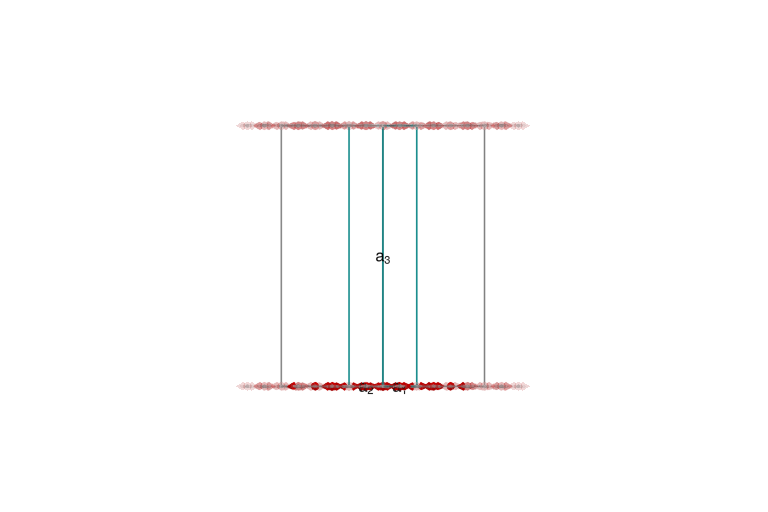
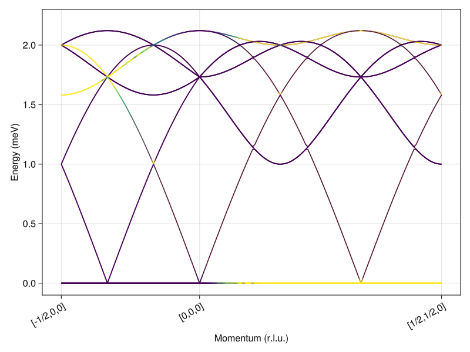

# Kagome Antiferromagnet

- Sunny port of the SpinW [tutorial](https://spinw.org/tutorials/08tutorial) authored by Bjorn Fak and Sandor Toth,
- Author: Harry Lane
- Goal: Calculate the linear spin wave theory spectrum for the ``\sqrt{3} \times \sqrt{3}``
order of a Kagome antiferromagnet.

Load Packages

````julia
using Sunny, GLMakie
````

Build a `Crystal` with ``P\overline{3}`` space group and Cr⁺ ions
on each site.

````julia
a = b = 6.0 # (Å)
c = 40.0
latvecs = lattice_vectors(a, b, c, 90, 90, 120)
crystal = Crystal(latvecs, [[1/2,0,0]], 147; types=["Cr"])
````

````
Crystal
HM symbol 'P -3' (147)
Lattice params a=6, b=6, c=40, α=90°, β=90°, γ=120°
Cell volume 1247
Type 'Cr':
   1. [1/2, 0, 0]
   2. [0, 1/2, 0]
   3. [1/2, 1/2, 0]

````

Build a `System` with antiferrogmanetic nearest neighbor exchange
``J=1``.

````julia
S = 1
sys = System(crystal, (3,3,1), [SpinInfo(1; S, g=2)], :dipole)
J = 1.0
set_exchange!(sys, J, Bond(2,3,[0,0,0]))
````

Initialize to the known magnetic structure, which is 120° order.

````julia
q = -[1/3, 1/3, 0]
axis = [0,0,1]
set_spiral_order_on_sublattice!(sys, 1; q, axis, S0=[cos(0),sin(0),0])
set_spiral_order_on_sublattice!(sys, 2; q, axis, S0=[cos(0),sin(0),0])
set_spiral_order_on_sublattice!(sys, 3; q, axis, S0=[cos(2π/3),sin(2π/3),0])
plot_spins(sys; ghost_radius=30, orthographic=true)
````


Check energy. Each site participates in 4 bonds with energy ``JS^2\cos(2π/3)``.
Factor of 1/2 avoids double counting.

````julia
@assert energy_per_site(sys) ≈ (4/2)*J*S^2*cos(2π/3)
````

Define a path in reciprocal space.

````julia
points_rlu = [[-1/2, 0, 0], [0, 0, 0], [1/2, 1/2, 0]]
density = 100
path, xticks = reciprocal_space_path(crystal, points_rlu, density);
````

Calculate discrete intensities

````julia
swt = SpinWaveTheory(sys)
formula = intensity_formula(swt, :perp; kernel=delta_function_kernel)
disp, intensity = intensities_bands(swt, path, formula);
````

Plot over a restricted color range from [0,1e-2]. Note that the intensities of
the flat band at zero-energy are divergent.

````julia
fig = Figure()
ax = Axis(fig[1,1]; xlabel="Momentum (r.l.u.)", ylabel="Energy (meV)", xticks, xticklabelrotation=π/6)
ylims!(ax, -1e-1, 2.3)
for i in axes(disp)[2]
    lines!(ax, 1:length(disp[:,i]), disp[:,i]; color=intensity[:,i], colorrange=(0,1e-2))
end
fig
````


---

*This page was generated using [Literate.jl](https://github.com/fredrikekre/Literate.jl).*

