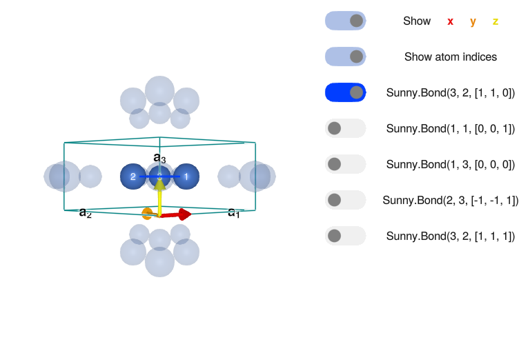
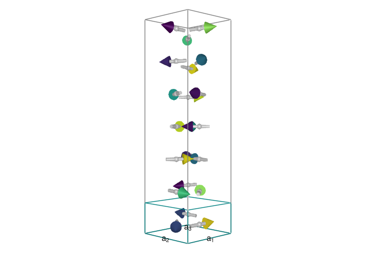
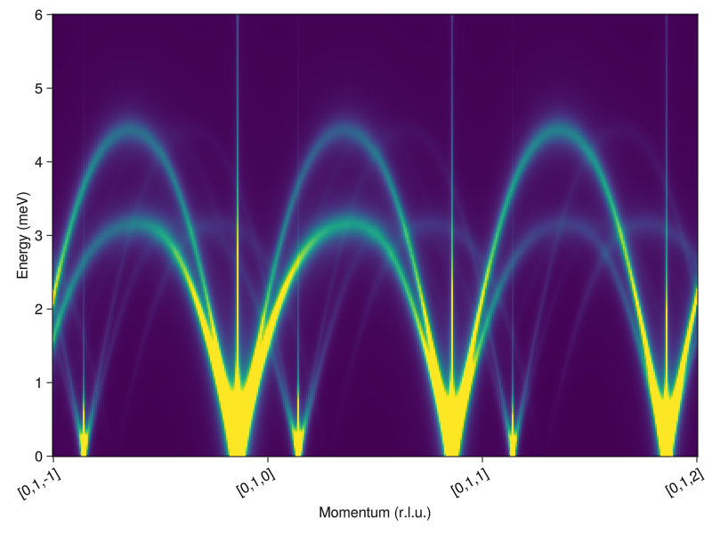

# Ba<sub>3</sub>NbFe<sub>3</sub>Si<sub>2</sub>O<sub>14</sub>

- Sunny port of the SpinW tutorial authored by Toth et al.,
https://spinw.org/tutorials/15tutorial.
- Authors: Harry Lane
- Goal: Calculate the linear spin wave theory spectrum for
  Ba<sub>3</sub>NbFe<sub>3</sub>Si<sub>2</sub>O<sub>14</sub>.

Load Packages

````julia
using Sunny, GLMakie
````

Build a `Crystal` for
Ba<sub>3</sub>NbFe<sub>3</sub>Si<sub>2</sub>O<sub>14</sub> using the crystal
structure from [Marty et al., Phys. Rev. Lett. **101**, 247201
(2008)](http://dx.doi.org/10.1103/PhysRevLett.101.247201).

````julia
a = b = 8.539 # (Å)
c = 5.2414
latvecs = lattice_vectors(a, b, c, 90, 90, 120)
types = ["Fe","Nb","Ba","Si","O","O","O"]
positions = [[0.24964,0,0.5],[0,0,0],[0.56598,0,0],[2/3,1/3,0.5220],[2/3,1/3,0.2162],[0.5259,0.7024,0.3536],[0.7840,0.9002,0.7760]]
langasite = Crystal(latvecs, positions, 150; types)
crystal = subcrystal(langasite, "Fe")
view_crystal(crystal, 7)
````


Create a `System` with a lattice size of $(1,1,7)$. The magnetic
structure of Ba<sub>3</sub>NbFe<sub>3</sub>Si<sub>2</sub>O<sub>14</sub> was
determined to have the ordering wavevector $𝐐=(0,0,1/7)$ and hence the
magnetic unit cell has 7 sites. By passing an explicit `seed`, the system's
random number generator will give repeatable results.

````julia
latsize = (1,1,7)
S = 5/2
seed = 5
sys = System(crystal, latsize, [SpinInfo(1; S, g=2)], :dipole; seed)
````

````
System [Dipole mode]
Lattice: (1, 1, 7)×3

````

Set exchange interactions as parametrized in [Loire et al., Phys. Rev. Lett.
**106**, 207201 (2011)](http://dx.doi.org/10.1103/PhysRevLett.106.207201)

````julia
J₁ = 0.85
J₂ = 0.24
J₃ = 0.053
J₄ = 0.017
J₅ = 0.24
set_exchange!(sys, J₁, Bond(3, 2, [1,1,0]))
set_exchange!(sys, J₄, Bond(1, 1, [0,0,1]))
set_exchange!(sys, J₂, Bond(1, 3, [0,0,0]))
````

The final two exchanges define the chirality of the magnetic structure. The
crystal chirality, $\epsilon_T$, the chirality of each triangle, $ϵ_D$ and the
sense of rotation of the spin helices along $c$, $ϵ_{H}$. The three
chiralities are related by $ϵ_T=ϵ_D ϵ_H$. We now assign $J_3$ and $J_5$
according to the crystal chirality.

````julia
ϵD = -1
ϵH = +1
ϵT = ϵD * ϵH

if ϵT == -1
    set_exchange!(sys, J₃, Bond(2, 3, [-1,-1,1]))
    set_exchange!(sys, J₅, Bond(3, 2, [1,1,1]))
elseif ϵT == 1
    set_exchange!(sys, J₅, Bond(2, 3, [-1,-1,1]))
    set_exchange!(sys, J₃, Bond(3, 2, [1,1,1]))
else
    throw("Provide a valid chirality")
end
````

Whilst Sunny provides tools to optimize the ground state automatically, in
this case we already know the model ground state. Set the spiral magnetic
order using `set_spiral_order_on_sublattice!`. It takes an ordering
wavevector `q`, an axis of rotation for the spins `axis`, and the initial spin
`S0` for each sublattice.

````julia
q = [0, 0, 1/7]
axis = [0,0,1]
set_spiral_order_on_sublattice!(sys, 1; q, axis, S0=[1, 0, 0])
set_spiral_order_on_sublattice!(sys, 2; q, axis, S0=[-1/2, -sqrt(3)/2, 0])
set_spiral_order_on_sublattice!(sys, 3; q, axis, S0=[-1/2, +sqrt(3)/2, 0])

plot_spins(sys; color=[s[1] for s in sys.dipoles])
````


Define a path in reciprocal space, $[0,1,-1+\xi]$ for $\xi = 0 \dots 3$.

````julia
points_rlu = [[0,1,-1],[0,1,-1+1],[0,1,-1+2],[0,1,-1+3]];
density = 100
path, xticks = reciprocal_space_path(crystal, points_rlu, density);
````

Calculate broadened intensities

````julia
swt = SpinWaveTheory(sys)
γ = 0.15 # width in meV
broadened_formula = intensity_formula(swt, :perp; kernel=lorentzian(γ))
energies = collect(0:0.01:6)  # 0 < ω < 6 (meV).
is = intensities_broadened(swt, path, energies, broadened_formula)
````

````
361×601 Matrix{Float64}:
    0.0556414      0.0562442      0.0568568      0.0574797      0.0581129      0.0587568      0.0594116      0.0600777      0.0607553      0.0614447      0.0621462      0.0628601      0.0635868      0.0643264     0.0650794     0.0658461     0.0666268     0.0674219     0.0682317     0.0690566     0.069897      0.0707532     0.0716258     0.072515      0.0734214     0.0743454     0.0752874     0.076248      0.0772275     0.0782267     0.0792459     0.0802858     0.0813468     0.0824297     0.0835349     0.0846632     0.0858153     0.0869917     0.0881932     0.0894206     0.0906745     0.0919559     0.0932655     0.0946041     0.0959727     0.0973722     0.0988036     0.100268      0.101766     0.103299     0.104868     0.106474     0.108119     0.109804     0.11153      0.113298     0.11511      0.116968     0.118872     0.120825     0.122829     0.124884    0.126994    0.12916     0.131383    0.133667    0.136014    0.138425    0.140903    0.143452    0.146073    0.148769    0.151544    0.154401    0.157343    0.160373    0.163495    0.166714    0.170033    0.173456    0.176988    0.180635    0.1844      0.18829     0.192309    0.196465    0.200764    0.205212    0.209816    0.214584    0.219525    0.224647    0.229958    0.23547     0.241191    0.247135    0.253311    0.259733    0.266415    0.27337     0.280615    0.288166    0.296041    0.304259    0.312841    0.321809    0.331186    0.340999    0.351276    0.362046    0.373341    0.385198    0.397654    0.41075     0.424531    0.439046    0.454348    0.470495    0.48755     0.505581    0.524664    0.544881    0.566321    0.589083    0.613276    0.639016    0.666434    0.695673    0.726889    0.760253    0.795954    0.834199    0.875214    0.919245    0.966564    1.01746     1.07226     1.1313      1.19494     1.26357     1.33759     1.41742     1.50347     1.59612     1.69574     1.80261     1.9169      2.03864     2.16761     2.30332     2.44486     2.59089     2.73947     2.88808     3.03353     3.17207     3.29948     3.41135     3.5034      3.57186     3.61393     3.62808     3.61426     3.57391     3.50978     3.42562     3.32575     3.21467     3.09672     2.97582     2.85531     2.73791     2.6257      2.52022     2.42254     2.33333     2.25297     2.18161     2.11925     2.0658      2.0211      1.98497     1.95722     1.93769     1.92624     1.9228      1.92731     1.93978     1.96028     1.98894     2.02594     2.07154     2.12605     2.18983     2.26331     2.34696     2.4413     2.54686    2.66418    2.79377    2.93608    3.0914     3.25986    3.44127    3.63505    3.84007    4.05452    4.27574    4.50013    4.72301    4.93868    5.14048    5.32113    5.47318    5.58959    5.66444    5.69361    5.67522    5.60992    5.5008     5.35298    5.17299    4.96817    4.74589    4.51311    4.27597    4.0396     3.80807    3.5844     3.37076    3.1685     2.97841    2.80077    2.63554    2.48242    2.34094    2.21053    2.09058    1.98044    1.87949    1.78709    1.70268    1.62571    1.55568    1.49212    1.43463    1.38283    1.33636    1.29492    1.2582     1.22594    1.19784   1.17364   1.15302   1.13565   1.12114   1.10902   1.09879   1.08983   1.08146   1.07295   1.06356   1.05254   1.03928   1.02326   1.00419   0.981983  0.956768  0.928879  0.898792  0.867074  0.834321  0.801104  0.767942  0.735268  0.703428  0.672681  0.643205  0.61511   0.588453  0.563245  0.539466  0.517075  0.496013  0.476213  0.457603  0.44011   0.423659  0.408181  0.393605  0.379868  0.366909  0.354672  0.343105  0.332159  0.32179   0.311956  0.302621  0.293749  0.285308  0.277271  0.269609  0.262299  0.255317  0.248643  0.242257  0.236143  0.230283  0.224663  0.219268  0.214086  0.209105  0.204314  0.199702  0.19526   0.190979  0.186851  0.182867  0.179022  0.175307  0.171716  0.168244  0.164886  0.161635  0.158487  0.155437  0.152481  0.149615  0.146835  0.144138  0.141519  0.138976  0.136506  0.134105  0.131771  0.129502  0.127294  0.125145  0.123054  0.121018  0.119035  0.117103  0.11522   0.113385  0.111596   0.10985    0.108148   0.106487   0.104866   0.103283   0.101737   0.100228   0.0987535  0.0973127  0.0959047  0.0945283  0.0931826  0.0918667  0.0905796  0.0893205  0.0880885  0.0868828  0.0857027  0.0845474  0.0834161  0.0823083  0.0812232  0.0801602  0.0791186  0.0780979  0.0770976  0.0761169  0.0751555  0.0742128  0.0732883  0.0723815  0.071492   0.0706192  0.0697629  0.0689225  0.0680976  0.0672879  0.066493   0.0657124  0.064946   0.0641932  0.0634538  0.0627274  0.0620138  0.0613126  0.0606236  0.0599464  0.0592808  0.0586264  0.0579831  0.0573506  0.0567287  0.056117   0.0555155  0.0549237  0.0543416  0.0537689  0.0532055  0.052651   0.0521053  0.0515683  0.0510397  0.0505194  0.0500071  0.0495028  0.0490062  0.0485172  0.0480356  0.0475613  0.0470941  0.046634   0.0461806  0.045734   0.0452939  0.0448603  0.044433   0.0440118  0.0435968  0.0431877  0.0427844  0.0423868  0.0419949  0.0416084  0.0412274  0.0408517  0.0404811  0.0401157  0.0397552  0.0393997  0.039049   0.0387031  0.0383618  0.038025   0.0376928  0.0373649  0.0370414  0.0367221  0.036407   0.0360959  0.035789   0.0354859  0.0351868  0.0348915  0.0345999  0.034312   0.0340278  0.0337471  0.0334699  0.0331962  0.0329258  0.0326588  0.0323951  0.0321346  0.0318772  0.031623   0.0313719  0.0311237  0.0308786  0.0306363  0.030397   0.0301604  0.0299267  0.0296957  0.0294673  0.0292417  0.0290186  0.0287981  0.0285802  0.0283647  0.0281517  0.0279412  0.0277329  0.0275271  0.0273235  0.0271223  0.0269232  0.0267264  0.0265318  0.0263392  0.0261488  0.0259605  0.0257742  0.02559    0.0254077  0.0252274  0.025049   0.0248726  0.024698   0.0245252  0.0243543  0.0241852  0.0240178  0.0238522  0.0236883  0.0235262  0.0233657  0.0232068  0.0230496  0.022894   0.0227399  0.0225875  0.0224365  0.0222871  0.0221392  0.0219928  0.0218478  0.0217043  0.0215622  0.0214215  0.0212822  0.0211443  0.0210077  0.0208724  0.0207384  0.0206058  0.0204744  0.0203443  0.0202154  0.0200878  0.0199614  0.0198361  0.0197121  0.0195892  0.0194675  0.0193469  0.0192275  0.0191091  0.0189919  0.0188757  0.0187606  0.0186466  0.0185336  0.0184216  0.0183107  0.0182008  0.0180918  0.0179839  0.0178769  0.0177709  0.0176658  0.0175617  0.0174584  0.0173561  0.0172547  0.0171542  0.0170546  0.0169558  0.0168579  0.0167609  0.0166647  0.0165693  0.0164748  0.016381   0.0162881  0.0161959  0.0161046  0.016014   0.0159242  0.0158351  0.0157468  0.0156593  0.0155724  0.0154863  0.0154009  0.0153163  0.0152323  0.015149   0.0150664  0.0149845  0.0149032  0.0148226  0.0147427  0.0146634  0.0145847  0.0145067  0.0144294  0.0143526  0.0142764  0.0142009  0.014126   0.0140516  0.0139779  0.0139047  0.0138321  0.0137601  0.0136886  0.0136177  0.0135474  0.0134776  0.0134083  0.0133396  0.0132714  0.0132037  0.0131365  0.0130699  0.0130038
    0.0522806      0.0529838      0.0536987      0.0544221      0.0551501      0.055878       0.0566005      0.057312       0.0580069      0.0586805      0.0593289      0.0599501      0.0605434      0.0611104     0.0616543     0.0621796     0.0626917     0.0631965     0.0637001     0.064208      0.0647251     0.0652557     0.0658032     0.0663703     0.066959      0.0675708     0.0682065     0.0688669     0.0695522     0.0702627     0.0709982     0.0717589     0.0725445     0.0733551     0.0741904     0.0750506     0.0759356     0.0768454     0.0777802     0.07874       0.0797251     0.0807357     0.0817721     0.0828347     0.0839239     0.0850401     0.0861838     0.0873555     0.0885559    0.0897856    0.0910453    0.0923357    0.0936576    0.0950118    0.0963992    0.0978208    0.0992774    0.10077      0.1023       0.103868     0.105476     0.107125    0.108816    0.11055     0.112329    0.114154    0.116028    0.117951    0.119926    0.121954    0.124038    0.126178    0.128378    0.130639    0.132965    0.135357    0.137817    0.14035     0.142957    0.145642    0.148407    0.151257    0.154194    0.157222    0.160346    0.163569    0.166896    0.170331    0.173879    0.177547    0.181338    0.185258    0.189315    0.193514    0.197863    0.202369    0.207039    0.211883    0.216909    0.222126    0.227545    0.233177    0.239033    0.245125    0.251468    0.258075    0.264961    0.272143    0.27964     0.287468    0.29565     0.304207    0.313164    0.322545    0.332379    0.342695    0.353527    0.36491     0.376882    0.389486    0.402765    0.416771    0.431556    0.44718     0.463705    0.481203    0.499748    0.519424    0.54032     0.562536    0.586178    0.611363    0.638215    0.66687     0.697474    0.730183    0.765161    0.802581    0.842624    0.885473    0.931312    0.980323    1.03268     1.08853     1.14803     1.21128     1.27837     1.34937     1.42433     1.5033      1.58632     1.6735      1.76493     1.86079     1.96122     2.06635     2.17618     2.29052     2.40888     2.53033     2.65343     2.77616     2.8959      3.00944     3.11316     3.20323     3.27591     3.32797     3.35698     3.36167     3.34209     3.29959     3.23669     3.15673     3.06358     2.96123     2.85351     2.74385     2.63519     2.5299      2.42979     2.33621     2.25008     2.17197     2.10221     2.04093     1.98812     1.9437      1.90749     1.87934     1.85903     1.84637     1.84116     1.8432      1.85227     1.86818     1.89068    1.91951    1.95438    1.99499    2.041      2.09212    2.14807    2.2087     2.27398    2.34407    2.41936    2.50041    2.58801    2.68305    2.78651    2.89933    3.02234    3.15616    3.30107    3.45696    3.62315    3.7983     3.98028    4.16606    4.35165    4.53211    4.70163    4.85382    4.98208    5.08017    5.14275    5.16605    5.14825    5.08978    4.99319    4.86286    4.7045     4.52451    4.3294     4.12534    3.91778    3.71132    3.5096     3.31538    3.1306     2.95655    2.79396    2.64311    2.50401    2.37641    2.25987    2.15389    2.05783    1.97102    1.89274    1.82221   1.7586    1.70103   1.64858   1.60027   1.55512   1.51215   1.47043   1.42916   1.38766   1.34547   1.30234   1.25821   1.21323   1.16765   1.12184   1.07618   1.03106   0.986823  0.943759  0.902108  0.862046  0.823697  0.787135  0.752396  0.719477  0.688352  0.658972  0.631271  0.605175  0.580601  0.557463  0.535675  0.515151  0.495808  0.477567  0.460352  0.444092  0.428722  0.414178  0.400405  0.387349  0.374961  0.363195  0.352011  0.341369  0.331234  0.321574  0.312358  0.303559  0.295151  0.28711   0.279414  0.272043  0.264979  0.258203  0.251699  0.245453  0.239451  0.233679  0.228125  0.222778  0.217627  0.212662  0.207875  0.203256  0.198798  0.194492  0.190331  0.186309  0.182419  0.178656  0.175014  0.171487  0.16807   0.164759  0.161549  0.158436  0.155417  0.152486  0.149641  0.146878  0.144193  0.141585  0.13905   0.136584  0.134186  0.131853  0.129583  0.127373  0.12522   0.123124  0.121082  0.119092   0.117153   0.115261   0.113417   0.111618   0.109863   0.108151   0.106479   0.104847   0.103253   0.101697   0.100176   0.0986901  0.0972381  0.0958189  0.0944313  0.0930745  0.0917475  0.0904494  0.0891795  0.0879368  0.0867205  0.08553    0.0843644  0.0832231  0.0821054  0.0810106  0.0799381  0.0788873  0.0778575  0.0768482  0.0758589  0.074889   0.073938   0.0730054  0.0720908  0.0711936  0.0703134  0.0694497  0.0686023  0.0677706  0.0669542  0.0661528  0.065366   0.0645934  0.0638347  0.0630896  0.0623577  0.0616387  0.0609323  0.0602382  0.0595562  0.0588858  0.058227   0.0575793  0.0569426  0.0563165  0.0557009  0.0550956  0.0545002  0.0539146  0.0533385  0.0527718  0.0522142  0.0516656  0.0511257  0.0505944  0.0500714  0.0495566  0.0490499  0.048551   0.0480598  0.0475761  0.0470999  0.0466308  0.0461688  0.0457138  0.0452655  0.0448239  0.0443889  0.0439602  0.0435378  0.0431216  0.0427113  0.042307   0.0419085  0.0415157  0.0411284  0.0407466  0.0403702  0.039999   0.039633   0.039272   0.0389161  0.038565   0.0382187  0.0378771  0.0375401  0.0372077  0.0368797  0.0365561  0.0362367  0.0359216  0.0356107  0.0353038  0.0350009  0.0347019  0.0344068  0.0341155  0.0338279  0.033544   0.0332636  0.0329869  0.0327135  0.0324437  0.0321771  0.0319139  0.031654   0.0313972  0.0311436  0.030893   0.0306456  0.0304011  0.0301595  0.0299209  0.0296851  0.0294521  0.0292219  0.0289943  0.0287695  0.0285473  0.0283277  0.0281106  0.0278961  0.027684   0.0274743  0.0272671  0.0270622  0.0268596  0.0266593  0.0264612  0.0262654  0.0260718  0.0258803  0.025691   0.0255037  0.0253185  0.0251353  0.0249541  0.0247749  0.0245976  0.0244223  0.0242488  0.0240772  0.0239074  0.0237394  0.0235732  0.0234088  0.0232461  0.023085   0.0229257  0.022768   0.022612   0.0224576  0.0223047  0.0221535  0.0220037  0.0218555  0.0217088  0.0215636  0.0214199  0.0212776  0.0211367  0.0209972  0.0208591  0.0207224  0.020587   0.020453   0.0203203  0.0201888  0.0200587  0.0199298  0.0198022  0.0196758  0.0195506  0.0194266  0.0193038  0.0191821  0.0190616  0.0189423  0.0188241  0.018707   0.018591   0.018476   0.0183622  0.0182494  0.0181376  0.0180269  0.0179172  0.0178085  0.0177008  0.017594   0.0174883  0.0173835  0.0172796  0.0171767  0.0170747  0.0169736  0.0168734  0.0167741  0.0166757  0.0165781  0.0164814  0.0163856  0.0162906  0.0161964  0.016103   0.0160105  0.0159187  0.0158278  0.0157376  0.0156482  0.0155596  0.0154717  0.0153846  0.0152982  0.0152125  0.0151275  0.0150433  0.0149598  0.014877   0.0147948  0.0147134  0.0146326  0.0145525  0.014473   0.0143942  0.014316   0.0142385  0.0141616  0.0140854  0.0140097  0.0139347  0.0138603  0.0137864  0.0137132  0.0136405  0.0135685  0.0134969  0.013426   0.0133556  0.0132858  0.0132165  0.0131478  0.0130796  0.013012   0.0129448
    0.0474922      0.0481366      0.0488036      0.0494944      0.0502099      0.0509511      0.0517188      0.0525133      0.0533344      0.0541812      0.055052       0.0559439      0.0568529      0.0577734     0.0586983     0.0596192     0.0605268     0.0614109     0.0622616     0.0630699     0.0638287     0.0645332     0.0651814     0.0657745     0.0663161     0.066812      0.0672699     0.0676983     0.068106      0.0685022     0.0688955     0.0692938     0.0697042     0.070133      0.0705852     0.0710648     0.0715748     0.0721176     0.0726944     0.0733063     0.0739536     0.0746364     0.0753546     0.076108      0.076896      0.0777184     0.0785748     0.0794649     0.0803883    0.0813449    0.0823346    0.0833574    0.0844132    0.0855022    0.0866247    0.087781     0.0889714    0.0901964    0.0914566    0.0927525    0.094085     0.0954547   0.0968626   0.0983096   0.0997966   0.101325    0.102895    0.104509    0.106168    0.107874    0.109627    0.111429    0.113283    0.11519     0.117151    0.119169    0.121246    0.123385    0.125587    0.127854    0.130191    0.132599    0.135081    0.137641    0.140282    0.143008    0.145821    0.148727    0.151729    0.154832    0.158041    0.16136     0.164795    0.168353    0.172038    0.175858    0.179819    0.183929    0.188197    0.19263     0.197238    0.20203     0.207018    0.212213    0.217628    0.223274    0.229168    0.235324    0.241759    0.248491    0.25554     0.262927    0.270676    0.27881     0.287359    0.29635     0.305816    0.315792    0.326315    0.337426    0.349168    0.361589    0.374739    0.38867     0.40344     0.419107    0.435731    0.453372    0.47209     0.491939    0.512966    0.535209    0.558687    0.583398    0.60931     0.636358    0.664434    0.693388    0.723028    0.753127    0.783442    0.813733    0.843795    0.873493    0.902792    0.93178     0.960676    0.989828    1.01969     1.05081     1.08377     1.11917     1.15762     1.19971     1.246       1.297       1.35322     1.41511     1.48308     1.55752     1.63872     1.72692     1.82222     1.92457     2.03372     2.14911     2.26985     2.39461     2.52157     2.64839     2.77218     2.88958     2.99695     3.09051     3.16678     3.2228      3.25656     3.26721     3.25517     3.22206     3.17056     3.104       3.02607     2.94045     2.8505      2.75912     2.66861     2.58064     2.49629     2.41615     2.34037     2.26887     2.20136     2.13753     2.07712     2.01997     1.96608    1.91556    1.86866    1.82571    1.78706    1.75306    1.72405    1.70032    1.68211    1.66964    1.66307    1.66257    1.66829    1.68038    1.69901    1.72439    1.75672    1.79629    1.84338    1.89835    1.96157    2.03346    2.11447    2.20507    2.30571    2.41684    2.53882    2.67191    2.8162     2.97153    3.13738    3.31278    3.49615    3.68524    3.87696    4.06735    4.25158    4.42407    4.57876    4.70948    4.8105     4.87709    4.90605    4.89611    4.84811    4.76484    4.65076    4.51142    4.35289    4.18121    4.00196    3.81994    3.63901    3.46208    3.29113    3.12734   2.97122   2.82277   2.68169   2.54747   2.41954   2.29741   2.18065   2.06901   1.96234   1.86059   1.76375   1.67185   1.58489   1.50283   1.42557   1.35297   1.28484   1.22094   1.16102   1.10482   1.05207   1.00253   0.955948  0.91213   0.870882  0.832039  0.795449  0.760978  0.728501  0.697899  0.669061  0.641881  0.616256  0.592088  0.569285  0.547757  0.527421  0.508197  0.490011  0.472794  0.456482  0.441014  0.426335  0.412393  0.399141  0.386533  0.374529  0.363092  0.352185  0.341777  0.331837  0.322338  0.313253  0.304559  0.296233  0.288254  0.280604  0.273263  0.266216  0.259446  0.252939  0.246682  0.240661  0.234864  0.229281  0.223901  0.218713  0.213709  0.20888   0.204218  0.199715  0.195363  0.191156  0.187088  0.183152  0.179342  0.175654  0.172081  0.168619  0.165263  0.16201   0.158854  0.155792  0.15282   0.149935  0.147133  0.14441   0.141765  0.139193  0.136693  0.134261  0.131895  0.129593   0.127352   0.12517    0.123045   0.120975   0.118958   0.116992   0.115076   0.113207   0.111385   0.109608   0.107874   0.106181   0.104529   0.102916   0.101341   0.0998027  0.0983     0.0968316  0.0953967  0.0939941  0.0926229  0.0912821  0.0899708  0.0886882  0.0874334  0.0862056  0.085004   0.0838279  0.0826765  0.0815492  0.0804452  0.0793639  0.0783047  0.0772671  0.0762502  0.0752538  0.0742771  0.0733196  0.072381   0.0714605  0.0705579  0.0696725  0.068804   0.067952   0.0671159  0.0662955  0.0654903  0.0646999  0.0639241  0.0631623  0.0624143  0.0616797  0.0609583  0.0602496  0.0595535  0.0588695  0.0581975  0.0575371  0.056888   0.0562501  0.055623   0.0550065  0.0544003  0.0538043  0.0532182  0.0526417  0.0520747  0.051517   0.0509683  0.0504284  0.0498973  0.0493746  0.0488602  0.0483539  0.0478555  0.0473649  0.046882   0.0464065  0.0459383  0.0454772  0.0450232  0.044576   0.0441355  0.0437016  0.0432742  0.0428531  0.0424382  0.0420294  0.0416265  0.0412295  0.0408382  0.0404525  0.0400723  0.0396976  0.0393281  0.0389638  0.0386047  0.0382505  0.0379013  0.0375568  0.0372172  0.0368821  0.0365516  0.0362256  0.035904   0.0355867  0.0352736  0.0349647  0.0346599  0.0343591  0.0340622  0.0337692  0.0334801  0.0331946  0.0329129  0.0326347  0.0323601  0.032089   0.0318213  0.031557   0.0312961  0.0310383  0.0307838  0.0305324  0.0302842  0.0300389  0.0297967  0.0295574  0.029321   0.0290875  0.0288568  0.0286288  0.0284036  0.028181   0.0279611  0.0277438  0.027529   0.0273167  0.0271069  0.0268995  0.0266945  0.0264919  0.0262915  0.0260935  0.0258977  0.0257042  0.0255128  0.0253236  0.0251365  0.0249514  0.0247685  0.0245875  0.0244086  0.0242316  0.0240565  0.0238834  0.0237121  0.0235427  0.0233751  0.0232093  0.0230453  0.022883   0.0227224  0.0225636  0.0224064  0.0222509  0.022097   0.0219447  0.0217939  0.0216448  0.0214972  0.0213511  0.0212065  0.0210633  0.0209217  0.0207814  0.0206426  0.0205052  0.0203691  0.0202345  0.0201011  0.0199691  0.0198384  0.019709   0.0195808  0.0194539  0.0193283  0.0192038  0.0190806  0.0189586  0.0188377  0.018718   0.0185994  0.018482   0.0183657  0.0182505  0.0181364  0.0180233  0.0179114  0.0178004  0.0176905  0.0175816  0.0174738  0.0173669  0.017261   0.0171561  0.0170521  0.0169491  0.0168471  0.0167459  0.0166457  0.0165464  0.0164479  0.0163504  0.0162537  0.0161579  0.0160629  0.0159688  0.0158754  0.015783   0.0156913  0.0156004  0.0155103  0.0154211  0.0153325  0.0152448  0.0151578  0.0150715  0.014986   0.0149012  0.0148172  0.0147338  0.0146512  0.0145692  0.014488   0.0144074  0.0143275  0.0142483  0.0141697  0.0140918  0.0140145  0.0139378  0.0138618  0.0137864  0.0137117  0.0136375  0.013564   0.013491   0.0134186  0.0133468  0.0132756  0.013205   0.0131349  0.0130654  0.0129965  0.0129281
    0.0434753      0.0440163      0.0445734      0.0451477      0.0457403      0.0463523      0.0469852      0.0476401      0.0483186      0.0490223      0.0497528      0.0505117      0.0513008      0.0521216     0.0529757     0.0538645     0.0547888     0.0557493     0.0567456     0.0577766     0.0588398     0.0599313     0.0610452     0.0621738     0.0633072     0.0644337     0.0655402     0.0666127     0.0676377     0.0686031     0.0694997     0.0703216     0.0710674     0.0717395     0.0723437     0.0728883     0.0733829     0.0738375     0.0742619     0.0746651     0.0750555     0.0754409     0.0758286     0.0762257     0.076639      0.0770747     0.0775386     0.0780358     0.0785704    0.0791458    0.0797646    0.0804286    0.081139     0.0818964    0.0827011    0.0835532    0.0844526    0.085399     0.0863922    0.087432     0.0885183    0.089651    0.0908301   0.092056    0.0933288   0.0946491   0.0960174   0.0974345   0.0989012   0.100419    0.101988    0.10361     0.105287    0.107021    0.108812    0.110663    0.112576    0.114554    0.116599    0.118713    0.120899    0.123161    0.125502    0.127926    0.130435    0.133035    0.13573     0.138525    0.141424    0.144434    0.147561    0.15081     0.154189    0.157706    0.161368    0.165184    0.169164    0.173319    0.177659    0.182196    0.186945    0.191919    0.197133    0.202606    0.208356    0.214402    0.220767    0.227475    0.234552    0.242026    0.249929    0.258292    0.267151    0.276544    0.286512    0.297096    0.308339    0.320285    0.332976    0.346454    0.360752    0.375896    0.391901    0.408762    0.426448    0.4449      0.464017    0.483654    0.503612    0.523642    0.543447    0.562693    0.581032    0.59813     0.613701    0.627543    0.639565    0.649806    0.658432    0.665728    0.672062    0.677857    0.683556    0.689592    0.696367    0.704243    0.713536    0.724518    0.737423    0.752456    0.769799    0.789623    0.812095    0.837381    0.865657    0.897111    0.931948    0.970393    1.01269     1.05911     1.10995     1.16553     1.22618     1.29225     1.36411     1.44212     1.52661     1.61789     1.71618     1.82159     1.93408     2.05337     2.17889     2.30969     2.44437     2.58097     2.71697     2.84926     2.97421     3.0878      3.18588     3.26448     3.3202      3.35056     3.35428     3.33148     3.28365     3.21344     3.12442     3.02064     2.90629     2.7854      2.66156     2.53783     2.41668     2.29999     2.18912    2.085      1.98815    1.89886    1.81718    1.74301    1.67615    1.61635    1.56332    1.51675    1.47634    1.44181    1.4129     1.38939    1.37107    1.35778    1.3494     1.34583    1.34701    1.35295    1.36364    1.37915    1.39959    1.42508    1.45581    1.492      1.5339     1.58182    1.63611    1.69715    1.76538    1.84127    1.92531    2.01803    2.11994    2.23157    2.35338    2.48575    2.62894    2.78298    2.94763    3.12224    3.30564    3.49603    3.69085    3.88667    4.07915    4.2631     4.43263    4.58143    4.70325    4.79242    4.84444    4.8565     4.82776    4.75952   4.65503   4.51906   4.35742   4.17635   3.98204   3.7802    3.57579   3.37292   3.1748    2.98382   2.80161   2.62919   2.4671    2.31548   2.17422   2.04297   1.92127   1.80856   1.70425   1.6077    1.5183    1.43544   1.35854   1.28708   1.22057   1.15856   1.10067   1.04656   0.995925  0.948502  0.904058  0.862385  0.823293  0.786605  0.752159  0.719803  0.689394  0.660799  0.633891  0.608554  0.584677  0.56216   0.540907  0.520831  0.50185   0.483889  0.46688   0.450757  0.435462  0.420941  0.407142  0.39402   0.38153   0.369635  0.358296  0.347479  0.337154  0.327291  0.317862  0.308844  0.300211  0.291943  0.284018  0.276419  0.269128  0.262127  0.255402  0.248939  0.242723  0.236743  0.230986  0.225441  0.220099  0.214948  0.209981  0.205187  0.20056   0.196092  0.191774  0.187601  0.183566  0.179664  0.175887  0.172231  0.16869   0.16526   0.161937  0.158714  0.15559   0.152559  0.149618  0.146763  0.143991   0.141299   0.138683   0.136141   0.13367    0.131267   0.12893    0.126656   0.124443   0.122289   0.120192   0.11815    0.11616    0.114221   0.112332   0.11049    0.108694   0.106943   0.105234   0.103567   0.101941   0.100353   0.0988025  0.0972886  0.0958101  0.0943657  0.0929544  0.0915753  0.0902273  0.0889094  0.0876209  0.0863607  0.0851281  0.0839223  0.0827424  0.0815877  0.0804576  0.0793512  0.078268   0.0772073  0.0761684  0.0751507  0.0741537  0.0731769  0.0722195  0.0712812  0.0703615  0.0694597  0.0685755  0.0677084  0.066858   0.0660238  0.0652054  0.0644024  0.0636144  0.0628411  0.0620821  0.0613369  0.0606054  0.059887   0.0591816  0.0584889  0.0578084  0.0571399  0.0564832  0.0558379  0.0552039  0.0545807  0.0539682  0.0533661  0.0527743  0.0521923  0.0516202  0.0510575  0.0505041  0.0499598  0.0494245  0.0488978  0.0483796  0.0478698  0.0473681  0.0468743  0.0463884  0.0459101  0.0454393  0.0449758  0.0445194  0.0440701  0.0436277  0.0431919  0.0427628  0.0423401  0.0419238  0.0415136  0.0411096  0.0407115  0.0403192  0.0399327  0.0395517  0.0391763  0.0388062  0.0384415  0.0380819  0.0377275  0.037378   0.0370334  0.0366937  0.0363586  0.0360282  0.0357023  0.0353809  0.0350639  0.0347512  0.0344426  0.0341383  0.033838   0.0335417  0.0332493  0.0329607  0.032676   0.032395   0.0321176  0.0318438  0.0315736  0.0313068  0.0310434  0.0307834  0.0305267  0.0302732  0.0300229  0.0297757  0.0295316  0.0292905  0.0290524  0.0288172  0.0285849  0.0283555  0.0281288  0.0279048  0.0276836  0.027465   0.027249   0.0270355  0.0268246  0.0266162  0.0264102  0.0262066  0.0260054  0.0258066  0.02561    0.0254157  0.0252236  0.0250337  0.024846   0.0246604  0.0244769  0.0242954  0.024116   0.0239386  0.0237632  0.0235896  0.0234181  0.0232483  0.0230805  0.0229145  0.0227502  0.0225878  0.0224271  0.0222681  0.0221109  0.0219553  0.0218013  0.021649   0.0214983  0.0213492  0.0212016  0.0210556  0.0209111  0.0207681  0.0206265  0.0204865  0.0203478  0.0202106  0.0200747  0.0199403  0.0198072  0.0196754  0.019545   0.0194159  0.019288   0.0191614  0.0190361  0.018912   0.0187892  0.0186675  0.018547   0.0184277  0.0183096  0.0181925  0.0180767  0.0179619  0.0178482  0.0177356  0.0176241  0.0175137  0.0174043  0.0172959  0.0171885  0.0170822  0.0169768  0.0168724  0.016769   0.0166665  0.016565   0.0164644  0.0163647  0.016266   0.0161681  0.0160711  0.015975   0.0158798  0.0157854  0.0156919  0.0155992  0.0155073  0.0154162  0.015326   0.0152365  0.0151479  0.01506    0.0149728  0.0148865  0.0148009  0.014716   0.0146318  0.0145484  0.0144657  0.0143837  0.0143024  0.0142218  0.0141419  0.0140627  0.0139841  0.0139062  0.0138289  0.0137523  0.0136764  0.013601   0.0135263  0.0134522  0.0133787  0.0133058  0.0132336  0.0131619  0.0130908  0.0130202  0.0129503
    0.0407168      0.0411942      0.0416832      0.0421846      0.042699       0.0432271      0.0437696      0.0443273      0.0449011      0.045492       0.046101       0.0467292      0.0473778      0.0480482     0.0487417     0.0494601     0.0502048     0.0509777     0.0517808     0.0526159     0.0534853     0.0543911     0.0553354     0.0563205     0.0573483     0.0584205     0.0595385     0.0607028     0.0619131     0.063168      0.0644642     0.0657967     0.067158      0.068538      0.069924      0.071301      0.072652      0.0739592     0.0752055     0.0763758     0.0774589     0.0784488     0.0793454     0.0801539     0.0808845     0.0815508     0.0821676     0.0827499     0.0833109    0.0838617    0.0844106    0.0849637    0.0855256    0.0860996    0.0866893    0.0872984    0.0879316    0.0885942    0.089292     0.0900313    0.090818     0.0916577   0.0925553   0.0935148   0.0945398   0.095633    0.0967966   0.0980324   0.099342    0.100727    0.102188    0.103727    0.105345    0.107045    0.108828    0.110696    0.112652    0.114698    0.116839    0.119078    0.121419    0.123867    0.126426    0.129103    0.131903    0.134833    0.137902    0.141117    0.144487    0.148023    0.151735    0.155635    0.159736    0.164053    0.168601    0.173398    0.178462    0.183815    0.189478    0.195476    0.201837    0.208589    0.215763    0.223394    0.231518    0.240173    0.2494      0.25924     0.269736    0.280928    0.292855    0.30555     0.319037    0.333327    0.348413    0.364263    0.38081     0.397947    0.415518    0.433312    0.451059    0.468435    0.485069    0.500567    0.514538    0.526634    0.536585    0.544231    0.54955     0.552659    0.553803    0.553329    0.551647    0.549197    0.546412    0.543692    0.541391    0.539808    0.539186    0.539719    0.54156     0.544826    0.54961     0.555986    0.56402     0.573771    0.585296    0.598656    0.613916    0.631146    0.650426    0.671839    0.695476    0.72143     0.749793    0.780656    0.814094    0.850167    0.888902    0.93029     0.974266    1.0207      1.0694      1.12009     1.17241     1.22598     1.28039     1.33525     1.39026     1.44527     1.50033     1.5557      1.61186     1.66948     1.72937     1.79238     1.85933     1.93091     2.00759     2.08956     2.17664     2.26821     2.36317     2.45984     2.55601     2.64893     2.73538     2.81189     2.87496     2.92133     2.9484      2.95442     2.93881     2.90215     2.84615     2.77339     2.68708    2.59068    2.48763    2.38111    2.27388    2.16822    2.06592    1.96829    1.87625    1.79037    1.71097    1.63814    1.57186    1.51199    1.45832    1.4106     1.36859    1.33203    1.30067    1.27429    1.25267    1.23565    1.22308    1.21483    1.21082    1.211      1.21534    1.22384    1.23655    1.25354    1.2749     1.30078    1.33133    1.36674    1.40724    1.45307    1.50449    1.56178    1.62523    1.69513    1.77175    1.85535    1.94612    2.04424    2.14977    2.26273    2.38304    2.51054    2.64495    2.78591    2.93293    3.08534    3.2422     3.40221    3.56355    3.72377   3.87969   4.02735   4.16212   4.2789    4.3725    4.43811   4.4718    4.47103   4.43499   4.36473   4.26301   4.13403   3.9829    3.81516   3.63629   3.45135   3.26472   3.08001   2.90001   2.72674   2.5616    2.4054    2.25853   2.12106   1.99278   1.87334   1.7623    1.65913   1.56331   1.47431   1.39162   1.31478   1.24333   1.17688   1.11505   1.0575    1.00389   0.953938  0.907362  0.863904  0.823328  0.78541   0.749948  0.716753  0.68565   0.656481  0.629099  0.603368  0.579165  0.556377  0.534901  0.51464   0.495509  0.477426  0.460319  0.44412   0.428767  0.414203  0.400376  0.387238  0.374744  0.362852  0.351527  0.340731  0.330433  0.320603  0.311213  0.302237  0.293651  0.285433  0.277563  0.27002   0.262787  0.255847  0.249184  0.242784  0.236633  0.230718  0.225028  0.21955   0.214275  0.209192  0.204292  0.199567  0.195008  0.190607  0.186357  0.182251  0.178283  0.174447  0.170736  0.167145  0.163669   0.160304   0.157043   0.153884   0.150822   0.147852   0.144972   0.142177   0.139464   0.13683    0.134272   0.131787   0.129372   0.127024   0.124742   0.122522   0.120362   0.11826    0.116215   0.114223   0.112283   0.110394   0.108553   0.106759   0.10501    0.103305   0.101642   0.10002    0.0984369  0.0968924  0.0953849  0.0939132  0.0924761  0.0910725  0.0897014  0.0883618  0.0870526  0.0857731  0.0845222  0.0832991  0.0821031  0.0809332  0.0797887  0.0786688  0.077573   0.0765004  0.0754504  0.0744223  0.0734156  0.0724297  0.0714639  0.0705177  0.0695907  0.0686821  0.0677917  0.0669188  0.0660631  0.065224   0.0644012  0.0635941  0.0628025  0.0620258  0.0612638  0.060516   0.0597821  0.0590618  0.0583547  0.0576604  0.0569788  0.0563094  0.0556519  0.0550061  0.0543718  0.0537485  0.0531361  0.0525344  0.051943   0.0513617  0.0507903  0.0502286  0.0496763  0.0491333  0.0485993  0.0480741  0.0475575  0.0470494  0.0465495  0.0460577  0.0455737  0.0450975  0.0446289  0.0441677  0.0437137  0.0432668  0.0428268  0.0423936  0.0419671  0.0415471  0.0411335  0.0407261  0.0403249  0.0399296  0.0395402  0.0391566  0.0387787  0.0384063  0.0380393  0.0376776  0.0373212  0.0369698  0.0366235  0.0362821  0.0359455  0.0356137  0.0352865  0.0349639  0.0346458  0.034332   0.0340225  0.0337173  0.0334162  0.0331192  0.0328262  0.0325372  0.032252   0.0319705  0.0316929  0.0314188  0.0311484  0.0308814  0.030618   0.0303579  0.0301012  0.0298478  0.0295976  0.0293506  0.0291067  0.0288659  0.0286281  0.0283933  0.0281614  0.0279323  0.0277061  0.0274826  0.0272619  0.0270439  0.0268285  0.0266157  0.0264054  0.0261977  0.0259924  0.0257896  0.0255892  0.0253911  0.0251953  0.0250019  0.0248107  0.0246216  0.0244348  0.0242501  0.0240676  0.0238871  0.0237086  0.0235322  0.0233577  0.0231852  0.0230147  0.022846   0.0226792  0.0225143  0.0223511  0.0221898  0.0220302  0.0218723  0.0217162  0.0215617  0.0214089  0.0212578  0.0211082  0.0209602  0.0208139  0.020669   0.0205257  0.0203839  0.0202435  0.0201046  0.0199672  0.0198312  0.0196966  0.0195633  0.0194314  0.0193009  0.0191717  0.0190438  0.0189172  0.0187918  0.0186677  0.0185449  0.0184232  0.0183028  0.0181836  0.0180655  0.0179486  0.0178328  0.0177182  0.0176047  0.0174923  0.0173809  0.0172706  0.0171614  0.0170533  0.0169461  0.01684    0.0167349  0.0166307  0.0165276  0.0164254  0.0163241  0.0162238  0.0161245  0.016026   0.0159285  0.0158319  0.0157361  0.0156412  0.0155472  0.015454   0.0153617  0.0152702  0.0151795  0.0150897  0.0150006  0.0149123  0.0148249  0.0147382  0.0146522  0.014567   0.0144826  0.0143989  0.0143159  0.0142337  0.0141521  0.0140713  0.0139912  0.0139117  0.013833   0.0137549  0.0136774  0.0136007  0.0135245  0.013449   0.0133742  0.0133     0.0132264  0.0131534  0.013081   0.0130093
    0.0392369      0.039689       0.040151       0.0406233      0.0411064      0.0416006      0.0421065      0.0426245      0.0431552      0.0436993      0.0442572      0.0448298      0.0454176      0.0460216     0.0466425     0.0472813     0.0479388     0.0486163     0.0493149     0.0500357     0.0507802     0.0515498     0.0523461     0.0531708     0.0540258     0.0549131     0.0558348     0.0567933     0.0577911     0.0588306     0.0599147     0.0610462     0.0622278     0.0634624     0.0647525     0.0661004     0.0675079     0.0689759     0.0705042     0.0720909     0.0737325     0.0754227     0.0771526     0.0789098     0.0806791     0.082442      0.0841779     0.0858654     0.0874838    0.0890154    0.0904475    0.0917741    0.0929966    0.0941242    0.0951723    0.0961611    0.0971132    0.0980511    0.098996     0.0999655    0.100973     0.102029    0.103139    0.104305    0.105529    0.106809    0.108147    0.109543    0.111       0.112525    0.114125    0.11581     0.11759     0.119476    0.121481    0.123616    0.125893    0.128321    0.130912    0.133677    0.136626    0.13977     0.143122    0.146694    0.150501    0.154557    0.158879    0.163486    0.168398    0.173638    0.17923     0.185201    0.191582    0.198405    0.205703    0.213516    0.221883    0.230846    0.240448    0.250734    0.261747    0.273528    0.28611     0.29952     0.313769    0.32885     0.344726    0.361327    0.378538    0.396192    0.414058    0.431847    0.449203    0.465723    0.480972    0.494517    0.505967    0.515011    0.521458    0.525266    0.526542    0.525538    0.52262     0.518229    0.512838    0.506919    0.500909    0.495193    0.490099    0.48589     0.482778    0.480921    0.480444    0.481438    0.483973    0.488107    0.493884    0.501346    0.510531    0.521474    0.534209    0.548764    0.56516     0.583402    0.603477    0.625337    0.648896    0.674009    0.700463    0.72796     0.756114    0.784438    0.812361    0.839243    0.864416    0.887234    0.907138    0.92372     0.936777    0.946343    0.952691    0.956311    0.957855    0.958079    0.957776    0.957725    0.958651    0.961201    0.965937    0.973337    0.983805    0.997687    1.01528     1.03686     1.06268     1.09297     1.12799     1.16797     1.21317     1.26383     1.32019     1.38247     1.45085     1.52544     1.60627     1.69319     1.78589     1.88377     1.98592     2.09103     2.19734     2.30262     2.40415     2.49882     2.58327     2.65413     2.70829    2.74323    2.75728    2.74986    2.72157    2.67403    2.60979    2.53194    2.44389    2.34898    2.25034    2.15068    2.05227    1.95686    1.86578    1.77995    1.69997    1.62616    1.55867    1.4975     1.44252    1.39359    1.35049    1.31299    1.28088    1.25393    1.23195    1.21476    1.20218    1.19407    1.1903     1.19074    1.19529    1.20383    1.21622    1.23231    1.25191    1.27481    1.30072    1.32932    1.36025    1.39312    1.42755    1.46323    1.49991    1.53754    1.5762     1.6162     1.65806    1.70246    1.75023    1.80226    1.85951    1.92292    1.99337    2.07168   2.15855   2.25456   2.3601    2.47537   2.60027   2.73436   2.87677   3.02609   3.18025   3.33649   3.49125   3.64024   3.77853   3.90079   4.00167   4.07619   4.12033   4.13141   4.10845   4.05229   3.96546   3.85188   3.71636   3.56419   3.40057   3.23035   3.05772   2.88614   2.71829   2.55617   2.40113   2.25403   2.11532   1.98515   1.86344   1.74997   1.64441   1.54635   1.45538   1.37102   1.29283   1.22037   1.1532    1.09092   1.03314   0.979491  0.929649  0.883301  0.840162  0.799968  0.762482  0.727482  0.69477   0.664162  0.635492  0.608607  0.583371  0.559656  0.537347  0.516339  0.496536  0.47785   0.460201  0.443516  0.427726  0.412771  0.398594  0.385142  0.372367  0.360225  0.348676  0.337682  0.327208  0.317222  0.307695  0.298598  0.289907  0.281597  0.273647  0.266036  0.258746  0.251758  0.245056  0.238624  0.232448  0.226515  0.220812  0.215327  0.210049  0.204968  0.200074  0.195358  0.190811   0.186425   0.182193   0.178108   0.174162   0.170349   0.166664   0.163101   0.159654   0.156318   0.153088   0.149961   0.146931   0.143994   0.141148   0.138387   0.135709   0.13311    0.130587   0.128137   0.125758   0.123446   0.121199   0.119015   0.116891   0.114825   0.112815   0.110858   0.108954   0.1071     0.105293   0.103534   0.10182    0.100148   0.0985194  0.0969308  0.0953815  0.09387    0.0923952  0.0909559  0.0895508  0.088179   0.0868393  0.0855308  0.0842524  0.0830032  0.0817824  0.080589   0.0794223  0.0782814  0.0771656  0.0760741  0.0750062  0.0739612  0.0729385  0.0719374  0.0709573  0.0699976  0.0690578  0.0681372  0.0672354  0.0663519  0.0654861  0.0646375  0.0638058  0.0629904  0.0621909  0.061407   0.0606381  0.0598839  0.0591441  0.0584182  0.0577059  0.0570069  0.0563208  0.0556473  0.0549861  0.0543369  0.0536994  0.0530733  0.0524584  0.0518543  0.0512608  0.0506777  0.0501047  0.0495416  0.0489882  0.0484442  0.0479094  0.0473836  0.0468666  0.0463582  0.0458582  0.0453664  0.0448827  0.0444068  0.0439386  0.0434779  0.0430246  0.0425785  0.0421395  0.0417073  0.0412819  0.0408631  0.0404508  0.0400448  0.039645   0.0392513  0.0388636  0.0384817  0.0381055  0.0377348  0.0373697  0.03701    0.0366555  0.0363062  0.0359619  0.0356227  0.0352883  0.0349586  0.0346337  0.0343133  0.0339975  0.033686   0.033379   0.0330761  0.0327775  0.0324829  0.0321924  0.0319058  0.0316231  0.0313442  0.0310691  0.0307976  0.0305297  0.0302654  0.0300045  0.029747   0.029493   0.0292422  0.0289946  0.0287502  0.028509   0.0282708  0.0280357  0.0278035  0.0275742  0.0273479  0.0271243  0.0269035  0.0266854  0.0264701  0.0262573  0.0260472  0.0258396  0.0256345  0.0254319  0.0252317  0.0250339  0.0248385  0.0246453  0.0244545  0.0242659  0.0240795  0.0238952  0.0237132  0.0235332  0.0233553  0.0231794  0.0230055  0.0228336  0.0226637  0.0224957  0.0223295  0.0221652  0.0220028  0.0218421  0.0216833  0.0215262  0.0213708  0.0212171  0.0210651  0.0209147  0.020766   0.0206189  0.0204733  0.0203293  0.0201868  0.0200459  0.0199064  0.0197684  0.0196319  0.0194968  0.0193631  0.0192307  0.0190998  0.0189702  0.0188419  0.018715   0.0185893  0.0184649  0.0183418  0.0182199  0.0180993  0.0179798  0.0178616  0.0177445  0.0176286  0.0175138  0.0174002  0.0172877  0.0171762  0.0170659  0.0169566  0.0168484  0.0167413  0.0166351  0.01653    0.0164259  0.0163228  0.0162207  0.0161195  0.0160193  0.01592    0.0158217  0.0157243  0.0156277  0.0155321  0.0154374  0.0153435  0.0152505  0.0151584  0.0150671  0.0149766  0.0148869  0.0147981  0.0147101  0.0146228  0.0145363  0.0144506  0.0143657  0.0142815  0.0141981  0.0141154  0.0140335  0.0139522  0.0138717  0.0137918  0.0137127  0.0136342  0.0135565  0.0134794  0.0134029  0.0133271  0.013252   0.0131775  0.0131036
    0.0391286      0.0395917      0.0400646      0.0405478      0.0410416      0.0415465      0.0420627      0.0425908      0.0431312      0.0436843      0.0442507      0.0448308      0.0454254      0.0460348     0.0466599     0.0473013     0.0479596     0.0486357     0.0493303     0.0500444     0.0507789     0.0515348     0.0523131     0.0531151     0.0539419     0.0547949     0.0556756     0.0565855     0.0575262     0.0584996     0.0595077     0.0605525     0.0616363     0.0627617     0.0639312     0.0651477     0.0664143     0.0677343     0.0691112     0.0705486     0.0720505     0.0736209     0.0752639     0.0769836     0.0787838     0.0806681     0.0826395     0.0847        0.0868504    0.0890896    0.0914143    0.0938183    0.0962921    0.0988225    0.101393     0.103982     0.106569     0.10913      0.111643     0.114089     0.116459     0.118748    0.120963    0.123121    0.125246    0.127368    0.129522    0.131744    0.134067    0.136525    0.139144    0.141948    0.144958    0.14819     0.151657    0.155369    0.159339    0.163576    0.168094    0.172908    0.17804     0.183516    0.189367    0.19563     0.202347    0.209564    0.217331    0.225698    0.234721    0.244452    0.254945    0.266249    0.278413    0.291474    0.305461    0.320385    0.336234    0.352968    0.370503    0.388708    0.407393    0.4263      0.445102    0.463402    0.480753    0.496674    0.510689    0.522373    0.531391    0.537547    0.540806    0.541303    0.539327    0.535294    0.529697    0.523064    0.515919    0.508744    0.501967    0.49595     0.490987    0.487312    0.485105    0.484505    0.485616    0.488519    0.493272    0.499921    0.508497    0.51902     0.531491    0.545891    0.562172    0.580245    0.59997     0.621139    0.643462    0.666555    0.689928    0.712988    0.735048    0.75536     0.773153    0.787705    0.798402    0.804814    0.80674     0.804239    0.797618    0.787398    0.774248    0.758919    0.742178    0.724749    0.707275    0.690303    0.67427     0.659514    0.646283    0.634749    0.625024    0.617177    0.611244    0.607238    0.605162    0.605011    0.606781    0.610472    0.61609     0.623651    0.633183    0.644725    0.658331    0.674071    0.692031    0.712312    0.735036    0.760341    0.788387    0.819354    0.85344     0.890867    0.931874    0.976721    1.02568     1.07903     1.13707     1.20007     1.26828     1.34192     1.42113     1.50594     1.59624     1.6917      1.79173     1.89542     2.00144    2.10803    2.21297    2.31356    2.40677    2.48935    2.55808    2.61006    2.64302    2.65557    2.64739    2.61928    2.57305    2.5113     2.43714    2.3539     2.26481    2.17286    2.08063    1.99023    1.9033     1.82108    1.7444     1.67381    1.6096     1.55185    1.50051    1.45544    1.41635    1.38294    1.35481    1.33151    1.31253    1.2973     1.2852     1.27557    1.26774    1.26106    1.25493    1.24885    1.24248    1.23565    1.22839    1.22089    1.2135     1.20666    1.20089    1.19672    1.19467    1.1952     1.19875    1.2057     1.2164     1.23116    1.25025    1.27395   1.30254   1.3363    1.37553   1.42054   1.47168   1.5293    1.59379   1.66556   1.74499   1.8325    1.92842   2.03306   2.14658   2.26899   2.40007   2.53927   2.68562   2.83763   2.99319   3.14948   3.30296   3.44939   3.58395   3.70153   3.79705   3.86595   3.90464   3.91092   3.88428   3.82588   3.7385    3.62612   3.49351   3.34574   3.18778   3.02418   2.85887   2.69506   2.53525   2.38128   2.23441   2.0954    1.96465   1.84228   1.72816   1.62203   1.52354   1.43226   1.34774   1.2695    1.1971    1.13007   1.06801   1.0105    0.957176  0.90769   0.861724  0.818986  0.779207  0.742143  0.70757   0.675286  0.645106  0.61686   0.590396  0.565575  0.542267  0.520359  0.499744  0.480326  0.462016  0.444735  0.428409  0.412969  0.398355  0.38451   0.371381  0.358921  0.347086  0.335835  0.325131  0.314939  0.305227  0.295966  0.287128  0.278688  0.270623  0.262911  0.255532  0.248466  0.241696  0.235206  0.228981   0.223006   0.217268   0.211755   0.206454   0.201356   0.19645    0.191726   0.187175   0.182789   0.17856    0.17448    0.170543   0.166742   0.16307    0.159522   0.156092   0.152775   0.149566   0.14646    0.143453   0.14054    0.137718   0.134983   0.132332   0.12976    0.127264   0.124843   0.122492   0.120209   0.117991   0.115836   0.113741   0.111705   0.109724   0.107798   0.105923   0.104098   0.102322   0.100592   0.0989069  0.0972652  0.0956654  0.094106   0.0925856  0.0911029  0.0896566  0.0882456  0.0868687  0.0855248  0.0842128  0.0829317  0.0816805  0.0804583  0.0792642  0.0780972  0.0769567  0.0758417  0.0747514  0.0736853  0.0726424  0.0716223  0.0706241  0.0696472  0.0686911  0.0677551  0.0668387  0.0659413  0.0650623  0.0642014  0.0633579  0.0625314  0.0617214  0.0609275  0.0601493  0.0593863  0.0586381  0.0579044  0.0571848  0.0564789  0.0557863  0.0551067  0.0544398  0.0537853  0.0531429  0.0525121  0.0518929  0.0512848  0.0506877  0.0501012  0.0495251  0.0489591  0.048403   0.0478566  0.0473197  0.0467919  0.0462732  0.0457632  0.0452619  0.044769   0.0442842  0.0438075  0.0433387  0.0428775  0.0424238  0.0419775  0.0415383  0.0411062  0.040681   0.0402624  0.0398505  0.039445   0.0390458  0.0386527  0.0382657  0.0378847  0.0375094  0.0371398  0.0367758  0.0364172  0.0360639  0.0357159  0.035373   0.0350352  0.0347022  0.0343741  0.0340507  0.033732   0.0334178  0.0331081  0.0328028  0.0325018  0.0322049  0.0319122  0.0316236  0.031339   0.0310582  0.0307813  0.0305082  0.0302387  0.0299729  0.0297106  0.0294519  0.0291965  0.0289446  0.028696   0.0284506  0.0282084  0.0279693  0.0277334  0.0275004  0.0272705  0.0270435  0.0268193  0.026598   0.0263795  0.0261637  0.0259506  0.0257401  0.0255322  0.0253269  0.0251241  0.0249238  0.0247259  0.0245304  0.0243372  0.0241464  0.0239578  0.0237715  0.0235873  0.0234054  0.0232256  0.0230478  0.0228722  0.0226986  0.022527   0.0223573  0.0221896  0.0220239  0.02186    0.0216979  0.0215377  0.0213793  0.0212226  0.0210677  0.0209145  0.020763   0.0206132  0.020465   0.0203184  0.0201735  0.0200301  0.0198882  0.0197479  0.019609   0.0194717  0.0193358  0.0192014  0.0190684  0.0189367  0.0188065  0.0186776  0.0185501  0.0184238  0.0182989  0.0181753  0.0180529  0.0179318  0.0178119  0.0176932  0.0175758  0.0174595  0.0173444  0.0172304  0.0171176  0.0170059  0.0168953  0.0167858  0.0166773  0.01657    0.0164636  0.0163583  0.0162541  0.0161508  0.0160485  0.0159473  0.0158469  0.0157476  0.0156492  0.0155517  0.0154551  0.0153595  0.0152647  0.0151708  0.0150779  0.0149857  0.0148944  0.014804   0.0147144  0.0146256  0.0145377  0.0144505  0.0143641  0.0142785  0.0141937  0.0141096  0.0140263  0.0139438  0.0138619  0.0137808  0.0137005  0.0136208  0.0135418  0.0134636  0.013386   0.013309   0.0132328
    0.0406826      0.0411995      0.0417282      0.0422691      0.0428224      0.0433888      0.0439686      0.0445624      0.0451707      0.0457939      0.0464328      0.0470878      0.0477597      0.0484491     0.0491567     0.0498832     0.0506294     0.0513962     0.0521844     0.052995      0.0538289     0.0546872     0.055571      0.0564816     0.05742       0.0583878     0.0593862     0.0604168     0.0614813     0.0625814     0.0637189     0.0648958     0.0661142     0.0673765     0.068685      0.0700425     0.0714517     0.0729157     0.0744379     0.0760216     0.0776709     0.0793898     0.0811828     0.0830548     0.0850108     0.0870567     0.0891984     0.0914424     0.0937957    0.0962659    0.0988608    0.101589     0.104459     0.10748      0.110661     0.114012     0.117542     0.121259     0.125171     0.129284     0.133601     0.138124    0.142852    0.147779    0.152898    0.158198    0.163668    0.169297    0.175078    0.181012    0.187107    0.193387    0.199887    0.206655    0.213753    0.22125     0.229226    0.23776     0.246935    0.256831    0.267526    0.279093    0.291596    0.305091    0.319622    0.335215    0.351873    0.369569    0.38824     0.407772    0.427996    0.448674    0.469496    0.490078    0.509965    0.528652    0.545613    0.560339    0.572388    0.581437    0.587322    0.590063    0.589866    0.587103    0.582275    0.575955    0.568747    0.561235    0.553957    0.547384    0.54191     0.537858    0.535482    0.534976    0.536489    0.540124    0.545951    0.554008    0.564299    0.576791    0.591409    0.608021    0.626428    0.646347    0.667397    0.689086    0.710805    0.731837    0.751374    0.768563    0.782559    0.792602    0.798093    0.798659    0.794201    0.7849      0.771196    0.753728    0.733265    0.710625    0.686612    0.661959    0.637297    0.613144    0.589897    0.56785     0.5472      0.528071    0.510524    0.494577    0.480213    0.467395    0.45607     0.446178    0.437655    0.430437    0.424464    0.419677    0.416025    0.413463    0.411949    0.41145     0.41194     0.413398    0.415809    0.419166    0.423468    0.428719    0.434932    0.442124    0.450321    0.459554    0.469861    0.481291    0.493896    0.507741    0.522897    0.539445    0.557479    0.577102    0.598429    0.621588    0.646724    0.673994    0.703572    0.73565     0.770436    0.808158    0.84906     0.893405    0.941471    0.993547    1.04993     1.11091     1.17677     1.24777     1.32409    1.40584    1.49304    1.58549    1.6828     1.78428    1.88891    1.99525    2.10141    2.20506    2.30345    2.39356    2.47223    2.53648    2.58375    2.61221    2.62097    2.61021    2.58117    2.53596    2.47735    2.40844    2.3324     2.25218    2.17038    2.0891     2.00994    1.93399    1.86187    1.79382    1.72975    1.66934    1.61215    1.55766    1.50541    1.45502    1.40624    1.35898    1.31326    1.26925    1.22715    1.18723    1.14973    1.11488    1.08284    1.05377    1.02772    1.00477    0.9849     0.968117   0.954391   0.943688   0.935976   0.931226   0.92942    0.930551  0.934629  0.941679  0.951749  0.964904  0.981234  1.00085   1.02389   1.05053   1.08094   1.11536   1.15402   1.19722   1.24526   1.29849   1.35727   1.42199   1.49308   1.57094   1.65601   1.74866   1.84924   1.95801   2.07507   2.20035   2.33349   2.47377   2.62002   2.7705    2.92283   3.07394   3.22004   3.35672   3.47915   3.58238   3.66171   3.71321   3.73411   3.72316   3.68076   3.60895   3.51114   3.39167   3.25542   3.10731   2.95197   2.79351   2.63534   2.48018   2.33005   2.18638   2.05009   1.92168   1.80135   1.68904   1.58455   1.48755   1.39764   1.31439   1.23735   1.16607   1.10012   1.03906   0.982521  0.930118  0.881513  0.836391  0.794459  0.755454  0.719132  0.685272  0.653672  0.624148  0.596532  0.570674  0.546434  0.523686  0.502315  0.482217  0.463296  0.445465  0.428644  0.41276   0.397747  0.383544  0.370094  0.357347  0.345254  0.333773  0.322864  0.312489  0.302615  0.293209  0.284245   0.275693   0.26753    0.259732   0.252278   0.245148   0.238323   0.231787   0.225523   0.219516   0.213753   0.20822    0.202906   0.197798   0.192886   0.188161   0.183612   0.179231   0.175011   0.170942   0.167018   0.163232   0.159577   0.156048   0.152639   0.149344   0.146157   0.143076   0.140094   0.137207   0.134412   0.131704   0.12908    0.126536   0.12407    0.121677   0.119356   0.117102   0.114914   0.112789   0.110724   0.108717   0.106767   0.10487    0.103025   0.10123    0.0994836  0.0977833  0.0961277  0.0945153  0.0929445  0.0914139  0.0899222  0.0884679  0.0870498  0.0856668  0.0843176  0.0830011  0.0817163  0.0804621  0.0792376  0.0780417  0.0768737  0.0757325  0.0746175  0.0735277  0.0724625  0.071421   0.0704026  0.0694065  0.0684321  0.0674788  0.0665459  0.0656329  0.0647391  0.0638641  0.0630073  0.0621682  0.0613463  0.0605411  0.0597521  0.058979   0.0582213  0.0574785  0.0567503  0.0560363  0.0553362  0.0546494  0.0539758  0.053315   0.0526666  0.0520303  0.0514058  0.0507928  0.0501911  0.0496004  0.0490203  0.0484506  0.0478912  0.0473416  0.0468017  0.0462713  0.0457501  0.045238   0.0447346  0.0442399  0.0437535  0.0432753  0.0428052  0.0423429  0.0418883  0.0414412  0.0410013  0.0405687  0.040143   0.0397242  0.0393121  0.0389066  0.0385075  0.0381146  0.0377279  0.0373473  0.0369725  0.0366034  0.03624    0.0358822  0.0355297  0.0351826  0.0348407  0.0345038  0.034172   0.033845   0.0335228  0.0332053  0.0328925  0.0325841  0.0322802  0.0319806  0.0316852  0.031394   0.031107   0.0308239  0.0305448  0.0302696  0.0299981  0.0297304  0.0294663  0.0292058  0.0289489  0.0286954  0.0284452  0.0281985  0.027955   0.0277147  0.0274775  0.0272435  0.0270125  0.0267845  0.0265595  0.0263373  0.026118   0.0259014  0.0256877  0.0254766  0.0252681  0.0250623  0.024859   0.0246582  0.0244599  0.0242641  0.0240706  0.0238795  0.0236907  0.0235042  0.0233199  0.0231379  0.022958   0.0227802  0.0226046  0.022431   0.0222594  0.0220898  0.0219222  0.0217566  0.0215928  0.021431   0.021271   0.0211128  0.0209564  0.0208017  0.0206488  0.0204977  0.0203482  0.0202003  0.0200541  0.0199095  0.0197665  0.0196251  0.0194852  0.0193469  0.01921    0.0190746  0.0189406  0.0188081  0.018677   0.0185473  0.018419   0.018292   0.0181663  0.018042   0.0179189  0.0177972  0.0176767  0.0175574  0.0174393  0.0173225  0.0172069  0.0170924  0.0169791  0.0168669  0.0167559  0.016646   0.0165371  0.0164294  0.0163227  0.0162171  0.0161125  0.0160089  0.0159064  0.0158048  0.0157042  0.0156046  0.015506   0.0154083  0.0153116  0.0152157  0.0151208  0.0150268  0.0149337  0.0148414  0.01475    0.0146595  0.0145698  0.014481   0.0143929  0.0143057  0.0142193  0.0141337  0.0140489  0.0139648  0.0138815  0.0137989  0.0137171  0.0136361  0.0135557  0.0134761  0.0133972
    0.0445172      0.0451514      0.0458018      0.0464688      0.0471532      0.0478556      0.0485767      0.0493174      0.0500783      0.0508602      0.0516642      0.052491       0.0533416      0.0542171     0.0551186     0.0560471     0.0570039     0.0579903     0.0590076     0.0600572     0.0611407     0.0622597     0.0634159     0.0646112     0.0658474     0.0671267     0.0684512     0.0698234     0.0712457     0.0727209     0.0742517     0.0758414     0.0774931     0.0792105     0.0809974     0.0828579     0.0847963     0.0868174     0.0889263     0.0911286     0.0934303     0.0958377     0.0983579     0.100998      0.103768      0.106674      0.109728      0.11294       0.116321     0.119883     0.123642     0.12761      0.131806     0.136246     0.14095      0.145939     0.151237     0.15687      0.162864     0.16925      0.176062     0.183335    0.191108    0.199422    0.208323    0.217858    0.228078    0.239034    0.25078     0.263371    0.276859    0.291295    0.306722    0.323179    0.340692    0.359271    0.378909    0.399572    0.421199    0.443687    0.466887    0.490594    0.514533    0.538356    0.56164     0.583891    0.604571    0.623126    0.639043    0.651899    0.661419    0.667515    0.670309    0.670121    0.667443    0.662886    0.657122    0.650833    0.644666    0.639198    0.634925    0.632253    0.631499    0.632902    0.636628    0.642777    0.651387    0.662435    0.675827    0.691393    0.708867    0.727879    0.747935    0.76841     0.78855     0.80749     0.824292    0.838001    0.847723    0.85271     0.852442    0.846685    0.835514    0.819308    0.798689    0.774455    0.747491    0.718687    0.688878    0.658796    0.629048    0.600113    0.572345    0.54599     0.521201    0.49806     0.47659     0.456777    0.438573    0.421915    0.406725    0.392923    0.380423    0.369142    0.359       0.349921    0.341835    0.334675    0.328383    0.322902    0.318186    0.314189    0.310872    0.308202    0.306149    0.304686    0.303792    0.303448    0.303639    0.304353    0.305582    0.30732     0.309565    0.312315    0.315575    0.31935     0.323648    0.328481    0.333862    0.339809    0.346343    0.353486    0.361267    0.369715    0.378867    0.38876     0.399439    0.410952    0.423354    0.436705    0.451071    0.466527    0.483154    0.501043    0.520293    0.541015    0.563329    0.587371    0.613286    0.641238    0.671403    0.703976    0.739169    0.777211    0.818352    0.862857    0.91101    0.963108   1.01946    1.08037    1.14614    1.21706    1.29335    1.37518    1.46262    1.55558    1.65377    1.75666    1.86336    1.97261    2.08274    2.19158    2.29653    2.39464    2.48275    2.55769    2.61657    2.65705    2.6776     2.6776     2.65748    2.61853    2.56281    2.49287    2.41148    2.32149    2.22562    2.12632    2.02578    1.92582    1.82795    1.73334    1.64288    1.55717    1.47661    1.40139    1.33156    1.26706    1.20776    1.15345    1.1039     1.05886    1.01807    0.981281   0.948241   0.918722   0.89251    0.86941    0.849245   0.831858   0.817112   0.804886  0.795081  0.787612  0.782415  0.77944   0.778654  0.780041  0.783599  0.789345  0.79731   0.807541  0.820105  0.835082  0.852575  0.872702  0.895605  0.921444  0.950405  0.982694  1.01855   1.05822   1.102     1.15019   1.20315   1.26124   1.32483   1.39433   1.47016   1.5527    1.64236   1.73944   1.8442    1.95676   2.07705   2.20475   2.33921   2.47936   2.62361   2.76979   2.91506   3.05594   3.18834   3.30775   3.40948   3.48904   3.54255   3.56721   3.56157   3.52577   3.46151   3.37182   3.26072   3.13281   2.99279   2.84516   2.69392   2.54245   2.39347   2.24902   2.11054   1.97901   1.85495   1.7386    1.62995   1.52881   1.4349    1.34784   1.26722   1.19262   1.12359   1.05973   1.00063   0.945899  0.895188  0.848163  0.804518  0.76397   0.726262  0.691157  0.658441  0.627917  0.599406  0.572747  0.547791  0.524403  0.502461  0.481853  0.462478  0.444243  0.427063  0.41086   0.395564  0.38111   0.36744    0.354498   0.342234   0.330604   0.319564   0.309076   0.299105   0.289616   0.280581   0.27197    0.263758   0.255921   0.248436   0.241282   0.234441   0.227893   0.221624   0.215617   0.209858   0.204333   0.19903    0.193937   0.189042   0.184337   0.17981    0.175454   0.171259   0.167218   0.163323   0.159567   0.155944   0.152447   0.14907    0.145808   0.142656   0.139608   0.136661   0.13381    0.13105    0.128377   0.125789   0.123281   0.12085    0.118492   0.116206   0.113988   0.111835   0.109745   0.107715   0.105742   0.103826   0.101963   0.100152   0.0983905  0.0966768  0.0950092  0.0933859  0.0918055  0.0902664  0.0887672  0.0873064  0.0858827  0.0844949  0.0831418  0.0818221  0.0805347  0.0792787  0.0780529  0.0768564  0.0756883  0.0745475  0.0734334  0.0723449  0.0712814  0.070242   0.069226   0.0682328  0.0672615  0.0663116  0.0653824  0.0644734  0.0635838  0.0627132  0.0618611  0.0610268  0.0602098  0.0594098  0.0586262  0.0578585  0.0571064  0.0563693  0.0556469  0.0549389  0.0542447  0.053564   0.0528966  0.052242   0.0515998  0.0509699  0.0503518  0.0497453  0.04915    0.0485658  0.0479922  0.0474291  0.0468762  0.0463332  0.0457999  0.0452761  0.0447615  0.0442559  0.0437591  0.0432709  0.0427912  0.0423196  0.041856   0.0414002  0.0409521  0.0405115  0.0400781  0.0396519  0.0392327  0.0388203  0.0384145  0.0380153  0.0376225  0.0372359  0.0368555  0.036481   0.0361124  0.0357495  0.0353922  0.0350404  0.034694   0.0343528  0.0340168  0.0336859  0.0333599  0.0330388  0.0327224  0.0324107  0.0321035  0.0318008  0.0315025  0.0312085  0.0309187  0.030633   0.0303514  0.0300738  0.0298001  0.0295302  0.029264   0.0290016  0.0287427  0.0284874  0.0282356  0.0279872  0.0277421  0.0275003  0.0272618  0.0270264  0.0267942  0.026565   0.0263388  0.0261156  0.0258953  0.0256778  0.0254631  0.0252512  0.025042   0.0248354  0.0246315  0.0244301  0.0242313  0.0240349  0.0238409  0.0236494  0.0234602  0.0232733  0.0230887  0.0229064  0.0227262  0.0225483  0.0223724  0.0221987  0.022027   0.0218574  0.0216897  0.0215241  0.0213603  0.0211985  0.0210385  0.0208804  0.0207241  0.0205696  0.0204169  0.0202659  0.0201166  0.0199689  0.019823   0.0196786  0.0195359  0.0193948  0.0192552  0.0191171  0.0189806  0.0188456  0.018712   0.0185798  0.0184491  0.0183198  0.0181919  0.0180654  0.0179402  0.0178163  0.0176937  0.0175724  0.0174524  0.0173336  0.0172161  0.0170998  0.0169847  0.0168707  0.016758   0.0166463  0.0165358  0.0164265  0.0163182  0.0162111  0.016105   0.0159999  0.0158959  0.015793   0.015691   0.0155901  0.0154901  0.0153911  0.0152931  0.0151961  0.0150999  0.0150047  0.0149105  0.0148171  0.0147246  0.014633   0.0145423  0.0144524  0.0143634  0.0142752  0.0141878  0.0141012  0.0140155  0.0139305  0.0138463  0.0137629  0.0136803  0.0135984
    0.0518489      0.0527086      0.0535936      0.0545049      0.0554438      0.0564113      0.0574089      0.0584378      0.0594994      0.0605954      0.0617272      0.0628966      0.0641055      0.0653556     0.0666491     0.0679882     0.0693751     0.0708123     0.0723025     0.0738484     0.075453      0.0771196     0.0788516     0.0806527     0.0825268     0.084478      0.0865111     0.0886308     0.0908425     0.0931517     0.0955645     0.0980877     0.100728      0.103494      0.106393      0.109434      0.112628      0.115985      0.119516      0.123235      0.127154      0.131289      0.135656      0.140273      0.14516       0.150338      0.15583       0.161661      0.167861     0.174459     0.18149      0.18899      0.196999     0.205561     0.214726     0.224544     0.235073     0.246373     0.25851      0.271555     0.285579     0.30066     0.316874    0.334296    0.352999    0.373044    0.39448     0.417333    0.441595    0.467216    0.494089    0.522037    0.550798    0.580014    0.609231    0.637899    0.665397    0.691063    0.714252    0.734391    0.751047    0.763986    0.773202    0.778926    0.781603    0.781844    0.780365    0.777922    0.775258    0.77306     0.771932    0.772381    0.77481     0.779515    0.786685    0.796393    0.808596    0.823113    0.839625    0.857652    0.876555    0.895532    0.913644    0.929847    0.94306     0.952245    0.956504    0.955174    0.947896    0.93466     0.915794    0.891918    0.863866    0.832589    0.799065    0.764222    0.728884    0.693745    0.659353    0.626123    0.59435     0.564226    0.535859    0.509297    0.484538    0.461546    0.44026     0.420605    0.402493    0.385832    0.370531    0.356497    0.343642    0.331881    0.321133    0.311325    0.302388    0.294259    0.286878    0.280194    0.274159    0.268728    0.263862    0.259526    0.255688    0.252319    0.249393    0.246889    0.244785    0.243065    0.241712    0.240714    0.240058    0.239735    0.239737    0.240058    0.240692    0.241637    0.24289     0.244451    0.24632     0.2485      0.250994    0.253808    0.256946    0.260418    0.264232    0.268399    0.272931    0.277843    0.283149    0.288868    0.295019    0.301625    0.308709    0.316298    0.324422    0.333113    0.342408    0.352346    0.36297     0.374328    0.386474    0.399463    0.413361    0.428237    0.444169    0.46124     0.479544    0.499183    0.520271    0.542932    0.567301    0.593527    0.621776    0.652226    0.685072   0.720526   0.758819   0.800196   0.844919   0.893267   0.945526   1.00199    1.06294    1.12866    1.19939    1.27532    1.35656    1.44311    1.53481    1.6313     1.73197    1.8359     1.94183    2.0481     2.15265    2.25305    2.34654    2.43016    2.50092    2.55597    2.59293    2.61006    2.60652    2.58245    2.539      2.47819    2.40272    2.31569    2.2203     2.11964    2.01649    1.91322    1.81174    1.71352    1.61961    1.53071    1.44723    1.36936    1.29711    1.23037    1.16896    1.11264    1.06112    1.01412    0.971356   0.93254    0.897405   0.8657     0.837191   0.811664  0.788926  0.7688    0.751132  0.735784  0.722635  0.711582  0.702535  0.695421  0.690181  0.686769  0.685152  0.68531   0.687235  0.690933  0.696421  0.703729  0.7129    0.723991  0.737073  0.752229  0.769559  0.789179  0.811222  0.835839  0.863199  0.893491  0.926927  0.963738  1.00418   1.04853   1.09708   1.15015   1.20808   1.27123   1.33995   1.41459   1.49552   1.58305   1.67746   1.77896   1.88763   2.00339   2.12594   2.25468   2.38861   2.52622   2.66545   2.8036    2.93732   3.0627    3.17537   3.27084   3.34483   3.39367   3.41474   3.40677   3.37      3.30618   3.2183    3.11028   2.98656   2.85164   2.70979   2.56481   2.41987   2.27751   2.13964   2.0076    1.88227   1.76414   1.65339   1.55002   1.45382   1.36452   1.28174   1.2051    1.13418   1.06857   1.00787   0.951692  0.899673  0.851472  0.806773  0.765286  0.726743  0.690897  0.657525  0.626423  0.597403  0.570297  0.54495   0.521221  0.498984   0.47812    0.458524   0.4401     0.422759   0.406421   0.391013   0.376466   0.362721   0.349719   0.337411   0.325747   0.314686   0.304186   0.294212   0.284728   0.275704   0.26711    0.25892    0.25111    0.243656   0.236536   0.229733   0.223226   0.216999   0.211036   0.205323   0.199845   0.194591   0.189547   0.184703   0.180048   0.175573   0.171268   0.167125   0.163135   0.159292   0.155588   0.152016   0.14857    0.145244   0.142032   0.13893    0.135933   0.133034   0.130232   0.12752    0.124895   0.122354   0.119892   0.117507   0.115195   0.112953   0.110779   0.108669   0.106622   0.104634   0.102704   0.100828   0.0990058  0.0972343  0.0955118  0.0938366  0.0922069  0.0906209  0.0890772  0.0875743  0.0861105  0.0846847  0.0832955  0.0819415  0.0806217  0.0793347  0.0780796  0.0768553  0.0756607  0.0744949  0.0733569  0.0722459  0.0711609  0.0701012  0.0690659  0.0680544  0.0670657  0.0660994  0.0651546  0.0642308  0.0633272  0.0624433  0.0615786  0.0607324  0.0599042  0.0590936  0.0582999  0.0575227  0.0567616  0.0560161  0.0552858  0.0545702  0.0538689  0.0531816  0.0525079  0.0518474  0.0511998  0.0505647  0.0499418  0.0493308  0.0487313  0.0481432  0.047566   0.0469995  0.0464435  0.0458976  0.0453617  0.0448355  0.0443187  0.0438111  0.0433125  0.0428227  0.0423415  0.0418686  0.0414039  0.0409471  0.0404982  0.0400569  0.039623   0.0391963  0.0387768  0.0383642  0.0379584  0.0375592  0.0371665  0.0367802  0.0364     0.036026   0.0356578  0.0352955  0.0349389  0.0345878  0.0342421  0.0339018  0.0335668  0.0332368  0.0329118  0.0325918  0.0322765  0.031966   0.03166    0.0313586  0.0310616  0.030769   0.0304805  0.0301963  0.0299162  0.02964    0.0293678  0.0290994  0.0288348  0.028574   0.0283167  0.0280631  0.0278129  0.0275662  0.0273228  0.0270827  0.0268459  0.0266123  0.0263818  0.0261544  0.02593    0.0257086  0.0254901  0.0252744  0.0250615  0.0248515  0.0246441  0.0244393  0.0242372  0.0240377  0.0238407  0.0236462  0.0234541  0.0232644  0.0230771  0.022892   0.0227093  0.0225288  0.0223505  0.0221744  0.0220004  0.0218286  0.0216587  0.0214909  0.0213251  0.0211613  0.0209994  0.0208394  0.0206813  0.020525   0.0203705  0.0202178  0.0200669  0.0199177  0.0197702  0.0196244  0.0194802  0.0193377  0.0191967  0.0190574  0.0189196  0.0187833  0.0186485  0.0185152  0.0183833  0.0182529  0.018124   0.0179964  0.0178702  0.0177453  0.0176218  0.0174996  0.0173787  0.0172591  0.0171407  0.0170236  0.0169077  0.0167931  0.0166796  0.0165673  0.0164561  0.0163461  0.0162372  0.0161294  0.0160227  0.0159171  0.0158126  0.0157091  0.0156067  0.0155052  0.0154048  0.0153054  0.015207   0.0151095  0.015013   0.0149174  0.0148228  0.014729   0.0146362  0.0145443  0.0144533  0.0143631  0.0142738  0.0141853  0.0140977  0.0140109  0.0139249  0.0138398
    0.0651035      0.0663964      0.067734       0.0691184      0.070552       0.0720374      0.073577       0.0751738      0.0768307      0.0785509      0.0803379      0.0821954      0.0841272      0.0861375     0.0882309     0.0904122     0.0926865     0.0950594     0.0975369     0.100125      0.102832      0.105664      0.10863       0.111738      0.114998      0.11842       0.122015      0.125796      0.129776      0.133968      0.138389      0.143055      0.147985      0.153199      0.15872       0.164571      0.170779      0.177373      0.184385      0.191849      0.199804      0.208291      0.217355      0.227048      0.237423      0.248539      0.260462      0.27326       0.287008     0.301787     0.317681     0.334778     0.353168     0.372941     0.394184     0.416976     0.441382     0.467445     0.495174     0.524537     0.555441     0.587716    0.621104    0.655242    0.689655    0.72376     0.75688     0.78828     0.817224    0.843037    0.865188    0.883354    0.897475    0.907771    0.914728    0.919046    0.92157     0.923209    0.924862    0.92735     0.931373    0.937473    0.946016    0.957176    0.970928    0.987039    1.00506     1.02433     1.04398     1.06295     1.08005     1.09404     1.10369     1.10792     1.10589     1.0971      1.08147     1.05926     1.03114     0.998005    0.960917    0.921003    0.879351    0.83695     0.794649    0.753135    0.71294     0.674448    0.637914    0.603492    0.571248    0.541188    0.513268    0.487415    0.463531    0.441509    0.421233    0.402586    0.385452    0.36972     0.355282    0.342035    0.329881    0.318726    0.308483    0.299066    0.290396    0.282397    0.274999    0.268138    0.261757    0.255807    0.250249    0.245053    0.240196    0.235663    0.231444    0.227532    0.223925    0.220617    0.217606    0.214887    0.212456    0.210307    0.208435    0.206832    0.205491    0.204407    0.203573    0.202983    0.202631    0.202515    0.202628    0.20297     0.203536    0.204326    0.205339    0.206575    0.208036    0.209723    0.211638    0.213787    0.216173    0.218801    0.22168     0.224815    0.228216    0.231892    0.235855    0.240117    0.244691    0.249593    0.254839    0.260448    0.26644     0.272837    0.279664    0.286948    0.294718    0.303007    0.31185     0.321285    0.331356    0.34211     0.353596    0.365872    0.378998    0.393042    0.408075    0.424177    0.441434    0.459937    0.479788    0.501092    0.523962    0.548515    0.574873   0.603159   0.633494   0.665995   0.700765   0.737892   0.777437   0.81943    0.863861   0.910676   0.959777   1.01103    1.06428    1.11935    1.17613    1.23454    1.29459    1.3564     1.42019    1.48625    1.55486    1.62627    1.70057    1.77759    1.85686    1.93747    2.01808    2.09683    2.17144    2.23926    2.29745    2.34318    2.37395    2.38783    2.38369    2.36137    2.32169    2.26634    2.19768    2.11847    2.03162    1.93993    1.84594    1.7518     1.65927    1.56967    1.48398    1.40282    1.32658    1.25542    1.18935    1.12829    1.07205    1.02042    0.973137   0.929952  0.890596  0.854813  0.822357  0.792999  0.766523  0.742735  0.721456  0.702524  0.685795  0.671141  0.658449  0.647622  0.638573  0.631233  0.625542  0.621451  0.618927  0.617942  0.618482  0.620545  0.624135  0.629269  0.635974  0.644288  0.65426   0.665947  0.679422  0.694766  0.712075  0.731456  0.75303   0.776929  0.803302  0.83231   0.864127  0.898945  0.936968  0.978417  1.02353   1.07256   1.1258    1.18354   1.24611   1.31387   1.38718   1.46643   1.55197   1.64414   1.74318   1.8492    1.96213   2.08163   2.207     2.33712   2.47032   2.60436   2.73636   2.86282   2.97974   3.0828    3.16768   3.2304    3.26777   3.27774   3.25963   3.21425   3.1438    3.05155   2.94153   2.81807   2.68545   2.54764   2.40806   2.26953   2.13427   2.00387   1.87945   1.7617    1.65097   1.54735   1.45076   1.36097   1.27767   1.2005    1.12907   1.06299   1.00186   0.945305  0.892953  0.844467  0.799529  0.757846  0.719145   0.683177   0.649716   0.618553   0.589499   0.562381   0.537041   0.513337   0.491138   0.470326   0.450794   0.432442   0.415182   0.39893    0.383614   0.369165   0.355519   0.342621   0.330418   0.318862   0.307908   0.297517   0.287651   0.278276   0.26936    0.260874   0.252791   0.245086   0.237736   0.230721   0.224019   0.217612   0.211484   0.205619   0.200001   0.194617   0.189455   0.184502   0.179746   0.175179   0.170789   0.166568   0.162507   0.158597   0.154833   0.151205   0.147709   0.144337   0.141083   0.137942   0.13491    0.13198    0.129148   0.12641    0.123761   0.121199   0.118718   0.116316   0.113989   0.111734   0.109549   0.107429   0.105373   0.103378   0.101441   0.0995608  0.0977345  0.0959601  0.0942357  0.0925594  0.0909294  0.0893439  0.0878013  0.0863     0.0848386  0.0834157  0.0820298  0.0806796  0.079364   0.0780818  0.0768317  0.0756127  0.0744237  0.0732639  0.0721321  0.0710275  0.0699491  0.0688963  0.067868   0.0668637  0.0658824  0.0649235  0.0639863  0.0630702  0.0621744  0.0612985  0.0604417  0.0596035  0.0587834  0.0579809  0.0571953  0.0564264  0.0556735  0.0549362  0.0542141  0.0535068  0.0528138  0.0521347  0.0514692  0.050817   0.0501775  0.0495506  0.0489359  0.048333   0.0477416  0.0471615  0.0465924  0.0460339  0.0454858  0.0449478  0.0444198  0.0439013  0.0433923  0.0428924  0.0424015  0.0419193  0.0414456  0.0409803  0.040523   0.0400737  0.0396321  0.039198   0.0387713  0.0383519  0.0379394  0.0375339  0.0371351  0.0367428  0.036357   0.0359775  0.0356041  0.0352367  0.0348752  0.0345195  0.0341693  0.0338247  0.0334855  0.0331515  0.0328227  0.032499   0.0321802  0.0318663  0.0315571  0.0312525  0.0309525  0.0306569  0.0303658  0.0300789  0.0297962  0.0295176  0.0292431  0.0289725  0.0287057  0.0284428  0.0281836  0.0279281  0.0276761  0.0274277  0.0271827  0.0269411  0.0267028  0.0264678  0.026236   0.0260073  0.0257817  0.0255591  0.0253395  0.0251228  0.024909   0.024698   0.0244897  0.0242842  0.0240813  0.023881   0.0236833  0.0234882  0.0232955  0.0231053  0.0229174  0.0227319  0.0225488  0.0223679  0.0221892  0.0220128  0.0218385  0.0216664  0.0214963  0.0213283  0.0211623  0.0209984  0.0208363  0.0206762  0.020518   0.0203617  0.0202072  0.0200545  0.0199036  0.0197545  0.019607   0.0194613  0.0193172  0.0191748  0.019034   0.0188947  0.0187571  0.018621   0.0184864  0.0183533  0.0182217  0.0180915  0.0179628  0.0178355  0.0177095  0.017585   0.0174618  0.0173399  0.0172193  0.0171     0.016982   0.0168652  0.0167497  0.0166354  0.0165223  0.0164104  0.0162996  0.01619    0.0160815  0.0159741  0.0158679  0.0157627  0.0156586  0.0155555  0.0154535  0.0153526  0.0152526  0.0151536  0.0150556  0.0149586  0.0148626  0.0147675  0.0146733  0.0145801  0.0144878  0.0143963  0.0143058  0.0142161  0.0141273
    0.0894151      0.0915842      0.0938419      0.0961933      0.0986438      0.101199       0.103866       0.10665        0.109559       0.112601       0.115783       0.119116       0.122609       0.126271      0.130116      0.134154      0.1384        0.142867      0.147572      0.152531      0.157764      0.16329       0.169132      0.175314      0.181862      0.188805      0.196176      0.204008      0.212339      0.221211      0.23067       0.240765      0.251552      0.263088      0.275441      0.28868       0.302884      0.318136      0.334527      0.352152      0.371115      0.391523      0.413488      0.437123      0.462536      0.489832      0.519101      0.550408      0.583788     0.619226     0.656644     0.69588      0.736673     0.778642     0.82128      0.863947     0.90589      0.946277     0.984252     1.01902      1.04991      1.0765      1.09865     1.11654     1.13065     1.14173     1.15069     1.15852     1.16618     1.17447     1.18406     1.19531     1.20833     1.22291     1.23856     1.25445     1.26955     1.28258     1.2922      1.29707     1.296       1.28809     1.27282     1.25013     1.22039     1.18439     1.14319     1.09803     1.0502      1.00091     0.951271    0.902205    0.854447    0.808547    0.764885    0.723703    0.685122    0.649175    0.615822    0.584972    0.556498    0.530245    0.506042    0.48371     0.463062    0.443917    0.426099    0.409448    0.393819    0.37909     0.36516     0.351954    0.339419    0.327517    0.316227    0.305537    0.295437    0.285921    0.276982    0.26861     0.260792    0.253512    0.246752    0.240493    0.234715    0.229394    0.224511    0.220044    0.215973    0.212277    0.208938    0.205936    0.203252    0.200866    0.198759    0.19691     0.195296    0.193894    0.192677    0.191621    0.190699    0.189887    0.189163    0.188512    0.187922    0.187389    0.186917    0.186513    0.186191    0.185967    0.185857    0.185879    0.186049    0.18638     0.186885    0.187573    0.188453    0.189532    0.190817    0.192312    0.194023    0.195956    0.198116    0.20051     0.203145    0.206028    0.209169    0.212577    0.216265    0.220245    0.22453     0.229138    0.234085    0.239392    0.24508     0.251172    0.257697    0.264682    0.272159    0.280163    0.288733    0.297909    0.307736    0.318264    0.329542    0.341627    0.354575    0.368448    0.383304    0.399204    0.416204    0.434355    0.453696    0.474253    0.496027    0.518992    0.543084   0.568197   0.594175   0.620808   0.647841   0.674981   0.701921   0.728366   0.754072   0.778885   0.802772   0.825844   0.848361   0.870721   0.893433   0.917081   0.942288   0.96968    0.999861   1.0334     1.07079    1.1125     1.15891    1.21031    1.26693    1.32887    1.39611    1.46842    1.54539    1.62632    1.71017    1.79555    1.88065    1.96324    2.04076    2.11038    2.16922    2.21455    2.24406    2.25615    2.25007    2.22605    2.18526    2.12965    2.06173    1.98431    1.90022    1.81215    1.72245    1.6331     1.54565    1.4613     1.38084    1.30483    1.23354    1.16709   1.10546   1.04853   0.996114  0.947991  0.903918  0.86364   0.826908  0.793477  0.763117  0.73561   0.710757  0.688373  0.668291  0.650361  0.634447  0.620427  0.608197  0.597663  0.588744  0.581372  0.575488  0.571045  0.568007  0.566345  0.566042  0.567087  0.56948   0.573228  0.578348  0.584863  0.592805  0.602213  0.613136  0.625626  0.639746  0.655564  0.673152  0.692591  0.713968  0.737376  0.762917  0.790706  0.820872  0.853567  0.888969  0.927288  0.968774  1.01372   1.06245   1.11533   1.17277   1.23518   1.303     1.37663   1.45649   1.5429    1.63612   1.7363    1.84339   1.9571    2.07685   2.20165   2.33004   2.46001   2.58893   2.71361   2.8303    2.9349    3.0232    3.09122   3.13559   3.15397   3.14527   3.10986   3.04944   2.9669    2.86594   2.7507    2.62534   2.49383   2.35963   2.22566   2.09422   1.96705   1.84534   1.7299    1.62113   1.51922   1.42411   1.33563   1.25351   1.17741   1.10696    1.04177    0.981475   0.925693   0.874069   0.82627    0.781982   0.740914   0.702798   0.667388   0.634457   0.6038     0.575229   0.548572   0.523674   0.500392   0.478598   0.458173   0.439012   0.421016   0.404096   0.388172   0.37317    0.359022   0.345666   0.333046   0.32111    0.30981    0.299104   0.28895    0.279313   0.270158   0.261454   0.253173   0.245287   0.237772   0.230605   0.223766   0.217234   0.210992   0.205023   0.199311   0.193842   0.188602   0.183578   0.178759   0.174134   0.169692   0.165424   0.16132    0.157373   0.153575   0.149917   0.146394   0.142998   0.139724   0.136566   0.133517   0.130574   0.127731   0.124984   0.122328   0.119759   0.117274   0.114869   0.112541   0.110285   0.1081     0.105982   0.103928   0.101936   0.100003   0.0981276  0.0963066  0.0945381  0.0928202  0.0911507  0.089528   0.0879503  0.0864158  0.084923   0.0834704  0.0820564  0.0806798  0.0793392  0.0780332  0.0767608  0.0755207  0.0743118  0.0731331  0.0719835  0.0708622  0.069768   0.0687003  0.067658   0.0666403  0.0656466  0.0646759  0.0637277  0.0628012  0.0618956  0.0610105  0.0601451  0.0592988  0.0584712  0.0576615  0.0568694  0.0560942  0.0553356  0.0545929  0.0538658  0.0531538  0.0524565  0.0517735  0.0511043  0.0504487  0.0498062  0.0491764  0.0485591  0.0479539  0.0473604  0.0467784  0.0462076  0.0456476  0.0450982  0.0445591  0.0440301  0.0435109  0.0430012  0.0425008  0.0420096  0.0415271  0.0410534  0.040588   0.0401309  0.0396818  0.0392405  0.0388069  0.0383807  0.0379619  0.0375502  0.0371454  0.0367474  0.0363561  0.0359713  0.0355928  0.0352205  0.0348543  0.034494   0.0341395  0.0337907  0.0334474  0.0331096  0.0327771  0.0324498  0.0321275  0.0318103  0.0314979  0.0311903  0.0308874  0.0305891  0.0302952  0.0300057  0.0297206  0.0294396  0.0291628  0.02889    0.0286212  0.0283563  0.0280952  0.0278378  0.0275841  0.027334   0.0270874  0.0268443  0.0266046  0.0263681  0.026135   0.0259051  0.0256783  0.0254545  0.0252338  0.0250161  0.0248013  0.0245894  0.0243803  0.0241739  0.0239702  0.0237692  0.0235709  0.0233751  0.0231818  0.022991   0.0228026  0.0226166  0.022433   0.0222517  0.0220727  0.0218958  0.0217212  0.0215488  0.0213785  0.0212102  0.021044   0.0208798  0.0207177  0.0205574  0.0203991  0.0202427  0.0200881  0.0199354  0.0197844  0.0196352  0.0194878  0.0193421  0.019198   0.0190557  0.0189149  0.0187758  0.0186383  0.0185023  0.0183678  0.0182349  0.0181034  0.0179734  0.0178449  0.0177178  0.017592   0.0174677  0.0173447  0.017223   0.0171027  0.0169837  0.0168659  0.0167495  0.0166342  0.0165202  0.0164074  0.0162957  0.0161853  0.016076   0.0159678  0.0158608  0.0157549  0.0156501  0.0155463  0.0154436  0.015342   0.0152414  0.0151418  0.0150432  0.0149456  0.0148489  0.0147533  0.0146586  0.0145648  0.0144719
    0.136708       0.140815       0.145122       0.149642       0.15439        0.15938        0.16463        0.170158       0.175984       0.182129       0.188617       0.195472       0.202724       0.210402      0.21854       0.227173      0.236342      0.24609       0.256465      0.267519      0.279309      0.291898      0.305354      0.319752      0.335175      0.351713      0.369462      0.388529      0.409028      0.431082      0.454821      0.480384      0.507914      0.537559      0.569462      0.603765      0.640592      0.680045      0.722188      0.767032      0.814515      0.864481      0.916655      0.970626      1.02583       1.08153       1.13687       1.19088       1.24255      1.29089      1.33508      1.37456      1.40905      1.43867      1.46386      1.48534      1.50399      1.52072      1.53632      1.55136      1.56609      1.58038     1.5937      1.60514     1.61352     1.61747     1.61558     1.60661     1.58962     1.5641      1.53007     1.48804     1.43897     1.38416     1.32507     1.26321     1.2         1.13669     1.07435     1.0138      0.955647    0.900306    0.848032    0.798946    0.753071    0.710353    0.670687    0.633934    0.599936    0.568522    0.539521    0.512763    0.488085    0.465332    0.44436     0.425033    0.407228    0.390831    0.375738    0.361854    0.349094    0.337378    0.326634    0.316796    0.3078      0.299588    0.292101    0.285283    0.279074    0.273413    0.268236    0.263473    0.259052    0.254897    0.250931    0.247083    0.243285    0.239482    0.235634    0.231718    0.227727    0.223674    0.219585    0.215493    0.211441    0.207471    0.203623    0.199932    0.196428    0.193134    0.190067    0.187237    0.184652    0.182313    0.180221    0.178372    0.176765    0.175394    0.174255    0.173343    0.172653    0.172179    0.171917    0.171861    0.172006    0.172343    0.172864    0.173561    0.174419    0.175425    0.176563    0.177815    0.179162    0.180586    0.182073    0.183612    0.185198    0.186833    0.188529    0.190301    0.192174    0.194173    0.196328    0.19867     0.201228    0.204031    0.207106    0.210478    0.214174    0.218218    0.222635    0.22745     0.232689    0.238381    0.244556    0.251246    0.258486    0.266311    0.274762    0.283878    0.293702    0.304274    0.315634    0.327819    0.340858    0.354768    0.369553    0.385193    0.401641    0.418812    0.436581    0.454769    0.473147    0.491432    0.5093      0.526401    0.542386   0.556937   0.569808   0.580854   0.590056   0.597531   0.603519   0.608366   0.612489   0.61634    0.620378   0.625039   0.630723   0.637786   0.646539   0.657253   0.670166   0.685493   0.703431   0.724171   0.7479     0.774809   0.805098   0.838972   0.876645   0.918338   0.964269   1.01465    1.06966    1.12946    1.19411    1.26362    1.33782    1.41638    1.49872    1.58398    1.67094    1.75801    1.84318    1.92408    1.99804    2.06226    2.114      2.15084    2.17096    2.1733     2.15775    2.12514    2.07712    2.01599    1.94442    1.86521    1.78108    1.69445    1.60741    1.52165   1.43845   1.35874   1.28315   1.21204   1.14558   1.0838    1.02662   0.973876  0.925368  0.880862  0.840114  0.802879  0.768915  0.737991  0.709891  0.684411  0.661366  0.640584  0.621913  0.605212  0.590356  0.577236  0.565752  0.555819  0.547362  0.540318  0.534632  0.530261  0.527167  0.525324  0.524711  0.525315  0.52713   0.530156  0.534396  0.539861  0.546563  0.554518  0.563745  0.574263  0.586093  0.599256  0.613777  0.629684  0.647017  0.665824  0.686177  0.70817   0.731928  0.757612  0.785414  0.815566  0.848328  0.88399   0.922866  0.96529   1.01162   1.06221   1.11744   1.1777    1.24336   1.31479   1.39235   1.47632   1.56693   1.66429   1.76833   1.87877   1.99504   2.11617   2.24076   2.36685   2.49194   2.61293   2.7262    2.8278    2.91365   2.97991   3.02334   3.04164   3.03376   3.00004   2.94213   2.8628    2.76562   2.65458   2.53373   2.40689   2.27741   2.14812   2.02126   1.89848   1.78098    1.66951    1.56449    1.46608    1.37424    1.2888     1.2095     1.13601    1.06799    1.00505    0.946827   0.892969   0.84313    0.796985   0.754232   0.714589   0.677798   0.64362    0.611838   0.582251   0.55468    0.528957   0.504933   0.48247    0.461444   0.44174    0.423256   0.405897   0.389577   0.374219   0.35975    0.346107   0.333227   0.321059   0.30955    0.298656   0.288334   0.278546   0.269256   0.260431   0.252042   0.24406    0.23646    0.229217   0.222311   0.215721   0.209427   0.203413   0.197662   0.192159   0.18689    0.181842   0.177003   0.172361   0.167905   0.163627   0.159516   0.155564   0.151763   0.148105   0.144583   0.14119    0.13792    0.134767   0.131726   0.128791   0.125957   0.12322    0.120575   0.118018   0.115545   0.113153   0.110838   0.108596   0.106425   0.104321   0.102282   0.100306   0.0983882  0.096528   0.0947226  0.0929699  0.0912677  0.0896142  0.0880075  0.0864457  0.0849272  0.0834504  0.0820137  0.0806156  0.0792548  0.07793    0.0766397  0.0753829  0.0741583  0.0729649  0.0718015  0.0706671  0.0695608  0.0684816  0.0674286  0.066401   0.0653979  0.0644185  0.0634622  0.062528   0.0616154  0.0607237  0.0598522  0.0590003  0.0581674  0.057353   0.0565564  0.0557771  0.0550147  0.0542686  0.0535384  0.0528236  0.0521238  0.0514385  0.0507673  0.0501098  0.0494657  0.0488346  0.0482161  0.0476099  0.0470156  0.046433   0.0458617  0.0453014  0.0447518  0.0442127  0.0436838  0.0431648  0.0426554  0.0421555  0.0416648  0.041183   0.0407099  0.0402454  0.0397892  0.039341   0.0389008  0.0384683  0.0380434  0.0376258  0.0372154  0.0368119  0.0364154  0.0360255  0.0356422  0.0352653  0.0348946  0.03453    0.0341713  0.0338185  0.0334714  0.0331299  0.0327939  0.0324631  0.0321376  0.0318172  0.0315018  0.0311913  0.0308856  0.0305846  0.0302882  0.0299962  0.0297087  0.0294255  0.0291464  0.0288716  0.0286008  0.0283339  0.028071   0.0278118  0.0275564  0.0273047  0.0270566  0.026812   0.0265708  0.026333   0.0260986  0.0258674  0.0256394  0.0254146  0.0251928  0.024974   0.0247583  0.0245454  0.0243354  0.0241282  0.0239237  0.023722   0.0235229  0.0233264  0.0231325  0.0229411  0.0227521  0.0225656  0.0223815  0.0221997  0.0220202  0.021843   0.021668   0.0214952  0.0213245  0.0211559  0.0209895  0.020825   0.0206626  0.0205021  0.0203436  0.020187   0.0200323  0.0198794  0.0197284  0.0195791  0.0194316  0.0192858  0.0191417  0.0189993  0.0188585  0.0187194  0.0185818  0.0184459  0.0183114  0.0181785  0.0180471  0.0179172  0.0177888  0.0176617  0.0175361  0.0174119  0.017289   0.0171675  0.0170473  0.0169284  0.0168108  0.0166945  0.0165794  0.0164656  0.0163529  0.0162415  0.0161312  0.0160221  0.0159142  0.0158074  0.0157017  0.0155971  0.0154935  0.0153911  0.0152897  0.0151893  0.0150899  0.0149916  0.0148943
    0.238509       0.247495       0.257007       0.267085       0.277774       0.289121       0.301181       0.314011       0.327674       0.34224        0.357787       0.374397       0.392162       0.411182      0.431569      0.453442      0.476931      0.50218       0.529341      0.558582      0.590079      0.62402       0.660601      0.700024      0.742493      0.788206      0.837344      0.890062      0.946474      1.00663       1.07048       1.13788       1.20851       1.28192       1.35741       1.43413       1.51101       1.58683       1.6603        1.73016       1.79527       1.85476       1.90809       1.9551        1.99596       2.03108       2.06096       2.08604       2.10652      2.12225      2.13271      2.13702      2.13404      2.12258      2.10154      2.07018      2.02823      1.976        1.91436      1.84466      1.76861      1.68806     1.60485     1.52072     1.43714     1.35536     1.27631     1.20067     1.12888     1.06121     0.997734    0.938449    0.883249    0.831972    0.784418    0.740367    0.699591    0.661859    0.626946    0.594637    0.564728    0.537027    0.511358    0.487555    0.465469    0.444962    0.425907    0.408188    0.391702    0.376353    0.362054    0.348727    0.3363      0.324709    0.313894    0.303803    0.294388    0.285604    0.277414    0.269781    0.262673    0.256063    0.249923    0.244233    0.238971    0.234119    0.229661    0.225584    0.221874    0.218521    0.215513    0.21284     0.210493    0.208459    0.206725    0.205275    0.204089    0.203143    0.202404    0.201835    0.201392    0.201022    0.200669    0.200273    0.199778    0.199129    0.198285    0.197215    0.195908    0.194368    0.192618    0.190694    0.188643    0.186516    0.184368    0.18225     0.180209    0.178285    0.17651     0.174909    0.173503    0.172304    0.171323    0.170564    0.170033    0.169731    0.169659    0.169818    0.170209    0.170834    0.171694    0.172791    0.174129    0.175711    0.17754     0.179621    0.181957    0.184553    0.187412    0.190534    0.193921    0.197572    0.201485    0.205656    0.210084    0.214769    0.219712    0.224925    0.230423    0.236234    0.242393    0.248945    0.255941    0.263436    0.271489    0.280153    0.289477    0.299501    0.31025     0.321731    0.333926    0.346786    0.360226    0.374117    0.388277    0.402476    0.416429    0.42981     0.442268    0.453449    0.46303     0.470751    0.476448    0.480075    0.481711    0.481552    0.479889   0.477077   0.473502   0.46955    0.46558    0.461913   0.45882    0.456523   0.4552     0.454988   0.455995   0.458302   0.461977   0.467075   0.473648   0.481746   0.491423   0.502738   0.51576    0.530566   0.547248   0.565909   0.586667   0.609655   0.635024   0.66294    0.693585   0.72716    0.763878   0.803964   0.847653   0.895181   0.946775   1.00264    1.06296    1.12782    1.19725    1.27114    1.3492     1.43091    1.51548    1.60178    1.68831    1.77316    1.85407    1.92845    1.99359    2.04678    2.08561    2.10819    2.1134     2.10099    2.07166    2.02694    1.96901    1.90045   1.82402   1.74237   1.65795   1.57285   1.48876   1.40701   1.32855   1.25402   1.18382   1.11814   1.05702   1.00039   0.94811   0.89998   0.855777  0.815262  0.778196  0.744339  0.713466  0.685359  0.65982   0.636662  0.615717  0.596829  0.57986   0.564684  0.55119   0.539279  0.528863  0.519865  0.512219  0.505866  0.500759  0.496854  0.494118  0.492521  0.492038  0.492649  0.494337  0.497084  0.500875  0.505692  0.511518  0.518333  0.526116  0.53485   0.544521  0.555124  0.566671  0.579194  0.592748  0.607418  0.623316  0.640583  0.659382  0.679896  0.702327  0.726888  0.753804  0.783313  0.815662  0.851114  0.889945  0.932448  0.978931  1.02972   1.08515   1.14557   1.21133   1.28277   1.3602    1.44389   1.53401   1.63063   1.73363   1.84266   1.95706   2.0758    2.19736   2.31969   2.44022   2.55577   2.66276   2.75727   2.83542   2.8936    2.92891   2.93948   2.92466   2.88517   2.82294   2.74093   2.64274    2.53229    2.41344    2.28979    2.16444    2.03995    1.91832    1.80103    1.68909    1.58312    1.48346    1.39019    1.30324    1.22242    1.14744    1.07799    1.01371    0.954243   0.89924    0.848356   0.801264   0.757656   0.717245   0.679767   0.644976   0.612649   0.582579   0.55458    0.528479   0.504122   0.481367   0.460085   0.440158   0.421479   0.403952   0.387487   0.372004   0.357429   0.343695   0.33074    0.318509   0.306949   0.296014   0.285661   0.275849   0.266543   0.257708   0.249314   0.241333   0.233738   0.226504   0.219611   0.213035   0.20676    0.200766   0.195037   0.189557   0.184314   0.179292   0.17448    0.169867   0.165441   0.161193   0.157112   0.153191   0.149421   0.145794   0.142303   0.138942   0.135704   0.132582   0.129572   0.126669   0.123866   0.121159   0.118545   0.116018   0.113576   0.111213   0.108927   0.106715   0.104572   0.102497   0.100486   0.0985366  0.0966465  0.0948131  0.0930341  0.0913074  0.089631   0.0880027  0.0864209  0.0848836  0.0833892  0.0819361  0.0805227  0.0791477  0.0778095  0.0765068  0.0752385  0.0740031  0.0727997  0.071627   0.0704841  0.0693698  0.0682833  0.0672235  0.0661896  0.0651808  0.0641962  0.063235   0.0622964  0.0613798  0.0604845  0.0596097  0.0587549  0.0579194  0.0571026  0.056304   0.055523   0.054759   0.0540116  0.0532804  0.0525647  0.0518642  0.0511784  0.0505069  0.0498493  0.0492052  0.0485743  0.0479561  0.0473503  0.0467566  0.0461746  0.0456041  0.0450447  0.0444961  0.043958   0.0434303  0.0429125  0.0424044  0.0419059  0.0414165  0.0409363  0.0404647  0.0400018  0.0395472  0.0391008  0.0386623  0.0382315  0.0378084  0.0373926  0.036984   0.0365825  0.0361879  0.0357999  0.0354185  0.0350436  0.0346749  0.0343123  0.0339556  0.0336049  0.0332598  0.0329203  0.0325863  0.0322576  0.0319342  0.0316159  0.0313025  0.0309941  0.0306904  0.0303914  0.0300971  0.0298072  0.0295217  0.0292405  0.0289635  0.0286907  0.0284219  0.0281571  0.0278962  0.027639   0.0273856  0.0271359  0.0268897  0.0266471  0.0264079  0.026172   0.0259395  0.0257103  0.0254842  0.0252613  0.0250414  0.0248245  0.0246106  0.0243996  0.0241914  0.023986   0.0237834  0.0235835  0.0233862  0.0231914  0.0229993  0.0228096  0.0226224  0.0224376  0.0222552  0.0220751  0.0218973  0.0217217  0.0215484  0.0213772  0.0212082  0.0210412  0.0208764  0.0207135  0.0205526  0.0203938  0.0202368  0.0200817  0.0199285  0.0197771  0.0196275  0.0194797  0.0193337  0.0191893  0.0190467  0.0189057  0.0187663  0.0186286  0.0184924  0.0183578  0.0182248  0.0180932  0.0179631  0.0178345  0.0177074  0.0175816  0.0174573  0.0173343  0.0172127  0.0170924  0.0169735  0.0168558  0.0167394  0.0166243  0.0165104  0.0163977  0.0162863  0.016176   0.0160668  0.0159589  0.015852   0.0157463  0.0156417  0.0155382  0.0154357
    0.494616       0.5183         0.543652       0.570821       0.599965       0.631261       0.664899       0.701088       0.740054       0.78204        0.827307       0.876133       0.928808       0.985635      1.04692       1.11296       1.18404       1.26041       1.34226       1.42969       1.52269       1.62108       1.7245        1.83231       1.94362       2.05724       2.17166       2.28516       2.39583       2.50169       2.60086       2.69166       2.77273       2.84302       2.90178       2.94849       2.98264       3.00371       3.01105       3.00395       2.98171       2.94387       2.89037       2.82171       2.73904       2.64411       2.53917       2.42673       2.30943      2.18975      2.06995      1.95194      1.83722      1.72694      1.62187      1.5225       1.42908      1.34164      1.26011      1.18428      1.11389      1.04865     0.988226    0.932294    0.880525    0.832605    0.788232    0.747123    0.709013    0.673659    0.640835    0.610332    0.581961    0.555548    0.530936    0.50798     0.486548    0.46652     0.447788    0.430252    0.413822    0.398415    0.383956    0.370377    0.357615    0.345612    0.334317    0.323681    0.313661    0.304218    0.295313    0.286914    0.278991    0.271513    0.264457    0.257798    0.251515    0.245587    0.239996    0.234727    0.229763    0.225092    0.2207      0.216577    0.212713    0.209099    0.205727    0.202591    0.199684    0.197002    0.194541    0.192299    0.190273    0.188461    0.186864    0.185482    0.184315    0.183364    0.18263     0.182115    0.181819    0.18174     0.181877    0.182223    0.182769    0.183501    0.184399    0.185436    0.186578    0.187781    0.188997    0.190171    0.191247    0.192168    0.192887    0.193364    0.193576    0.193515    0.193193    0.192639    0.191896    0.191018    0.190066    0.1891      0.188181    0.187364    0.186698    0.186223    0.185974    0.185979    0.18626     0.186838    0.187727    0.188942    0.190497    0.192406    0.194682    0.197341    0.200401    0.203882    0.207803    0.212189    0.217066    0.222461    0.228404    0.234923    0.242049    0.24981     0.25823     0.267327    0.277108    0.287568    0.298682    0.310398    0.322635    0.335272    0.348145    0.361044    0.373707    0.385835    0.397093    0.407136    0.41563     0.422285    0.426886    0.429315    0.429574    0.427778    0.424149    0.418989    0.412649    0.405497    0.39789     0.390152    0.382563    0.375352    0.368698   0.362737   0.357564   0.353244   0.349816   0.347303   0.345715   0.345055   0.345319   0.346506   0.348613   0.351638   0.355587   0.360467   0.366292   0.373081   0.380861   0.389664   0.399532   0.410512   0.422663   0.436049   0.450748   0.466846   0.484439   0.503639   0.524566   0.547357   0.572162   0.599144   0.628485   0.660378   0.695033   0.732673   0.773531   0.817846   0.865857   0.917794   0.973866   1.03424    1.09902    1.16822    1.24171    1.3192     1.40017    1.4838     1.56895    1.65412    1.73741    1.81655    1.88901    1.95209    2.00319    2.03995    2.06062    2.06415   2.05042   2.02019   1.97504   1.91716   1.8491    1.77357   1.69317   1.61025   1.52683   1.44455   1.36464   1.28803   1.21531   1.14684   1.08281   1.02323   0.968033  0.917068  0.870139  0.827026  0.787494  0.751307  0.718231  0.688046  0.66054   0.635519  0.612803  0.592226  0.573637  0.556902  0.541898  0.528516  0.516658  0.506237  0.497176  0.489407  0.48287   0.477511  0.47328   0.470134  0.468029  0.466926  0.466782  0.467555  0.469199  0.471669  0.474914  0.478888  0.483546  0.488855  0.494793  0.501359  0.508575  0.516486  0.525163  0.534699  0.545203  0.5568    0.569621  0.583807  0.599501  0.616852  0.636012  0.65714   0.680404  0.705982  0.734064  0.764857  0.798583  0.835484  0.875822  0.919877  0.967951  1.02036   1.07743   1.13951   1.20693   1.27999   1.359     1.44414   1.53554   1.63317   1.73679   1.8459    1.95963   2.07674   2.19545   2.31348   2.42799   2.53564   2.63276   2.71553   2.7803     2.82396    2.84423    2.84001    2.81144    2.75994    2.68801    2.59893    2.4964     2.38423    2.26604    2.14503    2.02391    1.90484    1.78944    1.67886    1.57386    1.47487    1.38206    1.29541    1.21479    1.13993    1.07056    1.00634    0.946924   0.891965   0.841128   0.794089   0.750542   0.710202   0.672803   0.6381     0.605868   0.5759     0.548009   0.522022   0.497783   0.475148   0.453989   0.434186   0.415633   0.398232   0.381893   0.366535   0.352085   0.338474   0.325641   0.31353    0.302088   0.29127    0.28103    0.27133    0.262133   0.253405   0.245116   0.237237   0.229741   0.222605   0.215806   0.209323   0.203137   0.197231   0.191588   0.186192   0.181029   0.176087   0.171352   0.166813   0.16246    0.158283   0.154271   0.150417   0.146713   0.143149   0.139721   0.13642    0.13324    0.130176   0.127221   0.124372   0.121622   0.118967   0.116402   0.113924   0.111529   0.109213   0.106972   0.104803   0.102703   0.10067    0.0986995  0.0967899  0.0949384  0.0931427  0.0914005  0.0897096  0.0880681  0.086474   0.0849254  0.0834206  0.0819579  0.0805358  0.0791526  0.077807   0.0764976  0.0752231  0.0739822  0.0727737  0.0715965  0.0704494  0.0693315  0.0682417  0.067179   0.0661426  0.0651316  0.0641451  0.0631823  0.0622424  0.0613247  0.0604286  0.0595532  0.058698   0.0578622  0.0570454  0.056247   0.0554662  0.0547028  0.053956   0.0532254  0.0525106  0.051811   0.0511263  0.0504559  0.0497996  0.0491568  0.0485273  0.0479105  0.0473063  0.0467141  0.0461338  0.0455649  0.0450073  0.0444604  0.0439242  0.0433982  0.0428823  0.0423762  0.0418795  0.0413922  0.0409138  0.0404443  0.0399833  0.0395307  0.0390863  0.0386498  0.0382211  0.0377999  0.0373862  0.0369797  0.0365801  0.0361875  0.0358016  0.0354222  0.0350493  0.0346825  0.0343219  0.0339673  0.0336185  0.0332754  0.0329379  0.0326058  0.032279   0.0319575  0.0316411  0.0313296  0.031023   0.0307212  0.0304241  0.0301315  0.0298435  0.0295598  0.0292804  0.0290052  0.0287341  0.028467   0.0282039  0.0279446  0.0276892  0.0274374  0.0271893  0.0269448  0.0267037  0.0264661  0.0262319  0.0260009  0.0257732  0.0255486  0.0253271  0.0251087  0.0248933  0.0246809  0.0244713  0.0242645  0.0240605  0.0238592  0.0236606  0.0234647  0.0232713  0.0230804  0.022892   0.0227061  0.0225225  0.0223413  0.0221625  0.0219858  0.0218115  0.0216393  0.0214693  0.0213014  0.0211355  0.0209717  0.02081    0.0206502  0.0204923  0.0203364  0.0201824  0.0200301  0.0198798  0.0197312  0.0195843  0.0194392  0.0192958  0.0191541  0.019014   0.0188755  0.0187387  0.0186034  0.0184696  0.0183374  0.0182067  0.0180774  0.0179496  0.0178232  0.0176983  0.0175747  0.0174525  0.0173316  0.017212   0.0170938  0.0169768  0.0168611  0.0167467  0.0166334  0.0165214  0.0164106  0.0163009  0.0161924
    1.31371        1.39354        1.47977        1.57289        1.67344        1.7819         1.89877        2.02446        2.15931        2.3035         2.457          2.61954        2.79047        2.96872       3.15273       3.34038       3.52898       3.7153        3.89568       4.06616       4.22266       4.36123       4.47822       4.57044       4.63525       4.6707        4.6755        4.64919       4.59219       4.50587       4.39255       4.25549       4.09864       3.92643       3.74342       3.55405       3.36233       3.17177       2.98518       2.80477       2.6321        2.46821       2.3137        2.1688        2.03348       1.90749       1.79048       1.68199       1.58151      1.48851      1.40246      1.32284      1.24916      1.18093      1.11773      1.05913      1.00475      0.954258     0.907318     0.863642     0.822961     0.785033    0.749633    0.716561    0.685631    0.656675    0.629542    0.60409     0.580194    0.557737    0.536613    0.516727    0.497988    0.480317    0.46364     0.447888    0.432998    0.418915    0.405584    0.392958    0.380993    0.369646    0.35888     0.348659    0.338953    0.32973     0.320963    0.312626    0.304696    0.29715     0.289969    0.283133    0.276625    0.270429    0.264529    0.258912    0.253564    0.248474    0.24363     0.239023    0.234642    0.23048     0.226528    0.222778    0.219225    0.215862    0.212684    0.209685    0.206863    0.204212    0.201731    0.199416    0.197265    0.195277    0.193452    0.191789    0.190288    0.188951    0.187779    0.186774    0.18594     0.185279    0.184796    0.184496    0.184384    0.184465    0.184745    0.18523     0.185925    0.186834    0.18796     0.189303    0.190861    0.192628    0.19459     0.196729    0.19902     0.201428    0.203912    0.206425    0.208915    0.21133     0.213622    0.215751    0.217689    0.219425    0.220968    0.222344    0.2236      0.224796    0.226004    0.227304    0.228775    0.230499    0.23255     0.234999    0.23791     0.241337    0.245332    0.249936    0.255185    0.26111     0.267729    0.275051    0.28307     0.291763    0.301081    0.310946    0.32124     0.331808    0.342445    0.352901    0.362884    0.372075    0.380144    0.386781    0.39172     0.394776    0.39586     0.394996    0.392313    0.388029    0.382426    0.375819    0.368524    0.360835    0.353009    0.345254    0.337731    0.330557    0.32381     0.317542    0.311781    0.306547    0.301851    0.297702    0.294107   0.291073   0.288609   0.286719   0.28541    0.284685   0.284546   0.284994   0.286031   0.287659   0.28988    0.292697   0.296118   0.300152   0.30481    0.310107   0.316063   0.322701   0.330049   0.338138   0.347007   0.356699   0.367262   0.378751   0.391229   0.404766   0.419439   0.435335   0.452552   0.471195   0.491383   0.513247   0.536929   0.562586   0.590389   0.620524   0.653191   0.688603   0.726985   0.768572   0.813601   0.862309   0.914917   0.97162    1.03257    1.09784    1.1674     1.24109    1.31854    1.39916    1.48205    1.56597    1.64932    1.7301     1.80601    1.87446   1.93284   1.97862   2.00967   2.02448   2.02231   2.00334   1.96858   1.91982   1.85936   1.78977   1.7137    1.63364   1.55179   1.47002   1.38981   1.31225   1.23815   1.168     1.1021    1.04057   0.983394  0.930471  0.881638  0.836693  0.795414  0.757569  0.722926  0.69126   0.662357  0.636016  0.612049  0.590284  0.570564  0.552746  0.5367    0.522308  0.509466  0.498077  0.488057  0.479326  0.471811  0.465447  0.460167  0.45591   0.45261   0.450204  0.448625  0.447803  0.447669  0.448155  0.449197  0.450743  0.452756  0.455217  0.458133  0.461531  0.46546   0.469988  0.475196  0.481175  0.488018  0.495821  0.50468   0.51469   0.525947  0.538546  0.552589  0.568178  0.585427  0.604456  0.625395  0.64839   0.673599  0.701196  0.731373  0.764342  0.800332  0.839594  0.882399  0.929038  0.979818  1.03506   1.09509   1.16025   1.23083   1.30711   1.38932   1.47757   1.57186   1.67197   1.77746   1.88753   2.00101    2.11624    2.23106    2.34276    2.44817    2.54374    2.62577    2.6907     2.73542    2.75764    2.75616    2.73098    2.68336    2.61561    2.53087    2.43269    2.32478    2.21066    2.09351    1.97599    1.86026    1.74794    1.6402     1.53781    1.44121    1.35059    1.26596    1.18719    1.11404    1.04624    0.983472   0.925394   0.871674   0.821984   0.776009   0.733451   0.694029   0.657486   0.623581   0.592093   0.562822   0.535581   0.510204   0.486536   0.464437   0.443782   0.424453   0.406347   0.389366   0.373423   0.35844    0.344344   0.331068   0.318552   0.306741   0.295585   0.285036   0.275053   0.265597   0.256632   0.248125   0.240046   0.232367   0.225063   0.218109   0.211485   0.205168   0.199142   0.193388   0.18789    0.182634   0.177605   0.172791   0.168179   0.163758   0.159518   0.155449   0.151542   0.147789   0.144181   0.140711   0.137371   0.134156   0.13106    0.128075   0.125198   0.122423   0.119744   0.117158   0.114661   0.112247   0.109914   0.107658   0.105475   0.103363   0.101317   0.0993363  0.0974168  0.0955564  0.0937526  0.092003   0.0903054  0.0886578  0.0870582  0.0855047  0.0839955  0.0825289  0.0811033  0.079717   0.0783687  0.077057   0.0757804  0.0745377  0.0733278  0.0721493  0.0710013  0.0698825  0.0687921  0.0677291  0.0666924  0.0656813  0.0646949  0.0637322  0.0627927  0.0618754  0.0609797  0.0601049  0.0592504  0.0584154  0.0575994  0.0568018  0.056022   0.0552594  0.0545136  0.0537841  0.0530703  0.0523718  0.0516882  0.051019   0.0503637  0.0497221  0.0490937  0.0484781  0.047875   0.047284   0.0467048  0.0461371  0.0455806  0.0450349  0.0444997  0.0439749  0.0434601  0.042955   0.0424594  0.0419731  0.0414958  0.0410272  0.0405673  0.0401156  0.0396721  0.0392366  0.0388088  0.0383885  0.0379756  0.0375699  0.0371712  0.0367794  0.0363942  0.0360156  0.0356433  0.0352773  0.0349174  0.0345634  0.0342152  0.0338727  0.0335357  0.0332042  0.032878   0.0325569  0.032241   0.03193    0.0316238  0.0313224  0.0310256  0.0307334  0.0304457  0.0301623  0.0298832  0.0296082  0.0293374  0.0290705  0.0288076  0.0285485  0.0282932  0.0280416  0.0277936  0.0275492  0.0273082  0.0270706  0.0268364  0.0266055  0.0263777  0.0261531  0.0259317  0.0257132  0.0254977  0.0252851  0.0250754  0.0248685  0.0246644  0.0244629  0.0242641  0.024068   0.0238743  0.0236832  0.0234946  0.0233084  0.0231246  0.0229431  0.0227639  0.022587   0.0224123  0.0222397  0.0220693  0.021901   0.0217348  0.0215706  0.0214085  0.0212482  0.02109    0.0209336  0.020779   0.0206264  0.0204755  0.0203264  0.020179   0.0200334  0.0198895  0.0197472  0.0196066  0.0194675  0.0193301  0.0191942  0.0190599  0.0189271  0.0187957  0.0186658  0.0185374  0.0184104  0.0182848  0.0181606  0.0180377  0.0179161  0.0177959  0.017677   0.0175593  0.0174429
    5.17226        5.51857        5.88111        6.25681        6.64127        7.02865        7.4116         7.78131        8.1278         8.44031        8.708          8.92064        9.06953        9.14821       9.15309       9.08387       8.94354       8.73812       8.47607       8.16754       7.82351       7.4549        7.07199       6.68383       6.29803       5.92064       5.55619       5.20789       4.87779       4.567         4.27592       4.00438       3.75185       3.51753       3.30044       3.09953       2.91371       2.74187       2.58296       2.43596       2.29991       2.17392       2.05715       1.94883       1.84827       1.75481       1.66786       1.58689       1.51141      1.44097      1.37516      1.31362      1.256        1.202        1.15134      1.10377      1.05905      1.01698      0.977352     0.939998     0.904752     0.871468    0.840009    0.810251    0.782078    0.755385    0.730075    0.706059    0.683254    0.661584    0.640979    0.621373    0.602707    0.584925    0.567974    0.551807    0.53638     0.521651    0.50758     0.494134    0.481277    0.468979    0.457211    0.445945    0.435157    0.424822    0.414918    0.405425    0.396323    0.387595    0.379222    0.37119     0.363483    0.356087    0.348989    0.342177    0.33564     0.329367    0.323347    0.317572    0.312032    0.30672     0.301628    0.296749    0.292076    0.287604    0.283327    0.27924     0.275338    0.271617    0.268075    0.264706    0.26151     0.258483    0.255625    0.252932    0.250406    0.248045    0.245849    0.243819    0.241958    0.240266    0.238745    0.2374      0.236235    0.235253    0.23446     0.233863    0.233469    0.233285    0.233322    0.233588    0.234095    0.234854    0.235879    0.237182    0.238776    0.240675    0.242893    0.245441    0.248328    0.251562    0.255145    0.259076    0.263346    0.267941    0.272838    0.27801     0.283424    0.289048    0.294847    0.300795    0.306874    0.313076    0.319406    0.32588     0.332519    0.339346    0.346376    0.353604    0.360997    0.368482    0.37594     0.383199    0.390039    0.396198    0.40139     0.405333    0.407771    0.408508    0.407435    0.404541    0.399918    0.393749    0.386287    0.377827    0.368677    0.359133    0.349464    0.3399      0.330625    0.321781    0.313472    0.305765    0.298704    0.292308    0.286582    0.281518    0.2771      0.273309    0.270118    0.2675      0.265428    0.26387     0.262794    0.262167    0.261954   0.262117   0.262618   0.26342    0.264486   0.265781   0.26728    0.268963   0.270823   0.272863   0.275096   0.277548   0.28025    0.283238   0.286552   0.290232   0.294318   0.298848   0.303859   0.309386   0.315467   0.322136   0.329432   0.337393   0.346062   0.355484   0.365711   0.376798   0.388805   0.401802   0.415861   0.431068   0.447514   0.465301   0.484541   0.505357   0.527886   0.552277   0.578692   0.607309   0.638317   0.671922   0.70834    0.747799   0.790533   0.836775   0.886752   0.94067    0.998698   1.06095    1.12744    1.19807    1.27259    1.35051    1.43108    1.51324   1.59558   1.6763    1.75326   1.82403   1.88602   1.93668   1.97373   1.99536   2.00052   1.98896   1.96134   1.9191    1.8643    1.79939   1.72696   1.64955   1.56947   1.4887    1.40886   1.3312    1.25662   1.18574   1.11893   1.05638   0.998131  0.944117  0.8942    0.848198  0.805898  0.767076  0.731503  0.698956  0.669218  0.642087  0.617371  0.594895  0.574497  0.556029  0.539355  0.524353  0.510908  0.498918  0.488286  0.47892   0.470733  0.463639  0.457554  0.452391  0.448062  0.444479  0.441555  0.439205  0.437354  0.435938  0.434913  0.434253  0.433959  0.43405   0.434566  0.435561  0.4371    0.439251  0.442085  0.445669  0.450068  0.455346  0.461562  0.468774  0.477043  0.486428  0.496995  0.508814  0.521959  0.536515  0.552574  0.570241  0.589629  0.610866  0.634094  0.65947   0.687167  0.717378  0.75031   0.786195  0.825281  0.867837  0.91415   0.964524  1.01927   1.07872   1.14318   1.21296   1.2883     1.36942    1.4564     1.54921    1.64761    1.75109    1.85882    1.96958    2.08166    2.19286    2.30046    2.40129    2.49187    2.5686     2.62808    2.66743    2.68461    2.67867    2.64986    2.59963    2.53039    2.44529    2.34785    2.24165    2.13005    2.01604    1.90213    1.7903     1.68203    1.57839    1.48004    1.38737    1.30053    1.21947    1.14407    1.07408    1.00922    0.949181   0.893634   0.842255   0.794728   0.750749   0.710033   0.672312   0.637338   0.604881   0.574732   0.546698   0.520602   0.496285   0.4736     0.452414   0.432605   0.414064   0.39669    0.380392   0.365086   0.350697   0.337156   0.3244     0.31237    0.301015   0.290286   0.280138   0.270533   0.261431   0.2528     0.244607   0.236825   0.229426   0.222385   0.215681   0.209292   0.203199   0.197384   0.19183    0.186523   0.181446   0.176588   0.171936   0.167478   0.163204   0.159103   0.155167   0.151386   0.147753   0.144259   0.140898   0.137663   0.134547   0.131545   0.128651   0.12586    0.123167   0.120567   0.118056   0.11563    0.113285   0.111018   0.108825   0.106702   0.104647   0.102656   0.100728   0.098859   0.0970468  0.0952891  0.0935837  0.0919285  0.0903215  0.0887607  0.0872444  0.0857708  0.0843383  0.0829453  0.0815904  0.0802721  0.078989   0.0777399  0.0765236  0.0753388  0.0741844  0.0730595  0.0719628  0.0708936  0.0698508  0.0688335  0.0678408  0.066872   0.0659263  0.0650029  0.064101   0.0632201  0.0623593  0.0615181  0.0606959  0.059892   0.059106   0.0583372  0.0575851  0.0568493  0.0561292  0.0554244  0.0547344  0.0540588  0.0533972  0.0527491  0.0521143  0.0514922  0.0508826  0.0502851  0.0496994  0.0491252  0.0485621  0.0480098  0.0474681  0.0469366  0.0464152  0.0459035  0.0454012  0.0449082  0.0444242  0.043949   0.0434823  0.0430239  0.0425737  0.0421314  0.0416968  0.0412697  0.04085    0.0404375  0.040032   0.0396333  0.0392414  0.0388559  0.0384768  0.0381039  0.0377371  0.0373762  0.0370212  0.0366718  0.036328   0.0359896  0.0356564  0.0353285  0.0350057  0.0346878  0.0343747  0.0340664  0.0337628  0.0334637  0.0331691  0.0328788  0.0325928  0.032311   0.0320332  0.0317595  0.0314897  0.0312238  0.0309616  0.0307032  0.0304483  0.030197   0.0299492  0.0297048  0.0294638  0.029226   0.0289914  0.0287601  0.0285318  0.0283065  0.0280842  0.0278649  0.0276484  0.0274348  0.0272239  0.0270157  0.0268102  0.0266074  0.0264071  0.0262093  0.026014   0.0258211  0.0256306  0.0254425  0.0252567  0.0250732  0.0248919  0.0247127  0.0245358  0.0243609  0.0241882  0.0240175  0.0238488  0.0236821  0.0235173  0.0233544  0.0231934  0.0230343  0.022877   0.0227215  0.0225678  0.0224157  0.0222654  0.0221168  0.0219698  0.0218245  0.0216808  0.0215386  0.021398   0.0212589  0.0211213  0.0209852  0.0208506  0.0207174  0.0205856  0.0204552
   80.9029        81.6513        81.684         80.9995        79.633         77.6526        75.1509        72.2349        69.016         65.6013        62.0872        58.5558        55.0731        51.6895       48.4415       45.3531       42.4384       39.7038       37.1498       34.7729       32.5663       30.5217       28.6295       26.8797       25.262        23.7667       22.3841       21.1052       19.9215       18.8251       17.8087       16.8657       15.9898       15.1756       14.4177       13.7117       13.0532       12.4383       11.8636       11.3259       10.8221       10.3498        9.90643       9.48981       9.09795       8.72901       8.3813        8.05331       7.74361      7.45093      7.17409      6.912        6.66367      6.42818      6.20469      5.99242      5.79065      5.59873      5.41603      5.24199      5.0761       4.91785     4.7668      4.62252     4.48464     4.35278     4.22661     4.10581     3.99009     3.87917     3.77281     3.67075     3.57277     3.47867     3.38824     3.30131     3.21769     3.13723     3.05978     2.98518     2.91331     2.84403     2.77723     2.71279     2.65061     2.59059     2.53262     2.47663     2.42252     2.37021     2.31964     2.27072     2.22339     2.17758     2.13323     2.0903      2.04871     2.00841     1.96937     1.93153     1.89484     1.85927     1.82477     1.7913      1.75884     1.72734     1.69677     1.66711     1.63832     1.61037     1.58324     1.5569      1.53134     1.50652     1.48244     1.45906     1.43637     1.41435     1.393       1.37228     1.3522      1.33274     1.31389     1.29564     1.27798     1.2609      1.24441     1.22849     1.21315     1.19839     1.1842      1.17059     1.15757     1.14514     1.13331     1.1221      1.11151     1.10157     1.09229     1.0837      1.07581     1.06865     1.06225     1.05663     1.05182     1.04783     1.04468     1.04238     1.04093     1.04029     1.04042     1.04125     1.04264     1.04444     1.04644     1.04838     1.04995     1.05081     1.0506      1.04897     1.04562     1.0403      1.03287     1.02331     1.01171     0.998255    0.983235    0.966977    0.949833    0.932147    0.914237    0.896378    0.878793    0.861659    0.845105    0.829217    0.814051    0.799634    0.785974    0.773061    0.760877    0.749399    0.738595    0.728435    0.718887    0.709921    0.701507    0.693617    0.686226    0.679311    0.672851    0.666828    0.661225    0.656029    0.651227    0.64681     0.64277    0.639099   0.635794   0.632848   0.630259   0.628024   0.62614    0.624601   0.623404   0.622541   0.622003   0.621777   0.621849   0.622201   0.622812   0.623664   0.624739   0.626025   0.627516   0.629219   0.631151   0.63334    0.635827   0.638662   0.641901   0.645605   0.649837   0.654659   0.660137   0.666335   0.673316   0.681147   0.689896   0.699636   0.710442   0.722399   0.735597   0.750133   0.766118   0.783668   0.802915   0.824001   0.847082   0.872328   0.899923   0.930064   0.96296    0.998833   1.03791    1.08042    1.12659    1.17663    1.23071    1.28895    1.3514     1.41799   1.4885    1.5625    1.63933   1.718     1.7972    1.87525   1.9501    2.01942   2.08068   2.13134   2.16907   2.19199   2.19886   2.18927   2.16368   2.12334   2.07016   2.00651   1.93492   1.85791   1.77781   1.69666   1.61613   1.53751   1.46179   1.38961   1.32139   1.25736   1.19758   1.14201   1.09053   1.04296   0.999103  0.958737  0.921637  0.887583  0.85636   0.827764  0.801604  0.777702  0.755894  0.736027  0.71796   0.701563  0.686712  0.673293  0.661191  0.6503    0.640509  0.631712  0.6238    0.616665  0.610205  0.604324  0.598936  0.593975  0.589392  0.585164  0.581288  0.577784  0.574686  0.572039  0.569896  0.56831   0.567333  0.567012  0.567392  0.568512  0.570408  0.573115  0.576666  0.581095  0.586438  0.592734  0.600026  0.608361  0.617793  0.628383  0.640199  0.653316  0.667821  0.68381   0.701389  0.720677  0.741808  0.764928  0.790199  0.8178    0.847928  0.880798  0.916643  0.955717  0.998291   1.04465    1.09511    1.14997    1.20954    1.27413    1.34401    1.41941    1.50048    1.58726    1.67961    1.77718    1.87934    1.98509    2.09303    2.20126    2.30738    2.40853    2.50145    2.58266    2.64874    2.69658    2.72375    2.72877    2.71129    2.67215    2.61323    2.53729    2.4476     2.34765    2.24084    2.13028    2.01866    1.90814    1.80042    1.69673    1.5979     1.50445    1.4166     1.33443    1.25783    1.18662    1.12055    1.05932    1.00262    0.950143   0.901562   0.856582   0.814914   0.776291   0.74046    0.707191   0.676269   0.647499   0.620702   0.595713   0.572384   0.55058    0.530176   0.51106    0.493131   0.476294   0.460465   0.445567   0.431529   0.418287   0.405783   0.393963   0.382777   0.372181   0.362134   0.352599   0.343539   0.334925   0.326725   0.318914   0.311467   0.30436    0.297573   0.291085   0.284879   0.278937   0.273245   0.267788   0.262552   0.257525   0.252695   0.248051   0.243583   0.239283   0.23514    0.231147   0.227296   0.22358    0.219993   0.216526   0.213176   0.209936   0.206801   0.203766   0.200826   0.197978   0.195216   0.192537   0.189938   0.187414   0.184963   0.182582   0.180267   0.178016   0.175826   0.173694   0.171619   0.169599   0.16763    0.165711   0.16384    0.162015   0.160235   0.158497   0.156801   0.155144   0.153526   0.151944   0.150399   0.148887   0.147409   0.145963   0.144548   0.143163   0.141807   0.140478   0.139177   0.137903   0.136653   0.135428   0.134227   0.13305    0.131894   0.13076    0.129648   0.128556   0.127483   0.12643    0.125396   0.12438    0.123382   0.1224     0.121436   0.120488   0.119555   0.118638   0.117736   0.116849   0.115975   0.115116   0.11427    0.113437   0.112617   0.111809   0.111014   0.110231   0.109459   0.108698   0.107949   0.10721    0.106481   0.105763   0.105056   0.104357   0.103669   0.10299    0.10232    0.101659   0.101006   0.100363   0.0997273  0.0991001  0.098481   0.0978698  0.0972663  0.0966703  0.0960816  0.0955003  0.094926   0.0943586  0.0937981  0.0932442  0.0926968  0.0921559  0.0916213  0.0910928  0.0905704  0.0900539  0.0895433  0.0890383  0.088539   0.0880452  0.0875568  0.0870737  0.0865958  0.086123   0.0856553  0.0851925  0.0847346  0.0842814  0.083833   0.0833891  0.0829498  0.0825149  0.0820845  0.0816583  0.0812364  0.0808186  0.0804049  0.0799953  0.0795897  0.0791879  0.07879    0.0783959  0.0780056  0.0776189  0.0772358  0.0768562  0.0764802  0.0761076  0.0757384  0.0753726  0.07501    0.0746508  0.0742947  0.0739417  0.0735919  0.0732452  0.0729014  0.0725607  0.0722229  0.071888   0.0715559  0.0712267  0.0709002  0.0705765  0.0702554  0.0699371  0.0696214  0.0693082  0.0689977  0.0686896  0.0683841  0.068081   0.0677803  0.0674821  0.0671862  0.0668926  0.0666014  0.0663124  0.0660257
    8.28431        8.79991        9.32048        9.83596       10.3341        10.8009        11.2208        11.5782        11.8583        12.0484        12.1396        12.1274        12.0123        11.7998       11.5001       11.1262       10.6935       10.2176        9.7138        9.19584       8.67547       8.16224       7.66347       7.18448       6.72883       6.29861       5.89482       5.51756       5.16633       4.84019       4.53791       4.2581        3.9993        3.76003       3.53882       3.33427       3.14504       2.96989       2.80766       2.65726       2.51772       2.38811       2.26762       2.15549       2.05102       1.9536        1.86264       1.77762       1.69808      1.62358      1.55374      1.48818      1.42659      1.36868      1.31416      1.26279      1.21434      1.16861      1.12541      1.08455      1.04589      1.00927     0.974558    0.94163     0.910371    0.880674    0.852441    0.825583    0.800016    0.775661    0.752447    0.730307    0.70918     0.689007    0.669736    0.651317    0.633704    0.616852    0.600722    0.585277    0.570481    0.556302    0.542708    0.529672    0.517165    0.505164    0.493645    0.482585    0.471965    0.461764    0.451965    0.44255     0.433504    0.424812    0.416461    0.408436    0.400726    0.393319    0.386206    0.379376    0.37282     0.36653     0.360498    0.354717    0.34918     0.343882    0.338818    0.333983    0.329374    0.324986    0.320817    0.316865    0.313129    0.309609    0.306303    0.303213    0.300341    0.297688    0.295259    0.293057    0.291087    0.289356    0.287872    0.286642    0.285678    0.28499     0.284591    0.284496    0.284722    0.285285    0.286207    0.287507    0.28921     0.291338    0.293918    0.296973    0.30053     0.30461     0.309231    0.314406    0.320138    0.326416    0.333212    0.340473    0.348121    0.35604     0.364078    0.372045    0.379713    0.386827    0.393117    0.398323    0.402213    0.404613    0.405428    0.404647    0.402353    0.398702    0.39391     0.388219    0.381879    0.375117    0.368128    0.361064    0.354028    0.347082    0.340254    0.333545    0.326939    0.320416    0.313953    0.307536    0.301162    0.294839    0.288586    0.282432    0.276416    0.270577    0.264955    0.259587    0.254505    0.249731    0.245284    0.241174    0.237404    0.233973    0.230877    0.228108    0.225656    0.223512    0.221663    0.220101    0.218813    0.217792    0.217028    0.216515    0.216246   0.216215   0.216421   0.216859   0.217528   0.218429   0.219561   0.220928   0.222531   0.224377   0.226469   0.228815   0.23142    0.234294   0.237444   0.240879   0.244608   0.248638   0.252979   0.257635   0.262611   0.267909   0.273528   0.279463   0.28571    0.292259   0.299105   0.306241   0.31367    0.321402   0.329459   0.337877   0.346707   0.356013   0.365871   0.376368   0.387597   0.399657   0.412651   0.426686   0.441871   0.458321   0.476158   0.495507   0.516507   0.539302   0.56405    0.590921   0.620097   0.651772   0.686155   0.723462   0.763917   0.807746   0.85517    0.906392  0.961584  1.02087   1.08428   1.15176   1.22309   1.29784   1.37537   1.45469   1.53452   1.6132    1.68871   1.75875   1.82082   1.87243   1.91129   1.93551   1.94391   1.93607   1.91243   1.87425   1.8234    1.7622    1.69316   1.61877   1.54132   1.46282   1.38492   1.30889   1.23569   1.16598   1.10017   1.03847   0.980957  0.927579  0.878222  0.832715  0.790859  0.75244   0.717234  0.685024  0.655597  0.628751  0.604294  0.582049  0.561846  0.543528  0.526945  0.511955  0.49842   0.486207  0.475182  0.465216  0.45618   0.44795   0.440411  0.433458  0.427002  0.420977  0.415338  0.410064  0.405158  0.400636  0.396532  0.392884  0.389732  0.387116  0.385074  0.383635  0.382828  0.382675  0.383194  0.384404  0.38632   0.38896   0.392341  0.396482  0.401407  0.407141  0.413715  0.421164  0.429527  0.438851  0.449187  0.460595  0.473141  0.486899  0.501953  0.518397  0.536333  0.555879  0.577161  0.600321  0.625515   0.652916   0.682713   0.715113   0.750339   0.788637   0.830268   0.87551    0.924656   0.978009   1.03587    1.09855    1.16631    1.23939    1.31795    1.40205    1.49161    1.58633    1.68567    1.78872    1.89421    2.00039    2.10504    2.20545    2.29852    2.3809     2.44921    2.50035    2.53178    2.54187    2.53002    2.49682    2.44392    2.37383    2.28968    2.19482    2.09261    1.98616    1.87816    1.77083    1.66592    1.56471    1.46809    1.37661    1.29055    1.21001    1.13492    1.06511    1.00036    0.940369   0.88485    0.833491   0.785987   0.742042   0.701373   0.663715   0.628819   0.596457   0.566417   0.538504   0.512542   0.488368   0.465834   0.444806   0.425161   0.406788   0.389585   0.373459   0.358327   0.344112   0.330745   0.318161   0.306303   0.295117   0.284554   0.274572   0.265128   0.256185   0.247709   0.239669   0.232036   0.224783   0.217885   0.211319   0.205066   0.199105   0.193419   0.18799    0.182805   0.177847   0.173105   0.168565   0.164217   0.160049   0.156052   0.152217   0.148534   0.144996   0.141595   0.138324   0.135176   0.132145   0.129226   0.126412   0.1237     0.121082   0.118557   0.116118   0.113762   0.111485   0.109284   0.107155   0.105095   0.103101   0.10117    0.0992993  0.0974864  0.0957288  0.0940244  0.0923707  0.0907659  0.089208   0.087695   0.0862252  0.0847969  0.0834085  0.0820585  0.0807454  0.0794678  0.0782245  0.0770141  0.0758355  0.0746874  0.0735689  0.0724789  0.0714163  0.0703802  0.0693697  0.0683839  0.067422   0.0664832  0.0655667  0.0646718  0.0637977  0.0629439  0.0621096  0.0612942  0.0604972  0.0597179  0.0589558  0.0582104  0.0574811  0.0567676  0.0560692  0.0553856  0.0547163  0.0540609  0.053419   0.0527903  0.0521742  0.0515705  0.0509789  0.0503989  0.0498303  0.0492727  0.0487259  0.0481896  0.0476634  0.0471471  0.0466405  0.0461432  0.0456551  0.0451759  0.0447054  0.0442434  0.0437895  0.0433438  0.0429058  0.0424755  0.0420526  0.041637   0.0412285  0.0408269  0.0404321  0.0400438  0.039662   0.0392865  0.0389171  0.0385538  0.0381962  0.0378444  0.0374982  0.0371575  0.0368221  0.0364919  0.0361669  0.0358468  0.0355317  0.0352213  0.0349156  0.0346145  0.0343178  0.0340256  0.0337376  0.0334538  0.0331742  0.0328986  0.0326269  0.0323591  0.0320951  0.0318348  0.0315781  0.0313251  0.0310755  0.0308293  0.0305865  0.0303469  0.0301107  0.0298775  0.0296475  0.0294205  0.0291966  0.0289755  0.0287573  0.028542   0.0283294  0.0281196  0.0279124  0.0277078  0.0275058  0.0273064  0.0271094  0.0269149  0.0267227  0.026533   0.0263455  0.0261603  0.0259773  0.0257965  0.0256179  0.0254414  0.025267   0.0250946  0.0249242  0.0247559  0.0245894  0.0244249  0.0242623  0.0241015  0.0239425  0.0237853  0.0236299  0.0234762  0.0233243  0.023174   0.0230253  0.0228783
    1.82047        1.93723        2.06332        2.19935        2.34588        2.50339        2.6722         2.85245        3.04396        3.24617        3.45804        3.67792        3.90348        4.13161       4.35843       4.57935       4.78917       4.98233       5.15319       5.29636       5.40701       5.48122       5.51623       5.5106        5.46437       5.37907       5.25767       5.10439       4.92439       4.72342       4.50742       4.2821        4.05267       3.82363       3.59866       3.3806        3.17153       2.97283       2.78531       2.60933       2.44491       2.2918        2.14958       2.01771       1.89559       1.78259       1.67805       1.58136       1.4919       1.4091       1.33242      1.26135      1.19544      1.13426      1.0774       1.02452      0.97529      0.929407     0.8866       0.846621     0.809247     0.77427     0.741505    0.710782    0.681944    0.654852    0.629375    0.605395    0.582806    0.561509    0.541412    0.522434    0.504499    0.487537    0.471485    0.456282    0.441876    0.428217    0.415258    0.402957    0.391275    0.380175    0.369626    0.359595    0.350054    0.340977    0.332339    0.324117    0.316292    0.308842    0.301752    0.295003    0.288581    0.282472    0.276663    0.271141    0.265897    0.260921    0.256202    0.251734    0.24751     0.243522    0.239766    0.236237    0.232931    0.229844    0.226976    0.224325    0.221889    0.21967     0.217669    0.215889    0.214333    0.213005    0.211911    0.211059    0.210456    0.210111    0.210037    0.210245    0.21075     0.211568    0.212714    0.214209    0.216073    0.218325    0.220989    0.224085    0.227633    0.231651    0.236152    0.241143    0.24662     0.252564    0.258939    0.265686    0.272716    0.279907    0.2871      0.294102    0.300686    0.306602    0.311595    0.315423    0.317882    0.318828    0.318196    0.31601     0.312376    0.307473    0.30153     0.294805    0.287559    0.280039    0.272464    0.26502     0.257856    0.251084    0.244787    0.23902     0.233815    0.229188    0.225139    0.221659    0.218727    0.216315    0.214387    0.212898    0.211795    0.211017    0.210497    0.210157    0.209917    0.209697    0.209416    0.209002    0.208393    0.20754     0.206411    0.204992    0.203286    0.201313    0.19911     0.196723    0.194207    0.191624    0.189033    0.186489    0.184044    0.181738    0.179607    0.177675    0.17596     0.174473    0.173223    0.17221     0.171435   0.170896   0.170589   0.170511   0.170657   0.171024   0.171608   0.172408   0.17342    0.174646   0.176084   0.177736   0.179604   0.181692   0.184003   0.186544   0.189322   0.192343   0.195617   0.199155   0.202968   0.207069   0.211471   0.21619    0.221242   0.226644   0.232414   0.238571   0.245132   0.252116   0.259541   0.267424   0.275778   0.284617   0.293953   0.303795   0.314155   0.325046   0.336486   0.348503   0.361139   0.374449   0.388509   0.403411   0.419267   0.436206   0.45437    0.473915   0.495004   0.517813   0.542524   0.569329   0.598426   0.630025   0.664342   0.701601  0.742029  0.78585   0.833282  0.884521  0.939728  0.999007  1.06238   1.12975   1.20085   1.27524   1.3522    1.4307    1.5094    1.58657   1.66016   1.72785   1.78715   1.83563   1.87108   1.8918    1.89674   1.88569   1.85925   1.81881   1.76634   1.70418   1.63481   1.56067   1.48397   1.40661   1.33014   1.25575   1.18433   1.11646   1.0525    0.992639  0.936907  0.885249  0.837535  0.793589  0.753212  0.716185  0.682291  0.651312  0.623035  0.597259  0.573791  0.552445  0.533045  0.515422  0.499411  0.484852  0.471588  0.459467  0.448341  0.438072  0.428535  0.419622  0.411246  0.403344  0.395879  0.388835  0.382218  0.376044  0.370341  0.365138  0.360466  0.35635   0.352812  0.349868  0.347531  0.345809  0.344709  0.344235  0.344391  0.34518   0.34661   0.348686  0.351418  0.35482   0.358905  0.363694  0.369209  0.375477  0.382529  0.390402  0.399138  0.408783  0.419391  0.431022  0.443743  0.45763   0.472767   0.489246   0.507172   0.526659   0.547834   0.570838   0.595825   0.622966   0.652447   0.684471   0.719261   0.757056   0.798112   0.842704   0.891119   0.943651   1.0006     1.06225    1.12887    1.20069    1.27785    1.36041    1.44826    1.54111    1.63837    1.73917    1.84219    1.94572    2.04754    2.14496    2.23496    2.31424    2.37953    2.42783    2.45677    2.4648     2.45146    2.41743    2.36438    2.29484    2.21188    2.11879    2.01881    1.91494    1.80978    1.70544    1.60359    1.50543    1.41179    1.3232     1.23991    1.16199    1.08936    1.02187    0.959271   0.901293   0.84764    0.798014   0.752116   0.709659   0.670369   0.633989   0.600279   0.569018   0.540001   0.51304    0.487964   0.464616   0.442853   0.422545   0.403574   0.385832   0.36922    0.353651   0.339042   0.32532    0.312417   0.300272   0.288828   0.278034   0.267843   0.258213   0.249104   0.240479   0.232307   0.224555   0.217197   0.210207   0.20356    0.197235   0.191212   0.185471   0.179996   0.174771   0.169781   0.165011   0.160449   0.156084   0.151903   0.147898   0.144057   0.140372   0.136836   0.133439   0.130174   0.127036   0.124017   0.121111   0.118312   0.115616   0.113017   0.110511   0.108093   0.105759   0.103506   0.101329   0.0992246  0.0971902  0.0952224  0.0933184  0.0914753  0.0896904  0.0879615  0.0862859  0.0846617  0.0830865  0.0815585  0.0800757  0.0786364  0.0772387  0.0758811  0.074562   0.0732799  0.0720335  0.0708213  0.0696422  0.0684948  0.067378   0.0662908  0.0652319  0.0642006  0.0631956  0.0622163  0.0612615  0.0603306  0.0594227  0.0585371  0.0576729  0.0568294  0.0560061  0.0552022  0.0544171  0.0536502  0.0529009  0.0521687  0.0514531  0.0507535  0.0500694  0.0494003  0.0487459  0.0481057  0.0474792  0.046866   0.0462658  0.0456782  0.0451028  0.0445392  0.0439872  0.0434464  0.0429164  0.0423971  0.041888   0.041389   0.0408997  0.0404199  0.0399493  0.0394877  0.0390349  0.0385906  0.0381545  0.0377266  0.0373065  0.0368941  0.0364892  0.0360915  0.035701   0.0353174  0.0349406  0.0345704  0.0342066  0.0338491  0.0334978  0.0331524  0.0328129  0.0324791  0.0321508  0.031828   0.0315106  0.0311983  0.0308911  0.0305889  0.0302916  0.0299989  0.029711   0.0294275  0.0291485  0.0288739  0.0286035  0.0283373  0.0280751  0.0278169  0.0275626  0.0273122  0.0270654  0.0268224  0.0265829  0.0263469  0.0261143  0.0258852  0.0256593  0.0254367  0.0252172  0.0250009  0.0247875  0.0245772  0.0243698  0.0241653  0.0239636  0.0237647  0.0235684  0.0233748  0.0231839  0.0229955  0.0228096  0.0226261  0.0224451  0.0222665  0.0220901  0.0219161  0.0217443  0.0215748  0.0214074  0.0212421  0.0210789  0.0209178  0.0207587  0.0206015  0.0204463  0.0202931  0.0201417  0.0199921  0.0198444  0.0196985  0.0195543  0.0194118  0.0192711  0.019132
    0.63312        0.66556        0.700391       0.737826       0.778099       0.821463       0.868193       0.918585       0.972956       1.03164        1.095          1.16338        1.23716        1.3167        1.40232       1.49431       1.59288       1.69813       1.81          1.92822       2.05228       2.18133       2.3142        2.44931       2.58473       2.7182        2.84723       2.96922       3.08166       3.18221       3.26885       3.33994       3.39415       3.43047       3.44812       3.44648       3.42519       3.38423       3.32402       3.24556       3.15047       3.041         2.91984       2.78996       2.65442       2.5161        2.37761       2.24115       2.10847      1.98089      1.85933      1.74434      1.63623      1.53504      1.44067      1.35291      1.27146      1.19597      1.12606      1.06136      1.00148      0.946068    0.894763    0.847241    0.803196    0.762342    0.72442     0.689187    0.656424    0.62593     0.59752     0.571027    0.5463      0.523199    0.501598    0.481382    0.462446    0.444696    0.428044    0.412411    0.397725    0.383921    0.370937    0.35872     0.347219    0.336389    0.326188    0.316577    0.307522    0.298991    0.290955    0.283387    0.276264    0.269565    0.263268    0.257357    0.251816    0.246631    0.24179     0.237281    0.233096    0.229227    0.225668    0.222415    0.219464    0.216815    0.214466    0.212421    0.210681    0.209252    0.208141    0.207355    0.206906    0.206803    0.207062    0.207696    0.208722    0.210156    0.212016    0.214319    0.21708     0.22031     0.224018    0.228201    0.232849    0.237933    0.243407    0.2492      0.255212    0.26131     0.267327    0.273064    0.278295    0.28278     0.286283    0.28859     0.289536    0.289019    0.287019    0.283593    0.278875    0.273052    0.266352    0.259014    0.251271    0.243338    0.235397    0.227598    0.220059    0.212864    0.20607     0.199716    0.193819    0.188385    0.183412    0.178889    0.174803    0.171138    0.167877    0.165005    0.162504    0.160361    0.158562    0.157097    0.155954    0.155126    0.154605    0.154384    0.154458    0.154819    0.155459    0.156369    0.157534    0.158937    0.160552    0.162349    0.164288    0.166321    0.168391    0.170435    0.172387    0.174177    0.175742    0.177025    0.177979    0.178571    0.178785    0.178619    0.178088    0.177223    0.176066    0.174673    0.173105    0.171427    0.169705    0.167998    0.166362   0.164842   0.163475   0.16229    0.161307   0.160542   0.160002   0.159693   0.159617   0.159773   0.160162   0.160779   0.161625   0.162696   0.163993   0.165513   0.167259   0.16923    0.17143    0.173862   0.176531   0.179442   0.182604   0.186024   0.189712   0.19368    0.197941   0.202508   0.207399   0.212631   0.218223   0.224198   0.230578   0.23739    0.24466    0.25242    0.2607     0.269535   0.27896    0.289013   0.299731   0.311154   0.323323   0.336279   0.350062   0.364716   0.380287   0.396824   0.414387   0.433044   0.452881   0.474003   0.496537   0.520636   0.546477   0.574259  0.604202  0.636541  0.671523  0.709402  0.750429  0.794849  0.842891  0.894753  0.950586  1.01047   1.07439   1.14219   1.21355   1.28791   1.36444   1.44201   1.51911   1.59392   1.66427   1.72779   1.78202   1.82461   1.85356   1.86745   1.86558   1.84806   1.81586   1.77058   1.71437   1.64963   1.5788    1.50422   1.42795   1.35173   1.27694   1.20462   1.13551   1.0701    1.00866   0.951309  0.898039  0.848757  0.803315  0.761525  0.723179  0.688056  0.655934  0.626595  0.599822  0.575408  0.55315   0.53285   0.514318  0.497368  0.481819  0.467497  0.454242  0.441904  0.430354  0.419487  0.409223  0.399505  0.390305  0.381612  0.373432  0.36578   0.358673  0.352131  0.346171  0.340803  0.336036  0.331873  0.328312  0.325352  0.322986  0.32121   0.320019  0.319407  0.319371  0.319911  0.321026  0.322721  0.325001  0.327874  0.331352  0.335451  0.340188  0.345586  0.351672  0.358474  0.366027  0.374372  0.383552   0.393617   0.404624   0.416635   0.429719   0.443956   0.459431   0.47624    0.494489   0.514295   0.535788   0.559111   0.584421   0.611891   0.641708   0.67408    0.709229   0.747396   0.788839   0.83383    0.882652   0.935597   0.992953   1.055      1.12197    1.19408    1.27142    1.35401    1.44167    1.53402    1.63038    1.72975    1.83071    1.93138    2.02944    2.12212    2.20634    2.27887    2.3366     2.37678    2.39739    2.39732    2.37652    2.33605    2.2779     2.20476    2.11974    2.02606    1.92683    1.82481    1.72238    1.62142    1.52337    1.42929    1.33983    1.25542    1.17622    1.10225    1.03339    0.969444   0.910177   0.855306   0.804543   0.757594   0.714172   0.674002   0.636822   0.602389   0.570474   0.540869   0.51338    0.487831   0.464059   0.441917   0.421271   0.401998   0.383987   0.367137   0.351356   0.336559   0.32267    0.309619   0.297344   0.285786   0.274892   0.264613   0.254906   0.245731   0.237049   0.228828   0.221035   0.213642   0.206622   0.199952   0.193608   0.18757    0.181819   0.176337   0.171108   0.166116   0.161348   0.15679    0.15243    0.148257   0.144261   0.140431   0.136758   0.133235   0.129852   0.126603   0.12348    0.120478   0.117589   0.114808   0.11213    0.10955    0.107063   0.104665   0.102351   0.100117   0.0979597  0.0958757  0.0938616  0.0919142  0.0900306  0.0882079  0.0864435  0.0847349  0.0830798  0.0814759  0.079921   0.0784132  0.0769506  0.0755312  0.0741535  0.0728157  0.0715163  0.0702538  0.0690267  0.0678338  0.0666738  0.0655454  0.0644475  0.0633789  0.0623387  0.0613256  0.060339   0.0593776  0.0584408  0.0575276  0.0566373  0.055769   0.0549221  0.0540958  0.0532893  0.0525022  0.0517337  0.0509832  0.0502503  0.0495342  0.0488345  0.0481507  0.0474823  0.0468287  0.0461897  0.0455646  0.0449532  0.0443549  0.0437694  0.0431964  0.0426355  0.0420862  0.0415484  0.0410216  0.0405056  0.04       0.0395046  0.039019   0.0385431  0.0380765  0.0376191  0.0371705  0.0367305  0.0362989  0.0358754  0.03546    0.0350523  0.0346521  0.0342593  0.0338737  0.0334951  0.0331233  0.0327582  0.0323996  0.0320473  0.0317011  0.031361   0.0310268  0.0306984  0.0303755  0.0300581  0.0297461  0.0294393  0.0291376  0.0288409  0.028549   0.0282619  0.0279795  0.0277017  0.0274282  0.0271592  0.0268944  0.0266337  0.0263772  0.0261246  0.0258759  0.0256311  0.0253899  0.0251525  0.0249186  0.0246882  0.0244613  0.0242377  0.0240174  0.0238003  0.0235864  0.0233757  0.0231679  0.0229631  0.0227613  0.0225623  0.0223661  0.0221726  0.0219818  0.0217937  0.0216082  0.0214253  0.0212448  0.0210668  0.0208911  0.0207179  0.0205469  0.0203782  0.0202118  0.0200475  0.0198854  0.0197254  0.0195675  0.0194116  0.0192577  0.0191058  0.0189558  0.0188077  0.0186614  0.018517   0.0183744  0.0182335
    0.288727       0.300441       0.312877       0.32609        0.340145       0.355111       0.371063       0.388085       0.406268       0.425712       0.446526       0.468831       0.492759       0.518452      0.546068      0.575776      0.607761      0.642222      0.67937       0.719429      0.762634      0.809227      0.859449      0.913535      0.971701      1.03413       1.10095       1.17221       1.24787       1.3277        1.41136       1.49824       1.58753       1.67815       1.76882       1.85805       1.94424       2.02583       2.10139       2.16975       2.2301        2.28201       2.32541       2.36041       2.38723       2.40595       2.41648       2.41841       2.41111      2.39381      2.36578      2.32651      2.27592      2.21444      2.14304      2.06317      1.97662      1.88537      1.79141      1.69657      1.60247      1.51046     1.42156     1.33651     1.2558      1.17971     1.10836     1.04171     0.979658    0.922015    0.86856     0.819048    0.77322     0.73082     0.691596    0.655305    0.621718    0.590623    0.561819    0.535124    0.510368    0.487397    0.466071    0.44626     0.427848    0.41073     0.394808    0.379997    0.366217    0.353398    0.341476    0.330392    0.320096    0.310542    0.301687    0.293496    0.285938    0.278982    0.272607    0.266791    0.261517    0.256772    0.252546    0.248831    0.245622    0.242918    0.240721    0.239032    0.237857    0.237201    0.237073    0.237478    0.23842     0.239901    0.241914    0.244448    0.247474    0.250951    0.254815    0.258977    0.263319    0.267691    0.271913    0.27578     0.279067    0.28155     0.28302     0.283304    0.282286    0.279922    0.27624     0.271341    0.265385    0.25857     0.251114    0.243234    0.235132    0.226986    0.21894     0.21111     0.203579    0.196406    0.189628    0.183263    0.177317    0.171786    0.166659    0.161921    0.157554    0.153538    0.149854    0.146481    0.143401    0.140597    0.138053    0.135752    0.133683    0.131832    0.13019     0.128746    0.127494    0.126427    0.125539    0.124826    0.124286    0.123917    0.123717    0.123687    0.123829    0.124145    0.124637    0.12531     0.126167    0.127214    0.128454    0.129891    0.131528    0.133367    0.135405    0.137637    0.140052    0.142635    0.145359    0.148193    0.151095    0.154013    0.15689     0.159663    0.162266    0.164636    0.166715    0.168457    0.169825    0.170799    0.171371    0.17155     0.171358   0.170834   0.170025   0.168989   0.167792   0.166501   0.165182   0.163895   0.162694   0.161624   0.160723   0.160018   0.15953    0.159272   0.159255   0.159484   0.159961   0.160687   0.161663   0.162888   0.164362   0.166085   0.168058   0.170282   0.172761   0.175498   0.178499   0.18177    0.18532    0.189159   0.193296   0.197746   0.202522   0.207643   0.213125   0.21899    0.22526    0.231962   0.239123   0.246775   0.254951   0.263689   0.27303    0.283019   0.293704   0.305139   0.317381   0.330493   0.344541   0.359597   0.375739   0.393047   0.411609   0.431515   0.452862   0.475753  0.500297  0.526612  0.554828  0.585089  0.617557  0.652412  0.689855  0.730107  0.773399  0.819967  0.870037  0.923801  0.9814    1.04289   1.10821   1.17712   1.24921   1.32377   1.39981   1.47601   1.55068   1.6218    1.6871    1.74415   1.79056   1.82421   1.84345   1.84728   1.83553   1.80882   1.76853   1.71661   1.65535   1.58718   1.51447   1.43937   1.36373   1.28904   1.21646   1.14684   1.08073   1.01849   0.960279  0.906134  0.85599   0.809716  0.767134  0.728039  0.692209  0.659416  0.629428  0.602015  0.576952  0.554016  0.532991  0.513666  0.49584   0.479326  0.46395   0.449563  0.436038  0.423277  0.411209  0.39979   0.388994  0.378813  0.369251  0.360313  0.352007  0.344338  0.337308  0.330914  0.325151  0.320009  0.315476  0.311538  0.308184  0.305399  0.303171  0.301488  0.300342  0.299725  0.299631  0.300057  0.301002  0.302469  0.304461  0.306987  0.310055  0.313678  0.317873  0.322658  0.328056   0.334093   0.340798   0.348207   0.356356   0.365289   0.375054   0.385706   0.397304   0.409916   0.423614   0.438483   0.454613   0.472104   0.491068   0.511629   0.533921   0.558095   0.584313   0.612756   0.643618   0.677114   0.713472   0.752939   0.795776   0.842259   0.892668   0.947288   1.00639    1.07024    1.13903    1.21291    1.29193    1.37596    1.46472    1.55765    1.65388    1.75216    1.8508     1.94769    2.04025    2.12557    2.20052    2.26199    2.30714    2.33375    2.34041    2.32673    2.29339    2.24207    2.17518    2.09568    2.00669    1.91131    1.81236    1.7123     1.61311    1.51636    1.42317    1.33432    1.25029    1.17132    1.09745    1.02863    0.96467    0.905359   0.850432   0.799607   0.752599   0.709125   0.668913   0.631701   0.597247   0.565322   0.535717   0.508237   0.482706   0.45896    0.43685    0.416243   0.397014   0.379051   0.362253   0.346526   0.331786   0.317956   0.304966   0.292752   0.281256   0.270425   0.260209   0.250566   0.241453   0.232833   0.224674   0.216942   0.209609   0.202649   0.196038   0.189752   0.183771   0.178076   0.172649   0.167474   0.162535   0.157819   0.153311   0.149001   0.144877   0.140928   0.137145   0.133518   0.130039   0.1267     0.123494   0.120413   0.117451   0.114602   0.111861   0.109222   0.106679   0.104229   0.101866   0.0995868  0.0973874  0.0952639  0.0932128  0.0912309  0.0893149  0.0874621  0.0856696  0.0839348  0.0822552  0.0806284  0.0790522  0.0775246  0.0760434  0.0746069  0.0732131  0.0718605  0.0705473  0.069272   0.0680331  0.0668293  0.0656591  0.0645214  0.0634149  0.0623385  0.061291   0.0602714  0.0592787  0.0583119  0.0573702  0.0564526  0.0555583  0.0546865  0.0538365  0.0530074  0.0521987  0.0514096  0.0506394  0.0498876  0.0491536  0.0484368  0.0477366  0.0470525  0.0463841  0.0457308  0.0450921  0.0444677  0.0438571  0.0432598  0.0426755  0.0421038  0.0415443  0.0409967  0.0404606  0.0399357  0.0394216  0.0389181  0.0384249  0.0379417  0.0374681  0.037004   0.0365491  0.0361032  0.0356659  0.0352371  0.0348165  0.0344039  0.0339992  0.033602   0.0332123  0.0328298  0.0324544  0.0320858  0.0317239  0.0313685  0.0310195  0.0306767  0.0303399  0.0300091  0.029684   0.0293646  0.0290506  0.028742   0.0284387  0.0281405  0.0278472  0.0275589  0.0272753  0.0269964  0.0267221  0.0264522  0.0261867  0.0259254  0.0256683  0.0254153  0.0251663  0.0249211  0.0246798  0.0244422  0.0242083  0.0239779  0.0237511  0.0235277  0.0233076  0.0230908  0.0228773  0.0226669  0.0224596  0.0222553  0.022054   0.0218556  0.0216601  0.0214673  0.0212773  0.02109    0.0209053  0.0207232  0.0205436  0.0203665  0.0201918  0.0200196  0.0198496  0.019682   0.0195167  0.0193535  0.0191925  0.0190337  0.018877   0.0187223  0.0185696  0.018419   0.0182702  0.0181234  0.0179785
    0.157258       0.162414       0.167835       0.173539       0.179546       0.185876       0.192554       0.199604       0.207055       0.214936       0.22328        0.232123       0.241503       0.251465      0.262054      0.273323      0.285326      0.298127      0.311792      0.326396      0.34202       0.358753      0.376691      0.395942      0.416621      0.438853      0.462774      0.48853       0.516278      0.54618       0.578408      0.613139      0.650545      0.690796      0.734043      0.780412      0.829983      0.882776      0.938727      0.997659      1.05926       1.12304       1.18836       1.25435       1.31998       1.38411       1.44549       1.50296       1.55546      1.60224      1.64287      1.67736      1.70606      1.72962      1.74888      1.76463      1.77754      1.788        1.796        1.80115      1.80269      1.79959     1.79067     1.77482     1.75114     1.71909     1.67864     1.63023     1.57478     1.51355     1.448       1.37968     1.31005     1.24043     1.17193     1.10543     1.04159     0.980846    0.923485    0.869637    0.81933     0.772508    0.729061    0.688839    0.651671    0.617375    0.585767    0.556663    0.529889    0.505279    0.482681    0.46195     0.442958    0.425586    0.409727    0.395288    0.382182    0.370336    0.359683    0.350165    0.341732    0.334338    0.327943    0.322508    0.317997    0.314371    0.311586    0.309591    0.308323    0.3077      0.307623    0.307967    0.308578    0.309278    0.309864    0.310117    0.309817    0.308756    0.30676     0.303705    0.299531    0.29425     0.287938    0.280728    0.272795    0.26433     0.25553     0.246576    0.237631    0.228826    0.220267    0.212029    0.204166    0.196709    0.189674    0.183065    0.176874    0.171091    0.165697    0.160673    0.155999    0.151654    0.147617    0.143867    0.140387    0.137157    0.134161    0.131384    0.128812    0.126431    0.124231    0.122199    0.120327    0.118607    0.117029    0.115588    0.114277    0.113092    0.112027    0.111078    0.110242    0.109517    0.1089      0.10839     0.107986    0.107686    0.107492    0.107404    0.107424    0.107552    0.107791    0.108145    0.108617    0.10921     0.109931    0.110783    0.111774    0.112909    0.114196    0.115641    0.117252    0.119036    0.120998    0.123145    0.125479    0.128       0.130705    0.133584    0.136623    0.139799    0.14308     0.146425    0.149785    0.153102    0.156314    0.159356    0.162167   0.164689   0.166875   0.16869    0.170111   0.17113    0.171751   0.171993   0.171887   0.171478   0.17082    0.169976   0.169012   0.167997   0.166997   0.166069   0.165265   0.164628   0.164191   0.16398    0.164015   0.164308   0.164867   0.165699   0.166807   0.168193   0.169859   0.171807   0.174038   0.176556   0.179364   0.182468   0.185874   0.189591   0.193628   0.197997   0.202712   0.207788   0.213243   0.219096   0.225371   0.232092   0.239288   0.246989   0.25523    0.264049   0.273489   0.283595   0.294419   0.306017   0.318453   0.331793   0.346114   0.361497   0.378034   0.395821  0.414967  0.43559   0.457814  0.481776  0.507623  0.53551   0.565602  0.598069  0.63309   0.670847  0.711523  0.755298  0.802345  0.85282   0.906851  0.964527  1.02587   1.0908    1.15912   1.23044   1.30413   1.37931   1.45475   1.52888   1.59979   1.66529   1.72303   1.77065   1.80598   1.8273    1.83351   1.82428   1.8001    1.7622    1.71243   1.65301   1.58634   1.51479   1.44053   1.36545   1.2911    1.21868   1.14908   1.08291   1.02053   0.962153  0.907818  0.857476  0.811     0.768213  0.728906  0.692849  0.659801  0.629515  0.601744  0.576244  0.552776  0.531112  0.511036  0.492352  0.474888  0.458498  0.443066  0.428505  0.414753  0.401774  0.389544  0.378051  0.36729   0.357255  0.347938  0.33933   0.331417  0.324184  0.317612  0.31168   0.306367  0.301653  0.297515  0.293937  0.290898  0.288383  0.286379  0.284872  0.283854  0.283316  0.283253  0.283663  0.284544  0.285899  0.287731  0.290048  0.292857   0.296171   0.300005   0.304375   0.309301   0.314807   0.320919   0.327668   0.335089   0.343218   0.352099   0.361781   0.372316   0.383763   0.396189   0.409665   0.424274   0.440103   0.457253   0.47583    0.495956   0.517764   0.541397   0.567018   0.594799   0.624933   0.657626   0.693103   0.731604   0.773384   0.818711   0.867861   0.921111   0.978731   1.04097    1.10803    1.18006    1.25711    1.33906    1.42565    1.51634    1.6103     1.70632    1.80278    1.89761    1.98833    2.07211    2.14587    2.20659    2.25148    2.27832    2.2857     2.2732     2.24145    2.19202    2.12728    2.05008    1.96348    1.8705     1.77393    1.67617    1.57919    1.48454    1.39333    1.30633    1.22403    1.14666    1.07428    1.00683    0.944149   0.886016   0.832178   0.782361   0.736285   0.693674   0.65426    0.617789   0.584022   0.552736   0.523724   0.496798   0.471781   0.448516   0.426856   0.406668   0.387832   0.370238   0.353786   0.338384   0.32395    0.310407   0.297689   0.285731   0.274476   0.263873   0.253874   0.244435   0.235516   0.227081   0.219096   0.21153    0.204356   0.197547   0.191079   0.18493    0.179079   0.173509   0.168201   0.16314    0.15831    0.153698   0.149291   0.145077   0.141045   0.137185   0.133486   0.129941   0.126541   0.123278   0.120144   0.117133   0.114239   0.111456   0.108777   0.106198   0.103714   0.101321   0.0990127  0.0967866  0.0946384  0.0925645  0.0905615  0.0886261  0.0867552  0.0849461  0.083196   0.0815023  0.0798626  0.0782745  0.076736   0.0752449  0.0737993  0.0723973  0.0710372  0.0697172  0.0684358  0.0671914  0.0659827  0.0648082  0.0636666  0.0625568  0.0614775  0.0604275  0.0594058  0.0584114  0.0574433  0.0565006  0.0555823  0.0546876  0.0538156  0.0529657  0.052137   0.0513288  0.0505405  0.0497713  0.0490206  0.0482879  0.0475726  0.046874   0.0461918  0.0455252  0.0448739  0.0442374  0.0436152  0.0430069  0.0424121  0.0418303  0.0412612  0.0407044  0.0401595  0.0396262  0.0391041  0.038593   0.0380925  0.0376023  0.0371221  0.0366517  0.0361907  0.035739   0.0352962  0.0348622  0.0344366  0.0340193  0.03361    0.0332085  0.0328147  0.0324283  0.0320492  0.0316771  0.0313118  0.0309533  0.0306013  0.0302556  0.0299162  0.0295828  0.0292553  0.0289336  0.0286176  0.028307   0.0280017  0.0277018  0.0274069  0.027117   0.026832   0.0265517  0.0262761  0.0260051  0.0257385  0.0254762  0.0252182  0.0249644  0.0247146  0.0244688  0.0242269  0.0239888  0.0237544  0.0235236  0.0232964  0.0230727  0.0228524  0.0226355  0.0224218  0.0222113  0.022004   0.0217997  0.0215985  0.0214002  0.0212048  0.0210122  0.0208224  0.0206354  0.020451   0.0202692  0.02009    0.0199133  0.0197391  0.0195673  0.0193978  0.0192307  0.0190659  0.0189033  0.018743   0.0185847  0.0184286  0.0182746  0.0181226  0.0179727
    0.0971273      0.0997579      0.102503       0.105369       0.108363       0.111494       0.114769       0.118197       0.121789       0.125555       0.129506       0.133654       0.138013       0.142598      0.147423      0.152506      0.157866      0.163521      0.169495      0.175811      0.182495      0.189576      0.197084      0.205053      0.213521      0.222528      0.232118      0.242341      0.25325       0.264904      0.277367      0.290709      0.305007      0.320345      0.336814      0.354514      0.373551      0.39404       0.416104      0.43987       0.465474      0.49305       0.522734      0.554654      0.588923      0.625632      0.664833      0.706527      0.750642     0.797013     0.845359     0.89526      0.946145     0.997281     1.04779      1.09669      1.14294      1.18554      1.22362      1.25657      1.28409      1.30626     1.32352     1.33664     1.34656     1.35436     1.36104     1.36747     1.37425     1.38166     1.38966     1.39781     1.40536     1.41129     1.41438     1.41336     1.40705     1.39447     1.37502     1.34852     1.31521     1.27578     1.23123     1.18276     1.13165     1.07915     1.02638     0.974338    0.92379     0.875337    0.829404    0.786266    0.74608     0.708905    0.674727    0.643477    0.615049    0.589304    0.566083    0.545209    0.526485    0.509701    0.494625    0.481007    0.468579    0.457061    0.446164    0.435605    0.425122    0.414489    0.403534    0.39215     0.380299    0.368008    0.355358    0.342473    0.329492    0.316565    0.303828    0.291401    0.279382    0.267842    0.256832    0.246379    0.236496    0.227182    0.218424    0.210206    0.202503    0.195289    0.188537    0.182218    0.176305    0.170771    0.165591    0.160741    0.156198    0.151941    0.14795     0.144208    0.140699    0.137406    0.134317    0.131418    0.128697    0.126145    0.123751    0.121506    0.119402    0.117433    0.11559     0.113868    0.112261    0.110764    0.109373    0.108083    0.106891    0.105793    0.104786    0.103869    0.103037    0.102291    0.101627    0.101046    0.100545    0.100124    0.0997835   0.0995225   0.0993416   0.0992415   0.099223    0.0992875   0.0994368   0.0996728   0.0999982   0.100416    0.100929    0.101542    0.102258    0.103083    0.104023    0.105082    0.106269    0.107589    0.109051    0.110662    0.11243     0.114363    0.116469    0.118756    0.121227    0.123888    0.126737    0.129771    0.13298     0.136349    0.139852   0.143458   0.147122   0.150795   0.154417   0.157927   0.16126    0.164355   0.167158   0.169625   0.171724   0.173435   0.174751   0.175676   0.176228   0.176436   0.176341   0.175996   0.175462   0.174805   0.174095   0.1734     0.172781   0.172294   0.171985   0.171893   0.172047   0.17247    0.173177   0.174182   0.175493   0.177115   0.179054   0.181313   0.183898   0.186814   0.190067   0.193664   0.197615   0.20193    0.206622   0.211707   0.217201   0.223124   0.229499   0.236352   0.243711   0.251607   0.260078   0.269161   0.278902   0.289349   0.300556   0.312583   0.325495   0.339366  0.354277  0.370314  0.387577  0.406172  0.426217  0.44784   0.471182  0.496397  0.523649  0.553117  0.584991  0.61947   0.656764  0.697085  0.740643  0.787641  0.838258  0.892636  0.950861  1.01294   1.07876   1.14807   1.2204    1.29509   1.37116   1.44733   1.52199   1.59323   1.65885   1.71652   1.76392   1.79895   1.81992   1.82578   1.81625   1.79184   1.7538    1.70399   1.64463   1.5781    1.50677   1.4328    1.35806   1.28408   1.21206   1.14287   1.07712   1.01516   0.957186  0.90324   0.85326   0.807108  0.764595  0.725498  0.68957   0.656551  0.62618   0.598194  0.572339  0.548378  0.52609   0.505282  0.485789  0.467478  0.450246  0.434017  0.418737  0.40437   0.390887  0.378267  0.36649   0.355534  0.345378  0.335996  0.32736   0.319442  0.312212  0.30564   0.299698  0.294358  0.289595  0.285383  0.281701  0.27853   0.275851  0.273649  0.271911  0.270627  0.269788  0.269386  0.26942   0.269885  0.270782   0.272114   0.273884   0.2761     0.27877    0.281905   0.285519   0.289629   0.294251   0.29941    0.305128   0.311434   0.318359   0.325939   0.334213   0.343225   0.353022   0.36366    0.375198   0.387703   0.401248   0.415915   0.431792   0.44898    0.467587   0.487735   0.509555   0.533195   0.558813   0.586585   0.616702   0.64937    0.684813   0.723269   0.764993   0.810247   0.859303   0.912432   0.969894   1.03192    1.09871    1.17038    1.24694    1.32825    1.414      1.50359    1.59612    1.69033    1.78453    1.87659    1.964      2.0439     2.11329    2.16923    2.20911    2.23092    2.23351    2.21672    2.18137    2.12924    2.06275    1.98478    1.89833    1.80633    1.71141    1.61583    1.52141    1.42956    1.34129    1.25727    1.17792    1.10343    1.03381    0.968974   0.90876    0.852938   0.801253   0.753436   0.709213   0.668314   0.630483   0.595472   0.563052   0.533009   0.505145   0.479277   0.45524    0.432879   0.412056   0.392644   0.374528   0.357601   0.341769   0.326945   0.313048   0.300007   0.287756   0.276235   0.26539    0.25517    0.24553    0.236428   0.227827   0.21969    0.211985   0.204684   0.19776    0.191186   0.184941   0.179003   0.173353   0.167972   0.162843   0.157953   0.153285   0.148827   0.144567   0.140493   0.136594   0.132861   0.129284   0.125855   0.122565   0.119408   0.116376   0.113462   0.110661   0.107967   0.105374   0.102878   0.100473   0.098155   0.0959202  0.0937644  0.0916839  0.0896752  0.087735   0.0858602  0.0840478  0.082295   0.0805994  0.0789582  0.0773693  0.0758304  0.0743394  0.0728943  0.0714931  0.0701342  0.0688158  0.0675362  0.066294   0.0650876  0.0639158  0.062777   0.0616702  0.0605941  0.0595475  0.0585293  0.0575386  0.0565743  0.0556354  0.0547211  0.0538305  0.0529627  0.052117   0.0512926  0.0504888  0.0497049  0.0489402  0.048194   0.0474659  0.0467551  0.0460611  0.0453835  0.0447216  0.0440749  0.043443   0.0428255  0.0422219  0.0416317  0.0410546  0.0404901  0.0399379  0.0393976  0.038869   0.0383515  0.037845   0.037349   0.0368634  0.0363877  0.0359218  0.0354653  0.035018   0.0345797  0.03415    0.0337288  0.0333159  0.0329109  0.0325138  0.0321242  0.0317421  0.0313671  0.0309992  0.0306381  0.0302837  0.0299358  0.0295942  0.0292588  0.0289294  0.0286059  0.0282882  0.027976   0.0276693  0.0273679  0.0270718  0.0267807  0.0264945  0.0262133  0.0259367  0.0256648  0.0253974  0.0251344  0.0248757  0.0246212  0.0243709  0.0241246  0.0238823  0.0236438  0.023409   0.023178   0.0229506  0.0227267  0.0225063  0.0222893  0.0220755  0.0218651  0.0216578  0.0214536  0.0212524  0.0210543  0.0208591  0.0206667  0.0204772  0.0202904  0.0201063  0.0199248  0.0197459  0.0195696  0.0193958  0.0192244  0.0190554  0.0188887  0.0187244  0.0185623  0.0184025  0.0182448  0.0180892
    0.0659513      0.0674588      0.0690226      0.0706458      0.0723313      0.0740824      0.0759027      0.0777959      0.079766       0.0818173      0.0839544      0.0861822      0.088506       0.0909314     0.0934644     0.0961116     0.0988801     0.101777      0.104812      0.107991      0.111327      0.114827      0.118505      0.122371      0.126438      0.130722      0.135237      0.14          0.14503       0.150346      0.15597       0.161926      0.168239      0.174939      0.182056      0.189624      0.19768       0.206265      0.215425      0.225207      0.235665      0.246859      0.258853      0.271716      0.285524      0.300361      0.316315      0.333482      0.351962     0.371863     0.393295     0.416369     0.441196     0.467877     0.496504     0.527144     0.559832     0.594557     0.631243     0.669731     0.709763     0.750957    0.792799    0.834636    0.875691    0.915089    0.951916    0.985295    1.01447     1.03891     1.05837     1.07294     1.08305     1.08942     1.09298     1.09477     1.09586     1.09723     1.09972     1.10396     1.11034     1.11899     1.12978     1.14231     1.15591     1.16969     1.18257     1.19337     1.20087     1.20395     1.20169     1.19348     1.17904     1.15849     1.13226     1.10107     1.06578     1.02731     0.986575    0.944385    0.901457    0.858388    0.815666    0.773692    0.732788    0.693216    0.655184    0.618847    0.584316    0.551658    0.520899    0.492033    0.465021    0.439806    0.41631     0.394447    0.374121    0.355236    0.337694    0.321399    0.306261    0.292191    0.279108    0.266935    0.2556      0.245039    0.235191    0.226       0.217416    0.209391    0.201884    0.194856    0.18827     0.182096    0.176302    0.170863    0.165752    0.160949    0.156431    0.15218     0.148179    0.144412    0.140863    0.137521    0.134371    0.131404    0.128607    0.125973    0.123492    0.121157    0.118958    0.116891    0.114947    0.113123    0.111411    0.109808    0.108309    0.106909    0.105606    0.104395    0.103274    0.10224     0.10129     0.100423    0.0996351   0.0989263   0.0982947   0.0977391   0.0972587   0.0968529   0.0965213   0.0962637   0.0960803   0.0959715   0.095938    0.0959807   0.0961011   0.0963006   0.0965813   0.0969454   0.0973957   0.0979352   0.0985676   0.0992969   0.100127    0.101064    0.102113    0.10328     0.104572    0.105996    0.107559    0.10927     0.111137    0.113169    0.115375    0.117761    0.120335   0.123103   0.126066   0.129223   0.132569   0.136091   0.139771   0.14358    0.147481   0.151428   0.155366   0.159235   0.162971   0.166512   0.1698     0.172787   0.175435   0.177717   0.17962    0.181141   0.182288   0.183079   0.183543   0.183724   0.183671   0.183448   0.18312    0.182759   0.182434   0.182209   0.182142   0.182282   0.182669   0.183337   0.18431    0.185608   0.187246   0.189234   0.191583   0.194301   0.197397   0.200879   0.204756   0.209041   0.213747   0.218887   0.224482   0.23055    0.237115   0.244203   0.251846   0.260076   0.268931   0.278454   0.288693   0.299699  0.311532  0.324255  0.33794   0.352668  0.368525  0.385607  0.404022  0.423886  0.445327  0.468486  0.493515  0.520581  0.549863  0.581552  0.615853  0.652976  0.69314   0.736564  0.783457  0.83401   0.888379  0.946663  1.00888   1.07493   1.14455   1.2173    1.29246   1.36902   1.44566   1.52069   1.59211   1.65764   1.71489   1.76149   1.79535   1.81483   1.81899   1.80767   1.7815    1.74187   1.69073   1.63036   1.56318   1.49154   1.41757   1.3431    1.2696    1.19823   1.1298    1.06487   1.00377   0.94665   0.893524  0.844303  0.798825  0.756876  0.718211  0.682565  0.649664  0.619239  0.591032  0.564805  0.540346  0.517474  0.496039  0.475923  0.457034  0.439302  0.422673  0.407101  0.392549  0.378979  0.366355  0.354638  0.34379   0.33377   0.32454   0.31606   0.30829   0.301195  0.29474   0.288892  0.28362   0.278897  0.274697  0.270999  0.267782  0.265027  0.26272   0.260848  0.259399  0.258364  0.257738   0.257514   0.25769    0.258266   0.259241   0.26062    0.262407   0.264609   0.267235   0.270296   0.273805   0.277778   0.282233   0.28719    0.292674   0.298711   0.30533    0.312564   0.320451   0.329033   0.338353   0.348465   0.359423   0.37129    0.384134   0.398033   0.41307    0.429337   0.446937   0.465983   0.4866     0.508923   0.533104   0.559306   0.587708   0.618506   0.651911   0.68815    0.727463   0.770105   0.816339   0.866431   0.920642   0.979218   1.04237    1.11024    1.18292    1.26033    1.34227    1.42828    1.51764    1.60928    1.70177    1.79322    1.88135    1.96351    2.03681    2.09831    2.14526    2.17538    2.18712    2.17982    2.15385    2.11051    2.05189    1.98064    1.89966    1.81189    1.72005    1.62654    1.53337    1.44209    1.35389    1.26956    1.18964    1.11441    1.04395    0.978238   0.917135   0.860442   0.807923   0.759319   0.714363   0.672788   0.634336   0.598761   0.565828   0.535322   0.50704    0.480798   0.456424   0.433762   0.41267    0.393018   0.374687   0.35757    0.341568   0.326593   0.312562   0.299403   0.287048   0.275435   0.264508   0.254217   0.244514   0.235357   0.226708   0.21853    0.21079    0.203458   0.196508   0.189913   0.183649   0.177696   0.172034   0.166644   0.161509   0.156613   0.151943   0.147484   0.143224   0.139151   0.135256   0.131526   0.127954   0.124531   0.121248   0.118097   0.115073   0.112168   0.109376   0.10669    0.104107   0.10162    0.0992254  0.0969178  0.0946933  0.092548   0.0904781  0.0884801  0.0865506  0.0846865  0.0828849  0.081143   0.0794581  0.0778278  0.0762497  0.0747215  0.0732411  0.0718066  0.070416   0.0690675  0.0677594  0.0664902  0.0652581  0.0640619  0.0629     0.0617712  0.0606742  0.0596078  0.0585708  0.0575622  0.0565808  0.0556258  0.0546961  0.0537908  0.0529091  0.0520502  0.0512132  0.0503974  0.0496021  0.0488266  0.0480701  0.0473322  0.0466121  0.0459093  0.0452232  0.0445533  0.043899   0.0432599  0.0426355  0.0420253  0.0414289  0.0408459  0.0402758  0.0397183  0.039173   0.0386395  0.0381175  0.0376066  0.0371066  0.036617   0.0361377  0.0356683  0.0352086  0.0347582  0.0343169  0.0338845  0.0334606  0.0330452  0.032638   0.0322386  0.031847   0.0314629  0.0310862  0.0307166  0.0303539  0.029998   0.0296487  0.0293059  0.0289693  0.0286388  0.0283143  0.0279956  0.0276826  0.0273751  0.027073   0.0267762  0.0264846  0.0261979  0.0259162  0.0256393  0.025367   0.0250993  0.0248361  0.0245772  0.0243227  0.0240722  0.0238259  0.0235835  0.0233451  0.0231104  0.0228795  0.0226522  0.0224285  0.0222083  0.0219915  0.0217781  0.0215679  0.0213609  0.0211571  0.0209564  0.0207586  0.0205638  0.0203719  0.0201828  0.0199965  0.0198129  0.019632   0.0194536  0.0192779  0.0191046  0.0189338  0.0187654  0.0185994  0.0184357  0.0182742
    0.0482638      0.0492172      0.0502019      0.0512193      0.052271       0.0533585      0.0544836      0.0556479      0.0568535      0.0581023      0.0593965      0.0607383      0.0621303      0.0635749     0.0650749     0.0666333     0.0682531     0.0699377     0.0716907     0.0735159     0.0754174     0.0773995     0.079467      0.0816248     0.0838784     0.0862336     0.0886967     0.0912745     0.0939741     0.0968034     0.0997709     0.102886      0.106158      0.109599      0.113219      0.117031      0.12105       0.12529       0.129768      0.134501      0.139509      0.144813      0.150436      0.156404      0.162744      0.169487      0.176667      0.184319      0.192484     0.201205     0.210532     0.220516     0.231215     0.242691     0.255014     0.268256     0.282497     0.297824     0.314326     0.332098     0.35124      0.37185     0.394025    0.417856    0.443423    0.470784    0.499966    0.530955    0.563678    0.597987    0.633642    0.670293    0.707472    0.744585    0.78093     0.815719    0.848133    0.877387    0.902808    0.923916    0.940487    0.952581    0.960544    0.964959    0.966578    0.966241    0.96479     0.963001    0.961543    0.960945    0.961596    0.963743    0.9675      0.972853    0.979656    0.987625    0.996324    1.00516     1.01339     1.02013     1.02444     1.02534     1.02198     1.01364     0.999903    0.98066     0.956133    0.926846    0.893559    0.857174    0.818648    0.778912    0.738805    0.699044    0.660204    0.622719    0.586896    0.552931    0.520928    0.490924    0.462901    0.436804    0.412551    0.390047    0.369185    0.349857    0.331954    0.315371    0.300005    0.285762    0.272552    0.260293    0.248907    0.238324    0.228481    0.219317    0.210778    0.202816    0.195386    0.188447    0.181961    0.175894    0.170216    0.164898    0.159915    0.155243    0.150861    0.146749    0.142889    0.139265    0.135861    0.132665    0.129663    0.126844    0.124197    0.121712    0.119381    0.117196    0.115148    0.113232    0.11144     0.109767    0.108208    0.106757    0.105411    0.104166    0.103017    0.101962    0.100998    0.100122    0.099331    0.0986243   0.0979998   0.0974559   0.0969916   0.0966061   0.0962986   0.0960691   0.0959174   0.0958438   0.0958488   0.0959335   0.0960988   0.0963465   0.0966783   0.0970966   0.0976039   0.0982034   0.0988986   0.0996934   0.100592    0.101601    0.102724    0.103968    0.105339    0.106846    0.108496   0.110296   0.112257   0.114386   0.116693   0.119186   0.121873   0.124759   0.12785    0.131145   0.13464    0.138326   0.142186   0.146196   0.15032    0.154517   0.158733   0.16291    0.166985   0.170896   0.174583   0.177998   0.181098   0.183857   0.186258   0.188294   0.189969   0.191296   0.192297   0.193005   0.193463   0.193726   0.193857   0.193927   0.194008   0.19417    0.194479   0.194995   0.195766   0.196837   0.198239   0.200002   0.202148   0.204693   0.207654   0.211045   0.214879   0.219171   0.223936   0.229191   0.234955   0.241251   0.248103   0.255541   0.263597   0.272308  0.281716  0.291866  0.302813  0.314612  0.32733   0.341037  0.355815  0.371751  0.388942  0.407496  0.427532  0.449179  0.47258   0.497889  0.525274  0.554915  0.587007  0.621752  0.659363  0.700057  0.744046  0.791536  0.842705  0.897694  0.956578  1.01934   1.08585   1.1558    1.22865   1.30364   1.37968   1.45534   1.52887   1.59821   1.66108   1.7151    1.75801   1.78788   1.80328   1.8035    1.78862   1.75948   1.71759   1.66495   1.60385   1.53662   1.4655    1.39249   1.3193    1.24728   1.17749   1.11067   1.04732   0.987709  0.931964  0.880065  0.831901  0.787288  0.745999  0.707781  0.672369  0.639503  0.608938  0.580452  0.553854  0.528981  0.5057    0.483905  0.463506  0.444432  0.426617  0.410004  0.394536  0.380158  0.366815  0.354453  0.343019  0.33246   0.322727  0.31377   0.305544  0.298007  0.291119  0.284844  0.279147  0.273999  0.269371  0.26524   0.261581  0.258377  0.25561   0.253264  0.251326   0.249787   0.248637   0.247869   0.247478   0.247462   0.247818   0.248546   0.24965    0.251133   0.253      0.255259   0.257919   0.260992   0.264491   0.268431   0.272831   0.277711   0.283094   0.289005   0.295475   0.302534   0.310219   0.31857    0.327631   0.337452   0.348085   0.359592   0.372039   0.385498   0.400052   0.415788   0.432806   0.451214   0.471131   0.49269    0.516034   0.541321   0.568725   0.598433   0.630649   0.665592   0.703495   0.744606   0.789181   0.83748    0.889762   0.94627    1.00722    1.07278    1.14303    1.21795    1.29735    1.38087    1.46784    1.5573     1.64792    1.73794    1.82521    1.9072     1.98111    2.04406    2.0933     2.12645    2.14185    2.13864    2.11698    2.07795    2.02347    1.95603    1.87845    1.79362    1.70427    1.61281    1.52131    1.43137    1.34423    1.26075    1.1815     1.10681    1.03678    0.971424   0.910615   0.854174   0.801875   0.753466   0.708686   0.667274   0.628975   0.593545   0.560751   0.530378   0.502225   0.476107   0.451854   0.42931    0.408333   0.388792   0.37057    0.353558   0.337658   0.322782   0.308848   0.295783   0.283518   0.271993   0.261152   0.250943   0.24132    0.232241   0.223667   0.215561   0.207891   0.200628   0.193743   0.187211   0.18101    0.175117   0.169512   0.164178   0.159097   0.154254   0.149634   0.145224   0.141011   0.136985   0.133134   0.129448   0.125918   0.122535   0.119291   0.116179   0.113192   0.110323   0.107566   0.104914   0.102364   0.0999092  0.0975454  0.0952681  0.093073   0.0909562  0.0889141  0.0869431  0.0850399  0.0832014  0.0814247  0.079707   0.0780457  0.0764383  0.0748826  0.0733762  0.071917   0.0705032  0.0691328  0.067804   0.0665152  0.0652647  0.0640509  0.0628725  0.0617281  0.0606163  0.0595359  0.0584857  0.0574645  0.0564713  0.0555051  0.0545648  0.0536496  0.0527585  0.0518906  0.0510452  0.0502214  0.0494186  0.0486359  0.0478728  0.0471285  0.0464024  0.045694   0.0450025  0.0443276  0.0436686  0.043025   0.0423964  0.0417823  0.0411822  0.0405957  0.0400224  0.0394618  0.0389136  0.0383775  0.037853   0.0373398  0.0368376  0.036346   0.0358648  0.0353937  0.0349323  0.0344804  0.0340378  0.0336041  0.0331791  0.0327627  0.0323545  0.0319543  0.0315619  0.0311772  0.0307998  0.0304297  0.0300666  0.0297103  0.0293607  0.0290176  0.0286809  0.0283503  0.0280257  0.027707   0.027394   0.0270866  0.0267847  0.026488   0.0261966  0.0259102  0.0256288  0.0253522  0.0250803  0.024813   0.0245502  0.0242918  0.0240377  0.0237878  0.023542   0.0233002  0.0230623  0.0228282  0.0225979  0.0223713  0.0221483  0.0219287  0.0217126  0.0214999  0.0212904  0.0210842  0.0208811  0.0206811  0.0204842  0.0202902  0.020099   0.0199108  0.0197253  0.0195425  0.0193624  0.0191849  0.01901    0.0188376  0.0186676  0.0185001
    0.037554       0.0382144      0.0388945      0.039595       0.0403169      0.041061       0.0418284      0.04262        0.0434368      0.0442802      0.0451511      0.046051       0.046981       0.0479428     0.0489377     0.0499673     0.0510334     0.0521377     0.0532822     0.0544689     0.0556999     0.0569775     0.0583043     0.0596828     0.0611158     0.0626063     0.0641575     0.0657729     0.0674561     0.069211      0.0710418     0.0729531     0.0749498     0.0770371     0.0792206     0.0815065     0.0839013     0.0864122     0.0890467     0.0918134     0.0947211     0.0977796     0.101         0.104393      0.107971      0.111749      0.115742      0.119964      0.124435     0.129174     0.134202     0.139542     0.14522      0.151263     0.157703     0.164572     0.171908     0.17975      0.188143     0.197134     0.206774     0.217122    0.228237    0.240185    0.253036    0.266864    0.281744    0.297757    0.31498     0.333489    0.353354    0.374635    0.397374    0.421591    0.447274    0.47437     0.502779    0.53234     0.562825    0.593935    0.625291    0.656435    0.686833    0.715886    0.742939    0.767318    0.788364    0.80549     0.818243    0.82636     0.829814    0.828836    0.823902    0.815693    0.805032    0.79281     0.779921    0.767203    0.7554      0.745137    0.736913    0.731101    0.727952    0.727603    0.730076    0.735284    0.743022    0.752963    0.76465     0.777488    0.79075     0.803589    0.815066    0.82421     0.830079    0.831846    0.828883    0.820826    0.807614    0.789489    0.766962    0.74074     0.711651    0.680557    0.648286    0.61558     0.583068    0.551252    0.52051     0.491109    0.463222    0.436941    0.4123      0.389289    0.367864    0.347959    0.329496    0.312388    0.296546    0.28188     0.268304    0.255734    0.244092    0.233303    0.2233      0.21402     0.205405    0.197401    0.18996     0.183037    0.176593    0.170589    0.164994    0.159775    0.154906    0.150361    0.146117    0.142152    0.138448    0.134988    0.131755    0.128734    0.125913    0.12328     0.120823    0.118532    0.116398    0.114413    0.112569    0.110859    0.109277    0.107817    0.106473    0.105242    0.104119    0.103099    0.10218     0.101359    0.100633    0.1         0.0994584   0.0990061   0.0986422   0.0983658   0.0981765   0.0980742   0.098059    0.0981314   0.0982924   0.0985432   0.0988856   0.0993216   0.0998536   0.100485    0.101218    0.102058    0.103009   0.104076   0.105265   0.106581   0.108032   0.109626   0.111369   0.113271   0.11534    0.117586   0.120019   0.122646   0.125476   0.128516   0.13177    0.13524    0.138922   0.142807   0.14688    0.151117   0.155484   0.159939   0.164431   0.1689     0.173286   0.177525   0.181559   0.18534    0.188827   0.191994   0.194825   0.197315   0.199467   0.201291   0.202805   0.204038   0.205027   0.205822   0.206483   0.207079   0.207683   0.208371   0.209214   0.21028    0.211626   0.213304   0.215356   0.217819   0.220722   0.224091   0.227949   0.232317   0.237215   0.242667   0.248696   0.255326  0.262588  0.270515  0.279141  0.28851   0.298669  0.309669  0.32157   0.334438  0.348345  0.363375  0.379617  0.397172  0.416151  0.436675  0.458879  0.482908  0.508923  0.537094  0.567607  0.600658  0.636454  0.675205  0.717126  0.762424  0.811288  0.863878  0.9203    0.980587  1.04466   1.1123    1.1831    1.2564    1.33128   1.40649   1.48045   1.55125   1.61673   1.67456   1.72245   1.75832   1.7805    1.788     1.78053   1.75862   1.7235    1.67699   1.62123   1.55853   1.49114   1.4211    1.35017   1.27979   1.21104   1.14472   1.08138   1.02133   0.964745  0.911651  0.861985  0.815619  0.77238   0.732066  0.69447   0.659385  0.626618  0.595998  0.567372  0.540611  0.515602  0.492247  0.47046   0.450157  0.431262  0.413698  0.397392  0.382271  0.368264  0.355303  0.343322  0.332258  0.322053  0.312651  0.304002  0.296057  0.288773  0.28211   0.276032  0.270505  0.265501  0.260992  0.256954  0.253366  0.250208   0.247465   0.245122   0.243166   0.241587   0.240376   0.239527   0.239035   0.238896   0.239108   0.239672   0.240589   0.241861   0.243495   0.245495   0.247871   0.250633   0.253792   0.257362   0.26136    0.265802   0.270711   0.276109   0.282022   0.288479   0.295512   0.303157   0.311454   0.320446   0.330182   0.340716   0.352107   0.364421   0.37773    0.392114   0.407662   0.42447    0.442646   0.462308   0.483586   0.506622   0.531571   0.558605   0.587909   0.619683   0.654144   0.69152    0.732056   0.776003   0.823616   0.875149   0.930841   0.990898   1.05548    1.12467    1.19843    1.27657    1.35872    1.44421    1.53207    1.62098    1.7092     1.79458    1.87464    1.94661    2.00766    2.05511    2.08668    2.10075    2.09657    2.07431    2.03511    1.98088    1.9141     1.83753    1.75401    1.66619    1.57644    1.48674    1.39867    1.31339    1.23174    1.15427    1.08127    1.01286    0.949015   0.889628   0.834513   0.783446   0.73618    0.69246    0.652028   0.614635   0.580041   0.548022   0.518365   0.490874   0.46537    0.441686   0.419669   0.399181   0.380095   0.362296   0.345678   0.330146   0.315613   0.302      0.289234   0.27725    0.265988   0.255394   0.245418   0.236013   0.22714    0.218759   0.210836   0.20334    0.196239   0.189509   0.183124   0.177061   0.171299   0.165819   0.160603   0.155635   0.150899   0.146382   0.14207    0.13795    0.134013   0.130246   0.126641   0.123189   0.11988    0.116708   0.113664   0.110742   0.107935   0.105238   0.102645   0.10015    0.0977485  0.0954361  0.0932082  0.0910607  0.0889898  0.0869919  0.0850635  0.0832015  0.0814027  0.0796644  0.0779837  0.0763583  0.0747855  0.0732633  0.0717893  0.0703615  0.0689781  0.0676371  0.0663369  0.0650757  0.0638519  0.0626642  0.061511   0.0603911  0.0593031  0.0582458  0.057218   0.0562187  0.0552467  0.0543011  0.0533809  0.0524852  0.0516131  0.0507637  0.0499363  0.0491301  0.0483443  0.0475783  0.0468314  0.046103   0.0453923  0.0446989  0.0440222  0.0433616  0.0427166  0.0420867  0.0414714  0.0408703  0.040283   0.0397089  0.0391477  0.038599   0.0380625  0.0375377  0.0370243  0.036522   0.0360304  0.0355492  0.0350782  0.0346171  0.0341654  0.0337231  0.0332898  0.0328653  0.0324494  0.0320417  0.0316421  0.0312504  0.0308664  0.0304897  0.0301204  0.0297581  0.0294026  0.0290539  0.0287117  0.0283758  0.0280462  0.0277226  0.0274049  0.0270929  0.0267865  0.0264856  0.0261901  0.0258997  0.0256144  0.0253341  0.0250586  0.0247878  0.0245217  0.02426    0.0240028  0.0237498  0.0235011  0.0232565  0.0230158  0.0227791  0.0225463  0.0223172  0.0220918  0.0218699  0.0216516  0.0214367  0.0212252  0.0210169  0.0208119  0.02061    0.0204112  0.0202155  0.0200227  0.0198327  0.0196457  0.0194614  0.0192798  0.0191009  0.0189246  0.0187509
    0.0307752      0.0312762      0.0317916      0.0323219      0.0328676      0.0334295      0.0340083      0.0346047      0.0352194      0.0358533      0.0365073      0.0371822      0.0378791      0.0385989     0.0393428     0.0401119     0.0409075     0.0417308     0.0425833     0.0434665     0.044382      0.0453314     0.0463166     0.0473396     0.0484024     0.0495073     0.0506566     0.051853      0.0530992     0.0543983     0.0557533     0.0571679     0.0586457     0.0601909     0.0618077     0.063501      0.0652759     0.0671379     0.0690932     0.0711484     0.0733105     0.0755874     0.0779876     0.0805203     0.0831954     0.086024      0.0890179     0.0921898     0.0955537    0.0991245    0.102918     0.106952     0.111244     0.115813     0.12068      0.125862     0.131381     0.137255     0.1435       0.15013      0.157154     0.164571    0.172377    0.180551    0.189062    0.197864    0.206895    0.216083    0.225343    0.234592    0.243753    0.252768    0.261609    0.270287    0.278857    0.287416    0.296101    0.305078    0.314529    0.324645    0.335609    0.347595    0.360753    0.375209    0.391059    0.408362    0.427133    0.447333    0.468861    0.491538    0.5151      0.539179    0.563309    0.586919    0.609359    0.629926    0.64792     0.662701    0.67376     0.680777    0.683671    0.682604    0.677975    0.670369    0.660499    0.649134    0.637045    0.62495     0.613485    0.603188    0.594496    0.587747    0.583191    0.581       0.581274    0.584048    0.589295    0.596917    0.606746    0.618529    0.631915    0.646448    0.661559    0.676565    0.690689    0.703088    0.712907    0.719342    0.721718    0.719556    0.71263     0.700986    0.684938    0.665018    0.641913    0.616391    0.58923     0.56116     0.532821    0.504747    0.477358    0.450964    0.425781    0.401942    0.379517    0.358524    0.338948    0.320743    0.303851    0.288201    0.273716    0.260317    0.247928    0.236472    0.225879    0.21608     0.207014    0.19862     0.190846    0.183642    0.176964    0.170768    0.165019    0.159681    0.154724    0.150118    0.145839    0.141863    0.138168    0.134735    0.131546    0.128586    0.12584     0.123295    0.120938    0.118759    0.116747    0.114895    0.113194    0.111635    0.110214    0.108924    0.10776     0.106716    0.105789    0.104975    0.104272    0.103675    0.103184    0.102796    0.102511    0.102326    0.102242    0.102259    0.102377    0.102597    0.10292    0.103348   0.103883   0.104528   0.105287   0.106162   0.10716    0.108284   0.109541   0.110936   0.112477   0.114172   0.116028   0.118054   0.120261   0.122656   0.125251   0.128053   0.131071   0.134313   0.137782   0.141479   0.145401   0.149539   0.153875   0.158385   0.163033   0.167777   0.172562   0.177331   0.182021   0.186571   0.190924   0.195035   0.198869   0.202403   0.205625   0.208535   0.211138   0.213443   0.215471   0.217245   0.218803   0.22019    0.221467   0.222703   0.223973   0.225356   0.22693    0.228768   0.230937   0.233495   0.236494   0.239978   0.243986   0.248551  0.253707  0.259485  0.265915  0.273031  0.280868  0.289465  0.298867  0.309121  0.320282  0.332411  0.345577  0.359856  0.375333  0.392104  0.410273  0.429955  0.451279  0.474385  0.499426  0.526567  0.555986  0.587876  0.622435  0.659874  0.700403  0.74423   0.791549  0.842529  0.897294  0.9559    1.01831   1.08434   1.15366   1.2257    1.29961   1.37426   1.44818   1.51957   1.58633   1.6462    1.69686   1.73615   1.76228   1.77402   1.77087   1.75314   1.72185   1.67867   1.62569   1.56521   1.49954   1.43082   1.36093   1.29141   1.22345   1.15792   1.09539   1.03617   0.980394  0.928028  0.878944  0.832949  0.789823  0.749341  0.7113    0.67552   0.641855  0.610187  0.580423  0.552483  0.526298  0.501802  0.478927  0.457604  0.437759  0.419316  0.402199  0.38633   0.371632  0.35803   0.345453  0.333833  0.323106  0.313212  0.304096  0.295708  0.287999  0.280927  0.274454  0.268543  0.263163  0.258284  0.253882   0.249931   0.246413   0.243308   0.240601   0.238276   0.236324   0.234732   0.233493   0.232601   0.232049   0.231835   0.231957   0.232414   0.233207   0.234339   0.235815   0.237639   0.23982    0.242366   0.245289   0.248601   0.252316   0.256452   0.261027   0.266063   0.271582   0.277613   0.284185   0.29133    0.299084   0.30749    0.31659    0.326435   0.337079   0.348582   0.361011   0.37444    0.38895    0.40463    0.421578   0.439904   0.459726   0.481177   0.5044     0.529553   0.556808   0.586352   0.618387   0.653128   0.690807   0.731665   0.775951   0.823916   0.875806   0.931847   0.99223    1.05709    1.12647    1.2003     1.27835    1.36013    1.44494    1.5317     1.61898    1.70495    1.78739    1.86374    1.93127    1.98722    2.02903    2.05466    2.06277    2.05292    2.02559    1.98215    1.92468    1.85574    1.77809    1.69447    1.60743    1.51915    1.43145    1.34576    1.26311    1.18423    1.10956    1.03934    0.973625   0.912372   0.855439   0.802634   0.753726   0.70847    0.666613   0.627906   0.592105   0.558979   0.528312   0.499902   0.47356    0.449113   0.426404   0.405287   0.38563    0.367312   0.350222   0.334262   0.319339   0.30537    0.292282   0.280004   0.268474   0.257635   0.247435   0.237827   0.228768   0.220217   0.212138   0.204499   0.197268   0.190418   0.183923   0.177759   0.171905   0.16634    0.161046   0.156007   0.151205   0.146627   0.142259   0.138088   0.134103   0.130294   0.126649   0.123159   0.119817   0.116613   0.113541   0.110592   0.107761   0.105042   0.102428   0.0999141  0.0974954  0.0951671  0.0929246  0.0907637  0.0886806  0.0866714  0.0847328  0.0828614  0.0810542  0.0793081  0.0776205  0.0759887  0.0744102  0.0728828  0.0714042  0.0699724  0.0685853  0.0672411  0.0659381  0.0646744  0.0634486  0.0622591  0.0611045  0.0599834  0.0588944  0.0578365  0.0568082  0.0558086  0.0548366  0.0538911  0.0529712  0.0520759  0.0512044  0.0503558  0.0495292  0.0487239  0.0479393  0.0471744  0.0464288  0.0457016  0.0449924  0.0443005  0.0436253  0.0429663  0.042323   0.0416948  0.0410813  0.040482   0.0398965  0.0393243  0.038765   0.0382183  0.0376837  0.0371609  0.0366495  0.0361492  0.0356596  0.0351805  0.0347116  0.0342525  0.0338029  0.0333627  0.0329315  0.0325091  0.0320952  0.0316897  0.0312922  0.0309026  0.0305206  0.0301461  0.0297788  0.0294186  0.0290652  0.0287185  0.0283784  0.0280446  0.027717   0.0273954  0.0270797  0.0267697  0.0264654  0.0261665  0.0258729  0.0255845  0.0253012  0.0250228  0.0247492  0.0244804  0.0242161  0.0239564  0.023701   0.02345    0.0232031  0.0229603  0.0227215  0.0224867  0.0222556  0.0220283  0.0218047  0.0215846  0.021368   0.0211549  0.0209451  0.0207386  0.0205352  0.0203351  0.0201379  0.0199438  0.0197527  0.0195644  0.019379   0.0191963  0.0190163
    0.0263874      0.0268065      0.0272381      0.0276827      0.0281411      0.0286137      0.0291014      0.0296048      0.0301248      0.0306621      0.0312177      0.0317925      0.0323876      0.033004      0.0336429     0.0343056     0.0349935     0.035708      0.0364507     0.0372233     0.0380277     0.0388659     0.03974       0.0406524     0.0416056     0.0426024     0.0436459     0.0447392     0.045886      0.0470902     0.048356      0.049688      0.0510914     0.0525715     0.0541345     0.0557868     0.0575356     0.0593886     0.0613541     0.0634411     0.0656591     0.0680183     0.0705293     0.0732032     0.0760509     0.0790834     0.082311      0.0857425     0.0893846    0.0932408    0.0973097    0.101584     0.106047     0.110674     0.115425     0.120249     0.125079     0.129836     0.134428     0.13876      0.142739     0.14628     0.149323    0.151834    0.153814    0.155298    0.156354    0.157073    0.157566    0.157945    0.158324    0.158808    0.159492    0.160457    0.16177     0.16349     0.165665    0.168335    0.171536    0.175302    0.179665    0.184659    0.190317    0.196676    0.203777    0.211664    0.220385    0.22999     0.240535    0.252075    0.264669    0.278371    0.293232    0.309293    0.326579    0.345093    0.364803    0.385635    0.407458    0.430072    0.453193    0.476445    0.499361    0.521384    0.541896    0.560246    0.575807    0.588036    0.596531    0.601086    0.601717    0.598666    0.592371    0.583422    0.572495    0.560297    0.547512    0.534763    0.522589    0.511439    0.501674    0.49357     0.487335    0.483117    0.481016    0.481092    0.48337     0.487838    0.494454    0.50313     0.513731    0.526059    0.539844    0.554728    0.570256    0.585871    0.600923    0.614686    0.626395    0.635299    0.640727    0.642154    0.639256    0.631955    0.620415    0.605027    0.586353    0.565064    0.541873    0.517472    0.492492    0.467473    0.442853    0.418966    0.396055    0.37428     0.353735    0.334463    0.316466    0.299719    0.284174    0.269775    0.256456    0.244147    0.23278     0.222285    0.212597    0.203654    0.195398    0.187774    0.180733    0.174228    0.168217    0.162662    0.157527    0.152781    0.148394    0.14434     0.140596    0.137139    0.13395     0.131011    0.128306    0.125821    0.123541    0.121456    0.119554    0.117827    0.116265    0.11486     0.113606    0.112497    0.111527    0.110692    0.109988    0.109411    0.108959   0.10863    0.108421   0.108333   0.108364   0.108515   0.108787   0.10918    0.109697   0.11034    0.111111   0.112016   0.113058   0.114242   0.115574   0.117061   0.118709   0.120527   0.122524   0.124708   0.127089   0.129676   0.132481   0.135511   0.138774   0.142278   0.146026   0.150018   0.154248   0.158704   0.163367   0.168208   0.173189   0.178263   0.183374   0.188461   0.193464   0.198322   0.202986   0.207415   0.211582   0.215473   0.219084   0.222418   0.225485   0.2283     0.230881   0.233255   0.23546    0.237545   0.239571   0.24161    0.243744   0.246056   0.24863    0.251547  0.25488   0.258697  0.263057  0.268015  0.273619  0.279916  0.286949  0.294763  0.303405  0.312924  0.323373  0.334813  0.347308  0.360931  0.375765  0.391899  0.409435  0.428485  0.44917   0.471627  0.496005  0.522465  0.55118   0.582339  0.616137  0.65278   0.692478  0.735438  0.781855  0.8319    0.885706  0.94334   1.00478   1.06987   1.13831   1.20955   1.28282   1.35702   1.43075   1.50225   1.56949   1.63021   1.68211   1.723     1.751     1.76479   1.76377   1.74809   1.71867   1.67708   1.62536   1.56578   1.50066   1.43217   1.36223   1.29245   1.22409   1.15808   1.09504   1.03537   0.979244  0.926682  0.8776    0.831832  0.789169  0.74938   0.712228  0.677483  0.644933  0.614384  0.585669  0.558645  0.533197  0.509228  0.486665  0.465445  0.445517  0.426832  0.409346  0.393012  0.377782  0.363605  0.350431  0.338205  0.326877  0.316395  0.306708  0.297768  0.28953   0.281952  0.274994  0.268619  0.262794   0.257488   0.252672   0.248322   0.244414   0.240929   0.237849   0.235156   0.232838   0.230882   0.229279   0.228019   0.227096   0.226504   0.22624    0.226301   0.226688   0.2274     0.228439   0.229811   0.231519   0.233571   0.235975   0.238741   0.241881   0.245409   0.24934    0.253692   0.258486   0.263743   0.26949    0.275752   0.282563   0.289956   0.297969   0.306644   0.316029   0.326174   0.337137   0.34898    0.361773   0.375592   0.390522   0.406656   0.424095   0.442954   0.463356   0.485438   0.509348   0.53525    0.563321   0.593753   0.626754   0.662543   0.701354   0.743428   0.789014   0.838356   0.891686   0.949207   1.01108    1.07739    1.14812    1.22311    1.302      1.38419    1.46879    1.55454    1.63981    1.72257    1.80044    1.87079    1.93089    1.97811    2.01021    2.02555    2.02331    2.00359    1.96737    1.91643    1.85312    1.7801     1.7001     1.6157     1.52923    1.44263    1.35746    1.27489    1.19575    1.1206     1.04974    0.983308   0.921287   0.863578   0.810009   0.760368   0.714418   0.671914   0.632606   0.596253   0.562624   0.531499   0.502672   0.475955   0.451169   0.428155   0.406763   0.38686    0.36832    0.351033   0.334894   0.319812   0.305702   0.292486   0.280094   0.268463   0.257534   0.247254   0.237574   0.22845    0.219843   0.211714   0.20403    0.196759   0.189875   0.183349   0.177158   0.171281   0.165696   0.160385   0.15533    0.150515   0.145926   0.141549   0.137371   0.13338    0.129566   0.125918   0.122426   0.119082   0.115878   0.112806   0.109858   0.107029   0.104312   0.1017     0.0991896  0.0967744  0.0944499  0.0922115  0.0900551  0.0879766  0.0859724  0.0840389  0.0821728  0.0803709  0.0786303  0.0769483  0.0753222  0.0737495  0.0722279  0.0707552  0.0693293  0.0679481  0.0666099  0.0653127  0.064055   0.0628352  0.0616516  0.0605029  0.0593876  0.0583045  0.0572523  0.0562298  0.0552359  0.0542696  0.0533297  0.0524154  0.0515256  0.0506596  0.0498163  0.0489951  0.0481952  0.0474158  0.0466561  0.0459156  0.0451935  0.0444893  0.0438024  0.0431321  0.0424779  0.0418394  0.0412159  0.0406071  0.0400124  0.0394314  0.0388637  0.0383089  0.0377665  0.0372362  0.0367177  0.0362105  0.0357143  0.0352289  0.0347538  0.0342889  0.0338337  0.0333881  0.0329517  0.0325243  0.0321056  0.0316954  0.0312935  0.0308996  0.0305135  0.030135   0.0297639  0.0294001  0.0290432  0.0286931  0.0283497  0.0280128  0.0276822  0.0273577  0.0270393  0.0267266  0.0264197  0.0261183  0.0258223  0.0255317  0.0252461  0.0249656  0.02469    0.0244192  0.0241531  0.0238916  0.0236345  0.0233818  0.0231333  0.022889   0.0226487  0.0224124  0.02218    0.0219514  0.0217265  0.0215052  0.0212875  0.0210732  0.0208624  0.0206548  0.0204505  0.0202494  0.0200514  0.0198564  0.0196645  0.0194754  0.0192892
    0.0235751      0.0239656      0.0243695      0.0247878      0.0252211      0.0256704      0.0261366      0.0266207      0.0271239      0.0276474      0.0281924      0.0287604      0.0293529      0.0299717     0.0306184     0.0312952     0.0320042     0.0327478     0.0335285     0.0343493     0.0352132     0.0361236     0.0370842     0.0380991     0.0391728     0.0403101     0.0415163     0.0427971     0.0441588     0.045608      0.0471519     0.048798      0.0505545     0.0524294     0.054431      0.0565675     0.0588463     0.0612738     0.0638547     0.0665908     0.0694803     0.072516      0.0756841     0.0789622     0.0823177     0.0857067     0.0890731     0.0923488     0.0954565    0.098313     0.100835     0.102948     0.104592     0.105731     0.106354     0.106482     0.10616      0.105457     0.104453     0.103237     0.101894     0.100505    0.0991382   0.0978521   0.0966924   0.095694    0.0948824   0.0942751   0.0938835   0.0937147   0.0937726   0.0940589   0.0945743   0.0953191   0.0962937   0.0974992   0.0989374   0.100611    0.102525    0.104685    0.107097    0.109772    0.112721    0.115955    0.119491    0.123346    0.127539    0.132094    0.137035    0.142391    0.148193    0.154476    0.161278    0.168641    0.17661     0.185234    0.194566    0.204661    0.215576    0.227369    0.240097    0.253814    0.268565    0.284383    0.301284    0.319257    0.338253    0.358176    0.378872    0.400112    0.421588    0.442902    0.463572    0.483046    0.500725    0.51601     0.528351    0.537308    0.542598    0.544138    0.542056    0.536674    0.528476    0.518052    0.506045    0.493092    0.47979     0.466665    0.45416     0.442635    0.43237     0.423577    0.416408    0.410975    0.407352    0.405588    0.405712    0.407734    0.411653    0.417448    0.425077    0.434471    0.445524    0.458081    0.471929    0.486779    0.502257    0.517898    0.533147    0.547371    0.559889    0.570011    0.577099    0.580623    0.580223    0.575747    0.567273    0.555088    0.539662    0.521581    0.501492    0.480042    0.457836    0.435401    0.413174    0.391496    0.37062     0.350721    0.331906    0.314232    0.297713    0.282338    0.26807     0.25486     0.242654    0.231388    0.221001    0.21143     0.202615    0.1945      0.18703     0.180155    0.173828    0.168008    0.162655    0.157734    0.153211    0.149058    0.145248    0.141757    0.138562    0.135644    0.132986    0.13057     0.128383    0.126412    0.124646   0.123074   0.121686   0.120476   0.119436   0.11856    0.117843   0.117281   0.11687    0.116608   0.116493   0.116524   0.1167     0.117022   0.117491   0.118109   0.118878   0.119803   0.120886   0.122133   0.123551   0.125145   0.126923   0.128893   0.131065   0.133448   0.13605    0.138884   0.141958   0.14528    0.14886    0.152701   0.156806   0.161171   0.165788   0.170641   0.175704   0.180944   0.186316   0.191767   0.19724    0.202673   0.208006   0.213187   0.218173   0.222936   0.227459   0.23174    0.235783   0.239601   0.243207   0.246619   0.249861   0.252964   0.255971   0.258937  0.261931  0.265033  0.268333  0.271923  0.275895  0.280336  0.285331  0.290955  0.29728   0.304372  0.312292  0.321104  0.330869  0.341652  0.353521  0.366551  0.380824  0.396427  0.413462  0.432036  0.452272  0.474301  0.498271  0.524338  0.552676  0.583469  0.616911  0.653206  0.692561  0.735181  0.78126   0.83097   0.884439  0.941737  1.00284   1.0676    1.13571   1.20663   1.2796    1.35351   1.42698   1.49825   1.5653    1.62588   1.67769   1.71853   1.74653   1.76037   1.75942   1.74382   1.71448   1.67296   1.62126   1.56165   1.49642   1.42775   1.35753   1.28736   1.21849   1.15185   1.08807   1.02755   0.970489  0.916965  0.86694   0.820318  0.776963  0.736717  0.69941   0.664864  0.632897  0.603323  0.575949  0.550583  0.527029  0.505096  0.484604  0.465386  0.447296  0.430213  0.414041  0.398712  0.384177  0.370407  0.357383  0.345093  0.333529  0.322678  0.312528  0.303062  0.29426   0.286099  0.278554   0.271598   0.265205   0.25935    0.254005   0.249147   0.244753   0.240801   0.237271   0.234147   0.231411   0.22905    0.227052   0.225405   0.224101   0.223132   0.222492   0.222178   0.222187   0.222516   0.223167   0.224141   0.225441   0.227073   0.229042   0.231356   0.234025   0.23706    0.240474   0.244282   0.248501   0.25315    0.258252   0.26383    0.269911   0.276525   0.283705   0.291489   0.299916   0.309033   0.318888   0.329538   0.341042   0.353468   0.36689    0.381389   0.397056   0.413989   0.432298   0.452103   0.473536   0.496742   0.521878   0.549116   0.578644   0.610661   0.645384   0.683038   0.723862   0.768098   0.815987   0.86776    0.923625   0.983746   1.04822    1.11706    1.19012    1.2671     1.34744    1.43031    1.51456    1.59863    1.68059    1.75817    1.8288     1.8898     1.93855    1.97276    1.99072    1.99146    1.97492    1.94193    1.89414    1.83375    1.76337    1.68566    1.60323    1.51839    1.43312    1.34903    1.26733    1.18889    1.11429    1.04388    0.977801   0.916078   0.858617   0.805261   0.755804   0.710018   0.667662   0.62849    0.592264   0.558754   0.527742   0.499024   0.472411   0.447726   0.424809   0.403511   0.383698   0.365247   0.348044   0.331989   0.316987   0.302954   0.289813   0.277494   0.265933   0.255071   0.244856   0.23524    0.226178   0.217629   0.209558   0.201929   0.194712   0.187879   0.181403   0.175261   0.16943    0.16389    0.158622   0.153609   0.148835   0.144285   0.139946   0.135805   0.13185    0.128069   0.124454   0.120995   0.117682   0.114508   0.111465   0.108546   0.105744   0.103053   0.100468   0.0979819  0.0955909  0.0932899  0.0910743  0.08894    0.0868831  0.0848997  0.0829864  0.08114    0.0793572  0.0776352  0.0759713  0.0743627  0.0728072  0.0713022  0.0698457  0.0684355  0.0670696  0.0657463  0.0644637  0.0632202  0.0620141  0.0608439  0.0597083  0.0586058  0.0575351  0.0564951  0.0554844  0.0545021  0.0535471  0.0526182  0.0517146  0.0508353  0.0499795  0.0491463  0.0483349  0.0475445  0.0467744  0.0460239  0.0452923  0.0445789  0.0438833  0.0432046  0.0425425  0.0418964  0.0412656  0.0406498  0.0400485  0.0394611  0.0388873  0.0383266  0.0377787  0.0372431  0.0367194  0.0362073  0.0357065  0.0352166  0.0347372  0.0342681  0.033809   0.0333596  0.0329196  0.0324888  0.0320668  0.0316534  0.0312485  0.0308517  0.0304628  0.0300817  0.029708   0.0293417  0.0289825  0.0286302  0.0282847  0.0279458  0.0276132  0.0272869  0.0269666  0.0266523  0.0263437  0.0260408  0.0257433  0.0254512  0.0251643  0.0248825  0.0246057  0.0243337  0.0240665  0.0238039  0.0235458  0.0232921  0.0230427  0.0227975  0.0225564  0.0223193  0.0220861  0.0218568  0.0216312  0.0214093  0.021191   0.0209762  0.0207648  0.0205567  0.0203519  0.0201504  0.0199519  0.0197566  0.0195642
    0.0219049      0.0223147      0.0227423      0.0231891      0.0236565      0.0241459      0.0246591      0.0251978      0.025764       0.0263599      0.0269878      0.0276504      0.0283506      0.0290914     0.0298762     0.0307089     0.0315935     0.0325344     0.0335365     0.0346049     0.0357453     0.0369634     0.0382655     0.0396579     0.0411471     0.0427395     0.0444407     0.0462558     0.0481883     0.0502396     0.0524081     0.054688      0.0570683     0.059531      0.0620501     0.0645904     0.0671068     0.0695447     0.0718416     0.0739298     0.0757418     0.0772154     0.0783006     0.0789654     0.0791995     0.079016      0.0784498     0.077553      0.0763895    0.0750284    0.073538     0.0719816    0.0704143    0.0688815    0.0674191    0.0660537    0.0648038    0.0636817    0.0626941    0.0618439    0.061131     0.0605536   0.0601081   0.0597907   0.059597    0.0595225   0.0595632   0.059715    0.0599746   0.0603391   0.060806    0.0613736   0.0620406   0.0628064   0.0636709   0.0646345   0.0656985   0.0668644   0.0681347   0.0695122   0.0710005   0.0726039   0.0743272   0.0761762   0.0781572   0.0802776   0.0825454   0.0849699   0.0875611   0.0903303   0.0932902   0.0964544   0.0998385   0.103459    0.107335    0.111488    0.115939    0.120714    0.12584     0.131347    0.137269    0.143642    0.150504    0.157899    0.165871    0.17447     0.183747    0.193754    0.204547    0.21618     0.228703    0.242162    0.256591    0.272011    0.288418    0.305779    0.324017    0.343004    0.362549    0.382384    0.402162    0.421455    0.439761    0.45653     0.471193    0.483217    0.492149    0.497674    0.499652    0.498139    0.493379    0.48578     0.475861    0.464207    0.451413    0.438044    0.424603    0.411521    0.399146    0.387752    0.377544    0.368672    0.361239    0.355317    0.35095     0.348168    0.346989    0.347423    0.349474    0.353142    0.35842     0.365291    0.373725    0.383668    0.395037    0.407708    0.421503    0.436178    0.451413    0.466804    0.481864    0.496028    0.508683    0.519198    0.526976    0.531515    0.532452    0.529616    0.523039    0.512958    0.499776    0.484022    0.466285    0.447169    0.427239    0.406999    0.386867    0.367176    0.348175    0.330038    0.312876    0.296751    0.281684    0.267668    0.254675    0.242663    0.231582    0.221377    0.211992    0.203371    0.195457    0.1882      0.181549    0.175459    0.169887    0.164795    0.160146   0.155909   0.152053   0.148553   0.145383   0.142523   0.139954   0.137656   0.135616   0.13382    0.132255   0.130911   0.129778   0.12885    0.128118   0.127579   0.127227   0.127059   0.127074   0.127269   0.127645   0.128203   0.128944   0.129871   0.130988   0.1323     0.133812   0.135532   0.137466   0.139623   0.142013   0.144645   0.147529   0.150674   0.154091   0.157787   0.161768   0.166036   0.17059    0.175422   0.180518   0.185854   0.191397   0.197106   0.202928   0.208807   0.214681   0.220493   0.226189   0.231728   0.237082   0.242239   0.247197   0.251966   0.256562   0.261002  0.265306  0.269498  0.273609  0.277679  0.281762  0.285926  0.290255  0.294843  0.29979   0.305202  0.31118   0.317825  0.325231  0.333488  0.342684  0.352901  0.364223  0.376736  0.390529  0.405697  0.422343  0.440577  0.460523  0.482313  0.506093  0.532023  0.560272  0.591024  0.624474  0.660824  0.700278  0.743039  0.789299  0.83922   0.892927  0.950475  1.01183   1.07682   1.14511   1.21614   1.2891    1.36287   1.43599   1.50668   1.5729    1.63237   1.68279   1.72201   1.7482    1.76012   1.75723   1.73978   1.70875   1.66575   1.61283   1.55224   1.48626   1.41701   1.34633   1.27577   1.20652   1.13946   1.07521   1.01414   0.956483  0.902313  0.851629  0.804366  0.760422  0.719668  0.68196   0.647144  0.615059  0.58554   0.558422  0.533536  0.510714  0.489786  0.470585  0.452939  0.436679  0.421639  0.407655  0.394573  0.382252  0.370569  0.359424  0.348741  0.338472  0.328591  0.319094  0.30999   0.301295   0.29303    0.285213   0.277861   0.270983   0.264583   0.25866    0.253208   0.248219   0.243681   0.23958    0.235904   0.232637   0.229766   0.227279   0.225162   0.223407   0.222002   0.220941   0.220217   0.219824   0.219759   0.22002    0.220606   0.221519   0.22276    0.224334   0.226247   0.228505   0.231118   0.234097   0.237453   0.241202   0.24536    0.249946   0.254981   0.260489   0.266496   0.273032   0.28013    0.287827   0.296161   0.305179   0.314929   0.325466   0.33685    0.349148   0.362432   0.376784   0.392293   0.409058   0.427186   0.446797   0.468021   0.491003   0.515897   0.542875   0.572122   0.603836   0.638229   0.675527   0.715964   0.759777   0.807206   0.858475   0.913786   0.973297   1.0371     1.10519    1.17742    1.25347    1.33278    1.41451    1.49748    1.58014    1.66056    1.73648    1.80535    1.86453    1.91147    1.94394    1.9603     1.95968    1.94209    1.90841    1.8603     1.79999    1.73005    1.6531     1.57169    1.48808    1.4042     1.32157    1.24137    1.16444    1.09132    1.02234    0.957641   0.897219   0.840982   0.78877    0.74038    0.695585   0.654146   0.615824   0.580383   0.547599   0.517257   0.489158   0.463115   0.438959   0.416531   0.395685   0.376292   0.358229   0.341388   0.325668   0.310978   0.297236   0.284366   0.272301   0.260976   0.250336   0.240329   0.230907   0.222027   0.21365    0.205739   0.198262   0.191188   0.18449    0.178142   0.17212    0.166403   0.16097    0.155805   0.150889   0.146207   0.141745   0.137489   0.133426   0.129546   0.125838   0.122291   0.118897   0.115647   0.112532   0.109546   0.106681   0.103932   0.101291   0.098753   0.0963131  0.0939662  0.0917074  0.0895324  0.0874372  0.0854177  0.0834704  0.0815919  0.0797789  0.0780283  0.0763374  0.0747034  0.0731237  0.071596   0.0701179  0.0686874  0.0673023  0.0659607  0.0646609  0.063401   0.0621794  0.0609946  0.059845   0.0587293  0.0576462  0.0565942  0.0555724  0.0545794  0.0536142  0.0526757  0.0517629  0.050875   0.0500109  0.0491699  0.048351   0.0475536  0.0467768  0.0460199  0.0452822  0.0445631  0.043862   0.0431782  0.0425111  0.0418602  0.041225   0.040605   0.0399996  0.0394084  0.038831   0.0382668  0.0377156  0.0371769  0.0366502  0.0361353  0.0356318  0.0351394  0.0346576  0.0341863  0.033725   0.0332735  0.0328316  0.0323989  0.0319752  0.0315602  0.0311537  0.0307554  0.0303651  0.0299827  0.0296078  0.0292403  0.02888    0.0285267  0.0281802  0.0278403  0.0275069  0.0271798  0.0268588  0.0265437  0.0262345  0.025931   0.0256329  0.0253403  0.025053   0.0247707  0.0244935  0.0242211  0.0239536  0.0236906  0.0234322  0.0231783  0.0229287  0.0226833  0.022442   0.0222048  0.0219715  0.0217421  0.0215164  0.0212945  0.0210761  0.0208613  0.0206499  0.0204418  0.0202371  0.0200356  0.0198372
    0.0211532      0.0216384      0.0221513      0.0226943      0.0232699      0.0238809      0.0245304      0.0252217      0.0259585      0.0267446      0.0275842      0.0284817      0.0294419      0.0304695     0.0315693     0.0327461     0.0340042     0.0353473     0.036778      0.0382974     0.0399041     0.0415936     0.0433573     0.0451816     0.0470464     0.0489248     0.0507823     0.0525773     0.0542618     0.0557843     0.057093      0.0581406     0.0588887     0.0593126     0.0594045     0.059174      0.0586474     0.0578643     0.0568731     0.0557261     0.054475      0.0531678     0.0518461     0.0505441     0.0492887     0.0480998     0.0469912     0.0459715     0.0450455    0.0442148    0.0434788    0.0428352    0.042281     0.0418122    0.0414248    0.0411145    0.0408773    0.0407092    0.0406064    0.0405656    0.0405837    0.040658    0.0407859   0.0409654   0.0411947   0.0414721   0.0417966   0.042167    0.0425826   0.0430431   0.043548    0.0440975   0.0446917   0.0453309   0.0460159   0.0467475   0.0475267   0.0483547   0.0492332   0.0501638   0.0511484   0.0521892   0.0532888   0.0544499   0.0556754   0.0569687   0.0583336   0.059774    0.0612944   0.0628996   0.064595    0.0663864   0.0682802   0.0702833   0.0724035   0.0746491   0.0770294   0.0795543   0.0822349   0.0850834   0.0881131   0.0913386   0.0947759   0.0984427   0.102358    0.106544    0.111024    0.115822    0.120968    0.126491    0.132426    0.138808    0.145678    0.153077    0.161051    0.169647    0.178914    0.188905    0.199669    0.211255    0.223704    0.237053    0.25132     0.266507    0.282584    0.299487    0.317102    0.335256    0.353709    0.372144    0.390167    0.407316    0.423075    0.43691     0.448309    0.45683     0.462154    0.464121    0.462755    0.458257    0.450986    0.441416    0.430085    0.417548    0.404338    0.39093     0.377734    0.36508     0.353229    0.342372    0.33265     0.324156    0.316951    0.311072    0.306539    0.303363    0.301548    0.301097    0.30201     0.304292    0.307944    0.312969    0.319365    0.327123    0.336221    0.346619    0.358246    0.370996    0.38471     0.399171    0.414088    0.429094    0.443742    0.457516    0.469853    0.480172    0.487927    0.492654    0.494023    0.491876    0.486247    0.477357    0.465582    0.451411    0.435394    0.418089    0.400023    0.381662    0.363394    0.34553     0.328301    0.311868    0.296337    0.281765    0.268172    0.255553    0.243884   0.233126   0.223235   0.21416    0.205851   0.198255   0.191323   0.185008   0.179265   0.174054   0.169334   0.165073   0.161238   0.157801   0.154735   0.152018   0.149629   0.147549   0.145764   0.144258   0.14302    0.14204    0.141308   0.140819   0.140566   0.140546   0.140756   0.141195   0.141863   0.142763   0.143896   0.145267   0.14688    0.148744   0.150864   0.15325    0.15591    0.158854   0.162092   0.165632   0.169482   0.173648   0.178133   0.182935   0.188045   0.193449   0.199122   0.205032   0.211136   0.217382   0.223713   0.23007    0.236395   0.242638   0.248762   0.254745  0.260578  0.26627   0.271835  0.277294  0.282671  0.287992  0.293284  0.29858   0.303925  0.309375  0.315005  0.320906  0.327181  0.333943  0.341311  0.349407  0.358348  0.368252  0.379231  0.391396  0.404857  0.419728  0.436124  0.454167  0.473987  0.495723  0.519525  0.545556  0.57399   0.605011  0.638814  0.6756    0.715575  0.758935  0.805864  0.856517  0.910999  0.969345  1.03149   1.09721   1.16614   1.23764   1.31082   1.38447   1.45706   1.52673   1.59136   1.64865   1.69632   1.73227   1.75481   1.76287   1.7561    1.73492   1.70051   1.65458   1.59925   1.53677   1.46938   1.39913   1.32778   1.25678   1.18725   1.12      1.05562   0.994468  0.936754  0.882567  0.831908  0.784715  0.740884  0.700281  0.66275   0.628127  0.596241  0.56692   0.539996  0.515304  0.492687  0.471996  0.453087  0.435825  0.420078  0.405721  0.392629  0.380679  0.369747  0.359709  0.350439  0.341812  0.333708  0.326014  0.318632   0.311483   0.304507   0.297674   0.290973   0.284415   0.278027   0.271844   0.265907   0.260253   0.254916   0.249924   0.245297   0.241049   0.237188   0.233716   0.230631   0.227931   0.225609   0.223659   0.222074   0.220847   0.219972   0.219443   0.219258   0.219412   0.219905   0.220737   0.221909   0.223424   0.225288   0.227506   0.230088   0.233042   0.236382   0.240121   0.244277   0.248866   0.253911   0.259435   0.265465   0.27203    0.279163   0.286902   0.295286   0.304361   0.314177   0.32479    0.336259   0.348652   0.362044   0.376517   0.392162   0.409078   0.427375   0.447174   0.468607   0.49182    0.516972   0.544234   0.573793   0.605849   0.640616   0.678318   0.719188   0.763461   0.811368   0.863127   0.918925   0.978898   1.04311    1.11152    1.18392    1.25994    1.33894    1.41999    1.50181    1.58275    1.66081    1.73365    1.79872    1.85341    1.89528    1.92232    1.93312    1.92709    1.90453    1.86657    1.81505    1.7523     1.68089    1.60341    1.52228    1.43963    1.35724    1.27649    1.19843    1.1238     1.05305    0.986437   0.92405    0.865858   0.811745   0.761537   0.715024   0.671979   0.632163   0.595343   0.561289   0.529783   0.500619   0.473605   0.448561   0.425323   0.403741   0.383676   0.365001   0.347602   0.331374   0.31622    0.302055   0.288798   0.276379   0.264731   0.253795   0.243517   0.233846   0.224738   0.216152   0.208049   0.200395   0.193158   0.186309   0.179822   0.173672   0.167837   0.162295   0.157029   0.152019   0.14725    0.142708   0.138377   0.134245   0.130301   0.126533   0.12293    0.119484   0.116186   0.113026   0.109998   0.107094   0.104308   0.101633   0.0990636  0.0965941  0.0942193  0.0919346  0.0897353  0.0876173  0.0855766  0.0836093  0.0817121  0.0798816  0.0781147  0.0764084  0.0747599  0.0731668  0.0716264  0.0701364  0.0686947  0.0672992  0.0659478  0.0646388  0.0633702  0.0621405  0.0609481  0.0597914  0.0586691  0.0575796  0.0565218  0.0554944  0.0544963  0.0535262  0.0525832  0.0516662  0.0507743  0.0499065  0.049062   0.0482399  0.0474394  0.0466598  0.0459003  0.0451601  0.0444388  0.0437355  0.0430497  0.0423808  0.0417283  0.0410915  0.04047    0.0398633  0.0392709  0.0386923  0.0381272  0.037575   0.0370354  0.0365081  0.0359925  0.0354884  0.0349954  0.0345131  0.0340414  0.0335798  0.033128   0.0326858  0.0322529  0.031829   0.0314139  0.0310074  0.0306091  0.0302188  0.0298364  0.0294617  0.0290943  0.0287341  0.028381   0.0280347  0.027695   0.0273619  0.027035   0.0267143  0.0263996  0.0260907  0.0257875  0.0254898  0.0251976  0.0249106  0.0246288  0.024352   0.0240801  0.0238129  0.0235505  0.0232925  0.0230391  0.0227899  0.022545   0.0223043  0.0220676  0.0218348  0.0216059  0.0213808  0.0211593  0.0209415  0.0207272  0.0205163  0.0203088  0.0201046
    0.0210985      0.0217224      0.0223893      0.0231027      0.0238657      0.0246817      0.0255536      0.0264839      0.0274744      0.0285256      0.0296364      0.0308036      0.032021       0.033279      0.0345633     0.0358551     0.0371302     0.0383594     0.0395096     0.040545      0.04143       0.0421319     0.042625      0.0428928     0.0429305     0.0427455     0.0423566     0.0417914     0.0410837     0.0402694     0.0393841     0.0384606     0.0375273     0.0366073     0.0357188     0.0348752     0.0340856     0.0333557     0.0326886     0.032085      0.0315444     0.0310651     0.0306447     0.0302803     0.0299691     0.0297078     0.0294936     0.0293234     0.0291945    0.0291044    0.0290506    0.0290311    0.029044     0.0290873    0.0291597    0.0292597    0.0293861    0.0295378    0.0297139    0.0299136    0.0301363    0.0303815   0.0306487   0.0309376   0.031248    0.0315797   0.0319327   0.0323071   0.0327029   0.0331204   0.0335599   0.0340216   0.0345061   0.0350139   0.0355455   0.0361016   0.0366831   0.0372906   0.0379252   0.0385879   0.0392797   0.0400019   0.0407559   0.041543    0.0423649   0.0432232   0.0441197   0.0450564   0.0460355   0.0470594   0.0481304   0.0492513   0.0504251   0.051655    0.0529443   0.0542969   0.0557168   0.0572083   0.0587764   0.0604262   0.0621633   0.063994    0.0659249   0.0679635   0.0701177   0.0723963   0.0748089   0.077366    0.0800792   0.0829609   0.0860252   0.0892871   0.0927633   0.0964722   0.100434    0.10467     0.109206    0.114067    0.119282    0.124883    0.130904    0.137383    0.144359    0.151875    0.159975    0.168707    0.178118    0.188255    0.199164    0.210885    0.223448    0.236874    0.25116     0.266279    0.282168    0.298717    0.315762    0.333071    0.350345    0.367208    0.38322     0.397893    0.410721    0.421219    0.428972    0.43368     0.435194    0.433537    0.428903    0.42163     0.412166    0.401017    0.388704    0.375724    0.362522    0.349477    0.336897    0.325018    0.314017    0.304015    0.295094    0.287305    0.280672    0.275206    0.27091     0.267777    0.265804    0.264984    0.265315    0.266797    0.269436    0.273238    0.278212    0.284366    0.291704    0.300224    0.309909    0.320724    0.332603    0.345444    0.359096    0.373347    0.38792     0.40246     0.416543    0.429682    0.441349    0.451011    0.458173    0.462428    0.4635      0.46128     0.455838    0.447413    0.436381    0.423214    0.40843    0.392546   0.376044   0.359346   0.342799   0.326679   0.311187   0.296464   0.282598   0.269638   0.257597   0.246468   0.236226   0.226836   0.218255   0.210438   0.203339   0.196911   0.19111    0.185895   0.181225   0.177066   0.173384   0.17015    0.167337   0.164922   0.162883   0.161202   0.159864   0.158857   0.158168   0.157789   0.157714   0.157938   0.158459   0.159275   0.160388   0.1618     0.163515   0.165538   0.167877   0.170539   0.173532   0.176865   0.180545   0.184579   0.188972   0.193726   0.198835   0.20429    0.210075   0.216161   0.222514   0.229088   0.235829   0.242682  0.249586  0.256489  0.263347  0.270132  0.276829  0.283443  0.289989  0.296493  0.302984  0.309494  0.316054  0.322699  0.329471  0.336422  0.343621  0.351157  0.359133  0.36767   0.376901  0.386965  0.398005  0.410164  0.423587  0.438414  0.454788  0.472855  0.492763  0.514666  0.538727  0.565119  0.594022  0.625628  0.660133  0.697742  0.738655  0.783066  0.831147  0.883035  0.938809  0.998466  1.06189   1.1288    1.19872   1.27092   1.34441   1.41782   1.48951   1.55749   1.61956   1.67339   1.71675   1.74766   1.76464   1.76688   1.75431   1.72767   1.68832   1.63817   1.57939   1.51425   1.44491   1.37333   1.30117   1.22976   1.16012   1.09302   1.02898   0.968312  0.911204  0.857718  0.80783   0.761455  0.718463  0.678696  0.641978  0.608125  0.576952  0.548274  0.521916  0.49771   0.475499  0.455137  0.436487  0.419424  0.403835  0.389613  0.37666   0.364884  0.3542    0.344523  0.335771  0.327861  0.320709   0.314226   0.308318   0.302888   0.297837   0.293066   0.288482   0.284003   0.279563   0.27512    0.27065    0.266159   0.261668   0.257217   0.252854   0.248631   0.244599   0.240803   0.237283   0.234069   0.231184   0.228645   0.22646    0.224638   0.223179   0.222084   0.221353   0.220984   0.220975   0.221326   0.222037   0.223109   0.224544   0.226347   0.228524   0.231081   0.23403    0.23738    0.241147   0.245347   0.249997   0.255119   0.260737   0.266878   0.273572   0.280854   0.28876    0.297333   0.30662    0.316671   0.327544   0.339303   0.352016   0.365763   0.380626   0.396702   0.414092   0.432912   0.453287   0.475354   0.499263   0.525178   0.553276   0.58375    0.616803   0.652652   0.691525   0.733651   0.779263   0.828581   0.881806   0.939096   1.00055    1.06618    1.13585    1.20929    1.28597    1.36511    1.44562    1.52603    1.60451    1.6789     1.74675    1.80549    1.85263    1.88595    1.90378    1.90517    1.89002    1.8591     1.81394    1.75664    1.68968    1.61561    1.53692    1.45584    1.37429    1.2938     1.21555    1.14039    1.0689     1.00139    0.938027   0.878828   0.82371    0.772523   0.725075   0.681147   0.640507   0.602922   0.568164   0.536011   0.506256   0.478703   0.453169   0.429486   0.407499   0.387067   0.36806    0.350359   0.333857   0.318456   0.304066   0.290606   0.278001   0.266186   0.255097   0.24468    0.234883   0.225661   0.21697    0.208772   0.201031   0.193715   0.186795   0.180242   0.174032   0.168142   0.162551   0.157238   0.152187   0.14738    0.142803   0.13844    0.134279   0.130308   0.126516   0.122891   0.119424   0.116107   0.112931   0.109887   0.106969   0.10417    0.101483   0.0989032  0.096424   0.0940404  0.0917476  0.0895411  0.0874165  0.0853698  0.0833972  0.0814952  0.0796604  0.0778897  0.07618    0.0745286  0.0729328  0.0713901  0.0698982  0.0684548  0.0670578  0.0657052  0.0643952  0.063126   0.0618957  0.0607029  0.059546   0.0584236  0.0573343  0.0562767  0.0552496  0.0542519  0.0532824  0.05234    0.0514237  0.0505326  0.0496657  0.0488221  0.048001   0.0472016  0.046423   0.0456646  0.0449257  0.0442056  0.0435035  0.042819   0.0421514  0.0415002  0.0408648  0.0402447  0.0396394  0.0390484  0.0384712  0.0379075  0.0373568  0.0368186  0.0362927  0.0357786  0.0352759  0.0347844  0.0343036  0.0338333  0.0333731  0.0329228  0.0324821  0.0320506  0.0316282  0.0312145  0.0308094  0.0304125  0.0300237  0.0296427  0.0292693  0.0289034  0.0285446  0.0281928  0.0278479  0.0275096  0.0271778  0.0268523  0.0265329  0.0262195  0.0259119  0.02561    0.0253136  0.0250227  0.024737   0.0244564  0.0241808  0.0239102  0.0236443  0.023383   0.0231263  0.022874   0.0226261  0.0223823  0.0221427  0.0219072  0.0216755  0.0214478  0.0212238  0.0210034  0.0207867  0.0205735  0.0203637
    0.0205552      0.0212308      0.021934       0.022659       0.0233978      0.0241395      0.0248705      0.0255743      0.0262321      0.0268242      0.0273308      0.0277342      0.0280205      0.0281813     0.0282147     0.0281255     0.0279247     0.0276282     0.0272548     0.0268247     0.0263574     0.0258709     0.0253805     0.0248989     0.0244358     0.0239983     0.0235913     0.0232177     0.022879      0.0225756     0.022307      0.0220723     0.0218701     0.0216988     0.0215566     0.0214419     0.0213529     0.021288      0.0212457     0.0212246     0.0212232     0.0212405     0.0212752     0.0213264     0.0213932     0.0214748     0.0215704     0.0216795     0.0218015    0.0219358    0.0220822    0.0222401    0.0224093    0.0225896    0.0227807    0.0229825    0.0231948    0.0234176    0.0236507    0.0238943    0.0241483    0.0244128   0.0246878   0.0249735   0.02527     0.0255775   0.0258961   0.0262261   0.0265677   0.0269213   0.0272871   0.0276655   0.0280569   0.0284616   0.02888     0.0293128   0.0297603   0.0302231   0.0307018   0.031197    0.0317094   0.0322396   0.0327886   0.0333569   0.0339457   0.0345556   0.0351879   0.0358434   0.0365235   0.0372292   0.0379619   0.0387229   0.0395138   0.0403362   0.0411918   0.0420824   0.0430101   0.0439769   0.0449851   0.0460373   0.047136    0.0482842   0.049485    0.0507417   0.052058    0.0534378   0.0548853   0.0564053   0.0580027   0.059683    0.0614522   0.0633168   0.0652838   0.067361    0.0695569   0.0718806   0.0743424   0.0769533   0.0797255   0.0826723   0.0858083   0.0891497   0.092714    0.0965206   0.100591    0.104948    0.109617    0.114627    0.120007    0.125791    0.132014    0.138714    0.145932    0.153711    0.162095    0.17113     0.180859    0.191325    0.202565    0.214605    0.227459    0.241122    0.255561    0.270707    0.286447    0.30261     0.318966    0.335212    0.35098     0.365841    0.379323    0.390947    0.400261    0.40689     0.410573    0.411201    0.408828    0.403666    0.396059    0.386446    0.375309    0.36314     0.350398    0.337492    0.324765    0.312489    0.300873    0.29007     0.280181    0.271272    0.263379    0.256517    0.250687    0.245882    0.242089    0.239296    0.237491    0.236663    0.236807    0.237923    0.240014    0.243087    0.247155    0.252232    0.258332    0.265469    0.273651    0.282876    0.293129    0.304371    0.316533    0.329505    0.343129    0.357185    0.371389    0.385385    0.398753   0.411022   0.421694   0.430283   0.436357   0.439584   0.439768   0.43688    0.431052   0.422567   0.411821   0.399279   0.385432   0.370753   0.355674   0.340562   0.325715   0.311362   0.297671   0.284751   0.27267    0.26146    0.251128   0.24166    0.233031   0.225206   0.218147   0.211812   0.206161   0.201155   0.196754   0.192924   0.189634   0.186853   0.184558   0.182724   0.181333   0.180369   0.179818   0.179671   0.179919   0.180557   0.181583   0.182996   0.184798   0.186992   0.189581   0.192573   0.195972   0.199784   0.204013   0.208661   0.213725   0.219197   0.225065   0.231304  0.237883  0.244763  0.251892  0.259217  0.26668   0.274226  0.28181   0.289399  0.296977  0.304547  0.312126  0.319745  0.32744   0.335251  0.343219  0.351385  0.359796  0.368507  0.377589  0.387133  0.397247  0.408063  0.419727  0.4324    0.44625   0.46145   0.478176  0.496605  0.516917  0.539293  0.563918  0.590985  0.620689  0.653232  0.688821  0.727662  0.769954  0.815882  0.865601  0.919223  0.976786  1.03823   1.10336   1.1718    1.24295   1.31594   1.38959   1.46239   1.53249   1.59779   1.65598   1.70476   1.74198   1.76587   1.77527   1.76973   1.74957   1.71587   1.67028   1.61486   1.55185   1.48352   1.41194   1.33895   1.26608   1.19454   1.12523   1.05883   0.995761  0.936279  0.8805    0.828432  0.780006  0.735095  0.693538  0.65515   0.619737  0.587099  0.557042  0.529376  0.503924  0.480516  0.458998  0.439225  0.421066  0.4044    0.389119  0.375123  0.362323  0.350639  0.339996  0.330328  0.321574   0.313676   0.306581   0.300235   0.294586   0.289578   0.285153   0.281247   0.27779    0.274705   0.27191    0.269318   0.266844   0.264405   0.261933   0.259374   0.256698   0.253896   0.250986   0.248001   0.244993   0.242021   0.239146   0.236427   0.233916   0.231659   0.229692   0.228044   0.226735   0.225782   0.225194   0.224979   0.225143   0.22569    0.226623   0.227946   0.229665   0.231786   0.234316   0.237265   0.240644   0.244467   0.24875    0.253511   0.258773   0.26456    0.2709     0.277824   0.285368   0.293571   0.302476   0.312134   0.322599   0.33393    0.346196   0.359469   0.373832   0.389376   0.4062     0.424414   0.444139   0.465508   0.488667   0.513773   0.540999   0.57053    0.602566   0.637319   0.675009   0.715865   0.760114   0.807979   0.859662   0.91533    0.975094   1.03898    1.10691    1.17862    1.25366    1.33132    1.41058    1.49008    1.56808    1.64251    1.71101    1.77106    1.82015    1.85602    1.8769     1.88168    1.87009    1.84271    1.80091    1.74667    1.68235    1.6105     1.5336     1.4539     1.37337    1.2936     1.21583    1.14097    1.06961    1.00214    0.93875    0.879468   0.824237   0.772922   0.725338   0.681274   0.640504   0.602797   0.567927   0.535672   0.505826   0.478191   0.452586   0.428841   0.406801   0.386324   0.367279   0.349547   0.333019   0.317597   0.303191   0.289719   0.277106   0.265284   0.254193   0.243776   0.23398    0.224761   0.216075   0.207883   0.20015    0.192842   0.185931   0.179388   0.173188   0.167308   0.161728   0.156427   0.151387   0.146592   0.142026   0.137675   0.133526   0.129567   0.125786   0.122173   0.118719   0.115413   0.112248   0.109215   0.106308   0.10352    0.100844   0.0982746  0.0958057  0.0934324  0.0911496  0.0889529  0.086838   0.0848008  0.0828376  0.0809447  0.0791189  0.0773569  0.0756558  0.0740128  0.0724252  0.0708906  0.0694066  0.0679709  0.0665815  0.0652364  0.0639336  0.0626714  0.0614482  0.0602622  0.0591119  0.057996   0.0569131  0.0558617  0.0548408  0.0538491  0.0528854  0.0519488  0.0510381  0.0501525  0.049291   0.0484527  0.0476368  0.0468424  0.0460688  0.0453153  0.0445811  0.0438656  0.0431682  0.0424881  0.041825   0.041178   0.0405468  0.0399309  0.0393296  0.0387426  0.0381693  0.0376094  0.0370625  0.036528   0.0360057  0.0354951  0.0349959  0.0345077  0.0340303  0.0335633  0.0331064  0.0326592  0.0322216  0.0317932  0.0313737  0.030963   0.0305608  0.0301667  0.0297807  0.0294024  0.0290317  0.0286684  0.0283122  0.027963   0.0276206  0.0272848  0.0269554  0.0266322  0.0263152  0.0260041  0.0256987  0.0253991  0.0251049  0.0248161  0.0245325  0.024254   0.0239805  0.0237118  0.0234479  0.0231886  0.0229338  0.0226834  0.0224373  0.0221955  0.0219577  0.0217239  0.021494   0.0212679  0.0210456  0.020827   0.0206119
    0.0141167      0.0142616      0.0143829      0.0144793      0.0145505      0.0145978      0.0146236      0.0146312      0.0146248      0.0146083      0.0145858      0.0145608      0.0145366      0.0145155     0.0144995     0.01449       0.014488      0.014494      0.0145084     0.0145311     0.0145622     0.0146014     0.0146484     0.0147029     0.0147647     0.0148334     0.0149087     0.0149902     0.0150777     0.015171      0.0152697     0.0153737     0.0154829     0.0155969     0.0157158     0.0158393     0.0159673     0.0160999     0.0162368     0.016378      0.0165236     0.0166734     0.0168274     0.0169857     0.0171483     0.0173151     0.0174863     0.0176617     0.0178416    0.0180258    0.0182146    0.018408     0.018606     0.0188087    0.0190162    0.0192287    0.0194463    0.019669     0.019897     0.0201304    0.0203694    0.0206141   0.0208647   0.0211213   0.0213842   0.0216536   0.0219295   0.0222123   0.0225022   0.0227994   0.0231041   0.0234166   0.0237372   0.0240662   0.0244039   0.0247505   0.0251065   0.0254722   0.025848    0.0262342   0.0266313   0.0270397   0.02746     0.0278925   0.0283378   0.0287964   0.029269    0.0297561   0.0302585   0.0307767   0.0313116   0.0318638   0.0324343   0.0330239   0.0336336   0.0342643   0.0349172   0.0355932   0.0362938   0.03702     0.0377734   0.0385554   0.0393676   0.0402116   0.0410893   0.0420027   0.0429538   0.0439449   0.0449785   0.046057    0.0471834   0.0483608   0.0495923   0.0508816   0.0522325   0.0536493   0.0551365   0.0566989   0.0583421   0.0600718   0.0618945   0.063817    0.0658471   0.067993    0.0702638   0.0726695   0.075221    0.0779303   0.0808106   0.0838761   0.0871429   0.0906282   0.0943511   0.0983326   0.102596    0.107165    0.112068    0.117336    0.122999    0.129093    0.135654    0.142724    0.150342    0.158552    0.167396    0.176916    0.187149    0.198128    0.209873    0.222392    0.235669    0.24966     0.264283    0.279411    0.294859    0.310381    0.325662    0.340326    0.353947    0.366067    0.376234    0.384041    0.389168    0.391418    0.390749    0.38727     0.381237    0.373015    0.363043    0.351787    0.339705    0.327215    0.314681    0.302401    0.290608    0.279475    0.269124    0.259635    0.251054    0.243403    0.236684    0.23089     0.226007    0.222017    0.218899    0.216638    0.215218    0.214628    0.214863    0.215919    0.217802    0.220518    0.224081    0.228506    0.233812    0.24002     0.247147   0.255209   0.264214   0.274156   0.285012   0.296731   0.309231   0.322382   0.336005   0.349857   0.363631   0.376958   0.389412   0.400534   0.409862   0.416968   0.421504   0.423239   0.422088   0.418122   0.411561   0.402743   0.392087   0.380052   0.367094   0.353636   0.340048   0.326635   0.313638   0.301236   0.289553   0.278668   0.268626   0.259443   0.251115   0.243626   0.23695    0.231055   0.225907   0.221472   0.217717   0.214611   0.212126   0.210236   0.20892    0.20816    0.207939   0.208247   0.209074   0.210415   0.212266   0.214627   0.217495   0.220873   0.224761   0.229156  0.234055  0.239448  0.245323  0.251656  0.258417  0.265568  0.27306   0.28084   0.288852  0.297042  0.305364  0.313786  0.322294  0.330891  0.339601  0.348459  0.357513  0.366813  0.37641   0.386358  0.396714  0.407544  0.418929  0.430968  0.443784  0.457525  0.472359  0.48847   0.506056  0.525325  0.546488  0.569761  0.595362  0.62351   0.654426  0.688332  0.725444  0.765977  0.810127  0.858067  0.909927  0.965779  1.0256    1.08925   1.15643   1.22661   1.29903   1.37262   1.44598   1.51738   1.58479   1.64594   1.6985    1.74021   1.76913   1.78382   1.78355   1.76832   1.73895   1.69689   1.64407   1.58273   1.51516   1.44355   1.36987   1.29582   1.22274   1.15169   1.08342   1.01846   0.957117  0.899546  0.845778  0.795753  0.749348  0.706397  0.666712  0.630088  0.596318  0.565199  0.536532  0.51013   0.485817  0.46343   0.442818  0.423843  0.406377  0.390307  0.375527  0.361945  0.349474  0.33804   0.327574   0.318014   0.309306   0.301401   0.294254   0.287825   0.282078   0.276978   0.272492   0.268588   0.26523    0.262382   0.260001   0.258041   0.256446   0.255153   0.254091   0.253184   0.25235    0.251511   0.250597   0.24955    0.248332   0.246928   0.245349   0.243627   0.241812   0.239968   0.238161   0.236462   0.234933   0.23363    0.232602   0.231887   0.231515   0.231512   0.231895   0.232679   0.233877   0.235498   0.237554   0.240053   0.243008   0.24643    0.250336   0.254741   0.259666   0.265133   0.271167   0.277799   0.285061   0.292991   0.301632   0.31103    0.321238   0.332315   0.344326   0.357343   0.371447   0.386726   0.403279   0.421214   0.44065    0.461718   0.48456    0.509334   0.53621    0.56537    0.597012   0.631344   0.668584   0.708959   0.752693   0.800004   0.851092   0.906121   0.965199   1.02835    1.09549    1.16636    1.24052    1.31724    1.39553    1.47401    1.55099    1.62439    1.69189    1.751      1.79923    1.83438    1.85468    1.85907    1.8473     1.81995    1.77839    1.72458    1.66088    1.58978    1.51373    1.43497    1.35542    1.27665    1.19987    1.12598    1.05556    0.988992   0.926446   0.867964   0.81348    0.762861   0.715924   0.672459   0.632244   0.59505    0.560653   0.528837   0.499395   0.472134   0.446875   0.42345    0.401707   0.381505   0.362715   0.34522    0.328912   0.313695   0.29948    0.286186   0.273739   0.262073   0.251127   0.240846   0.231179   0.22208    0.213506   0.20542    0.197787   0.190573   0.18375    0.177291   0.17117    0.165366   0.159856   0.154622   0.149646   0.144912   0.140403   0.136107   0.13201    0.1281     0.124367   0.120798   0.117386   0.114121   0.110995   0.108      0.105129   0.102375   0.0997318  0.0971934  0.0947545  0.0924099  0.0901548  0.0879847  0.0858952  0.0838825  0.0819428  0.0800725  0.0782684  0.0765274  0.0748465  0.0732229  0.0716541  0.0701376  0.0686711  0.0672523  0.0658791  0.0645497  0.0632621  0.0620147  0.0608056  0.0596333  0.0584964  0.0573934  0.0563229  0.0552836  0.0542744  0.053294   0.0523413  0.0514154  0.0505151  0.0496395  0.0487877  0.0479589  0.0471521  0.0463667  0.0456018  0.0448567  0.0441307  0.0434232  0.0427336  0.0420611  0.0414052  0.0407655  0.0401413  0.0395321  0.0389374  0.0383569  0.0377899  0.0372361  0.0366951  0.0361665  0.0356498  0.0351448  0.034651   0.0341681  0.0336959  0.0332339  0.0327819  0.0323395  0.0319066  0.0314827  0.0310678  0.0306614  0.0302635  0.0298736  0.0294917  0.0291174  0.0287506  0.0283911  0.0280387  0.0276932  0.0273543  0.027022   0.0266961  0.0263763  0.0260626  0.0257547  0.0254525  0.025156   0.0248649  0.024579   0.0242984  0.0240228  0.0237521  0.0234862  0.0232249  0.0229683  0.0227161  0.0224683  0.0222247  0.0219853  0.0217499  0.0215185  0.0212909  0.0210672  0.0208471
    0.0173179      0.0177553      0.0181741      0.0185632      0.0189109      0.0192061      0.0194388      0.0196019      0.0196913      0.0197071      0.0196532      0.0195366      0.0193674      0.0191566     0.018916      0.0186567     0.0183889     0.018121      0.0178599     0.0176108     0.0173774     0.0171622     0.0169667     0.0167916     0.0166369     0.0165023     0.016387      0.0162903     0.0162112     0.0161486     0.0161015     0.016069      0.0160502     0.016044      0.0160497     0.0160665     0.0160938     0.0161307     0.0161769     0.0162316     0.0162946     0.0163653     0.0164433     0.0165284     0.0166201     0.0167184     0.0168228     0.0169333     0.0170495    0.0171715    0.017299     0.017432     0.0175703    0.0177139    0.0178627    0.0180166    0.0181758    0.0183401    0.0185095    0.0186841    0.0188639    0.0190489   0.0192391   0.0194347   0.0196357   0.0198422   0.0200542   0.0202719   0.0204954   0.0207248   0.0209601   0.0212017   0.0214495   0.0217038   0.0219648   0.0222326   0.0225074   0.0227894   0.0230789   0.023376    0.0236811   0.0239943   0.024316    0.0246465   0.024986    0.0253349   0.0256935   0.0260622   0.0264413   0.0268313   0.0272327   0.0276457   0.0280711   0.0285091   0.0289604   0.0294256   0.0299053   0.0304      0.0309105   0.0314375   0.0319818   0.0325442   0.0331254   0.0337266   0.0343486   0.0349926   0.0356595   0.0363507   0.0370674   0.0378109   0.0385827   0.0393845   0.0402178   0.0410845   0.0419866   0.042926    0.0439051   0.0449262   0.045992    0.0471053   0.0482692   0.0494868   0.0507619   0.0520982   0.0534999   0.0549717   0.0565183   0.0581453   0.0598586   0.0616644   0.0635699   0.0655826   0.0677109   0.069964    0.0723519   0.0748857   0.0775772   0.0804399   0.0834882   0.0867381   0.0902071   0.0939145   0.0978812   0.10213     0.106687    0.111579    0.116836    0.12249     0.128576    0.13513     0.142192    0.149801    0.157999    0.166825    0.176318    0.186511    0.197427    0.209081    0.221466    0.234552    0.248278    0.262539    0.277182    0.291996    0.306707    0.320978    0.334418    0.346599    0.357082    0.365454    0.37137     0.374589    0.375008    0.372673    0.367772    0.360615    0.351597    0.341156    0.329737    0.317757    0.305584    0.293528    0.281835    0.270691    0.26023     0.250541    0.241678    0.233666    0.226512    0.22021     0.214744    0.210092    0.206233    0.203143    0.200802    0.199193    0.198301   0.198116   0.198633   0.199851   0.201775   0.204412   0.207777   0.211886   0.216759   0.222419   0.228889   0.236193   0.244348   0.253366   0.26325    0.273981   0.285521   0.297797   0.310698   0.324063   0.337675   0.351255   0.364465   0.376912   0.388169   0.397802   0.405402   0.410633   0.413263   0.413194   0.410477   0.405303   0.397981   0.388902   0.378495   0.367195   0.35541    0.343498   0.331759   0.32043    0.30969    0.299668   0.290448   0.28208    0.274587   0.267975   0.262235   0.257349   0.253295   0.25005    0.247588   0.245887   0.244925   0.244683   0.245146   0.2463    0.248134  0.250639  0.253805  0.257624  0.262083  0.26717   0.272863  0.279138  0.285961  0.29329   0.301076  0.309265  0.3178    0.326629  0.335708  0.345009  0.354521  0.364257  0.374247  0.384538  0.395189  0.406262  0.417824  0.429944  0.442695  0.45616   0.470437  0.485648  0.50194   0.519483  0.538476  0.559137  0.581698  0.606403  0.633502  0.663247  0.695888  0.731669  0.770827  0.81358   0.860121  0.910604  0.965121  1.02368   1.08618   1.15236   1.22175   1.29365   1.36707   1.44068   1.51282   1.58151   1.64452   1.69949   1.7441    1.77628   1.79442   1.79757   1.78556   1.75898   1.71914   1.66791   1.6075    1.54022   1.46837   1.39402   1.31896   1.24466   1.17225   1.10257   1.0362    0.973469  0.914571  0.859544  0.808336  0.760824  0.71684   0.676191  0.638668  0.604057  0.572149  0.54274   0.515636  0.490657  0.467634  0.44641   0.426842  0.408801  0.392166  0.376829  0.362692  0.349666  0.337673   0.326639   0.3165     0.307199   0.298685   0.29091    0.283834   0.277421   0.27164    0.266461   0.261859   0.257811   0.254298   0.251298   0.248792   0.24676    0.245179   0.244023   0.24326    0.242851   0.242752   0.242905   0.243249   0.24371    0.244213   0.244683   0.245047   0.245249   0.245249   0.24503    0.244603   0.243999   0.243271   0.242487   0.241721   0.24105    0.240544   0.24027    0.240285   0.240634   0.241359   0.24249    0.244055   0.246075   0.24857    0.251558   0.255057   0.259087   0.263666   0.268818   0.274567   0.280942   0.287976   0.295704   0.304167   0.313412   0.32349    0.33446    0.346385   0.359339   0.3734     0.388659   0.405212   0.423169   0.442649   0.463784   0.486717   0.511607   0.538623   0.56795    0.599784   0.634335   0.671819   0.71246    0.756478   0.804087   0.855476   0.910796   0.970137   1.0335     1.10076    1.17162    1.24559    1.32188    1.39943    1.47679    1.5522     1.62354    1.68845    1.74446    1.78916    1.82044    1.83674    1.83716    1.82167    1.79105    1.7468     1.69099    1.62599    1.55428    1.47824    1.40001    1.32142    1.24392    1.16863    1.09636    1.02764    0.962779   0.901916   0.845062   0.792136   0.742989   0.697435   0.655261   0.616244   0.58016    0.546788   0.515917   0.487346   0.460887   0.436365   0.41362    0.392501   0.372874   0.354614   0.337608   0.321752   0.306951   0.293122   0.280184   0.268068   0.256709   0.246048   0.236031   0.22661    0.21774    0.209381   0.201495   0.194048   0.187009   0.180349   0.174044   0.168067   0.162398   0.157015   0.151901   0.147038   0.142409   0.138001   0.1338     0.129792   0.125967   0.122314   0.118821   0.115481   0.112285   0.109224   0.10629    0.103478   0.10078    0.0981897  0.0957021  0.0933115  0.0910131  0.088802   0.0866739  0.0846247  0.0826505  0.0807476  0.0789126  0.0771423  0.0754336  0.0737838  0.07219    0.0706498  0.0691607  0.0677206  0.0663271  0.0649784  0.0636724  0.0624075  0.0611817  0.0599936  0.0588416  0.0577241  0.0566398  0.0555875  0.0545657  0.0535733  0.0526093  0.0516724  0.0507617  0.0498761  0.0490148  0.0481768  0.0473613  0.0465675  0.0457946  0.0450418  0.0443085  0.0435939  0.0428974  0.0422185  0.0415564  0.0409107  0.0402807  0.039666   0.039066   0.0384804  0.0379085  0.03735    0.0368045  0.0362715  0.0357506  0.0352416  0.0347439  0.0342573  0.0337814  0.033316   0.0328606  0.0324151  0.031979   0.0315522  0.0311344  0.0307252  0.0303246  0.0299321  0.0295477  0.029171   0.0288019  0.0284402  0.0280856  0.027738   0.0273971  0.0270629  0.026735   0.0264134  0.0260979  0.0257884  0.0254846  0.0251864  0.0248938  0.0246064  0.0243243  0.0240473  0.0237753  0.0235081  0.0232456  0.0229877  0.0227344  0.0224854  0.0222407  0.0220002  0.0217638  0.0215314  0.0213029  0.0210782
    0.018295       0.0189372      0.0196232      0.020354       0.0211298      0.0219496      0.0228103      0.0237068      0.024631       0.0255716      0.0265134      0.0274372      0.0283204      0.0291373     0.0298606     0.0304638     0.030923      0.0312199     0.0313439     0.0312933     0.0310754     0.0307061     0.0302072     0.0296048     0.0289262     0.0281978     0.0274436     0.0266843     0.0259365     0.0252131     0.0245233     0.0238735     0.0232673     0.0227066     0.0221916     0.0217217     0.0212953     0.0209105     0.0205649     0.0202562     0.0199819     0.0197397     0.0195273     0.0193424     0.0191831     0.0190473     0.0189335     0.01884       0.0187653    0.0187081    0.0186672    0.0186415    0.0186301    0.0186319    0.0186463    0.0186725    0.0187098    0.0187577    0.0188156    0.0188832    0.0189599    0.0190454   0.0191393   0.0192415   0.0193516   0.0194694   0.0195947   0.0197274   0.0198673   0.0200143   0.0201684   0.0203294   0.0204973   0.020672    0.0208536   0.0210421   0.0212374   0.0214397   0.0216489   0.0218652   0.0220886   0.0223192   0.0225571   0.0228024   0.0230554   0.023316    0.0235846   0.0238613   0.0241462   0.0244397   0.0247419   0.025053    0.0253734   0.0257034   0.0260431   0.0263931   0.0267535   0.0271248   0.0275073   0.0279015   0.0283079   0.0287268   0.0291587   0.0296043   0.030064    0.0305385   0.0310283   0.0315342   0.0320569   0.0325971   0.0331557   0.0337335   0.0343315   0.0349505   0.0355918   0.0362563   0.0369454   0.0376602   0.0384023   0.0391729   0.0399738   0.0408066   0.0416732   0.0425755   0.0435157   0.0444959   0.0455187   0.0465868   0.0477029   0.0488702   0.050092    0.051372    0.0527142   0.0541227   0.0556023   0.0571581   0.0587955   0.0605206   0.06234     0.0642609   0.0662911   0.0684392   0.0707147   0.0731279   0.0756901   0.0784138   0.0813127   0.0844016   0.0876972   0.0912174   0.0949821   0.099013    0.103334    0.10797     0.11295     0.118305    0.124066    0.13027     0.136951    0.14415     0.151904    0.160254    0.169234    0.178879    0.189214    0.200253    0.211995    0.224417    0.237465    0.251049    0.265031    0.27922     0.293366    0.307157    0.320228    0.332173    0.342569    0.351013    0.357156    0.360746    0.361654    0.359895    0.355623    0.349113    0.340732    0.330893    0.320023    0.308528    0.296772    0.285062    0.273645    0.26271     0.252393    0.242786    0.233944    0.225895    0.218648   0.212194   0.206518   0.201598   0.197408   0.193923   0.19112    0.188977   0.187473   0.186595   0.18633    0.186672   0.187617   0.189167   0.191328   0.194109   0.197525   0.201594   0.206337   0.211778   0.217942   0.224856   0.232544   0.241027   0.250319   0.260422   0.271322   0.28298    0.295327   0.308258   0.321615   0.335191   0.348719   0.361875   0.374286   0.38555    0.39526    0.40304    0.408583   0.411685   0.412275   0.410419   0.406315   0.400269   0.392661   0.383903   0.374411   0.364569   0.354716   0.345135   0.336052   0.327636   0.320012   0.313263   0.307443   0.30258   0.298687  0.295764  0.293803  0.292791  0.292714  0.293555  0.295294  0.297914  0.301391  0.3057    0.310813  0.316693  0.323298  0.330579  0.338481  0.346945  0.355914  0.365334  0.375167  0.38539   0.396003  0.407029  0.418511  0.430511  0.443102  0.456364  0.47038   0.48524   0.501037  0.517881  0.535897  0.555239  0.576087  0.598648  0.623159  0.649874  0.679064  0.711005  0.745971  0.784232  0.826036  0.871605  0.921118  0.974695  1.03237   1.09406   1.15954   1.22836   1.29987   1.3731    1.44676   1.51922   1.58852   1.65244   1.7086    1.75464   1.78839   1.80818   1.81291   1.8023    1.77686   1.73782   1.68702   1.62666   1.55912   1.48674   1.41164   1.3357    1.26043   1.18701   1.11632   1.04895   0.985272  0.925466  0.869584  0.817573  0.769309  0.724623  0.683317  0.645179  0.609991  0.577541  0.54762   0.520032  0.494592  0.471127  0.44948   0.429503  0.411064  0.394039  0.378319  0.363801  0.350397   0.338022   0.326602   0.316071   0.306368   0.297439   0.289236   0.281715   0.274837   0.268569   0.262881   0.257746   0.25314    0.249045   0.245442   0.242317   0.239656   0.237448   0.235683   0.234349   0.233436   0.232931   0.232818   0.233077   0.233681   0.234597   0.235783   0.237187   0.238747   0.240394   0.242054   0.243653   0.245123   0.246409   0.247476   0.248313   0.248934   0.249379   0.249708   0.249996   0.250325   0.250779   0.251436   0.25237    0.253645   0.255315   0.257428   0.260023   0.263134   0.266793   0.27103    0.275872   0.281349   0.287491   0.294334   0.301913   0.31027    0.319453   0.329513   0.340508   0.352505   0.365575   0.3798     0.395272   0.412089   0.430364   0.450217   0.471785   0.495214   0.520665   0.548313   0.578344   0.610957   0.646365   0.684783   0.726432   0.771528   0.820272   0.872836   0.929343   0.989846   1.05429    1.12249    1.19405    1.26837    1.34453    1.42133    1.49718    1.57016    1.63807    1.69848    1.74896    1.78725    1.81146    1.82033    1.81339    1.79096    1.75417    1.70479    1.64504    1.57733    1.50409    1.42759    1.3498     1.27237    1.19657    1.12337    1.05342    0.987156   0.924791   0.866402   0.811953   0.761328   0.714362   0.670855   0.630591   0.593349   0.558906   0.52705    0.497574   0.470287   0.445008   0.42157    0.39982    0.379617   0.360831   0.343344   0.32705    0.311849   0.297653   0.284381   0.271959   0.260319   0.249401   0.239148   0.22951    0.220441   0.211898   0.203843   0.19624    0.189057   0.182265   0.175837   0.169746   0.163972   0.158492   0.153287   0.148339   0.143633   0.139152   0.134882   0.130812   0.126928   0.123219   0.119676   0.116288   0.113046   0.109943   0.10697    0.104121   0.101388   0.0987651  0.0962469  0.0938276  0.0915021  0.0892655  0.0871135  0.0850416  0.0830461  0.0811231  0.0792691  0.0774809  0.0757553  0.0740894  0.0724805  0.0709259  0.0694233  0.0679703  0.0665646  0.0652043  0.0638874  0.062612   0.0613764  0.0601789  0.059018   0.0578921  0.0567997  0.0557397  0.0547106  0.0537113  0.0527407  0.0517975  0.0508808  0.0499895  0.0491227  0.0482795  0.0474591  0.0466605  0.0458831  0.045126   0.0443885  0.04367    0.0429698  0.0422872  0.0416217  0.0409726  0.0403395  0.0397218  0.0391189  0.0385305  0.037956   0.037395   0.036847   0.0363117  0.0357886  0.0352774  0.0347776  0.0342891  0.0338113  0.033344   0.0328869  0.0324397  0.0320021  0.0315737  0.0311544  0.0307438  0.0303418  0.0299481  0.0295624  0.0291845  0.0288143  0.0284514  0.0280957  0.0277471  0.0274052  0.02707    0.0267412  0.0264188  0.0261024  0.025792   0.0254875  0.0251885  0.0248951  0.0246071  0.0243244  0.0240467  0.023774   0.0235062  0.0232432  0.0229848  0.0227309  0.0224814  0.0222362  0.0219952  0.0217583  0.0215255  0.0212965
    0.0165307      0.0170041      0.0175105      0.0180527      0.0186341      0.0192578      0.0199277      0.0206473      0.0214206      0.0222515      0.0231436      0.0241006      0.0251253      0.0262195     0.027384      0.0286172     0.0299151     0.0312702     0.0326707     0.0340996     0.0355341     0.0369452     0.0382983     0.0395537     0.0406689     0.0416018     0.042314      0.0427753     0.0429668     0.0428833     0.0425342     0.0419422     0.0411404     0.0401687     0.0390699     0.0378857     0.0366546     0.0354099     0.0341786     0.0329818     0.031835      0.0307486     0.029729      0.0287796     0.0279012     0.0270928     0.0263521     0.0256762     0.0250614    0.0245042    0.0240006    0.0235468    0.0231392    0.0227744    0.0224489    0.02216      0.0219046    0.0216803    0.0214847    0.0213156    0.0211712    0.0210496   0.0209492   0.0208686   0.0208065   0.0207616   0.020733    0.0207196   0.0207206   0.0207352   0.0207627   0.0208024   0.0208538   0.0209164   0.0209897   0.0210734   0.021167    0.0212703   0.021383    0.0215048   0.0216356   0.0217751   0.0219233   0.0220799   0.022245    0.0224183   0.0226      0.02279     0.0229881   0.0231946   0.0234094   0.0236325   0.0238641   0.0241042   0.024353    0.0246105   0.0248769   0.0251525   0.0254372   0.0257315   0.0260355   0.0263493   0.0266734   0.027008    0.0273533   0.0277098   0.0280777   0.0284574   0.0288495   0.0292542   0.029672    0.0301035   0.0305491   0.0310094   0.0314851   0.0319767   0.032485    0.0330106   0.0335543   0.034117    0.0346996   0.0353029   0.035928    0.036576    0.037248    0.0379452   0.038669    0.0394208   0.0402021   0.0410145   0.0418598   0.0427399   0.0436568   0.0446127   0.04561     0.0466512   0.047739    0.0488765   0.0500669   0.0513137   0.0526206   0.0539919   0.0554319   0.0569457   0.0585384   0.0602159   0.0619845   0.0638511   0.0658234   0.0679096   0.0701187   0.0724608   0.0749467   0.0775884   0.0803991   0.0833932   0.0865865   0.0899965   0.0936421   0.0975444   0.101726    0.106212    0.111029    0.116207    0.121777    0.127772    0.134229    0.141183    0.148672    0.156734    0.165404    0.174713    0.184685    0.195335    0.206661    0.218639    0.231219    0.244311    0.257783    0.27145     0.285071    0.298344    0.310916    0.322398    0.332383    0.340482    0.346362    0.349781    0.350617    0.348886    0.344738    0.338441    0.330344    0.320848    0.310361    0.299274    0.287935   0.276638   0.265619   0.255057   0.245083   0.235782   0.227206   0.21938    0.212311   0.20599    0.200399   0.195515   0.191311   0.187761   0.18484    0.182522   0.180788   0.179617   0.178996   0.178913   0.179362   0.180337   0.181841   0.183877   0.186453   0.189582   0.193279   0.197564   0.202458   0.207988   0.214181   0.221064   0.228667   0.237014   0.246127   0.256019   0.26669    0.278122   0.290273   0.303068   0.316394   0.33009    0.343942   0.357681   0.370985   0.383495   0.394826   0.404607   0.412504   0.418265   0.421746   0.422932   0.42194    0.419006   0.414455   0.408673  0.402062  0.395018  0.387902  0.381025  0.374647  0.368972  0.364157  0.360312  0.357516  0.355816  0.355238  0.355789  0.357463  0.360238  0.364086  0.368965  0.374825  0.381609  0.389254  0.397696  0.406874  0.416738  0.427254  0.438411  0.450221  0.462723  0.475978  0.490067  0.50508   0.521117  0.538282  0.55669   0.576464  0.597745  0.620698  0.645516  0.672421  0.701664  0.733517  0.768263  0.80619   0.847573  0.892664  0.94167   0.994737  1.05192   1.11316   1.17824   1.24673   1.31797   1.391     1.46454   1.53693   1.60621   1.67014   1.72631   1.77233   1.80601   1.82564   1.8301    1.8191    1.79313   1.75345   1.70191   1.64075   1.57237   1.49912   1.42319   1.34643   1.27039   1.19625   1.12488   1.05689   0.992634  0.932295  0.875919  0.823449  0.774759  0.729675  0.687995  0.649506  0.613987  0.581221  0.551     0.523125  0.497408  0.473676  0.451769  0.431539  0.412851  0.395581  0.379617  0.364856   0.351207   0.338586   0.326917   0.31613    0.306165   0.296966   0.288483   0.280669   0.273487   0.266898   0.260871   0.255378   0.250394   0.245897   0.241868   0.23829    0.23515    0.232437   0.23014    0.228253   0.22677    0.225685   0.224995   0.224695   0.224781   0.225247   0.226085   0.227282   0.22882    0.230675   0.232814   0.235193   0.23776    0.240453   0.243203   0.245935   0.24858    0.251075   0.253373   0.255451   0.25731    0.258979   0.260513   0.261985   0.26348    0.265091   0.266909   0.269021   0.271507   0.274438   0.277874   0.281873   0.286483   0.291748   0.297714   0.304422   0.311918   0.320247   0.329461   0.339614   0.35077    0.362995   0.376367   0.390969   0.406896   0.424252   0.443153   0.463727   0.486114   0.510467   0.536952   0.565751   0.597055   0.631069   0.668004   0.70808    0.751509   0.798497   0.849224   0.90383    0.962392   1.02489    1.09119    1.16098    1.23371    1.3086     1.38455    1.4601     1.53346    1.60251    1.66494    1.71829    1.76026    1.78883    1.80254    1.80065    1.78324    1.75117    1.70602    1.64985    1.58503    1.51399    1.43902    1.36218    1.28521    1.20949    1.13608    1.0657     0.998867   0.935841   0.876742   0.821567   0.770223   0.722559   0.678387   0.637497   0.59967    0.564686   0.532329   0.502395   0.474688   0.449026   0.425239   0.403171   0.382678   0.363629   0.345903   0.329391   0.313993   0.299617   0.286181   0.27361    0.261834   0.250792   0.240426   0.230685   0.221522   0.212893   0.204759   0.197084   0.189835   0.182982   0.176497   0.170356   0.164534   0.15901    0.153765   0.148781   0.14404    0.139528   0.13523    0.131132   0.127224   0.123492   0.119927   0.11652    0.11326    0.11014    0.107151   0.104287   0.101541   0.0989054  0.0963755  0.0939453  0.0916096  0.0893636  0.0872028  0.0851227  0.0831195  0.0811894  0.0793288  0.0775343  0.0758029  0.0741317  0.0725177  0.0709584  0.0694514  0.0679942  0.0665848  0.0652209  0.0639006  0.0626221  0.0613836  0.0601833  0.0590198  0.0578915  0.056797   0.0557348  0.0547038  0.0537027  0.0527303  0.0517855  0.0508673  0.0499747  0.0491066  0.0482622  0.0474407  0.0466411  0.0458626  0.0451047  0.0443664  0.0436471  0.0429461  0.0422629  0.0415967  0.0409471  0.0403135  0.0396952  0.0390919  0.0385031  0.0379282  0.0373668  0.0368186  0.0362829  0.0357596  0.0352482  0.0347482  0.0342595  0.0337816  0.0333141  0.0328569  0.0324096  0.0319718  0.0315434  0.031124   0.0307134  0.0303114  0.0299176  0.0295319  0.029154   0.0287838  0.0284209  0.0280653  0.0277167  0.0273749  0.0270397  0.026711   0.0263886  0.0260723  0.025762   0.0254575  0.0251587  0.0248654  0.0245775  0.0242948  0.0240172  0.0237447  0.023477   0.023214   0.0229557  0.022702   0.0224526  0.0222075  0.0219667  0.0217299  0.0214972
    0.0148635      0.0151956      0.0155466      0.0159183      0.0163123      0.0167305      0.0171752      0.0176485      0.018153       0.0186916      0.0192672      0.0198832      0.0205432      0.0212511     0.0220113     0.0228282     0.0237067     0.0246518     0.0256689     0.0267631     0.0279397     0.0292033     0.0305582     0.032007      0.0335509     0.0351884     0.0369146     0.0387199     0.0405891     0.0425004     0.0444238     0.0463213     0.0481466     0.0498467     0.0513643     0.0526417     0.0536259     0.0542738     0.0545572     0.0544666     0.0540119     0.0532215     0.0521387     0.0508167     0.0493133     0.0476858     0.0459872     0.0442637     0.0425533    0.0408858    0.0392831    0.0377604    0.0363271    0.0349882    0.0337452    0.032597     0.0315409    0.0305728    0.0296879    0.0288813    0.0281478    0.027482    0.026879    0.0263341   0.0258428   0.0254008   0.0250044   0.0246499   0.0243342   0.0240542   0.0238073   0.023591    0.023403    0.0232414   0.0231043   0.02299     0.0228972   0.0228243   0.0227702   0.0227338   0.0227142   0.0227103   0.0227214   0.0227468   0.0227858   0.0228378   0.0229023   0.0229789   0.0230671   0.0231666   0.023277    0.0233981   0.0235296   0.0236714   0.0238232   0.0239849   0.0241564   0.0243376   0.0245284   0.0247289   0.024939    0.0251588   0.0253882   0.0256274   0.0258764   0.0261354   0.0264044   0.0266837   0.0269734   0.0272736   0.0275847   0.0279069   0.0282403   0.0285855   0.0289425   0.0293119   0.0296939   0.0300889   0.0304975   0.03092     0.031357    0.031809    0.0322765   0.0327602   0.0332607   0.0337787   0.0343151   0.0348704   0.0354457   0.0360419   0.0366599   0.0373007   0.0379655   0.0386555   0.0393721   0.0401164   0.0408902   0.0416949   0.0425323   0.0434042   0.0443127   0.0452598   0.0462479   0.0472796   0.0483574   0.0494844   0.0506637   0.0518988   0.0531934   0.0545515   0.0559776   0.0574766   0.0590535   0.0607142   0.0624649   0.0643124   0.0662641   0.0683283   0.0705139   0.0728307   0.0752894   0.0779019   0.0806812   0.0836415   0.0867984   0.090169    0.0937722   0.0976286   0.101761    0.106193    0.110951    0.116066    0.121566    0.127485    0.133858    0.140721    0.148108    0.156057    0.1646      0.173766    0.183577    0.194043    0.205158    0.216894    0.229192    0.241959    0.255055    0.268288    0.281412    0.294123    0.306072    0.316874    0.32614     0.333504    0.338662    0.341407    0.341651   0.339443   0.334956   0.32847    0.320337   0.310948   0.300696   0.289946   0.279025   0.2682     0.257687   0.247644   0.238187   0.229389   0.221292   0.213914   0.207258   0.20131    0.196051   0.191457   0.187501   0.184155   0.181393   0.179191   0.177526   0.176378   0.175732   0.175575   0.175898   0.176693   0.17796    0.179698   0.181913   0.184611   0.187806   0.191511   0.195745   0.200529   0.205888   0.211849   0.218442   0.225697   0.233646   0.242317   0.251738   0.261929   0.272898   0.284641   0.297132   0.310318   0.324111   0.338382   0.352952   0.367593   0.382025   0.395924  0.40894   0.420719  0.430938  0.439332  0.445734  0.450094  0.452487  0.453108  0.452252  0.450278  0.447581  0.444551  0.441558  0.438922  0.436916  0.435753  0.435593  0.436546  0.438679  0.44202   0.446569  0.452302  0.459177  0.467149  0.476172  0.486212  0.497253  0.509304  0.522402  0.536606  0.552003  0.568692  0.586786  0.606409  0.62769   0.650773  0.675815  0.702999  0.73253   0.764643  0.799593  0.837653  0.879098  0.924185  0.973138  1.02612   1.08319   1.14431   1.20926   1.27759   1.34863   1.42139   1.49453   1.56638   1.63492   1.69788   1.75281   1.79733   1.82927   1.84696   1.84935   1.83622   1.80816   1.76649   1.71312   1.65034   1.58056   1.50613   1.42922   1.35168   1.275     1.20037   1.12861   1.0603    0.995793  0.935249  0.878702  0.826086  0.777266  0.732063  0.690273  0.651676  0.616052  0.583182  0.552856  0.524874  0.49905   0.475208  0.453188  0.432842  0.414035  0.396642  0.380552   0.365662   0.351879   0.339118   0.327304   0.316367   0.306245   0.296881   0.288225   0.28023    0.272856   0.266064   0.259823   0.254101   0.248873   0.244116   0.239808   0.235932   0.232473   0.229416   0.226753   0.224472   0.222569   0.221037   0.219874   0.219076   0.218645   0.218579   0.21888    0.219549   0.220586   0.221991   0.223759   0.225885   0.228356   0.231153   0.234251   0.237611   0.241188   0.244926   0.248757   0.252613   0.256422   0.260121   0.263659   0.267007   0.270162   0.273151   0.276024   0.278859   0.281746   0.284788   0.288087   0.291744   0.295856   0.300507   0.305779   0.311742   0.318465   0.326011   0.334442   0.343822   0.354217   0.365696   0.378336   0.39222    0.40744    0.424096   0.442301   0.462177   0.483861   0.5075     0.533257   0.561307   0.591838   0.625049   0.66115    0.700352   0.74287    0.788905   0.838639   0.892215   0.949717   1.01114    1.07635    1.14507    1.21679    1.29075    1.36589    1.44082    1.51378    1.58272    1.64535    1.69926    1.74211    1.77188    1.78705    1.7868     1.77113    1.7408     1.69731    1.64267    1.5792     1.5093     1.43528    1.35921    1.28284    1.20759    1.13451    1.0644     0.997739   0.934839   0.875828   0.82071    0.769403   0.721763   0.677605   0.636724   0.598902   0.563922   0.53157    0.50164    0.473937   0.448281   0.424501   0.402441   0.381958   0.362919   0.345205   0.328705   0.313319   0.298957   0.285534   0.272977   0.261215   0.250187   0.239835   0.230108   0.220959   0.212344   0.204223   0.196562   0.189326   0.182487   0.176015   0.169886   0.164076   0.158565   0.153332   0.148359   0.143629   0.139127   0.13484    0.130752   0.126853   0.123132   0.119576   0.116177   0.112927   0.109815   0.106835   0.103979   0.10124    0.0986123  0.0960896  0.0936665  0.0913377  0.0890984  0.086944   0.0848702  0.0828731  0.0809488  0.0790939  0.077305   0.075579   0.0739129  0.072304   0.0707497  0.0692474  0.0677949  0.0663899  0.0650304  0.0637144  0.06244    0.0612054  0.0600091  0.0588493  0.0577246  0.0566337  0.055575   0.0545473  0.0535495  0.0525803  0.0516386  0.0507234  0.0498337  0.0489684  0.0481268  0.0473079  0.046511   0.0457351  0.0449796  0.0442437  0.0435268  0.0428281  0.0421471  0.0414831  0.0408356  0.0402041  0.0395879  0.0389865  0.0383996  0.0378266  0.037267   0.0367205  0.0361866  0.035665   0.0351552  0.0346569  0.0341697  0.0336933  0.0332274  0.0327716  0.0323257  0.0318894  0.0314623  0.0310443  0.030635   0.0302342  0.0298417  0.0294572  0.0290805  0.0287114  0.0283497  0.0279952  0.0276476  0.0273069  0.0269728  0.0266451  0.0263237  0.0260084  0.025699   0.0253955  0.0250975  0.0248051  0.0245181  0.0242363  0.0239596  0.0236878  0.0234209  0.0231588  0.0229013  0.0226482  0.0223996  0.0221553  0.0219151  0.0216791
    0.0135874      0.0138314      0.0140866      0.0143539      0.0146341      0.0149282      0.0152373      0.0155624      0.0159049      0.0162661      0.0166475      0.0170507      0.0174776      0.0179301     0.0184104     0.0189209     0.0194642     0.0200432     0.0206612     0.0213214     0.0220279     0.0227846     0.0235962     0.0244676     0.025404      0.0264113     0.0274954     0.0286627     0.0299198     0.0312734     0.03273       0.0342957     0.0359757     0.0377737     0.0396915     0.0417275     0.0438759     0.0461255     0.048458      0.0508466     0.0532547     0.0556353     0.0579313     0.0600765     0.0619988     0.0636255     0.0648886     0.0657322     0.0661186    0.0660331    0.0654857    0.0645099    0.0631587    0.0614982    0.0596009    0.0575395    0.0553815    0.0531862    0.0510025    0.0488693    0.046815     0.0448595   0.0430156   0.04129     0.0396849   0.0381993   0.0368299   0.0355718   0.0344189   0.0333651   0.0324036   0.0315279   0.0307316   0.0300088   0.0293537   0.0287609   0.0282257   0.0277433   0.0273098   0.0269212   0.0265742   0.0262655   0.0259924   0.0257523   0.0255428   0.0253618   0.0252074   0.0250778   0.0249714   0.024887    0.024823    0.0247785   0.0247523   0.0247436   0.0247514   0.0247751   0.0248138   0.0248671   0.0249343   0.025015    0.0251087   0.0252151   0.0253338   0.0254646   0.0256072   0.0257613   0.0259269   0.0261037   0.0262918   0.0264909   0.0267011   0.0269224   0.0271547   0.0273981   0.0276528   0.0279187   0.028196    0.0284848   0.0287854   0.0290979   0.0294226   0.0297597   0.0301095   0.0304723   0.0308485   0.0312384   0.0316424   0.032061    0.0324947   0.0329439   0.0334093   0.0338914   0.0343908   0.0349082   0.0354445   0.0360002   0.0365764   0.0371739   0.0377937   0.0384368   0.0391044   0.0397975   0.0405176   0.0412661   0.0420443   0.0428539   0.0436966   0.0445743   0.045489    0.0464428   0.0474381   0.0484773   0.0495633   0.0506989   0.0518873   0.0531321   0.0544369   0.0558059   0.0572435   0.0587546   0.0603445   0.0620189   0.0637841   0.065647    0.0676152   0.0696969   0.0719012   0.0742379   0.076718    0.0793535   0.0821574   0.0851441   0.0883294   0.0917308   0.095367    0.099259    0.103429    0.107903    0.112706    0.117867    0.123418    0.12939     0.135818    0.142737    0.150181    0.158184    0.166776    0.175984    0.185822    0.196294    0.207385    0.219054    0.231231    0.243805    0.256616    0.269456    0.28206    0.294112   0.305256   0.315115   0.323317   0.329535   0.333514   0.335106   0.334289   0.331167   0.325959   0.318975   0.310575   0.301143   0.291049   0.280629   0.270173   0.259915   0.250037   0.240671   0.231909   0.223805   0.21639    0.209671   0.203642   0.198288   0.193586   0.189511   0.186035   0.183131   0.180774   0.17894    0.177606   0.176755   0.176371   0.176441   0.176955   0.177907   0.179293   0.181114   0.183372   0.186074   0.189229   0.192849   0.19695    0.201551   0.206675   0.212347   0.218594   0.225449   0.232943   0.241113   0.249993   0.259619   0.270022   0.281229  0.293257  0.306112  0.31978   0.334221  0.349367  0.365109  0.381293  0.397719  0.414138  0.430259  0.445765  0.460332  0.473661  0.485509  0.495718  0.50424   0.511146  0.51662   0.520937  0.524435  0.527481  0.530439  0.533641  0.537375  0.541873  0.547314  0.55383   0.561515  0.570445  0.580685  0.592303  0.605381  0.620014  0.636316  0.654412  0.674439  0.696539  0.720865  0.747578  0.776851  0.808876  0.843864  0.882041  0.923643  0.968899  1.01801   1.07112   1.12829   1.18945   1.25434   1.32251   1.39322   1.46541   1.53768   1.6083    1.67518   1.736     1.78832   1.82979   1.85831   1.87231   1.87092   1.85404   1.82243   1.77751   1.72131   1.65613   1.58439   1.50845   1.4304    1.35205   1.27483   1.19987   1.12794   1.05958   0.995103  0.934644  0.878214  0.825731  0.77705   0.731983  0.69032   0.651839  0.616317  0.583534  0.553281  0.525357  0.499576  0.475765  0.453763  0.433423  0.41461   0.397202   0.381087   0.366162   0.352335   0.339523   0.327649   0.316644   0.306446   0.296999   0.288251   0.280156   0.272672   0.265763   0.259394   0.253535   0.248158   0.24324    0.238759   0.234696   0.231034   0.227759   0.224859   0.222323   0.220143   0.218312   0.216826   0.215681   0.214876   0.214412   0.214288   0.214509   0.215077   0.215997   0.217275   0.218916   0.220924   0.223302   0.22605    0.229167   0.232644   0.236465   0.240609   0.245043   0.249724   0.254598   0.259603   0.264671   0.269735   0.274733   0.279618   0.284363   0.288972   0.293474   0.29793    0.302426   0.307063   0.311958   0.317228   0.32299    0.329358   0.336438   0.344328   0.353122   0.362912   0.373784   0.38583    0.399141   0.413816   0.429959   0.447684   0.467114   0.488385   0.511645   0.537052   0.564782   0.595019   0.627961   0.663813   0.702785   0.745086   0.790913   0.840442   0.893809   0.951086   1.01226    1.07718    1.14555    1.21684    1.29026    1.36474    1.43885    1.51082    1.57859    1.63985    1.69222    1.7334     1.76143    1.77487    1.77297    1.75582    1.72426    1.67983    1.62458    1.56081    1.49091    1.41715    1.34155    1.26582    1.19132    1.11908    1.04983    0.984054   0.922029   0.863868   0.809565   0.759031   0.712118   0.66864    0.628391   0.591155   0.556717   0.524864   0.495395   0.468116   0.44285    0.419429   0.3977     0.377521   0.358763   0.341307   0.325046   0.30988    0.295721   0.282487   0.270104   0.258504   0.247626   0.237413   0.227816   0.218787   0.210284   0.202269   0.194705   0.187561   0.180807   0.174416   0.168362   0.162623   0.157178   0.152007   0.147093   0.142419   0.137969   0.13373    0.12969    0.125834   0.122154   0.118638   0.115276   0.112061   0.108982   0.106034   0.103208   0.100498   0.0978974  0.0954006  0.0930022  0.0906969  0.0884799  0.0863469  0.0842935  0.0823158  0.0804101  0.078573   0.0768011  0.0750913  0.0734408  0.0718469  0.0703068  0.0688182  0.0673788  0.0659864  0.064639   0.0633346  0.0620714  0.0608475  0.0596615  0.0585117  0.0573966  0.0563148  0.0552649  0.0542458  0.0532562  0.0522949  0.0513608  0.050453   0.0495704  0.048712   0.047877   0.0470645  0.0462737  0.0455038  0.0447541  0.0440238  0.0433122  0.0426188  0.0419428  0.0412838  0.040641   0.040014   0.0394022  0.0388052  0.0382225  0.0376535  0.0370979  0.0365552  0.036025   0.0355069  0.0350006  0.0345057  0.0340218  0.0335486  0.0330857  0.032633   0.03219    0.0317565  0.0313322  0.0309168  0.0305101  0.0301119  0.0297218  0.0293397  0.0289654  0.0285986  0.0282391  0.0278867  0.0275413  0.0272026  0.0268704  0.0265447  0.0262252  0.0259117  0.0256042  0.0253024  0.0250062  0.0247154  0.02443    0.0241498  0.0238746  0.0236044  0.023339   0.0230783  0.0228222  0.0225705  0.0223232  0.0220802  0.0218414
    0.0126259      0.0128151      0.0130113      0.0132152      0.013427       0.0136473      0.0138767      0.0141157      0.0143651      0.0146254      0.0148974      0.015182       0.01548        0.0157924     0.0161202     0.0164647     0.0168269     0.0172084     0.0176106     0.0180351     0.0184838     0.0189586     0.0194617     0.0199954     0.0205624     0.0211655     0.0218079     0.022493      0.0232247     0.024007      0.0248446     0.0257424     0.0267059     0.027741      0.028854      0.0300519     0.0313418     0.0327314     0.0342287     0.0358417     0.0375783     0.0394458     0.0414506     0.0435974     0.0458883     0.0483216     0.0508909     0.0535829     0.056376     0.0592386    0.0621272    0.064986     0.0677466    0.0703298    0.0726492    0.0746168    0.0761502    0.077181     0.0776626    0.0775755    0.0769303    0.0757659   0.074145    0.0721467   0.0698581   0.0673669   0.064755    0.0620943   0.0594447   0.0568534   0.0543554   0.0519754   0.0497288   0.0476243   0.0456647   0.0438491   0.0421734   0.0406319   0.0392175   0.0379225   0.036739    0.035659    0.0346749   0.0337794   0.0329655   0.0322268   0.0315574   0.0309517   0.0304048   0.029912    0.0294691   0.0290724   0.0287184   0.0284038   0.028126    0.0278823   0.0276703   0.027488    0.0273334   0.0272049   0.0271008   0.0270197   0.0269604   0.0269217   0.0269026   0.0269021   0.0269194   0.0269538   0.0270045   0.0270709   0.0271526   0.0272491   0.0273598   0.0274846   0.027623    0.0277748   0.0279397   0.0281177   0.0283084   0.028512    0.0287281   0.028957    0.0291984   0.0294525   0.0297193   0.029999    0.0302916   0.0305973   0.0309163   0.0312488   0.031595    0.0319553   0.03233     0.0327194   0.0331238   0.0335438   0.0339798   0.0344322   0.0349016   0.0353887   0.035894    0.0364182   0.0369621   0.0375264   0.038112    0.0387198   0.0393508   0.0400061   0.0406867   0.041394    0.0421291   0.0428936   0.0436889   0.0445167   0.0453787   0.0462769   0.0472132   0.04819     0.0492096   0.0502745   0.0513876   0.052552    0.0537708   0.0550478   0.0563867   0.0577918   0.0592677   0.0608194   0.0624524   0.0641726   0.0659866   0.0679014   0.069925    0.0720659   0.0743334   0.0767379   0.0792906   0.082004    0.0848916   0.0879684   0.0912507   0.0947566   0.0985056   0.102519    0.106821    0.111435    0.116391    0.121716    0.127442    0.133601    0.140228    0.147355    0.155017    0.163244    0.172062    0.18149     0.191535   0.202188   0.213417   0.225165   0.237334   0.249786   0.262332   0.274732   0.286694   0.297882   0.307934   0.316487   0.323207   0.327823   0.33016    0.33016    0.327889   0.323529   0.317358   0.309715   0.300968   0.291482   0.281594   0.271598   0.261739   0.252205   0.24314    0.234641   0.226772   0.219568   0.213043   0.207193   0.202006   0.197462   0.193536   0.190203   0.187435   0.185208   0.183497   0.18228    0.181538   0.181254   0.181415   0.18201    0.18303    0.184472   0.186332   0.188612   0.191316   0.19445    0.198024   0.202051   0.206547   0.211531   0.217026   0.223056  0.229652  0.236845  0.244671  0.253168  0.262378  0.272343  0.283107  0.294715  0.307207  0.320622  0.334987  0.350319  0.366616  0.383855  0.401978  0.420893  0.440466  0.460513  0.480807  0.501082  0.521044  0.540397  0.558868  0.576235  0.592359  0.607199  0.620822  0.633398  0.645177  0.656474  0.667636  0.679025  0.691     0.703908  0.718079  0.733825  0.751438  0.77119   0.793334  0.818102  0.845715  0.87638   0.910298  0.947667  0.988678  1.03351   1.0823    1.13515   1.19206   1.25289   1.31734   1.38486   1.45464   1.52553   1.59606   1.66438   1.72837   1.78565   1.83382   1.87057   1.89393   1.9025    1.89561   1.8734    1.83679   1.7874    1.72734   1.65898   1.58474   1.50691   1.42752   1.3483    1.27059   1.19542   1.1235    1.05531   0.991103  0.930977  0.874912  0.822806  0.774497  0.729787  0.68846   0.650289  0.615049  0.582521  0.552494  0.52477   0.499164  0.475504  0.453631  0.4334    0.414679   0.397344   0.381287   0.366407   0.352611   0.339818   0.327952   0.316944   0.306734   0.297265   0.288487   0.280353   0.272822   0.265857   0.259424   0.253492   0.248034   0.243026   0.238445   0.234272   0.23049    0.227083   0.224039   0.221345   0.218994   0.216976   0.215286   0.213919   0.212873   0.212145   0.211738   0.211651   0.211888   0.212453   0.213352   0.214593   0.216182   0.218129   0.220442   0.223131   0.226203   0.229665   0.233522   0.237773   0.242412   0.247428   0.2528     0.258497   0.264477   0.270689   0.277073   0.283565   0.290103   0.296632   0.303117   0.309545   0.315934   0.322331   0.328817   0.335495   0.342491   0.349939   0.357977   0.366747   0.376382   0.387014   0.398769   0.411772   0.426144   0.44201    0.459499   0.478746   0.499894   0.523098   0.548521   0.57634    0.606742   0.639924   0.676091   0.715448   0.7582     0.804536   0.854616   0.908557   0.966405   1.02811    1.09348    1.16214    1.23351    1.30671    1.38056    1.45355    1.52381    1.58922    1.64744    1.6961     1.73302    1.75638    1.76494    1.75823    1.73655    1.70099    1.65324    1.59544    1.52993    1.45906    1.38502    1.30971    1.23474    1.16134    1.09044    1.02269    0.95849    0.898068   0.841493   0.78873    0.73967    0.69415    0.651981   0.612952   0.576849   0.543458   0.512571   0.48399    0.457529   0.433014   0.410282   0.389185   0.369587   0.351363   0.334397   0.318586   0.303836   0.290059   0.277177   0.265119   0.253819   0.243219   0.233263   0.223904   0.215096   0.206799   0.198974   0.191588   0.184609   0.178009   0.171761   0.165841   0.160228   0.1549     0.14984    0.145029   0.140451   0.136093   0.13194    0.12798    0.1242     0.120591   0.117143   0.113845   0.110689   0.107668   0.104773   0.101999   0.0993368  0.0967821  0.0943288  0.0919716  0.0897055  0.0875259  0.0854283  0.0834086  0.0814631  0.079588   0.0777801  0.076036   0.0743529  0.0727277  0.071158   0.0696411  0.0681747  0.0667565  0.0653844  0.0640565  0.0627707  0.0615253  0.0603186  0.059149   0.0580149  0.0569149  0.0558476  0.0548118  0.0538061  0.0528293  0.0518805  0.0509584  0.050062   0.0491905  0.0483428  0.0475181  0.0467155  0.0459343  0.0451736  0.0444327  0.043711   0.0430078  0.0423223  0.0416541  0.0410025  0.040367   0.039747   0.039142   0.0385515  0.037975   0.0374122  0.0368625  0.0363255  0.0358009  0.0352882  0.0347871  0.0342972  0.0338182  0.0333498  0.0328916  0.0324433  0.0320046  0.0315753  0.0311551  0.0307437  0.0303409  0.0299464  0.02956    0.0291814  0.0288105  0.028447   0.0280908  0.0277416  0.0273992  0.0270635  0.0267343  0.0264114  0.0260946  0.0257838  0.0254789  0.0251796  0.0248859  0.0245976  0.0243145  0.0240366  0.0237637  0.0234956  0.0232323  0.0229737  0.0227196  0.0224699  0.0222245  0.0219834
    0.011892       0.0120456      0.0122039      0.0123673      0.012536       0.0127103      0.0128905      0.0130769      0.0132699      0.0134699      0.0136773      0.0138924      0.0141158      0.014348      0.0145895     0.0148409     0.0151028     0.015376      0.0156611     0.015959      0.0162706     0.0165967     0.0169385     0.0172971     0.0176737     0.0180696     0.0184863     0.0189254     0.0193887     0.019878      0.0203955     0.0209435     0.0215244     0.0221412     0.0227967     0.0234944     0.024238      0.0250315     0.0258793     0.0267864     0.0277579     0.0287999     0.0299185     0.0311208     0.0324142     0.0338066     0.0353066     0.0369232     0.0386656    0.0405432    0.0425651    0.04474      0.0470754    0.0495765    0.0522459    0.0550816    0.0580759    0.0612133    0.0644684    0.067804     0.0711694    0.0744991   0.077713    0.0807185   0.0834146   0.0856984   0.0874739   0.0886614   0.0892067   0.0890874   0.0883162   0.086939    0.0850293   0.0826795   0.0799915   0.0770678   0.0740039   0.0708837   0.0677771   0.0647388   0.0618098   0.0590187   0.0563836   0.0539143   0.0516143   0.0494823   0.0475136   0.0457013   0.0440374   0.0425126   0.0411179   0.0398438   0.0386815   0.0376224   0.0366584   0.0357821   0.0349864   0.034265    0.0336119   0.0330218   0.0324898   0.0320115   0.0315828   0.0312      0.0308599   0.0305593   0.0302956   0.0300663   0.0298692   0.0297022   0.0295635   0.0294515   0.0293646   0.0293016   0.0292612   0.0292422   0.0292438   0.029265    0.029305    0.0293632   0.0294388   0.0295314   0.0296404   0.0297655   0.0299062   0.0300622   0.0302333   0.0304192   0.0306199   0.030835    0.0310646   0.0313087   0.0315671   0.03184     0.0321274   0.0324294   0.0327462   0.0330779   0.0334247   0.033787    0.034165    0.034559    0.0349694   0.0353966   0.0358411   0.0363033   0.0367838   0.0372832   0.0378021   0.0383413   0.0389014   0.0394832   0.0400878   0.0407159   0.0413686   0.042047    0.0427523   0.0434857   0.0442486   0.0450426   0.045869    0.0467298   0.0476267   0.0485616   0.0495369   0.0505547   0.0516177   0.0527285   0.05389     0.0551056   0.0563786   0.0577128   0.0591124   0.0605818   0.0621259   0.06375     0.0654599   0.0672619   0.0691631   0.0711708   0.0732936   0.0755404   0.0779213   0.0804472   0.0831302   0.0859834   0.0890214   0.09226     0.0957166   0.0994103   0.103362    0.107594    0.112131    0.116999    0.122228    0.127846    0.133886   0.140381   0.147363   0.154865   0.162917   0.171545   0.180767   0.190591   0.201009   0.211992   0.223485   0.235396   0.247592   0.259894   0.27207    0.283839   0.294877   0.304835   0.313358   0.32012    0.324856   0.327391   0.327663   0.325732   0.321769   0.31604    0.308873   0.300625   0.29165    0.282279   0.272799   0.26345    0.254418   0.245844   0.237826   0.230427   0.223682   0.217607   0.212198   0.207446   0.203331   0.19983    0.196918   0.194571   0.192763   0.191473   0.190679   0.190363   0.19051    0.191107   0.192144   0.193615   0.195514   0.197842   0.200598   0.203789  0.207421  0.211505  0.216054  0.221085  0.226617  0.232675  0.239284  0.246476  0.254283  0.262745  0.271904  0.281804  0.292497  0.304037  0.31648   0.329885  0.344316  0.359832  0.376492  0.394351  0.413452  0.433825  0.455481  0.4784    0.502531  0.527778  0.553999  0.580999  0.608539  0.636339  0.664103  0.691542  0.718411  0.744542  0.769878  0.794492  0.818595  0.842523  0.866712  0.891666  0.917914  0.945986  0.976379  1.00954   1.04587   1.08568   1.12925   1.17676   1.22829   1.28383   1.34317   1.40596   1.47157   1.53909   1.60728   1.67456   1.73899   1.79838   1.85032   1.89242   1.92245   1.93862   1.93974   1.92543   1.89608   1.85289   1.79768   1.73266   1.66027   1.5829    1.50276   1.4218    1.3416    1.26338   1.18808   1.1163    1.04844   0.984676  0.92507   0.869561  0.818019  0.770262  0.72608   0.685248  0.647537  0.612718  0.580571  0.550888  0.523473  0.49814   0.474723  0.453064  0.43302    0.414461   0.397267   0.381331   0.366553   0.352844   0.340122   0.328313   0.317352   0.307176   0.29773    0.288966   0.280838   0.273304   0.266328   0.259876   0.253918   0.248426   0.243377   0.238748   0.23452    0.230674   0.227196   0.224072   0.22129    0.21884    0.216714   0.214905   0.213407   0.212216   0.211331   0.21075    0.210473   0.210503   0.210843   0.211497   0.212472   0.213774   0.215414   0.2174     0.219744   0.222459   0.225557   0.229051   0.232954   0.237279   0.242035   0.247228   0.252863   0.258935   0.265433   0.272336   0.279615   0.287228   0.295126   0.303253   0.311551   0.319971   0.328474   0.337046   0.345702   0.354489   0.363489   0.372815   0.382605   0.393014   0.404208   0.416356   0.429629   0.444196   0.460223   0.477875   0.497318   0.518721   0.542259   0.568111   0.596465   0.627519   0.661473   0.698534   0.738907   0.782785   0.830342   0.881718   0.936993   0.996163   1.05911    1.12556    1.19502    1.26678    1.33982    1.41277    1.48397    1.55141    1.61284    1.66593    1.70837    1.73815    1.75375    1.75431    1.73975    1.71081    1.66888    1.6159     1.55414    1.48594    1.41357    1.33907    1.26419    1.19031    1.11852    1.04958    0.984006   0.922102   0.864002   0.80972    0.759179   0.71224    0.668727   0.628437   0.591159   0.556678   0.524786   0.49528    0.46797    0.442675   0.41923    0.39748    0.377284   0.358512   0.341045   0.324776   0.309604   0.295442   0.282206   0.269822   0.258223   0.247347   0.237138   0.227545   0.218521   0.210024   0.202014   0.194457   0.187319   0.180572   0.174187   0.16814    0.162408   0.15697    0.151806   0.146899   0.142231   0.137789   0.133557   0.129522   0.125674   0.122      0.11849    0.115134   0.111924   0.108852   0.105909   0.103088   0.100383   0.0977878  0.095296   0.0929023  0.0906016  0.0883891  0.0862604  0.0842112  0.0822376  0.0803358  0.0785024  0.0767342  0.075028   0.0733809  0.0717902  0.0702533  0.0687678  0.0673313  0.0659418  0.0645971  0.0632954  0.0620347  0.0608133  0.0596297  0.0584821  0.0573692  0.0562896  0.0552418  0.0542247  0.0532369  0.0522775  0.0513452  0.0504391  0.0495581  0.0487013  0.0478679  0.0470568  0.0462674  0.0454989  0.0447505  0.0440214  0.0433111  0.0426189  0.041944   0.041286   0.0406443  0.0400183  0.0394075  0.0388115  0.0382296  0.0376615  0.0371067  0.0365648  0.0360353  0.035518   0.0350124  0.0345181  0.0340349  0.0335623  0.0331001  0.0326479  0.0322055  0.0317725  0.0313487  0.0309338  0.0305276  0.0301298  0.0297401  0.0293585  0.0289845  0.0286181  0.0282589  0.0279069  0.0275618  0.0272234  0.0268916  0.0265661  0.0262469  0.0259337  0.0256264  0.0253248  0.0250288  0.0247383  0.0244531  0.024173   0.0238981  0.023628   0.0233627  0.0231022  0.0228462  0.0225947  0.0223475  0.0221046
    0.0113236      0.011453       0.0115858      0.0117222      0.0118623      0.0120063      0.0121545      0.0123069      0.0124639      0.0126256      0.0127922      0.0129641      0.0131414      0.0133245     0.0135137     0.0137092     0.0139115     0.014121      0.0143379     0.0145628     0.0147962     0.0150385     0.0152902     0.0155519     0.0158244     0.0161082     0.016404      0.0167127     0.0170351     0.0173722     0.0177249     0.0180944     0.0184819     0.0188885     0.0193159     0.0197654     0.0202388     0.0207379     0.0212648     0.0218216     0.0224108     0.0230349     0.0236971     0.0244003     0.0251482     0.0259446     0.0267938     0.0277003     0.0286693    0.0297065    0.0308179    0.0320104    0.0332911    0.034668     0.0361497    0.0377454    0.0394649    0.0413184    0.0433166    0.0454701    0.0477895    0.0502844   0.0529631   0.0558317   0.0588924   0.0621427   0.065573    0.0691645   0.0728873   0.0766976   0.0805358   0.0843257   0.0879744   0.0913749   0.0944114   0.0969665   0.0989318   0.100218    0.100767    0.100556    0.099604    0.0979654   0.0957269   0.0929957   0.0898886   0.0865222   0.0830047   0.0794306   0.0758781   0.0724085   0.0690672   0.0658856   0.0628835   0.0600714   0.0574527   0.0550254   0.0527842   0.0507208   0.0488259   0.0470891   0.0454997   0.0440472   0.0427215   0.0415127   0.0404118   0.0394102   0.0385      0.0376739   0.0369252   0.036248    0.0356365   0.0350859   0.0345915   0.0341491   0.033755    0.0334058   0.0330984   0.03283     0.032598    0.0324002   0.0322344   0.0320989   0.031992    0.031912    0.0318576   0.0318277   0.031821    0.0318366   0.0318736   0.0319311   0.0320085   0.0321051   0.0322205   0.032354    0.0325054   0.0326741   0.03286     0.0330629   0.0332824   0.0335186   0.0337712   0.0340404   0.0343259   0.0346281   0.0349468   0.0352823   0.0356347   0.0360043   0.0363913   0.0367961   0.0372189   0.0376603   0.0381206   0.0386003   0.0391001   0.0396205   0.0401621   0.0407257   0.0413121   0.0419221   0.0425566   0.0432167   0.0439034   0.0446178   0.0453613   0.0461351   0.0469407   0.0477797   0.0486538   0.0495648   0.0505147   0.0515056   0.0525399   0.0536201   0.0547488   0.0559291   0.0571641   0.0584572   0.0598123   0.0612334   0.062725    0.064292    0.0659397   0.0676737   0.0695006   0.0714271   0.0734609   0.0756102   0.0778841   0.0802925   0.0828465   0.0855579   0.08844     0.0915071   0.0947751   0.0982612   0.101985   0.105966   0.110227   0.114793   0.119689   0.124945   0.130589   0.136654   0.14317    0.15017    0.157686   0.165746   0.174374   0.183587   0.193389   0.20377    0.214697   0.22611    0.237911   0.249965   0.262085   0.274037   0.285539   0.296269   0.305885   0.314046   0.320445   0.324839   0.32708    0.327131   0.325073   0.321096   0.315473   0.308531   0.300619   0.29208    0.283229   0.274336   0.265624   0.257266   0.249392   0.242089   0.235413   0.229397   0.22405    0.219371   0.215348   0.211962   0.209193   0.207017   0.205412   0.204356   0.203829   0.203813   0.204293   0.205257  0.206696  0.208603  0.210974  0.21381   0.217112  0.220887  0.225144  0.229894  0.235152  0.240939  0.247275  0.254186  0.261703  0.269859  0.278692  0.288245  0.298564  0.309702  0.321717  0.334669  0.348628  0.363664  0.379855  0.397282  0.416027  0.436175  0.457808  0.481005  0.505838  0.532364  0.560623  0.590635  0.622388  0.655842  0.690918  0.727507  0.765468  0.804639  0.84485   0.88594   0.927778  0.970285  1.01345   1.05736   1.10218   1.14817   1.19563   1.24492   1.29639   1.3503    1.40683   1.46597   1.52751   1.59091   1.65534   1.71956   1.78198   1.84061   1.89322   1.93742   1.97086   1.99148   1.99773   1.98876   1.96452   1.92579   1.87407   1.8114    1.74011   1.66267   1.58141   1.49843   1.41552   1.33411   1.25527   1.17978   1.10814   1.04063   0.977375  0.918362  0.863489  0.812592  0.765468  0.721893  0.681632  0.64445   0.610117  0.578413  0.549131  0.522074  0.497064  0.473933  0.452528   0.432708   0.414347   0.397327   0.381542   0.366896   0.353301   0.340677   0.328953   0.318062   0.307946   0.29855    0.289825   0.281728   0.274217   0.267257   0.260814   0.25486    0.249365   0.244308   0.239665   0.235417   0.231547   0.228039   0.22488    0.222057   0.21956    0.217381   0.215512   0.213947   0.212683   0.211715   0.211042   0.210664   0.210581   0.210797   0.211314   0.212139   0.213276   0.214735   0.216525   0.218657   0.221142   0.223996   0.227233   0.230869   0.234921   0.239409   0.244349   0.249759   0.255656   0.262054   0.268962   0.276386   0.284323   0.292764   0.301687   0.311063   0.320854   0.331015   0.3415     0.352266   0.363288   0.374561   0.38611    0.397997   0.410318   0.423209   0.436833   0.451374   0.467035   0.484024   0.502556   0.522845   0.545106   0.569552   0.596398   0.625861   0.658157   0.693503   0.732113   0.774187   0.81991    0.869432   0.922851   0.980189   1.04136    1.10614    1.17411    1.24461    1.31672    1.38918    1.4604     1.52849    1.59126    1.6464     1.69157    1.72469    1.74408    1.74868    1.7382     1.71315    1.67474    1.62479    1.56546    1.49909    1.42797    1.3542     1.27961    1.20567    1.13355    1.06408    0.997846   0.935198   0.876313   0.821235   0.769907   0.722208   0.677968   0.636994   0.599076   0.564      0.531558   0.501544   0.473767   0.448045   0.424207   0.402098   0.381573   0.3625     0.344758   0.328236   0.312833   0.298458   0.285028   0.272466   0.260703   0.249676   0.239327   0.229606   0.220463   0.211857   0.203746   0.196094   0.18887    0.182042   0.175582   0.169465   0.163669   0.15817    0.152949   0.147989   0.143272   0.138783   0.134508   0.130433   0.126546   0.122836   0.119292   0.115905   0.112665   0.109565   0.106595   0.103749   0.10102    0.0984025  0.0958893  0.0934753  0.0911554  0.0889247  0.0867786  0.0847129  0.0827236  0.0808069  0.0789593  0.0771774  0.0754582  0.0737988  0.0721962  0.070648   0.0691517  0.0677049  0.0663055  0.0649513  0.0636404  0.062371   0.0611412  0.0599495  0.0587942  0.0576739  0.056587   0.0555323  0.0545085  0.0535144  0.0525488  0.0516106  0.0506987  0.0498121  0.04895    0.0481114  0.0472954  0.0465011  0.0457279  0.044975   0.0442415  0.043527   0.0428306  0.0421518  0.0414899  0.0408445  0.0402148  0.0396005  0.039001   0.0384158  0.0378444  0.0372865  0.0367415  0.0362091  0.0356889  0.0351805  0.0346835  0.0341976  0.0337224  0.0332576  0.032803   0.0323581  0.0319228  0.0314967  0.0310796  0.0306712  0.0302713  0.0298796  0.0294959  0.02912    0.0287516  0.0283906  0.0280367  0.0276898  0.0273496  0.0270161  0.0266889  0.0263681  0.0260532  0.0257444  0.0254412  0.0251437  0.0248517  0.0245651  0.0242836  0.0240072  0.0237358  0.0234692  0.0232073  0.0229501  0.0226973  0.0224489  0.0222048
    0.010879       0.0109914      0.0111063      0.0112239      0.0113443      0.0114676      0.0115938      0.0117233      0.0118559      0.011992       0.0121316      0.012275       0.0124222      0.0125734     0.0127289     0.0128888     0.0130533     0.0132226     0.0133971     0.0135769     0.0137623     0.0139536     0.0141511     0.0143551     0.014566      0.0147841     0.0150099     0.0152437     0.015486      0.0157374     0.0159983     0.0162693     0.0165511     0.0168442     0.0171494     0.0174675     0.0177993     0.0181457     0.0185077     0.0188863     0.0192827     0.0196981     0.0201339     0.0205916     0.0210728     0.0215792     0.0221128     0.0226757     0.0232701    0.0238987    0.0245641    0.0252694    0.0260179    0.0268133    0.0276596    0.0285612    0.0295229    0.0305501    0.0316485    0.0328247    0.0340857    0.035439    0.036893    0.0384568   0.0401401   0.0419534   0.0439078   0.0460149   0.0482867   0.0507351   0.0533718   0.0562076   0.0592513   0.0625091   0.0659827   0.0696679   0.0735522   0.0776127   0.081813    0.0861008   0.0904059   0.0946391   0.098693    0.102445    0.105764    0.108519    0.110592    0.111887    0.112346    0.111952    0.110733    0.108758    0.10613     0.102972    0.0994148   0.0955897   0.0916153   0.0875946   0.083612    0.079733    0.0760056   0.0724626   0.069124    0.0660001   0.0630935   0.0604011   0.0579161   0.0556293   0.0535295   0.0516053   0.0498445   0.0482355   0.0467668   0.0454277   0.0442079   0.0430981   0.0420894   0.0411739   0.0403441   0.0395934   0.0389157   0.0383053   0.0377572   0.0372669   0.0368301   0.0364432   0.0361027   0.0358055   0.0355489   0.0353303   0.0351474   0.0349982   0.0348809   0.0347937   0.0347352   0.0347039   0.0346988   0.0347186   0.0347624   0.0348293   0.0349186   0.0350296   0.0351617   0.0353144   0.0354872   0.0356798   0.0358919   0.0361232   0.0363736   0.036643    0.0369312   0.0372384   0.0375644   0.0379095   0.0382737   0.0386573   0.0390605   0.0394836   0.039927    0.040391    0.0408762   0.041383    0.0419121   0.042464    0.0430395   0.0436393   0.0442643   0.0449154   0.0455935   0.0462998   0.0470354   0.0478015   0.0485996   0.0494311   0.0502976   0.0512008   0.0521427   0.0531251   0.0541503   0.0552207   0.0563387   0.0575073   0.0587294   0.0600082   0.0613473   0.0627506   0.0642222   0.0657667   0.0673891   0.0690949   0.0708899   0.0727806   0.0747741   0.0768782   0.0791014   0.0814529   0.083943   0.0865828  0.0893847  0.092362   0.0955296  0.0989036  0.102502   0.106343   0.110449   0.114843   0.119548   0.124592   0.130003   0.13581    0.142046   0.148741   0.155926   0.163632   0.171885   0.180705   0.190104   0.200082   0.210618   0.221669   0.233163   0.244987   0.256989   0.268965   0.280667   0.2918     0.302041   0.311053   0.318517   0.324157   0.327778   0.329284   0.328692   0.326132   0.321829   0.316079   0.309214   0.301576   0.29349    0.285244   0.277082   0.269202   0.261751   0.254839   0.248537   0.242891   0.237922   0.233638   0.230033   0.227094   0.224805   0.223147  0.2221    0.221645  0.221765  0.222445  0.223674  0.225441  0.227741  0.230571  0.233932  0.237828  0.242265  0.247256  0.252815  0.258961  0.265716  0.273106  0.281162  0.289921  0.299421  0.309707  0.32083   0.332844  0.345812  0.359798  0.374877  0.391124  0.408625  0.427467  0.447743  0.469548  0.492981  0.518141  0.545123  0.574024  0.604935  0.637943  0.673132  0.710584  0.750383  0.792611  0.837355  0.884701  0.934726  0.987492  1.04303   1.10132   1.16228   1.22578   1.2916    1.35946   1.42902   1.49987   1.57149   1.64327   1.7144    1.78388   1.85038   1.91232   1.9678    2.01473   2.05096   2.0745    2.08374   2.07765   2.05597   2.01922   1.96869   1.90628   1.8343    1.75521   1.67147   1.58531   1.49869   1.4132    1.33006   1.25018   1.17417   1.10238   1.03501   0.972063  0.913475  0.859092  0.808715  0.762114  0.719048  0.679271  0.642541  0.608626  0.577303  0.548365  0.521619  0.496886  0.474002   0.452815   0.433189   0.414998   0.398127   0.382473   0.36794    0.354444   0.341905   0.330255   0.319427   0.309365   0.300015   0.291329   0.283263   0.275779   0.26884    0.262414   0.256472   0.250987   0.245935   0.241295   0.237048   0.233175   0.229661   0.226494   0.223661   0.221151   0.218956   0.217069   0.215483   0.214193   0.213196   0.212491   0.212076   0.211952   0.212121   0.212585   0.21335    0.21442    0.215804   0.21751    0.219549   0.221932   0.224672   0.227786   0.231289   0.2352     0.239541   0.244331   0.249595   0.255356   0.261639   0.26847    0.275871   0.283864   0.29247    0.301701   0.311565   0.322064   0.333189   0.344922   0.357239   0.37011    0.383505   0.397403   0.411799   0.426712   0.442196   0.458345   0.47529    0.493206   0.512297   0.532795   0.554948   0.579016   0.605262   0.633948   0.665335   0.699675   0.73721    0.778168   0.822749   0.871119   0.923389   0.979593   1.03966    1.10337    1.17033    1.2399     1.31118    1.38295    1.45364    1.52139    1.58403    1.63927    1.68478    1.71845    1.73857    1.74405    1.73453    1.71045    1.67299    1.62389    1.56531    1.49956    1.42893    1.35553    1.2812     1.20742    1.13539    1.06595    0.999704   0.937012   0.878061   0.822902   0.771488   0.723699   0.679369   0.638307   0.600305   0.565151   0.532634   0.502552   0.474711   0.448929   0.425038   0.402879   0.382309   0.363194   0.345414   0.328857   0.313422   0.299019   0.285561   0.272974   0.261189   0.250141   0.239773   0.230034   0.220875   0.212253   0.204128   0.196464   0.189227   0.182388   0.175917   0.169791   0.163985   0.158477   0.153249   0.148281   0.143557   0.139061   0.134779   0.130698   0.126805   0.123089   0.11954    0.116148   0.112903   0.109798   0.106824   0.103974   0.101241   0.0986193  0.0961024  0.0936848  0.0913614  0.0891273  0.086978   0.0849092  0.0829168  0.0809972  0.0791468  0.0773622  0.0756403  0.0739783  0.0723732  0.0708226  0.0693239  0.0678748  0.0664731  0.0651167  0.0638037  0.0625321  0.0613004  0.0601066  0.0589494  0.0578271  0.0567384  0.0556819  0.0546563  0.0536605  0.0526931  0.0517532  0.0508397  0.0499516  0.0490879  0.0482477  0.0474301  0.0466344  0.0458597  0.0451053  0.0443705  0.0436546  0.0429568  0.0422767  0.0416135  0.0409667  0.0403358  0.0397203  0.0391195  0.0385331  0.0379606  0.0374014  0.0368553  0.0363218  0.0358005  0.0352909  0.0347928  0.0343059  0.0338296  0.0333638  0.0329082  0.0324623  0.032026   0.0315989  0.0311809  0.0307715  0.0303707  0.029978   0.0295934  0.0292166  0.0288473  0.0284854  0.0281307  0.0277829  0.027442   0.0271076  0.0267796  0.0264579  0.0261423  0.0258326  0.0255287  0.0252305  0.0249377  0.0246503  0.0243681  0.024091   0.0238189  0.0235516  0.023289   0.023031   0.0227776  0.0225285  0.0222837
    0.0105301      0.0106301      0.0107321      0.0108362      0.0109425      0.011051       0.0111618      0.011275       0.0113906      0.0115089      0.0116298      0.0117535      0.01188        0.0120096     0.0121423     0.0122782     0.0124175     0.0125602     0.0127067     0.0128569     0.0130112     0.0131695     0.0133323     0.0134995     0.0136715     0.0138485     0.0140306     0.0142182     0.0144116     0.0146109     0.0148165     0.0150288     0.015248      0.0154745     0.0157088     0.0159512     0.0162022     0.0164623     0.016732      0.0170119     0.0173025     0.0176045     0.0179186     0.0182455     0.0185861     0.0189412     0.0193118     0.0196989     0.0201035    0.020527     0.0209705    0.0214356    0.0219238    0.0224367    0.0229761    0.0235442    0.024143     0.0247751    0.0254428    0.0261493    0.0268975    0.027691    0.0285335   0.0294293   0.0303828   0.0313991   0.0324837   0.0336427   0.0348827   0.036211    0.0376356   0.0391652   0.0408093   0.0425781   0.0444827   0.0465348   0.048747    0.0511323   0.0537039   0.0564751   0.0594587   0.0626661   0.0661063   0.069785    0.0737024   0.0778515   0.0822155   0.0867648   0.0914545   0.0962211   0.100981    0.105629    0.110041    0.114077    0.117591    0.12044     0.1225      0.123674    0.123911    0.123207    0.121605    0.119195    0.116098    0.112454    0.108411    0.10411     0.099678    0.0952236   0.0908345   0.0865773   0.0825003   0.0786354   0.0750015   0.0716072   0.0684535   0.0655356   0.062845    0.0603708   0.0581006   0.0560211   0.0541193   0.0523822   0.0507973   0.0493529   0.0480378   0.0468419   0.0457557   0.0447705   0.0438784   0.043072    0.0423449   0.041691    0.0411049   0.0405816   0.0401167   0.0397062   0.0393464   0.0390339   0.0387658   0.0385394   0.0383523   0.0382022   0.0380871   0.0380053   0.0379552   0.0379353   0.0379444   0.0379812   0.0380448   0.0381342   0.0382486   0.0383874   0.03855     0.0387358   0.0389444   0.0391754   0.0394286   0.0397038   0.0400008   0.0403196   0.0406601   0.0410224   0.0414067   0.041813    0.0422417   0.042693    0.0431673   0.043665    0.0441867   0.0447328   0.045304    0.0459009   0.0465244   0.0471753   0.0478545   0.048563    0.049302    0.0500725   0.050876    0.0517138   0.0525875   0.0534986   0.0544491   0.0554409   0.056476    0.0575567   0.0586856   0.0598653   0.0610987   0.0623889   0.0637395   0.065154    0.0666367   0.0681918   0.0698243   0.0715392   0.0733424  0.0752401  0.0772392  0.079347   0.0815718  0.0839224  0.0864089  0.0890417  0.0918329  0.0947952  0.0979429  0.101291   0.104858   0.108661   0.11272    0.117058   0.121699   0.126667   0.131991   0.137699   0.143822   0.15039    0.157435   0.164986   0.173071   0.181713   0.190925   0.200711   0.211059   0.221933   0.233273   0.24498    0.256919   0.268906   0.280711   0.292061   0.302647   0.312141   0.320226   0.326619   0.331104   0.333557   0.333967   0.332429   0.32914    0.324372   0.318445   0.311693   0.304442   0.296985   0.289577   0.282425   0.275688   0.269485   0.2639     0.258984  0.25477   0.25127   0.248485  0.246408  0.245029  0.244333  0.244307  0.244936  0.246208  0.248117  0.250654  0.253818  0.25761   0.262036  0.267105  0.27283   0.279229  0.286326  0.294147  0.302725  0.312097  0.322306  0.333401  0.345435  0.358469  0.372569  0.387809  0.404266  0.422027  0.441181  0.461824  0.484057  0.507983  0.533705  0.56133   0.590961  0.622701  0.656648  0.692902  0.731563  0.772737  0.81654   0.863102  0.91257   0.965109  1.02089   1.0801    1.14287   1.20934   1.27953   1.35336   1.43062   1.51087   1.59343   1.67729   1.76111   1.84316   1.92135   1.99328   2.05634   2.1079    2.14552   2.16724   2.17174   2.15854   2.12809   2.08168   2.02131   1.94947   1.8689    1.78231   1.69226   1.60098   1.51031   1.42171   1.33626   1.25471   1.17752   1.10495   1.03707   0.973836  0.915102  0.860676  0.810321  0.763786  0.720809  0.681133  0.644506  0.61069   0.57946   0.550606  0.523935  0.499266   0.476437   0.455296   0.435708   0.417546   0.400698   0.385061   0.370541   0.357052   0.344518   0.332869   0.322041   0.311975   0.302621   0.29393    0.285859   0.278369   0.271424   0.264992   0.259045   0.253556   0.2485     0.243857   0.239607   0.235734   0.232221   0.229055   0.226225   0.223719   0.22153    0.219648   0.21807    0.216789   0.215802   0.215107   0.214703   0.21459    0.21477    0.215246   0.216022   0.217104   0.218498   0.220213   0.222259   0.224648   0.227392   0.230508   0.234012   0.237922   0.24226    0.247049   0.252314   0.258082   0.264382   0.271247   0.278707   0.286798   0.295554   0.305009   0.315197   0.326147   0.337886   0.350436   0.363811   0.378018   0.393056   0.408922   0.425607   0.44311    0.461441   0.480633   0.500751   0.521896   0.544216   0.567902   0.593182   0.62032    0.649601   0.681322   0.715782   0.75327    0.794057   0.838383   0.886441   0.938364   0.994194   1.05386    1.11714    1.18361    1.25262    1.32322    1.39416    1.46383    1.53034    1.5915     1.64501    1.68857    1.72011    1.73799    1.74122    1.72955    1.7035     1.66434    1.61387    1.55427    1.48784    1.41686    1.34338    1.2692     1.19575    1.12418    1.05529    0.989651   0.927589   0.869275   0.814743   0.763933   0.716719   0.672932   0.632378   0.594847   0.560129   0.528014   0.498302   0.4708     0.44533    0.421723   0.399825   0.379493   0.360597   0.343016   0.326642   0.311376   0.297126   0.283809   0.271352   0.259685   0.248747   0.23848    0.228834   0.219761   0.211218   0.203166   0.195569   0.188395   0.181613   0.175197   0.16912    0.16336    0.157896   0.152707   0.147776   0.143087   0.138624   0.134372   0.130319   0.126453   0.122762   0.119236   0.115865   0.112641   0.109554   0.106598   0.103764   0.101047   0.0984402  0.0959371  0.0935325  0.0912213  0.0889987  0.0868602  0.0848016  0.0828188  0.0809082  0.0790663  0.0772897  0.0755755  0.0739206  0.0723223  0.070778   0.0692853  0.0678419  0.0664456  0.0650943  0.063786   0.062519   0.0612915  0.0601018  0.0589484  0.0578298  0.0567445  0.0556912  0.0546687  0.0536757  0.0527111  0.0517738  0.0508627  0.0499769  0.0491153  0.0482772  0.0474616  0.0466677  0.0458948  0.045142   0.0444088  0.0436943  0.0429979  0.042319   0.0416571  0.0410115  0.0403817  0.0397671  0.0391673  0.0385818  0.0380101  0.0374518  0.0369064  0.0363735  0.0358529  0.0353439  0.0348464  0.0343599  0.0338842  0.0334188  0.0329636  0.0325181  0.0320822  0.0316554  0.0312376  0.0308286  0.0304279  0.0300355  0.0296511  0.0292745  0.0289054  0.0285436  0.028189   0.0278413  0.0275004  0.0271661  0.0268382  0.0265165  0.0262009  0.0258912  0.0255873  0.025289   0.0249962  0.0247088  0.0244265  0.0241494  0.0238772  0.0236098  0.0233471  0.023089   0.0228355  0.0225863  0.0223414
    0.0102574      0.0103482      0.0104407      0.0105348      0.0106307      0.0107284      0.0108279      0.0109293      0.0110327      0.0111381      0.0112457      0.0113554      0.0114673      0.0115815     0.0116982     0.0118173     0.011939      0.0120634     0.0121905     0.0123205     0.0124535     0.0125896     0.0127289     0.0128715     0.0130176     0.0131674     0.0133208     0.0134782     0.0136397     0.0138055     0.0139757     0.0141505     0.0143302     0.0145149     0.014705      0.0149006     0.0151021     0.0153096     0.0155236     0.0157443     0.015972      0.0162071     0.0164501     0.0167013     0.0169612     0.0172302     0.0175089     0.0177977     0.0180974    0.0184084    0.0187316    0.0190676    0.0194172    0.0197812    0.0201606    0.0205564    0.0209696    0.0214013    0.0218529    0.0223258    0.0228213    0.0233411   0.0238869   0.0244607   0.0250646   0.0257008   0.0263718   0.0270803   0.0278293   0.0286222   0.0294624   0.0303539   0.031301    0.0323085   0.0333815   0.0345258   0.0357478   0.0370542   0.0384526   0.0399514   0.0415597   0.0432872   0.0451448   0.047144    0.0492974   0.0516181   0.0541201   0.0568179   0.059726    0.062859    0.0662302   0.0698512   0.0737309   0.0778731   0.0822752   0.0869255   0.0918003   0.0968609   0.10205     0.107289    0.112477    0.117489    0.122183    0.1264      0.129979    0.132772    0.13465     0.135529    0.135371    0.134194    0.132068    0.129105    0.125449    0.121259    0.116695    0.111907    0.107026    0.102162    0.0974023   0.0928112   0.0884339   0.0842995   0.0804236   0.076812    0.073463    0.0703695   0.067521    0.0649046   0.0625064   0.0603118   0.0583066   0.0564766   0.0548086   0.0532898   0.0519086   0.0506541   0.0495163   0.048486    0.0475548   0.046715    0.0459597   0.0452827   0.0446781   0.0441408   0.0436662   0.0432499   0.0428882   0.0425776   0.0423149   0.0420973   0.0419224   0.0417877   0.0416912   0.0416312   0.0416059   0.0416138   0.0416536   0.0417241   0.0418244   0.0419535   0.0421106   0.042295    0.0425062   0.0427437   0.0430071   0.0432961   0.0436105   0.0439501   0.0443149   0.044705    0.0451203   0.0455612   0.0460277   0.0465203   0.0470394   0.0475853   0.0481587   0.0487601   0.0493903   0.05005     0.0507401   0.0514615   0.0522154   0.0530028   0.0538251   0.0546836   0.0555798   0.0565153   0.0574919   0.0585116   0.0595764   0.0606885   0.0618505   0.063065    0.0643349   0.0656633   0.0670536  0.0685096  0.0700352  0.0716349  0.0733135  0.075076   0.0769283  0.0788765  0.0809274  0.0830884  0.0853676  0.0877738  0.0903169  0.0930073  0.0958569  0.0988783  0.102086   0.105494   0.109121   0.112983   0.117103   0.1215     0.126198   0.131223   0.136602   0.142363   0.148537   0.155153   0.162243   0.169836   0.177959   0.186636   0.195881   0.205698   0.216075   0.226982   0.238357   0.25011    0.262108   0.274173   0.286085   0.297577   0.30835    0.318085   0.326471   0.333234   0.33816    0.341128   0.342124   0.341241   0.338671   0.334679   0.329578   0.323699   0.317361   0.310857  0.304437  0.298309  0.292634  0.287532  0.283089  0.279363  0.276389  0.274184  0.272757  0.272107  0.272229  0.273119  0.274769  0.277176  0.280339  0.284258  0.28894   0.294396  0.30064   0.307694  0.315583  0.324338  0.333998  0.344607  0.356213  0.368876  0.382657  0.397628  0.413866  0.431456  0.450487  0.471056  0.493264  0.517216  0.543019  0.570778  0.6006    0.632586  0.666833  0.703435  0.742481  0.784066  0.828288  0.875263  0.925127  0.978038  1.03418   1.09374   1.15689   1.22378   1.29445   1.36885   1.44673   1.5276    1.61073   1.69503   1.77905   1.86097   1.93862   2.00956   2.07118   2.12094   2.15655   2.17625   2.17895   2.16443   2.13329   2.08689   2.02722   1.95663   1.87768   1.79286   1.70454   1.61478   1.52533   1.43761   1.35268   1.27133   1.19407   1.1212    1.05285   0.989033  0.929641  0.874514  0.823444  0.776197  0.732528  0.692187  0.654929  0.620521  0.588737  0.559369  0.532221   0.507114   0.48388    0.462367   0.442438   0.423964   0.40683    0.390931   0.376172   0.362465   0.349733   0.337902   0.326909   0.316695   0.307206   0.298393   0.290212   0.282624   0.275591   0.269083   0.263067   0.257519   0.252413   0.247728   0.243444   0.239543   0.236011   0.232832   0.229996   0.227491   0.225308   0.22344    0.221881   0.220626   0.219671   0.219014   0.218654   0.218592   0.218828   0.219367   0.220211   0.221368   0.222844   0.224647   0.226787   0.229277   0.232131   0.235362   0.23899    0.243032   0.247512   0.252453   0.257882   0.263828   0.270322   0.277401   0.285102   0.293465   0.302533   0.312353   0.322973   0.334441   0.346808   0.360122   0.374433   0.389785   0.406218   0.423769   0.442467   0.462338   0.483409   0.505709   0.529278   0.55418    0.580503   0.608379   0.637979   0.669517   0.703249   0.739455   0.778433   0.820476   0.865855   0.914796   0.967452   1.02388    1.084      1.14756    1.21409    1.28287    1.35287    1.42273    1.49076    1.55496    1.61311    1.66288    1.70204    1.72864    1.74125    1.73911    1.72223    1.69139    1.64806    1.59418    1.53197    1.46376    1.39173    1.31787    1.24384    1.17097    1.10029    1.03251    0.968106   0.907356   0.850374   0.797159   0.747626   0.701632   0.658997   0.619522   0.582995   0.549206   0.517948   0.489024   0.462246   0.437439   0.41444    0.393098   0.373275   0.354845   0.337691   0.321707   0.306799   0.292877   0.279862   0.267681   0.256269   0.245564   0.235513   0.226065   0.217175   0.208802   0.200906   0.193454   0.186414   0.179757   0.173456   0.167486   0.161826   0.156454   0.151352   0.146502   0.141888   0.137494   0.133308   0.129316   0.125508   0.12187    0.118395   0.115071   0.111891   0.108846   0.105929   0.103133   0.10045    0.0978757  0.0954033  0.0930278  0.090744   0.0885472  0.0864331  0.0843976  0.0824366  0.0805467  0.0787243  0.0769662  0.0752695  0.0736312  0.0720486  0.0705193  0.0690407  0.0676108  0.0662272  0.064888   0.0635913  0.0623353  0.0611182  0.0599385  0.0587945  0.0576848  0.0566081  0.055563   0.0545482  0.0535626  0.0526051  0.0516745  0.0507698  0.0498901  0.0490344  0.0482019  0.0473916  0.0466028  0.0458347  0.0450866  0.0443578  0.0436475  0.0429552  0.0422802  0.0416219  0.0409799  0.0403534  0.0397421  0.0391454  0.0385629  0.037994   0.0374384  0.0368956  0.0363652  0.0358469  0.0353402  0.0348449  0.0343605  0.0338867  0.0334233  0.0329699  0.0325261  0.0320919  0.0316667  0.0312505  0.0308428  0.0304436  0.0300526  0.0296694  0.029294   0.0289261  0.0285654  0.0282119  0.0278652  0.0275253  0.0271919  0.0268649  0.0265441  0.0262293  0.0259204  0.0256172  0.0253197  0.0250276  0.0247407  0.0244591  0.0241825  0.0239109  0.023644   0.0233819  0.0231243  0.0228711  0.0226224  0.0223779
    0.0100471      0.010131       0.0102163      0.010303       0.0103911      0.0104807      0.0105718      0.0106645      0.0107589      0.0108548      0.0109525      0.011052       0.0111532      0.0112564     0.0113614     0.0114685     0.0115776     0.0116888     0.0118022     0.0119178     0.0120358     0.0121562     0.0122791     0.0124046     0.0125328     0.0126637     0.0127975     0.0129342     0.0130741     0.0132171     0.0133635     0.0135133     0.0136666     0.0138237     0.0139847     0.0141497     0.014319      0.0144926     0.0146707     0.0148536     0.0150415     0.0152346     0.0154331     0.0156372     0.0158473     0.0160637     0.0162865     0.0165162     0.016753     0.0169974    0.0172496    0.0175102    0.0177796    0.0180582    0.0183465    0.0186451    0.0189545    0.0192754    0.0196084    0.0199542    0.0203136    0.0206875   0.0210767   0.0214821   0.0219049   0.0223461   0.0228069   0.0232887   0.0237929   0.0243211   0.0248749   0.0254561   0.0260668   0.0267092   0.0273856   0.0280985   0.028851    0.029646    0.030487    0.0313777   0.0323222   0.0333249   0.034391    0.0355256   0.0367349   0.0380254   0.0394042   0.0408792   0.0424592   0.0441535   0.0459725   0.0479274   0.0500305   0.0522948   0.0547343   0.0573639   0.0601991   0.0632558   0.0665498   0.0700963   0.073909    0.0779991   0.0823735   0.0870331   0.0919699   0.0971648   0.102584    0.108174    0.113861    0.119548    0.125109    0.130399    0.135252    0.139492    0.142951    0.145475    0.14695     0.14731     0.146545    0.144707    0.141896    0.138258    0.133957    0.12917     0.124065    0.118796    0.113494    0.108264    0.103188    0.0983242   0.0937122   0.0893751   0.0853241   0.0815605   0.0780792   0.0748703   0.0719209   0.0692162   0.0667407   0.0644787   0.0624146   0.0605336   0.0588217   0.0572656   0.0558532   0.054573    0.0534147   0.0523688   0.0514267   0.0505805   0.0498229   0.0491477   0.0485488   0.0480209   0.0475593   0.0471597   0.046818    0.0465308   0.0462948   0.0461073   0.0459656   0.0458674   0.0458106   0.0457934   0.0458142   0.0458714   0.0459638   0.0460902   0.0462497   0.0464414   0.0466645   0.0469184   0.0472027   0.047517    0.047861    0.0482345   0.0486373   0.0490696   0.0495314   0.0500229   0.0505444   0.0510961   0.0516786   0.0522925   0.0529382   0.0536166   0.0543285   0.0550748   0.0558565   0.0566747   0.0575308   0.058426    0.0593619   0.0603401   0.0613625   0.0624309   0.0635475  0.0647145  0.0659346  0.0672104  0.0685448  0.0699411  0.0714028  0.0729336  0.0745377  0.0762196  0.0779841  0.0798367  0.081783   0.0838296  0.0859832  0.0882515  0.0906427  0.093166   0.0958312  0.0986493  0.101632   0.104793   0.108145   0.111705   0.11549    0.119518   0.12381    0.128388   0.133275   0.138496   0.14408    0.150055   0.156451   0.163299   0.170629   0.17847    0.186849   0.195787   0.205298   0.215383   0.226028   0.237196   0.248824   0.260814   0.273028   0.285283   0.297354   0.308973   0.319843   0.329653   0.338106   0.344947   0.349988   0.353137   0.354407   0.353916  0.351872  0.348553  0.344276  0.339365  0.334133  0.328863  0.323793  0.319123  0.315004  0.311554  0.308856  0.306967  0.305926  0.305757  0.306474  0.308087  0.310604  0.31403   0.318375  0.323649  0.32987   0.337059  0.345241  0.35445   0.364725  0.376112  0.388665  0.402444  0.417515  0.433954  0.45184   0.471261  0.492307  0.515074  0.539662  0.56617   0.594701  0.625357  0.65824   0.693454  0.731107  0.771312  0.814192  0.859883  0.908535  0.960312  1.01539   1.07394   1.13613   1.20206   1.27177   1.34517   1.42202   1.50184   1.58388   1.66706   1.74996   1.83077   1.90736   1.97735   2.03821   2.0875    2.12307   2.14327   2.14721   2.13482   2.10687   2.06488   2.01093   1.9474    1.87675   1.8013    1.72308   1.64378   1.56471   1.4868    1.41074   1.33694   1.2657    1.19721   1.1316    1.06898   1.00941   0.952966  0.89966   0.849495  0.802433  0.758407  0.717321  0.679057  0.643478  0.610438  0.579783   0.55136    0.525016   0.500603   0.47798    0.457014   0.437581   0.419563   0.402854   0.387355   0.372975   0.35963    0.347245   0.33575    0.325082   0.315184   0.306004   0.297493   0.28961    0.282315   0.275572   0.269349   0.263619   0.258354   0.253531   0.24913    0.24513    0.241517   0.238274   0.235389   0.232851   0.23065    0.228778   0.227228   0.225995   0.225076   0.224468   0.22417    0.224183   0.224508   0.225148   0.226108   0.227393   0.229012   0.230974   0.233288   0.235968   0.239028   0.242484   0.246354   0.25066    0.255425   0.260673   0.266435   0.272742   0.279628   0.287132   0.295296   0.304166   0.313793   0.324229   0.335534   0.34777    0.361004   0.375304   0.390744   0.407398   0.425341   0.444649   0.465394   0.487648   0.511479   0.536952   0.564134   0.593095   0.623917   0.656698   0.691563   0.728667   0.768197   0.810368   0.85541    0.903553   0.954992   1.00986    1.06819    1.12987    1.19458    1.26178    1.33061    1.39992    1.46819    1.53359    1.594      1.64714    1.69072    1.72264    1.74122    1.74538    1.73476    1.7098     1.67167    1.6221     1.56321    1.4973     1.42663    1.35327    1.27905    1.20544    1.13359    1.06437    0.998334   0.935856   0.877114   0.822154   0.770926   0.72331    0.679139   0.638222   0.600351   0.565315   0.532904   0.502917   0.47516    0.449454   0.425628   0.403528   0.383009   0.36394    0.346198   0.329676   0.314271   0.299892   0.286456   0.273887   0.262117   0.251082   0.240724   0.230993   0.22184    0.213222   0.2051     0.197438   0.190201   0.183361   0.176889   0.17076    0.16495    0.159438   0.154205   0.149232   0.144502   0.140001   0.135712   0.131625   0.127725   0.124002   0.120446   0.117046   0.113793   0.11068    0.107698   0.10484    0.1021     0.0994696  0.0969446  0.0945189  0.0921874  0.0899452  0.0877878  0.0857109  0.0837105  0.0817829  0.0799245  0.078132   0.0764023  0.0747324  0.0731196  0.0715613  0.070055   0.0685983  0.0671892  0.0658254  0.064505   0.0632263  0.0619873  0.0607865  0.0596222  0.058493   0.0573975  0.0563342  0.0553019  0.0542994  0.0533256  0.0523792  0.0514593  0.0505649  0.0496949  0.0488486  0.048025   0.0472233  0.0464427  0.0456824  0.0449418  0.0442202  0.0435168  0.0428311  0.0421624  0.0415103  0.040874   0.0402532  0.0396472  0.0390557  0.038478   0.0379139  0.0373629  0.0368244  0.0362983  0.035784   0.0352812  0.0347896  0.0343088  0.0338385  0.0333783  0.0329281  0.0324874  0.0320561  0.0316338  0.0312202  0.0308152  0.0304185  0.0300299  0.0296491  0.0292759  0.0289101  0.0285516  0.0282     0.0278553  0.0275172  0.0271856  0.0268603  0.0265412  0.026228   0.0259206  0.0256189  0.0253228  0.025032   0.0247465  0.0244662  0.0241908  0.0239203  0.0236546  0.0233935  0.023137   0.0228849  0.0226371  0.0223936
    0.00988942     0.00996805     0.0100478      0.0101289      0.0102111      0.0102946      0.0103794      0.0104656      0.0105531      0.010642       0.0107323      0.0108241      0.0109175      0.0110124     0.0111089     0.011207      0.0113069     0.0114085     0.0115118     0.0116171     0.0117242     0.0118333     0.0119444     0.0120576     0.0121729     0.0122904     0.0124102     0.0125324     0.012657      0.0127841     0.0129138     0.0130463     0.0131814     0.0133195     0.0134605     0.0136046     0.013752      0.0139026     0.0140566     0.0142143     0.0143756     0.0145408     0.01471       0.0148833     0.015061      0.0152432     0.01543       0.0156218     0.0158187    0.0160208    0.0162286    0.0164421    0.0166618    0.0168877    0.0171204    0.0173599    0.0176068    0.0178614    0.018124     0.018395     0.018675     0.0189642   0.0192634   0.0195728   0.0198933   0.0202253   0.0205694   0.0209265   0.0212972   0.0216824   0.0220829   0.0224997   0.0229338   0.0233863   0.0238583   0.0243512   0.0248663   0.0254051   0.0259693   0.0265606   0.027181    0.0278325   0.0285175   0.0292385   0.0299981   0.0307994   0.0316456   0.0325403   0.0334873   0.0344911   0.0355563   0.0366881   0.0378921   0.0391746   0.0405425   0.0420033   0.0435653   0.0452375   0.0470299   0.0489533   0.0510195   0.0532413   0.0556327   0.0582084   0.0609841   0.0639765   0.0672024   0.0706792   0.0744236   0.0784509   0.0827744   0.087403    0.0923402   0.0975807   0.103108    0.108892    0.114881    0.121003    0.127162    0.133232    0.139063    0.144481    0.1493      0.153333    0.156407    0.158384    0.159174    0.158746    0.157135    0.154435    0.150788    0.146367    0.141361    0.135954    0.13032     0.124608    0.118941    0.113415    0.1081      0.103046    0.0982825   0.0938257   0.08968     0.0858419   0.0823022   0.0790478   0.0760634   0.0733323   0.0708376   0.0685625   0.0664908   0.0646069   0.0628965   0.0613458   0.0599424   0.0586749   0.0575327   0.0565062   0.0555866   0.0547661   0.0540375   0.0533942   0.0528304   0.0523407   0.0519204   0.0515651   0.051271    0.0510344   0.0508524   0.050722    0.0506407   0.0506063   0.0506168   0.0506703   0.0507654   0.0509006   0.0510746   0.0512866   0.0515356   0.0518209   0.0521419   0.0524981   0.0528893   0.0533151   0.0537755   0.0542704   0.0548001   0.0553648   0.0559647   0.0566004   0.0572724   0.0579813   0.058728    0.0595133   0.0603382   0.0612039   0.0621117  0.0630629  0.0640591  0.065102   0.0661935  0.0673355  0.0685304  0.0697804  0.0710883  0.0724569  0.0738894  0.075389   0.0769596  0.078605   0.0803298  0.0821385  0.0840365  0.0860292  0.088123   0.0903245  0.0926409  0.0950805  0.0976518  0.100364   0.103229   0.106257   0.10946    0.112854   0.116451   0.12027    0.124328   0.128644   0.13324    0.138139   0.143365   0.148944   0.154906   0.16128    0.168095   0.175384   0.183176   0.1915     0.20038    0.209836   0.219875   0.230495   0.241672   0.25336    0.265481   0.277923   0.290531   0.303108   0.315413   0.327169   0.33808    0.347846  0.356197  0.362915  0.367864  0.371007  0.372412  0.372248  0.37076   0.368246  0.365032  0.361438  0.357763  0.354273  0.35119   0.348694  0.346928  0.345999  0.345987  0.346952  0.348937  0.351976  0.356097  0.361325  0.367686  0.375207  0.383919  0.393857  0.405063  0.417582  0.431466  0.446772  0.463563  0.481907  0.501876  0.523547  0.547004  0.572337  0.599645  0.629037  0.660639  0.694589  0.731044  0.770174  0.812163  0.857202  0.905484  0.957197  1.01251   1.07158   1.13451   1.20136   1.27211   1.3466    1.42453   1.50536   1.58831   1.67223   1.75564   1.83668   1.91314   1.98257   2.04238   2.09007   2.12347   2.14093   2.14158   2.12544   2.09337   2.04705   1.98872   1.92098   1.84653   1.76794   1.68755   1.60729   1.52872   1.45297   1.38081   1.31269   1.24876   1.18895   1.13304   1.08069   1.03147   0.98494   0.9407    0.898386  0.857724  0.818529  0.780702  0.744221  0.709114  0.675442  0.643273   0.612669   0.583675   0.556312   0.530577   0.506446   0.483877   0.462813   0.443185   0.424921   0.407943   0.392175   0.377539   0.363963   0.351375   0.33971    0.328905   0.318903   0.309651   0.3011     0.293206   0.285928   0.279228   0.273074   0.267435   0.262284   0.257596   0.253349   0.249524   0.246104   0.243073   0.240419   0.238129   0.236196   0.23461    0.233366   0.23246    0.231888   0.231649   0.231744   0.232173   0.232941   0.234052   0.235512   0.237329   0.239514   0.242077   0.245034   0.248398   0.252189   0.256426   0.261132   0.266333   0.272057   0.278336   0.285205   0.292703   0.300872   0.309761   0.319421   0.32991    0.34129    0.35363    0.367004   0.381492   0.397182   0.414167   0.432546   0.452422   0.473905   0.497107   0.522141   0.549123   0.578167   0.609382   0.642879   0.678763   0.71714    0.758117   0.801804   0.848315   0.897764   0.950253   1.00585    1.06457    1.12631    1.19083    1.25767    1.3261     1.39511    1.46332    1.52902    1.5902     1.64466    1.69011    1.72442    1.74578    1.75298    1.74546    1.72348    1.68802    1.64069    1.58354    1.51883    1.44884    1.3757     1.3013     1.22719    1.15462    1.08449    1.01745    0.953909   0.894085   0.838053   0.785783   0.737168   0.692051   0.650245   0.611544   0.575737   0.542612   0.511966   0.483601   0.457335   0.432995   0.410421   0.389467   0.369996   0.351886   0.335024   0.319306   0.304639   0.290937   0.278122   0.266123   0.254877   0.244324   0.234411   0.22509    0.216315   0.208046   0.200247   0.192883   0.185924   0.17934    0.173107   0.1672     0.161596   0.156277   0.151222   0.146416   0.141842   0.137486   0.133334   0.129373   0.125593   0.121982   0.11853    0.115229   0.112069   0.109043   0.106143   0.103363   0.100694   0.0981331  0.0956727  0.0933081  0.0910343  0.0888467  0.0867409  0.0847128  0.0827587  0.0808749  0.079058   0.0773049  0.0756126  0.0739782  0.0723992  0.0708729  0.069397   0.0679694  0.0665878  0.0652503  0.063955   0.0627001  0.0614838  0.0603047  0.0591611  0.0580517  0.056975   0.0559297  0.0549146  0.0539286  0.0529704  0.0520391  0.0511336  0.0502529  0.0493961  0.0485624  0.0477509  0.0469608  0.0461913  0.0454417  0.0447113  0.0439995  0.0433055  0.0426288  0.0419689  0.041325   0.0406968  0.0400836  0.039485   0.0389006  0.0383298  0.0377722  0.0372274  0.0366951  0.0361748  0.0356661  0.0351687  0.0346823  0.0342065  0.033741   0.0332855  0.0328398  0.0324034  0.0319762  0.0315579  0.0311483  0.030747   0.0303539  0.0299687  0.0295912  0.0292213  0.0288586  0.028503   0.0281544  0.0278124  0.0274771  0.0271481  0.0268253  0.0265085  0.0261977  0.0258926  0.0255931  0.025299   0.0250103  0.0247268  0.0244483  0.0241748  0.0239061  0.0236421  0.0233827  0.0231277  0.0228771  0.0226309  0.0223887
    0.00977714     0.00985172     0.00992734     0.010004       0.0100818      0.0101606      0.0102406      0.0103218      0.0104042      0.0104877      0.0105725      0.0106586      0.010746       0.0108348     0.0109249     0.0110164     0.0111093     0.0112038     0.0112997     0.0113972     0.0114963     0.0115971     0.0116996     0.0118037     0.0119097     0.0120175     0.0121272     0.0122388     0.0123524     0.0124681     0.0125859     0.0127059     0.0128281     0.0129526     0.0130796     0.013209      0.0133409     0.0134755     0.0136128     0.0137528     0.0138958     0.0140418     0.0141909     0.0143432     0.0144988     0.0146579     0.0148206     0.0149869     0.0151571    0.0153313    0.0155096    0.0156923    0.0158794    0.0160711    0.0162678    0.0164694    0.0166764    0.0168888    0.0171069    0.017331     0.0175613    0.0177982   0.0180419   0.0182927   0.018551    0.0188171   0.0190914   0.0193744   0.0196664   0.0199679   0.0202795   0.0206015   0.0209347   0.0212796   0.0216368   0.0220071   0.0223911   0.0227897   0.0232038   0.0236343   0.0240821   0.0245484   0.0250342   0.0255409   0.0260699   0.0266225   0.0272004   0.0278053   0.0284391   0.0291038   0.0298017   0.0305351   0.0313068   0.0321195   0.0329765   0.0338812   0.0348374   0.0358492   0.0369211   0.0380582   0.0392658   0.0405501   0.0419175   0.0433754   0.0449317   0.0465952   0.0483753   0.0502827   0.0523288   0.0545261   0.0568881   0.0594296   0.0621662   0.0651148   0.0682929   0.0717187   0.0754108   0.0793871   0.0836645   0.0882577   0.0931772   0.0984279   0.104006    0.109896    0.116067    0.12247     0.129032    0.135652    0.142201    0.148523    0.154435    0.159738    0.164231    0.167725    0.170065    0.171143    0.170916    0.169411    0.166717    0.162979    0.158378    0.153117    0.147394    0.141399    0.135295    0.129221    0.123282    0.117561    0.112112    0.106971    0.102158    0.0976796   0.0935326   0.0897084   0.0861935   0.0829718   0.0800257   0.077337    0.0748877   0.0726602   0.0706379   0.0688051   0.067147    0.0656501   0.064302    0.0630913   0.0620074   0.0610411   0.0601836   0.0594272   0.0587648   0.0581902   0.0576974   0.0572815   0.0569377   0.0566618   0.0564501   0.0562993   0.0562062   0.0561684   0.0561833   0.0562489   0.0563633   0.056525    0.0567325   0.0569846   0.0572803   0.0576188   0.0579995   0.0584218   0.0588854   0.0593901   0.0599358   0.0605226   0.0611507   0.0618204   0.0625323  0.0632869  0.064085   0.0649275  0.0658154  0.0667498  0.0677321  0.0687637  0.0698464  0.0709818  0.072172   0.0734192  0.0747258  0.0760943  0.0775278  0.0790292  0.0806019  0.0822498  0.0839767  0.0857871  0.0876857  0.0896778  0.091769   0.0939655  0.0962741  0.098702   0.101257   0.103949   0.106786   0.109779   0.112941   0.116282   0.119817   0.123561   0.127531   0.131743   0.136218   0.140976   0.146041   0.151438   0.157192   0.163331   0.169887   0.176889   0.184369   0.192358   0.200887   0.209981   0.219664   0.229947   0.240832   0.252303   0.264325   0.27683    0.289719   0.302856  0.316057  0.329101  0.341728  0.353653  0.364586  0.374256  0.38244   0.388988  0.393847  0.397065  0.398791  0.399258  0.398758  0.397614  0.396154  0.39469   0.393501  0.39283   0.392875  0.393799  0.39573   0.398768  0.402991  0.408461  0.415229  0.423337  0.432823  0.443725  0.456078  0.46992   0.48529   0.502236  0.520808  0.541073  0.563109  0.587015  0.61291   0.640939  0.671273  0.704105  0.739645  0.778119  0.819756  0.864784  0.913419  0.965857  1.02227   1.08277   1.14745   1.21629   1.28922   1.36599   1.44622   1.5293    1.61432   1.70006   1.78494   1.86699   1.9439    2.01311   2.07197   2.11794   2.14882   2.16305   2.15983   2.13928   2.10242   2.05105   1.98753   1.91455   1.83488   1.75117   1.66576   1.58065   1.49744   1.41735   1.34123   1.26966   1.20295   1.14124   1.08449   1.03257   0.985235  0.942185  0.90306   0.867455  0.834931  0.805021  0.777249  0.751143  0.726262  0.702211  0.678671   0.655411   0.632295   0.609283   0.586415   0.563789   0.54154    0.519819   0.49877    0.478518   0.459163   0.440777   0.423402   0.407059   0.391745   0.377442   0.364121   0.351745   0.34027    0.329652   0.319844   0.310802   0.302481   0.29484    0.287839   0.281444   0.275619   0.270336   0.265566   0.261286   0.257472   0.254106   0.25117    0.24865    0.246533   0.24481    0.243471   0.242511   0.241924   0.241709   0.241865   0.242392   0.243294   0.244576   0.246245   0.248308   0.250778   0.253666   0.256988   0.260762   0.265008   0.269748   0.275009   0.280818   0.28721    0.294219   0.301886   0.310256   0.319377   0.329305   0.340101   0.351829   0.364565   0.378389   0.393388   0.409659   0.427308   0.446448   0.467201   0.489701   0.514086   0.540503   0.569107   0.600054   0.633503   0.669608   0.708519   0.750371   0.795285   0.843356   0.894646   0.949178   1.00692    1.06776    1.1315     1.1978     1.26612    1.33573    1.40559    1.47436    1.54039    1.60173    1.65623    1.70165    1.73591    1.75722    1.76436    1.75679    1.73474    1.69917    1.65169    1.59433    1.52935    1.45903    1.38552    1.3107     1.23615    1.16313    1.09254    1.02505    0.961071   0.900823   0.844388   0.791736   0.742763   0.697312   0.655193   0.616202   0.580125   0.546751   0.515873   0.487295   0.460831   0.436307   0.413563   0.392452   0.372835   0.35459    0.337601   0.321766   0.306989   0.293185   0.280274   0.268187   0.256857   0.246226   0.23624    0.226849   0.218009   0.20968    0.201823   0.194405   0.187394   0.180762   0.174483   0.168532   0.162887   0.157528   0.152437   0.147595   0.142987   0.138599   0.134416   0.130426   0.126618   0.12298    0.119503   0.116177   0.112994   0.109945   0.107024   0.104222   0.101534   0.0989536  0.0964747  0.0940923  0.0918014  0.0895972  0.0874755  0.085432   0.083463   0.0815649  0.0797341  0.0779677  0.0762624  0.0746155  0.0730243  0.0714862  0.069999   0.0685603  0.0671679  0.06582    0.0645146  0.0632499  0.0620241  0.0608357  0.0596832  0.058565   0.0574797  0.0564262  0.0554031  0.0544092  0.0534434  0.0525046  0.0515918  0.0507041  0.0498404  0.049      0.0481819  0.0473854  0.0466096  0.0458539  0.0451176  0.0443999  0.0437002  0.043018   0.0423526  0.0417034  0.04107    0.0404517  0.0398482  0.0392588  0.0386833  0.038121   0.0375717  0.0370349  0.0365102  0.0359972  0.0354956  0.0350051  0.0345253  0.0340558  0.0335965  0.0331469  0.0327068  0.0322759  0.031854   0.0314408  0.0310361  0.0306396  0.0302511  0.0298704  0.0294972  0.0291314  0.0287727  0.028421   0.0280761  0.0277377  0.0274058  0.0270802  0.0267607  0.0264471  0.0261393  0.0258371  0.0255405  0.0252492  0.0249632  0.0246822  0.0244062  0.0241351  0.0238687  0.023607   0.0233498  0.0230969  0.0228484  0.0226041  0.0223639
    0.00970503     0.00977653     0.00984895     0.00992233     0.00999668     0.010072       0.0101484      0.0102258      0.0103042      0.0103837      0.0104644      0.0105461      0.010629       0.0107131     0.0107984     0.010885      0.0109728     0.0110619     0.0111523     0.011244      0.0113372     0.0114318     0.0115278     0.0116253     0.0117244     0.011825      0.0119272     0.0120311     0.0121367     0.012244      0.0123531     0.0124641     0.0125769     0.0126916     0.0128084     0.0129272     0.0130481     0.0131712     0.0132965     0.0134241     0.0135541     0.0136865     0.0138214     0.0139589     0.0140991     0.0142421     0.0143879     0.0145366     0.0146884    0.0148433    0.0150015    0.0151631    0.0153281    0.0154967    0.0156691    0.0158453    0.0160255    0.0162099    0.0163986    0.0165918    0.0167896    0.0169923   0.0172      0.017413    0.0176314   0.0178554   0.0180854   0.0183216   0.0185642   0.0188136   0.01907     0.0193337   0.0196052   0.0198847   0.0201726   0.0204694   0.0207755   0.0210913   0.0214173   0.0217542   0.0221023   0.0224625   0.0228352   0.0232211   0.0236211   0.024036    0.0244665   0.0249136   0.0253782   0.0258615   0.0263647   0.0268888   0.0274354   0.0280057   0.0286015   0.0292244   0.0298762   0.030559    0.031275    0.0320264   0.032816    0.0336465   0.034521    0.0354429   0.0364159   0.0374439   0.0385315   0.0396834   0.040905    0.0422021   0.0435811   0.0450491   0.0466138   0.0482837   0.0500682   0.0519773   0.0540225   0.0562158   0.0585707   0.0611017   0.0638243   0.0667554   0.0699129   0.0733155   0.0769828   0.0809343   0.0851894   0.0897661   0.0946799   0.0999422   0.105558    0.111524    0.117823    0.124422    0.131269    0.138285    0.145364    0.152369    0.159131    0.165456    0.171133    0.175947    0.179695    0.182211    0.183383    0.183163    0.18158     0.178729    0.174765    0.169882    0.164294    0.158215    0.151845    0.145361    0.138909    0.132602    0.126528    0.120746    0.115293    0.11019     0.105446    0.101056    0.0970112   0.0932978   0.0898982   0.0867938   0.0839652   0.0813933   0.0790593   0.0769456   0.0750353   0.073313    0.0717642   0.0703756   0.0691352   0.0680319   0.0670558   0.0661976   0.0654492   0.0648031   0.0642527   0.0637919   0.0634153   0.063118    0.0628957   0.0627445   0.062661    0.0626419   0.0626847   0.0627869   0.0629465   0.0631616   0.0634307   0.0637524   0.0641258   0.0645498   0.0650239  0.0655476  0.0661205  0.0667426  0.0674139  0.0681347  0.0689053  0.0697263  0.0705984  0.0715226  0.0724999  0.0735315  0.0746189  0.0757636  0.0769675  0.0782327  0.0795612  0.0809555  0.0824184  0.0839528  0.085562   0.0872493  0.0890188  0.0908746  0.0928212  0.0948637  0.0970074  0.0992584  0.101623   0.104108   0.106722   0.109472   0.112368   0.11542    0.118639   0.122036   0.125626   0.12942    0.133437   0.137691   0.142203   0.146991   0.152079   0.157489   0.163246   0.16938    0.175918   0.182891   0.190332   0.198273   0.206747   0.215786   0.225417   0.235666   0.246546   0.258062  0.270202  0.282932  0.296191  0.309885  0.323882  0.338007  0.352047  0.365752  0.378847  0.391056  0.40212   0.411829  0.420047  0.426732  0.431945  0.435843  0.438668  0.440718  0.442321  0.443811  0.445502  0.447678  0.450582  0.454415  0.459338  0.465476  0.472926  0.48176   0.492038  0.503809  0.517124  0.532039  0.548627  0.566978  0.587206  0.609451  0.633875  0.660667  0.690031  0.722189  0.757374  0.795821  0.83777   0.883452  0.933086  0.98687   1.04497   1.1075    1.17451   1.24596   1.32171   1.40144   1.48466   1.57062   1.6583    1.74632   1.83293   1.91601   1.9931    2.06153   2.11859   2.16172   2.18881   2.19843   2.18998   2.16384   2.12125   2.06422   1.99528   1.91723   1.83288   1.74486   1.65551   1.56674   1.48009   1.39672   1.31741   1.24269   1.17286   1.10801   1.04815   0.993142  0.942828  0.896989  0.855387  0.817767  0.78387   0.753429  0.726174  0.701827  0.680102  0.660696  0.643288   0.62754    0.613096   0.59959    0.586659   0.573959   0.561187   0.548101   0.534537   0.520419   0.505756   0.490632   0.47519    0.459605   0.444067   0.428758   0.413842   0.399456   0.385705   0.372663   0.36038    0.348881   0.338172   0.328247   0.319089   0.310674   0.302974   0.295959   0.289599   0.283863   0.278722   0.274149   0.27012    0.266612   0.263605   0.261082   0.259027   0.257429   0.256276   0.255563   0.255283   0.255434   0.256016   0.25703    0.258481   0.260375   0.262722   0.265532   0.268822   0.272606   0.276907   0.281745   0.287149   0.293148   0.299775   0.307068   0.315071   0.32383    0.333397   0.343832   0.3552     0.367572   0.381027   0.395654   0.411548   0.428816   0.447575   0.46795    0.490081   0.514115   0.540215   0.568552   0.599305   0.632663   0.668817   0.707958   0.750269   0.795916   0.845037   0.897729   0.954025   1.01388    1.07713    1.14349    1.21249    1.28345    1.35547    1.42735    1.49761    1.56447    1.62592    1.67978    1.72386    1.75614    1.77498    1.7793     1.76875    1.74372    1.70535    1.65535    1.59582    1.52907    1.45737    1.38285    1.30734    1.23238    1.15914    1.08852    1.02112    0.957304   0.897282   0.841107   0.788731   0.740038   0.694862   0.653009   0.614269   0.578427   0.545269   0.514591   0.486195   0.459897   0.435524   0.412916   0.391927   0.372421   0.354274   0.337375   0.321619   0.306914   0.293173   0.28032    0.268283   0.256999   0.246408   0.236458   0.227099   0.218288   0.209983   0.202149   0.19475    0.187757   0.18114    0.174873   0.168934   0.163299   0.157948   0.152864   0.148028   0.143426   0.139041   0.134862   0.130875   0.127068   0.123432   0.119955   0.11663    0.113446   0.110397   0.107474   0.104671   0.101982   0.0993991  0.0969182  0.0945335  0.0922401  0.0900333  0.0879088  0.0858625  0.0838905  0.0819892  0.0801553  0.0783855  0.0766769  0.0750266  0.073432   0.0718905  0.0703998  0.0689576  0.0675617  0.0662103  0.0649013  0.063633   0.0624037  0.0612118  0.0600557  0.058934   0.0578453  0.0567882  0.0557616  0.0547643  0.053795   0.0528529  0.0519367  0.0510456  0.0501786  0.0493349  0.0485136  0.0477138  0.0469348  0.046176   0.0454365  0.0447157  0.044013   0.0433277  0.0426592  0.0420071  0.0413707  0.0407495  0.0401431  0.0395509  0.0389725  0.0384075  0.0378554  0.0373159  0.0367885  0.0362729  0.0357687  0.0352755  0.0347931  0.0343211  0.0338593  0.0334072  0.0329647  0.0325314  0.0321071  0.0316916  0.0312845  0.0308857  0.030495   0.030112   0.0297366  0.0293686  0.0290077  0.0286539  0.0283069  0.0279665  0.0276325  0.0273049  0.0269833  0.0266678  0.026358   0.0260539  0.0257553  0.0254622  0.0251743  0.0248915  0.0246137  0.0243408  0.0240726  0.0238091  0.0235501  0.0232956  0.0230454  0.0227994  0.0225576  0.0223197
    0.00966928     0.00973845     0.00980848     0.00987938     0.00995116     0.0100239      0.0100975      0.010172       0.0102475      0.010324       0.0104015      0.0104801      0.0105596      0.0106402     0.0107219     0.0108048     0.0108887     0.0109738     0.0110601     0.0111476     0.0112363     0.0113263     0.0114175     0.0115101     0.0116041     0.0116994     0.0117961     0.0118943     0.0119939     0.0120951     0.0121978     0.0123022     0.0124081     0.0125157     0.0126251     0.0127362     0.0128491     0.0129638     0.0130804     0.013199      0.0133196     0.0134423     0.0135671     0.013694      0.0138232     0.0139547     0.0140885     0.0142248     0.0143636    0.0145049    0.014649     0.0147957    0.0149453    0.0150978    0.0152533    0.015412     0.0155738    0.0157389    0.0159075    0.0160796    0.0162553    0.0164349   0.0166184   0.0168059   0.0169976   0.0171937   0.0173943   0.0175996   0.0178098   0.0180251   0.0182456   0.0184715   0.0187032   0.0189408   0.0191846   0.0194347   0.0196916   0.0199555   0.0202267   0.0205055   0.0207924   0.0210875   0.0213914   0.0217044   0.0220271   0.0223598   0.022703    0.0230574   0.0234234   0.0238018   0.024193    0.0245979   0.0250172   0.0254516   0.0259021   0.0263695   0.0268549   0.0273594   0.027884    0.02843     0.0289988   0.0295918   0.0302105   0.0308568   0.0315323   0.0322391   0.0329795   0.0337556   0.0345702   0.0354259   0.0363259   0.0372735   0.0382722   0.0393262   0.0404397   0.0416175   0.0428649   0.0441876   0.0455919   0.0470848   0.0486738   0.0503673   0.0521745   0.0541055   0.0561714   0.0583841   0.060757    0.0633044   0.0660419   0.0689864   0.072156    0.0755698   0.0792479   0.0832111   0.0874802   0.0920757   0.0970163   0.102318    0.107991    0.114041    0.12046     0.127229    0.13431     0.141641    0.149135    0.156673    0.164103    0.171241    0.177878    0.183786    0.188738    0.192525    0.19498     0.195993    0.19553     0.193631    0.190414    0.186049    0.180748    0.17474     0.168252    0.161491    0.15464     0.147846    0.141228    0.134871    0.128833    0.123151    0.117846    0.112921    0.108374    0.104192    0.10036     0.0968598   0.0936709   0.0907731   0.088146    0.08577     0.0836266   0.0816982   0.0799687   0.078423    0.0770475   0.0758295   0.0747576   0.0738215   0.0730117   0.0723199   0.0717385   0.0712604   0.0708797   0.0705908   0.0703888   0.0702694   0.0702286   0.0702631   0.0703698  0.0705461  0.0707899  0.071099   0.071472   0.0719074  0.0724043  0.0729617  0.0735792  0.0742563  0.0749931  0.0757895  0.076646   0.077563   0.0785413  0.0795819  0.080686   0.0818549  0.0830902  0.0843938  0.0857678  0.0872145  0.0887366  0.0903367  0.0920183  0.0937846  0.0956396  0.0975874  0.0996326  0.10178    0.104035   0.106404   0.108894   0.11151    0.114261   0.117156   0.120202   0.123412   0.126794   0.130362   0.134128   0.138106   0.142312   0.146762   0.151476   0.156473   0.161774   0.167405   0.173389   0.179756   0.186534   0.193755   0.201452   0.20966    0.218414   0.22775   0.2377    0.248297  0.259565  0.271522  0.284171  0.297501  0.311478  0.326038  0.341086  0.356488  0.372067  0.38761   0.402871  0.417586  0.43149   0.44435   0.455982  0.466282  0.475241  0.482947  0.489578  0.495385  0.500665  0.505735  0.510907  0.516475  0.522702  0.529822  0.538038  0.547537  0.558489  0.571061  0.585418  0.601732  0.62018   0.640946  0.664222  0.690208  0.719115  0.751157  0.78656   0.825551  0.868364  0.915229  0.966364  1.02197   1.08221   1.1472    1.21697   1.29145   1.37043   1.45351   1.54008   1.62923   1.71974   1.81001   1.89807   1.98159   2.05792   2.12427   2.17787   2.21623   2.23743   2.24029   2.22456   2.19098   2.14114   2.07733   2.00229   1.91891   1.83002   1.73824   1.64577   1.55445   1.46568   1.3805    1.2996    1.22342   1.15216   1.08587   1.0245    0.967892  0.915846  0.868133  0.824508  0.784721  0.74853   0.715699  0.686009  0.65925   0.63523   0.613765  0.594685   0.577821   0.563011   0.550086   0.538872   0.529177   0.520794   0.51349    0.507009   0.501075   0.495394   0.489675   0.48364    0.477048   0.469717   0.461536   0.452477   0.442589   0.431991   0.420853   0.409372   0.397755   0.386197   0.374874   0.363932   0.353485   0.343619   0.334392   0.325839   0.317978   0.310812   0.304335   0.298535   0.293393   0.288892   0.28501    0.281728   0.279028   0.276894   0.275312   0.274269   0.273757   0.273771   0.274306   0.275362   0.276942   0.279053   0.281702   0.284903   0.28867    0.293024   0.297987   0.303585   0.30985    0.316818   0.324529   0.333027   0.342366   0.352601   0.363797   0.376025   0.389365   0.403904   0.419739   0.436977   0.455736   0.476146   0.498349   0.522498   0.54876    0.577315   0.608354   0.642077   0.678693   0.718412   0.76144    0.807972   0.858173   0.912166   0.970009   1.03167    1.09697    1.1656     1.23701    1.31041    1.38473    1.45857    1.53021    1.59767    1.65871    1.71105    1.75247    1.78101    1.79523    1.79433    1.7783     1.74785    1.70443    1.64998    1.58675    1.5171     1.4433     1.3674     1.29114    1.21593    1.14286    1.0727     1.00597    0.942964   0.883829   0.828574   0.777122   0.729332   0.685023   0.643991   0.60602    0.570894   0.538399   0.508331   0.480495   0.454709   0.430803   0.408623   0.388022   0.36887    0.351047   0.334441   0.318953   0.304491   0.290973   0.278322   0.26647    0.255355   0.244918   0.235108   0.225878   0.217185   0.208988   0.201252   0.193944   0.187034   0.180493   0.174297   0.168422   0.162846   0.157551   0.152516   0.147727   0.143167   0.138822   0.134679   0.130725   0.12695    0.123342   0.119892   0.11659    0.113429   0.110401   0.107498   0.104712   0.102039   0.099472   0.0970051  0.0946333  0.0923518  0.0901561  0.0880417  0.0860048  0.0840414  0.0821481  0.0803216  0.0785585  0.0768561  0.0752115  0.0736221  0.0720854  0.070599   0.0691607  0.0677685  0.0664203  0.0651143  0.0638487  0.0626218  0.061432   0.0602778  0.0591578  0.0580705  0.0570147  0.0559892  0.0549928  0.0540244  0.0530828  0.0521672  0.0512764  0.0504097  0.0495661  0.0487448  0.0479449  0.0471658  0.0464067  0.0456669  0.0449457  0.0442425  0.0435567  0.0428877  0.0422349  0.0415978  0.0409759  0.0403686  0.0397756  0.0391964  0.0386305  0.0380775  0.037537   0.0370086  0.0364919  0.0359867  0.0354925  0.035009   0.0345359  0.034073   0.0336198  0.0331761  0.0327417  0.0323162  0.0318995  0.0314913  0.0310913  0.0306993  0.0303151  0.0299385  0.0295693  0.0292073  0.0288522  0.028504   0.0281624  0.0278272  0.0274983  0.0271756  0.0268588  0.0265478  0.0262425  0.0259428  0.0256484  0.0253593  0.0250753  0.0247963  0.0245222  0.0242529  0.0239882  0.0237281  0.0234724  0.023221   0.0229739  0.0227309  0.0224919  0.0222569
    0.00966715     0.00973463     0.00980291     0.009872       0.00994191     0.0100127      0.0100843      0.0101568      0.0102301      0.0103044      0.0103796      0.0104557      0.0105328      0.0106109     0.01069       0.01077       0.0108512     0.0109333     0.0110166     0.0111009     0.0111864     0.011273      0.0113608     0.0114497     0.0115399     0.0116313     0.011724      0.011818      0.0119134     0.01201       0.0121081     0.0122076     0.0123085     0.0124109     0.0125149     0.0126203     0.0127274     0.0128361     0.0129465     0.0130585     0.0131723     0.0132879     0.0134054     0.0135247     0.013646      0.0137692     0.0138945     0.0140218     0.0141513    0.014283     0.014417     0.0145532    0.0146919    0.014833     0.0149766    0.0151229    0.0152718    0.0154234    0.0155779    0.0157353    0.0158957    0.0160592   0.0162259   0.0163959   0.0165693   0.0167462   0.0169268   0.0171111   0.0172993   0.0174914   0.0176878   0.0178884   0.0180935   0.0183031   0.0185176   0.018737    0.0189616   0.0191914   0.0194268   0.019668    0.0199152   0.0201686   0.0204284   0.020695    0.0209687   0.0212496   0.0215383   0.0218349   0.0221398   0.0224535   0.0227763   0.0231086   0.0234509   0.0238037   0.0241675   0.0245429   0.0249303   0.0253306   0.0257442   0.0261719   0.0266146   0.0270729   0.0275478   0.0280402   0.0285511   0.0290816   0.0296329   0.0302062   0.0308029   0.0314245   0.0320725   0.0327486   0.0334547   0.0341928   0.034965    0.0357739   0.0366219   0.0375118   0.0384467   0.0394299   0.0404651   0.0415563   0.0427078   0.0439244   0.0452113   0.0465743   0.0480196   0.0495543   0.0511857   0.0529224   0.0547735   0.056749    0.0588599   0.0611184   0.0635376   0.0661321   0.0689174   0.0719107   0.0751302   0.0785954   0.0823271   0.0863468   0.0906766   0.0953385   0.100354    0.105741    0.111515    0.117686    0.124255    0.131209    0.138522    0.146144    0.154002    0.161991    0.169973    0.177774    0.18519     0.19199     0.197932    0.202779    0.206326    0.208414    0.208956    0.207944    0.205453    0.201627    0.196669    0.190809    0.184292    0.17735     0.170197    0.16301     0.155935    0.149084    0.142536    0.136344    0.130541    0.12514     0.120144    0.115544    0.111329    0.107478    0.103973    0.100791    0.0979124   0.0953146   0.0929779   0.090883    0.0890121   0.0873487   0.0858774   0.0845844   0.0834571   0.0824838   0.0816542   0.080959    0.0803896  0.0799386  0.0795992  0.0793654  0.0792318  0.0791937  0.0792469  0.0793879  0.0796134  0.0799208  0.0803077  0.0807723  0.081313   0.0819286  0.0826183  0.0833815  0.0842178  0.0851274  0.0861106  0.0871678  0.0883001  0.0895084  0.0907942  0.0921591  0.0936052  0.0951347  0.0967502  0.0984545  0.100251   0.102143   0.104134   0.10623    0.108434   0.110752   0.113189   0.115753   0.118449   0.121285   0.12427    0.127411   0.13072    0.134205   0.13788    0.141756   0.145847   0.150168   0.154736   0.159568   0.164684   0.170105   0.175854   0.181956   0.188439   0.195331   0.202665   0.210474  0.218795  0.227664  0.237121  0.247206  0.257958  0.269414  0.281607  0.294565  0.308304  0.322824  0.33811   0.354115  0.370766  0.387949  0.40551   0.423251  0.44094   0.458311  0.47509   0.491015  0.505862  0.519476  0.531793  0.542853  0.552802  0.561882  0.570414  0.578768  0.58734   0.596528  0.606717  0.618266  0.631502  0.646727  0.664211  0.684208  0.706955  0.732681  0.761613  0.793979  0.830011  0.869944  0.914017  0.962466  1.01551   1.07336   1.13617   1.20405   1.27698   1.35487   1.43741   1.52409   1.61413   1.70643   1.79951   1.8915    1.98014   2.06283   2.13671   2.19888   2.24659   2.27753   2.29008   2.2835    2.25803   2.21491   2.15615   2.08436   2.00249   1.91349   1.82017   1.72502   1.63011   1.5371    1.44723   1.36138   1.2801    1.20372   1.13236   1.066     1.00453   0.947737  0.895408  0.847283  0.803099  0.762594  0.725514  0.691618  0.660681  0.632494  0.606867  0.583626  0.562613   0.543689   0.526726   0.511609   0.498235   0.486508   0.476339   0.467639   0.460321   0.454288   0.449437   0.445646   0.442773   0.440653   0.439093   0.437872   0.436748   0.435467   0.433777   0.431446   0.428287   0.424169   0.419039   0.412917   0.405899   0.398137   0.389825   0.381173   0.372391   0.363676   0.355196   0.347092   0.339475   0.332425   0.326      0.320236   0.315155   0.310764   0.307066   0.304056   0.301727   0.30007    0.299078   0.298744   0.299063   0.300034   0.301659   0.303941   0.306891   0.310521   0.314848   0.319895   0.325687   0.332256   0.339641   0.347884   0.357034   0.367147   0.378288   0.390526   0.403943   0.418627   0.434676   0.452202   0.471324   0.492175   0.514903   0.539666   0.566635   0.595998   0.627952   0.662703   0.700467   0.74146    0.785893   0.833962   0.885831   0.941617   1.00136    1.06499    1.13231    1.20292    1.27617    1.35116    1.42664    1.50102    1.5724     1.63855    1.6971     1.74565    1.78199    1.80433    1.8115     1.80306    1.77943    1.74177    1.69185    1.6319     1.56429    1.49142    1.41548    1.33842    1.26182    1.18692    1.11465    1.04563    0.980277   0.918788   0.86123    0.80756    0.757661   0.711365   0.668475   0.628777   0.59205    0.558076   0.526645   0.497554   0.470615   0.44565    0.422496   0.401001   0.381028   0.362448   0.345146   0.329018   0.313965   0.299902   0.286748   0.274431   0.262884   0.252048   0.241868   0.232294   0.223281   0.214786   0.206773   0.199206   0.192054   0.185287   0.178879   0.172806   0.167044   0.161573   0.156375   0.151431   0.146725   0.142243   0.13797    0.133894   0.130003   0.126285   0.122732   0.119332   0.116078   0.112961   0.109973   0.107108   0.104359   0.101719   0.0991832  0.0967456  0.0944013  0.0921455  0.0899737  0.0878819  0.0858661  0.0839225  0.0820477  0.0802386  0.0784919  0.0768048  0.0751745  0.0735986  0.0720745  0.0706     0.0691729  0.0677912  0.0664528  0.065156   0.0638991  0.0626803  0.0614981  0.0603511  0.0592378  0.0581568  0.057107   0.056087   0.0550958  0.0541322  0.0531952  0.0522838  0.0513971  0.0505341  0.0496939  0.0488759  0.0480791  0.0473028  0.0465463  0.0458089  0.04509    0.0443889  0.043705   0.0430378  0.0423866  0.0417511  0.0411305  0.0405246  0.0399328  0.0393546  0.0387896  0.0382375  0.0376977  0.03717    0.036654   0.0361493  0.0356556  0.0351725  0.0346997  0.034237   0.033784   0.0333405  0.0329062  0.0324808  0.0320641  0.0316558  0.0312557  0.0308636  0.0304793  0.0301025  0.029733   0.0293707  0.0290154  0.0286668  0.0283249  0.0279893  0.02766    0.0273369  0.0270197  0.0267082  0.0264025  0.0261022  0.0258073  0.0255177  0.0252331  0.0249536  0.0246789  0.024409   0.0241438  0.023883   0.0236267  0.0233747  0.023127   0.0228833  0.0226437  0.0224081  0.0221763
    0.00969681     0.00976313     0.0098302      0.00989803     0.00996665     0.0100361      0.0101063      0.0101773      0.0102492      0.0103219      0.0103955      0.0104699      0.0105453      0.0106216     0.0106988     0.0107769     0.010856      0.0109361     0.0110172     0.0110993     0.0111825     0.0112667     0.0113519     0.0114383     0.0115258     0.0116145     0.0117043     0.0117953     0.0118875     0.011981      0.0120757     0.0121717     0.012269      0.0123677     0.0124677     0.0125692     0.0126721     0.0127764     0.0128823     0.0129897     0.0130986     0.0132092     0.0133214     0.0134352     0.0135508     0.0136682     0.0137873     0.0139083     0.0140311    0.0141559    0.0142827    0.0144115    0.0145424    0.0146754    0.0148107    0.0149481    0.0150879    0.01523      0.0153746    0.0155216    0.0156713    0.0158235   0.0159785   0.0161363   0.0162969   0.0164605   0.0166271   0.0167968   0.0169698   0.0171461   0.0173258   0.017509    0.0176959   0.0178865   0.0180811   0.0182796   0.0184823   0.0186892   0.0189006   0.0191165   0.0193372   0.0195628   0.0197935   0.0200295   0.0202709   0.020518    0.0207709   0.02103     0.0212954   0.0215674   0.0218463   0.0221324   0.0224258   0.0227271   0.0230364   0.0233541   0.0236806   0.0240164   0.0243617   0.0247171   0.025083    0.02546     0.0258485   0.0262491   0.0266624   0.0270891   0.0275298   0.0279853   0.0284564   0.0289439   0.0294487   0.0299717   0.0305141   0.0310769   0.0316613   0.0322686   0.0329001   0.0335575   0.0342423   0.0349563   0.0357013   0.0364794   0.0372928   0.038144    0.0390356   0.0399704   0.0409515   0.0419825   0.0430668   0.0442087   0.0454124   0.046683    0.0480256   0.0494461   0.0509509   0.052547    0.0542421   0.0560446   0.0579637   0.0600098   0.0621939   0.0645284   0.0670266   0.0697032   0.0725742   0.0756569   0.07897     0.0825335   0.0863689   0.0904984   0.0949452   0.0997325   0.104883    0.110419    0.116357    0.12271     0.129484    0.136672    0.144254    0.152189    0.160411    0.168825    0.1773      0.185671    0.193736    0.201261    0.207996    0.213686    0.218097    0.221038    0.222381    0.222082    0.220182    0.216803    0.212133    0.206405    0.199875    0.192795    0.185399    0.177892    0.170443    0.163184    0.156214    0.149601    0.143388    0.137596    0.132234    0.127298    0.122776    0.11865     0.114901    0.111507    0.108444    0.105692    0.103228    0.101031    0.0990826  0.0973648  0.095861   0.0945563  0.093437   0.0924906  0.0917059  0.0910729  0.0905826  0.0902269  0.0899987  0.0898917  0.0899003  0.0900196  0.0902454  0.0905742  0.0910028  0.0915288  0.09215    0.0928648  0.0936722  0.0945713  0.0955618  0.0966437  0.0978174  0.0990838  0.100444   0.101899   0.103451   0.105103   0.106857   0.108716   0.110683   0.112762   0.114958   0.117275   0.119719   0.122295   0.125011   0.127872   0.130886   0.134063   0.137411   0.14094    0.144662   0.148588   0.152731   0.157106   0.161729   0.166616   0.171785   0.177259   0.183057   0.189205   0.195729   0.202656  0.210018  0.217847  0.226179  0.23505   0.2445    0.25457   0.265301  0.276735  0.288911  0.301867  0.315633  0.330232  0.345671  0.361943  0.379019  0.396842  0.415324  0.434342  0.453738  0.47332   0.492868  0.512151  0.530937  0.549021  0.56625   0.582545  0.59792   0.612495  0.626491  0.640219  0.65406   0.668438  0.683793  0.700567  0.719181  0.740034  0.763497  0.789915  0.819613  0.8529    0.89007   0.93141   0.977194  1.02768   1.08312   1.1437    1.20958   1.28083   1.35738   1.43905   1.52541   1.61578   1.70916   1.80418   1.89904   1.99154   2.07907   2.15874   2.22753   2.28249   2.32101   2.34114   2.34176   2.32275   2.285     2.23031   2.1612    2.08056   1.99147   1.8969    1.79951   1.70161   1.60505   1.51126   1.42126   1.33575   1.25513   1.17959   1.10917   1.04376   0.983195  0.927244  0.875647  0.828133  0.784424  0.74425   0.707352  0.673486  0.642423  0.613953  0.587883  0.564037  0.542257   0.522399   0.504335   0.487952   0.473149   0.459835   0.447933   0.437375   0.428099   0.420053   0.413189   0.407463   0.402834   0.399259   0.396689   0.395071   0.394337   0.394405   0.395169   0.396499   0.398238   0.4002     0.402174   0.403933   0.405244   0.405892   0.405692   0.404515   0.402296   0.399048   0.394854   0.389859   0.384252   0.378244   0.372053   0.365883   0.359918   0.354312   0.349193   0.344658   0.34078    0.337612   0.335191   0.333542   0.332682   0.332623   0.333374   0.334946   0.337349   0.340596   0.344706   0.349699   0.355603   0.362451   0.370282   0.379142   0.389086   0.400175   0.412482   0.426085   0.441077   0.457559   0.475643   0.495456   0.517137   0.540837   0.566721   0.59497    0.625775   0.659338   0.695873   0.735593   0.778712   0.825432   0.875929   0.930336   0.988723   1.05106    1.1172     1.1868     1.25931    1.33392    1.40949    1.48454    1.55726    1.62552    1.68699    1.73923    1.77996    1.8072     1.81957    1.81637    1.79772    1.76456    1.71846    1.66152    1.59608    1.52455    1.44921    1.3721     1.29493    1.21906    1.14552    1.07505    1.00813    0.945029   0.885857   0.830608   0.779188   0.731446   0.687192   0.646217   0.608301   0.573225   0.540775   0.510745   0.482939   0.457177   0.433289   0.411119   0.390524   0.371373   0.353545   0.33693    0.32143    0.306953   0.293416   0.280745   0.26887    0.25773    0.247268   0.237431   0.228174   0.219451   0.211226   0.20346    0.196122   0.189182   0.182611   0.176385   0.17048    0.164874   0.159549   0.154485   0.149666   0.145077   0.140704   0.136532   0.132551   0.128748   0.125113   0.121636   0.118309   0.115122   0.112069   0.10914    0.106331   0.103634   0.101043   0.0985528  0.0961584  0.0938547  0.0916371  0.0895013  0.0874434  0.0854594  0.0835459  0.0816995  0.079917   0.0781955  0.0765322  0.0749244  0.0733697  0.0718657  0.0704101  0.0690009  0.067636   0.0663137  0.065032   0.0637894  0.0625842  0.0614148  0.0602799  0.0591781  0.058108   0.0570684  0.0560582  0.0550762  0.0541214  0.0531927  0.0522891  0.0514098  0.0505539  0.0497204  0.0489087  0.0481179  0.0473473  0.0465961  0.0458639  0.0451497  0.0444532  0.0437737  0.0431105  0.0424633  0.0418313  0.0412143  0.0406116  0.0400229  0.0394476  0.0388854  0.0383359  0.0377986  0.0372732  0.0367594  0.0362567  0.0357649  0.0352836  0.0348126  0.0343515  0.0339     0.0334579  0.0330249  0.0326007  0.0321852  0.0317779  0.0313789  0.0309877  0.0306042  0.0302282  0.0298595  0.0294978  0.0291431  0.0287951  0.0284536  0.0281186  0.0277897  0.0274669  0.02715    0.0268389  0.0265333  0.0262333  0.0259385  0.025649   0.0253646  0.0250852  0.0248105  0.0245406  0.0242754  0.0240146  0.0237582  0.0235061  0.0232583  0.0230145  0.0227748  0.0225389  0.0223069  0.0220787
    0.00975711     0.00982272     0.00988905     0.00995612     0.0100239      0.0100925      0.0101618      0.010232       0.0103029      0.0103746      0.0104472      0.0105205      0.0105948      0.0106699     0.0107459     0.0108227     0.0109005     0.0109792     0.0110589     0.0111395     0.0112211     0.0113037     0.0113873     0.011472      0.0115577     0.0116444     0.0117323     0.0118212     0.0119113     0.0120026     0.012095      0.0121886     0.0122835     0.0123796     0.012477      0.0125756     0.0126756     0.012777      0.0128797     0.0129838     0.0130894     0.0131964     0.013305      0.013415      0.0135266     0.0136399     0.0137547     0.0138713     0.0139895    0.0141095    0.0142312    0.0143548    0.0144803    0.0146076    0.0147369    0.0148683    0.0150016    0.0151371    0.0152747    0.0154146    0.0155566    0.0157011   0.0158478   0.0159971   0.0161488   0.0163031   0.01646     0.0166197   0.0167821   0.0169474   0.0171156   0.0172868   0.0174611   0.0176387   0.0178195   0.0180037   0.0181914   0.0183827   0.0185776   0.0187764   0.0189792   0.0191859   0.0193969   0.0196122   0.0198319   0.0200563   0.0202854   0.0205194   0.0207586   0.021003    0.0212529   0.0215084   0.0217698   0.0220373   0.0223111   0.0225915   0.0228786   0.0231728   0.0234744   0.0237836   0.0241007   0.0244262   0.0247603   0.0251033   0.0254558   0.025818    0.0261905   0.0265737   0.0269681   0.0273741   0.0277925   0.0282237   0.0286684   0.0291273   0.0296011   0.0300905   0.0305964   0.0311196   0.0316611   0.0322218   0.032803    0.0334057   0.0340311   0.0346807   0.0353558   0.036058    0.036789    0.0375506   0.0383448   0.0391737   0.0400396   0.040945    0.0418926   0.0428855   0.0439267   0.0450199   0.0461688   0.0473776   0.0486509   0.0499937   0.0514115   0.0529103   0.0544966   0.0561776   0.0579614   0.0598565   0.0618726   0.0640202   0.0663107   0.0687567   0.0713722   0.0741722   0.0771732   0.0803931   0.0838512   0.0875683   0.0915666   0.0958692   0.1005      0.105485    0.110847    0.116608    0.12279     0.129407    0.136466    0.143965    0.151885    0.160189    0.168815    0.17767     0.186626    0.195517    0.204141    0.212259    0.219611    0.225929    0.230959    0.234488    0.236366    0.236524    0.234986    0.231859    0.22733     0.221633    0.215034    0.207799    0.200182    0.192404    0.184654    0.177078    0.169787    0.162861    0.15635     0.150282    0.144669    0.139509    0.134792   0.1305     0.126614   0.123111   0.119968   0.11716    0.114667   0.112465   0.110536   0.108859   0.107418   0.106198   0.105183   0.104361   0.10372    0.10325    0.102941   0.102786   0.102778   0.102909   0.103175   0.103571   0.104094   0.104739   0.105505   0.10639    0.107392   0.108511   0.109747   0.111099   0.112568   0.114157   0.115866   0.117698   0.119657   0.121744   0.123965   0.126324   0.128826   0.131476   0.134282   0.137249   0.140387   0.143703   0.147207   0.150909   0.154822   0.158956   0.163327   0.167948   0.172835   0.178007   0.183481   0.189279   0.195422   0.201933  0.208838  0.216162  0.223933  0.23218   0.240932  0.250217  0.260065  0.270503  0.281558  0.293253  0.30561   0.318647  0.332381  0.346828  0.362003  0.377922  0.394601  0.412056  0.430297  0.449326  0.469127  0.48966   0.510854  0.532606  0.554778  0.577211  0.599735  0.622197  0.644481  0.66654   0.688417  0.710259  0.732315  0.754929  0.778523  0.803564  0.830548  0.859974  0.892331  0.928085  0.967674  1.0115    1.05995   1.11334   1.17196   1.23602   1.30566   1.3809    1.46159   1.54739   1.6377    1.73159   1.82774   1.92443   2.01948   2.11028   2.19389   2.26717   2.32702   2.37064   2.3958    2.40112   2.38623   2.35182   2.29953   2.23178   2.1515    2.06179   1.96576   1.86621   1.7656    1.66594   1.56879   1.4753    1.38624   1.3021    1.22313   1.14938   1.08078   1.01718   0.958341  0.904007  0.853898  0.807728  0.765213  0.726083  0.690079  0.656958  0.626497  0.598487  0.572738  0.549079  0.527353   0.507416   0.489142   0.472416   0.457137   0.443212   0.430561   0.419113   0.408806   0.399587   0.391408   0.384231   0.378022   0.372754   0.368404   0.364952   0.362382   0.360678   0.359824   0.3598     0.360582   0.362135   0.364411   0.367346   0.370854   0.374822   0.37911    0.38355    0.38795    0.3921     0.395786   0.398809   0.401002   0.402247   0.402496   0.401771   0.400165   0.397829   0.39496    0.391774   0.388496   0.385338   0.382493   0.380127   0.378377   0.377358   0.377158   0.377849   0.37949    0.382129   0.385809   0.390571   0.396456   0.403508   0.411776   0.421316   0.432191   0.444473   0.458245   0.473598   0.49064    0.509486   0.53027    0.553135   0.578241   0.605761   0.635881   0.668799   0.704722   0.743859   0.78642    0.832602   0.882576   0.936474   0.994359   1.0562     1.12184    1.19095    1.26298    1.3371     1.4122     1.48681    1.55913    1.62707    1.68832    1.74051    1.7814     1.80906    1.82214    1.81997    1.80265    1.77107    1.72672    1.6716     1.60794    1.53803    1.46408    1.38805    1.31163    1.23619    1.16277    1.09217    1.0249     0.961284   0.901481   0.845524   0.793352   0.744842   0.699824   0.658102   0.619468   0.583709   0.550614   0.519979   0.491609   0.465322   0.440947   0.418327   0.397315   0.377777   0.359593   0.342649   0.326844   0.312085   0.298288   0.285374   0.273275   0.261927   0.251271   0.241254   0.231828   0.222949   0.214576   0.206674   0.199207   0.192146   0.185463   0.17913    0.173125   0.167425   0.16201    0.156863   0.151965   0.147301   0.142856   0.138617   0.134571   0.130707   0.127015   0.123483   0.120103   0.116866   0.113764   0.11079    0.107937   0.105198   0.102567   0.100039   0.097608   0.095269   0.0930176  0.0908493  0.08876    0.086746   0.0848035  0.0829292  0.0811199  0.0793724  0.0776841  0.0760522  0.0744742  0.0729476  0.0714702  0.07004    0.0686548  0.0673127  0.0660119  0.0647508  0.0635276  0.0623409  0.0611891  0.0600709  0.0589849  0.0579299  0.0569047  0.0559081  0.0549391  0.0539966  0.0530797  0.0521873  0.0513186  0.0504728  0.049649   0.0488465  0.0480644  0.0473022  0.046559   0.0458343  0.0451274  0.0444378  0.0437648  0.0431079  0.0424666  0.0418404  0.0412287  0.0406312  0.0400474  0.0394768  0.0389191  0.0383738  0.0378406  0.0373191  0.036809   0.0363098  0.0358214  0.0353433  0.0348753  0.034417   0.0339683  0.0335288  0.0330983  0.0326765  0.0322632  0.0318581  0.0314611  0.0310719  0.0306902  0.0303159  0.0299489  0.0295888  0.0292356  0.028889   0.0285489  0.028215   0.0278874  0.0275657  0.0272498  0.0269397  0.0266351  0.0263359  0.0260421  0.0257533  0.0254696  0.0251909  0.0249169  0.0246476  0.0243828  0.0241226  0.0238667  0.0236151  0.0233676  0.0231242  0.0228848  0.0226493  0.0224175  0.0221895  0.0219652
    0.0098475      0.00991282     0.00997883     0.0100456      0.010113       0.0101812      0.0102501      0.0103198      0.0103902      0.0104615      0.0105335      0.0106063      0.01068        0.0107544     0.0108298     0.010906      0.010983      0.011061      0.0111398     0.0112196     0.0113003     0.0113819     0.0114646     0.0115482     0.0116328     0.0117184     0.0118051     0.0118928     0.0119816     0.0120715     0.0121625     0.0122546     0.0123479     0.0124424     0.0125381     0.012635      0.0127331     0.0128325     0.0129332     0.0130353     0.0131386     0.0132434     0.0133495     0.0134571     0.0135661     0.0136766     0.0137886     0.0139022     0.0140173    0.0141341    0.0142525    0.0143726    0.0144944    0.0146179    0.0147433    0.0148704    0.0149995    0.0151305    0.0152634    0.0153983    0.0155353    0.0156744   0.0158156   0.015959    0.0161047   0.0162526   0.016403    0.0165557   0.0167109   0.0168687   0.0170291   0.0171921   0.0173579   0.0175265   0.017698    0.0178724   0.0180499   0.0182305   0.0184143   0.0186015   0.018792    0.018986    0.0191836   0.0193849   0.01959     0.019799    0.020012    0.0202293   0.0204507   0.0206767   0.0209071   0.0211423   0.0213824   0.0216274   0.0218777   0.0221333   0.0223944   0.0226613   0.0229341   0.023213    0.0234984   0.0237903   0.024089    0.0243949   0.0247081   0.025029    0.0253578   0.0256949   0.0260406   0.0263952   0.0267592   0.0271328   0.0275166   0.027911    0.0283164   0.0287333   0.0291622   0.0296038   0.0300586   0.0305271   0.0310102   0.0315085   0.0320227   0.0325537   0.0331024   0.0336696   0.0342564   0.0348638   0.035493    0.0361452   0.0368217   0.0375239   0.0382534   0.0390117   0.0398007   0.0406223   0.0414786   0.0423717   0.0433042   0.0442787   0.0452979   0.0463651   0.0474836   0.0486571   0.0498897   0.0511856   0.0525498   0.0539875   0.0555044   0.0571069   0.0588017   0.0605966   0.0624998   0.0645204   0.0666685   0.0689551   0.0713922   0.0739931   0.0767722   0.0797455   0.0829301   0.0863449   0.09001     0.0939474   0.09818     0.102732    0.10763     0.112898    0.118563    0.124648    0.131174    0.138157    0.145605    0.153516    0.16187     0.170628    0.179727    0.18907     0.198523    0.207914    0.217031    0.225626    0.233425    0.240148    0.24553     0.249347    0.25144     0.251736    0.250257    0.247118    0.242509    0.236679    0.229903    0.222461    0.21462     0.206612    0.198634   0.190842   0.183353   0.176249   0.169585   0.163391   0.157679   0.152448   0.147688   0.143381   0.139507   0.136042   0.132963   0.130245   0.127865   0.125801   0.124032   0.12254    0.121306   0.120315   0.119552   0.119006   0.118663   0.118515   0.118553   0.118768   0.119155   0.119708   0.120423   0.121296   0.122325   0.123507   0.124842   0.12633    0.127972   0.129768   0.13172    0.133833   0.136108   0.13855    0.141165   0.143959   0.146938   0.150109   0.153482   0.157065   0.160868   0.164904   0.169184   0.173721   0.178529   0.183623   0.189018   0.194729   0.200774   0.207167  0.213924  0.221059  0.228585  0.236512  0.244848  0.253599  0.262771  0.272367  0.282394  0.292861  0.303787  0.315199  0.327138  0.33966   0.352833  0.366738  0.381463  0.397102  0.413749  0.431492  0.45041   0.470567  0.492008  0.514754  0.538797  0.564099  0.590586  0.618156  0.646678  0.676012  0.706023  0.736605  0.767711  0.799378  0.831743  0.865055  0.899668  0.936031  0.974658  1.0161    1.06093   1.10969   1.1629    1.22099   1.28434   1.35321   1.42773   1.50784   1.59327   1.68347   1.77757   1.87428   1.9719    2.06823   2.16064   2.24614   2.3215    2.38351   2.42924   2.45632   2.46325   2.44954   2.41578   2.36358   2.29533   2.21399   2.12272   2.02469   1.9228    1.81959   1.71716   1.61714   1.52074   1.4288    1.34185   1.26016   1.1838    1.11273   1.04678   0.985723  0.9293    0.877225  0.829201  0.78494   0.74416   0.706592  0.671984  0.640102  0.61073   0.583668  0.558734  0.535762  0.514602   0.495118   0.477185   0.460694   0.445543   0.431645   0.418918   0.407291   0.396701   0.387093   0.378418   0.370633   0.363703   0.357595   0.352286   0.347755   0.343985   0.340966   0.338688   0.337149   0.336345   0.336277   0.336946   0.338352   0.340492   0.343362   0.346947   0.351223   0.356151   0.361675   0.367714   0.374163   0.380889   0.387732   0.394511   0.401029   0.407095   0.412534   0.417209   0.421039   0.424011   0.426184   0.427683   0.428689   0.429419   0.430111   0.431002   0.432319   0.43427    0.437037   0.440781   0.44564    0.451734   0.459172   0.468055   0.47848    0.490545   0.504352   0.52001    0.537636   0.557361   0.579326   0.603686   0.630608   0.660273   0.692874   0.728611   0.767685   0.810295   0.856627   0.906836   0.961029   1.01924    1.08142    1.14733    1.21661    1.28862    1.36246    1.43693    1.51046    1.58119    1.64696    1.70545    1.75434    1.79149    1.81515    1.82419    1.81821    1.79757    1.76336    1.71726    1.66129    1.59766    1.52857    1.45604    1.38184    1.30745    1.23407    1.16259    1.09371    1.02788    0.965403   0.906458   0.851099   0.799306   0.750993   0.70603    0.664257   0.625495   0.589556   0.556246   0.525377   0.496764   0.470234   0.44562    0.422769   0.401537   0.381791   0.363411   0.346283   0.330306   0.315387   0.30144    0.288388   0.27616    0.264691   0.253923   0.243802   0.234278   0.225308   0.21685    0.208868   0.201327   0.194196   0.187446   0.181051   0.174987   0.169231   0.163764   0.158567   0.153622   0.148913   0.144426   0.140146   0.136062   0.132161   0.128433   0.124867   0.121455   0.118187   0.115056   0.112054   0.109173   0.106408   0.103752   0.101199   0.0987443  0.0963826  0.0941093  0.0919198  0.0898101  0.0877763  0.0858146  0.0839218  0.0820945  0.0803297  0.0786244  0.0769761  0.0753822  0.0738402  0.0723478  0.0709029  0.0695035  0.0681477  0.0668335  0.0655592  0.0643233  0.0631242  0.0619603  0.0608303  0.0597328  0.0586666  0.0576305  0.0566232  0.0556438  0.0546911  0.0537643  0.0528622  0.051984   0.0511289  0.0502961  0.0494847  0.0486939  0.0479232  0.0471717  0.0464389  0.045724   0.0450266  0.0443459  0.0436816  0.0430329  0.0423995  0.0417809  0.0411765  0.0405859  0.0400087  0.0394444  0.0388928  0.0383533  0.0378256  0.0373095  0.0368044  0.0363101  0.0358264  0.0353527  0.034889   0.0344349  0.0339901  0.0335544  0.0331275  0.0327091  0.0322991  0.0318972  0.0315032  0.0311168  0.030738   0.0303663  0.0300018  0.0296442  0.0292933  0.0289489  0.0286109  0.0282791  0.0279534  0.0276335  0.0273195  0.027011   0.0267081  0.0264104  0.026118   0.0258307  0.0255483  0.0252708  0.0249981  0.0247299  0.0244663  0.0242071  0.0239522  0.0237015  0.0234549  0.0232124  0.0229738  0.022739   0.022508   0.0222807  0.022057   0.0218368
    0.00996798     0.0100334      0.0100995      0.0101662      0.0102337      0.0103019      0.0103708      0.0104405      0.0105109      0.0105821      0.0106541      0.0107268      0.0108003      0.0108747     0.0109498     0.0110258     0.0111027     0.0111804     0.011259      0.0113385     0.0114189     0.0115002     0.0115824     0.0116656     0.0117498     0.0118349     0.0119211     0.0120083     0.0120965     0.0121857     0.012276      0.0123675     0.01246       0.0125536     0.0126485     0.0127444     0.0128416     0.01294       0.0130396     0.0131405     0.0132426     0.0133461     0.0134509     0.013557      0.0136645     0.0137735     0.0138838     0.0139956     0.0141089    0.0142238    0.0143402    0.0144581    0.0145777    0.0146989    0.0148218    0.0149464    0.0150728    0.0152009    0.0153309    0.0154628    0.0155965    0.0157322   0.0158699   0.0160096   0.0161513   0.0162952   0.0164413   0.0165896   0.0167401   0.016893    0.0170483   0.017206    0.0173661   0.0175289   0.0176942   0.0178622   0.018033    0.0182066   0.018383    0.0185624   0.0187449   0.0189304   0.0191192   0.0193112   0.0195066   0.0197054   0.0199078   0.0201138   0.0203236   0.0205373   0.0207549   0.0209765   0.0212024   0.0214326   0.0216673   0.0219065   0.0221505   0.0223993   0.0226532   0.0229123   0.0231767   0.0234466   0.0237222   0.0240037   0.0242914   0.0245853   0.0248857   0.0251929   0.0255071   0.0258286   0.0261575   0.0264943   0.0268391   0.0271923   0.0275542   0.0279251   0.0283055   0.0286957   0.0290961   0.029507    0.0299291   0.0303627   0.0308083   0.0312665   0.0317379   0.032223    0.0327225   0.033237    0.0337674   0.0343142   0.0348785   0.0354609   0.0360626   0.0366844   0.0373275   0.0379929   0.0386819   0.0393959   0.0401362   0.0409044   0.0417021   0.042531    0.0433931   0.0442904   0.0452252   0.0461998   0.0472168   0.0482791   0.0493898   0.0505521   0.0517697   0.0530466   0.054387    0.0557958   0.0572779   0.0588391   0.0604854   0.0622237   0.0640612   0.0660062   0.0680676   0.0702549   0.0725791   0.0750518   0.077686    0.0804957   0.0834965   0.0867053   0.0901404   0.0938219   0.0977712   0.102012    0.106567    0.111465    0.11673     0.12239     0.128472    0.135       0.141995    0.149472    0.157438    0.165887    0.174795    0.184118    0.19378     0.203675    0.213655    0.223531    0.233073    0.242016    0.250071    0.256948    0.262375    0.266132    0.268069    0.268132    0.266365   0.262904   0.257964   0.251813   0.244742   0.237042   0.228985   0.220808   0.212707   0.204836   0.197311   0.190211   0.183588   0.177469   0.171865   0.166773   0.16218    0.158068   0.154417   0.151201   0.148396   0.145979   0.143927   0.142217   0.140829   0.139745   0.138949   0.138425   0.13816    0.138142   0.138363   0.138813   0.139486   0.140376   0.141479   0.142793   0.144315   0.146045   0.147983   0.150133   0.152495   0.155074   0.157876   0.160905   0.164168   0.167672   0.171426   0.175437   0.179714   0.184266   0.189099   0.19422    0.199635   0.205346   0.211354   0.217656  0.224245  0.231115  0.238256  0.24566   0.253321  0.26124   0.269427  0.277905  0.28671   0.295889  0.305505  0.31563   0.326343  0.337728  0.349874  0.36287   0.376807  0.391774  0.407862  0.425161  0.443762  0.463756  0.485228  0.508264  0.532941  0.559327  0.587476  0.617423  0.649183  0.682744  0.718071  0.755106  0.79378   0.834028  0.875809  0.919129  0.964071  1.01081   1.05962   1.11089   1.16507   1.22268   1.28424   1.35024   1.4211    1.4971    1.57832   1.6646    1.75549   1.85015   1.94732   2.04527   2.14178   2.23416   2.31934   2.39405   2.45503   2.49932   2.52458   2.52934   2.51316   2.47674   2.42175   2.35067   2.26649   2.17244   2.07169   1.96717   1.86141   1.75652   1.65414   1.55548   1.46139   1.37238   1.28874   1.21054   1.13773   1.07015   1.00756   0.949693  0.896263  0.846968  0.801511  0.759603  0.720971  0.685356  0.652518  0.622233  0.594298  0.568525  0.544743  0.522795  0.502541   0.483852   0.466613   0.450718   0.436073   0.422594   0.410203   0.398833   0.388422   0.378915   0.370265   0.362428   0.355368   0.349052   0.343452   0.338545   0.334313   0.330741   0.327816   0.325533   0.323886   0.322876   0.322506   0.32278    0.323708   0.3253     0.327568   0.330527   0.334188   0.338563   0.34366    0.349482   0.356021   0.363259   0.371161   0.379671   0.388713   0.398181   0.407947   0.417857   0.427742   0.437432   0.446767   0.455618   0.463907   0.471619   0.47881    0.485609   0.492205   0.498835   0.505766   0.513276   0.521641   0.531126   0.541979   0.55443    0.568693   0.584967   0.603447   0.624321   0.647777   0.674006   0.703203   0.735567   0.771298   0.810593   0.853638   0.900597   0.951596   1.0067     1.06589    1.12902    1.19578    1.26567    1.33791    1.41143    1.48485    1.55642    1.62412    1.68568    1.73875    1.78109    1.81073    1.82625    1.82691    1.81275    1.78456    1.74382    1.69248    1.63274    1.56686    1.49696    1.42493    1.35234    1.2804     1.21005    1.14193    1.07648    1.01399    0.954607   0.898405   0.845398   0.795557   0.748816   0.705084   0.66425    0.626182   0.59074    0.557774   0.52713    0.498655   0.472196   0.447608   0.424749   0.403488   0.383699   0.365267   0.348084   0.33205    0.317073   0.303071   0.289966   0.277688   0.266171   0.255359   0.245196   0.235634   0.226628   0.218137   0.210123   0.202553   0.195394   0.188619   0.1822     0.176113   0.170336   0.164849   0.159632   0.154668   0.149942   0.145438   0.141142   0.137042   0.133126   0.129384   0.125804   0.122379   0.119098   0.115954   0.112939   0.110046   0.107269   0.104601   0.102037   0.0995715  0.097199   0.0949151  0.0927153  0.0905955  0.0885517  0.0865804  0.084678   0.0828413  0.0810673  0.079353   0.0776958  0.0760932  0.0745426  0.0730418  0.0715886  0.0701811  0.0688172  0.0674951  0.0662132  0.0649696  0.063763   0.0625917  0.0614545  0.0603499  0.0592766  0.0582336  0.0572195  0.0562334  0.0552741  0.0543407  0.0534322  0.0525478  0.0516865  0.0508475  0.0500301  0.0492334  0.0484568  0.0476996  0.0469611  0.0462407  0.0455378  0.0448517  0.044182   0.0435281  0.0428896  0.0422658  0.0416564  0.0410608  0.0404787  0.0399097  0.0393533  0.0388092  0.0382769  0.0377562  0.0372466  0.036748   0.0362598  0.0357819  0.035314   0.0348557  0.0344068  0.033967   0.0335361  0.0331138  0.0326999  0.0322942  0.0318964  0.0315063  0.0311238  0.0307485  0.0303804  0.0300193  0.0296649  0.029317   0.0289757  0.0286405  0.0283115  0.0279884  0.0276711  0.0273595  0.0270534  0.0267527  0.0264572  0.0261669  0.0258816  0.0256011  0.0253254  0.0250544  0.024788   0.024526   0.0242683  0.0240149  0.0237657  0.0235205  0.0232793  0.0230419  0.0228084  0.0225785  0.0223523  0.0221297  0.0219105  0.0216947
    0.010119       0.0101849      0.0102514      0.0103186      0.0103865      0.0104551      0.0105244      0.0105944      0.0106652      0.0107368      0.0108091      0.0108821      0.010956       0.0110306     0.0111061     0.0111824     0.0112595     0.0113375     0.0114163     0.011496      0.0115766     0.0116581     0.0117405     0.0118239     0.0119082     0.0119934     0.0120797     0.0121669     0.0122551     0.0123444     0.0124347     0.0125261     0.0126186     0.0127121     0.0128068     0.0129026     0.0129995     0.0130977     0.013197      0.0132975     0.0133993     0.0135024     0.0136067     0.0137124     0.0138193     0.0139276     0.0140374     0.0141485     0.014261     0.014375     0.0144905    0.0146075    0.014726     0.0148461    0.0149679    0.0150912    0.0152162    0.015343     0.0154714    0.0156016    0.0157337    0.0158675   0.0160033   0.0161409   0.0162806   0.0164222   0.0165658   0.0167116   0.0168595   0.0170095   0.0171618   0.0173164   0.0174732   0.0176325   0.0177941   0.0179583   0.018125    0.0182943   0.0184663   0.0186409   0.0188184   0.0189987   0.019182    0.0193682   0.0195575   0.01975     0.0199457   0.0201447   0.0203471   0.0205529   0.0207623   0.0209754   0.0211923   0.021413    0.0216377   0.0218665   0.0220994   0.0223367   0.0225784   0.0228246   0.0230756   0.0233314   0.0235921   0.023858    0.0241291   0.0244057   0.0246879   0.0249759   0.0252698   0.0255699   0.0258764   0.0261894   0.0265093   0.0268361   0.0271703   0.0275119   0.0278614   0.0282188   0.0285847   0.0289592   0.0293427   0.0297355   0.030138    0.0305506   0.0309736   0.0314075   0.0318527   0.0323097   0.0327789   0.033261    0.0337564   0.0342657   0.0347896   0.0353287   0.0358838   0.0364554   0.0370446   0.037652    0.0382786   0.0389253   0.0395933   0.0402834   0.0409971   0.0417354   0.0424997   0.0432915   0.0441123   0.0449637   0.0458477   0.046766    0.0477208   0.0487143   0.049749    0.0508275   0.0519526   0.0531274   0.0543553   0.0556399   0.0569851   0.0583954   0.0598754   0.0614302   0.0630655   0.0647874   0.0666027   0.0685186   0.0705434   0.0726857   0.0749554   0.0773631   0.0799205   0.0826405   0.085537    0.0886256   0.0919229   0.0954475   0.0992193   0.10326     0.107593    0.112242    0.117235    0.122599    0.128361    0.13455     0.141194    0.148315    0.155935    0.164065    0.172708    0.181849    0.191456    0.20147     0.211798    0.22231     0.232836    0.24316     0.253024   0.26214    0.270204   0.276919   0.282023   0.285315   0.286682   0.286112   0.283695   0.279613   0.274117   0.267501   0.260072   0.252126   0.243933   0.235723   0.22768    0.21995    0.212634   0.205805   0.199504   0.193753   0.188557   0.18391    0.179798   0.1762     0.173096   0.170461   0.168271   0.166505   0.165142   0.16416    0.163543   0.163275   0.163343   0.163734   0.164439   0.165451   0.166762   0.168368   0.170267   0.172455   0.174931   0.177696   0.180746   0.184083   0.187702   0.191601   0.195773   0.200209   0.204898   0.209825   0.214974   0.220324   0.225861   0.231568  0.237439  0.243474  0.249687  0.2561    0.262751  0.269685  0.276959  0.284631  0.292765  0.301428  0.310682  0.320595  0.33123   0.342652  0.354929  0.368129  0.382326  0.397595  0.414018  0.431684  0.450686  0.471126  0.493111  0.516756  0.542181  0.569511  0.598873  0.630394  0.664201  0.700409  0.739126  0.780441  0.824426  0.871132  0.920591  0.972823  1.02785   1.08569   1.14642   1.21016   1.27707   1.34738   1.42137   1.4993    1.58138   1.66771   1.75814   1.85225   1.94925   2.04788   2.14637   2.24244   2.33336   2.41601   2.4871    2.54344   2.58219   2.60124   2.59939   2.57651   2.53358   2.47251   2.39595   2.30698   2.20883   2.10463   1.99722   1.88906   1.78215   1.67804   1.57788   1.48245   1.39225   1.30752   1.22832   1.15458   1.08612   1.02271   0.964078  0.909922  0.859941  0.813834  0.77131   0.732091  0.695917  0.662545  0.63175   0.603325  0.577079  0.552839  0.530448  0.509762  0.49065    0.472994   0.456688   0.441635   0.427747   0.414946   0.40316    0.392327   0.382389   0.373295   0.364998   0.357459   0.350642   0.344516   0.339053   0.334229   0.330026   0.326427   0.323419   0.320994   0.319144   0.317867   0.317163   0.317035   0.317489   0.318535   0.320184   0.322453   0.325359   0.328923   0.333168   0.33812    0.343805   0.35025    0.357482   0.365524   0.374396   0.38411    0.394669   0.40606    0.418254   0.431203   0.444834   0.459051   0.473739   0.488769   0.504008   0.519341   0.534681   0.549994   0.565309   0.580732   0.596443   0.61269    0.629773   0.648031   0.667822   0.689508   0.713444   0.73997    0.76941    0.802065   0.838211   0.878096   0.921932   0.969883   1.02205    1.07844    1.13895    1.2033     1.27105    1.34147    1.41356    1.486      1.5571     1.6249     1.68716    1.74151    1.78564    1.81748    1.83546    1.83864    1.82689    1.80084    1.76186    1.71183    1.65298    1.58764    1.51807    1.44627    1.37394    1.30244    1.23276    1.16558    1.10132    1.04017    0.982186   0.927327   0.875485   0.826532   0.780338   0.736783   0.695759   0.657167   0.620916   0.586914   0.555069   0.525282   0.497452   0.471471   0.447232   0.424626   0.403543   0.383879   0.365533   0.348408   0.332413   0.317463   0.303477   0.290383   0.278112   0.266601   0.255792   0.245633   0.236074   0.227072   0.218585   0.210575   0.203009   0.195855   0.189085   0.18267    0.176589   0.170817   0.165335   0.160123   0.155164   0.150442   0.145942   0.14165    0.137554   0.133641   0.129902   0.126325   0.122902   0.119623   0.116481   0.113468   0.110576   0.1078     0.105133   0.102569   0.100104   0.0977314  0.0954472  0.0932469  0.0911263  0.0890816  0.0871091  0.0852054  0.0833673  0.0815916  0.0798756  0.0782165  0.0766118  0.075059   0.073556   0.0721005  0.0706904  0.069324   0.0679993  0.0667146  0.0654683  0.0642588  0.0630847  0.0619445  0.0608369  0.0597606  0.0587145  0.0576973  0.056708   0.0557456  0.054809   0.0538974  0.0530097  0.0521452  0.051303   0.0504823  0.0496824  0.0489026  0.0481421  0.0474004  0.0466767  0.0459705  0.0452812  0.0446083  0.0439512  0.0433094  0.0426825  0.0420699  0.0414712  0.0408859  0.0403138  0.0397542  0.039207   0.0386717  0.0381479  0.0376353  0.0371336  0.0366425  0.0361616  0.0356907  0.0352295  0.0347777  0.034335   0.0339012  0.0334761  0.0330594  0.0326508  0.0322503  0.0318574  0.0314721  0.0310942  0.0307234  0.0303596  0.0300025  0.0296521  0.0293081  0.0289704  0.0286388  0.0283132  0.0279935  0.0276794  0.0273708  0.0270677  0.0267698  0.0264771  0.0261894  0.0259066  0.0256286  0.0253553  0.0250866  0.0248224  0.0245625  0.0243069  0.0240554  0.0238081  0.0235647  0.0233252  0.0230896  0.0228576  0.0226294  0.0224046  0.0221834  0.0219656  0.0217512  0.02154
    0.0103016      0.0103682      0.0104355      0.0105035      0.0105721      0.0106415      0.0107116      0.0107824      0.0108539      0.0109262      0.0109993      0.0110731      0.0111477      0.0112231     0.0112993     0.0113763     0.0114542     0.0115329     0.0116124     0.0116928     0.0117741     0.0118563     0.0119394     0.0120234     0.0121084     0.0121943     0.0122812     0.012369      0.0124579     0.0125478     0.0126387     0.0127306     0.0128236     0.0129177     0.0130129     0.0131092     0.0132067     0.0133053     0.013405      0.013506      0.0136082     0.0137116     0.0138163     0.0139223     0.0140295     0.0141381     0.014248      0.0143593     0.014472     0.0145862    0.0147017    0.0148188    0.0149373    0.0150574    0.015179     0.0153022    0.0154271    0.0155536    0.0156817    0.0158116    0.0159432    0.0160766   0.0162118   0.0163488   0.0164877   0.0166286   0.0167714   0.0169162   0.017063    0.0172119   0.017363    0.0175162   0.0176717   0.0178293   0.0179893   0.0181517   0.0183165   0.0184837   0.0186535   0.0188258   0.0190007   0.0191784   0.0193588   0.019542    0.019728    0.0199171   0.0201091   0.0203042   0.0205025   0.020704    0.0209088   0.021117    0.0213287   0.021544    0.0217629   0.0219856   0.022212    0.0224425   0.022677    0.0229156   0.0231585   0.0234058   0.0236575   0.0239139   0.0241751   0.0244411   0.0247121   0.0249883   0.0252698   0.0255568   0.0258494   0.0261479   0.0264523   0.0267628   0.0270797   0.0274031   0.0277333   0.0280705   0.0284149   0.0287667   0.0291262   0.0294937   0.0298693   0.0302535   0.0306465   0.0310485   0.0314601   0.0318814   0.0323128   0.0327548   0.0332077   0.033672    0.0341481   0.0346365   0.0351376   0.035652    0.0361802   0.0367229   0.0372806   0.0378541   0.0384439   0.0390509   0.0396757   0.0403194   0.0409826   0.0416665   0.0423719   0.0430999   0.0438518   0.0446287   0.0454319   0.0462628   0.047123    0.0480139   0.0489375   0.0498954   0.0508898   0.0519228   0.0529966   0.0541139   0.0552773   0.0564897   0.0577544   0.0590748   0.0604546   0.0618979   0.0634092   0.0649932   0.0666553   0.0684012   0.0702371   0.07217     0.0742073   0.0763573   0.0786291   0.0810324   0.0835782   0.0862784   0.089146    0.0921953   0.0954421   0.0989034   0.102598    0.106546    0.11077     0.115294    0.120142    0.125342    0.130923    0.136914    0.143344    0.150242    0.157634    0.165544    0.173988    0.182971    0.192486   0.202506   0.212978   0.22382    0.234911   0.246086   0.257138   0.267813   0.27782    0.286848   0.294583   0.300738   0.305081   0.307465   0.307841   0.306272   0.302917   0.29802    0.291874   0.284799   0.277111   0.269101   0.261025   0.253091   0.245464   0.238268   0.231588   0.225479   0.219973   0.215083   0.210808   0.207138   0.204057   0.201547   0.199585   0.198149   0.197218   0.19677    0.196785   0.197242   0.198121   0.199402   0.201064   0.203083   0.205436   0.208094   0.21103    0.214214   0.217616   0.221208   0.22497    0.228885   0.232951   0.237172   0.241568   0.246167  0.251006  0.256129  0.261581  0.267412  0.273669  0.280398  0.287644  0.295452  0.303865  0.312928  0.322685  0.333184  0.344474  0.35661   0.369652  0.383661  0.398711  0.414876  0.432244  0.450906  0.470966  0.492536  0.515739  0.540709  0.56759   0.59654   0.627727  0.66133   0.697538  0.736549  0.778563  0.823784  0.872413  0.924641  0.980643  1.04057   1.10456   1.17269   1.24501   1.32156   1.4023    1.48718   1.57607   1.6688    1.76504   1.86434   1.96597   2.06886   2.17157   2.27214   2.36818   2.45686   2.53506   2.59959   2.64748   2.6763    2.68441   2.67119   2.6371    2.58363   2.51312   2.42846   2.33284   2.22945   2.12127   2.01097   1.90078   1.79249   1.68748   1.58676   1.49099   1.40058   1.31572   1.23643   1.16262   1.0941    1.03062   0.97191   0.917667  0.867589  0.821376  0.778738  0.739399  0.703099  0.669597  0.638667  0.610105  0.58372   0.55934   0.536807  0.515978  0.496722  0.478922   0.46247    0.44727    0.433235   0.420284   0.408347   0.397359   0.387263   0.378006   0.369542   0.361829   0.354831   0.348514   0.34285    0.337815   0.333386   0.329545   0.326278   0.323572   0.32142    0.319814   0.318751   0.318232   0.318258   0.318836   0.319973   0.321681   0.323975   0.326872   0.330393   0.334563   0.339409   0.344963   0.35126    0.358339   0.366243   0.375016   0.384707   0.395367   0.407046   0.419797   0.433667   0.448702   0.464939   0.482405   0.501112   0.521059   0.542223   0.564568   0.588041   0.612585   0.638149   0.664702   0.692255   0.720876   0.7507     0.781938   0.814875   0.849853   0.88725    0.927462   0.970865   1.01779    1.0685     1.12314    1.18173    1.24407    1.30979    1.37822    1.44839    1.51898    1.58834    1.65446    1.71511    1.7679     1.81049    1.8408     1.85722    1.85881    1.8454     1.81765    1.77692    1.72512    1.66451    1.59745    1.52626    1.453      1.37944    1.30699    1.23672    1.16937    1.1054     1.04502    0.988284   0.935079   0.885214   0.838437   0.794477   0.753068   0.713973   0.676993   0.64197    0.608789   0.577365   0.547635   0.519549   0.49306    0.46812    0.444676   0.422669   0.402034   0.382701   0.364598   0.347652   0.331787   0.316933   0.30302    0.28998    0.277753   0.266278   0.2555     0.245368   0.235835   0.226857   0.218393   0.210407   0.202864   0.195733   0.188985   0.182593   0.176534   0.170784   0.165323   0.160132   0.155193   0.150491   0.14601    0.141737   0.137658   0.133763   0.13004    0.126478   0.12307    0.119805   0.116676   0.113676   0.110796   0.108032   0.105375   0.102822   0.100366   0.0980021  0.0957262  0.0935337  0.0914204  0.0893824  0.0874162  0.0855184  0.0836856  0.081915   0.0802036  0.0785487  0.0769479  0.0753987  0.0738989  0.0724463  0.0710389  0.0696748  0.0683522  0.0670694  0.0658247  0.0646167  0.0634437  0.0623045  0.0611977  0.0601221  0.0590765  0.0580596  0.0570706  0.0561082  0.0551715  0.0542596  0.0533717  0.0525067  0.051664   0.0508427  0.050042   0.0492614  0.0485001  0.0477574  0.0470327  0.0463254  0.045635   0.0449608  0.0443025  0.0436594  0.0430311  0.042417   0.0418169  0.0412302  0.0406565  0.0400954  0.0395466  0.0390097  0.0384843  0.0379701  0.0374667  0.0369739  0.0364913  0.0360187  0.0355557  0.0351022  0.0346577  0.0342222  0.0337953  0.0333768  0.0329664  0.0325641  0.0321694  0.0317824  0.0314026  0.03103    0.0306644  0.0303055  0.0299533  0.0296075  0.029268   0.0289347  0.0286073  0.0282857  0.0279698  0.0276595  0.0273546  0.0270549  0.0267605  0.026471   0.0261865  0.0259068  0.0256318  0.0253613  0.0250953  0.0248338  0.0245764  0.0243233  0.0240743  0.0238292  0.0235881  0.0233508  0.0231172  0.0228873  0.022661   0.0224382  0.0222188  0.0220027  0.02179    0.0215805  0.0213741
    0.0105171      0.0105848      0.0106532      0.0107223      0.0107921      0.0108626      0.0109338      0.0110058      0.0110785      0.0111519      0.0112261      0.0113011      0.0113769      0.0114534     0.0115308     0.011609      0.011688      0.0117679     0.0118486     0.0119302     0.0120126     0.012096      0.0121803     0.0122655     0.0123516     0.0124387     0.0125267     0.0126158     0.0127058     0.0127968     0.0128889     0.012982      0.0130762     0.0131714     0.0132678     0.0133652     0.0134638     0.0135635     0.0136644     0.0137665     0.0138698     0.0139743     0.0140801     0.0141872     0.0142955     0.0144051     0.0145161     0.0146284     0.0147422    0.0148573    0.0149738    0.0150918    0.0152113    0.0153323    0.0154548    0.0155789    0.0157046    0.0158319    0.0159609    0.0160915    0.0162238    0.0163579   0.0164938   0.0166314   0.0167709   0.0169123   0.0170556   0.0172008   0.0173481   0.0174974   0.0176487   0.0178021   0.0179577   0.0181155   0.0182755   0.0184379   0.0186025   0.0187695   0.018939    0.0191109   0.0192854   0.0194625   0.0196422   0.0198246   0.0200098   0.0201978   0.0203886   0.0205825   0.0207793   0.0209792   0.0211823   0.0213886   0.0215982   0.0218111   0.0220276   0.0222475   0.0224711   0.0226984   0.0229296   0.0231646   0.0234036   0.0236467   0.0238939   0.0241455   0.0244015   0.0246621   0.0249273   0.0251972   0.0254721   0.025752    0.0260371   0.0263274   0.0266233   0.0269247   0.027232    0.0275451   0.0278644   0.02819     0.028522    0.0288607   0.0292063   0.029559    0.029919    0.0302865   0.0306619   0.0310452   0.0314368   0.031837    0.032246    0.0326642   0.0330918   0.0335292   0.0339767   0.0344347   0.0349036   0.0353838   0.0358756   0.0363795   0.036896    0.0374256   0.0379688   0.038526    0.039098    0.0396852   0.0402883   0.040908    0.0415451   0.0422001   0.042874    0.0435676   0.0442818   0.0450175   0.0457758   0.0465577   0.0473643   0.048197    0.049057    0.0499457   0.0508647   0.0518154   0.0527997   0.0538193   0.0548763   0.0559728   0.057111    0.0582935   0.0595229   0.0608021   0.0621341   0.0635224   0.0649707   0.0664827   0.0680629   0.069716    0.0714469   0.0732613   0.0751652   0.0771652   0.0792684   0.0814829   0.0838171   0.0862806   0.0888837   0.0916378   0.0945553   0.0976499   0.100936    0.104431    0.108153    0.11212     0.116354    0.120878    0.125716    0.130897    0.136447    0.142397    0.148777   0.155619   0.162952   0.170805   0.179204   0.188164   0.197695   0.207791   0.218426   0.229549   0.241077   0.25289    0.264823   0.276664   0.288155   0.298999   0.308874   0.317457   0.324447   0.3296     0.332757   0.333862   0.33297    0.330245   0.325932   0.320336   0.313791   0.306627   0.299153   0.291637   0.284302   0.277325   0.270836   0.264926   0.259651   0.255041   0.251101   0.247821   0.245175   0.24313    0.241642   0.240663   0.240144   0.240036   0.240294   0.24088    0.241766   0.242937   0.244387   0.246122   0.24816    0.250521   0.253235   0.25633    0.259836   0.263781  0.268193  0.273099  0.278523  0.284491  0.291028  0.298161  0.305917  0.314328  0.323426  0.333249  0.343838  0.355239  0.367502  0.380684  0.394848  0.410064  0.426408  0.443967  0.462834  0.483115  0.504924  0.52839   0.55365   0.580859  0.610186  0.641812  0.675939  0.712782  0.752576  0.795568  0.842025  0.89222   0.94644   1.00497   1.06809   1.13607   1.20913   1.28746   1.37116   1.46025   1.5546    1.65395   1.7578    1.86545   1.97589   2.0878    2.19949   2.30887   2.41345   2.51038   2.59656   2.66883   2.72419   2.76011   2.77484   2.76757   2.7386    2.68928   2.62185   2.53917   2.44444   2.34094   2.23172   2.11956   2.00678   1.8953    1.78659   1.68176   1.58161   1.48663   1.39711   1.31317   1.23477   1.16179   1.09404   1.03125   0.973152  0.919454  0.869856  0.824065  0.781797  0.742782  0.706767  0.673514  0.642803  0.614433  0.588218  0.563987  0.541587  0.520876  0.501726  0.484021  0.467655   0.452534   0.438571   0.425688   0.413815   0.402887   0.392848   0.383647   0.375238   0.367579   0.360634   0.35437    0.348759   0.343776   0.3394     0.335613   0.332399   0.329746   0.327646   0.326091   0.325079   0.324609   0.324682   0.325302   0.326479   0.328222   0.330545   0.333464   0.337      0.341176   0.34602    0.351562   0.357839   0.364891   0.372763   0.381505   0.391172   0.401828   0.413539   0.42638    0.440432   0.455782   0.472525   0.490761   0.510595   0.532137   0.555498   0.58079    0.608124   0.637604   0.669323   0.703365   0.739799   0.778679   0.820046   0.863935   0.910378   0.959413   1.01109    1.06547    1.1226     1.18252    1.24519    1.31044    1.37795    1.44712    1.51705    1.58649    1.65383    1.71711    1.77414    1.82257    1.86015    1.88493    1.89545    1.89096    1.87152    1.83797    1.79183    1.73513    1.67021    1.59945    1.52514    1.44931    1.37367    1.29961    1.22814    1.15998    1.09559    1.0352     0.978868   0.92651    0.877939   0.832895   0.791066   0.752116   0.715701   0.681494   0.649199   0.618564   0.58939    0.561535   0.534902   0.509437   0.485115   0.461927   0.43987    0.418941   0.399128   0.380414   0.362769   0.346157   0.330535   0.315856   0.302068   0.289119   0.276958   0.265532   0.254793   0.244694   0.235189   0.226236   0.217798   0.209837   0.202319   0.195213   0.188491   0.182127   0.176094   0.170371   0.164938   0.159774   0.154863   0.150188   0.145733   0.141486   0.137433   0.133563   0.129864   0.126326   0.122941   0.119698   0.11659    0.11361    0.11075    0.108004   0.105366   0.102829   0.10039    0.0980417  0.0957807  0.0936024  0.0915026  0.0894775  0.0875235  0.0856373  0.0838155  0.0820552  0.0803537  0.0787082  0.0771161  0.0755753  0.0740833  0.0726381  0.0712377  0.0698802  0.0685638  0.0672868  0.0660476  0.0648446  0.0636765  0.0625418  0.0614392  0.0603675  0.0593255  0.058312   0.0573261  0.0563666  0.0554327  0.0545233  0.0536376  0.0527747  0.0519339  0.0511144  0.0503153  0.0495361  0.0487761  0.0480345  0.0473109  0.0466045  0.0459148  0.0452414  0.0445835  0.0439409  0.0433129  0.0426992  0.0420992  0.0415126  0.0409389  0.0403778  0.0398288  0.0392917  0.038766   0.0382514  0.0377477  0.0372544  0.0367713  0.0362982  0.0358346  0.0353804  0.0349353  0.0344991  0.0340714  0.0336521  0.033241   0.0328378  0.0324423  0.0320543  0.0316736  0.0313001  0.0309335  0.0305736  0.0302204  0.0298736  0.029533   0.0291986  0.0288701  0.0285475  0.0282305  0.027919   0.027613   0.0273122  0.0270166  0.026726   0.0264403  0.0261594  0.0258832  0.0256116  0.0253445  0.0250817  0.0248232  0.0245689  0.0243186  0.0240724  0.0238301  0.0235916  0.0233568  0.0231257  0.0228981  0.0226741  0.0224535  0.0222363  0.0220223  0.0218116  0.021604   0.0213996  0.0211981
    0.0107674      0.0108366      0.0109065      0.0109771      0.0110484      0.0111204      0.0111931      0.0112666      0.0113408      0.0114158      0.0114916      0.0115681      0.0116454      0.0117236     0.0118025     0.0118823     0.011963      0.0120444     0.0121268     0.01221       0.0122941     0.0123791     0.0124651     0.0125519     0.0126397     0.0127285     0.0128183     0.012909      0.0130007     0.0130935     0.0131873     0.0132822     0.0133781     0.0134751     0.0135732     0.0136724     0.0137728     0.0138743     0.013977      0.0140809     0.0141859     0.0142923     0.0143999     0.0145087     0.0146189     0.0147303     0.0148431     0.0149573     0.0150728    0.0151898    0.0153082    0.015428     0.0155493    0.0156721    0.0157965    0.0159224    0.0160499    0.016179     0.0163098    0.0164422    0.0165763    0.0167122   0.0168498   0.0169892   0.0171305   0.0172736   0.0174186   0.0175656   0.0177145   0.0178655   0.0180184   0.0181735   0.0183307   0.0184901   0.0186517   0.0188155   0.0189816   0.0191501   0.019321    0.0194943   0.0196701   0.0198484   0.0200293   0.0202129   0.0203992   0.0205882   0.0207801   0.0209748   0.0211725   0.0213731   0.0215769   0.0217838   0.0219938   0.0222072   0.0224239   0.0226441   0.0228677   0.0230949   0.0233258   0.0235605   0.023799    0.0240414   0.0242878   0.0245384   0.0247932   0.0250523   0.0253159   0.025584    0.0258567   0.0261343   0.0264167   0.0267042   0.0269968   0.0272947   0.027598    0.027907    0.0282216   0.0285421   0.0288687   0.0292015   0.0295407   0.0298865   0.030239    0.0305985   0.0309651   0.0313391   0.0317207   0.0321101   0.0325076   0.0329134   0.0333278   0.033751    0.0341833   0.034625    0.0350765   0.035538    0.0360099   0.0364926   0.0369863   0.0374916   0.0380087   0.0385381   0.0390804   0.0396358   0.040205    0.0407885   0.0413867   0.0420003   0.0426298   0.043276    0.0439394   0.0446208   0.0453209   0.0460406   0.0467805   0.0475418   0.0483252   0.0491318   0.0499626   0.0508188   0.0517015   0.0526121   0.0535518   0.0545222   0.0555248   0.0565612   0.0576332   0.0587427   0.0598917   0.0610824   0.0623171   0.0635984   0.0649289   0.0663116   0.0677497   0.0692465   0.0708056   0.0724312   0.0741275   0.0758992   0.0777514   0.0796896   0.0817199   0.0838488   0.0860836   0.0884319   0.0909025   0.0935046   0.0962485   0.0991454   0.102208    0.105449    0.108883    0.112527    0.116399    0.120517    0.124903   0.12958    0.134572   0.139906   0.145611   0.151717   0.158255   0.16526    0.172764   0.1808     0.189396   0.198581   0.208371   0.218774   0.229784   0.241371   0.25348    0.266022   0.278865   0.291833   0.304702   0.317199   0.329013   0.33981    0.349259   0.357058   0.362965   0.366831   0.368614   0.368385   0.36632    0.362674   0.357756   0.351892   0.345399   0.338566   0.331636   0.324807   0.31823    0.312019   0.306252   0.300988   0.296267   0.292121   0.288571   0.285635   0.283328   0.281658   0.280632   0.280253   0.280522   0.281438   0.283001   0.285207   0.288058   0.291554  0.295698  0.300495  0.305954  0.312088  0.318911  0.326445  0.334712  0.343742  0.353567  0.364228  0.375768  0.388237  0.401692  0.416197  0.431823  0.448651  0.466768  0.486272  0.507274  0.529893  0.554263  0.580532  0.608862  0.639431  0.672436  0.708091  0.74663   0.788308  0.833398  0.882195  0.935011  0.992171  1.05401   1.12087   1.19308   1.27093   1.35467   1.44449   1.54043   1.64239   1.75003   1.86275   1.97959   2.09917   2.21964   2.33866   2.45341   2.56066   2.65691   2.73861   2.80244   2.84564   2.86626   2.86345   2.83753   2.78993   2.72306   2.63998   2.5441    2.4389    2.32761   2.2131    2.0978    1.98362   1.87208   1.76427   1.66097   1.5627    1.46977   1.38232   1.30039   1.22387   1.15263   1.08645   1.02508   0.96826   0.915701  0.867122  0.822241  0.780789  0.742506  0.707149  0.674491  0.64432   0.616441  0.590675  0.566857  0.544838  0.524482  0.505663  0.48827   0.4722    0.457361   0.443668   0.431047   0.419429   0.408752   0.398961   0.390007   0.381845   0.374436   0.367744   0.361739   0.356393   0.351683   0.34759    0.344095   0.341187   0.338853   0.337087   0.335884   0.335241   0.335161   0.335645   0.336702   0.338341   0.340574   0.343418   0.346892   0.351019   0.355826   0.361344   0.367609   0.374659   0.382541   0.391305   0.401008   0.411714   0.423493   0.436423   0.450593   0.466097   0.483043   0.501546   0.521736   0.543751   0.567745   0.593881   0.622337   0.6533     0.686968   0.723546   0.763239   0.806252   0.852777   0.902982   0.957      1.01491    1.07671    1.1423     1.21146    1.28379    1.35871    1.43541    1.51281    1.58957    1.66403    1.73428    1.79818    1.85346    1.89789    1.92944    1.94653    1.94818    1.93417    1.90508    1.86224    1.80754    1.74327    1.6719     1.59583    1.51728    1.43817    1.36008    1.28422    1.2115     1.14253    1.07766    1.01709    0.96084    0.908819   0.860858   0.816724   0.776136   0.738784   0.704333   0.672439   0.642758   0.614956   0.588724   0.563791   0.539933   0.516978   0.494811   0.473371   0.452633   0.432608   0.413321   0.394805   0.377092   0.360202   0.344149   0.328932   0.314539   0.300949   0.288134   0.276061   0.264692   0.25399    0.243913   0.234423   0.225482   0.217053   0.209101   0.201595   0.194503   0.187796   0.181448   0.175435   0.169733   0.164322   0.159182   0.154296   0.149646   0.145218   0.140997   0.13697    0.133127   0.129454   0.125942   0.122582   0.119365   0.116282   0.113326   0.110489   0.107766   0.10515    0.102635   0.100216   0.0978876  0.0956459  0.093486   0.0914039  0.0893959  0.0874583  0.0855876  0.0837809  0.082035   0.0803472  0.0787148  0.0771354  0.0756065  0.074126   0.0726917  0.0713017  0.0699542  0.0686472  0.0673792  0.0661486  0.0649538  0.0637934  0.062666   0.0615704  0.0605054  0.0594697  0.0584622  0.057482   0.0565279  0.055599   0.0546945  0.0538133  0.0529548  0.052118   0.0513023  0.0505069  0.0497311  0.0489743  0.0482357  0.0475149  0.0468112  0.046124   0.0454529  0.0447973  0.0441566  0.0435306  0.0429186  0.0423202  0.0417351  0.0411628  0.040603   0.0400552  0.0395191  0.0389944  0.0384808  0.0379778  0.0374853  0.0370028  0.0365302  0.0360672  0.0356134  0.0351686  0.0347327  0.0343052  0.0338861  0.033475   0.0330719  0.0326764  0.0322883  0.0319076  0.0315339  0.0311671  0.0308071  0.0304536  0.0301065  0.0297656  0.0294308  0.0291019  0.0287788  0.0284614  0.0281495  0.0278429  0.0275416  0.0272454  0.0269543  0.026668   0.0263865  0.0261097  0.0258374  0.0255696  0.0253061  0.0250469  0.0247919  0.0245409  0.0242939  0.0240508  0.0238116  0.023576   0.0233441  0.0231158  0.022891   0.0226696  0.0224515  0.0222368  0.0220252  0.0218168  0.0216115  0.0214092  0.0212098  0.0210134
    0.011055       0.011126       0.0111978      0.0112702      0.0113434      0.0114172      0.0114919      0.0115673      0.0116434      0.0117204      0.0117981      0.0118766      0.011956       0.0120361     0.0121171     0.0121989     0.0122816     0.0123652     0.0124496     0.012535      0.0126212     0.0127084     0.0127965     0.0128855     0.0129755     0.0130665     0.0131585     0.0132515     0.0133455     0.0134406     0.0135367     0.0136338     0.0137321     0.0138315     0.0139319     0.0140336     0.0141363     0.0142403     0.0143454     0.0144518     0.0145594     0.0146682     0.0147783     0.0148897     0.0150024     0.0151165     0.0152319     0.0153486     0.0154668    0.0155864    0.0157074    0.01583      0.015954     0.0160795    0.0162066    0.0163353    0.0164655    0.0165974    0.016731     0.0168662    0.0170032    0.0171419   0.0172824   0.0174246   0.0175688   0.0177148   0.0178627   0.0180126   0.0181644   0.0183183   0.0184742   0.0186323   0.0187924   0.0189547   0.0191193   0.0192861   0.0194552   0.0196267   0.0198005   0.0199768   0.0201556   0.0203369   0.0205208   0.0207073   0.0208965   0.0210885   0.0212833   0.0214809   0.0216815   0.021885    0.0220916   0.0223013   0.0225142   0.0227303   0.0229497   0.0231726   0.0233989   0.0236287   0.0238621   0.0240993   0.0243402   0.024585    0.0248337   0.0250865   0.0253434   0.0256046   0.0258701   0.02614     0.0264145   0.0266936   0.0269776   0.0272664   0.0275602   0.0278591   0.0281633   0.0284729   0.0287881   0.0291089   0.0294355   0.0297681   0.0301069   0.0304519   0.0308035   0.0311616   0.0315266   0.0318987   0.0322779   0.0326646   0.0330589   0.033461    0.0338712   0.0342898   0.0347169   0.0351528   0.0355979   0.0360523   0.0365163   0.0369903   0.0374747   0.0379696   0.0384754   0.0389926   0.0395215   0.0400625   0.0406159   0.0411823   0.0417621   0.0423557   0.0429636   0.0435864   0.0442246   0.0448788   0.0455496   0.0462375   0.0469434   0.0476678   0.0484115   0.0491753   0.04996     0.0507665   0.0515958   0.0524486   0.0533262   0.0542295   0.0551598   0.0561183   0.0571062   0.058125    0.0591761   0.060261    0.0613816   0.0625395   0.0637366   0.0649751   0.066257    0.0675847   0.0689608   0.0703879   0.071869    0.073407    0.0750055   0.076668    0.0783985   0.0802012   0.0820806   0.0840418   0.0860901   0.0882315   0.0904721   0.0928191   0.0952799   0.0978628   0.100577    0.103432    0.106438    0.109608    0.112954   0.116491   0.120233   0.124198   0.128404   0.132871   0.137622   0.14268    0.148072   0.153825   0.15997    0.166539   0.173566   0.181086   0.189136   0.197751   0.206967   0.216813   0.227316   0.238489   0.250334   0.262833   0.275941   0.289581   0.303632   0.31793    0.332254   0.34633    0.359837   0.372415   0.383692   0.393309   0.400955   0.406407   0.409549   0.410394   0.409081   0.405857   0.401051   0.395037   0.388201   0.380914   0.373506   0.366261   0.359407   0.353123   0.347537   0.342743   0.338798   0.335739   0.333583   0.332334   0.33199    0.332543   0.333985   0.336306  0.3395    0.343565  0.3485    0.35431   0.361005  0.368602  0.377122  0.386591  0.397044  0.408522  0.421073  0.434752  0.449624  0.465762  0.483249  0.502176  0.522647  0.54478   0.568703  0.594559  0.622507  0.652724  0.685401  0.720753  0.759011  0.80043   0.845284  0.893871  0.946508  1.00353   1.06528   1.13212   1.2044    1.28245   1.36656   1.45696   1.55378   1.65698   1.76632   1.8813    2.00104   2.12426   2.24915   2.37337   2.49403   2.60776   2.71081   2.79934   2.86968   2.91871   2.9442    2.94508   2.92155   2.87507   2.80817   2.72411   2.62656   2.51922   2.40558   2.28869   2.17108   2.05475   1.94119   1.83145   1.72627   1.62608   1.53116   1.4416    1.35743   1.27857   1.2049    1.13624   1.07239   1.01311   0.958151  0.907259  0.860169  0.816624  0.776372  0.739172  0.704797  0.673032  0.643677  0.616549  0.591476  0.568302  0.546884  0.527093  0.508808  0.491923  0.476339  0.461968  0.44873    0.436552   0.42537    0.415124   0.405762   0.397238   0.389509   0.382538   0.376293   0.370745   0.36587    0.361647   0.358058   0.355089   0.35273    0.350973   0.349814   0.34925    0.349284   0.349921   0.351167   0.353035   0.355539   0.358697   0.36253    0.367065   0.372331   0.378363   0.3852     0.392886   0.401472   0.411015   0.421576   0.433227   0.446047   0.460122   0.475549   0.492436   0.510901   0.531075   0.5531     0.577133   0.603347   0.631925   0.663068   0.696988   0.733909   0.774066   0.817692   0.865022   0.916273   0.971633   1.03124    1.09517    1.16337    1.23566    1.31165    1.39071    1.47192    1.554      1.63532    1.71385    1.78726    1.85299    1.90842    1.95108    1.97894    1.99055    1.98531    1.96349    1.92622    1.87534    1.81317    1.74232    1.6654     1.58486    1.50287    1.42123    1.34137    1.26436    1.19096    1.12164    1.05669    0.996189   0.940131   0.888398   0.840813   0.797154   0.757169   0.720587   0.687122   0.656475   0.628343   0.602415   0.578379   0.555929   0.534774   0.514645   0.495309   0.476578   0.458318   0.440447   0.422931   0.405779   0.389029   0.372734   0.356954   0.341743   0.327147   0.313198   0.299914   0.2873     0.275352   0.264053   0.253382   0.243313   0.233816   0.22486    0.216412   0.208442   0.200919   0.193813   0.187097   0.180744   0.17473    0.169031   0.163626   0.158496   0.153622   0.148988   0.144577   0.140375   0.136369   0.132547   0.128896   0.125408   0.122071   0.118877   0.115818   0.112886   0.110073   0.107372   0.104779   0.102286   0.0998893  0.0975827  0.0953618  0.0932222  0.0911599  0.0891711  0.087252   0.0853993  0.08361    0.0818808  0.0802092  0.0785924  0.0770279  0.0755135  0.0740469  0.072626   0.0712488  0.0699136  0.0686184  0.0673618  0.066142   0.0649576  0.0638072  0.0626895  0.0616031  0.0605468  0.0595195  0.0585201  0.0575475  0.0566008  0.0556789  0.0547811  0.0539064  0.0530539  0.052223   0.0514129  0.0506228  0.0498521  0.0491001  0.0483662  0.0476497  0.0469502  0.046267   0.0455997  0.0449476  0.0443104  0.0436876  0.0430787  0.0424833  0.0419009  0.0413313  0.0407739  0.0402285  0.0396946  0.039172   0.0386603  0.0381593  0.0376685  0.0371877  0.0367166  0.036255   0.0358026  0.0353591  0.0349243  0.034498   0.0340799  0.0336698  0.0332675  0.0328728  0.0324855  0.0321054  0.0317323  0.0313661  0.0310065  0.0306535  0.0303068  0.0299662  0.0296317  0.0293031  0.0289802  0.028663   0.0283511  0.0280447  0.0277434  0.0274472  0.0271561  0.0268697  0.0265881  0.0263112  0.0260387  0.0257707  0.0255071  0.0252477  0.0249924  0.0247411  0.0244938  0.0242504  0.0240108  0.0237749  0.0235427  0.0233139  0.0230887  0.0228669  0.0226484  0.0224332  0.0222211  0.0220122  0.0218064  0.0216036  0.0214037  0.0212068  0.0210126  0.0208212
    0.0113828      0.0114561      0.01153        0.0116047      0.0116801      0.0117563      0.0118332      0.011911       0.0119895      0.0120688      0.0121489      0.0122299      0.0123117      0.0123943     0.0124778     0.0125621     0.0126473     0.0127335     0.0128205     0.0129085     0.0129973     0.0130872     0.013178      0.0132697     0.0133625     0.0134563     0.013551      0.0136468     0.0137437     0.0138416     0.0139406     0.0140408     0.014142      0.0142443     0.0143478     0.0144525     0.0145583     0.0146654     0.0147737     0.0148832     0.014994      0.015106      0.0152194     0.0153341     0.0154501     0.0155675     0.0156863     0.0158065     0.0159281    0.0160512    0.0161758    0.0163018    0.0164294    0.0165586    0.0166893    0.0168217    0.0169557    0.0170913    0.0172286    0.0173677    0.0175085    0.0176511   0.0177955   0.0179418   0.0180899   0.01824     0.018392    0.018546    0.018702    0.01886     0.0190202   0.0191825   0.0193469   0.0195136   0.0196825   0.0198537   0.0200272   0.0202032   0.0203815   0.0205624   0.0207457   0.0209316   0.0211202   0.0213114   0.0215054   0.0217021   0.0219017   0.0221041   0.0223095   0.022518    0.0227295   0.0229441   0.0231619   0.0233831   0.0236075   0.0238354   0.0240667   0.0243016   0.0245402   0.0247825   0.0250285   0.0252784   0.0255323   0.0257903   0.0260524   0.0263187   0.0265894   0.0268646   0.0271442   0.0274285   0.0277176   0.0280115   0.0283104   0.0286144   0.0289237   0.0292383   0.0295584   0.0298841   0.0302156   0.030553    0.0308965   0.0312461   0.0316022   0.0319648   0.0323341   0.0327103   0.0330936   0.0334842   0.0338822   0.0342879   0.0347015   0.0351232   0.0355532   0.0359919   0.0364393   0.0368958   0.0373617   0.0378372   0.0383226   0.0388182   0.0393243   0.0398413   0.0403695   0.0409092   0.0414608   0.0420247   0.0426013   0.0431911   0.0437943   0.0444116   0.0450434   0.0456902   0.0463525   0.0470308   0.0477258   0.0484381   0.0491682   0.0499169   0.0506848   0.0514727   0.0522813   0.0531116   0.0539642   0.0548403   0.0557406   0.0566662   0.0576182   0.0585978   0.059606    0.0606443   0.0617138   0.0628162   0.0639528   0.0651253   0.0663354   0.067585    0.068876    0.0702105   0.0715908   0.0730191   0.0744981   0.0760306   0.0776194   0.0792677   0.080979    0.0827569   0.0846053   0.0865285   0.0885311   0.0906181   0.092795    0.0950674   0.0974419   0.0999252   0.102525    0.105249    0.108107   0.111107   0.114261   0.11758    0.121077   0.124764   0.128657   0.132772   0.137125   0.141735   0.146623   0.151809   0.157316   0.163167   0.169387   0.176001   0.183034   0.19051    0.198454   0.206886   0.215827   0.225293   0.235295   0.245844   0.256941   0.268585   0.280765   0.293463   0.306642   0.320247   0.334192   0.348352   0.36256    0.376596   0.39019    0.403033   0.414789   0.425125   0.433739   0.4404     0.444969   0.447428   0.447878   0.446534   0.443694   0.439714   0.43497    0.429832   0.424639   0.419686   0.415218   0.411431   0.408473   0.406456   0.405459   0.405537  0.406726  0.409053  0.412535  0.41719   0.423031  0.430078  0.438352  0.447882  0.458703  0.470858  0.484398  0.499386  0.515895  0.534007  0.55382   0.575444  0.599001  0.624632  0.652494  0.682759  0.71562   0.751292  0.790008  0.832024  0.877619  0.927093  0.980766  1.03898   1.10208   1.17043   1.24437   1.32424   1.41033   1.50284   1.60188   1.70738   1.81906   1.93636   2.05832   2.18358   2.31024   2.43586   2.55746   2.67159   2.77448   2.86232   2.93151   2.97905   3.00288   3.00206   2.97694   2.92907   2.86099   2.77597   2.67762   2.56961   2.45539   2.338     2.21998   2.10333   1.98954   1.87965   1.77433   1.67397   1.57877   1.48878   1.40397   1.32425   1.24948   1.17953   1.11421   1.05335   0.996725  0.944131  0.89534   0.850124  0.808257  0.769513  0.733677  0.700541  0.669909  0.641596  0.61543   0.591253  0.568918  0.548291  0.529248  0.511678  0.495478  0.480556  0.466828  0.454219  0.44266    0.432091   0.422456   0.413707   0.4058     0.398697   0.392364   0.386773   0.381897   0.377717   0.374215   0.371377   0.369195   0.36766    0.366771   0.366527   0.366933   0.367996   0.369727   0.37214    0.375254   0.379091   0.383679   0.389049   0.395236   0.402284   0.410238   0.419154   0.429089   0.440113   0.4523     0.465734   0.480509   0.496728   0.514506   0.533969   0.555256   0.578519   0.603924   0.631652   0.661897   0.694867   0.73078    0.769865   0.812353   0.858473   0.908442   0.962448   1.02064    1.08308    1.14975    1.22049    1.29493    1.37251    1.45235    1.53327    1.6137     1.69175    1.76521    1.83164    1.88854    1.93355    1.96468    1.98052    1.98037    1.96437    1.93344    1.88914    1.83352    1.76885    1.69747    1.62161    1.54328    1.46418    1.38576    1.30914    1.23518    1.16452    1.09757    1.03459    0.975695   0.920906   0.870152   0.823309   0.780209   0.740657   0.704439   0.671329   0.641094   0.613492   0.588278   0.565199   0.543995   0.524402   0.506153   0.488987   0.47265    0.456916   0.44159    0.42652    0.411607   0.3968     0.382097   0.367532   0.353166   0.339074   0.325332   0.31201    0.299167   0.286847   0.275077   0.263873   0.253237   0.243161   0.23363    0.224625   0.216121   0.208093   0.200514   0.193356   0.186594   0.180202   0.174154   0.168429   0.163005   0.157861   0.152979   0.14834    0.143929   0.139732   0.135733   0.131921   0.128283   0.124808   0.121487   0.118311   0.11527    0.112356   0.109562   0.106882   0.104309   0.101836   0.0994596  0.0971731  0.0949722  0.0928524  0.0908096  0.0888398  0.0869395  0.0851052  0.0833337  0.081622   0.0799674  0.0783671  0.0768187  0.0753199  0.0738683  0.072462   0.071099   0.0697775  0.0684956  0.0672517  0.0660442  0.0648717  0.0637328  0.0626261  0.0615503  0.0605043  0.0594869  0.058497   0.0575336  0.0565956  0.0556823  0.0547925  0.0539256  0.0530807  0.0522571  0.0514539  0.0506704  0.0499061  0.0491602  0.0484322  0.0477214  0.0470273  0.0463493  0.0456869  0.0450396  0.044407   0.0437885  0.0431838  0.0425924  0.0420139  0.0414479  0.0408941  0.040352   0.0398214  0.0393018  0.0387931  0.0382948  0.0378067  0.0373284  0.0368598  0.0364005  0.0359502  0.0355088  0.035076   0.0346516  0.0342353  0.0338269  0.0334262  0.0330331  0.0326472  0.0322685  0.0318967  0.0315317  0.0311733  0.0308213  0.0304756  0.030136   0.0298024  0.0294747  0.0291526  0.028836   0.0285249  0.028219   0.0279183  0.0276227  0.027332   0.0270461  0.0267649  0.0264883  0.0262162  0.0259485  0.0256851  0.0254259  0.0251707  0.0249197  0.0246725  0.0244292  0.0241896  0.0239538  0.0237215  0.0234928  0.0232675  0.0230456  0.022827   0.0226117  0.0223995  0.0221905  0.0219845  0.0217815  0.0215814  0.0213842  0.0211898  0.0209982  0.0208093  0.020623
    0.0117544      0.0118303      0.0119069      0.0119842      0.0120624      0.0121413      0.012221       0.0123015      0.0123828      0.012465       0.012548       0.0126318      0.0127165      0.0128021     0.0128886     0.012976      0.0130643     0.0131535     0.0132436     0.0133347     0.0134268     0.0135198     0.0136139     0.0137089     0.013805      0.0139021     0.0140003     0.0140995     0.0141999     0.0143013     0.0144039     0.0145075     0.0146124     0.0147184     0.0148256     0.014934      0.0150436     0.0151545     0.0152666     0.0153801     0.0154948     0.0156108     0.0157282     0.015847      0.0159672     0.0160887     0.0162117     0.0163362     0.0164621    0.0165896    0.0167185    0.0168491    0.0169812    0.0171149    0.0172502    0.0173873    0.017526     0.0176664    0.0178086    0.0179525    0.0180983    0.0182459   0.0183953   0.0185467   0.0187      0.0188553   0.0190126   0.0191719   0.0193333   0.0194969   0.0196625   0.0198304   0.0200005   0.0201729   0.0203476   0.0205247   0.0207042   0.0208861   0.0210706   0.0212575   0.0214471   0.0216393   0.0218342   0.0220319   0.0222323   0.0224356   0.0226419   0.0228511   0.0230633   0.0232786   0.0234971   0.0237188   0.0239437   0.024172    0.0244038   0.024639    0.0248778   0.0251203   0.0253664   0.0256164   0.0258703   0.0261281   0.0263899   0.0266559   0.0269262   0.0272007   0.0274797   0.0277632   0.0280514   0.0283442   0.0286419   0.0289446   0.0292523   0.0295653   0.0298835   0.0302072   0.0305364   0.0308714   0.0312122   0.031559    0.0319119   0.0322711   0.0326368   0.0330091   0.0333881   0.0337742   0.0341673   0.0345678   0.0349759   0.0353916   0.0358153   0.0362471   0.0366873   0.0371362   0.0375938   0.0380606   0.0385367   0.0390224   0.039518    0.0400238   0.0405402   0.0410673   0.0416055   0.0421552   0.0427168   0.0432905   0.0438769   0.0444762   0.0450889   0.0457154   0.0463562   0.0470118   0.0476826   0.0483692   0.0490722   0.049792    0.0505293   0.0512848   0.052059    0.0528526   0.0536665   0.0545013   0.0553579   0.056237    0.0571397   0.0580667   0.0590192   0.0599982   0.0610047   0.0620399   0.0631051   0.0642016   0.0653307   0.0664941   0.0676931   0.0689296   0.0702052   0.0715219   0.0728818   0.0742869   0.0757396   0.0772424   0.0787979   0.0804091   0.0820789   0.0838106   0.0856078   0.0874743   0.0894142   0.0914319   0.0935321   0.09572     0.0980011   0.100381    0.102867    0.105464    0.108181   0.111025   0.114003   0.117125   0.120399   0.123833   0.127436   0.131217   0.135183   0.139341   0.143697   0.148254   0.153014   0.157976   0.163139   0.168499   0.174052   0.179797   0.185734   0.191872   0.198225   0.20482    0.21169    0.218881   0.226445   0.234442   0.242933   0.251981   0.261645   0.271979   0.283032   0.294837   0.307416   0.320771   0.334876   0.349677   0.365078   0.380941   0.397075   0.413234   0.429125   0.44441    0.45873    0.471727   0.483082   0.492545   0.499969   0.505328   0.508727   0.510387   0.510622   0.50981    0.508353   0.506648   0.505067   0.503937  0.503536  0.504092  0.505789  0.508773  0.513157  0.519036  0.526485  0.535574  0.546368  0.558934  0.573343  0.589675  0.608021  0.628482  0.651177  0.676238  0.70382   0.734091  0.767244  0.803493  0.843075  0.886248  0.933297  0.984526  1.04026   1.10084   1.16663   1.23796   1.31519   1.39862   1.48849   1.58497   1.68807   1.79762   1.91318   2.03399   2.15886   2.28615   2.41366   2.53863   2.65782   2.76758   2.86407   2.94358   3.00283   3.03934   3.0517    3.03974   3.00452   2.94819   2.87368   2.78441   2.68392   2.57563   2.4626    2.34747   2.23236   2.11895   2.00847   1.90179   1.79945   1.70178   1.60892   1.52087   1.43758   1.35895   1.28485   1.21516   1.14973   1.08842   1.0311    0.977604  0.927767  0.881415  0.838366  0.798431  0.761423  0.727157  0.69545   0.666129  0.639027  0.61399   0.59087   0.569533  0.549855  0.53172   0.515024  0.499673  0.485579  0.472665  0.460859  0.4501    0.44033    0.4315     0.423564   0.416485   0.410227   0.404762   0.400066   0.396118   0.392902   0.390407   0.388625   0.387552   0.387188   0.387536   0.388604   0.390405   0.392954   0.396272   0.400384   0.40532    0.411115   0.41781    0.425452   0.434093   0.443793   0.454621   0.466652   0.47997    0.49467    0.510857   0.528646   0.548166   0.569557   0.592975   0.618586   0.646573   0.677132   0.710472   0.746812   0.786378   0.829399   0.876097   0.926679   0.981316   1.04013    1.10316    1.17034    1.24144    1.31604    1.39347    1.47276    1.5526     1.63132    1.70692    1.7771     1.83939    1.89133    1.9307     1.95569    1.96519    1.95886    1.93722    1.90157    1.85378    1.79617    1.73115    1.66112    1.58824    1.51434    1.44089    1.36895    1.2993     1.23238    1.16846    1.10763    1.0499     0.995226   0.943548   0.894807   0.848952   0.805937   0.765715   0.728232   0.693425   0.661213   0.6315     0.604171   0.579097   0.556131   0.53511    0.515856   0.498176   0.48186    0.466691   0.45244    0.438882   0.425802   0.413007   0.400338   0.38768    0.374968   0.362183   0.349351   0.336531   0.323802   0.311253   0.29897    0.287029   0.275494   0.264411   0.253811   0.243712   0.234119   0.225025   0.216419   0.208284   0.200599   0.19334    0.186484   0.180007   0.173885   0.168094   0.162614   0.157423   0.152501   0.147831   0.143396   0.13918    0.135169   0.131348   0.127707   0.124232   0.120914   0.117743   0.11471    0.111806   0.109024   0.106356   0.103797   0.101339   0.0989779  0.0967075  0.094523   0.0924199  0.0903938  0.088441   0.0865575  0.08474    0.0829851  0.0812899  0.0796515  0.0780672  0.0765345  0.075051   0.0736145  0.0722228  0.0708742  0.0695666  0.0682983  0.0670676  0.065873   0.064713   0.0635862  0.0624913  0.0614269  0.060392   0.0593852  0.0584057  0.0574523  0.056524   0.05562    0.0547394  0.0538812  0.0530448  0.0522292  0.0514339  0.0506581  0.0499011  0.0491623  0.0484411  0.0477369  0.0470491  0.0463772  0.0457207  0.0450791  0.044452   0.0438388  0.0432391  0.0426526  0.0420788  0.0415173  0.0409678  0.0404299  0.0399033  0.0393876  0.0388826  0.0383879  0.0379032  0.0374282  0.0369627  0.0365065  0.0360591  0.0356205  0.0351904  0.0347686  0.0343547  0.0339487  0.0335503  0.0331593  0.0327755  0.0323988  0.0320289  0.0316657  0.031309   0.0309587  0.0306146  0.0302765  0.0299443  0.0296179  0.0292971  0.0289818  0.0286718  0.0283671  0.0280674  0.0277728  0.027483   0.027198   0.0269177  0.0266419  0.0263706  0.0261035  0.0258408  0.0255822  0.0253277  0.0250771  0.0248305  0.0245876  0.0243485  0.024113   0.0238811  0.0236527  0.0234277  0.0232061  0.0229878  0.0227727  0.0225607  0.0223518  0.022146   0.0219431  0.0217431  0.021546   0.0213516  0.02116    0.0209711  0.0207848  0.0206011  0.02042
    0.0121741      0.0122531      0.0123328      0.0124132      0.0124946      0.0125767      0.0126596      0.0127434      0.012828       0.0129136      0.0129999      0.0130872      0.0131754      0.0132645     0.0133545     0.0134454     0.0135373     0.0136302     0.013724      0.0138189     0.0139147     0.0140116     0.0141095     0.0142084     0.0143085     0.0144096     0.0145118     0.0146151     0.0147196     0.0148252     0.014932      0.01504       0.0151491     0.0152595     0.0153711     0.015484      0.0155982     0.0157137     0.0158305     0.0159486     0.0160681     0.016189      0.0163112     0.0164349     0.0165601     0.0166867     0.0168148     0.0169444     0.0170756    0.0172084    0.0173427    0.0174787    0.0176163    0.0177556    0.0178966    0.0180393    0.0181838    0.0183301    0.0184782    0.0186282    0.01878      0.0189338   0.0190895   0.0192472   0.0194069   0.0195687   0.0197326   0.0198986   0.0200668   0.0202371   0.0204098   0.0205847   0.0207619   0.0209415   0.0211236   0.021308    0.021495    0.0216846   0.0218767   0.0220715   0.022269    0.0224693   0.0226723   0.0228783   0.0230871   0.0232989   0.0235137   0.0237317   0.0239528   0.0241771   0.0244046   0.0246356   0.0248699   0.0251077   0.0253491   0.0255942   0.0258429   0.0260954   0.0263518   0.0266121   0.0268765   0.027145    0.0274177   0.0276947   0.027976    0.0282619   0.0285524   0.0288476   0.0291475   0.0294524   0.0297623   0.0300774   0.0303977   0.0307234   0.0310546   0.0313914   0.031734    0.0320826   0.0324371   0.0327979   0.0331651   0.0335387   0.0339191   0.0343063   0.0347005   0.0351019   0.0355107   0.035927    0.0363512   0.0367833   0.0372237   0.0376724   0.0381298   0.0385961   0.0390716   0.0395564   0.0400509   0.0405553   0.0410699   0.041595    0.042131    0.0426781   0.0432366   0.043807    0.0443896   0.0449848   0.0455929   0.0462144   0.0468497   0.0474992   0.0481635   0.0488429   0.0495381   0.0502495   0.0509777   0.0517234   0.052487    0.0532693   0.054071    0.0548927   0.0557353   0.0565995   0.0574861   0.058396    0.0593302   0.0602897   0.0612755   0.0622887   0.0633304   0.064402    0.0655047   0.06664     0.0678093   0.0690143   0.0702566   0.0715381   0.0728607   0.0742266   0.0756379   0.077097    0.0786064   0.0801691   0.0817878   0.0834657   0.0852062   0.0870129   0.0888897   0.0908405   0.0928698   0.0949819   0.0971816   0.0994736   0.101863    0.104354    0.106951    0.109659    0.112481   0.115418   0.118473   0.121643   0.124925   0.128313   0.131798   0.13537    0.139015   0.142717   0.146464   0.150243   0.154048   0.157878   0.161742   0.165655   0.169642   0.173734   0.177967   0.182379   0.187012   0.191906   0.1971     0.202633   0.208541   0.214862   0.221632   0.228886   0.236664   0.245003   0.253942   0.263524   0.273789   0.28478    0.296539   0.309104   0.322509   0.336779   0.351927   0.367949   0.384815   0.402465   0.420798   0.439671   0.458884   0.478186   0.497278   0.515819   0.533452   0.54983    0.564653   0.5777     0.588864   0.598167   0.605764   0.611931  0.617035  0.621502  0.625782  0.630317  0.635523  0.641771  0.649388  0.658654  0.669811  0.683068  0.698611  0.716615  0.737247  0.760673  0.787069  0.816623  0.849537  0.886033  0.926355  0.97077   1.01956   1.07305   1.13156   1.19542   1.26499   1.3406    1.42256   1.51113   1.60648   1.70866   1.81752   1.93268   2.05344   2.17869   2.30685   2.4358    2.56286   2.6848    2.79798   2.89848   2.98246   3.04644   3.08769   3.10455   3.09663   3.06484   3.0113    2.93901   2.85156   2.75271   2.6461    2.53498   2.42209   2.30957   2.19901   2.09151   1.98776   1.88814   1.79283   1.70184   1.6151    1.53251   1.45394   1.37925   1.30834   1.24111   1.17748   1.11737   1.06071   1.00744   0.957478  0.910726  0.867079  0.826413  0.788595  0.753482  0.720928  0.690782  0.662898  0.637131  0.613346  0.591411  0.571204  0.552611  0.535529  0.51986   0.505517  0.492421  0.480499  0.469687  0.459928  0.45117   0.44337    0.436488   0.430491   0.425351   0.421044   0.417553   0.414864   0.412969   0.411862   0.411545   0.412021   0.413301   0.415399   0.418333   0.422128   0.426813   0.432423   0.439      0.446592   0.455253   0.465045   0.47604    0.488315   0.50196    0.517073   0.533764   0.552155   0.572381   0.59459    0.618942   0.645613   0.674794   0.706687   0.741507   0.779478   0.820827   0.865781   0.914551   0.967328   1.02425    1.0854     1.15076    1.22015    1.29326    1.36949    1.44801    1.52763    1.60683    1.6837     1.75603    1.82137    1.8772     1.92112    1.95109    1.96566    1.96412    1.94665    1.91424    1.86859    1.81191    1.74671    1.67553    1.60075    1.52453    1.44864    1.37449    1.30313    1.2353     1.17144    1.11175    1.05627    1.00486    0.957292   0.913261   0.872407   0.834356   0.798745   0.765242   0.733572   0.703519   0.674939   0.647748   0.621914   0.59744    0.574345   0.552651   0.53237    0.513491   0.495979   0.479769   0.464763   0.450837   0.437839   0.425594   0.413917   0.402618   0.391518   0.380463   0.369333   0.358053   0.346593   0.334972   0.323243   0.311484   0.29979    0.288255   0.276968   0.266005   0.255424   0.245268   0.235566   0.22633    0.217563   0.209259   0.201405   0.193983   0.186973   0.180354   0.174102   0.168195   0.162612   0.15733    0.15233    0.147593   0.143101   0.138836   0.134785   0.130931   0.127263   0.123768   0.120435   0.117253   0.114213   0.111306   0.108523   0.105858   0.103302   0.100851   0.0984973  0.0962358  0.0940614  0.0919694  0.0899551  0.0880147  0.0861441  0.0843398  0.0825985  0.080917   0.0792924  0.0777219  0.076203   0.0747333  0.0733104  0.0719324  0.070597   0.0693026  0.0680473  0.0668293  0.0656472  0.0644995  0.0633846  0.0623014  0.0612484  0.0602246  0.0592287  0.0582597  0.0573166  0.0563984  0.0555041  0.0546329  0.053784   0.0529564  0.0521496  0.0513626  0.0505949  0.0498459  0.0491147  0.0484009  0.0477039  0.047023   0.0463579  0.0457079  0.0450726  0.0444515  0.0438442  0.0432503  0.0426693  0.0421008  0.0415445  0.041      0.0404669  0.0399449  0.0394337  0.038933   0.0384425  0.0379618  0.0374907  0.037029   0.0365764  0.0361326  0.0356973  0.0352705  0.0348517  0.0344409  0.0340378  0.0336422  0.0332539  0.0328727  0.0324985  0.032131   0.0317701  0.0314157  0.0310675  0.0307254  0.0303893  0.0300591  0.0297345  0.0294154  0.0291018  0.0287935  0.0284903  0.0281921  0.0278989  0.0276105  0.0273268  0.0270477  0.0267731  0.0265029  0.026237   0.0259753  0.0257177  0.0254641  0.0252144  0.0249686  0.0247266  0.0244883  0.0242535  0.0240223  0.0237946  0.0235702  0.0233492  0.0231314  0.0229168  0.0227053  0.0224969  0.0222914  0.0220889  0.0218893  0.0216925  0.0214985  0.0213072  0.0211186  0.0209325  0.020749   0.0205681  0.0203896  0.0202135
    0.012647       0.0127295      0.0128128      0.012897       0.012982       0.0130678      0.0131546      0.0132422      0.0133307      0.0134201      0.0135104      0.0136017      0.0136939      0.0137871     0.0138812     0.0139763     0.0140725     0.0141696     0.0142678     0.014367      0.0144673     0.0145687     0.0146711     0.0147747     0.0148793     0.0149852     0.0150921     0.0152003     0.0153096     0.0154202     0.015532      0.015645      0.0157593     0.0158748     0.0159917     0.0161099     0.0162295     0.0163504     0.0164727     0.0165964     0.0167216     0.0168481     0.0169762     0.0171058     0.0172369     0.0173695     0.0175038     0.0176396     0.017777     0.0179161    0.0180569    0.0181994    0.0183436    0.0184896    0.0186374    0.018787     0.0189385    0.0190918    0.0192471    0.0194043    0.0195635    0.0197247   0.019888    0.0200534   0.0202209   0.0203906   0.0205624   0.0207366   0.0209129   0.0210917   0.0212728   0.0214563   0.0216422   0.0218307   0.0220217   0.0222153   0.0224115   0.0226104   0.0228121   0.0230165   0.0232238   0.023434    0.0236472   0.0238634   0.0240826   0.024305    0.0245306   0.0247594   0.0249916   0.0252272   0.0254662   0.0257088   0.0259549   0.0262047   0.0264583   0.0267157   0.0269771   0.0272424   0.0275118   0.0277854   0.0280632   0.0283454   0.028632    0.0289231   0.0292189   0.0295195   0.0298249   0.0301352   0.0304506   0.0307712   0.0310971   0.0314285   0.0317654   0.032108    0.0324564   0.0328107   0.0331712   0.0335379   0.033911    0.0342907   0.0346771   0.0350705   0.0354708   0.0358785   0.0362935   0.0367162   0.0371467   0.0375852   0.038032    0.0384873   0.0389512   0.0394241   0.0399061   0.0403976   0.0408988   0.04141     0.0419314   0.0424634   0.0430063   0.0435604   0.044126    0.0447035   0.0452932   0.0458956   0.046511    0.0471399   0.0477826   0.0484397   0.0491116   0.0497988   0.0505018   0.0512212   0.0519576   0.0527116   0.0534837   0.0542748   0.0550854   0.0559164   0.0567685   0.0576425   0.0585394   0.0594601   0.0604056   0.0613769   0.0623752   0.0634017   0.0644576   0.0655442   0.0666632   0.0678159   0.0690042   0.0702297   0.0714943   0.0728002   0.0741495   0.0755446   0.0769879   0.0784821   0.0800302   0.0816351   0.0832999   0.0850282   0.0868232   0.0886887   0.090628    0.0926447   0.094742    0.0969227   0.0991891   0.101542    0.103983    0.106508    0.109115    0.111798    0.114546    0.11735     0.120193   0.12306    0.125934   0.128797   0.131636   0.134442   0.137211   0.139949   0.142666   0.145381   0.148118   0.150904   0.153769   0.156739   0.159844   0.163106   0.16655    0.170197   0.174064   0.178169   0.182529   0.187161   0.19208    0.197304   0.20285    0.208738   0.214989   0.221625   0.228672   0.236157   0.244109   0.252562   0.26155    0.271113   0.281291   0.29213    0.303677   0.315981   0.329094   0.343068   0.357956   0.373804   0.390656   0.408546   0.427493   0.447495   0.468525   0.490521   0.513377   0.536941   0.561006   0.585314   0.609562   0.633419   0.65655    0.678651  0.699484  0.718915  0.736939  0.753694  0.769455  0.784613  0.799646  0.815084  0.831471  0.849343  0.869208  0.891535  0.916761  0.945282  0.977475  1.01369   1.05428   1.09959   1.14995   1.20571   1.26724   1.33486   1.40892   1.48972   1.5775    1.67242   1.77451   1.88362   1.99932   2.1209    2.24719   2.37656   2.50683   2.63522   2.75841   2.87263   2.97384   3.05804   3.12163   3.16177   3.17672   3.16606   3.13075   3.073     2.99599   2.90354   2.79969   2.68837   2.57314   2.45702   2.3424    2.23106   2.12416   2.02238   1.92598   1.83489   1.74885   1.66743   1.5902    1.5167    1.44654   1.37942   1.31509   1.25343   1.19436   1.13785   1.08392   1.03261   0.983935  0.937927  0.894587  0.853895  0.815809  0.780262  0.747171  0.716437  0.687952  0.661601  0.637268  0.614839  0.594201  0.575247  0.557876  0.541994  0.527515  0.51436   0.502456  0.491739  0.482151  0.473643  0.466169  0.459692  0.45418    0.449608   0.445954   0.443205   0.441352   0.440389   0.440319   0.441148   0.442888   0.445559   0.449183   0.453791   0.459419   0.46611    0.473915   0.482892   0.493108   0.504639   0.517569   0.531995   0.548024   0.565775   0.58538    0.606983   0.630745   0.656838   0.685452   0.716787   0.751057   0.788486   0.829302   0.873732   0.921994   0.97428    1.03074    1.09147    1.15645    1.22555    1.29846    1.37462    1.45323    1.53314    1.61285    1.69049    1.76386    1.8305     1.88784    1.93342    1.96509    1.98125    1.98107    1.96455    1.93258    1.88676    1.82928    1.76263    1.68938    1.61201    1.53272    1.4534     1.37555    1.30032    1.22856    1.1608     1.09737    1.03842    0.983976   0.933939   0.888156   0.846418   0.80848    0.77407    0.742895   0.714643   0.688992   0.665607   0.644151   0.624293   0.605716   0.588137   0.571318   0.555075   0.539288   0.5239     0.508906   0.494342   0.480264   0.466733   0.453794   0.441471   0.429748   0.418576   0.40787    0.397514   0.387375   0.377315   0.367206   0.356944   0.346462   0.335734   0.324778   0.313648   0.302424   0.291203   0.280086   0.269168   0.25853    0.24824    0.238347   0.228884   0.219869   0.211309   0.203201   0.195534   0.188292   0.181456   0.175006   0.168919   0.163172   0.157745   0.152616   0.147765   0.143173   0.138822   0.134695   0.130777   0.127054   0.123512   0.120139   0.116924   0.113858   0.110929   0.108129   0.105451   0.102887   0.100429   0.0980719  0.0958094  0.093636   0.0915467  0.0895368  0.087602   0.0857382  0.0839416  0.0822088  0.0805364  0.0789216  0.0773613  0.0758529  0.0743939  0.0729821  0.0716152  0.0702911  0.0690079  0.0677638  0.0665572  0.0653862  0.0642495  0.0631457  0.0620732  0.061031   0.0600176  0.0590321  0.0580733  0.0571401  0.0562316  0.0553469  0.0544851  0.0536452  0.0528266  0.0520284  0.05125    0.0504906  0.0497496  0.0490263  0.0483201  0.0476305  0.0469569  0.0462988  0.0456557  0.0450271  0.0444124  0.0438114  0.0432236  0.0426485  0.0420857  0.041535   0.0409959  0.040468   0.0399511  0.0394449  0.0389489  0.038463   0.0379868  0.0375201  0.0370626  0.036614   0.0361742  0.0357428  0.0353196  0.0349044  0.0344971  0.0340973  0.0337049  0.0333198  0.0329416  0.0325703  0.0322057  0.0318475  0.0314957  0.0311501  0.0308105  0.0304768  0.0301488  0.0298265  0.0295096  0.029198   0.0288917  0.0285904  0.0282941  0.0280027  0.027716   0.027434   0.0271565  0.0268834  0.0266147  0.0263502  0.0260898  0.0258335  0.0255812  0.0253328  0.0250882  0.0248472  0.02461    0.0243763  0.024146   0.0239192  0.0236958  0.0234756  0.0232587  0.0230448  0.0228341  0.0226264  0.0224217  0.0222198  0.0220208  0.0218246  0.0216312  0.0214404  0.0212522  0.0210667  0.0208837  0.0207031  0.020525   0.0203493  0.0201759  0.0200049
    0.0131791      0.0132658      0.0133533      0.0134417      0.0135309      0.0136211      0.0137122      0.0138043      0.0138973      0.0139912      0.0140861      0.014182       0.014279       0.0143769     0.0144758     0.0145758     0.0146769     0.014779      0.0148823     0.0149866     0.015092      0.0151986     0.0153064     0.0154153     0.0155254     0.0156367     0.0157493     0.0158631     0.0159781     0.0160944     0.0162121     0.016331      0.0164513     0.016573      0.016696      0.0168205     0.0169463     0.0170737     0.0172024     0.0173327     0.0174645     0.0175979     0.0177328     0.0178693     0.0180074     0.0181472     0.0182886     0.0184318     0.0185767    0.0187233    0.0188717    0.0190219    0.019174     0.0193279    0.0194837    0.0196415    0.0198013    0.019963     0.0201268    0.0202927    0.0204607    0.0206308   0.0208031   0.0209777   0.0211545   0.0213336   0.0215151   0.0216989   0.0218852   0.0220739   0.0222652   0.022459    0.0226555   0.0228546   0.0230564   0.023261    0.0234684   0.0236787   0.0238919   0.024108    0.0243273   0.0245496   0.024775    0.0250037   0.0252356   0.0254709   0.0257097   0.0259519   0.0261976   0.026447    0.0267      0.0269569   0.0272176   0.0274822   0.0277508   0.0280236   0.0283005   0.0285817   0.0288672   0.0291573   0.0294519   0.0297511   0.0300551   0.030364    0.0306778   0.0309968   0.0313209   0.0316504   0.0319853   0.0323258   0.0326719   0.033024    0.033382    0.0337461   0.0341165   0.0344933   0.0348767   0.0352668   0.0356639   0.036068    0.0364794   0.0368982   0.0373247   0.037759    0.0382014   0.0386521   0.0391112   0.0395791   0.0400559   0.0405419   0.0410374   0.0415426   0.0420579   0.0425835   0.0431196   0.0436667   0.0442251   0.0447951   0.045377    0.0459712   0.0465782   0.0471984   0.0478321   0.0484798   0.049142    0.0498193   0.050512    0.0512208   0.0519463   0.0526891   0.0534497   0.054229    0.0550275   0.0558462   0.0566858   0.0575471   0.0584311   0.0593388   0.0602712   0.0612294   0.0622146   0.0632281   0.0642713   0.0653456   0.0664525   0.0675939   0.0687713   0.0699869   0.0712427   0.0725408   0.0738836   0.0752737   0.0767136   0.0782061   0.0797542   0.0813607   0.0830286   0.0847608   0.08656     0.0884285   0.0903683   0.0923802   0.0944643   0.096619    0.098841    0.101125    0.103462    0.105841    0.108249    0.11067     0.113086    0.11548     0.117836    0.120141    0.122388    0.124577    0.126712   0.128808   0.130882   0.132957   0.135056   0.137204   0.139424   0.141736   0.14416    0.146711   0.149404   0.152249   0.155257   0.158437   0.161798   0.165347   0.169092   0.173042   0.177205   0.181589   0.186206   0.191067   0.196182   0.201567   0.207234   0.213199   0.219482   0.226099   0.233073   0.240427   0.248185   0.256375   0.265027   0.274173   0.28385    0.294096   0.304954   0.316469   0.328691   0.341674   0.355475   0.370156   0.385783   0.402423   0.420147   0.439029   0.459138   0.480546   0.503312   0.52749    0.553114   0.580197   0.608722   0.638634   0.669835   0.702176  0.735461  0.769449  0.803872  0.838456  0.872955  0.907192  0.941091  0.974715  1.00828   1.04215   1.07684   1.11297   1.15123   1.19233   1.23702   1.286     1.33993   1.39944   1.46511   1.53741   1.61678   1.70354   1.79787   1.89981   2.00915   2.12541   2.24774   2.37484   2.50489   2.63548   2.76361   2.8857    2.99777   3.09558   3.17505   3.23255   3.26533   3.27184   3.25192   3.20683   3.1391    3.0522    2.95018   2.83726   2.71754   2.59469   2.47183   2.35146   2.23547   2.12514   2.02129   1.92428   1.83413   1.75056   1.67312   1.60118   1.53404   1.47097   1.41127   1.35431   1.29958   1.24669   1.1954    1.14558   1.09722   1.05039   1.00519   0.961762  0.920231  0.880713  0.843297  0.808037  0.774952  0.744035  0.715249  0.688537  0.663828  0.64104   0.620087  0.600878  0.583325  0.567343  0.55285   0.539772  0.528039  0.517589  0.508366  0.500322  0.493414  0.487607  0.482873  0.47919   0.476542   0.474922   0.474325   0.474756   0.476226   0.478751   0.482356   0.487072   0.492939   0.500002   0.508317   0.517949   0.52897    0.541465   0.55553    0.57127    0.588805   0.608267   0.629804   0.653575   0.679756   0.708538   0.740125   0.774732   0.812586   0.853917   0.898952   0.947907   1.00097    1.05829    1.11995    1.18591    1.25602    1.32993    1.40706    1.48653    1.56714    1.64732    1.72513    1.79829    1.86428    1.9205     1.96446    1.99403    2.0077     2.00469    1.98513    1.95001    1.90104    1.84048    1.77087    1.69481    1.61478    1.53297    1.45124    1.37107    1.29357    1.21954    1.1495     1.08376    1.02245    0.965569   0.913039   0.864711   0.8204     0.779898   0.742989   0.709455   0.679081   0.651659   0.626986   0.604867   0.58511    0.567521   0.551905   0.53806    0.525773   0.51482    0.504966   0.495969   0.487591   0.479603   0.471804   0.464026   0.456152   0.448112   0.439884   0.431479   0.422933   0.414282   0.405554   0.396752   0.387855   0.37882    0.369584   0.360088   0.35028    0.340135   0.329658   0.318891   0.307905   0.296794   0.285664   0.274624   0.263775   0.253202   0.242977   0.23315    0.223756   0.214816   0.206334   0.198309   0.19073    0.183579   0.176839   0.170487   0.1645     0.158856   0.153533   0.148508   0.143762   0.139274   0.135027   0.131003   0.127187   0.123564   0.120121   0.116846   0.113726   0.110753   0.107915   0.105205   0.102613   0.100134   0.0977584  0.0954815  0.0932969  0.0911993  0.0891836  0.0872452  0.0853797  0.0835831  0.0818518  0.0801822  0.0785712  0.0770158  0.0755131  0.0740605  0.0726557  0.0712962  0.06998    0.0687051  0.0674696  0.0662716  0.0651096  0.063982   0.0628873  0.061824   0.0607909  0.0597868  0.0588104  0.0578607  0.0569365  0.056037   0.0551611  0.0543079  0.0534767  0.0526665  0.0518766  0.0511064  0.050355   0.0496218  0.0489062  0.0482076  0.0475253  0.0468589  0.0462079  0.0455716  0.0449497  0.0443417  0.043747   0.0431654  0.0425964  0.0420396  0.0414946  0.0409611  0.0404388  0.0399272  0.0394261  0.0389352  0.0384542  0.0379828  0.0375207  0.0370677  0.0366235  0.0361879  0.0357607  0.0353415  0.0349302  0.0345267  0.0341306  0.0337418  0.0333601  0.0329853  0.0326172  0.0322558  0.0319007  0.0315518  0.0312091  0.0308723  0.0305413  0.0302159  0.0298961  0.0295817  0.0292725  0.0289685  0.0286694  0.0283753  0.028086   0.0278013  0.0275212  0.0272456  0.0269744  0.0267074  0.0264447  0.026186   0.0259313  0.0256805  0.0254336  0.0251904  0.0249508  0.0247149  0.0244825  0.0242535  0.0240279  0.0238056  0.0235866  0.0233707  0.0231579  0.0229482  0.0227414  0.0225376  0.0223366  0.0221385  0.0219431  0.0217504  0.0215604  0.021373   0.0211881  0.0210057  0.0208258  0.0206483  0.0204732  0.0203004  0.0201298  0.0199615  0.0197954
    0.0137776      0.013869       0.0139614      0.0140546      0.0141489      0.0142441      0.0143402      0.0144374      0.0145356      0.0146348      0.014735       0.0148363      0.0149387      0.0150421     0.0151466     0.0152523     0.015359      0.015467      0.0155761     0.0156863     0.0157978     0.0159105     0.0160244     0.0161395     0.016256      0.0163737     0.0164927     0.0166131     0.0167348     0.0168578     0.0169823     0.0171082     0.0172355     0.0173643     0.0174945     0.0176262     0.0177595     0.0178943     0.0180307     0.0181687     0.0183083     0.0184496     0.0185925     0.0187372     0.0188835     0.0190317     0.0191816     0.0193333     0.0194869    0.0196424    0.0197998    0.0199591    0.0201204    0.0202837    0.0204491    0.0206165    0.0207861    0.0209578    0.0211317    0.0213078    0.0214862    0.0216669   0.0218499   0.0220354   0.0222232   0.0224136   0.0226064   0.0228019   0.0229999   0.0232006   0.023404    0.0236102   0.0238192   0.024031    0.0242458   0.0244636   0.0246844   0.0249082   0.0251353   0.0253655   0.025599    0.0258359   0.0260762   0.0263199   0.0265672   0.0268181   0.0270727   0.027331    0.0275932   0.0278593   0.0281294   0.0284036   0.028682    0.0289647   0.0292516   0.0295431   0.0298391   0.0301397   0.030445    0.0307553   0.0310704   0.0313907   0.0317161   0.0320468   0.032383    0.0327247   0.033072    0.0334252   0.0337844   0.0341496   0.0345211   0.0348989   0.0352834   0.0356745   0.0360725   0.0364776   0.0368899   0.0373096   0.0377369   0.0381721   0.0386153   0.0390667   0.0395266   0.0399952   0.0404727   0.0409594   0.0414556   0.0419615   0.0424774   0.0430037   0.0435405   0.0440883   0.0446474   0.0452181   0.0458008   0.0463959   0.0470038   0.0476249   0.0482597   0.0489087   0.0495724   0.0502512   0.0509457   0.0516566   0.0523844   0.0531299   0.0538936   0.0546764   0.0554791   0.0563025   0.0571474   0.0580149   0.058906    0.0598218   0.0607634   0.0617322   0.0627295   0.0637568   0.0648155   0.0659075   0.0670344   0.0681983   0.0694012   0.0706452   0.0719327   0.0732661   0.074648    0.0760808   0.0775673   0.0791098   0.0807109   0.0823725   0.0840963   0.0858832   0.0877329   0.0896441   0.0916136   0.0936361   0.0957041   0.0978073   0.0999327   0.102065    0.104188    0.106283    0.108336    0.110331    0.112262    0.114124    0.115922    0.117665    0.119369    0.121053    0.122739    0.124449    0.126203    0.12802     0.129917   0.131909   0.134006   0.136218   0.138554   0.141019   0.14362    0.14636    0.149245   0.15228    0.155468   0.158815   0.162325   0.166005   0.16986    0.173897   0.178124   0.182549   0.18718    0.192028   0.197103   0.202416   0.207981   0.213811   0.21992    0.226325   0.233044   0.240095   0.2475     0.25528    0.26346    0.272066   0.281128   0.290676   0.300745   0.311372   0.322596   0.334462   0.347018   0.360316   0.374412   0.389369   0.405253   0.422137   0.440101   0.45923    0.479616   0.501358   0.524562   0.549339   0.575805   0.604082   0.634291   0.666556   0.700991   0.737705  0.776787  0.818306  0.862302  0.908776  0.957692  1.00897   1.06251   1.11817   1.17584   1.23542   1.29692   1.36043   1.42621   1.49464   1.56627   1.64176   1.72182   1.80718   1.89849   1.99626   2.10078   2.21204   2.32964   2.45274   2.5799    2.70911   2.83768   2.96229   3.07905   3.1837    3.27189   3.33953   3.38319   3.40054   3.39057   3.35375   3.29197   3.20828   3.1066    2.99121   2.86646   2.73643   2.60468   2.4742    2.34734   2.22585   2.11095   2.0034    1.90356   1.81153   1.72712   1.65      1.57965   1.51547   1.45674   1.40272   1.35262   1.30566   1.26112   1.21836   1.17684   1.13618   1.09614   1.05661   1.01763   0.979317  0.941846  0.905431  0.870284  0.836599  0.804538  0.77422   0.745728  0.719104  0.694357  0.671473  0.650412  0.631126  0.613554  0.597632  0.583295  0.570478  0.559122  0.54917   0.540572  0.533286  0.527273  0.522505  0.51896   0.516622  0.515485  0.51555   0.516824   0.519325   0.523078   0.528115   0.534481   0.542227   0.551415   0.562118   0.57442    0.588418   0.604219   0.621945   0.641734   0.663735   0.688116   0.715056   0.744753   0.777416   0.813267   0.852534   0.895449   0.942238   0.99311    1.04824    1.10775    1.17167    1.23993    1.31229    1.3883     1.46726    1.54815    1.62959    1.70982    1.78673    1.85788    1.92067    1.97245    2.01084    2.03388    2.04032    2.02977    2.0027     1.96044    1.90498    1.83876    1.76441    1.68454    1.60155    1.51753    1.4342     1.35291    1.27464    1.20008    1.12965    1.06357    1.00192    0.944647   0.891628   0.842689   0.797623   0.756208   0.718219   0.683432   0.651634   0.622623   0.596212   0.572228   0.550514   0.530927   0.513338   0.497626   0.483684   0.47141    0.460703   0.451468   0.443601   0.436995   0.431527   0.427061   0.423441   0.420494   0.418027   0.415837   0.413717   0.411465   0.408901   0.405871   0.402259   0.397986   0.393004   0.387292   0.380844   0.373666   0.36577    0.357177   0.347922   0.33806    0.327669   0.316853   0.305731   0.294437   0.283104   0.27186    0.260819   0.250075   0.239703   0.229753   0.220262   0.211248   0.202714   0.194655   0.18706    0.179908   0.17318    0.166851   0.160897   0.155294   0.150018   0.145047   0.140358   0.135932   0.131749   0.127792   0.124044   0.120491   0.117118   0.113913   0.110864   0.107961   0.105194   0.102553   0.10003    0.0976176  0.095309   0.0930975  0.0909771  0.0889424  0.0869883  0.0851101  0.0833035  0.0815644  0.0798892  0.0782743  0.0767166  0.0752131  0.073761   0.0723577  0.0710007  0.0696879  0.068417   0.0671862  0.0659935  0.0648372  0.0637157  0.0626274  0.0615709  0.0605447  0.0595477  0.0585786  0.0576363  0.0567196  0.0558276  0.0549593  0.0541137  0.05329    0.0524873  0.0517049  0.0509421  0.050198   0.0494721  0.0487637  0.0480721  0.0473969  0.0467373  0.046093   0.0454634  0.044848   0.0442464  0.043658   0.0430825  0.0425195  0.0419686  0.0414294  0.0409016  0.0403847  0.0398786  0.0393827  0.038897   0.038421   0.0379545  0.0374972  0.0370489  0.0366092  0.036178   0.0357551  0.0353401  0.034933   0.0345334  0.0341412  0.0337562  0.0333781  0.0330069  0.0326424  0.0322843  0.0319325  0.0315869  0.0312473  0.0309135  0.0305855  0.030263   0.0299459  0.0296342  0.0293277  0.0290262  0.0287296  0.0284379  0.0281509  0.0278685  0.0275907  0.0273172  0.027048   0.0267831  0.0265222  0.0262654  0.0260126  0.0257636  0.0255184  0.0252768  0.0250389  0.0248046  0.0245737  0.0243462  0.024122   0.0239011  0.0236833  0.0234687  0.0232572  0.0230487  0.0228431  0.0226404  0.0224405  0.0222434  0.022049   0.0218573  0.0216682  0.0214817  0.0212977  0.0211162  0.0209371  0.0207604  0.020586   0.0204139  0.0202441  0.0200764  0.019911   0.0197477  0.0195864
    0.0144509      0.0145478      0.0146457      0.0147446      0.0148446      0.0149456      0.0150476      0.0151507      0.0152548      0.0153601      0.0154665      0.015574       0.0156826      0.0157925     0.0159035     0.0160156     0.016129      0.0162437     0.0163596     0.0164767     0.0165951     0.0167149     0.0168359     0.0169583     0.0170821     0.0172073     0.0173338     0.0174618     0.0175913     0.0177222     0.0178546     0.0179886     0.018124      0.0182611     0.0183997     0.01854       0.0186819     0.0188255     0.0189707     0.0191177     0.0192664     0.019417      0.0195693     0.0197235     0.0198795     0.0200375     0.0201973     0.0203592     0.020523     0.0206889    0.0208568    0.0210268    0.021199     0.0213734    0.0215499    0.0217287    0.0219098    0.0220933    0.0222791    0.0224673    0.022658     0.0228511   0.0230469   0.0232452   0.0234461   0.0236498   0.0238561   0.0240653   0.0242773   0.0244922   0.0247101   0.0249309   0.0251548   0.0253819   0.0256121   0.0258455   0.0260823   0.0263224   0.026566    0.0268131   0.0270638   0.0273181   0.0275761   0.0278379   0.0281036   0.0283733   0.028647    0.0289248   0.0292068   0.0294931   0.0297838   0.0300791   0.0303788   0.0306833   0.0309926   0.0313067   0.0316259   0.0319502   0.0322797   0.0326146   0.0329549   0.0333008   0.0336525   0.0340101   0.0343736   0.0347434   0.0351194   0.0355019   0.035891    0.036287    0.0366899   0.0370999   0.0375173   0.0379421   0.0383748   0.0388153   0.039264    0.039721    0.0401867   0.0406612   0.0411448   0.0416377   0.0421403   0.0426528   0.0431756   0.0437089   0.044253    0.0448084   0.0453754   0.0459543   0.0465455   0.0471496   0.0477669   0.0483978   0.049043    0.0497029   0.050378    0.051069    0.0517765   0.0525011   0.0532436   0.0540047   0.0547853   0.0555861   0.0564081   0.0572523   0.0581197   0.0590116   0.059929    0.0608734   0.0618461   0.0628487   0.0638828   0.0649501   0.0660525   0.0671919   0.0683705   0.0695904   0.070854    0.0721635   0.0735213   0.0749296   0.0763905   0.0779059   0.0794771   0.0811047   0.0827885   0.0845268   0.0863166   0.0881525   0.0900272   0.0919307   0.0938505   0.0957719   0.0976787   0.0995543   0.101383    0.103153    0.104854    0.106484    0.108046    0.10955     0.111008    0.11244     0.113865    0.115303    0.116773    0.118292    0.119876    0.121536    0.123283    0.125126    0.12707     0.129121    0.131282    0.133558    0.135952   0.138465   0.141102   0.143865   0.146758   0.149783   0.152944   0.156246   0.159694   0.163292   0.167046   0.170963   0.175048   0.17931    0.183756   0.188394   0.193234   0.198287   0.203562   0.209072   0.214829   0.220847   0.227141   0.233726   0.240619   0.247839   0.255406   0.263342   0.271669   0.280412   0.2896     0.299261   0.309428   0.320134   0.331419   0.343322   0.355889   0.369168   0.383211   0.398077   0.413828   0.430533   0.448268   0.467114   0.487161   0.508507   0.53126    0.555537   0.581468   0.609191   0.63886    0.670641   0.704716   0.741278   0.780538   0.822721  0.868065  0.916821  0.969248  1.02561   1.08618   1.1512    1.22093   1.29559   1.37534   1.46035   1.55068   1.64639   1.74743   1.85374   1.96519   2.08161   2.20275   2.32828   2.45767   2.59018   2.72465   2.85947   2.99241   3.12062   3.24062   3.34847   3.43994   3.51093   3.55786   3.57806   3.57014   3.53419   3.47177   3.38574   3.2799    3.15864   3.02644   2.88763   2.74605   2.60499   2.46706   2.33426   2.20802   2.08928   1.97859   1.87617   1.78202   1.69595   1.61764   1.54668   1.48255   1.42472   1.37257   1.32545   1.2827    1.2436    1.20744   1.17354   1.14124   1.10995   1.07919   1.04859   1.01793   0.987127  0.956211  0.925329  0.894698  0.864576  0.83523   0.806914  0.779847  0.754208  0.73013   0.707705  0.686984  0.66799   0.650722  0.635159  0.621271  0.609021  0.598367  0.589272  0.581699  0.575616  0.570998  0.567827  0.566093  0.565795  0.566939  0.569543  0.573635  0.579251  0.58644    0.595262   0.605789   0.618107   0.632313   0.64852    0.666855   0.687461   0.710497   0.736136   0.764569   0.796001   0.83065    0.868742   0.910511   0.956185   1.00598    1.06008    1.11863    1.1817     1.24923    1.32104    1.39674    1.4757     1.55698    1.63929    1.72095    1.79993    1.87382    1.94002    1.99583    2.03871    2.06651    2.07774    2.07172    2.04867    2.00968    1.95661    1.89182    1.81796    1.73769    1.65353    1.56772    1.48211    1.39818    1.31703    1.23943    1.16591    1.09672    1.03198    0.971663   0.915668   0.863821   0.815914   0.771716   0.730991   0.693505   0.659027   0.627341   0.598243   0.571545   0.547074   0.524674   0.504201   0.485528   0.468543   0.453145   0.439245   0.426766   0.41564    0.405808   0.397219   0.389826   0.383588   0.378463   0.374409   0.37138    0.369321   0.368163   0.367822   0.368192   0.36914    0.370506   0.372102   0.373717   0.375119   0.376071   0.376343   0.375723   0.374033   0.371141   0.366967   0.361486   0.354727   0.346772   0.337749   0.327821   0.317177   0.30602    0.294551   0.282959   0.271414   0.260059   0.249009   0.238349   0.228141   0.21842    0.209206   0.200502   0.192302   0.18459    0.177345   0.170544   0.16416    0.158167   0.152539   0.147251   0.142278   0.137596   0.133185   0.129023   0.125093   0.121378   0.117861   0.114528   0.111365   0.108361   0.105504   0.102784   0.100191   0.0977175  0.095355   0.0930963  0.0909347  0.0888641  0.0868789  0.0849738  0.0831442  0.0813856  0.0796938  0.0780652  0.0764962  0.0749835  0.0735241  0.0721153  0.0707544  0.069439   0.0681667  0.0669356  0.0657435  0.0645887  0.0634694  0.062384   0.0613309  0.0603087  0.0593161  0.0583517  0.0574145  0.0565031  0.0556167  0.0547541  0.0539144  0.0530967  0.0523002  0.051524   0.0507674  0.0500296  0.04931    0.0486079  0.0479226  0.0472536  0.0466003  0.0459622  0.0453387  0.0447294  0.0441337  0.0435512  0.0429816  0.0424243  0.0418791  0.0413454  0.0408231  0.0403116  0.0398107  0.03932    0.0388394  0.0383684  0.0379067  0.0374542  0.0370105  0.0365755  0.0361488  0.0357302  0.0353195  0.0349166  0.0345211  0.0341329  0.0337517  0.0333775  0.03301    0.0326491  0.0322946  0.0319462  0.031604   0.0312677  0.0309371  0.0306122  0.0302927  0.0299786  0.0296698  0.029366   0.0290673  0.0287734  0.0284843  0.0281998  0.0279199  0.0276444  0.0273732  0.0271064  0.0268436  0.0265849  0.0263302  0.0260794  0.0258323  0.025589   0.0253493  0.0251132  0.0248806  0.0246514  0.0244256  0.024203   0.0239836  0.0237674  0.0235543  0.0233442  0.023137   0.0229328  0.0227314  0.0225328  0.0223369  0.0221437  0.0219531  0.0217651  0.0215797  0.0213967  0.0212162  0.0210381  0.0208623  0.0206888  0.0205176  0.0203486  0.0201818  0.0200171  0.0198546  0.0196941  0.0195356  0.0193792
    0.015209       0.0153123      0.0154166      0.015522       0.0156286      0.0157362      0.015845       0.0159549      0.016066       0.0161783      0.0162918      0.0164065      0.0165224      0.0166396     0.0167581     0.0168778     0.0169989     0.0171213     0.0172451     0.0173702     0.0174967     0.0176247     0.017754      0.0178848     0.0180172     0.018151      0.0182863     0.0184232     0.0185616     0.0187017     0.0188434     0.0189867     0.0191317     0.0192784     0.0194268     0.019577      0.019729      0.0198828     0.0200384     0.0201959     0.0203553     0.0205167     0.02068       0.0208453     0.0210127     0.0211821     0.0213536     0.0215273     0.0217031    0.0218812    0.0220615    0.0222441    0.0224291    0.0226164    0.0228062    0.0229984    0.0231931    0.0233903    0.0235902    0.0237927    0.0239978    0.0242057   0.0244164   0.02463     0.0248464   0.0250658   0.0252882   0.0255137   0.0257423   0.025974    0.026209    0.0264473   0.026689    0.0269341   0.0271827   0.0274349   0.0276907   0.0279503   0.0282136   0.0284808   0.028752    0.0290272   0.0293065   0.0295901   0.0298779   0.0301701   0.0304668   0.0307681   0.031074    0.0313848   0.0317004   0.0320211   0.0323468   0.0326778   0.0330141   0.0333559   0.0337033   0.0340564   0.0344155   0.0347805   0.0351517   0.0355292   0.0359131   0.0363037   0.0367011   0.0371055   0.0375171   0.037936    0.0383624   0.0387966   0.0392387   0.039689    0.0401478   0.0406152   0.0410914   0.0415769   0.0420718   0.0425764   0.043091    0.043616    0.0441516   0.0446983   0.0452563   0.0458261   0.0464081   0.0470026   0.0476102   0.0482314   0.0488666   0.0495163   0.0501812   0.0508619   0.051559    0.0522731   0.0530052   0.0537558   0.054526    0.0553166   0.0561285   0.0569629   0.0578208   0.0587036   0.0596124   0.0605487   0.061514    0.06251     0.0635383   0.0646007   0.0656993   0.0668359   0.0680128   0.0692321   0.0704958   0.0718059   0.0731644   0.0745728   0.076032    0.0775425   0.0791036   0.0807134   0.0823684   0.084063    0.0857897   0.0875383   0.0892964   0.0910496   0.0927823   0.0944789   0.0961249   0.0977088   0.0992235   0.100667    0.102044    0.103364    0.104641    0.105891    0.107134    0.108387    0.109668    0.110993    0.112374    0.113823    0.115348    0.116956    0.118652    0.120441    0.122324    0.124306    0.126388    0.128572    0.13086     0.133254    0.135756    0.138369    0.141095    0.143937    0.146898   0.149983   0.153194   0.156537   0.160016   0.163636   0.167404   0.171324   0.175405   0.179653   0.184076   0.188682   0.19348    0.19848    0.203692   0.209127   0.214798   0.220717   0.226897   0.233355   0.240105   0.247164   0.254552   0.262288   0.270393   0.278891   0.287806   0.297166   0.307      0.317339   0.328217   0.339671   0.351742   0.364473   0.377912   0.39211    0.407125   0.423016   0.439851   0.457704   0.476655   0.49679    0.518207   0.541011   0.565316   0.59125    0.618951   0.648574   0.680285   0.714268   0.750727   0.789884   0.831981   0.877285   0.926087   0.978702  1.03547   1.09676   1.16298   1.23452   1.31183   1.39535   1.48553   1.58279   1.68753   1.80005   1.92058   2.04915   2.18559   2.32943   2.47982   2.63544   2.79444   2.95433   3.11201   3.26371   3.40518   3.53178   3.6388    3.72186   3.77722   3.80229   3.79586   3.75831   3.69157   3.59891   3.48458   3.35337   3.21017   3.05966   2.906     2.7527    2.60258   2.45779   2.31984   2.18976   2.06814   1.95523   1.85104   1.75542   1.66808   1.58864   1.51668   1.45173   1.39332   1.34094   1.29407   1.2522    1.21477   1.18124   1.15101   1.1235    1.09814   1.07433   1.05153   1.02924   1.00704   0.984594  0.961694  0.938253  0.914308  0.890003  0.865565  0.841272  0.817423  0.794311  0.772199  0.751314  0.731834  0.713895  0.697593  0.68299   0.670119  0.658998  0.64963   0.642011  0.636133  0.631992  0.629586  0.62892   0.630006  0.632868  0.637539  0.644064  0.652502  0.662925  0.67542   0.690087  0.707047   0.726431   0.748394   0.773101   0.80074    0.831511   0.865629   0.903318   0.944809   0.990331   1.0401     1.0943     1.15306    1.21646    1.28445    1.35683    1.4332     1.51291    1.59502    1.6782     1.76076    1.84062    1.91533    1.98224    2.03861    2.08184    2.10975    2.12082    2.11433    2.09052    2.05049    1.99613    1.92983    1.85428    1.7722     1.68616    1.59842    1.51087    1.42501    1.34197    1.26254    1.18722    1.11631    1.04991    0.987991   0.930445   0.877095   0.827725   0.782099   0.739971   0.701099   0.665245   0.632181   0.601697   0.573594   0.547689   0.523815   0.501821   0.481568   0.462932   0.445802   0.430078   0.415672   0.402507   0.390513   0.379633   0.369815   0.361016   0.3532     0.346338   0.340406   0.335386   0.331263   0.328025   0.325661   0.32416    0.323508   0.323684   0.324658   0.326384   0.328797   0.331807   0.335292   0.339096   0.343024   0.346844   0.350292   0.353084   0.354933   0.355573   0.354779   0.352395   0.348348   0.342654   0.335422   0.326831   0.317115   0.306541   0.295376   0.283879   0.272276   0.260761   0.249487   0.23857    0.228089   0.218099   0.208627   0.199683   0.191263   0.183354   0.175935   0.168983   0.162469   0.156366   0.150646   0.145282   0.140249   0.13552    0.131073   0.126887   0.122942   0.119219   0.115702   0.112375   0.109224   0.106236   0.103399   0.100702   0.0981361  0.0956912  0.0933593  0.0911329  0.0890049  0.0869689  0.0850192  0.0831502  0.081357   0.0796351  0.0779802  0.0763883  0.074856   0.0733798  0.0719566  0.0705836  0.0692581  0.0679777  0.0667399  0.0655427  0.0643841  0.0632621  0.062175   0.0611212  0.0600991  0.0591073  0.0581444  0.0572092  0.0563004  0.055417   0.0545578  0.0537219  0.0529082  0.052116   0.0513443  0.0505924  0.0498595  0.0491449  0.0484478  0.0477678  0.047104   0.046456   0.0458232  0.045205   0.044601   0.0440107  0.0434336  0.0428692  0.0423172  0.0417771  0.0412487  0.0407314  0.040225   0.0397291  0.0392434  0.0387676  0.0383013  0.0378444  0.0373965  0.0369574  0.0365268  0.0361045  0.0356903  0.0352839  0.0348851  0.0344936  0.0341094  0.0337322  0.0333619  0.0329981  0.0326409  0.0322899  0.0319451  0.0316063  0.0312733  0.030946   0.0306243  0.030308   0.029997   0.0296911  0.0293903  0.0290944  0.0288033  0.0285169  0.0282351  0.0279578  0.0276848  0.0274161  0.0271516  0.0268912  0.0266348  0.0263823  0.0261336  0.0258887  0.0256475  0.0254098  0.0251756  0.0249449  0.0247176  0.0244935  0.0242727  0.024055   0.0238405  0.0236289  0.0234204  0.0232148  0.023012   0.022812   0.0226148  0.0224203  0.0222284  0.0220391  0.0218524  0.0216682  0.0214864  0.021307   0.02113    0.0209553  0.0207828  0.0206126  0.0204446  0.0202788  0.020115   0.0199534  0.0197937  0.0196361  0.0194805  0.0193267  0.0191749
    0.0160639      0.0161744      0.0162862      0.0163991      0.0165133      0.0166286      0.0167452      0.0168631      0.0169822      0.0171026      0.0172243      0.0173473      0.0174717      0.0175974     0.0177246     0.0178531     0.0179831     0.0181145     0.0182474     0.0183818     0.0185177     0.0186551     0.0187942     0.0189348     0.019077      0.0192209     0.0193664     0.0195136     0.0196626     0.0198132     0.0199657     0.02012       0.0202761     0.0204341     0.0205939     0.0207557     0.0209194     0.0210852     0.0212529     0.0214227     0.0215946     0.0217687     0.0219449     0.0221233     0.0223039     0.0224868     0.022672      0.0228596     0.0230495    0.023242     0.0234368    0.0236343    0.0238343    0.0240369    0.0242421    0.0244501    0.0246609    0.0248744    0.0250909    0.0253102    0.0255326    0.0257579   0.0259864   0.026218    0.0264528   0.0266908   0.0269323   0.0271771   0.0274253   0.0276772   0.0279326   0.0281917   0.0284545   0.0287212   0.0289918   0.0292664   0.029545    0.0298278   0.0301149   0.0304062   0.0307021   0.0310024   0.0313074   0.0316171   0.0319316   0.032251    0.0325756   0.0329052   0.0332402   0.0335806   0.0339265   0.0342781   0.0346355   0.0349988   0.0353682   0.0357439   0.0361259   0.0365146   0.0369099   0.0373121   0.0377215   0.0381381   0.0385622   0.0389939   0.0394335   0.0398813   0.0403374   0.040802    0.0412755   0.0417581   0.0422501   0.0427518   0.0432635   0.0437854   0.044318    0.0448616   0.0454166   0.0459833   0.0465623   0.0471539   0.0477586   0.048377    0.0490095   0.0496568   0.0503194   0.050998    0.0516933   0.052406    0.053137    0.0538871   0.0546572   0.0554484   0.0562616   0.0570981   0.0579591   0.0588459   0.0597599   0.0607027   0.0616759   0.0626812   0.0637205   0.0647955   0.0659083   0.0670608   0.0682549   0.0694925   0.070775    0.0721036   0.0734791   0.0749013   0.0763691   0.0778799   0.0794297   0.0810123   0.0826194   0.0842405   0.0858631   0.0874728   0.0890547   0.0905944   0.0920792   0.0934999   0.0948517   0.0961353   0.0973568   0.0985269   0.0996599   0.100772    0.101882    0.103005    0.104157    0.105351    0.106599    0.107909    0.109289    0.110744    0.112278    0.113894    0.115594    0.117381    0.119255    0.121218    0.123272    0.125418    0.127657    0.129992    0.132424    0.134955    0.137588    0.140326    0.143171    0.146128    0.149199    0.15239     0.155704    0.159146    0.162722   0.166437   0.170296   0.174307   0.178476   0.182811   0.18732    0.192011   0.196893   0.201977   0.207272   0.21279    0.218542   0.224543   0.230805   0.237343   0.244173   0.251313   0.258781   0.266596   0.27478    0.283356   0.292349   0.301785   0.311693   0.322105   0.333054   0.344576   0.356713   0.369506   0.383003   0.397255   0.412317   0.428249   0.445118   0.462996   0.481962   0.502101   0.523508   0.546286   0.570549   0.596421   0.624039   0.653552   0.685126   0.718942   0.755198   0.794112   0.835926   0.880902   0.929326   0.981513   1.0378     1.09857    1.1642     1.23513   1.3118    1.39468   1.48425   1.58098   1.68532   1.79768   1.91838   2.0476    2.18534   2.33134   2.48497   2.64516   2.81025   2.97798   3.14532   3.30855   3.46324   3.60447   3.72711   3.82619   3.89736   3.93737   3.9444    3.91833   3.86067   3.77447   3.66385   3.53366   3.38897   3.23473   3.07542   2.91493   2.75646   2.60246   2.45479   2.31469   2.18296   2.06      1.94595   1.84072   1.74406   1.65566   1.5751    1.50197   1.43581   1.37617   1.3226    1.27467   1.23192   1.19393   1.16026   1.13047   1.10411   1.08072   1.05985   1.04103   1.02378   1.00765   0.992194  0.976991  0.96168   0.945969  0.929661  0.912669  0.895019  0.876845  0.85837   0.839878  0.821684  0.804106  0.787444  0.771964  0.757889  0.7454    0.734641  0.725718  0.718716  0.713695  0.71071   0.709804  0.711023  0.714417  0.720042  0.727964  0.738262  0.751031  0.766381  0.784437  0.805346  0.829268  0.856385  0.886893  0.921003   0.958935   1.00092    1.04716    1.09789    1.15325    1.21337    1.27828    1.34788    1.42192    1.49991    1.58111    1.66445    1.74845    1.83128    1.9107     1.98413    2.04883    2.10202    2.14114    2.16416    2.16972    2.1574     2.12768    2.08195    2.02229    1.95127    1.87165    1.78617    1.69737    1.60745    1.51821    1.43108    1.34708    1.26694    1.1911     1.11978    1.05306    0.990873   0.933087   0.879504   0.829895   0.784013   0.741607   0.702426   0.66623    0.632788   0.601886   0.573324   0.546915   0.522492   0.499898   0.478993   0.459649   0.44175    0.425192   0.409883   0.395737   0.382682   0.370649   0.359582   0.349428   0.340144   0.33169    0.324036   0.317155   0.311024   0.305628   0.300954   0.296995   0.293748   0.29121    0.289384   0.288273   0.28788    0.288208   0.289254   0.29101    0.293457   0.296561   0.300271   0.304507   0.309162   0.314091   0.31911    0.323998   0.328498   0.332331   0.335208   0.33686    0.337053   0.33562    0.332477   0.327633   0.321189   0.313322   0.304268   0.294296   0.28368    0.272685   0.261544   0.250456   0.23958    0.229033   0.218903   0.209243   0.200084   0.191438   0.183302   0.175664   0.168505   0.161801   0.155526   0.149652   0.144151   0.138998   0.134167   0.129633   0.125374   0.121368   0.117596   0.11404    0.110683   0.10751    0.104508   0.101663   0.0989641  0.0964004  0.0939624  0.091641   0.0894283  0.0873168  0.0852997  0.0833708  0.0815243  0.0797551  0.0780582  0.0764293  0.0748642  0.0733591  0.0719107  0.0705156  0.0691709  0.0678737  0.0666216  0.0654121  0.0642431  0.0631124  0.0620182  0.0609585  0.0599318  0.0589366  0.0579712  0.0570343  0.0561247  0.0552411  0.0543824  0.0535476  0.0527355  0.0519453  0.051176   0.0504269  0.049697   0.0489857  0.0482922  0.0476159  0.0469561  0.0463121  0.0456835  0.0450697  0.0444701  0.0438842  0.0433116  0.0427518  0.0422043  0.0416689  0.041145   0.0406323  0.0401305  0.0396391  0.039158   0.0386866  0.0382249  0.0377724  0.0373289  0.0368941  0.0364678  0.0360497  0.0356396  0.0352373  0.0348425  0.034455   0.0340747  0.0337014  0.0333348  0.0329747  0.0326211  0.0322738  0.0319325  0.0315971  0.0312675  0.0309435  0.030625   0.0303119  0.030004   0.0297012  0.0294033  0.0291103  0.0288221  0.0285385  0.0282594  0.0279847  0.0277144  0.0274482  0.0271862  0.0269282  0.0266742  0.026424   0.0261776  0.0259349  0.0256958  0.0254602  0.0252281  0.0249994  0.024774   0.0245519  0.0243329  0.0241171  0.0239043  0.0236945  0.0234876  0.0232836  0.0230824  0.022884   0.0226883  0.0224953  0.0223049  0.022117   0.0219316  0.0217487  0.0215682  0.0213901  0.0212142  0.0210407  0.0208694  0.0207004  0.0205334  0.0203686  0.0202059  0.0200453  0.0198866  0.0197299  0.0195752  0.0194223  0.0192714  0.0191223  0.0189749
    0.0170296      0.0171486      0.017269       0.0173906      0.0175136      0.0176379      0.0177635      0.0178905      0.0180189      0.0181487      0.01828        0.0184126      0.0185468      0.0186825     0.0188197     0.0189584     0.0190988     0.0192407     0.0193842     0.0195294     0.0196762     0.0198247     0.019975      0.020127      0.0202808     0.0204364     0.0205938     0.0207531     0.0209143     0.0210774     0.0212425     0.0214096     0.0215787     0.0217498     0.021923      0.0220984     0.0222759     0.0224557     0.0226376     0.0228219     0.0230084     0.0231974     0.0233887     0.0235824     0.0237786     0.0239774     0.0241787     0.0243827     0.0245893    0.0247986    0.0250107    0.0252256    0.0254433    0.025664     0.0258876    0.0261143    0.026344     0.0265769    0.026813     0.0270524    0.0272951    0.0275412   0.0277907   0.0280438   0.0283004   0.0285608   0.0288249   0.0290928   0.0293646   0.0296404   0.0299202   0.0302042   0.0304925   0.030785    0.031082    0.0313835   0.0316896   0.0320004   0.0323161   0.0326367   0.0329623   0.0332931   0.0336291   0.0339706   0.0343176   0.0346702   0.0350287   0.035393    0.0357635   0.0361402   0.0365233   0.036913    0.0373094   0.0377127   0.0381231   0.0385408   0.038966    0.0393989   0.0398397   0.0402886   0.0407459   0.0412119   0.0416867   0.0421708   0.0426643   0.0431675   0.0436809   0.0442046   0.0447392   0.0452849   0.0458422   0.0464115   0.0469933   0.0475879   0.048196    0.0488181   0.0494548   0.0501066   0.0507743   0.0514586   0.0521602   0.05288     0.0536189   0.0543778   0.0551578   0.0559599   0.0567854   0.0576355   0.0585116   0.0594152   0.0603478   0.0613111   0.0623067   0.0633365   0.0644023   0.0655058   0.0666487   0.0678325   0.0690585   0.0703275   0.0716395   0.0729939   0.0743887   0.0758207   0.0772848   0.0787739   0.0802789   0.0817886   0.0832901   0.0847695   0.0862129   0.0876076   0.0889436   0.0902146   0.0914194   0.0925617   0.09365     0.0946964   0.0957158   0.0967242   0.0977374   0.0987702   0.0998357   0.100945    0.102107    0.103328    0.104615    0.105971    0.107399    0.108901    0.110479    0.112135    0.113868    0.115681    0.117574    0.119548    0.121604    0.123745    0.12597     0.128283    0.130685    0.133179    0.135767    0.138451    0.141236    0.144123    0.147118    0.150223    0.153443    0.156783    0.160247    0.163841    0.167571    0.171442    0.175461    0.179634    0.18397    0.188475   0.193159   0.198031   0.203099   0.208374   0.213868   0.219592   0.225558   0.23178    0.238273   0.245051   0.252132   0.259534   0.267275   0.275376   0.28386    0.29275    0.302072   0.311855   0.322128   0.332924   0.344278   0.356229   0.368817   0.382089   0.396093   0.410882   0.426514   0.443053   0.460568   0.479134   0.498833   0.519756   0.542002   0.565678   0.590903   0.617809   0.646537   0.677245   0.710106   0.745309   0.783062   0.823595   0.867157   0.914024   0.964495   1.0189     1.07758    1.14094    1.20937    1.28332    1.36324    1.4496     1.54289    1.64355   1.75204   1.8687    1.99381   2.12747   2.26955   2.41962   2.57685   2.73991   2.90686   3.07509   3.24127   3.40135   3.55074   3.68446   3.79757   3.88553   3.94472   3.97282   3.96908   3.93444   3.87133   3.7834    3.67502   3.55087   3.41548   3.27298   3.12686   2.97995   2.83444   2.69198   2.55377   2.4207    2.29342   2.17239   2.05794   1.9503    1.84958   1.75581   1.66893   1.58881   1.51525   1.44804   1.38688   1.33148   1.28154   1.23672   1.1967    1.16115   1.12972   1.10207   1.07786   1.05674   1.03836   1.02235   1.00837   0.996049  0.98503   0.97495   0.965451  0.95619   0.946857  0.937197  0.92703   0.916273  0.904948  0.893183  0.881196  0.869275  0.857751  0.846967  0.83726   0.828941  0.822286  0.817536  0.814895  0.814541  0.816625  0.821286  0.828655  0.83886   0.852034  0.868319  0.887868  0.910848  0.93744   0.967839  1.00225   1.04089   1.08398   1.1317    1.18425   1.24175   1.30426    1.37173    1.44396    1.52055    1.60086    1.68391    1.76839    1.85255    1.93428    2.01107    2.08017    2.13872    2.184      2.21367    2.22604    2.22027    2.19646    2.15569    2.09979    2.03121    1.95272    1.86716    1.77719    1.68523    1.59327    1.50293    1.41541    1.33156    1.25196    1.1769     1.10653    1.04082    0.979662   0.922882   0.870253   0.821529   0.77645    0.73476    0.696207   0.660549   0.62756    0.597027   0.568752   0.542555   0.518268   0.49574    0.474832   0.455418   0.437385   0.420629   0.405057   0.390585   0.377137   0.364645   0.35305    0.342296   0.332335   0.323125   0.31463    0.306815   0.299655   0.293125   0.287206   0.281882   0.277144   0.272981   0.26939    0.26637    0.263922   0.26205    0.26076    0.26006    0.259959   0.260464   0.261581   0.263312   0.265651   0.268584   0.272084   0.276103   0.280576   0.28541    0.290482   0.295643   0.300711   0.305482   0.309738   0.313253   0.315812   0.317225   0.317336   0.316039   0.313286   0.309085   0.303506   0.296672   0.28875    0.279941   0.270462   0.26053    0.250355   0.240121   0.229987   0.220078   0.210492   0.201296   0.192536   0.184234   0.1764     0.169029   0.16211    0.155624   0.149549   0.143862   0.138539   0.133553   0.128881   0.1245     0.120387   0.116523   0.112888   0.109464   0.106236   0.103187   0.100305   0.0975772  0.0949914  0.0925375  0.0902058  0.0879876  0.0858749  0.0838603  0.0819372  0.0800994  0.0783412  0.0766576  0.0750437  0.0734952  0.072008   0.0705786  0.0692034  0.0678794  0.0666035  0.0653732  0.0641859  0.0630392  0.0619311  0.0608596  0.0598227  0.0588187  0.057846   0.0569031  0.0559886  0.0551012  0.0542395  0.0534025  0.0525891  0.0517981  0.0510288  0.05028    0.0495511  0.0488411  0.0481493  0.047475   0.0468175  0.0461762  0.0455504  0.0449396  0.0443432  0.0437607  0.0431916  0.0426354  0.0420917  0.0415601  0.0410401  0.0405313  0.0400334  0.039546   0.0390689  0.0386016  0.0381438  0.0376953  0.0372558  0.036825   0.0364026  0.0359885  0.0355823  0.0351838  0.0347928  0.0344091  0.0340326  0.0336629  0.0332999  0.0329435  0.0325934  0.0322495  0.0319116  0.0315796  0.0312534  0.0309326  0.0306174  0.0303074  0.0300026  0.0297028  0.0294079  0.0291178  0.0288325  0.0285517  0.0282753  0.0280033  0.0277356  0.0274721  0.0272126  0.0269571  0.0267055  0.0264577  0.0262136  0.0259732  0.0257363  0.0255029  0.0252729  0.0250463  0.0248229  0.0246027  0.0243857  0.0241718  0.0239608  0.0237528  0.0235477  0.0233454  0.0231459  0.0229492  0.0227551  0.0225636  0.0223747  0.0221883  0.0220043  0.0218228  0.0216437  0.0214669  0.0212924  0.0211202  0.0209501  0.0207822  0.0206165  0.0204528  0.0202912  0.0201317  0.0199741  0.0198184  0.0196647  0.0195128  0.0193628  0.0192146  0.0190682  0.0189235  0.0187806
    0.0181232      0.0182521      0.0183824      0.0185141      0.0186473      0.018782       0.0189181      0.0190558      0.019195       0.0193357      0.0194781      0.019622       0.0197676      0.0199148     0.0200637     0.0202144     0.0203668     0.0205209     0.0206768     0.0208346     0.0209942     0.0211557     0.0213191     0.0214844     0.0216517     0.021821      0.0219924     0.0221658     0.0223414     0.022519      0.0226989     0.022881      0.0230653     0.0232519     0.0234409     0.0236322     0.023826      0.0240222     0.0242209     0.0244221     0.0246259     0.0248324     0.0250415     0.0252534     0.0254681     0.0256855     0.0259059     0.0261292     0.0263555    0.0265848    0.0268173    0.0270529    0.0272917    0.0275338    0.0277793    0.0280282    0.0282806    0.0285365    0.028796     0.0290592    0.0293262    0.0295971   0.0298718   0.0301506   0.0304335   0.0307205   0.0310118   0.0313075   0.0316076   0.0319123   0.0322216   0.0325356   0.0328545   0.0331784   0.0335074   0.0338415   0.034181    0.0345259   0.0348764   0.0352327   0.0355947   0.0359628   0.036337    0.0367175   0.0371045   0.0374981   0.0378985   0.0383059   0.0387206   0.0391426   0.0395722   0.0400096   0.040455    0.0409088   0.041371    0.0418421   0.0423222   0.0428118   0.043311    0.0438202   0.0443397   0.04487     0.0454114   0.0459643   0.0465291   0.0471064   0.0476966   0.0483002   0.0489178   0.0495501   0.0501976   0.0508611   0.0515413   0.0522391   0.0529552   0.0536907   0.0544466   0.0552238   0.0560237   0.0568474   0.0576964   0.0585719   0.0594755   0.0604088   0.0613734   0.0623709   0.063403    0.0644713   0.0655771   0.0667218   0.067906    0.0691299   0.0703931   0.071694    0.0730296   0.0743956   0.0757857   0.0771917   0.0786034   0.0800091   0.0813958   0.0827504   0.0840608   0.085317    0.0865126   0.0876455   0.0887181   0.0897375   0.0907147   0.0916628   0.0925967   0.0935312   0.09448     0.0954557   0.0964687   0.0975276   0.0986392   0.0998086   0.10104     0.102335    0.103697    0.105127    0.106626    0.108194    0.109833    0.111543    0.113325    0.11518     0.117108    0.119111    0.121191    0.123348    0.125585    0.127904    0.130306    0.132795    0.135372    0.13804     0.140804    0.143665    0.146629    0.149697    0.152876    0.156169    0.15958     0.163116    0.166781    0.170582    0.174524    0.178614    0.182859    0.187266    0.191844    0.196601    0.201547    0.20669     0.212041   0.217611   0.223413   0.229458   0.23576    0.242334   0.249196   0.256361   0.263849   0.271677   0.279867   0.288442   0.297425   0.306841   0.31672    0.327091   0.337986   0.349442   0.361496   0.37419    0.387568   0.401681   0.41658    0.432325   0.448977   0.466607   0.485289   0.505105   0.526146   0.548509   0.572304   0.597648   0.624671   0.653516   0.684339   0.717312   0.752625   0.790485   0.83112    0.87478    0.921739   0.972296   1.02678    1.08554    1.14896    1.21745    1.29146    1.37144    1.45787    1.55123    1.65201    1.76065    1.87754    2.00297    2.13709    2.27982   2.43081   2.58929   2.75402   2.92316   3.09417   3.26378   3.42799   3.58213   3.72113   3.83979   3.93326   3.9975    4.02973   4.02882   3.99539   3.93176   3.84166   3.72979   3.60136   3.46157   3.31529   3.16675   3.01945   2.87607   2.73854   2.60808   2.48532   2.37039   2.26308   2.16287   2.06911   1.98108   1.89807   1.81949   1.74485   1.67386   1.60634   1.54227   1.48171   1.42477   1.37155   1.32218   1.2767    1.23513   1.19745   1.16356   1.13335   1.10663   1.08323   1.06291   1.04544   1.03058   1.01807   1.00767   0.999116  0.99215   0.986502  0.981894  0.978041  0.974667  0.971513  0.968365  0.965075  0.961581  0.95792   0.954233  0.950754  0.947793  0.945715  0.94491   0.945772  0.948684  0.954007  0.962071  0.973182  0.987622  1.00565   1.02753   1.05349   1.08377   1.11861   1.15822   1.20282   1.25257   1.3076    1.36797   1.43363   1.50438   1.57982   1.65931   1.74188   1.82621   1.91057    1.99281    2.07042    2.1406     2.20041    2.24705    2.27805    2.29162    2.28677    2.26351    2.22281    2.16649    2.09697    2.01705    1.92964    1.83748    1.74306    1.64847    1.5554     1.46511    1.37853    1.29623    1.21858    1.14572    1.07764    1.01424    0.955346   0.900723   0.850123   0.803281   0.759932   0.719817   0.682688   0.648309   0.61646    0.586936   0.559549   0.534125   0.510507   0.48855    0.468121   0.449102   0.431383   0.414866   0.399462   0.38509    0.371678   0.359159   0.347474   0.33657    0.326398   0.316916   0.308085   0.299871   0.292245   0.28518    0.278653   0.272644   0.267139   0.262122   0.257585   0.25352    0.249922   0.246789   0.244121   0.241922   0.240197   0.238951   0.238195   0.237936   0.238185   0.238949   0.240235   0.242045   0.244375   0.247211   0.250529   0.254288   0.25843    0.262877   0.267528   0.272261   0.276937   0.281402   0.285503   0.289088   0.292023   0.294195   0.295514   0.295917   0.295357   0.293807   0.291248   0.287678   0.283109   0.277577   0.271147   0.263913   0.255998   0.247549   0.238722   0.229677   0.220563   0.211514   0.202641   0.194032   0.185752   0.177844   0.170335   0.163236   0.156548   0.150261   0.144363   0.138834   0.133654   0.128802   0.124257   0.119996   0.115999   0.112246   0.108719   0.1054     0.102274   0.0993256  0.0965411  0.0939082  0.0914154  0.0890523  0.0868092  0.0846775  0.0826491  0.0807167  0.0788737  0.0771139  0.0754317  0.073822   0.07228    0.0708015  0.0693825  0.0680193  0.0667086  0.0654471  0.0642322  0.063061   0.0619312  0.0608405  0.0597868  0.058768   0.0577825  0.0568284  0.0559043  0.0550086  0.05414    0.0532972  0.0524789  0.0516841  0.0509116  0.0501606  0.04943    0.048719   0.0480268  0.0473526  0.0466956  0.0460552  0.0454307  0.0448214  0.0442269  0.0436465  0.0430797  0.0425261  0.0419851  0.0414563  0.0409392  0.0404336  0.0399389  0.0394548  0.038981   0.0385171  0.0380628  0.0376178  0.0371818  0.0367545  0.0363357  0.0359251  0.0355224  0.0351275  0.03474    0.0343598  0.0339867  0.0336205  0.033261   0.0329079  0.0325612  0.0322206  0.0318861  0.0315573  0.0312342  0.0309166  0.0306045  0.0302976  0.0299957  0.0296989  0.029407   0.0291198  0.0288372  0.0285592  0.0282856  0.0280163  0.0277512  0.0274903  0.0272333  0.0269803  0.0267311  0.0264857  0.026244   0.0260058  0.0257712  0.02554    0.0253122  0.0250877  0.0248664  0.0246482  0.0244332  0.0242212  0.0240121  0.023806   0.0236027  0.0234022  0.0232044  0.0230093  0.0228169  0.022627   0.0224397  0.0222548  0.0220724  0.0218924  0.0217147  0.0215393  0.0213662  0.0211953  0.0210265  0.0208599  0.0206954  0.020533   0.0203725  0.0202141  0.0200576  0.0199031  0.0197504  0.0195996  0.0194506  0.0193033  0.0191579  0.0190142  0.0188721  0.0187318  0.0185931
    0.019365       0.0195054      0.0196473      0.0197908      0.0199359      0.0200827      0.0202311      0.0203812      0.020533       0.0206865      0.0208418      0.0209989      0.0211578      0.0213186     0.0214812     0.0216457     0.0218122     0.0219807     0.0221512     0.0223237     0.0224982     0.0226749     0.0228537     0.0230347     0.0232179     0.0234033     0.0235911     0.0237811     0.0239735     0.0241684     0.0243656     0.0245654     0.0247677     0.0249726     0.0251801     0.0253903     0.0256032     0.0258188     0.0260373     0.0262587     0.026483      0.0267102     0.0269405     0.0271739     0.0274104     0.0276502     0.0278932     0.0281395     0.0283892    0.0286424    0.0288992    0.0291595    0.0294235    0.0296913    0.0299628    0.0302383    0.0305178    0.0308013    0.031089     0.0313809    0.0316772    0.0319778   0.032283    0.0325928   0.0329074   0.0332267   0.033551    0.0338804   0.0342149   0.0345547   0.0348999   0.0352506   0.0356071   0.0359693   0.0363376   0.0367119   0.0370925   0.0374795   0.0378732   0.0382736   0.038681    0.0390956   0.0395175   0.039947    0.0403843   0.0408296   0.0412832   0.0417453   0.0422162   0.0426962   0.0431856   0.0436847   0.0441939   0.0447134   0.0452437   0.0457852   0.0463383   0.0469035   0.0474813   0.0480721   0.0486765   0.0492952   0.0499288   0.050578    0.0512434   0.0519261   0.0526266   0.0533462   0.0540856   0.054846    0.0556286   0.0564345   0.0572652   0.0581218   0.059006    0.0599192   0.0608629   0.0618387   0.0628479   0.0638919   0.0649718   0.0660883   0.0672416   0.0684311   0.0696554   0.0709117   0.0721961   0.0735025   0.0748235   0.0761496   0.0774697   0.078772    0.0800442   0.081275    0.0824552   0.0835788   0.0846437   0.0856522   0.0866109   0.0875298   0.0884212   0.0892987   0.0901759   0.0910656   0.0919794   0.0929268   0.0939158   0.0949526   0.0960418   0.097187    0.0983906   0.0996543   0.100979    0.102367    0.103817    0.10533     0.106908    0.10855     0.110257    0.11203     0.11387     0.115777    0.117754    0.119801    0.12192     0.124113    0.126382    0.128729    0.131156    0.133666    0.136261    0.138945    0.141721    0.144592    0.147561    0.150634    0.153813    0.157104    0.16051     0.164038    0.167692    0.171478    0.175402    0.17947     0.18369     0.188069    0.192614    0.197334    0.202238    0.207334    0.212633    0.218146    0.223884    0.229859    0.236084    0.242574    0.249343   0.256407   0.263783   0.27149    0.279548   0.287979   0.296804   0.306048   0.315739   0.325906   0.336578   0.34779    0.359579   0.371983   0.385045   0.398812   0.413335   0.428667   0.444868   0.462005   0.480147   0.499373   0.519766   0.54142    0.564437   0.588926   0.615011   0.642826   0.672517   0.704245   0.738188   0.774542   0.81352    0.855356   0.90031    0.948662   1.00072    1.05683    1.11734    1.18266    1.25321    1.32944    1.41183    1.50086    1.59705    1.70087    1.8128     1.93324    2.06248    2.20066    2.34773    2.50328    2.66654    2.83622    3.01038    3.18641   3.36091   3.52969   3.68792   3.83028   3.95136   4.04607   4.11015   4.14068   4.1364    4.09791   4.02756   3.9292    3.80771   3.66852   3.51707   3.3585    3.19733   3.03734   2.88153   2.73215   2.59078   2.45845   2.33572   2.2228    2.1196    2.02584   1.94105   1.86467   1.79599   1.73427   1.67866   1.6283    1.58231   1.53981   1.50001   1.4622    1.42583   1.39051   1.35605   1.32242   1.28975   1.25826   1.22823   1.19994   1.17367   1.14962   1.12796   1.10876   1.09208   1.07788   1.06612   1.05671   1.04955   1.04453   1.04151   1.04033   1.04082   1.0428    1.04605   1.05038   1.05561   1.06158   1.06821   1.0755    1.08354   1.09254   1.10278   1.11464   1.12856   1.14503   1.16453   1.18755   1.21456   1.24598   1.2822    1.32357   1.37033   1.42269   1.48073   1.5444    1.61347   1.68751   1.76578   1.84723   1.93041   2.01347   2.09412   2.1697    2.2373    2.2939    2.33668   2.36321   2.37178    2.36158    2.33278    2.28655    2.22487    2.15032    2.06579    1.97421    1.87837    1.78072    1.68331    1.58779    1.49536    1.40689    1.32295    1.24382    1.16963    1.10034    1.03584    0.975919   0.920342   0.868847   0.821159   0.777007   0.736126   0.698262   0.663176   0.630644   0.600459   0.57243    0.54638    0.52215    0.499593   0.478574   0.458973   0.440678   0.42359    0.407616   0.392675   0.378692   0.365598   0.353331   0.341837   0.331064   0.320967   0.311504   0.302639   0.294338   0.286572   0.279313   0.272539   0.266228   0.260363   0.254928   0.249909   0.245298   0.241084   0.237262   0.233829   0.230781   0.22812    0.225847   0.223967   0.222486   0.22141    0.220749   0.220512   0.220708   0.221346   0.222433   0.223973   0.225964   0.228398   0.231255   0.234504   0.238098   0.241973   0.246045   0.25021    0.254353   0.258344   0.262056   0.265368   0.268181   0.270424   0.272059   0.273081   0.273509   0.273379   0.272722   0.271561   0.269897   0.267705   0.264941   0.261553   0.257488   0.252712   0.247221   0.241046   0.234257   0.226955   0.219266   0.211325   0.203265   0.19521    0.187269   0.179528   0.172054   0.164892   0.158075   0.151615   0.145519   0.139781   0.134391   0.129335   0.124596   0.120154   0.11599    0.112087   0.108424   0.104984   0.101751   0.0987082  0.0958418  0.093138   0.0905845  0.0881696  0.0858831  0.0837152  0.0816572  0.0797012  0.0778396  0.076066   0.074374   0.0727581  0.0712132  0.0697345  0.0683178  0.066959   0.0656545  0.064401   0.0631954  0.0620348  0.0609167  0.0598385  0.058798   0.0577932  0.0568221  0.055883   0.0549741  0.0540939  0.053241   0.052414   0.0516117  0.050833   0.0500766  0.0493416  0.048627   0.0479319  0.0472555  0.0465969  0.0459555  0.0453304  0.0447211  0.0441269  0.0435472  0.0429814  0.042429   0.0418896  0.0413626  0.0408475  0.040344   0.0398517  0.0393701  0.0388989  0.0384377  0.0379862  0.0375441  0.037111   0.0366868  0.036271   0.0358635  0.0354639  0.0350721  0.0346878  0.0343108  0.0339409  0.0335779  0.0332215  0.0328716  0.032528   0.0321905  0.031859   0.0315333  0.0312133  0.0308987  0.0305895  0.0302855  0.0299866  0.0296927  0.0294035  0.0291191  0.0288393  0.028564   0.0282931  0.0280264  0.0277639  0.0275055  0.027251   0.0270005  0.0267537  0.0265107  0.0262712  0.0260354  0.025803   0.025574   0.0253484  0.0251259  0.0249067  0.0246906  0.0244776  0.0242675  0.0240604  0.0238561  0.0236547  0.023456   0.02326    0.0230666  0.0228758  0.0226876  0.0225019  0.0223186  0.0221377  0.0219592  0.021783   0.0216091  0.0214374  0.0212678  0.0211004  0.0209351  0.0207719  0.0206107  0.0204515  0.0202943  0.020139   0.0199856  0.019834   0.0196843  0.0195363  0.0193901  0.0192457  0.019103   0.0189619  0.0188225  0.0186847  0.0185485  0.0184138
    0.0207798      0.0209336      0.0210891      0.0212464      0.0214054      0.0215663      0.0217291      0.0218937      0.0220603      0.0222288      0.0223993      0.0225719      0.0227464      0.0229231     0.0231018     0.0232827     0.0234658     0.0236511     0.0238387     0.0240285     0.0242207     0.0244153     0.0246123     0.0248118     0.0250137     0.0252182     0.0254253     0.025635      0.0258474     0.0260625     0.0262804     0.0265012     0.0267248     0.0269513     0.0271808     0.0274134     0.0276491     0.0278879     0.0281299     0.0283753     0.0286239     0.028876      0.0291315     0.0293906     0.0296533     0.0299197     0.0301898     0.0304637     0.0307416    0.0310235    0.0313094    0.0315995    0.0318938    0.0321925    0.0324956    0.0328032    0.0331155    0.0334325    0.0337543    0.0340811    0.0344129    0.0347499   0.0350922   0.03544     0.0357933   0.0361523   0.0365171   0.036888    0.0372649   0.0376482   0.0380379   0.0384342   0.0388374   0.0392476   0.039665    0.0400897   0.0405222   0.0409624   0.0414108   0.0418675   0.0423328   0.0428071   0.0432905   0.0437834   0.0442862   0.0447991   0.0453226   0.0458571   0.046403    0.0469608   0.0475308   0.0481138   0.0487102   0.0493205   0.0499456   0.050586    0.0512426   0.051916    0.0526073   0.0533172   0.0540469   0.0547973   0.0555697   0.0563652   0.0571852   0.0580309   0.0589037   0.0598051   0.0607364   0.061699    0.062694    0.0637223   0.0647845   0.0658808   0.0670105   0.068172    0.0693627   0.0705784   0.0718136   0.0730609   0.0743113   0.0755545   0.0767793   0.0779746   0.0791302   0.0802378   0.0812926   0.0822933   0.0832426   0.0841473   0.0850168   0.0858628   0.0866979   0.0875345   0.0883843   0.0892575   0.0901627   0.0911069   0.0920956   0.0931327   0.0942213   0.0953635   0.0965606   0.0978138   0.0991236   0.100491    0.101915    0.103398    0.104939    0.106539    0.108198    0.109918    0.111698    0.113541    0.115448    0.117419    0.119456    0.121561    0.123735    0.125982    0.128302    0.130698    0.133173    0.135729    0.138369    0.141097    0.143916    0.146828    0.149838    0.15295     0.156168    0.159497    0.162941    0.166505    0.170194    0.174015    0.177973    0.182075    0.186328    0.190738    0.195314    0.200063    0.204995    0.210119    0.215444    0.220981    0.226742    0.232739    0.238983    0.24549     0.252274    0.25935     0.266736    0.274449    0.282509    0.290938    0.299757   0.30899    0.318665   0.328808   0.339451   0.350626   0.362369   0.374717   0.387714   0.401404   0.415835   0.431062   0.447143   0.46414    0.482123   0.501167   0.521353   0.542773   0.565523   0.589712   0.615458   0.64289    0.672151   0.703396   0.736796   0.772541   0.810837   0.851912   0.896014   0.943417   0.994422   1.04936    1.10857    1.17246    1.24144    1.31596    1.39649    1.48353    1.57759    1.6792     1.78885    1.90703    2.03411    2.17037    2.31592    2.47061    2.63393    2.80496    2.98218    3.16343    3.34577    3.52545    3.69794    3.85803    4.00012    4.1186    4.20831   4.2651    4.2863    4.27103   4.22036   4.13715   4.02568   3.8912    3.73938   3.57585   3.40579   3.23372   3.06335   2.8976    2.73863   2.58793   2.44646   2.31474   2.19295   2.08103   1.97876   1.88581   1.80176   1.72617   1.65857   1.59848   1.54545   1.49899   1.45863   1.42388   1.39424   1.36918   1.34811   1.33044   1.31553   1.30269   1.29129   1.2807    1.27039   1.25993   1.24908   1.23772   1.22593   1.2139    1.20195   1.19044   1.17975   1.17025   1.16227   1.15611   1.152     1.15013   1.15064   1.15363   1.15914   1.16719   1.17775   1.19076   1.20616   1.22387   1.24383   1.26603   1.2905    1.31734   1.34675   1.37901   1.41447   1.45357   1.49674   1.54442   1.59698   1.65467   1.71757   1.78555   1.85817   1.93466   2.01385   2.0941    2.17337   2.24912   2.31851   2.37849   2.42602   2.45836   2.47337   2.46969   2.44698   2.40591   2.3481    2.2759    2.19212   2.09977   2.00177    1.90082    1.79923    1.69887    1.60119    1.50725    1.41776    1.33315    1.25361    1.1792     1.1098     1.04526    0.985343   0.929782   0.878298   0.830611   0.786439   0.745516   0.707585   0.672407   0.639759   0.609434   0.581244   0.555013   0.530583   0.507807   0.486555   0.466706   0.448149   0.430785   0.414524   0.399284   0.384989   0.371571   0.35897    0.347128   0.335995   0.325525   0.315675   0.306407   0.297687   0.289483   0.281767   0.274514   0.2677     0.261306   0.255313   0.249705   0.244469   0.239592   0.235064   0.230878   0.227026   0.223505   0.22031    0.217442   0.2149     0.212687   0.210807   0.209264   0.208066   0.20722    0.206736   0.206622   0.206889   0.207545   0.208597   0.210049   0.2119     0.214142   0.216758   0.219717   0.222978   0.226478   0.230138   0.23386    0.237533   0.241033   0.244236   0.247026   0.249311   0.251029   0.252159   0.25272    0.252772   0.252399   0.251701   0.250774   0.249699   0.24853    0.247282   0.245933   0.244424   0.242665   0.240546   0.237954   0.234788   0.230973   0.226471   0.221292   0.215488   0.209148   0.202389   0.195338   0.188128   0.18088    0.1737     0.166676   0.159874   0.153342   0.147113   0.141204   0.135621   0.130362   0.12542    0.12078    0.11643    0.112352   0.108529   0.104943   0.101579   0.0984191  0.0954487  0.0926533  0.0900195  0.087535   0.0851883  0.0829689  0.0808673  0.0788745  0.0769825  0.0751839  0.073472   0.0718406  0.0702841  0.0687973  0.0673755  0.0660144  0.06471    0.0634586  0.0622569  0.0611019  0.0599907  0.0589206  0.0578894  0.0568947  0.0559345  0.0550069  0.0541101  0.0532425  0.0524025  0.0515888  0.0508001  0.050035   0.0492925  0.0485714  0.0478708  0.0471898  0.0465273  0.0458828  0.0452552  0.044644   0.0440484  0.0434678  0.0429016  0.0423492  0.0418101  0.0412837  0.0407695  0.0402672  0.0397763  0.0392962  0.0388268  0.0383676  0.0379182  0.0374783  0.0370475  0.0366257  0.0362125  0.0358075  0.0354106  0.0350215  0.03464    0.0342658  0.0338986  0.0335384  0.0331849  0.0328378  0.0324971  0.0321625  0.0318338  0.0315109  0.0311937  0.030882   0.0305756  0.0302743  0.0299782  0.029687   0.0294005  0.0291188  0.0288416  0.0285689  0.0283005  0.0280364  0.0277764  0.0275204  0.0272684  0.0270203  0.0267759  0.0265351  0.026298   0.0260644  0.0258342  0.0256074  0.0253839  0.0251636  0.0249464  0.0247323  0.0245212  0.0243131  0.0241079  0.0239055  0.0237059  0.023509   0.0233148  0.0231231  0.0229341  0.0227475  0.0225634  0.0223817  0.0222024  0.0220254  0.0218507  0.0216782  0.0215079  0.0213398  0.0211738  0.0210098  0.0208479  0.020688   0.0205301  0.0203741  0.02022    0.0200677  0.0199173  0.0197687  0.0196218  0.0194767  0.0193333  0.0191916  0.0190515  0.018913   0.0187762  0.0186409  0.0185071  0.0183749  0.0182442
    0.0223976      0.0225671      0.0227385      0.022912       0.0230875      0.023265       0.0234447      0.0236265      0.0238105      0.0239967      0.0241851      0.0243758      0.0245689      0.0247642     0.024962      0.0251623     0.025365      0.0255703     0.0257781     0.0259885     0.0262016     0.0264174     0.026636      0.0268573     0.0270816     0.0273087     0.0275388     0.0277719     0.0280081     0.0282474     0.0284899     0.0287356     0.0289847     0.0292371     0.029493      0.0297524     0.0300153     0.0302819     0.0305522     0.0308263     0.0311042     0.0313862     0.0316721     0.0319621     0.0322564     0.0325549     0.0328578     0.0331652     0.0334772    0.0337938    0.0341152    0.0344415    0.0347728    0.0351092    0.0354509    0.0357979    0.0361503    0.0365084    0.0368723    0.0372421    0.0376179    0.0379999   0.0383883   0.0387833   0.039185    0.0395936   0.0400092   0.0404323   0.0408628   0.0413011   0.0417474   0.0422019   0.0426649   0.0431367   0.0436176   0.0441079   0.044608    0.0451181   0.0456387   0.0461701   0.0467128   0.0472673   0.047834    0.0484136   0.0490064   0.0496132   0.0502346   0.0508713   0.051524    0.0521937   0.0528811   0.0535872   0.0543129   0.0550595   0.055828    0.0566195   0.0574354   0.0582769   0.0591453   0.0600418   0.0609677   0.0619238   0.0629111   0.06393     0.0649801   0.0660609   0.0671705   0.0683061   0.0694635   0.070637    0.0718195   0.0730021   0.0741753   0.0753285   0.0764518   0.0775363   0.0785754   0.0795655   0.0805067   0.0814027   0.0822605   0.0830896   0.0839011   0.0847064   0.0855169   0.0863428   0.087193    0.0880748   0.0889943   0.0899558   0.0909629   0.0920177   0.0931222   0.0942773   0.0954839   0.0967424   0.0980533   0.0994168   0.100833    0.102303    0.103827    0.105405    0.107038    0.108726    0.110471    0.112274    0.114136    0.116058    0.118041    0.120088    0.122199    0.124378    0.126625    0.128943    0.131335    0.133802    0.136348    0.138976    0.141688    0.144488    0.147379    0.150364    0.153448    0.156635    0.159929    0.163334    0.166856    0.170499    0.174269    0.178172    0.182213    0.186401    0.19074     0.195239    0.199905    0.204747    0.209774    0.214994    0.220418    0.226057    0.231921    0.238024    0.244377    0.250996    0.257893    0.265087    0.272592    0.280429    0.288615    0.297173    0.306124    0.315493    0.325307    0.335593    0.346381    0.357705    0.369601   0.382106   0.395262   0.409115   0.423713   0.439109   0.455362   0.472535   0.490696   0.50992    0.530289   0.551893   0.574829   0.599204   0.625136   0.652754   0.682198   0.713623   0.747201   0.783118   0.821579   0.862812   0.907063   0.954604   1.00574    1.06078    1.1201     1.18408    1.25313    1.32771    1.4083     1.49541    1.58957    1.6913     1.80116    1.91965    2.04722    2.18423    2.33087    2.48713    2.65269    2.8268     3.0082     3.19499    3.38451    3.57326    3.7569     3.93034    4.08789    4.22363    4.33188    4.40772    4.44752    4.44942    4.41352    4.3419    4.23832   4.10783   3.95619   3.78932   3.61289   3.43197   3.25083   3.07291   2.90084   2.73646   2.58103   2.43528   2.29953   2.17382   2.05797   1.95165   1.85447   1.76594   1.68561   1.61298   1.5476    1.48902   1.43684   1.39069   1.35022   1.31513   1.28513   1.25998   1.23944   1.22327   1.21125   1.20315   1.1987    1.19762   1.19958   1.20419   1.211     1.21953   1.22924   1.2396    1.25009   1.26028   1.26983   1.27857   1.2865    1.29379   1.30078   1.30791   1.31573   1.32481   1.33573   1.34903   1.36519   1.38463   1.40771   1.43469   1.4658    1.50119   1.54098   1.58523   1.63399   1.68723   1.74492   1.80697   1.8732    1.94335   2.01697   2.09339   2.17161   2.25026   2.32752   2.40113   2.46843   2.52651   2.57239   2.60329   2.61696   2.61189   2.58756   2.54446   2.48409   2.40872   2.32115   2.22443   2.12159   2.01543   1.90839   1.80247   1.69922   1.5998    1.50498   1.41524   1.33082    1.25178    1.17803    1.1094     1.04566    0.986538   0.931733   0.880953   0.833904   0.790302   0.749877   0.712375   0.67756    0.645212   0.615129   0.587127   0.561036   0.536702   0.513983   0.49275    0.472887   0.454288   0.436854   0.4205     0.405143   0.390712   0.377139   0.364365   0.352334   0.340996   0.330305   0.32022    0.310702   0.301717   0.293233   0.285222   0.277657   0.270515   0.263775   0.257417   0.251423   0.245779   0.24047    0.235485   0.230812   0.226443   0.22237    0.218587   0.215089   0.211874   0.208939   0.206284   0.20391    0.20182    0.200017   0.198506   0.197294   0.196388   0.195797   0.19553    0.195598   0.196009   0.196772   0.197893   0.199376   0.201219   0.203414   0.205941   0.208771   0.211858   0.215141   0.218538   0.221952   0.225268   0.228362   0.231108   0.233391   0.235117   0.236226   0.236701   0.236569   0.2359     0.2348     0.233394   0.231816   0.230195   0.228641   0.227238   0.226038   0.225056   0.224269   0.223617   0.223009   0.222324   0.221424   0.220164   0.218408   0.216042   0.212987   0.209209   0.204724   0.199591   0.193906   0.187789   0.181371   0.174783   0.168145   0.161559   0.155111   0.148864   0.142864   0.137141   0.131712   0.126583   0.121752   0.117211   0.11295    0.108954   0.105208   0.101696   0.0984028  0.0953122  0.0924095  0.0896805  0.0871122  0.0846921  0.0824088  0.0802519  0.0782118  0.0762795  0.0744469  0.0727067  0.0710521  0.0694769  0.0679754  0.0665425  0.0651734  0.0638638  0.0626097  0.0614075  0.0602538  0.0591457  0.0580801  0.0570547  0.0560669  0.0551146  0.0541958  0.0533084  0.0524509  0.0516216  0.0508189  0.0500416  0.0492882  0.0485577  0.0478487  0.0471605  0.0464918  0.0458419  0.0452098  0.0445948  0.0439961  0.043413   0.0428448  0.0422909  0.0417507  0.0412237  0.0407094  0.0402071  0.0397166  0.0392372  0.0387687  0.0383106  0.0378625  0.0374241  0.0369951  0.036575   0.0361637  0.0357608  0.0353661  0.0349792  0.0345999  0.0342281  0.0338634  0.0335056  0.0331545  0.03281    0.0324718  0.0321398  0.0318137  0.0314934  0.0311788  0.0308696  0.0305658  0.0302671  0.0299735  0.0296849  0.029401   0.0291218  0.0288471  0.0285768  0.0283109  0.0280492  0.0277916  0.027538   0.0272883  0.0270424  0.0268003  0.0265618  0.0263269  0.0260955  0.0258675  0.0256428  0.0254213  0.0252031  0.0249879  0.0247758  0.0245667  0.0243605  0.0241571  0.0239566  0.0237588  0.0235637  0.0233712  0.0231813  0.0229939  0.022809   0.0226265  0.0224464  0.0222686  0.0220932  0.0219199  0.0217489  0.0215801  0.0214133  0.0212487  0.0210861  0.0209255  0.0207669  0.0206102  0.0204554  0.0203025  0.0201514  0.0200022  0.0198547  0.0197089  0.0195649  0.0194225  0.0192818  0.0191427  0.0190053  0.0188694  0.018735   0.0186022  0.0184709  0.018341   0.0182126  0.0180856
    0.024255       0.0244431      0.0246334      0.024826       0.0250209      0.0252182      0.0254179      0.02562        0.0258246      0.0260317      0.0262414      0.0264537      0.0266687      0.0268864     0.0271068     0.0273301     0.0275562     0.0277852     0.0280171     0.0282521     0.0284901     0.0287313     0.0289756     0.0292232     0.0294741     0.0297283     0.029986      0.0302471     0.0305119     0.0307802     0.0310523     0.0313281     0.0316078     0.0318915     0.0321791     0.0324708     0.0327667     0.0330669     0.0333715     0.0336805     0.033994      0.0343122     0.0346352     0.034963      0.0352958     0.0356336     0.0359767     0.0363251     0.036679     0.0370384    0.0374036    0.0377746    0.0381517    0.0385349    0.0389245    0.0393206    0.0397233    0.040133     0.0405497    0.0409736    0.0414051    0.0418443   0.0422914   0.0427468   0.0432106   0.0436831   0.0441648   0.0446557   0.0451564   0.0456672   0.0461884   0.0467204   0.0472637   0.0478188   0.0483862   0.0489663   0.0495598   0.0501674   0.0507895   0.0514271   0.0520808   0.0527515   0.0534401   0.0541474   0.0548746   0.0556227   0.0563928   0.057186    0.0580036   0.0588466   0.0597163   0.0606135   0.0615392   0.062494    0.0634779   0.0644907   0.0655312   0.0665973   0.067686    0.0687929   0.0699121   0.0710364   0.0721574   0.073266    0.0743526   0.0754087   0.0764268   0.0774024   0.0783335   0.0792218   0.0800722   0.0808922   0.0816912   0.0824796   0.0832678   0.0840657   0.0848821   0.0857245   0.0865988   0.08751     0.0884615   0.089456    0.0904954   0.0915809   0.0927133   0.0938933   0.0951211   0.0963971   0.0977216   0.0990948   0.100517    0.101989    0.103511    0.105083    0.106706    0.108382    0.110111    0.111894    0.113732    0.115627    0.11758     0.119592    0.121667    0.123804    0.126006    0.128276    0.130615    0.133026    0.135512    0.138075    0.140717    0.143443    0.146255    0.149156    0.152151    0.155243    0.158435    0.161733    0.16514     0.168662    0.172303    0.176069    0.179965    0.183998    0.188173    0.192498    0.196979    0.201624    0.206441    0.211439    0.216627    0.222014    0.22761     0.233427    0.239476    0.245769    0.252321    0.259144    0.266255    0.27367     0.281406    0.289481    0.297916    0.306732    0.315953    0.325603    0.335709    0.3463      0.357407    0.369064    0.381307    0.394176    0.407712    0.421963    0.436979    0.452813    0.469525   0.48718    0.505848   0.525604   0.546534   0.568728   0.592287   0.617318   0.643943   0.672293   0.702512   0.734758   0.769205   0.806044   0.845485   0.887758   0.933117   0.981839   1.03423    1.09062    1.15138    1.2169     1.28761    1.36398    1.44649    1.53568    1.63208    1.73627    1.8488     1.97021    2.10099    2.24154    2.39211    2.55275    2.72319    2.90278    3.09032    3.28401    3.48125    3.6786     3.87173    4.05549    4.22406    4.37127    4.49108    4.5781     4.6282     4.63896    4.61       4.543      4.44155    4.31062    4.15612    3.98422    3.80094    3.61173   3.42126   3.23331   3.0508    2.87585   2.70987   2.55374   2.40787   2.27235   2.14702   2.03157   1.92555   1.82848   1.73985   1.65912   1.58579   1.51937   1.4594    1.40546   1.35718   1.3142    1.27622   1.24297   1.21422   1.18977   1.16944   1.1531    1.14063   1.13195   1.12697   1.12565   1.12794   1.1338    1.14318   1.15602   1.17224   1.19172   1.2143    1.23976   1.26781   1.29812   1.33029   1.36389   1.39853   1.43384   1.46958   1.50563   1.54209   1.57924   1.61755   1.65762   1.70016   1.74589   1.7955    1.84961   1.90867   1.97295   2.04248   2.11701   2.19596   2.27837   2.36282   2.44748   2.53004   2.60779   2.6777    2.73659   2.78136   2.80925   2.81812   2.80671   2.77478   2.72317   2.65368   2.56889   2.47186   2.36584   2.25401   2.13928   2.02414   1.91062   1.8003    1.69431   1.5934    1.49803   1.40842   1.32458   1.2464    1.17368   1.10615   1.04352   0.985479  0.931695  0.881858   0.835665   0.79283    0.753084   0.716174   0.68187    0.649957   0.62024    0.592541   0.566694   0.542552   0.519977   0.498848   0.47905    0.460482   0.44305    0.426668   0.411261   0.396757   0.383091   0.370206   0.358048   0.346567   0.335719   0.325463   0.315761   0.306581   0.29789    0.289659   0.281863   0.274478   0.267482   0.260856   0.25458    0.24864    0.24302    0.237706   0.232688   0.227954   0.223496   0.219305   0.215375   0.2117     0.208276   0.205099   0.202168   0.199481   0.19704    0.194845   0.192899   0.191207   0.189773   0.188604   0.187708   0.187091   0.186765   0.186738   0.187021   0.187622   0.18855    0.18981    0.191404   0.193328   0.19557    0.19811    0.200913   0.203929   0.20709    0.210311   0.213488   0.216502   0.219226   0.221534   0.22331    0.224465   0.224947   0.224745   0.223897   0.222481   0.220611   0.218422   0.216061   0.213667   0.211371   0.209281   0.207483   0.206036   0.20497    0.204288   0.203966   0.203949   0.204157   0.204482   0.204793   0.204946   0.204786   0.204163   0.202947   0.201037   0.198375   0.194951   0.190801   0.186006   0.180675   0.174938   0.168928   0.162774   0.156588   0.150469   0.144492   0.138715   0.133178   0.127905   0.122909   0.118195   0.113758   0.109591   0.105682   0.102018   0.0985834  0.0953643  0.0923455  0.0895124  0.0868514  0.0843493  0.081994   0.0797742  0.0776794  0.0757     0.0738271  0.0720528  0.0703695  0.0687705  0.0672496  0.0658012  0.06442    0.0631014  0.0618411  0.060635   0.0594797  0.0583717  0.057308   0.0562858  0.0553025  0.0543559  0.0534436  0.0525637  0.0517144  0.0508938  0.0501005  0.049333   0.0485898  0.0478697  0.0471715  0.0464941  0.0458366  0.0451979  0.0445772  0.0439735  0.0433862  0.0428145  0.0422577  0.0417152  0.0411863  0.0406706  0.0401673  0.0396761  0.0391965  0.038728   0.0382702  0.0378227  0.0373851  0.036957   0.0365382  0.0361282  0.0357268  0.0353336  0.0349485  0.034571   0.0342011  0.0338384  0.0334827  0.0331337  0.0327914  0.0324554  0.0321256  0.0318018  0.0314839  0.0311716  0.0308647  0.0305633  0.030267   0.0299757  0.0296894  0.0294079  0.029131   0.0288587  0.0285907  0.0283271  0.0280677  0.0278123  0.027561   0.0273135  0.0270699  0.0268299  0.0265936  0.0263608  0.0261314  0.0259055  0.0256828  0.0254634  0.0252471  0.0250339  0.0248237  0.0246165  0.0244121  0.0242106  0.0240119  0.0238158  0.0236225  0.0234317  0.0232435  0.0230577  0.0228744  0.0226935  0.022515   0.0223388  0.0221648  0.021993   0.0218235  0.021656   0.0214907  0.0213274  0.0211661  0.0210068  0.0208495  0.0206941  0.0205405  0.0203888  0.0202389  0.0200908  0.0199444  0.0197997  0.0196568  0.0195155  0.0193758  0.0192377  0.0191012  0.0189663  0.0188329  0.018701   0.0185705  0.0184415  0.018314   0.0181878  0.0180631  0.0179397
    0.0263974      0.0266075      0.0268202      0.0270356      0.0272536      0.0274744      0.0276979      0.0279243      0.0281535      0.0283856      0.0286207      0.0288589      0.0291001      0.0293445     0.029592      0.0298428     0.0300969     0.0303544     0.0306154     0.0308798     0.0311479     0.0314196     0.0316949     0.0319741     0.0322572     0.0325442     0.0328352     0.0331303     0.0334296     0.0337332     0.0340412     0.0343536     0.0346706     0.0349922     0.0353187     0.0356499     0.0359862     0.0363276     0.0366741     0.037026      0.0373834     0.0377464     0.0381151     0.0384896     0.0388702     0.039257      0.0396502     0.0400498     0.0404562    0.0408694    0.0412897    0.0417173    0.0421524    0.0425952    0.043046     0.0435051    0.0439726    0.0444489    0.0449343    0.0454291    0.0459337    0.0464484   0.0469736   0.0475097   0.0480572   0.0486165   0.0491882   0.0497728   0.050371    0.0509832   0.0516104   0.052253    0.0529121   0.0535883   0.0542826   0.054996    0.0557294   0.0564838   0.0572604   0.0580602   0.0588843   0.0597335   0.0606088   0.0615108   0.0624397   0.0633956   0.0643776   0.0653844   0.0664135   0.0674615   0.0685236   0.0695939   0.0706651   0.0717293   0.0727779   0.0738028   0.0747967   0.0757544   0.0766732   0.0775533   0.078398    0.079213    0.0800065   0.0807873   0.0815652   0.0823492   0.0831477   0.083968    0.0848161   0.0856966   0.0866133   0.0875689   0.0885653   0.0896038   0.0906854   0.0918107   0.09298     0.0941937   0.095452    0.0967551   0.0981033   0.0994969   0.100936    0.102422    0.103955    0.105536    0.107165    0.108843    0.110572    0.112352    0.114185    0.116073    0.118015    0.120015    0.122074    0.124194    0.126376    0.128622    0.130936    0.133318    0.135772    0.1383      0.140905    0.14359     0.146357    0.149211    0.152153    0.155189    0.158322    0.161555    0.164893    0.168341    0.171903    0.175584    0.179389    0.183325    0.187396    0.19161     0.195972    0.200491    0.205172    0.210025    0.215057    0.220278    0.225697    0.231325    0.237171    0.243247    0.249566    0.256141    0.262985    0.270113    0.277542    0.285288    0.29337     0.301807    0.31062     0.319832    0.329466    0.33955     0.350111    0.361178    0.372786    0.384969    0.397764    0.411215    0.425364    0.440261    0.455957    0.47251     0.489983    0.508442    0.52796     0.548619    0.570506    0.593716    0.618354   0.644536   0.672385   0.70204    0.733652   0.767388   0.803428   0.841973   0.883243   0.92748    0.974949   1.02594    1.08078    1.1398     1.2034     1.27199    1.34602    1.42597    1.51236    1.60574    1.70668    1.81577    1.93359    2.06072    2.19764    2.34479    2.50242    2.67056    2.84893    3.03683    3.233      3.43552    3.64166    3.84779    4.04937    4.24096    4.41648    4.56947    4.69363    4.78336    4.83436    4.84417    4.81245    4.74104    4.63369    4.49568    4.33317    4.15264    3.96034    3.76197    3.56236    3.36546    3.17429    2.99102    2.81712    2.65349   2.50054   2.35835   2.22675   2.10538   1.99379   1.89146   1.79782   1.71234   1.63446   1.56366   1.49945   1.44138   1.38905   1.34206   1.30009   1.26283   1.23003   1.20145   1.1769    1.15621   1.13925   1.12592   1.11613   1.10984   1.10703   1.10768   1.11182   1.1195    1.13078   1.14575   1.16451   1.18717   1.21385   1.24469   1.2798    1.31931   1.3633    1.41184   1.46496   1.52263   1.58477   1.65125   1.72187   1.79638   1.8745    1.95592   2.04032   2.12734   2.21662   2.30772   2.40008   2.49292   2.58515   2.67527   2.76134   2.84094   2.91125   2.96922   3.01181   3.03629   3.04057   3.02344   2.98479   2.9256    2.84786   2.75433   2.64826   2.53307   2.41208   2.28831   2.16436   2.04234   1.92388   1.81016   1.70194   1.59971   1.50366   1.41382   1.33006   1.25215   1.17981   1.11273   1.05055   0.992936  0.939552  0.890071  0.844185  0.801607  0.762066  0.725315  0.691124  0.659283  0.629601   0.601902   0.576025   0.551826   0.529171   0.50794    0.488023   0.469319   0.451737   0.435195   0.419615   0.40493    0.391075   0.377993   0.365632   0.353942   0.34288    0.332406   0.322481   0.313073   0.30415    0.295683   0.287647   0.280016   0.272769   0.265886   0.259348   0.253139   0.247242   0.241644   0.236332   0.231295   0.226522   0.222004   0.217732   0.213701   0.209903   0.206334   0.202989   0.199866   0.196963   0.194277   0.19181    0.189563   0.187536   0.185734   0.184161   0.182821   0.181722   0.18087    0.180274   0.179943   0.179887   0.180115   0.180637   0.181463   0.182597   0.184046   0.185807   0.187872   0.190226   0.192841   0.195675   0.198669   0.201746   0.20481    0.207751   0.210441   0.212753   0.21456    0.215758   0.216269   0.216057   0.215131   0.213545   0.211393   0.208799   0.205902   0.202848   0.199775   0.196811   0.194062   0.191617   0.189543   0.187888   0.186679   0.185927   0.185624   0.185744   0.186241   0.187051   0.188086   0.189238   0.190379   0.191365   0.192043   0.192263   0.191889   0.190811   0.188958   0.186308   0.182885   0.178757   0.174027   0.168821   0.163274   0.157517   0.151672   0.145842   0.140112   0.134546   0.129191   0.124077   0.119222   0.114634   0.110312   0.10625    0.102439   0.0988677  0.0955211  0.0923856  0.0894469  0.0866909  0.0841041  0.0816739  0.0793881  0.0772357  0.0752062  0.0732902  0.0714789  0.0697643  0.068139   0.0665963  0.0651301  0.0637348  0.0624052  0.0611366  0.0599249  0.0587661  0.0576566  0.0565931  0.0555727  0.0545925  0.0536501  0.0527431  0.0518694  0.051027   0.0502141  0.0494289  0.04867    0.0479359  0.0472253  0.0465368  0.0458695  0.0452221  0.0445937  0.0439834  0.0433903  0.0428136  0.0422525  0.0417063  0.0411743  0.040656   0.0401508  0.039658   0.0391772  0.0387079  0.0382496  0.0378018  0.0373643  0.0369366  0.0365182  0.036109   0.0357085  0.0353164  0.0349325  0.0345565  0.034188   0.0338269  0.0334728  0.0331257  0.0327852  0.0324511  0.0321232  0.0318014  0.0314855  0.0311752  0.0308705  0.0305712  0.030277   0.0299879  0.0297037  0.0294244  0.0291496  0.0288794  0.0286136  0.0283522  0.0280949  0.0278416  0.0275924  0.027347   0.0271054  0.0268675  0.0266332  0.0264025  0.0261751  0.0259511  0.0257304  0.0255129  0.0252985  0.0250872  0.0248788  0.0246734  0.0244709  0.0242711  0.0240741  0.0238798  0.0236881  0.0234989  0.0233123  0.0231282  0.0229465  0.0227671  0.0225901  0.0224154  0.0222428  0.0220725  0.0219044  0.0217383  0.0215743  0.0214123  0.0212524  0.0210943  0.0209383  0.020784   0.0206317  0.0204812  0.0203324  0.0201854  0.0200401  0.0198966  0.0197546  0.0196144  0.0194757  0.0193386  0.0192031  0.0190691  0.0189366  0.0188056  0.018676   0.0185479  0.0184212  0.0182959  0.0181719  0.0180493  0.017928   0.017808
    0.0288807      0.0291173      0.0293569      0.0295995      0.0298453      0.0300943      0.0303464      0.0306019      0.0308607      0.031123       0.0313887      0.0316579      0.0319308      0.0322073     0.0324877     0.0327718     0.0330598     0.0333519     0.0336479     0.0339482     0.0342526     0.0345614     0.0348746     0.0351923     0.0355146     0.0358416     0.0361734     0.0365101     0.0368518     0.0371987     0.0375508     0.0379083     0.0382714     0.03864       0.0390145     0.0393948     0.0397813     0.0401739     0.040573      0.0409787     0.041391      0.0418104     0.0422369     0.0426707     0.0431121     0.0435613     0.0440185     0.0444841     0.0449582    0.0454412    0.0459334    0.0464351    0.0469467    0.0474685    0.048001     0.0485445    0.0490995    0.0496666    0.0502462    0.050839     0.0514455    0.0520664   0.0527023   0.0533541   0.0540226   0.0547085   0.0554128   0.0561364   0.0568802   0.0576453   0.0584325   0.0592428   0.0600769   0.0609356   0.0618192   0.0627278   0.0636608   0.0646173   0.0655953   0.0665921   0.0676038   0.0686254   0.0696507   0.0706729   0.0716844   0.0726777   0.0736462   0.0745847   0.0754899   0.0763613   0.0772011   0.078014    0.0788066   0.0795869   0.0803632   0.0811439   0.0819368   0.0827487   0.0835852   0.084451    0.0853495   0.0862835   0.0872549   0.0882649   0.0893147   0.0904047   0.0915355   0.0927072   0.0939203   0.0951748   0.0964711   0.0978094   0.0991902   0.100614    0.102081    0.103592    0.105148    0.106749    0.108397    0.110092    0.111836    0.11363     0.115474    0.117371    0.119322    0.121329    0.123392    0.125515    0.127698    0.129945    0.132256    0.134635    0.137083    0.139604    0.142199    0.144872    0.147626    0.150464    0.153388    0.156403    0.159512    0.162719    0.166028    0.169443    0.172969    0.176611    0.180373    0.184262    0.188281    0.192439    0.19674     0.201191    0.2058      0.210575    0.215522    0.22065     0.225969    0.231488    0.237217    0.243167    0.249349    0.255775    0.26246     0.269415    0.276657    0.284201    0.292064    0.300264    0.308821    0.317756    0.327091    0.33685     0.347059    0.357746    0.368941    0.380677    0.392987    0.405911    0.419488    0.433763    0.448783    0.464602    0.481273    0.49886     0.517428    0.53705     0.557805    0.579779    0.603065    0.627767    0.653998    0.68188     0.711548    0.74315     0.776849    0.812823    0.851268   0.892399   0.936453   0.98369    1.0344     1.08888    1.14749    1.2106     1.27862    1.35199    1.4312     1.51676    1.60923    1.70918    1.81722    1.93398    2.06005    2.19601    2.34238    2.49954    2.66771    2.84684    3.03652    3.23586    3.44336    3.65677    3.87298    4.0879     4.2965     4.49287    4.67049    4.82257    4.94266    5.02524    5.06632    5.06392    5.01836    4.93217    4.80981    4.65712    4.48072    4.28737    4.08349    3.87479    3.66608    3.4612     3.26304    3.07366    2.89441    2.72606    2.56894    2.42304    2.28811    2.16375    2.04946    1.94467   1.8488    1.76127   1.68151   1.60898   1.54317   1.48363   1.42992   1.38166   1.3385    1.30014   1.26631   1.23676   1.2113    1.18976   1.17199   1.1579    1.14739   1.14042   1.13695   1.137     1.14058   1.14774   1.15858   1.1732    1.19172   1.21432   1.24117   1.27249   1.30851   1.3495    1.39572   1.44745   1.505     1.56863   1.6386    1.71514   1.79839   1.88841   1.9851    2.0882    2.19719   2.31122   2.42907   2.54904   2.66893   2.78597   2.89693   2.99817   3.08586   3.1563    3.20622   3.23312   3.2356    3.21349   3.16787   3.10092   3.01568   2.91565   2.80446   2.68563   2.56226   2.43703   2.31208   2.18908   2.06927   1.95356   1.84259   1.73679   1.63643   1.54162   1.4524    1.36871   1.29041   1.21732   1.1492    1.08581   1.02686   0.972074  0.921168  0.873867  0.829902  0.789021  0.750984  0.715568  0.682564  0.651783  0.623046  0.596192  0.571071  0.547549  0.5255    0.504812  0.485381   0.467113   0.44992    0.433725   0.418456   0.404046   0.390436   0.37757    0.365399   0.353876   0.342959   0.332609   0.32279    0.31347    0.304619   0.296209   0.288215   0.280613   0.273383   0.266503   0.259957   0.253728   0.2478     0.242159   0.236794   0.231691   0.226842   0.222236   0.217865   0.213721   0.209798   0.20609    0.202593   0.199302   0.196215   0.193328   0.190642   0.188155   0.185868   0.183783   0.181901   0.180227   0.178764   0.177519   0.176497   0.175706   0.175154   0.17485    0.174804   0.175026   0.175525   0.176311   0.17739    0.178768   0.180444   0.182412   0.184659   0.18716    0.189876   0.192754   0.195722   0.198688   0.201544   0.204167   0.206428   0.208198   0.209363   0.209835   0.209565   0.208546   0.206816   0.204456   0.201579   0.198317   0.194813   0.191205   0.187621   0.184173   0.180956   0.178044   0.175496   0.173354   0.171648   0.170396   0.169606   0.169275   0.169392   0.169934   0.170866   0.172137   0.173682   0.175414   0.17723    0.179005   0.1806     0.181867   0.182658   0.182837   0.182295   0.180959   0.178802   0.175843   0.172149   0.167819   0.162979   0.157763   0.152305   0.146729   0.141141   0.135628   0.130259   0.125083   0.120132   0.115428   0.11098    0.106788   0.102848   0.0991521  0.0956885  0.0924444  0.0894063  0.0865603  0.0838927  0.0813905  0.0790412  0.076833   0.0747549  0.0727969  0.0709495  0.0692042  0.067553   0.0659889  0.0645051  0.0630956  0.061755   0.0604782  0.0592607  0.0580982  0.0569869  0.0559233  0.0549043  0.0539269  0.0529883  0.0520862  0.0512182  0.0503822  0.0495764  0.0487989  0.0480482  0.0473226  0.0466209  0.0459417  0.0452837  0.044646   0.0440274  0.043427   0.0428438  0.0422771  0.0417261  0.04119    0.0406681  0.0401598  0.0396645  0.0391817  0.0387107  0.0382512  0.0378026  0.0373645  0.0369364  0.0365181  0.036109   0.035709   0.0353175  0.0349344  0.0345592  0.0341918  0.0338319  0.0334792  0.0331334  0.0327944  0.0324619  0.0321357  0.0318156  0.0315014  0.031193   0.0308901  0.0305926  0.0303004  0.0300132  0.029731   0.0294535  0.0291808  0.0289126  0.0286487  0.0283892  0.0281339  0.0278826  0.0276354  0.0273919  0.0271523  0.0269163  0.0266839  0.026455   0.0262296  0.0260074  0.0257886  0.0255728  0.0253603  0.0251507  0.0249441  0.0247404  0.0245396  0.0243415  0.0241461  0.0239534  0.0237633  0.0235758  0.0233907  0.0232081  0.0230279  0.02285    0.0226745  0.0225012  0.02233    0.0221611  0.0219943  0.0218295  0.0216669  0.0215062  0.0213475  0.0211907  0.0210358  0.0208828  0.0207316  0.0205821  0.0204345  0.0202886  0.0201444  0.0200019  0.019861   0.0197217  0.019584   0.0194479  0.0193133  0.0191802  0.0190486  0.0189185  0.0187898  0.0186625  0.0185366  0.018412   0.0182888  0.018167   0.0180464  0.0179271  0.0178091  0.0176924
    0.0317754      0.0320439      0.0323159      0.0325915      0.0328709      0.0331539      0.0334408      0.0337315      0.0340263      0.034325       0.034628       0.0349351      0.0352465      0.0355623     0.0358826     0.0362074     0.0365369     0.0368712     0.0372104     0.0375546     0.0379038     0.0382583     0.0386181     0.0389833     0.0393542     0.0397307     0.0401132     0.0405016     0.0408962     0.0412971     0.0417046     0.0421186     0.0425396     0.0429675     0.0434028     0.0438454     0.0442958     0.0447541     0.0452205     0.0456954     0.046179      0.0466717     0.0471736     0.0476852     0.0482069     0.048739      0.0492819     0.0498361     0.0504021    0.0509803    0.0515713    0.0521758    0.0527942    0.0534273    0.0540758    0.0547405    0.0554221    0.0561214    0.0568394    0.0575769    0.0583347    0.0591138   0.0599147   0.0607381   0.0615845   0.062454    0.0633463   0.0642605   0.0651952   0.0661481   0.0671159   0.0680946   0.0690788   0.0700627   0.0710396   0.072003    0.0729468   0.0738662   0.0747581   0.0756215   0.0764581   0.0772714   0.0780673   0.0788524   0.0796343   0.0804203   0.0812176   0.0820321   0.0828693   0.0837332   0.0846272   0.0855539   0.086515    0.0875119   0.0885456   0.0896165   0.0907252   0.0918721   0.0930572   0.094281    0.0955437   0.0968455   0.0981869   0.0995682   0.10099     0.102453    0.103957    0.105504    0.107094    0.108729    0.110408    0.112134    0.113907    0.115729    0.117601    0.119525    0.121501    0.123532    0.12562     0.127765    0.129971    0.132239    0.134571    0.136969    0.139436    0.141975    0.144587    0.147276    0.150045    0.152896    0.155833    0.15886     0.161979    0.165195    0.168511    0.171932    0.175462    0.179106    0.182868    0.186755    0.19077     0.194921    0.199212    0.203651    0.208245    0.213       0.217925    0.223026    0.228314    0.233797    0.239485    0.245388    0.251517    0.257884    0.264501    0.271382    0.278541    0.285992    0.293753    0.30184     0.310271    0.319067    0.328249    0.33784     0.347863    0.358346    0.369316    0.380804    0.392843    0.405468    0.418717    0.432632    0.447257    0.46264     0.478834    0.495896    0.513888    0.532876    0.552933    0.57414     0.596583    0.620356    0.645564    0.672319    0.700745    0.730979    0.763168    0.797476    0.834083    0.873185    0.914998    0.95976     1.00773     1.0592      1.11448     1.17392     1.23789    1.30681    1.38113    1.46133    1.54794    1.64153    1.74268    1.85203    1.97021    2.09788    2.23565    2.3841     2.5437     2.71477    2.8974     3.09135    3.29592    3.50985    3.73116    3.95701    4.18359    4.40607    4.61866    4.81475    4.98731    5.12933    5.2345     5.29781    5.3162     5.28888    5.21747    5.1058     4.95939    4.78491    4.58945    4.37995    4.16279    3.94345    3.72642    3.51518    3.31228    3.11944    2.93774    2.76771    2.60951    2.46296    2.32771    2.20329    2.08912    1.9846     1.88912    1.80207    1.72288    1.651      1.58594    1.52722   1.47442   1.42717   1.38514   1.34802   1.31555   1.28751   1.26372   1.24402   1.2283    1.21645   1.20842   1.20418   1.20373   1.2071    1.21434   1.22555   1.24083   1.26033   1.28422   1.31272   1.34604   1.38444   1.4282    1.47761   1.53296   1.59456   1.66267   1.73751   1.81924   1.90789   2.00333   2.1052    2.21288   2.32536   2.44122   2.55858   2.67501   2.78766   2.89325   2.98828   3.06926   3.13299   3.17689   3.19926   3.19944   3.17791   3.13612   3.07632   3.00127   2.91394   2.81729   2.71404   2.60663   2.49712   2.38725   2.27839   2.17162   2.06775   1.96731   1.87063   1.77787   1.68902   1.60403   1.52277   1.44513   1.371     1.30031   1.23301   1.16909   1.10851   1.05125   0.997251  0.946446  0.898738  0.854013  0.812136  0.772961  0.736336  0.702103  0.670107  0.640197  0.612224  0.58605   0.561542  0.538579  0.517044  0.496831  0.477843  0.459989  0.443186  0.427357  0.412433  0.398349   0.385045   0.37247    0.360572   0.349306   0.338631   0.32851    0.318906   0.309787   0.301124   0.292891   0.285061   0.277613   0.270524   0.263776   0.257351   0.251233   0.245406   0.239857   0.234573   0.229544   0.224758   0.220206   0.21588    0.211772   0.207876   0.204186   0.200696   0.197404   0.194305   0.191396   0.188677   0.186146   0.183804   0.181651   0.179688   0.17792    0.176348   0.174979   0.173817   0.172868   0.172141   0.171644   0.171385   0.171374   0.171622   0.172136   0.172928   0.174002   0.175365   0.177015   0.178947   0.181147   0.18359    0.186237   0.189036   0.191914   0.19478    0.197526   0.20003    0.202161   0.20379    0.204804   0.205112   0.204662   0.203445   0.201498   0.198896   0.195749   0.192186   0.188346   0.184363   0.180363   0.176454   0.172727   0.169255   0.166095   0.163288   0.160866   0.158849   0.157252   0.156082   0.155342   0.155033   0.155148   0.155677   0.156604   0.157902   0.159535   0.161455   0.163595   0.165872   0.168182   0.170404   0.172402   0.174031   0.175146   0.175618   0.175341   0.174248   0.172317   0.169575   0.16609    0.161965   0.157328   0.152314   0.147057   0.141679   0.136285   0.130963   0.125779   0.120782   0.116003   0.111463   0.107172   0.103129   0.0993308  0.0957691  0.0924328  0.0893093  0.0863854  0.0836476  0.0810826  0.0786776  0.0764206  0.0743001  0.0723053  0.0704266  0.0686547  0.0669814  0.065399   0.0639004  0.0624793  0.0611298  0.0598467  0.0586249  0.0574602  0.0563484  0.0552858  0.0542691  0.0532951  0.052361   0.0514642  0.0506023  0.0497732  0.0489747  0.0482051  0.0474626  0.0467457  0.0460529  0.0453828  0.0447342  0.0441059  0.0434969  0.0429062  0.0423328  0.0417759  0.0412347  0.0407084  0.0401963  0.0396977  0.0392121  0.0387389  0.0382774  0.0378273  0.0373881  0.0369592  0.0365403  0.036131   0.0357309  0.0353396  0.0349568  0.0345823  0.0342156  0.0338565  0.0335047  0.0331601  0.0328222  0.032491   0.0321662  0.0318475  0.0315349  0.031228   0.0309267  0.0306309  0.0303403  0.0300549  0.0297744  0.0294987  0.0292277  0.0289613  0.0286993  0.0284416  0.0281881  0.0279386  0.0276932  0.0274515  0.0272137  0.0269795  0.0267489  0.0265218  0.026298   0.0260776  0.0258605  0.0256465  0.0254356  0.0252277  0.0250227  0.0248207  0.0246214  0.0244249  0.0242311  0.02404    0.0238514  0.0236653  0.0234818  0.0233006  0.0231218  0.0229453  0.0227711  0.0225992  0.0224294  0.0222618  0.0220962  0.0219328  0.0217713  0.0216118  0.0214543  0.0212987  0.0211449  0.020993   0.0208429  0.0206946  0.020548   0.0204032  0.02026    0.0201184  0.0199785  0.0198402  0.0197034  0.0195682  0.0194345  0.0193023  0.0191715  0.0190422  0.0189143  0.0187878  0.0186627  0.0185389  0.0184165  0.0182953  0.0181755  0.0180569  0.0179395  0.0178234  0.0177085  0.0175948
    0.0351702      0.0354775      0.0357891      0.036105       0.0364252      0.03675        0.0370793      0.0374133      0.037752       0.0380957      0.0384443      0.038798       0.0391569      0.0395211     0.0398908     0.040266      0.040647      0.0410337     0.0414265     0.0418254     0.0422306     0.0426422     0.0430605     0.0434855     0.0439176     0.0443568     0.0448034     0.0452576     0.0457197     0.0461898     0.0466683     0.0471554     0.0476514     0.0481565     0.0486713     0.0491959     0.0497307     0.0502762     0.0508328     0.0514009     0.0519811     0.0525738     0.0531795     0.053799      0.0544328     0.0550816     0.055746      0.056427      0.0571251    0.0578411    0.0585759    0.0593302    0.0601046    0.0608998    0.0617161    0.0625536    0.0634122    0.0642913    0.0651897    0.0661054    0.0670358    0.0679774   0.0689257   0.0698757   0.0708218   0.0717582   0.0726798   0.0735822   0.0744626   0.07532     0.0761558   0.0769729   0.0777763   0.0785716   0.0793655   0.0801644   0.0809745   0.0818012   0.0826492   0.0835222   0.0844233   0.0853547   0.0863181   0.0873148   0.0883455   0.0894111   0.0905118   0.091648    0.0928201   0.0940282   0.0952727   0.096554    0.0978723   0.0992281   0.100622    0.102054    0.103526    0.105037    0.10659     0.108183    0.10982     0.111499    0.113224    0.114994    0.116811    0.118677    0.120592    0.122559    0.124578    0.126652    0.128782    0.13097     0.133218    0.135528    0.137903    0.140344    0.142853    0.145434    0.14809     0.150821    0.153633    0.156527    0.159507    0.162576    0.165738    0.168996    0.172355    0.175818    0.17939     0.183076    0.18688     0.190808    0.194864    0.199054    0.203386    0.207863    0.212495    0.217287    0.222247    0.227383    0.232704    0.238218    0.243935    0.249865    0.256019    0.262408    0.269045    0.275941    0.283112    0.290571    0.298334    0.306419    0.314843    0.323625    0.332785    0.342346    0.352332    0.362767    0.373679    0.385096    0.397051    0.409578    0.422713    0.436495    0.450967    0.466175    0.48217     0.499005    0.51674     0.535437    0.555166    0.576004    0.598031    0.621337    0.646021    0.672189    0.699957    0.729454    0.760819    0.794207    0.829784    0.867737    0.908267    0.951598    0.997975    1.04767     1.10097     1.1582      1.21973     1.28594     1.35725     1.43414     1.5171      1.60668     1.70346     1.80806     1.92113    2.04335    2.1754     2.31793    2.47156    2.63681    2.81407    3.00347    3.20484    3.41757    3.64046    3.87159    4.10817    4.34642    4.58149    4.80747    5.0176     5.20453    5.36084    5.47971    5.55555    5.58469    5.56578    5.50005    5.39106    5.24431    5.06661    4.86538    4.64798    4.42125    4.19118    3.96268    3.73962    3.52486    3.3204     3.12748    2.94678    2.77851    2.62257    2.47863    2.3462     2.22471    2.11352    2.01201    1.91954    1.8355     1.75932    1.69047    1.62846    1.57285    1.52324    1.47928    1.44066    1.40711    1.37841    1.35436   1.33482   1.31966   1.30881   1.30223   1.29989   1.30182   1.30806   1.31871   1.33388   1.35371   1.37838   1.40811   1.44311   1.48366   1.53001   1.58244   1.64123   1.70661   1.77879   1.85786   1.94382   2.03647   2.13539   2.23984   2.3487    2.46039   2.57284   2.68346   2.78917   2.88651   2.97188   3.04172   3.09296   3.12325   3.13128   3.11697   3.08145   3.02692   2.95639   2.87335   2.78144   2.68411   2.58446   2.48507   2.38796   2.29459   2.20588   2.1223    2.04393   1.97055   1.90169   1.83675   1.77502   1.7158    1.65845   1.60242   1.54728   1.49275   1.43863   1.38486   1.33141   1.27835   1.22577   1.17381   1.12264   1.07247   1.02351   0.975991  0.930106  0.88603   0.843899  0.803804  0.765794  0.729875  0.696022  0.664181  0.634279  0.606226  0.579925  0.555274  0.53217   0.510511  0.490197  0.471136  0.453237  0.436418  0.4206    0.405711  0.391685  0.37846   0.365979  0.35419   0.343045   0.332502   0.322519   0.31306    0.30409    0.29558    0.287501   0.279826   0.272532   0.265598   0.259002   0.252728   0.246757   0.241075   0.235667   0.230522   0.225627   0.220971   0.216546   0.212343   0.208354   0.204573   0.200993   0.197611   0.194421   0.191421   0.188607   0.18598    0.183537   0.181279   0.179206   0.177322   0.175627   0.174127   0.172826   0.171729   0.170843   0.170175   0.169735   0.16953    0.16957    0.169864   0.170423   0.171254   0.172363   0.173753   0.175423   0.177365   0.179563   0.181987   0.184597   0.187334   0.190121   0.192863   0.195449   0.197754   0.199646   0.201      0.201706   0.201682   0.200886   0.199319   0.197025   0.194088   0.19062    0.186753   0.18262    0.178351   0.174064   0.169861   0.165825   0.16202    0.158496   0.155289   0.152425   0.14992    0.147784   0.146026   0.144648   0.143652   0.14304    0.14281    0.142962   0.143491   0.144392   0.145653   0.147257   0.14918    0.151384   0.153819   0.156417   0.159093   0.161741   0.164239   0.16645    0.16823    0.169441   0.16996    0.169695   0.168592   0.166643   0.163889   0.160409   0.156315   0.151738   0.146814   0.141675   0.136438   0.131205   0.126056   0.121053   0.116241   0.111647   0.10729    0.103176   0.0993044  0.0956704  0.092265   0.089077   0.0860938  0.0833024  0.0806896  0.0782424  0.0759486  0.0737962  0.0717744  0.0698728  0.068082   0.0663933  0.0647987  0.0632908  0.0618629  0.060509   0.0592233  0.0580008  0.0568369  0.0557272  0.0546681  0.0536558  0.0526871  0.0517592  0.0508692  0.0500147  0.0491935  0.0484034  0.0476424  0.0469089  0.0462012  0.0455178  0.0448573  0.0442184  0.0435999  0.0430008  0.0424199  0.0418564  0.0413094  0.0407779  0.0402614  0.039759   0.0392701  0.038794   0.0383303  0.0378782  0.0374374  0.0370073  0.0365875  0.0361775  0.035777   0.0353855  0.0350028  0.0346285  0.0342622  0.0339037  0.0335526  0.0332088  0.0328719  0.0325417  0.032218   0.0319005  0.0315892  0.0312836  0.0309837  0.0306894  0.0304003  0.0301164  0.0298374  0.0295634  0.029294   0.0290292  0.0287688  0.0285128  0.0282609  0.0280131  0.0277693  0.0275293  0.0272931  0.0270606  0.0268316  0.0266061  0.026384   0.0261652  0.0259497  0.0257373  0.0255279  0.0253216  0.0251181  0.0249176  0.0247199  0.0245248  0.0243325  0.0241428  0.0239556  0.023771   0.0235888  0.0234089  0.0232315  0.0230563  0.0228834  0.0227127  0.0225442  0.0223778  0.0222135  0.0220512  0.0218909  0.0217325  0.0215761  0.0214216  0.0212689  0.0211181  0.020969   0.0208217  0.0206761  0.0205322  0.0203899  0.0202493  0.0201103  0.0199729  0.019837   0.0197026  0.0195697  0.0194383  0.0193084  0.0191798  0.0190527  0.0189269  0.0188025  0.0186795  0.0185577  0.0184372  0.018318   0.0182     0.0180833  0.0179678  0.0178535  0.0177403  0.0176283  0.0175175
    0.0391783      0.0395335      0.0398938      0.0402593      0.0406301      0.0410064      0.0413883      0.0417759      0.0421693      0.0425688      0.0429743      0.0433862      0.0438045      0.0442294     0.0446611     0.0450998     0.0455456     0.0459988     0.0464596     0.0469282     0.0474047     0.0478896     0.048383      0.0488852     0.0493966     0.0499173     0.0504479     0.0509885     0.0515397     0.0521018     0.0526752     0.0532604     0.0538579     0.0544683     0.055092      0.0557297     0.056382      0.0570496     0.0577331     0.0584332     0.0591505     0.0598858     0.0606397     0.0614126     0.0622049     0.0630168     0.0638482     0.0646985     0.0655669    0.0664517    0.0673507    0.0682609    0.0691788    0.0701       0.0710198    0.0719334    0.0728365    0.0737253    0.0745977    0.0754527    0.0762915    0.0771167   0.0779324   0.0787436   0.0795558   0.0803747   0.0812054   0.0820527   0.0829206   0.0838123   0.0847305   0.0856771   0.0866536   0.0876612   0.0887006   0.0897725   0.0908773   0.0920154   0.0931872   0.0943928   0.0956327   0.0969072   0.0982166   0.0995616   0.100943    0.10236     0.103815    0.105307    0.106838    0.108409    0.11002     0.111673    0.113367    0.115106    0.116889    0.118718    0.120594    0.122519    0.124494    0.126521    0.128601    0.130737    0.132929    0.13518     0.137491    0.139866    0.142305    0.144812    0.147389    0.150038    0.152761    0.155563    0.158445    0.161411    0.164464    0.167607    0.170844    0.174179    0.177616    0.181158    0.18481     0.188577    0.192464    0.196475    0.200617    0.204894    0.209313    0.21388     0.218602    0.223486    0.228539    0.233769    0.239185    0.244796    0.250611    0.25664     0.262894    0.269384    0.276122    0.283121    0.290394    0.297957    0.305825    0.314013    0.322541    0.331426    0.340689    0.350353    0.360439    0.370973    0.381981    0.393493    0.405539    0.418152    0.431369    0.445228    0.45977     0.475041    0.49109     0.507969    0.525736    0.544452    0.564185    0.585008    0.607001    0.630252    0.654853    0.680909    0.708533    0.737848    0.768989    0.802104    0.837355    0.87492     0.914994    0.957792    1.00355     1.05253     1.105       1.1613      1.22175     1.28673     1.35667     1.43199     1.51321     1.60084     1.69547     1.7977      1.9082      2.02765     2.15675     2.29623     2.44677     2.60903     2.78354     2.97069     3.17063    3.38314    3.60756    3.8426     4.08621    4.3354     4.58613    4.83327    5.07054    5.2908     5.48629    5.64923    5.77249    5.85026    5.87879    5.8568     5.78568    5.66929    5.51351    5.32554    5.1132     4.88422    4.64578    4.4041     4.16432    3.93045    3.70548    3.49145    3.28964    3.10075    2.92499    2.76224    2.61215    2.47421    2.34781    2.2323     2.12701    2.0313     1.94452    1.8661     1.79548    1.73216    1.6757     1.6257     1.58179    1.54368    1.51111    1.48385    1.46175    1.44466    1.4325     1.42522    1.42279    1.42525    1.43265    1.4451    1.46272   1.48567   1.51415   1.54839   1.58861   1.63509   1.68806   1.74778   1.81443   1.88815   1.96896   2.05674   2.15112   2.25149   2.35684   2.46576   2.57633   2.68609   2.79209   2.89091   2.97888   3.05229   3.1077    3.14232   3.1543    3.14298   3.10892   3.05389   2.98061   2.89244   2.79304   2.68606   2.5749    2.46253   2.35143   2.24356   2.14039   2.04295   1.95194   1.86772   1.79044   1.72007   1.65646   1.59933   1.54838   1.5032    1.46337   1.42838   1.39769   1.37066   1.34659   1.32471   1.30421   1.28425   1.26403   1.24282   1.22      1.19511   1.16787   1.13816   1.10606   1.07177   1.03562   0.998032  0.95946   0.920392  0.881303  0.842628  0.804748  0.767979  0.732564  0.698677  0.66643   0.63588   0.607038  0.579884  0.55437   0.530429  0.507985  0.486955  0.467251  0.448788  0.431482  0.415251  0.400018  0.385712  0.372266  0.359617  0.347707  0.336483  0.325897  0.315904  0.306462   0.297536   0.289089   0.281092   0.273514   0.266331   0.259519   0.253055   0.24692    0.241095   0.235565   0.230315   0.22533    0.2206     0.216112   0.211857   0.207827   0.204013   0.200409   0.197009   0.193809   0.190805   0.187993   0.185372   0.182941   0.180699   0.178647   0.176787   0.175122   0.173654   0.17239    0.171334   0.170494   0.169876   0.169488   0.16934    0.169441   0.169799   0.170423   0.171319   0.172493   0.173945   0.175669   0.177654   0.179877   0.182302   0.18488    0.187542   0.190204   0.192762   0.195095   0.197077   0.198577   0.199477   0.199682   0.199127   0.197792   0.195701   0.192917   0.189539   0.185688   0.181495   0.17709    0.172595   0.168117   0.163745   0.159549   0.155583   0.151886   0.148486   0.145399   0.142636   0.140204   0.138103   0.136334   0.134898   0.133793   0.133018   0.132575   0.132464   0.132685   0.133241   0.134129   0.13535    0.136896   0.138758   0.140918   0.143347   0.146006   0.148839   0.151772   0.154713   0.15755    0.160154   0.162387   0.164109   0.165188   0.165517   0.165022   0.163672   0.161484   0.158519   0.154873   0.15067    0.146043   0.141129   0.136054   0.130926   0.125838   0.120862   0.11605    0.111438   0.107051   0.102899   0.0989871  0.0953114  0.0918654  0.0886391  0.0856207  0.0827977  0.080157   0.0776857  0.0753714  0.0732021  0.0711665  0.0692541  0.0674553  0.065761   0.0641629  0.0626536  0.061226   0.0598738  0.0585913  0.0573732  0.0562147  0.0551114  0.0540592  0.0530547  0.0520943  0.0511751  0.0502943  0.0494494  0.0486379  0.0478577  0.047107   0.0463837  0.0456864  0.0450134  0.0443633  0.0437349  0.0431268  0.0425381  0.0419675  0.0414143  0.0408774  0.0403561  0.0398495  0.039357   0.0388779  0.0384114  0.0379572  0.0375145  0.0370829  0.0366619  0.0362511  0.0358499  0.0354581  0.0350752  0.0347008  0.0343348  0.0339766  0.033626   0.0332828  0.0329467  0.0326173  0.0322946  0.0319782  0.0316679  0.0313635  0.0310649  0.0307718  0.030484   0.0302015  0.0299239  0.0296513  0.0293834  0.02912    0.0288611  0.0286066  0.0283562  0.0281099  0.0278676  0.0276292  0.0273945  0.0271635  0.026936   0.026712   0.0264914  0.0262741  0.02606    0.025849   0.0256411  0.0254362  0.0252342  0.0250351  0.0248387  0.0246451  0.0244541  0.0242657  0.0240798  0.0238964  0.0237155  0.0235369  0.0233607  0.0231868  0.0230151  0.0228455  0.0226781  0.0225129  0.0223496  0.0221884  0.0220292  0.0218719  0.0217165  0.021563   0.0214113  0.0212614  0.0211133  0.0209669  0.0208222  0.0206792  0.0205378  0.020398   0.0202599  0.0201232  0.0199881  0.0198545  0.0197224  0.0195917  0.0194625  0.0193347  0.0192082  0.0190831  0.0189593  0.0188369  0.0187158  0.0185959  0.0184772  0.0183599  0.0182437  0.0181287  0.0180149  0.0179022  0.0177907  0.0176804  0.0175711  0.0174629
    0.0439459      0.0443606      0.0447817      0.0452092      0.0456434      0.0460843      0.0465323      0.0469874      0.0474499      0.0479199      0.0483978      0.0488836      0.0493777      0.0498803     0.0503917     0.0509121     0.0514419     0.0519813     0.0525308     0.0530906     0.0536612     0.054243      0.0548364     0.0554418     0.0560598     0.0566909     0.0573356     0.0579945     0.0586682     0.0593572     0.0600622     0.0607837     0.0615223     0.0622784     0.0630523     0.0638442     0.0646541     0.0654816     0.0663258     0.0671855     0.068059      0.0689437     0.0698367     0.0707345     0.0716333     0.0725292     0.0734187     0.0742989     0.075168     0.0760255    0.0768724    0.077711     0.0785448    0.079378     0.0802152    0.0810611    0.08192      0.0827959    0.083692     0.0846111    0.0855553    0.0865265   0.0875258   0.0885542   0.0896126   0.0907014   0.0918211   0.0929722   0.094155    0.0953699   0.0966171   0.0978973   0.0992107   0.100558    0.101939    0.103356    0.104808    0.106296    0.107821    0.109385    0.110987    0.112628    0.114311    0.116035    0.117803    0.119614    0.121471    0.123375    0.125327    0.127329    0.129381    0.131487    0.133647    0.135864    0.138139    0.140474    0.142871    0.145333    0.147862    0.150459    0.153128    0.155871    0.158691    0.161591    0.164573    0.167642    0.170799    0.174049    0.177396    0.180842    0.184393    0.188052    0.191824    0.195713    0.199725    0.203865    0.208137    0.212549    0.217105    0.221813    0.226679    0.231711    0.236916    0.242302    0.247877    0.253651    0.259634    0.265834    0.272264    0.278934    0.285858    0.293046    0.300515    0.308277    0.316349    0.324748    0.33349     0.342596    0.352086    0.361981    0.372305    0.383083    0.394341    0.406108    0.418416    0.431297    0.444788    0.458927    0.473755    0.489319    0.505665    0.522848    0.540924    0.559955    0.580007    0.601154    0.623475    0.647057    0.671992    0.698383    0.726342    0.755992    0.787465    0.820908    0.856482    0.894361    0.934739    0.977827    1.02386     1.07309     1.12579     1.18229     1.2429      1.30802     1.37804     1.45341     1.53461     1.62218     1.71669     1.81876     1.92905     2.04826     2.17712     2.31638     2.46679     2.62908     2.8039      2.99178     3.19307     3.40781     3.63568     3.87578     4.12654     4.38554     4.64932     4.91329     5.17167    5.41757    5.64321    5.84037    6.00096    6.11777    6.18527    6.20022    6.16207    6.0731     5.93805    5.76361    5.55762    5.32838    5.08391    4.83152    4.57745    4.32677    4.0834     3.85016    3.62898    3.42101    3.22682    3.04654    2.87997    2.72668    2.58611    2.4576     2.34048    2.23406    2.13765    2.05064    1.97241    1.90242    1.84018    1.78526    1.73725    1.69584    1.66074    1.63172    1.60859    1.59123    1.57954    1.57348    1.57305    1.5783     1.5893     1.60617    1.62908    1.65821    1.69377    1.73599    1.78511    1.84136    1.90491    1.97589   2.05433   2.14009   2.23283   2.33193   2.4364    2.54482   2.65528   2.7653    2.87188   2.97154   3.06048   3.13482   3.19094   3.22581   3.23734   3.22464   3.18812   3.12946   3.05135   2.95724   2.8509    2.73616   2.61658   2.49528   2.37486   2.25734   2.14423   2.03657   1.93502   1.83992   1.75142   1.66947   1.59395   1.52464   1.46129   1.40362   1.35134   1.30416   1.26181   1.22402   1.19055   1.16119   1.13575   1.11405   1.09592   1.08121   1.06972   1.0612    1.05536   1.05182   1.0501    1.04964   1.04976   1.0497    1.04867   1.04586   1.04053   1.03202   1.01988   1.00384   0.983885  0.960213  0.93322   0.903451  0.871541  0.838163  0.803971  0.769565  0.735462  0.702085  0.669759  0.638721  0.609126  0.581063  0.554567  0.529633  0.506226  0.48429   0.463755  0.444546  0.426579  0.409775  0.394054  0.379338  0.365555  0.352635  0.340517  0.329139  0.318449  0.308395  0.298931  0.290017  0.281613   0.273685   0.266201   0.259132   0.252451   0.246135   0.240162   0.234513   0.22917    0.224117   0.21934    0.214825   0.210562   0.206541   0.202753   0.19919    0.195846   0.192716   0.189795   0.18708    0.18457    0.182264   0.180162   0.178264   0.176574   0.175094   0.173829   0.172784   0.171966   0.171382   0.17104    0.170949   0.171115   0.171548   0.172254   0.173237   0.174498   0.176033   0.177832   0.179872   0.182122   0.184535   0.187047   0.189577   0.192023   0.194272   0.196195   0.197665   0.19856    0.198778   0.198251   0.196947   0.194881   0.192107   0.188716   0.184823   0.180557   0.176045   0.171411   0.16676    0.162184   0.157754   0.153524   0.149536   0.145815   0.142378   0.139234   0.136388   0.133838   0.131584   0.129621   0.127947   0.126557   0.12545    0.124624   0.124079   0.123816   0.123838   0.124147   0.124747   0.125643   0.126837   0.12833    0.130122   0.132206   0.134569   0.137189   0.140031   0.143048   0.146172   0.149319   0.152384   0.155247   0.157771   0.159818   0.161253   0.161962   0.16186    0.160902   0.159091   0.156476   0.153143   0.149209   0.144805   0.140069   0.135129   0.130101   0.125083   0.120151   0.115366   0.110768   0.106384   0.10223    0.0983117  0.0946279  0.0911734  0.087939   0.0849137  0.0820851  0.0794405  0.076967   0.0746522  0.0724841  0.0704512  0.068543   0.0667496  0.0650618  0.0634713  0.0619704  0.0605521  0.0592098  0.0579377  0.0567305  0.0555832  0.0544914  0.0534511  0.0524586  0.0515103  0.0506033  0.0497348  0.0489021  0.0481028  0.0473349  0.0465962  0.0458851  0.0451997  0.0445385  0.0439001  0.0432832  0.0426866  0.042109   0.0415496  0.0410073  0.0404811  0.0399704  0.0394742  0.0389919  0.0385228  0.0380663  0.0376217  0.0371885  0.0367663  0.0363545  0.0359526  0.0355603  0.0351771  0.0348027  0.0344367  0.0340787  0.0337286  0.0333859  0.0330504  0.0327218  0.0323998  0.0320843  0.031775   0.0314717  0.0311741  0.0308821  0.0305956  0.0303143  0.030038   0.0297666  0.0295     0.029238   0.0289805  0.0287273  0.0284783  0.0282334  0.0279925  0.0277554  0.0275221  0.0272925  0.0270664  0.0268438  0.0266245  0.0264085  0.0261958  0.0259862  0.0257796  0.025576   0.0253752  0.0251774  0.0249822  0.0247898  0.0246001  0.0244129  0.0242282  0.024046   0.0238662  0.0236888  0.0235137  0.0233408  0.0231702  0.0230017  0.0228354  0.0226711  0.0225089  0.0223486  0.0221904  0.022034   0.0218796  0.0217269  0.0215761  0.0214271  0.0212798  0.0211343  0.0209904  0.0208481  0.0207075  0.0205685  0.0204311  0.0202951  0.0201607  0.0200278  0.0198964  0.0197663  0.0196377  0.0195105  0.0193846  0.0192601  0.0191369  0.019015   0.0188944  0.018775   0.0186569  0.01854    0.0184243  0.0183098  0.0181964  0.0180842  0.0179731  0.0178631  0.0177542  0.0176464  0.0175397  0.017434
    0.0496629      0.0501529      0.0506509      0.0511572      0.051672       0.0521955      0.052728       0.0532699      0.0538213      0.0543826      0.0549542      0.0555364      0.0561296      0.0567342     0.0573506     0.0579793     0.0586207     0.0592753     0.0599437     0.0606262     0.0613236     0.0620361     0.0627644     0.0635087     0.0642695     0.0650467     0.0658405     0.0666506     0.0674763     0.0683166     0.0691702     0.0700352     0.0709092     0.0717895     0.0726733     0.0735574     0.0744393     0.0753168     0.0761888     0.0770549     0.0779162     0.0787747     0.0796332     0.0804953     0.0813645     0.0822447     0.0831393     0.0840514     0.0849837    0.0859384    0.0869172    0.0879215    0.0889525    0.090011     0.0910977    0.0922132    0.0933579    0.0945322    0.0957366    0.0969715    0.0982373    0.0995345   0.100864    0.102225    0.10362     0.105048    0.106511    0.108008    0.109542    0.111112    0.11272     0.114366    0.116052    0.117779    0.119548    0.121359    0.123215    0.125116    0.127064    0.12906     0.131106    0.133203    0.135354    0.137559    0.13982     0.14214     0.144521    0.146964    0.149471    0.152045    0.154688    0.157403    0.160193    0.163059    0.166005    0.169034    0.172148    0.175352    0.178648    0.18204     0.185533    0.189129    0.192833    0.19665     0.200584    0.204639    0.208822    0.213137    0.21759     0.222187    0.226934    0.231839    0.236907    0.242146    0.247565    0.253171    0.258974    0.264982    0.271205    0.277654    0.28434     0.291275    0.298471    0.305941    0.3137      0.321763    0.330146    0.338865    0.347939    0.357388    0.367233    0.377495    0.388199    0.39937     0.411035    0.423225    0.435971    0.449306    0.463267    0.477895    0.49323     0.50932     0.526213    0.543964    0.56263     0.582274    0.602965    0.624776    0.647788    0.672088    0.697772    0.724944    0.753716    0.784213    0.81657     0.850935    0.88747     0.926353    0.967778    1.01196     1.05913     1.10956     1.16352     1.22132     1.28331     1.34986     1.42138     1.49834     1.58121     1.67054     1.76691     1.87096     1.98336     2.10483     2.23613     2.37804     2.53137     2.6969      2.87535     3.06735     3.27339     3.49366     3.72803     3.97586     4.23584     4.50587     4.78282     5.06243     5.33919     5.60635     5.85611     6.07992     6.2691      6.41549     6.51232     6.55494     6.54143    6.47279    6.35285    6.18781    5.98547    5.75449    5.50353    5.24074    4.97327    4.70707    4.44683    4.19609    3.95731    3.73207    3.52125    3.3252     3.14387    2.9769     2.82379    2.68388    2.55649    2.44089    2.33638    2.2423     2.15799    2.08289    2.01648    1.95828    1.90788    1.86496    1.82921    1.8004     1.77837    1.76298    1.75417    1.75192    1.75626    1.76726    1.78503    1.80973    1.84154    1.88066    1.9273     1.98165    2.04387    2.11406    2.19219    2.27808    2.37133    2.47123    2.57668    2.68614    2.79754    2.90822    3.01498    3.11414   3.20172   3.27367   3.32627   3.35644   3.36213   3.34256   3.29828   3.23117   3.14413   3.0408    2.92515   2.80113   2.67245   2.54232   2.4134    2.28778   2.167     2.05211   1.94377   1.84231   1.7478    1.66014   1.57909   1.50432   1.43545   1.3721    1.31388   1.26041   1.21135   1.16639   1.12525   1.08768   1.05346   1.02239   0.994266  0.968944  0.946284  0.926174  0.908534  0.893314  0.880488  0.870052  0.862016  0.856389  0.853173  0.852346  0.853849  0.857576  0.863352  0.870923  0.879937  0.889935  0.900343  0.910479  0.919569  0.926785  0.931298  0.932347  0.929309  0.921768  0.90956   0.892791  0.871817  0.847198  0.819636  0.789895  0.758738  0.726874  0.694922  0.663391  0.632679  0.603077  0.574785  0.547923  0.522552  0.498682  0.476292  0.455335  0.435746  0.417453  0.400378  0.384442  0.369567  0.355676  0.342699  0.330566  0.319216  0.308589  0.298632  0.289295  0.280534  0.272307  0.264576   0.257309   0.250474   0.244043   0.237991   0.232296   0.226937   0.221896   0.217158   0.212708   0.208532   0.204621   0.200966   0.197557   0.19439    0.191458   0.188758   0.186288   0.184047   0.182034   0.180252   0.178703   0.17739    0.176319   0.175495   0.174925   0.174616   0.174574   0.174808   0.175322   0.176118   0.177198   0.178556   0.180179   0.182045   0.184121   0.186357   0.18869    0.191035   0.193292   0.195346   0.197069   0.198334   0.199022   0.199034   0.198303   0.196803   0.194551   0.191602   0.188049   0.184006   0.179599   0.174955   0.170192   0.165414   0.160708   0.156142   0.151768   0.147622   0.143728   0.140102   0.136749   0.133671   0.130866   0.128329   0.126055   0.124037   0.12227    0.120747   0.119467   0.118424   0.117617   0.117048   0.116715   0.116623   0.116774   0.117175   0.117831   0.118748   0.119932   0.12139    0.123125   0.125137   0.127423   0.129972   0.132765   0.13577    0.138941   0.142216   0.145512   0.148729   0.151748   0.154435   0.156652   0.158265   0.159158   0.159241   0.158469   0.156838   0.154392   0.151216   0.147422   0.143142   0.138513   0.133665   0.128715   0.123762   0.118886   0.114148   0.109591   0.105243   0.101122   0.0972327  0.0935765  0.0901479  0.0869383  0.0839369  0.0811317  0.0785099  0.0760589  0.0737661  0.0716197  0.0696082  0.0677211  0.0659484  0.0642811  0.0627108  0.0612297  0.0598308  0.0585076  0.0572543  0.0560655  0.0549363  0.0538622  0.0528392  0.0518636  0.050932   0.0500412  0.0491886  0.0483714  0.0475873  0.0468342  0.0461101  0.0454131  0.0447415  0.0440939  0.0434687  0.0428647  0.0422807  0.0417155  0.0411681  0.0406375  0.0401229  0.0396233  0.0391381  0.0386665  0.0382079  0.0377616  0.037327   0.0369036  0.0364909  0.0360884  0.0356956  0.0353122  0.0349377  0.0345718  0.0342141  0.0338643  0.0335221  0.0331872  0.0328592  0.0325381  0.0322234  0.031915   0.0316126  0.0313161  0.0310252  0.0307397  0.0304595  0.0301844  0.0299142  0.0296488  0.029388   0.0291317  0.0288798  0.0286321  0.0283884  0.0281487  0.0279129  0.0276809  0.0274525  0.0272277  0.0270063  0.0267883  0.0265735  0.026362   0.0261535  0.0259481  0.0257457  0.0255461  0.0253494  0.0251554  0.0249641  0.0247754  0.0245893  0.0244057  0.0242245  0.0240458  0.0238694  0.0236952  0.0235233  0.0233537  0.0231861  0.0230207  0.0228573  0.0226959  0.0225366  0.0223791  0.0222236  0.0220699  0.0219181  0.0217681  0.0216198  0.0214732  0.0213284  0.0211852  0.0210436  0.0209036  0.0207653  0.0206284  0.0204931  0.0203593  0.0202269  0.020096   0.0199666  0.0198385  0.0197117  0.0195864  0.0194623  0.0193396  0.0192181  0.0190979  0.018979   0.0188613  0.0187447  0.0186294  0.0185152  0.0184022  0.0182903  0.0181796  0.0180699  0.0179613  0.0178538  0.0177473  0.0176419  0.0175374  0.017434
    0.0565769      0.0571634      0.0577604      0.0583682      0.0589871      0.0596175      0.0602599      0.0609146      0.0615821      0.0622628      0.0629571      0.0636654      0.0643881      0.0651256     0.0658782     0.0666459     0.0674288     0.0682268     0.0690395     0.0698661     0.0707058     0.071557      0.0724182     0.0732875     0.0741627     0.0750419     0.0759231     0.0768051     0.0776871     0.0785692     0.0794523     0.0803381     0.0812288     0.0821272     0.083036      0.083958      0.0848959     0.085852      0.0868284     0.0878266     0.0888482     0.0898941     0.0909654     0.0920628     0.0931869     0.0943383     0.0955175     0.0967249     0.0979611    0.0992264    0.100522     0.101847     0.103203     0.104591     0.10601      0.107463     0.108949     0.110469     0.112024     0.113615     0.115243     0.116909    0.118614    0.120358    0.122144    0.123972    0.125843    0.127759    0.129721    0.131731    0.133789    0.135898    0.138059    0.140274    0.142544    0.144872    0.147259    0.149707    0.152218    0.154795    0.15744     0.160155    0.162942    0.165805    0.168745    0.171767    0.174872    0.178064    0.181346    0.184722    0.188195    0.191769    0.195448    0.199236    0.203138    0.207158    0.2113      0.215571    0.219975    0.224518    0.229205    0.234044    0.239041    0.244202    0.249536    0.255049    0.26075     0.266648    0.272752    0.279071    0.285617    0.292399    0.299429    0.30672     0.314285    0.322138    0.330293    0.338766    0.347574    0.356735    0.366267    0.376192    0.386531    0.397307    0.408545    0.420272    0.432516    0.445308    0.458681    0.472671    0.487315    0.502654    0.518734    0.535601    0.553307    0.571908    0.591464    0.612041    0.633709    0.656545    0.680633    0.706064    0.732936    0.761358    0.791446    0.82333     0.857149    0.893058    0.931223    0.97183     1.01508     1.0612      1.11042     1.16302     1.21928     1.27954     1.34415     1.41349     1.48799     1.56812     1.65439     1.74736     1.84764     1.95588     2.07279     2.19913     2.33568     2.48327     2.64275     2.81495     3.00066     3.20059     3.41527     3.64502     3.88977     4.149       4.42151     4.7053      4.99733     5.2934      5.58799     5.87428     6.14423     6.38897     6.59926     6.76627     6.8824      6.94213     6.94268     6.88438     6.77062     6.60739     6.40264     6.1654      5.9049      5.62994     5.34839    5.06687    4.79067    4.52381    4.26917    4.02864    3.80332    3.59371    3.39986    3.22147    3.05805    2.90896    2.77348    2.65089    2.54046    2.44148    2.35329    2.27531    2.20699    2.14787    2.09752    2.05562    2.0219     1.99612    1.97816    1.96792    1.96537    1.97053    1.98346    2.00427    2.03311    2.07014    2.11554    2.16944    2.23196    2.30312    2.38281    2.47073    2.56633    2.66869    2.77649    2.8879     3.0005     3.1113     3.21674    3.31282    3.3953     3.46006    3.50339    3.52244    3.51554    3.48238    3.42407    3.34298    3.24247    3.12649   2.9992    2.86464   2.72649   2.58788   2.45136   2.31888   2.19187   2.07127   1.95764   1.85127   1.75217   1.66023   1.57519   1.49673   1.42448   1.35804   1.29698   1.24089   1.18937   1.14201   1.09845   1.05835   1.02138   0.987267  0.955774  0.926691  0.899845  0.875087  0.852291  0.831344  0.812148  0.794614  0.778669  0.764257  0.751342  0.739913  0.729983  0.721587  0.71478   0.709629  0.706208  0.704593  0.704852  0.707041  0.711198  0.717333  0.725422  0.735395  0.74712   0.760393  0.77492   0.790305  0.806037  0.821492  0.835943  0.848589  0.858601  0.865182  0.867646  0.865487  0.858435  0.846492  0.829926  0.809237  0.785097  0.758275  0.729563  0.69972   0.669424  0.639246  0.609643  0.580962  0.553447  0.527258  0.502482  0.479157  0.457275  0.436803  0.417686  0.399857  0.383244  0.367769  0.353356  0.339929  0.327418  0.315754  0.304876  0.294723  0.285242  0.276385  0.268106  0.260363  0.253121   0.246346   0.240007   0.234079   0.228536   0.223357   0.218523   0.214019   0.209829   0.205942   0.202347   0.199035   0.196001   0.193238   0.190744   0.188517   0.186558   0.184866   0.183444   0.182297   0.181428   0.180843   0.180546   0.180542   0.180834   0.181423   0.182306   0.183473   0.184908   0.186584   0.188462   0.190486   0.192586   0.194672   0.196637   0.198361   0.199718   0.200583   0.200843   0.20041    0.199233   0.197299   0.194639   0.191323   0.18745    0.183138   0.178513   0.173696   0.1688     0.163919   0.159131   0.154498   0.150064   0.145858   0.1419     0.138199   0.134759   0.131578   0.128652   0.125973   0.123535   0.121329   0.119347   0.117582   0.116029   0.114681   0.113536   0.11259    0.111842   0.111292   0.110941   0.110794   0.110852   0.111123   0.111612   0.112326   0.113274   0.114465   0.115905   0.117602   0.119561   0.121783   0.124266   0.126998   0.12996    0.13312    0.136432   0.139831   0.143234   0.14654    0.149626   0.152362   0.154608   0.156232   0.157121   0.15719    0.156399   0.154748   0.152288   0.149106   0.145318   0.141056   0.136458   0.131651   0.126751   0.121857   0.117044   0.112373   0.107884   0.103605   0.0995514  0.0957288  0.0921368  0.08877    0.0856196  0.0826746  0.0799231  0.0773523  0.0749496  0.0727026  0.0705996  0.0686294  0.0667813  0.0650458  0.0634138  0.061877   0.0604278  0.0590593  0.0577652  0.0565395  0.0553772  0.0542733  0.0532235  0.0522238  0.0512705  0.0503603  0.0494901  0.0486573  0.0478591  0.0470935  0.0463581  0.045651   0.0449705  0.0443149  0.0436827  0.0430725  0.0424829  0.0419128  0.0413612  0.0408269  0.040309   0.0398067  0.0393191  0.0388455  0.0383852  0.0379375  0.0375019  0.0370776  0.0366643  0.0362614  0.0358684  0.0354849  0.0351105  0.0347448  0.0343875  0.0340381  0.0336965  0.0333622  0.0330349  0.0327145  0.0324007  0.0320932  0.0317918  0.0314962  0.0312063  0.0309219  0.0306428  0.0303688  0.0300997  0.0298354  0.0295757  0.0293206  0.0290698  0.0288232  0.0285807  0.0283422  0.0281075  0.0278766  0.0276493  0.0274256  0.0272053  0.0269884  0.0267748  0.0265643  0.0263569  0.0261526  0.0259511  0.0257526  0.0255569  0.0253639  0.0251735  0.0249858  0.0248006  0.0246179  0.0244377  0.0242598  0.0240842  0.023911   0.0237399  0.023571   0.0234043  0.0232396  0.023077   0.0229163  0.0227577  0.0226009  0.0224461  0.0222931  0.0221419  0.0219925  0.0218448  0.0216988  0.0215545  0.0214119  0.0212709  0.0211315  0.0209936  0.0208572  0.0207224  0.020589   0.0204571  0.0203266  0.0201976  0.0200699  0.0199435  0.0198185  0.0196948  0.0195724  0.0194513  0.0193314  0.0192128  0.0190953  0.0189791  0.018864   0.0187501  0.0186373  0.0185256  0.018415   0.0183056  0.0181971  0.0180898  0.0179835  0.0178782  0.0177739  0.0176706  0.0175683  0.0174669
    0.0649958      0.0657047      0.0664267      0.0671624      0.0679118      0.0686751      0.0694526      0.070244       0.0710494      0.0718682      0.0726999      0.0735439      0.0743989      0.0752641     0.0761381     0.0770199     0.0779083     0.0788028     0.0797031     0.0806095     0.0815228     0.0824441     0.0833753     0.0843181     0.0852745     0.0862463     0.0872355     0.0882436     0.089272      0.090322      0.0913945     0.0924905     0.0936107     0.0947558     0.0959264     0.0971231     0.0983463     0.0995967     0.100875      0.102181      0.103516      0.104881      0.106275      0.1077        0.109157      0.110646      0.112168      0.113724      0.115314     0.11694      0.118602     0.120302     0.12204      0.123818     0.125637     0.127498     0.129402     0.13135      0.133344     0.135385     0.137475     0.139615    0.141807    0.144052    0.146353    0.14871     0.151126    0.153603    0.156143    0.158748    0.161419    0.164161    0.166974    0.169862    0.172827    0.175871    0.178999    0.182212    0.185514    0.188909    0.1924      0.19599     0.199683    0.203483    0.207395    0.211424    0.215572    0.219846    0.224251    0.228792    0.233475    0.238305    0.243289    0.248434    0.253747    0.259235    0.264905    0.270767    0.276829    0.2831      0.289589    0.296308    0.303267    0.310477    0.317952    0.325703    0.333746    0.342094    0.350764    0.359771    0.369135    0.378873    0.389007    0.399558    0.410548    0.422003    0.433948    0.446413    0.459428    0.473025    0.487239    0.502108    0.517672    0.533975    0.551064    0.568989    0.587806    0.607573    0.628354    0.650219    0.673243    0.697507    0.7231      0.750119    0.778668    0.808862    0.840826    0.874695    0.910618    0.948759    0.989295    1.03242     1.07835     1.12732     1.17959     1.23544     1.29519     1.35917     1.42775     1.50136     1.58045     1.66551     1.75708     1.85576     1.96218     2.07705     2.20112     2.33518     2.48008     2.63669     2.80591     2.98862     3.18567     3.3978      3.6256      3.86939     4.12912     4.40425     4.69352     4.99481     5.30493     5.61943     5.9325      6.23691     6.52417     6.78486     7.00919     7.18778     7.31254     7.37757     7.3799      7.3198      7.20082     7.02931     6.81367     6.56346     6.2885      5.99816     5.70078     5.40342     5.11174     4.83004     4.56138     4.30781     4.07052     3.85007     3.64651    3.45958    3.28875    3.13338    2.99275    2.86609    2.75266    2.65176    2.56272    2.48494    2.4179     2.36114    2.31428    2.27701    2.24909    2.23036    2.22071    2.2201     2.22855    2.24611    2.27288    2.30897    2.35449    2.40952    2.47406    2.54802    2.63113    2.72286    2.8224     2.92848    3.03936    3.15272    3.26564    3.37457    3.47546    3.56392    3.63555    3.68624    3.71264    3.71251    3.68497    3.63064    3.55155    3.45085    3.33248    3.20074    3.05993    2.91404    2.76654    2.62032    2.47763    2.34014    2.20899    2.0849     1.96826    1.85918   1.75759   1.66325   1.57589   1.49512   1.42058   1.35185   1.28854   1.23026   1.17664   1.12732   1.08197   1.04026   1.00189   0.966567  0.934014  0.903969  0.876189  0.850447  0.82654   0.804291  0.783548  0.764188  0.746108  0.72923   0.713486  0.69882   0.68518   0.672521  0.660804  0.649999  0.640092  0.631086  0.623004  0.615888  0.609798  0.604808  0.601     0.59846   0.597274  0.597529  0.599301  0.602664  0.607678  0.614394  0.622841  0.633028  0.644929  0.658478  0.673553  0.689963  0.707434  0.725597  0.743982  0.76201   0.779012  0.794249  0.806953  0.816377  0.821865  0.822905  0.819187  0.81064   0.797434  0.779966  0.758811  0.734667  0.708285  0.680412  0.65174   0.622874  0.594315  0.566456  0.539589  0.513914  0.489557  0.466582  0.445006  0.424813  0.405962  0.388395  0.372046  0.356844  0.342713  0.329581  0.317379  0.306038  0.295497  0.285696  0.276583  0.268109  0.260228  0.2529    0.24609    0.239764   0.233894   0.228455   0.223423   0.21878    0.214509   0.210596   0.207029   0.203799   0.200899   0.198325   0.196072   0.194139   0.192527   0.191235   0.190265   0.18962    0.189299   0.189301   0.189623   0.190254   0.19118    0.192377   0.193806   0.19542    0.19715    0.198914   0.200611   0.202125   0.203331   0.204103   0.204325   0.203898   0.202757   0.200877   0.198272   0.194999   0.191145   0.186821   0.18215    0.177252   0.172241   0.167217   0.162261   0.157439   0.152798   0.148373   0.144183   0.140241   0.136552   0.133113   0.129921   0.126967   0.124244   0.121742   0.119451   0.117364   0.115471   0.113766   0.112241   0.110893   0.109716   0.108707   0.107865   0.10719    0.106681   0.106341   0.106172   0.106179   0.106368   0.106744   0.107315   0.10809    0.109077   0.110287   0.111728   0.11341    0.115339   0.117521   0.119957   0.122643   0.125565   0.128701   0.132015   0.135457   0.138955   0.142422   0.14575    0.148813   0.151477   0.153604   0.155068   0.155762   0.155616   0.154602   0.152738   0.150087   0.146746   0.142838   0.138499   0.133864   0.129057   0.12419    0.119353   0.114617   0.110036   0.105646   0.101471   0.097522   0.0938037  0.0903136  0.0870451  0.0839885  0.0811327  0.0784652  0.0759735  0.0736451  0.0714677  0.0694298  0.0675205  0.0657295  0.0640474  0.0624654  0.0609755  0.0595703  0.0582431  0.0569879  0.0557989  0.0546711  0.0535999  0.0525809  0.0516104  0.0506848  0.0498008  0.0489557  0.0481466  0.0473712  0.0466271  0.0459123  0.045225   0.0445634  0.0439259  0.043311   0.0427174  0.0421438  0.0415891  0.0410522  0.0405321  0.0400279  0.0395388  0.039064   0.0386027  0.0381542  0.037718   0.0372935  0.03688    0.036477   0.0360842  0.0357009  0.0353269  0.0349617  0.0346049  0.0342561  0.0339151  0.0335816  0.0332552  0.0329356  0.0326227  0.0323161  0.0320156  0.0317211  0.0314322  0.0311488  0.0308707  0.0305977  0.0303297  0.0300665  0.0298079  0.0295538  0.0293041  0.0290585  0.0288171  0.0285796  0.0283459  0.028116   0.0278898  0.0276671  0.0274478  0.0272318  0.0270191  0.0268096  0.0266031  0.0263997  0.0261991  0.0260015  0.0258066  0.0256144  0.0254249  0.025238   0.0250536  0.0248716  0.0246921  0.0245149  0.0243401  0.0241675  0.0239971  0.0238289  0.0236627  0.0234987  0.0233366  0.0231766  0.0230185  0.0228623  0.022708   0.0225555  0.0224047  0.0222558  0.0221086  0.021963   0.0218192  0.0216769  0.0215363  0.0213972  0.0212597  0.0211237  0.0209892  0.0208561  0.0207245  0.0205943  0.0204655  0.0203381  0.020212   0.0200872  0.0199637  0.0198415  0.0197205  0.0196008  0.0194823  0.019365   0.0192489  0.0191339  0.0190201  0.0189074  0.0187958  0.0186853  0.0185759  0.0184675  0.0183602  0.0182539  0.0181486  0.0180443  0.017941   0.0178387  0.0177373  0.0176369  0.0175374
    0.075202       0.0760455      0.0769017      0.0777704      0.0786513      0.079544       0.0804484      0.0813643      0.0822921      0.0832319      0.0841844      0.0851505      0.086131       0.087127      0.0881396     0.0891699     0.0902188     0.0912873     0.0923762     0.0934865     0.0946187     0.0957735     0.0969517     0.0981538     0.0993804     0.100632      0.101909      0.103213      0.104543      0.105902      0.107288      0.108703      0.110148      0.111623      0.113129      0.114667      0.116238      0.117843      0.119482      0.121157      0.122868      0.124617      0.126405      0.128232      0.1301        0.13201       0.133964      0.135962      0.138006     0.140098     0.142239     0.14443      0.146673     0.148969     0.151322     0.153731     0.156199     0.158729     0.161321     0.163979     0.166703     0.169498    0.172365    0.175306    0.178324    0.181423    0.184604    0.187871    0.191227    0.194675    0.198219    0.201862    0.205608    0.209461    0.213425    0.217504    0.221704    0.226028    0.230482    0.23507     0.2398      0.244675    0.249703    0.254891    0.260243    0.265769    0.271476    0.27737     0.283462    0.289759    0.296272    0.30301     0.309983    0.317203    0.324682    0.332432    0.340467    0.3488      0.357446    0.366422    0.375745    0.385431    0.395502    0.405977    0.416877    0.428228    0.440052    0.452378    0.465233    0.478648    0.492657    0.507294    0.522597    0.538606    0.555367    0.572925    0.591332    0.610642    0.630914    0.652214    0.674609    0.698175    0.722994    0.749154    0.77675     0.805888    0.836681    0.869253    0.903739    0.940287    0.979058    1.02023     1.06399     1.11056     1.16017     1.21307     1.26954     1.32989     1.39446     1.46362     1.53777     1.61737     1.7029      1.79491     1.89398     2.00075     2.11592     2.24024     2.37451     2.51961     2.67644     2.84593     3.02904     3.2267      3.43981     3.66911     3.9152      4.17835     4.45842     4.75468     5.06564     5.38883     5.72061     6.05596     6.3884      6.70995     7.01135     7.28244     7.51283     7.69273     7.81396     7.8708      7.86077     7.78489     7.64758     7.45612     7.21978     6.94885     6.65377     6.34431     6.02911     5.7154      5.40891     5.11395     4.83357     4.56974     4.32362     4.0957      3.88597     3.69412     3.51958     3.36169     3.21968     3.0928      2.9803      2.88148     2.79569    2.72237    2.66103    2.61126    2.57273    2.54518    2.52844    2.5224     2.527      2.54225    2.56816    2.60476    2.65208    2.71007    2.77857    2.85727    2.9456     3.04269    3.14725    3.25746    3.37094    3.48464    3.59491    3.69751    3.78787    3.86131    3.91347    3.9407     3.94048    3.91173    3.85489    3.77193    3.66602    3.54121    3.40197    3.25281    3.09795    2.94109    2.7853     2.63303    2.48605    2.34564    2.21257    2.08727    1.96988    1.86033    1.7584     1.66376    1.57605    1.49485    1.41973    1.35029    1.28611    1.22681    1.17203    1.12141   1.07466   1.03147   0.991589  0.954758  0.920751  0.889355  0.860368  0.833599  0.808864  0.785988  0.764798  0.745128  0.72682   0.709725  0.693708  0.678653  0.66446   0.651054  0.638373  0.626374  0.615023  0.604292  0.594154  0.584586  0.575568  0.567083  0.55913   0.551717  0.544871  0.538635  0.533068  0.528239  0.524225  0.521105  0.518961  0.517872  0.517914  0.519158  0.521673  0.525525  0.530774  0.537474  0.545673  0.555405  0.566688  0.579516  0.59385   0.609608  0.626654  0.644785  0.663722  0.6831    0.702469  0.721297  0.738982  0.754881  0.768334  0.778714  0.78546   0.788126  0.786416  0.780216  0.769603  0.75485   0.736399  0.714824  0.690782  0.66496   0.638025  0.610588  0.583176  0.556219  0.530053  0.504919  0.480984  0.458343  0.437044  0.417091  0.398461  0.381108  0.364977  0.350001  0.336111  0.32324   0.311317  0.30028   0.290066  0.280618  0.271884  0.263816  0.256372  0.249512  0.243201   0.237411   0.232114   0.227287   0.222911   0.21897    0.21545    0.21234    0.209633   0.20732    0.205397   0.203859   0.202702   0.201918   0.201499   0.201433   0.201701   0.202275   0.203117   0.204175   0.205383   0.206655   0.207892   0.208979   0.209789   0.210198   0.210087   0.209358   0.207944   0.205815   0.202984   0.199502   0.195455   0.190949   0.186103   0.181037   0.175861   0.170674   0.165556   0.160571   0.155767   0.151176   0.146819   0.142706   0.138843   0.135225   0.13185    0.128707   0.125788   0.123083   0.120581   0.118272   0.116148   0.114199   0.112417   0.110797   0.10933    0.108014   0.106844   0.105817   0.104932   0.104187   0.103582   0.10312    0.102801   0.10263    0.10261    0.102747   0.103047   0.103517   0.104167   0.105004   0.106039   0.107282   0.108743   0.110433   0.112359   0.11453    0.116948   0.119613   0.122516   0.12564    0.128956   0.132421   0.135973   0.139534   0.143005   0.146267   0.14919    0.151636   0.153473   0.154583   0.154878   0.15431    0.152875   0.150617   0.147617   0.14399    0.139867   0.135383   0.13067    0.125846   0.121012   0.116247   0.111613   0.107154   0.1029     0.0988676  0.0950636  0.0914888  0.0881383  0.0850039  0.0820749  0.0793395  0.0767852  0.0743994  0.0721696  0.0700842  0.0681318  0.0663019  0.0645847  0.0629711  0.0614529  0.0600224  0.0586725  0.0573969  0.0561897  0.0550458  0.0539601  0.0529283  0.0519463  0.0510106  0.0501177  0.0492647  0.0484486  0.047667   0.0469176  0.0461982  0.0455068  0.0448417  0.0442012  0.0435837  0.042988   0.0424126  0.0418564  0.0413184  0.0407974  0.0402926  0.039803   0.0393279  0.0388665  0.0384182  0.0379822  0.0375579  0.0371448  0.0367424  0.0363501  0.0359676  0.0355943  0.0352298  0.0348739  0.034526   0.034186   0.0338534  0.0335279  0.0332094  0.0328974  0.0325918  0.0322924  0.0319989  0.031711   0.0314286  0.0311516  0.0308796  0.0306126  0.0303504  0.0300928  0.0298397  0.0295909  0.0293463  0.0291058  0.0288692  0.0286365  0.0284075  0.0281821  0.0279603  0.0277418  0.0275267  0.0273148  0.027106   0.0269003  0.0266976  0.0264978  0.0263008  0.0261066  0.0259151  0.0257262  0.0255399  0.0253561  0.0251748  0.0249958  0.0248192  0.0246449  0.0244728  0.0243029  0.0241351  0.0239694  0.0238058  0.0236442  0.0234845  0.0233268  0.0231709  0.0230169  0.0228648  0.0227144  0.0225657  0.0224187  0.0222735  0.0221298  0.0219878  0.0218474  0.0217085  0.0215712  0.0214353  0.0213009  0.021168   0.0210365  0.0209064  0.0207777  0.0206503  0.0205243  0.0203995  0.0202761  0.0201539  0.0200329  0.0199132  0.0197947  0.0196774  0.0195612  0.0194462  0.0193323  0.0192196  0.0191079  0.0189973  0.0188878  0.0187793  0.0186718  0.0185654  0.01846    0.0183555  0.0182521  0.0181496  0.018048   0.0179474  0.0178477  0.0177489  0.017651
    0.0878316      0.0888509      0.0898868      0.0909398      0.0920101      0.0930984      0.0942052      0.0953312      0.0964772      0.0976438      0.0988318      0.100042       0.101275       0.102532      0.103813      0.105119      0.10645       0.107808      0.109194      0.110607      0.112048      0.113519      0.11502       0.116551      0.118115      0.119711      0.12134       0.123003      0.124702      0.126437      0.128209      0.13002       0.13187       0.13376       0.135692      0.137667      0.139686      0.141751      0.143862      0.146022      0.148232      0.150493      0.152807      0.155176      0.157601      0.160084      0.162627      0.165232      0.167902     0.170637     0.173441     0.176315     0.179263     0.182286     0.185388     0.188571     0.191837     0.19519      0.198634     0.20217      0.205803     0.209537    0.213374    0.217319    0.221376    0.22555     0.229844    0.234264    0.238814    0.243501    0.248328    0.253302    0.25843     0.263716    0.269169    0.274795    0.280602    0.286597    0.292789    0.299186    0.305798    0.312634    0.319705    0.327022    0.334596    0.342439    0.350565    0.358987    0.367719    0.376778    0.386179    0.39594     0.406079    0.416617    0.427575    0.438975    0.450841    0.463198    0.476075    0.489501    0.503507    0.518126    0.533395    0.549353    0.566041    0.583505    0.601791    0.620953    0.641047    0.662133    0.684276    0.707547    0.732022    0.757785    0.784926    0.813542    0.84374     0.875634    0.909352    0.94503     0.982818    1.02288     1.06539     1.11056     1.15858     1.20971     1.26419     1.3223      1.38437     1.45073     1.52176     1.59786     1.67949     1.76715     1.86139     1.96279     2.07201     2.18975     2.3168      2.45396     2.60214     2.76227     2.93533     3.12235     3.32433     3.54225     3.77703     4.0294      4.29987     4.58857     4.89512     5.21845     5.55655     5.90632     6.26329     6.62148     6.97332     7.30969     7.62027     7.89402     8.12001     8.28835     8.3913      8.4241      8.38563     8.2785      8.10878     7.88524     7.61834     7.31927     6.99894     6.66737     6.3332      6.00351     5.68378     5.37806     5.08914     4.81876     4.56787     4.33679     4.12539     3.93325     3.75975     3.60418     3.46578     3.34378     3.23746     3.14616     3.06929     3.00634     2.95689     2.9206      2.8972      2.88651     2.88839     2.90274     2.9295     2.96856    3.01976    3.08285    3.15739    3.24267    3.33766    3.44087    3.55028    3.66324    3.77641    3.88583    3.98696    4.07491    4.14475    4.19194    4.21277    4.20474    4.1669     4.09992    4.00602    3.88869    3.75224    3.60139    3.44084    3.27496    3.10755    2.94174    2.77998    2.62408    2.47527    2.33432    2.20162    2.07728    1.96118    1.85308    1.75262    1.65939    1.57294    1.49283    1.41861    1.34984    1.28612    1.22705    1.17229    1.12149    1.07435    1.0306     0.989976   0.952248   0.917206   0.884658   0.85443    0.826363   0.800309   0.776136  0.753714  0.732926  0.713654  0.695787  0.67921   0.663812  0.649477  0.636094  0.623549  0.611738  0.600564  0.589944  0.57981   0.570111  0.560809  0.55188   0.543306  0.535074  0.52717   0.519581  0.512297  0.505312  0.498628  0.492262  0.486244  0.480616  0.475437  0.470772  0.46669   0.463264  0.460563  0.458657  0.457608  0.457477  0.458323  0.4602    0.463164  0.467269  0.472567  0.479111  0.486948  0.496122  0.506664  0.518594  0.53191   0.546579  0.562534  0.57966   0.597785  0.616676  0.636031  0.655484  0.674606  0.692924  0.709931  0.725112  0.737963  0.748012  0.754837  0.758085  0.757498  0.752928  0.744366  0.731952  0.715976  0.696868  0.675162  0.651457  0.62637   0.600495  0.574368  0.548448  0.523106  0.498627  0.475213  0.452997  0.432054  0.412415  0.394074  0.377004  0.361159  0.346482  0.332912  0.320385  0.308838  0.29821   0.288441  0.279479  0.271274  0.263781  0.256959  0.250775  0.245195   0.240193   0.235746   0.231832   0.228433   0.225533   0.223116   0.221167   0.219665   0.218591   0.217916   0.217604   0.217608   0.217869   0.218311   0.218843   0.219359   0.219737   0.219851   0.219575   0.218793   0.217413   0.215375   0.212658   0.209281   0.205305   0.200815   0.19592    0.190737   0.18538    0.179955   0.174552   0.169246   0.164094   0.159137   0.154405   0.149913   0.14567    0.141676   0.137929   0.13442    0.131141   0.128081   0.125229   0.122575   0.120107   0.117815   0.115691   0.113724   0.111909   0.110236   0.108702   0.1073     0.106027   0.104879   0.103853   0.102949   0.102164   0.1015     0.100956   0.100535   0.100239   0.100072   0.100038   0.100142   0.10039    0.10079    0.101349   0.102076   0.102981   0.104074   0.105366   0.106868   0.108591   0.110544   0.112735   0.115169   0.117846   0.120761   0.123899   0.127234   0.130727   0.134322   0.137943   0.141498   0.144871   0.147936   0.150555   0.152593   0.153928   0.154463   0.154139   0.152943   0.150906   0.148103   0.14464    0.140645   0.136256   0.131605   0.126815   0.12199    0.117217   0.112561   0.10807    0.103778   0.0997027  0.0958552  0.092237   0.0888444  0.0856698  0.0827032  0.0799329  0.0773464  0.0749313  0.072675   0.0705655  0.0685916  0.0667424  0.065008   0.0633792  0.0618475  0.0604049  0.0590445  0.0577597  0.0565445  0.0553935  0.0543017  0.0532646  0.0522782  0.0513386  0.0504425  0.0495867  0.0487685  0.0479851  0.0472342  0.0465137  0.0458216  0.045156   0.0445152  0.0438977  0.043302   0.0427269  0.0421712  0.0416337  0.0411134  0.0406093  0.0401206  0.0396464  0.039186   0.0387387  0.0383037  0.0378806  0.0374686  0.0370674  0.0366763  0.0362949  0.0359228  0.0355595  0.0352048  0.0348581  0.0345192  0.0341878  0.0338635  0.0335461  0.0332353  0.0329308  0.0326325  0.03234    0.0320532  0.0317719  0.0314959  0.0312249  0.0309589  0.0306976  0.030441   0.0301887  0.0299408  0.0296971  0.0294574  0.0292217  0.0289897  0.0287615  0.0285368  0.0283156  0.0280979  0.0278834  0.0276721  0.027464   0.0272588  0.0270567  0.0268574  0.026661   0.0264673  0.0262762  0.0260878  0.0259019  0.0257185  0.0255375  0.0253589  0.0251826  0.0250086  0.0248368  0.0246672  0.0244996  0.0243342  0.0241708  0.0240094  0.0238499  0.0236923  0.0235366  0.0233827  0.0232306  0.0230803  0.0229317  0.0227848  0.0226396  0.022496   0.022354   0.0222135  0.0220746  0.0219373  0.0218014  0.0216669  0.0215339  0.0214023  0.0212721  0.0211433  0.0210158  0.0208896  0.0207647  0.0206411  0.0205187  0.0203976  0.0202776  0.0201589  0.0200413  0.0199249  0.0198097  0.0196955  0.0195825  0.0194706  0.0193597  0.0192499  0.0191411  0.0190333  0.0189266  0.0188208  0.018716   0.0186122  0.0185094  0.0184074  0.0183064  0.0182064  0.0181072  0.0180089  0.0179115  0.0178149
    0.104374       0.105678       0.107008       0.108363       0.109744       0.11115        0.112583       0.11404        0.115523       0.117031       0.118563       0.120119       0.1217         0.123305      0.124936      0.126594      0.128279      0.129995      0.131743      0.133524      0.135342      0.137198      0.139094      0.141032      0.143014      0.145042      0.147116      0.149239      0.151412      0.153637      0.155915      0.158247      0.160635      0.163081      0.165586      0.168152      0.170781      0.173475      0.176236      0.179066      0.181967      0.184941      0.187991      0.191119      0.194328      0.197621      0.201         0.204469      0.208029     0.211686     0.215442     0.219301     0.223266     0.227342     0.231533     0.235842     0.240275     0.244835     0.24953      0.254362     0.259338     0.264464    0.269746    0.27519     0.280802    0.286591    0.292563    0.298725    0.305087    0.311658    0.318445    0.32546     0.332711    0.340211    0.34797     0.356001    0.364316    0.372929    0.381854    0.391107    0.400704    0.410663    0.421001    0.431738    0.442894    0.454493    0.466557    0.479112    0.492184    0.505802    0.519998    0.534803    0.550253    0.566386    0.583242    0.600864    0.619301    0.638601    0.658819    0.680013    0.702247    0.725589    0.750111    0.775894    0.803024    0.831595    0.861708    0.893473    0.92701     0.96245     0.999935    1.03962     1.08168     1.12629     1.17366     1.224       1.27758     1.33464     1.39548     1.46043     1.52983     1.60408     1.6836      1.76885     1.86036     1.95867     2.06443     2.17828     2.30098     2.43331     2.57615     2.73041     2.89709     3.07722     3.27188     3.48217     3.70914     3.95383     4.21709     4.49959     4.80165     5.12309     5.46309     5.81992     6.19076     6.57142     6.95615     7.33753     7.70642     8.05224     8.36338     8.62797     8.83489     8.97481     9.0413      9.03159     8.94693     8.79245     8.57653     8.30981     8.00409     7.67132     7.32267     6.96804     6.61568     6.27217     5.94243     5.63        5.33718     5.06532     4.81506     4.58646     4.37924     4.19287     4.02665     3.87985     3.75172     3.64153     3.54861     3.47237     3.41231     3.36798     3.33902     3.32515     3.32612     3.34168     3.37159     3.41553     3.47303     3.54343     3.6258      3.71879     3.82054     3.92863     4.03993     4.15062     4.25621    4.35171    4.43185    4.4915     4.52608    4.53206    4.50735    4.45153    4.36593    4.25338    4.1179     3.96426    3.79744    3.62231    3.44326    3.26402    3.08764    2.91643    2.75206    2.59562    2.44777    2.30878    2.17866    2.05724    1.94418    1.83909    1.74151    1.65096    1.56694    1.489      1.41668    1.34953    1.28717    1.22921    1.17531    1.12514    1.07843    1.03489    0.99429    0.956408   0.921043   0.888015   0.857158   0.828324   0.801378   0.776199   0.752676   0.730709   0.710205   0.69108    0.673255   0.656655   0.641209   0.626846   0.613494   0.601079  0.589526  0.578751  0.568673  0.559203  0.550256  0.541751  0.533612  0.525778  0.518199  0.510839  0.503675  0.496695  0.489888  0.483247  0.476767  0.470439  0.464258  0.458226  0.452353  0.44666   0.441183  0.435968  0.431071  0.426555  0.422484  0.418921  0.415926  0.413555  0.41186   0.410888  0.410685  0.411292  0.412752  0.415109  0.418407  0.42269   0.428006  0.434401  0.441922  0.450613  0.460512  0.471645  0.484027  0.497649  0.512474  0.52843   0.545401  0.563221  0.581671  0.60048   0.619328  0.637858  0.655695  0.672456  0.687771  0.70129   0.712688  0.721659  0.727919  0.731199  0.731262  0.727923  0.721079  0.710739  0.697044  0.680279  0.660852  0.639267  0.61608   0.591859  0.567138  0.542395  0.518031  0.494366  0.471638  0.450015  0.429601  0.410451  0.392582  0.375983  0.360621  0.346452  0.333424  0.321479  0.31056   0.300613  0.291584  0.283422  0.276082  0.269521  0.2637    0.258583  0.254134   0.250318   0.247101   0.244442   0.242296   0.24061    0.239321   0.238351   0.237608   0.236986   0.236364   0.235613   0.234601   0.233202   0.23131    0.228844   0.225763   0.222064   0.217784   0.212995   0.207792   0.202284   0.196583   0.190796   0.185016   0.179323   0.173777   0.168426   0.1633     0.158421   0.153797   0.149431   0.14532    0.141458   0.137835   0.13444    0.131261   0.128287   0.125505   0.122906   0.120477   0.118209   0.116093   0.114121   0.112285   0.110578   0.108996   0.107533   0.106185   0.104948   0.103819   0.102797   0.10188    0.101068   0.10036    0.0997568  0.0992603  0.0988723  0.0985955  0.0984337  0.0983909  0.0984725  0.0986844  0.0990333  0.099527   0.100174   0.100984   0.101966   0.103132   0.104493   0.10606    0.107844   0.109855   0.112102   0.114588   0.117316   0.12028    0.123465   0.126847   0.130385   0.134025   0.137691   0.14129    0.144709   0.14782    0.150484   0.152568   0.153947   0.154525   0.154243   0.153084   0.151081   0.148306   0.144867   0.140892   0.136517   0.131877   0.127095   0.122275   0.117505   0.112851   0.10836    0.104068   0.0999928  0.096145   0.0925266  0.089134   0.0859597  0.0829937  0.0802242  0.0776389  0.0752252  0.0729706  0.0708632  0.0688914  0.0670447  0.0653128  0.0636867  0.0621577  0.0607181  0.0593607  0.0580789  0.0568668  0.0557189  0.0546302  0.0535962  0.0526129  0.0516764  0.0507834  0.0499307  0.0491155  0.0483351  0.0475872  0.0468696  0.0461802  0.0455174  0.0448793  0.0442645  0.0436715  0.0430989  0.0425457  0.0420106  0.0414927  0.0409909  0.0405045  0.0400325  0.0395742  0.0391289  0.038696   0.0382748  0.0378648  0.0374653  0.037076   0.0366964  0.0363259  0.0359643  0.0356111  0.035266   0.0349285  0.0345985  0.0342756  0.0339595  0.03365    0.0333467  0.0330496  0.0327582  0.0324725  0.0321922  0.0319172  0.0316472  0.0313821  0.0311217  0.0308658  0.0306144  0.0303673  0.0301243  0.0298853  0.0296501  0.0294188  0.0291911  0.028967   0.0287464  0.0285291  0.0283151  0.0281042  0.0278964  0.0276917  0.0274899  0.0272909  0.0270947  0.0269013  0.0267105  0.0265222  0.0263365  0.0261533  0.0259724  0.0257939  0.0256177  0.0254438  0.025272   0.0251024  0.0249349  0.0247694  0.0246059  0.0244445  0.0242849  0.0241272  0.0239714  0.0238174  0.0236652  0.0235147  0.0233659  0.0232188  0.0230734  0.0229295  0.0227873  0.0226466  0.0225074  0.0223697  0.0222335  0.0220988  0.0219654  0.0218335  0.0217029  0.0215737  0.0214458  0.0213192  0.0211939  0.0210699  0.0209471  0.0208256  0.0207052  0.020586   0.020468   0.0203511  0.0202354  0.0201207  0.0200072  0.0198947  0.0197833  0.019673   0.0195637  0.0194554  0.0193481  0.0192418  0.0191364  0.019032   0.0189286  0.0188261  0.0187245  0.0186238  0.0185241  0.0184252  0.0183271  0.01823    0.0181336  0.0180381
    0.125185       0.126835       0.128519       0.130239       0.131995       0.133789       0.135622       0.137494       0.139408       0.141363       0.143362       0.145404       0.147492       0.149625      0.151804      0.154029      0.156301      0.158619      0.160983      0.163393      0.165848      0.168347      0.170893      0.173484      0.176123      0.178812      0.181555      0.184354      0.187213      0.190137      0.19313       0.196196      0.19934       0.202564      0.205873      0.20927       0.212759      0.216343      0.220025      0.223809      0.227699      0.231698      0.235809      0.240037      0.244386      0.248859      0.253462      0.258199      0.263075     0.268096     0.273265     0.278591     0.284077     0.289732     0.295561     0.301572     0.307772     0.314169     0.320771     0.327588     0.334627     0.3419      0.349416    0.357186    0.365223    0.373537    0.382142    0.391051    0.40028     0.409843    0.419756    0.430038    0.440705    0.451779    0.463279    0.475228    0.487649    0.500567    0.51401     0.528005    0.542583    0.557778    0.573623    0.590156    0.607418    0.625451    0.644301    0.664019    0.684658    0.706275    0.728932    0.752697    0.777641    0.803842    0.831385    0.860361    0.89087     0.923019    0.956925    0.992715    1.03053     1.07051     1.11283     1.15767     1.20522     1.2557      1.30934     1.3664      1.42716     1.49193     1.56104     1.63488     1.71385     1.7984      1.88903     1.98627     2.09073     2.20305     2.32395     2.4542      2.59465     2.74622     2.90989     3.0867      3.27778     3.48425     3.70732     3.94812     4.20778     4.48728     4.78737     5.1085      5.45059     5.81293     6.19389     6.59069     6.99915     7.41347     7.82603     8.22739     8.60647     8.95097     9.24812     9.48571     9.65325     9.74313     9.75151     9.6789      9.53        9.31321     9.03958     8.72166     8.37235     8.00393     7.62738     7.25196     6.88514     6.53262     6.1985      5.88555     5.59549     5.32916     5.08683     4.8683      4.67312     4.50065     4.35018     4.22097     4.1123      4.02352     3.95402     3.90326     3.87076     3.85608     3.85876     3.87834     3.91422     3.96566     4.03166     4.11085     4.20138     4.30085     4.40615     4.51345     4.61821     4.71524     4.79899     4.86383     4.90457     4.9169      4.89788     4.8463      4.76275     4.64959     4.5106      4.35052     4.17457    3.98799    3.79564    3.60177    3.4099     3.22277    3.0424     2.87018    2.70698    2.55321    2.409      2.27421    2.14855    2.03161    1.92291    1.82195    1.72821    1.64117    1.56033    1.48522    1.41539    1.35043    1.28995    1.23359    1.18103    1.13196    1.08612    1.04326    1.00314    0.965569   0.930351   0.897318   0.866315   0.837203   0.809853   0.784151   0.759991   0.73728    0.715932   0.695869   0.67702    0.659321   0.642715   0.627148   0.61257    0.598935   0.586197   0.574313   0.563238   0.552924   0.543322   0.534376   0.526025   0.518205   0.510846   0.503874  0.497219  0.490813  0.484597  0.478523  0.472555  0.466669  0.460851  0.455094  0.449394  0.443746  0.438146  0.432591  0.427083  0.42163   0.416249  0.410972  0.405839  0.400901  0.396213  0.391835  0.387825  0.384235  0.381117  0.378513  0.376465  0.375006  0.37417   0.373989  0.374492  0.375712  0.377682  0.380437  0.384014  0.388455  0.393802  0.400098  0.407389  0.415717  0.42512   0.43563   0.447265  0.460028  0.473897  0.488819  0.504705  0.521423  0.538795  0.556597  0.574564  0.592402  0.609806  0.626475  0.642136  0.656551  0.669522  0.680881  0.690475  0.698138  0.70368   0.706876  0.707477  0.705238  0.699959  0.691527  0.679954  0.665395  0.648151  0.628639  0.607362  0.584856  0.561652  0.538242  0.515048  0.492422  0.470633  0.449878  0.43029   0.411948  0.39489   0.379121  0.364623  0.351363  0.339295  0.328371  0.318534  0.309729  0.301897  0.294979  0.288912  0.28363   0.279058  0.275114  0.271705   0.268724   0.266053   0.263559   0.261102   0.25854    0.255737   0.252572   0.248955   0.244829   0.240177   0.235023   0.229426   0.223471   0.217259   0.210894   0.204478   0.198101   0.191839   0.185751   0.179883   0.174265   0.168914   0.163841   0.159045   0.154523   0.150266   0.146264   0.142505   0.138976   0.135663   0.132554   0.129636   0.126898   0.124327   0.121915   0.119651   0.117527   0.115536   0.11367    0.111923   0.11029    0.108766   0.107347   0.10603    0.104811   0.103688   0.10266    0.101726   0.100884   0.100135   0.0994802  0.0989196  0.0984553  0.0980896  0.0978256  0.0976668  0.0976175  0.0976829  0.0978686  0.0981814  0.0986287  0.0992187  0.0999605  0.100864   0.10194    0.103199   0.104653   0.106314   0.108192   0.110298   0.112638   0.115219   0.11804    0.121093   0.124362   0.12782    0.131424   0.135114   0.138811   0.142418   0.145817   0.148877   0.151461   0.153432   0.154674   0.155095   0.154645   0.153317   0.151154   0.148236   0.144676   0.140606   0.136163   0.131481   0.126679   0.121858   0.117102   0.112474   0.108018   0.103765   0.099733   0.0959295  0.0923555  0.0890065  0.0858743  0.0829483  0.0802168  0.0776671  0.0752868  0.0730633  0.0709847  0.0690398  0.0672178  0.065509   0.0639042  0.062395   0.0609737  0.0596332  0.0583672  0.0571697  0.0560354  0.0549594  0.0539373  0.052965   0.0520388  0.0511554  0.0503117  0.0495049  0.0487324  0.0479919  0.0472813  0.0465985  0.0459419  0.0453096  0.0447003  0.0441124  0.0435448  0.0429961  0.0424654  0.0419516  0.0414538  0.040971   0.0405025  0.0400475  0.0396054  0.0391754  0.038757   0.0383496  0.0379527  0.0375658  0.0371884  0.0368201  0.0364605  0.0361092  0.0357659  0.0354302  0.0351018  0.0347804  0.0344658  0.0341576  0.0338556  0.0335597  0.0332695  0.0329848  0.0327055  0.0324314  0.0321623  0.031898   0.0316383  0.0313832  0.0311324  0.0308859  0.0306434  0.0304049  0.0301702  0.0299393  0.029712   0.0294882  0.0292678  0.0290508  0.0288369  0.0286263  0.0284186  0.028214   0.0280122  0.0278133  0.0276171  0.0274236  0.0272328  0.0270444  0.0268586  0.0266752  0.0264942  0.0263155  0.0261391  0.0259649  0.0257929  0.025623   0.0254551  0.0252893  0.0251255  0.0249637  0.0248037  0.0246457  0.0244894  0.024335   0.0241823  0.0240313  0.0238821  0.0237344  0.0235885  0.0234441  0.0233013  0.02316    0.0230203  0.022882   0.0227452  0.0226098  0.0224759  0.0223433  0.0222121  0.0220822  0.0219536  0.0218264  0.0217004  0.0215757  0.0214521  0.0213299  0.0212088  0.0210888  0.0209701  0.0208524  0.0207359  0.0206205  0.0205062  0.020393   0.0202808  0.0201696  0.0200595  0.0199504  0.0198423  0.0197351  0.019629   0.0195237  0.0194195  0.0193161  0.0192137  0.0191121  0.0190115  0.0189117  0.0188128  0.0187148  0.0186176  0.0185212  0.0184256  0.0183309
    0.152314       0.154441       0.156614       0.158834       0.161103       0.163422       0.165793       0.168218       0.170698       0.173235       0.175831       0.178487       0.181207       0.183991      0.186843      0.189763      0.192756      0.195822      0.198965      0.202186      0.205489      0.208874      0.212345      0.215904      0.219552      0.22329       0.22712       0.231044      0.235061      0.239173      0.24338       0.247684      0.252087      0.256592      0.261202      0.265922      0.27076       0.275722      0.280815      0.286048      0.29143       0.29697       0.302675      0.308554      0.314616      0.320869      0.327322      0.333984      0.340862     0.347967     0.355307     0.362893     0.370735     0.378844     0.387233     0.395912     0.404895     0.414196     0.423829     0.43381      0.444155     0.454882    0.46601     0.477557    0.489546    0.501998    0.514938    0.52839     0.542382    0.556942    0.572102    0.587895    0.604355    0.621521    0.639433    0.658134    0.677672    0.698095    0.719457    0.741817    0.765236    0.789782    0.815527    0.842548    0.870931    0.900767    0.932153    0.965198    1.00002     1.03674     1.0755      1.11644     1.15974     1.20557     1.25411     1.30559     1.36024     1.4183      1.48006     1.54582     1.61591     1.6907      1.77059     1.85603     1.9475      2.04553     2.15071     2.26368     2.38514     2.51587     2.6567      2.80855     2.9724      3.14931     3.34043     3.54693     3.77008     4.01114     4.27137     4.55198     4.85402     5.17833     5.52541     5.8952      6.28694     6.69891     7.12815     7.57021     8.01886     8.46594     8.90132     9.31308     9.68799    10.0123     10.2727     10.458      10.5598     10.5739     10.5007     10.3453     10.1166      9.82652     9.48865     9.11694     8.7247      8.32385     7.92451     7.53483     7.16104     6.80768     6.47785     6.17347     5.89556     5.64449     5.42015     5.22213     5.04983     4.90255     4.77955     4.68011     4.60351     4.54906     4.51608     4.50385     4.51156     4.53826     4.58274     4.64346     4.71841     4.80499     4.89991     4.99914     5.09785     5.19056     5.27129     5.33397     5.37284     5.38302     5.36099     5.305       5.21527     5.09389     4.94456     4.77214     4.58211     4.38002     4.17113     3.96008     3.75076     3.54622     3.34876     3.15995     2.98079     2.81181     2.65318     2.50478     2.36633    2.23739    2.11747    2.00601    1.90245    1.80623    1.71682    1.63369    1.55635    1.48435    1.41727    1.3547     1.2963     1.24173    1.19069    1.14291    1.09813    1.05613    1.01669    0.979627   0.94477    0.911959   0.88105    0.851914   0.82443    0.798492   0.773999   0.750863   0.729001   0.70834    0.688811   0.670354   0.652913   0.636437   0.620881   0.606203   0.592366   0.579335   0.567078   0.555566   0.544772   0.534666   0.525221   0.516406   0.508189   0.500534   0.493398   0.486733   0.480485   0.474596   0.469001   0.463637   0.458442   0.45336    0.448344   0.443357  0.438377  0.433388  0.428382  0.423356  0.418307  0.413232  0.408132  0.403007  0.397868  0.392733  0.38763   0.3826    0.377688  0.372949  0.368436  0.364202  0.360297  0.356765  0.353643  0.350965  0.348758  0.347048  0.345857  0.345207  0.345119  0.345615  0.346719  0.348457  0.350859  0.353957  0.357785  0.362381  0.367787  0.374043  0.381193  0.389278  0.398336  0.4084    0.41949   0.431611  0.444748  0.458858  0.473864  0.489649  0.506053  0.522873  0.539869  0.556774  0.573311  0.589217  0.604263  0.618275  0.631139  0.6428    0.653239  0.662449  0.670398  0.676997  0.682086  0.685427  0.686723  0.685657  0.681934  0.675341  0.665787  0.653331  0.638192  0.620725  0.60139   0.580703  0.559192  0.537356  0.515638  0.494411  0.47397   0.454535  0.436257  0.419234  0.403511  0.389099  0.375977  0.3641    0.353403  0.343804  0.335203  0.327488  0.320528  0.31418   0.308288  0.302691  0.297226  0.291739  0.286098   0.280198   0.273971   0.267393   0.260478   0.253274   0.245856   0.238312   0.230737   0.223218   0.215835   0.208652   0.201718   0.19507    0.188729   0.182707   0.177007   0.171625   0.166551   0.161775   0.157283   0.153059   0.149087   0.145354   0.141842   0.138539   0.13543    0.132504   0.129748   0.127152   0.124706   0.122401   0.120228   0.118181   0.116253   0.114438   0.112731   0.111126   0.109621   0.108211   0.106894   0.105668   0.104529   0.103477   0.102511   0.10163    0.100834   0.100124   0.0995007  0.0989651  0.0985194  0.0981661  0.0979082  0.0977494  0.0976941  0.0977473  0.0979146  0.0982025  0.0986183  0.09917    0.0998665  0.100718   0.101733   0.102925   0.104305   0.105883   0.107672   0.109683   0.111925   0.114405   0.117125   0.120082   0.123266   0.126655   0.130216   0.133899   0.137635   0.141336   0.144896   0.14819    0.151082   0.153433   0.155115   0.156018   0.156069   0.155236   0.153534   0.151024   0.147802   0.143992   0.13973    0.135154   0.130391   0.125556   0.120741   0.11602    0.11145    0.107068   0.102898   0.0989549  0.0952421  0.0917582  0.0884967  0.0854483  0.0826018  0.0799448  0.0774648  0.0751491  0.0729853  0.0709619  0.0690677  0.0672925  0.0656266  0.0640612  0.0625882  0.0612002  0.0598903  0.0586524  0.0574808  0.0563703  0.0553162  0.0543144  0.0533607  0.0524518  0.0515843  0.0507554  0.0499623  0.0492024  0.0484737  0.047774   0.0471014  0.0464542  0.0458307  0.0452295  0.0446493  0.0440887  0.0435467  0.0430222  0.0425141  0.0420217  0.0415439  0.0410801  0.0406295  0.0401915  0.0397654  0.0393505  0.0389465  0.0385527  0.0381687  0.037794   0.0374282  0.037071   0.0367219  0.0363806  0.0360468  0.0357201  0.0354003  0.0350872  0.0347804  0.0344797  0.0341849  0.0338958  0.0336121  0.0333337  0.0330603  0.0327919  0.0325282  0.0322691  0.0320145  0.0317641  0.0315179  0.0312757  0.0310374  0.030803   0.0305721  0.0303449  0.0301211  0.0299007  0.0296836  0.0294696  0.0292588  0.0290509  0.028846   0.028644   0.0284448  0.0282482  0.0280544  0.0278631  0.0276743  0.027488   0.0273041  0.0271225  0.0269433  0.0267663  0.0265915  0.0264188  0.0262482  0.0260797  0.0259132  0.0257487  0.0255861  0.0254254  0.0252665  0.0251095  0.0249542  0.0248007  0.0246489  0.0244988  0.0243503  0.0242034  0.0240581  0.0239144  0.0237722  0.0236315  0.0234923  0.0233545  0.0232181  0.0230832  0.0229496  0.0228174  0.0226865  0.0225569  0.0224286  0.0223015  0.0221757  0.0220512  0.0219278  0.0218056  0.0216846  0.0215648  0.021446   0.0213284  0.0212119  0.0210965  0.0209821  0.0208688  0.0207565  0.0206452  0.020535   0.0204257  0.0203174  0.0202101  0.0201037  0.0199982  0.0198937  0.0197901  0.0196874  0.0195856  0.0194846  0.0193845  0.0192853  0.0191869  0.0190893  0.0189926  0.0188966  0.0188015  0.0187071
    0.188451       0.191264       0.19414        0.197083       0.200094       0.203176       0.206331       0.20956        0.212868       0.216255       0.219725       0.223281       0.226926       0.230661      0.234492      0.238421      0.242451      0.246586      0.25083       0.255187      0.259661      0.264256      0.268977      0.273829      0.278816      0.283944      0.289217      0.294643      0.300225      0.305971      0.311886      0.317975      0.324246      0.330704      0.337356      0.344206      0.351261      0.358527      0.366008      0.373712      0.381644      0.389812      0.398224      0.40689       0.415821      0.425033      0.434539      0.444358      0.454507     0.465008     0.475881     0.487147     0.498828     0.510949     0.523532     0.536601     0.550184     0.564306     0.578996     0.594285     0.610203     0.626784    0.644066    0.662086    0.680886    0.700509    0.721005    0.742422    0.764817    0.788249    0.812779    0.838477    0.865417    0.893678    0.923345    0.954512    0.987278    1.02175     1.05806     1.09631     1.13666     1.17926     1.22426     1.27185     1.32223     1.37561     1.43221     1.4923      1.55616     1.62409     1.69643     1.77354     1.85583     1.94374     2.03776     2.13843     2.24633     2.36211     2.48647     2.6202      2.76413     2.9192      3.08641     3.26683     3.46165     3.6721      3.89949     4.14518     4.41057     4.697       5.00578     5.33804     5.69464     6.07605     6.48213     6.91192     7.3634      7.83314     8.31606     8.80514     9.29121     9.76301    10.2074     10.6098     10.9554     11.2301     11.4219     11.5225     11.528      11.4397     11.2636     11.0101     10.6926     10.3259      9.92509     9.5046      9.07712     8.65339     8.24202     7.84956     7.48077     7.1389      6.82595     6.54302     6.2905      6.06829     5.87598     5.71294     5.57841     5.47155     5.39146     5.33717     5.30757     5.30142     5.31717     5.35294     5.40636     5.47445     5.55348     5.63896     5.72557     5.80726     5.87754     5.92974     5.95762     5.95583     5.92051     5.84973     5.74362     5.60435     5.43585     5.24323     5.03232     4.80901     4.57889     4.3469      4.11715     3.89289     3.67653     3.46974     3.27357     3.08855     2.91486     2.75235     2.60068     2.45939     2.32793     2.20569     2.09206     1.98644     1.88822     1.79686     1.7118      1.63256     1.55868     1.48973     1.42531    1.36507    1.30868    1.25584    1.20628    1.15973    1.11598    1.07482    1.03606    0.999516   0.965041   0.932488   0.901724   0.872629   0.845093   0.819015   0.794303   0.770872   0.748647   0.727555   0.707532   0.68852    0.670465   0.653316   0.63703    0.621565   0.606884   0.592955   0.579745   0.567228   0.555379   0.544175   0.533596   0.523622   0.514236   0.50542    0.497155   0.489423   0.482202   0.475468   0.469191   0.463337   0.457865   0.452728   0.447873   0.443242   0.438777   0.434419   0.430116   0.425823   0.421506   0.41714    0.412712   0.408211   0.403636   0.398984  0.394254  0.389447  0.384568  0.379629  0.374652  0.369667  0.364715  0.359841  0.355097  0.350534  0.3462    0.34214   0.338391  0.334986  0.331952  0.329311  0.327081  0.325278  0.323916  0.323009  0.322571  0.322617  0.323165  0.324235  0.325847  0.328027  0.330803  0.334205  0.338269  0.343031  0.348531  0.354809  0.361907  0.369865  0.378722  0.388507  0.399241  0.410931  0.423563  0.437096  0.451456  0.466532  0.482171  0.498176  0.514314  0.530324  0.545938  0.560902  0.575005  0.588095  0.600102  0.611036  0.620973  0.630026  0.638316  0.645922  0.652855  0.659027  0.664243  0.668211  0.670564  0.670911  0.668882  0.66419   0.656675  0.646339  0.63335   0.618027  0.600803  0.582181  0.562681  0.542802  0.522987  0.503607  0.484949  0.467215  0.450531  0.434949  0.420461  0.407006  0.39448   0.382747  0.371651  0.361029  0.350723  0.340593  0.33053   0.320462  0.310358  0.300223  0.290094  0.280032  0.270104   0.260383   0.250933   0.241811   0.233058   0.224703   0.216763   0.209244   0.202142   0.195448   0.189148   0.183224   0.177657   0.172427   0.167513   0.162894   0.158551   0.154466   0.150621   0.147      0.143587   0.140368   0.137331   0.134464   0.131755   0.129196   0.126777   0.12449    0.122327   0.120283   0.118351   0.116525   0.114802   0.113176   0.111645   0.110205   0.108853   0.107587   0.106405   0.105305   0.104287   0.103351   0.102495   0.10172    0.101028   0.100418   0.0998921  0.0994533  0.0991037  0.0988463  0.0986851  0.0986242  0.0986686  0.0988241  0.099097   0.0994945  0.100024   0.100696   0.101518   0.102501   0.103657   0.104997   0.106532   0.108274   0.110235   0.112425   0.114851   0.117518   0.120424   0.123563   0.126916   0.130453   0.13413    0.137884   0.141634   0.145278   0.148695   0.151753   0.154312   0.156237   0.157411   0.157748   0.1572     0.155769   0.153501   0.150482   0.14683    0.142679   0.138168   0.13343    0.128583   0.123729   0.118948   0.114302   0.109835   0.105574   0.101537   0.0977319  0.0941574  0.0908089  0.0876778  0.0847534  0.0820234  0.0794754  0.0770964  0.0748741  0.0727965  0.0708523  0.0690308  0.0673221  0.0657172  0.0642077  0.0627858  0.0614446  0.0601776  0.0589789  0.0578433  0.0567658  0.055742   0.0547679  0.0538399  0.0529545  0.0521086  0.0512996  0.0505248  0.0497819  0.0490688  0.0483835  0.0477243  0.0470893  0.0464772  0.0458866  0.0453161  0.0447646  0.0442309  0.0437141  0.0432132  0.0427274  0.0422558  0.0417976  0.0413523  0.0409191  0.0404975  0.0400868  0.0396866  0.0392963  0.0389156  0.0385439  0.0381809  0.0378261  0.0374793  0.0371401  0.0368082  0.0364833  0.0361651  0.0358534  0.0355478  0.0352482  0.0349544  0.0346661  0.0343832  0.0341054  0.0338326  0.0335646  0.0333012  0.0330424  0.0327879  0.0325376  0.0322914  0.0320491  0.0318107  0.031576   0.0313449  0.0311173  0.0308931  0.0306723  0.0304546  0.0302401  0.0300286  0.0298202  0.0296146  0.0294118  0.0292118  0.0290144  0.0288197  0.0286275  0.0284378  0.0282506  0.0280657  0.0278832  0.0277029  0.0275248  0.0273489  0.0271751  0.0270034  0.0268338  0.0266661  0.0265004  0.0263365  0.0261746  0.0260145  0.0258562  0.0256996  0.0255448  0.0253917  0.0252402  0.0250904  0.0249422  0.0247955  0.0246504  0.0245068  0.0243647  0.0242241  0.0240849  0.0239471  0.0238107  0.0236756  0.023542   0.0234096  0.0232785  0.0231487  0.0230202  0.0228929  0.0227669  0.022642   0.0225183  0.0223958  0.0222744  0.0221541  0.022035   0.0219169  0.0217999  0.021684   0.0215692  0.0214553  0.0213425  0.0212307  0.0211199  0.02101    0.0209011  0.0207932  0.0206862  0.0205801  0.0204749  0.0203706  0.0202672  0.0201647  0.020063   0.0199622  0.0198622  0.0197631  0.0196648  0.0195673  0.0194705  0.0193746  0.0192795  0.0191851
    0.237648       0.241469       0.245383       0.249394       0.253506       0.25772        0.262042       0.266474       0.27102        0.275685       0.280472       0.285387       0.290432       0.295614      0.300938      0.306407      0.312029      0.317809      0.323752      0.329865      0.336154      0.342627      0.349291      0.356153      0.363222      0.370505      0.378013      0.385753      0.393736      0.401973      0.410474      0.41925       0.428315      0.43768       0.447359      0.457366      0.467717      0.478426      0.489511      0.500988      0.512876      0.525193      0.53796       0.551196      0.564924      0.579164      0.593941      0.609279      0.625202     0.641738     0.658915     0.676766     0.695326     0.714633     0.73473      0.755664     0.777489     0.800261     0.824041     0.848896     0.874896     0.902117    0.93064     0.960549    0.991936    1.0249      1.05955     1.09599     1.13435     1.17476     1.21736     1.26232     1.3098      1.35998     1.41307     1.46929     1.52887     1.59208     1.65921     1.73056     1.80649     1.88737     1.97362     2.06569     2.16408     2.26933     2.38206     2.50292     2.63264     2.77202     2.92192     3.0833      3.2572      3.44474     3.64714     3.8657      4.10181     4.35691     4.63252     4.93014     5.25126     5.59725     5.96928     6.3682      6.79433     7.24732     7.72579     8.22713     8.7471      9.27958     9.81621    10.3463     10.857      11.3333     11.7593     12.1188     12.397      12.5819     12.6659     12.6464     12.5264     12.3142     12.0222     11.6658     11.2613     10.8253     10.3731      9.91797     9.47102     9.04105     8.6347      8.25673     7.91033     7.59745     7.31909     7.07554     6.86657     6.69161     6.54977     6.43995     6.3608      6.31071     6.28775     6.28952     6.31309     6.35485     6.41038     6.47443     6.54089     6.60293     6.65327     6.68462     6.69022     6.66442     6.60331     6.50508     6.3702      6.2013      6.0028      5.78033     5.54014     5.28849     5.03123     4.77344     4.51936     4.27224     4.03449     3.80774     3.59297     3.39063     3.20081     3.02329     2.85765     2.70334     2.55973     2.42616     2.30195     2.18642     2.07894     1.97889     1.88569     1.79881     1.71773     1.642       1.5712      1.50493     1.44285     1.38462     1.32995     1.27857     1.23023     1.1847      1.14178     1.10128     1.06303     1.02687     0.992648   0.960244   0.929532   0.900403   0.872755   0.846493   0.821533   0.797796   0.77521    0.753707   0.733226   0.713712   0.695112   0.677378   0.660466   0.644337   0.628954   0.614282   0.600291   0.586953   0.574242   0.562135   0.550612   0.539652   0.52924    0.519361   0.51       0.501145   0.492784   0.484907   0.477501   0.470554   0.464052   0.457979   0.452312   0.447028   0.442095   0.437475   0.433124   0.428993   0.425028   0.421172   0.417371   0.413576   0.409746   0.405848   0.40186    0.397768   0.393565   0.389247   0.384812   0.380262   0.3756     0.370837   0.365988   0.361081  0.35615   0.351238  0.346392  0.34166   0.337091  0.332728  0.328609  0.324767  0.321228  0.318011  0.315134  0.312608  0.310445  0.308652  0.307238  0.306212  0.305582  0.30536   0.305557  0.306189  0.307272  0.308826  0.310873  0.313438  0.316551  0.320242  0.324545  0.329498  0.335139  0.34151   0.34865   0.3566    0.365394  0.375064  0.385627  0.397089  0.409433  0.422619  0.43657   0.451173  0.466273  0.481671  0.49713   0.512388  0.527173  0.54123   0.554348  0.566386  0.577294  0.587117  0.595986  0.604098  0.611678  0.618941  0.626052  0.63309   0.640026  0.646712  0.65288   0.65816   0.662118  0.664295  0.664267  0.661696  0.656382  0.648285  0.637534  0.624406  0.609289  0.592632  0.574892  0.556495  0.537801  0.51909   0.500556  0.482319  0.464436  0.446924  0.42978   0.412997  0.396578  0.380541  0.36492   0.349761  0.335114  0.321031  0.307554  0.294714  0.282533  0.271018  0.260164  0.249958  0.240379   0.231399   0.222989   0.215115   0.207746   0.200847   0.194386   0.188333   0.182658   0.177333   0.172333   0.167635   0.163216   0.159055   0.155136   0.151439   0.147951   0.144657   0.141544   0.138601   0.135816   0.13318    0.130684   0.12832    0.126081   0.12396    0.121952   0.120051   0.118252   0.116552   0.114945   0.11343    0.112003   0.110662   0.109405   0.10823    0.107136   0.106122   0.105188   0.104334   0.103559   0.102866   0.102255   0.101728   0.101287   0.100934   0.100673   0.100508   0.100443   0.100483   0.100634   0.100902   0.101294   0.101818   0.102484   0.103301   0.104278   0.105428   0.106761   0.10829    0.110027   0.111983   0.114168   0.11659    0.119254   0.12216    0.1253     0.128657   0.132202   0.135892   0.139666   0.143442   0.14712    0.150581   0.15369    0.156308   0.158298   0.159541   0.159947   0.159464   0.158091   0.15587    0.152885   0.149254   0.145109   0.140591   0.135834   0.130959   0.126069   0.121247   0.116557   0.112043   0.107736   0.103654   0.0998035  0.0961859  0.0927962  0.0896261  0.0866648  0.0839002  0.0813196  0.0789102  0.0766595  0.0745552  0.072586   0.0707411  0.0690106  0.0673851  0.0658562  0.0644162  0.0630578  0.0617746  0.0605605  0.0594104  0.058319   0.0572821  0.0562955  0.0553554  0.0544586  0.0536017  0.0527822  0.0519973  0.0512446  0.0505221  0.0498277  0.0491596  0.0485161  0.0478958  0.0472971  0.0467188  0.0461597  0.0456186  0.0450946  0.0445866  0.0440939  0.0436155  0.0431508  0.042699   0.0422594  0.0418315  0.0414147  0.0410085  0.0406123  0.0402257  0.0398483  0.0394797  0.0391194  0.0387671  0.0384225  0.0380852  0.037755   0.0374316  0.0371147  0.0368041  0.0364995  0.0362007  0.0359075  0.0356196  0.035337   0.0350594  0.0347867  0.0345187  0.0342552  0.0339961  0.0337412  0.0334905  0.0332437  0.0330008  0.0327617  0.0325262  0.0322943  0.0320658  0.0318406  0.0316188  0.0314     0.0311844  0.0309717  0.030762   0.0305551  0.030351   0.0301496  0.0299509  0.0297547  0.029561   0.0293698  0.029181   0.0289946  0.0288104  0.0286285  0.0284487  0.0282711  0.0280957  0.0279222  0.0277508  0.0275813  0.0274138  0.0272482  0.0270844  0.0269225  0.0267623  0.0266039  0.0264471  0.0262921  0.0261387  0.025987   0.0258368  0.0256882  0.0255411  0.0253955  0.0252515  0.0251088  0.0249676  0.0248279  0.0246894  0.0245524  0.0244167  0.0242823  0.0241492  0.0240174  0.0238868  0.0237575  0.0236293  0.0235024  0.0233767  0.0232521  0.0231286  0.0230063  0.0228851  0.022765   0.022646   0.022528   0.022411   0.0222951  0.0221803  0.0220664  0.0219535  0.0218416  0.0217306  0.0216206  0.0215115  0.0214033  0.0212961  0.0211898  0.0210843  0.0209797  0.020876   0.0207731  0.0206711  0.0205699  0.0204695  0.02037    0.0202712  0.0201732  0.020076   0.0199796  0.0198839  0.019789
    0.30635        0.311698       0.317188       0.322825       0.328615       0.334563       0.340674       0.346956       0.353414       0.360055       0.366886       0.373914       0.381148       0.388595      0.396263      0.404161      0.4123        0.420688      0.429336      0.438255      0.447456      0.456951      0.466754      0.476877      0.487334      0.498141      0.509313      0.520867      0.532821      0.545192      0.558002      0.57127       0.585019      0.599272      0.614055      0.629393      0.645315      0.661851      0.679033      0.696895      0.715472      0.734804      0.754931      0.775898      0.797751      0.82054       0.84432       0.869147      0.895082     0.922192     0.950547     0.980222     1.0113       1.04386      1.078        1.11382      1.15142      1.19093      1.23246      1.27615      1.32214      1.37061     1.42171     1.47565     1.53264     1.59291     1.65672     1.72434     1.79608     1.87229     1.95331     2.03957     2.13149     2.22955     2.33429     2.44627     2.56613     2.69457     2.83234     2.98029     3.13932     3.31043     3.49473     3.69339     3.9077      4.13905     4.38891     4.65884     4.95049     5.26551     5.60557     5.97227     6.36705     6.79106     7.24501     7.72898     8.24212     8.78239     9.34618     9.92798    10.52       11.112      11.6911     12.2421     12.7481     13.1911     13.5541     13.8219     13.9834     14.0325     13.9694     13.8        13.5357     13.1918     12.786      12.3367     11.8617     11.3768     10.8959     10.4302      9.98814     9.57632     9.19918     8.85961     8.55924     8.2987      8.07784     7.8959      7.75156     7.64299     7.56784     7.52312     7.50516     7.50944     7.53056     7.56218     7.59708     7.62735     7.64477     7.64132     7.60982     7.54455     7.44187     7.30054     7.12182     6.90918     6.66784     6.40413     6.12477     5.83637     5.54491     5.2555      4.97227     4.69836     4.43598     4.18658     3.95095     3.72939     3.5218      3.32782     3.14692     2.97843     2.82162     2.67573     2.54002     2.41372     2.29615     2.18663     2.08454     1.98927     1.90031     1.81714     1.73932     1.66642     1.59805     1.53388     1.47357     1.41683     1.3634      1.31304     1.26551     1.22062     1.17818     1.13802     1.09999     1.06393     1.02972     0.997238    0.966371    0.937018    0.909085    0.882485    0.857139    0.832971    0.809915    0.787907    0.76689    0.746809   0.727614   0.709261   0.691705   0.674908   0.658834   0.643448   0.62872    0.614622   0.601126   0.58821    0.575851   0.564029   0.552725   0.541924   0.531611   0.521772   0.512396   0.503472   0.494991   0.486945   0.479326   0.472127   0.46534    0.458957   0.452969   0.447363   0.442124   0.437234   0.432667   0.428393   0.424375   0.420568   0.416925   0.413392   0.409916   0.406447   0.402938   0.399354   0.395664   0.391851   0.387901   0.38381    0.379574   0.375193   0.370673   0.366022   0.361256   0.3564     0.351486   0.346554   0.341651   0.336822   0.332113   0.327569  0.323225  0.319114  0.31526   0.311683  0.308396  0.30541   0.302734  0.300372  0.298328  0.296608  0.295215  0.294155  0.293433  0.293058  0.293039  0.293388  0.294117  0.295242  0.296783  0.29876   0.301197  0.304121  0.30756   0.311548  0.316119  0.321311  0.327163  0.333714  0.341006  0.349077  0.357962  0.367688  0.378271  0.389714  0.401995  0.415069  0.428853  0.443226  0.458025  0.473043  0.488033  0.502724  0.516836  0.530111  0.542339  0.553384  0.563213  0.571895  0.579601  0.586581  0.59313   0.599552  0.606117  0.613034  0.620414  0.628255  0.636428  0.644677  0.652629  0.659815  0.665701  0.669739  0.671416  0.670307  0.666122  0.658732  0.648179  0.634658  0.618494  0.600096  0.579924  0.558447  0.536122  0.51337   0.490564  0.468024  0.44601   0.424725  0.404319  0.384893  0.366509  0.349191  0.332938  0.317728  0.303526  0.290283  0.277948  0.266464  0.255774  0.245822  0.236553  0.227916  0.219862   0.212346   0.205324   0.198759   0.192613   0.186856   0.181456   0.176385   0.17162    0.167137   0.162915   0.158937   0.155183   0.15164    0.148292   0.145126   0.142132   0.139298   0.136615   0.134074   0.131666   0.129385   0.127223   0.125176   0.123238   0.121403   0.119668   0.11803    0.116484   0.115028   0.113659   0.112376   0.111176   0.110059   0.109024   0.108071   0.107198   0.106408   0.1057     0.105076   0.104538   0.104088   0.103728   0.103462   0.103294   0.103228   0.103269   0.103423   0.103698   0.104099   0.104636   0.105317   0.106152   0.107151   0.108326   0.109689   0.111251   0.113025   0.115022   0.117251   0.119721   0.122435   0.125392   0.128583   0.131989   0.135579   0.139305   0.143104   0.14689    0.150558   0.153985   0.157035   0.159566   0.161443   0.16255    0.162801   0.162155   0.160615   0.158233   0.1551     0.151337   0.147081   0.142472   0.137645   0.132717   0.127791   0.122945   0.118241   0.113721   0.109413   0.105333   0.101487   0.097876   0.0944931  0.0913298  0.0883749  0.0856161  0.0830405  0.0806353  0.0783878  0.076286   0.0743184  0.0724744  0.0707439  0.0691179  0.0675878  0.066146   0.0647854  0.0634994  0.0622823  0.0611286  0.0600335  0.0589925  0.0580016  0.057057   0.0561553  0.0552936  0.054469   0.0536789  0.0529209  0.052193   0.0514931  0.0508195  0.0501704  0.0495444  0.04894    0.048356   0.0477911  0.0472442  0.0467144  0.0462006  0.0457021  0.0452179  0.0447473  0.0442897  0.0438444  0.0434107  0.0429881  0.0425761  0.0421742  0.0417819  0.0413987  0.0410243  0.0406584  0.0403004  0.0399502  0.0396073  0.0392715  0.0389425  0.0386201  0.0383039  0.0379938  0.0376896  0.0373909  0.0370977  0.0368097  0.0365267  0.0362486  0.0359753  0.0357065  0.0354421  0.035182   0.0349261  0.0346741  0.0344261  0.0341818  0.0339412  0.0337042  0.0334707  0.0332405  0.0330136  0.0327899  0.0325693  0.0323517  0.032137   0.0319253  0.0317163  0.0315101  0.0313065  0.0311056  0.0309071  0.0307112  0.0305177  0.0303265  0.0301377  0.0299511  0.0297667  0.0295845  0.0294045  0.0292265  0.0290505  0.0288766  0.0287046  0.0285345  0.0283662  0.0281999  0.0280353  0.0278725  0.0277114  0.027552   0.0273943  0.0272383  0.0270838  0.0269309  0.0267796  0.0266299  0.0264816  0.0263348  0.0261894  0.0260455  0.025903   0.0257618  0.025622   0.0254836  0.0253465  0.0252106  0.0250761  0.0249427  0.0248106  0.0246798  0.0245501  0.0244216  0.0242943  0.0241681  0.024043   0.0239191  0.0237962  0.0236744  0.0235537  0.0234341  0.0233154  0.0231978  0.0230812  0.0229656  0.0228509  0.0227373  0.0226245  0.0225128  0.0224019  0.022292   0.0221829  0.0220748  0.0219675  0.0218611  0.0217556  0.0216509  0.021547   0.021444   0.0213418  0.0212404  0.0211397  0.0210399  0.0209409  0.0208426  0.0207451  0.0206483  0.0205522
    0.405225       0.412973       0.420945       0.429152       0.437601       0.446304       0.45527        0.464509       0.474033       0.483855       0.493985       0.504438       0.515228       0.526368      0.537874      0.549763      0.562051      0.574756      0.587899      0.601498      0.615575      0.630153      0.645256      0.660909      0.677139      0.693974      0.711446      0.729586      0.748429      0.768011      0.788371      0.809551      0.831595      0.85455       0.878467      0.9034        0.929407      0.956549      0.984894      1.01451       1.04548       1.07788       1.1118        1.14734       1.18459       1.22367       1.26471       1.30782       1.35315      1.40085      1.45108      1.50403      1.55988      1.61885      1.68116      1.74707      1.81684      1.89078      1.9692       2.05247      2.14096      2.23511     2.33538     2.44227     2.55635     2.67822     2.80856     2.94811     3.09767     3.25813     3.43048     3.61576     3.81517     4.02996     4.26153     4.51137     4.78109     5.07241     5.38711     5.72705     6.0941      6.49009     6.91673     7.37546     7.86733     8.39276     8.95132     9.54137    10.1597     10.8012     11.4584     12.1211     12.7764     13.4084     13.9991     14.5292     14.979      15.3307     15.57       15.6877     15.6812     15.5543     15.3175     14.9861     14.5791     14.1168     13.6194     13.1057     12.5921     12.0923     11.617      11.1745     10.7704     10.4085     10.091       9.81838     9.59025     9.40501     9.26012     9.15206     9.0763      9.02721     8.9981      8.98118     8.9678      8.94875     8.91474     8.85706     8.76833     8.64314     8.47862     8.27462     8.03364     7.76038     7.46109     7.14286     6.8129      6.47799     6.14408     5.81609     5.49786     5.19218     4.90094     4.62525     4.36559     4.122       3.89414     3.68147     3.48325     3.29869     3.12692     2.96707     2.81831     2.6798      2.55076     2.43047     2.31824     2.21342     2.11545     2.02378     1.93791     1.85739     1.78181     1.7108      1.64399     1.58109     1.5218      1.46586     1.41302     1.36307     1.3158      1.27103     1.22859     1.18832     1.15008     1.11374     1.07918     1.04628     1.01494     0.985068    0.956576    0.92938     0.903407    0.878587    0.854855    0.832151    0.810421    0.789611    0.769674    0.750567    0.732246    0.714674    0.697816    0.681637    0.666106    0.651196    0.63688    0.623132   0.60993    0.597253   0.585082   0.573398   0.562186   0.551431   0.541119   0.531238   0.521778   0.512729   0.504083   0.495832   0.487971   0.480493   0.473394   0.466668   0.460311   0.454318   0.448681   0.443391   0.438438   0.433804   0.42947    0.425409   0.421588   0.417969   0.414507   0.411151   0.407851   0.404556   0.401219   0.397799   0.394265   0.390593   0.386769   0.382784   0.378633   0.374318   0.369842   0.365217   0.36046    0.355595   0.350655   0.345682   0.340718   0.335809   0.331001   0.326334   0.321843   0.317559   0.313503   0.309693   0.306142   0.302858  0.299846  0.29711   0.294651  0.292471  0.290571  0.288953  0.287619  0.286572  0.285818  0.285362  0.285211  0.285377  0.28587   0.286703  0.287892  0.289456  0.291414  0.29379   0.296609  0.299899  0.303692  0.308021  0.312923  0.318436  0.324599  0.331454  0.339041  0.347398  0.356557  0.366545  0.377373  0.389039  0.401515  0.414746  0.428639  0.44306   0.457833  0.472734  0.487504  0.501859  0.515512  0.528202  0.539724  0.549956  0.558883  0.566601  0.573311  0.579294  0.584884  0.590423  0.59623   0.602561  0.609587  0.61737   0.625851  0.634839  0.644014  0.652933  0.661053  0.66776   0.67242   0.674434  0.673302  0.668674  0.660398  0.648531  0.633333  0.615231  0.594769  0.572546  0.549167  0.525194  0.501123  0.477361  0.454227  0.431955  0.410707  0.390578  0.371617  0.353833  0.337207  0.321699  0.30726   0.293829  0.281343  0.269739  0.258951  0.24892   0.239586  0.230895  0.222796  0.215241  0.208187   0.201594   0.195425   0.189647   0.184229   0.179144   0.174366   0.169872   0.165642   0.161656   0.157898   0.154351   0.151002   0.147837   0.144844   0.142013   0.139335   0.1368     0.1344     0.132129   0.12998    0.127946   0.126023   0.124206   0.122491   0.120875   0.119353   0.117924   0.116585   0.115335   0.114171   0.113094   0.112103   0.111197   0.110377   0.109643   0.108998   0.108442   0.107978   0.10761    0.107339   0.107171   0.10711    0.107161   0.107331   0.107625   0.108053   0.108622   0.109343   0.110223   0.111276   0.112512   0.113943   0.115581   0.117439   0.119526   0.121853   0.124425   0.127244   0.130306   0.133597   0.137095   0.140761   0.14454    0.148359   0.152122   0.155718   0.159014   0.16187    0.164144   0.165707   0.166452   0.166311   0.165262   0.163328   0.160579   0.157122   0.153087   0.148615   0.143846   0.138909   0.133917   0.128963   0.124119   0.119437   0.114955   0.110695   0.106669   0.10288    0.0993252  0.0959978  0.0928874  0.0899823  0.0872696  0.0847363  0.0823696  0.0801568  0.0780861  0.0761462  0.0743267  0.0726179  0.0710108  0.0694973  0.0680697  0.0667212  0.0654457  0.0642373  0.0630908  0.0620015  0.0609651  0.0599776  0.0590355  0.0581355  0.0572746  0.05645    0.0556592  0.0549001  0.0541704  0.0534683  0.052792   0.0521399  0.0515105  0.0509023  0.0503143  0.0497451  0.0491938  0.0486592  0.0481405  0.0476369  0.0471475  0.0466716  0.0462085  0.0457575  0.0453182  0.0448898  0.0444719  0.0440641  0.0436658  0.0432766  0.0428961  0.042524   0.0421599  0.0418035  0.0414544  0.0411124  0.0407772  0.0404484  0.040126   0.0398096  0.0394991  0.0391942  0.0388947  0.0386004  0.0383111  0.0380268  0.0377472  0.0374722  0.0372016  0.0369352  0.0366731  0.036415   0.0361607  0.0359103  0.0356636  0.0354205  0.0351808  0.0349446  0.0347116  0.0344819  0.0342552  0.0340317  0.0338111  0.0335933  0.0333785  0.0331663  0.0329569  0.0327501  0.0325458  0.0323441  0.0321448  0.0319478  0.0317533  0.031561   0.031371   0.0311831  0.0309974  0.0308138  0.0306323  0.0304528  0.0302752  0.0300996  0.0299259  0.0297541  0.029584   0.0294158  0.0292494  0.0290846  0.0289216  0.0287602  0.0286005  0.0284424  0.0282858  0.0281308  0.0279774  0.0278254  0.0276749  0.0275259  0.0273783  0.0272321  0.0270872  0.0269438  0.0268016  0.0266608  0.0265213  0.026383   0.0262461  0.0261103  0.0259758  0.0258425  0.0257103  0.0255793  0.0254495  0.0253208  0.0251932  0.0250667  0.0249413  0.024817   0.0246938  0.0245715  0.0244503  0.0243301  0.0242109  0.0240927  0.0239755  0.0238592  0.0237439  0.0236295  0.0235161  0.0234035  0.0232919  0.0231811  0.0230712  0.0229622  0.0228541  0.0227468  0.0226403  0.0225346  0.0224298  0.0223258  0.0222225  0.0221201  0.0220184  0.0219175  0.0218173  0.021718   0.0216193  0.0215214
    0.552766       0.564455       0.576518       0.588973       0.601836       0.615126       0.62886        0.643061       0.657748       0.672943       0.688672       0.704958       0.721829       0.739313      0.757438      0.776238      0.795746      0.815998      0.837031      0.858886      0.881606      0.905238      0.929829      0.955433      0.982106      1.00991       1.0389        1.06915       1.10074       1.13373       1.16823       1.20431       1.24208       1.28163       1.32309       1.36658       1.41221       1.46015       1.51054       1.56355       1.61936       1.67816       1.74017       1.80562       1.87476       1.94786       2.02522       2.10717       2.19407      2.28629      2.38428      2.48848      2.59943      2.71766      2.84381      2.97854      3.12259      3.27678      3.44201      3.61925      3.80957      4.01417     4.23431     4.47141     4.72699     5.0027      5.30031     5.6217      5.96888     6.3439      6.74888     7.18589     7.65691     8.16369     8.70756     9.28927     9.90868    10.5644     11.2535     11.971      12.7094     13.4582     14.2039     14.93       15.617      16.2434     16.7875     17.2284     17.549      17.7372     17.7876     17.7028     17.4923     17.1721     16.7625     16.2859     15.7656     15.223      14.6775     14.1454     13.6394     13.1694     12.7421     12.3617     12.0301     11.747      11.5105     11.317      11.1611     11.0361     10.9337     10.8444     10.758      10.6639     10.5517     10.4123     10.2386     10.0262      9.77354     9.48219     9.15631     8.8021      8.42692     8.03857     7.64453     7.25153     6.86521     6.49006     6.12939     5.78544     5.45959     5.15249     4.8642      4.59441     4.34248     4.10759     3.88882     3.68517     3.49563     3.31919     3.15491     3.00185     2.85915     2.72601     2.60168     2.48545     2.37671     2.27485     2.17935     2.08971     2.00549     1.92627     1.85168     1.78137     1.71504     1.6524      1.59318     1.53715     1.48408     1.43377     1.38604     1.34072     1.29765     1.25668     1.21768     1.18054     1.14513     1.11135     1.0791      1.0483      1.01886     0.990699    0.963754    0.937953    0.913235    0.889543    0.866822    0.845023    0.824098    0.804004    0.784701    0.76615     0.748317    0.731166    0.714669    0.698796    0.683519    0.668814    0.654658    0.641027    0.627903    0.615265    0.603097    0.591382    0.580106    0.569255    0.558816   0.548778   0.539131   0.529866   0.520974   0.512449   0.504286   0.496477   0.48902    0.481911   0.475146   0.468721   0.462634   0.456881   0.451456   0.446352   0.441559   0.437063   0.432847   0.428885   0.425147   0.421598   0.418194   0.414888   0.411629   0.408369   0.40506    0.40166    0.398138   0.394466   0.39063    0.386618   0.382426   0.378055   0.373513   0.368812   0.363971   0.35902    0.353993   0.34893    0.343878   0.338879   0.333976   0.329208   0.324607   0.320199   0.316005   0.312038   0.308308   0.304822   0.301583   0.298591   0.295848   0.293351   0.291101   0.289097  0.287338  0.285826  0.284563  0.28355   0.282794  0.282298  0.28207   0.282119  0.282455  0.283091  0.284039  0.285315  0.28694   0.288931  0.291313  0.294111  0.297353  0.301069  0.305294  0.310062  0.315412  0.321386  0.328023  0.335367  0.343458  0.352334  0.362026  0.372557  0.383934  0.396147  0.409159  0.4229    0.437261  0.45209   0.467186  0.482304  0.497163  0.511461  0.5249    0.537211  0.548193  0.557731  0.565816  0.572549  0.578125  0.582808  0.586899  0.5907    0.594482  0.598465  0.602802  0.60757   0.612775  0.61835   0.624155  0.629982  0.63555   0.640514  0.644465  0.646954  0.647522  0.645739  0.641254  0.633839  0.623419  0.610091  0.594113  0.575871  0.55584   0.534533  0.512457  0.49008   0.467806  0.445963  0.424805  0.404514  0.385209  0.366959  0.349792  0.333704  0.318672  0.304653  0.291599  0.279452  0.268154  0.257646  0.247872  0.238775  0.230303  0.222408  0.215044  0.208168  0.201742   0.195731   0.190102   0.184825   0.179874   0.175224   0.170853   0.16674    0.162867   0.159217   0.155775   0.152527   0.149461   0.146565   0.143829   0.141244   0.138801   0.136493   0.134313   0.132255   0.130314   0.128484   0.126761   0.125142   0.123624   0.122204   0.120879   0.119649   0.118512   0.117467   0.116514   0.115653   0.114886   0.114213   0.113636   0.113158   0.112782   0.112511   0.112349   0.112302   0.112375   0.112575   0.112909   0.113385   0.114013   0.114801   0.115761   0.116904   0.118242   0.119787   0.12155    0.123544   0.125778   0.128259   0.130991   0.133971   0.137189   0.140626   0.144247   0.148003   0.151826   0.155628   0.159298   0.162711   0.165727   0.168202   0.169998   0.171001   0.171127   0.170339   0.168645   0.166103   0.162808   0.158886   0.154477   0.149724   0.144763   0.139712   0.134671   0.12972    0.124919   0.120309   0.115918   0.11176    0.107843   0.104163   0.100716   0.097491   0.0944779  0.0916634  0.0890346  0.0865782  0.0842814  0.082132   0.0801185  0.07823    0.0764564  0.0747886  0.0732179  0.0717365  0.0703374  0.0690139  0.0677602  0.0665707  0.0654407  0.0643655  0.0633411  0.0623638  0.0614301  0.0605369  0.0596814  0.058861   0.0580733  0.0573161  0.0565875  0.0558856  0.0552087  0.0545553  0.053924   0.0533134  0.0527223  0.0521496  0.0515944  0.0510555  0.0505322  0.0500236  0.0495289  0.0490474  0.0485786  0.0481216  0.0476761  0.0472413  0.046817   0.0464024  0.0459973  0.0456012  0.0452138  0.0448346  0.0444633  0.0440996  0.0437431  0.0433937  0.0430511  0.0427149  0.0423849  0.042061   0.0417429  0.0414303  0.0411232  0.0408213  0.0405244  0.0402324  0.0399451  0.0396624  0.0393841  0.0391102  0.0388404  0.0385746  0.0383127  0.0380547  0.0378004  0.0375496  0.0373024  0.0370586  0.0368181  0.0365808  0.0363467  0.0361157  0.0358876  0.0356625  0.0354402  0.0352207  0.0350039  0.0347897  0.0345781  0.0343691  0.0341626  0.0339584  0.0337567  0.0335572  0.0333601  0.0331651  0.0329723  0.0327817  0.0325931  0.0324066  0.0322221  0.0320396  0.031859   0.0316803  0.0315035  0.0313284  0.0311552  0.0309837  0.030814   0.0306459  0.0304795  0.0303148  0.0301517  0.0299901  0.0298301  0.0296716  0.0295147  0.0293592  0.0292052  0.0290526  0.0289014  0.0287516  0.0286032  0.0284561  0.0283104  0.0281659  0.0280228  0.0278809  0.0277402  0.0276008  0.0274626  0.0273256  0.0271898  0.0270551  0.0269216  0.0267892  0.0266579  0.0265277  0.0263986  0.0262706  0.0261436  0.0260177  0.0258928  0.0257689  0.025646   0.0255241  0.0254032  0.0252832  0.0251642  0.0250461  0.0249289  0.0248127  0.0246973  0.0245829  0.0244693  0.0243566  0.0242448  0.0241338  0.0240237  0.0239144  0.0238059  0.0236982  0.0235914  0.0234853  0.02338    0.0232754  0.0231717  0.0230687  0.0229664  0.0228649  0.0227642
    0.782826       0.801347       0.820532       0.840412       0.861022       0.882397       0.904576       0.927599       0.951509       0.976353       1.00218        1.02904        1.05698        1.08608       1.11639       1.14798       1.18091       1.21528       1.25116       1.28864       1.32781       1.36878       1.41166       1.45657       1.50363       1.55298       1.60477       1.65916       1.71633       1.77646       1.83975       1.90642       1.97672       2.05091       2.12926       2.21208       2.29972       2.39253       2.49092       2.59532       2.70622       2.82412       2.94962       3.08333       3.22595       3.37823       3.54101       3.7152        3.90179      4.1019       4.31673      4.54759      4.79594      5.06335      5.35154      5.66236      5.99781      6.36003      6.75127      7.17388      7.63028      8.12288     8.65396     9.22561     9.83951    10.4967     11.1973     11.9401     12.7222     13.5386     14.3813     15.2394     16.0983     16.9399     17.7429     18.4835     19.1369     19.6795     20.0907     20.3557     20.4672     20.4262     20.2423     19.9325     19.5189     19.027      18.4828     17.9112     17.3344     16.7709     16.2355     15.7387     15.2875     14.8853     14.5321     14.2251     13.9591     13.7263     13.517      13.3203     13.1241     12.9168     12.6875     12.4274     12.1305     11.7941     11.4188     11.0085     10.5694     10.1091      9.63599     9.1583      8.68343     8.2177      7.76611     7.3324      6.91909     6.52772     6.15897     5.81288     5.48903     5.18664     4.90472     4.64214     4.39771     4.1702      3.95843     3.76123     3.57751     3.40622     3.2464      3.09715     2.95765     2.82712     2.70486     2.59024     2.48265     2.38158     2.28651     2.19701     2.11265     2.03307     1.95792     1.88689     1.81968     1.75603     1.69571     1.63847     1.58413     1.53249     1.48338     1.43664     1.39211     1.34967     1.30919     1.27054     1.23363     1.19835     1.1646      1.13231     1.10138     1.07176     1.04335     1.01611     0.989964    0.964863    0.940751    0.917579    0.895301    0.873873    0.853254    0.833407    0.814296    0.795887    0.778148    0.761051    0.744568    0.728672    0.71334     0.698548    0.684276    0.670503    0.657211    0.644382    0.632       0.62005     0.608518    0.597391    0.586657    0.576305    0.566325    0.556709    0.547448    0.538536    0.529966    0.521733    0.513832   0.506261   0.499014   0.492091   0.485489   0.479205   0.473237   0.467582   0.462236   0.457191   0.452438   0.447963   0.44375    0.439774   0.436005   0.432408   0.42894    0.425555   0.422204   0.418838   0.41541    0.411881   0.408218   0.404394   0.400395   0.39621    0.391836   0.387276   0.382542   0.377649   0.372624   0.367498   0.36231    0.357101   0.351918   0.346801   0.341791   0.336921   0.33222    0.327709   0.323404   0.319316   0.315452   0.311815   0.308406   0.305224   0.302268   0.299536   0.297026   0.294735   0.292662   0.290807   0.289169   0.28775    0.286552   0.285578  0.284831  0.284319  0.284048  0.284026  0.284262  0.28477   0.28556   0.28665   0.288055  0.289795  0.29189   0.294365  0.297246  0.300561  0.304343  0.308624  0.313444  0.31884   0.324855  0.331533  0.338918  0.347054  0.355984  0.365743  0.376361  0.387854  0.40022   0.413434  0.427438  0.442135  0.457383  0.472985  0.488693  0.504208  0.519191  0.533282  0.546131  0.55742   0.566905  0.574437  0.579979  0.583613  0.585526  0.585997  0.585364  0.584005  0.582304  0.580634  0.579334  0.57869   0.578921  0.58017   0.582488  0.58583   0.590047  0.594887  0.599991  0.604913  0.609134  0.612099  0.613259  0.612121  0.608302  0.60157   0.591871  0.579328  0.564229  0.546982  0.528068  0.507996  0.487257  0.466291  0.445474  0.425108  0.405418  0.386565  0.368652  0.351734  0.335832  0.320938  0.307024  0.294051  0.281969  0.270726  0.260267  0.250537  0.241482  0.233052  0.225199  0.217877  0.211045  0.204664  0.198699   0.193117   0.187889   0.182988   0.178389   0.174069   0.170009   0.166191   0.162597   0.159212   0.156023   0.153017   0.150183   0.14751    0.144991   0.142616   0.140379   0.138273   0.136291   0.13443    0.132684   0.13105    0.129524   0.128105   0.126789   0.125576   0.124465   0.123455   0.122545   0.121739   0.121035   0.120437   0.119947   0.119568   0.119304   0.11916    0.119141   0.119253   0.119505   0.119902   0.120456   0.121174   0.122068   0.123148   0.124427   0.125917   0.12763    0.129577   0.131767   0.134209   0.136906   0.139856   0.143049   0.146465   0.150072   0.15382    0.157641   0.161447   0.165129   0.168559   0.171598   0.174098   0.175922   0.17695    0.177098   0.176323   0.174631   0.172078   0.168759   0.164799   0.16034    0.155525   0.150493   0.145364   0.140241   0.135205   0.130318   0.125623   0.121148   0.116909   0.112913   0.109157   0.105638   0.102344   0.0992656  0.0963887  0.0937005  0.0911876  0.0888371  0.0866366  0.0845743  0.0826392  0.0808211  0.0791106  0.077499   0.0759784  0.0745415  0.0731817  0.0718929  0.0706697  0.0695069  0.0684001  0.067345   0.0663378  0.0653751  0.0644538  0.0635708  0.0627237  0.0619099  0.0611273  0.0603738  0.0596475  0.0589468  0.0582701  0.0576158  0.0569828  0.0563697  0.0557755  0.055199   0.0546392  0.0540954  0.0535666  0.0530521  0.052551   0.0520629  0.051587   0.0511227  0.0506695  0.050227   0.0497945  0.0493716  0.0489581  0.0485533  0.048157   0.0477689  0.0473885  0.0470156  0.0466499  0.0462912  0.0459391  0.0455934  0.0452539  0.0449203  0.0445925  0.0442703  0.0439534  0.0436417  0.0433351  0.0430333  0.0427362  0.0424437  0.0421556  0.0418718  0.0415922  0.0413166  0.041045   0.0407772  0.0405131  0.0402526  0.0399956  0.0397421  0.0394919  0.039245   0.0390012  0.0387606  0.0385229  0.0382882  0.0380564  0.0378274  0.0376011  0.0373775  0.0371566  0.0369382  0.0367223  0.0365089  0.0362979  0.0360892  0.0358828  0.0356787  0.0354769  0.0352771  0.0350796  0.0348841  0.0346906  0.0344991  0.0343097  0.0341221  0.0339365  0.0337527  0.0335707  0.0333906  0.0332122  0.0330355  0.0328606  0.0326873  0.0325157  0.0323457  0.0321773  0.0320105  0.0318452  0.0316814  0.0315191  0.0313583  0.031199   0.0310411  0.0308846  0.0307294  0.0305757  0.0304232  0.0302721  0.0301223  0.0299738  0.0298266  0.0296806  0.0295359  0.0293923  0.02925    0.0291088  0.0289688  0.02883    0.0286923  0.0285557  0.0284202  0.0282858  0.0281525  0.0280202  0.027889   0.0277589  0.0276297  0.0275016  0.0273744  0.0272483  0.0271231  0.0269989  0.0268756  0.0267533  0.0266319  0.0265114  0.0263918  0.0262731  0.0261553  0.0260383  0.0259223  0.025807   0.0256927  0.0255791  0.0254664  0.0253545  0.0252434  0.0251331  0.0250236  0.0249149  0.0248069  0.0246997  0.0245933  0.0244876  0.0243826
    1.16167        1.19286        1.22531        1.25909        1.29427        1.33094        1.36918        1.40908        1.45073        1.49424        1.53972        1.58728        1.63705        1.68917       1.74379       1.80107       1.86118       1.9243        1.99064       2.06041       2.13385       2.2112        2.29276       2.37882       2.4697        2.56576       2.66739       2.77502       2.8891        3.01013       3.13868       3.27534       3.42078       3.57572       3.74096       3.91737       4.10591       4.30763       4.52369       4.75537       5.00404       5.27124       5.55863       5.86803       6.20143       6.56098       6.94897       7.36789       7.82035      8.30909      8.83693      9.40668     10.021       10.6825      11.3932      12.1543      12.9663      13.828       14.7365      15.6861      16.6684      17.6711     18.6781     19.6691     20.6199     21.5036     22.2919     22.9573     23.4759     23.8302     24.0107     24.0179     23.862      23.5615     23.1415     22.6307     22.0586     21.4534     20.8398     20.2381     19.6634     19.1257     18.6301     18.1766     17.7614     17.3769     17.013      16.6576     16.2981     15.9225     15.5207     15.0854     14.613      14.1036     13.5608     12.991      12.4024     11.8041     11.2049     10.613      10.0352      9.47693     8.9422      8.43369     7.9529      7.50043     7.07615     6.67939     6.3091      5.96401     5.64268     5.34362     5.06531     4.80628     4.5651      4.34042     4.13097     3.93556     3.75309     3.58254     3.42297     3.27354     3.13345     3.00198     2.87847     2.76232     2.65298     2.54995     2.45277     2.361       2.27428     2.19224     2.11457     2.04096     1.97113     1.90485     1.84187     1.78199     1.725       1.67073     1.619       1.56967     1.52259     1.47763     1.43466     1.39356     1.35424     1.31659     1.28052     1.24595     1.21279     1.18097     1.15042     1.12107     1.09287     1.06575     1.03966     1.01456     0.990391    0.967113    0.944683    0.923064    0.902217    0.882109    0.862707    0.843981    0.825901    0.808441    0.791574    0.775278    0.759529    0.744306    0.729589    0.715359    0.701599    0.688291    0.675421    0.662974    0.650937    0.639296    0.62804     0.617158    0.606641    0.59648     0.586666    0.577191    0.568051    0.559238    0.550748    0.542577    0.534721    0.527178    0.519946    0.513022    0.506405    0.500093    0.494083   0.488374   0.482959   0.477832   0.472982   0.468397   0.464055   0.459933   0.456      0.452218   0.448544   0.444933   0.441335   0.437702   0.43399    0.43016    0.426183   0.422035   0.417702   0.413177   0.408461   0.403562   0.398497   0.393289   0.387968   0.382573   0.377145   0.371727   0.366363   0.36109    0.355943   0.350952   0.346137   0.341515   0.337098   0.332891   0.328899   0.325123   0.32156    0.318209   0.315067   0.312132   0.309399   0.306866   0.304531   0.302393   0.300451   0.298705   0.297156   0.295806   0.294657   0.293715   0.292983   0.292468   0.292177   0.29212   0.292307  0.292748  0.293458  0.29445   0.295743  0.297355  0.299306  0.301621  0.304324  0.307445  0.311013  0.315064  0.319632  0.324759  0.330486  0.336856  0.343915  0.351709  0.360282  0.369675  0.379921  0.391046  0.403057  0.415939  0.429649  0.444105  0.459177  0.474679  0.490364  0.505922  0.520984  0.535139  0.547957  0.559021  0.567977  0.574563  0.578656  0.580281  0.57962   0.57699   0.57281   0.567561  0.561745  0.555845  0.5503    0.545488  0.541714  0.539213  0.538141  0.538586  0.540562  0.544013  0.548807  0.554733  0.561497  0.568722  0.575954  0.582669  0.588304  0.592288  0.594091  0.59327   0.58952   0.582703  0.572864  0.560223  0.545138  0.528068  0.509519  0.489998  0.469977  0.449871  0.430018  0.410686  0.392069  0.3743    0.357459  0.341587  0.32669   0.312753  0.299745  0.287623  0.276338  0.265839  0.256073  0.246987  0.238531  0.230657  0.223321  0.21648   0.210095  0.204132  0.198557   0.19334    0.188454   0.183875   0.179579   0.175547   0.17176    0.168201   0.164855   0.161708   0.158748   0.155965   0.153347   0.150887   0.148576   0.146407   0.144374   0.142472   0.140696   0.139043   0.137508   0.13609    0.134787   0.133598   0.132521   0.131558   0.130708   0.129974   0.129358   0.128861   0.128489   0.128245   0.128135   0.128165   0.128342   0.128673   0.129168   0.129836   0.130689   0.131736   0.13299    0.134462   0.136166   0.138111   0.140308   0.142762   0.145477   0.148449   0.151666   0.155105   0.158729   0.162484   0.166299   0.170078   0.173708   0.177056   0.179977   0.182325   0.183962   0.184774   0.184684   0.183658   0.181714   0.178917   0.175371   0.171206   0.166568   0.161601   0.156442   0.15121    0.146003   0.140901   0.13596    0.131221   0.126709   0.122439   0.118416   0.114636   0.111093   0.107777   0.104676   0.101777   0.0990667  0.0965313  0.0941579  0.0919341  0.0898481  0.0878889  0.0860464  0.0843112  0.0826747  0.081129   0.0796668  0.0782817  0.0769674  0.0757187  0.0745304  0.0733981  0.0723176  0.0712851  0.0702971  0.0693506  0.0684427  0.0675706  0.0667321  0.0659249  0.0651469  0.0643964  0.0636716  0.0629709  0.062293   0.0616364  0.061      0.0603826  0.0597831  0.0592005  0.0586341  0.0580829  0.0575461  0.0570231  0.0565131  0.0560155  0.0555297  0.0550552  0.0545915  0.0541381  0.0536945  0.0532603  0.0528351  0.0524186  0.0520103  0.05161    0.0512174  0.0508321  0.0504539  0.0500825  0.0497177  0.0493592  0.0490069  0.0486604  0.0483197  0.0479844  0.0476545  0.0473298  0.04701    0.0466952  0.046385   0.0460794  0.0457782  0.0454813  0.0451886  0.0448999  0.0446152  0.0443344  0.0440573  0.0437838  0.0435139  0.0432474  0.0429843  0.0427245  0.0424679  0.0422145  0.0419641  0.0417166  0.0414722  0.0412305  0.0409917  0.0407556  0.0405221  0.0402913  0.040063   0.0398373  0.039614   0.0393931  0.0391745  0.0389583  0.0387443  0.0385326  0.038323   0.0381155  0.0379102  0.0377069  0.0375057  0.0373064  0.0371091  0.0369137  0.0367202  0.0365286  0.0363387  0.0361507  0.0359644  0.0357798  0.035597   0.0354158  0.0352363  0.0350584  0.0348821  0.0347074  0.0345342  0.0343625  0.0341924  0.0340237  0.0338565  0.0336907  0.0335263  0.0333634  0.0332018  0.0330416  0.0328827  0.0327251  0.0325688  0.0324138  0.0322601  0.0321076  0.0319564  0.0318064  0.0316575  0.0315099  0.0313634  0.0312181  0.0310739  0.0309309  0.0307889  0.0306481  0.0305083  0.0303696  0.030232   0.0300954  0.0299598  0.0298253  0.0296918  0.0295592  0.0294277  0.0292971  0.0291675  0.0290388  0.028911   0.0287842  0.0286583  0.0285334  0.0284093  0.0282861  0.0281638  0.0280423  0.0279217  0.027802   0.027683   0.027565   0.0274477  0.0273313  0.0272156  0.0271008  0.0269867  0.0268735  0.026761   0.0266492  0.0265382
    1.83032        1.88703        1.94637        2.00852        2.07364        2.14194        2.21362        2.28889        2.368          2.4512         2.53878        2.63104        2.72831        2.83094       2.93933       3.05391       3.17512       3.30349       3.43955       3.58391       3.73723       3.90022       4.07368       4.25847       4.45554       4.66592       4.89077       5.13133       5.38898       5.66523       5.96175       6.28034       6.623         6.99189       7.38938       7.81803       8.28058       8.78          9.31942       9.9021       10.5314       11.2108       11.9434       12.7324       13.5802       14.4885       15.4579       16.4873       17.5733      18.7096      19.8864      21.0897      22.3006      23.4957      24.6468      25.7225      26.6897      27.5162      28.1739      28.642       28.9092      28.9758     28.8528     28.5616     28.1306     27.5919     26.9785     26.3209     25.6451     24.971      24.3118     23.6743     23.0587     22.4606     21.8713     21.2803     20.6764     20.0496     19.3929     18.7025     17.9789     17.2264     16.452      15.665      14.8754     14.0928     13.3262     12.5828     11.8685     11.1872     10.5416      9.9329      9.36137     8.82645     8.32698     7.86142     7.42799     7.02474     6.6497      6.3009      5.97644     5.67446     5.39326     5.1312      4.88677     4.65857     4.44532     4.24582     4.05899     3.88382     3.71942     3.56494     3.41964     3.28283     3.15388     3.03222     2.91734     2.80876     2.70604     2.60878     2.51661     2.42921     2.34625     2.26745     2.19254     2.12127     2.05342     1.98878     1.92715     1.86835     1.81222     1.75859     1.70732     1.65827     1.61133     1.56637     1.52329     1.48198     1.44235     1.40432     1.36779     1.33269     1.29895     1.26649     1.23527     1.20521     1.17626     1.14837     1.12149     1.09557     1.07056     1.04643     1.02314     1.00065     0.978924    0.957931    0.93764     0.918022    0.899049    0.880695    0.862937    0.845749    0.829112    0.813003    0.797404    0.782295    0.767661    0.753484    0.739748    0.726441    0.713547    0.701054    0.688951    0.677227    0.66587     0.654873    0.644226    0.633921    0.623952    0.614313    0.604997    0.595999    0.587317    0.578947    0.570885    0.563129    0.555679    0.548531    0.541685    0.535139    0.52889     0.522934    0.517266    0.511876    0.506753    0.50188     0.497236   0.492792   0.488515   0.484365   0.480297   0.476264   0.472217   0.468111   0.463904   0.459561   0.455058   0.450374   0.445502   0.44044    0.435197   0.429787   0.424236   0.418574   0.412839   0.407072   0.401317   0.395615   0.390004   0.384517   0.379182   0.37402    0.369046   0.364272   0.359702   0.355339   0.351184   0.347235   0.34349    0.339945   0.336596   0.33344    0.330473   0.327693   0.325096   0.322683   0.32045    0.318399   0.31653    0.314844   0.313344   0.312033   0.310915   0.309996   0.309281   0.308778   0.308496   0.308445   0.308636   0.309082   0.309797   0.310797  0.312101  0.313727  0.315698  0.318037  0.320772  0.32393   0.327542  0.331641  0.336262  0.34144   0.347212  0.353615  0.360683  0.368447  0.376934  0.38616   0.39613   0.406832  0.418235  0.430284  0.442896  0.455956  0.469319  0.482807  0.496212  0.509296  0.521798  0.533436  0.543919  0.552956  0.560278  0.565663  0.568956  0.570101  0.569153  0.566282  0.561764  0.555958  0.549274  0.542142  0.534981  0.528174  0.522061  0.51692   0.512978  0.510401  0.509306  0.50976   0.511782  0.515341  0.520356  0.526688  0.534133  0.542418  0.551191  0.560028  0.568434  0.575866  0.581759  0.585573  0.586836  0.585196  0.580457  0.572601  0.561791  0.54834   0.532678  0.515302  0.496724  0.477435  0.457874  0.43841   0.41934   0.400886  0.383204  0.366396  0.350518  0.33559   0.321606  0.308542  0.296361  0.285018  0.274463  0.264645  0.255514  0.247018  0.239111  0.231747  0.224885  0.218486  0.212513  0.206934  0.201719   0.19684    0.192273   0.187994   0.183984   0.180224   0.176696   0.173387   0.170283   0.167371   0.16464    0.162082   0.159687   0.157449   0.15536    0.153415   0.15161    0.149941   0.148403   0.146997   0.145719   0.144569   0.143548   0.142655   0.141894   0.141266   0.140775   0.140425   0.140221   0.140169   0.140276   0.140551   0.141002   0.141639   0.142473   0.143515   0.144776   0.14627    0.148007   0.149997   0.152249   0.154768   0.157553   0.160596   0.16388    0.167376   0.171038   0.174802   0.178585   0.182281   0.185765   0.188895   0.191523   0.193503   0.194705   0.195029   0.194419   0.192865   0.190409   0.187137   0.183168   0.178644   0.173714   0.168521   0.163194   0.157846   0.152565   0.147421   0.142464   0.137726   0.133228   0.128979   0.124978   0.121223   0.117704   0.11441    0.111329   0.108445   0.105747   0.10322    0.100851   0.0986289  0.0965412  0.0945774  0.0927276  0.0909827  0.0893343  0.0877746  0.0862967  0.0848942  0.0835613  0.0822926  0.0810832  0.0799289  0.0788255  0.0777694  0.0767572  0.0757859  0.0748527  0.0739549  0.0730904  0.0722569  0.0714524  0.0706752  0.0699235  0.0691959  0.0684908  0.0678071  0.0671436  0.066499   0.0658723  0.0652627  0.0646692  0.0640909  0.0635272  0.0629773  0.0624406  0.0619163  0.061404   0.0609031  0.0604131  0.0599335  0.0594638  0.0590037  0.0585528  0.0581106  0.0576768  0.0572512  0.0568334  0.0564231  0.05602    0.0556238  0.0552344  0.0548515  0.0544749  0.0541043  0.0537396  0.0533805  0.0530269  0.0526787  0.0523356  0.0519975  0.0516642  0.0513357  0.0510118  0.0506923  0.0503771  0.0500661  0.0497593  0.0494564  0.0491574  0.0488622  0.0485707  0.0482827  0.0479983  0.0477174  0.0474397  0.0471654  0.0468942  0.0466262  0.0463612  0.0460992  0.0458401  0.0455839  0.0453305  0.0450798  0.0448318  0.0445864  0.0443437  0.0441034  0.0438656  0.0436303  0.0433974  0.0431667  0.0429384  0.0427124  0.0424885  0.0422669  0.0420473  0.0418299  0.0416145  0.0414012  0.0411899  0.0409805  0.040773   0.0405675  0.0403638  0.0401619  0.0399619  0.0397636  0.0395671  0.0393723  0.0391793  0.0389879  0.0387981  0.03861    0.0384234  0.0382385  0.0380551  0.0378732  0.0376928  0.037514   0.0373366  0.0371606  0.0369861  0.036813   0.0366413  0.0364709  0.0363019  0.0361343  0.0359679  0.0358029  0.0356392  0.0354767  0.0353155  0.0351555  0.0349967  0.0348392  0.0346828  0.0345276  0.0343736  0.0342207  0.034069   0.0339184  0.0337689  0.0336205  0.0334731  0.0333269  0.0331817  0.0330375  0.0328944  0.0327523  0.0326113  0.0324712  0.0323321  0.032194   0.0320569  0.0319207  0.0317854  0.0316512  0.0315178  0.0313853  0.0312538  0.0311231  0.0309934  0.0308645  0.0307365  0.0306094  0.0304831  0.0303576  0.030233   0.0301092  0.0299863  0.0298641  0.0297427  0.0296222  0.0295024
    3.12255        3.23652        3.3567         3.48352        3.61747        3.75908        3.90892        4.0676         4.23583        4.41433        4.60392        4.80551        5.02006        5.24864       5.49244       5.75273       6.03094       6.32863       6.64749       6.9894        7.35642       7.7508        8.17501       8.63173       9.12389       9.65466      10.2275       10.846        11.5141       12.2358       13.0154       13.8571       14.7649       15.7426       16.7934       17.9195       19.1217       20.3986       21.7463       23.1572       24.6195       26.1161       27.6243       29.1155       30.5557       31.9069       33.1289       34.183        35.0353      35.6604      36.0447      36.1877      36.102       35.8112      35.3469      34.7442      34.0379      33.2589      32.4318      31.5741      30.6952      29.7985     28.8821     27.9417     26.9722     25.9705     24.9362     23.8725     22.7863     21.687      20.5861     19.4953     18.4257     17.3871     16.3874     15.4325     14.5263     13.671      12.8673     12.1148     11.4119     10.7569     10.1472      9.5803      9.0534      8.56377     8.10872     7.68567     7.29216     6.92589     6.58471     6.26664     5.96983     5.69259     5.43339     5.19079     4.96351     4.75036     4.55026     4.36221     4.18531     4.01875     3.86175     3.71364     3.57378     3.44159     3.31654     3.19813     3.08592     2.9795      2.87847     2.78249     2.69123     2.60438     2.52166     2.4428      2.36755     2.2957      2.22702     2.16133     2.09845     2.03821     1.98047     1.9251      1.87197     1.82098     1.772       1.72496     1.67974     1.63628     1.59448     1.55427     1.51557     1.47831     1.44242     1.40784     1.37451     1.34238     1.31137     1.28146     1.25258     1.22469     1.19774     1.17171     1.14654     1.12219     1.09865     1.07587     1.05381     1.03246     1.01179     0.991759    0.972352    0.953545    0.935314    0.917638    0.900497    0.883873    0.867746    0.852102    0.836922    0.822192    0.807899    0.794028    0.780567    0.767504    0.754829    0.742531    0.730601    0.719029    0.707809    0.696933    0.686395    0.676188    0.666309    0.656752    0.647513    0.638591    0.629982    0.621684    0.613696    0.606015    0.59864     0.591567    0.584794    0.578314    0.57212     0.5662      0.560538    0.555114    0.549902    0.544869    0.539977    0.535182    0.530438    0.525697    0.520911   0.51604    0.511045   0.5059     0.500586   0.495091   0.489416   0.48357    0.477569   0.47144    0.465215   0.458934   0.452639   0.44637    0.440169   0.434071   0.428108   0.422304   0.416678   0.411243   0.406009   0.400978   0.396154   0.391536   0.387121   0.382905   0.378886   0.375058   0.371419   0.367964   0.36469    0.361594   0.358675   0.355931   0.353361   0.350965   0.348745   0.346701   0.344836   0.343154   0.341658   0.340354   0.339249   0.338348   0.337661   0.337197   0.336967   0.336983   0.337257   0.337806   0.338644   0.339791   0.341263   0.343083   0.345272   0.347851  0.350843  0.35427   0.358153  0.362512  0.36736   0.372707  0.378557  0.384903  0.39173   0.399009  0.406704  0.41477   0.423155  0.431809  0.440686  0.449752  0.458986  0.46838   0.47793   0.487632  0.497463  0.507367  0.517242  0.526928  0.536208  0.544808  0.552419  0.558719  0.563413  0.566264  0.567128  0.565983  0.562929  0.558187  0.552071  0.54496   0.53726   0.529376  0.521685  0.514519  0.508161  0.502841  0.49874   0.495991  0.494689  0.494892  0.496627  0.499883  0.504617  0.510744  0.51813   0.526588  0.535864  0.545633  0.555496  0.564985  0.573577  0.58072   0.585871  0.588544  0.588358  0.585077  0.578638  0.569158  0.556915  0.542313  0.525832  0.507987  0.489276  0.470154  0.451012  0.432165  0.413855  0.396259  0.379491  0.363621  0.348679  0.334667  0.321566  0.309344  0.297959  0.287363  0.277506  0.26834   0.259813  0.25188   0.244495  0.237616  0.231206  0.225227  0.219646  0.214435  0.209565   0.205012   0.200753   0.196768   0.193039   0.189549   0.186283   0.183229   0.180375   0.177711   0.175227   0.172916   0.170772   0.168787   0.166959   0.165284   0.163758   0.162381   0.161151   0.160069   0.159135   0.158353   0.157725   0.157255   0.156948   0.156811   0.156851   0.157076   0.157494   0.158117   0.158955   0.16002    0.161323   0.162875   0.164688   0.166769   0.169124   0.171754   0.174653   0.177805   0.181185   0.184748   0.188437   0.192169   0.195844   0.199338   0.202512   0.205216   0.207299   0.208624   0.209083   0.208606   0.207172   0.20481    0.201598   0.19765    0.193106   0.188115   0.182825   0.177372   0.171872   0.166423   0.161099   0.155955   0.151028   0.146342   0.141907   0.137727   0.133797   0.130111   0.126656   0.12342    0.12039    0.117552   0.114892   0.112396   0.110052   0.107848   0.105773   0.103816   0.101969   0.100222   0.0985679  0.0969988  0.0955082  0.09409    0.0927389  0.0914496  0.0902177  0.089039   0.0879096  0.086826   0.0857851  0.0847839  0.0838199  0.0828905  0.0819935  0.0811268  0.0802887  0.0794773  0.0786911  0.0779286  0.0771884  0.0764692  0.07577    0.0750896  0.0744271  0.0737814  0.0731519  0.0725376  0.0719378  0.0713518  0.070779   0.0702188  0.0696706  0.0691339  0.0686082  0.068093   0.0675879  0.0670924  0.0666062  0.066129   0.0656604  0.0652     0.0647475  0.0643028  0.0638654  0.0634352  0.0630119  0.0625953  0.0621851  0.0617811  0.0613832  0.0609912  0.0606048  0.0602239  0.0598484  0.059478   0.0591128  0.0587524  0.0583967  0.0580457  0.0576993  0.0573572  0.0570194  0.0566858  0.0563562  0.0560307  0.055709   0.0553911  0.0550769  0.0547663  0.0544592  0.0541556  0.0538553  0.0535584  0.0532647  0.0529741  0.0526867  0.0524022  0.0521208  0.0518423  0.0515666  0.0512937  0.0510236  0.0507561  0.0504914  0.0502292  0.0499695  0.0497124  0.0494577  0.0492054  0.0489556  0.048708   0.0484627  0.0482197  0.0479789  0.0477403  0.0475039  0.0472695  0.0470373  0.046807   0.0465788  0.0463526  0.0461283  0.045906   0.0456855  0.0454669  0.0452502  0.0450352  0.0448221  0.0446107  0.044401   0.0441931  0.0439868  0.0437823  0.0435793  0.043378   0.0431783  0.0429801  0.0427835  0.0425885  0.0423949  0.0422029  0.0420123  0.0418232  0.0416356  0.0414493  0.0412645  0.0410811  0.040899   0.0407183  0.0405389  0.0403608  0.0401841  0.0400086  0.0398345  0.0396616  0.0394899  0.0393194  0.0391502  0.0389822  0.0388154  0.0386498  0.0384853  0.038322   0.0381598  0.0379987  0.0378388  0.0376799  0.0375222  0.0373655  0.0372099  0.0370554  0.0369019  0.0367494  0.036598   0.0364476  0.0362981  0.0361497  0.0360023  0.0358558  0.0357103  0.0355658  0.0354221  0.0352795  0.0351377  0.0349969  0.034857   0.034718   0.0345798  0.0344426  0.0343062  0.0341707  0.034036   0.0339022  0.0337693
    5.94709        6.20912        6.48805        6.78531        7.10241        7.44105        7.80308        8.19053        8.60564        9.05085        9.52887       10.0426        10.5953        11.1905       11.8321       12.5241       13.271        14.0777       14.9493       15.8909       16.9083       18.0068       19.1918       20.4683       21.8405       23.3112       24.8815       26.5497       28.3108       30.155        32.067        34.0249       35.9994       37.9538       39.8444       41.6222       43.2362       44.6365       45.7796       46.6324       47.1761       47.4073       47.3383       46.9934       46.4058       45.6118       44.6467       43.5419       42.3224      41.0072      39.6107      38.144       36.6177      35.0432      33.4338      31.8047      30.1725      28.5542      26.966       25.4221      23.9344      22.512      21.1611     19.8854     18.6863     17.5634     16.5151     15.5385     14.6302     13.7864     13.003      12.2759     11.601      10.9745     10.3926      9.85175     9.3488      8.88065     8.44452     8.03782     7.6582      7.30349     6.97171     6.66107     6.3699      6.0967      5.84011     5.59886     5.37181     5.15791     4.95621     4.76583     4.58596     4.41588     4.2549      4.10242     3.95785     3.82067     3.69041     3.56661     3.44887     3.33681     3.23007     3.12834     3.03132     2.93871     2.85028     2.76577     2.68497     2.60767     2.53367     2.4628      2.39489     2.32977     2.26731     2.20736     2.1498      2.0945      2.04135     1.99023     1.94105     1.89369     1.84807     1.80409     1.76167     1.72071     1.68114     1.64289     1.60588     1.57007     1.53538     1.50179     1.46924     1.4377      1.40713     1.37751     1.34881     1.32099     1.29403     1.2679      1.24256     1.21801     1.1942      1.17111     1.14871     1.12699     1.10591     1.08545     1.06559     1.04632     1.0276      1.00942     0.991762    0.974611    0.957948    0.941759    0.926028    0.910742    0.895888    0.881455    0.867431    0.853806    0.840571    0.827715    0.815233    0.803115    0.791356    0.779949    0.76889     0.758175    0.747798    0.737758    0.72805     0.718674    0.709625    0.700901    0.692499    0.684414    0.676639    0.669168    0.661986    0.655078    0.648424    0.641995    0.635761    0.629681    0.623714    0.617811    0.611926    0.606011    0.600024    0.593929    0.587698    0.581314    0.574767    0.56806     0.561205   0.554222   0.54714    0.539996   0.532829   0.52568    0.518591   0.511598   0.504735   0.498028   0.491497   0.48516    0.479025   0.473098   0.467383   0.461879   0.456584   0.451496   0.446609   0.441921   0.437426   0.433121   0.429002   0.425066   0.421309   0.417731   0.414329   0.411102   0.408051   0.405177   0.402481   0.399965   0.397632   0.395487   0.393535   0.391781   0.390232   0.388895   0.387781   0.386898   0.386257   0.38587    0.38575    0.38591    0.386364   0.387125   0.388208   0.389624   0.391383   0.393495   0.39596    0.398776   0.401933   0.405411   0.409181   0.413204  0.41743   0.421805  0.426273  0.430782  0.435293  0.439789  0.444276  0.448791  0.453399  0.458189  0.463265  0.468738  0.474712  0.481274  0.488488  0.496377  0.504925  0.514062  0.523659  0.533528  0.543416  0.553013  0.561962  0.569883  0.576401  0.58118   0.583964  0.584603  0.583079  0.579507  0.574123  0.567255  0.559295  0.550655  0.541743  0.532933  0.524555  0.516884  0.510146  0.504517  0.50013   0.497083  0.495447  0.495264  0.496558  0.499328  0.503553  0.509181  0.516129  0.524271  0.533431  0.543372  0.553788  0.5643    0.574461  0.583764  0.591671  0.597642  0.601186  0.601908  0.599549  0.59402   0.58541   0.57397   0.560084  0.544223  0.526897  0.508606  0.489815  0.470924  0.452261  0.434081  0.416571  0.399856  0.384014  0.36908   0.355064  0.341949  0.329708  0.3183    0.30768   0.297799  0.288609  0.280061  0.272108  0.264707  0.257815  0.251394  0.24541   0.239829  0.234621  0.229761  0.225222   0.220984   0.217027   0.213333   0.209887   0.206673   0.203681   0.200899   0.198319   0.195932   0.193731   0.191712   0.189871   0.188204   0.18671    0.185389   0.18424    0.183265   0.182468   0.181853   0.181424   0.181187   0.181151   0.181324   0.181716   0.182335   0.183195   0.184305   0.185678   0.187322   0.189246   0.191455   0.193949   0.196722   0.199756   0.203025   0.206483   0.210069   0.213701   0.217273   0.22066    0.223719   0.226298   0.228243   0.229418   0.229712   0.229057   0.227433   0.224873   0.221456   0.2173     0.212548   0.207351   0.201859   0.196209   0.190518   0.184884   0.179382   0.174066   0.168973   0.164127   0.159538   0.155208   0.151135   0.147309   0.143719   0.140352   0.137195   0.134233   0.131452   0.128838   0.12638    0.124064   0.121879   0.119816   0.117864   0.116014   0.114259   0.112591   0.111003   0.10949    0.108045   0.106664   0.105341   0.104073   0.102856   0.101686   0.10056    0.0994745  0.0984275  0.0974163  0.0964386  0.0954922  0.0945754  0.0936863  0.0928232  0.0919848  0.0911696  0.0903763  0.0896037  0.0888508  0.0881166  0.0874     0.0867002  0.0860164  0.0853479  0.0846939  0.0840537  0.0834267  0.0828125  0.0822103  0.0816197  0.0810403  0.0804716  0.0799131  0.0793645  0.0788253  0.0782953  0.0777741  0.0772614  0.0767569  0.0762603  0.0757714  0.0752898  0.0748154  0.0743479  0.0738872  0.0734329  0.072985   0.0725432  0.0721073  0.0716772  0.0712528  0.0708338  0.0704201  0.0700116  0.0696081  0.0692096  0.0688158  0.0684267  0.0680422  0.0676622  0.0672864  0.066915   0.0665476  0.0661844  0.0658251  0.0654696  0.065118   0.0647701  0.0644259  0.0640852  0.063748   0.0634142  0.0630838  0.0627566  0.0624327  0.062112   0.0617944  0.0614798  0.0611682  0.0608596  0.0605539  0.060251   0.0599509  0.0596535  0.0593589  0.0590669  0.0587775  0.0584907  0.0582064  0.0579246  0.0576452  0.0573683  0.0570937  0.0568214  0.0565515  0.0562838  0.0560184  0.0557552  0.0554941  0.0552352  0.0549784  0.0547236  0.0544709  0.0542203  0.0539716  0.0537249  0.0534801  0.0532373  0.0529963  0.0527572  0.05252    0.0522845  0.0520509  0.051819   0.0515889  0.0513605  0.0511338  0.0509088  0.0506855  0.0504638  0.0502437  0.0500253  0.0498084  0.0495931  0.0493793  0.0491671  0.0489564  0.0487472  0.0485395  0.0483332  0.0481284  0.047925   0.047723   0.0475224  0.0473233  0.0471254  0.046929   0.0467339  0.0465401  0.0463476  0.0461564  0.0459665  0.0457779  0.0455905  0.0454044  0.0452195  0.0450358  0.0448533  0.0446721  0.044492   0.0443131  0.0441353  0.0439587  0.0437832  0.0436089  0.0434357  0.0432635  0.0430925  0.0429226  0.0427537  0.0425859  0.0424192  0.0422534  0.0420888  0.0419251  0.0417625  0.0416009  0.0414402  0.0412806  0.0411219  0.0409642  0.0408075  0.0406517  0.0404968  0.0403429
   13.2976        14.0206        14.7987        15.637         16.5407        17.5159        18.5689        19.7065        20.9359        22.2647        23.7006        25.2514        26.9247        28.7276       30.6658       32.7435       34.9619       37.3189       39.8069       42.412        45.1126       47.8773       50.6647       53.4227       56.0895       58.5957       60.8686       62.837        64.4372       65.6195       66.3517       66.6219       66.4379       65.8239       64.8162       63.4582       61.7965       59.8776       57.7471       55.4492       53.0266       50.5207       47.971        45.4145       42.8844       40.4095       38.0135       35.7145       33.5254      31.4545      29.5058      27.68        25.9753      24.3877      22.9122      21.5426      20.2727      19.0956      18.0048      16.9938      16.0565      15.187      14.38       13.6303     12.9332     12.2846     11.6803     11.1168     10.5909     10.0995      9.63975     9.20928     8.80576     8.42712     8.07145     7.73702     7.42224     7.12567     6.84598     6.58197     6.33253     6.09663     5.87335     5.66183     5.46129     5.27099     5.09027     4.91851     4.75515     4.59965     4.45154     4.31036     4.1757      4.04716     3.9244      3.80708     3.69488     3.58752     3.48473     3.38626     3.29187     3.20135     3.1145      3.03111     2.95101     2.87404     2.80004     2.72886     2.66036     2.59442     2.5309      2.46971     2.41072     2.35383     2.29896     2.24601     2.1949      2.14554     2.09787     2.0518      2.00728     1.96423     1.9226      1.88232     1.84335     1.80563     1.7691      1.73372     1.69944     1.66621     1.63397     1.60269     1.57231     1.54278     1.51408     1.48614     1.45893     1.43243     1.40659     1.38141     1.35686     1.33292     1.30958     1.28684     1.26469     1.24311     1.2221      1.20165     1.18174     1.16237     1.14352     1.12518     1.10733     1.08998     1.07309     1.05667     1.0407      1.02517     1.01008     0.995406    0.981148    0.967298    0.95385     0.940797    0.928134    0.915856    0.903959    0.892438    0.881288    0.870505    0.860081    0.850009    0.840276    0.83087     0.821771    0.812956    0.804396    0.796056    0.787895    0.779869    0.77193     0.76403     0.756122    0.748165    0.740125    0.731977    0.723706    0.715308    0.706791    0.69817     0.689471    0.680728    0.671979    0.663263    0.65462     0.646089    0.637701   0.629484   0.621459   0.613643   0.606045   0.598673   0.59153    0.584614   0.577925   0.571459   0.565212   0.559179   0.553356   0.547739   0.542324   0.537106   0.532083   0.527253   0.522613   0.518162   0.5139     0.509827   0.505944   0.502254   0.498758   0.495462   0.492368   0.489481   0.48681    0.484359   0.482137   0.480151   0.478412   0.476928   0.475709   0.474762   0.474097   0.47372    0.473633   0.473838   0.474327   0.475089   0.476103   0.477339   0.478755   0.480301   0.481916   0.483536   0.485095   0.486533   0.487806   0.488892   0.489793   0.490544   0.491205   0.491864  0.492623  0.493597  0.4949    0.496647  0.498942  0.501877  0.505532  0.509973  0.515248  0.521386  0.528395  0.536257  0.544921  0.554299  0.564255  0.574601  0.585094  0.595432  0.605265  0.614204  0.621852  0.627829  0.631813  0.633578  0.633018  0.630165  0.625183  0.618354  0.610041  0.600656  0.59062   0.580337  0.570169  0.560429  0.551376  0.543214  0.536102  0.530158  0.525471  0.522103  0.520096  0.519481  0.520271  0.52247   0.526068  0.531037  0.537325  0.544853  0.553502  0.563105  0.573434  0.584197  0.595029  0.605497  0.615105  0.623326  0.629629  0.633525  0.634616  0.632639  0.627496  0.619261  0.608178  0.59462   0.57905   0.561974  0.543894  0.525272  0.506514  0.487951  0.469842  0.452378  0.435688  0.419854  0.404915  0.390882  0.377743  0.36547   0.354025  0.343364  0.33344   0.324205  0.315611  0.307614  0.30017   0.293237  0.286779  0.280761  0.275151  0.26992   0.265043  0.260495  0.256257   0.252309   0.248635   0.24522    0.242053   0.239121   0.236416   0.233931   0.231659   0.229597   0.227741   0.22609    0.224643   0.223401   0.222368   0.221547   0.220944   0.220565   0.220417   0.22051    0.220853   0.221457   0.222331   0.223487   0.224932   0.226675   0.228717   0.231056   0.233682   0.236575   0.239699   0.243005   0.246423   0.24986    0.253203   0.256317   0.259053   0.261254   0.262768   0.263463   0.263239   0.262042   0.259869   0.256771   0.252841   0.24821    0.243025   0.237443   0.231611   0.225663   0.219712   0.213849   0.208142   0.202642   0.19738    0.192375   0.187636   0.183162   0.178948   0.174984   0.171258   0.167756   0.164464   0.161368   0.158452   0.155705   0.153112   0.150662   0.148344   0.146147   0.144061   0.142079   0.140191   0.138391   0.136672   0.135028   0.133453   0.131942   0.130491   0.129095   0.12775    0.126454   0.125202   0.123992   0.122822   0.121688   0.120588   0.119521   0.118484   0.117475   0.116494   0.115538   0.114607   0.113698   0.112811   0.111944   0.111097   0.110269   0.109458   0.108664   0.107886   0.107123   0.106375   0.105642   0.104921   0.104214   0.103519   0.102836   0.102164   0.101504   0.100854   0.100214   0.0995846  0.0989644  0.0983535  0.0977515  0.0971581  0.0965731  0.0959962  0.0954271  0.0948657  0.0943116  0.0937648  0.0932249  0.0926918  0.0921653  0.0916453  0.0911315  0.0906238  0.0901221  0.0896261  0.0891359  0.0886511  0.0881717  0.0876976  0.0872287  0.0867648  0.0863058  0.0858516  0.0854021  0.0849573  0.084517   0.0840811  0.0836495  0.0832222  0.0827991  0.0823801  0.0819651  0.081554   0.0811468  0.0807434  0.0803437  0.0799477  0.0795553  0.0791664  0.078781   0.078399   0.0780204  0.0776451  0.0772731  0.0769043  0.0765386  0.076176   0.0758165  0.07546    0.0751065  0.0747559  0.0744081  0.0740633  0.0737212  0.0733818  0.0730452  0.0727113  0.07238    0.0720513  0.0717252  0.0714016  0.0710805  0.0707619  0.0704457  0.070132   0.0698206  0.0695115  0.0692048  0.0689004  0.0685982  0.0682983  0.0680005  0.067705   0.0674115  0.0671202  0.0668311  0.0665439  0.0662589  0.0659758  0.0656948  0.0654158  0.0651387  0.0648635  0.0645903  0.0643189  0.0640495  0.0637818  0.063516   0.0632521  0.0629899  0.0627295  0.0624708  0.0622139  0.0619587  0.0617052  0.0614534  0.0612033  0.0609548  0.0607079  0.0604627  0.060219   0.059977   0.0597365  0.0594975  0.0592601  0.0590242  0.0587898  0.0585569  0.0583255  0.0580956  0.0578671  0.05764    0.0574144  0.0571902  0.0569673  0.0567459  0.0565258  0.0563071  0.0560897  0.0558737  0.0556589  0.0554455  0.0552334  0.0550226  0.054813   0.0546047  0.0543977  0.0541919  0.0539873  0.0537839  0.0535818  0.0533808  0.0531811  0.0529825  0.052785   0.0525888  0.0523936  0.0521997  0.0520068  0.0518151  0.0516244
   38.0815        40.5978        43.3135        46.2397        49.3856        52.7574        56.3566        60.1786        64.2101        68.4269        72.7915        77.2506        81.7336        86.152        90.4005       94.3612       97.9092      100.921       103.286       104.914       105.743       105.748       104.938       103.354       101.066        98.1664       94.7578       90.951        86.8563       82.5787       78.2135       73.844        69.5389       65.3531       61.3275       57.4906       53.8603       50.4459       47.2494       44.2679       41.4948       38.9207       36.5348       34.3255       32.2806       30.3884       28.6371       27.0158       25.514       24.1221      22.8308      21.632       20.518       19.4817      18.5168      17.6173      16.7779      15.9939      15.2606      14.5743      13.931       13.3275     12.7608     12.2281     11.7268     11.2546     10.8094     10.3893      9.99237     9.61714     9.26207     8.92577     8.607       8.30458     8.01745     7.74463     7.48519     7.23831     7.00321     6.77916     6.56549     6.3616      6.1669      5.98086     5.80299     5.63282     5.46992     5.31389     5.16436     5.02098     4.88342     4.75138     4.62456     4.50271     4.38556     4.27289     4.16447     4.0601      3.95957     3.86272     3.76935     3.67931     3.59244     3.50861     3.42767     3.34949     3.27395     3.20094     3.13035     3.06207     2.996       2.93206     2.87015     2.8102      2.75212     2.69583     2.64128     2.58838     2.53708     2.48732     2.43903     2.39217     2.34667     2.3025      2.2596      2.21793     2.17744     2.1381      2.09987     2.06271     2.02658     1.99145     1.95729     1.92406     1.89173     1.86028     1.82966     1.79985     1.77081     1.74252     1.71493     1.68802     1.66175     1.63609     1.61101     1.58648     1.5625      1.53904     1.51609     1.49364     1.47171     1.45028     1.42935     1.40893     1.38902     1.36962     1.35072     1.33233     1.31444     1.29704     1.28013     1.26371     1.24776     1.23227     1.21724     1.20264     1.18846     1.17467     1.16125     1.14816     1.13535     1.1228      1.11043     1.09822     1.08609     1.07402     1.06196     1.04988     1.03776     1.0256      1.01338     1.00113     0.988874    0.976634    0.964448    0.952355    0.940393    0.928597    0.916997    0.90562     0.894486    0.883608    0.872997    0.862658    0.852593    0.8428      0.833277   0.824019   0.815023   0.806283   0.797793   0.789549   0.781546   0.773779   0.766245   0.758942   0.751866   0.745017   0.738393   0.731995   0.725822   0.719878   0.714163   0.708682   0.703438   0.698437   0.693682   0.68918    0.684938   0.680961   0.677255   0.673825   0.670676   0.667807   0.665217   0.662899   0.66084    0.659018   0.657403   0.655957   0.654626   0.653352   0.652067   0.6507     0.649183   0.647458   0.645487   0.64325    0.640757   0.638047   0.635179   0.632233   0.629304   0.626486   0.623878   0.62157    0.619646   0.61818    0.617239   0.616882   0.617161   0.618123  0.61981   0.622262  0.625514  0.629596  0.63453   0.640331  0.646996  0.654506  0.662815  0.671844  0.681471  0.691526  0.701782  0.711955  0.721704  0.730645  0.738369  0.744474  0.748599  0.750467  0.749911  0.746904  0.741557  0.734109  0.724902  0.714339  0.702848  0.690852  0.678737  0.666842  0.655449  0.644783  0.635021  0.626292  0.618693  0.612289  0.60713   0.603247  0.600662  0.599392  0.599446  0.600828  0.603534  0.607552  0.612855  0.619393  0.627091  0.635833  0.645457  0.655741  0.666398  0.677069  0.687327  0.696686  0.704624  0.710621  0.714199  0.714968  0.712675  0.707229  0.698714  0.687373  0.673583  0.657806  0.640543  0.622293  0.603514  0.584605  0.565894  0.547638  0.530023  0.513178  0.497182  0.482074  0.467866  0.454544  0.442082  0.430443  0.419585  0.409461  0.400024  0.391229  0.38303   0.375387  0.368259  0.361611  0.355409  0.349624  0.344227  0.339195  0.334505  0.33014   0.326081   0.322315   0.318828   0.315612   0.312658   0.309958   0.30751    0.30531    0.303357   0.301651   0.300196   0.298994   0.298051   0.297374   0.29697    0.296849   0.297019   0.297489   0.298269   0.299364   0.300779   0.302512   0.304555   0.306891   0.30949    0.312306   0.315277   0.318315   0.321314   0.324143   0.326656   0.328694   0.330097   0.330723   0.330454   0.329217   0.326989   0.323799   0.319729   0.314896   0.309447   0.303538   0.297324   0.290947   0.284531   0.278176   0.27196    0.265941   0.260159   0.254636   0.249386   0.24441    0.239705   0.235262   0.23107    0.227115   0.223382   0.219856   0.216524   0.213371   0.210383   0.207548   0.204854   0.20229    0.199846   0.197513   0.195282   0.193146   0.191097   0.189128   0.187235   0.185412   0.183653   0.181955   0.180312   0.178722   0.177181   0.175686   0.174233   0.172821   0.171447   0.170109   0.168804   0.167531   0.166289   0.165074   0.163887   0.162725   0.161587   0.160473   0.15938    0.158309   0.157257   0.156225   0.155211   0.154215   0.153235   0.152272   0.151324   0.150391   0.149473   0.148568   0.147677   0.146799   0.145933   0.145079   0.144237   0.143406   0.142586   0.141777   0.140978   0.140189   0.13941    0.13864    0.137879   0.137127   0.136384   0.13565    0.134923   0.134205   0.133495   0.132792   0.132097   0.131409   0.130728   0.130054   0.129387   0.128727   0.128073   0.127426   0.126785   0.12615    0.125521   0.124898   0.124281   0.12367    0.123064   0.122464   0.121869   0.12128    0.120696   0.120116   0.119542   0.118973   0.118409   0.117849   0.117295   0.116745   0.116199   0.115658   0.115122   0.114589   0.114062   0.113538   0.113018   0.112503   0.111992   0.111485   0.110981   0.110482   0.109986   0.109495   0.109007   0.108522   0.108042   0.107564   0.107091   0.106621   0.106154   0.105691   0.105232   0.104775   0.104322   0.103872   0.103426   0.102982   0.102542   0.102105   0.101671   0.10124    0.100812   0.100386   0.0999643  0.0995451  0.0991287  0.0987152  0.0983045  0.0978965  0.0974913  0.0970889  0.0966891  0.096292   0.0958975  0.0955057  0.0951164  0.0947297  0.0943455  0.0939638  0.0935846  0.0932079  0.0928336  0.0924616  0.0920921  0.091725   0.0913601  0.0909976  0.0906374  0.0902794  0.0899237  0.0895703  0.089219   0.0888699  0.088523   0.0881782  0.0878356  0.087495   0.0871566  0.0868202  0.0864858  0.0861535  0.0858232  0.0854949  0.0851686  0.0848442  0.0845218  0.0842013  0.0838827  0.083566   0.0832512  0.0829382  0.0826271  0.0823178  0.0820103  0.0817046  0.0814007  0.0810986  0.0807982  0.0804995  0.0802026  0.0799074  0.0796138  0.079322   0.0790318  0.0787432  0.0784563  0.078171   0.0778874  0.0776053  0.0773248  0.0770459  0.0767686  0.0764928  0.0762185  0.0759458  0.0756745  0.0754048  0.0751366
  165.29         175.264        185.203        194.879        204.03         212.361        219.566        225.35         229.454        231.686        231.935        230.193        226.546        221.171       214.314       206.26        197.314       187.77        177.899       167.936       158.072       148.456       139.198       130.374       122.028       114.186       106.851       100.017        93.6669       87.7793       82.3278       77.2845       72.6211       68.3096       64.3228       60.6348       57.2215       54.0601       51.1297       48.4111       45.8865       43.5397       41.3559       39.3216       37.4246       35.6537       33.9987       32.4504       31.0002      29.6407      28.3647      27.1658      26.0384      24.977       23.9769      23.0335      22.1429      21.3013      20.5054      19.7519      19.038       18.3612     17.7188     17.1087     16.5289     15.9773     15.4523     14.9522     14.4755     14.0208     13.5867     13.1722     12.7759     12.397      12.0344     11.6873     11.3547     11.0359     10.7301     10.4367     10.1551      9.88447     9.62442     9.37438     9.13384     8.90234     8.67943     8.46471     8.25778     8.05827     7.86584     7.68016     7.50092     7.32784     7.16063     6.99904     6.84282     6.69174     6.54558     6.40413     6.26719     6.13458     6.00612     5.88163     5.76096     5.64396     5.53047     5.42037     5.31352     5.2098      5.10909     5.01127     4.91623     4.82389     4.73412     4.64685     4.56198     4.47943     4.39912     4.32096     4.24489     4.17083     4.09872     4.02849     3.96007     3.89342     3.82847     3.76517     3.70346     3.64331     3.58465     3.52745     3.47167     3.41725     3.36417     3.31239     3.26186     3.21256     3.16445     3.1175      3.07168     3.02696     2.98331     2.94071     2.89911     2.8585      2.81885     2.78011     2.74227     2.70529     2.66913     2.63377     2.59919     2.56534     2.53222     2.4998      2.46806     2.43699     2.40658     2.37682     2.34767     2.31911     2.29111     2.26363     2.23663     2.21005     2.18384     2.15796     2.13237     2.10702     2.08189     2.05696     2.03223     2.00771     1.98342     1.95937     1.9356      1.91215     1.88903     1.86628     1.84393     1.822       1.80049     1.77941     1.75878     1.73859     1.71884     1.69952     1.68063     1.66216     1.64409     1.62643     1.60917     1.59229     1.57579     1.55967     1.54391    1.52851    1.51347    1.49879    1.48445    1.47047    1.45683    1.44354    1.43061    1.41802    1.40578    1.3939     1.38237    1.3712     1.36039    1.34995    1.33986    1.33012    1.32073    1.31166    1.3029     1.29441    1.28615    1.27808    1.27012    1.26222    1.25429    1.24627    1.2381     1.22973    1.22113    1.2123     1.20327    1.19407    1.18479    1.17548    1.16624    1.15716    1.14829    1.13972    1.13149    1.12368    1.1163     1.10941    1.10303    1.09719    1.09191    1.08723    1.08317    1.07976    1.07702    1.07499    1.07369    1.07317    1.07344    1.07455   1.07651   1.07934   1.08304   1.08761   1.09299   1.09912   1.10588   1.11312   1.12061   1.12807   1.13517   1.14151   1.14667   1.15025   1.15185   1.15117   1.148     1.14228   1.1341    1.12368   1.11134   1.09748   1.08253   1.06694   1.05111   1.03538   1.02006   1.00538   0.991528  0.978637  0.966805  0.956098  0.946559  0.938216  0.931089  0.925187  0.920519  0.917093  0.914915  0.91399   0.914321  0.915904  0.91873   0.922773  0.927985  0.93429   0.941575  0.949676  0.958369  0.967365  0.976304  0.984757  0.99224   0.99824   1.00225   1.0038    1.00252   0.9982    0.99076   0.98031   0.967113  0.951557  0.934106  0.915262  0.895513  0.875308  0.855033  0.835004  0.815465  0.796594  0.778512  0.761292  0.744969  0.729551  0.715025  0.701362  0.688527  0.676476  0.665166  0.654551  0.644586  0.635229  0.626439  0.618181  0.610418  0.603122  0.596263  0.589816  0.583762  0.578079  0.572752  0.567768  0.563115   0.558784   0.554769   0.551066   0.547673   0.544589   0.541816   0.539357   0.537218   0.535404   0.533923   0.532781   0.531986   0.531542   0.531451   0.531713   0.532317   0.533246   0.53447    0.535942   0.537599   0.539354   0.541098   0.542701   0.544013   0.544872   0.545116   0.544595   0.543188   0.540814   0.537444   0.533103   0.527869   0.52186    0.515221   0.508113   0.500692   0.493104   0.485477   0.477916   0.470501   0.463294   0.456334   0.449648   0.443248   0.437138   0.431314   0.425767   0.420486   0.415457   0.410664   0.406092   0.401728   0.397555   0.39356    0.38973    0.386052   0.382516   0.379111   0.375827   0.372656   0.369588   0.366618   0.363738   0.360941   0.358223   0.355579   0.353003   0.350491   0.348039   0.345644   0.343302   0.341011   0.338767   0.336569   0.334413   0.332297   0.33022    0.32818    0.326175   0.324203   0.322262   0.320353   0.318472   0.31662    0.314794   0.312995   0.31122    0.309469   0.307742   0.306037   0.304353   0.30269    0.301048   0.299425   0.297822   0.296237   0.294669   0.29312    0.291587   0.290071   0.288571   0.287087   0.285618   0.284164   0.282724   0.281299   0.279888   0.27849    0.277106   0.275735   0.274377   0.273031   0.271698   0.270377   0.269067   0.267769   0.266483   0.265207   0.263943   0.26269    0.261447   0.260214   0.258992   0.25778    0.256578   0.255386   0.254203   0.25303    0.251866   0.250712   0.249566   0.24843    0.247302   0.246183   0.245073   0.24397    0.242877   0.241791   0.240714   0.239645   0.238583   0.23753    0.236484   0.235446   0.234415   0.233392   0.232376   0.231367   0.230366   0.229371   0.228384   0.227403   0.22643    0.225463   0.224503   0.223549   0.222602   0.221662   0.220727   0.2198     0.218878   0.217963   0.217053   0.21615    0.215253   0.214362   0.213476   0.212597   0.211723   0.210855   0.209992   0.209136   0.208284   0.207438   0.206598   0.205763   0.204933   0.204109   0.20329    0.202475   0.201667   0.200863   0.200064   0.19927    0.198481   0.197697   0.196918   0.196143   0.195374   0.194609   0.193849   0.193093   0.192342   0.191595   0.190853   0.190116   0.189383   0.188654   0.18793    0.18721    0.186494   0.185782   0.185075   0.184372   0.183673   0.182978   0.182287   0.1816     0.180917   0.180239   0.179564   0.178893   0.178225   0.177562   0.176903   0.176247   0.175595   0.174946   0.174302   0.173661   0.173024   0.17239    0.17176    0.171133   0.17051    0.16989    0.169274   0.168661   0.168052   0.167446   0.166843   0.166244   0.165648   0.165055   0.164465   0.163879   0.163296   0.162716   0.162139   0.161565   0.160995   0.160427   0.159863   0.159302   0.158743   0.158188   0.157635   0.157086   0.156539   0.155996   0.155455   0.154917   0.154382   0.153849   0.15332    0.152793
 1676.15        1688.5         1685.98        1668.71        1637.59        1594.15        1540.39        1478.56        1410.96        1339.77        1266.92        1194.04        1122.42        1053.04        986.591       923.521       864.083       808.38        756.402       708.056       663.197       621.643       583.195       547.643       514.779       484.398       456.305       430.316       406.258       383.97        363.305       344.126       326.31        309.743       294.32        279.947       266.538       254.016       242.308       231.35        221.083       211.453       202.411       193.913       185.917       178.388       171.29        164.593       158.268      152.289      146.632      141.275      136.198      131.383      126.812      122.469      118.341      114.412      110.672      107.108      103.71       100.468      97.3723     94.415      91.5879     88.8836     86.2953     83.8165     81.4412     79.1639     76.9794     74.8827     72.8692     70.9348     69.0753     67.287      65.5664     63.9101     62.315      60.7782     59.2969     57.8685     56.4905     55.1606     53.8766     52.6365     51.4383     50.2802     49.1604     48.0772     47.0291     46.0146     45.0323     44.0809     43.1591     42.2657     41.3995     40.5594     39.7445     38.9538     38.1862     37.441      36.7172     36.0141     35.3309     34.6668     34.0211     33.3932     32.7825     32.1883     31.61       31.0471     30.499      29.9653     29.4454     28.9388     28.4452     27.964      27.495      27.0376     26.5915     26.1563     25.7317     25.3173     24.9129     24.5181     24.1326     23.7561     23.3884     23.0292     22.6782     22.3352     22.0        21.6723     21.3519     21.0386     20.7323     20.4326     20.1395     19.8528     19.5722     19.2976     19.0289     18.7659     18.5085     18.2564     18.0096     17.768      17.5313     17.2995     17.0725     16.85       16.632      16.4183     16.2087     16.0032     15.8015     15.6036     15.4092     15.2182     15.0304     14.8459     14.6644     14.4859     14.3102     14.1374     13.9675     13.8003     13.6359     13.4743     13.3154     13.1593     13.0059     12.8551     12.707      12.5615     12.4185     12.2781     12.1401     12.0046     11.8714     11.7405     11.6119     11.4856     11.3613     11.2393     11.1192     11.0013     10.8853     10.7713     10.6592     10.549      10.4406     10.3341     10.2294     10.1264     10.0251     9.92557    9.82769    9.73147    9.63687    9.54387    9.45243    9.36251    9.27408    9.1871     9.10149    9.01721    8.93418    8.85232    8.77154    8.69175    8.61286    8.53479    8.45748    8.38089    8.30498    8.22978    8.1553     8.08158    8.00869    7.93668    7.8656     7.79551    7.72645    7.65845    7.59154    7.52574    7.46106    7.3975     7.33507    7.27377    7.2136     7.15455    7.09664    7.03986    6.98422    6.92972    6.87637    6.82419    6.77319    6.72338    6.6748     6.62746    6.5814     6.53662    6.49317    6.45107    6.41033    6.37096    6.33297    6.29633   6.26099   6.22688   6.19387   6.16178   6.13039   6.09939   6.06844   6.03712   6.00499   5.97163   5.93662   5.89963   5.86046   5.81903   5.77542   5.72984   5.68263   5.63419   5.58497   5.53539   5.48586   5.43674   5.38833   5.34086   5.29451   5.24939   5.20561   5.16322   5.12225   5.08272   5.04462   5.00796   4.97274   4.93895   4.90659   4.87566   4.84617   4.8181    4.79148   4.7663    4.74256   4.72024   4.69933   4.67976   4.66146   4.6443    4.6281    4.61265   4.59762   4.58265   4.5673    4.55108   4.53348   4.514     4.49221   4.46776   4.44048   4.41033   4.37746   4.34216   4.30483   4.26596   4.22602   4.1855    4.14483   4.10436   4.06439   4.02515   3.98679   3.94943   3.91311   3.87787   3.84371   3.81061   3.77854   3.74746   3.71733   3.6881    3.65973   3.63217   3.60538   3.57933   3.55397   3.52928   3.50523   3.48178   3.45893   3.43664   3.41491   3.39371   3.37305   3.35291   3.33328    3.31417    3.29558    3.27749    3.25992    3.24287    3.22634    3.21034    3.19484    3.17986    3.16538    3.15137    3.13779    3.1246     3.11172    3.09905    3.08647    3.07386    3.06104    3.04785    3.03412    3.0197     3.00448    2.98838    2.97139    2.95353    2.93489    2.9156     2.89581    2.87569    2.85539    2.83504    2.81479    2.79473    2.77493    2.75545    2.73634    2.7176     2.69925    2.68129    2.66372    2.64652    2.62968    2.61319    2.59702    2.58117    2.56561    2.55033    2.53531    2.52055    2.50602    2.49172    2.47763    2.46375    2.45006    2.43655    2.42322    2.41006    2.39706    2.38421    2.37152    2.35896    2.34655    2.33427    2.32212    2.3101     2.29819    2.28641    2.27474    2.26318    2.25174    2.24039    2.22916    2.21802    2.20698    2.19604    2.1852     2.17445    2.16379    2.15322    2.14274    2.13234    2.12203    2.11181    2.10166    2.0916     2.08161    2.07171    2.06188    2.05213    2.04245    2.03285    2.02332    2.01386    2.00448    1.99516    1.98591    1.97673    1.96762    1.95857    1.9496     1.94068    1.93183    1.92304    1.91432    1.90566    1.89706    1.88852    1.88004    1.87162    1.86326    1.85495    1.84671    1.83852    1.83039    1.82231    1.81429    1.80632    1.7984     1.79054    1.78274    1.77498    1.76728    1.75963    1.75203    1.74448    1.73697    1.72952    1.72212    1.71477    1.70746    1.7002     1.69299    1.68583    1.67871    1.67164    1.66461    1.65763    1.65069    1.6438     1.63695    1.63014    1.62338    1.61666    1.60998    1.60335    1.59675    1.5902     1.58369    1.57721    1.57078    1.56439    1.55804    1.55172    1.54545    1.53921    1.53301    1.52685    1.52073    1.51464    1.5086     1.50258    1.49661    1.49067    1.48476    1.47889    1.47306    1.46726    1.46149    1.45576    1.45007    1.4444     1.43877    1.43318    1.42761    1.42208    1.41658    1.41111    1.40568    1.40028    1.3949     1.38956    1.38425    1.37897    1.37372    1.3685     1.36331    1.35815    1.35302    1.34792    1.34285    1.33781    1.33279    1.32781    1.32285    1.31792    1.31301    1.30814    1.30329    1.29847    1.29367    1.28891    1.28416    1.27945    1.27476    1.2701     1.26546    1.26085    1.25626    1.2517     1.24716    1.24265    1.23816    1.2337     1.22926    1.22485    1.22045    1.21609    1.21174    1.20742    1.20312    1.19885    1.1946     1.19037    1.18616    1.18198    1.17782    1.17368    1.16956    1.16546    1.16139    1.15733    1.1533     1.14929    1.1453     1.14133    1.13738    1.13345    1.12955    1.12566    1.12179    1.11794    1.11412    1.11031    1.10652    1.10275    1.099      1.09527    1.09156    1.08786    1.08419    1.08053    1.0769     1.07328    1.06968    1.0661     1.06253
  109.253        116.472        123.95         131.599        139.296        146.887        154.187        160.986        167.059        172.181        176.143        178.777        179.965        179.658       177.876       174.705       170.291       164.821       158.504       151.562       144.204       136.625       128.993       121.446       114.093       107.013       100.263        93.8765       87.8717       82.2529       77.0152       72.1463       67.6298       63.4461       59.5743       55.993        52.6808       49.6172       46.7826       44.1583       41.7272       39.4732       37.3816       35.439        33.6327       31.9517       30.3854       28.9246       27.5607      26.2857      25.0928      23.9753      22.9274      21.9438      21.0195      20.1501      19.3316      18.5602      17.8324      17.1453      16.4958      15.8815     15.2999     14.7488     14.2262     13.7302     13.259      12.8111     12.385      11.9794     11.593      11.2246     10.8732     10.5377     10.2172      9.91087     9.6179      9.33752     9.06904     8.81181     8.56521     8.32869     8.1017      7.88376     7.67438     7.47315     7.27964     7.09348     6.91429     6.74175     6.57553     6.41533     6.26087     6.11188     5.96811     5.82932     5.69529     5.5658      5.44067     5.31968     5.20268     5.08948     4.97993     4.87388     4.77117     4.67168     4.57526     4.48181     4.3912      4.30332     4.21807     4.13534     4.05504     3.97707     3.90136     3.82781     3.75635     3.6869      3.6194      3.55377     3.48995     3.42788     3.3675      3.30876     3.25159     3.19596     3.1418      3.08909     3.03776     2.98779     2.93914     2.89175     2.84561     2.80068     2.75692     2.71431     2.67281     2.6324      2.59305     2.55472     2.5174      2.48104     2.44561     2.41108     2.3774      2.34454     2.31243     2.28103     2.25027     2.2201      2.19047     2.16131     2.13259     2.10426     2.07631     2.04871     2.02147     1.99459     1.9681      1.942       1.91634     1.89111     1.86635     1.84205     1.81823     1.79488     1.77199     1.74956     1.72755     1.70597     1.6848      1.66403     1.64366     1.62368     1.60411     1.58493     1.56617     1.54782     1.5299      1.5124      1.49534     1.4787      1.4625      1.44674     1.4314      1.4165      1.40202     1.38798     1.37435     1.36114     1.34834     1.33594     1.32392     1.31226     1.30092     1.28988     1.27909    1.26849    1.25802    1.24761    1.23719    1.2267     1.21607    1.20527    1.19427    1.18308    1.17172    1.16024    1.14869    1.13713    1.12564    1.11427    1.10308    1.09212    1.08142    1.07102    1.06094    1.05119    1.04179    1.03274    1.02404    1.01571    1.00774    1.00014    0.992904   0.986046   0.979568   0.973479   0.967787   0.962503   0.957642   0.953219   0.949254   0.945766   0.94278    0.940324   0.938425   0.937118   0.936436   0.936416   0.937097   0.938518   0.940715   0.943724   0.947572   0.952277   0.957842   0.96425    0.971453   0.979369   0.987866   0.99676   1.0058    1.01469   1.02304   1.03043   1.03641   1.04055   1.04244   1.04178   1.03838   1.0322    1.02337   1.01213   0.998855  0.983978  0.967955  0.951238  0.934236  0.917306  0.900739  0.884765  0.869555  0.855231  0.841873  0.829531  0.818232  0.807986  0.798792  0.790645  0.783535  0.777454  0.772396  0.768357  0.765339  0.763346  0.762387  0.762474  0.76362   0.765839  0.76914   0.773529  0.778995  0.785513  0.793031  0.801462  0.810675  0.820485  0.830642  0.840831  0.850663  0.859693  0.867431  0.873378  0.877063  0.87809   0.87618   0.871207  0.863211  0.852393  0.839091  0.823736  0.80681   0.788802  0.770172  0.751324  0.732598  0.714262  0.696517  0.679505  0.663316  0.648003  0.633584  0.620058  0.607405  0.595596  0.584595  0.574363  0.56486   0.556046  0.547885  0.54034   0.533382  0.52698   0.521111  0.515753  0.510889  0.506505  0.502589  0.499133  0.496131  0.493581  0.491478  0.489823  0.488613   0.487845   0.48751    0.487597   0.488085   0.48894    0.490116   0.491548   0.493149   0.49481    0.496398   0.497758   0.498723   0.49912    0.498786   0.497582   0.495409   0.492219   0.48802    0.482878   0.476902   0.470238   0.463048   0.455496   0.447739   0.439915   0.432138   0.424499   0.417068   0.409892   0.403      0.39641    0.390126   0.384147   0.378465   0.373067   0.367939   0.363066   0.358432   0.35402    0.349815   0.345802   0.341967   0.338296   0.334778   0.3314     0.328154   0.325028   0.322014   0.319105   0.316292   0.313569   0.310931   0.308371   0.305883   0.303465   0.301111   0.298817   0.29658    0.294396   0.292263   0.290177   0.288136   0.286138   0.284181   0.282262   0.280379   0.278532   0.276717   0.274935   0.273183   0.27146    0.269764   0.268096   0.266453   0.264835   0.263241   0.26167    0.260121   0.258593   0.257086   0.255598   0.254131   0.252681   0.25125    0.249837   0.248441   0.247061   0.245698   0.24435    0.243017   0.2417     0.240397   0.239108   0.237833   0.236571   0.235323   0.234087   0.232864   0.231654   0.230455   0.229268   0.228093   0.226929   0.225777   0.224635   0.223503   0.222383   0.221272   0.220172   0.219082   0.218001   0.21693    0.215868   0.214815   0.213772   0.212738   0.211712   0.210695   0.209687   0.208686   0.207695   0.206711   0.205735   0.204768   0.203808   0.202855   0.201911   0.200973   0.200044   0.199121   0.198205   0.197297   0.196396   0.195501   0.194613   0.193732   0.192858   0.19199    0.191128   0.190273   0.189425   0.188582   0.187746   0.186915   0.186091   0.185273   0.18446    0.183653   0.182852   0.182057   0.181267   0.180483   0.179704   0.178931   0.178163   0.1774     0.176643   0.175891   0.175143   0.174401   0.173664   0.172932   0.172205   0.171483   0.170766   0.170053   0.169345   0.168642   0.167943   0.167249   0.166559   0.165874   0.165194   0.164518   0.163846   0.163178   0.162515   0.161856   0.161201   0.160551   0.159904   0.159262   0.158623   0.157989   0.157358   0.156732   0.156109   0.155491   0.154876   0.154265   0.153657   0.153054   0.152454   0.151857   0.151265   0.150676   0.15009    0.149508   0.14893    0.148355   0.147783   0.147215   0.14665    0.146089   0.145531   0.144976   0.144424   0.143876   0.143331   0.142789   0.142251   0.141715   0.141183   0.140653   0.140127   0.139604   0.139083   0.138566   0.138052   0.13754    0.137032   0.136526   0.136023   0.135523   0.135026   0.134532   0.134041   0.133552   0.133066   0.132583   0.132102   0.131624   0.131149   0.130676   0.130206   0.129739   0.129274   0.128811   0.128352   0.127894   0.127439   0.126987   0.126537   0.12609    0.125645   0.125202   0.124762   0.124324   0.123888   0.123455   0.123024   0.122596   0.122169   0.121745   0.121323   0.120904
   28.9268        30.767         32.7561        34.9051        37.2248        39.7253        42.415         45.3002        48.3835        51.6626        55.1282        58.7622        62.5356        66.4064       70.3178       74.1979       77.9603       81.5066       84.7319       87.5312       89.8079       91.4825       92.4995       92.8314       92.4803       91.4745       89.8645       87.7163       85.106        82.1149       78.8257       75.3194       71.6729       67.9573       64.2359       60.5626       56.982        53.5285       50.2275       47.0956       44.1423       41.3714       38.7818       36.3691       34.1263       32.0451       30.1159       28.3289       26.6742      25.1419      23.7226      22.4075      21.1882      20.0568      19.0062      18.0297      17.1212      16.2752      15.4864      14.7503      14.0627      13.4195     12.8174     12.2531     11.7237     11.2264     10.759      10.3191      9.9047      9.51398     9.14521     8.79685     8.46747     8.15576     7.86051     7.58063     7.31509     7.06296     6.82338     6.59554     6.37871     6.17221     5.97541     5.78772     5.6086      5.43755     5.2741      5.11782     4.9683      4.82516     4.68806     4.55666     4.43066     4.30978     4.19373     4.08229     3.9752      3.87225     3.77324     3.67797     3.58625     3.49792     3.41282     3.33079     3.25169     3.17539     3.10176     3.03068     2.96205     2.89574     2.83167     2.76974     2.70985     2.65194     2.5959      2.54167     2.48919     2.43837     2.38916     2.3415      2.29533     2.25059     2.20724     2.16523     2.12452     2.08505     2.04679     2.00971     1.97376     1.9389      1.90511     1.87235     1.84057     1.80974     1.77983     1.75079     1.72256     1.69511     1.66837     1.64229     1.61681     1.59186     1.56739     1.54335     1.51969     1.49638     1.47341     1.45076     1.42844     1.40645     1.38483     1.3636      1.34277     1.32239     1.30245     1.28299     1.26402     1.24554     1.22756     1.21007     1.19307     1.17657     1.16055     1.145       1.12992     1.1153      1.10112     1.08738     1.07406     1.06115     1.04864     1.0365      1.02472     1.01329     1.00218     0.991367    0.980846    0.9706      0.960618    0.950891    0.941412    0.932175    0.923169    0.914376    0.905775    0.897329    0.888997    0.880725    0.872457    0.864132    0.855696    0.847108    0.838338    0.829381    0.820249    0.810973    0.801602   0.79219    0.782798   0.773483   0.764299   0.755291   0.746497   0.737944   0.729655   0.721642   0.713915   0.706479   0.699334   0.692483   0.685921   0.679649   0.673664   0.667964   0.662548   0.657416   0.65257    0.64801    0.643742   0.639769   0.636098   0.632736   0.629695   0.626986   0.624621   0.622617   0.620993   0.619767   0.618964   0.618608   0.618728   0.619355   0.620523   0.622267   0.624626   0.627641   0.631352   0.635801   0.641025   0.647059   0.653929   0.661647   0.670209   0.679585   0.689711   0.70048    0.711736   0.723259   0.734764   0.745902   0.756262   0.765392  0.772826  0.778121  0.780901  0.780899  0.77799   0.772206  0.763733  0.752887  0.740082  0.72578   0.710454  0.69455   0.678467  0.662541  0.647041  0.632174  0.618089  0.604887  0.592631  0.581357  0.571077  0.561789  0.553483  0.546143  0.539752  0.534293  0.529753  0.526119  0.523387  0.521553  0.520622  0.520603  0.521507  0.523351  0.526154  0.529935  0.534712  0.540498  0.547296  0.555094  0.563861  0.573533  0.584009  0.59514   0.606716  0.618463  0.630039  0.641034  0.650987  0.659409  0.665817  0.669777  0.67095   0.66913   0.664272  0.656493  0.646062  0.633361  0.618848  0.603009  0.586317  0.569204  0.552042  0.535134  0.518715  0.502957  0.487977  0.473847  0.460605  0.448262  0.43681   0.426229  0.416489  0.407556  0.399397  0.391975  0.385258  0.379214  0.373816  0.369039  0.364863  0.361269  0.358243  0.355773  0.353847  0.352456  0.351588  0.35123   0.351363  0.351963  0.352994  0.354406  0.356131   0.358083   0.36015    0.362197   0.364069   0.365593   0.36659    0.366887   0.366335   0.364821   0.362285   0.358722   0.354186   0.348781   0.342649   0.335951   0.328858   0.321529   0.314109   0.30672    0.29946    0.292402   0.285599   0.279083   0.272875   0.26698    0.261399   0.256122   0.251139   0.246435   0.241994   0.237798   0.233833   0.230081   0.226526   0.223154   0.219952   0.216905   0.214003   0.211235   0.208589   0.206058   0.203632   0.201305   0.199068   0.196915   0.194841   0.19284    0.190908   0.189039   0.18723    0.185476   0.183775   0.182123   0.180518   0.178956   0.177435   0.175954   0.174508   0.173098   0.171721   0.170375   0.169059   0.167771   0.16651    0.165275   0.164064   0.162877   0.161713   0.16057    0.159448   0.158345   0.157262   0.156197   0.155149   0.154119   0.153105   0.152107   0.151124   0.150155   0.149201   0.148261   0.147334   0.14642    0.145519   0.144629   0.143752   0.142886   0.142031   0.141187   0.140354   0.139531   0.138718   0.137914   0.13712    0.136336   0.13556    0.134794   0.134036   0.133286   0.132545   0.131811   0.131086   0.130368   0.129658   0.128955   0.12826    0.127571   0.12689    0.126215   0.125547   0.124886   0.124231   0.123583   0.12294    0.122304   0.121674   0.121049   0.120431   0.119818   0.11921    0.118608   0.118012   0.117421   0.116835   0.116254   0.115678   0.115108   0.114542   0.113981   0.113425   0.112873   0.112327   0.111784   0.111247   0.110713   0.110184   0.109659   0.109139   0.108623   0.108111   0.107603   0.107099   0.106599   0.106103   0.10561    0.105122   0.104637   0.104156   0.103679   0.103205   0.102735   0.102269   0.101806   0.101346   0.10089    0.100438   0.0999882  0.0995421  0.0990992  0.0986596  0.0982231  0.0977898  0.0973596  0.0969325  0.0965084  0.0960874  0.0956693  0.0952542  0.0948419  0.0944326  0.0940261  0.0936224  0.0932215  0.0928233  0.0924279  0.0920352  0.0916452  0.0912578  0.090873   0.0904908  0.0901112  0.0897342  0.0893596  0.0889875  0.0886179  0.0882507  0.087886   0.0875236  0.0871636  0.086806   0.0864507  0.0860976  0.0857469  0.0853984  0.0850522  0.0847081  0.0843663  0.0840266  0.0836891  0.0833537  0.0830204  0.0826892  0.0823601  0.0820331  0.0817081  0.0813851  0.0810641  0.080745   0.080428   0.0801129  0.0797997  0.0794885  0.0791791  0.0788716  0.078566   0.0782622  0.0779603  0.0776601  0.0773618  0.0770652  0.0767704  0.0764774  0.0761861  0.0758966  0.0756087  0.0753225  0.075038   0.0747552  0.0744741  0.0741945  0.0739166  0.0736403  0.0733657  0.0730925  0.072821   0.072551   0.0722826  0.0720157  0.0717503  0.0714865  0.0712241  0.0709632  0.0707038  0.0704459  0.0701894  0.0699344  0.0696807  0.0694285  0.0691777  0.0689283  0.0686803  0.0684336  0.0681884  0.0679444  0.0677018  0.0674606
   10.9475        11.5154        12.1251        12.7806        13.4858        14.2453        15.064         15.9473        16.9008        17.9307        19.0436        20.2463        21.5459        22.9495       24.4642       26.0963       27.8515       29.7336       31.7444       33.8822       36.1409       38.5086       40.9666       43.4873       46.0339       48.56         51.0098       53.3204       55.4253       57.2589       58.7625       59.8899       60.6119       60.919        60.8208       60.3432       59.5236       58.4051       57.032        55.4456       53.6827       51.7755       49.7528       47.6413       45.4671       43.2561       41.0342       38.8266       36.6563      34.5439      32.506       30.5558      28.7024      26.9512      25.3046      23.7625      22.3229      20.982       19.7353      18.5776      17.5034      16.5071     15.583      14.7257     13.9302     13.1915     12.5051     11.8668     11.2727     10.7193     10.2032      9.72139     9.27119     8.85006     8.45571     8.08605     7.73918     7.41335     7.10698     6.81862     6.54693     6.29072     6.04887     5.82037     5.60427     5.39974     5.20598     5.02228     4.84796     4.68242     4.52509     4.37546     4.23304     4.09738     3.96808     3.84476     3.72705     3.61465     3.50723     3.40451     3.30624     3.21216     3.12206     3.03571     2.95292     2.8735      2.79727     2.72409     2.65379     2.58623     2.52128     2.45882     2.39874     2.34091     2.28524     2.23164     2.18001     2.13027     2.08233     2.03614     1.9916      1.94866     1.90724     1.86729     1.82873     1.79151     1.75556     1.72082     1.6872      1.65465     1.62309     1.59243     1.56262     1.53357     1.50522     1.47751     1.45039     1.42382     1.39779     1.37229     1.3473      1.32285     1.29895     1.2756      1.25283     1.23064     1.20905     1.18805     1.16766     1.14786     1.12864     1.11001     1.09195     1.07445     1.0575      1.04109     1.02521     1.00983     0.99497     0.980603    0.966725    0.953329    0.940407    0.927954    0.915962    0.904423    0.893331    0.882673    0.872437    0.862604    0.853151    0.844047    0.835252    0.82672     0.818392    0.810205    0.802086    0.793962    0.785764    0.777429    0.768908    0.760171    0.751209    0.74203     0.732665    0.723156    0.713557    0.703926    0.694323    0.684804    0.675419    0.666213    0.657221    0.648471    0.639983    0.63177     0.62384    0.616199   0.608845   0.601778   0.594995   0.58849    0.58226    0.5763     0.570605   0.565173   0.560001   0.555086   0.550427   0.546024   0.54188    0.537995   0.534373   0.53102    0.527942   0.525146   0.522642   0.52044    0.518554   0.516997   0.515787   0.514942   0.514484   0.514436   0.514824   0.515676   0.517026   0.518906   0.521355   0.524411   0.528116   0.532512   0.537642   0.543547   0.550265   0.557824   0.566244   0.575527   0.58565    0.596561   0.608165   0.620317   0.632813   0.645381   0.65768    0.669305   0.679799   0.688681   0.69548    0.699778   0.701257   0.699735  0.695189  0.687759  0.677732  0.665503  0.651539  0.636326  0.620339  0.604004  0.58769   0.571696  0.556253  0.541531  0.527647  0.514674  0.502653  0.491599  0.48151   0.472371  0.464163  0.456861  0.450439  0.444874  0.440146  0.436236  0.433133  0.430828  0.42932   0.428611  0.428708  0.429624  0.431377  0.433987  0.437477  0.441871  0.447194  0.453463  0.460692  0.468879  0.478005  0.488024  0.498857  0.510379  0.522411  0.534712  0.546975  0.558822  0.569822  0.5795    0.587375  0.592996  0.595987  0.596091  0.593198  0.587361  0.57879   0.567822  0.554886  0.540458  0.525014  0.509002  0.492818  0.476791  0.461182  0.446189  0.43195   0.418557  0.406066  0.3945    0.383863  0.374145  0.365324  0.357374  0.350267  0.343974  0.338466  0.333715  0.329698  0.32639   0.323768  0.32181   0.320489  0.319776  0.319634  0.320017  0.320864  0.322096  0.323615  0.325298  0.327     0.328553  0.329775  0.330478  0.330485   0.32964    0.327832   0.325001   0.321147   0.316328   0.310654   0.304271   0.297344   0.290046   0.282538   0.274964   0.267447   0.260081   0.252939   0.246072   0.239511   0.233273   0.227365   0.221783   0.216519   0.211559   0.206888   0.20249    0.198346   0.194439   0.190752   0.187269   0.183975   0.180856   0.177897   0.175088   0.172416   0.16987    0.167442   0.165123   0.162905   0.16078    0.158742   0.156785   0.154902   0.15309    0.151343   0.149657   0.148029   0.146454   0.144929   0.143452   0.142019   0.140627   0.139276   0.137962   0.136683   0.135437   0.134224   0.13304    0.131885   0.130757   0.129655   0.128577   0.127524   0.126492   0.125482   0.124493   0.123524   0.122573   0.121641   0.120726   0.119828   0.118945   0.118079   0.117227   0.11639    0.115567   0.114757   0.11396    0.113175   0.112403   0.111643   0.110894   0.110156   0.109428   0.108712   0.108005   0.107308   0.10662    0.105942   0.105273   0.104613   0.103961   0.103317   0.102682   0.102054   0.101435   0.100822   0.100217   0.0996198  0.0990292  0.0984454  0.0978683  0.0972977  0.0967336  0.0961758  0.0956241  0.0950784  0.0945387  0.0940047  0.0934764  0.0929536  0.0924363  0.0919243  0.0914175  0.0909159  0.0904193  0.0899277  0.089441   0.088959   0.0884818  0.0880091  0.087541   0.0870773  0.086618   0.086163   0.0857123  0.0852657  0.0848232  0.0843848  0.0839504  0.0835198  0.0830931  0.0826702  0.082251   0.0818355  0.0814237  0.0810154  0.0806106  0.0802093  0.0798114  0.0794169  0.0790257  0.0786377  0.078253   0.0778715  0.0774932  0.0771179  0.0767457  0.0763765  0.0760103  0.0756471  0.0752867  0.0749292  0.0745745  0.0742226  0.0738735  0.0735271  0.0731834  0.0728424  0.0725039  0.0721681  0.0718348  0.0715041  0.0711758  0.0708501  0.0705267  0.0702058  0.0698873  0.0695711  0.0692573  0.0689457  0.0686364  0.0683294  0.0680246  0.0677221  0.0674216  0.0671234  0.0668273  0.0665333  0.0662413  0.0659515  0.0656636  0.0653778  0.065094   0.0648122  0.0645323  0.0642543  0.0639783  0.0637042  0.0634319  0.0631615  0.0628929  0.0626262  0.0623612  0.0620981  0.0618367  0.061577   0.0613191  0.0610629  0.0608084  0.0605556  0.0603044  0.0600549  0.059807   0.0595607  0.059316   0.059073   0.0588314  0.0585915  0.0583531  0.0581162  0.0578808  0.0576469  0.0574145  0.0571836  0.0569541  0.0567261  0.0564995  0.0562743  0.0560506  0.0558282  0.0556072  0.0553876  0.0551693  0.0549524  0.0547368  0.0545225  0.0543095  0.0540979  0.0538875  0.0536784  0.0534705  0.0532639  0.0530586  0.0528545  0.0526516  0.0524499  0.0522494  0.0520501  0.051852   0.051655   0.0514593  0.0512646  0.0510711  0.0508788  0.0506875  0.0504974  0.0503084  0.0501205  0.0499336  0.0497479  0.0495632  0.0493795  0.0491969  0.0490154  0.0488349  0.0486554  0.048477   0.0482995
    5.16593        5.38459        5.61686        5.86387        6.1268         6.40699        6.70586        7.02502        7.36621        7.73133        8.1225         8.54201        8.99241        9.47646       9.9972       10.5579       11.1623       11.8142       12.5178       13.2777       14.0986       14.9856       15.9438       16.9785       18.0947       19.297        20.5894       21.9746       23.4537       25.0249       26.6836       28.4205       30.221        32.0642       33.9223       35.7601       37.5358       39.2024       40.7106       42.0124       43.0655       43.8383       44.3129       44.4873       44.3753       44.004        43.4095       42.6322       41.712       40.6841      39.5768      38.4103      37.1969      35.9434      34.6523      33.3252      31.9645      30.5751      29.1646      27.7438      26.3251      24.9219     23.5472     22.2127     20.928      19.7005     18.5351     17.4347     16.4004     15.4316     14.5268     13.6836     12.8988     12.1692     11.4914     10.8617     10.2768      9.73328     9.22798     8.75793     8.32034     7.91264     7.53243     7.17753     6.84593     6.53578     6.2454      5.97325     5.71793     5.47814     5.25272     5.04059     4.84078     4.65238     4.47459     4.30665     4.14787     3.99762     3.85533     3.72046     3.59252     3.47107     3.3557      3.24601     3.14166     3.04232     2.9477      2.85751     2.7715      2.68943     2.61107     2.53623     2.46471     2.39632     2.3309      2.26829     2.20833     2.15087     2.09578     2.04291     1.99213     1.94329     1.89628     1.85096     1.80722     1.76493     1.72401     1.68435     1.64589     1.60857     1.57234     1.53717     1.50304     1.46993     1.43783     1.40673     1.37661     1.34746     1.31927     1.29201     1.26566     1.24021     1.21562     1.19188     1.16895     1.14682     1.12546     1.10484     1.08495     1.06577     1.04727     1.02944     1.01226     0.995706    0.979765    0.964416    0.949635    0.935396    0.921669    0.908419    0.895602    0.883169    0.871064    0.859225    0.847587    0.836084    0.824657    0.813255    0.801843    0.790403    0.778936    0.767462    0.756015    0.744639    0.733382    0.722293    0.711415    0.700788    0.690441    0.680397    0.670669    0.661264    0.652183    0.643419    0.63496     0.626792    0.618896    0.611247    0.603824    0.596603    0.58956     0.582677    0.575939    0.569339    0.562874    0.556549    0.550372   0.544356   0.538515   0.532866   0.527422   0.522198   0.517206   0.512455   0.507956   0.503717   0.499745   0.496047   0.492631   0.489506   0.486679   0.48416    0.481962   0.480096   0.478577   0.477422   0.476649   0.476279   0.476335   0.476845   0.477836   0.479342   0.481395   0.484035   0.4873     0.491233   0.495878   0.501279   0.507477   0.514511   0.522412   0.531201   0.540882   0.551433   0.562803   0.574899   0.587576   0.600628   0.613781   0.626689   0.638937   0.650056   0.65955    0.666925   0.671743   0.673659   0.67247    0.668133   0.660776   0.650682   0.638249   0.623953  0.608297  0.591772  0.574826  0.557845  0.541142  0.524963  0.509486  0.494835  0.481088  0.468286  0.456444  0.445557  0.435607  0.426569  0.418413  0.411107  0.40462   0.398924  0.393992  0.389804  0.386342  0.383595  0.381555  0.380219  0.379591  0.379679  0.380494  0.382055  0.384381  0.387499  0.391435  0.396217  0.401873  0.408427  0.415898  0.42429   0.433595  0.443778  0.454774  0.466475  0.478723  0.491302  0.503928  0.516252  0.527864  0.538307  0.547108  0.553813  0.558028  0.559465  0.557977  0.553574  0.546421  0.536825  0.525189  0.511976  0.497664  0.482707  0.467515  0.452436  0.437751  0.423674  0.410366  0.397932  0.386443  0.375935  0.366424  0.357906  0.350368  0.343789  0.338142  0.333397  0.329517  0.326465  0.324194  0.322649  0.321765  0.321461  0.321636  0.322168  0.322913  0.323702  0.324348  0.324652  0.324417  0.323462  0.321639  0.318848  0.315047  0.310257  0.304557  0.298074  0.290963   0.283397   0.275546   0.267569   0.2596     0.251754   0.244115   0.236748   0.229694   0.222978   0.216611   0.210595   0.204922   0.19958    0.194555   0.189828   0.185382   0.181198   0.177257   0.173542   0.170036   0.166723   0.163589   0.16062    0.157803   0.155127   0.152581   0.150156   0.147842   0.145632   0.143517   0.141492   0.13955    0.137685   0.135892   0.134167   0.132504   0.1309     0.129352   0.127855   0.126407   0.125005   0.123646   0.122328   0.121049   0.119806   0.118597   0.117421   0.116276   0.11516    0.114073   0.113012   0.111976   0.110965   0.109977   0.10901    0.108065   0.107141   0.106235   0.105349   0.10448    0.103628   0.102792   0.101973   0.101169   0.100379   0.0996038  0.0988421  0.0980936  0.0973579  0.0966344  0.0959229  0.0952229  0.0945341  0.0938561  0.0931886  0.0925312  0.0918838  0.0912459  0.0906173  0.0899978  0.089387   0.0887849  0.088191   0.0876053  0.0870274  0.0864573  0.0858946  0.0853393  0.0847911  0.0842498  0.0837154  0.0831876  0.0826663  0.0821513  0.0816425  0.0811397  0.0806429  0.0801519  0.0796665  0.0791867  0.0787124  0.0782433  0.0777795  0.0773208  0.0768671  0.0764183  0.0759744  0.0755351  0.0751006  0.0746705  0.0742449  0.0738238  0.0734069  0.0729942  0.0725858  0.0721814  0.071781   0.0713845  0.070992   0.0706032  0.0702182  0.0698369  0.0694592  0.0690851  0.0687146  0.0683474  0.0679837  0.0676233  0.0672662  0.0669124  0.0665618  0.0662143  0.06587    0.0655287  0.0651904  0.0648551  0.0645227  0.0641932  0.0638666  0.0635428  0.0632217  0.0629034  0.0625877  0.0622747  0.0619644  0.0616566  0.0613514  0.0610487  0.0607485  0.0604508  0.0601554  0.0598625  0.0595719  0.0592836  0.0589977  0.058714   0.0584326  0.0581534  0.0578764  0.0576015  0.0573288  0.0570582  0.0567897  0.0565232  0.0562588  0.0559964  0.0557359  0.0554775  0.055221   0.0549664  0.0547137  0.0544629  0.054214   0.0539669  0.0537216  0.0534781  0.0532364  0.0529964  0.0527582  0.0525217  0.0522869  0.0520538  0.0518223  0.0515925  0.0513644  0.0511378  0.0509128  0.0506894  0.0504676  0.0502473  0.0500286  0.0498113  0.0495956  0.0493814  0.0491686  0.0489572  0.0487474  0.0485389  0.0483318  0.0481262  0.0479219  0.047719   0.0475175  0.0473173  0.0471184  0.0469208  0.0467246  0.0465296  0.046336   0.0461435  0.0459524  0.0457625  0.0455738  0.0453864  0.0452001  0.0450151  0.0448312  0.0446485  0.044467   0.0442866  0.0441074  0.0439293  0.0437524  0.0435765  0.0434018  0.0432281  0.0430556  0.0428841  0.0427136  0.0425443  0.0423759  0.0422087  0.0420424  0.0418771  0.0417129  0.0415497  0.0413874  0.0412262  0.0410659  0.0409066  0.0407482  0.0405908  0.0404344  0.0402789  0.0401243  0.0399706  0.0398178  0.039666   0.039515   0.0393649  0.0392157  0.0390674  0.0389199  0.0387734  0.0386276  0.0384827
    2.81901        2.91868        3.02362        3.13419        3.2508         3.37386        3.50387        3.64132        3.78678        3.94086        4.10423        4.2776         4.46178        4.65764       4.86613       5.0883        5.3253        5.57838       5.84894       6.13849       6.44869       6.78139       7.13859       7.52249       7.9355        8.38024       8.85958       9.37661       9.93466      10.5373       11.1883       11.8917       12.6514       13.4715       14.356        15.3084       16.3316       17.4277       18.597        19.838        21.1463       22.5139       23.9287       25.3731       26.824        28.2526       29.6247       30.9021       32.0451      33.0154      33.78        34.3147      34.6073      34.659       34.4842      34.1087      33.5663      32.8948      32.1321      31.3127      30.4652      29.6107     28.7625     27.9265     27.1019     26.2832     25.4619     24.6288     23.7756     22.8968     21.9906     21.0592     20.1083     19.1463     18.1833     17.2295     16.2947     15.3875     14.5146     13.681      12.8901     12.1436     11.442      10.7849     10.1711      9.59862     9.06554     8.56954     8.10823     7.67924     7.28024     6.90901     6.56342     6.2415      5.9414      5.66139     5.39991     5.1555      4.92683     4.71267     4.51191     4.32353     4.1466      3.98026     3.82373     3.67629     3.53729     3.40611     3.28221     3.16506     3.05419     2.94914     2.84951     2.7549      2.66494     2.57931     2.4977      2.41982     2.34542     2.27427     2.20617     2.14095     2.07845     2.01855     1.96112     1.90606     1.85325     1.80262     1.75406     1.70749     1.66283     1.61999     1.5789      1.53948     1.50165     1.46536     1.43052     1.39709     1.365       1.3342      1.30463     1.27624     1.24899     1.22281     1.19767     1.17351     1.15027     1.1279      1.10633     1.0855      1.06534     1.04576     1.02668     1.00804     0.989751    0.971763    0.954028    0.936519    0.919226    0.902157    0.885333    0.868783    0.852543    0.836645    0.821121    0.805997    0.79129     0.777015    0.763176    0.749776    0.736813    0.724279    0.712168    0.70047     0.689174    0.678269    0.667745    0.657592    0.647799    0.638356    0.629256    0.620489    0.612049    0.603927    0.596117    0.588612    0.581406    0.574491    0.56786     0.561503    0.555411    0.549572    0.543972    0.538595    0.533425    0.528444    0.523635   0.518985   0.514482   0.510122   0.505904   0.501838   0.497939   0.494225   0.490723   0.48746    0.484464   0.481763   0.479388   0.477365   0.475723   0.474488   0.473689   0.473354   0.473513   0.474198   0.475443   0.477283   0.479757   0.482907   0.486774   0.491403   0.496838   0.503121   0.510289   0.518373   0.527391   0.537341   0.548199   0.559903   0.57235    0.585381   0.598772   0.612228   0.62538    0.637789   0.648962   0.658381   0.665541   0.669993   0.6714     0.66957    0.664481   0.656289   0.645303   0.63195    0.616726   0.600154   0.582736   0.564927   0.547115   0.529616  0.512671  0.496455  0.481088  0.466642  0.453154  0.440633  0.429069  0.418439  0.408711  0.399851  0.391822  0.384586  0.378109  0.372361  0.367311  0.362938  0.359222  0.356146  0.353703  0.351885  0.350692  0.350127  0.3502    0.350923  0.352313  0.354391  0.357183  0.360717  0.365024  0.370134  0.376079  0.382887  0.390579  0.399167  0.408645  0.418988  0.430139  0.441999  0.454426  0.467217  0.480105  0.492758  0.504783  0.51574   0.525166  0.53261   0.537679  0.540074  0.539632  0.536344  0.530355  0.521954  0.51153   0.499539  0.486457  0.472742  0.458811  0.445022  0.431667  0.418973  0.407109  0.396192  0.386296  0.377461  0.369699  0.363     0.357333  0.35265   0.348883  0.345949  0.343739  0.342123  0.340947  0.340031  0.339174  0.338164  0.336783  0.334828  0.332126  0.328547  0.324023  0.318549  0.312183  0.305034  0.29725   0.289001  0.280457  0.271783  0.263121  0.25459   0.246284  0.238272  0.230599   0.223293   0.216368   0.209826   0.20366    0.197857   0.192401   0.187273   0.182453   0.177921   0.173658   0.169643   0.165858   0.162287   0.158912   0.15572    0.152695   0.149826   0.147101   0.144509   0.14204    0.139685   0.137435   0.135285   0.133226   0.131252   0.129358   0.127538   0.125787   0.124101   0.122476   0.120908   0.119394   0.11793    0.116514   0.115143   0.113814   0.112525   0.111273   0.110058   0.108876   0.107727   0.106608   0.105519   0.104457   0.103422   0.102412   0.101426   0.100463   0.099522   0.0986021  0.0977024  0.096822   0.0959602  0.0951163  0.0942895  0.0934791  0.0926847  0.0919055  0.091141   0.0903907  0.0896542  0.0889309  0.0882203  0.0875221  0.0868359  0.0861612  0.0854977  0.0848451  0.084203   0.0835711  0.0829491  0.0823367  0.0817336  0.0811396  0.0805544  0.0799778  0.0794096  0.0788494  0.0782972  0.0777526  0.0772156  0.0766859  0.0761633  0.0756476  0.0751388  0.0746366  0.0741408  0.0736514  0.0731682  0.0726909  0.0722196  0.0717541  0.0712942  0.0708399  0.0703909  0.0699472  0.0695088  0.0690754  0.0686469  0.0682234  0.0678046  0.0673906  0.0669811  0.0665761  0.0661756  0.0657793  0.0653874  0.0649996  0.0646159  0.0642363  0.0638606  0.0634889  0.0631209  0.0627567  0.0623962  0.0620393  0.061686   0.0613362  0.0609898  0.0606469  0.0603072  0.0599709  0.0596378  0.0593079  0.0589811  0.0586574  0.0583368  0.0580191  0.0577044  0.0573926  0.0570837  0.0567775  0.0564742  0.0561736  0.0558757  0.0555804  0.0552878  0.0549977  0.0547102  0.0544252  0.0541427  0.0538626  0.053585   0.0533097  0.0530368  0.0527661  0.0524978  0.0522317  0.0519679  0.0517062  0.0514467  0.0511894  0.0509342  0.050681   0.0504299  0.0501809  0.0499339  0.0496888  0.0494457  0.0492046  0.0489653  0.048728   0.0484925  0.0482589  0.048027   0.047797   0.0475688  0.0473423  0.0471176  0.0468946  0.0466733  0.0464537  0.0462357  0.0460194  0.0458047  0.0455916  0.0453801  0.0451702  0.0449618  0.044755   0.0445497  0.0443459  0.0441435  0.0439427  0.0437433  0.0435453  0.0433488  0.0431537  0.0429599  0.0427676  0.0425766  0.042387   0.0421987  0.0420117  0.0418261  0.0416417  0.0414586  0.0412768  0.0410963  0.040917   0.0407389  0.0405621  0.0403865  0.040212   0.0400388  0.0398667  0.0396958  0.039526   0.0393574  0.0391899  0.0390235  0.0388583  0.0386941  0.038531   0.038369   0.038208   0.0380482  0.0378893  0.0377315  0.0375747  0.037419   0.0372642  0.0371105  0.0369577  0.0368059  0.0366551  0.0365052  0.0363563  0.0362084  0.0360614  0.0359153  0.0357701  0.0356259  0.0354825  0.0353401  0.0351985  0.0350578  0.034918   0.034779   0.034641   0.0345037  0.0343673  0.0342317  0.034097   0.0339631  0.03383    0.0336977  0.0335662  0.0334355  0.0333056  0.0331765  0.0330481  0.0329205  0.0327937  0.0326676  0.0325423
    1.70216        1.75362        1.80743        1.86371        1.92264        1.98436        2.04907        2.11694        2.18819        2.26303        2.34172        2.4245         2.51166        2.60352       2.70039       2.80264       2.91067       3.02491       3.14581       3.27389       3.4097        3.55386       3.70703       3.86993       4.04337       4.22821       4.42543       4.63607       4.86129       5.10236       5.36068       5.63778       5.93534       6.2552        6.59937       6.97004       7.36961       7.80064       8.26592       8.76841       9.31124       9.89767      10.531        11.2146       11.9516       12.7449       13.5966       14.5081       15.4795      16.509       17.5923      18.7221      19.8874      21.0725      22.2573      23.4165      24.5207      25.5375      26.4332      27.1761      27.7395      28.1045     28.2628     28.2173     27.9825     27.5824     27.0474     26.4117     25.7096     24.9727     24.2284     23.4984     22.798      22.1366     21.5173     20.9383     20.3932     19.8722     19.3633     18.854      18.3323     17.7883     17.2152     16.61       15.9737     15.3106     14.6278     13.9339     13.238      12.5489     11.8744     11.2209     10.5934      9.99526     9.42871     8.89472     8.3934      7.92417     7.48599     7.07746     6.69697     6.34281     6.01323     5.70647     5.42085     5.15476     4.90665     4.67511     4.4588      4.25652     4.06715     3.88968     3.72319     3.56684     3.41988     3.28163     3.15147     3.02881     2.91313     2.80397     2.70087     2.60343     2.51127     2.42404     2.34144     2.26316     2.18892     2.11849     2.05161     1.98809     1.92771     1.87028     1.81562     1.76357     1.71396     1.66663     1.62142     1.57817     1.53675     1.49699     1.45876     1.42192     1.38634     1.35192     1.31857     1.28621     1.25481     1.22432     1.19473     1.16604     1.13823     1.11131     1.08528     1.06011     1.03581     1.01235     0.989726    0.9679      0.946853    0.926557    0.906986    0.888112    0.869907    0.852346    0.835402    0.81905     0.803268    0.788034    0.773325    0.759123    0.745408    0.732164    0.719374    0.707023    0.695096    0.683582    0.672469    0.661744    0.651398    0.641423    0.631809    0.622551    0.61364     0.605072    0.596843    0.588948    0.581384    0.574149    0.567242    0.560662    0.554408    0.54848     0.542879    0.537605    0.532659    0.528041    0.523749   0.519781   0.516135   0.512805   0.509788   0.507075   0.504663   0.502549   0.500733   0.499221   0.498029   0.497177   0.496699   0.496632   0.497025   0.497931   0.499406   0.501509   0.504301   0.507841   0.512187   0.517395   0.523513   0.530583   0.538637   0.547687   0.557726   0.568714   0.580573   0.593174   0.606326   0.61977    0.63317    0.646112   0.658116   0.668656   0.677192   0.683215   0.686294   0.68613    0.682585   0.675707   0.665715   0.652981   0.637978   0.621237   0.603293   0.584653   0.565762   0.546993   0.528645   0.510938   0.494031   0.478027   0.462983   0.448923  0.435848  0.423738  0.412563  0.402287  0.392867  0.384264  0.376434  0.369341  0.362946  0.35722   0.352132  0.347658  0.343779  0.340479  0.337746  0.335572  0.333955  0.332896  0.332401  0.332478  0.333141  0.334408  0.336301  0.338844  0.342067  0.346001  0.350679  0.356136  0.362406  0.369519  0.377499  0.386361  0.396103  0.406703  0.418106  0.430223  0.442913  0.455983  0.469174  0.482164  0.494571  0.505966  0.515898  0.523931  0.52968   0.532858  0.533308  0.531027  0.526164  0.519007  0.509946  0.499435  0.487946  0.475936  0.463817  0.45194   0.440588  0.429974  0.420245  0.411488  0.403732  0.396961  0.39111   0.386072  0.381701  0.377818  0.374213  0.370659  0.366923  0.362784  0.358049  0.352576  0.346279  0.339142  0.331214  0.322596  0.313432  0.303886  0.294126  0.284311  0.274583  0.265056  0.25582   0.246942  0.238463  0.230407  0.222785  0.215595  0.208825  0.202461  0.196483  0.190869  0.185596   0.180642   0.175984   0.171601   0.167473   0.16358    0.159904   0.15643    0.153141   0.150024   0.147065   0.144254   0.141579   0.13903    0.136598   0.134275   0.132054   0.129927   0.127887   0.12593    0.12405    0.122242   0.120501   0.118823   0.117205   0.115643   0.114133   0.112673   0.111259   0.10989    0.108563   0.107275   0.106025   0.10481    0.10363    0.102481   0.101363   0.100274   0.0992134  0.098179   0.0971699  0.096185   0.0952234  0.0942839  0.0933657  0.0924679  0.0915896  0.0907302  0.0898888  0.0890648  0.0882575  0.0874663  0.0866906  0.0859299  0.0851836  0.0844512  0.0837323  0.0830265  0.0823332  0.081652   0.0809827  0.0803248  0.0796779  0.0790417  0.078416   0.0778003  0.0771945  0.0765982  0.0760111  0.075433   0.0748636  0.0743028  0.0737502  0.0732057  0.0726691  0.0721401  0.0716185  0.0711043  0.0705971  0.0700969  0.0696034  0.0691165  0.068636   0.0681618  0.0676938  0.0672318  0.0667756  0.0663252  0.0658804  0.0654412  0.0650073  0.0645786  0.0641552  0.0637368  0.0633233  0.0629147  0.0625108  0.0621117  0.061717   0.0613269  0.0609412  0.0605598  0.0601826  0.0598095  0.0594406  0.0590756  0.0587146  0.0583575  0.0580041  0.0576545  0.0573086  0.0569662  0.0566274  0.0562921  0.0559602  0.0556317  0.0553064  0.0549845  0.0546657  0.0543501  0.0540376  0.0537282  0.0534218  0.0531183  0.0528177  0.05252    0.0522252  0.0519331  0.0516438  0.0513572  0.0510732  0.0507919  0.0505132  0.050237   0.0499633  0.0496921  0.0494233  0.049157   0.048893   0.0486314  0.0483721  0.048115   0.0478602  0.0476077  0.0473573  0.0471091  0.046863   0.046619   0.0463771  0.0461372  0.0458994  0.0456636  0.0454297  0.0451978  0.0449678  0.0447397  0.0445135  0.0442891  0.0440666  0.0438459  0.0436269  0.0434098  0.0431943  0.0429806  0.0427686  0.0425583  0.0423496  0.0421426  0.0419371  0.0417333  0.0415311  0.0413305  0.0411314  0.0409338  0.0407378  0.0405432  0.0403501  0.0401585  0.0399684  0.0397796  0.0395923  0.0394064  0.0392219  0.0390387  0.0388569  0.0386765  0.0384973  0.0383195  0.038143   0.0379677  0.0377938  0.0376211  0.0374496  0.0372794  0.0371104  0.0369426  0.0367759  0.0366105  0.0364463  0.0362832  0.0361212  0.0359604  0.0358007  0.0356421  0.0354846  0.0353282  0.0351729  0.0350187  0.0348655  0.0347134  0.0345623  0.0344122  0.0342631  0.0341151  0.033968   0.033822   0.0336769  0.0335328  0.0333897  0.0332475  0.0331062  0.0329659  0.0328265  0.032688   0.0325505  0.0324138  0.032278   0.0321431  0.0320091  0.0318759  0.0317437  0.0316122  0.0314816  0.0313519  0.0312229  0.0310948  0.0309675  0.030841   0.0307154  0.0305905  0.0304663  0.030343   0.0302205  0.0300987  0.0299776  0.0298573  0.0297378  0.029619   0.0295009  0.0293836  0.029267   0.0291511  0.0290359  0.0289214  0.0288075  0.0286944  0.028582
    1.10681        1.13599        1.16633        1.1979         1.23076        1.26498        1.30064        1.33781        1.3766         1.41707        1.45935        1.50353        1.54972        1.59805       1.64866       1.70168       1.75726       1.81558       1.87681       1.94114       2.00878       2.07997       2.15493       2.23394       2.31729       2.40528       2.49827       2.59662       2.70074       2.81107       2.9281        3.05234       3.18439       3.32487       3.47448       3.63399       3.80422       3.98609       4.18062       4.3889        4.61216       4.85173       5.10908       5.38579       5.68362       6.00448       6.35044       6.72373       7.12675      7.56206      8.03235      8.5404       9.08904      9.68104     10.319       11.0052      11.7414      12.5284      13.3657      14.2513      15.1808      16.147      17.1394     18.1434     19.1404     20.1075     21.0184     21.8445     22.557      23.1292     23.5392     23.7728     23.8251     23.7012     23.4158     22.9914     22.4557     21.839      21.1712     20.4802     19.7904     19.1212     18.4877     17.9002     17.3644     16.8822     16.4517     16.0679     15.7231     15.4071     15.1083     14.8142     14.5126     14.1923     13.8445     13.4631     13.0459     12.5938     12.111      11.604      11.0806     10.5492     10.0179      9.49368     8.98271     8.48965     8.01785     7.56955     7.14596     6.74749     6.37395     6.0247      5.69878     5.39502     5.11216     4.84888     4.60383     4.37574     4.16333     3.96544     3.78094     3.60878     3.448       3.29767     3.15697     3.02511     2.90136     2.78506     2.67559     2.57239     2.47494     2.38279     2.29553     2.21279     2.13427     2.05968     1.98878     1.92135     1.85719     1.79613     1.738       1.68263     1.62987     1.57959     1.53164     1.4859      1.44225     1.40056     1.36073     1.32266     1.28625     1.25141     1.21806     1.18611     1.15549     1.12613     1.09797     1.07094     1.04499     1.02007     0.996131    0.973119    0.950993    0.929713    0.909243    0.889546    0.870589    0.85234     0.834773    0.817858    0.801571    0.785888    0.770788    0.756249    0.742254    0.728784    0.715824    0.703358    0.691373    0.679857    0.668799    0.658188    0.648017    0.638277    0.628963    0.62007     0.611594    0.603533    0.595885    0.588651    0.581833    0.575435    0.569459    0.563914    0.558808    0.554148    0.549949   0.546221   0.54298    0.540243   0.538027   0.536352   0.535236   0.534703   0.534774   0.53547    0.536815   0.538833   0.541548   0.544987   0.549178   0.554154   0.559948   0.566595   0.57413    0.582579   0.591953   0.602243   0.613401   0.625334   0.63789    0.650844   0.663893   0.676648   0.688646   0.699361   0.708237   0.714729   0.718352   0.718739   0.715675   0.709133   0.699272   0.686419   0.671028   0.653632   0.634789   0.615037   0.594866   0.574691   0.554851   0.535603   0.517134   0.49957    0.482986   0.467417   0.452871   0.439331   0.426769   0.415145   0.404415   0.394535  0.385456  0.377136  0.369532  0.362605  0.35632   0.350646  0.345555  0.341025  0.337036  0.333572  0.330622  0.328179  0.326237  0.324798  0.323865  0.323444  0.323547  0.324189  0.325388  0.327166  0.329548  0.332566  0.336249  0.340635  0.345758  0.351657  0.358368  0.365924  0.374352  0.383667  0.39387   0.404939  0.416821  0.429426  0.442615  0.456194  0.469907  0.483434  0.496399  0.508382  0.518949  0.52768   0.534216  0.538298  0.539796  0.538733  0.535277  0.529726  0.522467  0.513937  0.504579  0.494801  0.484953  0.475305  0.46604   0.457252  0.44895   0.441066  0.433473  0.425999  0.418446  0.410621  0.402349  0.393504  0.384017  0.373884  0.363161  0.351957  0.340416  0.328696  0.316956  0.305343  0.293984  0.282978  0.272399  0.262299  0.252706  0.243633  0.235079  0.227032  0.219474  0.212382  0.20573   0.199492  0.193639  0.188145  0.182984  0.178131  0.173564  0.16926   0.165199  0.161363  0.157734   0.154297   0.151038   0.147943   0.145      0.142198   0.139528   0.136979   0.134543   0.132213   0.129981   0.127842   0.125788   0.123815   0.121917   0.12009    0.11833    0.116632   0.114993   0.113409   0.111878   0.110397   0.108962   0.107571   0.106222   0.104914   0.103643   0.102408   0.101207   0.100038   0.0989011  0.0977934  0.0967139  0.0956615  0.0946348  0.0936328  0.0926545  0.0916989  0.090765   0.089852   0.0889591  0.0880854  0.0872302  0.0863929  0.0855728  0.0847692  0.0839816  0.0832094  0.082452   0.081709   0.0809799  0.0802642  0.0795615  0.0788714  0.0781934  0.0775272  0.0768724  0.0762287  0.0755958  0.0749733  0.074361   0.0737585  0.0731655  0.0725819  0.0720073  0.0714415  0.0708843  0.0703354  0.0697946  0.0692618  0.0687367  0.0682191  0.0677088  0.0672058  0.0667097  0.0662204  0.0657378  0.0652617  0.0647919  0.0643284  0.0638709  0.0634194  0.0629737  0.0625337  0.0620992  0.0616702  0.0612466  0.0608281  0.0604148  0.0600065  0.059603   0.0592044  0.0588105  0.0584213  0.0580366  0.0576563  0.0572804  0.0569088  0.0565413  0.0561781  0.0558188  0.0554636  0.0551122  0.0547647  0.054421   0.0540809  0.0537446  0.0534118  0.0530825  0.0527566  0.0524342  0.0521151  0.0517993  0.0514868  0.0511774  0.0508712  0.0505681  0.0502679  0.0499708  0.0496766  0.0493854  0.0490969  0.0488113  0.0485285  0.0482483  0.0479709  0.0476961  0.0474239  0.0471543  0.0468872  0.0466226  0.0463604  0.0461007  0.0458434  0.0455884  0.0453358  0.0450854  0.0448373  0.0445915  0.0443478  0.0441063  0.043867   0.0436297  0.0433946  0.0431615  0.0429304  0.0427013  0.0424742  0.0422491  0.0420259  0.0418046  0.0415851  0.0413676  0.0411518  0.0409379  0.0407257  0.0405154  0.0403067  0.0400998  0.0398946  0.039691   0.0394891  0.0392889  0.0390903  0.0388933  0.0386978  0.038504   0.0383116  0.0381208  0.0379315  0.0377437  0.0375574  0.0373726  0.0371891  0.0370071  0.0368265  0.0366474  0.0364695  0.0362931  0.036118   0.0359442  0.0357718  0.0356006  0.0354308  0.0352622  0.0350949  0.0349288  0.034764   0.0346004  0.034438   0.0342767  0.0341167  0.0339579  0.0338002  0.0336436  0.0334882  0.0333339  0.0331808  0.0330287  0.0328777  0.0327278  0.032579   0.0324312  0.0322845  0.0321388  0.0319941  0.0318504  0.0317078  0.0315661  0.0314255  0.0312858  0.031147   0.0310093  0.0308724  0.0307365  0.0306016  0.0304675  0.0303344  0.0302022  0.0300709  0.0299404  0.0298108  0.0296821  0.0295543  0.0294273  0.0293012  0.0291759  0.0290514  0.0289277  0.0288049  0.0286829  0.0285616  0.0284412  0.0283215  0.0282027  0.0280846  0.0279672  0.0278506  0.0277348  0.0276197  0.0275053  0.0273917  0.0272788  0.0271666  0.0270551  0.0269443  0.0268343  0.0267249  0.0266162  0.0265082  0.0264008  0.0262941  0.0261881  0.0260828  0.0259781  0.025874   0.0257706
    0.761509       0.779302       0.797724       0.816807       0.836581       0.857081       0.878343       0.900403       0.923303       0.947085       0.971795       0.997481       1.0242         1.05199       1.08093       1.11108       1.14249       1.17525       1.20944       1.24512       1.28239       1.32136       1.36211       1.40475       1.44941       1.49622       1.5453        1.59681       1.6509        1.70775       1.76755       1.83049       1.8968        1.96671       2.04049       2.1184        2.20077       2.28791       2.38021       2.47804       2.58186       2.69213       2.80937       2.93415       3.0671        3.20891       3.36032       3.52216       3.69535      3.88087      4.07982      4.29341      4.52294      4.76986      5.03574      5.32229      5.63137      5.96497      6.32522      6.71441      7.1349       7.58913     8.07954     8.60851     9.1782      9.79041    10.4464     11.1464     11.8895     12.6733     13.4929     14.3409     15.2068     16.0764     16.9319     17.7518     18.5122     19.1874     19.7523     20.1846     20.4672     20.5902     20.5523     20.3611     20.0319     19.5863     19.0498     18.4491     17.8101     17.1568     16.5094     15.8846     15.2952     14.7505     14.2562     13.8157     13.4293     13.0956     12.8109     12.5697     12.3648     12.1876     12.0279     11.8751     11.7179     11.5458     11.3494     11.1215     10.8576     10.5564     10.2195      9.85124     9.4578      9.0465      8.625       8.20058     7.77971     7.36777     6.96896     6.58634     6.22195     5.87698     5.55192     5.24674     4.96101     4.69402     4.44492     4.2127      3.99634     3.79478     3.60698     3.43196     3.26875     3.11645     2.97423     2.84131     2.71696     2.60052     2.49138     2.38897     2.29279     2.20236     2.11726     2.03708     1.96147     1.89011     1.82268     1.75892     1.69857     1.6414      1.58719     1.53576     1.48691     1.44049     1.39635     1.35433     1.31432     1.2762      1.23985     1.20516     1.17206     1.14044     1.11024     1.08136     1.05375     1.02734     1.00207     0.977883    0.954726    0.932554    0.911321    0.890987    0.871514    0.852867    0.835013    0.817923    0.801569    0.785927    0.770974    0.756691    0.743058    0.730059    0.717682    0.705914    0.694746    0.684169    0.674179    0.664773    0.655949    0.647709    0.640057    0.633       0.626547    0.620711    0.615506    0.610951    0.607068   0.603881   0.601421   0.599719   0.598812   0.598738   0.599541   0.601264   0.603955   0.607658   0.612418   0.618272   0.625249   0.633363   0.642605   0.652937   0.664284   0.676517   0.689449   0.702819   0.71629    0.729442   0.741779   0.752749   0.761769   0.768269   0.771743   0.771799   0.768208   0.760929   0.750119   0.736111   0.719376   0.700471   0.679985   0.658491   0.636512   0.614495   0.592805   0.571723   0.551454   0.532136   0.513851   0.496641   0.480513   0.465452   0.451427   0.438395   0.426308   0.415117   0.404769   0.395215   0.386408   0.378304   0.370862   0.364044  0.357819  0.352158  0.347034  0.342427  0.338319  0.334697  0.331548  0.328867  0.326649  0.324893  0.323603  0.322785  0.322448  0.322605  0.323272  0.32447   0.326221  0.328554  0.331498  0.335088  0.33936   0.344354  0.35011   0.356671  0.364077  0.372363  0.381559  0.391683  0.402736  0.414695  0.427505  0.441073  0.455255  0.46985   0.484595  0.499167  0.513186  0.526236  0.537892  0.547749  0.555469  0.560813  0.563665  0.564047  0.562103  0.558074  0.552257  0.544962  0.536474  0.527024  0.516773  0.505817  0.494199  0.481929  0.469011  0.455465  0.441345  0.426742  0.411787  0.396634  0.381454  0.366411  0.351659  0.337329  0.323522  0.310315  0.297754  0.285865  0.274656  0.264117  0.254229  0.244965  0.236293  0.228179  0.220587  0.213481  0.206826  0.200589  0.194738  0.189244  0.184078  0.179216  0.174633  0.170308  0.166222  0.162355  0.158692  0.155217  0.151916  0.148777  0.145787  0.142937  0.140217   0.137617   0.135129   0.132747   0.130463   0.12827    0.126164   0.124139   0.122189   0.120311   0.1185     0.116752   0.115063   0.113431   0.111852   0.110324   0.108843   0.107408   0.106015   0.104663   0.10335    0.102074   0.100833   0.0996257  0.0984502  0.0973052  0.0961893  0.0951014  0.0940402  0.0930045  0.0919934  0.0910058  0.0900407  0.0890973  0.0881748  0.0872723  0.0863891  0.0855245  0.0846778  0.0838483  0.0830355  0.0822388  0.0814576  0.0806914  0.0799396  0.079202   0.0784778  0.0777669  0.0770686  0.0763827  0.0757088  0.0750464  0.0743954  0.0737552  0.0731257  0.0725065  0.0718973  0.0712979  0.0707079  0.0701272  0.0695555  0.0689925  0.068438   0.0678919  0.0673538  0.0668237  0.0663012  0.0657862  0.0652786  0.0647781  0.0642847  0.063798   0.063318   0.0628445  0.0623774  0.0619166  0.0614618  0.061013   0.06057    0.0601327  0.059701   0.0592748  0.0588539  0.0584383  0.0580278  0.0576224  0.0572219  0.0568262  0.0564353  0.0560491  0.0556674  0.0552902  0.0549174  0.054549   0.0541847  0.0538246  0.0534686  0.0531167  0.0527686  0.0524244  0.0520841  0.0517474  0.0514145  0.0510851  0.0507593  0.050437   0.0501181  0.0498026  0.0494905  0.0491815  0.0488758  0.0485733  0.0482739  0.0479775  0.0476841  0.0473938  0.0471063  0.0468217  0.0465399  0.046261   0.0459848  0.0457113  0.0454404  0.0451722  0.0449066  0.0446435  0.0443829  0.0441249  0.0438692  0.043616   0.0433651  0.0431166  0.0428704  0.0426265  0.0423848  0.0421454  0.0419081  0.041673   0.04144    0.0412091  0.0409802  0.0407534  0.0405287  0.0403059  0.0400851  0.0398662  0.0396492  0.0394341  0.0392209  0.0390095  0.0388     0.0385922  0.0383862  0.038182   0.0379795  0.0377786  0.0375795  0.0373821  0.0371863  0.0369921  0.0367995  0.0366085  0.0364191  0.0362312  0.0360449  0.0358601  0.0356768  0.0354949  0.0353145  0.0351356  0.0349581  0.034782   0.0346073  0.0344339  0.034262   0.0340913  0.0339221  0.0337541  0.0335874  0.0334221  0.033258   0.0330952  0.0329336  0.0327732  0.0326141  0.0324562  0.0322995  0.0321439  0.0319895  0.0318363  0.0316842  0.0315333  0.0313835  0.0312348  0.0310872  0.0309406  0.0307952  0.0306508  0.0305075  0.0303652  0.0302239  0.0300837  0.0299444  0.0298062  0.029669   0.0295327  0.0293974  0.0292631  0.0291297  0.0289973  0.0288658  0.0287352  0.0286055  0.0284767  0.0283489  0.0282219  0.0280958  0.0279706  0.0278462  0.0277227  0.0276     0.0274782  0.0273572  0.027237   0.0271177  0.0269991  0.0268814  0.0267644  0.0266482  0.0265328  0.0264182  0.0263043  0.0261912  0.0260788  0.0259672  0.0258563  0.0257461  0.0256367  0.025528   0.0254199  0.0253126  0.025206   0.0251001  0.0249948  0.0248903  0.0247864  0.0246831  0.0245806  0.0244786  0.0243774  0.0242767  0.0241767  0.0240774  0.0239786  0.0238805  0.023783   0.0236861
    0.547835       0.559332       0.571195       0.58344        0.596083       0.609143       0.622637       0.636585       0.651007       0.665926       0.681363       0.697344       0.713894       0.731041      0.748812      0.767239      0.786355      0.806193      0.82679       0.848186      0.870422      0.893542      0.917594      0.942627      0.968695      0.995856      1.02417       1.05371       1.08453       1.11672       1.15036       1.18553       1.22232       1.26085       1.3012        1.34351       1.3879        1.43449       1.48345       1.53492       1.58909       1.64612       1.70624       1.76965       1.8366        1.90734       1.98216       2.06137       2.1453       2.23432      2.32883      2.42928      2.53614      2.64994      2.77127      2.90076      3.03911      3.18709      3.34554      3.51538      3.69763      3.89341     4.10394     4.33054     4.57467     4.83791     5.12196     5.42865     5.75993     6.11785     6.50453     6.92214     7.3728      7.8585      8.38102     8.94166     9.54111    10.1791     10.8541     11.5629     12.3001     13.0577     13.8248     14.5869     15.3267     16.0236     16.6554     17.199      17.6331     17.9396     18.106      18.1272     18.0057     17.7517     17.3818     16.9169     16.3805     15.7963     15.1865     14.5708     13.966      13.3854     12.8389     12.3339     11.8751     11.4653     11.1055     10.7953     10.5332     10.3165     10.1415     10.0033      9.89605     9.81276     9.74536     9.6849      9.62192     9.54691     9.45098     9.32662     9.16831     8.9731      8.74076     8.4737      8.17653     7.85537     7.51716     7.16896     6.81738     6.4682      6.1262      5.79505     5.47743     5.17511     4.8891      4.61981     4.36719     4.13087     3.91023     3.70451     3.51287     3.33441     3.16824     3.0135      2.86933     2.73493     2.60957     2.49252     2.38316     2.28087     2.18512     2.09539     2.01122     1.9322      1.85792     1.78805     1.72226     1.66026     1.60176     1.54654     1.49437     1.44503     1.39834     1.35413     1.31224     1.27253     1.23486     1.19911     1.16518     1.13295     1.10233     1.07324     1.0456      1.01934     0.994387    0.970688    0.948187    0.926835    0.906588    0.887406    0.869255    0.852105    0.835929    0.820705    0.806417    0.79305     0.780595    0.769048    0.758407    0.748675    0.739862    0.731979    0.725044    0.719079    0.714108    0.710164    0.707281   0.705496   0.70485    0.705384   0.707139   0.71015    0.714445   0.720039   0.726927   0.735075   0.74441    0.754809   0.766086   0.777982   0.790153   0.802168   0.813514   0.823611   0.831845   0.837609   0.840359   0.839671   0.835283   0.827132   0.815357   0.80028    0.782363   0.762161   0.740262   0.717245   0.693638   0.669904   0.646424   0.623496   0.601347   0.580133   0.559957   0.540876   0.52291    0.506054   0.490284   0.475561   0.46184    0.44907    0.437199   0.426175   0.415946   0.406466   0.397688   0.389573   0.382082   0.375181   0.368841   0.363035   0.357741   0.35294   0.348614  0.344753  0.341347  0.338388  0.335875  0.333806  0.332185  0.331017  0.330313  0.330084  0.330345  0.331117  0.332421  0.334284  0.336736  0.33981   0.343544  0.347978  0.353157  0.359126  0.365933  0.373626  0.382252  0.39185   0.402453  0.414079  0.426727  0.440368  0.454934  0.470313  0.486336  0.502769  0.519308  0.535579  0.551148  0.565537  0.578252  0.588818  0.596813  0.601908  0.603886  0.602658  0.598255  0.590821  0.580588  0.567859  0.552988  0.53636   0.518374  0.499432  0.479916  0.460177  0.440526  0.421221  0.402471  0.38443   0.367207  0.350868  0.335447  0.32095   0.30736   0.29465   0.282779  0.271703  0.261373  0.251737  0.242748  0.234357  0.226519  0.219189  0.212328  0.205899  0.199867  0.1942    0.188869  0.183847  0.179111  0.174637  0.170406  0.166399  0.162599  0.158992  0.155562  0.152297  0.149186  0.146217  0.143381  0.140669  0.138073  0.135585  0.133198  0.130906  0.128703   0.126583   0.124542   0.122575   0.120677   0.118845   0.117075   0.115364   0.113709   0.112105   0.110552   0.109046   0.107585   0.106166   0.104788   0.103449   0.102146   0.100879   0.0996455  0.098444   0.0972731  0.0961315  0.0950181  0.0939316  0.092871   0.0918351  0.0908231  0.089834   0.0888668  0.0879209  0.0869953  0.0860894  0.0852024  0.0843337  0.0834826  0.0826486  0.0818309  0.0810292  0.0802428  0.0794713  0.0787142  0.077971   0.0772413  0.0765247  0.0758208  0.0751292  0.0744496  0.0737816  0.0731248  0.072479   0.0718439  0.0712191  0.0706044  0.0699995  0.0694041  0.068818   0.068241   0.0676728  0.0671132  0.066562   0.066019   0.0654839  0.0649567  0.064437   0.0639248  0.0634198  0.0629219  0.0624309  0.0619467  0.0614691  0.060998   0.0605332  0.0600746  0.059622   0.0591754  0.0587346  0.0582995  0.0578699  0.0574459  0.0570271  0.0566136  0.0562052  0.0558019  0.0554035  0.05501    0.0546212  0.0542371  0.0538575  0.0534824  0.0531118  0.0527454  0.0523833  0.0520254  0.0516716  0.0513218  0.050976   0.050634   0.0502959  0.0499615  0.0496308  0.0493037  0.0489803  0.0486603  0.0483437  0.0480306  0.0477208  0.0474143  0.047111   0.0468109  0.0465139  0.04622    0.0459291  0.0456412  0.0453563  0.0450743  0.0447951  0.0445187  0.0442451  0.0439742  0.043706   0.0434404  0.0431775  0.0429171  0.0426592  0.0424039  0.042151   0.0419005  0.0416524  0.0414067  0.0411633  0.0409222  0.0406834  0.0404467  0.0402123  0.0399801  0.03975    0.039522   0.0392961  0.0390722  0.0388504  0.0386306  0.0384127  0.0381968  0.0379829  0.0377708  0.0375606  0.0373522  0.0371457  0.036941   0.0367381  0.0365369  0.0363375  0.0361398  0.0359437  0.0357494  0.0355567  0.0353656  0.0351762  0.0349884  0.0348021  0.0346174  0.0344342  0.0342525  0.0340724  0.0338937  0.0337165  0.0335408  0.0333665  0.0331936  0.0330221  0.0328519  0.0326832  0.0325158  0.0323497  0.032185   0.0320216  0.0318594  0.0316986  0.031539   0.0313807  0.0312236  0.0310677  0.030913   0.0307595  0.0306072  0.0304561  0.0303062  0.0301573  0.0300097  0.0298631  0.0297177  0.0295733  0.02943    0.0292878  0.0291467  0.0290066  0.0288676  0.0287296  0.0285926  0.0284566  0.0283217  0.0281877  0.0280547  0.0279226  0.0277915  0.0276614  0.0275322  0.027404   0.0272766  0.0271502  0.0270247  0.0269     0.0267763  0.0266534  0.0265314  0.0264103  0.02629    0.0261706  0.0260519  0.0259342  0.0258172  0.025701   0.0255857  0.0254711  0.0253573  0.0252444  0.0251321  0.0250207  0.02491    0.0248001  0.0246909  0.0245824  0.0244747  0.0243677  0.0242614  0.0241558  0.0240509  0.0239467  0.0238432  0.0237404  0.0236383  0.0235369  0.0234361  0.023336   0.0232365  0.0231377  0.0230395  0.0229419  0.022845   0.0227488  0.0226531  0.022558   0.0224636  0.0223698  0.0222765  0.0221839  0.0220918
    0.408688       0.41648        0.424497       0.432749       0.441245       0.449994       0.459008       0.468296       0.477871       0.487743       0.497925       0.50843        0.519273       0.530468      0.54203       0.553975      0.566321      0.579085      0.592287      0.605947      0.620086      0.634728      0.649895      0.665613      0.68191       0.698813      0.716354      0.734564      0.753479      0.773133      0.793568      0.814823      0.836944      0.859977      0.883973      0.908987      0.935075      0.962301      0.990729      1.02043       1.05149       1.08397       1.11798       1.15361       1.19095       1.23013       1.27125       1.31446       1.35988      1.40767      1.45799      1.51102      1.56695      1.626        1.68838      1.75434      1.82416      1.89812      1.97654      2.05977      2.14818      2.24218     2.34223     2.44882     2.56247     2.68379     2.8134      2.95203     3.10046     3.25954     3.43025     3.61362     3.81083     4.02313     4.25191     4.49869     4.76508     5.05282     5.36373     5.69972     6.06273     6.45472     6.87753     7.33284     7.82201     8.34588     8.90455     9.49708    10.1211     10.7726     11.4451     12.1297     12.8147     13.4852     14.1236     14.7102     15.2243     15.6457     15.9567     16.144      16.2001     16.1245     15.9241     15.6114     15.2042     14.7229     14.1888     13.6226     13.0428     12.4657     11.9042     11.3686     10.8662     10.4024      9.98048     9.6023      9.26855     8.97902     8.73279     8.52837     8.36372     8.23624     8.14277     8.07944     8.04162     8.02378     8.01952     8.02157     8.02199     8.01253     7.98511     7.93243     7.84862     7.72982     7.57453     7.38371     7.16052     6.9099      6.63791     6.35108     6.05584     5.75803     5.46268     5.17386     4.89466     4.62726     4.37309     4.13292     3.90705     3.69537     3.49752     3.31296     3.14101     2.98094     2.83199     2.6934      2.56443     2.44437     2.33255     2.22833     2.13113     2.04041     1.95567     1.87646     1.80235     1.73296     1.66795     1.60699     1.5498      1.49612     1.44571     1.39834     1.35384     1.31201     1.2727      1.23576     1.20107     1.1685      1.13796     1.10935     1.08259     1.05761     1.03436     1.01277     0.992817    0.974457    0.95767     0.942439    0.928756    0.91662     0.906038    0.897019    0.88958     0.883737    0.879509    0.876907    0.875937   0.876589   0.87883    0.882596   0.88778    0.89422    0.901684   0.909861   0.918352   0.926671   0.93425    0.940463   0.944664   0.946238   0.944654   0.939529   0.930668   0.918087   0.902015   0.882858   0.861152   0.837503   0.812536   0.786837   0.760928   0.735244   0.710126   0.685827   0.662518   0.640298   0.619215   0.599273   0.580445   0.562685   0.545939   0.530148   0.515256   0.501211   0.487968   0.47549    0.463742   0.452696   0.442324   0.432604   0.423511   0.415023   0.407118   0.399775   0.392975   0.3867     0.380934   0.375663   0.370874   0.366558   0.362708   0.359319  0.35639   0.353921  0.351917  0.350383  0.349331  0.348772  0.348725  0.349208  0.350245  0.351864  0.354095  0.356976  0.360543  0.364841  0.369917  0.37582   0.382603  0.390319  0.399021  0.408758  0.419571  0.431491  0.444531  0.458674  0.47387   0.49002   0.506965  0.524471  0.542221  0.559806  0.576727  0.592406  0.606213  0.617505  0.625683  0.630245  0.630851  0.627356  0.619834  0.608566  0.594006  0.576727  0.55736   0.536541  0.514866  0.492856  0.470945  0.449476  0.428702  0.408802  0.389888  0.372021  0.355222  0.339481  0.32477   0.311044  0.298252  0.286336  0.275238  0.264899  0.255263  0.246274  0.237882  0.230039  0.222701  0.215826  0.209377  0.20332   0.197623  0.192257  0.187196  0.182416  0.177896  0.173615  0.169556  0.165702  0.162038  0.158551  0.155228  0.152057  0.149028  0.146132  0.143359  0.140702  0.138153  0.135705  0.133352  0.131089  0.12891   0.12681   0.124784  0.122829  0.12094    0.119114   0.117347   0.115636   0.113979   0.112373   0.110814   0.109301   0.107832   0.106404   0.105016   0.103666   0.102351   0.101071   0.0998238  0.0986081  0.0974225  0.0962659  0.0951371  0.0940348  0.0929582  0.0919061  0.0908777  0.0898721  0.0888883  0.0879257  0.0869834  0.0860607  0.085157   0.0842716  0.0834039  0.0825533  0.0817192  0.0809011  0.0800985  0.0793109  0.0785378  0.0777788  0.0770335  0.0763014  0.0755822  0.0748755  0.0741809  0.0734981  0.0728268  0.0721667  0.0715173  0.0708786  0.0702501  0.0696316  0.0690229  0.0684237  0.0678337  0.0672528  0.0666806  0.0661171  0.0655619  0.065015   0.064476   0.0639448  0.0634212  0.0629051  0.0623963  0.0618946  0.0613999  0.0609119  0.0604307  0.0599559  0.0594875  0.0590254  0.0585694  0.0581194  0.0576752  0.0572368  0.056804   0.0563768  0.0559549  0.0555384  0.055127   0.0547208  0.0543196  0.0539232  0.0535317  0.053145   0.0527628  0.0523852  0.0520121  0.0516434  0.051279   0.0509189  0.0505629  0.050211   0.0498631  0.0495192  0.0491791  0.0488429  0.0485104  0.0481817  0.0478565  0.0475349  0.0472169  0.0469023  0.0465911  0.0462832  0.0459786  0.0456773  0.0453792  0.0450841  0.0447922  0.0445034  0.0442175  0.0439346  0.0436545  0.0433774  0.043103   0.0428315  0.0425627  0.0422965  0.0420331  0.0417722  0.0415139  0.0412582  0.041005   0.0407543  0.0405059  0.04026    0.0400165  0.0397753  0.0395364  0.0392998  0.0390654  0.0388332  0.0386032  0.0383753  0.0381496  0.037926   0.0377044  0.0374849  0.0372674  0.0370519  0.0368383  0.0366267  0.0364169  0.0362091  0.0360031  0.035799   0.0355967  0.0353961  0.0351974  0.0350003  0.034805   0.0346114  0.0344195  0.0342293  0.0340407  0.0338537  0.0336683  0.0334845  0.0333023  0.0331216  0.0329424  0.0327648  0.0325886  0.0324139  0.0322407  0.0320689  0.0318985  0.0317295  0.0315619  0.0313957  0.0312309  0.0310674  0.0309052  0.0307443  0.0305847  0.0304264  0.0302694  0.0301136  0.0299591  0.0298058  0.0296537  0.0295028  0.0293531  0.0292046  0.0290572  0.028911   0.0287659  0.0286219  0.028479   0.0283373  0.0281966  0.028057   0.0279185  0.027781   0.0276446  0.0275092  0.0273748  0.0272414  0.027109   0.0269776  0.0268472  0.0267178  0.0265893  0.0264618  0.0263352  0.0262095  0.0260848  0.0259609  0.025838   0.025716   0.0255948  0.0254745  0.0253551  0.0252366  0.0251189  0.025002   0.024886   0.0247708  0.0246564  0.0245428  0.02443    0.024318   0.0242068  0.0240964  0.0239868  0.0238779  0.0237697  0.0236624  0.0235557  0.0234498  0.0233446  0.0232402  0.0231364  0.0230334  0.022931   0.0228294  0.0227284  0.0226282  0.0225286  0.0224296  0.0223314  0.0222338  0.0221368  0.0220405  0.0219448  0.0218498  0.0217553  0.0216615  0.0215684  0.0214758  0.0213838  0.0212925  0.0212017  0.0211115  0.0210219  0.0209329  0.0208445
    0.314292       0.319791       0.325437       0.331235       0.337191       0.343309       0.349598       0.356062       0.362708       0.369543       0.376576       0.383812       0.391261       0.39893       0.406829      0.414967      0.423353      0.431998      0.440914      0.45011       0.459599      0.469394      0.479509      0.489957      0.500753      0.511912      0.523453      0.535392      0.547747      0.560539      0.573788      0.587517      0.60175       0.61651       0.631826      0.647724      0.664236      0.681392      0.699228      0.717779      0.737084      0.757185      0.778123      0.799948      0.822707      0.846454      0.871244      0.897136      0.924194     0.952483     0.982072     1.01304      1.04545      1.0794       1.11496      1.15224      1.19133      1.23233      1.27537      1.32057      1.36809      1.41809     1.47076     1.52629     1.58494     1.64693     1.71256     1.78212     1.85593     1.93433     2.01771     2.10647     2.20104     2.30191     2.40958     2.52462     2.64766     2.77938     2.92054     3.07197     3.23461     3.40948     3.5977      3.80051     4.01926     4.25539     4.51047     4.78612     5.08409     5.40612     5.754       6.12944     6.53401     6.96903     7.43539     7.93337     8.46235     9.02055     9.60462    10.2093     10.827      11.4476     12.0582     12.6433     13.1853     13.6654     14.0647     14.3666     14.5575     14.6295     14.5804     14.4148     14.1431     13.7804     13.3447     12.8554     12.3314     11.79       11.2464     10.7131     10.1997      9.71351     9.25968     8.84155     8.46108     8.11916     7.81591     7.5509      7.32328     7.13193     6.97553     6.8525      6.76108     6.69918     6.66434     6.65362     6.66342     6.68946     6.72663     6.769       6.80995     6.84234     6.85899     6.85308     6.81884     6.75202     6.65042     6.51399     6.34488     6.147       5.92559     5.68658     5.43602     5.17964     4.92249     4.66877     4.4218      4.18402     3.95712     3.74213     3.53957     3.34956     3.17192     3.00628     2.8521      2.7088      2.57573     2.45223     2.33765     2.23137     2.13279     2.04137     1.95658     1.87794     1.80502     1.73743     1.67481     1.61683     1.56321     1.51369     1.46804     1.42607     1.38759     1.35246     1.32053     1.29171     1.26589     1.24297     1.22289     1.20555     1.19089     1.17879     1.16915     1.16181     1.15656     1.15316     1.15126    1.15044    1.15019    1.14993    1.14897    1.14662    1.14219    1.13504    1.12468    1.11079    1.09327    1.07224    1.04803    1.02114    0.99216    0.961728   0.930469   0.898957   0.867681   0.83704    0.807342   0.778808   0.751582   0.725751   0.701352   0.678385   0.656824   0.636622   0.617721   0.600054   0.58355    0.568133   0.553728   0.540258   0.527647   0.515821   0.504707   0.494238   0.484351   0.474993   0.466119   0.457695   0.449698   0.442115   0.434943   0.428185   0.421849   0.415947   0.41049    0.405491   0.400963   0.396917   0.393366   0.390321   0.387796   0.385806  0.384365  0.383493  0.383211  0.383543  0.384517  0.386162  0.388513  0.391608  0.395484  0.400185  0.405753  0.41223   0.419655  0.428062  0.437473  0.447899  0.459327  0.47172   0.485004  0.499064  0.513736  0.528803  0.543994  0.558985  0.573409  0.58687   0.598954  0.609252  0.617375  0.622974  0.625756  0.625505  0.622097  0.615516  0.605869  0.593381  0.578386  0.561303  0.542598  0.522758  0.502248  0.48149   0.460846  0.440609  0.421003  0.402188  0.384271  0.36731   0.351328  0.336323  0.322271  0.309133  0.296865  0.285415  0.274731  0.264759  0.255446  0.246744  0.238604  0.230983  0.223839  0.217134  0.210833  0.204903  0.199316  0.194045  0.189064  0.184352  0.179888  0.175653  0.171631  0.167806  0.164163  0.16069   0.157375  0.154208  0.151177  0.148275  0.145493  0.142823  0.140258  0.137792  0.135419  0.133132  0.130928  0.128802  0.126748  0.124764  0.122845  0.120988  0.119189  0.117446  0.115756   0.114116   0.112524   0.110977   0.109473   0.108011   0.106588   0.105203   0.103854   0.10254    0.101258   0.100009   0.0987892  0.0975989  0.0964366  0.0953011  0.0941916  0.0931069  0.0920463  0.0910087  0.0899933  0.0889994  0.0880263  0.0870731  0.0861393  0.0852242  0.0843272  0.0834476  0.0825849  0.0817387  0.0809083  0.0800934  0.0792934  0.0785078  0.0777363  0.0769785  0.076234   0.0755023  0.0747832  0.0740762  0.0733811  0.0726975  0.0720252  0.0713638  0.070713   0.0700726  0.0694423  0.0688219  0.0682111  0.0676097  0.0670175  0.0664341  0.0658595  0.0652934  0.0647357  0.064186   0.0636444  0.0631104  0.0625841  0.0620652  0.0615536  0.061049   0.0605515  0.0600607  0.0595766  0.059099   0.0586278  0.0581629  0.0577041  0.0572513  0.0568044  0.0563633  0.0559279  0.055498   0.0550735  0.0546544  0.0542406  0.0538318  0.0534281  0.0530294  0.0526355  0.0522464  0.051862   0.0514822  0.051107   0.0507361  0.0503696  0.0500074  0.0496495  0.0492956  0.0489459  0.0486001  0.0482583  0.0479203  0.0475862  0.0472558  0.046929   0.0466059  0.0462864  0.0459703  0.0456577  0.0453485  0.0450426  0.0447401  0.0444407  0.0441446  0.0438516  0.0435617  0.0432748  0.0429909  0.04271    0.0424319  0.0421568  0.0418844  0.0416149  0.0413481  0.0410839  0.0408225  0.0405637  0.0403074  0.0400537  0.0398025  0.0395538  0.0393075  0.0390637  0.0388222  0.038583   0.0383462  0.0381116  0.0378793  0.0376492  0.0374213  0.0371955  0.0369719  0.0367504  0.0365309  0.0363135  0.0360981  0.0358847  0.0356733  0.0354638  0.0352562  0.0350505  0.0348467  0.0346447  0.0344445  0.0342462  0.0340496  0.0338547  0.0336616  0.0334702  0.0332805  0.0330925  0.0329061  0.0327213  0.0325381  0.0323565  0.0321765  0.031998   0.0318211  0.0316457  0.0314717  0.0312993  0.0311283  0.0309587  0.0307906  0.0306239  0.0304585  0.0302946  0.030132   0.0299707  0.0298108  0.0296522  0.0294949  0.0293389  0.0291841  0.0290306  0.0288783  0.0287273  0.0285775  0.0284289  0.0282814  0.0281352  0.0279901  0.0278461  0.0277033  0.0275617  0.0274211  0.0272816  0.0271432  0.0270059  0.0268697  0.0267345  0.0266003  0.0264672  0.0263351  0.026204   0.0260739  0.0259448  0.0258167  0.0256895  0.0255633  0.0254381  0.0253137  0.0251904  0.0250679  0.0249463  0.0248257  0.0247059  0.024587   0.024469   0.0243519  0.0242356  0.0241201  0.0240055  0.0238918  0.0237788  0.0236667  0.0235554  0.0234448  0.0233351  0.0232261  0.023118   0.0230105  0.0229039  0.022798   0.0226928  0.0225884  0.0224847  0.0223818  0.0222795  0.022178   0.0220772  0.0219771  0.0218776  0.0217789  0.0216808  0.0215834  0.0214867  0.0213906  0.0212952  0.0212004  0.0211063  0.0210128  0.0209199  0.0208276  0.020736   0.020645   0.0205546  0.0204648  0.0203756  0.020287   0.0201989  0.0201115  0.0200246  0.0199383  0.0198525
    0.248109       0.252134       0.25626        0.260489       0.264825       0.269272       0.273834       0.278514       0.283318       0.288249       0.293312       0.298513       0.303855       0.309345      0.314988      0.32079       0.326757      0.332896      0.339213      0.345716      0.352413      0.359311      0.366418      0.373745      0.381299      0.389092      0.397132      0.405433      0.414004      0.422859      0.43201       0.44147       0.451255      0.461379      0.471858      0.482707      0.493944      0.505586      0.517651      0.530155      0.543117      0.556554      0.570482      0.584919      0.599879      0.615378      0.631433      0.64806       0.665279     0.683114     0.701591     0.720746     0.740621     0.761261     0.782723     0.805063     0.828345     0.852632     0.877989     0.904482     0.932176     0.961136    0.991431    1.02313     1.05631     1.09106     1.12748     1.16568     1.2058      1.24797     1.29236     1.33917     1.38859     1.44083     1.49614     1.55476     1.61697     1.68305     1.75334     1.82815     1.90788     1.99292     2.08372     2.18077     2.28459     2.39578     2.51498     2.64289     2.7803      2.92804     3.08706     3.25838     3.44309     3.64241     3.85764     4.09015     4.34145     4.61306     4.90659     5.22365     5.5658      5.93449     6.33092     6.75594     7.20985     7.69213     8.20122     8.73416     9.28623     9.85064    10.4182     10.9774     11.5139     12.0118     12.4538     12.8225     13.1024     13.2808     13.3499     13.3074     13.1569     12.9075     12.5729     12.1693     11.7145     11.2257     10.7192     10.2087      9.70583     9.21957     8.75667     8.32185     7.91821     7.54752     7.21058     6.9075      6.63787     6.40096     6.19587     6.02156     5.87696     5.76096     5.67241     5.61008     5.57263     5.55852     5.56591     5.59255     5.63565     5.69179     5.75678     5.82571     5.89292     5.95221     5.99717     6.02158     6.01996     5.98808     5.92345     5.82553     5.6958      5.5375      5.35521     5.15432     4.9405      4.71922     4.49542     4.27328     4.05617     3.84667     3.64659     3.45713     3.27898     3.11242     2.95744     2.81381     2.68116     2.55903     2.44691     2.34428     2.25059     2.16533     2.08799     2.01807     1.95509     1.89858     1.84806     1.80302     1.76293     1.72719     1.69515     1.66609     1.6392      1.61362     1.58847     1.56286     1.53599    1.50718    1.47596    1.44207    1.4055     1.36648    1.32542    1.28286    1.2394     1.19564    1.15214    1.10939    1.06777    1.02759    0.989062   0.952309   0.917404   0.884365   0.853174   0.823784   0.79613    0.770135   0.745717   0.722791   0.701272   0.681079   0.662133   0.644362   0.627697   0.612075   0.597436   0.583727   0.570899   0.558904   0.5477     0.537245   0.5275     0.518428   0.509989   0.502147   0.494864   0.488106   0.481839   0.476034   0.470668   0.465727   0.461207   0.457114   0.453465   0.450285   0.447609   0.445477   0.443931   0.443015   0.442775   0.443252  0.444486  0.446515  0.449368  0.45307   0.457635  0.463063  0.469339  0.476427  0.484263  0.492754  0.501776  0.511172  0.520756  0.530323  0.539664  0.548579  0.556899  0.5645    0.571309  0.577308  0.582513  0.58696   0.590671  0.593631  0.595767  0.596935  0.596927  0.59549   0.592356  0.587281  0.580088  0.570697  0.559149  0.545603  0.53032   0.51364   0.495941  0.477608  0.459     0.440437  0.422182  0.40444   0.387364  0.371055  0.355572  0.340945  0.327175  0.314245  0.302125  0.290779  0.280162  0.27023   0.260936  0.252234  0.244081  0.236436  0.229259  0.222513  0.216166  0.210185  0.204543  0.199213  0.194171  0.189395  0.184865  0.180563  0.176472  0.172577  0.168864  0.16532   0.161933  0.158693  0.15559   0.152616  0.149761  0.147019  0.144382  0.141844  0.139399  0.137042  0.134767  0.132571  0.130448  0.128395  0.126408  0.124483  0.122618  0.120809  0.119054  0.11735   0.115694  0.114084  0.112519   0.110996   0.109513   0.108069   0.106662   0.10529    0.103951   0.102646   0.101371   0.100127   0.0989115  0.0977236  0.0965625  0.0954271  0.0943165  0.0932299  0.0921662  0.0911249  0.090105   0.089106   0.0881271  0.0871676  0.0862269  0.0853045  0.0843997  0.0835121  0.082641   0.0817861  0.0809468  0.0801227  0.0793133  0.0785182  0.077737   0.0769694  0.0762149  0.0754732  0.074744   0.074027   0.0733217  0.072628   0.0719455  0.0712739  0.070613   0.0699625  0.0693221  0.0686917  0.0680709  0.0674596  0.0668575  0.0662643  0.06568    0.0651043  0.064537   0.063978   0.063427   0.0628838  0.0623483  0.0618204  0.0612998  0.0607865  0.0602802  0.0597809  0.0592883  0.0588023  0.0583229  0.0578499  0.0573831  0.0569224  0.0564677  0.056019   0.055576   0.0551387  0.0547069  0.0542806  0.0538597  0.053444   0.0530335  0.0526281  0.0522276  0.051832   0.0514413  0.0510552  0.0506738  0.0502969  0.0499245  0.0495565  0.0491928  0.0488334  0.0484781  0.048127   0.0477799  0.0474367  0.0470975  0.0467621  0.0464305  0.0461026  0.0457783  0.0454577  0.0451406  0.044827   0.0445168  0.04421    0.0439066  0.0436064  0.0433094  0.0430156  0.0427249  0.0424373  0.0421528  0.0418712  0.0415926  0.0413169  0.041044   0.040774   0.0405067  0.0402422  0.0399803  0.0397211  0.0394646  0.0392106  0.0389592  0.0387102  0.0384638  0.0382198  0.0379782  0.0377389  0.037502   0.0372674  0.0370351  0.0368051  0.0365772  0.0363515  0.036128   0.0359067  0.0356874  0.0354702  0.035255   0.0350419  0.0348307  0.0346215  0.0344143  0.0342089  0.0340055  0.0338039  0.0336042  0.0334063  0.0332102  0.0330158  0.0328232  0.0326324  0.0324432  0.0322558  0.03207    0.0318858  0.0317033  0.0315224  0.031343   0.0311653  0.0309891  0.0308144  0.0306412  0.0304695  0.0302993  0.0301306  0.0299633  0.0297974  0.0296329  0.0294698  0.0293081  0.0291478  0.0289888  0.0288311  0.0286747  0.0285197  0.0283659  0.0282134  0.0280621  0.0279121  0.0277633  0.0276157  0.0274693  0.0273242  0.0271801  0.0270373  0.0268956  0.026755   0.0266155  0.0264772  0.0263399  0.0262037  0.0260687  0.0259346  0.0258016  0.0256697  0.0255388  0.0254089  0.02528    0.0251521  0.0250252  0.0248993  0.0247743  0.0246503  0.0245273  0.0244051  0.0242839  0.0241636  0.0240443  0.0239258  0.0238082  0.0236915  0.0235756  0.0234607  0.0233465  0.0232333  0.0231208  0.0230092  0.0228984  0.0227884  0.0226792  0.0225708  0.0224632  0.0223564  0.0222503  0.022145   0.0220405  0.0219367  0.0218337  0.0217314  0.0216298  0.0215289  0.0214288  0.0213293  0.0212306  0.0211326  0.0210352  0.0209385  0.0208425  0.0207472  0.0206525  0.0205585  0.0204651  0.0203724  0.0202803  0.0201888  0.020098   0.0200078  0.0199182  0.0198292  0.0197408  0.019653   0.0195658  0.0194792  0.0193932  0.0193077  0.0192228  0.0191385  0.0190547
    0.200476       0.203529       0.206653       0.209853       0.213131       0.216488       0.219929       0.223456       0.227072       0.230781       0.234585       0.238489       0.242496       0.246611      0.250837      0.255179      0.259642      0.264231      0.26895       0.273806      0.278804      0.28395       0.28925       0.294711      0.30034       0.306142      0.312126      0.318298      0.324664      0.33123       0.338002      0.344985      0.352181      0.359595      0.367227      0.375076      0.383144      0.391428      0.399928      0.408647      0.417587      0.426755      0.43616       0.445816      0.455737      0.465937      0.476434      0.48724       0.498369     0.50983      0.521635     0.533793     0.546316     0.559222     0.572532     0.586275     0.600484     0.615202     0.630473     0.646347     0.662874     0.680109    0.698103    0.716912    0.736588    0.757189    0.77877     0.801391    0.825113    0.850002    0.876127    0.903563    0.93239     0.962695    0.99457     1.02812     1.06345     1.10068     1.13994     1.18137     1.22513     1.27138     1.3203      1.3721      1.42699     1.48521     1.54701     1.61269     1.68255     1.75695     1.83624     1.92085     2.01123     2.10787     2.21133     2.3222      2.44114     2.56887     2.7062      2.85398     3.01317     3.1848      3.36998     3.56994     3.78596     4.0194      4.27171     4.54437     4.83885     5.15659     5.4989      5.86687     6.26124     6.68222     7.12924     7.60073     8.09382     8.60397     9.12469     9.64729    10.1607     10.6518     11.1055     11.5057     11.8367     12.0839     12.2363     12.2869     12.2341     12.0818     11.8388     11.518      11.1346     10.7049     10.2448      9.76909     9.29021     8.81857     8.36223     7.92715     7.51745     7.13579     6.78362     6.46152     6.16945     5.90691     5.67314     5.46722     5.28819     5.13506     5.00688     4.90276     4.82186     4.76336     4.72647     4.71037     4.71413     4.73664     4.77652     4.83205     4.90096     4.98044     5.06695     5.15624     5.2434      5.32294     5.38913     5.43633     5.45954     5.45481     5.41975     5.35375     5.25806     5.13559     4.99054     4.8279      4.65297     4.47089     4.28629     4.10309     3.92441     3.75252     3.58891     3.43437     3.28911     3.15283     3.02485     2.90426     2.78996     2.68083     2.57585     2.47413     2.37501     2.2781      2.18325     2.09053     2.00015    1.91242    1.82767    1.74619    1.66823    1.59396    1.52348    1.45681    1.39391    1.33469    1.27901    1.22672    1.17765    1.13162    1.08844    1.04795    1.00997    0.974324   0.94087    0.909458   0.879954   0.852235   0.826186   0.801703   0.77869    0.757062   0.736741   0.717655   0.699742   0.682945   0.667214   0.652505   0.63878    0.626004   0.614149   0.603191   0.59311    0.583888   0.575513   0.567972   0.561257   0.55536    0.550273   0.545987   0.542494   0.539784   0.537843   0.536659   0.536214   0.53649    0.537463   0.539107   0.541382   0.544238   0.547602   0.551377  0.555435  0.559619  0.563742  0.567601  0.57099   0.573723  0.575656  0.576705  0.576864  0.576209  0.574889  0.573112  0.571118  0.569156  0.567456  0.566208  0.565541  0.565516  0.566111  0.56722   0.568653  0.570137  0.571335  0.57186   0.571307  0.569286  0.565467  0.559609  0.551597  0.541445  0.529299  0.515413  0.500116  0.483778  0.466774  0.449454  0.432125  0.415043  0.398408  0.382365  0.367013  0.352414  0.338594  0.325559  0.313296  0.301778  0.290972  0.280839  0.271338  0.262428  0.254066  0.246214  0.238833  0.231887  0.225344  0.219172  0.213342  0.20783   0.202609  0.19766   0.19296   0.188492  0.184239  0.180186  0.176318  0.172623  0.169089  0.165705  0.162461  0.159348  0.156358  0.153483  0.150716  0.148051  0.145482  0.143003  0.140609  0.138296  0.136059  0.133893  0.131796  0.129764  0.127793  0.12588   0.124023  0.12222   0.120466  0.118761  0.117102  0.115487  0.113914  0.112381  0.110887   0.109431   0.108009   0.106622   0.105268   0.103945   0.102652   0.101389   0.100154   0.0989462  0.0977645  0.0966081  0.0954762  0.0943678  0.0932823  0.0922188  0.0911767  0.0901552  0.0891538  0.0881718  0.0872086  0.0862636  0.0853363  0.0844263  0.0835329  0.0826557  0.0817942  0.0809481  0.0801169  0.0793001  0.0784975  0.0777085  0.076933   0.0761704  0.0754205  0.074683   0.0739575  0.0732437  0.0725414  0.0718503  0.0711701  0.0705006  0.0698415  0.0691925  0.0685534  0.067924   0.0673041  0.0666935  0.0660919  0.0654991  0.0649151  0.0643395  0.0637722  0.063213   0.0626617  0.0621182  0.0615824  0.061054   0.0605329  0.0600189  0.059512   0.059012   0.0585187  0.058032   0.0575517  0.0570779  0.0566102  0.0561487  0.0556931  0.0552435  0.0547996  0.0543614  0.0539288  0.0535016  0.0530798  0.0526632  0.0522518  0.0518455  0.0514442  0.0510478  0.0506562  0.0502693  0.0498871  0.0495095  0.0491363  0.0487676  0.0484032  0.0480431  0.0476872  0.0473354  0.0469877  0.046644   0.0463042  0.0459682  0.0456361  0.0453078  0.0449831  0.044662   0.0443446  0.0440306  0.0437201  0.043413   0.0431092  0.0428088  0.0425116  0.0422176  0.0419268  0.0416391  0.0413544  0.0410728  0.0407941  0.0405184  0.0402455  0.0399755  0.0397083  0.0394438  0.0391821  0.0389231  0.0386667  0.0384129  0.0381617  0.037913   0.0376668  0.0374231  0.0371818  0.0369429  0.0367064  0.0364722  0.0362403  0.0360106  0.0357833  0.0355581  0.0353351  0.0351142  0.0348955  0.0346788  0.0344643  0.0342517  0.0340412  0.0338326  0.0336261  0.0334214  0.0332187  0.0330178  0.0328188  0.0326217  0.0324263  0.0322328  0.032041   0.031851   0.0316626  0.031476   0.0312911  0.0311078  0.0309262  0.0307462  0.0305678  0.030391   0.0302157  0.030042   0.0298698  0.0296991  0.0295299  0.0293622  0.0291959  0.0290311  0.0288677  0.0287057  0.0285451  0.0283858  0.0282279  0.0280713  0.0279161  0.0277622  0.0276095  0.0274582  0.0273081  0.0271592  0.0270116  0.0268652  0.02672    0.026576   0.0264332  0.0262916  0.0261511  0.0260118  0.0258735  0.0257364  0.0256004  0.0254655  0.0253317  0.025199   0.0250673  0.0249366  0.024807   0.0246784  0.0245508  0.0244242  0.0242986  0.024174   0.0240504  0.0239277  0.023806   0.0236852  0.0235653  0.0234464  0.0233284  0.0232112  0.023095   0.0229796  0.0228652  0.0227515  0.0226388  0.0225269  0.0224158  0.0223056  0.0221961  0.0220875  0.0219797  0.0218727  0.0217665  0.0216611  0.0215564  0.0214525  0.0213494  0.021247   0.0211453  0.0210444  0.0209442  0.0208448  0.020746   0.020648   0.0205507  0.020454   0.0203581  0.0202628  0.0201682  0.0200743  0.019981   0.0198884  0.0197965  0.0197051  0.0196145  0.0195244  0.019435   0.0193462  0.019258   0.0191704  0.0190834  0.018997   0.0189112  0.018826   0.0187414  0.0186574  0.0185739  0.0184909  0.0184086
    0.165512       0.167918       0.170381       0.172904       0.175489       0.178139       0.180855       0.183641       0.186499       0.189433       0.192445       0.195539       0.198718       0.201986      0.205346      0.208802      0.212357      0.216015      0.219779      0.223652      0.227634      0.231728      0.235934      0.24025       0.244675      0.249205      0.253836      0.258561      0.263377      0.268276      0.273256      0.278313      0.283445      0.288651      0.293931      0.299286      0.304717      0.310224      0.315811      0.32148       0.327238      0.333095      0.339063      0.345159      0.351402      0.357813      0.364415      0.371229      0.378277     0.385578     0.393151     0.401014     0.409183     0.417673     0.426499     0.435674     0.445215     0.455136     0.465452     0.47618      0.487338     0.498943    0.511015    0.523576    0.536648    0.550254    0.564423    0.57918     0.594556    0.610584    0.627297    0.644732    0.66293     0.681933    0.701787    0.72254     0.744247    0.766964    0.790753    0.815679    0.841815    0.869237    0.89803     0.928282    0.960092    0.993565    1.02882     1.06597     1.10516     1.14654     1.19026     1.2365      1.28545     1.33731     1.39232     1.45072     1.51279     1.57881     1.64913     1.72409     1.80408     1.88955     1.98096     2.07884     2.18375     2.29633     2.41727     2.54732     2.6873      2.83813     3.00077     3.1763      3.36586     3.57066     3.792       4.03123     4.28971     4.56882     4.86988     5.19404     5.54225     5.91506     6.31249     6.7338      7.17721     7.63965     8.11644     8.60098     9.08461     9.55651    10.0038     10.4123     10.7669     11.0531     11.2583     11.3729     11.3918     11.315      11.1474     10.8983     10.5803     10.2081      9.79671     9.36076     8.9133      8.46548     8.02629     7.60263     7.1995      6.8203      6.46709     6.14096     5.84219     5.57055     5.32545     5.10608     4.91152     4.7408      4.59298     4.46719     4.36262     4.27857     4.2144      4.1696      4.14368     4.13621     4.14676     4.17483     4.21982     4.28092     4.35701     4.44657     4.54756     4.65728     4.7723      4.88842     5.00066     5.10346     5.19089     5.25705     5.2966      5.3052      5.28007     5.22022     5.12659     5.00189     4.85028     4.67685     4.48715     4.28668     4.08052     3.8731      3.66808     3.46832     3.27591     3.0923      2.91835    2.75452    2.6009     2.45735    2.32355    2.19907    2.0834     1.976      1.87631    1.7838     1.69793    1.6182     1.54414    1.47531    1.41131    1.35176    1.29631    1.24466    1.19652    1.15164    1.10977    1.0707     1.03426    1.00025    0.968536   0.938972   0.911435   0.885817   0.862021   0.83996    0.819563   0.800762   0.783503   0.767739   0.753426   0.740529   0.729015   0.718853   0.710008   0.702443   0.69611    0.69095    0.686884   0.683805   0.681582   0.680043   0.678985   0.678166   0.677318   0.676159   0.674412   0.671826   0.668207   0.663436   0.657486   0.650425  0.642408  0.633662  0.624462  0.615102  0.605877  0.597061  0.588896  0.581584  0.575281  0.570101  0.566113  0.56334   0.561762  0.56131   0.561865  0.563251  0.565237  0.567531  0.569786  0.571612  0.572593  0.572318  0.570412  0.566575  0.560613  0.552457  0.542173  0.529948  0.516065  0.50087   0.484735  0.468025  0.451075  0.434174  0.417555  0.401399  0.385836  0.370951  0.356795  0.343389  0.330733  0.318811  0.307598  0.297059  0.287157  0.277853  0.269108  0.260883  0.253139  0.245843  0.238959  0.232458  0.22631   0.220489  0.21497   0.20973   0.20475   0.200011  0.195494  0.191185  0.187068  0.183131  0.179362  0.17575   0.172284  0.168955  0.165755  0.162675  0.159709  0.15685   0.154092  0.151428  0.148854  0.146365  0.143956  0.141624  0.139364  0.137172  0.135046  0.132982  0.130977  0.129028  0.127134  0.125291  0.123497  0.12175   0.120049  0.11839   0.116773  0.115196  0.113657  0.112155  0.110689   0.109256   0.107856   0.106488   0.10515    0.103842   0.102562   0.101309   0.100083   0.0988826  0.0977069  0.0965552  0.0954268  0.0943208  0.0932367  0.0921737  0.0911312  0.0901086  0.0891054  0.0881209  0.0871546  0.0862061  0.0852747  0.0843601  0.0834618  0.0825794  0.0817123  0.0808603  0.080023   0.0791999  0.0783906  0.077595   0.0768125  0.0760429  0.0752859  0.0745411  0.0738084  0.0730872  0.0723776  0.071679   0.0709913  0.0703143  0.0696477  0.0689912  0.0683447  0.0677079  0.0670806  0.0664626  0.0658537  0.0652537  0.0646624  0.0640797  0.0635053  0.0629391  0.0623809  0.0618305  0.0612879  0.0607528  0.0602251  0.0597046  0.0591913  0.0586849  0.0581853  0.0576924  0.0572061  0.0567263  0.0562527  0.0557854  0.0553242  0.0548689  0.0544195  0.0539759  0.0535379  0.0531055  0.0526786  0.052257   0.0518406  0.0514295  0.0510234  0.0506223  0.0502262  0.0498348  0.0494482  0.0490663  0.0486889  0.048316   0.0479476  0.0475836  0.0472238  0.0468682  0.0465168  0.0461694  0.0458261  0.0454867  0.0451512  0.0448196  0.0444917  0.0441675  0.0438469  0.0435299  0.0432165  0.0429066  0.0426     0.0422969  0.0419971  0.0417005  0.0414072  0.041117   0.04083    0.040546   0.0402651  0.0399872  0.0397122  0.0394401  0.0391709  0.0389045  0.0386409  0.03838    0.0381218  0.0378663  0.0376134  0.0373631  0.0371154  0.0368701  0.0366274  0.0363871  0.0361492  0.0359137  0.0356805  0.0354496  0.0352211  0.0349947  0.0347706  0.0345487  0.034329   0.0341114  0.0338959  0.0336824  0.0334711  0.0332617  0.0330544  0.032849   0.0326455  0.032444   0.0322444  0.0320467  0.0318508  0.0316567  0.0314644  0.0312739  0.0310852  0.0308982  0.0307129  0.0305293  0.0303474  0.0301671  0.0299884  0.0298114  0.0296359  0.029462   0.0292897  0.0291189  0.0289496  0.0287818  0.0286155  0.0284507  0.0282873  0.0281253  0.0279647  0.0278055  0.0276477  0.0274913  0.0273362  0.0271824  0.0270299  0.0268788  0.0267289  0.0265803  0.0264329  0.0262868  0.0261419  0.0259982  0.0258557  0.0257144  0.0255743  0.0254353  0.0252975  0.0251608  0.0250252  0.0248907  0.0247573  0.024625   0.0244938  0.0243636  0.0242345  0.0241064  0.0239794  0.0238533  0.0237283  0.0236042  0.0234812  0.0233591  0.023238   0.0231178  0.0229985  0.0228802  0.0227628  0.0226463  0.0225308  0.0224161  0.0223023  0.0221893  0.0220773  0.0219661  0.0218557  0.0217462  0.0216375  0.0215296  0.0214225  0.0213163  0.0212108  0.0211062  0.0210023  0.0208991  0.0207968  0.0206952  0.0205944  0.0204942  0.0203949  0.0202962  0.0201983  0.0201011  0.0200046  0.0199088  0.0198137  0.0197193  0.0196255  0.0195325  0.0194401  0.0193483  0.0192572  0.0191668  0.019077   0.0189878  0.0188993  0.0188114  0.0187241  0.0186374  0.0185513  0.0184658  0.0183809  0.0182967  0.0182129  0.0181298  0.0180472  0.0179652  0.0178838
    0.139468       0.141456       0.143495       0.145587       0.147735       0.14994        0.152205       0.154532       0.156921       0.159374       0.161892       0.164475       0.167122       0.16983       0.172596      0.175417      0.178285      0.181196      0.184141      0.187113      0.190104      0.193108      0.196118      0.19913       0.202142      0.205153      0.208166      0.211184      0.214215      0.217269      0.220357      0.223492      0.226687      0.229957      0.233313      0.236768      0.24033       0.24401       0.247815      0.251751      0.255824      0.260038      0.264399      0.268911      0.273578      0.278403      0.283392      0.288549      0.293878     0.299384     0.305074     0.310953     0.317026     0.323301     0.329785     0.336485     0.34341      0.350568     0.357968     0.36562      0.373534     0.381723    0.390196    0.398967    0.40805     0.417457    0.427204    0.437308    0.447784    0.458651    0.469928    0.481635    0.493794    0.506428    0.519561    0.53322     0.547433    0.562228    0.577639    0.593699    0.610444    0.627915    0.646152    0.6652      0.685107    0.705926    0.727712    0.750525    0.774429    0.799493    0.825794    0.853411    0.882433    0.912954    0.945078    0.978915    1.01459     1.05223     1.09197     1.13399     1.17844     1.2255      1.2754      1.32833     1.38455     1.44432     1.50794     1.57571     1.64799     1.72516     1.80765     1.89592     1.99047     2.09186     2.20072     2.3177      2.44356     2.57908     2.72515     2.88273     3.05283     3.23657     3.43511     3.64969     3.88158     4.13207     4.40243     4.69383     5.00728     5.34351     5.70283     6.08497     6.48882     6.9122      7.35159     7.80183     8.2559      8.70477     9.13744     9.54124     9.90239    10.2069     10.442      10.5969     10.6647     10.6426     10.5328     10.3419     10.0802      9.76047     9.39684     9.00329     8.59288     8.17705     7.7653      7.36515     6.98221     6.62044     6.28242     5.96962     5.68265     5.4215      5.18571     4.9745      4.7869      4.62179     4.47795     4.35413     4.24901     4.16127     4.08952     4.03242     3.98863     3.95689     3.93607     3.92521     3.92362     3.93083     3.94665     3.97107     4.00414     4.0459      4.09613     4.15428     4.21922     4.28918     4.36165     4.43335     4.5003      4.55798     4.60167     4.62676     4.62925     4.60616     4.55589     4.47842     4.37526    4.24931    4.10441    3.945      3.77562    3.60062    3.42386    3.24857    3.07736    2.91215    2.75429    2.60467    2.46374    2.33167    2.2084     2.0937     1.98724    1.88861    1.79737    1.71309    1.63532    1.56361    1.49757    1.43681    1.38096    1.3297     1.28272    1.23973    1.20046    1.16465    1.13206    1.10244    1.07552    1.05104    1.0287     1.00821    0.989203   0.971338   0.954241   0.93755    0.920928   0.904094   0.88684    0.869051   0.850709   0.831891   0.812749   0.793493   0.774358   0.755584   0.737398   0.719994   0.703535   0.688142   0.673904   0.660874  0.649083  0.638541  0.629245  0.621184  0.61434   0.608695  0.604223  0.600891  0.598655  0.597444  0.597159  0.597659  0.598754  0.600199  0.601696  0.602896  0.603415  0.602858  0.600847  0.597063  0.591271  0.583353  0.57332   0.561307  0.547553  0.532376  0.516132  0.499186  0.481882  0.464522  0.447361  0.430598  0.41438   0.39881   0.383952  0.369838  0.356475  0.343856  0.331958  0.320751  0.3102    0.300266  0.29091   0.282094  0.27378   0.265932  0.258517  0.251501  0.244857  0.238556  0.232574  0.226887  0.221473  0.216315  0.211392  0.206691  0.202194  0.197889  0.193763  0.189804  0.186002  0.182348  0.178831  0.175445  0.172181  0.169032  0.165992  0.163055  0.160215  0.157468  0.154808  0.152231  0.149733  0.14731   0.144958  0.142675  0.140456  0.1383    0.136203  0.134162  0.132176  0.130242  0.128358  0.126521  0.124731  0.122985  0.121281  0.119618  0.117994  0.116408  0.114859  0.113345  0.111865   0.110417   0.109002   0.107617   0.106261   0.104935   0.103636   0.102364   0.101117   0.0998966  0.0987001  0.0975274  0.0963776  0.0952502  0.0941445  0.0930598  0.0919956  0.0909513  0.0899263  0.0889201  0.0879322  0.0869622  0.0860095  0.0850736  0.0841542  0.0832508  0.0823631  0.0814905  0.0806328  0.0797896  0.0789605  0.0781451  0.0773433  0.0765545  0.0757785  0.0750151  0.0742639  0.0735246  0.0727971  0.0720809  0.0713758  0.0706817  0.0699983  0.0693252  0.0686624  0.0680095  0.0673665  0.0667329  0.0661088  0.0654938  0.0648878  0.0642906  0.0637019  0.0631217  0.0625498  0.061986   0.0614301  0.060882   0.0603415  0.0598085  0.0592829  0.0587644  0.058253   0.0577485  0.0572508  0.0567597  0.0562752  0.0557971  0.0553253  0.0548597  0.0544002  0.0539466  0.0534988  0.0530568  0.0526205  0.0521897  0.0517644  0.0513444  0.0509296  0.0505201  0.0501156  0.0497161  0.0493215  0.0489317  0.0485467  0.0481663  0.0477905  0.0474192  0.0470524  0.0466899  0.0463317  0.0459778  0.045628   0.0452822  0.0449405  0.0446028  0.0442689  0.0439389  0.0436126  0.04329    0.0429711  0.0426558  0.0423441  0.0420358  0.041731   0.0414295  0.0411314  0.0408365  0.0405449  0.0402565  0.0399712  0.0396889  0.0394098  0.0391336  0.0388604  0.0385901  0.0383226  0.038058   0.0377962  0.0375371  0.0372807  0.037027   0.036776   0.0365275  0.0362816  0.0360382  0.0357972  0.0355588  0.0353227  0.0350891  0.0348578  0.0346288  0.0344021  0.0341776  0.0339554  0.0337354  0.0335175  0.0333018  0.0330882  0.0328767  0.0326672  0.0324598  0.0322543  0.0320509  0.0318494  0.0316498  0.0314521  0.0312563  0.0310623  0.0308701  0.0306798  0.0304912  0.0303044  0.0301194  0.029936   0.0297544  0.0295744  0.029396   0.0292193  0.0290442  0.0288707  0.0286988  0.0285284  0.0283596  0.0281922  0.0280264  0.027862   0.0276991  0.0275376  0.0273776  0.027219   0.0270617  0.0269059  0.0267514  0.0265982  0.0264464  0.0262958  0.0261466  0.0259987  0.025852   0.0257066  0.0255624  0.0254194  0.0252776  0.0251371  0.0249977  0.0248595  0.0247224  0.0245865  0.0244517  0.0243181  0.0241855  0.024054   0.0239236  0.0237943  0.023666   0.0235388  0.0234126  0.0232875  0.0231633  0.0230402  0.022918   0.0227968  0.0226766  0.0225573  0.022439   0.0223216  0.0222052  0.0220896  0.021975   0.0218613  0.0217484  0.0216365  0.0215254  0.0214151  0.0213058  0.0211972  0.0210895  0.0209826  0.0208766  0.0207713  0.0206669  0.0205632  0.0204603  0.0203582  0.0202569  0.0201563  0.0200565  0.0199575  0.0198591  0.0197615  0.0196646  0.0195685  0.019473   0.0193783  0.0192842  0.0191909  0.0190982  0.0190062  0.0189148  0.0188241  0.0187341  0.0186447  0.018556   0.0184679  0.0183804  0.0182936  0.0182074  0.0181217  0.0180367  0.0179523  0.0178685  0.0177853  0.0177027  0.0176206  0.0175391  0.0174582
    0.119364       0.121025       0.122721       0.124449       0.126207       0.127991       0.129796       0.131616       0.133447       0.135283       0.137119       0.13895        0.140776       0.142594      0.144408      0.146221      0.148038      0.149867      0.151714      0.153588      0.155496      0.157445      0.159442      0.161491      0.163596      0.165762      0.167991      0.170287      0.17265       0.175083      0.177587      0.180163      0.182814      0.18554       0.188343      0.191225      0.194187      0.197232      0.20036       0.203574      0.206877      0.21027       0.213757      0.21734       0.221021      0.224804      0.228692      0.232689      0.236798     0.241022     0.245366     0.249834     0.25443      0.25916      0.264027     0.269037     0.274196     0.279509     0.284982     0.290621     0.296434     0.302426    0.308606    0.314981    0.32156     0.32835     0.335361    0.342603    0.350086    0.35782     0.365817    0.374088    0.382647    0.391506    0.40068     0.410184    0.420033    0.430245    0.440838    0.451829    0.463241    0.475094    0.487411    0.500217    0.513537    0.527399    0.541833    0.556871    0.572546    0.588895    0.605956    0.623772    0.642386    0.661846    0.682205    0.703517    0.725842    0.749244    0.773794    0.799565    0.826639    0.855102    0.885051    0.916588    0.949824    0.98488     1.02189     1.06099     1.10235     1.14613     1.19252     1.24171     1.29395     1.34946     1.40851     1.4714      1.53844     1.61        1.68644     1.76821     1.85576     1.94962     2.05033     2.15852     2.27486     2.4001      2.53504     2.68055     2.83759     3.00718     3.19041     3.38843     3.60243     3.83365     4.08329     4.35252     4.64237     4.95364     5.28681     5.64187     6.01809     6.41384     6.82633     7.25131     7.68286     8.11322     8.53274     8.93008     9.29264     9.60735     9.86166    10.0448     10.1489     10.17       10.1085      9.96925     9.76068     9.49401     9.18189     8.83727     8.47235     8.09785     7.72265     7.3536      6.99568     6.65215     6.32494     6.01495     5.72238     5.44705     5.18858     4.94658     4.72071     4.51069     4.31634     4.13752     3.97406     3.82583     3.69263     3.57425     3.47044     3.38094     3.30552     3.24392     3.19593     3.16136     3.14004     3.13181     3.13653     3.15403     3.18408     3.22633     3.28028     3.3452      3.42002     3.50328     3.59302    3.68668    3.78112    3.8726     3.95688    4.02943    4.08573    4.12166    4.13387    4.1202     4.0799     4.01374    3.92388    3.81358    3.68689    3.54813    3.40159    3.25124    3.10049    2.95211    2.80824    2.67042    2.53961    2.41635    2.30078    2.19276    2.0919     1.99769    1.9095     1.82667    1.74857    1.67461    1.60431    1.53728    1.47326    1.41209    1.35369    1.29804    1.24515    1.19502    1.14768    1.10311    1.06128    1.02216    0.985661   0.951721   0.92025    0.891157   0.86435    0.83974    0.817241   0.796772   0.778258   0.761627   0.746812   0.733748  0.72237   0.712608  0.704385  0.697615  0.692194  0.687997  0.684871  0.682634  0.681065  0.679901  0.678841  0.677543  0.67564   0.672755  0.668528  0.662648  0.654879  0.645096  0.633292  0.61958   0.604183  0.587399  0.569573  0.551064  0.532213  0.513325  0.494659  0.476418  0.458756  0.441779  0.425554  0.410116  0.395476  0.381623  0.368537  0.356187  0.344536  0.333546  0.323174  0.313382  0.30413   0.29538   0.287097  0.279248  0.271801  0.264727  0.258001  0.251597  0.245493  0.239668  0.234104  0.228783  0.223688  0.218806  0.214122  0.209625  0.205302  0.201145  0.197141  0.193284  0.189564  0.185974  0.182507  0.179157  0.175916  0.172781  0.169744  0.166803  0.163951  0.161184  0.1585    0.155893  0.153361  0.1509    0.148508  0.14618   0.143915  0.14171   0.139562  0.13747   0.13543   0.133442  0.131503  0.12961   0.127764  0.125961  0.124201  0.122482  0.120802  0.11916   0.117554  0.115985  0.114449   0.112947   0.111478   0.110039   0.108631   0.107252   0.105901   0.104578   0.103281   0.102011   0.100765   0.0995446  0.0983474  0.0971734  0.0960218  0.0948921  0.0937835  0.0926957  0.0916279  0.0905797  0.0895506  0.08854    0.0875475  0.0865726  0.0856149  0.0846739  0.0837493  0.0828405  0.0819474  0.0810693  0.0802061  0.0793573  0.0785227  0.0777018  0.0768943  0.0761     0.0753185  0.0745496  0.0737929  0.0730483  0.0723153  0.0715938  0.0708836  0.0701843  0.0694957  0.0688177  0.0681499  0.0674922  0.0668443  0.0662061  0.0655774  0.0649579  0.0643475  0.0637459  0.063153   0.0625687  0.0619927  0.061425   0.0608652  0.0603133  0.0597692  0.0592326  0.0587035  0.0581816  0.0576669  0.0571591  0.0566583  0.0561642  0.0556768  0.0551958  0.0547213  0.054253   0.0537908  0.0533347  0.0528845  0.0524402  0.0520016  0.0515686  0.0511411  0.0507191  0.0503024  0.049891   0.0494847  0.0490834  0.0486872  0.0482958  0.0479093  0.0475274  0.0471503  0.0467777  0.0464096  0.0460459  0.0456866  0.0453315  0.0449807  0.044634   0.0442914  0.0439528  0.0436181  0.0432874  0.0429604  0.0426372  0.0423178  0.0420019  0.0416897  0.041381   0.0410757  0.0407739  0.0404755  0.0401804  0.0398886  0.0396     0.0393146  0.0390323  0.0387531  0.0384769  0.0382037  0.0379335  0.0376661  0.0374016  0.03714    0.0368811  0.036625   0.0363716  0.0361208  0.0358726  0.0356271  0.0353841  0.0351436  0.0349056  0.03467    0.0344369  0.0342061  0.0339777  0.0337515  0.0335277  0.0333061  0.0330867  0.0328696  0.0326546  0.0324417  0.0322309  0.0320222  0.0318155  0.0316109  0.0314082  0.0312075  0.0310088  0.030812   0.030617   0.030424   0.0302328  0.0300434  0.0298557  0.0296699  0.0294858  0.0293035  0.0291228  0.0289438  0.0287665  0.0285909  0.0284168  0.0282444  0.0280736  0.0279043  0.0277365  0.0275703  0.0274056  0.0272423  0.0270806  0.0269203  0.0267614  0.0266039  0.0264479  0.0262932  0.0261399  0.0259879  0.0258373  0.025688   0.02554    0.0253933  0.0252478  0.0251036  0.0249607  0.024819   0.0246785  0.0245392  0.0244011  0.0242641  0.0241283  0.0239937  0.0238602  0.0237278  0.0235966  0.0234664  0.0233373  0.0232093  0.0230823  0.0229564  0.0228315  0.0227077  0.0225848  0.022463   0.0223421  0.0222223  0.0221034  0.0219855  0.0218685  0.0217524  0.0216373  0.0215231  0.0214098  0.0212974  0.0211859  0.0210753  0.0209655  0.0208566  0.0207486  0.0206414  0.020535   0.0204295  0.0203248  0.0202209  0.0201178  0.0200155  0.0199139  0.0198132  0.0197132  0.0196139  0.0195155  0.0194177  0.0193207  0.0192245  0.0191289  0.0190341  0.01894    0.0188466  0.0187539  0.0186618  0.0185705  0.0184798  0.0183898  0.0183004  0.0182117  0.0181237  0.0180362  0.0179495  0.0178633  0.0177778  0.0176929  0.0176086  0.0175249  0.0174418  0.0173593  0.0172774  0.017196   0.0171153
    0.100591       0.10179        0.10301        0.104253       0.105519       0.106807       0.10812        0.109457       0.11082        0.112208       0.113622       0.115064       0.116534       0.118032      0.11956       0.121118      0.122707      0.124328      0.125981      0.127668      0.12939       0.131146      0.13294       0.13477       0.136639      0.138548      0.140497      0.142488      0.144522      0.146601      0.148724      0.150895      0.153115      0.155384      0.157704      0.160077      0.162504      0.164988      0.16753       0.170131      0.172794      0.175521      0.178313      0.181173      0.184103      0.187105      0.190182      0.193336      0.19657      0.199887     0.203289     0.20678      0.210362     0.214038     0.217813     0.221689     0.225671     0.229762     0.233966     0.238288     0.242732     0.247302    0.252004    0.256842    0.261822    0.266949    0.27223     0.277671    0.283277    0.289057    0.295017    0.301164    0.307508    0.314055    0.320815    0.327798    0.335012    0.34247     0.350181    0.358157    0.36641     0.374955    0.383803    0.39297     0.402472    0.412325    0.422546    0.433153    0.444167    0.455608    0.4675      0.479864    0.492727    0.506117    0.520061    0.53459     0.549738    0.56554     0.582033    0.599259    0.61726     0.636084    0.655781    0.676404    0.698013    0.720669    0.74444     0.7694      0.795628    0.823209    0.852235    0.882808    0.915036    0.949038    0.984942    1.02289     1.06303     1.10553     1.15058     1.19837     1.24913     1.30308     1.36049     1.42164     1.48686     1.55647     1.63088     1.71048     1.79573     1.88715     1.98527     2.09071     2.20413     2.32626     2.45788     2.59985     2.75312     2.91869     3.09763     3.29107     3.50019     3.72622     3.97035     4.23373     4.5174      4.82219     5.14858     5.49661     5.86562     6.25405     6.65922     7.077       7.50161     7.92542     8.33888     8.73068     9.08818     9.39809     9.64754     9.82523     9.92268     9.93522     9.86262     9.70908     9.48273     9.19464     8.85762     8.48501     8.08963     7.68303     7.27502     6.87353     6.48461     6.11264     5.76053     5.43004     5.12199     4.83652     4.57328     4.33158     4.11052     3.90909     3.72622     3.56084     3.41194     3.27855     3.15978     3.05483     2.963       2.88367     2.81631     2.7605      2.71588     2.68218     2.65923     2.6469      2.64514    2.65392    2.67327    2.70323    2.74379    2.79492    2.85648    2.92817    3.00945    3.0995     3.19709    3.30048    3.40738    3.51489    3.61946    3.71701    3.80309    3.87313    3.92284    3.9486     3.94787    3.91945    3.8637     3.78241    3.67861    3.55618    3.41948    3.27291    3.12061    2.96623    2.81282    2.6628     2.51796    2.37956    2.24841    2.12495    2.00933    1.90151    1.80129    1.70838    1.62241    1.543      1.46976    1.40229    1.3402     1.28314    1.23077    1.18278    1.13888    1.09882    1.06235    1.02927    0.999373   0.97248    0.948413   0.927001  0.908068  0.891424  0.87686   0.864139  0.852981  0.843067  0.834029  0.825454  0.8169    0.807911  0.798048  0.786924  0.774237  0.759802  0.743564  0.725602  0.70611   0.685373  0.663728  0.641529  0.619119  0.596806  0.574847  0.553449  0.532765  0.512899  0.493918  0.475851  0.458704  0.442465  0.427106  0.412591  0.398878  0.385923  0.37368   0.362103  0.351148  0.340774  0.33094   0.321609  0.312746  0.304319  0.296298  0.288654  0.281363  0.2744    0.267745  0.261378  0.25528   0.249434  0.243824  0.238438  0.233261  0.22828   0.223486  0.218867  0.214415  0.210119  0.205971  0.201965  0.198092  0.194346  0.190722  0.187212  0.183811  0.180515  0.177318  0.174217  0.171207  0.168283  0.165443  0.162683  0.159998  0.157388  0.154847  0.152374  0.149966  0.147621  0.145335  0.143108  0.140936  0.138817  0.136751  0.134734  0.132766  0.130843  0.128966  0.127132  0.12534   0.123589  0.121877  0.120203  0.118566   0.116964   0.115397   0.113863   0.112362   0.110892   0.109452   0.108043   0.106662   0.105309   0.103983   0.102683   0.101409   0.10016    0.098935   0.0977337  0.0965554  0.0953993  0.0942649  0.0931517  0.092059   0.0909864  0.0899334  0.0888994  0.087884   0.0868866  0.0859069  0.0849444  0.0839987  0.0830694  0.0821561  0.0812584  0.0803759  0.0795083  0.0786552  0.0778163  0.0769913  0.0761798  0.0753816  0.0745963  0.0738237  0.0730634  0.0723153  0.0715789  0.0708542  0.0701407  0.0694384  0.0687469  0.068066   0.0673954  0.0667351  0.0660847  0.0654441  0.064813   0.0641913  0.0635787  0.0629751  0.0623804  0.0617942  0.0612165  0.0606471  0.0600858  0.0595325  0.058987   0.0584491  0.0579188  0.0573958  0.0568801  0.0563714  0.0558698  0.0553749  0.0548868  0.0544052  0.0539301  0.0534613  0.0529988  0.0525423  0.0520919  0.0516474  0.0512086  0.0507756  0.0503481  0.0499261  0.0495095  0.0490982  0.0486922  0.0482912  0.0478953  0.0475043  0.0471182  0.0467369  0.0463602  0.0459882  0.0456207  0.0452577  0.0448991  0.0445448  0.0441948  0.0438489  0.0435072  0.0431695  0.0428358  0.042506   0.0421801  0.041858   0.0415396  0.0412249  0.0409138  0.0406063  0.0403023  0.0400017  0.0397046  0.0394107  0.0391202  0.038833   0.0385489  0.038268   0.0379902  0.0377155  0.0374437  0.037175   0.0369092  0.0366462  0.0363861  0.0361288  0.0358742  0.0356224  0.0353732  0.0351267  0.0348828  0.0346414  0.0344026  0.0341662  0.0339324  0.0337009  0.0334718  0.0332451  0.0330208  0.0327987  0.0325788  0.0323612  0.0321458  0.0319326  0.0317215  0.0315125  0.0313056  0.0311008  0.030898   0.0306972  0.0304983  0.0303014  0.0301064  0.0299134  0.0297221  0.0295328  0.0293453  0.0291595  0.0289756  0.0287933  0.0286129  0.0284341  0.028257   0.0280816  0.0279078  0.0277357  0.0275651  0.0273962  0.0272288  0.0270629  0.0268986  0.0267358  0.0265745  0.0264146  0.0262562  0.0260992  0.0259437  0.0257895  0.0256367  0.0254853  0.0253352  0.0251865  0.0250391  0.024893   0.0247482  0.0246046  0.0244623  0.0243213  0.0241814  0.0240428  0.0239054  0.0237692  0.0236341  0.0235002  0.0233674  0.0232358  0.0231053  0.0229759  0.0228476  0.0227203  0.0225942  0.022469   0.022345   0.0222219  0.0220999  0.0219789  0.0218589  0.0217399  0.0216219  0.0215048  0.0213887  0.0212735  0.0211593  0.0210459  0.0209335  0.020822   0.0207114  0.0206017  0.0204929  0.0203849  0.0202778  0.0201715  0.0200661  0.0199615  0.0198577  0.0197547  0.0196526  0.0195512  0.0194506  0.0193508  0.0192518  0.0191535  0.019056   0.0189592  0.0188632  0.0187679  0.0186733  0.0185795  0.0184863  0.0183939  0.0183022  0.0182111  0.0181207  0.018031   0.017942   0.0178536  0.0177659  0.0176789  0.0175924  0.0175067  0.0174215  0.017337   0.0172531  0.0171698  0.0170871  0.017005   0.0169234  0.0168425
    0.0917611      0.0929862      0.0942361      0.0955083      0.0967995      0.0981058      0.0994222      0.100743       0.102062       0.103374       0.104673       0.105956       0.107218       0.108461      0.109684      0.110892      0.112089      0.113282      0.114478      0.115683      0.116906      0.118152      0.119427      0.120735      0.12208       0.123466      0.124894      0.126366      0.127884      0.129448      0.131059      0.132718      0.134426      0.136182      0.137987      0.139842      0.141748      0.143704      0.145713      0.147774      0.149889      0.152059      0.154285      0.156567      0.158908      0.161308      0.16377       0.166295      0.168884     0.171539     0.174262     0.177056     0.179922     0.182863     0.18588      0.188977     0.192155     0.195419     0.198769     0.20221      0.205745     0.209376    0.213108    0.216943    0.220887    0.224941    0.229112    0.233402    0.237817    0.242362    0.247041    0.25186     0.256825    0.26194     0.267213    0.27265     0.278258    0.284044    0.290015    0.29618     0.302547    0.309124    0.315923    0.322951    0.33022     0.337741    0.345525    0.353586    0.361936    0.37059     0.379562    0.388868    0.398525    0.408551    0.418964    0.429786    0.441037    0.452741    0.464922    0.477606    0.490823    0.504601    0.518973    0.533973    0.549639    0.56601     0.583129    0.601043    0.619799    0.639453    0.660061    0.681687    0.704396    0.728261    0.753363    0.779785    0.807622    0.836972    0.867947    0.900664    0.935254    0.971858    1.01063     1.05174     1.09536     1.14171     1.191       1.24346     1.29935     1.35897     1.42262     1.49063     1.56337     1.64123     1.72463     1.81402     1.90988     2.01271     2.12303     2.24137     2.36827     2.50424     2.64978     2.80535     2.97133     3.14804     3.33574     3.53459     3.74474     3.96627     4.19936     4.44421     4.70115     4.97061     5.25302     5.54871     5.85767     6.17931     6.51208     6.85324     7.19847     7.54176     7.87527     8.18951     8.47367     8.71637     8.90651     9.0344      9.09281     9.07791     8.98971     8.83213     8.61246     8.34052     8.02756     7.68526     7.32476     6.95607     6.58766     6.22632     5.87723     5.54409     5.22935     4.93445     4.66004     4.40617     4.17249     3.95832     3.76286     3.58516     3.42424     3.27912     3.14883     3.03244     2.92907     2.83785     2.758      2.68872    2.62929    2.579      2.53718    2.50321    2.47655    2.45673    2.44341    2.4364     2.43564    2.44125    2.45347    2.47263    2.49913    2.53337    2.57569    2.62633    2.68532    2.75248    2.82729    2.90884    2.99577    3.08615    3.17752    3.26683    3.35051    3.42466    3.48526    3.52848    3.55108    3.55073    3.52631    3.47802    3.40738    3.31698    3.21023    3.09095    2.96304    2.83017    2.69561    2.5621     2.43182    2.30639    2.18699    2.07436    1.96892    1.87084    1.78009    1.69653    1.61987    1.54979    1.48592    1.42782    1.37506    1.32716   1.2836    1.24386   1.20737   1.17353   1.14175   1.11143   1.08201   1.05299   1.02397   0.994651  0.964887  0.934641  0.903989  0.873089  0.84215   0.811401  0.781069  0.751359  0.722444  0.694464  0.667521  0.641687  0.617005  0.593491  0.571144  0.549944  0.529859  0.510847  0.492862  0.475852  0.459763  0.444541  0.430133  0.416487  0.403553  0.391285  0.379639  0.368572  0.358047  0.348027  0.33848   0.329374  0.320681  0.312375  0.304432  0.296829  0.289545  0.282561  0.275861  0.269426  0.263243  0.257296  0.251574  0.246063  0.240753  0.235633  0.230693  0.225924  0.221318  0.216866  0.212562  0.208398  0.204367  0.200464  0.196682  0.193017  0.189463  0.186015  0.182669  0.17942   0.176265  0.173199  0.170219  0.167322  0.164504  0.161763  0.159094  0.156496  0.153966  0.151502  0.1491    0.146759  0.144476  0.14225   0.140079  0.13796   0.135892  0.133873  0.131901  0.129976  0.128094  0.126256  0.12446    0.122703   0.120986   0.119306   0.117663   0.116056   0.114483   0.112944   0.111437   0.109961   0.108516   0.107101   0.105714   0.104356   0.103025   0.10172    0.100441   0.0991871  0.0979576  0.0967517  0.095569   0.0944087  0.0932703  0.0921532  0.0910569  0.0899808  0.0889245  0.0878873  0.0868689  0.0858687  0.0848864  0.0839214  0.0829734  0.0820419  0.0811266  0.0802271  0.0793429  0.0784738  0.0776193  0.0767792  0.0759532  0.0751408  0.0743417  0.0735558  0.0727826  0.072022   0.0712735  0.0705371  0.0698123  0.0690989  0.0683968  0.0677056  0.0670251  0.0663551  0.0656954  0.0650457  0.0644059  0.0637758  0.063155   0.0625436  0.0619412  0.0613477  0.0607628  0.0601866  0.0596186  0.0590589  0.0585072  0.0579634  0.0574273  0.0568988  0.0563777  0.0558639  0.0553573  0.0548576  0.0543649  0.0538789  0.0533995  0.0529267  0.0524602  0.052      0.0515459  0.0510979  0.0506558  0.0502196  0.0497891  0.0493642  0.0489448  0.0485308  0.0481222  0.0477188  0.0473205  0.0469274  0.0465391  0.0461558  0.0457773  0.0454035  0.0450343  0.0446697  0.0443096  0.0439539  0.0436025  0.0432554  0.0429125  0.0425737  0.042239   0.0419083  0.0415815  0.0412586  0.0409395  0.0406241  0.0403124  0.0400044  0.0396999  0.0393989  0.0391014  0.0388073  0.0385166  0.0382291  0.0379449  0.037664   0.0373861  0.0371114  0.0368397  0.0365711  0.0363054  0.0360426  0.0357828  0.0355257  0.0352715  0.03502    0.0347712  0.0345251  0.0342816  0.0340408  0.0338025  0.0335667  0.0333334  0.0331026  0.0328742  0.0326481  0.0324245  0.0322031  0.031984   0.0317672  0.0315526  0.0313402  0.03113    0.0309219  0.0307159  0.0305119  0.03031    0.0301102  0.0299123  0.0297164  0.0295224  0.0293304  0.0291402  0.0289519  0.0287654  0.0285808  0.0283979  0.0282168  0.0280375  0.0278598  0.0276839  0.0275097  0.0273371  0.0271661  0.0269968  0.026829   0.0266628  0.0264982  0.0263351  0.0261736  0.0260135  0.0258549  0.0256977  0.025542   0.0253878  0.0252349  0.0250834  0.0249333  0.0247846  0.0246371  0.0244911  0.0243463  0.0242028  0.0240606  0.0239196  0.0237799  0.0236414  0.0235041  0.0233681  0.0232332  0.0230995  0.022967   0.0228356  0.0227053  0.0225762  0.0224481  0.0223212  0.0221953  0.0220706  0.0219468  0.0218241  0.0217025  0.0215819  0.0214622  0.0213436  0.021226   0.0211093  0.0209936  0.0208789  0.0207651  0.0206523  0.0205403  0.0204293  0.0203192  0.02021    0.0201017  0.0199942  0.0198876  0.0197819  0.019677   0.0195729  0.0194697  0.0193673  0.0192657  0.0191649  0.0190649  0.0189657  0.0188673  0.0187696  0.0186727  0.0185766  0.0184812  0.0183865  0.0182926  0.0181993  0.0181068  0.0180151  0.017924   0.0178336  0.0177439  0.0176548  0.0175665  0.0174788  0.0173917  0.0173054  0.0172196  0.0171345  0.0170501  0.0169662  0.016883   0.0168004  0.0167184  0.016637
    0.0824298      0.0835032      0.0846067      0.0857419      0.0869101      0.0881128      0.0893513      0.0906267      0.0919398      0.0932911      0.0946803      0.0961064      0.0975677      0.0990611     0.100583      0.102127      0.103686      0.105255      0.106822      0.108381      0.109922      0.111438      0.11292       0.114364      0.115764      0.11712       0.118432      0.119703      0.120938      0.122145      0.123333      0.124515      0.125701      0.126902      0.128129      0.129392      0.130697      0.132052      0.133461      0.134928      0.136456      0.138046      0.1397        0.141419      0.143203      0.145053      0.14697       0.148953      0.151003     0.15312      0.155306     0.157561     0.159885     0.16228      0.164748     0.167289     0.169904     0.172597     0.175367     0.178218     0.181152     0.18417     0.187276    0.190471    0.19376     0.197144    0.200627    0.204213    0.207905    0.211706    0.215622    0.219655    0.223811    0.228095    0.232511    0.237064    0.241761    0.246608    0.25161     0.256774    0.262107    0.267618    0.273313    0.279201    0.285291    0.291593    0.298116    0.304871    0.311869    0.319123    0.326646    0.33445     0.342551    0.350964    0.359706    0.368795    0.37825     0.388091    0.39834     0.409021    0.420159    0.431782    0.443918    0.456599    0.46986     0.483737    0.498271    0.513503    0.529482    0.546257    0.563884    0.582421    0.601935    0.622494    0.644176    0.667064    0.691247    0.716824    0.743901    0.772592    0.803021    0.835322    0.869637    0.906117    0.944922    0.986217    1.03017     1.07696     1.12675     1.17968     1.2359      1.29551     1.35854     1.425       1.49478     1.56767     1.64335     1.72138     1.80117     1.88207     1.96334     2.04426     2.12423     2.20284     2.27996     2.35583     2.43108     2.50671     2.58402     2.66457     2.75005     2.84221     2.94279     3.05346     3.17583     3.31139     3.46154     3.62757     3.81065     4.01183     4.23194     4.4716      4.73104     5.01005     5.30778     5.62255     5.95164     6.29108     6.63544     6.97772     7.30938     7.62047     7.90016     8.13732     8.32153     8.44407     8.49887     8.48328     8.39842     8.24897     8.04264     7.78924     7.49963     7.18477     6.85488     6.51891     6.18428     5.85675     5.54052     5.23841     4.95213     4.68248     4.4296      4.1932      3.97273     3.76752     3.57684    3.4        3.23634    3.08525    2.94618    2.8186     2.70199    2.5959     2.49985    2.41341    2.33618    2.26777    2.20785    2.15613    2.11234    2.07628    2.04779    2.02676    2.01313    2.00687    2.00802    2.01665    2.03284    2.05674    2.08848    2.12819    2.17598    2.2319     2.2959     2.36779    2.44717    2.53339    2.62542    2.72184    2.82072    2.91961    3.01556    3.10514    3.18466    3.25036    3.29873    3.32689    3.33287    3.31588    3.27639    3.21608    3.13759    3.04425    2.93972    2.8276     2.71126    2.59356    2.47683    2.3628     2.25266    2.1471    2.04641   1.9506    1.85945   1.77266   1.68987   1.61077   1.5351    1.4627    1.39347   1.32737   1.26439   1.20454   1.14781   1.09417   1.04356   0.995891  0.951035  0.90885   0.869177  0.831853  0.796715  0.763606  0.732384  0.702916  0.675087  0.648793  0.623939  0.600441  0.578221  0.557205  0.537323  0.518508  0.500696  0.483826  0.467839  0.45268   0.438296  0.424637  0.411658  0.399313  0.387563  0.37637   0.365699  0.355517  0.345793  0.3365    0.327612  0.319104  0.310955  0.303142  0.295648  0.288454  0.281543  0.2749    0.268511  0.262361  0.256439  0.250733  0.245232  0.239925  0.234803  0.229856  0.225078  0.220459  0.215992  0.21167   0.207486  0.203436  0.199511  0.195708  0.19202   0.188443  0.184972  0.181604  0.178332  0.175155  0.172067  0.169066  0.166148  0.16331   0.160549  0.157861  0.155245  0.152697  0.150215  0.147797  0.145441  0.143143  0.140903  0.138718  0.136586  0.134506  0.132476   0.130493   0.128557   0.126667   0.124819   0.123015   0.12125    0.119526   0.11784    0.116191   0.114578   0.113      0.111456   0.109944   0.108465   0.107017   0.105599   0.10421    0.102849   0.101517   0.100211   0.0989306  0.0976761  0.0964463  0.0952405  0.094058   0.0928984  0.0917608  0.0906449  0.0895499  0.0884755  0.0874209  0.0863859  0.0853697  0.084372   0.0833924  0.0824303  0.0814853  0.080557   0.0796451  0.0787491  0.0778686  0.0770033  0.0761527  0.0753167  0.0744948  0.0736867  0.0728921  0.0721106  0.071342   0.0705861  0.0698424  0.0691108  0.0683909  0.0676826  0.0669855  0.0662994  0.0656241  0.0649594  0.064305   0.0636607  0.0630263  0.0624015  0.0617863  0.0611804  0.0605835  0.0599956  0.0594164  0.0588457  0.0582834  0.0577294  0.0571834  0.0566453  0.0561149  0.0555921  0.0550768  0.0545688  0.0540679  0.053574   0.053087   0.0526068  0.0521332  0.0516661  0.0512054  0.050751   0.0503027  0.0498605  0.0494242  0.0489937  0.0485689  0.0481497  0.047736   0.0473278  0.0469248  0.0465271  0.0461345  0.045747   0.0453644  0.0449867  0.0446138  0.0442456  0.043882   0.0435229  0.0431683  0.0428181  0.0424722  0.0421306  0.0417931  0.0414598  0.0411305  0.0408051  0.0404837  0.0401661  0.0398523  0.0395423  0.0392359  0.038933   0.0386338  0.038338   0.0380457  0.0377567  0.0374711  0.0371888  0.0369097  0.0366337  0.0363609  0.0360912  0.0358245  0.0355608  0.0353     0.0350422  0.0347872  0.034535   0.0342855  0.0340388  0.0337948  0.0335535  0.0333147  0.0330786  0.0328449  0.0326138  0.0323851  0.0321589  0.031935   0.0317135  0.0314944  0.0312775  0.0310629  0.0308505  0.0306403  0.0304323  0.0302264  0.0300226  0.0298209  0.0296213  0.0294236  0.029228   0.0290343  0.0288426  0.0286528  0.0284649  0.0282788  0.0280946  0.0279122  0.0277316  0.0275527  0.0273756  0.0272002  0.0270266  0.0268545  0.0266842  0.0265155  0.0263484  0.0261828  0.0260189  0.0258565  0.0256956  0.0255363  0.0253784  0.025222   0.0250671  0.0249136  0.0247615  0.0246108  0.0244615  0.0243136  0.024167   0.0240218  0.0238779  0.0237353  0.0235939  0.0234539  0.0233151  0.0231775  0.0230411  0.022906   0.0227721  0.0226393  0.0225077  0.0223773  0.022248   0.0221198  0.0219928  0.0218668  0.021742   0.0216182  0.0214954  0.0213738  0.0212531  0.0211335  0.0210149  0.0208973  0.0207807  0.0206651  0.0205505  0.0204368  0.020324   0.0202122  0.0201014  0.0199914  0.0198823  0.0197742  0.0196669  0.0195605  0.019455   0.0193503  0.0192465  0.0191435  0.0190414  0.0189401  0.0188396  0.0187398  0.0186409  0.0185428  0.0184454  0.0183489  0.018253   0.018158   0.0180637  0.0179701  0.0178772  0.0177851  0.0176937  0.017603   0.017513   0.0174237  0.017335   0.0172471  0.0171598  0.0170732  0.0169873  0.016902   0.0168173  0.0167333  0.0166499  0.0165671  0.016485
    0.0751079      0.0760282      0.0769707      0.0779365      0.0789268      0.0799427      0.0809857      0.0820572      0.0831586      0.0842917      0.0854581      0.0866596      0.0878981      0.0891755     0.0904937     0.0918545     0.0932596     0.0947104     0.096208      0.0977531     0.0993453     0.100984      0.102666      0.104389      0.106148      0.107936      0.109747      0.111572      0.113403      0.115231      0.117048      0.118849      0.120626      0.122376      0.124095      0.125779      0.127425      0.129028      0.130587      0.1321        0.133567      0.134993      0.136385      0.137753      0.139109      0.140468      0.141845      0.143253      0.144706     0.146215     0.14779      0.149438     0.151166     0.152978     0.154878     0.156867     0.158949     0.161123     0.163392     0.165757     0.168218     0.170777    0.173435    0.176194    0.179056    0.182022    0.185095    0.188278    0.191573    0.194984    0.198514    0.202168    0.205949    0.209862    0.213912    0.218104    0.222445    0.226941    0.231598    0.236424    0.241427    0.246614    0.251996    0.257581    0.26338     0.269405    0.275667    0.282179    0.288956    0.296012    0.303364    0.311029    0.319026    0.327375    0.3361      0.345223    0.354772    0.364773    0.375259    0.386263    0.39782     0.409971    0.42276     0.436232    0.45044     0.46544     0.481293    0.498066    0.515831    0.534667    0.554659    0.5759      0.598488    0.622529    0.648135    0.675423    0.704513    0.735527    0.768584    0.803794    0.841252    0.881027    0.923154    0.96761     1.0143      1.06305     1.11356     1.1654      1.21798     1.27058     1.32232     1.37224     1.41931     1.46255     1.50113     1.53444     1.56221     1.58452     1.60185     1.61499     1.62498     1.63302     1.64035     1.6482      1.65771     1.66987     1.68556     1.70552     1.73039     1.76071     1.79693     1.83951     1.88884     1.94534     2.00944     2.08159     2.16229     2.25209     2.35158     2.46143     2.58236     2.71517     2.86068     3.01979     3.19341     3.38247     3.58783     3.81031     4.05052     4.30885     4.58529     4.87929     5.1896      5.51404     5.84927     6.19065     6.53199     6.86559     7.18229     7.47181     7.72334     7.92631     8.07137     8.1514      8.16232     8.10364     7.97846     7.79316     7.55658     7.27905     6.97144     6.64424     6.30696     5.96775     5.63317     5.3083      4.99678    4.70109    4.42268    4.16226    3.91997    3.69548    3.48823    3.29743    3.1222     2.96162    2.81474    2.68065    2.55847    2.44739    2.34665    2.25555    2.17347    2.09985    2.03419    1.97605    1.92506    1.88091    1.84333    1.81212    1.78711    1.7682     1.75532    1.74846    1.74765    1.75295    1.76447    1.78237    1.8068     1.83797    1.8761     1.9214     1.97405    2.03422    2.10198    2.17727    2.2599     2.3494     2.44502    2.54562    2.64959    2.75483    2.85866    2.95791    3.04898    3.12801    3.1912     3.23508    3.25692    3.25496    3.2287     3.1789    3.10751   3.01738   2.91203   2.79521   2.67066   2.54181   2.41166   2.28269   2.15682   2.03548   1.91965   1.80995   1.70669   1.60995   1.51965   1.43557   1.35742   1.28487   1.21754   1.15505   1.09701   1.04306   0.992836  0.946018  0.902304  0.861424  0.823138  0.787234  0.753529  0.721858  0.692077  0.664057  0.637678  0.612832  0.589416  0.567338  0.546506  0.526838  0.508256  0.490686  0.474059  0.458313  0.443387  0.429227  0.415781  0.403003  0.390849  0.379278  0.368253  0.35774   0.347707  0.338123  0.328963  0.3202    0.311811  0.303774  0.296069  0.288678  0.281582  0.274766  0.268214  0.261913  0.255849  0.25001   0.244384  0.238961  0.23373   0.228682  0.223809  0.219102  0.214553  0.210154  0.2059    0.201782  0.197796  0.193936  0.190195  0.18657   0.183054  0.179643  0.176334  0.173121  0.170001  0.16697   0.164025  0.161162  0.158379  0.155671  0.153037  0.150473  0.147976  0.145546  0.143178   0.140871   0.138622   0.136431   0.134293   0.132208   0.130175   0.12819    0.126253   0.124362   0.122515   0.120711   0.118949   0.117228   0.115545   0.1139     0.112292   0.110719   0.10918    0.107675   0.106203   0.104762   0.103351   0.10197    0.100618   0.0992935  0.0979963  0.0967255  0.0954803  0.0942601  0.0930641  0.0918917  0.0907422  0.089615   0.0885096  0.0874253  0.0863617  0.0853181  0.084294   0.083289   0.0823025  0.0813341  0.0803834  0.0794498  0.0785331  0.0776326  0.0767481  0.0758792  0.0750255  0.0741866  0.0733622  0.0725519  0.0717554  0.0709724  0.0702026  0.0694456  0.0687012  0.0679691  0.067249   0.0665407  0.0658438  0.0651582  0.0644835  0.0638196  0.0631662  0.062523   0.0618899  0.0612667  0.0606531  0.060049   0.059454   0.0588682  0.0582911  0.0577228  0.0571629  0.0566114  0.056068   0.0555326  0.0550051  0.0544852  0.0539729  0.0534679  0.0529701  0.0524795  0.0519958  0.0515189  0.0510487  0.0505851  0.0501279  0.049677   0.0492323  0.0487937  0.0483611  0.0479343  0.0475133  0.0470979  0.0466881  0.0462837  0.0458847  0.0454909  0.0451023  0.0447187  0.0443401  0.0439664  0.0435975  0.0432333  0.0428737  0.0425187  0.0421682  0.0418221  0.0414803  0.0411428  0.0408094  0.0404802  0.040155   0.0398338  0.0395165  0.039203   0.0388933  0.0385874  0.0382851  0.0379864  0.0376912  0.0373996  0.0371113  0.0368265  0.0365449  0.0362667  0.0359916  0.0357198  0.035451   0.0351853  0.0349227  0.034663   0.0344062  0.0341524  0.0339014  0.0336532  0.0334077  0.033165   0.0329249  0.0326875  0.0324527  0.0322204  0.0319906  0.0317634  0.0315386  0.0313162  0.0310961  0.0308785  0.0306631  0.03045    0.0302392  0.0300305  0.0298241  0.0296198  0.0294176  0.0292175  0.0290195  0.0288235  0.0286295  0.0284375  0.0282474  0.0280593  0.0278731  0.0276887  0.0275062  0.0273255  0.0271466  0.0269695  0.0267941  0.0266204  0.0264485  0.0262782  0.0261096  0.0259426  0.0257773  0.0256135  0.0254513  0.0252907  0.0251316  0.024974   0.0248179  0.0246633  0.0245101  0.0243584  0.0242081  0.0240592  0.0239117  0.0237655  0.0236207  0.0234773  0.0233351  0.0231943  0.0230547  0.0229164  0.0227794  0.0226436  0.022509   0.0223756  0.0222435  0.0221125  0.0219826  0.021854   0.0217264  0.0216     0.0214747  0.0213505  0.0212274  0.0211053  0.0209843  0.0208644  0.0207455  0.0206276  0.0205107  0.0203948  0.02028    0.020166   0.0200531  0.0199411  0.0198301  0.01972    0.0196108  0.0195025  0.0193951  0.0192886  0.019183   0.0190783  0.0189744  0.0188714  0.0187693  0.0186679  0.0185674  0.0184677  0.0183688  0.0182708  0.0181735  0.0180769  0.0179812  0.0178862  0.017792   0.0176985  0.0176058  0.0175138  0.0174225  0.017332   0.0172421  0.017153   0.0170645  0.0169768  0.0168897  0.0168033  0.0167175  0.0166325  0.016548   0.0164642  0.0163811
    0.0700761      0.0709089      0.0717594      0.0726285      0.0735168      0.0744252      0.0753544      0.0763054      0.077279       0.0782764      0.0792986      0.0803468      0.0814223      0.0825264     0.0836605     0.0848263     0.0860254     0.0872596     0.0885307     0.0898409     0.0911923     0.092587      0.0940274     0.0955158     0.0970546     0.098646      0.100292      0.101994      0.103755      0.105573      0.10745       0.109383      0.11137       0.113407      0.115489      0.117607      0.119754      0.12192       0.124097      0.126277      0.128454      0.130624      0.132787      0.134943      0.137095      0.139247      0.1414        0.143553      0.145706     0.147852     0.149984     0.152095     0.154179     0.156232     0.158253     0.16025      0.162231     0.164212     0.16621      0.168245     0.170337     0.172505    0.174766    0.177136    0.179626    0.182249    0.185012    0.187925    0.190993    0.194223    0.197619    0.201189    0.204937    0.20887     0.212994    0.217317    0.221845    0.226589    0.231557    0.23676     0.24221     0.247921    0.253905    0.260179    0.266759    0.273666    0.280919    0.288541    0.296557    0.304993    0.313881    0.323252    0.333143    0.343592    0.354643    0.366342    0.378742    0.391899    0.405875    0.420738    0.436561    0.453423    0.471413    0.490623    0.511153    0.533108    0.556601    0.581744    0.608653    0.637441    0.66821     0.701051    0.736024    0.773156    0.812418    0.853708    0.89683     0.941469    0.987171    1.03332     1.07914     1.12368     1.16588     1.2046      1.2387      1.26718     1.28924     1.30442     1.31261     1.31414     1.30968     1.30017     1.28678     1.27071     1.25316     1.23523     1.21788     1.20193     1.188       1.17659     1.16807     1.16269     1.16065     1.16208     1.16705     1.17564     1.1879      1.20389     1.22367     1.2473      1.27488     1.30651     1.34233     1.38247     1.4271      1.47643     1.53064     1.58996     1.65462     1.72485     1.8009      1.88298     1.97133     2.06615     2.16767     2.27611     2.39174     2.51487     2.64592     2.78545     2.93414     3.09286     3.26261     3.44446     3.63956     3.84894     4.07348     4.31371     4.56972     4.8409      5.12586     5.4221      5.72595     6.0323      6.33459     6.62485     6.89389     7.1318      7.32863     7.47521     7.56413     7.5906      7.55299     7.45307     7.29579     7.08864     6.8408     6.56223    6.26279    5.95157    5.6365     5.3241     5.01944    4.72629    4.44722    4.18386    3.93703    3.70699    3.49357    3.29629    3.11446    2.9473     2.79396    2.65355    2.52522    2.40814    2.30154    2.20469    2.11694    2.03766    1.96633    1.90246    1.84563    1.79546    1.75163    1.71388    1.68198    1.65576    1.63507    1.61983    1.60997    1.60547    1.60631    1.61253    1.62416    1.64126    1.66387    1.69206    1.72585    1.76525    1.81023    1.86073    1.91662    1.97775    2.04389    2.11478    2.19007    2.26929    2.35186    2.43692    2.52335    2.60963   2.69378   2.77338   2.8456    2.9073    2.95532   2.98671   2.99906   2.99082   2.96147   2.91163   2.84298   2.75803   2.65989   2.5519    2.43739   2.3194    2.2006    2.08316   1.96876   1.85864   1.75361   1.65419   1.56058   1.47283   1.39081   1.31429   1.243     1.17661   1.11481   1.05726   1.00366   0.953705  0.907135  0.863695  0.823153  0.785294  0.749921  0.716849  0.685906  0.656934  0.629784  0.60432   0.580415  0.557951  0.536822  0.516928  0.498177  0.480486  0.463777  0.447981  0.433032  0.41887   0.405441  0.392695  0.380585  0.36907   0.358111  0.34767   0.337716  0.328218  0.319147  0.310478  0.302186  0.294249  0.286646  0.279358  0.272368  0.265658  0.259214  0.253021  0.247065  0.241333  0.235816  0.2305    0.225377  0.220436  0.215669  0.211067  0.206623  0.202328  0.198176  0.19416   0.190275  0.186514  0.182871  0.179343  0.175922  0.172606  0.16939   0.166269  0.16324   0.160299  0.157441   0.154665   0.151967   0.149344   0.146792   0.14431    0.141894   0.139542   0.137252   0.135022   0.132849   0.130731   0.128667   0.126654   0.124691   0.122776   0.120907   0.119083   0.117303   0.115564   0.113866   0.112207   0.110586   0.109003   0.107454   0.10594    0.10446    0.103012   0.101596   0.10021    0.0988538  0.0975262  0.0962266  0.0949541  0.0937079  0.0924873  0.0912914  0.0901198  0.0889716  0.0878462  0.086743   0.0856615  0.0846009  0.0835608  0.0825406  0.0815398  0.0805578  0.0795943  0.0786487  0.0777205  0.0768093  0.0759148  0.0750364  0.0741737  0.0733265  0.0724942  0.0716766  0.0708733  0.0700839  0.0693082  0.0685457  0.0677962  0.0670594  0.066335   0.0656227  0.0649222  0.0642332  0.0635555  0.0628889  0.0622331  0.0615878  0.0609528  0.060328   0.059713   0.0591077  0.0585118  0.0579252  0.0573476  0.0567789  0.0562189  0.0556674  0.0551242  0.0545892  0.0540621  0.0535429  0.0530313  0.0525273  0.0520306  0.0515411  0.0510587  0.0505832  0.0501145  0.0496525  0.049197   0.048748   0.0483052  0.0478686  0.047438   0.0470134  0.0465945  0.0461814  0.045774   0.045372   0.0449754  0.0445841  0.0441981  0.0438171  0.0434412  0.0430702  0.0427041  0.0423427  0.041986   0.0416339  0.0412863  0.0409431  0.0406043  0.0402697  0.0399394  0.0396132  0.0392911  0.038973   0.0386588  0.0383485  0.038042   0.0377392  0.0374401  0.0371446  0.0368527  0.0365642  0.0362792  0.0359976  0.0357194  0.0354444  0.0351726  0.034904   0.0346385  0.0343761  0.0341167  0.0338604  0.0336069  0.0333563  0.0331086  0.0328637  0.0326215  0.032382   0.0321453  0.0319111  0.0316796  0.0314506  0.0312241  0.0310001  0.0307785  0.0305594  0.0303426  0.0301282  0.029916   0.0297062  0.0294985  0.0292931  0.0290898  0.0288887  0.0286897  0.0284928  0.0282979  0.0281051  0.0279143  0.0277254  0.0275384  0.0273534  0.0271703  0.026989   0.0268095  0.0266319  0.026456   0.026282   0.0261096  0.025939   0.02577    0.0256028  0.0254371  0.0252731  0.0251107  0.0249499  0.0247906  0.0246329  0.0244767  0.024322   0.0241688  0.024017   0.0238667  0.0237178  0.0235704  0.0234243  0.0232796  0.0231362  0.0229942  0.0228535  0.0227141  0.022576   0.0224391  0.0223035  0.0221692  0.0220361  0.0219041  0.0217734  0.0216439  0.0215155  0.0213883  0.0212622  0.0211373  0.0210134  0.0208907  0.020769   0.0206484  0.0205289  0.0204104  0.0202929  0.0201765  0.0200611  0.0199467  0.0198332  0.0197208  0.0196093  0.0194988  0.0193892  0.0192805  0.0191727  0.0190659  0.01896    0.0188549  0.0187508  0.0186475  0.018545   0.0184434  0.0183427  0.0182428  0.0181437  0.0180454  0.0179479  0.0178512  0.0177553  0.0176602  0.0175659  0.0174723  0.0173795  0.0172874  0.017196   0.0171054  0.0170155  0.0169263  0.0168378  0.0167501  0.016663   0.0165766  0.0164908  0.0164058  0.0163214
    0.0672786      0.0680828      0.0689035      0.0697414      0.070597       0.0714709      0.0723637      0.0732763      0.0742091      0.0751631      0.076139       0.0771377      0.07816        0.079207      0.0802796     0.0813789     0.082506      0.0836623     0.084849      0.0860674     0.0873192     0.0886059     0.0899293     0.0912911     0.0926934     0.0941383     0.0956279     0.0971649     0.0987516     0.100391      0.102085      0.103838      0.105653      0.107532      0.109478      0.111496      0.113587      0.115754      0.117999      0.120323      0.122726      0.125207      0.127763      0.130389      0.13308       0.135826      0.138619      0.141449      0.144307     0.147187     0.150082     0.152995     0.155928     0.15889      0.161893     0.164949     0.168072     0.171275     0.174566     0.177951     0.181429     0.184997    0.188648    0.192371    0.196156    0.199996    0.203886    0.20783     0.211838    0.215927    0.220122    0.224452    0.228953    0.233659    0.238606    0.243831    0.249367    0.255247    0.261504    0.268169    0.275274    0.282851    0.290935    0.299562    0.308771    0.318604    0.329108    0.340334    0.352338    0.365182    0.378932    0.393664    0.409458    0.426402    0.44459     0.464126    0.485117    0.507677    0.531925    0.557978    0.585952    0.615956    0.648078    0.682385    0.7189      0.757592    0.79835     0.840965    0.885101    0.930271    0.975819    1.0209      1.06452     1.1055      1.1426      1.17459     1.20033     1.21893     1.22982     1.23285     1.22828     1.2168      1.1994      1.17726     1.15168     1.12394     1.0952      1.06649     1.03866     1.01239     0.988163    0.966358    0.947214    0.930885    0.917451    0.906947    0.899371    0.894701    0.892902    0.893935    0.897759    0.904334    0.913619    0.925573    0.940149    0.95729     0.97692     0.998942    1.02322     1.04959     1.07782     1.10764     1.13875     1.1708      1.20343     1.23633     1.26924     1.30199     1.33457     1.36713     1.39995     1.43349     1.46832     1.50509     1.5445      1.58724     1.63402     1.68553     1.74242     1.80532     1.87488     1.95172     2.03647     2.12982     2.23245     2.34508     2.46848     2.60346     2.75082     2.91141     3.08601     3.27538     3.48014     3.70072     3.93728     4.18954     4.45667     4.73708     5.02826     5.3266      5.62718     5.92373     6.20865     6.4732      6.70796     6.90341     7.0508     7.14302    7.17541    7.14633    7.05739    6.91322    6.72093    6.48925    6.2277     5.9457     5.652      5.35423    5.05865    4.7702     4.49252    4.22813    3.9786     3.74479    3.52697    3.325      3.13845    2.96669    2.809      2.66456    2.53256    2.41221    2.30271    2.20335    2.11342    2.0323     1.9594     1.89417    1.83613    1.78481    1.73977    1.70059    1.66687    1.63819    1.61414    1.5943     1.57825    1.56556    1.55583    1.54873    1.54396    1.54134    1.54084    1.54252    1.5466     1.55341    1.56337    1.57695    1.59467    1.61702    1.6445     1.67754   1.71653   1.76177   1.81346   1.87167   1.93631   2.00709   2.08344   2.16445   2.24887   2.33496   2.42055   2.50299   2.57926   2.64609   2.7002    2.73855   2.75865   2.75888   2.73862   2.69836   2.63963   2.56482   2.47685   2.37891   2.2742    2.16563   2.05577   1.94671   1.84008   1.73709   1.63855   1.54499   1.45667   1.37368   1.29597   1.22339   1.15573   1.09276   1.0342    0.97977   0.929193  0.882192  0.838503  0.797872  0.760062  0.724849  0.692026  0.661403  0.632801  0.60606   0.58103   0.557576  0.535573  0.514909  0.495479  0.47719   0.459954  0.443694  0.428338  0.413819  0.400078  0.38706   0.374715  0.362996  0.351862  0.341272  0.331192  0.321589  0.312431  0.303692  0.295346  0.287367  0.279736  0.27243   0.265431  0.258722  0.252285  0.246107  0.240172  0.234468  0.228982  0.223703  0.21862   0.213723  0.209002  0.20445   0.200057  0.195816  0.191719  0.187761  0.183933  0.180232  0.176649   0.173182   0.169823   0.166569   0.163415   0.160357   0.15739    0.154511   0.151717   0.149003   0.146367   0.143806   0.141316   0.138895   0.13654    0.134249   0.132019   0.129848   0.127734   0.125674   0.123668   0.121712   0.119806   0.117947   0.116133   0.114364   0.112638   0.110953   0.109308   0.107701   0.106132   0.104599   0.103101   0.101637   0.100205   0.0988056  0.0974369  0.096098   0.0947881  0.0935063  0.0922518  0.0910238  0.0898215  0.0886441  0.0874909  0.0863614  0.0852546  0.0841702  0.0831074  0.0820656  0.0810442  0.0800428  0.0790607  0.0780974  0.0771526  0.0762255  0.0753159  0.0744233  0.0735471  0.0726871  0.0718427  0.0710136  0.0701994  0.0693998  0.0686144  0.0678428  0.0670847  0.0663398  0.0656077  0.0648882  0.064181   0.0634857  0.0628021  0.06213    0.061469   0.060819   0.0601795  0.0595506  0.0589317  0.0583229  0.0577238  0.0571342  0.056554   0.0559829  0.0554207  0.0548672  0.0543222  0.0537857  0.0532573  0.0527369  0.0522244  0.0517196  0.0512223  0.0507324  0.0502497  0.0497741  0.0493055  0.0488436  0.0483884  0.0479397  0.0474975  0.0470615  0.0466317  0.046208   0.0457901  0.0453781  0.0449718  0.044571   0.0441758  0.0437859  0.0434014  0.043022   0.0426477  0.0422784  0.0419141  0.0415545  0.0411997  0.0408495  0.0405039  0.0401628  0.0398261  0.0394937  0.0391655  0.0388416  0.0385217  0.0382059  0.0378941  0.0375861  0.037282   0.0369817  0.036685   0.036392   0.0361026  0.0358167  0.0355343  0.0352552  0.0349795  0.0347072  0.034438   0.0341721  0.0339092  0.0336495  0.0333928  0.0331391  0.0328884  0.0326405  0.0323955  0.0321533  0.0319139  0.0316772  0.0314432  0.0312118  0.030983   0.0307568  0.030533   0.0303118  0.030093   0.0298766  0.0296626  0.029451   0.0292416  0.0290345  0.0288296  0.0286269  0.0284265  0.0282281  0.0280318  0.0278377  0.0276456  0.0274555  0.0272673  0.0270812  0.026897   0.0267147  0.0265342  0.0263556  0.0261789  0.026004   0.0258308  0.0256594  0.0254897  0.0253217  0.0251554  0.0249908  0.0248278  0.0246664  0.0245066  0.0243484  0.0241917  0.0240366  0.023883   0.0237309  0.0235802  0.023431   0.0232832  0.0231369  0.0229919  0.0228484  0.0227061  0.0225653  0.0224257  0.0222875  0.0221505  0.0220149  0.0218805  0.0217473  0.0216154  0.0214847  0.0213551  0.0212268  0.0210996  0.0209736  0.0208488  0.020725   0.0206024  0.0204809  0.0203604  0.0202411  0.0201228  0.0200055  0.0198893  0.0197741  0.0196599  0.0195467  0.0194345  0.0193233  0.019213   0.0191037  0.0189953  0.0188879  0.0187814  0.0186758  0.0185711  0.0184673  0.0183643  0.0182623  0.0181611  0.0180607  0.0179612  0.0178625  0.0177646  0.0176676  0.0175713  0.0174758  0.0173812  0.0172873  0.0171941  0.0171018  0.0170101  0.0169193  0.0168291  0.0167397  0.016651   0.016563   0.0164757  0.0163891  0.0163032
    0.0668597      0.067695       0.0685482      0.0694199      0.0703106      0.0712211      0.072152       0.0731039      0.0740777      0.0750741      0.0760939      0.077138       0.0782072      0.0793025     0.0804249     0.0815754     0.0827552     0.0839654     0.0852072     0.086482      0.0877911     0.0891359     0.0905181     0.0919393     0.0934012     0.0949057     0.0964548     0.0980506     0.0996954     0.101391      0.103141      0.104948      0.106815      0.108744      0.110739      0.112804      0.114943      0.117159      0.119457      0.121843      0.124319      0.126893      0.129569      0.132353      0.13525       0.138266      0.141408      0.144679      0.148086     0.151633     0.155321     0.159154     0.163131     0.16725      0.171509     0.175902     0.180423     0.185068     0.189831     0.194713     0.199716     0.204851    0.210133    0.215586    0.221239    0.227123    0.233276    0.239734    0.246533    0.253708    0.261291    0.269311    0.277794    0.286763    0.296239    0.306243    0.316799    0.327933    0.33968     0.352086    0.365208    0.37912     0.393911    0.409683    0.426554    0.444652    0.464113    0.485079    0.507696    0.532111    0.558466    0.586898    0.617528    0.650459    0.68576     0.723453    0.763496    0.80576     0.850003    0.895845    0.942738    0.989948    1.03654     1.0814      1.12325     1.16072     1.19247     1.21728     1.23417     1.24257     1.24234     1.23379     1.21769     1.19513     1.16743     1.13598     1.10216     1.06723     1.0323      0.998255    0.965822    0.935527    0.90775     0.882739    0.860644    0.841538    0.82544     0.812325    0.802144    0.794828    0.790289    0.788428    0.789129    0.792256    0.797645    0.805098    0.814373    0.825177    0.83716     0.849913    0.862979    0.875866    0.888077    0.899149    0.908691    0.916428    0.922233    0.926139    0.928341    0.929163    0.92903     0.928419    0.927822    0.927709    0.928508    0.930591    0.934269    0.939798    0.947388    0.957205    0.96939     0.984061    1.00133     1.0213      1.04407     1.06977     1.09852     1.13046     1.16576     1.2046      1.24719     1.29377     1.3446      1.39999     1.46027     1.52581     1.59703     1.6744      1.75842     1.84965     1.9487      2.05622     2.17293     2.29958     2.43696     2.58588     2.74717     2.92161     3.10994     3.31274     3.53043     3.76309     4.0104      4.27146     4.54463     4.82733     5.11589    5.40538    5.68957    5.96098    6.21111    6.43089    6.61134    6.74435    6.82354    6.84501    6.80782    6.71411    6.56885    6.37921    6.15378    5.90168    5.63188    5.35255    5.07075    4.79224    4.52149    4.26177    4.01532    3.78349    3.56699    3.36599    3.18027    3.00935    2.85256    2.7091     2.57811    2.45865    2.34978    2.25053    2.15995    2.07707    2.00098    1.93079    1.86572    1.80505    1.74821    1.69477    1.64443    1.59704    1.55256    1.51103    1.47255    1.43727    1.40532    1.37684    1.35194    1.33073    1.31331    1.29975    1.29012    1.2845    1.28297   1.28564   1.29261   1.30401   1.31999   1.34072   1.36638   1.39717   1.4333    1.47496   1.52233   1.57556   1.63472   1.69979   1.77061   1.8468    1.92776   2.01255   2.09986   2.18794   2.27462   2.35728   2.43296   2.49851   2.55081   2.58706   2.60505   2.60343   2.58187   2.54107   2.48272   2.40925   2.32357   2.22877   2.12789   2.02371   1.91862   1.81458   1.71311   1.61534   1.52202   1.43363   1.35041   1.2724    1.19955   1.13168   1.06857   1.00996   0.955566  0.905101  0.858279  0.814823  0.774472  0.736978  0.702109  0.669652  0.639409  0.611199  0.584857  0.56023   0.537179  0.51558   0.495316  0.476284  0.458387  0.441538  0.425658  0.410676  0.396524  0.383143  0.370477  0.358476  0.347094  0.336289  0.32602   0.316254  0.306956  0.298098  0.28965   0.281587  0.273885  0.266523  0.25948   0.252738  0.246278  0.240085  0.234144  0.22844   0.222961  0.217694  0.212629  0.207754  0.20306    0.198538   0.194178   0.189974   0.185916   0.181999   0.178215   0.174558   0.171022   0.167602   0.164292   0.161088   0.157984   0.154977   0.152062   0.149236   0.146494   0.143833   0.14125    0.138741   0.136304   0.133936   0.131634   0.129395   0.127217   0.125098   0.123036   0.121028   0.119073   0.117168   0.115311   0.113502   0.111738   0.110018   0.10834    0.106703   0.105105   0.103545   0.102022   0.100535   0.0990823  0.0976629  0.0962758  0.0949199  0.0935943  0.0922981  0.0910303  0.0897901  0.0885767  0.0873892  0.0862268  0.0850889  0.0839748  0.0828836  0.0818149  0.0807678  0.0797419  0.0787366  0.0777512  0.0767852  0.0758381  0.0749094  0.0739985  0.0731051  0.0722286  0.0713686  0.0705247  0.0696964  0.0688834  0.0680853  0.0673016  0.0665321  0.0657763  0.065034   0.0643048  0.0635883  0.0628844  0.0621926  0.0615127  0.0608444  0.0601874  0.0595415  0.0589064  0.0582819  0.0576677  0.0570636  0.0564693  0.0558846  0.0553094  0.0547434  0.0541864  0.0536382  0.0530986  0.0525675  0.0520446  0.0515298  0.0510229  0.0505237  0.0500321  0.0495479  0.049071   0.0486012  0.0481384  0.0476824  0.047233   0.0467903  0.0463539  0.0459239  0.0455     0.0450822  0.0446703  0.0442642  0.0438638  0.0434691  0.0430798  0.0426958  0.0423172  0.0419438  0.0415754  0.041212   0.0408535  0.0404999  0.0401509  0.0398066  0.0394668  0.0391315  0.0388006  0.038474   0.0381516  0.0378334  0.0375193  0.0372092  0.036903   0.0366007  0.0363022  0.0360074  0.0357163  0.0354289  0.035145   0.0348645  0.0345876  0.034314   0.0340437  0.0337767  0.0335129  0.0332522  0.0329947  0.0327402  0.0324888  0.0322403  0.0319947  0.031752   0.0315121  0.031275   0.0310406  0.0308089  0.0305798  0.0303534  0.0301295  0.0299082  0.0296893  0.0294729  0.0292589  0.0290473  0.028838   0.028631   0.0284263  0.0282239  0.0280236  0.0278255  0.0276296  0.0274358  0.027244   0.0270543  0.0268666  0.0266809  0.0264971  0.0263153  0.0261354  0.0259574  0.0257812  0.0256068  0.0254343  0.0252635  0.0250945  0.0249272  0.0247615  0.0245976  0.0244353  0.0242747  0.0241157  0.0239582  0.0238023  0.023648   0.0234952  0.0233439  0.0231941  0.0230457  0.0228988  0.0227533  0.0226093  0.0224666  0.0223253  0.0221853  0.0220467  0.0219094  0.0217734  0.0216386  0.0215052  0.021373   0.021242   0.0211123  0.0209837  0.0208564  0.0207302  0.0206052  0.0204813  0.0203586  0.020237   0.0201165  0.0199971  0.0198787  0.0197614  0.0196452  0.01953    0.0194159  0.0193027  0.0191906  0.0190794  0.0189692  0.01886    0.0187518  0.0186444  0.0185381  0.0184326  0.0183281  0.0182244  0.0181216  0.0180198  0.0179188  0.0178186  0.0177193  0.0176208  0.0175232  0.0174264  0.0173304  0.0172352  0.0171408  0.0170472  0.0169543  0.0168623  0.0167709  0.0166804  0.0165905  0.0165014  0.0164131  0.0163254
    0.0693061      0.070248       0.0712121      0.0721992      0.0732101      0.0742457      0.0753069      0.0763946      0.0775098      0.0786536      0.079827       0.0810312      0.0822674      0.0835368     0.0848409     0.086181      0.0875586     0.0889753     0.0904327     0.0919326     0.0934768     0.0950674     0.0967063     0.0983958     0.100138      0.101936      0.103792      0.105708      0.107689      0.109736      0.111854      0.114046      0.116315      0.118667      0.121105      0.123634      0.126259      0.128985      0.131819      0.134766      0.137834      0.141029      0.144359      0.147833      0.15146       0.155249      0.159211      0.163357      0.1677       0.172252     0.177028     0.182044     0.187314     0.192857     0.198692     0.204838     0.211316     0.218149     0.225359     0.232969     0.241005     0.24949     0.258451    0.267913    0.277903    0.288449    0.299583    0.31134     0.323761    0.336897    0.350809    0.365572    0.381274    0.398016    0.415914    0.435096    0.455701    0.477873    0.501766    0.527532    0.555327    0.585297    0.617581    0.652299    0.689541    0.729355    0.77173     0.816577    0.863699    0.912772    0.963308    1.01464     1.06589     1.11598     1.16363     1.20742     1.24588     1.27756     1.30122     1.3159      1.32111     1.31684     1.30359     1.2823      1.25426     1.22097     1.18397     1.14476     1.1047      1.06495     1.02646     0.989963    0.956006    0.924966    0.897085    0.872499    0.851258    0.833348    0.818706    0.807223    0.798756    0.793119    0.790086    0.789381    0.790672    0.793566    0.797602    0.80226     0.806971    0.811146    0.814205    0.815628    0.814999    0.812045    0.806668    0.798947    0.78912     0.777557    0.764707    0.751057    0.737082    0.723223    0.709858    0.697298    0.685782    0.67549     0.666544    0.659022    0.652968    0.6484      0.645318    0.643711    0.643561    0.644849    0.647556    0.651664    0.657163    0.664044    0.672309    0.681963    0.693021    0.705506    0.719448    0.734886    0.751869    0.770454    0.79071     0.812716    0.836561    0.862347    0.89019     0.920218    0.952577    0.987426    1.02495     1.06533     1.10881     1.15562     1.20604     1.26035     1.3189      1.38204     1.45016     1.52372     1.6032      1.6891      1.78202     1.88256     1.99139     2.10924     2.23683     2.37497     2.52444     2.68603     2.86049     3.04849     3.25053    3.46689    3.69752    3.9419     4.19889    4.46657    4.74205    5.02131    5.29912    5.56899    5.82333    6.0537     6.25141    6.40812    6.51671    6.57206    6.57162    6.51581    6.40791    6.25367    6.06064    5.83734    5.59248    5.33431    5.07012    4.80604    4.54687    4.29618    4.0564     3.82902    3.61474    3.41367    3.22552    3.04971    2.88553    2.73221    2.58901    2.45527    2.33038    2.21385    2.10523    2.00413    1.91021    1.82312    1.74254    1.66815    1.59964    1.5367     1.47903    1.42634    1.37837    1.33487    1.2956     1.26036    1.22896    1.20125   1.17707   1.15632   1.13891   1.12477   1.11385   1.10612   1.1016    1.1003    1.10228   1.1076    1.11635   1.12866   1.14467   1.16453   1.18844   1.21659   1.2492    1.2865    1.32871   1.37604   1.42868   1.48675   1.55031   1.61928   1.69341   1.77226   1.85509   1.9408    2.02792   2.11455   2.19835   2.27659   2.3463    2.40442   2.44805   2.47478   2.48288   2.47158   2.44112   2.39275   2.32854   2.25117   2.16363   2.06892   1.9699    1.86908   1.76855   1.66998   1.5746    1.4833    1.39662   1.31488   1.23818   1.1665    1.09971   1.03759   0.979909  0.926391  0.876757  0.830728  0.788034  0.748415  0.711625  0.677436  0.645635  0.616027  0.588431  0.562681  0.538628  0.516133  0.49507   0.475326  0.456796  0.439385  0.423007  0.407583  0.393041  0.379315  0.366347  0.35408   0.342466  0.331458  0.321014  0.311097  0.30167   0.292701  0.284161  0.276022  0.268259  0.260848  0.253767  0.246997  0.240519   0.234316   0.228373   0.222673   0.217205   0.211954   0.206909   0.202059   0.197393   0.192902   0.188578   0.18441    0.180392   0.176517   0.172776   0.169164   0.165675   0.162302   0.159041   0.155886   0.152832   0.149875   0.147011   0.144236   0.141545   0.138936   0.136404   0.133947   0.131562   0.129245   0.126994   0.124806   0.122679   0.120611   0.118598   0.11664    0.114734   0.112878   0.11107    0.109309   0.107592   0.105919   0.104288   0.102696   0.101144   0.0996295  0.0981512  0.0967079  0.0952986  0.0939221  0.0925774  0.0912634  0.0899792  0.0887238  0.0874963  0.0862958  0.0851216  0.0839728  0.0828487  0.0817485  0.0806715  0.079617   0.0785845  0.0775731  0.0765824  0.0756118  0.0746606  0.0737284  0.0728146  0.0719188  0.0710403  0.0701788  0.0693339  0.0685049  0.0676917  0.0668936  0.0661104  0.0653416  0.0645869  0.063846   0.0631184  0.0624039  0.0617021  0.0610127  0.0603354  0.0596699  0.0590159  0.0583732  0.0577414  0.0571204  0.0565099  0.0559095  0.0553192  0.0547386  0.0541676  0.0536059  0.0530533  0.0525095  0.0519745  0.0514481  0.0509299  0.0504199  0.0499179  0.0494236  0.048937   0.0484579  0.0479861  0.0475214  0.0470637  0.0466129  0.0461689  0.0457314  0.0453003  0.0448756  0.0444571  0.0440446  0.0436381  0.0432374  0.0428424  0.042453   0.0420691  0.0416906  0.0413174  0.0409493  0.0405864  0.0402284  0.0398753  0.0395271  0.0391835  0.0388445  0.0385101  0.0381802  0.0378546  0.0375333  0.0372162  0.0369033  0.0365944  0.0362896  0.0359886  0.0356915  0.0353982  0.0351086  0.0348227  0.0345404  0.0342616  0.0339863  0.0337143  0.0334458  0.0331805  0.0329185  0.0326596  0.0324039  0.0321513  0.0319017  0.0316551  0.0314115  0.0311707  0.0309327  0.0306976  0.0304652  0.0302355  0.0300085  0.0297841  0.0295622  0.029343   0.0291262  0.0289118  0.0286999  0.0284904  0.0282832  0.0280784  0.0278758  0.0276754  0.0274773  0.0272814  0.0270875  0.0268958  0.0267062  0.0265187  0.0263331  0.0261495  0.0259679  0.0257883  0.0256105  0.0254346  0.0252606  0.0250884  0.024918   0.0247493  0.0245824  0.0244173  0.0242538  0.024092   0.0239318  0.0237733  0.0236164  0.0234611  0.0233073  0.0231551  0.0230044  0.0228552  0.0227075  0.0225612  0.0224164  0.022273   0.0221309  0.0219903  0.0218511  0.0217132  0.0215766  0.0214413  0.0213073  0.0211746  0.0210432  0.020913   0.020784   0.0206563  0.0205297  0.0204044  0.0202802  0.0201571  0.0200352  0.0199144  0.0197948  0.0196762  0.0195587  0.0194423  0.0193269  0.0192126  0.0190993  0.018987   0.0188757  0.0187654  0.0186561  0.0185478  0.0184404  0.018334   0.0182285  0.018124   0.0180203  0.0179176  0.0178157  0.0177147  0.0176146  0.0175154  0.017417   0.0173195  0.0172227  0.0171268  0.0170318  0.0169375  0.016844   0.0167513  0.0166593  0.0165682  0.0164778  0.0163881
    0.0756539      0.0768164      0.0780102      0.0792367      0.0804971      0.0817929      0.0831253      0.0844961      0.0859068      0.0873591      0.0888547      0.0903957      0.0919839      0.0936216     0.095311      0.0970544     0.0988544     0.100714      0.102635      0.104621      0.106676      0.108803      0.111005      0.113286      0.11565       0.118102      0.120647      0.12329       0.126035      0.128889      0.131857      0.134948      0.138167      0.141522      0.145022      0.148675      0.152491      0.15648       0.160654      0.165024      0.169604      0.174407      0.17945       0.184748      0.19032       0.196185      0.202365      0.208883      0.215765     0.223038     0.230734     0.238884     0.247526     0.2567       0.266449     0.276821     0.287869     0.299651     0.31223      0.325676     0.340064     0.355478    0.372008    0.389754    0.408823    0.429331    0.451403    0.475171    0.500776    0.528364    0.558085    0.590089    0.624519    0.661509    0.701171    0.743583    0.788776    0.836714    0.887267    0.940188    0.995082    1.05137     1.10825     1.16472     1.21952     1.2712      1.31815     1.35876     1.39148     1.41503     1.42854     1.43162     1.4245      1.40789     1.38301     1.35136     1.31464     1.27455     1.23268     1.19043     1.14898     1.10927     1.07199     1.03764     1.00653     0.978842    0.954637    0.93389     0.916498    0.902286    0.891014    0.882365    0.875944    0.871277    0.867809    0.864918    0.861939    0.858202    0.853076    0.846026    0.83666     0.824769    0.810339    0.793547    0.774729    0.754328    0.732848    0.710802    0.688668    0.666868    0.645749    0.625581    0.606559    0.588817    0.572431    0.557436    0.543834    0.531603    0.520706    0.511095    0.502716    0.495515    0.489435    0.484422    0.480428    0.477404    0.475311    0.474109    0.473767    0.474257    0.475554    0.477641    0.480503    0.484129    0.488513    0.493654    0.499552    0.506213    0.513648    0.52187     0.530895    0.540746    0.551447    0.563029    0.575526    0.588977    0.603426    0.618921    0.635518    0.653278    0.672267    0.69256     0.714239    0.737395    0.762128    0.788546    0.81677     0.846934    0.879183    0.913678    0.950594    0.990128    1.03249     1.07792     1.12668     1.17905     1.23534     1.2959      1.36112     1.43139     1.5072      1.58902     1.6774      1.77294     1.87626     1.98805     2.10902    2.23993    2.38156    2.53467    2.70002    2.87828    3.07003    3.27562    3.49514    3.72827    3.97414    4.23119    4.49698    4.76803    5.03971    5.30617    5.56042    5.79456    6.00016    6.16896    6.2935     6.36799    6.38891    6.35544    6.26957    6.1358     5.9606     5.75166    5.51719    5.2652     5.00308    4.73724    4.47297    4.21445    3.96483    3.7263     3.50031    3.28765    3.08863    2.9032     2.73101    2.57157    2.42422    2.28827    2.163      2.04766    1.94154    1.84395    1.75426    1.67185    1.59617    1.5267     1.46298    1.40458    1.35112    1.30224   1.25764   1.21704   1.18019   1.14687   1.1169    1.0901    1.06634   1.0455    1.02747   1.01218   0.999578  0.989614  0.982274  0.977554  0.975474  0.976069  0.979394  0.985525  0.994555  1.0066    1.02179   1.04029   1.06226   1.08791   1.11743   1.15104   1.18898   1.23146   1.2787    1.33088   1.38813   1.45051   1.51796   1.59026   1.667     1.7475    1.83077   1.91546   1.9998    2.08164   2.15844   2.2274    2.28562   2.33032   2.35911   2.37023   2.3628    2.33689   2.29353   2.23461   2.1626    2.08031   1.99067   1.89643   1.80007   1.70366   1.60888   1.51697   1.42885   1.34509   1.26602   1.19179   1.12238   1.05767   0.997497  0.941613  0.889768  0.841693  0.797121  0.755789  0.717446  0.681855  0.648793  0.618054  0.589446  0.562794  0.537937  0.514729  0.493034  0.472731  0.453707  0.435862  0.419103  0.403345  0.388512  0.374534  0.361346  0.348892  0.337117  0.325973  0.315416  0.305404  0.295901   0.286871   0.278284   0.270111   0.262324   0.254899   0.247814   0.241047   0.23458    0.228394   0.222472   0.2168     0.211363   0.206147   0.201141   0.196332   0.191711   0.187267   0.18299    0.178873   0.174906   0.171083   0.167396   0.163838   0.160404   0.157087   0.153881   0.150783   0.147785   0.144885   0.142077   0.139358   0.136724   0.13417    0.131694   0.129292   0.126962   0.124699   0.122502   0.120368   0.118294   0.116278   0.114317   0.112411   0.110555   0.108749   0.106991   0.105279   0.103611   0.101986   0.100401   0.0988569  0.0973506  0.0958814  0.0944478  0.0930488  0.091683   0.0903495  0.0890472  0.0877749  0.0865319  0.0853171  0.0841296  0.0829687  0.0818333  0.0807229  0.0796365  0.0785735  0.0775332  0.0765149  0.075518   0.0745418  0.0735857  0.0726491  0.0717315  0.0708324  0.0699513  0.0690875  0.0682407  0.0674105  0.0665962  0.0657976  0.0650142  0.0642456  0.0634913  0.0627511  0.0620246  0.0613114  0.0606112  0.0599236  0.0592484  0.0585852  0.0579337  0.0572936  0.0566647  0.0560467  0.0554394  0.0548424  0.0542555  0.0536786  0.0531112  0.0525534  0.0520047  0.0514651  0.0509342  0.050412   0.0498982  0.0493926  0.048895   0.0484053  0.0479233  0.0474488  0.0469817  0.0465218  0.0460689  0.0456229  0.0451837  0.0447512  0.044325   0.0439053  0.0434917  0.0430843  0.0426828  0.0422871  0.0418972  0.0415128  0.041134   0.0407606  0.0403924  0.0400295  0.0396716  0.0393187  0.0389707  0.0386275  0.038289   0.0379551  0.0376257  0.0373008  0.0369802  0.0366639  0.0363519  0.0360439  0.03574    0.0354401  0.0351441  0.0348519  0.0345635  0.0342788  0.0339977  0.0337203  0.0334463  0.0331757  0.0329086  0.0326448  0.0323842  0.0321269  0.0318728  0.0316217  0.0313737  0.0311288  0.0308867  0.0306476  0.0304114  0.030178   0.0299473  0.0297193  0.0294941  0.0292715  0.0290514  0.028834   0.028619   0.0284065  0.0281964  0.0279888  0.0277835  0.0275805  0.0273798  0.0271813  0.0269851  0.0267911  0.0265992  0.0264094  0.0262217  0.026036   0.0258524  0.0256708  0.0254911  0.0253134  0.0251376  0.0249636  0.0247916  0.0246213  0.0244528  0.0242861  0.0241212  0.0239579  0.0237964  0.0236365  0.0234783  0.0233217  0.0231668  0.0230134  0.0228615  0.0227112  0.0225624  0.0224151  0.0222693  0.0221249  0.021982   0.0218405  0.0217004  0.0215617  0.0214243  0.0212882  0.0211535  0.0210201  0.020888   0.0207572  0.0206276  0.0204992  0.0203721  0.0202462  0.0201214  0.0199979  0.0198755  0.0197543  0.0196341  0.0195151  0.0193973  0.0192804  0.0191647  0.0190501  0.0189364  0.0188239  0.0187123  0.0186018  0.0184922  0.0183836  0.0182761  0.0181694  0.0180638  0.017959   0.0178552  0.0177523  0.0176503  0.0175492  0.017449   0.0173497  0.0172512  0.0171536  0.0170568  0.0169609  0.0168658  0.0167715  0.016678   0.0165853  0.0164933
    0.0879346      0.0895141      0.0911432      0.0928243      0.0945597      0.0963521      0.0982039      0.100118       0.102098       0.104146       0.106266       0.108462       0.110738       0.113096      0.115543      0.118083      0.12072       0.12346       0.126309      0.129272      0.132357      0.13557       0.138918      0.142411      0.146056      0.149863      0.153843      0.158005      0.162361      0.166925      0.171711      0.176731      0.182004      0.187547      0.193377      0.199517      0.205988      0.212816      0.220025      0.227647      0.235711      0.244254      0.253314      0.262931      0.273152      0.284027      0.29561       0.307962      0.32115      0.335246     0.35033      0.36649      0.383821     0.402429     0.422428     0.443943     0.46711      0.492074     0.518991     0.548026     0.579353     0.61315     0.649596    0.688863    0.731111    0.776472    0.825035    0.876828    0.931787    0.989728    1.05031     1.11301     1.17705     1.24142     1.30482     1.36572     1.42236     1.47291     1.51553     1.54862     1.57093     1.58173     1.58092     1.56903     1.54715     1.51683     1.47989     1.43823     1.39373     1.34809     1.30278     1.25899     1.21768     1.17952     1.14496     1.11424     1.08745     1.06449     1.04513     1.02898     1.01555     1.00422     0.994283    0.984967    0.97547     0.965025    0.952956    0.938738    0.92204     0.902751    0.880974    0.856997    0.831243    0.804209    0.776414    0.74835     0.72045     0.693076    0.66651     0.640966    0.616594    0.593495    0.571729    0.551327    0.532294    0.514618    0.498271    0.483215    0.469402    0.456779    0.44529     0.434876    0.425479    0.417043    0.409511    0.402832    0.396957    0.391842    0.387443    0.383724    0.380649    0.378189    0.376316    0.375006    0.374238    0.373993    0.374256    0.375014    0.376257    0.377977    0.380167    0.382824    0.385947    0.389534    0.39359     0.398117    0.403122    0.408613    0.414601    0.421096    0.428114    0.435671    0.443784    0.452476    0.461768    0.471686    0.48226     0.49352     0.505501    0.518241    0.531781    0.546167    0.561449    0.57768     0.59492     0.613234    0.632693    0.653375    0.675363    0.698751    0.72364     0.750142    0.778377    0.80848     0.840596    0.874886    0.911527    0.950712    0.992655    1.03759     1.08577     1.13749     1.19304     1.25279     1.31709     1.38636     1.46105    1.54166    1.6287     1.72277    1.82447    1.93448    2.05348    2.1822     2.32137    2.47174    2.63397    2.8087     2.99639    3.19731    3.41142    3.63828    3.87689    4.12555    4.38174    4.64191    4.90144    5.15459    5.39457    5.61378    5.80421    5.95804    6.06829    6.1296     6.13882    6.09544    6.00164    5.86205    5.68322    5.47285    5.23912    4.98995    4.73258    4.47321    4.2169     3.96753    3.72794    3.50003    3.28495    3.08325    2.89504    2.7201     2.55796    2.40804    2.26964    2.14203    2.02448    1.91626    1.81667    1.72504    1.64075    1.56323   1.49195   1.42642   1.3662    1.31088   1.26011   1.21356   1.17093   1.13195   1.0964    1.06406   1.03475   1.00831   0.984591  0.963476  0.944864  0.92867   0.914824  0.903277  0.893992  0.88695   0.882146  0.879591  0.879311  0.881348  0.88576   0.89262   0.902019  0.914064  0.928877  0.946599  0.967385  0.991405  1.01884   1.04989   1.08476   1.12364   1.16673   1.21422   1.26626   1.32297   1.38437   1.45043   1.52092   1.59546   1.67343   1.75387   1.83551   1.91666   1.99522   2.06877   2.13459   2.18989   2.232     2.25864   2.26818   2.25983   2.23374   2.19097   2.13338   2.06341   1.98379   1.89732   1.80663   1.71409   1.62165   1.5309    1.443     1.35879   1.27881   1.20336   1.13256   1.06639   1.00473   0.947397  0.894173  0.844806  0.799039  0.756615  0.717281  0.680798  0.646938  0.615488  0.586252  0.559047  0.533705  0.510073  0.488011  0.46739   0.448095  0.430019  0.413064  0.397143  0.382176   0.368089   0.354816   0.342295   0.330472   0.319296   0.30872    0.298702   0.289204   0.280188   0.271624   0.26348    0.25573    0.248347   0.241309   0.234594   0.228181   0.222053   0.216192   0.210582   0.20521    0.20006    0.195121   0.190381   0.185829   0.181454   0.177248   0.173201   0.169304   0.165551   0.161934   0.158446   0.155081   0.151833   0.148696   0.145665   0.142735   0.139901   0.13716    0.134506   0.131936   0.129446   0.127032   0.124693   0.122423   0.120221   0.118084   0.116008   0.113992   0.112033   0.110129   0.108277   0.106476   0.104724   0.103018   0.101358   0.0997413  0.0981664  0.0966317  0.095136   0.0936777  0.0922557  0.0908686  0.0895153  0.0881945  0.0869053  0.0856465  0.0844171  0.0832162  0.0820429  0.0808962  0.0797754  0.0786796  0.0776079  0.0765598  0.0755345  0.0745312  0.0735493  0.0725882  0.0716472  0.0707258  0.0698234  0.0689394  0.0680734  0.0672247  0.066393   0.0655778  0.0647785  0.0639948  0.0632263  0.0624724  0.0617329  0.0610074  0.0602954  0.0595967  0.0589109  0.0582376  0.0575766  0.0569275  0.05629    0.0556639  0.0550488  0.0544445  0.0538508  0.0532673  0.0526938  0.0521301  0.051576   0.0510311  0.0504954  0.0499686  0.0494505  0.0489408  0.0484395  0.0479463  0.047461   0.0469834  0.0465134  0.0460509  0.0455955  0.0451473  0.044706   0.0442715  0.0438437  0.0434223  0.0430074  0.0425986  0.042196   0.0417993  0.0414085  0.0410235  0.040644   0.0402701  0.0399015  0.0395383  0.0391802  0.0388272  0.0384792  0.0381361  0.0377977  0.0374641  0.037135   0.0368105  0.0364904  0.0361747  0.0358632  0.035556   0.0352528  0.0349537  0.0346585  0.0343672  0.0340798  0.0337961  0.033516   0.0332396  0.0329668  0.0326974  0.0324314  0.0321689  0.0319096  0.0316536  0.0314008  0.0311511  0.0309045  0.0306609  0.0304204  0.0301827  0.029948   0.029716   0.0294869  0.0292605  0.0290368  0.0288158  0.0285973  0.0283815  0.0281682  0.0279573  0.0277489  0.0275429  0.0273393  0.027138   0.026939   0.0267423  0.0265477  0.0263554  0.0261653  0.0259772  0.0257913  0.0256074  0.0254255  0.0252456  0.0250677  0.0248917  0.0247177  0.0245455  0.0243752  0.0242067  0.02404    0.023875   0.0237119  0.0235504  0.0233906  0.0232325  0.0230761  0.0229213  0.0227681  0.0226164  0.0224663  0.0223178  0.0221707  0.0220252  0.0218811  0.0217385  0.0215973  0.0214575  0.0213192  0.0211821  0.0210465  0.0209122  0.0207792  0.0206475  0.0205171  0.0203879  0.02026    0.0201334  0.0200079  0.0198837  0.0197606  0.0196387  0.019518   0.0193984  0.0192799  0.0191626  0.0190463  0.0189311  0.018817   0.018704   0.0185919  0.018481   0.018371   0.018262   0.0181541  0.0180471  0.0179411  0.017836   0.0177319  0.0176287  0.0175264  0.017425   0.0173246  0.017225   0.0171263  0.0170285  0.0169315  0.0168354  0.0167401  0.0166456
    0.110185       0.112556       0.115015       0.117567       0.120216       0.122967       0.125825       0.128798       0.131891       0.13511        0.138464       0.141959       0.145605       0.14941       0.153383      0.157536      0.16188       0.166426      0.171187      0.176178      0.181414      0.186911      0.192686      0.198761      0.205154      0.21189       0.218993      0.22649       0.234411      0.242787      0.251654      0.261051      0.271019      0.281604      0.292856      0.304832      0.317592      0.331202      0.345736      0.361274      0.377903      0.395722      0.414835      0.43536       0.457422      0.481161      0.506726      0.534279      0.563994     0.596058     0.630664     0.668014     0.708314     0.751766     0.798557     0.848854     0.90278      0.960396     1.02167      1.08646      1.15444      1.2251      1.29766     1.37109     1.44404     1.51484     1.5816      1.64225     1.69471     1.73703     1.76766     1.78555     1.79035     1.78244     1.76289     1.73331     1.69573     1.65232     1.60527     1.55659     1.50805     1.46106     1.41671     1.37576     1.33861     1.3054      1.27601     1.25006     1.22699     1.20606     1.18643     1.16719     1.14742     1.1263      1.10316     1.07757     1.04931     1.01845     0.985257    0.950197    0.91383     0.876765    0.839597    0.802867    0.767034    0.732465    0.699433    0.668129    0.638665    0.611096    0.585426    0.561625    0.539637    0.519387    0.500793    0.483763    0.468204    0.454026    0.441134    0.429441    0.418859    0.409301    0.40068     0.392912    0.385908    0.379582    0.373844    0.368608    0.363792    0.359319    0.355124    0.351158    0.347384    0.343787    0.340365    0.337129    0.334103    0.331311    0.328783    0.326545    0.324621    0.323029    0.321783    0.320893    0.320365    0.320202    0.320404    0.32097     0.321899    0.323188    0.324836    0.326842    0.329205    0.331924    0.335001    0.338439    0.342241    0.346412    0.350957    0.355885    0.361204    0.366924    0.373058    0.379619    0.386623    0.394085    0.402025    0.410464    0.419423    0.428929    0.439008    0.449691    0.46101     0.473001    0.485702    0.499156    0.513409    0.528511    0.544518    0.561488    0.579488    0.598587    0.618865    0.640404    0.663299    0.687649    0.713566    0.741169    0.770591    0.801976    0.83548     0.871275    0.909549    0.950504    0.994361    1.04136     1.09175    1.14583    1.20387    1.26619    1.33314    1.40504    1.48225    1.56515    1.6541     1.74948    1.85167    1.96106    2.07805    2.20306    2.33654    2.47897    2.63089    2.79283    2.96528    3.14867    3.3432     3.54875    3.76472    3.98986    4.22208    4.45832    4.6944     4.925      5.14373    5.34334    5.51618    5.65472    5.75231    5.80384    5.8064     5.7596     5.66566    5.5291     5.35622    5.15437    4.93125    4.69434    4.45036    4.20507    3.96312    3.72807    3.50249    3.2881     3.08591    2.89639    2.7196     2.55529    2.40301    2.2622     2.13219    2.01228   1.90178   1.8       1.70629   1.62001   1.54059   1.46749   1.4002    1.33827   1.28128   1.22886   1.18066   1.13638   1.09572   1.05846   1.02435   0.993208  0.964847  0.939113  0.915868  0.894993  0.876385  0.859957  0.845636  0.833364  0.823098  0.814805  0.808466  0.804077  0.801643  0.801182  0.802725  0.806314  0.812003  0.819856  0.829951  0.842376  0.857231  0.874628  0.894691  0.91756   0.943386  0.97234   1.00461   1.04039   1.07991   1.12338   1.17102   1.22302   1.27952   1.34058   1.40614   1.47598   1.54966   1.62646   1.70535   1.78491   1.86334   1.93845   2.00775   2.06853   2.1181    2.15397   2.17414   2.17733   2.16311   2.13199   2.08533   2.02517   1.95401   1.87455   1.78946   1.7012    1.61191   1.52335   1.43688   1.35352   1.27394   1.19858   1.12764   1.0612    0.99919   0.941468  0.887843  0.838086  0.791954  0.749197  0.709568  0.672828  0.63875   0.607119  0.577737  0.550418  0.524992   0.501303   0.479208   0.458576   0.439288   0.421236   0.404319   0.388449   0.373544   0.359528   0.346334   0.3339     0.322168   0.311088   0.300612   0.290697   0.281304   0.272396   0.263941   0.255907   0.248267   0.240994   0.234066   0.227461   0.221157   0.215138   0.209384   0.203881   0.198614   0.193568   0.188732   0.184093   0.179641   0.175365   0.171255   0.167303   0.1635     0.159839   0.156313   0.152914   0.149636   0.146473   0.143421   0.140472   0.137623   0.134869   0.132205   0.129627   0.127132   0.124716   0.122375   0.120106   0.117905   0.115771   0.113701   0.11169    0.109738   0.107842   0.106      0.104209   0.102467   0.100773   0.0991246  0.0975203  0.0959584  0.0944372  0.0929554  0.0915115  0.0901041  0.088732   0.0873938  0.0860885  0.0848149  0.0835719  0.0823585  0.0811737  0.0800166  0.0788862  0.0777817  0.0767022  0.075647   0.0746153  0.0736064  0.0726195  0.071654   0.0707093  0.0697846  0.0688795  0.0679933  0.0671255  0.0662755  0.0654429  0.0646271  0.0638276  0.0630441  0.062276   0.061523   0.0607845  0.0600603  0.05935    0.0586531  0.0579693  0.0572983  0.0566397  0.0559933  0.0553586  0.0547355  0.0541235  0.0535225  0.0529322  0.0523522  0.0517824  0.0512224  0.0506721  0.0501313  0.0495996  0.0490769  0.048563   0.0480576  0.0475606  0.0470717  0.0465909  0.0461178  0.0456523  0.0451944  0.0447437  0.0443001  0.0438635  0.0434337  0.0430105  0.0425939  0.0421837  0.0417798  0.0413819  0.04099    0.040604   0.0402238  0.0398491  0.03948    0.0391163  0.0387578  0.0384045  0.0380563  0.0377131  0.0373748  0.0370412  0.0367123  0.036388   0.0360682  0.0357529  0.0354418  0.035135   0.0348324  0.0345339  0.0342394  0.0339489  0.0336622  0.0333793  0.0331001  0.0328246  0.0325527  0.0322843  0.0320194  0.0317579  0.0314997  0.0312448  0.0309932  0.0307447  0.0304993  0.030257   0.0300177  0.0297814  0.0295479  0.0293173  0.0290896  0.0288646  0.0286423  0.0284226  0.0282057  0.0279912  0.0277794  0.02757    0.0273631  0.0271586  0.0269565  0.0267567  0.0265592  0.026364   0.0261711  0.0259803  0.0257917  0.0256052  0.0254208  0.0252385  0.0250582  0.02488    0.0247036  0.0245293  0.0243568  0.0241862  0.0240175  0.0238506  0.0236855  0.0235222  0.0233606  0.0232007  0.0230426  0.0228861  0.0227312  0.022578   0.0224264  0.0222764  0.0221279  0.0219809  0.0218355  0.0216915  0.021549   0.021408   0.0212684  0.0211302  0.0209934  0.0208579  0.0207238  0.0205911  0.0204596  0.0203295  0.0202006  0.020073   0.0199466  0.0198215  0.0196976  0.0195748  0.0194533  0.0193329  0.0192137  0.0190956  0.0189786  0.0188627  0.0187479  0.0186342  0.0185216  0.01841    0.0182994  0.0181899  0.0180814  0.0179739  0.0178673  0.0177618  0.0176571  0.0175535  0.0174508  0.017349   0.0172481  0.0171481  0.017049   0.0169508  0.0168535
    0.150899       0.154856       0.158986       0.163299       0.167806       0.172518       0.17745        0.182614       0.188026       0.193702       0.199659       0.205917       0.212495       0.219416      0.226704      0.234386      0.242489      0.251046      0.260089      0.269656      0.279787      0.290526      0.301922      0.314027      0.326898      0.340601      0.355203      0.370781      0.38742       0.405212      0.424257      0.444666      0.466561      0.490076      0.515356      0.54256       0.57186       0.603444      0.637513      0.674282      0.713976      0.756832      0.803091      0.852993      0.906767      0.964618      1.02671       1.09314       1.16391      1.23888      1.31777      1.40003      1.48486      1.57114      1.65741      1.74184      1.8223       1.89643      1.96183      2.01618      2.05755      2.08459     2.09667     2.09402     2.0777      2.04942     2.0114      1.96611     1.91603     1.86346     1.81037     1.75833     1.70846     1.66143     1.61747     1.57645     1.53791     1.50114     1.46528     1.42942     1.39269     1.35439     1.31401     1.27136     1.22649     1.17974     1.13161     1.08272     1.03374     0.985309    0.937997    0.892271    0.84849     0.806909    0.767681    0.730881    0.696517    0.664544    0.634882    0.607421    0.582034    0.558582    0.536918    0.516894    0.498362    0.481179    0.465208    0.450325    0.436417    0.423389    0.411159    0.399664    0.388856    0.378699    0.369168    0.360245    0.351914    0.344165    0.336985    0.330362    0.324283    0.318734    0.3137      0.309166    0.305118    0.301539    0.298415    0.295732    0.293476    0.291631    0.290184    0.289117    0.288413    0.28805     0.288002    0.288239    0.288727    0.289423    0.29028     0.29125     0.292279    0.293319    0.294327    0.295271    0.296135    0.296916    0.29763     0.298307    0.298985    0.299712    0.300537    0.301507    0.302665    0.304049    0.305692    0.30762     0.309854    0.31241     0.315303    0.318542    0.322138    0.3261      0.330436    0.335156    0.340268    0.345783    0.351714    0.358073    0.364876    0.37214     0.379883    0.388127    0.396894    0.406212    0.416108    0.426615    0.437766    0.449599    0.462156    0.475482    0.489626    0.504642    0.520589    0.537529    0.55553     0.574667    0.595017    0.616663    0.639695    0.664204    0.690286    0.718038    0.747556    0.778934    0.812259    0.847609    0.885045   0.924614   0.966342   1.01023    1.05628    1.10446    1.15476    1.20719    1.26183    1.31881    1.37838    1.44089    1.50682    1.57676    1.65142    1.73155    1.81798    1.91157    2.01318    2.12367    2.24387    2.37457    2.51649    2.67022    2.83621    3.01468    3.20554    3.40826    3.62179    3.84434    4.07332    4.30515    4.53519    4.75774    4.96619    5.15327    5.31151    5.43389    5.51448    5.54911    5.53592    5.47552    5.37098    5.2274     5.05134    4.85009    4.63107    4.40124    4.16675    3.93273    3.70327    3.48141    3.26929    3.06829    2.87918    2.70224   2.53741   2.38438   2.24266   2.11166   1.99073   1.87922   1.77644   1.68176   1.59454   1.51422   1.44023   1.37208   1.30931   1.25149   1.19823   1.14918   1.10403   1.06249   1.02429   0.989217  0.957048  0.927601  0.900709  0.876225  0.854019  0.833977  0.816     0.800003  0.785913  0.773669  0.763224  0.754538  0.747584  0.742341  0.7388    0.736957  0.736818  0.738395  0.741705  0.746777  0.753642  0.762346  0.772943  0.785504  0.800118  0.816898  0.835979  0.857526  0.88173   0.908804  0.938986  0.972523  1.00967   1.05068   1.0958    1.14521   1.19908   1.25748   1.32038   1.38759   1.45873   1.53318   1.61002   1.68797   1.76539   1.84027   1.91025   1.97276   2.02516   2.06493   2.08999   2.09883   2.0908    2.06609   2.02579   1.9717    1.90614   1.83169   1.75097   1.66645   1.58031   1.49438   1.41009   1.32852   1.25044   1.17633   1.10646   1.04092   0.979705  0.922686  0.869692  0.820511  0.774911   0.732651   0.69349    0.657195   0.623541   0.592317   0.563326   0.536384   0.511321   0.487983   0.466228   0.445924   0.426954   0.409209   0.392591   0.37701    0.362384   0.348639   0.335707   0.323526   0.31204    0.301199   0.290953   0.281262   0.272085   0.263387   0.255135   0.247298   0.239848   0.232761   0.226013   0.219581   0.213447   0.207591   0.201996   0.196648   0.19153    0.18663    0.181935   0.177433   0.173114   0.168967   0.164984   0.161154   0.15747    0.153925   0.150511   0.147222   0.144051   0.140992   0.13804    0.13519    0.132437   0.129776   0.127203   0.124715   0.122306   0.119974   0.117715   0.115526   0.113404   0.111347   0.109351   0.107413   0.105532   0.103706   0.101931   0.100206   0.098529   0.0968982  0.0953117  0.0937678  0.0922649  0.0908015  0.0893762  0.0879875  0.0866342  0.085315   0.0840286  0.0827739  0.0815499  0.0803554  0.0791895  0.0780513  0.0769397  0.075854   0.0747932  0.0737566  0.0727434  0.0717529  0.0707843  0.069837   0.0689103  0.0680036  0.0671162  0.0662477  0.0653973  0.0645647  0.0637493  0.0629505  0.062168   0.0614012  0.0606497  0.059913   0.0591909  0.0584828  0.0577883  0.0571072  0.056439   0.0557834  0.0551401  0.0545088  0.0538891  0.0532807  0.0526834  0.0520968  0.0515207  0.0509549  0.050399   0.0498529  0.0493163  0.0487889  0.0482706  0.0477611  0.0472602  0.0467677  0.0462834  0.0458071  0.0453387  0.0448779  0.0444246  0.0439787  0.0435398  0.043108   0.042683   0.0422646  0.0418528  0.0414474  0.0410482  0.0406552  0.0402681  0.0398869  0.0395115  0.0391416  0.0387773  0.0384183  0.0380646  0.0377161  0.0373726  0.0370341  0.0367005  0.0363716  0.0360474  0.0357278  0.0354126  0.0351019  0.0347955  0.0344933  0.0341952  0.0339012  0.0336112  0.0333251  0.0330429  0.0327645  0.0324897  0.0322186  0.031951   0.031687   0.0314264  0.0311691  0.0309152  0.0306645  0.0304171  0.0301727  0.0299315  0.0296933  0.0294581  0.0292258  0.0289964  0.0287698  0.028546   0.0283249  0.0281065  0.0278908  0.0276776  0.027467   0.027259   0.0270534  0.0268502  0.0266494  0.026451   0.0262548  0.026061   0.0258694  0.02568    0.0254928  0.0253077  0.0251247  0.0249437  0.0247649  0.024588   0.0244131  0.0242401  0.024069   0.0238999  0.0237326  0.0235671  0.0234034  0.0232415  0.0230813  0.0229229  0.0227661  0.0226111  0.0224576  0.0223058  0.0221556  0.022007   0.0218599  0.0217143  0.0215703  0.0214277  0.0212866  0.021147   0.0210088  0.020872   0.0207365  0.0206025  0.0204697  0.0203383  0.0202083  0.0200795  0.019952   0.0198257  0.0197007  0.0195769  0.0194543  0.0193329  0.0192127  0.0190936  0.0189757  0.0188589  0.0187433  0.0186287  0.0185152  0.0184028  0.0182914  0.0181811  0.0180718  0.0179636  0.0178563  0.01775    0.0176447  0.0175404  0.0174371  0.0173346  0.0172331  0.0171325
    0.229658       0.237082       0.244889       0.253107       0.261764       0.270892       0.280525       0.2907         0.301457       0.312841       0.3249         0.337686       0.351258       0.365677      0.381015      0.397345      0.414753      0.433327      0.45317       0.474391      0.49711       0.521461      0.547588      0.575652      0.605825      0.6383        0.673282      0.710996      0.751682      0.7956        0.843023      0.894236      0.949533      1.00921       1.07354       1.1428        1.21719       1.29685       1.38182       1.47198       1.56701       1.66635       1.7691        1.87401       1.97939       2.08317       2.18286       2.2757        2.35883      2.42947      2.48523      2.52436      2.54599      2.55019      2.538        2.51131      2.47254      2.42445      2.36976      2.31098      2.25018      2.18888     2.12805     2.06811     2.00901     1.95035     1.89151     1.83183     1.7707      1.70774     1.64281     1.57608     1.50794     1.43902     1.37004     1.30175     1.23485     1.16996     1.10758     1.04806     0.99165     0.938478    0.888583    0.841929    0.798428    0.757954    0.720359    0.685477    0.65314     0.623175    0.595419    0.569712    0.545903    0.523852    0.503427    0.484508    0.466984    0.450753    0.435722    0.421807    0.408931    0.397022    0.386016    0.375853    0.366478    0.357839    0.349885    0.342568    0.33584     0.329651    0.323951    0.318688    0.313808    0.309256    0.304978    0.300921    0.297038    0.29329     0.289646    0.286089    0.28261     0.279215    0.275916    0.272735    0.269695    0.266823    0.264141    0.261673    0.259436    0.257446    0.255715    0.254249    0.253056    0.252138    0.251498    0.251137    0.251055    0.251255    0.251735    0.252495    0.253536    0.254856    0.256453    0.258323    0.260459    0.262851    0.265484    0.268338    0.271386    0.274596    0.277927    0.281335    0.284773    0.288194    0.291557    0.294831    0.298001    0.301066    0.304044    0.306972    0.309898    0.312878    0.315974    0.319249    0.32276     0.326562    0.330702    0.335222    0.34016     0.345547    0.351415    0.357791    0.364701    0.372174    0.380238    0.38892     0.398255    0.408273    0.419012    0.43051     0.442806    0.455942    0.469959    0.4849      0.500802    0.5177      0.53562     0.554578    0.574572    0.595582    0.617564    0.640445    0.66412     0.68846     0.71331     0.738504    0.763882   0.78931    0.814705   0.840055   0.865433   0.891009   0.917038   0.943853   0.971842   1.00143    1.03305    1.06716    1.10417    1.14453    1.18865    1.23695    1.28983    1.34773    1.41108    1.48037    1.55608    1.63873    1.72889    1.82714    1.9341     2.05039    2.17664    2.31345    2.46136    2.6208     2.79203    2.97505    3.16953    3.37464    3.58894    3.81025    4.03549    4.26059    4.48044    4.68898    4.8794     5.04455    5.17741    5.27183    5.32309    5.32855    5.28792    5.2033     5.07897    4.92079    4.73562    4.53064    4.31277    4.08828    3.86248    3.63968   3.42319   3.21538   3.01784   2.83151   2.65682   2.49383   2.34231   2.20185   2.07191   1.9519    1.84117   1.73907   1.64498   1.55828   1.47839   1.40479   1.33696   1.27444   1.21682   1.1637    1.11474   1.06962   1.02804   0.989753  0.954515  0.922119  0.892374  0.86511   0.840176  0.817437  0.796774  0.77808   0.761263  0.74624   0.73294   0.721301  0.711268  0.702795  0.695839  0.690366  0.686342  0.683742  0.682543  0.682728  0.684289  0.687228  0.691562  0.697325  0.704572  0.713382  0.723857  0.736123  0.750327  0.766635  0.78523   0.806309  0.83008   0.856761  0.886577  0.919758  0.956535  0.997131  1.04175   1.09058   1.14375   1.20131   1.26323   1.32932   1.3992    1.47227   1.54763   1.62405   1.69995   1.77335   1.84199   1.90336   1.95489   1.99415   2.0191    2.02828   2.02104   1.99757   1.95892   1.90683   1.84355   1.7716    1.69351   1.61171   1.52829   1.44505   1.36338   1.28434   1.20867    1.13684    1.06912    1.00561    0.946285   0.891032   0.839685   0.792037   0.747865   0.706933   0.669009   0.633865   0.601285   0.571062   0.543005   0.516936   0.49269    0.470118   0.449079   0.429449   0.411112   0.393963   0.377905   0.362853   0.348727   0.335454   0.322969   0.311212   0.300128   0.289667   0.279784   0.270437   0.261588   0.253203   0.245249   0.237696   0.230519   0.223692   0.217192   0.210999   0.205093   0.199456   0.194072   0.188925   0.184002   0.179289   0.174773   0.170445   0.166292   0.162306   0.158477   0.154797   0.151257   0.147852   0.144572   0.141413   0.138368   0.135431   0.132597   0.129861   0.127219   0.124665   0.122197   0.119809   0.117498   0.115261   0.113095   0.110995   0.108961   0.106988   0.105074   0.103217   0.101414   0.0996626  0.0979616  0.0963086  0.0947016  0.093139   0.0916188  0.0901397  0.0886999  0.0872981  0.0859327  0.0846026  0.0833064  0.0820429  0.080811   0.0796095  0.0784373  0.0772936  0.0761772  0.0750874  0.0740231  0.0729837  0.0719681  0.0709758  0.0700058  0.0690576  0.0681304  0.0672236  0.0663365  0.0654686  0.0646193  0.0637879  0.062974   0.0621771  0.0613966  0.0606321  0.0598832  0.0591492  0.05843    0.057725   0.0570338  0.0563561  0.0556914  0.0550395  0.0544     0.0537726  0.0531569  0.0525526  0.0519594  0.0513771  0.0508054  0.050244   0.0496926  0.049151   0.0486189  0.0480962  0.0475825  0.0470777  0.0465815  0.0460938  0.0456142  0.0451428  0.0446791  0.0442232  0.0437747  0.0433336  0.0428996  0.0424726  0.0420524  0.0416389  0.0412319  0.0408313  0.0404369  0.0400487  0.0396664  0.03929    0.0389193  0.0385542  0.0381945  0.0378403  0.0374913  0.0371474  0.0368086  0.0364747  0.0361457  0.0358214  0.0355017  0.0351866  0.0348759  0.0345697  0.0342677  0.0339699  0.0336762  0.0333865  0.0331009  0.0328191  0.0325411  0.0322669  0.0319963  0.0317294  0.031466   0.031206   0.0309495  0.0306963  0.0304464  0.0301997  0.0299562  0.0297158  0.0294785  0.0292441  0.0290127  0.0287842  0.0285586  0.0283357  0.0281156  0.0278982  0.0276835  0.0274714  0.0272618  0.0270548  0.0268502  0.0266481  0.0264484  0.026251   0.026056   0.0258632  0.0256727  0.0254844  0.0252983  0.0251143  0.0249325  0.0247527  0.0245749  0.0243992  0.0242254  0.0240536  0.0238837  0.0237156  0.0235495  0.0233851  0.0232226  0.0230618  0.0229028  0.0227455  0.0225899  0.022436   0.0222837  0.0221331  0.021984   0.0218365  0.0216906  0.0215461  0.0214032  0.0212618  0.0211218  0.0209833  0.0208462  0.0207105  0.0205762  0.0204433  0.0203117  0.0201814  0.0200524  0.0199247  0.0197983  0.0196731  0.0195492  0.0194265  0.019305   0.0191847  0.0190655  0.0189475  0.0188306  0.0187149  0.0186003  0.0184868  0.0183743  0.0182629  0.0181526  0.0180433  0.017935   0.0178278  0.0177215  0.0176163  0.017512
    0.397687       0.413702       0.430705       0.448776       0.468002       0.488479       0.510312       0.533614       0.558513       0.585147       0.613668       0.644243       0.677056       0.712307      0.750216      0.791023      0.834988      0.882396      0.933551      0.98878       1.04843       1.11286       1.18246       1.25758       1.33861       1.42587       1.51966       1.62017       1.72747       1.84145       1.96175       2.08772       2.2183        2.35197       2.48673       2.62002       2.74882       2.86973       2.97919       3.07371       3.15024       3.2065        3.24118       3.25414       3.24639       3.21988       3.17723       3.12135       3.05514      2.98114      2.90141      2.81739      2.72999      2.63969      2.54668      2.45108      2.35305      2.25294      2.15133      2.04897      1.94677      1.84571     1.74672     1.65064     1.55817     1.46985     1.38604     1.30695     1.23264     1.16309     1.09818     1.03773     0.981523    0.929327    0.880885    0.835943    0.794252    0.75557     0.71967     0.686335    0.655366    0.626575    0.599791    0.574857    0.551627    0.529969    0.509762    0.490896    0.473269    0.456791    0.441376    0.42695     0.413443    0.40079     0.388936    0.377826    0.367414    0.357655    0.348511    0.339945    0.331924    0.324419    0.317402    0.31085     0.30474     0.299052    0.293769    0.288874    0.284353    0.280191    0.276378    0.2729      0.269746    0.266904    0.264363    0.262107    0.260121    0.258385    0.256877    0.25557     0.254433    0.253431    0.252527    0.251681    0.250856    0.250015    0.249131    0.248185    0.247168    0.246083    0.244944    0.243773    0.242602    0.241462    0.240389    0.239418    0.238577    0.237895    0.237393    0.23709     0.237       0.237135    0.237504    0.238113    0.238969    0.240077    0.241442    0.243069    0.244964    0.247132    0.249579    0.252313    0.255339    0.258662    0.26229     0.266224    0.270466    0.275015    0.279865    0.285003    0.290412    0.296069    0.301942    0.307997    0.314195    0.3205      0.32688     0.333317    0.339805    0.346361    0.353019    0.359834    0.366876    0.374225    0.381965    0.390178    0.398944    0.408327    0.418382    0.429144    0.440629    0.452829    0.46571     0.479206    0.493221    0.507621    0.522244    0.536898    0.551377    0.565474    0.579006    0.591828    0.603862    0.615104    0.625633    0.635606    0.645241   0.654805   0.664583   0.674866   0.685934   0.698047   0.711437   0.726313   0.742863   0.761254   0.781643   0.804181   0.829018   0.856308   0.886213   0.918909   0.954587   0.993459   1.03576    1.08174    1.1317     1.18595    1.24484    1.30876    1.37814    1.45343    1.53513    1.62379    1.71997    1.82427    1.93731    2.05971    2.19207    2.33492    2.48871    2.65373    2.83004    3.01737    3.21499    3.42162    3.63527    3.85309    4.07129    4.28507    4.48872    4.67575    4.83927    4.97246    5.06925    5.12486    5.13646    5.10344    5.02756    4.91267    4.76427    4.58889   4.39345   4.18468   3.96874   3.75089   3.53543   3.32566   3.12399   2.93205   2.75082   2.58077   2.42201   2.27435   2.1374    2.01068   1.89359   1.78554   1.68588   1.59401   1.50935   1.43131   1.35939   1.2931    1.23197   1.17561   1.12363   1.07568   1.03146   0.990688  0.953098  0.918464  0.886577  0.85725   0.830315  0.805619  0.783026  0.762415  0.743675  0.726706  0.711419  0.69773   0.685563  0.674847  0.665514  0.657502  0.65075   0.645204  0.640815  0.637545  0.635367  0.634269  0.634258  0.635362  0.637626  0.641117  0.645917  0.652124  0.659845  0.669199  0.680314  0.693324  0.708374  0.725617  0.745216  0.767346  0.792191  0.819947  0.85082   0.885021  0.922764  0.964257  1.00969   1.05922   1.11296   1.17095   1.23309   1.29917   1.36877   1.44121   1.51554   1.59045   1.6643    1.73509   1.80052   1.85812   1.90541   1.94011   1.96037   1.96501   1.95361   1.92662   1.88527   1.83143   1.76739    1.69561    1.61857    1.53852    1.45744    1.37695    1.29832    1.22248    1.15006    1.08148    1.01693    0.956478   0.900064   0.847566   0.798807   0.753582   0.711668   0.672836   0.636862   0.603526   0.572622   0.543952   0.517334   0.492599   0.469591   0.448168   0.428197   0.409561   0.392149   0.375862   0.360609   0.346309   0.332886   0.320273   0.308406   0.297229   0.28669    0.276743   0.267344   0.258454   0.250037   0.242059   0.23449    0.227304   0.220473   0.213976   0.207789   0.201893   0.196271   0.190904   0.185777   0.180876   0.176187   0.171699   0.167398   0.163275   0.159319   0.155522   0.151875   0.148368   0.144996   0.141751   0.138627   0.135616   0.132714   0.129916   0.127215   0.124608   0.122089   0.119655   0.117302   0.115026   0.112823   0.110691   0.108626   0.106624   0.104684   0.102803   0.100978   0.0992074  0.0974881  0.0958184  0.0941963  0.0926198  0.0910872  0.0895968  0.088147   0.0867361  0.0853627  0.0840254  0.082723   0.081454   0.0802174  0.0790119  0.0778364  0.0766899  0.0755715  0.07448    0.0734146  0.0723745  0.0713588  0.0703666  0.0693972  0.0684499  0.067524   0.0666187  0.0657335  0.0648677  0.0640207  0.0631919  0.0623808  0.0615869  0.0608096  0.0600484  0.0593029  0.0585726  0.0578571  0.057156   0.0564688  0.0557951  0.0551347  0.054487   0.0538518  0.0532288  0.0526175  0.0520178  0.0514292  0.0508515  0.0502844  0.0497277  0.049181   0.0486441  0.0481168  0.0475988  0.0470899  0.0465899  0.0460985  0.0456155  0.0451408  0.0446741  0.0442153  0.0437641  0.0433204  0.042884   0.0424547  0.0420324  0.0416169  0.0412081  0.0408058  0.0404098  0.04002    0.0396364  0.0392587  0.0388868  0.0385206  0.0381599  0.0378048  0.0374549  0.0371103  0.0367708  0.0364363  0.0361067  0.0357819  0.0354619  0.0351464  0.0348354  0.0345289  0.0342267  0.0339288  0.033635   0.0333453  0.0330596  0.0327779  0.0325     0.0322259  0.0319554  0.0316887  0.0314255  0.0311658  0.0309095  0.0306566  0.030407   0.0301607  0.0299175  0.0296775  0.0294406  0.0292067  0.0289758  0.0287477  0.0285226  0.0283002  0.0280806  0.0278638  0.0276496  0.027438   0.027229   0.0270226  0.0268186  0.0266171  0.026418   0.0262212  0.0260268  0.0258347  0.0256449  0.0254572  0.0252718  0.0250884  0.0249072  0.0247281  0.024551   0.0243759  0.0242029  0.0240317  0.0238625  0.0236952  0.0235297  0.023366   0.0232042  0.0230441  0.0228858  0.0227292  0.0225743  0.022421   0.0222695  0.0221195  0.0219711  0.0218243  0.0216791  0.0215353  0.0213931  0.0212524  0.0211131  0.0209752  0.0208388  0.0207038  0.0205702  0.0204379  0.0203069  0.0201773  0.020049   0.019922   0.0197962  0.0196717  0.0195484  0.0194264  0.0193055  0.0191858  0.0190673  0.0189499  0.0188337  0.0187186  0.0186046  0.0184917  0.0183798  0.0182691  0.0181593  0.0180506
    0.81447        0.85574        0.900043       0.947652       0.998866       1.05401        1.11344        1.17754        1.24673        1.32146        1.40218        1.48941        1.58365        1.68543       1.79524       1.91355       2.04077       2.17718       2.3229        2.47781       2.64147       2.81304       2.99113       3.17376       3.35827       3.5413        3.71881       3.88626       4.03882       4.17176       4.28082       4.36266       4.41518       4.43767       4.43084       4.39656       4.33753       4.25688       4.15782       4.04332       3.91606       3.77836       3.6323        3.47983       3.32282       3.16315       3.00271       2.8433        2.68659      2.53408      2.38697      2.24621      2.11246      1.98611      1.86734      1.75613      1.65234      1.55571      1.4659       1.38254      1.30523      1.23355     1.16711     1.10552     1.0484      0.995397    0.946191    0.900475    0.857966    0.818406    0.781557    0.747202    0.715142    0.685195    0.657198    0.630997    0.606457    0.583451    0.561865    0.541595    0.522544    0.504626    0.487761    0.471875    0.456903    0.442782    0.429457    0.416876    0.404991    0.393759    0.38314     0.373097    0.363596    0.354606    0.346098    0.338045    0.330424    0.32321     0.316385    0.309927    0.303821    0.29805     0.292598    0.287453    0.282602    0.278034    0.273739    0.269707    0.26593     0.262401    0.259114    0.256062    0.253242    0.250649    0.24828     0.246132    0.244203    0.242491    0.240996    0.239715    0.238647    0.237789    0.237139    0.236691    0.236438    0.236369    0.236472    0.236728    0.237114    0.237603    0.238162    0.238757    0.239351    0.239908    0.240397    0.240795    0.241085    0.241263    0.241339    0.24133     0.241265    0.241179    0.241113    0.241107    0.2412      0.241429    0.241828    0.242425    0.243243    0.244304    0.245625    0.247221    0.249106    0.251293    0.253794    0.256623    0.259794    0.263322    0.267224    0.271517    0.276221    0.281359    0.286952    0.293024    0.2996      0.306704    0.314359    0.322585    0.331397    0.340804    0.350803    0.361379    0.372496    0.3841      0.396109    0.408411    0.420864    0.433298    0.445514    0.457295    0.468414    0.478652    0.487814    0.495746    0.502352    0.50761     0.511574    0.514375    0.516207    0.517313    0.51796     0.518423    0.518964    0.51982     0.521199    0.523273    0.526182   0.530038   0.53493    0.540926   0.548082   0.556445   0.566058   0.576961   0.589197   0.602812   0.617855   0.634386   0.65247    0.672183   0.693611   0.716851   0.742015   0.769225   0.798623   0.830365   0.864624   0.901595   0.941493   0.984558   1.03105    1.08127    1.13554    1.1942     1.25765    1.3263     1.40062    1.48111    1.56829    1.66272    1.76499    1.87571    1.99547    2.12485    2.26438    2.41447    2.57539    2.74717    2.9295     3.12166    3.32234    3.52953    3.7404     3.9512     4.1572     4.35278    4.53164    4.6871     4.81262    4.90242    4.95208    4.95904   4.92296   4.84576   4.73133   4.58512   4.4135    4.22316   4.02057   3.81159   3.60122   3.39351   3.19157   2.99763   2.8132    2.63918   2.47598   2.32367   2.18204   2.05072   1.92921   1.81694   1.71333   1.61777   1.52967   1.44846   1.37361   1.3046    1.24097   1.18229   1.12817   1.07824   1.03217   0.989661  0.950445  0.914275  0.880928  0.850204  0.82192   0.795911  0.772027  0.750132  0.7301    0.711814  0.695166  0.680054  0.66638   0.654052  0.64298   0.633081  0.62428   0.616509  0.609714  0.603857  0.598917  0.59489   0.591792  0.589655  0.588523  0.588452  0.589505  0.591751  0.595262  0.600116  0.606394  0.614183  0.623574  0.634669  0.647577  0.662419  0.679325  0.698439  0.71992   0.743938  0.770675  0.800328  0.833099  0.869197  0.908828  0.952189  0.999452  1.05075   1.10614   1.16561   1.22899   1.29597   1.36599   1.43825   1.51161   1.58461   1.65544   1.72197   1.78184   1.83261   1.87197    1.89791    1.90898    1.90448    1.88449    1.84992    1.80237    1.74391    1.67691    1.60381    1.52691    1.44825    1.36956    1.29221    1.21724    1.14538    1.07712    1.01273    0.952305   0.89585    0.843264   0.794393   0.749046   0.707012   0.66807    0.631998   0.59858    0.567609   0.538889   0.512238   0.487484   0.464472   0.443056   0.423105   0.404497   0.387122   0.37088    0.35568    0.341437   0.328076   0.315528   0.30373    0.292625   0.28216    0.272289   0.262966   0.254153   0.245813   0.237914   0.230423   0.223314   0.21656    0.210139   0.204028   0.198208   0.192659   0.187365   0.18231    0.17748    0.172861   0.168441   0.164207   0.16015    0.15626    0.152526   0.148941   0.145496   0.142183   0.138997   0.13593    0.132976   0.130129   0.127384   0.124736   0.12218    0.119712   0.117328   0.115023   0.112794   0.110638   0.108551   0.106529   0.104572   0.102674   0.100834   0.0990501  0.0973188  0.0956384  0.0940067  0.0924217  0.0908817  0.0893847  0.0879291  0.0865134  0.0851358  0.0837951  0.0824899  0.0812187  0.0799804  0.0787737  0.0775976  0.0764509  0.0753326  0.0742417  0.0731772  0.0721383  0.0711241  0.0701338  0.0691664  0.0682214  0.067298   0.0663955  0.0655131  0.0646504  0.0638066  0.0629811  0.0621735  0.0613831  0.0606095  0.0598521  0.0591104  0.0583841  0.0576726  0.0569755  0.0562924  0.0556229  0.0549666  0.0543232  0.0536923  0.0530735  0.0524665  0.0518711  0.0512868  0.0507134  0.0501507  0.0495982  0.0490558  0.0485233  0.0480002  0.0474865  0.0469818  0.046486   0.0459989  0.0455201  0.0450495  0.044587   0.0441322  0.0436851  0.0432455  0.0428131  0.0423878  0.0419695  0.0415579  0.041153   0.0407545  0.0403623  0.0399764  0.0395964  0.0392224  0.0388542  0.0384916  0.0381346  0.037783   0.0374367  0.0370955  0.0367595  0.0364284  0.0361021  0.0357807  0.0354639  0.0351516  0.0348439  0.0345405  0.0342415  0.0339466  0.0336559  0.0333692  0.0330865  0.0328077  0.0325327  0.0322614  0.0319938  0.0317298  0.0314694  0.0312124  0.0309588  0.0307085  0.0304616  0.0302178  0.0299772  0.0297397  0.0295052  0.0292737  0.0290452  0.0288195  0.0285967  0.0283766  0.0281593  0.0279447  0.0277327  0.0275233  0.0273164  0.0271121  0.0269102  0.0267107  0.0265136  0.0263189  0.0261264  0.0259363  0.0257483  0.0255625  0.0253789  0.0251974  0.025018   0.0248406  0.0246653  0.0244919  0.0243205  0.024151   0.0239834  0.0238177  0.0236538  0.0234917  0.0233314  0.0231729  0.023016   0.0228609  0.0227074  0.0225556  0.0224054  0.0222568  0.0221098  0.0219643  0.0218204  0.0216779  0.021537   0.0213975  0.0212594  0.0211228  0.0209875  0.0208537  0.0207212  0.02059    0.0204602  0.0203317  0.0202044  0.0200785  0.0199537  0.0198303  0.019708   0.0195869  0.019467   0.0193483  0.0192307  0.0191142  0.0189989  0.0188847
    2.11408        2.2474         2.3915         2.54717        2.71519        2.8963         3.0911         3.30005        3.52334        3.7608         4.01175        4.27489        4.54813        4.82841       5.11163       5.39259       5.66503       5.92185       6.15544       6.3582        6.52315       6.64454       6.71834       6.74257       6.71738       6.64483       6.52855       6.37334       6.18469       5.96849       5.73072       5.47724       5.21363       4.94502       4.67598       4.41044       4.15161       3.90198       3.66338       3.43702       3.2236        3.02338       2.83628       2.66198       2.49999       2.34969       2.21039       2.08139       1.96196      1.8514       1.74903      1.65419      1.56629      1.48476      1.40908      1.33877      1.27338      1.21252      1.15581      1.10292      1.05354      1.00739     0.964209    0.923774    0.885869    0.850302    0.816897    0.785493    0.755943    0.728113    0.70188     0.677133    0.653767    0.631689    0.610812    0.591056    0.572348    0.55462     0.53781     0.52186     0.506719    0.492336    0.478667    0.465669    0.453304    0.441536    0.430331    0.419659    0.40949     0.399799    0.390559    0.381748    0.373344    0.365328    0.35768     0.350384    0.343422    0.33678     0.330444    0.324401    0.318638    0.313144    0.307909    0.302923    0.298176    0.293662    0.289371    0.285297    0.281433    0.277774    0.274314    0.271049    0.267974    0.265086    0.262382    0.259859    0.257515    0.255349    0.253361    0.251548    0.249913    0.248455    0.247175    0.246076    0.245159    0.244427    0.243883    0.243528    0.243366    0.243399    0.243627    0.244051    0.244668    0.245474    0.246459    0.247614    0.248919    0.250354    0.251892    0.253503    0.255154    0.256811    0.258445    0.260029    0.261548    0.262993    0.264373    0.265704    0.267018    0.268355    0.269761    0.27129     0.272995    0.274929    0.277143    0.279684    0.282594    0.285913    0.289674    0.29391     0.298645    0.303902    0.309697    0.316041    0.322935    0.330366    0.338311    0.346723    0.355536    0.364653    0.373951    0.383276    0.392449    0.401272    0.409542    0.417066    0.423682    0.429276    0.433799    0.437268    0.439766    0.441432    0.44244     0.44298     0.443236    0.443375    0.443529    0.4438      0.444253    0.44493     0.44585     0.447026    0.448472    0.450207    0.452266    0.454696    0.457554   0.460907   0.464826   0.469379   0.474633   0.48065    0.487487   0.495195   0.50382    0.51341    0.524007   0.535657   0.548407   0.562309   0.577418   0.593797   0.611513   0.630644   0.651276   0.673503   0.697434   0.723185   0.75089    0.780695   0.812762   0.847271   0.884421   0.924433   0.96755    1.01404    1.06419    1.11834    1.17683    1.24006    1.30844    1.38244    1.46254    1.54927    1.64319    1.74487    1.85489    1.97383    2.10224    2.2406     2.38927    2.54843    2.71804    2.89766    3.08642    3.28285    3.48475    3.68911    3.89198    4.0885     4.27298    4.43915   4.58056   4.69105   4.7654    4.79989   4.79273   4.74433   4.65721   4.53569   4.38542   4.2127    4.024     3.82541   3.62234   3.41933   3.21997   3.02699   2.84231   2.66717   2.50227   2.34788   2.20398   2.0703    1.94644   1.83189   1.72609   1.62847   1.53843   1.45543   1.37891   1.30837   1.24333   1.18335   1.12803   1.07699   1.02989   0.986426  0.946316  0.909303  0.875155  0.84366   0.814625  0.787873  0.763242  0.74058   0.719746  0.700606  0.683033  0.666907  0.652112  0.638541  0.626096  0.614687  0.604243  0.594706  0.586038  0.578219  0.571246  0.565128  0.559889  0.555558  0.552171  0.549764  0.548378  0.548054  0.548832  0.550759  0.553882  0.558252  0.563928  0.570973  0.57946   0.589469  0.601092  0.614431  0.6296    0.646725  0.665945  0.687415  0.711301  0.737782  0.76705   0.799305  0.834752  0.873597  0.916032  0.962232  1.01233   1.06641   1.12444   1.1863    1.2517    1.32011   1.39078    1.46265    1.53433    1.60406    1.66981    1.7293     1.78016    1.82008    1.84708    1.85967    1.85708    1.83932    1.8072     1.76218    1.70629    1.64182    1.57112    1.49648    1.41993    1.34317    1.26759    1.19424    1.12386    1.05695    0.993787   0.934494   0.879074   0.82744    0.779448   0.734913   0.693632   0.655388   0.619965   0.587153   0.556748   0.528557   0.502401   0.478112   0.455536   0.434531   0.414966   0.396723   0.379693   0.363776   0.348884   0.334932   0.321848   0.309562   0.298013   0.287144   0.276905   0.267247   0.258129   0.249511   0.241357   0.233634   0.226313   0.219366   0.212768   0.206495   0.200527   0.194842   0.189424   0.184256   0.179322   0.174608   0.1701     0.165787   0.161656   0.157699   0.153903   0.150262   0.146765   0.143405   0.140176   0.137069   0.134078   0.131198   0.128423   0.125747   0.123166   0.120675   0.11827    0.115946   0.1137     0.111528   0.109426   0.107392   0.105423   0.103515   0.101666   0.0998728  0.098134   0.0964469  0.0948093  0.0932192  0.0916745  0.0901736  0.0887147  0.087296   0.0859161  0.0845734  0.0832666  0.0819942  0.080755   0.0795478  0.0783714  0.0772246  0.0761065  0.075016   0.0739521  0.072914   0.0719007  0.0709114  0.0699453  0.0690016  0.0680796  0.0671785  0.0662978  0.0654366  0.0645946  0.0637709  0.062965   0.0621765  0.0614048  0.0606493  0.0599095  0.0591851  0.0584755  0.0577804  0.0570992  0.0564317  0.0557773  0.0551358  0.0545068  0.0538899  0.0532848  0.0526912  0.0521087  0.0515371  0.0509761  0.0504254  0.0498848  0.0493539  0.0488325  0.0483204  0.0478173  0.047323   0.0468373  0.04636    0.0458909  0.0454297  0.0449763  0.0445305  0.0440922  0.043661   0.0432369  0.0428197  0.0424093  0.0420054  0.041608   0.0412168  0.0408318  0.0404528  0.0400797  0.0397123  0.0393506  0.0389943  0.0386434  0.0382978  0.0379573  0.0376218  0.0372913  0.0369656  0.0366447  0.0363283  0.0360166  0.0357092  0.0354062  0.0351075  0.0348129  0.0345225  0.034236   0.0339535  0.0336749  0.0334     0.0331289  0.0328614  0.0325974  0.032337   0.03208    0.0318263  0.031576   0.0313289  0.0310851  0.0308443  0.0306066  0.030372   0.0301402  0.0299114  0.0296855  0.0294624  0.029242   0.0290243  0.0288093  0.0285969  0.0283871  0.0281798  0.027975   0.0277726  0.0275727  0.0273751  0.0271798  0.0269867  0.026796   0.0266074  0.026421   0.0262368  0.0260546  0.0258745  0.0256965  0.0255204  0.0253463  0.0251742  0.0250039  0.0248356  0.024669   0.0245043  0.0243414  0.0241803  0.0240209  0.0238632  0.0237072  0.0235528  0.0234001  0.023249   0.0230994  0.0229515  0.0228051  0.0226601  0.0225167  0.0223748  0.0222343  0.0220952  0.0219576  0.0218213  0.0216864  0.0215529  0.0214207  0.0212898  0.0211602  0.0210318  0.0209048  0.0207789  0.0206543  0.0205309  0.0204087
    7.92529        8.44778        8.98911        9.54273       10.0998        10.6493        11.1777        11.6698        12.1094        12.4802        12.7671        12.9579        13.044         13.022        12.8932       12.6639       12.3447       11.949        11.4922       10.99         10.4578        9.9096        9.35754       8.81163       8.27973       7.76766       7.27942       6.81751       6.38322       5.97686       5.59808       5.24599       4.9194        4.6169        4.33697       4.07807       3.83864       3.6172        3.41233       3.22269       3.04703       2.88419       2.73311       2.5928        2.46237       2.34101       2.22795       2.12253       2.02412      1.93216      1.84614      1.76558      1.69006      1.6192       1.55264      1.49005      1.43115      1.37566      1.32334      1.27396      1.22732      1.18322     1.1415      1.10199     1.06455     1.02904     0.995334    0.963322    0.932894    0.903954    0.87641     0.850179    0.825183    0.801349    0.77861     0.756904    0.736172    0.716362    0.697422    0.679305    0.661969    0.645372    0.629475    0.614244    0.599645    0.585647    0.57222     0.559337    0.546972    0.535102    0.523703    0.512754    0.502236    0.49213     0.482417    0.473082    0.464108    0.455482    0.44719     0.439218    0.431554    0.424188    0.417108    0.410304    0.403767    0.397488    0.391459    0.385673    0.380122    0.374799    0.369699    0.364816    0.360145    0.355681    0.351421    0.347359    0.343494    0.339822    0.336341    0.33305     0.329946    0.32703     0.3243      0.321758    0.319404    0.317239    0.315266    0.313487    0.311906    0.310526    0.309352    0.308391    0.307646    0.307127    0.306839    0.306791    0.306991    0.307447    0.308166    0.309157    0.310424    0.311973    0.313805    0.315919    0.318308    0.320965    0.323874    0.327018    0.330377    0.333929    0.337653    0.341532    0.345556    0.34972     0.354028    0.358491    0.363125    0.367945    0.372962    0.378174    0.383563    0.389082    0.394656    0.400176    0.405502    0.410467    0.41489     0.418589    0.421403    0.423209    0.42394     0.423592    0.42223     0.419976    0.416999    0.413495    0.409669    0.405719    0.401825    0.398144    0.394801    0.391899    0.38951     0.387691    0.386476    0.38589     0.385945    0.386645    0.387992    0.389979    0.392597    0.395835    0.399675    0.404096    0.409071    0.414567    0.420542   0.426949   0.433732   0.440836   0.448203   0.455781   0.463533   0.471438   0.479497   0.48774    0.496219   0.505009   0.5142     0.523894   0.534201   0.545226   0.557076   0.569853   0.583655   0.598575   0.614708   0.632147   0.650987   0.67133    0.693281   0.716956   0.742481   0.769992   0.799641   0.831593   0.866034   0.903166   0.943212   0.986421   1.03306    1.08344    1.13788    1.19675    1.26043    1.32935    1.40398    1.48481    1.57236    1.66717    1.76982    1.88087    2.00086    2.13028    2.26956    2.41894    2.57849    2.74797    2.92673    3.11363    3.30687    3.50387   3.70124   3.89463   4.07889   4.24817   4.39622   4.51689   4.60468   4.65525   4.66602   4.63644   4.56806   4.46435   4.33028   4.17175   3.995     3.80614   3.61074   3.41356   3.21849   3.02855   2.8459    2.67202   2.50782   2.35373   2.20983   2.07597   1.95179   1.83686   1.73064   1.63259   1.54213   1.45872   1.38183   1.31093   1.24557   1.18529   1.12969   1.0784    1.03107   0.987379  0.947054  0.909827  0.875459  0.843729  0.814435  0.787387  0.762408  0.739333  0.718003  0.69827   0.679993  0.663042  0.647297  0.632654  0.619025  0.606341  0.594552  0.583625  0.573546  0.56431   0.555926  0.548404  0.54176   0.53601   0.531172  0.527261  0.524296  0.522293  0.521272  0.521255  0.522268  0.524341  0.527508  0.53181   0.537296  0.544021  0.552048  0.56145   0.572309  0.584718  0.598782  0.614615  0.632347  0.652119  0.674085  0.698415  0.725287  0.754893  0.787432  0.823106  0.862117  0.904652  0.950877   1.00091    1.05483    1.11258    1.17401    1.23881    1.30642    1.37604    1.44659    1.51662    1.58438    1.64782    1.70467    1.75262    1.78947    1.81334    1.82292    1.81759    1.79751    1.76362    1.71747    1.66111    1.5968     1.52685    1.45345    1.37852    1.30369    1.23022    1.1591     1.09099    1.02633    0.965372   0.9082     0.854801   0.805077   0.758877   0.716018   0.676295   0.639498   0.605417   0.573845   0.544587   0.517457   0.492281   0.468898   0.44716    0.42693    0.408083   0.390506   0.374092   0.358749   0.344388   0.330932   0.318308   0.306452   0.295304   0.28481    0.274921   0.265591   0.256779   0.248449   0.240565   0.233096   0.226013   0.21929    0.212903   0.206829   0.201048   0.195541   0.19029    0.185279   0.180494   0.175921   0.171547   0.16736    0.16335    0.159505   0.155818   0.152278   0.148879   0.145611   0.142469   0.139445   0.136533   0.133729   0.131025   0.128417   0.1259     0.123471   0.121124   0.118855   0.116662   0.11454    0.112487   0.110498   0.108572   0.106706   0.104896   0.103141   0.101438   0.0997843  0.0981789  0.0966194  0.095104   0.0936307  0.0921981  0.0908044  0.0894482  0.0881281  0.0868426  0.0855904  0.0843704  0.0831813  0.0820221  0.0808916  0.0797887  0.0787127  0.0776624  0.0766371  0.0756358  0.0746578  0.0737023  0.0727685  0.0718557  0.0709633  0.0700905  0.0692368  0.0684015  0.0675841  0.0667841  0.0660008  0.0652338  0.0644826  0.0637468  0.0630257  0.0623192  0.0616266  0.0609477  0.0602819  0.059629   0.0589887  0.0583604  0.057744   0.057139   0.0565452  0.0559623  0.05539    0.0548279  0.0542759  0.0537337  0.053201   0.0526776  0.0521632  0.0516577  0.0511607  0.0506721  0.0501917  0.0497193  0.0492547  0.0487976  0.048348   0.0479056  0.0474703  0.0470419  0.0466203  0.0462052  0.0457966  0.0453943  0.0449981  0.044608   0.0442237  0.0438452  0.0434723  0.0431049  0.042743   0.0423863  0.0420347  0.0416882  0.0413467  0.04101    0.040678   0.0403507  0.040028   0.0397097  0.0393958  0.0390861  0.0387807  0.0384794  0.0381821  0.0378887  0.0375993  0.0373136  0.0370317  0.0367535  0.0364788  0.0362076  0.03594    0.0356757  0.0354147  0.035157   0.0349025  0.0346512  0.034403   0.0341578  0.0339156  0.0336763  0.0334399  0.0332063  0.0329756  0.0327475  0.0325222  0.0322994  0.0320793  0.0318617  0.0316467  0.0314341  0.0312239  0.0310161  0.0308107  0.0306076  0.0304067  0.0302081  0.0300117  0.0298174  0.0296252  0.0294352  0.0292472  0.0290613  0.0288773  0.0286953  0.0285152  0.0283371  0.0281608  0.0279864  0.0278138  0.027643   0.0274739  0.0273066  0.027141   0.0269771  0.0268148  0.0266542  0.0264952  0.0263378  0.0261819  0.0260277  0.0258749  0.0257236  0.0255738  0.0254255  0.0252786  0.0251331  0.024989   0.0248463  0.024705   0.024565   0.0244263
  121.305        122.199        122.017        120.768        118.516        115.373        111.483        107.009        102.117         96.9661        91.6949        86.4213        81.2391        76.219        71.4108       66.8472       62.5464       58.516        54.755        51.2568       48.011        45.0043       42.2224       39.65         37.2722       35.074        33.0414       31.161        29.4203       27.8078       26.3127       24.9251       23.6362       22.4375       21.3217       20.282        19.3119       18.406        17.5591       16.7664       16.0237       15.3271       14.6731       14.0584       13.4801       12.9355       12.4222       11.9378       11.4804      11.0481      10.639       10.2517       9.88461      9.53647      9.206        8.89207      8.59362      8.30968      8.03935      7.78179      7.53624      7.30197     7.07832     6.86468     6.66046     6.46514     6.27822     6.09922     5.92773     5.76334     5.60566     5.45434     5.30906     5.1695      5.03538     4.90641     4.78235     4.66295     4.54799     4.43726     4.33056     4.22769     4.12848     4.03276     3.94038     3.85118     3.76503     3.68179     3.60134     3.52355     3.44831     3.37552     3.30507     3.23688     3.17084     3.10687     3.0449      2.98483     2.9266      2.87014     2.81538     2.76225     2.71071     2.66068     2.61211     2.56496     2.51917     2.47469     2.43149     2.38951     2.34872     2.30908     2.27056     2.2331      2.1967      2.1613      2.12689     2.09343     2.06091     2.02928     1.99853     1.96864     1.93959     1.91135     1.88391     1.85726     1.83137     1.80624     1.78185     1.75819     1.73525     1.71303     1.69152     1.67071     1.6506      1.6312      1.6125      1.59451     1.57723     1.56067     1.54484     1.52974     1.51538     1.50179     1.48896     1.47691     1.46564     1.45515     1.44543     1.43646     1.42821     1.42061     1.4136      1.40705     1.40083     1.39477     1.38867     1.38229     1.3754      1.36777     1.3592      1.34953     1.33868     1.3266      1.31338     1.29913     1.28403     1.26829     1.25215     1.23583     1.21954     1.20345     1.18771     1.17244     1.15771     1.1436      1.13013     1.11733     1.1052      1.09373     1.08293     1.07277     1.06324     1.05433     1.04601     1.03828     1.03111     1.0245      1.01844     1.01291     1.00792     1.00345     0.999517    0.996109    0.993233    0.990893    0.989095   0.987848   0.98716    0.987041   0.987501   0.988549   0.990191   0.992432   0.995273   0.998708   1.00273    1.00731    1.01242    1.01804    1.02413    1.03063    1.03753    1.04479    1.05241    1.06041    1.06884    1.07776    1.08727    1.09751    1.1086     1.12069    1.13394    1.1485     1.16451    1.18215    1.20156    1.22289    1.24632    1.27202    1.30017    1.33097    1.36464    1.4014     1.44153    1.48529    1.53301    1.58501    1.64168    1.70341    1.77063    1.84383    1.92349    2.01015    2.10433    2.20659    2.31746    2.43742    2.56691    2.70619    2.85539    3.01434   3.1825    3.35888   3.54188   3.72918   3.91767   4.10334   4.28135   4.44616   4.59177   4.71217   4.80181   4.85622   4.87248   4.84961   4.78869   4.6927    4.56617   4.41467   4.24423   4.06083   3.86999   3.67653   3.4844    3.29669   3.11568   2.94295   2.77946   2.62574   2.48192   2.34791   2.2234    2.10797   2.00112   1.90234   1.81106   1.72675   1.64889   1.57698   1.51056   1.44917   1.39243   1.33995   1.29141   1.24647   1.20486   1.1663    1.13055   1.09737   1.06657   1.03792   1.01125   0.986372  0.963123  0.94135   0.920915  0.901699  0.883603  0.866548  0.850475  0.835344  0.821129  0.807816  0.795398  0.783872  0.773238  0.763495  0.754641  0.746677  0.7396    0.73341   0.728106  0.723692  0.720172  0.717555  0.715851  0.715079  0.715258  0.716416  0.718584  0.721801  0.726112  0.731571  0.738236  0.746179  0.755476  0.766216  0.778497  0.792429  0.808135  0.825747  0.845413  0.867292  0.891557   0.91839    0.947985   0.980539   1.01625    1.05532    1.09791    1.14418    1.19421    1.24803    1.30555    1.36654    1.43057    1.49701    1.56493    1.6331     1.69995    1.76361    1.82197    1.87275    1.91373    1.94287    1.9586     1.95994    1.94667    1.91933    1.87916    1.82794    1.7678     1.70101    1.62979    1.55616    1.48187    1.40833    1.33664    1.2676     1.20176    1.13944    1.08081    1.02589    0.974632   0.926906   0.882549   0.841368   0.803161   0.76772    0.734841   0.704327   0.67599    0.649655   0.625158   0.602347   0.581083   0.561237   0.542694   0.525345   0.509093   0.49385    0.479534   0.466073   0.453398   0.44145    0.430172   0.419514   0.409429   0.399876   0.390817   0.382215   0.374039   0.366259   0.358848   0.351782   0.345037   0.338593   0.33243    0.326531   0.320878   0.315458   0.310255   0.305258   0.300453   0.29583    0.291379   0.287089   0.282953   0.278961   0.275105   0.27138    0.267778   0.264292   0.260917   0.257647   0.254477   0.251403   0.248419   0.245522   0.242707   0.239971   0.23731    0.234721   0.232201   0.229747   0.227355   0.225024   0.22275    0.220532   0.218367   0.216253   0.214189   0.212171   0.210199   0.208271   0.206385   0.204539   0.202732   0.200963   0.199231   0.197533   0.195869   0.194238   0.192639   0.19107    0.189531   0.18802    0.186537   0.185081   0.183651   0.182246   0.180865   0.179508   0.178175   0.176863   0.175573   0.174304   0.173056   0.171827   0.170618   0.169427   0.168255   0.167101   0.165964   0.164843   0.163739   0.162652   0.161579   0.160522   0.15948    0.158453   0.157439   0.156439   0.155453   0.15448    0.153519   0.152571   0.151636   0.150712   0.1498     0.1489     0.14801    0.147132   0.146264   0.145407   0.14456    0.143723   0.142896   0.142079   0.141271   0.140472   0.139683   0.138902   0.13813    0.137366   0.136611   0.135865   0.135126   0.134395   0.133672   0.132956   0.132248   0.131548   0.130854   0.130168   0.129489   0.128816   0.128151   0.127492   0.126839   0.126193   0.125553   0.124919   0.124291   0.12367    0.123054   0.122444   0.12184    0.121241   0.120648   0.12006    0.119478   0.118901   0.118329   0.117762   0.1172     0.116643   0.116091   0.115544   0.115002   0.114464   0.113931   0.113402   0.112878   0.112359   0.111843   0.111332   0.110825   0.110323   0.109824   0.10933    0.108839   0.108353   0.10787    0.107392   0.106917   0.106445   0.105978   0.105514   0.105054   0.104597   0.104144   0.103694   0.103248   0.102805   0.102366   0.10193    0.101497   0.101067   0.10064    0.100217   0.0997968  0.0993796  0.0989655  0.0985544  0.0981462  0.0977409  0.0973386  0.0969391  0.0965425  0.0961487  0.0957576  0.0953693  0.0949837  0.0946007  0.0942204  0.0938428  0.0934677  0.0930952  0.0927252
   11.9781        12.7           13.4193        14.1196        14.7819        15.3849        15.9064        16.325         16.6222        16.7838        16.802         16.6761        16.4124        16.0236       15.5276       14.945        14.2978       13.6073       12.8932       12.1725       11.4589       10.7632       10.0935        9.45515       8.85147       8.28414       7.75358       7.25926       6.79998       6.37414       5.97987       5.61513       5.2779        4.96612       4.67784       4.41119       4.16441       3.93587       3.72405       3.52756       3.3451        3.17552       3.01774       2.87078       2.73375       2.60586       2.48635       2.37457       2.26989      2.17178      2.07971      1.99324      1.91193      1.83541      1.76333      1.69536      1.63121      1.57061      1.51332      1.45911      1.40778      1.35912     1.31297     1.26916     1.22754     1.18798     1.15034     1.11452     1.08039     1.04786     1.01684     0.987231    0.95896     0.93195     0.906129    0.881434    0.857802    0.835177    0.813506    0.792739    0.772831    0.753736    0.735415    0.71783     0.700945    0.684727    0.669144    0.654167    0.639768    0.62592     0.612601    0.599786    0.587455    0.575587    0.564162    0.553163    0.542574    0.532377    0.522559    0.513106    0.504004    0.495241    0.486805    0.478687    0.470876    0.463362    0.456138    0.449194    0.442525    0.436123    0.429983    0.424099    0.418466    0.413081    0.407939    0.403038    0.398377    0.393953    0.389766    0.385816    0.382104    0.378632    0.375402    0.372417    0.369683    0.367205    0.364989    0.363043    0.361377    0.36        0.358923    0.358161    0.357725    0.35763     0.357893    0.358527    0.359549    0.360972    0.362807    0.365062    0.367736    0.370824    0.374306    0.378146    0.382293    0.38667     0.391177    0.395689    0.400057    0.404112    0.407678    0.410583    0.412677    0.413844    0.414022    0.413205    0.411447    0.40885     0.405556    0.401726    0.397522    0.393096    0.388574    0.384058    0.379615    0.375289    0.371096    0.367041    0.363112    0.359298    0.355586    0.351968    0.348443    0.345017    0.341706    0.338532    0.335519    0.332698    0.330096    0.32774     0.325654    0.323856    0.322361    0.321179    0.320315    0.319773    0.319555    0.319659    0.320084    0.320828    0.32189     0.323269    0.324964    0.326976    0.329307    0.33196     0.334939   0.338251   0.341903   0.345902   0.350261   0.354991   0.360105   0.36562    0.371552   0.37792    0.384744   0.392046   0.399851   0.408181   0.417062   0.426521   0.43658    0.447266   0.458598   0.470596   0.483271   0.496632   0.510679   0.525406   0.540801   0.556847   0.573529   0.590839   0.608782   0.627383   0.646696   0.666805   0.687831   0.709923   0.733262   0.758049   0.784503   0.812856   0.843348   0.876228   0.911753   0.950193   0.991827   1.03695    1.08589    1.13898    1.19659    1.25912    1.32698    1.40064    1.48058    1.5673     1.66133    1.76319    1.8734     1.99243   2.12068   2.25844   2.40579   2.56259   2.72831   2.90199   3.08207   3.26631   3.45168   3.6343    3.80948   3.97183   4.11554   4.23477   4.32415   4.37935   4.39752   4.37773   4.32101   4.23025   4.10986   3.96523   3.80221   3.62661   3.44377   3.25837   3.07423   2.89437   2.72099   2.55561   2.39918   2.25221   2.11483   1.98694   1.86825   1.75836   1.65678   1.563     1.47649   1.39673   1.32321   1.25544   1.19298   1.13539   1.08228   1.03329   0.988066  0.946307  0.907718  0.872027  0.83898   0.80834   0.779885  0.753406  0.728713  0.705634  0.684015  0.663725  0.644658  0.626727  0.609867  0.59403   0.579182  0.565298  0.552358  0.540346  0.529246  0.519044  0.509725  0.501271  0.493669  0.486903  0.480961  0.47583   0.471503  0.467972  0.465236  0.463295  0.462153  0.46182   0.462308  0.463635  0.465824  0.468903  0.472905  0.47787   0.483844  0.49088   0.499038  0.508387  0.519004  0.530976  0.5444     0.559381   0.576041   0.594508   0.614925   0.63745    0.662247   0.689498   0.719389   0.752116   0.787875   0.826859   0.869246   0.915186   0.964785   1.01808    1.075      1.13537    1.19882    1.26475    1.33233    1.40041    1.46753    1.53192    1.59152    1.64416    1.68761    1.71983    1.73916    1.74451    1.73552    1.71255    1.67669    1.62958    1.57328    1.50998    1.44189    1.37103    1.29919    1.22781    1.15805    1.09073    1.02644    0.965547   0.908233   0.854555   0.804472   0.757874   0.714606   0.674483   0.637308   0.60288    0.570995   0.54146    0.514089   0.488708   0.465153   0.443273   0.42293    0.403995   0.386352   0.369895   0.354525   0.340155   0.326703   0.314096   0.302267   0.291156   0.280706   0.270868   0.261596   0.252846   0.244582   0.236767   0.229371   0.222363   0.215716   0.209406   0.203411   0.197709   0.192281   0.18711    0.182178   0.177472   0.172978   0.168681   0.164572   0.160637   0.156868   0.153255   0.149789   0.146462   0.143265   0.140193   0.137238   0.134394   0.131655   0.129016   0.126472   0.124018   0.12165    0.119363   0.117154   0.115018   0.112953   0.110955   0.109021   0.107148   0.105333   0.103574   0.101869   0.100215   0.098609   0.0970503  0.0955365  0.0940657  0.0926361  0.0912462  0.0898944  0.0885791  0.087299   0.0860526  0.0848388  0.0836562  0.0825038  0.0813803  0.0802849  0.0792163  0.0781738  0.0771564  0.0761631  0.0751933  0.074246   0.0733205  0.0724161  0.0715321  0.0706678  0.0698225  0.0689957  0.0681868  0.0673952  0.0666204  0.0658618  0.065119   0.0643914  0.0636787  0.0629803  0.0622959  0.061625   0.0609672  0.0603222  0.0596897  0.0590691  0.0584603  0.0578629  0.0572766  0.056701   0.056136   0.0555811  0.0550362  0.0545009  0.0539751  0.0534584  0.0529507  0.0524517  0.0519611  0.0514789  0.0510047  0.0505384  0.0500798  0.0496287  0.0491848  0.0487482  0.0483185  0.0478956  0.0474793  0.0470695  0.0466661  0.0462689  0.0458777  0.0454924  0.045113   0.0447392  0.0443709  0.044008   0.0436504  0.0432981  0.0429507  0.0426084  0.0422709  0.0419381  0.0416101  0.0412865  0.0409675  0.0406528  0.0403424  0.0400362  0.0397341  0.0394361  0.039142   0.0388518  0.0385653  0.0382827  0.0380036  0.0377282  0.0374563  0.0371878  0.0369227  0.0366609  0.0364024  0.0361471  0.035895   0.0356459  0.0353999  0.0351568  0.0349167  0.0346794  0.0344449  0.0342133  0.0339843  0.033758   0.0335344  0.0333133  0.0330948  0.0328788  0.0326652  0.032454   0.0322452  0.0320388  0.0318346  0.0316327  0.031433   0.0312355  0.0310402  0.030847   0.0306558  0.0304667  0.0302796  0.0300945  0.0299114  0.0297302  0.0295508  0.0293734  0.0291978  0.0290239  0.0288519  0.0286816  0.028513   0.0283462  0.028181   0.0280175  0.0278556  0.0276953  0.0275366  0.0273794  0.0272238  0.0270697
    2.77246        2.95467        3.15131        3.36318        3.59095        3.83507        4.09565        4.37235        4.66421        4.96948        5.28545        5.60826        5.9328         6.25266       6.56023       6.84698       7.10388       7.322         7.4933        7.61123       7.6714        7.67192       7.61343       7.49899       7.33366       7.12399       6.87752       6.60224       6.30613       5.99679       5.68112       5.36512       5.0538        4.75112       4.46002       4.18259       3.92011       3.67325       3.44216       3.22664       3.02619       2.84016       2.66774       2.5081        2.36037       2.22369       2.09721       1.98014       1.87172      1.77126      1.67808      1.5916       1.51126      1.43655      1.367        1.3022       1.24175      1.18531      1.13256      1.0832       1.03696      0.993617    0.952935    0.914717    0.878781    0.844958    0.813095    0.783052    0.754702    0.727925    0.702615    0.678673    0.656007    0.634535    0.614178    0.594866    0.576533    0.55912     0.54257     0.526831    0.511856    0.497601    0.484025    0.471089    0.458758    0.447       0.435784    0.425082    0.414867    0.405116    0.395806    0.386914    0.378423    0.370313    0.362568    0.355172    0.348111    0.34137     0.334938    0.328803    0.322954    0.317383    0.312079    0.307036    0.302246    0.297703    0.293402    0.289337    0.285504    0.281902    0.278527    0.275377    0.272453    0.269755    0.267283    0.26504     0.263029    0.261254    0.25972     0.258434    0.257403    0.256636    0.256142    0.255933    0.256019    0.256415    0.257131    0.258182    0.25958     0.261334    0.263453    0.265941    0.268792    0.271996    0.275526    0.279344    0.283388    0.287579    0.291812    0.295956    0.299863    0.303366    0.306297    0.308495    0.309825    0.310193    0.309554    0.307925    0.305375    0.302022    0.298019    0.293535    0.288743    0.283806    0.278871    0.274058    0.269467    0.265173    0.261231    0.257677    0.254533    0.25181     0.24951     0.247625    0.246143    0.245047    0.244313    0.243913    0.243812    0.243971    0.244347    0.244889    0.245547    0.246267    0.246999    0.247696    0.248317    0.248834    0.249227    0.249487    0.24962     0.249641    0.249576    0.249458    0.249327    0.249224    0.249194    0.249275    0.249505    0.249915    0.25053     0.251372    0.252457    0.253797    0.255401    0.257276    0.259429   0.261862   0.264581   0.26759    0.270893   0.274497   0.278406   0.28263    0.287176   0.292054   0.297276   0.302854   0.308804   0.315141   0.321884   0.329053   0.33667    0.344758   0.353344   0.362458   0.372129   0.382392   0.393282   0.404837   0.417098   0.430106   0.443906   0.458542   0.474059   0.490501   0.507909   0.526324   0.545781   0.56631    0.58794    0.610695   0.6346     0.659687   0.686001   0.713604   0.742593   0.773096   0.805285   0.839376   0.875624   0.914325   0.955806   1.00042    1.04855    1.1006     1.15698    1.21813    1.28451    1.3566     1.4349     1.51991   1.61216   1.71217   1.82043   1.9374    2.06343   2.19877   2.34347   2.4973    2.65967   2.82954   3.00525   3.18447   3.36407   3.54013   3.70792   3.8621    3.99699   4.10696   4.18698   4.2331    4.24295   4.216     4.15367   4.05911   3.93685   3.79226   3.63104   3.45877   3.28051   3.10064   2.92269   2.74941   2.5828    2.4242    2.27445   2.13392   2.00272   1.88069   1.76753   1.66281   1.56608   1.47681   1.3945    1.31864   1.24873   1.18432   1.12495   1.07023   1.01975   0.973164  0.930132  0.890341  0.853496  0.819324  0.787571  0.758001  0.730401  0.704581  0.680376  0.657646  0.636277  0.616176  0.597273  0.57951   0.562844  0.547238  0.532659  0.519077  0.506462  0.494785  0.484018  0.474132  0.4651    0.456897  0.449497  0.442881  0.437028  0.431922  0.42755   0.423903  0.420974  0.41876   0.417262  0.416483  0.416433  0.417124  0.418572  0.420799  0.423829  0.427695  0.432432  0.438082  0.444694   0.452322   0.461028   0.470882   0.481962   0.494357   0.508162   0.523487   0.540449   0.559179   0.579819   0.602525   0.627462   0.654808   0.68475    0.717479   0.753189   0.79207    0.834294   0.880006   0.929305   0.982221   1.03868    1.09849    1.16127    1.22642    1.29309    1.36014    1.42608    1.48917    1.54738    1.59854    1.6405     1.67126    1.68924    1.69345    1.68356    1.66002    1.62395    1.577      1.5212     1.45874    1.39175    1.32221    1.25183    1.18202    1.11388    1.04819    0.985517   0.926192   0.870389   0.818152   0.769435   0.724123   0.682061   0.643068   0.60695    0.573506   0.542541   0.513863   0.487292   0.462657   0.439799   0.418571   0.398838   0.380475   0.363369   0.347416   0.332521   0.318598   0.305568   0.293361   0.28191    0.271157   0.261047   0.251533   0.242568   0.234112   0.226128   0.218581   0.211441   0.204678   0.198267   0.192184   0.186406   0.180913   0.175686   0.17071    0.165966   0.161441   0.157122   0.152996   0.14905    0.145275   0.141661   0.138198   0.134878   0.131692   0.128634   0.125696   0.122872   0.120156   0.117542   0.115024   0.112599   0.110261   0.108006   0.10583    0.103729   0.1017     0.0997383  0.0978419  0.0960076  0.0942323  0.0925136  0.0908488  0.0892357  0.0876719  0.0861554  0.0846842  0.0832563  0.08187    0.0805235  0.0792154  0.0779439  0.0767078  0.0755055  0.0743358  0.0731975  0.0720893  0.0710101  0.0699589  0.0689346  0.0679362  0.0669629  0.0660137  0.0650878  0.0641843  0.0633025  0.0624417  0.0616011  0.0607801  0.059978   0.0591943  0.0584282  0.0576792  0.0569468  0.0562305  0.0555298  0.0548441  0.0541731  0.0535162  0.052873   0.0522432  0.0516263  0.051022   0.0504299  0.0498496  0.0492808  0.0487231  0.0481764  0.0476402  0.0471142  0.0465982  0.046092   0.0455952  0.0451076  0.0446289  0.0441589  0.0436975  0.0432443  0.0427992  0.0423619  0.0419322  0.0415101  0.0410952  0.0406874  0.0402865  0.0398923  0.0395048  0.0391237  0.0387488  0.0383801  0.0380174  0.0376605  0.0373093  0.0369637  0.0366235  0.0362887  0.0359591  0.0356346  0.035315   0.0350003  0.0346904  0.0343852  0.0340845  0.0337882  0.0334964  0.0332087  0.0329253  0.032646   0.0323707  0.0320993  0.0318318  0.031568   0.0313079  0.0310515  0.0307985  0.0305491  0.0303031  0.0300604  0.029821   0.0295848  0.0293517  0.0291217  0.0288948  0.0286709  0.0284498  0.0282316  0.0280163  0.0278037  0.0275938  0.0273865  0.0271819  0.0269798  0.0267803  0.0265832  0.0263885  0.0261963  0.0260063  0.0258187  0.0256333  0.0254502  0.0252693  0.0250904  0.0249138  0.0247391  0.0245666  0.024396   0.0242274  0.0240607  0.023896   0.0237331  0.0235721  0.0234129  0.0232554  0.0230998  0.0229459  0.0227936  0.0226431  0.0224942  0.0223469  0.0222012  0.0220571  0.0219145  0.0217735  0.021634
    0.978361       1.0308         1.08723        1.14801        1.21354        1.28423        1.36056        1.44301        1.53211        1.62839        1.73243        1.84479        1.96602        2.09662       2.23702       2.3875        2.54818       2.71888       2.89907       3.08774       3.28331       3.48353       3.68539       3.88513       4.07826       4.25979       4.42443       4.56703       4.68301       4.76874       4.8219        4.84164       4.82852       4.78428       4.71156       4.6135        4.49346       4.35481       4.20086       4.0348        3.85972       3.67861       3.49434       3.30957       3.12673       2.94788       2.77474       2.60863       2.45048      2.30088      2.16013      2.02828      1.9052       1.79059      1.6841       1.58529      1.49368      1.40881      1.33018      1.25733      1.18983      1.12724     1.06917     1.01526     0.965166    0.918581    0.87522     0.834819    0.797142    0.76197     0.729105    0.698366    0.669588    0.642621    0.617328    0.593583    0.571274    0.550296    0.530554    0.511961    0.494438    0.477911    0.462315    0.447588    0.433674    0.420523    0.408085    0.39632     0.385185    0.374646    0.364669    0.355222    0.346278    0.33781     0.329796    0.322212    0.31504     0.308261    0.30186     0.295821    0.290132    0.28478     0.279756    0.275051    0.270657    0.266568    0.26278     0.25929     0.256094    0.253193    0.250587    0.248278    0.24627     0.244567    0.243175    0.242102    0.241355    0.240943    0.240875    0.241162    0.241809    0.242825    0.244211    0.245965    0.248078    0.25053     0.253288    0.256304    0.25951     0.262817    0.266111    0.26926     0.272111    0.274505    0.276283    0.277301    0.27745     0.276661    0.274919    0.272263    0.268779    0.264595    0.259859    0.254731    0.249367    0.243908    0.238476    0.23317     0.228069    0.223229    0.218688    0.21447     0.210589    0.207047    0.203844    0.200972    0.198424    0.196187    0.194252    0.192608    0.191245    0.190152    0.189323    0.18875     0.188426    0.188347    0.188508    0.188905    0.189535    0.190394    0.191478    0.192781    0.194295    0.196007    0.197905    0.199966    0.202167    0.204476    0.206858    0.209271    0.211673    0.21402     0.21627     0.218388    0.220345    0.22212     0.223706    0.225102    0.226322    0.227389    0.228334    0.229196    0.23002     0.230853    0.231741    0.232729    0.233856   0.235158   0.236664   0.238398   0.240378   0.24262    0.245136   0.247935   0.251026   0.254416   0.258111   0.262118   0.266446   0.271102   0.276095   0.281438   0.287141   0.293218   0.299685   0.306558   0.313857   0.321603   0.329819   0.33853    0.347766   0.357556   0.367935   0.37894    0.390611   0.402992   0.41613    0.430078   0.444892   0.460631   0.47736    0.495148   0.51407    0.534203   0.55563    0.578434   0.602705   0.628532   0.656008   0.685225   0.716277   0.749263   0.784285   0.821459   0.860915   0.90281    0.947338   0.994736   1.04529    1.09935    1.15731    1.21961   1.28677   1.3593    1.43777   1.52274   1.61479   1.71446   1.82228   1.93868   2.06401   2.19846   2.34197   2.4942    2.65442   2.82138   2.9932    3.16731   3.34033   3.50811   3.66579   3.80798   3.92914   4.02397   4.08797   4.11788   4.11213   4.07102   3.99665   3.8927    3.76399   3.61591   3.45402   3.28354   3.10914   2.93473   2.76343   2.59757   2.43883   2.28829   2.14655   2.01387   1.89021   1.77538   1.66901   1.57067   1.47989   1.39617   1.319     1.24789   1.18237   1.12199   1.06631   1.01494   0.967492  0.92362   0.882991  0.845296  0.810251  0.777598  0.747104  0.718568  0.691813  0.666695  0.643094  0.62091   0.600067  0.580496  0.562142  0.544955  0.528887  0.513894  0.499932  0.48696   0.474937  0.463822  0.453579  0.444173  0.43557   0.427742  0.420661  0.414303  0.408648  0.403679  0.399381  0.395743  0.392758  0.390421  0.38873   0.387689  0.387302  0.387579  0.388533  0.39018   0.392541   0.395641   0.39951    0.404183   0.409698   0.416101   0.423445   0.431786   0.441191   0.451732   0.463491   0.476559   0.491036   0.507033   0.524673   0.544088   0.565425   0.588839   0.614501   0.642588   0.673287   0.706788   0.743282   0.78295    0.825954   0.872422   0.922428   0.975969   1.03293    1.09305    1.1559     1.22078    1.28675    1.35257    1.41668    1.47724    1.5322     1.57941    1.61679    1.64251    1.65522    1.65419    1.63938    1.61149    1.57185    1.52225    1.46476    1.40153    1.33462    1.26588    1.19687    1.12887    1.06283    0.999438   0.939153   0.882239   0.828814   0.778883   0.732373   0.689154   0.649062   0.611912   0.57751    0.545661   0.516174   0.488865   0.463559   0.440094   0.418318   0.39809    0.379282   0.361776   0.345464   0.330247   0.316035   0.302748   0.29031    0.278653   0.267717   0.257445   0.247785   0.238692   0.230122   0.222037   0.214402   0.207185   0.200354   0.193884   0.18775    0.181928   0.176399   0.171141   0.166138   0.161374   0.156833   0.152501   0.148365   0.144414   0.140636   0.137022   0.133561   0.130245   0.127066   0.124016   0.121088   0.118275   0.115571   0.112971   0.110468   0.108058   0.105737   0.103499   0.101341   0.0992591  0.0972489  0.0953072  0.093431   0.0916171  0.0898626  0.088165   0.0865215  0.0849299  0.0833879  0.0818932  0.080444   0.0790381  0.077674   0.0763497  0.0750638  0.0738145  0.0726006  0.0714205  0.070273   0.0691568  0.0680707  0.0670135  0.0659842  0.0649817  0.0640051  0.0630535  0.0621258  0.0612213  0.0603392  0.0594786  0.0586389  0.0578192  0.057019   0.0562376  0.0554744  0.0547287  0.054      0.0532878  0.0525915  0.0519106  0.0512446  0.0505931  0.0499557  0.0493318  0.0487211  0.0481232  0.0475377  0.0469642  0.0464024  0.045852   0.0453126  0.044784   0.0442657  0.0437576  0.0432593  0.0427705  0.0422911  0.0418207  0.0413592  0.0409062  0.0404616  0.0400251  0.0395965  0.0391756  0.0387623  0.0383563  0.0379574  0.0375655  0.0371804  0.0368019  0.0364298  0.0360641  0.0357045  0.0353509  0.0350032  0.0346612  0.0343248  0.0339939  0.0336683  0.0333479  0.0330326  0.0327222  0.0324168  0.0321161  0.03182    0.0315285  0.0312414  0.0309587  0.0306803  0.030406   0.0301358  0.0298696  0.0296073  0.0293489  0.0290941  0.0288431  0.0285956  0.0283517  0.0281112  0.0278741  0.0276403  0.0274098  0.0271824  0.0269582  0.026737   0.0265189  0.0263036  0.0260913  0.0258818  0.025675   0.025471   0.0252697  0.025071   0.0248749  0.0246813  0.0244901  0.0243015  0.0241152  0.0239312  0.0237496  0.0235702  0.0233931  0.0232182  0.0230454  0.0228747  0.0227061  0.0225395  0.0223749  0.0222123  0.0220517  0.0218929  0.021736   0.021581   0.0214278  0.0212763  0.0211266  0.0209787  0.0208324  0.0206878  0.0205448  0.0204034  0.0202637  0.0201254
    0.445839       0.464919       0.485225       0.506857       0.529928       0.554558       0.580883       0.609049       0.639219       0.671568       0.706292       0.743605       0.783739       0.82695       0.873514      0.923733      0.97793       1.03645       1.09967       1.16796       1.24173       1.32138       1.40729       1.49982       1.59928       1.70587       1.81967       1.94056       2.06816       2.20179       2.34033       2.48219       2.62525       2.76687       2.90386       3.03271       3.1497        3.25123       3.33415       3.39608       3.43564       3.45259       3.44782       3.4231        3.38081       3.3236        3.25401       3.17431       3.08632      2.99142      2.89063      2.78477      2.67461      2.56096      2.44479      2.3272       2.2094       2.09261      1.978        1.86661      1.7593       1.65671     1.55931     1.46736     1.38097     1.3001      1.22463     1.15437     1.08906     1.02842     0.972175    0.920013    0.871646    0.826791    0.785181    0.746563    0.710702    0.677378    0.646391    0.617555    0.590701    0.565673    0.542331    0.520545    0.500197    0.481181    0.463399    0.446764    0.431195    0.416618    0.402968    0.390185    0.378215    0.367008    0.35652     0.346712    0.337547    0.328993    0.321023    0.31361     0.306734    0.300376    0.294518    0.289149    0.284257    0.279834    0.275873    0.272371    0.269324    0.266732    0.264593    0.262908    0.261674    0.260888    0.260543    0.260625    0.261114    0.261977    0.263169    0.264627    0.26627     0.267994    0.269676    0.271176    0.272342    0.27302     0.273068    0.272369    0.270844    0.268461    0.265237    0.26124     0.256574    0.251373    0.24578     0.239941    0.233992    0.228048    0.222208    0.216547    0.211122    0.205971    0.201117    0.196574    0.192343    0.188423    0.184805    0.181479    0.178432    0.175652    0.173123    0.170834    0.168771    0.166922    0.165277    0.163825    0.162558    0.161467    0.160545    0.159787    0.159187    0.15874     0.158445    0.158298    0.158297    0.158442    0.158733    0.159171    0.159756    0.16049     0.161378    0.16242     0.163622    0.164987    0.166518    0.168219    0.170092    0.172141    0.174363    0.176758    0.179318    0.182035    0.184892    0.18787     0.190941    0.194074    0.197231    0.20037     0.203452    0.206434    0.20928     0.211962    0.214458    0.216755    0.218852    0.220757    0.22249    0.224077   0.225556   0.226969   0.228363   0.229787   0.231291   0.232919   0.234713   0.236709   0.238936   0.24142    0.244181   0.247236   0.250597   0.254278   0.258287   0.262635   0.267331   0.272386   0.27781    0.283616   0.289818   0.29643    0.303469   0.310954   0.318907   0.327351   0.336311   0.345816   0.355898   0.366591   0.377934   0.389967   0.402738   0.416295   0.430693   0.445993   0.46226    0.479565   0.497988   0.517612   0.538531   0.560846   0.584667   0.610113   0.637314   0.666408   0.697546   0.730888   0.766605   0.804878   0.8459     0.889875   0.937016   0.987552  1.04173   1.0998    1.16206   1.22883   1.30046   1.37736   1.45998   1.54879   1.64432   1.74709   1.85759   1.97626   2.1034    2.23914   2.38334   2.53548   2.69462   2.85921   3.02705   3.19518   3.35986   3.51663   3.66041   3.78583   3.88759   3.96096   4.00227   4.00932   3.9817    3.92082   3.82972   3.7127    3.57486   3.42159   3.25814   3.08928   2.91908   2.75087   2.58721   2.42996   2.28036   2.13917   2.00675   1.88318   1.76829   1.66179   1.56328   1.47231   1.3884    1.31103   1.23973   1.17401   1.11342   1.0575    1.00586   0.958102  0.913856  0.872789  0.834594  0.798994  0.765745  0.734636  0.705485  0.678144  0.652485  0.628403  0.60581   0.584626  0.564782  0.546212  0.528855  0.512651  0.497544  0.483479  0.470405  0.458272  0.447034  0.436649  0.427077  0.418281  0.410228  0.40289   0.396238  0.390251  0.384909  0.380194  0.376094  0.372596  0.369695  0.367385  0.365664  0.364533  0.363998   0.364064   0.364743   0.36605    0.368      0.370616   0.373923   0.377951   0.382732   0.388307   0.39472    0.40202    0.410264   0.419515   0.429843   0.441327   0.454054   0.468121   0.483633   0.500708   0.519475   0.540074   0.562655   0.587381   0.614427   0.643972   0.676206   0.711315   0.749483   0.790877   0.835637   0.883855   0.935556   0.990669   1.04899    1.11015    1.17355    1.23836    1.30346    1.3674     1.42847    1.48471    1.53401    1.57429    1.60365    1.62058    1.62414    1.61407    1.59084    1.55555    1.50983    1.45567    1.39515    1.33037    1.26321    1.19532    1.12803    1.06239    0.999169   0.938874   0.881826   0.828184   0.777988   0.731187   0.687669   0.647283   0.609851   0.575186   0.543094   0.513386   0.485879   0.460397   0.436776   0.414863   0.394518   0.375609   0.358017   0.341633   0.326356   0.312096   0.29877    0.286303   0.274624   0.263673   0.253392   0.243729   0.234638   0.226074   0.217999   0.210377   0.203174   0.196362   0.189912   0.1838     0.178002   0.172497   0.167266   0.162291   0.157554   0.153042   0.148739   0.144633   0.140712   0.136965   0.133381   0.12995    0.126665   0.123516   0.120497   0.117599   0.114816   0.112143   0.109572   0.1071     0.10472    0.102427   0.100219   0.0980896  0.0960357  0.0940536  0.0921398  0.0902911  0.0885044  0.0867769  0.0851059  0.0834887  0.081923   0.0804066  0.0789372  0.077513   0.0761318  0.074792   0.0734917  0.0722295  0.0710037  0.0698128  0.0686555  0.0675305  0.0664365  0.0653722  0.0643367  0.0633287  0.0623473  0.0613914  0.0604602  0.0595527  0.0586682  0.0578057  0.0569646  0.056144   0.0553433  0.0545618  0.0537988  0.0530537  0.052326   0.0516151  0.0509203  0.0502413  0.0495774  0.0489283  0.0482934  0.0476723  0.0470647  0.04647    0.0458879  0.045318   0.04476    0.0442134  0.0436781  0.0431535  0.0426395  0.0421358  0.041642   0.0411579  0.0406831  0.0402175  0.0397608  0.0393128  0.0388732  0.0384417  0.0380183  0.0376026  0.0371945  0.0367938  0.0364002  0.0360137  0.035634   0.0352609  0.0348943  0.0345341  0.03418    0.033832   0.0334898  0.0331534  0.0328225  0.0324972  0.0321772  0.0318624  0.0315527  0.031248   0.0309481  0.030653   0.0303626  0.0300767  0.0297953  0.0295182  0.0292453  0.0289766  0.028712   0.0284514  0.0281946  0.0279417  0.0276925  0.027447   0.0272051  0.0269666  0.0267316  0.0265     0.0262716  0.0260465  0.0258246  0.0256057  0.0253899  0.0251771  0.0249672  0.0247602  0.024556   0.0243545  0.0241557  0.0239596  0.0237661  0.0235752  0.0233868  0.0232008  0.0230172  0.022836   0.0226572  0.0224806  0.0223063  0.0221341  0.0219642  0.0217963  0.0216306  0.0214669  0.0213052  0.0211455  0.0209877  0.0208319  0.0206779  0.0205258  0.0203755  0.020227   0.0200803  0.0199352  0.0197919  0.0196503  0.0195102
    0.240904       0.249269       0.258085       0.267383       0.277198       0.287569       0.298538       0.310149       0.322451       0.335499       0.349352       0.364075       0.379737       0.396418      0.414201      0.43318       0.453458      0.475147      0.498371      0.523265      0.549979      0.578675      0.609532      0.642744      0.678524      0.717101      0.758722      0.803653      0.852176      0.904584      0.961181      1.02227       1.08815       1.1591        1.23534       1.31702       1.40422       1.49683       1.59456       1.69688       1.80291       1.91144       2.02081       2.12895       2.23341       2.33143       2.42012       2.49665       2.55859      2.6041       2.6322       2.64283      2.63693      2.61619      2.58291      2.53962      2.48884      2.43281      2.37331      2.3116       2.24838      2.18388     2.11796     2.05032     1.98059     1.90854     1.83415     1.75764     1.67952     1.60048     1.52134     1.44295     1.36611     1.29154     1.21981     1.15135     1.08644     1.02524     0.967811    0.914113    0.864052    0.817488    0.774251    0.734154    0.697003    0.662602    0.630764    0.601304    0.574051    0.548844    0.525535    0.503986    0.484073    0.465682    0.44871     0.433064    0.418662    0.405428    0.393297    0.38221     0.372114    0.362961    0.354708    0.347316    0.340747    0.334961    0.329918    0.325574    0.321874    0.318757    0.316146    0.313949    0.312054    0.310335    0.308648    0.30684     0.304755    0.302248    0.299197    0.295514    0.291155    0.286122    0.280465    0.27427     0.267652    0.260738    0.253658    0.246533    0.23947     0.232556    0.22586     0.219432    0.213306    0.207501    0.202027    0.196884    0.192066    0.187565    0.183368    0.179459    0.175825    0.172449    0.169318    0.166416    0.16373     0.161247    0.158956    0.156844    0.154902    0.153121    0.151493    0.150009    0.148663    0.147449    0.146361    0.145395    0.144545    0.143809    0.143184    0.142665    0.142252    0.141943    0.141735    0.141629    0.141623    0.141717    0.141912    0.142209    0.142608    0.143112    0.143721    0.14444     0.145269    0.146214    0.147277    0.148463    0.149777    0.151224    0.152809    0.154537    0.156416    0.15845     0.160644    0.163004    0.165532    0.16823     0.171097    0.174127    0.177313    0.180641    0.18409     0.187634    0.191243    0.19488     0.198503    0.202073    0.205549   0.208895   0.212082   0.215089   0.217903   0.220523   0.222954   0.225213   0.227325   0.229324   0.231252   0.233155   0.235083   0.237089   0.239221   0.241525   0.244043   0.246811   0.249858   0.253209   0.256886   0.260907   0.265287   0.270041   0.275181   0.280721   0.286674   0.293057   0.299885   0.307175   0.314949   0.323228   0.332037   0.341402   0.351356   0.36193    0.373162   0.385092   0.397766   0.411232   0.425545   0.440764   0.456955   0.474188   0.492544   0.512107   0.532972   0.555245   0.579038   0.604477   0.631699   0.660855   0.692111   0.725647   0.761662   0.80037   0.842008  0.88683   0.935114  0.987157  1.04328   1.10382   1.16913   1.23959   1.3156    1.39753   1.48581   1.58081   1.68291   1.79245   1.90972   2.0349    2.16804   2.30898   2.45726   2.61204   2.77197   2.93509   3.09872   3.25944   3.4131    3.5549    3.67972   3.78238   3.85818   3.90334   3.91547   3.89384   3.83951   3.75517   3.64482   3.51333   3.36592   3.20774   3.04354   2.87742   2.71275   2.55216   2.39755   2.25026   2.11108   1.98044   1.85844   1.74496   1.63973   1.54237   1.45244   1.36946   1.29293   1.22235   1.15726   1.09717   1.04165   0.990282  0.942671  0.898461  0.857331  0.818992  0.783195  0.749724  0.718395  0.689051  0.661561  0.635808  0.61169   0.589114  0.567994  0.548249  0.529804  0.512585  0.496523  0.481554  0.467616  0.454651  0.442606  0.431431  0.421082  0.411516  0.402696  0.394587  0.387158  0.380384  0.374238  0.368701  0.363755  0.359383  0.355575  0.35232   0.349612   0.347445   0.34582    0.344736   0.344197   0.344211   0.344787   0.345936   0.347675   0.350023   0.353003   0.356639   0.360963   0.36601    0.371818   0.378433   0.385903   0.394286   0.403644   0.414047   0.425573   0.438307   0.452346   0.467794   0.484767   0.503392   0.523805   0.546157   0.570608   0.597328   0.626496   0.658298   0.692918   0.730539   0.771325   0.815416   0.862906   0.913823   0.968102   1.02555    1.0858     1.1483     1.21222    1.27647    1.33964    1.40006    1.45581    1.5048     1.54499    1.5745     1.5918     1.59597    1.5867     1.56442    1.53021    1.48564    1.43267    1.37334    1.30973    1.24369    1.17687    1.11059    1.0459     0.98356    0.924082   0.867793   0.814855   0.76531    0.719111   0.676151   0.636282   0.599331   0.565111   0.533435   0.504113   0.476966   0.45182    0.428513   0.406895   0.386825   0.368175   0.350826   0.33467    0.31961    0.305553   0.292419   0.280133   0.268627   0.257839   0.247713   0.238197   0.229245   0.220815   0.212866   0.205365   0.198279   0.191577   0.185233   0.179222   0.173521   0.168109   0.162967   0.158077   0.153423   0.14899    0.144764   0.140731   0.136881   0.133202   0.129684   0.126318   0.123094   0.120005   0.117043   0.114201   0.111473   0.108851   0.106332   0.103908   0.101576   0.0993302  0.0971667  0.0950812  0.0930699  0.0911292  0.0892557  0.0874463  0.0856978  0.0840074  0.0823726  0.0807908  0.0792595  0.0777767  0.0763401  0.0749478  0.0735979  0.0722886  0.0710182  0.069785   0.0685877  0.0674246  0.0662946  0.0651961  0.0641282  0.0630894  0.0620788  0.0610953  0.0601378  0.0592054  0.0582971  0.0574122  0.0565497  0.0557089  0.054889   0.0540892  0.0533089  0.0525474  0.0518041  0.0510784  0.0503696  0.0496773  0.0490008  0.0483397  0.0476935  0.0470617  0.0464439  0.0458396  0.0452484  0.0446699  0.0441037  0.0435494  0.0430068  0.0424754  0.041955   0.0414451  0.0409456  0.0404561  0.0399762  0.0395059  0.0390447  0.0385925  0.038149   0.0377139  0.037287   0.0368682  0.0364572  0.0360537  0.0356576  0.0352688  0.0348869  0.0345119  0.0341436  0.0337818  0.0334263  0.0330769  0.0327336  0.0323962  0.0320646  0.0317385  0.0314179  0.0311026  0.0307925  0.0304876  0.0301876  0.0298924  0.029602   0.0293162  0.029035   0.0287582  0.0284858  0.0282175  0.0279535  0.0276934  0.0274374  0.0271852  0.0269368  0.0266921  0.0264511  0.0262137  0.0259797  0.0257491  0.0255219  0.025298   0.0250772  0.0248596  0.0246451  0.0244337  0.0242251  0.0240195  0.0238167  0.0236167  0.0234195  0.0232249  0.023033   0.0228436  0.0226568  0.0224724  0.0222905  0.022111   0.0219339  0.021759   0.0215864  0.021416   0.0212478  0.0210818  0.0209178  0.0207559  0.0205961  0.0204382  0.0202823  0.0201283  0.0199763  0.019826   0.0196776  0.019531   0.0193862  0.0192431
    0.146931       0.151151       0.155563       0.160181       0.165016       0.170082       0.175395       0.180969       0.186824       0.192976       0.199448       0.20626        0.213437       0.221005      0.228991      0.237427      0.246347      0.255786      0.265785      0.276387      0.28764       0.299597      0.312313      0.325852      0.340283      0.355681      0.372129      0.389717      0.408546      0.428725      0.450373      0.473624      0.49862       0.525519      0.554491      0.585723      0.619413      0.655776      0.695038      0.737437      0.783216      0.832621      0.885889      0.943239      1.00485       1.07086       1.14129       1.21606       1.29494      1.37747      1.46295      1.55034      1.6383       1.72512      1.80878      1.88699      1.95735      2.01756      2.06556      2.09986      2.11964      2.12491     2.1165      2.09592     2.06525     2.02681     1.98299     1.93599     1.88771     1.83958     1.79256     1.74713     1.70334     1.66084     1.61903     1.57714     1.53436     1.48999     1.44351     1.39465     1.34346     1.29025     1.23554     1.18001     1.12438     1.06937     1.01563     0.963696    0.913996    0.866836    0.822413    0.780831    0.742119    0.706246    0.673139    0.642692    0.61478     0.58926     0.56598     0.544778    0.525484    0.50792     0.491899    0.477222    0.463681    0.451062    0.439146    0.427722    0.416591    0.405585    0.394571    0.383462    0.372218    0.360847    0.349395    0.337933    0.326551    0.31534     0.304386    0.293763    0.283532    0.273734    0.264399    0.25554     0.247161    0.239256    0.231813    0.224815    0.218243    0.212076    0.206291    0.200866    0.195779    0.19101     0.186538    0.182346    0.178415    0.174729    0.171273    0.168034    0.164997    0.162152    0.159487    0.156993    0.15466     0.152479    0.150444    0.148546    0.14678     0.14514     0.14362     0.142216    0.140922    0.139735    0.138652    0.137668    0.136782    0.135989    0.135289    0.134679    0.134156    0.133721    0.133371    0.133106    0.132924    0.132826    0.132812    0.13288     0.133032    0.133269    0.13359     0.133998    0.134494    0.135079    0.135755    0.136526    0.137393    0.13836     0.139431    0.140609    0.1419      0.143307    0.144836    0.146492    0.148282    0.150212    0.152289    0.154519    0.156909    0.159464    0.162189    0.165089    0.168164    0.171415    0.174835    0.178416    0.182143   0.185996   0.189947   0.193964   0.19801    0.202043   0.206025   0.209915   0.21368    0.217292   0.220735   0.223996   0.227077   0.229983   0.232731   0.235346   0.237861   0.240317   0.242761   0.245246   0.247824   0.250548   0.25347    0.256633   0.260079   0.263843   0.267954   0.272439   0.277319   0.282615   0.288347   0.294531   0.301186   0.308332   0.31599    0.324181   0.332931   0.342267   0.352219   0.362821   0.374109   0.386126   0.398915   0.412528   0.42702    0.442451   0.458888   0.476406   0.495084   0.515013   0.53629    0.559024   0.583333   0.609348   0.637213   0.667086  0.699142  0.733572  0.770586  0.810416  0.853315  0.899559  0.949452  1.00332   1.06152   1.12444   1.19247   1.26606   1.34565   1.43168   1.52463   1.62491   1.73291   1.84893   1.97317   2.10562   2.24606   2.39392   2.54825   2.70756   2.86978   3.03217   3.19129   3.34299   3.48261   3.60512   3.70555   3.77938   3.82299   3.83415   3.81222   3.7583    3.67508   3.56651   3.43735   3.29274   3.13769   2.97685   2.81422   2.65308   2.49598   2.34479   2.20079   2.06477   1.9371    1.8179    1.70704   1.60424   1.50912   1.42124   1.34011   1.26523   1.19612   1.13228   1.07325   1.0186    0.967921  0.920846  0.877045  0.836228  0.798144  0.762574  0.72933   0.698248  0.669184  0.64201   0.616607  0.592867  0.570688  0.549974  0.530635  0.512586  0.495747  0.480044  0.465408  0.451773  0.439082  0.427278  0.416313  0.406139  0.396716  0.388005  0.379973  0.372588  0.365825  0.359657  0.354066  0.349031  0.344537   0.340571   0.337123   0.334185   0.33175    0.329815   0.32838    0.327446   0.327017   0.3271     0.327703   0.328838   0.33052    0.332767   0.335599   0.339041   0.343121   0.347871   0.353326   0.359529   0.366524   0.374363   0.383105   0.392813   0.403559   0.415421   0.428488   0.442856   0.458632   0.475933   0.494886   0.515631   0.538318   0.563108   0.590171   0.619686   0.651837   0.686807   0.724771   0.765888   0.810288   0.858049   0.90918    0.96359    1.02105    1.08117    1.14332    1.20664    1.26998    1.33189    1.39064    1.4443     1.4908     1.52816    1.55457    1.56867    1.56968    1.55747    1.53263    1.49635    1.45029    1.39642    1.33677    1.27335    1.20795    1.14212    1.07709    1.01383    0.95303    0.895144   0.840452   0.789084   0.741056   0.696307   0.65472    0.616141   0.580396   0.547299   0.516665   0.48831    0.462056   0.437736   0.415193   0.394281   0.374863   0.356816   0.340026   0.324388   0.309807   0.296195   0.283475   0.271574   0.260426   0.249972   0.240158   0.230933   0.222255   0.21408    0.206372   0.199096   0.192222   0.18572    0.179565   0.173731   0.168199   0.162946   0.157955   0.153208   0.148689   0.144385   0.140281   0.136365   0.132626   0.129053   0.125636   0.122366   0.119235   0.116234   0.113357   0.110596   0.107946   0.105399   0.102951   0.100597   0.0983307  0.0961489  0.0940469  0.0920207  0.0900667  0.0881812  0.086361   0.0846029  0.0829042  0.081262   0.0796737  0.0781369  0.0766494  0.0752088  0.0738133  0.0724608  0.0711494  0.0698776  0.0686435  0.0674458  0.0662828  0.0651531  0.0640556  0.0629888  0.0619516  0.0609428  0.0599614  0.0590063  0.0580766  0.0571712  0.0562894  0.0554302  0.0545928  0.0537765  0.0529805  0.0522042  0.0514467  0.0507076  0.0499861  0.0492817  0.0485939  0.0479219  0.0472655  0.046624   0.0459969  0.0453839  0.0447844  0.0441981  0.0436246  0.0430634  0.0425141  0.0419765  0.0414502  0.0409348  0.0404301  0.0399356  0.0394512  0.0389765  0.0385112  0.0380552  0.037608   0.0371696  0.0367396  0.0363178  0.0359041  0.0354981  0.0350997  0.0347087  0.0343248  0.033948   0.033578   0.0332146  0.0328577  0.0325071  0.0321627  0.0318243  0.0314917  0.0311649  0.0308436  0.0305278  0.0302172  0.0299119  0.0296116  0.0293163  0.0290258  0.02874    0.0284588  0.0281822  0.0279099  0.027642   0.0273782  0.0271186  0.026863   0.0266113  0.0263635  0.0261194  0.0258791  0.0256423  0.0254091  0.0251793  0.024953   0.0247299  0.0245101  0.0242935  0.0240799  0.0238695  0.023662   0.0234575  0.0232558  0.023057   0.0228609  0.0226675  0.0224768  0.0222886  0.0221031  0.02192    0.0217394  0.0215612  0.0213854  0.0212119  0.0210406  0.0208716  0.0207048  0.0205402  0.0203776  0.0202172  0.0200588  0.0199024  0.0197479  0.0195954  0.0194448  0.0192961  0.0191491
    0.098159       0.100533       0.103001       0.105568       0.108238       0.111017       0.113913       0.11693        0.120076       0.12336        0.126787       0.130369       0.134113       0.138029      0.14213       0.146425      0.150928      0.155652      0.160612      0.165823      0.171303      0.177071      0.183145      0.18955       0.196307      0.203443      0.210986      0.218968      0.227421      0.236382      0.245892      0.255994      0.266736      0.278172      0.290359      0.30336       0.317246      0.332092      0.347983      0.365012      0.383278      0.402893      0.423978      0.446665      0.471099      0.497434      0.525839      0.556493      0.589586     0.625318     0.663893     0.705514     0.750381     0.798673     0.850539     0.906079     0.965319     1.02818      1.09444      1.16371      1.23537      1.30854     1.38204     1.45442     1.52394     1.58863     1.64646     1.69545     1.73386     1.76044     1.7745      1.77609     1.76593     1.7454      1.7163      1.68072     1.6408      1.59859     1.55589     1.51417     1.47454     1.43774     1.40414     1.37375     1.34631     1.32128     1.29792     1.27537     1.25272     1.22908     1.2037      1.17602     1.14574     1.1128      1.07739     1.03988     1.00075     0.96055     0.9198      0.878983    0.838511    0.798725    0.759896    0.72224     0.685926    0.651084    0.617812    0.586179    0.556223    0.527956    0.501367    0.476422    0.45307     0.431248    0.410882    0.391893    0.374197    0.357712    0.342356    0.328049    0.314716    0.302285    0.290689    0.279866    0.269757    0.26031     0.251475    0.243207    0.235464    0.228208    0.221405    0.215022    0.20903     0.203402    0.198115    0.193145    0.188472    0.184077    0.179942    0.176052    0.172393    0.168949    0.165711    0.162664    0.159801    0.15711     0.154582    0.152211    0.149987    0.147905    0.145957    0.144138    0.142442    0.140865    0.139401    0.138047    0.136798    0.135652    0.134604    0.133652    0.132794    0.132027    0.131348    0.130756    0.13025     0.129828    0.129489    0.129231    0.129055    0.128959    0.128944    0.129009    0.129155    0.129382    0.12969     0.130081    0.130556    0.131116    0.131762    0.132497    0.133324    0.134244    0.135261    0.136378    0.1376      0.138929    0.140371    0.141931    0.143614    0.145426    0.147374    0.149464    0.151704    0.1541      0.156659    0.159389    0.162295   0.165383   0.168657   0.172116   0.17576    0.179582   0.18357    0.187709   0.191974   0.196336   0.200762   0.205211   0.209643   0.21402    0.218304   0.222466   0.226484   0.230345   0.234042   0.237579   0.240967   0.244223   0.247375   0.250456   0.253509   0.256584   0.259735   0.263018   0.26649    0.270204   0.27421    0.278553   0.283273   0.288404   0.293977   0.30002    0.306559   0.313619   0.321225   0.329402   0.338177   0.34758    0.357643   0.368401   0.379892   0.392159   0.405251   0.419218   0.43412    0.45002    0.46699    0.485106   0.504455   0.525132   0.547242   0.5709    0.596233  0.623381  0.652498  0.683754  0.717335  0.753449  0.79232   0.834196  0.87935   0.928078  0.980703  1.03758   1.09908   1.16561   1.23759   1.31549   1.39975   1.49084   1.58919   1.69521   1.80922   1.93144   2.0619    2.20039   2.34636   2.49886   2.65639   2.81683   2.97738   3.13448   3.2839    3.42087   3.54032   3.63728   3.70733   3.74702   3.75434   3.72896   3.67222   3.58703   3.47747   3.34836   3.20478   3.05166   2.8935    2.73413   2.57666   2.4235    2.27638   2.13647   2.00447   1.8807    1.76522   1.65786   1.55832   1.46621   1.38106   1.30238   1.22969   1.16248   1.10028   1.04266   0.989203  0.93954   0.893345  0.850328  0.810235  0.772845  0.737961  0.705409  0.67503   0.646677  0.620218  0.595527  0.572487  0.550987  0.530927  0.51221   0.494748  0.478459  0.463266  0.449101  0.435897  0.423597  0.412147  0.401497  0.391603  0.382425  0.373925  0.36607   0.358831  0.352181  0.346096   0.340556   0.335542   0.331039   0.327034   0.323515   0.320474   0.317904   0.315801   0.314163   0.31299    0.312285   0.312051   0.312296   0.313029   0.314261   0.316007   0.318285   0.321114   0.324517   0.328522   0.333159   0.338462   0.34447    0.351228   0.358783   0.367191   0.376511   0.386813   0.39817    0.410665   0.42439    0.439446   0.455944   0.474004   0.49376    0.515355   0.538942   0.564686   0.592761   0.623345   0.656621   0.692767   0.731949   0.774312   0.819959   0.868938   0.921208   0.976616   1.03486    1.09543    1.1576     1.22037    1.28245    1.34227    1.398      1.44765    1.48921    1.52077    1.54077    1.54813    1.54242    1.52386    1.49337    1.45239    1.40272    1.34638    1.28537    1.22158    1.15666    1.09197    1.02861    0.967371   0.908817   0.853305   0.801028   0.752051   0.706349   0.663829   0.624355   0.587763   0.553875   0.522506   0.493473   0.466598   0.441711   0.418652   0.39727    0.377426   0.358994   0.341855   0.325902   0.311035   0.297167   0.284215   0.272104   0.260767   0.250143   0.240175   0.230812   0.222008   0.213721   0.205912   0.198545   0.191588   0.185012   0.17879    0.172897   0.167311   0.16201    0.156976   0.15219    0.147637   0.143303   0.139172   0.135232   0.131472   0.12788    0.124447   0.121164   0.11802    0.115009   0.112124   0.109356   0.106699   0.104148   0.101697   0.0993402  0.0970729  0.0948906  0.0927889  0.0907637  0.0888112  0.0869279  0.0851105  0.0833557  0.0816607  0.0800225  0.0784387  0.0769068  0.0754243  0.0739891  0.0725992  0.0712525  0.0699472  0.0686815  0.0674538  0.0662625  0.0651061  0.0639832  0.0628925  0.0618326  0.0608023  0.0598006  0.0588263  0.0578783  0.0569557  0.0560575  0.0551828  0.0543308  0.0535007  0.0526916  0.0519028  0.0511336  0.0503833  0.0496513  0.048937   0.0482397  0.0475589  0.046894   0.0462445  0.04561    0.0449899  0.0443837  0.0437911  0.0432116  0.0426448  0.0420903  0.0415477  0.0410167  0.0404969  0.0399881  0.0394898  0.0390017  0.0385237  0.0380553  0.0375963  0.0371464  0.0367054  0.0362731  0.0358492  0.0354334  0.0350256  0.0346255  0.0342329  0.0338477  0.0334695  0.0330984  0.032734   0.0323762  0.0320248  0.0316797  0.0313407  0.0310077  0.0306804  0.0303589  0.0300428  0.0297322  0.0294268  0.0291265  0.0288313  0.0285409  0.0282554  0.0279745  0.0276981  0.0274263  0.0271588  0.0268955  0.0266364  0.0263814  0.0261304  0.0258833  0.0256399  0.0254003  0.0251644  0.024932   0.0247031  0.0244776  0.0242555  0.0240366  0.023821   0.0236085  0.0233991  0.0231927  0.0229892  0.0227887  0.0225909  0.022396   0.0222038  0.0220142  0.0218273  0.0216429  0.0214611  0.0212817  0.0211048  0.0209302  0.020758   0.020588   0.0204203  0.0202548  0.0200915  0.0199303  0.0197712  0.0196141  0.019459   0.019306   0.0191548
    0.0704385      0.0719001      0.0734119      0.0749763      0.0765958      0.0782732      0.0800112      0.0818129      0.0836814      0.0856203      0.0876331      0.0897237      0.0918962      0.094155      0.0965049     0.0989508     0.101498      0.104152      0.10692       0.109808      0.112822      0.115971      0.119263      0.122707      0.126311      0.130086      0.134044      0.138195      0.142554      0.147133      0.151948      0.157015      0.162352      0.167978      0.173913      0.180182      0.186808      0.193818      0.201242      0.209113      0.217465      0.226337      0.235772      0.245815      0.256519      0.267937      0.280133      0.293173      0.30713      0.322087     0.338132     0.355362     0.373883     0.393813     0.415277     0.438412     0.463366     0.490295     0.519367     0.550756     0.58464      0.621196    0.660598    0.702999    0.748528    0.797265    0.849226    0.904334    0.962386    1.02302     1.08568     1.14957     1.21367     1.27665     1.337       1.39299     1.44284     1.48484     1.51751     1.53977     1.55107     1.55148     1.54165     1.52276     1.49636     1.46421     1.42811     1.38975     1.35065     1.31203     1.27487     1.23988     1.20752     1.17802     1.15143     1.12761     1.10626     1.08693     1.06901     1.05182     1.03458     1.01652     0.99692     0.975188    0.950926    0.923958    0.89435     0.862381    0.828498    0.793256    0.757254    0.721077    0.685253    0.65023     0.616361    0.583906    0.55304     0.523865    0.496422    0.470708    0.446684    0.42429     0.403446    0.384067    0.366061    0.349335    0.333801    0.31937     0.305959    0.293491    0.281894    0.271099    0.261045    0.251675    0.242936    0.23478     0.227163    0.220045    0.21339     0.207163    0.201335    0.195878    0.190765    0.185974    0.181483    0.177273    0.173326    0.169625    0.166155    0.162904    0.159857    0.157004    0.154334    0.151836    0.149503    0.147326    0.145297    0.143409    0.141656    0.140032    0.138531    0.13715     0.135882    0.134725    0.133674    0.132727    0.131879    0.131128    0.130472    0.129909    0.129436    0.129053    0.128758    0.128549    0.128426    0.128388    0.128435    0.128566    0.128783    0.129085    0.129472    0.129946    0.130508    0.131159    0.131901    0.132737    0.133667    0.134696    0.135827    0.137062    0.138405    0.139862    0.141437    0.143134    0.144961    0.146922    0.149025   0.151277   0.153685   0.156257   0.159      0.161922   0.16503    0.16833    0.171827   0.175523   0.179418   0.183508   0.187783   0.192229   0.196826   0.201545   0.206354   0.211216   0.216091   0.22094    0.225725   0.230416   0.23499    0.239433   0.243738   0.247906   0.251948   0.255877   0.259715   0.263495   0.267252   0.271035   0.274897   0.278895   0.283092   0.287546   0.292317   0.297458   0.303018   0.309043   0.315572   0.322643   0.33029    0.338547   0.347448   0.357027   0.367321   0.378368   0.390212   0.402898   0.416479   0.43101    0.446555   0.463182   0.480969   0.500001  0.52037   0.542181  0.565547  0.590596  0.617465  0.646309  0.677298  0.710616  0.74647   0.785085  0.826709  0.871612  0.920091  0.972467  1.02909   1.09033   1.1566    1.22831   1.3059    1.38982   1.48052   1.57841   1.68388   1.79719   1.91852   2.04783   2.18483   2.32889   2.47893   2.63331   2.78981   2.94548   3.09667   3.23912   3.36811   3.47873   3.56629   3.62677   3.65724   3.65621   3.62382   3.56182   3.47334   3.3625    3.23401   3.09271   2.94322   2.78967   2.63558   2.48378   2.33642   2.19507   2.06075   1.93409   1.81533   1.7045    1.60142   1.50577   1.41715   1.33511   1.25918   1.18889   1.12377   1.0634    1.00738   0.955344  0.906973  0.861979  0.820106  0.781123  0.744821  0.711009  0.679511  0.650166  0.62282   0.597334  0.573577  0.551426  0.530769  0.511502  0.493528  0.476759  0.461113  0.446517  0.4329    0.420202  0.408365  0.397337  0.387072  0.377525  0.368659  0.360437  0.352829   0.345806   0.339342   0.333414   0.328003   0.32309    0.318661   0.314701   0.311202   0.308153   0.305547   0.303381   0.301651   0.300357   0.2995     0.299082   0.299111   0.299592   0.300536   0.301955   0.303864   0.30628    0.309223   0.312716   0.316786   0.321463   0.326781   0.332778   0.339496   0.346983   0.355293   0.364485   0.374624   0.385782   0.398042   0.411491   0.426228   0.442361   0.460007   0.479296   0.500366   0.523368   0.548464   0.575822   0.605619   0.638035   0.673248   0.711426   0.752718   0.797235   0.845039   0.89611    0.950323   1.00741    1.06692    1.12819    1.19027    1.25197    1.31177    1.36794    1.41851    1.46149    1.49497    1.51731    1.52732    1.52445    1.50877    1.48106    1.44264    1.39523    1.3408     1.28135    1.21877    1.15475    1.0907     1.02775    0.966759   0.90832    0.852827   0.800502   0.751433   0.705613   0.66296    0.623349   0.586622   0.552605   0.521115   0.491972   0.464998   0.440023   0.416886   0.395437   0.375537   0.357056   0.339877   0.323891   0.308999   0.295111   0.282144   0.270023   0.258681   0.248055   0.238088   0.22873    0.219933   0.211654   0.203856   0.196501   0.189558   0.182997   0.176791   0.170915   0.165346   0.160063   0.155047   0.150281   0.145748   0.141432   0.137321   0.133401   0.12966    0.126089   0.122676   0.119411   0.116288   0.113296   0.11043    0.107681   0.105044   0.102511   0.100079   0.0977403  0.0954912  0.0933268  0.0912428  0.089235   0.0872998  0.0854335  0.0836328  0.0818945  0.0802157  0.0785936  0.0770256  0.0755091  0.074042   0.0726219  0.0712467  0.0699146  0.0686237  0.0673722  0.0661584  0.0649808  0.0638379  0.0627283  0.0616506  0.0606036  0.059586   0.0585967  0.0576346  0.0566987  0.055788   0.0549015  0.0540383  0.0531976  0.0523786  0.0515805  0.0508025  0.050044   0.0493042  0.0485825  0.0478783  0.047191   0.0465201  0.0458649  0.045225   0.0445999  0.043989   0.043392   0.0428084  0.0422378  0.0416797  0.0411338  0.0405998  0.0400771  0.0395656  0.0390649  0.0385746  0.0380945  0.0376242  0.0371635  0.036712   0.0362697  0.0358361  0.035411   0.0349942  0.0345855  0.0341847  0.0337914  0.0334057  0.0330271  0.0326556  0.032291   0.031933   0.0315816  0.0312365  0.0308976  0.0305647  0.0302376  0.0299164  0.0296007  0.0292904  0.0289855  0.0286857  0.0283911  0.0281013  0.0278164  0.0275363  0.0272607  0.0269896  0.0267229  0.0264606  0.0262024  0.0259483  0.0256982  0.0254521  0.0252098  0.0249712  0.0247363  0.024505   0.0242773  0.0240529  0.0238319  0.0236143  0.0233998  0.0231885  0.0229803  0.0227751  0.0225729  0.0223736  0.0221772  0.0219835  0.0217926  0.0216044  0.0214187  0.0212357  0.0210552  0.0208772  0.0207016  0.0205283  0.0203575  0.0201889  0.0200225  0.0198584  0.0196965  0.0195366  0.0193789  0.0192232
    0.0535704      0.054544       0.0555474      0.0565818      0.0576487      0.0587495      0.0598855      0.0610585      0.0622701      0.0635221      0.0648162      0.0661546      0.0675393      0.0689724     0.0704565     0.0719939     0.0735873     0.0752396     0.0769538     0.078733      0.0805806     0.0825003     0.084496      0.0865718     0.0887321     0.0909817     0.0933255     0.0957691     0.0983181     0.100979      0.103758      0.106663      0.109702      0.112882      0.116213      0.119704      0.123366      0.127211      0.13125       0.135497      0.139966      0.144673      0.149635      0.154871      0.1604        0.166244      0.172428      0.178977      0.18592      0.193288     0.201116     0.209441     0.218304     0.22775      0.237829     0.248594     0.260105     0.272428     0.285633     0.2998       0.315014     0.331367    0.348963    0.367911    0.388329    0.410346    0.434095    0.459718    0.487362    0.517174    0.549298    0.583872    0.621013    0.660814    0.703324    0.748535    0.796365    0.846628    0.899018    0.953078    1.00818     1.06349     1.118       1.17048     1.21953     1.26365     1.30133     1.33115     1.35196     1.36298     1.36391     1.35501     1.33703     1.31118     1.27896     1.24203     1.20207     1.16066     1.1192      1.07885     1.04056     1.005       0.972681    0.943878    0.918722    0.897193    0.87914     0.86429     0.852252    0.842528    0.834516    0.827527    0.820809    0.813587    0.805114    0.794726    0.781905    0.766323    0.747871    0.726656    0.702979    0.677286    0.650107    0.622004    0.593518    0.565134    0.537259    0.510217    0.484244    0.459504    0.436096    0.414064    0.393413    0.37412     0.356138    0.339408    0.323862    0.309427    0.29603     0.283599    0.272064    0.261358    0.251418    0.242185    0.233607    0.225631    0.218213    0.21131     0.204884    0.198898    0.193321    0.188123    0.183277    0.178758    0.174545    0.170617    0.166955    0.163542    0.160363    0.157403    0.154649    0.15209     0.149715    0.147513    0.145477    0.143597    0.141866    0.140277    0.138824    0.137501    0.136303    0.135226    0.134265    0.133416    0.132676    0.132042    0.131512    0.131082    0.130751    0.130518    0.13038     0.130338    0.130389    0.130535    0.130774    0.131106    0.131533    0.132054    0.132671    0.133386    0.134199    0.135113    0.13613     0.137254    0.138487    0.139833    0.141295   0.142879   0.14459    0.146432   0.148413   0.150538   0.152814   0.15525    0.157852   0.160629   0.16359    0.166742   0.170093   0.17365    0.177419   0.181402   0.185601   0.190012   0.194627   0.199432   0.204407   0.209526   0.214757   0.220064   0.225406   0.230746   0.236047   0.241279   0.246422   0.251462   0.256395   0.261224   0.265958   0.270613   0.275211   0.279779   0.284354   0.288983   0.293717   0.298617   0.303749   0.30918    0.314974   0.321195   0.327902   0.335152   0.342993   0.351475   0.360644   0.370543   0.381219   0.392719   0.405092   0.418391   0.432674   0.448005  0.464454  0.482098  0.501022  0.521321  0.543099  0.566471  0.591566  0.618524  0.647502  0.678671  0.712221  0.748361  0.78732   0.829349  0.874724  0.923745  0.976738  1.03405   1.09607   1.16319   1.23583   1.31442   1.3994    1.49119   1.59017   1.69667   1.8109    1.93293   2.0626    2.19945   2.34266   2.49091   2.6423    2.79429   2.94367   3.08656   3.21855   3.33494   3.43105   3.50263   3.54633   3.56008   3.54332   3.4971    3.42394   3.32748   3.21211   3.0825    2.94321   2.79839   2.65162   2.50581   2.3632    2.22542   2.09359   1.96842   1.85027   1.73928   1.63538   1.53838   1.448     1.3639    1.2857    1.21304   1.14552   1.08278   1.02448   0.970299  0.919937  0.873121  0.829599  0.789134  0.751507  0.716515  0.683965  0.653681  0.625495  0.599254  0.574816  0.552046  0.530825  0.51104   0.492587  0.475373  0.459311  0.444323  0.430335  0.417283  0.405107  0.393752  0.383168  0.37331   0.364137   0.355612   0.347702   0.340376   0.333607   0.32737    0.321644   0.316409   0.311649   0.307347   0.303493   0.300075   0.297085   0.294515   0.292361   0.290621   0.289291   0.288374   0.287872   0.28779    0.288133   0.288911   0.290134   0.291815   0.29397    0.296616   0.299775   0.303469   0.307727   0.312579   0.318058   0.324203   0.331058   0.338669   0.347091   0.356383   0.36661    0.377845   0.390169   0.403671   0.418448   0.434607   0.452267   0.471556   0.492612   0.515586   0.540636   0.567932   0.597649   0.629964   0.665054   0.703084   0.7442     0.788511   0.836072   0.886861   0.940746   0.997452   1.05652    1.11728    1.17879    1.23983    1.29891    1.35427    1.40399    1.44608    1.47866    1.50014    1.50937    1.50583    1.48965    1.46162    1.42308    1.37576    1.32159    1.26257    1.20055    1.13719    1.07388    1.01171    0.951519   0.893879   0.83917    0.787604   0.739261   0.694129   0.652125   0.613121   0.576962   0.543472   0.512474   0.483787   0.457235   0.432651   0.409878   0.388766   0.369178   0.350987   0.334078   0.318343   0.303685   0.290014   0.277251   0.26532    0.254156   0.243696   0.233886   0.224675   0.216016   0.207867   0.200191   0.192952   0.186119   0.179661   0.173553   0.16777    0.16229    0.157091   0.152155   0.147464   0.143003   0.138757   0.134711   0.130854   0.127174   0.12366    0.120302   0.117091   0.114018   0.111075   0.108256   0.105552   0.102958   0.100468   0.0980751  0.0957755  0.0935638  0.0914356  0.0893864  0.0874124  0.0855098  0.0836751  0.0819049  0.0801962  0.0785461  0.0769517  0.0754106  0.0739203  0.0724785  0.071083   0.0697318  0.068423   0.0671547  0.0659251  0.0647327  0.063576   0.0624534  0.0613635  0.060305   0.0592767  0.0582774  0.057306   0.0563613  0.0554424  0.0545482  0.0536779  0.0528305  0.0520053  0.0512014  0.050418   0.0496544  0.04891    0.048184   0.0474758  0.0467848  0.0461104  0.0454521  0.0448094  0.0441816  0.0435684  0.0429692  0.0423836  0.0418112  0.0412515  0.0407042  0.0401689  0.0396452  0.0391327  0.0386312  0.0381402  0.0376595  0.0371888  0.0367278  0.0362762  0.0358337  0.0354001  0.0349751  0.0345585  0.0341501  0.0337496  0.0333568  0.0329715  0.0325935  0.0322226  0.0318586  0.0315014  0.0311507  0.0308065  0.0304684  0.0301365  0.0298104  0.0294901  0.0291755  0.0288663  0.0285625  0.0282639  0.0279704  0.0276819  0.0273982  0.0271193  0.026845   0.0265752  0.0263099  0.0260488  0.025792   0.0255393  0.0252906  0.0250458  0.0248049  0.0245678  0.0243344  0.0241045  0.0238782  0.0236553  0.0234358  0.0232196  0.0230066  0.0227968  0.0225901  0.0223865  0.0221858  0.021988   0.021793   0.0216009  0.0214115  0.0212248  0.0210407  0.0208591  0.0206801  0.0205036  0.0203295  0.0201578  0.0199885  0.0198214  0.0196566  0.019494   0.0193335
    0.0427695      0.0434688      0.0441877      0.0449272      0.045688       0.046471       0.0472773      0.0481076      0.0489631      0.0498449      0.050754       0.0516918      0.0526594      0.0536583     0.0546899     0.0557556     0.0568572     0.0579963     0.0591747     0.0603944     0.0616575     0.062966      0.0643223     0.0657289     0.0671885     0.0687039     0.070278      0.0719142     0.0736158     0.0753867     0.0772307     0.0791521     0.0811555     0.0832458     0.0854285     0.0877091     0.0900938     0.0925894     0.095203      0.0979425     0.100816      0.103833      0.107004      0.110338      0.113848      0.117546      0.121446      0.125563      0.129913     0.134512     0.139381     0.144538     0.150005     0.155805     0.161962     0.168501     0.175449     0.182832     0.190675     0.199005     0.207845     0.217215    0.227131    0.237603    0.248633    0.260217    0.272343    0.284992    0.298142    0.311775    0.32588     0.340465    0.355565    0.371244    0.387605    0.404784    0.422951    0.442301    0.463044    0.485397    0.509577    0.535785    0.564206    0.594993    0.628258    0.664057    0.702377    0.743109    0.786025    0.830755    0.876753    0.92328     0.96939     1.01394     1.0556      1.09298     1.12464     1.1493      1.16589     1.17377     1.17272     1.16302     1.14543     1.12105     1.09125     1.05749     1.02123     0.983834    0.946479    0.910154    0.875639    0.84352     0.814213    0.787987    0.764992    0.745274    0.728794    0.715439    0.705023    0.697291    0.691914    0.688484    0.686516    0.685446    0.684649    0.683455    0.681193    0.677233    0.67104     0.662222    0.650571    0.636077    0.618919    0.599438    0.578086    0.555377    0.53183     0.507938    0.48413     0.460764    0.438115    0.416388    0.395717    0.376184    0.357824    0.34064     0.324607    0.309685    0.295823    0.282962    0.271041    0.259996    0.249768    0.240295    0.231524    0.2234      0.215874    0.208901    0.202439    0.19645     0.190897    0.185749    0.180977    0.176553    0.172452    0.168654    0.165136    0.161882    0.158874    0.156096    0.153535    0.151179    0.149015    0.147034    0.145225    0.143581    0.142093    0.140754    0.139559    0.138501    0.137575    0.136777    0.136102    0.135548    0.13511     0.134787    0.134576    0.134475    0.134482    0.134598    0.13482     0.135149    0.135584    0.136127    0.136777    0.137537    0.138407   0.139389   0.140486   0.141701   0.143037   0.144497   0.146087   0.14781    0.149672   0.151678   0.153836   0.156152   0.158633   0.161288   0.164125   0.167153   0.170381   0.173817   0.17747    0.181347   0.185453   0.189794   0.194369   0.199176   0.204205   0.209442   0.214869   0.220457   0.226174   0.231984   0.237848   0.243728   0.249591   0.25541    0.261169   0.266858   0.272477   0.278034   0.283543   0.28902    0.294489   0.299979   0.305529   0.311186   0.317004   0.32305    0.329392   0.336106   0.343266   0.350944   0.359212   0.368137   0.377781   0.388206   0.399471   0.411638  0.424767  0.438922  0.454173  0.470593  0.488262  0.50727   0.527714  0.549702  0.573353  0.598798  0.626184  0.655672  0.68744   0.721682  0.758616  0.798479  0.84153   0.888054  0.938358  0.992779  1.05167   1.11543   1.18444   1.25913   1.33993   1.42723   1.52145   1.6229    1.73185   1.84839   1.97246   2.1037    2.24142   2.38449   2.53124   2.67939   2.826     2.96748   3.09966   3.218     3.31788   3.39498   3.44571   3.46765   3.45978   3.42267   3.35841   3.2703    3.1625    3.0396    2.9062    2.7666    2.62452   2.48307   2.34465   2.21102   2.08336   1.96234   1.84829   1.74121   1.64092   1.5471    1.45936   1.3773    1.30053   1.22869   1.16145   1.09854   1.0397    0.984712  0.933355  0.885432  0.840746  0.799108  0.760329  0.724227  0.690624  0.659349  0.630241  0.603143  0.577912  0.554412  0.532517  0.512111  0.493085  0.475342  0.45879   0.443347  0.428935  0.415486  0.402937  0.39123   0.380312   0.370134   0.360655   0.351834   0.343635   0.336027   0.328979   0.322466   0.316463   0.31095    0.305909   0.301322   0.297176   0.293457   0.290157   0.287265   0.284776   0.282685   0.280988   0.279684   0.278773   0.278258   0.278143   0.278433   0.279136   0.280262   0.281823   0.283833   0.286309   0.28927    0.292737   0.296737   0.301296   0.306447   0.312226   0.318671   0.325828   0.333746   0.34248    0.352091   0.362646   0.37422    0.386895   0.400763   0.415924   0.432488   0.450573   0.470312   0.491845   0.515324   0.54091    0.568773   0.599088   0.632031   0.667775   0.706477   0.748274   0.793258   0.841463   0.892834   0.947201   1.00424    1.06343    1.12402    1.18499    1.24506    1.30265    1.35595    1.40304    1.44195    1.47089    1.48842    1.49357    1.48604    1.46618    1.43494    1.3938     1.34457    1.28919    1.22961    1.16761    1.10476    1.04232    0.981317   0.922472   0.866297   0.813109   0.76307    0.71623    0.672549   0.63193    0.594235   0.559303   0.526959   0.497025   0.469324   0.443684   0.419941   0.397943   0.377545   0.358616   0.341032   0.324682   0.309463   0.295282   0.282052   0.269696   0.258143   0.247328   0.237193   0.227684   0.218753   0.210356   0.202451   0.195003   0.187976   0.181342   0.175071   0.169138   0.163519   0.158193   0.15314    0.148341   0.14378    0.139441   0.13531    0.131374   0.127621   0.124039   0.120618   0.117348   0.114221   0.111229   0.108363   0.105616   0.102981   0.100454   0.0980266  0.0956948  0.0934533  0.0912972  0.0892222  0.0872242  0.0852992  0.0834437  0.0816542  0.0799276  0.0782608  0.076651   0.0750955  0.0735919  0.0721377  0.0707308  0.069369   0.0680503  0.0667729  0.0655349  0.0643348  0.0631709  0.0620417  0.0609458  0.0598818  0.0588484  0.0578445  0.0568688  0.0559203  0.0549978  0.0541005  0.0532274  0.0523775  0.05155    0.0507441  0.049959   0.049194   0.0484482  0.0477212  0.0470121  0.0463205  0.0456456  0.0449869  0.0443439  0.0437161  0.043103   0.042504   0.0419187  0.0413467  0.0407876  0.0402409  0.0397063  0.0391834  0.0386718  0.0381713  0.0376813  0.0372018  0.0367322  0.0362724  0.0358221  0.0353809  0.0349487  0.0345252  0.03411    0.0337031  0.0333041  0.0329129  0.0325292  0.0321528  0.0317836  0.0314213  0.0310658  0.0307169  0.0303743  0.030038   0.0297079  0.0293836  0.0290651  0.0287523  0.0284449  0.0281429  0.0278462  0.0275545  0.0272679  0.0269861  0.026709   0.0264366  0.0261687  0.0259052  0.025646   0.025391   0.0251402  0.0248934  0.0246505  0.0244115  0.0241762  0.0239446  0.0237166  0.0234922  0.0232711  0.0230535  0.0228391  0.022628   0.02242    0.0222151  0.0220133  0.0218144  0.0216184  0.0214253  0.0212349  0.0210473  0.0208623  0.02068    0.0205002  0.020323   0.0201482  0.0199759  0.0198059  0.0196383  0.0194729
    0.0356043      0.0361474      0.0367056      0.0372794      0.0378695      0.0384765      0.0391013      0.0397446      0.0404072      0.04109        0.041794       0.0425201      0.0432694      0.0440431     0.0448423     0.0456682     0.0465224     0.0474062     0.0483212     0.0492692     0.0502518     0.051271      0.052329      0.053428      0.0545704     0.0557588     0.056996      0.058285      0.0596293     0.0610323     0.062498      0.0640304     0.0656343     0.0673145     0.0690763     0.0709256     0.0728686     0.0749122     0.0770636     0.0793307     0.0817218     0.0842459     0.0869124     0.0897308     0.0927112     0.0958636     0.0991975     0.102722      0.106444     0.110369     0.1145       0.118834     0.123363     0.128073     0.13294      0.137933     0.143007     0.148112     0.15319      0.158176     0.163012     0.167646    0.172041    0.176182    0.18008     0.183769    0.18731     0.19078     0.194271    0.197877    0.201697    0.205824    0.210343    0.215334    0.220869    0.227015    0.233835    0.241389    0.249736    0.258938    0.26906     0.280169    0.29234     0.305652    0.320192    0.336053    0.353337    0.37215     0.392604    0.414814    0.438896    0.464961    0.493109    0.523418    0.555937    0.590669    0.627548    0.666424    0.707034    0.748976    0.791686    0.834418    0.876243    0.916058    0.952632    0.984677    1.01094     1.03034     1.04206     1.04567     1.04117     1.02899     1.00996     0.985185    0.955944    0.923569    0.88934     0.854415    0.819786    0.786261    0.754466    0.724867    0.697788    0.673437    0.651932    0.633319    0.617588    0.604681    0.594505    0.586928    0.581777    0.578838    0.577844    0.57847     0.580323    0.582946    0.585815    0.588359    0.589983    0.590107    0.58821     0.58388     0.576853    0.56704     0.554531    0.539579    0.522561    0.503935    0.484189    0.463799    0.443199    0.42276     0.40278     0.383487    0.365041    0.347547    0.331064    0.315611    0.301184    0.287757    0.27529     0.263736    0.253044    0.243158    0.234024    0.225589    0.217803    0.210618    0.203988    0.197873    0.192233    0.187033    0.18224     0.177826    0.173763    0.170026    0.166593    0.163444    0.16056     0.157925    0.155524    0.153342    0.151368    0.14959     0.147998    0.146584    0.145338    0.144255    0.143326    0.142547    0.141913    0.141419    0.141061    0.140837    0.140742    0.140776    0.140937   0.141224   0.141635   0.14217    0.142831   0.143618   0.144531   0.145574   0.146747   0.148054   0.149498   0.151083   0.152814   0.154694   0.156731   0.158931   0.161299   0.163844   0.166574   0.169498   0.172624   0.175962   0.179521   0.183312   0.187342   0.19162    0.196151   0.200939   0.205984   0.211281   0.216822   0.222589   0.228562   0.234711   0.241003   0.247401   0.253867   0.260367   0.266872   0.273361   0.279825   0.286261   0.292678   0.299089   0.305513   0.311972   0.318493   0.325112   0.33187    0.338819   0.346022   0.353552   0.361488   0.369913   0.378913   0.388575  0.398982  0.410214  0.422353  0.435477  0.449663  0.464994  0.481553  0.49943   0.518721  0.539532  0.561976  0.586181  0.612284  0.640441  0.670819  0.703606  0.739009  0.777253  0.818589  0.863287  0.911645  0.963984  1.02065   1.08201   1.14846   1.2204    1.29825   1.3824    1.47325   1.57114   1.67631   1.78891   1.90888   2.03594   2.16946   2.3084    2.45124   2.59582   2.73938   2.87849   3.00917   3.127     3.22745   3.30622   3.35966   3.38516   3.38153   3.34906   3.28957   3.20613   3.1027    2.98376   2.85383   2.71719   2.57764   2.43834   2.3018    2.16987   2.04387   1.9246    1.81249   1.70764   1.60995   1.51913   1.43479   1.35649   1.28373   1.21603   1.15291   1.09392   1.03866   0.986804  0.938046  0.892156  0.848943  0.808256  0.769968  0.733971  0.700166  0.668455  0.638743  0.61093   0.584919  0.560609  0.5379    0.516695  0.4969    0.478423  0.461178  0.445085  0.430067  0.416053  0.402978   0.390781   0.379406   0.368803   0.358925   0.349729   0.341177   0.333232   0.325864   0.319043   0.312743   0.306941   0.301616   0.29675    0.292325   0.288329   0.284747   0.281572   0.278792   0.276403   0.274399   0.272777   0.271535   0.270673   0.270193   0.2701     0.270397   0.271093   0.272197   0.27372    0.275676   0.27808    0.28095    0.284308   0.288177   0.292584   0.29756    0.303137   0.309354   0.316254   0.323883   0.332294   0.341544   0.351697   0.362826   0.375009   0.388332   0.402892   0.418792   0.436148   0.455084   0.475737   0.498253   0.522788   0.549506   0.578581   0.610186   0.644495   0.681673   0.721865   0.765183   0.811688   0.861367   0.914102   0.969641   1.02756    1.0872     1.14769    1.20785    1.26623    1.32115    1.37072    1.41299    1.4461     1.46843    1.47882    1.47669    1.46209    1.43575    1.39892    1.35327    1.30072    1.24319    1.18254    1.12042    1.05822    0.997049   0.93774    0.880891   0.826892   0.775964   0.728198   0.68359    0.642064   0.603499   0.567742   0.534626   0.503974   0.475609   0.449358   0.425056   0.402546   0.381682   0.362327   0.344357   0.327656   0.312117   0.297645   0.284151   0.271556   0.259785   0.248772   0.238457   0.228784   0.219704   0.211171   0.203142   0.195581   0.188452   0.181723   0.175367   0.169356   0.163665   0.158274   0.153161   0.148308   0.143697   0.139312   0.135139   0.131165   0.127377   0.123763   0.120313   0.117017   0.113866   0.110851   0.107965   0.1052     0.102549   0.100006   0.097565   0.0952207  0.0929677  0.0908014  0.0887172  0.0867108  0.0847785  0.0829163  0.0811209  0.0793891  0.0777177  0.0761039  0.074545   0.0730384  0.0715817  0.0701727  0.0688092  0.0674892  0.0662108  0.0649722  0.0637717  0.0626077  0.0614787  0.0603831  0.0593197  0.0582871  0.0572842  0.0563096  0.0553624  0.0544414  0.0535457  0.0526743  0.0518262  0.0510006  0.0501968  0.0494138  0.0486509  0.0479074  0.0471827  0.046476   0.0457868  0.0451144  0.0444583  0.0438178  0.0431926  0.0425821  0.0419858  0.0414032  0.040834   0.0402776  0.0397337  0.0392018  0.0386817  0.0381729  0.0376752  0.037188   0.0367113  0.0362446  0.0357876  0.0353401  0.0349017  0.0344723  0.0340515  0.0336392  0.0332351  0.0328389  0.0324504  0.0320695  0.0316959  0.0313294  0.0309698  0.030617   0.0302708  0.0299309  0.0295973  0.0292698  0.0289482  0.0286324  0.0283221  0.0280174  0.027718   0.0274238  0.0271347  0.0268506  0.0265713  0.0262967  0.0260268  0.0257614  0.0255003  0.0252436  0.024991   0.0247426  0.0244982  0.0242577  0.024021   0.023788   0.0235588  0.0233331  0.0231109  0.0228921  0.0226767  0.0224646  0.0222556  0.0220499  0.0218472  0.0216475  0.0214507  0.0212568  0.0210658  0.0208776  0.020692   0.0205091  0.0203288  0.0201511  0.0199759  0.0198031  0.0196327
    0.0307664      0.0312275      0.0317024      0.0321917      0.0326962      0.0332166      0.0337537      0.0343086      0.034882       0.0354752      0.036089       0.0367249      0.0373841      0.0380679     0.038778      0.0395159     0.0402834     0.0410826     0.0419155     0.0427844     0.0436919     0.0446406     0.0456336     0.0466741     0.0477656     0.0489119     0.0501174     0.0513864     0.0527238     0.0541349     0.0556253     0.0572009     0.058868      0.0606331     0.0625025     0.0644828     0.0665799     0.0687991     0.0711445     0.0736181     0.0762194     0.0789441     0.081783      0.084721      0.0877357     0.0907964     0.0938639     0.0968903     0.0998214    0.102598     0.105163     0.107463     0.109457     0.11112      0.112448     0.113456     0.11418      0.11467      0.114989     0.115202     0.115373     0.115563    0.115826    0.116206    0.116742    0.117461    0.118387    0.119538    0.120927    0.122565    0.124461    0.126623    0.129059    0.131777    0.134788    0.1381      0.141726    0.14568     0.149978    0.154637    0.159678    0.165124    0.171002    0.177341    0.184174    0.191538    0.199474    0.208027    0.217249    0.227194    0.237924    0.249506    0.262014    0.275529    0.290136    0.305929    0.323007    0.341475    0.36144     0.383012    0.406296    0.431392    0.458384    0.487332    0.51826     0.55114     0.585875    0.622274    0.660031    0.6987      0.737679    0.776195    0.813311    0.847951    0.878956    0.905157    0.925484    0.93907     0.945357    0.944162    0.935705    0.920583    0.899696    0.874148    0.845137    0.813851    0.781397    0.748738    0.71668     0.685858    0.656752    0.629708    0.604955    0.582636    0.562822    0.545534    0.530758    0.518449    0.508546    0.500967    0.495617    0.492378    0.49111     0.491641    0.493759    0.497202    0.501651    0.506726    0.511985    0.516934    0.521048    0.523797    0.524694    0.52333     0.519422    0.51284     0.503617    0.491946    0.478145    0.462622    0.44583     0.428223    0.410223    0.392201    0.37446     0.357239    0.340712    0.324996    0.310164    0.296249    0.283258    0.271174    0.259969    0.249604    0.240033    0.231209    0.223084    0.21561     0.208741    0.202433    0.196646    0.191341    0.186483    0.182039    0.177981    0.174281    0.170914    0.167857    0.165092    0.162599    0.160362    0.158367    0.156599    0.155047    0.1537      0.152549    0.151585   0.150802   0.150191   0.149748   0.149469   0.149348   0.149383   0.149572   0.149911   0.150401   0.15104    0.151829   0.152767   0.153858   0.155102   0.156502   0.158061   0.159783   0.161674   0.163737   0.16598    0.16841    0.171032   0.173857   0.176892   0.180147   0.183631   0.187357   0.191332   0.195567   0.200072   0.204854   0.209918   0.215267   0.220898   0.226807   0.232979   0.239397   0.246035   0.252862   0.259843   0.266941   0.274123   0.28136    0.28863    0.295923   0.303239   0.310589   0.317989   0.325461   0.333031   0.340729   0.348589   0.356654   0.364975   0.373615  0.382649  0.392162  0.402249  0.413006  0.424537  0.436943  0.450327  0.464789  0.480431  0.497357  0.515672  0.535487  0.556921  0.580101  0.605165  0.632264  0.661564  0.693246  0.727511  0.76458   0.804693  0.848115  0.895135  0.946065  1.00124   1.06103   1.1258    1.19595   1.27189   1.35401   1.44268   1.53825   1.64095   1.75092   1.86812   1.99226   2.12274   2.25855   2.39818   2.53956   2.67996   2.81606   2.94393   3.05928   3.15765   3.23483   3.28722   3.31227   3.30877   3.27699   3.21868   3.13683   3.03531   2.91847   2.79076   2.65635   2.51896   2.38168   2.24698   2.1167    1.99211   1.87406   1.76299   1.65906   1.56226   1.47238   1.38915   1.31223   1.24123   1.17575   1.11538   1.05968   1.00825   0.960647  0.916464  0.875303  0.836792  0.800596  0.766425  0.734039  0.703255  0.673938  0.646001  0.619387  0.594066  0.570018  0.547229  0.525682  0.505353  0.486214  0.468227  0.451351  0.435539   0.42074    0.406904   0.39398    0.381916   0.370665   0.36018    0.350418   0.341338   0.332902   0.325074   0.317824   0.311121   0.304939   0.299254   0.294045   0.289292   0.284979   0.281091   0.277615   0.274541   0.271858   0.269561   0.267643   0.266102   0.264934   0.264141   0.263724   0.263685   0.26403    0.264766   0.265902   0.267449   0.269419   0.271829   0.274695   0.278038   0.281882   0.286253   0.291179   0.296695   0.302836   0.309645   0.317167   0.325453   0.33456    0.344551   0.355496   0.36747    0.38056    0.394858   0.410467   0.427499   0.446077   0.466334   0.488413   0.512468   0.53866    0.567161   0.598143   0.63178    0.668236   0.707661   0.750171   0.795839   0.844664   0.896551   0.951273   1.00844    1.06745    1.12745    1.18735    1.24575    1.30101    1.35128    1.39463    1.42917    1.45327    1.46567    1.46569    1.45329    1.42906    1.39417    1.35024    1.29911    1.24273    1.18295    1.12145    1.05965    0.998706   0.939491   0.882633   0.82855    0.777488   0.729558   0.684767   0.643052   0.604299   0.568361   0.535073   0.504259   0.475745   0.449358   0.424933   0.402312   0.381348   0.361904   0.343855   0.327083   0.311483   0.296957   0.283416   0.270778   0.258972   0.247928   0.237586   0.227891   0.218792   0.210243   0.202201   0.194629   0.187492   0.180757   0.174396   0.168382   0.16269    0.157298   0.152186   0.147334   0.142726   0.138345   0.134176   0.130206   0.126423   0.122815   0.119371   0.116081   0.112937   0.109929   0.107049   0.104291   0.101648   0.0991121  0.0966787  0.0943421  0.0920968  0.0899383  0.0878618  0.0858633  0.0839387  0.0820843  0.0802967  0.0785726  0.076909   0.0753028  0.0737515  0.0722525  0.0708033  0.0694018  0.0680457  0.066733   0.0654619  0.0642305  0.0630371  0.0618801  0.0607581  0.0596694  0.0586128  0.057587   0.0565907  0.0556227  0.054682   0.0537674  0.0528781  0.0520129  0.051171   0.0503515  0.0495537  0.0487766  0.0480196  0.047282   0.046563   0.0458619  0.0451783  0.0445114  0.0438607  0.0432257  0.0426057  0.0420004  0.0414093  0.0408318  0.0402676  0.0397161  0.0391771  0.0386501  0.0381348  0.0376307  0.0371376  0.036655   0.0361828  0.0357205  0.035268   0.0348248  0.0343907  0.0339656  0.033549   0.0331408  0.0327407  0.0323486  0.0319641  0.0315871  0.0312174  0.0308547  0.0304989  0.0301499  0.0298073  0.0294711  0.0291411  0.0288171  0.028499   0.0281867  0.0278799  0.0275785  0.0272825  0.0269916  0.0267058  0.0264249  0.0261488  0.0258774  0.0256105  0.0253482  0.0250902  0.0248364  0.0245869  0.0243414  0.0240998  0.0238622  0.0236284  0.0233982  0.0231717  0.0229488  0.0227293  0.0225132  0.0223004  0.0220909  0.0218846  0.0216814  0.0214812  0.021284   0.0210898  0.0208983  0.0207097  0.0205239  0.0203407  0.0201602  0.0199822  0.0198068
    0.0275303      0.0279654      0.0284164      0.0288842      0.0293698      0.0298746      0.0303998      0.0309467      0.031517       0.0321123      0.0327344      0.0333854      0.0340675      0.034783      0.0355345     0.036325      0.0371574     0.0380353     0.0389622     0.039942      0.040979      0.0420776     0.0432425     0.0444785     0.0457905     0.0471832     0.0486612     0.0502281     0.0518869     0.0536388     0.0554829     0.0574152     0.059428      0.0615086     0.0636383     0.0657919     0.067937      0.0700342     0.0720385     0.0739012     0.0755735     0.0770107     0.078177      0.0790496     0.0796215     0.0799028     0.0799194     0.0797099     0.0793213    0.0788044    0.0782099    0.0775843    0.0769685    0.0763965    0.0758952    0.075485     0.0751804    0.0749914    0.0749241    0.074982     0.0751662    0.0754769   0.0759131   0.0764737   0.0771572   0.0779624   0.0788882   0.0799341   0.0810999   0.0823861   0.0837936   0.085324    0.0869798   0.0887637   0.0906795   0.0927315   0.094925    0.0972658   0.0997607   0.102417    0.105245    0.108252    0.11145     0.11485     0.118467    0.122314    0.126407    0.130765    0.135406    0.140353    0.145629    0.15126     0.157275    0.163705    0.170586    0.177956    0.185857    0.194336    0.203443    0.213235    0.223772    0.235121    0.247355    0.260552    0.274797    0.290178    0.306792    0.324736    0.34411     0.365014    0.38754     0.411771    0.437768    0.465567    0.495156    0.526466    0.559352    0.593564    0.628736    0.664359    0.69977     0.734153    0.766558    0.795934    0.821204    0.841347    0.855501    0.863059    0.863742    0.857641    0.845198    0.827162    0.804495    0.778275    0.749598    0.719502    0.688907    0.65859     0.629174    0.601134    0.574815    0.550451    0.528187    0.508104    0.490229    0.474555    0.461054    0.449679    0.440376    0.433084    0.427739    0.42427     0.422598    0.422631    0.424261    0.427349    0.431725    0.437174    0.443426    0.450156    0.45698     0.463461    0.469127    0.4735      0.476125    0.476618    0.474699    0.470228    0.463215    0.45382     0.442324    0.429101    0.41457     0.39916     0.383276    0.367275    0.351455    0.336052    0.321242    0.307146    0.29384     0.281365    0.269732    0.258933    0.248944    0.239733    0.231259    0.223482    0.216358    0.209842    0.203895    0.198477    0.193549    0.189079    0.185033    0.181382    0.1781     0.175163   0.172548   0.170236   0.168209   0.16645    0.164947   0.163685   0.162655   0.161846   0.16125    0.160859   0.160668   0.160671   0.160865   0.161246   0.161812   0.162562   0.163495   0.164611   0.165913   0.167402   0.169082   0.170955   0.173027   0.175304   0.177791   0.180497   0.183429   0.186596   0.190008   0.193676   0.19761    0.20182    0.206319   0.211115   0.216217   0.221634   0.227367   0.233419   0.239784   0.246451   0.253404   0.26062    0.26807    0.27572    0.283537   0.291486   0.299542   0.307686   0.31591    0.324219   0.332628   0.341158   0.349839   0.358703  0.367785  0.377124  0.386767  0.39677   0.407202  0.418142  0.429686  0.441941  0.45502   0.469043  0.484136  0.500425  0.518038  0.537105  0.557761  0.580144  0.604403  0.630695  0.659188  0.690066  0.723529  0.759796  0.799106  0.841721  0.887924  0.938023  0.992351  1.05126   1.11512   1.18433   1.25927   1.34033   1.42787   1.52221   1.62358   1.73209   1.84767   1.97001   2.09846   2.23199   2.36904   2.5075    2.64463   2.77708   2.90096   3.01201   3.10588   3.17848   3.22641   3.2473    3.24014   3.2054    3.14493   3.0618    2.95987   2.84343   2.7168    2.58401   2.44863   2.31358   2.1812    2.05321   1.93082   1.81479   1.70555   1.60327   1.50791   1.41932   1.33725   1.2614    1.19143   1.127     1.06774   1.0133    0.963325  0.917472  0.875399  0.836774  0.801269  0.768558  0.738321  0.710242  0.684019  0.659362  0.63601   0.613734  0.59235   0.571719  0.551753  0.532408  0.513676  0.495576  0.478142   0.461414   0.445427   0.430212   0.415785   0.402154   0.389316   0.377259   0.365963   0.355404   0.345555   0.336384   0.327863   0.319961   0.312648   0.305896   0.29968    0.293975   0.288759   0.284011   0.279714   0.275852   0.27241    0.269376   0.266741   0.264497   0.262636   0.261156   0.260052   0.259324   0.258973   0.259003   0.259416   0.260221   0.261426   0.263041   0.265079   0.267556   0.270488   0.273896   0.277804   0.282237   0.287224   0.2928     0.298999   0.305865   0.313443   0.321784   0.330944   0.340987   0.351983   0.364008   0.377146   0.391493   0.40715    0.424229   0.442853   0.463156   0.48528    0.509379   0.535615   0.564157   0.595177   0.628847   0.665332   0.704775   0.747291   0.792947   0.841736   0.893555   0.948166   1.00516    1.06394    1.12363    1.18311    1.24098    1.29559    1.34509    1.38757    1.42116    1.44425    1.45564    1.45471    1.44144    1.4165     1.38109    1.33682    1.28556    1.22922    1.16964    1.10847    1.04711    0.986676   0.928015   0.871736   0.818239   0.767757   0.720389   0.676139   0.634938   0.596669   0.561184   0.528318   0.497898   0.469749   0.4437     0.419587   0.397254   0.376558   0.357362   0.339541   0.322981   0.307577   0.293233   0.279861   0.267381   0.25572    0.244812   0.234598   0.225021   0.216033   0.207587   0.199643   0.192163   0.185111   0.178457   0.172172   0.16623    0.160606   0.155278   0.150227   0.145432   0.140878   0.136549   0.13243    0.128507   0.124768   0.121202   0.117799   0.114548   0.11144    0.108467   0.105622   0.102896   0.100284   0.0977781  0.0953734  0.0930642  0.0908455  0.0887124  0.0866604  0.0846855  0.0827837  0.0809513  0.0791849  0.0774813  0.0758374  0.0742504  0.0727176  0.0712365  0.0698047  0.0684199  0.0670801  0.0657832  0.0645274  0.0633109  0.062132   0.0609891  0.0598806  0.0588052  0.0577615  0.0567482  0.0557641  0.0548081  0.0538789  0.0529756  0.0520972  0.0512428  0.0504114  0.0496021  0.0488142  0.0480469  0.0472993  0.0465709  0.045861   0.0451688  0.0444938  0.0438354  0.0431929  0.042566   0.041954   0.0413564  0.0407728  0.0402028  0.0396458  0.0391015  0.0385695  0.0380493  0.0375406  0.0370431  0.0365564  0.0360802  0.0356142  0.035158   0.0347114  0.0342741  0.0338458  0.0334262  0.0330152  0.0326124  0.0322177  0.0318308  0.0314515  0.0310795  0.0307148  0.030357   0.0300061  0.0296617  0.0293238  0.0289922  0.0286667  0.0283472  0.0280334  0.0277253  0.0274228  0.0271256  0.0268336  0.0265468  0.0262649  0.0259879  0.0257156  0.025448   0.0251849  0.0249262  0.0246718  0.0244217  0.0241756  0.0239336  0.0236955  0.0234612  0.0232307  0.0230038  0.0227805  0.0225608  0.0223444  0.0221314  0.0219217  0.0217152  0.0215119  0.0213116  0.0211143  0.02092    0.0207285  0.0205399  0.020354   0.0201709  0.0199904
    0.0254884      0.0259526      0.0264391      0.0269497      0.0274863      0.0280511      0.0286464      0.0292746      0.0299386      0.0306412      0.0313856      0.032175       0.0330131      0.0339033     0.0348493     0.0358547     0.0369227     0.0380562     0.0392571     0.0405264     0.041863      0.0432639     0.0447228     0.0462298     0.0477704     0.0493249     0.0508681     0.0523696     0.0537944     0.0551049     0.0562631     0.0572345     0.0579911     0.058515      0.0588006     0.0588552     0.0586982     0.058359      0.0578732     0.0572794     0.056616      0.0559182     0.055217      0.0545376     0.0539002     0.0533197     0.0528063     0.052367      0.0520055    0.0517233    0.0515205    0.0513958    0.0513473    0.0513728    0.0514697    0.0516354    0.0518674    0.0521636    0.0525216    0.0529399    0.0534167    0.0539507   0.0545411   0.055187    0.055888    0.056644    0.057455    0.0583214   0.0592439   0.0602232   0.0612605   0.0623572   0.0635149   0.0647355   0.0660213   0.0673746   0.0687982   0.0702952   0.0718689   0.073523    0.0752617   0.0770894   0.0790109   0.0810317   0.0831575   0.0853946   0.08775     0.0902313   0.0928465   0.0956048   0.0985158   0.10159     0.10484     0.108277    0.111916    0.115772    0.119862    0.124204    0.128817    0.133724    0.13895     0.144519    0.150463    0.156811    0.163601    0.170869    0.178659    0.187018    0.195995    0.205646    0.216033    0.227222    0.239283    0.252294    0.266337    0.281498    0.297868    0.315539    0.334601    0.355142    0.377239    0.400953    0.426318    0.453332    0.481939    0.512015    0.543346    0.57561     0.608356    0.640994    0.672791    0.702884    0.730316    0.754091    0.773255    0.786983    0.794676    0.79603     0.791075    0.780175    0.763979    0.743351    0.71927     0.692748    0.664748    0.636133    0.607634    0.579841    0.553207    0.52806     0.504624    0.483038    0.463377    0.445666    0.4299      0.416047    0.404065    0.393904    0.38551     0.378832    0.373818    0.370418    0.368583    0.368261    0.369394    0.371914    0.375734    0.380743    0.386795    0.393702    0.401228    0.409081    0.416912    0.424324    0.430887    0.43616     0.439729    0.441239    0.440437    0.437198    0.431537    0.423606    0.413675    0.402096    0.389264    0.375585    0.361437    0.34716     0.333033    0.319281    0.306068    0.293512    0.281684    0.270625    0.260348    0.250846    0.2421     0.234079   0.226749   0.220072   0.21401    0.208523   0.203573   0.199127   0.19515    0.191611   0.188483   0.18574    0.183357   0.181316   0.179595   0.17818    0.177056   0.176208   0.175628   0.175304   0.17523    0.175399   0.175805   0.176445   0.177317   0.178419   0.179752   0.181316   0.183113   0.185148   0.187424   0.189948   0.192726   0.195766   0.199076   0.202668   0.20655    0.210734   0.215232   0.220055   0.225214   0.230719   0.236577   0.242793   0.249369   0.2563     0.263578   0.271186   0.279102   0.287298   0.295743   0.304405   0.313254   0.322267   0.331432   0.340747  0.350225  0.359889  0.36977   0.379906  0.390339  0.401112  0.412275  0.423883  0.436002  0.448712  0.462106  0.476296  0.491407  0.507574  0.524944  0.543669  0.563908  0.585822  0.609579  0.635356  0.663336  0.693714  0.7267    0.762518  0.801412  0.843646  0.889505  0.939297  0.993353  1.05202   1.11568   1.18469   1.25946   1.34034   1.42769   1.5218    1.62286   1.73094   1.84591   1.9674    2.09467   2.22658   2.36148   2.49714   2.6307    2.75873   2.87729   2.98217   3.0691    3.13423   3.17444   3.18772   3.17346   3.13246   3.06689   2.97997   2.87563   2.75811   2.63158   2.49989   2.36635   2.23371   2.10407   1.97901   1.8596    1.74652   1.64013   1.54055   1.44775   1.36154   1.28168   1.20785   1.13973   1.07696   1.01919   0.966084  0.9173    0.872526  0.831464  0.793832  0.759366  0.727815  0.698939  0.672509  0.648299  0.626085  0.605643  0.586744  0.569162  0.552668  0.537042  0.522079  0.507598   0.493452   0.479538   0.465793   0.452202   0.438784   0.425588   0.412679   0.400127   0.388003   0.376366   0.365266   0.354736   0.3448     0.335466   0.326737   0.318605   0.311057   0.304078   0.297649   0.291751   0.286364   0.28147    0.27705    0.273088   0.269568   0.266478   0.263805   0.261541   0.259677   0.258208   0.25713    0.25644    0.25614    0.25623    0.256714   0.2576     0.258894   0.260607   0.262753   0.265345   0.268401   0.271943   0.275993   0.280577   0.285726   0.291474   0.297858   0.304921   0.312709   0.321274   0.330676   0.340978   0.352252   0.364577   0.378039   0.392735   0.408769   0.426257   0.445323   0.466103   0.488743   0.513398   0.540232   0.569414   0.601117   0.63551    0.67275    0.712973   0.756281   0.802718   0.85225    0.904736   0.95989    1.01725    1.07612    1.13558    1.19441    1.25114    1.30405    1.35127    1.39089    1.42112    1.44048    1.44793    1.44304    1.42604    1.39775    1.35952    1.31306    1.26025    1.203      1.14307    1.08205    1.02121    0.961598   0.903967   0.848853   0.796597   0.747384   0.701279   0.65826    0.618239   0.581091   0.54666    0.51478    0.485275   0.457975   0.43271    0.40932    0.387653   0.367569   0.348936   0.331634   0.315551   0.300586   0.286646   0.273646   0.26151    0.250166   0.239552   0.229609   0.220284   0.211529   0.2033     0.195557   0.188264   0.181387   0.174896   0.168763   0.162963   0.157472   0.15227    0.147335   0.142651   0.1382     0.133968   0.129941   0.126105   0.122448   0.118959   0.115629   0.112447   0.109405   0.106495   0.103709   0.101039   0.0984801  0.0960254  0.0936693  0.0914065  0.0892319  0.087141   0.0851294  0.0831931  0.0813282  0.0795312  0.0777987  0.0761276  0.0745149  0.0729579  0.0714539  0.0700005  0.0685953  0.0672362  0.0659211  0.0646481  0.0634153  0.0622209  0.0610633  0.0599411  0.0588526  0.0577965  0.0567714  0.0557762  0.0548095  0.0538704  0.0529576  0.0520702  0.0512072  0.0503677  0.0495508  0.0487556  0.0479814  0.0472273  0.0464927  0.0457768  0.0450791  0.0443988  0.0437353  0.0430881  0.0424567  0.0418404  0.0412388  0.0406513  0.0400776  0.0395172  0.0389696  0.0384345  0.0379114  0.0374     0.0368998  0.0364107  0.0359321  0.0354639  0.0350056  0.034557   0.0341179  0.0336878  0.0332667  0.0328541  0.0324499  0.0320538  0.0316656  0.0312851  0.0309121  0.0305463  0.0301875  0.0298357  0.0294905  0.0291519  0.0288195  0.0284934  0.0281733  0.027859   0.0275504  0.0272474  0.0269498  0.0266574  0.0263703  0.0260881  0.0258109  0.0255385  0.0252707  0.0250074  0.0247486  0.0244942  0.024244   0.0239979  0.0237559  0.0235178  0.0232836  0.0230532  0.0228264  0.0226033  0.0223837  0.0221675  0.0219547  0.0217452  0.0215389  0.0213358  0.0211358  0.0209388  0.0207447  0.0205536  0.0203653  0.0201797
    0.024329       0.0248786      0.0254616      0.0260806      0.0267379      0.027436       0.0281772      0.0289634      0.0297959      0.0306751      0.0316004      0.0325693      0.0335774      0.0346174     0.035679      0.0367482     0.0378072     0.0388344     0.0398053     0.0406934     0.0414725     0.0421185     0.0426122     0.0429416     0.0431032     0.0431026     0.0429537     0.0426772     0.0422981     0.0418431     0.0413388     0.0408094     0.0402762     0.0397564     0.0392636     0.0388078     0.0383958     0.0380322     0.0377192     0.0374576     0.0372471     0.0370866     0.0369745     0.0369088     0.0368876     0.0369088     0.0369702     0.03707       0.0372062    0.0373773    0.0375818    0.0378182    0.0380854    0.0383823    0.0387081    0.0390621    0.0394437    0.0398524    0.0402879    0.0407499    0.0412385    0.0417535   0.0422952   0.0428637   0.0434593   0.0440825   0.0447337   0.0454136   0.0461228   0.0468622   0.0476327   0.0484351   0.0492707   0.0501405   0.051046    0.0519885   0.0529696   0.053991    0.0550543   0.0561617   0.0573152   0.058517    0.0597697   0.0610758   0.0624381   0.0638598   0.0653441   0.0668946   0.0685151   0.0702097   0.0719828   0.0738394   0.0757846   0.077824    0.0799637   0.0822105   0.0845713   0.087054    0.0896672   0.0924199   0.0953222   0.098385    0.10162     0.105041    0.108661    0.112497    0.116565    0.120883    0.125473    0.130356    0.135558    0.141105    0.147027    0.153356    0.160129    0.167385    0.175166    0.183521    0.1925      0.20216     0.212562    0.223773    0.235863    0.248909    0.262992    0.278194    0.2946      0.312295    0.331359    0.351864    0.373863    0.39739     0.42244     0.448959    0.476831    0.505855    0.535729    0.566033    0.596215    0.625592    0.653364    0.678639    0.700495    0.718048    0.730539    0.737417    0.738405    0.73354     0.723162    0.707879    0.688491    0.665906    0.641059    0.614837    0.588035    0.561324    0.535245    0.510209    0.486515    0.464363    0.443876    0.425118    0.408107    0.39283     0.379253    0.367331    0.357014    0.348247    0.34098     0.335164    0.330757    0.327721    0.32602     0.325623    0.326498    0.32861     0.33192     0.336372    0.341894    0.348389    0.355723    0.363723    0.372164    0.380771    0.389215    0.397121    0.404089    0.409712    0.413615    0.415487    0.415118    0.412418    0.407433    0.400335    0.391397    0.380964    0.369416   0.357131   0.344465   0.331725   0.319167   0.306991   0.295346   0.284333   0.274017   0.264431   0.255585   0.247471   0.24007    0.233356   0.227296   0.221857   0.217004   0.212703   0.20892    0.205625   0.20279    0.200387   0.198395   0.196791   0.195556   0.194675   0.194132   0.193917   0.194019   0.194429   0.195143   0.196156   0.197465   0.199068   0.200968   0.203167   0.205667   0.208475   0.211598   0.215042   0.218818   0.222936   0.227408   0.232243   0.237455   0.243055   0.249052   0.255455   0.262269   0.269494   0.277127   0.285158   0.293571   0.302344   0.311449   0.320858  0.330542  0.340477  0.350648  0.361051  0.371697  0.38261   0.393826  0.40539   0.417351  0.429764  0.442686  0.456179  0.470315  0.485176  0.500863  0.517494  0.535203  0.554145  0.574488  0.596413  0.62011   0.645781  0.673632  0.703882  0.736761  0.772511  0.811389  0.853671  0.899651  0.949644  1.00398   1.06302   1.12713   1.19668   1.27204   1.35357   1.4416    1.53637   1.63804   1.7466    1.86183   1.98325   2.10998   2.24072   2.37363   2.50628   2.63564   2.75814   2.86976   2.96631   3.04372   3.09841   3.12772   3.13019   3.10573   3.05567   2.98256   2.88987   2.78161   2.66195   2.53487   2.40398   2.27231   2.14233   2.01591   1.89442   1.77878   1.66953   1.56695   1.47111   1.38189   1.2991    1.22245   1.15162   1.08625   1.02599   0.970492  0.919403  0.8724    0.829178  0.789451  0.752954  0.719445  0.688702  0.66052   0.63471   0.6111    0.589527  0.569837  0.551882  0.535517  0.520593  0.506957   0.494451   0.482906   0.472147   0.461994   0.452268   0.4428     0.43344    0.42407    0.414608   0.405014   0.395292   0.385482   0.375651   0.365885   0.356274   0.346908   0.337864   0.32921    0.320995   0.313257   0.306019   0.299293   0.293084   0.287389   0.2822     0.277509   0.273302   0.269568   0.266294   0.263469   0.261083   0.259126   0.257592   0.256476   0.255773   0.255484   0.255607   0.256147   0.257108   0.258499   0.260328   0.262609   0.265356   0.268587   0.272324   0.276589   0.281411   0.28682    0.292852   0.299545   0.306945   0.3151     0.324065   0.333901   0.344675   0.356463   0.369346   0.383417   0.398775   0.415531   0.433803   0.453722   0.475429   0.499075   0.524817   0.552824   0.583266   0.616313   0.652128   0.690858   0.73262    0.777487   0.825463   0.876457   0.930253   0.986472   1.04453    1.10362    1.16265    1.22026    1.27485    1.32461    1.36764    1.40208    1.4263     1.43905    1.43963    1.42797    1.40463    1.37075    1.32789    1.27788    1.22261    1.16392    1.10348    1.04269    0.982698   0.924375   0.86835    0.815043   0.7647     0.717436   0.673262   0.632119   0.593895   0.558447   0.525613   0.495221   0.467099   0.441077   0.41699    0.394685   0.374017   0.35485    0.337059   0.320529   0.305156   0.290844   0.277503   0.265056   0.253427   0.242552   0.23237    0.222826   0.21387    0.205456   0.197544   0.190095   0.183074   0.17645    0.170195   0.164282   0.158687   0.153388   0.148364   0.143598   0.139071   0.134767   0.130674   0.126776   0.123063   0.119521   0.116141   0.112914   0.109829   0.106878   0.104055   0.10135    0.0987588  0.0962736  0.093889   0.0915995  0.0893999  0.0872856  0.0852521  0.0832953  0.0814111  0.0795961  0.0778466  0.0761596  0.074532   0.072961   0.0714438  0.069978   0.0685612  0.0671912  0.0658658  0.0645831  0.0633412  0.0621383  0.0609728  0.059843   0.0587474  0.0576846  0.0566533  0.0556522  0.0546801  0.0537357  0.0528181  0.0519261  0.0510589  0.0502153  0.0493946  0.0485959  0.0478184  0.0470612  0.0463237  0.0456052  0.0449049  0.0442222  0.0435566  0.0429073  0.042274   0.0416559  0.0410527  0.0404638  0.0398887  0.039327   0.0387782  0.038242   0.0377179  0.0372056  0.0367047  0.0362148  0.0357356  0.0352668  0.034808   0.034359   0.0339194  0.0334891  0.0330676  0.0326549  0.0322505  0.0318543  0.031466   0.0310855  0.0307125  0.0303467  0.0299881  0.0296364  0.0292914  0.0289529  0.0286208  0.0282949  0.027975   0.0276611  0.0273528  0.0270501  0.0267529  0.026461   0.0261742  0.0258925  0.0256157  0.0253437  0.0250764  0.0248137  0.0245554  0.0243015  0.0240518  0.0238063  0.0235648  0.0233273  0.0230937  0.0228638  0.0226377  0.0224151  0.0221961  0.0219806  0.0217684  0.0215595  0.0213539  0.0211514  0.020952   0.0207556  0.0205622  0.0203717
    0.0230715      0.0236493      0.0242488      0.0248659      0.0254944      0.0261264      0.0267516      0.0273577      0.0279308      0.028456       0.0289186      0.0293053      0.029606       0.0298141     0.0299285     0.0299526     0.0298949     0.0297672     0.0295837     0.0293594     0.029109      0.0288461     0.0285822     0.0283267     0.028087      0.0278685     0.0276749     0.0275084     0.0273702     0.0272607     0.0271796     0.0271262     0.0270995     0.0270984     0.0271218     0.0271684     0.027237      0.0273265     0.0274357     0.0275639     0.0277099     0.0278731     0.0280526     0.028248      0.0284585     0.0286837     0.0289232     0.0291766     0.0294437    0.0297242    0.030018     0.0303249    0.0306448    0.0309778    0.0313239    0.031683     0.0320554    0.0324411    0.0328403    0.0332532    0.03368      0.0341211   0.0345767   0.0350472   0.035533    0.0360345   0.0365521   0.0370863   0.0376377   0.0382068   0.0387943   0.0394008   0.0400269   0.0406735   0.0413414   0.0420313   0.0427442   0.0434811   0.044243    0.045031    0.0458462   0.0466899   0.0475635   0.0484682   0.0494057   0.0503776   0.0513855   0.0524313   0.053517    0.0546446   0.0558163   0.0570347   0.0583022   0.0596215   0.0609958   0.062428    0.0639218   0.0654806   0.0671084   0.0688096   0.0705888   0.0724508   0.074401    0.0764453   0.0785899   0.0808416   0.0832079   0.0856968   0.0883169   0.0910778   0.0939899   0.0970644   0.100314    0.103751    0.107391    0.111251    0.115347    0.119699    0.124329    0.129259    0.134516    0.140126    0.146122    0.152538    0.159409    0.166778    0.174689    0.183191    0.192337    0.202185    0.212797    0.224241    0.236588    0.249914    0.264296    0.279813    0.296544    0.314562    0.333929    0.354694    0.37688     0.400475    0.425418    0.451586    0.478774    0.506678    0.534885    0.562855    0.589929    0.61534     0.638249    0.657798    0.673182    0.683725    0.688963    0.688695    0.683012    0.672286    0.657123    0.638294    0.616653    0.593063    0.568335    0.543184    0.518209    0.493884    0.470567    0.448514    0.427893    0.4088      0.391283    0.375346    0.36097     0.348115    0.336734    0.326772    0.318176    0.310894    0.304878    0.300085    0.29648     0.29403     0.292712    0.292504    0.293389    0.295351    0.298371    0.302428    0.307488    0.313506    0.320413    0.328112    0.336472    0.345317    0.354421    0.36351     0.37226    0.38031    0.38728    0.392801   0.396542   0.398249   0.397773   0.395085   0.390281   0.383569   0.375243   0.365647   0.355145   0.344092   0.332806   0.321562   0.31058    0.300032   0.290041   0.280688   0.272025   0.264075   0.256841   0.250315   0.244478   0.239304   0.234764   0.230829   0.22747    0.224657   0.222364   0.220565   0.219239   0.218366   0.217928   0.217912   0.218305   0.219098   0.220284   0.221859   0.223821   0.226169   0.228906   0.232036   0.235565   0.2395     0.243851   0.248628   0.253841   0.259503   0.265623   0.272211   0.279275   0.286818   0.294841   0.303338  0.312297  0.321702  0.33153   0.341755  0.352352  0.363298  0.374579  0.386193  0.398152  0.410483  0.423229  0.436442  0.450184  0.464522  0.479527  0.495274  0.511847  0.529342  0.54787   0.567563  0.588574  0.611079  0.635274  0.661373  0.689606  0.720215  0.753458  0.789601  0.828929  0.871738  0.91834   0.969065  1.02426   1.08428   1.1495    1.22028   1.297     1.37998   1.4695    1.56578   1.66888   1.7787    1.8949    2.01682   2.14339   2.27306   2.40374   2.53274   2.65679   2.77213   2.8747    2.96038   3.02536   3.06655   3.08187   3.07057   3.03326   2.9719    2.88947   2.7897    2.67665   2.55436   2.42658   2.29661   2.16715   2.04036   1.91783   1.80069   1.68966   1.58514   1.48728   1.39605   1.31129   1.23273   1.16007   1.09295   1.03101   0.973907  0.921272  0.872775  0.828098  0.786944  0.74904   0.714133  0.681995  0.652414  0.625202  0.600185  0.577209  0.556133  0.536828  0.519179  0.503078   0.488425   0.475126   0.463086   0.452214   0.44241    0.433571   0.425582   0.418319   0.411645   0.40541    0.399461   0.393642   0.387807   0.381829   0.375613   0.369099   0.362272   0.355156   0.34781    0.34032    0.332787   0.325314   0.318      0.310934   0.30419    0.297826   0.291885   0.286396   0.281378   0.276842   0.272789   0.26922    0.266129   0.263511   0.26136    0.259669   0.258433   0.257649   0.257314   0.257428   0.257993   0.259013   0.260495   0.262449   0.264887   0.267823   0.271276   0.275268   0.279823   0.284971   0.290743   0.297177   0.304315   0.312204   0.320896   0.33045    0.340932   0.352413   0.364974   0.378703   0.393698   0.410066   0.427923   0.447397   0.468625   0.491756   0.516946   0.544359   0.574166   0.606535   0.641632   0.679606   0.720583   0.764645   0.811812   0.862017   0.915073   0.970637   1.02818    1.08693    1.14588    1.20372    1.2589     1.30965    1.35409    1.39035    1.41674    1.43191    1.43505    1.42595    1.40505    1.37336    1.33238    1.28387    1.22972    1.17181    1.11181    1.0512     0.991173   0.932645   0.876295   0.822581   0.771783   0.724039   0.679379   0.637757   0.59907    0.563182   0.529934   0.499156   0.470676   0.444323   0.419933   0.39735    0.376427   0.357027   0.339025   0.322302   0.306753   0.292281   0.278795   0.266214   0.254464   0.243479   0.233196   0.22356    0.21452    0.20603    0.198048   0.190534   0.183455   0.176778   0.170473   0.164515   0.158879   0.153542   0.148483   0.143684   0.139128   0.134797   0.130679   0.126758   0.123023   0.119463   0.116065   0.112821   0.109721   0.106756   0.10392    0.101203   0.0986009  0.0961057  0.0937118  0.0914138  0.0892065  0.087085   0.0850449  0.083082   0.0811924  0.0793722  0.0776182  0.075927   0.0742955  0.072721   0.0712007  0.069732   0.0683127  0.0669404  0.0656129  0.0643284  0.0630849  0.0618805  0.0607137  0.0595829  0.0584864  0.0574229  0.0563909  0.0553893  0.0544168  0.0534722  0.0525544  0.0516624  0.0507952  0.0499518  0.0491313  0.0483329  0.0475557  0.046799   0.046062   0.0453439  0.0446443  0.0439622  0.0432973  0.0426488  0.0420162  0.0413989  0.0407965  0.0402085  0.0396343  0.0390735  0.0385257  0.0379905  0.0374674  0.0369561  0.0364562  0.0359673  0.0354892  0.0350214  0.0345637  0.0341158  0.0336774  0.0332481  0.0328278  0.0324161  0.0320129  0.0316179  0.0312308  0.0308514  0.0304795  0.0301149  0.0297574  0.0294069  0.029063   0.0287257  0.0283948  0.02807    0.0277513  0.0274385  0.0271314  0.0268298  0.0265338  0.026243   0.0259574  0.0256768  0.0254011  0.0251303  0.0248641  0.0246025  0.0243453  0.0240925  0.0238439  0.0235995  0.0233591  0.0231227  0.0228902  0.0226614  0.0224363  0.0222148  0.0219969  0.0217824  0.0215713  0.0213634  0.0211588  0.0209574  0.020759   0.0205637
    0.0175466      0.017717       0.0178706      0.0180062      0.0181237      0.0182241      0.0183092      0.0183817      0.0184445      0.0185007      0.0185534      0.0186054      0.0186591      0.0187163     0.0187785     0.0188468     0.018922      0.0190045     0.0190945     0.0191923     0.0192976     0.0194105     0.0195307     0.0196581     0.0197924     0.0199334     0.0200809     0.0202348     0.0203949     0.0205609     0.0207329     0.0209106     0.021094      0.021283      0.0214775     0.0216775     0.0218829     0.0220938     0.0223102     0.0225321     0.0227594     0.0229923     0.0232308     0.023475      0.023725      0.0239808     0.0242425     0.0245103     0.0247842    0.0250644    0.0253511    0.0256444    0.0259444    0.0262514    0.0265654    0.0268868    0.0272156    0.0275521    0.0278966    0.0282493    0.0286103    0.0289801   0.0293588   0.0297468   0.0301443   0.0305517   0.0309694   0.0313976   0.0318367   0.0322872   0.0327494   0.0332238   0.0337108   0.034211    0.0347248   0.0352527   0.0357953   0.0363532   0.036927    0.0375174   0.0381251   0.0387507   0.0393952   0.0400592   0.0407436   0.0414494   0.0421775   0.0429289   0.0437048   0.0445063   0.0453345   0.0461909   0.0470767   0.0479935   0.0489428   0.0499263   0.0509457   0.052003    0.0531002   0.0542394   0.0554229   0.0566534   0.0579333   0.0592656   0.0606533   0.0620997   0.0636084   0.0651831   0.066828    0.0685475   0.0703464   0.0722299   0.0742035   0.0762734   0.078446    0.0807286   0.0831289   0.0856552   0.0883169   0.0911239   0.094087    0.0972183   0.100531    0.104039    0.107757    0.111704    0.115898    0.120359    0.12511     0.130176    0.135583    0.141363    0.147547    0.154173    0.161278    0.168907    0.177107    0.185929    0.195429    0.205666    0.216706    0.228616    0.241468    0.255335    0.270291    0.286408    0.303749    0.322371    0.342308    0.363572    0.386134    0.409917    0.434777    0.460488    0.486728    0.513064    0.538949    0.563723    0.586638    0.606898    0.62371     0.636361    0.644289    0.647151    0.644866    0.637623    0.625861    0.610216    0.591444    0.570356    0.547742    0.524326    0.500735    0.477481    0.45496     0.433468    0.413205    0.394299    0.376817    0.360784    0.346192    0.333009    0.321193    0.310692    0.30145     0.293415    0.286533    0.280758    0.276048    0.272367    0.269684    0.267977    0.267226    0.26742     0.268548    0.270605    0.273587   0.277487   0.282296   0.287995   0.294554   0.301924   0.310029   0.318766   0.327987   0.337504   0.347076   0.356418   0.365204   0.37308    0.379694   0.384718   0.387885   0.389017   0.388048   0.385029   0.380124   0.373586   0.365732   0.356906   0.347452   0.337689   0.327897   0.318306   0.309097   0.300407   0.292329   0.284924   0.278227   0.272251   0.266995   0.262448   0.258591   0.255403   0.252861   0.250941   0.249622   0.248882   0.248704   0.249073   0.249976   0.251404   0.253349   0.255809   0.258782   0.262269   0.266276   0.270807   0.27587    0.281474   0.287629   0.294342  0.301621  0.309471  0.317893  0.326885  0.336438  0.346538  0.357166  0.368301  0.37992   0.392004  0.404545  0.417542  0.431015  0.444999  0.459543  0.474715  0.49059   0.507252  0.524789  0.543297  0.562879  0.58365   0.605744  0.629316  0.654547  0.681644  0.71084   0.742389  0.776569  0.813674  0.854014  0.897915  0.945717  0.997771  1.05444   1.1161    1.18312   1.25587   1.33469   1.4199    1.51171   1.61026   1.71552   1.82724   1.9449    2.06761   2.19402   2.32228   2.44996   2.57405   2.691     2.79691   2.88769   2.95945   3.00881   3.03332   3.03171   3.0041    2.95191   2.87773   2.78501   2.67767   2.55973   2.43504   2.30704   2.17864   2.05217   1.92943   1.81169   1.6998    1.59426   1.4953    1.40294   1.31704   1.23738   1.16364   1.09549   1.03258   0.974522  0.920977  0.871599  0.826065  0.784071  0.745336  0.709601  0.676629  0.646204  0.618128  0.592225  0.568332  0.546305  0.526013  0.507339   0.490178   0.474435   0.460026   0.446874   0.43491    0.42407    0.414295   0.405525   0.397703   0.390769   0.384655   0.379288   0.374584   0.370444   0.366756   0.363394   0.360222   0.357096   0.353877   0.350438   0.346673   0.342515   0.337932   0.332937   0.327582   0.321949   0.316142   0.310273   0.304454   0.298789   0.293367   0.288263   0.283536   0.279227   0.275369   0.271982   0.269078   0.266665   0.264745   0.263319   0.262387   0.26195    0.262008   0.262563   0.263621   0.265188   0.267273   0.269889   0.273051   0.276778   0.281092   0.28602    0.291593   0.297845   0.304818   0.312555   0.321109   0.330537   0.340902   0.352276   0.364739   0.378376   0.393286   0.409575   0.427358   0.446763   0.467925   0.490993   0.516122   0.543477   0.573226   0.605538   0.640577   0.678492   0.719407   0.763403   0.810498   0.860623   0.913588   0.96905    1.02647    1.08509    1.14387    1.20153    1.2565     1.30702    1.35121    1.3872     1.41331    1.42822    1.43111    1.42179    1.40072    1.36891    1.32786    1.27934    1.22523    1.1674     1.10753    1.04706    0.987198   0.928849   0.872683   0.819154   0.768538   0.72097    0.676479   0.635017   0.596481   0.560734   0.527618   0.496962   0.468596   0.442349   0.418056   0.395564   0.374725   0.355403   0.337472   0.320816   0.30533    0.290914   0.277482   0.264951   0.253248   0.242306   0.232064   0.222466   0.213462   0.205005   0.197054   0.18957    0.182519   0.175868   0.169589   0.163655   0.15804    0.152724   0.147686   0.142906   0.138368   0.134055   0.129953   0.126049   0.122329   0.118782   0.115398   0.112168   0.10908    0.106128   0.103303   0.100598   0.0980068  0.0955221  0.0931383  0.09085    0.0886521  0.0865397  0.0845085  0.0825541  0.0806726  0.0788605  0.0771141  0.0754304  0.0738062  0.0722388  0.0707253  0.0692633  0.0678504  0.0664844  0.0651631  0.0638845  0.0626468  0.0614481  0.0602868  0.0591613  0.0580701  0.0570117  0.0559848  0.054988   0.0540203  0.0530803  0.0521671  0.0512796  0.0504167  0.0495775  0.0487612  0.0479669  0.0471937  0.0464409  0.0457077  0.0449934  0.0442974  0.043619   0.0429576  0.0423125  0.0416833  0.0410694  0.0404703  0.0398855  0.0393144  0.0387568  0.038212   0.0376798  0.0371596  0.0366512  0.0361541  0.0356681  0.0351927  0.0347276  0.0342726  0.0338273  0.0333914  0.0329647  0.0325469  0.0321377  0.0317369  0.0313442  0.0309594  0.0305823  0.0302127  0.0298504  0.0294951  0.0291467  0.028805   0.0284698  0.0281409  0.0278182  0.0275015  0.0271907  0.0268856  0.026586   0.0262918  0.0260029  0.0257191  0.0254404  0.0251666  0.0248975  0.0246331  0.0243732  0.0241177  0.0238666  0.0236197  0.0233769  0.0231382  0.0229034  0.0226724  0.0224452  0.0222217  0.0220018  0.0217853  0.0215723  0.0213627  0.0211563  0.0209532  0.0207531
    0.0194282      0.0198144      0.0201871      0.0205379      0.0208579      0.0211385      0.0213722      0.0215535      0.0216795      0.0217501      0.0217683      0.0217396      0.0216715      0.0215726     0.0214519     0.0213179     0.0211783     0.0210397     0.0209072     0.0207849     0.0206757     0.0205814     0.0205034     0.0204419     0.0203973     0.0203691     0.0203569     0.0203601     0.0203779     0.0204098     0.0204548     0.0205122     0.0205815     0.0206619     0.0207528     0.0208538     0.0209641     0.0210835     0.0212116     0.0213478     0.0214921     0.0216439     0.0218032     0.0219697     0.0221432     0.0223236     0.0225108     0.0227045     0.0229049    0.0231117    0.023325     0.0235448    0.023771     0.0240037    0.0242429    0.0244887    0.024741     0.025        0.0252657    0.0255384    0.0258179    0.0261046   0.0263985   0.0266998   0.0270086   0.0273251   0.0276495   0.0279821   0.0283229   0.0286722   0.0290303   0.0293974   0.0297739   0.0301599   0.0305557   0.0309618   0.0313784   0.0318058   0.0322445   0.0326948   0.0331572   0.0336321   0.0341199   0.0346211   0.0351363   0.0356659   0.0362105   0.0367708   0.0373474   0.0379409   0.038552    0.0391815   0.0398302   0.0404989   0.0411884   0.0418998   0.0426341   0.0433922   0.0441753   0.0449846   0.0458213   0.0466868   0.0475826   0.04851     0.0494709   0.0504669   0.0514998   0.0525716   0.0536845   0.0548407   0.0560426   0.0572929   0.0585943   0.0599498   0.0613627   0.0628363   0.0643746   0.0659814   0.0676611   0.0694185   0.0712586   0.0731869   0.0752094   0.0773325   0.0795633   0.0819094   0.084379    0.0869814   0.0897263   0.0926244   0.0956877   0.0989288   0.102362    0.106003    0.109868    0.113975    0.118347    0.123003    0.12797     0.133274    0.138945    0.145015    0.15152     0.158499    0.165995    0.174054    0.182727    0.192068    0.202135    0.212993    0.224705    0.237341    0.250969    0.265657    0.28147     0.298463    0.316678    0.336136    0.356825    0.378695    0.401636    0.425472    0.449938    0.474672    0.499205    0.522959    0.545265    0.565388    0.582577    0.596124    0.605435    0.6101      0.609937    0.605022    0.595675    0.582421    0.565934    0.546957    0.526247    0.504511    0.482375    0.460362    0.438888    0.418264    0.398712    0.380376    0.363339    0.347637    0.333272    0.320219    0.308441    0.297889    0.288508    0.280244    0.273045    0.266859    0.261643   0.257355   0.253962   0.251433   0.249747   0.248887   0.24884    0.2496     0.251165   0.253535   0.256713   0.260704   0.26551    0.271129   0.277552   0.284758   0.292709   0.301341   0.310565   0.320252   0.33023    0.340283   0.350149   0.359523   0.368078   0.375479   0.381412   0.385618   0.387919   0.38824    0.386617   0.383197   0.378215   0.371968   0.364787   0.357003   0.348928   0.340836   0.332958   0.325477   0.318532   0.312222   0.306615   0.301752   0.297653   0.294327   0.291769   0.289972   0.288923   0.288608   0.289015   0.290132   0.291949   0.294458   0.297656   0.30154   0.306111  0.311372  0.317325  0.323977  0.33133   0.339387  0.348149  0.357611  0.367766  0.3786    0.390098  0.40224   0.415007  0.428388  0.442377  0.456985  0.472241  0.488192  0.504904  0.52246   0.540954  0.560492  0.581186  0.603157  0.626535  0.651466  0.678115  0.706674  0.737363  0.770433  0.806164  0.844863  0.886863  0.932513  0.982182  1.03625   1.0951    1.15912   1.22868   1.30416   1.38587   1.47406   1.5689    1.67041   1.7784    1.89244   2.01174   2.13512   2.26086   2.38673   2.5099    2.62701   2.73426   2.82765   2.90325   2.95755   2.98786   2.99261   2.97154   2.92572   2.85745   2.76994   2.66698   2.55256   2.43057   2.30452   2.17744   2.05179   1.92948   1.81188   1.69993   1.59419   1.49494   1.40223   1.31595   1.2359    1.16177   1.09322   1.02992   0.971482  0.917562  0.867814  0.821911  0.779548  0.74044   0.704324  0.67096   0.640128  0.611627  0.585275  0.560906  0.538372  0.517538   0.498282   0.480496   0.464082   0.448953   0.43503    0.422244   0.410533   0.399842   0.390122   0.38133    0.373425   0.36637    0.360131   0.354673   0.349958   0.345947   0.342591   0.339835   0.33761    0.335835   0.334413   0.33323    0.332162   0.331073   0.32983    0.328306   0.3264     0.324036   0.321182   0.317848   0.314081   0.309967   0.30561    0.301131   0.29665    0.29228    0.288123   0.284262   0.280768   0.277692   0.275076   0.272948   0.271329   0.270234   0.269673   0.269654   0.270186   0.271275   0.272932   0.275167   0.277995   0.281432   0.2855     0.290221   0.295627   0.301749   0.308627   0.316305   0.324833   0.334269   0.344675   0.356124   0.368694   0.382474   0.397562   0.414065   0.432099   0.451794   0.473288   0.496729   0.522275   0.550089   0.580341   0.613198   0.648821   0.687354   0.72891    0.773557   0.821294   0.872026   0.92553    0.981417   1.0391     1.09775    1.15629    1.21334    1.2673     1.31637    1.35866    1.39232    1.41576    1.42777    1.42767    1.41544    1.39166    1.3575     1.31451    1.26452    1.20942    1.15102    1.09096    1.03063    0.971141   0.913351   0.85787    0.805104   0.755292   0.708539   0.664854   0.624173   0.586383   0.551341   0.518886   0.488846   0.461051   0.435331   0.411526   0.389481   0.369053   0.350108   0.332524   0.316187   0.300992   0.286845   0.273659   0.261355   0.249861   0.239112   0.229047   0.219613   0.21076    0.202444   0.194623   0.187259   0.18032    0.173773   0.167591   0.161746   0.156216   0.150979   0.146014   0.141303   0.136829   0.132576   0.128531   0.12468    0.12101    0.117511   0.114172   0.110983   0.107936   0.105021   0.102232   0.0995606  0.097001   0.0945466  0.0921916  0.0899308  0.0877589  0.0856713  0.0836637  0.0817319  0.0798719  0.0780803  0.0763537  0.0746887  0.0730825  0.0715323  0.0700353  0.0685892  0.0671915  0.06584    0.0645328  0.0632677  0.0620429  0.0608567  0.0597074  0.0585935  0.0575134  0.0564658  0.0554493  0.0544626  0.0535045  0.0525739  0.0516698  0.050791   0.0499366  0.0491057  0.0482973  0.0475107  0.0467449  0.0459994  0.0452732  0.0445658  0.0438764  0.0432044  0.0425493  0.0419103  0.0412871  0.0406789  0.0400854  0.039506   0.0389403  0.0383878  0.0378481  0.0373208  0.0368054  0.0363017  0.0358092  0.0353276  0.0348566  0.0343958  0.0339449  0.0335036  0.0330717  0.0326489  0.0322348  0.0318293  0.0314321  0.031043   0.0306617  0.030288   0.0299217  0.0295626  0.0292106  0.0288653  0.0285266  0.0281944  0.0278685  0.0275487  0.0272348  0.0269268  0.0266243  0.0263274  0.0260359  0.0257495  0.0254683  0.0251921  0.0249206  0.024654   0.0243919  0.0241343  0.0238811  0.0236323  0.0233876  0.0231469  0.0229103  0.0226776  0.0224487  0.0222235  0.022002   0.021784   0.0215695  0.0213584  0.0211506  0.020946
    0.0197546      0.0202954      0.0208705      0.0214809      0.0221265      0.0228067      0.0235191      0.0242597      0.0250224      0.0257984      0.026576       0.0273405      0.0280744      0.0287578     0.0293699     0.02989       0.0302999     0.0305855     0.0307385     0.0307577     0.0306488     0.030424      0.0301001     0.0296973     0.0292366     0.0287385     0.0282215     0.0277015     0.0271914     0.0267012     0.0262379     0.0258064     0.0254098     0.0250493     0.0247253     0.0244372     0.0241839     0.0239638     0.0237753     0.0236165     0.0234856     0.0233808     0.0233003     0.0232425     0.0232058     0.0231889     0.0231904     0.0232091     0.0232439    0.023294     0.0233582    0.023436     0.0235265    0.0236291    0.0237433    0.0238685    0.0240043    0.0241504    0.0243063    0.0244717    0.0246465    0.0248303   0.0250231   0.0252246   0.0254347   0.0256533   0.0258804   0.026116    0.0263599   0.0266123   0.026873    0.0271422   0.02742     0.0277064   0.0280014   0.0283053   0.0286182   0.0289402   0.0292714   0.0296121   0.0299625   0.0303228   0.0306932   0.031074    0.0314655   0.0318679   0.0322816   0.032707    0.0331443   0.033594    0.0340564   0.0345321   0.0350214   0.0355248   0.0360429   0.0365763   0.0371253   0.0376908   0.0382733   0.0388735   0.0394922   0.04013     0.0407879   0.0414667   0.0421673   0.0428907   0.0436379   0.04441     0.0452082   0.0460338   0.046888    0.0477723   0.0486882   0.0496372   0.0506212   0.051642    0.0527014   0.0538017   0.054945    0.0561338   0.0573707   0.0586585   0.06        0.0613986   0.0628578   0.0643812   0.0659729   0.0676372   0.0693789   0.071203    0.0731151   0.0751211   0.0772276   0.0794415   0.0817707   0.0842234   0.0868089   0.0895369   0.0924185   0.0954654   0.0986908   0.102109    0.105735    0.109587    0.113682    0.118043    0.122691    0.127651    0.132951    0.138621    0.144693    0.151204    0.158193    0.165703    0.173781    0.182477    0.191846    0.201945    0.212837    0.224583    0.237251    0.250903    0.265601    0.281399    0.29834     0.316448    0.335719    0.356113    0.377541    0.399849    0.422807    0.446093    0.469286    0.491864    0.513214    0.532652    0.549473    0.562997    0.572638    0.577973    0.578783    0.575092    0.567155    0.555432    0.540533    0.523148    0.50399     0.483736    0.462991    0.442267    0.421973    0.402421    0.383834    0.36636     0.350087    0.335054    0.321269   0.308711   0.297344   0.287122   0.277993   0.269905   0.262803   0.256639   0.251364   0.246938   0.243323   0.240487   0.238405   0.237056   0.236423   0.236496   0.237271   0.238745   0.240921   0.243806   0.247409   0.251739   0.256808   0.262624   0.269189   0.276499   0.284539   0.293272   0.302644   0.312566   0.322916   0.333531   0.344202   0.354678   0.364671   0.373869   0.381957   0.388645   0.393697   0.396957   0.398369   0.397986   0.395962   0.392535   0.388      0.382677   0.37689    0.370938   0.365086   0.359557   0.354529   0.350137   0.346484   0.343639   0.341649   0.340545  0.340344  0.341053  0.342676  0.345213  0.348664  0.353027  0.3583    0.364483  0.371573  0.379569  0.388464  0.398251  0.40892   0.420455  0.432839  0.446055  0.460089  0.474935  0.490597  0.5071    0.524487  0.542824  0.562198  0.582716  0.604497  0.627674  0.652391  0.678799  0.707066  0.737379  0.769948  0.805014  0.84285   0.883762  0.928088  0.976194  1.02846   1.0853    1.14711   1.21428   1.2872    1.3662    1.45158   1.5435    1.64203   1.74701   1.85808   1.9745    2.09517   2.21849   2.34231   2.46394   2.58012   2.68715   2.7811    2.85804   2.91442   2.94745   2.95538   2.93777   2.89549   2.83066   2.74634   2.64624   2.53431   2.41441   2.2901    2.16445   2.03996   1.91858   1.80175   1.69041   1.58518   1.48635   1.394     1.30802   1.22821   1.15429   1.08592   1.02276   0.964445  0.91062   0.860943  0.815088  0.77275   0.733645  0.69751   0.664103  0.633204  0.60461   0.578138  0.553623  0.530912   0.509869   0.490372   0.472308   0.455577   0.440089   0.425763   0.412528   0.400317   0.389075   0.378749   0.369295   0.360673   0.352849   0.345792   0.339477   0.333878   0.328977   0.324751   0.321183   0.31825    0.315928   0.314189   0.312995   0.312299   0.312041   0.312145   0.312522   0.313064   0.313649   0.314148   0.314432   0.31438    0.313894   0.312908   0.311394   0.309371   0.306894   0.304055   0.300968   0.29776    0.294558   0.291482   0.28864    0.286122   0.284004   0.282345   0.281192   0.280582   0.280541   0.281093   0.282258   0.284052   0.286494   0.289602   0.293399   0.297909   0.30316    0.309185   0.316024   0.32372    0.332323   0.341891   0.352489   0.364188   0.37707    0.391226   0.406755   0.423769   0.442386   0.46274    0.484972   0.509233   0.535683   0.564488   0.595816   0.629832   0.666688   0.706516   0.74941    0.795409   0.844471   0.896445   0.951037   1.00777    1.06595    1.12463    1.1826     1.23837    1.29025    1.33636    1.37482    1.40389    1.42212    1.42855    1.42278    1.40508    1.37631    1.33785    1.2914     1.23882    1.18199    1.12265    1.06233    1.00229    0.943514   0.886751   0.832508   0.781109   0.732725   0.687414   0.645148   0.605837   0.569353   0.535543   0.50424    0.475273   0.44847    0.423666   0.400703   0.379433   0.359716   0.341424   0.324438   0.308648   0.293956   0.280271   0.267508   0.255593   0.244457   0.234036   0.224274   0.21512    0.206525   0.198446   0.190846   0.183686   0.176936   0.170565   0.164545   0.158852   0.153463   0.148358   0.143515   0.138919   0.134552   0.1304     0.126449   0.122686   0.119099   0.115678   0.112412   0.109292   0.106309   0.103456   0.100725   0.0981081  0.0956001  0.0931946  0.090886   0.088669   0.0865388  0.0844908  0.0825208  0.0806247  0.0787987  0.0770395  0.0753437  0.0737082  0.0721301  0.0706066  0.0691353  0.0677136  0.0663393  0.0650103  0.0637244  0.0624799  0.0612749  0.0601076  0.0589765  0.05788    0.0568167  0.0557852  0.0547842  0.0538124  0.0528687  0.051952   0.0510612  0.0501953  0.0493533  0.0485343  0.0477375  0.0469621  0.0462071  0.045472   0.044756   0.0440583  0.0433784  0.0427156  0.0420693  0.0414389  0.040824   0.0402239  0.0396383  0.0390665  0.0385082  0.0379628  0.0374301  0.0369095  0.0364008  0.0359034  0.0354172  0.0349416  0.0344765  0.0340214  0.0335761  0.0331403  0.0327137  0.032296   0.031887   0.0314864  0.031094   0.0307096  0.0303328  0.0299636  0.0296016  0.0292468  0.0288989  0.0285576  0.028223   0.0278946  0.0275725  0.0272564  0.0269461  0.0266416  0.0263426  0.0260491  0.0257609  0.0254778  0.0251998  0.0249266  0.0246583  0.0243946  0.0241354  0.0238807  0.0236304  0.0233843  0.0231423  0.0229043  0.0226703  0.0224401  0.0222137  0.021991   0.0217719  0.0215563  0.0213441  0.0211353
    0.0180464      0.0184553      0.0188905      0.0193542      0.0198488      0.020377       0.0209416      0.0215456      0.0221919      0.0228836      0.0236237      0.0244149      0.0252594      0.0261587     0.0271134     0.0281222     0.0291821     0.0302872     0.0314284     0.0325923     0.0337614     0.034913      0.03602       0.0370516     0.0379749     0.0387568     0.0393676     0.0397837     0.0399904     0.0399837     0.0397709     0.0393698     0.0388061     0.038111      0.0373176     0.0364588     0.0355645     0.0346604     0.0337679     0.0329032     0.0320785     0.031302      0.0305788     0.0299113     0.0293002     0.0287448     0.0282435     0.0277938     0.0273932    0.0270386    0.0267271    0.0264558    0.0262219    0.0260227    0.0258558    0.0257187    0.0256094    0.0255258    0.0254663    0.0254291    0.0254128    0.025416    0.0254377   0.0254765   0.0255317   0.0256023   0.0256876   0.0257868   0.0258993   0.0260247   0.0261623   0.0263118   0.0264728   0.026645    0.026828    0.0270218   0.027226    0.0274405   0.0276652   0.0278999   0.0281447   0.0283995   0.0286642   0.0289389   0.0292236   0.0295183   0.0298233   0.0301385   0.0304641   0.0308002   0.0311471   0.0315049   0.0318738   0.0322541   0.0326461   0.0330499   0.033466    0.0338946   0.0343362   0.034791    0.0352595   0.0357422   0.0362395   0.0367518   0.0372798   0.037824    0.038385    0.0389634   0.0395598   0.0401751   0.04081     0.0414652   0.0421417   0.0428403   0.043562    0.044308    0.0450791   0.0458768   0.0467021   0.0475564   0.0484412   0.0493579   0.0503083   0.051294    0.0523168   0.0533788   0.0544821   0.055629    0.0568219   0.0580635   0.0593566   0.0607041   0.0621095   0.0635762   0.0651081   0.0667093   0.0683841   0.0701375   0.0719747   0.0739012   0.0759234   0.0780477   0.0802816   0.0826329   0.0851102   0.087723    0.0904815   0.0933969   0.0964816   0.099749    0.103214    0.106892    0.110802    0.114963    0.119396    0.124125    0.129175    0.134575    0.140357    0.146553    0.153201    0.160343    0.168021    0.176285    0.185184    0.194774    0.205112    0.216259    0.228276    0.241223    0.255158    0.270132    0.286185    0.303338    0.321589    0.3409      0.361183    0.382295    0.404017    0.426043    0.447976    0.469322    0.489502    0.507871    0.523763    0.536538    0.545648    0.550695    0.551476    0.548017    0.540563    0.529548    0.51555     0.499219    0.481228    0.462212    0.442742   0.423296   0.40426    0.385926   0.368501   0.352124   0.336875   0.322793   0.30988    0.298118   0.28747    0.277893   0.269337   0.261748   0.255077   0.249274   0.244293   0.240092   0.236634   0.233888   0.231825   0.230423   0.229664   0.229535   0.230028   0.231139   0.232869   0.23522    0.238203   0.241826   0.246105   0.251055   0.256691   0.263029   0.270081   0.277852   0.286341   0.29553    0.305384   0.315845   0.326821   0.338188   0.349778   0.361382   0.372751   0.383604   0.393645   0.402585   0.410167   0.416198   0.420568   0.423269   0.424397   0.424141   0.422758   0.420555  0.417853  0.414966  0.412182  0.409755  0.407893  0.406769  0.406512  0.407223  0.408975  0.41182   0.415793  0.420917  0.427205  0.434662  0.443287  0.453071  0.464003  0.476068  0.489247  0.503526  0.518896  0.53536   0.552938  0.571672  0.591627  0.612896  0.635593  0.659856  0.685836  0.713701  0.743631  0.775823  0.81049   0.84787   0.888232  0.931875  0.979135  1.03038   1.08599   1.14638   1.21195   1.2831    1.3602    1.44353   1.5333    1.62958   1.73227   1.84098   1.95504   2.07336   2.19439   2.31603   2.43562   2.54997   2.65545   2.74814   2.82418   2.88004   2.91291   2.92105   2.90397   2.86249   2.79869   2.71558   2.6168    2.50626   2.3878    2.26494   2.14071   2.01761   1.89757   1.782     1.67187   1.56776   1.46998   1.3786    1.29352   1.21453   1.14136   1.07369   1.01115   0.953408  0.900096  0.850881  0.80544   0.76347   0.72469   0.688839  0.655678  0.624987  0.596566  0.570233  0.545822   0.523182   0.502177   0.482684   0.46459    0.447795   0.432208   0.417746   0.404336   0.391912   0.380413   0.369787   0.359987   0.35097    0.342699   0.335143   0.328273   0.322066   0.3165     0.311559   0.307227   0.303494   0.300348   0.29778    0.295781   0.29434    0.293444   0.293076   0.293211   0.293815   0.294844   0.296239   0.297923   0.299805   0.301777   0.303717   0.305499   0.306998   0.308104   0.308731   0.308831   0.308396   0.307462   0.306106   0.304434   0.302574   0.30066    0.298827   0.297197   0.295882   0.294975   0.294555   0.294685   0.295418   0.296797   0.29886    0.301638   0.305163   0.309468   0.314585   0.320552   0.327408   0.335201   0.343983   0.353813   0.364758   0.376894   0.390306   0.405088   0.421344   0.439189   0.458749   0.480162   0.503573   0.529138   0.557021   0.587388   0.620403   0.656225   0.694991   0.736808   0.781735   0.829758   0.880763   0.934506   0.990572   1.04834    1.10695    1.16526    1.22189    1.27518    1.32333    1.36442    1.39665    1.41846    1.42871    1.42682    1.41284    1.38746    1.35189    1.30775    1.25689    1.20118    1.14242    1.08222    1.02192    0.962611   0.905099   0.849968   0.797597   0.748203   0.701876   0.658613   0.61834    0.580942   0.54627    0.51416    0.484443   0.456946   0.431502   0.40795    0.386138   0.365924   0.347176   0.329772   0.313599   0.298556   0.284548   0.271489   0.259302   0.247915   0.237265   0.227291   0.217941   0.209166   0.200921   0.193166   0.185864   0.178982   0.172488   0.166355   0.160556   0.155069   0.149871   0.144944   0.140268   0.135827   0.131605   0.127589   0.123765   0.120121   0.116646   0.11333    0.110162   0.107135   0.10424    0.101469   0.0988156  0.0962726  0.093834   0.0914941  0.0892475  0.0870894  0.0850149  0.0830198  0.0810999  0.0792514  0.0774708  0.0757547  0.0740999  0.0725035  0.0709626  0.0694747  0.0680372  0.0666479  0.0653046  0.0640051  0.0627476  0.0615301  0.060351   0.0592086  0.0581013  0.0570276  0.0559862  0.0549758  0.053995   0.0530426  0.0521176  0.0512189  0.0503453  0.0494961  0.0486701  0.0478667  0.0470848  0.0463237  0.0455826  0.0448609  0.0441578  0.0434726  0.0428048  0.0421537  0.0415187  0.0408993  0.0402949  0.0397051  0.0391293  0.0385672  0.0380182  0.0374819  0.0369579  0.0364458  0.0359453  0.035456   0.0349775  0.0345095  0.0340517  0.0336038  0.0331654  0.0327364  0.0323163  0.031905   0.0315022  0.0311077  0.0307212  0.0303425  0.0299713  0.0296075  0.0292509  0.0289013  0.0285584  0.0282221  0.0278922  0.0275686  0.027251   0.0269394  0.0266335  0.0263332  0.0260385  0.025749   0.0254648  0.0251856  0.0249113  0.0246419  0.0243772  0.0241171  0.0238614  0.0236102  0.0233631  0.0231203  0.0228815  0.0226467  0.0224157  0.0221886  0.0219652  0.0217453  0.021529   0.0213162
    0.0164534      0.0167506      0.0170631      0.0173923      0.0177395      0.0181063      0.0184943      0.0189054      0.0193415      0.0198048      0.0202978      0.0208231      0.0213836      0.0219823     0.0226226     0.0233081     0.0240427     0.0248303     0.025675      0.0265811     0.0275526     0.0285933     0.0297063     0.0308939     0.032157      0.0334945     0.0349023     0.0363731     0.037895      0.0394506     0.0410165     0.0425627     0.0440529     0.0454452     0.0466947     0.0477558     0.0485869     0.0491541     0.0494353     0.0494228     0.0491246     0.048563      0.0477722     0.046794      0.0456739     0.0444572     0.0431854     0.0418951     0.0406161    0.0393719    0.0381798    0.0370518    0.0359953    0.0350142    0.0341098    0.0332813    0.0325264    0.0318421    0.0312247    0.0306702    0.0301745    0.0297336   0.0293436   0.0290007   0.0287015   0.0284427   0.0282213   0.0280346   0.0278801   0.0277554   0.0276584   0.0275874   0.0275405   0.0275162   0.0275132   0.0275303   0.0275661   0.0276199   0.0276906   0.0277775   0.0278799   0.0279971   0.0281285   0.0282736   0.0284321   0.0286035   0.0287876   0.0289839   0.0291923   0.0294126   0.0296447   0.0298884   0.0301436   0.0304103   0.0306885   0.0309782   0.0312793   0.0315921   0.0319165   0.0322527   0.0326009   0.0329611   0.0333337   0.0337188   0.0341167   0.0345277   0.0349521   0.0353901   0.0358422   0.0363088   0.0367902   0.0372869   0.0377995   0.0383284   0.0388741   0.0394374   0.0400187   0.0406189   0.0412385   0.0418784   0.0425393   0.0432223   0.0439281   0.0446578   0.0454124   0.046193    0.0470009   0.0478374   0.0487037   0.0496014   0.050532    0.0514972   0.0524988   0.0535386   0.0546188   0.0557416   0.0569092   0.0581243   0.0593895   0.0607078   0.0620824   0.0635167   0.0650143   0.0665793   0.0682159   0.0699288   0.071723    0.073604    0.0755778   0.0776508   0.07983     0.082123    0.0845383   0.0870849   0.0897727   0.0926127   0.0956166   0.0987976   0.10217     0.105749    0.109553    0.113599    0.117909    0.122506    0.127413    0.13266     0.138276    0.144293    0.150749    0.157681    0.165132    0.173149    0.181781    0.19108     0.201101    0.211902    0.22354     0.236072    0.249552    0.264026    0.279528    0.296074    0.313653    0.332221    0.351683    0.371886    0.392607    0.413535    0.434274    0.454336    0.473156    0.490118    0.504591    0.515988    0.523819    0.527748    0.527637   0.523558   0.515792   0.504785   0.491104   0.475375   0.458228   0.440252   0.421966   0.4038     0.386098   0.369114   0.353027   0.337955   0.323963   0.311076   0.299292   0.288587   0.278926   0.270264   0.262553   0.255742   0.249782   0.244628   0.240234   0.236562   0.233576   0.231245   0.229543   0.228447   0.227939   0.228007   0.22864    0.229834   0.231588   0.233904   0.236789   0.240252   0.244308   0.248972   0.254263   0.260201   0.266809   0.274107   0.282114   0.290846   0.300307   0.310496   0.321392   0.332954   0.345115   0.357775   0.370797   0.384003   0.397177   0.410069  0.422407  0.433921  0.444359  0.453521  0.461285  0.467616  0.472586  0.476358  0.479175  0.481332  0.483153  0.484961  0.487062  0.489727  0.493188  0.497637  0.503221  0.510053  0.518213  0.527754  0.538711  0.551099  0.564928  0.580205  0.596945  0.615174  0.634938  0.656311  0.679391  0.704306  0.731208  0.760272  0.791691  0.825674  0.862449  0.90226   0.945378  0.9921    1.04275   1.09769   1.1573    1.22196   1.29206   1.36796   1.44998   1.53831   1.63303   1.73404   1.84096   1.95309   2.06935   2.18816   2.30742   2.42446   2.53609   2.63868   2.72839   2.8014    2.85426   2.8843    2.88987   2.8706    2.82741   2.76241   2.67865   2.57976   2.4696    2.35193   2.23019   2.10733   1.98578   1.86739   1.75352   1.64508   1.54264   1.44646   1.35659   1.27294   1.1953    1.12337   1.05685   0.995369  0.938592  0.886167  0.837761  0.793056  0.751755  0.713579  0.678275  0.645605  0.615354  0.587325  0.561339   0.537233   0.514858   0.49408    0.474776   0.456837   0.440162   0.42466    0.410251   0.396859   0.384419   0.372869   0.362157   0.352234   0.343056   0.334584   0.326786   0.31963    0.31309    0.307144   0.301772   0.296959   0.292691   0.288958   0.285751   0.283065   0.280896   0.279241   0.278099   0.277467   0.277342   0.277719   0.278587   0.27993    0.281724   0.283933   0.286507   0.289383   0.292476   0.29569    0.298908   0.302011   0.304872   0.30738    0.309443   0.311      0.312034   0.312571   0.31268    0.312464   0.312054   0.31159    0.311217   0.311073   0.311284   0.311961   0.313198   0.315078   0.317669   0.321031   0.325219   0.330284   0.336276   0.343246   0.351247   0.360341   0.370592   0.382074   0.394867   0.409062   0.424761   0.442073   0.461122   0.482039   0.50497    0.530065   0.557486   0.587397   0.619961   0.655336   0.693662   0.735048   0.779557   0.827184   0.877826   0.931253   0.987068   1.04467    1.10323    1.16164    1.21853    1.27227    1.32105    1.36299    1.39624    1.41921    1.43071    1.43008    1.41732    1.39304    1.35841    1.31501    1.26468    1.20929    1.15067    1.09045    1.03       0.970435   0.912598   0.857095   0.804324   0.754519   0.707782   0.664117   0.623459   0.585693   0.550676   0.518243   0.488226   0.46045    0.434749   0.41096    0.38893    0.368515   0.349582   0.332008   0.315679   0.300492   0.286351   0.273171   0.260872   0.249382   0.238636   0.228574   0.219143   0.210292   0.201977   0.194158   0.186796   0.179857   0.173311   0.16713    0.161286   0.155757   0.15052    0.145555   0.140845   0.136371   0.132119   0.128075   0.124224   0.120555   0.117056   0.113718   0.11053    0.107483   0.104569   0.10178    0.0991101  0.0965513  0.0940978  0.0917437  0.0894838  0.087313   0.0852265  0.08322    0.0812893  0.0794305  0.0776401  0.0759147  0.0742511  0.0726462  0.0710973  0.0696017  0.068157   0.0667607  0.0654107  0.0641049  0.0628413  0.0616181  0.0604335  0.0592858  0.0581734  0.057095   0.0560489  0.0550341  0.054049   0.0530926  0.0521637  0.0512613  0.0503842  0.0495315  0.0487023  0.0478957  0.0471108  0.0463468  0.045603   0.0448786  0.0441729  0.0434853  0.0428151  0.0421617  0.0415245  0.040903   0.0402966  0.0397049  0.0391273  0.0385633  0.0380126  0.0374747  0.0369491  0.0364355  0.0359336  0.0354428  0.034963   0.0344937  0.0340346  0.0335855  0.033146   0.0327158  0.0322947  0.0318823  0.0314785  0.0310831  0.0306956  0.030316   0.029944   0.0295794  0.029222   0.0288716  0.028528   0.028191   0.0278604  0.0275361  0.027218   0.0269057  0.0265993  0.0262985  0.0260031  0.0257132  0.0254284  0.0251488  0.0248741  0.0246042  0.0243391  0.0240786  0.0238226  0.0235709  0.0233235  0.0230804  0.0228412  0.0226061  0.0223749  0.0221475  0.0219238  0.0217037  0.0214871
    0.0151974      0.0154236      0.0156591      0.0159047      0.0161608      0.0164285      0.0167084      0.0170015      0.0173087      0.0176313      0.0179704      0.0183273      0.0187034      0.0191003     0.0195199     0.0199639     0.0204344     0.0209339     0.0214648     0.0220298     0.0226321     0.0232749     0.0239618     0.0246968     0.0254841     0.0263283     0.0272342     0.0282068     0.0292514     0.0303734     0.0315779     0.0328698     0.0342532     0.0357311     0.037305      0.0389735     0.0407321     0.0425719     0.0444783     0.0464301     0.048398      0.050345      0.0522253     0.0539864     0.0555711     0.0569214     0.0579833     0.0587124     0.0590786    0.0590704    0.0586956    0.0579811    0.0569688    0.0557115    0.0542667    0.0526924    0.0510423    0.0493636    0.0476952    0.046068     0.0445046    0.0430211   0.0416274   0.040329    0.0391277   0.0380227   0.0370113   0.0360898   0.0352534   0.034497    0.0338155   0.0332037   0.0326566   0.0321694   0.0317376   0.031357    0.0310237   0.0307342   0.0304852   0.0302738   0.0300972   0.029953    0.029839    0.0297532   0.0296937   0.029659    0.0296475   0.029658    0.0296892   0.0297402   0.0298098   0.0298974   0.0300021   0.0301233   0.0302603   0.0304126   0.0305799   0.0307616   0.0309575   0.0311672   0.0313906   0.0316273   0.0318773   0.0321405   0.0324168   0.032706    0.0330084   0.0333238   0.0336523   0.033994    0.0343491   0.0347177   0.0351      0.0354962   0.0359066   0.0363314   0.036771    0.0372257   0.0376958   0.0381818   0.0386842   0.0392034   0.0397398   0.0402942   0.0408671   0.0414591   0.0420709   0.0427032   0.0433569   0.0440328   0.0447317   0.0454547   0.0462027   0.0469769   0.0477783   0.0486084   0.0494684   0.0503597   0.0512839   0.0522426   0.0532375   0.0542706   0.0553438   0.0564593   0.0576195   0.0588268   0.060084    0.0613938   0.0627595   0.0641844   0.0656721   0.0672266   0.0688521   0.0705532   0.0723349   0.0742026   0.0761621   0.0782199   0.0803829   0.0826586   0.0850554   0.0875822   0.0902489   0.0930663   0.0960461   0.0992012   0.102546    0.106096    0.109867    0.11388     0.118154    0.122711    0.127578    0.13278     0.138348    0.144313    0.150713    0.157584    0.16497     0.172915    0.181467    0.190678    0.2006      0.211289    0.222799    0.235183    0.248488    0.262755    0.278007    0.294249    0.311458    0.32957     0.348472    0.367988    0.387869    0.407784    0.427315   0.445964   0.46317    0.478337   0.490882   0.500283   0.506141   0.508223   0.50649    0.501107   0.49242    0.480911   0.467152   0.451742   0.435265   0.418249   0.401148   0.38433    0.36808    0.352605   0.338045   0.324485   0.311969   0.300507   0.290087   0.280681   0.272249   0.264748   0.258131   0.252349   0.247358   0.243114   0.239578   0.236712   0.234486   0.23287    0.231842   0.231381   0.231471   0.232102   0.233263   0.234952   0.237168   0.239914   0.243197   0.247026   0.251415   0.256382   0.261947   0.268131   0.274962   0.282466   0.290672   0.299609   0.309303   0.31978   0.331055  0.343136  0.356017  0.369673  0.384054  0.399079  0.414637  0.430574  0.446702  0.4628    0.478628  0.493941  0.508515  0.522171  0.534802  0.546387  0.557004  0.566821  0.576081  0.58508   0.59414   0.603582  0.613707  0.624783  0.637037  0.650659  0.665806  0.682612  0.701199  0.721689  0.744212  0.768917  0.795973  0.825571  0.85792   0.893249  0.931801  0.973839  1.01964   1.0695    1.12373   1.18269   1.2467    1.31613   1.39129   1.47248   1.55988   1.65353   1.75331   1.85879   1.96925   2.08353   2.19999   2.31647   2.43024   2.53808   2.63636   2.72128   2.78912   2.83662   2.86129   2.86172   2.83778   2.79058   2.7224    2.63635   2.53607   2.42536   2.30789   2.18697   2.06544   1.94556   1.82909   1.71729   1.61098   1.51066   1.41656   1.32869   1.24695   1.1711    1.10085   1.03587   0.975835  0.920381  0.869172  0.821879  0.778191  0.737818  0.700489  0.665955  0.633985  0.604369  0.576916   0.55145    0.527812   0.505858   0.485456   0.466487   0.448843   0.432426   0.417148   0.402927   0.389691   0.377375   0.365918   0.355267   0.345374   0.336195   0.32769    0.319826   0.31257    0.305895   0.299778   0.294196   0.289133   0.284572   0.280501   0.276911   0.273794   0.271145   0.26896    0.267239   0.265983   0.265193   0.264874   0.265028   0.265659   0.266769   0.268358   0.27042    0.272945   0.275914   0.279295   0.283046   0.287105   0.291395   0.295824   0.30028    0.304648   0.308805   0.312642   0.316068   0.319027   0.321504   0.323527   0.325171   0.326546   0.327789   0.329053   0.330495   0.332265   0.334504   0.33734    0.340884   0.345235   0.350484   0.356711   0.363992   0.372403   0.38202    0.392923   0.405197   0.418935   0.434239   0.451219   0.469996   0.490703   0.513481   0.53848    0.56586    0.595783   0.62841    0.663895   0.702372   0.743947   0.788675   0.836538   0.887423   0.94108    0.997092   1.05484    1.11344    1.17178    1.22844    1.28178    1.32997    1.37111    1.40336    1.42517    1.43539    1.43344    1.41936    1.39383    1.35809    1.31374    1.26264    1.20667    1.14764    1.08716    1.02658    0.966991   0.909209   0.853818   0.801198   0.751569   0.70502    0.661549   0.621082   0.583502   0.548661   0.516395   0.486533   0.458901   0.433332   0.409663   0.387744   0.367429   0.348588   0.331097   0.314844   0.299725   0.285647   0.272522   0.260274   0.24883    0.238126   0.228102   0.218705   0.209885   0.201599   0.193805   0.186467   0.179549   0.173023   0.166859   0.161032   0.155517   0.150293   0.145341   0.140642   0.136179   0.131937   0.127901   0.124058   0.120396   0.116904   0.113572   0.110389   0.107347   0.104438   0.101654   0.0989882  0.0964332  0.0939832  0.0916324  0.0893755  0.0872074  0.0851235  0.0831194  0.0811909  0.0793342  0.0775457  0.075822   0.07416    0.0725567  0.0710092  0.069515   0.0680715  0.0666764  0.0653275  0.0640227  0.0627601  0.0615378  0.060354   0.0592071  0.0580955  0.0570177  0.0559724  0.0549581  0.0539737  0.0530179  0.0520896  0.0511876  0.050311   0.0494588  0.04863    0.0478238  0.0470393  0.0462758  0.0455323  0.0448083  0.044103   0.0434157  0.0427458  0.0420927  0.0414559  0.0408347  0.0402286  0.0396371  0.0390598  0.0384961  0.0379457  0.037408   0.0368827  0.0363693  0.0358676  0.0353771  0.0348975  0.0344284  0.0339696  0.0335207  0.0330814  0.0326514  0.0322305  0.0318184  0.0314149  0.0310196  0.0306323  0.030253   0.0298812  0.0295168  0.0291596  0.0288093  0.0284659  0.0281291  0.0277988  0.0274747  0.0271567  0.0268447  0.0265384  0.0262378  0.0259427  0.0256529  0.0253684  0.0250889  0.0248144  0.0245448  0.0242798  0.0240195  0.0237637  0.0235122  0.023265   0.023022   0.0227831  0.0225482  0.0223172  0.0220899  0.0218664  0.0216465
    0.0142157      0.0143968      0.014584       0.0147776      0.0149779      0.0151855      0.0154006      0.0156239      0.0158558      0.0160969      0.0163478      0.0166091      0.0168816      0.0171661     0.0174634     0.0177744     0.0181001     0.0184417     0.0188004     0.0191775     0.0195744     0.0199927     0.0204342     0.0209008     0.0213947     0.021918      0.0224733     0.0230635     0.0236916     0.024361      0.0250753     0.0258385     0.026655      0.0275297     0.0284675     0.0294741     0.0305552     0.0317171     0.0329662     0.0343088     0.0357514     0.0372999     0.0389593     0.0407336     0.0426243     0.0446302     0.0467461     0.0489613     0.0512586    0.0536124    0.0559879    0.0583402    0.0606143    0.0627466    0.0646677    0.0663069    0.0675978    0.0684857    0.068933     0.0689241    0.0684675    0.0675945   0.0663556   0.0648142   0.0630405   0.061105    0.0590735   0.0570039   0.0549444   0.0529327   0.0509973   0.0491578   0.0474268   0.0458112   0.0443133   0.0429325   0.0416655   0.0405077   0.0394535   0.0384966   0.0376308   0.0368498   0.0361473   0.0355176   0.0349551   0.0344547   0.0340117   0.0336217   0.0332806   0.0329849   0.0327313   0.0325166   0.0323383   0.0321938   0.0320808   0.0319974   0.0319418   0.0319124   0.0319075   0.031926    0.0319667   0.0320284   0.0321103   0.0322115   0.0323312   0.0324688   0.0326237   0.0327954   0.0329834   0.0331874   0.033407    0.033642    0.0338922   0.0341573   0.0344373   0.0347321   0.0350416   0.0353659   0.035705    0.0360589   0.0364279   0.0368119   0.0372113   0.0376263   0.038057    0.0385038   0.0389671   0.0394472   0.0399445   0.0404594   0.0409925   0.0415443   0.0421152   0.0427061   0.0433175   0.0439501   0.0446047   0.0452821   0.0459832   0.046709    0.0474605   0.0482387   0.0490448   0.0498801   0.0507459   0.0516436   0.0525747   0.053541    0.054544    0.0555858   0.0566683   0.0577938   0.0589645   0.0601829   0.0614518   0.0627741   0.0641529   0.0655916   0.0670939   0.0686638   0.0703055   0.0720236   0.0738233   0.0757099   0.0776895   0.0797685   0.0819539   0.0842534   0.0866754   0.0892291   0.0919244   0.0947722   0.0977847   0.100975    0.104357    0.107947    0.111762    0.115822    0.120146    0.124759    0.129684    0.134951    0.140588    0.14663     0.153111    0.16007     0.167551    0.175596    0.184256    0.193578    0.203617    0.214422    0.226046    0.238535    0.25193     0.266259    0.281532   0.297737   0.314824   0.332702   0.351222   0.370169   0.389253   0.408101   0.426262   0.443218   0.458411   0.471277   0.481301   0.488066   0.491299   0.49091    0.487001   0.479853   0.469892   0.457641   0.443666   0.428531   0.412754   0.396789   0.38101    0.365709   0.351102   0.337342   0.324523   0.312698   0.301884   0.292077   0.283253   0.275379   0.268414   0.262315   0.257037   0.252536   0.248772   0.245706   0.243303   0.241532   0.240367   0.239783   0.239762   0.240288   0.241348   0.242936   0.245046   0.247678   0.250834   0.25452    0.258746   0.263525   0.268873   0.274811  0.281362  0.288554  0.296417  0.304985  0.314294  0.324384  0.335296  0.347072  0.359752  0.373374  0.387971  0.403566  0.420171  0.437778  0.456357  0.47585   0.496165  0.517177  0.538722  0.560611  0.582634  0.604582  0.626265  0.647543  0.66834   0.688665  0.70862   0.728391  0.748236  0.76847   0.78944   0.811512  0.835056  0.860442  0.888034  0.91819   0.951262  0.987596  1.02753   1.0714    1.11953   1.17226   1.22989   1.29277   1.36118   1.43541   1.51567   1.6021    1.69468   1.79319   1.89716   2.00574   2.11768   2.23124   2.34413   2.45356   2.55623   2.64852   2.72669   2.78717   2.82692   2.84376   2.83662   2.80569   2.75241   2.67924   2.58943   2.48663   2.37457   2.25681   2.13648   2.01623   1.89816   1.78385   1.67444   1.57063   1.47285   1.38125   1.29581   1.21637   1.1427    1.0745    1.01143   0.953146  0.899315  0.849598  0.803674  0.761241  0.722015  0.685734  0.652156  0.621058  0.592238   0.56551    0.540704   0.517666   0.496257   0.47635    0.457829   0.440589   0.424536   0.409583   0.395653   0.382675   0.370584   0.359322   0.348836   0.33908    0.33001    0.321587   0.313776   0.306547   0.299871   0.293723   0.288082   0.282928   0.278246   0.27402    0.27024    0.266897   0.263982   0.261492   0.259423   0.257774   0.256547   0.255745   0.255373   0.255436   0.255942   0.256899   0.258315   0.260198   0.262554   0.265386   0.268692   0.272465   0.276687   0.28133    0.28635    0.291689   0.29727    0.303      0.308773   0.314474   0.319989   0.325217   0.330079   0.334535   0.338586   0.342282   0.345714   0.349012   0.352332   0.355842   0.359716   0.364121   0.369215   0.375143   0.382037   0.39002    0.399206   0.409705   0.421624   0.435073   0.450166   0.467023   0.48577    0.506544   0.52949    0.554759   0.582511   0.612904   0.646097   0.682237   0.721448   0.763819   0.809384   0.858096   0.909799   0.964194   1.0208     1.07891    1.13759    1.19559    1.25144    1.30341    1.34963    1.3882     1.41734    1.4356     1.442      1.43613    1.41825    1.38922    1.35042    1.30355    1.25051    1.19316    1.13327    1.07239    1.01177    0.952439   0.895126   0.840352   0.788446   0.739581   0.693818   0.651126   0.611419   0.574565   0.540411   0.508788   0.479523   0.452445   0.427385   0.404185   0.382695   0.362773   0.344291   0.327128   0.311174   0.296329   0.2825     0.269604   0.257565   0.246312   0.235782   0.225918   0.216668   0.207983   0.199821   0.19214    0.184906   0.178086   0.171648   0.165566   0.159815   0.15437    0.149212   0.14432    0.139676   0.135265   0.131071   0.12708    0.123279   0.119656   0.1162     0.112902   0.109751   0.106739   0.103857   0.101099   0.0984574  0.0959252  0.0934967  0.0911661  0.0889281  0.0867779  0.0847108  0.0827225  0.080809   0.0789664  0.0771913  0.0754803  0.0738302  0.0722382  0.0707014  0.0692173  0.0677835  0.0663975  0.0650573  0.0637608  0.062506   0.0612911  0.0601144  0.0589743  0.0578692  0.0567976  0.0557581  0.0547494  0.0537704  0.0528197  0.0518962  0.0509989  0.0501268  0.0492789  0.0484542  0.047652   0.0468713  0.0461113  0.0453714  0.0446507  0.0439486  0.0432644  0.0425975  0.0419473  0.0413132  0.0406946  0.0400911  0.0395021  0.0389272  0.0383658  0.0378175  0.037282   0.0367588  0.0362474  0.0357476  0.035259   0.0347812  0.0343139  0.0338568  0.0334095  0.0329718  0.0325434  0.032124   0.0317133  0.0313112  0.0309172  0.0305314  0.0301533  0.0297827  0.0294196  0.0290635  0.0287145  0.0283722  0.0280365  0.0277072  0.0273842  0.0270672  0.0267562  0.0264509  0.0261512  0.025857   0.0255681  0.0252845  0.0250059  0.0247322  0.0244634  0.0241992  0.0239397  0.0236846  0.0234339  0.0231874  0.0229451  0.0227069  0.0224727  0.0222423  0.0220157  0.0217928
    0.0134369      0.0135882      0.0137436      0.0139034      0.0140678      0.014237       0.0144114      0.0145911      0.0147765      0.0149679      0.0151656      0.01537        0.0155814      0.0158002     0.016027      0.0162622     0.0165063     0.0167598     0.0170235     0.0172979     0.0175838     0.017882      0.0181932     0.0185185     0.0188588     0.0192152     0.0195889     0.0199813     0.0203937     0.0208277     0.021285      0.0217676     0.0222774     0.0228168     0.0233882     0.0239943     0.0246382     0.0253231     0.0260527     0.0268308     0.027662      0.0285509     0.0295026     0.0305229     0.0316176     0.0327935     0.0340574     0.0354165     0.0368785    0.0384509    0.0401412    0.0419565    0.0439027    0.0459843    0.0482032    0.050558     0.0530424    0.0556436    0.0583413    0.0611052    0.063894     0.0666546   0.069322    0.0718209   0.0740693   0.0759837   0.077486    0.0785117   0.0790165   0.0789824   0.0784198   0.0773658   0.0758803   0.0740383   0.0719226   0.0696165   0.0671977   0.0647342   0.0622829   0.0598883   0.0575838   0.0553924   0.053329    0.0514016   0.049613    0.0479623   0.0464456   0.0450574   0.0437911   0.0426395   0.0415949   0.0406499   0.0397974   0.0390303   0.0383422   0.0377271   0.0371792   0.0366935   0.0362652   0.03589     0.0355639   0.0352836   0.0350456   0.034847    0.0346854   0.0345581   0.0344632   0.0343986   0.0343627   0.0343538   0.0343705   0.0344117   0.034476    0.0345626   0.0346706   0.0347991   0.0349474   0.035115    0.0353013   0.0355058   0.0357281   0.0359679   0.036225    0.036499    0.03679     0.0370976   0.037422    0.037763    0.0381208   0.0384953   0.0388867   0.0392951   0.0397209   0.0401641   0.0406251   0.0411042   0.0416017   0.0421182   0.042654    0.0432097   0.0437858   0.0443829   0.0450016   0.0456427   0.0463069   0.0469951   0.0477081   0.0484468   0.0492124   0.0500058   0.0508283   0.0516812   0.0525657   0.0534834   0.0544357   0.0554244   0.0564513   0.0575183   0.0586274   0.0597809   0.0609812   0.0622308   0.0635326   0.0648896   0.066305    0.0677823   0.0693252   0.0709379   0.0726248   0.0743908   0.076241    0.0781811   0.0802172   0.0823562   0.0846053   0.0869724   0.0894664   0.0920967   0.0948737   0.0978089   0.100915    0.104205    0.107694    0.1114      0.115339    0.119532    0.124       0.128768    0.133862    0.13931     0.145143    0.151396    0.158106    0.165312    0.173058    0.181388    0.19035    0.199995   0.21037    0.221526   0.233507   0.246353   0.260089   0.274729   0.290261   0.30664    0.323781   0.341547   0.359736   0.378076   0.396217   0.413733   0.430135   0.444894   0.457473   0.46738    0.474213   0.477707   0.477767   0.474483   0.468114   0.459061   0.447818   0.434924   0.420914   0.406287   0.391475   0.37684    0.362662   0.349154   0.33646    0.324675   0.313851   0.304009   0.295143   0.287235   0.280254   0.274162   0.26892    0.264486   0.26082    0.257885   0.255646   0.254071   0.253132   0.252806   0.253071   0.253912   0.255315   0.257273   0.259779   0.262832  0.266435  0.270592  0.275313  0.280611  0.286503  0.293008  0.300151  0.307961  0.31647   0.325714  0.335735  0.346578  0.358294  0.370936  0.384563  0.399237  0.415024  0.431989  0.450199  0.469718  0.490605  0.51291   0.536669  0.561897  0.588586  0.616697  0.646154  0.676846  0.708627  0.741328  0.774766  0.808777  0.843232  0.878079  0.913358  0.949228  0.985964  1.02396   1.06368   1.10568   1.15053   1.19881   1.25108   1.30784   1.36959   1.43671   1.50955   1.58834   1.67318   1.764     1.86051   1.96213   2.0679    2.17645   2.28587   2.39377   2.49722   2.59285   2.67703   2.74612   2.79673   2.82613   2.83254   2.81533   2.77513   2.71374   2.6339    2.53899   2.43268   2.31861   2.20015   2.08022   1.96125   1.84511   1.73319   1.62644   1.52546   1.43055   1.3418    1.25911   1.18231   1.11113   1.04526   0.984364  0.928097  0.876123  0.828114  0.783757  0.74276   0.704849  0.66977   0.637291  0.607198   0.579295   0.553405   0.529365   0.507026   0.486256   0.466931   0.448941   0.432186   0.416575   0.402024   0.388458   0.37581    0.364016   0.353022   0.342775   0.33323    0.324346   0.316083   0.308409   0.301292   0.294705   0.288623   0.283024   0.277889   0.273201   0.268945   0.265108   0.261681   0.258654   0.256022   0.25378    0.251926   0.250459   0.249379   0.248691   0.248399   0.24851    0.249032   0.249975   0.251349   0.253168   0.255442   0.258186   0.26141    0.265124   0.269333   0.274037   0.279229   0.284893   0.290996   0.297496   0.304329   0.311418   0.318669   0.325976   0.333232   0.340335   0.347202   0.353783   0.360067   0.366092   0.371943   0.377748   0.383669   0.38989    0.396605   0.40401    0.412294   0.421638   0.432213   0.444178   0.457688   0.472892   0.489938   0.508975   0.530157   0.55364    0.579583   0.60815    0.6395     0.673786   0.711144   0.751679   0.795452   0.842455   0.892587   0.945618   1.00115    1.0586     1.11713    1.17563    1.23274    1.28684    1.33609    1.37859    1.41247    1.43609    1.44822    1.44815    1.43583    1.41184    1.37732    1.33384    1.28325    1.22744    1.16825    1.10736    1.04615    0.985788   0.927126   0.870793   0.817205   0.766607   0.71911    0.674723   0.633383   0.594979   0.559364   0.526376   0.495841   0.467586   0.441441   0.41724    0.394828   0.37406    0.3548     0.336923   0.320313   0.304865   0.290482   0.277076   0.264566   0.252881   0.241952   0.23172    0.222129   0.213129   0.204675   0.196724   0.189239   0.182185   0.17553    0.169246   0.163306   0.157686   0.152364   0.147318   0.142531   0.137985   0.133665   0.129555   0.125642   0.121915   0.11836    0.114969   0.11173    0.108636   0.105676   0.102844   0.100133   0.0975342  0.0950429  0.0926528  0.0903585  0.0881547  0.0860366  0.0839999  0.0820403  0.0801539  0.0783369  0.0765861  0.074898   0.0732697  0.0716983  0.0701811  0.0687155  0.0672993  0.0659301  0.0646058  0.0633245  0.0620841  0.060883   0.0597194  0.0585918  0.0574986  0.0564383  0.0554097  0.0544114  0.0534423  0.0525011  0.0515867  0.0506981  0.0498343  0.0489944  0.0481774  0.0473824  0.0466088  0.0458556  0.0451221  0.0444076  0.0437115  0.0430331  0.0423717  0.0417269  0.0410979  0.0404843  0.0398855  0.0393011  0.0387305  0.0381734  0.0376293  0.0370977  0.0365783  0.0360707  0.0355745  0.0350893  0.0346148  0.0341507  0.0336967  0.0332525  0.0328177  0.0323921  0.0319755  0.0315675  0.0311679  0.0307765  0.030393   0.0300173  0.029649   0.0292881  0.0289342  0.0285872  0.028247   0.0279132  0.0275859  0.0272647  0.0269495  0.0266403  0.0263367  0.0260387  0.0257461  0.0254588  0.0251767  0.0248996  0.0246274  0.02436    0.0240972  0.023839   0.0235853  0.0233358  0.0230907  0.0228496  0.0226126  0.0223795  0.0221503  0.0219248
    0.0128095      0.0129399      0.0130734      0.0132102      0.0133502      0.0134938      0.013641       0.013792       0.013947       0.0141061      0.0142696      0.0144377      0.0146106      0.0147885     0.0149717     0.0151604     0.0153551     0.0155559     0.0157632     0.0159773     0.0161988     0.0164279     0.0166651     0.0169109     0.0171658     0.0174304     0.0177053     0.0179911     0.0182886     0.0185984     0.0189216     0.0192589     0.0196113     0.0199799     0.020366      0.0207706     0.0211954     0.0216417     0.0221112     0.0226057     0.0231273     0.0236782     0.0242606     0.0248773     0.0255312     0.0262254     0.0269634     0.0277491     0.0285866    0.0294806    0.0304362    0.0314588    0.0325544    0.0337297    0.0349916    0.0363477    0.037806     0.039375     0.0410634    0.0428801    0.0448335    0.0469318   0.0491817   0.0515881   0.0541531   0.0568744   0.0597442   0.0627472   0.0658588   0.0690429   0.0722509   0.07542     0.0784741   0.0813253   0.0838784   0.0860373   0.0877129   0.0888323   0.0893469   0.0892389   0.088523    0.0872448   0.0854752   0.0833021   0.0808215   0.0781292   0.075314    0.0724535   0.069612    0.0668397   0.0641741   0.0616409   0.0592564   0.0570292   0.0549623   0.053054    0.0512998   0.0496932   0.0482264   0.046891    0.0456782   0.0445796   0.0435867   0.0426916   0.0418869   0.0411655   0.040521    0.0399476   0.0394398   0.0389926   0.0386016   0.0382627   0.0379722   0.0377268   0.0375233   0.0373592   0.0372318   0.0371391   0.0370789   0.0370496   0.0370494   0.037077    0.037131    0.0372103   0.0373138   0.0374407   0.0375901   0.0377613   0.0379538   0.0381669   0.0384002   0.0386534   0.038926    0.039218    0.0395291   0.0398591   0.0402081   0.0405759   0.0409627   0.0413684   0.0417933   0.0422376   0.0427014   0.0431851   0.043689    0.0442134   0.0447589   0.0453258   0.0459147   0.0465263   0.0471612   0.04782     0.0485036   0.0492127   0.0499483   0.0507114   0.051503    0.0523242   0.0531762   0.0540604   0.0549781   0.055931    0.0569205   0.0579484   0.0590167   0.0601273   0.0612824   0.0624844   0.0637357   0.0650392   0.0663976   0.0678143   0.0692926   0.0708362   0.0724491   0.0741357   0.0759006   0.077749    0.0796865   0.081719    0.0838531   0.0860959   0.0884554   0.0909399   0.0935588   0.0963223   0.0992415   0.102329    0.105597    0.109061    0.112738    0.116644    0.120799    0.125225    0.129944    0.134982    0.140368   0.146131   0.152304   0.158925   0.16603    0.173663   0.181866   0.190685   0.200169   0.210364   0.221317   0.233069   0.245657   0.259104   0.273417   0.28858    0.304545   0.321221   0.338467   0.356077   0.373777   0.391221   0.407989   0.423607   0.437566   0.449361   0.458537   0.464736   0.467735   0.467481   0.464095   0.457853   0.449161   0.438502   0.426392   0.413338   0.399803   0.386188   0.372822   0.35996    0.347791   0.336445   0.326003   0.316509   0.30798    0.300409   0.293778   0.288057   0.283212   0.279207   0.276006   0.273573   0.271876   0.270886   0.270575   0.270923  0.27191   0.273522  0.275749  0.278584  0.282026  0.286074  0.290736  0.296019  0.301938  0.30851   0.315757  0.323705  0.332384  0.34183   0.352084  0.363189  0.375199  0.388168  0.402161  0.417245  0.433496  0.450994  0.469828  0.490091  0.511881  0.535301  0.560456  0.58745   0.616388  0.647366  0.680474  0.715786  0.75336   0.793235  0.83543   0.87994   0.926748  0.975825  1.02715   1.0807    1.13651   1.19465   1.25526   1.31856   1.38482   1.45439   1.52767   1.60503   1.68682   1.77327   1.86442   1.96008   2.05974   2.16244   2.26679   2.37082   2.47205   2.56744   2.65361   2.72696   2.78399   2.82161   2.83752   2.83045   2.80035   2.74839   2.6768    2.5886    2.48732   2.37658   2.25988   2.14035   2.02065   1.90292   1.78877   1.67937   1.57548   1.47752   1.3857    1.3       1.22028   1.14632   1.07782   1.01446   0.9559    0.901799  0.851823  0.805651  0.762981  0.723529  0.687033  0.653249  0.621955   0.592945   0.566033   0.541049   0.517838   0.496259   0.476184   0.457496   0.44009    0.42387    0.408749   0.394647   0.381493   0.369221   0.357772   0.347092   0.337132   0.327848   0.3192     0.311151   0.303668   0.296721   0.290284   0.284332   0.278844   0.273801   0.269185   0.264982   0.26118    0.257767   0.254734   0.252074   0.249783   0.247855   0.246291   0.245088   0.244249   0.243777   0.243678   0.243957   0.244624   0.24569    0.247165   0.249064   0.251401   0.254194   0.257458   0.261211   0.26547    0.27025    0.275563   0.281415   0.287809   0.294735   0.302173   0.31009    0.318435   0.327143   0.336132   0.345309   0.354577   0.363842   0.37303    0.382096   0.391034   0.399888   0.408754   0.417772   0.427122   0.437011   0.447664   0.459308   0.47217    0.486472   0.502425   0.520233   0.540092   0.562194   0.586725   0.613865   0.64379    0.676665   0.712636   0.751822   0.794298   0.840078   0.889085   0.941127   0.995855   1.05273    1.11098    1.16957    1.2272     1.2823     1.33308    1.37763    1.41404    1.44059    1.45589    1.45908    1.44992    1.42882    1.39678    1.35528    1.30611    1.25117    1.19235    1.13138    1.06974    1.00866    0.949082   0.891697   0.836978   0.785216   0.736554   0.691027   0.648591   0.609142   0.572543   0.538634   0.507241   0.47819    0.451309   0.426429   0.403391   0.382047   0.362256   0.343891   0.326831   0.31097    0.296206   0.282449   0.269615   0.257631   0.246426   0.235938   0.22611    0.216891   0.208233   0.200093   0.192432   0.185214   0.178406   0.17198    0.165907   0.160162   0.154723   0.149568   0.144678   0.140036   0.135625   0.13143    0.127438   0.123634   0.120009   0.11655    0.113248   0.110093   0.107077   0.104191   0.101428   0.098781   0.0962436  0.0938098  0.0914738  0.0892304  0.0870746  0.085002   0.0830081  0.081089   0.0792408  0.0774601  0.0757436  0.074088   0.0724906  0.0709484  0.069459   0.0680199  0.0666287  0.0652834  0.0639818  0.0627221  0.0615023  0.0603208  0.0591759  0.0580662  0.05699    0.055946   0.054933   0.0539496  0.0529946  0.052067   0.0511656  0.0502895  0.0494377  0.0486092  0.0478032  0.0470188  0.0462552  0.0455117  0.0447876  0.0440821  0.0433946  0.0427244  0.0420711  0.0414338  0.0408122  0.0402057  0.0396138  0.039036   0.0384718  0.0379208  0.0373826  0.0368568  0.0363429  0.0358406  0.0353495  0.0348693  0.0343996  0.0339402  0.0334907  0.0330508  0.0326202  0.0321987  0.031786   0.0313818  0.0309859  0.0305981  0.0302181  0.0298457  0.0294807  0.0291229  0.0287722  0.0284282  0.0280908  0.0277599  0.0274353  0.0271167  0.0268042  0.0264974  0.0261962  0.0259006  0.0256104  0.0253253  0.0250454  0.0247704  0.0245003  0.0242349  0.0239741  0.0237178  0.0234659  0.0232183  0.0229749  0.0227355  0.0225002  0.0222688  0.0220412
    0.0122978      0.0124133      0.0125311      0.0126514      0.0127742      0.0128997      0.0130279      0.013159       0.0132931      0.0134302      0.0135705      0.0137141      0.0138613      0.014012      0.0141666     0.0143251     0.0144877     0.0146546     0.0148261     0.0150023     0.0151834     0.0153697     0.0155615     0.015759      0.0159625     0.0161724     0.0163889     0.0166125     0.0168435     0.0170823     0.0173293     0.0175852     0.0178502     0.0181251     0.0184105     0.0187069     0.019015      0.0193356     0.0196696     0.0200178     0.0203812     0.0207608     0.0211577     0.0215732     0.0220087     0.0224655     0.0229454     0.02345       0.0239813    0.0245414    0.0251326    0.0257573    0.0264185    0.027119     0.0278623    0.0286521    0.0294923    0.0303873    0.0313421    0.032362     0.0334528    0.0346208   0.035873    0.0372169   0.0386607   0.0402129   0.0418829   0.0436803   0.045615    0.047697    0.0499359   0.0523408   0.0549189   0.0576755   0.0606119   0.0637246   0.0670035   0.0704293   0.073972    0.0775881   0.0812194   0.0847921   0.0882168   0.091392    0.0942088   0.0965587   0.0983431   0.0994836   0.0999311   0.0996717   0.0987289   0.0971602   0.0950504   0.0925018   0.0896238   0.0865243   0.0833022   0.0800429   0.0768166   0.0736776   0.0706657   0.0678082   0.0651218   0.062615    0.0602899   0.0581442   0.0561723   0.0543663   0.0527172   0.0512155   0.0498511   0.0486145   0.0474962   0.0464873   0.0455794   0.0447647   0.0440359   0.0433866   0.0428106   0.0423025   0.0418571   0.0414701   0.0411371   0.0408546   0.0406191   0.0404276   0.0402773   0.0401658   0.0400908   0.0400504   0.0400428   0.0400662   0.0401194   0.040201    0.0403098   0.0404449   0.0406054   0.0407905   0.0409995   0.0412318   0.0414869   0.0417645   0.0420642   0.0423858   0.0427289   0.0430937   0.0434799   0.0438876   0.0443168   0.0447677   0.0452405   0.0457354   0.0462527   0.0467928   0.047356    0.0479429   0.0485539   0.0491897   0.049851    0.0505384   0.0512528   0.051995    0.0527659   0.0535666   0.0543982   0.0552619   0.0561589   0.0570907   0.0580587   0.0590645   0.06011     0.0611969   0.0623272   0.0635032   0.0647272   0.0660017   0.0673294   0.0687132   0.0701564   0.0716623   0.0732347   0.0748775   0.0765952   0.0783925   0.0802744   0.0822465   0.0843149   0.0864862   0.0887676   0.0911668   0.0936925   0.0963539   0.0991614   0.102126    0.10526     0.108577    0.112092   0.11582    0.119779   0.12399    0.128473   0.133251   0.13835    0.143798   0.149626   0.155865   0.162553   0.169727   0.177429   0.185701   0.194587   0.204135   0.214389   0.225391   0.237181   0.249787   0.263227   0.277498   0.292573   0.308387   0.324836   0.341757   0.358926   0.376051   0.39277    0.408657   0.423241   0.436036   0.446576   0.454464   0.459414   0.461288   0.460109   0.456066   0.449484   0.44079    0.430466   0.419007   0.406881   0.394506   0.382235   0.370352   0.359071   0.348548   0.338888   0.330152   0.322371   0.315555   0.309692   0.304764   0.300743   0.2976    0.295303  0.293822  0.293131  0.293203  0.294017  0.295557  0.29781   0.300765  0.304421  0.308775  0.313834  0.319606  0.326106  0.333352  0.341369  0.350184  0.359832  0.370353  0.381792  0.3942    0.407636  0.422163  0.437853  0.454785  0.473045  0.492727  0.513933  0.536774  0.561365  0.587832  0.616304  0.646919  0.679817  0.715143  0.753048  0.793682  0.837205  0.88378   0.93358   0.986787  1.04359   1.1042    1.16881   1.2376    1.31075   1.38837   1.47054   1.55723   1.64835   1.74369   1.84292   1.94556   2.05094   2.15812   2.26586   2.37249   2.47591   2.57354   2.6624    2.73921   2.80064   2.84364   2.8657    2.86525   2.84181   2.79611   2.72998   2.64616   2.548     2.4391    2.32301   2.20302   2.08196   1.96218   1.84547   1.73318   1.6262    1.52509   1.43012   1.34134   1.25867   1.18191   1.11077   1.04494   0.98409   0.927862  0.875921  0.827937  0.7836    0.742614  0.704707  0.669626  0.637137   0.607029   0.579105   0.553187   0.529114   0.506738   0.485925   0.466552   0.44851    0.431698   0.416023   0.401405   0.387766   0.375038   0.36316    0.352074   0.341729   0.332079   0.32308    0.314695   0.306888   0.299627   0.292885   0.286634   0.280853   0.275519   0.270615   0.266123   0.26203    0.258323   0.254991   0.252024   0.249416   0.247161   0.245255   0.243694   0.242479   0.241609   0.241087   0.240918   0.241106   0.24166    0.242587   0.2439     0.245611   0.247734   0.250287   0.253286   0.256753   0.260708   0.265173   0.270172   0.275726   0.281859   0.288587   0.295926   0.303885   0.312462   0.321649   0.33142    0.341735   0.352542   0.363771   0.375343   0.387176   0.399196   0.411348   0.423608   0.435996   0.448585   0.461498   0.47491    0.489036   0.504121   0.520428   0.538227   0.557785   0.579364   0.603215   0.629574   0.658661   0.690678   0.725798   0.764164   0.805867   0.850934   0.899301   0.950787   1.00505    1.06157    1.11958    1.17806    1.23572    1.29099    1.34208    1.38708    1.42406    1.45126    1.46725    1.47112    1.46259    1.44201    1.41035    1.36907    1.31995    1.2649     1.20582    1.14446    1.08235    1.02072    0.960547   0.902549   0.847211   0.794838   0.745583   0.699487   0.65651    0.616552   0.579475   0.54512    0.513312   0.483877   0.456639   0.431429   0.408086   0.38646    0.366408   0.347802   0.330519   0.31445    0.299495   0.28556    0.272561   0.260423   0.249075   0.238455   0.228503   0.219168   0.210401   0.20216    0.194404   0.187098   0.180207   0.173702   0.167555   0.161741   0.156236   0.15102    0.146072   0.141375   0.136912   0.132668   0.128629   0.124781   0.121114   0.117615   0.114275   0.111084   0.108033   0.105115   0.102321   0.0996443  0.0970786  0.0946177  0.0922558  0.0899877  0.0878083  0.0857129  0.0836974  0.0817574  0.0798894  0.0780895  0.0763546  0.0746814  0.073067   0.0715086  0.0700035  0.0685493  0.0671436  0.0657843  0.0644692  0.0631965  0.0619642  0.0607707  0.0596141  0.0584931  0.0574061  0.0563516  0.0553284  0.0543352  0.0533708  0.052434   0.0515238  0.0506391  0.049779   0.0489424  0.0481286  0.0473366  0.0465657  0.0458151  0.0450841  0.0443719  0.0436779  0.0430015  0.042342   0.0416988  0.0410714  0.0404593  0.039862   0.0392789  0.0387095  0.0381535  0.0376105  0.0370799  0.0365613  0.0360545  0.0355591  0.0350746  0.0346008  0.0341374  0.0336839  0.0332402  0.0328058  0.0323807  0.0319644  0.0315568  0.0311575  0.0307664  0.0303832  0.0300077  0.0296396  0.0292788  0.0289251  0.0285783  0.0282381  0.0279045  0.0275772  0.0272561  0.026941   0.0266317  0.0263282  0.0260302  0.0257376  0.0254503  0.0251681  0.024891   0.0246187  0.0243512  0.0240884  0.0238301  0.0235763  0.0233268  0.0230815  0.0228404  0.0226032  0.0223701  0.0221407
    0.0118773      0.0119816      0.0120879      0.0121961      0.0123063      0.0124186      0.0125331      0.0126498      0.0127688      0.0128902      0.0130141      0.0131405      0.0132696      0.0134015     0.0135362     0.0136739     0.0138147     0.0139586     0.014106      0.0142567     0.0144111     0.0145692     0.0147313     0.0148974     0.0150678     0.0152427     0.0154222     0.0156066     0.0157961     0.015991      0.0161914     0.0163977     0.0166102     0.0168292     0.017055      0.0172879     0.0175284     0.0177769     0.0180338     0.0182996     0.0185748     0.0188599     0.0191556     0.0194624     0.019781      0.0201122     0.0204569     0.0208157     0.0211898    0.02158      0.0219875    0.0224136    0.0228594    0.0233265    0.0238163    0.0243305    0.0248711    0.02544      0.0260394    0.0266717    0.0273396    0.028046    0.0287941   0.0295873   0.0304296   0.0313251   0.0322785   0.0332948   0.0343797   0.0355393   0.0367803   0.03811     0.0395364   0.041068    0.0427142   0.0444849   0.0463905   0.0484419   0.0506504   0.0530271   0.0555827   0.0583267   0.0612668   0.0644078   0.0677498   0.071287    0.0750052   0.0788799   0.0828731   0.0869317   0.0909855   0.0949465   0.0987105   0.10216     0.105173    0.10763     0.109425    0.110479    0.110748    0.110227    0.108956    0.107008    0.104485    0.101505    0.0981909   0.0946616   0.091024    0.0873691   0.0837702   0.0802835   0.0769493   0.0737945   0.0708351   0.0680783   0.0655248   0.0631708   0.0610092   0.0590308   0.0572253   0.0555817   0.054089    0.0527363   0.0515133   0.0504102   0.0494178   0.0485274   0.0477313   0.0470222   0.0463936   0.0458393   0.045354    0.0449327   0.0445709   0.0442646   0.04401     0.043804    0.0436434   0.0435257   0.0434484   0.0434094   0.0434066   0.0434385   0.0435034   0.0435999   0.0437269   0.0438832   0.0440679   0.0442802   0.0445194   0.0447849   0.0450761   0.0453927   0.0457343   0.0461008   0.0464919   0.0469075   0.0473477   0.0478125   0.048302    0.0488165   0.0493561   0.0499214   0.0505125   0.0511301   0.0517747   0.0524468   0.0531472   0.0538766   0.0546359   0.0554259   0.0562478   0.0571025   0.0579913   0.0589155   0.0598765   0.0608757   0.0619149   0.0629957   0.0641201   0.0652901   0.066508    0.0677762   0.0690972   0.0704738   0.071909    0.0734061   0.0749686   0.0766004   0.0783055   0.0800884   0.081954    0.0839076   0.0859549   0.0881022   0.0903561   0.0927243   0.0952147  0.0978361  0.100598   0.103512   0.106588   0.109839   0.11328    0.116926   0.120792   0.124898   0.129263   0.13391    0.138862   0.144145   0.149789   0.155824   0.162284   0.169205   0.176625   0.184586   0.193131   0.202303   0.212146   0.222702   0.23401    0.246102   0.258997   0.272701   0.287195   0.30243    0.318317   0.33472    0.351443   0.368226   0.384744   0.400607   0.415376   0.428589   0.439791   0.448582   0.454655   0.457835   0.458103   0.455594   0.450589   0.443471   0.434693   0.424729   0.41404    0.403042   0.392094   0.381488   0.37145    0.362148   0.353698   0.346173  0.339615  0.33404   0.32945   0.325831  0.323166  0.321432  0.320606  0.320666  0.321592  0.323368  0.325982  0.329425  0.333695  0.338794  0.34473   0.351516  0.35917   0.367717  0.377188  0.38762   0.399055  0.411546  0.425148  0.439927  0.455956  0.473316  0.492096  0.512395  0.534319  0.557985  0.583518  0.61105   0.640722  0.672683  0.707088  0.744096  0.783875  0.826596  0.872437  0.921587  0.974247  1.03063   1.09098   1.15554   1.22459   1.2984    1.37725   1.46137   1.55094   1.64603   1.74656   1.85225   1.96252   2.07647   2.19274   2.30952   2.42445   2.53465   2.63682   2.72733   2.80249   2.85889   2.89365   2.90486   2.89171   2.85468   2.79545   2.71668   2.62176   2.51442   2.39843   2.2773    2.15413   2.03151   1.91147   1.79553   1.68476   1.57982   1.48108   1.38867   1.30253   1.22248   1.14827   1.07959   1.01608   0.957409  0.903216  0.853162  0.806923  0.764193  0.724686  0.688138  0.654304   0.62296    0.593901   0.566941   0.541908   0.518648   0.49702    0.476895   0.458157   0.4407     0.424427   0.409253   0.395097   0.381886   0.369557   0.358048   0.347306   0.337281   0.32793    0.31921    0.311085   0.303521   0.296489   0.28996    0.28391    0.278315   0.273157   0.268417   0.26408    0.26013    0.256557   0.253348   0.250497   0.247994   0.245835   0.244016   0.242532   0.241385   0.240572   0.240098   0.239964   0.240177   0.240742   0.241668   0.242965   0.244645   0.246723   0.249213   0.252135   0.255508   0.259354   0.263698   0.268566   0.273986   0.279987   0.286599   0.293854   0.301781   0.310407   0.319756   0.329846   0.340686   0.352276   0.364602   0.377638   0.391342   0.405663   0.420541   0.435919   0.451753   0.468025   0.484753   0.502005   0.519905   0.538631   0.55841    0.579507   0.602215   0.626837   0.653675   0.683019   0.715135   0.750254   0.788565   0.830193   0.875186   0.923491   0.974922   1.02913    1.08555    1.14341    1.20162    1.25887    1.31353    1.36378    1.40768    1.44329    1.46887    1.48305    1.48499    1.47448    1.45195    1.41845    1.37551    1.32494    1.26868    1.20862    1.14649    1.0838     1.02175    0.961283   0.903094   0.847643   0.795212   0.745939   0.699854   0.656904   0.616984   0.57995    0.545638   0.513873   0.484477   0.457275   0.432096   0.40878    0.387176   0.367143   0.348551   0.331279   0.315217   0.300266   0.286332   0.273333   0.261192   0.24984    0.239213   0.229254   0.21991    0.211134   0.202883   0.195117   0.187799   0.180896   0.174379   0.16822    0.162394   0.156877   0.151648   0.146688   0.141978   0.137503   0.133247   0.129196   0.125336   0.121657   0.118147   0.114796   0.111594   0.108532   0.105603   0.102798   0.100111   0.0975356  0.0950649  0.0926934  0.0904159  0.0882273  0.086123   0.0840987  0.0821502  0.0802738  0.0784658  0.076723   0.075042   0.0734201  0.0718543  0.070342   0.0688808  0.0674682  0.0661023  0.0647807  0.0635016  0.0622631  0.0610635  0.0599011  0.0587743  0.0576817  0.0566218  0.0555932  0.0545948  0.0536253  0.0526836  0.0517685  0.0508791  0.0500143  0.0491732  0.048355   0.0475588  0.0467837  0.046029   0.0452939  0.0445778  0.04388    0.0431998  0.0425367  0.04189    0.0412591  0.0406436  0.0400429  0.0394565  0.038884   0.0383249  0.0377788  0.0372452  0.0367238  0.0362141  0.0357159  0.0352287  0.0347522  0.0342861  0.0338301  0.0333839  0.0329471  0.0325196  0.032101   0.031691   0.0312895  0.0308962  0.0305108  0.0301332  0.0297631  0.0294003  0.0290446  0.0286958  0.0283537  0.0280182  0.0276891  0.0273662  0.0270493  0.0267383  0.026433   0.0261334  0.0258392  0.0255503  0.0252665  0.0249879  0.0247141  0.0244451  0.0241809  0.0239212  0.0236659  0.023415   0.0231684  0.0229259  0.0226875  0.0224531  0.0222225
    0.0115305      0.0116264      0.0117238      0.0118229      0.0119236      0.0120261      0.0121303      0.0122363      0.0123442      0.0124541      0.0125659      0.0126798      0.0127958      0.012914      0.0130345     0.0131573     0.0132825     0.0134102     0.0135405     0.0136734     0.0138092     0.0139478     0.0140893     0.014234      0.0143819     0.0145331     0.0146878     0.014846      0.015008      0.0151739     0.0153439     0.0155181     0.0156967     0.0158798     0.0160678     0.0162609     0.0164591     0.0166629     0.0168724     0.0170879     0.0173098     0.0175382     0.0177737     0.0180165     0.018267      0.0185256     0.0187927     0.0190689     0.0193546    0.0196504    0.0199568    0.0202744    0.0206041    0.0209463    0.0213021    0.0216721    0.0220573    0.0224588    0.0228775    0.0233146    0.0237715    0.0242494   0.0247499   0.0252745   0.0258252   0.0264038   0.0270124   0.0276533   0.0283291   0.0290427   0.0297969   0.0305952   0.0314412   0.0323389   0.0332929   0.0343079   0.0353893   0.036543    0.0377754   0.0390935   0.040505    0.0420184   0.0436428   0.0453879   0.0472645   0.0492836   0.0514573   0.0537977   0.0563172   0.0590281   0.0619419   0.0650683   0.0684148   0.0719848   0.075776    0.0797786   0.0839724   0.0883247   0.0927868   0.0972924   0.101755    0.106071    0.110117    0.11376     0.116864    0.119302    0.120966    0.121784    0.121723    0.1208      0.119074    0.116639    0.113618    0.110146    0.106358    0.102381    0.0983274   0.0942898   0.0903418   0.0865383   0.0829178   0.0795047   0.0763126   0.0733463   0.0706045   0.068081    0.0657672   0.0636521   0.0617239   0.0599705   0.0583797   0.0569396   0.055639    0.0544672   0.0534145   0.0524715   0.05163     0.0508821   0.0502208   0.0496398   0.0491333   0.0486959   0.0483229   0.04801     0.0477534   0.0475495   0.0473951   0.0472876   0.0472242   0.0472028   0.0472213   0.047278    0.047371    0.0474992   0.0476611   0.0478557   0.0480821   0.0483393   0.0486268   0.0489439   0.0492901   0.0496651   0.0500685   0.0505003   0.0509604   0.0514486   0.0519652   0.0525103   0.053084    0.0536868   0.0543191   0.0549813   0.055674    0.0563979   0.0571537   0.0579422   0.0587644   0.0596212   0.0605139   0.0614435   0.0624114   0.0634191   0.0644682   0.0655602   0.0666971   0.0678809   0.0691137   0.0703978   0.0717357   0.0731302   0.0745842   0.0761009   0.0776836   0.0793362   0.0810626   0.0828673   0.0847549  0.0867306  0.0888     0.0909692  0.0932448  0.0956339  0.0981446  0.100785   0.103565   0.106495   0.109586   0.11285    0.1163     0.119952   0.123821   0.127925   0.132284   0.136918   0.141851   0.147108   0.152718   0.158709   0.165114   0.171969   0.17931    0.187178   0.195613   0.204657   0.214355   0.224746   0.235868   0.247752   0.260418   0.273874   0.288101   0.303056   0.318655   0.33477    0.351217   0.367751   0.384063   0.399782   0.414491   0.427751   0.439127   0.448236   0.454783   0.458599   0.459662   0.458102   0.454184   0.448276   0.440813   0.43225    0.423031   0.413562  0.404189  0.395199  0.386814  0.379199  0.372474  0.366714  0.361966  0.358254  0.355586  0.353958  0.353362  0.353786  0.355219  0.35765   0.361073  0.365486  0.370892  0.377301  0.384728  0.393193  0.402727  0.413366  0.425152  0.438139  0.452386  0.467962  0.484945  0.503423  0.523491  0.545256  0.568835  0.594354  0.621946  0.651756  0.683935  0.71864   0.756034  0.796284  0.839561  0.886041  0.935903  0.989337  1.04655   1.10775   1.17319   1.24312   1.31782   1.39756   1.48256   1.57299   1.66891   1.77017   1.8764    1.98691   2.10062   2.21599   2.33098   2.44305   2.54914   2.64585   2.72958   2.79681   2.84444   2.87009   2.87238   2.85109   2.8072    2.74275   2.66057   2.56402   2.45664   2.34191   2.22303   2.10275   1.98339   1.86677   1.75423   1.64673   1.54488   1.44901   1.35923   1.2755    1.19765   1.12544   1.05857   0.996716  0.939541  0.886713  0.837903  0.792801  0.75111   0.712556  0.676882   0.643851   0.613248   0.584872   0.558543   0.534095   0.511377   0.490252   0.470596   0.452294   0.435245   0.419355   0.404538   0.390717   0.377823   0.365791   0.354564   0.344088   0.334316   0.325203   0.316712   0.308804   0.301448   0.294615   0.288277   0.28241    0.276993   0.272005   0.26743    0.263252   0.259457   0.256034   0.252972   0.250263   0.247899   0.245876   0.244189   0.242835   0.241814   0.241125   0.240771   0.240755   0.241082   0.241758   0.242792   0.244194   0.245975   0.248149   0.250733   0.253743   0.257201   0.261129   0.265552   0.270498   0.275998   0.282084   0.288791   0.296159   0.304227   0.313035   0.322627   0.333044   0.344326   0.35651    0.369625   0.383697   0.398737   0.414748   0.431721   0.449635   0.468462   0.488176   0.508759   0.530215   0.552583   0.575949   0.600448   0.626274   0.653669   0.682909   0.714297   0.748131   0.784693   0.82422    0.866885   0.912768   0.961827   1.01387    1.06851    1.12514    1.1829     1.24064    1.29691    1.35002    1.39808    1.43912    1.47123    1.49277    1.50251    1.4998     1.48466    1.45773    1.42025    1.37388    1.32048    1.26203    1.20038    1.1372     1.07391    1.01164    0.951241   0.893326   0.838296   0.786383   0.737683   0.692194   0.649843   0.610507   0.574034   0.540252   0.508982   0.480045   0.453266   0.428475   0.405513   0.384232   0.364492   0.346165   0.329134   0.31329    0.298536   0.284781   0.271943   0.259948   0.248728   0.23822    0.228369   0.219123   0.210435   0.202264   0.19457    0.187317   0.180475   0.174012   0.167901   0.162119   0.156642   0.15145    0.146523   0.141844   0.137396   0.133164   0.129135   0.125296   0.121635   0.118142   0.114806   0.111618   0.108568   0.10565    0.102856   0.100178   0.0976109  0.0951475  0.0927828  0.0905112  0.088328   0.0862285  0.0842084  0.0822637  0.0803906  0.0785856  0.0768452  0.0751665  0.0735464  0.0719822  0.0704712  0.0690111  0.0675995  0.0662342  0.0649131  0.0636344  0.0623961  0.0611965  0.060034   0.058907   0.057814   0.0567537  0.0557247  0.0547257  0.0537555  0.052813   0.0518972  0.0510069  0.0501413  0.0492993  0.0484801  0.0476829  0.0469067  0.046151   0.0454149  0.0446977  0.0439988  0.0433174  0.0426531  0.0420053  0.0413732  0.0407565  0.0401547  0.0395671  0.0389934  0.0384331  0.0378858  0.0373511  0.0368285  0.0363177  0.0358182  0.0353299  0.0348523  0.034385   0.0339279  0.0334805  0.0330426  0.0326139  0.0321942  0.0317831  0.0313805  0.0309861  0.0305997  0.030221   0.0298498  0.0294859  0.0291292  0.0287794  0.0284363  0.0280998  0.0277697  0.0274458  0.0271279  0.026816   0.0265098  0.0262092  0.025914   0.0256242  0.0253396  0.02506    0.0247854  0.0245155  0.0242504  0.0239899  0.0237338  0.0234821  0.0232346  0.0229913  0.0227521  0.0225169  0.0222855
    0.011245       0.0113343      0.0114249      0.0115169      0.0116104      0.0117053      0.0118017      0.0118996      0.011999       0.0121002      0.0122029      0.0123074      0.0124136      0.0125216     0.0126315     0.0127433     0.0128571     0.0129729     0.0130907     0.0132108     0.013333      0.0134576     0.0135845     0.0137139     0.0138458     0.0139803     0.0141175     0.0142575     0.0144004     0.0145463     0.0146953     0.0148475     0.0150031     0.0151621     0.0153247     0.0154911     0.0156613     0.0158356     0.016014      0.0161969     0.0163843     0.0165764     0.0167736     0.0169759     0.0171836     0.0173969     0.0176162     0.0178417     0.0180736    0.0183124    0.0185583    0.0188117    0.0190729    0.0193425    0.0196207    0.0199081    0.0202053    0.0205126    0.0208307    0.0211603    0.0215019    0.0218563   0.0222242   0.0226065   0.0230042   0.023418    0.0238492   0.0242989   0.0247682   0.0252585   0.0257712   0.0263081   0.0268707   0.0274609   0.0280808   0.0287326   0.0294189   0.0301421   0.0309054   0.0317118   0.0325649   0.0334686   0.0344271   0.0354451   0.0365277   0.0376805   0.0389097   0.0402221   0.041625    0.0431267   0.044736    0.0464625   0.0483167   0.0503099   0.052454    0.0547619   0.0572468   0.0599223   0.0628021   0.0658991   0.0692253   0.07279     0.0765994   0.080654    0.0849473   0.0894628   0.0941711   0.0990275   0.103968    0.108909    0.113744    0.118347    0.122577    0.126283    0.12932     0.131558    0.132898    0.133283    0.132706    0.13121     0.128882    0.125846    0.122244    0.118226    0.113938    0.10951     0.105056    0.100666    0.0964086   0.0923353   0.0884794   0.084861    0.0814896   0.0783666   0.0754874   0.0728438   0.0704246   0.0682173   0.0662087   0.0643852   0.0627338   0.0612417   0.0598969   0.0586883   0.0576053   0.0566385   0.0557788   0.0550184   0.0543498   0.0537665   0.0532623   0.0528318   0.0524701   0.0521728   0.0519358   0.0517555   0.0516287   0.0515525   0.0515243   0.0515417   0.0516028   0.0517056   0.0518486   0.0520303   0.0522495   0.0525051   0.0527962   0.053122    0.0534819   0.0538753   0.054302    0.0547615   0.0552537   0.0557787   0.0563363   0.0569268   0.0575504   0.0582074   0.0588983   0.0596236   0.0603839   0.06118     0.0620127   0.0628829   0.0637917   0.0647403   0.0657298   0.0667618   0.0678376   0.0689591   0.070128    0.0713462   0.072616    0.0739396   0.0753195   0.0767584   0.0782594  0.0798255  0.0814602  0.0831672  0.0849507  0.0868149  0.0887646  0.090805   0.0929418  0.0951809  0.0975291  0.0999936  0.102582   0.105304   0.108167   0.111183   0.114363   0.117718   0.121263   0.125012   0.128981   0.133188   0.137652   0.142394   0.147437   0.152807   0.158531   0.164639   0.171163   0.178137   0.185599   0.193587   0.202141   0.211305   0.221118   0.23162    0.242847   0.254828   0.267581   0.281107   0.295387   0.310371   0.325971   0.342055   0.358435   0.374862   0.391028   0.40657    0.421081   0.434142   0.445345   0.454344   0.460883   0.464836   0.466219   0.465191  0.462036  0.45713   0.4509    0.443788  0.436219  0.428571  0.421173  0.414288  0.408125  0.402839  0.39854   0.395305  0.393182  0.392202  0.39238   0.393727  0.396247  0.399944  0.404827  0.410905  0.418195  0.426718  0.436505  0.447592  0.460026  0.473862  0.489164  0.506005  0.524469  0.544649  0.566649  0.590581  0.616568  0.644741  0.675239  0.70821   0.743808  0.782195  0.823541  0.868023  0.915829  0.967159  1.02223   1.08127   1.14453   1.21226   1.28473   1.36219   1.44485   1.53286   1.62625   1.7249    1.82843   1.93618   2.04711   2.15972   2.27204   2.38161   2.48548   2.58035   2.66276   2.72931   2.77703   2.80366   2.80792   2.78971   2.75008   2.69112   2.61567   2.52704   2.42865   2.32377   2.21528   2.10562   1.99669   1.8899    1.78627   1.68646   1.59088   1.49978   1.41329   1.33145   1.25424   1.18163   1.11351   1.04977   0.990254  0.934793  0.883188  0.835232  0.790707  0.749394  0.711075   0.67554    0.642584   0.612015   0.583651   0.557323   0.532873   0.510157   0.48904    0.469399   0.451124   0.43411    0.418264   0.403501   0.389743   0.376919   0.364965   0.353822   0.343436   0.333759   0.324747   0.31636    0.308561   0.301318   0.294601   0.288382   0.282637   0.277346   0.272487   0.268043   0.264      0.260343   0.257061   0.254143   0.251582   0.249369   0.247501   0.245973   0.244783   0.243929   0.243413   0.243237   0.243404   0.24392    0.244791   0.246026   0.247636   0.249632   0.25203    0.254845   0.258096   0.261805   0.265994   0.270692   0.275927   0.281731   0.288141   0.295196   0.302939   0.311416   0.320677   0.330776   0.341768   0.353713   0.36667    0.3807     0.395862   0.412213   0.429805   0.44868    0.468876   0.490417   0.513322   0.537602   0.563267   0.590338   0.618852   0.648878   0.68052    0.71393    0.749296   0.78684    0.826791   0.869363   0.91472    0.962936   1.01396    1.06756    1.12331    1.18049    1.23815    1.29499    1.34944    1.39971    1.44383    1.47984    1.50594    1.5207     1.52316    1.51303    1.49068    1.45709    1.41377    1.36251    1.30527    1.24401    1.18048    1.11625    1.05258    0.990459   0.930608   0.873524   0.819511   0.768724   0.721201   0.676896   0.635705   0.597486   0.562071   0.529282   0.498937   0.470856   0.444863   0.420795   0.398494   0.377816   0.358626   0.340801   0.324226   0.308798   0.294422   0.281011   0.268487   0.256777   0.245817   0.235546   0.225911   0.216863   0.208356   0.20035    0.192807   0.185693   0.178977   0.17263    0.166627   0.160943   0.155557   0.150447   0.145597   0.140988   0.136605   0.132434   0.12846    0.124673   0.12106    0.11761    0.114315   0.111164   0.10815    0.105264   0.1025     0.0998505  0.097309   0.0948699  0.0925276  0.090277   0.0881132  0.0860319  0.0840287  0.0820998  0.0802414  0.0784501  0.0767225  0.0750557  0.0734468  0.0718929  0.0703917  0.0689407  0.0675375  0.0661801  0.0648664  0.0635946  0.0623627  0.0611692  0.0600123  0.0588906  0.0578025  0.0567468  0.055722   0.054727   0.0537606  0.0528216  0.051909   0.0510218  0.050159   0.0493196  0.0485029  0.0477079  0.046934   0.0461802  0.0454459  0.0447304  0.0440331  0.0433532  0.0426903  0.0420436  0.0414128  0.0407971  0.0401962  0.0396096  0.0390367  0.0384772  0.0379305  0.0373964  0.0368743  0.036364   0.035865   0.0353771  0.0348998  0.0344329  0.033976   0.0335288  0.0330911  0.0326626  0.032243   0.031832   0.0314295  0.0310351  0.0306487  0.03027    0.0298987  0.0295348  0.029178   0.0288281  0.0284849  0.0281483  0.027818   0.027494   0.027176   0.0268638  0.0265574  0.0262566  0.0259613  0.0256712  0.0253864  0.0251066  0.0248317  0.0245616  0.0242962  0.0240354  0.023779   0.0235271  0.0232793  0.0230358  0.0227963  0.0225607  0.0223291
    0.0110114      0.0110955      0.0111808      0.0112673      0.0113551      0.0114441      0.0115344      0.011626       0.011719       0.0118134      0.0119092      0.0120064      0.0121052      0.0122055     0.0123074     0.0124108     0.012516      0.0126228     0.0127314     0.0128418     0.0129541     0.0130682     0.0131844     0.0133025     0.0134227     0.013545      0.0136695     0.0137963     0.0139255     0.014057      0.0141911     0.0143276     0.0144669     0.0146089     0.0147537     0.0149014     0.0150522     0.0152061     0.0153632     0.0155237     0.0156877     0.0158553     0.0160267     0.0162019     0.0163812     0.0165646     0.0167525     0.0169449     0.017142     0.017344     0.0175512    0.0177637    0.0179818    0.0182058    0.0184359    0.0186723    0.0189154    0.0191655    0.019423     0.0196881    0.0199614    0.0202431   0.0205337   0.0208337   0.0211436   0.0214638   0.0217951   0.022138    0.0224931   0.0228613   0.0232431   0.0236395   0.0240513   0.0244795   0.0249252   0.0253894   0.0258734   0.0263784   0.0269059   0.0274575   0.0280347   0.0286395   0.0292739   0.0299399   0.0306401   0.0313769   0.0321532   0.0329722   0.0338372   0.0347519   0.0357205   0.0367474   0.0378376   0.0389965   0.0402301   0.0415448   0.042948    0.0444474   0.0460516   0.0477702   0.0496133   0.051592    0.0537184   0.0560054   0.0584665   0.0611162   0.0639692   0.0670404   0.0703444   0.0738945   0.0777021   0.0817751   0.0861165   0.0907217   0.0955767   0.100654    0.105911    0.111285    0.116692    0.122023    0.127147    0.131916    0.136166    0.139737    0.142478    0.14427     0.145035    0.144746    0.143434    0.14118     0.138107    0.134365    0.130116    0.125524    0.120736    0.115882    0.111068    0.106379    0.101874    0.0975978   0.0935751   0.0898201   0.0863367   0.0831221   0.0801682   0.0774637   0.0749955   0.0727493   0.0707103   0.0688642   0.0671969   0.0656952   0.0643464   0.0631389   0.0620621   0.061106    0.0602616   0.0595207   0.0588759   0.0583203   0.057848    0.0574532   0.0571311   0.0568772   0.0566875   0.0565583   0.0564865   0.0564691   0.0565035   0.0565876   0.0567192   0.0568966   0.0571183   0.0573829   0.0576892   0.0580363   0.0584234   0.0588498   0.059315    0.0598187   0.0603606   0.0609407   0.0615589   0.0622154   0.0629105   0.0636445   0.064418    0.0652316   0.066086    0.0669821   0.0679208   0.0689033   0.0699309   0.0710048   0.0721266   0.073298    0.0745208  0.075797   0.0771288  0.0785185  0.0799687  0.0814822  0.0830621  0.0847115  0.0864341  0.0882337  0.0901145  0.0920811  0.0941383  0.0962915  0.0985465  0.10091    0.103388   0.105989   0.10872    0.111591   0.114611   0.117791   0.121143   0.124679   0.128412   0.132359   0.136536   0.140961   0.145654   0.150636   0.155931   0.161566   0.167568   0.173968   0.180798   0.188093   0.195891   0.204231   0.213153   0.222698   0.232906   0.243815   0.255458   0.267858   0.281028   0.294961   0.309627   0.324963   0.340867   0.357187   0.373718   0.390196   0.406299   0.421661   0.435884   0.448571  0.45936   0.467959  0.474188  0.477997  0.479475  0.478842  0.476426  0.472623  0.46786   0.462564  0.457132  0.451912  0.4472    0.443231  0.440193  0.438223  0.437427  0.437878  0.439631  0.442726  0.447196  0.453069  0.460374  0.46914   0.479406  0.491211  0.504605  0.519646  0.536398  0.554935  0.575341  0.597708  0.622135  0.648733  0.677624  0.70894   0.742829  0.779454  0.818997  0.86166   0.907668  0.957263  1.01071   1.06827   1.13024   1.19687   1.26843   1.34513   1.42715   1.51459   1.60741   1.70545   1.80828   1.91521   2.02516   2.13662   2.2476    2.35561   2.45769   2.55055   2.63069   2.69477   2.7398    2.76359   2.76491   2.74371   2.70113   2.63934   2.56131   2.47047   2.37038   2.2645    2.15589   2.04717   1.94042   1.83719   1.73857   1.6452    1.55738   1.47513   1.39827   1.32645   1.25923   1.19616   1.13676   1.08061   1.02736   0.976749  0.928577  0.882725  0.839125  0.797741  0.758551   0.721534   0.686662   0.653889   0.623156   0.594392   0.567511   0.542422   0.519026   0.497224   0.476919   0.458012   0.44041    0.424027   0.408778   0.394585   0.381377   0.369087   0.357653   0.347018   0.337132   0.327946   0.319419   0.31151    0.304185   0.297411   0.291159   0.285403   0.280121   0.27529    0.270892   0.266911   0.263332   0.260143   0.257333   0.254894   0.252818   0.2511     0.249735   0.248722   0.248061   0.24775    0.247795   0.248198   0.248965   0.250104   0.251625   0.253539   0.255859   0.2586     0.261782   0.265423   0.269548   0.274181   0.279352   0.285093   0.29144    0.298432   0.306114   0.314532   0.323741   0.333798   0.344766   0.356712   0.36971    0.383838   0.399177   0.415815   0.43384    0.453341   0.474409   0.49713    0.521585   0.547848   0.575986   0.606055   0.638105   0.672179   0.708323   0.74659    0.787041   0.829751   0.874798   0.92225    0.972135   1.02441    1.07889    1.13523    1.19286    1.25093    1.30829    1.36349    1.41481    1.46036    1.49818    1.52641    1.54352    1.54843    1.54067    1.52045    1.48864    1.44661    1.39614    1.33918    1.2777     1.21355    1.14835    1.08346    1.01993    0.958568   0.899915   0.844324   0.791984   0.742958   0.697217   0.654666   0.615169   0.578561   0.544662   0.513287   0.484253   0.457382   0.432502   0.409453   0.388085   0.368259   0.349847   0.332731   0.316804   0.301966   0.288128   0.275209   0.263133   0.251833   0.241247   0.231319   0.221997   0.213236   0.204993   0.197229   0.189908   0.182998   0.176471   0.170297   0.164454   0.158917   0.153667   0.148684   0.14395    0.139449   0.135166   0.131087   0.1272     0.123493   0.119954   0.116574   0.113343   0.110252   0.107294   0.104461   0.101745   0.0991415  0.0966427  0.0942436  0.0919387  0.0897231  0.0875923  0.0855418  0.0835675  0.0816657  0.0798329  0.0780655  0.0763605  0.0747149  0.0731259  0.0715909  0.0701074  0.0686731  0.0672856  0.0659431  0.0646434  0.0633848  0.0621655  0.0609837  0.059838   0.0587268  0.0576487  0.0566024  0.0555866  0.0546     0.0536416  0.0527102  0.0518048  0.0509244  0.050068   0.0492347  0.0484238  0.0476343  0.0468655  0.0461167  0.0453871  0.044676   0.0439829  0.043307   0.0426479  0.0420049  0.0413774  0.040765   0.0401672  0.0395835  0.0390134  0.0384565  0.0379124  0.0373806  0.0368609  0.0363527  0.0358558  0.0353698  0.0348943  0.0344291  0.0339739  0.0335283  0.0330921  0.032665   0.0322468  0.0318371  0.0314358  0.0310426  0.0306572  0.0302795  0.0299093  0.0295463  0.0291904  0.0288413  0.0284989  0.028163   0.0278335  0.0275101  0.0271927  0.0268812  0.0265754  0.0262751  0.0259802  0.0256907  0.0254062  0.0251268  0.0248523  0.0245826  0.0243176  0.0240571  0.023801   0.0235493  0.0233019  0.0230585  0.0228193  0.0225839  0.0223525
    0.0108227      0.0109028      0.0109839      0.011066       0.0111493      0.0112337      0.0113192      0.011406       0.0114939      0.011583       0.0116734      0.0117651      0.0118581      0.0119524     0.0120481     0.0121452     0.0122437     0.0123437     0.0124453     0.0125483     0.012653      0.0127593     0.0128672     0.0129769     0.0130884     0.0132016     0.0133167     0.0134337     0.0135526     0.0136736     0.0137966     0.0139218     0.0140491     0.0141787     0.0143107     0.014445      0.0145817     0.0147211     0.014863      0.0150076     0.0151551     0.0153054     0.0154586     0.015615      0.0157745     0.0159373     0.0161035     0.0162733     0.0164467    0.0166238    0.0168049    0.0169901    0.0171794    0.0173732    0.0175715    0.0177746    0.0179825    0.0181956    0.0184141    0.0186381    0.0188679    0.0191038   0.019346    0.0195948   0.0198505   0.0201134   0.0203839   0.0206624   0.0209491   0.0212446   0.0215493   0.0218636   0.022188    0.0225232   0.0228695   0.0232277   0.0235985   0.0239825   0.0243805   0.0247932   0.0252217   0.0256669   0.0261296   0.0266112   0.0271128   0.0276356   0.0281811   0.0287508   0.0293463   0.0299695   0.0306223   0.0313069   0.0320255   0.0327808   0.0335754   0.0344125   0.0352952   0.0362274   0.0372129   0.0382562   0.0393619   0.0405355   0.0417827   0.0431099   0.044524    0.0460328   0.0476445   0.0493686   0.0512149   0.0531945   0.0553193   0.0576021   0.0600568   0.062698    0.0655412   0.0686024   0.0718977   0.075443    0.0792532   0.0833409   0.0877155   0.0923812   0.0973349   0.102563    0.108039    0.113718    0.119538    0.12541     0.131222    0.136836    0.142092    0.146816    0.150832    0.153975    0.156108    0.157137    0.157025    0.155795    0.153525    0.150342    0.146406    0.141892    0.136977    0.131824    0.126579    0.121361    0.116264    0.111359    0.106695    0.102304    0.0982015   0.0943943   0.09088     0.087651    0.0846954   0.0819992   0.079547    0.0773231   0.0753118   0.0734977   0.0718663   0.070404    0.0690979   0.0679364   0.0669087   0.0660047   0.0652156   0.0645331   0.0639499   0.0634593   0.0630552   0.0627322   0.0624854   0.0623104   0.0622034   0.0621609   0.0621797   0.062257    0.0623906   0.0625781   0.0628177   0.0631079   0.0634472   0.0638345   0.0642689   0.0647495   0.0652757   0.0658472   0.0664637   0.067125    0.0678313   0.0685828   0.0693797   0.0702227   0.0711122   0.0720492   0.0730344  0.0740691  0.0751544  0.0762917  0.0774826  0.0787288  0.0800321  0.0813946  0.0828187  0.0843068  0.0858616  0.0874861  0.0891835  0.0909573  0.0928113  0.0947496  0.0967766  0.0988972  0.101117   0.103441   0.105876   0.108429   0.111106   0.113917   0.116869   0.119973   0.123238   0.126676   0.1303     0.134123   0.138159   0.142426   0.14694    0.151722   0.156791   0.162172   0.16789    0.173971   0.180446   0.187346   0.194706   0.202562   0.210953   0.219917   0.229498   0.239733   0.250663   0.262321   0.274736   0.287924   0.301885   0.316601   0.33202    0.348058   0.364585   0.38142   0.398325  0.415011  0.431138  0.446334  0.460221  0.472444  0.482711  0.490826  0.496717  0.500446  0.502205  0.502295  0.501093  0.499018  0.496494  0.493923  0.491667  0.490037  0.48929   0.489632  0.491227  0.494202  0.498656  0.504664  0.512293  0.521595  0.532621  0.54542   0.560042  0.576541  0.594977  0.615418  0.637943  0.662648  0.689643  0.719065  0.751074  0.785857  0.823633  0.864644  0.909158  0.95746   1.00984   1.06661   1.12804   1.19442   1.26599   1.34293   1.42539   1.5134    1.60687   1.70554   1.80893   1.91624   2.02633   2.13761   2.24801   2.35496   2.45544   2.54612   2.62349   2.68424   2.72545   2.74504   2.74194   2.71625   2.66925   2.60324   2.52126   2.4268    2.32342   2.21455   2.10324   1.99208   1.88313   1.77798   1.67774   1.58316   1.49464   1.41237   1.33632   1.26632   1.2021    1.14331   1.08953   1.0403    0.995127  0.953506  0.914919  0.87886   0.844853  0.812474  0.781368   0.751262   0.721975   0.693415   0.665562   0.638456   0.612172   0.586801   0.562433   0.539145   0.516996   0.49602    0.476231   0.457622   0.440172   0.423846   0.408601   0.394389   0.381157   0.368854   0.357427   0.346824   0.336998   0.327903   0.319496   0.311738   0.304592   0.298024   0.292006   0.286509   0.281509   0.276985   0.272917   0.269288   0.266083   0.263291   0.2609     0.258902   0.257292   0.256063   0.255215   0.254744   0.254654   0.254946   0.255624   0.256696   0.258171   0.260058   0.262371   0.265124   0.268336   0.272026   0.276218   0.280936   0.286212   0.292076   0.298567   0.305723   0.313592   0.322222   0.33167    0.341996   0.353268   0.365558   0.378949   0.393527   0.409389   0.426636   0.44538    0.465735   0.487826   0.511779   0.537724   0.56579    0.596101   0.628777   0.663923   0.701628   0.74196    0.784961   0.830641   0.878977   0.929899   0.983284   1.03893    1.09653    1.15565    1.21564    1.27564    1.33453    1.39088    1.44305    1.48917    1.52734    1.55575    1.57286    1.57762    1.56955    1.54887    1.51643    1.47363    1.42225    1.36427    1.30168    1.23636    1.16996    1.10385    1.03912    0.976587   0.916806   0.860141   0.806783   0.7568     0.710164   0.66678    0.626509   0.589182   0.554618   0.522628   0.493026   0.465629   0.440263   0.416765   0.394982   0.374772   0.356003   0.338557   0.322323   0.3072     0.293098   0.279931   0.267625   0.256111   0.245325   0.235209   0.225713   0.216787   0.20839    0.200481   0.193024   0.185986   0.179338   0.173051   0.1671     0.161462   0.156116   0.151042   0.146222   0.141639   0.137279   0.133127   0.12917    0.125396   0.121795   0.118354   0.115066   0.111921   0.108911   0.106028   0.103265   0.100615   0.0980729  0.0956321  0.0932873  0.0910334  0.0888659  0.0867801  0.084772   0.0828378  0.0809737  0.0791763  0.0774424  0.075769   0.0741533  0.0725925  0.0710841  0.0696258  0.0682153  0.0668504  0.0655292  0.0642498  0.0630103  0.0618092  0.0606447  0.0595153  0.0584196  0.0573563  0.056324   0.0553215  0.0543476  0.0534012  0.0524813  0.0515868  0.0507167  0.0498702  0.0490464  0.0482444  0.0474635  0.0467029  0.0459618  0.0452396  0.0445356  0.0438493  0.0431799  0.0425269  0.0418897  0.0412679  0.0406609  0.0400682  0.0394894  0.038924   0.0383716  0.0378318  0.0373041  0.0367883  0.0362839  0.0357905  0.035308   0.0348358  0.0343738  0.0339216  0.0334789  0.0330455  0.0326211  0.0322054  0.0317981  0.0313992  0.0310082  0.030625   0.0302494  0.0298811  0.0295201  0.029166   0.0288186  0.0284779  0.0281437  0.0278156  0.0274937  0.0271778  0.0268676  0.0265631  0.0262641  0.0259704  0.025682   0.0253987  0.0251204  0.0248469  0.0245782  0.024314   0.0240545  0.0237993  0.0235484  0.0233017  0.0230592  0.0228206  0.022586   0.0223552
    0.0106738      0.0107506      0.0108284      0.0109071      0.0109869      0.0110676      0.0111494      0.0112323      0.0113162      0.0114012      0.0114874      0.0115747      0.0116632      0.0117529     0.0118438     0.0119359     0.0120293     0.0121241     0.0122201     0.0123176     0.0124164     0.0125167     0.0126184     0.0127216     0.0128264     0.0129327     0.0130407     0.0131503     0.0132615     0.0133745     0.0134893     0.0136059     0.0137244     0.0138448     0.0139672     0.0140916     0.014218      0.0143466     0.0144774     0.0146105     0.0147459     0.0148837     0.0150239     0.0151666     0.015312      0.0154601     0.0156109     0.0157646     0.0159212    0.0160809    0.0162437    0.0164097    0.0165791    0.016752     0.0169284    0.0171086    0.0172926    0.0174806    0.0176727    0.017869     0.0180698    0.0182752   0.0184854   0.0187005   0.0189208   0.0191465   0.0193777   0.0196148   0.0198579   0.0201073   0.0203634   0.0206263   0.0208964   0.021174    0.0214595   0.0217532   0.0220555   0.0223669   0.0226878   0.0230186   0.0233599   0.0237122   0.0240762   0.0244523   0.0248413   0.0252439   0.0256609   0.0260931   0.0265413   0.0270065   0.0274898   0.0279923   0.0285151   0.0290596   0.0296272   0.0302193   0.0308376   0.0314839   0.0321602   0.0328686   0.0336114   0.034391    0.0352102   0.0360721   0.0369799   0.0379372   0.0389478   0.0400162   0.041147    0.0423455   0.0436172   0.0449686   0.0464063   0.0479381   0.0495721   0.0513174   0.053184    0.0551827   0.0573254   0.059625    0.0620952   0.064751    0.0676083   0.0706836   0.0739944   0.0775579   0.0813913   0.0855107   0.0899297   0.0946585   0.0997017   0.105056    0.110706    0.116624    0.122762    0.129052    0.135398    0.14168     0.147749    0.153433    0.158543    0.162891    0.166297    0.168614    0.169741    0.169639    0.16833     0.165901    0.162488    0.158264    0.153416    0.148136    0.142601    0.136967    0.131363    0.12589     0.120625    0.115621    0.110912    0.106515    0.102438    0.0986772   0.0952253   0.0920694   0.0891944   0.0865838   0.0842205   0.0820877   0.080169    0.0784487   0.0769121   0.0755455   0.0743364   0.0732731   0.072345    0.0715424   0.0708567   0.0702799   0.0698049   0.0694253   0.0691353   0.0689298   0.0688041   0.0687541   0.0687762   0.0688671   0.069024    0.0692444   0.0695262   0.0698675   0.0702666   0.0707223   0.0712336   0.0717995   0.0724195   0.0730931   0.07382    0.0746004  0.0754343  0.0763221  0.0772644  0.0782617  0.079315   0.0804253  0.0815939  0.0828222  0.0841119  0.0854647  0.0868826  0.088368   0.0899233  0.0915512  0.0932546  0.0950369  0.0969015  0.0988523  0.100894   0.10303    0.105266   0.107607   0.11006    0.11263    0.115324   0.11815    0.121117   0.124233   0.127507   0.130951   0.134576   0.138394   0.14242    0.146668   0.151155   0.155899   0.160919   0.166238   0.171877   0.177864   0.184224   0.190989   0.19819    0.205862   0.214042   0.222769   0.232083   0.242025   0.252637   0.263958   0.276024   0.288864   0.302498   0.316929  0.332142  0.348092  0.3647    0.381846  0.39936   0.417019  0.434548  0.451629  0.467909  0.483035  0.496674  0.508558  0.518511  0.526477  0.53253   0.53687   0.539801  0.5417    0.542986  0.544078  0.545378  0.547246  0.549993  0.553875  0.559103  0.56584   0.574217  0.584335  0.596279  0.610123  0.62594   0.643812  0.663835  0.686123  0.710818  0.738088  0.768126  0.801156  0.83742   0.877183  0.920726  0.968338  1.02032   1.07696   1.13855   1.20535   1.27759   1.35546   1.43905   1.52836   1.62322   1.7233    1.82799   1.93639   2.0472    2.15869   2.26863   2.37434   2.47268   2.56024   2.63354   2.6893    2.7248    2.73818   2.72865   2.69662   2.64365   2.57226   2.48563   2.3873    2.28081   2.16953   2.05637   1.9438    1.83376   1.7277    1.62664   1.53124   1.44186   1.35865   1.28157   1.21049   1.14518   1.08536   1.03073   0.980968  0.935742  0.894725  0.857587  0.823996  0.793618  0.766112  0.741125   0.718296   0.697251   0.677614   0.659015   0.641108   0.623583   0.606192   0.588754   0.571174   0.553432   0.535578   0.517715   0.499979   0.482518   0.465478   0.448988   0.433154   0.418056   0.403749   0.390265   0.377616   0.365799   0.3548     0.344595   0.335157   0.326454   0.318454   0.311123   0.30443    0.298345   0.292839   0.287886   0.283462   0.279547   0.276121   0.273169   0.270677   0.268634   0.26703    0.26586    0.265119   0.264805   0.264918   0.265461   0.266438   0.267857   0.269727   0.27206    0.274872   0.278178   0.282      0.286361   0.291288   0.29681    0.302963   0.309784   0.317317   0.32561    0.334715   0.344692   0.355608   0.367533   0.380549   0.394744   0.410215   0.427067   0.445417   0.46539    0.48712    0.510754   0.536445   0.564353   0.594643   0.627482   0.663033   0.701449   0.742861   0.787372   0.835041   0.885868   0.939773   0.996576   1.05598    1.11752    1.18059    1.24433    1.30769    1.36936    1.42778    1.48119    1.5277     1.56542    1.59259    1.6078     1.61014    1.59931    1.57569    1.5403     1.49466    1.44066    1.38032    1.31568    1.2486     1.18073    1.11339    1.04766    0.984291   0.923827   0.866598   0.812771   0.762393   0.715421   0.671746   0.631221   0.593668   0.558902   0.526728   0.496956   0.469403   0.443891   0.420256   0.398343   0.378011   0.359127   0.34157    0.325231   0.310009   0.29581    0.282553   0.27016    0.258561   0.247695   0.237503   0.227933   0.218938   0.210473   0.202499   0.194981   0.187884   0.181178   0.174836   0.168833   0.163145   0.15775    0.15263    0.147765   0.14314    0.138738   0.134546   0.130551   0.12674    0.123103   0.119628   0.116307   0.11313    0.110089   0.107177   0.104385   0.101708   0.0991395  0.0966729  0.0943033  0.0920255  0.0898347  0.0877265  0.0856968  0.0837415  0.0818571  0.08004    0.0782871  0.0765953  0.0749616  0.0733835  0.0718583  0.0703836  0.0689573  0.0675771  0.066241   0.0649471  0.0636936  0.0624787  0.061301   0.0601587  0.0590505  0.057975   0.0569308  0.0559168  0.0549317  0.0539744  0.0530438  0.0521389  0.0512588  0.0504025  0.0495691  0.0487578  0.0479678  0.0471983  0.0464485  0.0457179  0.0450057  0.0443113  0.0436341  0.0429735  0.0423289  0.0416998  0.0410857  0.040486   0.0399004  0.0393284  0.0387695  0.0382234  0.0376895  0.0371676  0.0366573  0.0361582  0.03567    0.0351923  0.0347248  0.0342673  0.0338195  0.033381   0.0329516  0.032531   0.032119   0.0317154  0.0313198  0.0309322  0.0305522  0.0301796  0.0298143  0.0294561  0.0291047  0.02876    0.0284219  0.02809    0.0277644  0.0274448  0.027131   0.0268229  0.0265205  0.0262234  0.0259317  0.0256451  0.0253635  0.0250869  0.0248151  0.0245479  0.0242853  0.0240272  0.0237735  0.023524   0.0232786  0.0230374  0.0228     0.0225666  0.022337
    0.0105607      0.010635       0.0107101      0.0107862      0.0108631      0.010941       0.0110199      0.0110997      0.0111805      0.0112623      0.0113451      0.011429       0.011514       0.0116        0.0116872     0.0117755     0.011865      0.0119556     0.0120475     0.0121405     0.0122349     0.0123305     0.0124274     0.0125257     0.0126253     0.0127264     0.0128288     0.0129328     0.0130382     0.0131452     0.0132537     0.0133639     0.0134756     0.0135891     0.0137043     0.0138212     0.01394       0.0140606     0.0141831     0.0143075     0.014434      0.0145625     0.0146931     0.0148258     0.0149608     0.015098      0.0152376     0.0153796     0.0155241    0.0156711    0.0158208    0.0159731    0.0161282    0.0162862    0.0164471    0.0166111    0.0167782    0.0169485    0.0171221    0.0172992    0.0174799    0.0176642   0.0178523   0.0180443   0.0182405   0.0184408   0.0186454   0.0188546   0.0190685   0.0192872   0.019511    0.01974     0.0199744   0.0202145   0.0204604   0.0207125   0.0209709   0.021236    0.0215079   0.0217871   0.0220739   0.0223685   0.0226713   0.0229827   0.0233032   0.023633    0.0239728   0.0243229   0.024684    0.0250565   0.025441    0.0258383   0.0262489   0.0266735   0.0271131   0.0275683   0.0280401   0.0285295   0.0290375   0.0295653   0.0301139   0.0306848   0.0312794   0.0318992   0.0325458   0.0332211   0.033927    0.0346656   0.0354392   0.0362504   0.0371019   0.0379967   0.0389381   0.0399295   0.0409751   0.042079    0.043246    0.0444812   0.0457902   0.0471794   0.0486555   0.050226    0.0518993   0.0536842   0.0555908   0.0576298   0.0598132   0.0621539   0.0646657   0.0673639   0.0702647   0.0733852   0.0767434   0.0803581   0.0842478   0.0884308   0.092924    0.0977417   0.102894    0.108384    0.114206    0.120343    0.12676     0.133403    0.140193    0.147024    0.15376     0.160236    0.166265    0.171643    0.176168    0.179651    0.181943    0.182946    0.182629    0.181029    0.17825     0.174446    0.169807    0.164537    0.158838    0.152898    0.14688     0.140916    0.135111    0.129542    0.124262    0.119304    0.114685    0.110411    0.106476    0.102873    0.0995862   0.0965994   0.0938949   0.0914545   0.0892601   0.0872943   0.0855406   0.0839836   0.0826087   0.0814028   0.0803536   0.0794501   0.0786822   0.0780408   0.0775177   0.0771056   0.0767977   0.0765881   0.0764716   0.0764435   0.0764996   0.0766362   0.0768502   0.0771387   0.0774994  0.0779302  0.0784294  0.0789956  0.0796278  0.0803251  0.0810869  0.0819129  0.0828031  0.0837576  0.0847769  0.0858616  0.0870125  0.0882307  0.0895175  0.0908745  0.0923033  0.0938061  0.095385   0.0970427  0.0987818  0.100606   0.102517   0.104521   0.10662    0.108819   0.111123   0.113538   0.116069   0.118722   0.121503   0.124422   0.127484   0.1307     0.134079   0.13763    0.141366   0.145299   0.149442   0.153809   0.158418   0.163284   0.168428   0.17387    0.179633   0.185741   0.192222   0.199104   0.206419   0.214201   0.222486   0.231314   0.240725   0.250761   0.261465   0.272882  0.285051  0.298011  0.311792  0.326414  0.341882  0.358179  0.375261  0.393047  0.411418  0.430202  0.449181  0.468086  0.486607  0.504415  0.521178  0.536603  0.550461  0.562623  0.573077  0.581936  0.589425  0.595863  0.601625  0.607115  0.612733  0.618853  0.625816  0.63392   0.643428  0.65457   0.667561  0.6826    0.699884  0.719612  0.741987  0.767222  0.795538  0.82717   0.862363  0.901373  0.94447   0.991934  1.04405   1.10111   1.16338   1.23113   1.30459   1.3839    1.46913   1.56025   1.65701   1.75896   1.86538   1.97518   2.08686   2.19847   2.30757   2.41126   2.50626   2.58907   2.65625   2.70467   2.73191   2.73647   2.71801   2.67739   2.61658   2.53838   2.44616   2.34351   2.23393   2.12064   2.0064    1.89347   1.78359   1.67805   1.57771   1.48311   1.39451   1.31197   1.23542   1.16467   1.09946   1.03951   0.984518  0.934161  0.888134  0.846144  0.807909  0.773167  0.741673  0.713198  0.687526   0.664453   0.64378    0.625311   0.608845   0.594175   0.581078   0.569314   0.558625   0.548736   0.539362   0.530218   0.521036   0.511582   0.501676   0.491204   0.480126   0.468475   0.456344   0.443875   0.431235   0.4186     0.406137   0.393994   0.382297   0.371141   0.360596   0.350709   0.341507   0.333      0.325189   0.318062   0.311606   0.3058     0.300625   0.29606    0.292086   0.288682   0.285832   0.283522   0.28174    0.280474   0.27972    0.279472   0.279728   0.280491   0.281764   0.283554   0.285873   0.288733   0.292151   0.296147   0.300746   0.305975   0.311865   0.318455   0.325784   0.333899   0.342853   0.352703   0.363516   0.375362   0.388323   0.402487   0.417953   0.434828   0.45323    0.47329    0.495148   0.518957   0.54488    0.573091   0.603772   0.637113   0.673302   0.712524   0.75495    0.800723   0.849946   0.902658   0.958809   1.01823    1.0806     1.1454     1.2119     1.27907    1.34565    1.41007    1.4705     1.52496    1.57138    1.60779    1.63247    1.64416    1.64219    1.62655    1.59796    1.55772    1.50761    1.44965    1.38599    1.31866    1.2495     1.18009    1.11169    1.04526    0.981506   0.920877   0.863645   0.809932   0.759744   0.713008   0.669594   0.629338   0.592053   0.557543   0.525613   0.496067   0.468721   0.443398   0.419934   0.398175   0.377978   0.359216   0.341766   0.325521   0.310381   0.296254   0.283059   0.27072    0.259168   0.248342   0.238183   0.228642   0.21967    0.211224   0.203266   0.19576    0.188672   0.181973   0.175636   0.169635   0.163948   0.158553   0.15343    0.148562   0.143932   0.139526   0.135328   0.131326   0.127509   0.123864   0.120381   0.117052   0.113866   0.110816   0.107895   0.105094   0.102408   0.0998298  0.0973539  0.0949749  0.0926877  0.0904876  0.0883701  0.086331   0.0843665  0.082473   0.0806468  0.0788849  0.0771842  0.0755418  0.073955   0.0724212  0.0709382  0.0695035  0.0681151  0.0667709  0.065469   0.0642077  0.0629852  0.0617998  0.0606501  0.0595346  0.0584519  0.0574006  0.0563796  0.0553877  0.0544236  0.0534865  0.0525751  0.0516886  0.050826   0.0499865  0.0491691  0.0483732  0.0475979  0.0468425  0.0461063  0.0453886  0.0446887  0.0440062  0.0433404  0.0426906  0.0420565  0.0414374  0.040833   0.0402426  0.0396659  0.0391024  0.0385518  0.0380135  0.0374872  0.0369726  0.0364693  0.035977   0.0354953  0.0350238  0.0345624  0.0341107  0.0336685  0.0332353  0.0328111  0.0323956  0.0319884  0.0315894  0.0311983  0.030815   0.0304391  0.0300706  0.0297092  0.0293547  0.029007   0.0286658  0.028331   0.0280024  0.0276799  0.0273633  0.0270525  0.0267473  0.0264475  0.0261532  0.025864   0.0255799  0.0253007  0.0250264  0.0247568  0.0244918  0.0242314  0.0239753  0.0237235  0.0234759  0.0232324  0.0229929  0.0227573  0.0225256  0.0222975
    0.0104805      0.0105528      0.0106259      0.0106998      0.0107746      0.0108502      0.0109268      0.0110042      0.0110826      0.0111619      0.0112422      0.0113234      0.0114057      0.0114889     0.0115732     0.0116585     0.0117449     0.0118324     0.011921      0.0120107     0.0121015     0.0121936     0.0122868     0.0123813     0.012477      0.012574      0.0126723     0.0127719     0.0128729     0.0129752     0.013079      0.0131842     0.0132909     0.0133991     0.0135088     0.0136202     0.0137331     0.0138477     0.0139639     0.0140819     0.0142017     0.0143232     0.0144466     0.0145719     0.0146992     0.0148284     0.0149597     0.0150931     0.0152286    0.0153664    0.0155063    0.0156486    0.0157933    0.0159405    0.0160901    0.0162423    0.0163972    0.0165548    0.0167152    0.0168785    0.0170448    0.0172141   0.0173866   0.0175623   0.0177414   0.0179239   0.01811     0.0182998   0.0184933   0.0186908   0.0188924   0.0190981   0.0193081   0.0195227   0.0197418   0.0199658   0.0201948   0.0204289   0.0206683   0.0209134   0.0211641   0.0214209   0.0216839   0.0219534   0.0222296   0.0225129   0.0228034   0.0231016   0.0234077   0.0237222   0.0240453   0.0243775   0.0247191   0.0250707   0.0254327   0.0258056   0.02619     0.0265863   0.0269953   0.0274176   0.0278538   0.0283048   0.0287712   0.0292541   0.0297543   0.0302728   0.0308106   0.031369    0.0319491   0.0325523   0.03318     0.0338339   0.0345155   0.0352268   0.0359696   0.0367463   0.037559    0.0384104   0.0393033   0.0402407   0.0412258   0.0422624   0.0433544   0.0445061   0.0457223   0.0470082   0.0483695   0.0498126   0.0513441   0.0529719   0.0547041   0.0565498   0.0585192   0.0606232   0.0628737   0.0652838   0.0678679   0.0706412   0.0736204   0.0768233   0.0802685   0.0839757   0.0879648   0.0922558   0.0968677   0.101818    0.10712     0.112783    0.118806    0.125181    0.131881    0.138863    0.14606     0.153377    0.16069     0.167841    0.174644    0.180892    0.186366    0.19085     0.194159    0.19615     0.196743    0.195932    0.193784    0.190431    0.186054    0.180865    0.175082    0.168918    0.162564    0.156184    0.149907    0.143836    0.138042    0.132574    0.12746     0.122714    0.118338    0.114324    0.110662    0.107333    0.104321    0.101606    0.0991689   0.0969906   0.0950529   0.0933388   0.091832    0.0905179   0.0893829   0.0884144   0.0876013   0.0869332   0.0864011   0.0859966   0.0857124  0.0855418  0.085479   0.0855188  0.0856567  0.0858887  0.0862113  0.0866216  0.087117   0.0876955  0.0883554  0.0890954  0.0899145  0.0908121  0.0917878  0.0928418  0.0939742  0.0951857  0.0964771  0.0978497  0.0993049  0.100844   0.10247    0.104185   0.105991   0.107891   0.10989    0.111989   0.114194   0.11651    0.11894    0.12149    0.124166   0.126976   0.129924   0.13302    0.136271   0.139687   0.143276   0.147051   0.151022   0.155203   0.159606   0.164248   0.169145   0.174314   0.179776   0.185551   0.191663   0.198137   0.205002   0.212286   0.220023   0.228248   0.236997   0.246313  0.256237  0.266815  0.278093  0.290118  0.302937  0.316595  0.33113   0.346573  0.362944  0.380243  0.398447  0.417502  0.437316  0.457751  0.478621  0.499687  0.520667  0.541244  0.561089  0.579891  0.597385  0.613393  0.627845  0.640799  0.652439  0.663065  0.673067  0.682891  0.693014  0.703909  0.716032  0.729807  0.74562   0.763822  0.784733  0.808649  0.835848  0.866603  0.901183  0.939859  0.982909  1.03062   1.08327   1.14116   1.20456   1.27372   1.34884   1.43006   1.51741   1.61076   1.70979   1.8139    1.92218   2.03331   2.14555   2.25664   2.36385   2.46403   2.55373   2.6294    2.68769   2.72578   2.74167   2.73443   2.70435   2.65286   2.5824    2.49613   2.39757   2.29033   2.17778   2.06293   1.94831   1.83592   1.72725   1.62338   1.52499   1.43246   1.34594   1.26542   1.19074   1.12168   1.05795   0.999246  0.94525   0.89564   0.850107  0.808355  0.770109  0.735111  0.703127  0.673941  0.647357   0.6232     0.601309   0.581541   0.563764   0.547858   0.533712   0.521217   0.510268   0.500757   0.492566   0.485568   0.479616   0.474545   0.470164   0.466262   0.462608   0.458958   0.455077   0.450744   0.44578    0.440061   0.43353    0.426199   0.418149   0.409512   0.400457   0.391171   0.38184    0.372635   0.363708   0.355182   0.347153   0.339691   0.332847   0.326649   0.321116   0.316253   0.312058   0.308526   0.30565    0.303419   0.301825   0.300862   0.300523   0.300806   0.301712   0.303244   0.30541    0.308221   0.311692   0.315842   0.320695   0.32628    0.332631   0.339787   0.347792   0.356698   0.366564   0.377453   0.389439   0.402605   0.41704    0.432845   0.450131   0.469021   0.489649   0.512162   0.536716   0.563484   0.592647   0.624395   0.658925   0.696436   0.737122   0.781162   0.828704   0.879855   0.934649   0.993023   1.05478    1.11955    1.18674    1.2555     1.32469    1.39283    1.45815    1.51863    1.57208    1.61628    1.64924    1.66929    1.67539    1.66716    1.64499    1.60996    1.56371    1.50828    1.44587    1.37867    1.3087     1.23772    1.1672     1.09826    1.03175    0.968246   0.908114   0.851542   0.798585   0.749203   0.703288   0.660683   0.621208   0.584665   0.550852   0.519569   0.490621   0.463823   0.439002   0.415994   0.39465    0.374831   0.35641    0.339269   0.323304   0.308416   0.294518   0.281529   0.269376   0.257993   0.247318   0.237297   0.227879   0.219019   0.210675   0.202808   0.195384   0.188372   0.181741   0.175465   0.169519   0.163882   0.158532   0.15345    0.148619   0.144022   0.139646   0.135475   0.131498   0.127702   0.124076   0.120612   0.117298   0.114127   0.111089   0.108179   0.105388   0.102711   0.10014    0.0976713  0.0952982  0.093016   0.0908202  0.0887063  0.0866703  0.0847083  0.0828167  0.0809921  0.0792312  0.0775312  0.0758891  0.0743023  0.0727683  0.0712847  0.0698492  0.0684598  0.0671144  0.0658111  0.0645482  0.063324   0.0621368  0.0609851  0.0598675  0.0587826  0.0577291  0.0567058  0.0557115  0.054745   0.0538053  0.0528913  0.0520022  0.051137   0.0502948  0.0494748  0.0486762  0.0478981  0.04714    0.046401   0.0456806  0.044978   0.0442928  0.0436242  0.0429717  0.0423349  0.0417131  0.0411059  0.0405129  0.0399335  0.0393674  0.0388141  0.0382732  0.0377443  0.0372271  0.0367213  0.0362264  0.0357421  0.0352682  0.0348043  0.0343502  0.0339055  0.0334699  0.0330433  0.0326254  0.0322159  0.0318146  0.0314212  0.0310356  0.0306576  0.0302868  0.0299232  0.0295666  0.0292167  0.0288734  0.0285365  0.0282059  0.0278813  0.0275627  0.0272499  0.0269427  0.026641   0.0263447  0.0260536  0.0257676  0.0254866  0.0252105  0.0249391  0.0246723  0.0244101  0.0241522  0.0238987  0.0236494  0.0234043  0.0231631  0.0229259  0.0226925  0.0224629  0.0222369
    0.010431       0.0105017      0.0105732      0.0106456      0.0107187      0.0107927      0.0108675      0.0109431      0.0110196      0.011097       0.0111754      0.0112546      0.0113347      0.0114158     0.0114979     0.011581      0.011665      0.0117501     0.0118362     0.0119233     0.0120116     0.0121009     0.0121913     0.0122829     0.0123756     0.0124695     0.0125647     0.012661      0.0127586     0.0128574     0.0129576     0.0130591     0.0131619     0.0132662     0.0133718     0.0134789     0.0135874     0.0136975     0.013809      0.0139222     0.0140369     0.0141533     0.0142713     0.0143911     0.0145126     0.0146358     0.0147609     0.0148879     0.0150168    0.0151476    0.0152805    0.0154154    0.0155524    0.0156915    0.0158329    0.0159765    0.0161225    0.0162708    0.0164216    0.0165748    0.0167307    0.0168892   0.0170504   0.0172144   0.0173812   0.017551    0.0177238   0.0178998   0.0180789   0.0182614   0.0184472   0.0186365   0.0188295   0.0190261   0.0192266   0.0194311   0.0196396   0.0198523   0.0200694   0.020291    0.0205173   0.0207483   0.0209844   0.0212256   0.0214721   0.0217241   0.0219819   0.0222456   0.0225155   0.0227918   0.0230748   0.0233647   0.0236617   0.0239663   0.0242787   0.0245992   0.0249281   0.0252659   0.025613    0.0259697   0.0263364   0.0267137   0.0271021   0.027502    0.027914    0.0283388   0.0287769   0.029229    0.029696    0.0301785   0.0306773   0.0311935   0.0317279   0.0322815   0.0328555   0.0334511   0.0340696   0.0347123   0.0353807   0.0360764   0.0368013   0.0375571   0.038346    0.0391701   0.0400319   0.0409341   0.0418794   0.0428711   0.0439124   0.0450072   0.0461595   0.0473738   0.0486549   0.0500082   0.0514396   0.0529554   0.0545628   0.0562694   0.0580839   0.0600155   0.0620745   0.0642722   0.0666208   0.0691339   0.071826    0.074713    0.0778121   0.0811417   0.0847213   0.0885715   0.0927133   0.0971683   0.101957    0.1071      0.112612    0.118506    0.124786    0.131448    0.138471    0.145819    0.153432    0.161221    0.169069    0.176823    0.184299    0.191284    0.197547    0.202856    0.206996    0.209793    0.211131    0.210968    0.209341    0.206364    0.202208    0.197087    0.191234    0.18488     0.17824     0.171502    0.16482     0.158315    0.152078    0.146171    0.140633    0.135486    0.130735    0.126377    0.122402    0.118795    0.115537    0.112608    0.109987    0.107655    0.105591    0.103778    0.102197   0.100832   0.0996699  0.0986954  0.0978968  0.097263   0.0967839  0.0964506  0.0962552  0.0961905  0.0962504  0.0964294  0.0967227  0.0971263  0.0976367  0.098251   0.0989668  0.0997823  0.100696   0.101707   0.102815   0.104019   0.10532    0.106719   0.108217   0.109814   0.111514   0.113317   0.115227   0.117247   0.11938    0.12163    0.124001   0.126498   0.129125   0.13189    0.134798   0.137857   0.141073   0.144456   0.148013   0.151756   0.155695   0.159842   0.164209   0.168811   0.173663   0.178782   0.184185   0.189893   0.195927   0.202311   0.209071   0.216234   0.22383    0.231892  0.240457  0.249562  0.259247  0.269557  0.280538  0.292237  0.304702  0.317984  0.33213   0.347185  0.363186  0.380161  0.398126  0.417076  0.436982  0.457782  0.47938   0.50164   0.524379  0.547378  0.570379  0.593108  0.61529   0.636676  0.657076  0.676386  0.694614  0.71189   0.728466  0.744705  0.76105   0.777999  0.79607   0.815782  0.837634  0.862096  0.889607  0.920574  0.955382  0.994394  1.03796   1.08642   1.14009   1.19929   1.26431   1.33538   1.41269   1.49633   1.58624   1.68221   1.78374   1.89006   2.0       2.11195   2.22381   2.33298   2.4364    2.53064   2.61211   2.67731   2.72316   2.74729   2.74839   2.72627   2.68199   2.61767   2.53625   2.44118   2.33607   2.22444   2.10945   1.99381   1.87973   1.76887   1.66246   1.56132   1.46593   1.37652   1.29312   1.21561   1.14379   1.07739   1.01611   0.959617  0.907588  0.859701  0.815649  0.77514   0.737905  0.703691  0.672268  0.643425  0.616972   0.592737   0.570563   0.550313   0.531862   0.5151     0.499929   0.486263   0.474024   0.463145   0.453564   0.445224   0.438073   0.432057   0.427121   0.423203   0.420231   0.41812    0.416765   0.41604    0.415792   0.415845   0.416      0.416042   0.415754   0.414934   0.413408   0.411053   0.407807   0.403678   0.398738   0.393118   0.386987   0.380537   0.373962   0.36745    0.361165   0.355249   0.349813   0.344947   0.340717   0.337168   0.334333   0.332235   0.330887   0.3303     0.330482   0.331441   0.333186   0.33573    0.339086   0.343276   0.348323   0.354257   0.361115   0.368938   0.377777   0.387689   0.398738   0.410999   0.424556   0.439503   0.455943   0.473994   0.493782   0.515449   0.539148   0.565043   0.593314   0.624147   0.657739   0.694289   0.733994   0.777042   0.823596   0.873782   0.927664   0.98522    1.04631    1.11062    1.17766    1.24665    1.31657    1.38606    1.45342    1.5167     1.57373    1.62227    1.66018    1.68564    1.69733    1.69461    1.67756    1.64702    1.60445    1.55177    1.49115    1.42482    1.3549     1.28328    1.21156    1.14101    1.0726     1.00702    0.944716   0.885951   0.830831   0.779354   0.731434   0.686932   0.645675   0.607467   0.572107   0.53939    0.509117   0.481096   0.455148   0.431102   0.408802   0.388102   0.368869   0.350981   0.334326   0.318801   0.304314   0.290781   0.278124   0.266274   0.255166   0.244742   0.23495    0.225742   0.217073   0.208904   0.201197   0.193919   0.187041   0.180532   0.174369   0.168527   0.162984   0.157722   0.15272    0.147963   0.143434   0.13912    0.135007   0.131083   0.127336   0.123756   0.120333   0.117058   0.113922   0.110918   0.108038   0.105275   0.102624   0.100077   0.09763    0.0952772  0.093014   0.0908356  0.0887379  0.0867168  0.0847685  0.0828896  0.0810767  0.0793267  0.0776366  0.0760037  0.0744253  0.072899   0.0714225  0.0699936  0.0686102  0.0672703  0.0659721  0.0647138  0.0634937  0.0623103  0.0611621  0.0600476  0.0589655  0.0579145  0.0568934  0.0559011  0.0549363  0.0539982  0.0530856  0.0521976  0.0513334  0.050492   0.0496726  0.0488745  0.0480968  0.0473389  0.0466001  0.0458797  0.0451771  0.0444916  0.0438228  0.04317    0.0425327  0.0419105  0.0413028  0.0407091  0.0401291  0.0395622  0.0390082  0.0384665  0.0379368  0.0374187  0.0369119  0.0364161  0.0359309  0.0354559  0.034991   0.0345358  0.0340901  0.0336534  0.0332257  0.0328067  0.0323961  0.0319936  0.0315991  0.0312123  0.0308331  0.0304612  0.0300964  0.0297386  0.0293875  0.029043   0.0287049  0.0283731  0.0280474  0.0277276  0.0274136  0.0271052  0.0268023  0.0265048  0.0262125  0.0259254  0.0256432  0.0253659  0.0250933  0.0248254  0.024562   0.024303   0.0240484  0.0237979  0.0235516  0.0233093  0.023071   0.0228365  0.0226058  0.0223787  0.0221553
    0.0104106      0.0104802      0.0105506      0.0106218      0.0106937      0.0107664      0.0108399      0.0109143      0.0109894      0.0110654      0.0111423      0.01122        0.0112987      0.0113782     0.0114586     0.01154       0.0116223     0.0117056     0.0117899     0.0118751     0.0119614     0.0120487     0.0121371     0.0122265     0.012317      0.0124087     0.0125014     0.0125953     0.0126904     0.0127867     0.0128842     0.0129829     0.0130829     0.0131842     0.0132868     0.0133907     0.013496      0.0136027     0.0137107     0.0138203     0.0139313     0.0140438     0.0141579     0.0142735     0.0143908     0.0145096     0.0146302     0.0147524     0.0148764    0.0150022    0.0151298    0.0152592    0.0153906    0.0155239    0.0156592    0.0157965    0.0159359    0.0160775    0.0162212    0.0163672    0.0165154    0.016666    0.0168191   0.0169745   0.0171325   0.0172931   0.0174564   0.0176224   0.0177912   0.0179628   0.0181374   0.0183151   0.0184958   0.0186798   0.018867    0.0190577   0.0192518   0.0194495   0.0196509   0.0198561   0.0200652   0.0202783   0.0204956   0.0207172   0.0209432   0.0211738   0.0214091   0.0216493   0.0218945   0.0221449   0.0224007   0.0226621   0.0229293   0.0232024   0.0234817   0.0237675   0.0240599   0.0243592   0.0246657   0.0249797   0.0253014   0.0256312   0.0259694   0.0263163   0.0266724   0.0270379   0.0274134   0.0277992   0.0281959   0.0286038   0.0290236   0.0294558   0.029901    0.0303598   0.0308329   0.0313211   0.031825    0.0323455   0.0328835   0.0334399   0.0340158   0.0346121   0.0352302   0.0358712   0.0365365   0.0372276   0.037946    0.0386933   0.0394716   0.0402826   0.0411287   0.042012    0.0429352   0.0439011   0.0449125   0.0459727   0.0470854   0.0482545   0.049484    0.0507788   0.0521439   0.0535849   0.0551078   0.0567195   0.0584271   0.0602389   0.0621637   0.0642112   0.0663921   0.0687182   0.0712021   0.0738581   0.0767012   0.0797482   0.0830169   0.0865266   0.0902979   0.0943522   0.0987121   0.1034      0.108439    0.11385     0.11965     0.125856    0.132472    0.139497    0.146913    0.154687    0.16276     0.171046    0.179429    0.187754    0.195833    0.203447    0.210354    0.216306    0.22107     0.224446    0.226297    0.22656     0.225255    0.222484    0.218417    0.213273    0.207297    0.200736    0.193824    0.186768    0.17974     0.172877    0.166282    0.160028    0.154162    0.148711    0.143684    0.139081    0.134893   0.131103   0.127694   0.124644   0.121932   0.119536   0.117437   0.115614   0.114049   0.112724   0.111625   0.110736   0.110044   0.109539   0.109209   0.109045   0.10904    0.109185   0.109475   0.109904   0.110468   0.111164   0.111987   0.112935   0.114007   0.115202   0.116519   0.117958   0.119519   0.121203   0.123013   0.124949   0.127015   0.129214   0.131549   0.134025   0.136646   0.139418   0.142347   0.145439   0.148703   0.152146   0.155777   0.159606   0.163643   0.167902   0.172394   0.177134   0.182137   0.187419   0.193      0.198898   0.205134   0.211733   0.218718   0.226116  0.233955  0.242267  0.251082  0.260433  0.270356  0.280885  0.292055  0.303901  0.316459  0.329759  0.343833  0.358709  0.374416  0.390978  0.40842   0.426767  0.446042  0.466265  0.487446  0.509584  0.532652  0.556597  0.581328  0.606714  0.632587  0.658752  0.685006  0.711161  0.737079  0.762701  0.788075  0.813366  0.838865  0.864971  0.892172  0.921013  0.95207   0.985923  1.02314   1.06426   1.10979   1.16021   1.21595   1.27738   1.34485   1.41859   1.49878   1.58543   1.67838   1.77724   1.88133   1.98956   2.10045   2.21198   2.32165   2.42645   2.52298   2.60762   2.67675   2.72714   2.75621   2.76235   2.74513   2.70533   2.64486   2.56651   2.47367   2.36994   2.25888   2.14378   2.02744   1.9122    1.79985   1.69171   1.5887    1.49135   1.39997   1.3146    1.23517   1.1615    1.09331   1.03031   0.97217   0.918562  0.869158  0.823642  0.781716  0.743098  0.707529  0.674767  0.644592  0.616803  0.591216   0.567667   0.546005   0.526097   0.50782    0.491068   0.475745   0.461764   0.449052   0.43754    0.427173   0.4179     0.409677   0.402469   0.396243   0.390972   0.386633   0.383202   0.380658   0.378976   0.378127   0.378072   0.378764   0.380136   0.382106   0.384565   0.387379   0.390391   0.393417   0.396262   0.398725   0.400619   0.401786   0.402117   0.401563   0.400144   0.397944   0.395102   0.391796   0.388228   0.384603   0.381116   0.377945   0.375242   0.373135   0.371726   0.371099   0.371319   0.372439   0.374503   0.377552   0.381621   0.38675    0.392979   0.400354   0.408924   0.41875    0.429897   0.442442   0.456472   0.472084   0.489388   0.508506   0.529572   0.552736   0.578158   0.606012   0.636481   0.669759   0.706042   0.745524   0.78839    0.834802   0.884882   0.938692   0.996207   1.05728    1.12161    1.18869    1.25776    1.32778    1.39739    1.46494    1.52847    1.58585    1.63486    1.67342    1.69974    1.71252    1.71113    1.69564    1.66683    1.62607    1.57518    1.51621    1.45129    1.38246    1.31154    1.24013    1.16951    1.10069    1.03441    0.971188   0.911339   0.855027   0.802298   0.753105   0.707339   0.66485    0.625457   0.588969   0.555187   0.523915   0.494962   0.468146   0.443295   0.420248   0.398858   0.378987   0.360508   0.343307   0.327277   0.312323   0.298358   0.2853     0.273078   0.261624   0.25088    0.24079    0.231303   0.222375   0.213963   0.20603    0.198541   0.191464   0.18477    0.178432   0.172425   0.166728   0.16132    0.156181   0.151294   0.146643   0.142213   0.137991   0.133963   0.130117   0.126444   0.122932   0.119572   0.116356   0.113275   0.110322   0.10749    0.104772   0.102162   0.0996538  0.0972431  0.0949243  0.0926927  0.090544   0.0884739  0.0864788  0.0845548  0.0826986  0.080907   0.0791769  0.0775055  0.0758901  0.0743282  0.0728173  0.0713553  0.0699399  0.0685691  0.0672411  0.0659541  0.0647062  0.0634959  0.0623217  0.0611821  0.0600757  0.0590012  0.0579573  0.0569429  0.0559568  0.0549979  0.0540652  0.0531577  0.0522745  0.0514148  0.0505775  0.0497621  0.0489676  0.0481933  0.0474386  0.0467027  0.045985   0.0452849  0.0446019  0.0439352  0.0432844  0.042649   0.0420285  0.0414224  0.0408302  0.0402515  0.0396859  0.0391329  0.0385922  0.0380634  0.0375461  0.0370401  0.0365449  0.0360602  0.0355858  0.0351213  0.0346665  0.034221   0.0337846  0.0333571  0.0329382  0.0325276  0.0321252  0.0317306  0.0313438  0.0309645  0.0305925  0.0302275  0.0298695  0.0295182  0.0291734  0.028835   0.0285029  0.0281768  0.0278567  0.0275423  0.0272335  0.0269302  0.0266322  0.0263395  0.0260519  0.0257692  0.0254914  0.0252183  0.0249499  0.0246859  0.0244264  0.0241712  0.0239202  0.0236733  0.0234305  0.0231916  0.0229565  0.0227252  0.0224975  0.0222735  0.0220529
    0.0104184      0.0104872      0.0105569      0.0106272      0.0106983      0.0107702      0.0108429      0.0109163      0.0109905      0.0110656      0.0111415      0.0112182      0.0112958      0.0113742     0.0114535     0.0115337     0.0116148     0.0116969     0.0117799     0.0118638     0.0119487     0.0120346     0.0121215     0.0122094     0.0122984     0.0123884     0.0124795     0.0125717     0.012665      0.0127594     0.012855      0.0129518     0.0130497     0.0131489     0.0132493     0.013351      0.0134539     0.0135582     0.0136638     0.0137708     0.0138791     0.0139889     0.0141001     0.0142127     0.0143269     0.0144426     0.0145598     0.0146787     0.0147991    0.0149212    0.015045     0.0151706    0.0152978    0.0154269    0.0155578    0.0156906    0.0158253    0.015962     0.0161007    0.0162414    0.0163842    0.0165291   0.0166762   0.0168256   0.0169772   0.0171312   0.0172876   0.0174465   0.0176079   0.0177718   0.0179384   0.0181077   0.0182797   0.0184547   0.0186325   0.0188133   0.0189972   0.0191843   0.0193745   0.0195682   0.0197652   0.0199657   0.0201699   0.0203777   0.0205894   0.020805    0.0210247   0.0212485   0.0214766   0.0217092   0.0219462   0.022188    0.0224346   0.0226863   0.0229431   0.0232052   0.0234728   0.0237461   0.0240253   0.0243106   0.0246022   0.0249003   0.0252052   0.0255171   0.0258362   0.0261629   0.0264975   0.0268401   0.0271912   0.0275511   0.0279201   0.0282987   0.0286872   0.029086    0.0294955   0.0299163   0.0303489   0.0307938   0.0312514   0.0317226   0.0322078   0.0327077   0.0332231   0.0337548   0.0343036   0.0348703   0.0354558   0.0360613   0.0366878   0.0373364   0.0380084   0.0387051   0.039428    0.0401786   0.0409586   0.0417698   0.0426142   0.0434938   0.044411    0.0453682   0.0463682   0.0474138   0.0485083   0.0496551   0.0508581   0.0521213   0.0534492   0.0548469   0.0563197   0.0578735   0.0595148   0.0612507   0.063089    0.0650383   0.0671081   0.0693085   0.071651    0.0741479   0.0768129   0.0796608   0.0827078   0.0859715   0.0894709   0.0932263   0.0972595   0.101593    0.106252    0.111259    0.116638    0.122413    0.128601    0.135219    0.142275    0.149764    0.157671    0.165958    0.174566    0.183403    0.192347    0.201235    0.209868    0.218015    0.225421    0.231822    0.236971    0.240658    0.242735    0.243134    0.241876    0.239067    0.234886    0.229565    0.223363    0.216543    0.209351    0.202007    0.194696   0.187563   0.180717   0.174236   0.168172   0.162551   0.157387   0.152678   0.148415   0.144581   0.141158   0.138124   0.135456   0.133133   0.131133   0.129436   0.128022   0.126874   0.125976   0.125313   0.124873   0.124644   0.124615   0.124778   0.125124   0.125648   0.126343   0.127206   0.128232   0.129419   0.130765   0.132269   0.133931   0.135751   0.137731   0.139873   0.14218    0.144655   0.147303   0.150129   0.153139   0.156339   0.159738   0.163343   0.167165   0.171214   0.175501   0.180038   0.18484    0.18992    0.195295   0.200979   0.206992   0.21335    0.220072   0.227176  0.234681  0.242604  0.250961  0.259768  0.269038  0.278782  0.289012  0.299738  0.310975  0.322739  0.335057  0.347964  0.361509  0.375754  0.390776  0.406662  0.423508  0.441413  0.460477  0.480794  0.502448  0.525507  0.550018  0.576     0.603443  0.632299  0.662484  0.693878  0.726332  0.759683  0.793776  0.82849   0.863771  0.899657  0.936304  0.973995  1.01313   1.05423   1.09786   1.14467   1.19529   1.25035   1.31042   1.37602   1.44757   1.52536   1.60953   1.70002   1.79654   1.89845   2.00476   2.11403   2.2243    2.33312   2.43748   2.534     2.61904   2.68894   2.74039   2.77072   2.77823   2.76236   2.72381   2.6644    2.58686   2.49452   2.391     2.27987   2.16441   2.0475    1.93149   1.81824   1.70911   1.60503   1.5066    1.41411   1.32766   1.24718   1.17248   1.1033    1.03935   0.980308  0.925831  0.875594  0.829276  0.786576  0.747206  0.710903  0.67742   0.646531  0.618031  0.59173   0.567458   0.54506    0.524395   0.505336   0.487769   0.471593   0.456713   0.443049   0.430527   0.419082   0.408656   0.399199   0.390667   0.383023   0.376233   0.370273   0.365119   0.360754   0.357166   0.354345   0.352284   0.350978   0.350424   0.350618   0.351556   0.353227   0.355617   0.358699   0.362435   0.366769   0.371624   0.3769     0.382469   0.388181   0.393864   0.399334   0.404408   0.408922   0.412748   0.415808   0.418089   0.419644   0.420591   0.421097   0.421366   0.421618   0.422075   0.42295    0.424435   0.426702   0.429899   0.434156   0.439585   0.446289   0.45436    0.46389    0.474971   0.487697   0.502172   0.518505   0.536818   0.557243   0.579927   0.605026   0.632711   0.663162   0.696567   0.733115   0.772995   0.81638    0.863418   0.914211   0.968794   1.02711    1.08896    1.15399    1.22161    1.29098    1.36098    1.43015    1.49673    1.55872    1.61394    1.66021    1.69554    1.71828    1.72736    1.7224     1.70372    1.67233    1.62975    1.57788    1.51876    1.45441    1.3867     1.31729    1.24754    1.17859    1.11128    1.04626    0.984002   0.924806   0.868854   0.816225   0.766917   0.720869   0.677972   0.638086   0.60105    0.566691   0.534833   0.505299   0.477917   0.452522   0.428959   0.407079   0.386749   0.36784    0.350238   0.333835   0.318534   0.304245   0.290887   0.278386   0.266673   0.255688   0.245373   0.235677   0.226553   0.217959   0.209856   0.202207   0.19498    0.188146   0.181676   0.175546   0.169732   0.164214   0.158971   0.153987   0.149243   0.144726   0.14042    0.136313   0.132393   0.128648   0.125068   0.121644   0.118366   0.115227   0.112218   0.109332   0.106563   0.103904   0.101349   0.0988933  0.0965314  0.0942585  0.09207    0.0899618  0.08793    0.0859707  0.0840805  0.0822562  0.0804945  0.0787927  0.077148   0.0755577  0.0740195  0.072531   0.0710901  0.0696947  0.0683428  0.0670326  0.0657624  0.0645305  0.0633353  0.0621753  0.0610492  0.0599555  0.0588931  0.0578606  0.056857   0.0558811  0.0549319  0.0540084  0.0531096  0.0522347  0.0513827  0.0505529  0.0497444  0.0489565  0.0481885  0.0474398  0.0467095  0.0459972  0.0453022  0.0446239  0.0439617  0.0433153  0.0426839  0.0420673  0.0414648  0.040876   0.0403006  0.039738   0.039188   0.03865    0.0381239  0.0376091  0.0371053  0.0366123  0.0361297  0.0356572  0.0351946  0.0347415  0.0342976  0.0338628  0.0334367  0.0330191  0.0326098  0.0322085  0.0318151  0.0314293  0.031051   0.0306798  0.0303157  0.0299584  0.0296079  0.0292638  0.028926   0.0285944  0.0282689  0.0279492  0.0276352  0.0273268  0.0270238  0.0267262  0.0264337  0.0261463  0.0258639  0.0255862  0.0253133  0.025045   0.0247811  0.0245217  0.0242665  0.0240155  0.0237686  0.0235257  0.0232868  0.0230516  0.0228202  0.0225925  0.0223683  0.0221476  0.0219304
    0.0104537      0.0105222      0.0105914      0.0106613      0.010732       0.0108034      0.0108756      0.0109485      0.0110222      0.0110967      0.011172       0.0112481      0.011325       0.0114028     0.0114814     0.0115609     0.0116413     0.0117226     0.0118048     0.0118879     0.011972      0.012057      0.0121429     0.0122299     0.0123179     0.0124068     0.0124969     0.0125879     0.0126801     0.0127733     0.0128676     0.0129631     0.0130597     0.0131575     0.0132565     0.0133566     0.013458      0.0135607     0.0136646     0.0137699     0.0138764     0.0139843     0.0140936     0.0142042     0.0143163     0.0144298     0.0145448     0.0146613     0.0147793    0.0148989    0.0150201    0.015143     0.0152674    0.0153936    0.0155215    0.0156511    0.0157825    0.0159158    0.016051     0.016188     0.016327     0.016468    0.016611    0.0167561   0.0169033   0.0170527   0.0172043   0.0173581   0.0175143   0.0176728   0.0178338   0.0179972   0.0181632   0.0183318   0.018503    0.018677    0.0188537   0.0190333   0.0192159   0.0194014   0.01959     0.0197817   0.0199767   0.020175    0.0203767   0.0205819   0.0207907   0.0210031   0.0212194   0.0214395   0.0216637   0.0218919   0.0221244   0.0223612   0.0226025   0.0228484   0.0230991   0.0233546   0.0236152   0.023881    0.0241521   0.0244287   0.0247111   0.0249994   0.0252937   0.0255944   0.0259015   0.0262154   0.0265362   0.0268642   0.0271997   0.0275429   0.0278942   0.0282537   0.0286219   0.0289991   0.0293856   0.0297817   0.0301879   0.0306046   0.0310322   0.0314712   0.031922    0.0323852   0.0328613   0.0333509   0.0338546   0.0343731   0.034907    0.0354571   0.0360242   0.0366091   0.0372127   0.037836    0.03848     0.0391457   0.0398344   0.0405474   0.0412859   0.0420514   0.0428455   0.0436699   0.0445264   0.045417    0.0463437   0.0473089   0.048315    0.0493648   0.0504612   0.0516072   0.0528065   0.0540627   0.05538     0.0567628   0.0582161   0.059745    0.0613556   0.0630542   0.0648479   0.0667442   0.0687517   0.0708796   0.0731382   0.0755385   0.0780927   0.0808144   0.0837182   0.0868201   0.0901375   0.0936894   0.0974962   0.10158     0.105964    0.110672    0.11573     0.121164    0.126998    0.133256    0.139957    0.147117    0.154741    0.162824    0.171344    0.180258    0.189496    0.198956    0.208499    0.217946    0.22708     0.235649    0.243382    0.250002    0.255254    0.258929    0.260885    0.261072    0.25953    0.25639    0.251854   0.246176   0.239631   0.232496   0.225027   0.217448   0.209946   0.202666   0.195718   0.189178   0.183094   0.177492   0.172383   0.167764   0.163624   0.159945   0.156708   0.15389    0.151469   0.149422   0.147727   0.146364   0.145315   0.144563   0.144092   0.143888   0.143939   0.144236   0.144769   0.14553    0.146515   0.147719   0.149137   0.150769   0.152613   0.15467    0.156941   0.159428   0.162136   0.165069   0.168232   0.171632   0.175277   0.179175   0.183334   0.187764   0.192475   0.197476   0.202776   0.208384   0.214307   0.220549   0.227114   0.234002  0.24121   0.248735  0.256571  0.264715  0.273164  0.281926  0.291014  0.300456  0.31029   0.32057   0.33136   0.342737  0.354784  0.367589  0.381247  0.395852  0.411501  0.428291  0.44632   0.465688  0.486495  0.508839  0.532817  0.558523  0.586043  0.615452  0.646811  0.680158  0.715509  0.752851  0.792143  0.833321  0.876306  0.921023  0.967426  1.01552   1.0654    1.11725   1.17139   1.22823   1.28828   1.35213   1.42034   1.49348   1.57199   1.65619   1.74617   1.84176   1.94244   2.04728   2.15489   2.26333   2.37013   2.47231   2.56646   2.64894   2.71614   2.76477   2.79225   2.79696   2.77844   2.73748   2.67595   2.59662   2.50284   2.39818   2.28618   2.17006   2.05265   1.93627   1.82271   1.71333   1.60903   1.51039   1.4177    1.33105   1.25037   1.17547   1.1061    1.04195   0.982698  0.928016  0.87757   0.831042  0.788127  0.74854   0.712013  0.6783    0.647174  0.618428  0.591871  0.567331  0.54465    0.523688   0.504314   0.486412   0.469877   0.454613   0.440537   0.42757    0.415644   0.404698   0.394676   0.38553    0.377217   0.3697     0.362946   0.356927   0.35162    0.347006   0.343069   0.339799   0.337189   0.335233   0.333932   0.333288   0.333306   0.333994   0.335361   0.337416   0.340171   0.343635   0.347813   0.352705   0.358304   0.36459    0.371529   0.379069   0.387133   0.395622   0.404414   0.413361   0.422305   0.431082   0.43954    0.447558   0.45506    0.462032   0.468526   0.474664   0.480624   0.48663    0.492935   0.499801   0.507489   0.51625    0.526317   0.537909   0.551228   0.566463   0.583798   0.60341    0.625478   0.650183   0.67771    0.708246   0.741983   0.779107   0.819794   0.864201   0.912447   0.964596   1.02063    1.08041    1.14365    1.20986    1.27833    1.34804    1.41768    1.4856     1.54988    1.6084     1.65892    1.69931    1.72774    1.74284    1.74391    1.73099    1.70484    1.66683    1.61879    1.56281    1.50101    1.43537    1.36766    1.29933    1.23154    1.16514    1.10072    1.03871    0.979361   0.922833   0.869207   0.818514   0.770745   0.72586    0.683791   0.644449   0.607725   0.573498   0.541634   0.511993   0.484435   0.458819   0.435006   0.412863   0.392265   0.373091   0.355231   0.338581   0.323045   0.308535   0.294969   0.282272   0.270378   0.259222   0.248748   0.238905   0.229644   0.220921   0.212698   0.204937   0.197606   0.190673   0.184112   0.177895   0.172      0.166406   0.161091   0.156038   0.15123    0.146652   0.142289   0.138127   0.134155   0.13036    0.126733   0.123264   0.119944   0.116763   0.113715   0.110791   0.107986   0.105293   0.102705   0.100217   0.0978247  0.0955223  0.0933054  0.0911699  0.0891116  0.0871269  0.0852121  0.083364   0.0815794  0.0798553  0.0781891  0.076578   0.0750197  0.0735116  0.0720518  0.070638   0.0692683  0.0679408  0.0666538  0.0654055  0.0641945  0.0630191  0.0618779  0.0607697  0.059693   0.0586468  0.0576297  0.0566407  0.0556787  0.0547427  0.0538318  0.0529451  0.0520815  0.0512405  0.050421   0.0496224  0.048844   0.048085   0.0473448  0.0466227  0.0459181  0.0452305  0.0445593  0.0439039  0.0432639  0.0426387  0.0420279  0.041431   0.0408476  0.0402773  0.0397196  0.0391742  0.0386407  0.0381187  0.0376079  0.0371081  0.0366187  0.0361396  0.0356705  0.035211   0.034761   0.03432    0.033888   0.0334645  0.0330495  0.0326426  0.0322436  0.0318524  0.0314687  0.0310923  0.0307231  0.0303608  0.0300052  0.0296563  0.0293137  0.0289775  0.0286473  0.0283231  0.0280047  0.0276919  0.0273847  0.0270828  0.0267862  0.0264947  0.0262082  0.0259267  0.0256499  0.0253777  0.0251101  0.024847   0.0245882  0.0243336  0.0240832  0.0238369  0.0235945  0.023356   0.0231213  0.0228904  0.022663   0.0224392  0.0222189  0.022002   0.0217884
    0.0105166      0.010585       0.0106541      0.0107239      0.0107945      0.0108657      0.0109377      0.0110105      0.011084       0.0111583      0.0112334      0.0113093      0.011386       0.0114635     0.0115419     0.0116211     0.0117012     0.0117821     0.0118639     0.0119467     0.0120303     0.0121149     0.0122005     0.012287      0.0123744     0.0124629     0.0125524     0.0126429     0.0127344     0.012827      0.0129207     0.0130155     0.0131114     0.0132084     0.0133065     0.0134059     0.0135064     0.0136081     0.0137111     0.0138153     0.0139208     0.0140276     0.0141357     0.0142452     0.014356      0.0144682     0.0145818     0.0146969     0.0148135    0.0149315    0.0150511    0.0151722    0.0152949    0.0154192    0.0155452    0.0156729    0.0158022    0.0159333    0.0160662    0.0162009    0.0163374    0.0164758   0.0166161   0.0167584   0.0169027   0.0170491   0.0171975   0.0173481   0.0175008   0.0176558   0.017813    0.0179726   0.0181345   0.0182988   0.0184657   0.018635    0.018807    0.0189815   0.0191588   0.0193389   0.0195218   0.0197076   0.0198964   0.0200882   0.0202832   0.0204813   0.0206827   0.0208875   0.0210957   0.0213074   0.0215228   0.0217419   0.0219647   0.0221915   0.0224223   0.0226572   0.0228964   0.0231399   0.0233879   0.0236405   0.0238978   0.02416     0.0244271   0.0246995   0.0249771   0.0252603   0.025549    0.0258436   0.0261442   0.026451    0.0267641   0.0270838   0.0274104   0.027744    0.0280848   0.0284332   0.0287893   0.0291535   0.0295261   0.0299073   0.0302974   0.0306969   0.0311059   0.031525    0.0319545   0.0323948   0.0328463   0.0333096   0.033785    0.034273    0.0347743   0.0352894   0.0358189   0.0363634   0.0369237   0.0375003   0.0380942   0.0387061   0.0393369   0.0399875   0.040659    0.0413523   0.0420686   0.0428092   0.0435752   0.0443682   0.0451896   0.046041    0.0469241   0.0478409   0.0487932   0.0497834   0.0508136   0.0518865   0.0530049   0.0541716   0.0553899   0.0566633   0.0579956   0.059391    0.0608541   0.0623897   0.0640033   0.0657007   0.0674884   0.0693736   0.0713639   0.0734678   0.0756948   0.0780549   0.0805594   0.0832207   0.0860523   0.0890688   0.0922865   0.0957229   0.0993973   0.10333     0.107544    0.112063    0.116912    0.122117    0.127705    0.133704    0.140138    0.147032    0.154405    0.162268    0.170623    0.179458    0.18874     0.198413    0.20839     0.218546    0.228717    0.238697    0.24824    0.257071   0.264899   0.271439   0.27644    0.279712   0.281147   0.280732   0.278553   0.274786   0.26967    0.263487   0.25653    0.249084   0.241406   0.233715   0.226191   0.21897    0.212152   0.205804   0.199968   0.194665   0.189898   0.185664   0.181948   0.178731   0.175994   0.173715   0.17187    0.170438   0.169401   0.168739   0.168436   0.168478   0.168851   0.169546   0.170554   0.171867   0.173481   0.175391   0.177597   0.180095   0.182886   0.18597    0.189346   0.193016   0.196978   0.201229   0.205764   0.210578   0.21566    0.220998   0.226578   0.232383   0.238399   0.244615  0.251026  0.257635  0.264458  0.27152   0.27886   0.286525  0.294572  0.303062  0.312063  0.321639  0.33186   0.342793  0.354508  0.367073  0.380561  0.395045  0.410606  0.427325  0.445292  0.464604  0.485363  0.50768   0.531671  0.557463  0.585187  0.614978  0.646976  0.68132   0.718146  0.75758   0.79974   0.844723  0.892605  0.943443  0.997269  1.0541    1.11397   1.17689   1.24294   1.31225   1.385     1.46143   1.54185   1.62654   1.71573   1.80951   1.90774   2.00996   2.11529   2.22235   2.32922   2.43343   2.53197   2.62146   2.69833   2.75907   2.80065   2.82075   2.81808   2.79253   2.74519   2.67817   2.59436   2.49714   2.39004   2.27645   2.15948   2.04179   1.92553   1.81239   1.70359   1.59999   1.50209   1.41014   1.32421   1.24421   1.16995   1.10116   1.03754   0.978776  0.924526  0.874466  0.828281  0.785669  0.746348  0.710052  0.676539  0.645583  0.616979  0.590538  0.56609   0.543478  0.522562   0.503212   0.485313   0.468759   0.453456   0.439318   0.426267   0.414233   0.403155   0.392975   0.383644   0.375117   0.367353   0.360319   0.353982   0.348316   0.3433     0.338913   0.33514    0.331969   0.329392   0.327403   0.325999   0.325181   0.324953   0.325323   0.326299   0.327896   0.330128   0.333015   0.336577   0.340838   0.345821   0.351551   0.358052   0.365348   0.373454   0.382382   0.392134   0.402697   0.414044   0.426127   0.438875   0.452196   0.465981   0.480104   0.49444    0.508877   0.523331   0.53777    0.552222   0.566787   0.581638   0.597011   0.613195   0.630512   0.649306   0.669921   0.692699   0.717965   0.746028   0.777177   0.811675   0.849762   0.891638   0.937463   0.987331   1.04125    1.09913    1.1607     1.22552    1.29292    1.36194    1.4313     1.49941    1.56437    1.62406    1.6762     1.71859    1.74925    1.76668    1.76998    1.75902    1.73442    1.69747    1.64998    1.59408    1.532      1.46587    1.39763    1.32888    1.26091    1.19465    1.13073    1.06954    1.01126    0.955911   0.903453   0.853776   0.806759   0.762284   0.720248   0.680561   0.643145   0.607929   0.574841   0.543806   0.514742   0.487559   0.462163   0.438454   0.416333   0.395696   0.376444   0.35848    0.341711   0.326048   0.311408   0.297715   0.284896   0.272883   0.261616   0.251038   0.241097   0.231745   0.222938   0.214636   0.206803   0.199403   0.192408   0.185788   0.179517   0.173571   0.167929   0.16257    0.157475   0.152628   0.148013   0.143614   0.139419   0.135416   0.131592   0.127936   0.12444    0.121094   0.117889   0.114817   0.111871   0.109044   0.106329   0.103721   0.101214   0.0988031  0.0964826  0.0942482  0.0920956  0.0900209  0.0880202  0.08609    0.0842269  0.0824277  0.0806895  0.0790094  0.0773849  0.0758134  0.0742927  0.0728204  0.0713945  0.0700129  0.0686739  0.0673756  0.0661164  0.0648946  0.0637087  0.0625573  0.061439   0.0603525  0.0592966  0.0582702  0.057272   0.056301   0.0553562  0.0544367  0.0535415  0.0526697  0.0518205  0.0509931  0.0501867  0.0494006  0.0486341  0.0478866  0.0471573  0.0464457  0.0457511  0.0450731  0.0444111  0.0437645  0.0431329  0.0425158  0.0419127  0.0413233  0.0407469  0.0401834  0.0396322  0.0390931  0.0385656  0.0380494  0.0375441  0.0370495  0.0365653  0.0360911  0.0356266  0.0351716  0.0347258  0.034289   0.0338609  0.0334413  0.0330299  0.0326265  0.0322309  0.0318429  0.0314623  0.0310889  0.0307225  0.030363   0.03001    0.0296636  0.0293235  0.0289896  0.0286616  0.0283395  0.0280232  0.0277124  0.027407   0.027107   0.0268121  0.0265223  0.0262375  0.0259574  0.0256821  0.0254114  0.0251451  0.0248833  0.0246258  0.0243724  0.0241231  0.0238779  0.0236366  0.0233991  0.0231654  0.0229353  0.0227088  0.0224859  0.0222664  0.0220502  0.0218373  0.0216277
    0.0106074      0.010676       0.0107453      0.0108153      0.010886       0.0109574      0.0110296      0.0111025      0.0111762      0.0112507      0.0113259      0.0114019      0.0114788      0.0115564     0.0116349     0.0117142     0.0117943     0.0118754     0.0119573     0.01204       0.0121237     0.0122084     0.0122939     0.0123804     0.0124678     0.0125563     0.0126457     0.0127361     0.0128276     0.01292       0.0130136     0.0131082     0.0132039     0.0133007     0.0133987     0.0134978     0.013598      0.0136995     0.0138021     0.013906      0.0140111     0.0141175     0.0142251     0.0143341     0.0144444     0.0145561     0.0146691     0.0147836     0.0148995    0.0150168    0.0151356    0.0152559    0.0153778    0.0155012    0.0156262    0.0157529    0.0158811    0.0160111    0.0161428    0.0162762    0.0164114    0.0165484   0.0166873   0.0168281   0.0169707   0.0171154   0.017262    0.0174107   0.0175614   0.0177143   0.0178694   0.0180266   0.0181861   0.0183479   0.0185121   0.0186787   0.0188477   0.0190192   0.0191933   0.01937     0.0195494   0.0197316   0.0199165   0.0201042   0.0202949   0.0204886   0.0206854   0.0208853   0.0210884   0.0212947   0.0215045   0.0217176   0.0219343   0.0221546   0.0223787   0.0226065   0.0228382   0.0230739   0.0233137   0.0235577   0.023806    0.0240587   0.024316    0.0245779   0.0248447   0.0251164   0.0253931   0.0256751   0.0259624   0.0262552   0.0265537   0.0268581   0.0271685   0.027485    0.027808    0.0281376   0.0284739   0.0288173   0.0291679   0.029526    0.0298918   0.0302655   0.0306475   0.0310381   0.0314374   0.0318459   0.0322639   0.0326916   0.0331295   0.0335779   0.0340373   0.034508    0.0349904   0.0354852   0.0359926   0.0365133   0.0370478   0.0375967   0.0381605   0.03874     0.0393357   0.0399485   0.0405791   0.0412283   0.0418969   0.042586    0.0432965   0.0440293   0.0447858   0.045567    0.0463742   0.0472088   0.0480722   0.0489661   0.0498921   0.0508521   0.0518479   0.0528817   0.0539557   0.0550725   0.0562346   0.0574449   0.0587065   0.0600227   0.0613973   0.0628341   0.0643375   0.0659122   0.0675632   0.0692963   0.0711174   0.0730332   0.0750512   0.0771791   0.0794259   0.0818011   0.0843152   0.0869798   0.0898076   0.0928124   0.0960095   0.0994154   0.103048    0.106928    0.111076    0.115515    0.12027     0.125367    0.130833    0.136698    0.142989    0.149735    0.156962    0.16469     0.172937    0.181708    0.190995   0.200773   0.210991   0.221569   0.23239    0.243296   0.254084   0.264511   0.274296   0.283136   0.290728   0.296795   0.301113   0.303539   0.304028   0.302639   0.299526   0.294925   0.289122   0.282424   0.275137   0.267544   0.259892   0.252383   0.245177   0.238393   0.232114   0.226394   0.221264   0.216736   0.212811   0.209478   0.206724   0.204529   0.202874   0.201737   0.201098   0.200936   0.201233   0.201968   0.203124   0.204682   0.20662    0.208919   0.211554   0.214501   0.217734   0.221223   0.224941   0.228864   0.232971   0.237249   0.241695   0.246318   0.251136   0.256178  0.261483  0.267095  0.27306   0.279428  0.286247  0.293565  0.301429  0.309885  0.318978  0.328756  0.339266  0.350558  0.362686  0.375709  0.389689  0.404694  0.420801  0.438092  0.456659  0.4766    0.498026  0.521057  0.545825  0.572471  0.601152  0.632035  0.665299  0.701136  0.739747  0.781342  0.826136  0.874347  0.926187  0.981861  1.04155   1.10543   1.17362   1.24623   1.32331   1.40487   1.4909    1.58133   1.67602   1.77478   1.87728   1.98301   2.0912    2.20072   2.31      2.41698   2.51908   2.61328   2.69626   2.76462   2.81519   2.84538   2.85345   2.83876   2.80181   2.74422   2.6685    2.57776   2.4754    2.36486   2.24931   2.1316    2.0141    1.89871   1.78688   1.67969   1.57781   1.48168   1.39147   1.30722   1.22879   1.15599   1.08856   1.02619   0.968558  0.915345  0.86623   0.820903  0.779072  0.740459  0.704807  0.671878  0.641454  0.613332  0.587331  0.563281  0.541032  0.520444  0.501393   0.483764   0.467455   0.452372   0.438431   0.425557   0.41368    0.402739   0.392677   0.383446   0.375      0.3673     0.36031    0.353999   0.348339   0.343307   0.338884   0.335051   0.331795   0.329105   0.326974   0.325397   0.324371   0.323898   0.323981   0.324628   0.325848   0.327654   0.330062   0.333091   0.336764   0.341107   0.34615    0.351926   0.358473   0.365829   0.374039   0.383149   0.393207   0.404262   0.416363   0.429558   0.443889   0.459392   0.476092   0.494002   0.513118   0.533421   0.554873   0.577425   0.60102    0.625608   0.651162   0.67769    0.705257   0.733994   0.764108   0.795872   0.829615   0.865708   0.904529   0.946445   0.991777   1.04078    1.09358    1.15021    1.21049    1.27405    1.34023    1.4081     1.47639    1.5435     1.60749    1.6662     1.71733    1.7586     1.788      1.80399    1.80565    1.79283    1.76615    1.72693    1.67703    1.61862    1.55401    1.48542    1.41484    1.344      1.27424    1.20661    1.1418     1.08025    1.02217    0.967579   0.916371   0.868342   0.823239   0.780789   0.74073    0.70283    0.666897   0.632788   0.600397   0.569654   0.540512   0.512933   0.486884   0.462329   0.439223   0.417517   0.397152   0.378064   0.360185   0.343445   0.327773   0.313098   0.299353   0.286473   0.274396   0.263064   0.252422   0.24242    0.23301    0.224149   0.215798   0.20792    0.200479   0.193446   0.186792   0.18049    0.174517   0.168849   0.163467   0.158351   0.153484   0.148851   0.144436   0.140226   0.136209   0.132371   0.128704   0.125196   0.121839   0.118623   0.115541   0.112586   0.10975    0.107026   0.10441    0.101895   0.0994755  0.0971472  0.0949052  0.0927453  0.0906633  0.0886555  0.0867182  0.0848482  0.0830423  0.0812974  0.0796108  0.0779798  0.0764019  0.0748748  0.0733963  0.0719642  0.0705766  0.0692316  0.0679273  0.0666622  0.0654346  0.0642429  0.0630859  0.061962   0.0608699  0.0598085  0.0587766  0.0577731  0.0567968  0.0558468  0.054922   0.0540217  0.0531448  0.0522906  0.0514583  0.050647   0.0498561  0.0490848  0.0483325  0.0475986  0.0468824  0.0461833  0.0455008  0.0448343  0.0441834  0.0435474  0.042926   0.0423187  0.0417251  0.0411446  0.040577   0.0400218  0.0394787  0.0389473  0.0384272  0.0379182  0.0374198  0.0369318  0.0364539  0.0359858  0.0355273  0.035078   0.0346376  0.0342061  0.033783   0.0333683  0.0329616  0.0325627  0.0321715  0.0317877  0.0314111  0.0310416  0.030679   0.030323   0.0299736  0.0296305  0.0292937  0.0289629  0.0286379  0.0283188  0.0280052  0.0276971  0.0273944  0.0270968  0.0268044  0.0265169  0.0262343  0.0259564  0.0256832  0.0254145  0.0251502  0.0248902  0.0246345  0.0243829  0.0241353  0.0238917  0.0236519  0.023416   0.0231837  0.022955   0.0227299  0.0225082  0.02229    0.022075   0.0218633  0.0216548  0.0214494
    0.0107265      0.0107957      0.0108655      0.010936       0.0110072      0.0110791      0.0111518      0.0112252      0.0112994      0.0113744      0.0114501      0.0115266      0.0116039      0.011682      0.011761      0.0118407     0.0119214     0.0120029     0.0120852     0.0121684     0.0122526     0.0123376     0.0124236     0.0125105     0.0125984     0.0126872     0.0127771     0.0128679     0.0129597     0.0130526     0.0131465     0.0132415     0.0133375     0.0134347     0.013533      0.0136324     0.0137329     0.0138346     0.0139376     0.0140417     0.014147      0.0142536     0.0143615     0.0144707     0.0145811     0.0146929     0.0148061     0.0149207     0.0150366    0.015154     0.0152728    0.0153931    0.015515     0.0156383    0.0157632    0.0158897    0.0160178    0.0161476    0.0162791    0.0164122    0.0165471    0.0166837   0.0168222   0.0169625   0.0171047   0.0172487   0.0173947   0.0175427   0.0176928   0.0178448   0.017999    0.0181554   0.0183139   0.0184746   0.0186376   0.0188029   0.0189706   0.0191407   0.0193133   0.0194884   0.0196661   0.0198463   0.0200293   0.020215    0.0204035   0.0205949   0.0207892   0.0209864   0.0211868   0.0213902   0.0215969   0.0218068   0.02202     0.0222367   0.0224568   0.0226806   0.022908    0.0231392   0.0233742   0.0236131   0.0238561   0.0241033   0.0243546   0.0246104   0.0248705   0.0251353   0.0254048   0.025679    0.0259582   0.0262425   0.0265321   0.0268269   0.0271273   0.0274334   0.0277452   0.0280631   0.0283871   0.0287175   0.0290544   0.029398    0.0297485   0.0301061   0.0304711   0.0308437   0.0312241   0.0316126   0.0320094   0.0324148   0.0328291   0.0332526   0.0336856   0.0341284   0.0345813   0.0350448   0.0355192   0.0360048   0.0365022   0.0370117   0.0375338   0.0380689   0.0386177   0.0391806   0.0397581   0.040351    0.0409597   0.041585    0.0422276   0.0428882   0.0435676   0.0442666   0.0449861   0.0457272   0.0464907   0.0472777   0.0480894   0.048927    0.0497918   0.0506851   0.0516085   0.0525634   0.0535517   0.0545751   0.0556356   0.0567352   0.0578763   0.0590612   0.0602926   0.0615733   0.0629064   0.0642951   0.0657431   0.0672542   0.0688328   0.0704832   0.0722106   0.0740205   0.0759186   0.0779116   0.0800064   0.0822109   0.0845334   0.0869833   0.0895707   0.0923067   0.0952037   0.0982748   0.101535    0.105       0.108687    0.112616    0.116808    0.121284    0.12607     0.131191    0.136675    0.142552    0.148851   0.155603   0.162837   0.170582   0.178861   0.187692   0.197084   0.207029   0.217504   0.228458   0.239811   0.251445   0.263198   0.274864   0.28619    0.296886   0.306638   0.315128   0.322063   0.327206   0.330399   0.331588   0.330829   0.32828    0.324182   0.318834   0.312561   0.305688   0.298516   0.291308   0.284283   0.277612   0.271425   0.26581    0.260823   0.256491   0.252823   0.249807   0.247421   0.245628   0.24439    0.243658   0.243386   0.243525   0.244033   0.244873   0.24602    0.247456   0.249179   0.251195   0.253521   0.256181   0.259202   0.262614   0.266446   0.270729  0.27549   0.280757  0.286557  0.292915  0.299857  0.307413  0.315612  0.324485  0.334069  0.344402  0.355529  0.367496  0.380358  0.394173  0.409009  0.424937  0.442039  0.460404  0.480132  0.501331  0.524123  0.54864   0.575028  0.603447  0.634073  0.667098  0.70273   0.741196  0.782738  0.827619  0.876112  0.928507  0.985101  1.04619   1.11207   1.18302   1.25927   1.34102   1.42837   1.52134   1.6198    1.72346   1.83182   1.94413   2.05934   2.17607   2.29255   2.4066    2.5156    2.61659   2.70633   2.78149   2.83897   2.87612   2.89111   2.8831    2.85242   2.80048   2.72964   2.6429    2.54362   2.43522   2.32093   2.20363   2.08576   1.96932   1.85584   1.74648   1.64204   1.54305   1.44979   1.36236   1.28073   1.20476   1.13424   1.06889   1.00843   0.952548  0.900928  0.853264  0.809261  0.768637  0.731127  0.696485  0.664481  0.634905  0.607564  0.582281  0.558896  0.537262  0.517245  0.498725  0.481592   0.465747   0.4511     0.437569   0.425082   0.413571   0.402978   0.393249   0.384334   0.376192   0.368784   0.362076   0.356037   0.350642   0.345867   0.341693   0.338103   0.335085   0.332628   0.330724   0.329369   0.328561   0.328301   0.328592   0.329442   0.330858   0.332855   0.335448   0.338655   0.342499   0.347007   0.352208   0.358137   0.364833   0.372339   0.380704   0.389983   0.400235   0.411527   0.42393    0.437525   0.452396   0.468635   0.48634    0.505614   0.526563   0.549298   0.573926   0.600557   0.62929    0.660219   0.693424   0.728974   0.76692    0.807304   0.850158   0.895515   0.943412   0.993897   1.04703    1.10286    1.16142    1.22267    1.28646    1.35246    1.42009    1.48846    1.55637    1.62222    1.68412    1.7399     1.78728    1.82406    1.84832    1.85865    1.85431    1.83536    1.80261    1.75756    1.7022     1.63881    1.56972    1.49717    1.42315    1.34933    1.27707    1.20735    1.14089    1.07813    1.01929    0.964418   0.913435   0.86615    0.822302   0.781577   0.743638   0.708142   0.67476    0.643197   0.613206   0.584591   0.557214   0.530988   0.505866   0.481832   0.458885   0.43703    0.416272   0.396605   0.378016   0.360481   0.343968   0.328435   0.313837   0.300126   0.287249   0.275155   0.263794   0.253118   0.243078   0.233631   0.224735   0.216351   0.208442   0.200975   0.193919   0.187245   0.180926   0.174938   0.169259   0.163867   0.158744   0.153871   0.149234   0.144816   0.140603   0.136584   0.132746   0.129079   0.125571   0.122214   0.119      0.115919   0.112965   0.11013    0.107408   0.104793   0.102279   0.0998606  0.0975333  0.0952923  0.0931333  0.091052   0.0890448  0.087108   0.0852384  0.0834326  0.0816878  0.0800011  0.0783699  0.0767916  0.0752641  0.073785   0.0723522  0.0709637  0.0696178  0.0683125  0.0670462  0.0658174  0.0646244  0.0634659  0.0623405  0.061247   0.060184   0.0591503  0.058145   0.0571669  0.056215   0.0552884  0.0543861  0.0535072  0.052651   0.0518165  0.0510032  0.0502101  0.0494367  0.0486822  0.047946   0.0472276  0.0465262  0.0458415  0.0451727  0.0445195  0.0438812  0.0432575  0.0426479  0.0420519  0.0414692  0.0408993  0.0403418  0.0397963  0.0392626  0.0387402  0.0382288  0.0377282  0.0372379  0.0367577  0.0362873  0.0358265  0.0353749  0.0349324  0.0344986  0.0340733  0.0336563  0.0332474  0.0328464  0.032453   0.032067   0.0316883  0.0313167  0.0309519  0.0305939  0.0302423  0.0298972  0.0295583  0.0292254  0.0288984  0.0285773  0.0282617  0.0279516  0.0276469  0.0273474  0.027053   0.0267637  0.0264791  0.0261994  0.0259243  0.0256537  0.0253876  0.0251258  0.0248682  0.0246148  0.0243655  0.0241201  0.0238786  0.0236409  0.0234069  0.0231766  0.0229498  0.0227264  0.0225065  0.0222899  0.0220766  0.0218665  0.0216595  0.0214556  0.0212547
    0.0108753      0.0109452      0.0110158      0.0110871      0.0111592      0.0112319      0.0113054      0.0113797      0.0114547      0.0115304      0.011607       0.0116843      0.0117625      0.0118414     0.0119212     0.0120018     0.0120833     0.0121656     0.0122488     0.0123329     0.0124179     0.0125038     0.0125906     0.0126784     0.0127671     0.0128568     0.0129475     0.0130392     0.0131319     0.0132256     0.0133203     0.0134162     0.0135131     0.0136111     0.0137102     0.0138105     0.0139119     0.0140144     0.0141182     0.0142231     0.0143293     0.0144367     0.0145454     0.0146554     0.0147666     0.0148792     0.0149932     0.0151085     0.0152253    0.0153434    0.015463     0.015584     0.0157066    0.0158307    0.0159563    0.0160835    0.0162122    0.0163427    0.0164747    0.0166085    0.016744     0.0168812   0.0170202   0.0171611   0.0173037   0.0174483   0.0175947   0.0177432   0.0178936   0.018046    0.0182005   0.0183571   0.0185159   0.0186768   0.01884     0.0190054   0.0191732   0.0193433   0.0195158   0.0196908   0.0198683   0.0200484   0.0202311   0.0204164   0.0206045   0.0207953   0.020989    0.0211856   0.0213852   0.0215877   0.0217934   0.0220023   0.0222143   0.0224297   0.0226484   0.0228706   0.0230963   0.0233257   0.0235587   0.0237955   0.0240361   0.0242808   0.0245295   0.0247823   0.0250394   0.0253008   0.0255667   0.0258372   0.0261124   0.0263924   0.0266773   0.0269672   0.0272624   0.0275629   0.0278688   0.0281803   0.0284977   0.0288209   0.0291502   0.0294857   0.0298277   0.0301763   0.0305317   0.030894    0.0312636   0.0316406   0.0320252   0.0324176   0.0328182   0.0332271   0.0336446   0.0340709   0.0345065   0.0349514   0.0354062   0.035871    0.0363462   0.0368323   0.0373294   0.0378381   0.0383587   0.0388917   0.0394374   0.0399964   0.0405692   0.0411563   0.0417581   0.0423754   0.0430086   0.0436585   0.0443256   0.0450108   0.0457146   0.046438    0.0471818   0.0479468   0.048734    0.0495443   0.0503789   0.0512388   0.0521253   0.0530396   0.053983    0.054957    0.0559631   0.057003    0.0580784   0.0591912   0.0603434   0.0615373   0.062775    0.0640591   0.0653924   0.0667776   0.068218    0.0697168   0.0712778   0.0729049   0.0746024   0.0763749   0.0782275   0.0801657   0.0821955   0.0843233   0.0865563   0.0889023   0.0913697   0.0939678   0.0967068   0.0995978   0.102653    0.105885    0.10931     0.112943    0.116801    0.120905    0.125273   0.12993    0.1349     0.140209   0.145886   0.15196    0.158464   0.165429   0.172889   0.180876   0.18942    0.198545   0.208271   0.218605   0.22954    0.241047   0.253072   0.265526   0.27828    0.29116    0.303943   0.31636    0.328104   0.338845   0.348254   0.356033   0.361944   0.365839   0.367676   0.367527   0.365564   0.362041   0.357263   0.351553   0.345224   0.338562   0.331808   0.325158   0.318762   0.312732   0.307146   0.302062   0.297521   0.293553   0.290181   0.287423   0.285292   0.283799   0.282949   0.282748   0.283196   0.284293   0.286038   0.28843    0.29147    0.295159  0.299501  0.304503  0.310172  0.316524  0.323574  0.331343  0.339856  0.349143  0.359238  0.370182  0.38202   0.394803  0.408591  0.423448  0.439447  0.456671  0.47521   0.495164  0.516645  0.539777  0.564696  0.591553  0.620513  0.651761  0.685495  0.721936  0.761323  0.803915  0.849993  0.899857  0.953826  1.01223   1.07542   1.14374   1.21751   1.29706   1.38262   1.47439   1.57241   1.67658   1.78655   1.90171   2.02107   2.14322   2.26628   2.38784   2.50503   2.61454   2.7128    2.79616   2.86125   2.90523   2.92612   2.92306   2.89635   2.84748   2.77891   2.69377   2.59557   2.48784   2.37392   2.25675   2.13878   2.02202   1.90798   1.79779   1.69225   1.59187   1.49698   1.40772   1.3241    1.24603   1.17335   1.10584   1.04324   0.98529   0.931684  0.882137  0.83636   0.794076  0.755022  0.718949  0.685624  0.654831  0.626372  0.600064  0.575739  0.553245  0.532442  0.513203  0.495415  0.478972  0.463781   0.449755   0.436818   0.4249     0.413937   0.403875   0.394661   0.386251   0.378603   0.371683   0.365457   0.359899   0.354984   0.350692   0.347004   0.343907   0.34139    0.339445   0.338065   0.337249   0.336997   0.337312   0.338201   0.339672   0.341737   0.344414   0.347719   0.351676   0.356311   0.361653   0.367739   0.374607   0.382301   0.390873   0.400377   0.410876   0.42244    0.435147   0.449083   0.464342   0.481029   0.49926    0.519161   0.540871   0.56454    0.59033    0.618417   0.648986   0.682233   0.718359   0.757569   0.800064   0.846034   0.895646   0.949032   1.00627    1.06735    1.13219    1.20056    1.27207    1.34614    1.42197    1.4985     1.57439    1.64802    1.71748    1.78067    1.83534    1.87927    1.91047    1.92737    1.92901    1.91517    1.88642    1.84407    1.78999    1.72647    1.65591    1.58072    1.50308    1.4249     1.34773    1.27277    1.20093    1.13279    1.06873    1.00892    0.953392   0.902051   0.854731   0.811197   0.771173   0.734345   0.700382   0.668938   0.639669   0.61224    0.586343   0.561706   0.538104   0.51537    0.493389   0.472103   0.451491   0.431567   0.412362   0.393911   0.376248   0.3594     0.34338    0.32819    0.31382    0.300251   0.287454   0.275399   0.264047   0.25336    0.243299   0.233825   0.224899   0.216486   0.208551   0.20106    0.193983   0.187292   0.18096    0.174962   0.169275   0.163879   0.158754   0.153881   0.149246   0.144831   0.140624   0.136611   0.132779   0.129119   0.12562    0.122271   0.119065   0.115993   0.113048   0.110222   0.107508   0.104902   0.102396   0.0999864  0.0976672  0.0954339  0.0932823  0.0912082  0.0892079  0.0872777  0.0854143  0.0836145  0.0818754  0.0801941  0.078568   0.0769946  0.0754716  0.0739968  0.072568   0.0711834  0.0698409  0.0685389  0.0672757  0.0660497  0.0648594  0.0637033  0.0625802  0.0614886  0.0604275  0.0593955  0.0583918  0.057415   0.0564644  0.0555388  0.0546374  0.0537594  0.0529038  0.05207    0.0512571  0.0504644  0.0496912  0.0489369  0.0482008  0.0474824  0.0467809  0.046096   0.045427   0.0447735  0.0441349  0.0435107  0.0429006  0.0423041  0.0417208  0.0411502  0.040592   0.0400458  0.0395113  0.0389881  0.0384759  0.0379744  0.0374832  0.0370021  0.0365307  0.0360689  0.0356163  0.0351727  0.0347379  0.0343115  0.0338935  0.0334834  0.0330813  0.0326867  0.0322996  0.0319197  0.0315469  0.031181   0.0308217  0.030469   0.0301227  0.0297825  0.0294484  0.0291202  0.0287978  0.028481   0.0281697  0.0278638  0.0275631  0.0272674  0.0269768  0.0266911  0.0264101  0.0261337  0.0258619  0.0255946  0.0253316  0.0250728  0.0248182  0.0245676  0.024321   0.0240783  0.0238394  0.0236042  0.0233726  0.0231446  0.0229201  0.022699   0.0224812  0.0222667  0.0220555  0.0218473  0.0216422  0.0214402  0.021241   0.0210448
    0.011055       0.011126       0.0111978      0.0112702      0.0113434      0.0114172      0.0114919      0.0115673      0.0116434      0.0117204      0.0117981      0.0118766      0.011956       0.0120361     0.0121171     0.0121989     0.0122816     0.0123652     0.0124496     0.012535      0.0126212     0.0127084     0.0127965     0.0128855     0.0129755     0.0130665     0.0131585     0.0132515     0.0133455     0.0134406     0.0135367     0.0136338     0.0137321     0.0138315     0.0139319     0.0140336     0.0141363     0.0142403     0.0143454     0.0144518     0.0145594     0.0146682     0.0147783     0.0148897     0.0150024     0.0151165     0.0152319     0.0153486     0.0154668    0.0155864    0.0157074    0.01583      0.015954     0.0160795    0.0162066    0.0163353    0.0164655    0.0165974    0.016731     0.0168662    0.0170032    0.0171419   0.0172824   0.0174246   0.0175688   0.0177148   0.0178627   0.0180126   0.0181644   0.0183183   0.0184742   0.0186323   0.0187924   0.0189547   0.0191193   0.0192861   0.0194552   0.0196267   0.0198005   0.0199768   0.0201556   0.0203369   0.0205208   0.0207073   0.0208965   0.0210885   0.0212833   0.0214809   0.0216815   0.021885    0.0220916   0.0223013   0.0225142   0.0227303   0.0229497   0.0231726   0.0233989   0.0236287   0.0238621   0.0240993   0.0243402   0.024585    0.0248337   0.0250865   0.0253434   0.0256046   0.0258701   0.02614     0.0264145   0.0266936   0.0269776   0.0272664   0.0275602   0.0278591   0.0281633   0.0284729   0.0287881   0.0291089   0.0294355   0.0297681   0.0301069   0.0304519   0.0308035   0.0311616   0.0315266   0.0318987   0.0322779   0.0326646   0.0330589   0.033461    0.0338712   0.0342898   0.0347169   0.0351528   0.0355979   0.0360523   0.0365163   0.0369903   0.0374747   0.0379696   0.0384754   0.0389926   0.0395215   0.0400625   0.0406159   0.0411823   0.0417621   0.0423557   0.0429636   0.0435864   0.0442246   0.0448788   0.0455496   0.0462375   0.0469434   0.0476678   0.0484115   0.0491753   0.04996     0.0507665   0.0515958   0.0524486   0.0533262   0.0542295   0.0551598   0.0561183   0.0571062   0.058125    0.0591761   0.060261    0.0613816   0.0625395   0.0637366   0.0649751   0.066257    0.0675847   0.0689608   0.0703879   0.071869    0.073407    0.0750055   0.076668    0.0783985   0.0802012   0.0820806   0.0840418   0.0860901   0.0882315   0.0904721   0.0928191   0.0952799   0.0978628   0.100577    0.103432    0.106438    0.109608    0.112954   0.116491   0.120233   0.124198   0.128404   0.132871   0.137622   0.14268    0.148072   0.153825   0.15997    0.166539   0.173566   0.181086   0.189136   0.197751   0.206967   0.216813   0.227316   0.238489   0.250334   0.262833   0.275941   0.289581   0.303632   0.31793    0.332254   0.34633    0.359837   0.372415   0.383692   0.393309   0.400955   0.406407   0.409549   0.410394   0.409081   0.405857   0.401051   0.395037   0.388201   0.380914   0.373506   0.366261   0.359407   0.353123   0.347537   0.342743   0.338798   0.335739   0.333583   0.332334   0.33199    0.332543   0.333985   0.336306  0.3395    0.343565  0.3485    0.35431   0.361005  0.368602  0.377122  0.386591  0.397044  0.408522  0.421073  0.434752  0.449624  0.465762  0.483249  0.502176  0.522647  0.54478   0.568703  0.594559  0.622507  0.652724  0.685401  0.720753  0.759011  0.80043   0.845284  0.893871  0.946508  1.00353   1.06528   1.13212   1.2044    1.28245   1.36656   1.45696   1.55378   1.65698   1.76632   1.8813    2.00104   2.12426   2.24915   2.37337   2.49403   2.60776   2.71081   2.79934   2.86968   2.91871   2.9442    2.94508   2.92155   2.87507   2.80817   2.72411   2.62656   2.51922   2.40558   2.28869   2.17108   2.05475   1.94119   1.83145   1.72627   1.62608   1.53116   1.4416    1.35743   1.27857   1.2049    1.13624   1.07239   1.01311   0.958151  0.907259  0.860169  0.816624  0.776372  0.739172  0.704797  0.673032  0.643677  0.616549  0.591476  0.568302  0.546884  0.527093  0.508808  0.491923  0.476339  0.461968  0.44873    0.436552   0.42537    0.415124   0.405762   0.397238   0.389509   0.382538   0.376293   0.370745   0.36587    0.361647   0.358058   0.355089   0.35273    0.350973   0.349814   0.34925    0.349284   0.349921   0.351167   0.353035   0.355539   0.358697   0.36253    0.367065   0.372331   0.378363   0.3852     0.392886   0.401472   0.411015   0.421576   0.433227   0.446047   0.460122   0.475549   0.492436   0.510901   0.531075   0.5531     0.577133   0.603347   0.631925   0.663068   0.696988   0.733909   0.774066   0.817692   0.865022   0.916273   0.971633   1.03124    1.09517    1.16337    1.23566    1.31165    1.39071    1.47192    1.554      1.63532    1.71385    1.78726    1.85299    1.90842    1.95108    1.97894    1.99055    1.98531    1.96349    1.92622    1.87534    1.81317    1.74232    1.6654     1.58486    1.50287    1.42123    1.34137    1.26436    1.19096    1.12164    1.05669    0.996189   0.940131   0.888398   0.840813   0.797154   0.757169   0.720587   0.687122   0.656475   0.628343   0.602415   0.578379   0.555929   0.534774   0.514645   0.495309   0.476578   0.458318   0.440447   0.422931   0.405779   0.389029   0.372734   0.356954   0.341743   0.327147   0.313198   0.299914   0.2873     0.275352   0.264053   0.253382   0.243313   0.233816   0.22486    0.216412   0.208442   0.200919   0.193813   0.187097   0.180744   0.17473    0.169031   0.163626   0.158496   0.153622   0.148988   0.144577   0.140375   0.136369   0.132547   0.128896   0.125408   0.122071   0.118877   0.115818   0.112886   0.110073   0.107372   0.104779   0.102286   0.0998893  0.0975827  0.0953618  0.0932222  0.0911599  0.0891711  0.087252   0.0853993  0.08361    0.0818808  0.0802092  0.0785924  0.0770279  0.0755135  0.0740469  0.072626   0.0712488  0.0699136  0.0686184  0.0673618  0.066142   0.0649576  0.0638072  0.0626895  0.0616031  0.0605468  0.0595195  0.0585201  0.0575475  0.0566008  0.0556789  0.0547811  0.0539064  0.0530539  0.052223   0.0514129  0.0506228  0.0498521  0.0491001  0.0483662  0.0476497  0.0469502  0.046267   0.0455997  0.0449476  0.0443104  0.0436876  0.0430787  0.0424833  0.0419009  0.0413313  0.0407739  0.0402285  0.0396946  0.039172   0.0386603  0.0381593  0.0376685  0.0371877  0.0367166  0.036255   0.0358026  0.0353591  0.0349243  0.034498   0.0340799  0.0336698  0.0332675  0.0328728  0.0324855  0.0321054  0.0317323  0.0313661  0.0310065  0.0306535  0.0303068  0.0299662  0.0296317  0.0293031  0.0289802  0.028663   0.0283511  0.0280447  0.0277434  0.0274472  0.0271561  0.0268697  0.0265881  0.0263112  0.0260387  0.0257707  0.0255071  0.0252477  0.0249924  0.0247411  0.0244938  0.0242504  0.0240108  0.0237749  0.0235427  0.0233139  0.0230887  0.0228669  0.0226484  0.0224332  0.0222211  0.0220122  0.0218064  0.0216036  0.0214037  0.0212068  0.0210126  0.0208212
    0.0112676      0.0113401      0.0114132      0.0114871      0.0115617      0.0116371      0.0117132      0.0117901      0.0118677      0.0119462      0.0120255      0.0121055      0.0121864      0.0122681     0.0123507     0.0124342     0.0125185     0.0126037     0.0126897     0.0127767     0.0128647     0.0129535     0.0130433     0.0131341     0.0132259     0.0133186     0.0134123     0.0135071     0.0136029     0.0136998     0.0137977     0.0138967     0.0139969     0.0140981     0.0142005     0.014304      0.0144087     0.0145146     0.0146217     0.0147301     0.0148396     0.0149505     0.0150626     0.0151761     0.0152908     0.015407      0.0155244     0.0156433     0.0157636    0.0158854    0.0160086    0.0161333    0.0162595    0.0163873    0.0165166    0.0166475    0.0167801    0.0169142    0.0170501    0.0171877    0.017327     0.017468    0.0176109   0.0177556   0.0179021   0.0180506   0.0182009   0.0183532   0.0185076   0.0186639   0.0188224   0.0189829   0.0191456   0.0193105   0.0194776   0.0196469   0.0198186   0.0199927   0.0201691   0.020348    0.0205294   0.0207134   0.0208999   0.0210891   0.021281    0.0214756   0.0216731   0.0218734   0.0220766   0.0222829   0.0224921   0.0227045   0.0229201   0.0231389   0.023361    0.0235864   0.0238154   0.0240478   0.0242839   0.0245236   0.0247671   0.0250144   0.0252657   0.025521    0.0257804   0.026044    0.0263119   0.0265842   0.026861    0.0271424   0.0274285   0.0277194   0.0280153   0.0283163   0.0286224   0.0289338   0.0292507   0.0295732   0.0299013   0.0302354   0.0305754   0.0309216   0.0312742   0.0316332   0.0319989   0.0323715   0.032751    0.0331378   0.033532    0.0339338   0.0343434   0.0347611   0.0351871   0.0356215   0.0360648   0.036517    0.0369786   0.0374496   0.0379306   0.0384217   0.0389232   0.0394355   0.0399589   0.0404938   0.0410406   0.0415995   0.0421711   0.0427557   0.0433538   0.0439658   0.0445923   0.0452336   0.0458904   0.0465632   0.0472525   0.047959    0.0486833   0.0494261   0.050188    0.0509698   0.0517723   0.0525963   0.0534427   0.0543123   0.0552062   0.0561252   0.0570706   0.0580435   0.0590449   0.0600763   0.061139    0.0622343   0.0633639   0.0645293   0.0657323   0.0669747   0.0682584   0.0695857   0.0709586   0.0723797   0.0738514   0.0753765   0.076958    0.0785991   0.0803032   0.0820739   0.0839153   0.0858316   0.0878275   0.0899079   0.0920783   0.0943446   0.0967132   0.099191    0.101786    0.104505    0.107358   0.110355   0.113507   0.116823   0.120318   0.124005   0.127899   0.132015   0.136371   0.140986   0.14588    0.151074   0.156591   0.162455   0.168689   0.175321   0.182374   0.189873   0.197843   0.206305   0.215279   0.224781   0.234824   0.245416   0.256561   0.268255   0.280489   0.293243   0.306481   0.320146   0.334151   0.34837    0.362634   0.376718   0.390353   0.403223   0.414989   0.425315   0.433894   0.440491   0.444968   0.447305   0.447605   0.446082   0.443039   0.438835   0.433851   0.42846    0.423002   0.417777   0.413032   0.408963   0.405721   0.403417   0.40213    0.401913  0.402805  0.40483   0.408004  0.412343  0.417861  0.424574  0.432503  0.441675  0.452122  0.463886  0.477017  0.491574  0.507628  0.525261  0.544565  0.565647  0.588629  0.613645  0.64085   0.670411  0.702519  0.73738   0.775224  0.816301  0.860883  0.909264  0.961758  1.0187    1.08042   1.14728   1.21962   1.29776   1.38199   1.4725    1.5694    1.67263   1.78192   1.89669   2.01605   2.13863   2.26259   2.38553   2.50456   2.61628   2.71703   2.80306   2.87086   2.9175    2.94095   2.94031   2.91591   2.86926   2.80286   2.7199    2.6239    2.51846   2.40694   2.29232   2.17706   2.06313   1.95197   1.84459   1.74165   1.64354   1.55043   1.46238   1.37936   1.30129   1.22805   1.1595    1.09547   1.0358    0.980268  0.928683  0.880825  0.836473  0.795405  0.757404  0.722258  0.689764  0.659732  0.631979  0.606338  0.582652  0.560779  0.540586  0.521953  0.504769  0.488935  0.474359  0.46096   0.448663  0.437402   0.427117   0.417754   0.409265   0.401608   0.394745   0.388645   0.383277   0.378619   0.37465    0.371354   0.368717   0.366731   0.36539    0.364691   0.364636   0.365228   0.366476   0.368392   0.37099    0.374289   0.378314   0.383091   0.388652   0.395036   0.402283   0.410442   0.419567   0.42972    0.440969   0.45339    0.467068   0.482098   0.498584   0.516643   0.536403   0.558003   0.581599   0.607358   0.635463   0.66611    0.699509   0.735883   0.775461   0.818477   0.865164   0.915741   0.970397   1.02928    1.09246    1.15992    1.23148    1.3068     1.38528    1.46604    1.54789    1.62925    1.7082     1.7825     1.84969    1.90725    1.95278    1.98428    2.0003     2.00016    1.984      1.95273    1.90794    1.85169    1.7863     1.71412    1.63741    1.55818    1.47818    1.39886    1.32136    1.24655    1.17506    1.10732    1.04359    0.983991   0.928531   0.877144   0.829705   0.786043   0.745961   0.709243   0.675662   0.644981   0.616958   0.591347   0.567893   0.546337   0.526416   0.507865   0.49042    0.473833   0.457877   0.442359   0.427126   0.412079   0.397166   0.382381   0.367757   0.353351   0.339234   0.32548    0.312155   0.299315   0.287002   0.275243   0.26405    0.253426   0.243361   0.233841   0.224845   0.216349   0.208328   0.200753   0.193599   0.186839   0.180448   0.174401   0.168675   0.163249   0.158102   0.153216   0.148574   0.14416    0.139957   0.135954   0.132136   0.128493   0.125013   0.121687   0.118504   0.115457   0.112538   0.109739   0.107053   0.104474   0.101996   0.0996132  0.0973212  0.0951149  0.0929898  0.0909418  0.0889669  0.0870616  0.0852224  0.0834462  0.0817299  0.0800707  0.078466   0.0769133  0.0754102  0.0739546  0.0725443  0.0711774  0.0698521  0.0685665  0.0673191  0.0661082  0.0649324  0.0637902  0.0626803  0.0616015  0.0605525  0.0595322  0.0585395  0.0575733  0.0566328  0.0557169  0.0548247  0.0539554  0.0531081  0.0522822  0.0514768  0.0506913  0.0499249  0.049177   0.0484471  0.0477344  0.0470385  0.0463587  0.0456946  0.0450457  0.0444115  0.0437915  0.0431853  0.0425924  0.0420125  0.0414452  0.04089    0.0403467  0.0398148  0.0392941  0.0387842  0.0382847  0.0377955  0.0373162  0.0368466  0.0363863  0.0359351  0.0354928  0.0350591  0.0346338  0.0342167  0.0338075  0.033406   0.0330121  0.0326255  0.0322461  0.0318736  0.031508   0.0311489  0.0307963  0.0304501  0.0301099  0.0297757  0.0294474  0.0291248  0.0288077  0.0284961  0.0281898  0.0278887  0.0275926  0.0273015  0.0270152  0.0267336  0.0264566  0.0261842  0.0259161  0.0256524  0.0253928  0.0251374  0.024886   0.0246386  0.024395   0.0241552  0.0239191  0.0236866  0.0234576  0.0232321  0.02301    0.0227912  0.0225757  0.0223633  0.0221541  0.0219479  0.0217448  0.0215445  0.0213472  0.0211527  0.0209609  0.0207719  0.0205855
    0.0115155      0.0115897      0.0116646      0.0117402      0.0118167      0.0118938      0.0119718      0.0120505      0.0121301      0.0122104      0.0122916      0.0123736      0.0124564      0.0125401     0.0126247     0.0127102     0.0127965     0.0128837     0.0129719     0.013061      0.013151      0.013242      0.013334      0.0134269     0.0135209     0.0136159     0.0137119     0.0138089     0.013907      0.0140062     0.0141065     0.0142079     0.0143104     0.0144141     0.0145189     0.0146249     0.0147321     0.0148405     0.0149502     0.0150611     0.0151733     0.0152868     0.0154016     0.0155177     0.0156352     0.0157541     0.0158743     0.015996      0.0161192    0.0162438    0.0163699    0.0164975    0.0166267    0.0167575    0.0168898    0.0170238    0.0171594    0.0172967    0.0174358    0.0175765    0.017719     0.0178634   0.0180095   0.0181575   0.0183074   0.0184593   0.0186131   0.0187689   0.0189267   0.0190866   0.0192487   0.0194128   0.0195792   0.0197478   0.0199186   0.0200918   0.0202673   0.0204452   0.0206255   0.0208084   0.0209938   0.0211817   0.0213724   0.0215657   0.0217617   0.0219605   0.0221622   0.0223668   0.0225744   0.022785    0.0229986   0.0232155   0.0234355   0.0236588   0.0238855   0.0241156   0.0243492   0.0245863   0.0248271   0.0250716   0.02532     0.0255722   0.0258283   0.0260886   0.0263529   0.0266216   0.0268945   0.0271719   0.0274538   0.0277404   0.0280317   0.0283279   0.028629    0.0289352   0.0292466   0.0295634   0.0298856   0.0302135   0.030547    0.0308865   0.031232    0.0315836   0.0319416   0.032306    0.0326772   0.0330551   0.0334401   0.0338323   0.0342319   0.034639    0.035054    0.0354769   0.0359081   0.0363477   0.0367961   0.0372533   0.0377198   0.0381957   0.0386814   0.0391771   0.0396832   0.0401998   0.0407274   0.0412664   0.0418169   0.0423795   0.0429545   0.0435422   0.0441432   0.0447578   0.0453865   0.0460297   0.046688    0.0473619   0.0480518   0.0487585   0.0494824   0.0502242   0.0509846   0.0517642   0.0525637   0.053384    0.0542258   0.0550899   0.0559773   0.0568889   0.0578256   0.0587885   0.0597788   0.0607976   0.0618461   0.0629256   0.0640376   0.0651834   0.0663648   0.0675834   0.0688409   0.0701393   0.0714806   0.0728669   0.0743007   0.0757844   0.0773207   0.0789124   0.0805627   0.0822748   0.0840524   0.0858992   0.0878193   0.0898174   0.091898    0.0940665   0.0963282   0.0986893   0.101156    0.103735    0.106434   0.109261   0.112223   0.115329   0.118588   0.122008   0.125598   0.129367   0.133323   0.137471   0.141818   0.146368   0.151121   0.156078   0.161237   0.166592   0.172142   0.177882   0.183815   0.189948   0.196296   0.202885   0.209751   0.216939   0.224503   0.232503   0.241001   0.250062   0.259745   0.270106   0.281193   0.293041   0.305672   0.319085   0.333256   0.348128   0.363603   0.379537   0.395736   0.411948   0.427871   0.443161   0.457447   0.470365   0.481585   0.490852   0.498014   0.503043   0.506046   0.507245   0.506963   0.505581   0.50351    0.501154   0.49889    0.497051  0.495917  0.49572   0.496644  0.498834  0.502403  0.507442  0.514026  0.522219  0.532083  0.543679  0.557076  0.572345  0.589572  0.608853  0.630298  0.654033  0.680202  0.708967  0.740509  0.775032  0.812762  0.853944  0.89885   0.94777   1.00101   1.05891   1.1218    1.19001   1.26387   1.34367   1.42965   1.52196   1.62062   1.72546   1.83606   1.9517    2.07124   2.19311   2.31519   2.43487   2.54903   2.65418   2.74667   2.82292   2.87981   2.91496   2.92703   2.91586   2.88245   2.82887   2.75792   2.67287   2.57711   2.47389   2.36616   2.2564    2.14668   2.03855   1.93321   1.83146   1.73382   1.64059   1.55189   1.46774   1.38806   1.31277   1.24175   1.1749    1.11209   1.05319   0.998086  0.946633  0.898682  0.854073  0.812636  0.774198  0.738581  0.705609  0.675109  0.646916  0.62087   0.596823  0.574634  0.554173  0.53532   0.517965  0.502008  0.487357  0.473928  0.461647  0.450446  0.440264  0.431048   0.422748   0.415323   0.408736   0.402954   0.39795    0.393702   0.390191   0.387402   0.385324   0.383953   0.383284   0.383319   0.384063   0.385526   0.387721   0.390664   0.394379   0.398891   0.404232   0.410438   0.417552   0.425623   0.434704   0.444859   0.456156   0.468673   0.482498   0.497728   0.514469   0.532841   0.552976   0.575016   0.599122   0.625463   0.654228   0.685617   0.719843   0.757131   0.797713   0.841821   0.889685   0.941514   0.997485   1.05772    1.12227    1.19105    1.26383    1.3402     1.41944    1.50059    1.58229    1.66285    1.74021    1.81203    1.87577    1.92894    1.96924    1.99483    2.00458    1.99815    1.97606    1.93963    1.8908     1.83191    1.76545    1.69386    1.61934    1.54378    1.46866    1.3951     1.32386    1.25541    1.19001    1.12777    1.06869    1.01272    0.95981    0.909889   0.862905   0.818813   0.777563   0.7391     0.703359   0.670256   0.639693   0.611554   0.585707   0.562004   0.540281   0.52036    0.502048   0.485138   0.469413   0.454649   0.440623   0.427125   0.413964   0.400984   0.388069   0.375152   0.362213   0.349272   0.336383   0.323618   0.311059   0.298786   0.28687    0.27537    0.264327   0.253771   0.243716   0.234165   0.225111   0.216542   0.20844    0.200784   0.193551   0.186717   0.180258   0.17415    0.168372   0.162901   0.157717   0.1528     0.148133   0.143699   0.139483   0.13547    0.131647   0.128002   0.124523   0.1212     0.118023   0.114983   0.112073   0.109284   0.106609   0.104043   0.101578   0.0992088  0.0969307  0.0947385  0.0926277  0.0905941  0.0886336  0.0867426  0.0849177  0.0831555  0.081453   0.0798075  0.0782162  0.0766766  0.0751864  0.0737433  0.0723452  0.0709902  0.0696765  0.0684022  0.0671657  0.0659654  0.0647998  0.0636676  0.0625673  0.0614978  0.0604579  0.0594463  0.058462   0.057504   0.0565713  0.0556629  0.054778   0.0539158  0.0530753  0.052256   0.0514569  0.0506774  0.0499169  0.0491747  0.0484501  0.0477427  0.0470518  0.0463769  0.0457175  0.045073   0.0444431  0.0438272  0.043225   0.0426359  0.0420597  0.0414959  0.0409441  0.040404   0.0398753  0.0393575  0.0388505  0.0383538  0.0378672  0.0373904  0.0369232  0.0364652  0.0360163  0.0355761  0.0351444  0.0347211  0.0343058  0.0338984  0.0334986  0.0331063  0.0327213  0.0323433  0.0319723  0.0316079  0.0312502  0.0308988  0.0305537  0.0302146  0.0298815  0.0295542  0.0292325  0.0289163  0.0286055  0.0283     0.0279996  0.0277043  0.0274138  0.0271281  0.0268471  0.0265707  0.0262988  0.0260312  0.0257679  0.0255088  0.0252537  0.0250027  0.0247556  0.0245123  0.0242727  0.0240369  0.0238046  0.0235758  0.0233505  0.0231285  0.0229098  0.0226944  0.0224822  0.022273   0.0220669  0.0218638  0.0216635  0.0214662  0.0212717  0.0210799  0.0208908  0.0207043  0.0205205  0.0203392
    0.0118014      0.0118777      0.0119547      0.0120325      0.0121111      0.0121905      0.0122707      0.0123517      0.0124335      0.0125161      0.0125996      0.012684       0.0127692      0.0128553     0.0129423     0.0130302     0.013119      0.0132087     0.0132994     0.0133911     0.0134837     0.0135773     0.013672      0.0137676     0.0138643     0.013962      0.0140607     0.0141606     0.0142615     0.0143636     0.0144668     0.0145711     0.0146766     0.0147832     0.0148911     0.0150002     0.0151105     0.0152221     0.0153349     0.015449      0.0155645     0.0156812     0.0157994     0.0159189     0.0160398     0.0161621     0.0162859     0.0164111     0.0165379    0.0166661    0.0167959    0.0169273    0.0170602    0.0171948    0.017331     0.0174689    0.0176084    0.0177498    0.0178928    0.0180377    0.0181844    0.0183329   0.0184833   0.0186357   0.01879     0.0189462   0.0191045   0.0192649   0.0194273   0.0195919   0.0197586   0.0199276   0.0200988   0.0202723   0.0204481   0.0206263   0.0208069   0.02099     0.0211756   0.0213638   0.0215546   0.021748    0.0219442   0.0221431   0.0223448   0.0225494   0.0227569   0.0229674   0.023181    0.0233977   0.0236175   0.0238406   0.024067    0.0242968   0.0245299   0.0247667   0.0250069   0.0252509   0.0254986   0.0257501   0.0260055   0.0262649   0.0265284   0.026796    0.0270679   0.0273441   0.0276248   0.02791     0.0281999   0.0284945   0.028794    0.0290985   0.029408    0.0297228   0.0300429   0.0303685   0.0306996   0.0310365   0.0313793   0.031728    0.032083    0.0324442   0.0328119   0.0331863   0.0335675   0.0339556   0.034351    0.0347536   0.0351639   0.0355818   0.0360078   0.0364419   0.0368844   0.0373356   0.0377956   0.0382647   0.0387433   0.0392314   0.0397296   0.0402379   0.0407568   0.0412865   0.0418274   0.0423798   0.0429441   0.0435206   0.0441097   0.0447119   0.0453275   0.045957    0.0466009   0.0472597   0.0479337   0.0486237   0.04933     0.0500534   0.0507944   0.0515537   0.0523319   0.0531297   0.053948    0.0547874   0.0556488   0.0565331   0.0574413   0.0583742   0.059333    0.0603188   0.0613326   0.0623758   0.0634497   0.0645557   0.0656952   0.0668699   0.0680816   0.0693319   0.070623    0.0719568   0.0733356   0.0747618   0.076238    0.077767    0.0793517   0.0809953   0.0827013   0.0844731   0.0863148   0.0882305   0.0902244   0.0923011   0.0944654   0.0967221   0.0990761   0.101532    0.104095    0.106768    0.109555   0.112457   0.115477   0.118612   0.121858   0.12521    0.128658   0.13219    0.135791   0.139448   0.143144   0.146869   0.150614   0.154379   0.158172   0.162009   0.165915   0.169922   0.174067   0.178389   0.18293    0.187732   0.192835   0.198278   0.204098   0.210335   0.217023   0.224201   0.231906   0.240178   0.249057   0.258584   0.268802   0.279754   0.291482   0.304024   0.317415   0.331679   0.346829   0.362858   0.379735   0.397395   0.415734   0.4346     0.453786   0.47303    0.49202    0.510401   0.527801   0.54386    0.558263   0.570779   0.581293   0.589824   0.596528   0.601685  0.60567   0.608916  0.611884  0.615024  0.618756  0.623458  0.629458  0.637036  0.64643   0.657845  0.671461  0.687443  0.705946  0.727128  0.751151  0.778185  0.808419  0.842058  0.879325  0.920467  0.965751  1.01546   1.06991   1.12941   1.19428   1.26483   1.34135   1.42409   1.51319   1.60871   1.71051   1.81823   1.93121   2.04842   2.16837   2.28909   2.40806   2.52227   2.62829   2.72249   2.80125   2.86132   2.90016   2.9162    2.90908   2.87966   2.82991   2.76266   2.68126   2.58922   2.48996   2.3865    2.28141   2.17669   2.07381   1.9738    1.87729   1.78462   1.69593   1.61123   1.53044   1.45344   1.3801    1.31031   1.24395   1.18093   1.1212    1.06469   1.01136   0.961168  0.914042  0.869915  0.828697  0.790284  0.754559  0.721395  0.690657  0.662209  0.635914  0.611639  0.589255  0.56864   0.549679  0.532265  0.516299  0.50169   0.488355  0.47622   0.465217  0.455285  0.44637   0.438425  0.431408   0.425283   0.42002    0.415593   0.411982   0.409171   0.407148   0.405909   0.405449   0.405772   0.406884   0.408798   0.411529   0.415099   0.419535   0.424868   0.431136   0.438382   0.446658   0.456021   0.466537   0.478278   0.491328   0.505778   0.521733   0.539306   0.558623   0.579825   0.603065   0.62851    0.656342   0.686758   0.719969   0.756196   0.795671   0.838631   0.885308   0.935924   0.990674   1.04971    1.1131     1.18083    1.25273    1.32846    1.40742    1.48874    1.57119    1.65319    1.73278    1.80767    1.87533    1.93316    1.97866    2.00974    2.02488    2.02338    2.00539    1.97194    1.92481    1.86627    1.79891    1.72536    1.64809    1.56931    1.49087    1.41422    1.34046    1.27033    1.20429    1.14256    1.08517    1.03198    0.982747   0.937159   0.894843   0.855411   0.818486   0.783725   0.750841   0.719611   0.689884   0.661573   0.634643   0.609097   0.584955   0.56224    0.540964   0.52112    0.502674   0.485563   0.469694   0.454946   0.441171   0.428203   0.41586    0.40396    0.392331   0.380822   0.369314   0.357734   0.346049   0.33427    0.322444   0.310641   0.298944   0.28744    0.276207   0.265314   0.254814   0.244744   0.235128   0.225977   0.21729    0.20906    0.201274   0.193914   0.18696    0.18039    0.174181   0.168312   0.16276    0.157506   0.152528   0.14781    0.143332   0.13908    0.135037   0.131191   0.127527   0.124035   0.120703   0.11752    0.114478   0.111568   0.108782   0.106111   0.103551   0.101094   0.0987335  0.0964653  0.0942838  0.0921843  0.0901626  0.0882144  0.086336   0.0845239  0.0827746  0.0810852  0.0794527  0.0778744  0.0763477  0.0748702  0.0734398  0.0720542  0.0707115  0.0694097  0.0681472  0.0669223  0.0657333  0.0645788  0.0634574  0.0623677  0.0613084  0.0602784  0.0592766  0.0583017  0.0573529  0.0564291  0.0555294  0.0546529  0.0537988  0.0529663  0.0521546  0.0513629  0.0505907  0.0498371  0.0491016  0.0483836  0.0476825  0.0469977  0.0463287  0.045675   0.0450361  0.0444115  0.0438008  0.0432036  0.0426194  0.0420478  0.0414885  0.0409411  0.0404052  0.0398805  0.0393666  0.0388634  0.0383704  0.0378873  0.0374139  0.03695    0.0364952  0.0360493  0.035612   0.0351832  0.0347626  0.0343499  0.0339451  0.0335477  0.0331578  0.032775   0.0323993  0.0320303  0.031668   0.0313122  0.0309627  0.0306194  0.0302821  0.0299506  0.0296249  0.0293048  0.0289901  0.0286808  0.0283766  0.0280775  0.0277834  0.0274942  0.0272097  0.0269298  0.0266544  0.0263835  0.0261169  0.0258545  0.0255963  0.0253421  0.0250919  0.0248456  0.024603   0.0243642  0.024129   0.0238973  0.0236692  0.0234444  0.023223   0.0230049  0.0227899  0.0225781  0.0223694  0.0221637  0.021961   0.0217612  0.0215641  0.0213699  0.0211784  0.0209896  0.0208034  0.0206198  0.0204388  0.0202601  0.020084
    0.0121288      0.0122076      0.0122872      0.0123676      0.0124487      0.0125307      0.0126136      0.0126972      0.0127817      0.0128671      0.0129534      0.0130405      0.0131286      0.0132175     0.0133074     0.0133982     0.01349       0.0135828     0.0136765     0.0137712     0.0138669     0.0139637     0.0140615     0.0141603     0.0142603     0.0143613     0.0144634     0.0145666     0.014671      0.0147765     0.0148832     0.014991      0.0151001     0.0152104     0.0153219     0.0154347     0.0155488     0.0156642     0.0157809     0.015899      0.0160184     0.0161392     0.0162614     0.016385      0.0165101     0.0166366     0.0167647     0.0168943     0.0170254    0.0171581    0.0172924    0.0174283    0.0175659    0.0177052    0.0178461    0.0179888    0.0181333    0.0182796    0.0184277    0.0185776    0.0187295    0.0188833   0.019039    0.0191967   0.0193565   0.0195183   0.0196822   0.0198482   0.0200165   0.0201869   0.0203596   0.0205346   0.0207119   0.0208916   0.0210737   0.0212584   0.0214455   0.0216352   0.0218274   0.0220224   0.0222201   0.0224205   0.0226238   0.0228299   0.023039    0.023251    0.0234661   0.0236843   0.0239057   0.0241303   0.0243582   0.0245895   0.0248242   0.0250624   0.0253042   0.0255496   0.0257988   0.0260518   0.0263087   0.0265695   0.0268344   0.0271035   0.0273768   0.0276544   0.0279365   0.0282231   0.0285143   0.0288103   0.029111    0.0294168   0.0297276   0.0300436   0.0303649   0.0306917   0.031024    0.031362    0.0317058   0.0320557   0.0324116   0.0327738   0.0331425   0.0335177   0.0338997   0.0342887   0.0346847   0.0350881   0.035499    0.0359175   0.0363439   0.0367785   0.0372214   0.0376729   0.0381331   0.0386024   0.0390811   0.0395693   0.0400673   0.0405755   0.0410942   0.0416236   0.0421641   0.042716    0.0432797   0.0438556   0.044444    0.0450454   0.0456602   0.0462887   0.0469316   0.0475893   0.0482622   0.048951    0.0496562   0.0503783   0.0511181   0.0518762   0.0526533   0.0534501   0.0542674   0.055106    0.0559668   0.0568508   0.0577589   0.0586922   0.0596518   0.0606389   0.0616548   0.0627008   0.0637783   0.0648891   0.0660346   0.0672168   0.0684374   0.0696987   0.0710028   0.072352    0.0737489   0.0751962   0.0766968   0.0782538   0.0798703   0.0815498   0.0832958   0.0851118   0.0870015   0.0889682   0.0910154   0.0931457   0.0953613   0.0976635   0.100052    0.102525    0.105078    0.107706    0.110397    0.11314     0.115919   0.118717   0.121515   0.124296   0.127046   0.129753   0.132415   0.135036   0.137628   0.14021    0.142807   0.145445   0.148156   0.150968   0.15391    0.157006   0.160281   0.163755   0.167448   0.171376   0.175558   0.180009   0.184745   0.189784   0.195144   0.200843   0.206904   0.213348   0.2202     0.227488   0.235243   0.243496   0.252284   0.261645   0.271621   0.282258   0.293602   0.305704   0.318615   0.332388   0.347075   0.362722   0.379373   0.397058   0.415795   0.43558    0.456378   0.478121   0.500694   0.523932   0.547614   0.571464   0.595158   0.618344   0.640664   0.66179   0.681466  0.699541  0.715998  0.73097   0.744729  0.757671  0.770279  0.783088  0.796649  0.811498  0.828143  0.847052  0.868647  0.893317  0.921418  0.953284  0.989237  1.02959   1.07467   1.12477   1.18023   1.24135   1.30844   1.38176   1.46155   1.54793   1.64093   1.74041   1.84599   1.95698   2.07234   2.19057   2.30966   2.42707   2.53977   2.64429   2.73694   2.81408   2.87238   2.90927   2.92314   2.91361   2.88157   2.82902   2.75891   2.6747    2.5801    2.47872   2.37381   2.26812   2.16386   2.06263   1.9655    1.87309   1.7856    1.70298   1.62495   1.55112   1.48106   1.41433   1.35057   1.28947   1.23081   1.17446   1.12035   1.06848   1.01888   0.971578  0.926638  0.884097  0.843979  0.806282  0.770983  0.738035  0.707369  0.678903  0.652544  0.628188  0.605733  0.585074  0.566107  0.548736  0.532867  0.518414  0.505295  0.49344   0.48278   0.473258  0.46482   0.45742   0.451019  0.445583  0.441084   0.4375     0.434814   0.433014   0.432096   0.432059   0.432906   0.434649   0.437303   0.440889   0.445434   0.450973   0.457545   0.465198   0.473986   0.483971   0.495225   0.507829   0.521873   0.537458   0.554697   0.573717   0.594655   0.617664   0.642913   0.670582   0.700871   0.733989   0.770162   0.809622   0.852611   0.899366   0.950113   1.00506    1.06436    1.1281     1.19628    1.26876    1.34521    1.42505    1.50744    1.59118    1.6747     1.75605    1.83293    1.90277    1.96288    2.01069    2.04394    2.06097    2.06091    2.04377    2.01047    1.96269    1.9027     1.83312    1.75664    1.67583    1.59301    1.51015    1.42883    1.35024    1.27525    1.20444    1.13815    1.07654    1.01962    0.967296   0.919407   0.875735   0.836021   0.79998    0.767305   0.737669   0.710732   0.686146   0.663554   0.64261    0.622982   0.604372   0.586529   0.569259   0.552438   0.536005   0.519954   0.504324   0.489176   0.474578   0.460585   0.447226   0.434498   0.422363   0.410744   0.39954    0.388627   0.377879   0.367174   0.356414   0.345534   0.334505   0.32334    0.312083   0.300803   0.289585   0.278516   0.26768    0.257149   0.246979   0.237215   0.227882   0.218995   0.210558   0.202564   0.195003   0.187859   0.181111   0.17474    0.168723   0.163039   0.157666   0.152585   0.147775   0.143217   0.138896   0.134794   0.130898   0.127192   0.123664   0.120302   0.117096   0.114035   0.111111   0.108313   0.105636   0.103071   0.100612   0.098252   0.0959859  0.0938082  0.0917139  0.0896985  0.0877578  0.0858876  0.0840844  0.0823447  0.0806653  0.0790432  0.0774756  0.0759598  0.0744934  0.0730742  0.0716998  0.0703683  0.0690778  0.0678264  0.0666125  0.0654344  0.0642907  0.0631799  0.0621007  0.0610518  0.0600319  0.05904    0.0580749  0.0571355  0.0562211  0.0553305  0.0544629  0.0536175  0.0527934  0.0519899  0.0512063  0.0504419  0.0496959  0.0489679  0.0482571  0.047563   0.046885   0.0462227  0.0455754  0.0449428  0.0443243  0.0437195  0.043128   0.0425493  0.0419832  0.0414291  0.0408867  0.0403558  0.0398359  0.0393267  0.0388279  0.0383393  0.0378605  0.0373912  0.0369312  0.0364803  0.0360381  0.0356044  0.0351791  0.0347619  0.0343525  0.0339508  0.0335566  0.0331697  0.0327898  0.0324168  0.0320506  0.0316909  0.0313377  0.0309906  0.0306497  0.0303146  0.0299854  0.0296618  0.0293438  0.0290311  0.0287237  0.0284215  0.0281242  0.0278319  0.0275443  0.0272614  0.0269831  0.0267093  0.0264398  0.0261747  0.0259137  0.0256568  0.0254039  0.0251549  0.0249097  0.0246683  0.0244306  0.0241965  0.0239659  0.0237387  0.0235149  0.0232944  0.0230772  0.0228631  0.0226521  0.0224442  0.0222392  0.0220372  0.0218381  0.0216417  0.0214482  0.0212573  0.0210691  0.0208834  0.0207004  0.0205198  0.0203417  0.020166   0.0199927  0.0198216
    0.0125019      0.0125836      0.0126662      0.0127495      0.0128337      0.0129188      0.0130047      0.0130915      0.0131792      0.0132678      0.0133574      0.0134478      0.0135392      0.0136315     0.0137248     0.0138191     0.0139144     0.0140107     0.014108      0.0142063     0.0143058     0.0144062     0.0145078     0.0146105     0.0147142     0.0148192     0.0149252     0.0150325     0.0151409     0.0152505     0.0153614     0.0154734     0.0155868     0.0157014     0.0158173     0.0159346     0.0160532     0.0161731     0.0162944     0.0164172     0.0165413     0.0166669     0.016794      0.0169226     0.0170527     0.0171843     0.0173175     0.0174523     0.0175887    0.0177268    0.0178665    0.018008     0.0181512    0.0182961    0.0184428    0.0185914    0.0187418    0.0188941    0.0190483    0.0192044    0.0193625    0.0195227   0.0196849   0.0198492   0.0200156   0.0201841   0.0203549   0.0205279   0.0207032   0.0208809   0.0210609   0.0212433   0.0214281   0.0216155   0.0218054   0.0219979   0.022193    0.0223909   0.0225914   0.0227948   0.0230011   0.0232102   0.0234223   0.0236374   0.0238556   0.024077    0.0243016   0.0245294   0.0247605   0.0249951   0.0252332   0.0254748   0.02572     0.0259689   0.0262216   0.0264781   0.0267386   0.0270031   0.0272717   0.0275445   0.0278216   0.028103    0.028389    0.0286795   0.0289747   0.0292747   0.0295796   0.0298895   0.0302046   0.0305249   0.0308505   0.0311817   0.0315185   0.031861    0.0322095   0.032564    0.0329247   0.0332918   0.0336654   0.0340457   0.0344329   0.034827    0.0352284   0.0356372   0.0360537   0.0364779   0.0369101   0.0373506   0.0377996   0.0382573   0.038724    0.0391999   0.0396852   0.0401804   0.0406856   0.0412012   0.0417274   0.0422647   0.0428134   0.0433738   0.0439463   0.0445313   0.0451292   0.0457405   0.0463657   0.0470051   0.0476594   0.048329    0.0490146   0.0497168   0.050436    0.0511732   0.0519289   0.0527039   0.053499    0.0543151   0.0551531   0.056014    0.0568987   0.0578085   0.0587445   0.0597079   0.0607002   0.0617228   0.0627773   0.0638653   0.0649888   0.0661496   0.0673498   0.0685917   0.0698776   0.0712102   0.072592    0.0740259   0.0755148   0.0770617   0.0786696   0.0803414   0.0820797   0.0838871   0.0857651   0.0877149   0.089736    0.0918268   0.0939835   0.0961999   0.0984672   0.100774    0.103104    0.105442    0.107768    0.110065    0.112313    0.114501    0.11662     0.118669    0.120654   0.122588   0.12449    0.126384   0.128293   0.130244   0.132261   0.134364   0.136573   0.138905   0.141373   0.14399    0.146765   0.149708   0.152826   0.156127   0.159618   0.163308   0.167205   0.171317   0.175654   0.180227   0.185047   0.190127   0.195481   0.201125   0.207075   0.21335    0.21997    0.226958   0.23434    0.24214    0.25039    0.259121   0.268369   0.278171   0.28857    0.299611   0.311342   0.323818   0.337094   0.351232   0.366295   0.382351   0.39947    0.417722   0.437175   0.457896   0.479942   0.503359   0.528176   0.554396   0.581989   0.610886   0.640968   0.672066  0.703953  0.73636   0.768983  0.801511  0.833661  0.86522   0.896079  0.926274  0.955998  0.985606  1.0156    1.04657   1.07922   1.11426   1.15239   1.19432   1.24069   1.29209   1.34907   1.41208   1.48151   1.55768   1.64074   1.73072   1.82744   1.93048   2.03905   2.15199   2.26767   2.38392   2.49806   2.60688   2.7068    2.79404   2.86493   2.91621   2.94543   2.9512    2.93337   2.89308   2.83258   2.75498   2.66391   2.56315   2.45637   2.34684   2.23738   2.13021   2.02703   1.92898   1.83678   1.75075   1.6709    1.59698   1.52854   1.46502   1.40577   1.3501    1.29736   1.24698   1.19847   1.15148   1.10577   1.06123   1.01787   0.975746  0.934982  0.895718  0.858096  0.822244  0.788263  0.756221  0.726154  0.69807   0.671945  0.647738  0.625391  0.604834  0.585991  0.568785  0.553135  0.538966  0.526206  0.514786  0.504645  0.495728  0.487984  0.481372  0.475855  0.471404  0.467994  0.46561   0.464241   0.463883   0.464538   0.466214   0.468927   0.4727     0.47756    0.483544   0.490698   0.499072   0.508727   0.519735   0.532175   0.546138   0.561726   0.579055   0.598251   0.619457   0.642828   0.668536   0.696769   0.727727   0.761628   0.798702   0.839188   0.883329   0.931369   0.983535   1.04003    1.10101    1.16655    1.23663    1.31109    1.38954    1.47138    1.55569    1.64119    1.72622    1.80874    1.88633    1.95633    2.016      2.06269    2.09417    2.10882    2.10584    2.08536    2.04841    1.99682    1.93297    1.85954    1.77929    1.69482    1.60848    1.5222     1.43756    1.35574    1.27757    1.20362    1.1342     1.06944    1.00936    0.953871   0.902807   0.855976   0.813158   0.774123   0.738641   0.706483   0.677427   0.65126    0.627772   0.606759   0.588015   0.571333   0.556496   0.543278   0.531439   0.520731   0.510896   0.50168    0.49284    0.484161   0.47547    0.466641   0.457605   0.448341   0.438872   0.429242   0.419504   0.409702   0.399861   0.389977   0.380026   0.369965   0.359745   0.349327   0.338689   0.327837   0.316806   0.305658   0.294474   0.283344   0.272363   0.261616   0.251177   0.241104   0.23144    0.222212   0.213435   0.205111   0.197235   0.189794   0.182771   0.176147   0.169899   0.164007   0.158447   0.153198   0.148239   0.14355    0.139112   0.134908   0.130922   0.127138   0.123542   0.120122   0.116866   0.113763   0.110802   0.107974   0.105272   0.102686   0.10021    0.0978372  0.0955612  0.0933763  0.0912773  0.0892593  0.0873178  0.0854485  0.0836476  0.0819114  0.0802366  0.07862    0.0770586  0.0755497  0.0740908  0.0726795  0.0713134  0.0699906  0.0687089  0.0674666  0.066262   0.0650932  0.0639589  0.0628576  0.0617878  0.0607482  0.0597377  0.058755   0.0577991  0.0568689  0.0559633  0.0550816  0.0542227  0.0533859  0.0525702  0.051775   0.0509995  0.0502431  0.0495049  0.0487845  0.0480812  0.0473944  0.0467236  0.0460682  0.0454277  0.0448017  0.0441897  0.0435913  0.0430059  0.0424333  0.041873   0.0413247  0.0407879  0.0402624  0.0397477  0.0392437  0.0387499  0.0382661  0.0377921  0.0373274  0.0368719  0.0364253  0.0359874  0.0355579  0.0351366  0.0347233  0.0343177  0.0339197  0.0335291  0.0331456  0.0327691  0.0323994  0.0320364  0.0316798  0.0313296  0.0309855  0.0306474  0.0303151  0.0299886  0.0296676  0.0293521  0.0290418  0.0287368  0.0284369  0.0281419  0.0278517  0.0275663  0.0272854  0.0270091  0.0267372  0.0264697  0.0262063  0.0259471  0.0256919  0.0254406  0.0251933  0.0249497  0.0247098  0.0244735  0.0242408  0.0240115  0.0237857  0.0235632  0.023344   0.0231279  0.022915   0.0227052  0.0224983  0.0222945  0.0220935  0.0218953  0.0216999  0.0215073  0.0213173  0.02113    0.0209452  0.0207629  0.0205831  0.0204058  0.0202308  0.0200582  0.0198879  0.0197198  0.0195539
    0.0129255      0.0130106      0.0130966      0.0131835      0.0132712      0.0133599      0.0134494      0.0135399      0.0136313      0.0137237      0.013817       0.0139113      0.0140066      0.0141029     0.0142002     0.0142986     0.0143979     0.0144984     0.0145999     0.0147025     0.0148062     0.0149111     0.0150171     0.0151242     0.0152325     0.0153421     0.0154528     0.0155647     0.015678      0.0157924     0.0159082     0.0160253     0.0161436     0.0162634     0.0163845     0.016507      0.0166309     0.0167562     0.016883      0.0170113     0.0171411     0.0172724     0.0174053     0.0175397     0.0176758     0.0178134     0.0179528     0.0180938     0.0182365    0.0183809    0.0185272    0.0186752    0.0188251    0.0189768    0.0191304    0.0192859    0.0194434    0.0196029    0.0197644    0.0199279    0.0200936    0.0202614   0.0204314   0.0206036   0.020778    0.0209547   0.0211338   0.0213152   0.021499    0.0216854   0.0218742   0.0220656   0.0222595   0.0224562   0.0226555   0.0228576   0.0230625   0.0232703   0.0234809   0.0236946   0.0239113   0.024131    0.024354    0.0245801   0.0248095   0.0250423   0.0252785   0.0255182   0.0257614   0.0260083   0.0262588   0.0265132   0.0267714   0.0270336   0.0272998   0.0275701   0.0278447   0.0281235   0.0284067   0.0286945   0.0289868   0.0292838   0.0295857   0.0298924   0.0302042   0.0305212   0.0308434   0.031171    0.0315042   0.031843    0.0321876   0.0325381   0.0328948   0.0332576   0.0336269   0.0340028   0.0343854   0.0347749   0.0351714   0.0355753   0.0359867   0.0364057   0.0368327   0.0372677   0.0377111   0.0381631   0.038624    0.0390939   0.0395732   0.0400622   0.0405611   0.0410703   0.0415901   0.0421208   0.0426628   0.0432164   0.0437821   0.0443603   0.0449513   0.0455558   0.0461741   0.0468067   0.0474543   0.0481174   0.0487965   0.0494924   0.0502058   0.0509373   0.0516878   0.0524581   0.053249    0.0540616   0.0548969   0.055756    0.0566401   0.0575504   0.0584883   0.0594553   0.0604529   0.0614829   0.0625471   0.0636475   0.0647861   0.0659652   0.0671871   0.0684543   0.0697694   0.071135    0.0725537   0.0740281   0.0755607   0.0771534   0.0788077   0.0805246   0.0823036   0.0841431   0.0860394   0.0879868   0.089977    0.0919987   0.094038    0.0960782   0.0981012   0.100088    0.102022    0.103887    0.105675    0.107382    0.109012    0.110574    0.112086    0.113567    0.115039    0.116527    0.118051    0.119632    0.121286   0.123029   0.124872   0.126825   0.128896   0.131091   0.133415   0.135873   0.138469   0.141207   0.144091   0.147125   0.150314   0.153663   0.157178   0.160864   0.164728   0.168778   0.173022   0.177468   0.182128   0.187011   0.192128   0.197494   0.203122   0.209026   0.215224   0.221734   0.228574   0.235766   0.243333   0.251301   0.259695   0.268547   0.277887   0.287753   0.298181   0.309213   0.320896   0.333279   0.346416   0.360366   0.375192   0.390965   0.40776    0.425659   0.444748   0.465122   0.48688    0.510128   0.534974   0.56153    0.58991    0.620221   0.652567   0.687036  0.723698  0.762596  0.803739  0.847094  0.892581  0.940075  0.98941   1.0404    1.09285   1.14662   1.20163   1.25792   1.31568   1.37526   1.43717   1.50202   1.57052   1.64337   1.72123   1.80462   1.89386   1.98902   2.08978   2.19543   2.30476   2.41601   2.52685   2.63436   2.73514   2.82546   2.90151   2.95969   2.99702   3.01143   3.00203   2.96924   2.9147    2.84109   2.75181   2.65065   2.54138   2.42759   2.31239   2.19839   2.08767   1.98175   1.88168   1.78814   1.70144   1.62165   1.54862   1.48201   1.42139   1.36619   1.31577   1.26945   1.22651   1.18625   1.14801   1.11119   1.07533   1.04007   1.00519   0.970615  0.936378  0.902601  0.869465  0.837182  0.805966  0.776014  0.747491  0.720526  0.695209  0.671592  0.649697  0.629517  0.611028  0.594188  0.57895   0.565259  0.553059  0.542296  0.532919  0.524879  0.518135  0.512651  0.508398  0.505353  0.503502  0.502836  0.503355  0.505067  0.507986   0.512136   0.51755    0.524268   0.532339   0.541824   0.552794   0.565328   0.579521   0.595478   0.613318   0.633173   0.655192   0.679539   0.706392   0.735948   0.768417   0.804027   0.843014   0.885625   0.93211    0.98271    1.03765    1.09712    1.16124    1.23007    1.30351    1.38131    1.463      1.54782    1.63469    1.72212    1.80826    1.89083    1.96723    2.03467    2.09034    2.13168    2.1566     2.16378    2.15277    2.12411    2.07919    2.02016    1.94961    1.87037    1.78521    1.69671    1.6071     1.51821    1.4315     1.348      1.26845    1.19331    1.12281    1.05702    0.995906   0.939326   0.887094   0.838988   0.794772   0.754203   0.717042   0.683059   0.65204    0.623781   0.598099   0.574824   0.553801   0.53489    0.517962   0.502901   0.489593   0.477933   0.467813   0.459122   0.451741   0.445539   0.440368   0.436059   0.432424   0.42926    0.426348   0.423468   0.420409   0.416984   0.413039   0.408461   0.403181   0.39717    0.390426   0.38297    0.374832   0.366051   0.356668   0.346737   0.336321   0.325504   0.314383   0.30307    0.291684   0.280344   0.269159   0.258227   0.247628   0.237422   0.227653   0.218347   0.209515   0.201157   0.193266   0.185826   0.178819   0.172222   0.166013   0.160167   0.15466    0.14947    0.144575   0.139953   0.135586   0.131454   0.127542   0.123833   0.120313   0.11697    0.113789   0.110761   0.107875   0.105122   0.102492   0.0999782  0.097573   0.0952695  0.0930615  0.0909433  0.0889094  0.086955   0.0850756  0.083267   0.0815252  0.0798466  0.0782278  0.0766658  0.0751575  0.0737003  0.0722917  0.0709292  0.0696107  0.068334   0.0670972  0.0658985  0.0647362  0.0636086  0.0625143  0.0614517  0.0604196  0.0594166  0.0584416  0.0574935  0.0565711  0.0556734  0.0547995  0.0539485  0.0531194  0.0523116  0.0515241  0.0507562  0.0500073  0.0492766  0.0485635  0.0478674  0.0471878  0.046524   0.0458755  0.0452419  0.0446226  0.0440171  0.0434251  0.042846   0.0422796  0.0417253  0.0411829  0.0406519  0.040132   0.0396229  0.0391243  0.0386358  0.0381572  0.0376881  0.0372284  0.0367777  0.0363358  0.0359025  0.0354775  0.0350605  0.0346515  0.03425    0.0338561  0.0334694  0.0330898  0.032717   0.032351   0.0319916  0.0316385  0.0312916  0.0309508  0.0306159  0.0302867  0.0299632  0.0296452  0.0293326  0.0290252  0.0287229  0.0284256  0.0281332  0.0278456  0.0275626  0.0272842  0.0270102  0.0267406  0.0264752  0.026214   0.0259568  0.0257037  0.0254544  0.0252089  0.0249672  0.0247292  0.0244947  0.0242637  0.0240361  0.0238119  0.023591   0.0233732  0.0231587  0.0229472  0.0227388  0.0225334  0.0223308  0.0221311  0.0219342  0.0217401  0.0215486  0.0213598  0.0211735  0.0209898  0.0208086  0.0206299  0.0204535  0.0202795  0.0201078  0.0199384  0.0197712  0.0196062  0.0194433  0.0192826
    0.0134053      0.0134944      0.0135845      0.0136754      0.0137673      0.0138601      0.0139539      0.0140486      0.0141444      0.0142411      0.0143389      0.0144377      0.0145375      0.0146384     0.0147404     0.0148434     0.0149476     0.0150529     0.0151593     0.0152669     0.0153757     0.0154856     0.0155968     0.0157092     0.0158228     0.0159377     0.0160539     0.0161714     0.0162902     0.0164104     0.0165319     0.0166548     0.0167791     0.0169049     0.0170321     0.0171607     0.0172909     0.0174226     0.0175558     0.0176906     0.0178271     0.0179651     0.0181048     0.0182461     0.0183892     0.018534      0.0186806     0.0188289     0.0189791    0.0191311    0.019285     0.0194409    0.0195986    0.0197584    0.0199202    0.020084     0.0202499    0.0204179    0.0205881    0.0207605    0.0209352    0.0211121   0.0212913   0.0214729   0.0216569   0.0218434   0.0220324   0.0222239   0.0224179   0.0226147   0.0228141   0.0230162   0.0232212   0.023429    0.0236397   0.0238533   0.02407     0.0242897   0.0245126   0.0247387   0.024968    0.0252006   0.0254367   0.0256762   0.0259193   0.0261659   0.0264163   0.0266704   0.0269284   0.0271903   0.0274562   0.0277262   0.0280004   0.0282788   0.0285617   0.028849    0.0291409   0.0294374   0.0297388   0.030045    0.0303563   0.0306727   0.0309943   0.0313213   0.0316539   0.0319921   0.032336    0.0326859   0.0330419   0.0334041   0.0337727   0.0341478   0.0345297   0.0349185   0.0353144   0.0357176   0.0361283   0.0365468   0.0369731   0.0374076   0.0378505   0.0383021   0.0387626   0.0392323   0.0397114   0.0402003   0.0406993   0.0412087   0.0417289   0.0422602   0.042803    0.0433578   0.0439249   0.0445049   0.0450981   0.0457051   0.0463265   0.0469629   0.0476147   0.0482828   0.0489678   0.0496704   0.0503915   0.0511319   0.0518925   0.0526744   0.0534785   0.0543061   0.0551584   0.0560367   0.0569425   0.0578772   0.0588426   0.0598404   0.0608726   0.0619411   0.0630481   0.0641958   0.0653867   0.066623    0.0679071   0.0692415   0.0706281   0.0720688   0.0735648   0.0751168   0.0767243   0.0783853   0.0800962   0.0818512   0.0836422   0.085458    0.0872849   0.089107    0.0909065   0.092665    0.0943657   0.0959943   0.0975413   0.0990033   0.100383    0.101691    0.102941    0.104152    0.105346    0.106543    0.107764    0.109027    0.110348    0.11174     0.113213    0.114775    0.116434    0.118193    0.120057    0.122029    0.124112   0.126307   0.128617   0.131045   0.133593   0.136264   0.139061   0.141988   0.145048   0.148245   0.151586   0.155074   0.158716   0.162518   0.166487   0.170631   0.174958   0.179477   0.184197   0.18913    0.194286   0.199677   0.205318   0.211221   0.217403   0.223879   0.230669   0.237792   0.245268   0.25312    0.261373   0.270054   0.279191   0.288817   0.298965   0.309673   0.320981   0.332934   0.345578   0.358968   0.37316    0.388217   0.404207   0.421206   0.439295   0.458563   0.479109   0.50104    0.524473   0.549534   0.576364   0.605114   0.635945   0.669035   0.704572   0.742757  0.783801  0.827923  0.87535   0.926307  0.981016  1.03968   1.1025    1.16961   1.24114   1.31714   1.39761   1.4825    1.5717    1.66505   1.76234   1.86337   1.96786   2.0755    2.18586   2.29833   2.41201   2.52557   2.63721   2.7446    2.84483   2.9346    3.01037   3.06868   3.10648   3.12154   3.11267   3.07997   3.02478   2.94954   2.85753   2.75247   2.63823   2.51849   2.39655   2.27522   2.15672   2.04277   1.93458   1.83296   1.73838   1.65102   1.57087   1.49776   1.43142   1.37147   1.31747   1.26892   1.2253    1.18601   1.15045   1.118     1.088     1.05984   1.03293   1.00675   0.98088   0.954993  0.928901  0.902537  0.875954  0.849296  0.822778  0.79665   0.771171  0.746588  0.723115  0.700929  0.680164  0.660915  0.643239  0.627166  0.612702  0.599836  0.588546  0.578805  0.570584  0.563851  0.558581  0.554752  0.552348  0.55136   0.551788  0.553639  0.556931  0.56169   0.567952  0.575766  0.58519    0.596295   0.609164   0.623894   0.640597   0.659397   0.680437   0.703873   0.729882   0.758654   0.790398   0.825338   0.863712   0.905768   0.951758   1.00193    1.05653    1.11574    1.17974    1.24858    1.32222    1.40046    1.48288    1.5688     1.6572     1.74669    1.83546    1.92131    2.00165    2.07365    2.13441    2.18117    2.21163    2.22416    2.21804    2.19349    2.15171    2.09469    2.025      1.94548    1.85903    1.76837    1.67591    1.58365    1.49319    1.40573    1.3221     1.24284    1.16827    1.09849    1.03348    0.973127   0.917243   0.865602   0.817958   0.774054   0.733635   0.696453   0.662273   0.630874   0.602052   0.57562    0.551406   0.529257   0.509033   0.490611   0.47388    0.458744   0.445116   0.432923   0.422097   0.412582   0.404324   0.397277   0.391392   0.386621   0.382913   0.380204   0.378421   0.377469   0.377233   0.377571   0.378314   0.379264   0.380199   0.380883   0.381074   0.380544   0.379089   0.376544   0.372796   0.367789   0.361522   0.354049   0.345473   0.335934   0.325604   0.314672   0.303332   0.291774   0.280174   0.268685   0.257436   0.246525   0.236027   0.225992   0.216449   0.207412   0.198879   0.19084    0.183279   0.176174   0.1695     0.163232   0.157343   0.151809   0.146604   0.141705   0.137088   0.132734   0.128624   0.124738   0.12106    0.117576   0.114271   0.111132   0.108148   0.105308   0.102602   0.100021   0.0975566  0.0952012  0.0929478  0.0907899  0.0887217  0.0867376  0.0848327  0.0830022  0.0812419  0.0795477  0.0779161  0.0763436  0.074827   0.0733633  0.0719499  0.0705841  0.0692635  0.067986   0.0667495  0.0655519  0.0643915  0.0632666  0.0621756  0.0611168  0.060089   0.0590908  0.058121   0.0571782  0.0562615  0.0553697  0.0545019  0.053657   0.0528343  0.0520329  0.0512519  0.0504905  0.0497482  0.0490241  0.0483176  0.0476281  0.046955   0.0462976  0.0456556  0.0450283  0.0444153  0.0438161  0.0432302  0.0426573  0.0420968  0.0415485  0.0410119  0.0404866  0.0399723  0.0394688  0.0389756  0.0384925  0.0380191  0.0375552  0.0371005  0.0366547  0.0362177  0.0357891  0.0353687  0.0349563  0.0345517  0.0341546  0.0337649  0.0333824  0.0330068  0.0326381  0.032276   0.0319203  0.0315709  0.0312277  0.0308904  0.030559   0.0302332  0.029913   0.0295983  0.0292888  0.0289845  0.0286852  0.0283908  0.0281013  0.0278164  0.0275362  0.0272604  0.026989   0.0267219  0.026459   0.0262002  0.0259454  0.0256946  0.0254475  0.0252042  0.0249647  0.0247287  0.0244962  0.0242671  0.0240415  0.0238192  0.0236001  0.0233841  0.0231713  0.0229615  0.0227548  0.0225509  0.0223499  0.0221518  0.0219563  0.0217636  0.0215736  0.0213861  0.0212012  0.0210188  0.0208389  0.0206614  0.0204862  0.0203134  0.0201428  0.0199745  0.0198084  0.0196444  0.0194826  0.0193228  0.0191651  0.0190094
    0.0139484      0.0140421      0.0141368      0.0142324      0.0143291      0.0144267      0.0145254      0.0146251      0.0147259      0.0148277      0.0149306      0.0150346      0.0151397      0.015246      0.0153534     0.0154619     0.0155717     0.0156826     0.0157948     0.0159082     0.0160228     0.0161387     0.0162559     0.0163744     0.0164942     0.0166154     0.016738      0.0168619     0.0169873     0.0171141     0.0172424     0.0173721     0.0175033     0.0176361     0.0177705     0.0179064     0.0180439     0.018183      0.0183238     0.0184663     0.0186105     0.0187564     0.0189041     0.0190537     0.019205      0.0193582     0.0195133     0.0196703     0.0198292    0.0199902    0.0201532    0.0203182    0.0204853    0.0206546    0.020826     0.0209997    0.0211756    0.0213538    0.0215343    0.0217172    0.0219025    0.0220902   0.0222805   0.0224733   0.0226687   0.0228668   0.0230675   0.0232711   0.0234774   0.0236866   0.0238986   0.0241137   0.0243318   0.024553    0.0247773   0.0250048   0.0252356   0.0254698   0.0257073   0.0259484   0.026193    0.0264412   0.0266932   0.0269489   0.0272085   0.027472    0.0277396   0.0280113   0.0282872   0.0285674   0.0288521   0.0291412   0.0294349   0.0297334   0.0300367   0.0303449   0.0306582   0.0309767   0.0313005   0.0316297   0.0319645   0.032305    0.0326513   0.0330037   0.0333622   0.033727    0.0340984   0.0344764   0.0348613   0.0352532   0.0356523   0.0360589   0.0364732   0.0368954   0.0373256   0.0377643   0.0382116   0.0386678   0.0391332   0.039608    0.0400927   0.0405875   0.0410928   0.041609    0.0421364   0.0426755   0.0432267   0.0437905   0.0443673   0.0449577   0.0455624   0.0461817   0.0468165   0.0474674   0.0481351   0.0488205   0.0495243   0.0502476   0.0509913   0.0517564   0.0525441   0.0533557   0.0541925   0.0550559   0.0559475   0.056869    0.057822    0.0588085   0.0598306   0.0608902   0.0619895   0.0631308   0.0643162   0.0655478   0.0668274   0.0681566   0.0695364   0.0709669   0.0724473   0.0739754   0.0755471   0.0771562   0.0787941   0.0804496   0.082109    0.0837562   0.0853741   0.0869451   0.0884533   0.0898859   0.0912348   0.0924979   0.0936793   0.0947891   0.0958423   0.0968572   0.0978535   0.098851    0.0998682   0.100922    0.102025    0.103191    0.104426    0.105739    0.107135    0.108618    0.110189    0.111852    0.113609    0.11546     0.117407    0.119451    0.121594    0.123838    0.126185    0.128637    0.131196   0.133865   0.136648   0.139548   0.142569   0.145715   0.148992   0.152404   0.155957   0.159657   0.163511   0.167526   0.17171    0.17607    0.180617   0.185358   0.190306   0.19547    0.200863   0.206498   0.212388   0.218549   0.224995   0.231746   0.238818   0.246233   0.254011   0.262177   0.270756   0.279775   0.289263   0.299254   0.309782   0.320885   0.332604   0.344984   0.358075   0.37193    0.386608   0.402171   0.418691   0.436242   0.45491    0.474785   0.495968   0.51857    0.542712   0.568527   0.596161   0.625776   0.657546   0.691666   0.728347   0.767821   0.810341   0.856179  0.905634  0.959024  1.01669   1.07899   1.14629   1.21898   1.29744   1.38202   1.47304   1.57077   1.67535   1.78679   1.90491   2.02924   2.159     2.29299   2.42955   2.5665    2.70111   2.83016   2.94998   3.05665   3.14622   3.21504   3.26006   3.27917   3.27148   3.23742   3.17871   3.0982    2.99953   2.88678   2.76413   2.63551   2.50445   2.37391   2.24627   2.12333   2.00636   1.89622   1.79339   1.69809   1.61032   1.52994   1.4567    1.39028   1.3303    1.27637   1.22807   1.18496   1.14659   1.11248   1.08216   1.05512   1.03085   1.00883   0.988521  0.969425  0.951057  0.932983  0.914842  0.89636   0.877367  0.857807  0.837733  0.817294  0.79671   0.776248  0.756191  0.736815  0.718371  0.701071  0.685089  0.670555  0.657565  0.646182  0.636447  0.628383  0.622002  0.61731   0.61431   0.613009  0.613417  0.61555   0.619435  0.625107  0.632613  0.642013  0.653378  0.666798  0.682373  0.700223  0.720483   0.743306   0.768864   0.797345   0.828957   0.863925   0.902486   0.944891   0.991395   1.04225    1.09769    1.15793    1.22312    1.29333    1.36851    1.44845    1.53272    1.62061    1.71108    1.8027     1.89361    1.98153    2.06381    2.13754    2.19972    2.24753    2.27858    2.2912     2.28462    2.25908    2.21582    2.15687    2.08486    2.00273    1.91345    1.81982    1.72431    1.629      1.53552    1.44511    1.35863    1.27663    1.19943    1.12714    1.05973    0.997094   0.939025   0.885291   0.835634   0.789785   0.747479   0.708456   0.672468   0.639283   0.608683   0.580469   0.554459   0.530484   0.508393   0.488051   0.469333   0.452131   0.436347   0.421893   0.408695   0.396685   0.385807   0.376011   0.367256   0.359507   0.352735   0.346918   0.342036   0.338073   0.335015   0.332846   0.33155    0.3311     0.331463   0.33259    0.334412   0.336835   0.339734   0.34295    0.346286   0.349508   0.352356   0.354549   0.355807   0.355873   0.354535   0.351648   0.347153   0.34108    0.333541   0.324722   0.314855   0.3042     0.293018   0.281555   0.270029   0.258621   0.247474   0.236696   0.22636    0.216515   0.207184   0.198374   0.190081   0.182289   0.174977   0.168122   0.161696   0.155671   0.150021   0.144719   0.139739   0.135058   0.130653   0.126503   0.122588   0.118892   0.115397   0.112089   0.108953   0.105978   0.103151   0.100462   0.0979018  0.0954612  0.0931321  0.0909071  0.0887793  0.0867426  0.0847913  0.0829199  0.0811237  0.0793982  0.0777392  0.0761429  0.0746057  0.0731244  0.0716959  0.0703174  0.0689863  0.0677001  0.0664565  0.0652535  0.064089   0.0629611  0.0618682  0.0608086  0.0597808  0.0587833  0.0578149  0.0568742  0.05596    0.0550712  0.0542069  0.0533658  0.0525473  0.0517502  0.0509738  0.0502173  0.04948    0.048761   0.0480598  0.0473757  0.046708   0.0460562  0.0454197  0.044798   0.0441905  0.0435969  0.0430166  0.0424492  0.0418942  0.0413513  0.0408202  0.0403003  0.0397914  0.0392931  0.0388051  0.0383271  0.0378588  0.0374     0.0369502  0.0365093  0.0360771  0.0356532  0.0352374  0.0348296  0.0344294  0.0340368  0.0336514  0.0332731  0.0329017  0.032537   0.0321789  0.0318271  0.0314816  0.0311421  0.0308086  0.0304807  0.0301585  0.0298418  0.0295304  0.0292243  0.0289232  0.0286271  0.0283359  0.0280494  0.0277675  0.0274901  0.0272172  0.0269486  0.0266843  0.026424   0.0261678  0.0259156  0.0256672  0.0254226  0.0251817  0.0249444  0.0247107  0.0244804  0.0242536  0.02403    0.0238098  0.0235927  0.0233787  0.0231678  0.02296    0.022755   0.022553   0.0223537  0.0221573  0.0219635  0.0217724  0.021584   0.0213981  0.0212147  0.0210338  0.0208553  0.0206792  0.0205054  0.0203339  0.0201646  0.0199976  0.0198327  0.01967    0.0195093  0.0193507  0.0191941  0.0190395  0.0188868  0.0187361
    0.0145628      0.0146619      0.0147619      0.014863       0.0149652      0.0150685      0.0151728      0.0152783      0.0153849      0.0154926      0.0156015      0.0157115      0.0158228      0.0159353     0.016049      0.0161639     0.0162801     0.0163976     0.0165164     0.0166365     0.016758      0.0168809     0.0170051     0.0171307     0.0172578     0.0173863     0.0175163     0.0176478     0.0177808     0.0179154     0.0180515     0.0181892     0.0183286     0.0184696     0.0186123     0.0187567     0.0189028     0.0190507     0.0192003     0.0193518     0.0195052     0.0196604     0.0198175     0.0199766     0.0201376     0.0203007     0.0204658     0.020633      0.0208024    0.0209739    0.0211475    0.0213235    0.0215016    0.0216822    0.021865     0.0220503    0.022238     0.0224282    0.022621     0.0228163    0.0230142    0.0232149   0.0234183   0.0236244   0.0238334   0.0240453   0.0242602   0.0244781   0.024699    0.0249231   0.0251503   0.0253808   0.0256147   0.0258519   0.0260926   0.0263369   0.0265847   0.0268363   0.0270916   0.0273507   0.0276138   0.0278809   0.0281521   0.0284275   0.0287072   0.0289913   0.0292799   0.0295731   0.029871    0.0301737   0.0304813   0.030794    0.0311119   0.0314351   0.0317637   0.0320979   0.0324378   0.0327835   0.0331353   0.0334933   0.0338576   0.0342285   0.034606    0.0349905   0.035382    0.0357809   0.0361873   0.0366014   0.0370235   0.0374539   0.0378928   0.0383405   0.0387972   0.0392633   0.0397391   0.040225    0.0407213   0.0412284   0.0417468   0.0422767   0.0428188   0.0433736   0.0439414   0.044523    0.0451189   0.0457297   0.0463562   0.0469992   0.0476593   0.0483376   0.0490349   0.0497523   0.0504908   0.0512516   0.052036    0.0528454   0.0536812   0.0545451   0.0554387   0.0563638   0.0573222   0.0583161   0.0593473   0.0604179   0.0615298   0.062685    0.0638849   0.0651308   0.0664233   0.067762    0.0691455   0.0705709   0.0720333   0.073526    0.0750395   0.076562    0.0780794   0.0795756   0.0810341   0.0824384   0.0837744   0.0850316   0.0862047   0.0872939   0.0883056   0.0892515   0.090147    0.0910101   0.0918596   0.0927136   0.0935888   0.0944994   0.0954573   0.0964722   0.0975511   0.0986998   0.099922    0.101221    0.102598    0.104055    0.105593    0.107212    0.108915    0.1107      0.11257     0.114526    0.116568    0.118698    0.120919    0.123232    0.125639    0.128144    0.130748    0.133456    0.136271    0.139196    0.142237   0.145397   0.148681   0.152095   0.155644   0.159336   0.163175   0.16717    0.171328   0.175657   0.180166   0.184864   0.189761   0.194869   0.200198   0.205762   0.211573   0.217646   0.223997   0.230641   0.237597   0.244885   0.252524   0.260538   0.268951   0.277789   0.287079   0.296854   0.307147   0.317993   0.329432   0.341507   0.354264   0.367755   0.382034   0.397162   0.413206   0.430236   0.448333   0.467583   0.488082   0.509933   0.533251   0.558161   0.584803   0.613327   0.6439     0.676706   0.711946   0.749839   0.790627   0.834572   0.881961   0.933103   0.988332   1.048     1.11249   1.18219   1.25751   1.33884   1.42656   1.52102   1.62249   1.73114   1.84697   1.96978   2.09907   2.23394   2.37305   2.51453   2.65588   2.794     2.92522   3.04546   3.1504    3.23589   3.29824   3.33465   3.34352   3.32463   3.27914   3.20947   3.119     3.01173   2.89188   2.76359   2.63068   2.49646   2.36366   2.23444   2.1104    1.99267   1.88195   1.77864   1.68288   1.59462   1.51368   1.43979   1.37264   1.31186   1.25707   1.2079    1.16396   1.12487   1.09025   1.0597    1.03284   1.00927   0.988595  0.970398  0.954268  0.939788  0.926546  0.914142  0.902194  0.890357  0.878332  0.865888  0.852878  0.839254  0.825064  0.810452  0.795634  0.780882  0.766488  0.752749  0.739941  0.728311  0.718066  0.709378  0.702384  0.69719   0.693883  0.692533  0.693201  0.695944  0.700822  0.7079    0.71725   0.728959  0.743125  0.759862  0.779302  0.801596  0.826912  0.855438  0.887383  0.92297   0.962439   1.00604    1.05403    1.10666    1.16415    1.2267     1.29445    1.36742    1.44552    1.52847    1.61573    1.70649    1.79956    1.89333    1.98577    2.07439    2.15637    2.22866    2.2882     2.33218    2.35832    2.36516    2.35221    2.32002    2.27011    2.2048     2.12691    2.03949    1.94559    1.84799    1.74913    1.65101    1.5552     1.46283    1.3747     1.29131    1.2129     1.13955    1.0712     1.00769    0.948802   0.894293   0.843887   0.797305   0.754271   0.714518   0.677793   0.643859   0.612493   0.583491   0.556665   0.531843   0.50887    0.487604   0.467916   0.44969    0.432823   0.41722    0.402799   0.389485   0.377213   0.365923   0.355566   0.346096   0.337477   0.329677   0.322669   0.316433   0.310952   0.306215   0.302214   0.298945   0.296406   0.294597   0.293521   0.293175   0.293557   0.294659   0.29646    0.298929   0.302016   0.305646   0.309717   0.314091   0.318594   0.323013   0.327103   0.330592   0.333201   0.334661   0.334742   0.333271   0.330157   0.325396   0.319075   0.31136    0.302474   0.292674   0.282229   0.271395   0.260404   0.249452   0.238697   0.228259   0.218223   0.208645   0.199556   0.190971   0.182887   0.175294   0.168172   0.161499   0.155249   0.149395   0.143912   0.138772   0.133951   0.129424   0.125169   0.121166   0.117395   0.113838   0.110479   0.107303   0.104296   0.101446   0.0987414  0.0961712  0.0937261  0.0913973  0.0891769  0.0870573  0.0850319  0.0830946  0.0812396  0.0794618  0.0777563  0.0761188  0.0745452  0.0730317  0.0715748  0.0701714  0.0688185  0.0675133  0.0662533  0.0650361  0.0638595  0.0627214  0.0616199  0.0605532  0.0595197  0.0585177  0.0575458  0.0566027  0.055687   0.0547975  0.053933   0.0530926  0.0522751  0.0514797  0.0507055  0.0499515  0.0492169  0.0485012  0.0478034  0.0471229  0.0464591  0.0458113  0.045179   0.0445617  0.0439587  0.0433696  0.0427939  0.0422312  0.0416809  0.0411428  0.0406164  0.0401013  0.0395972  0.0391037  0.0386205  0.0381472  0.0376837  0.0372295  0.0367844  0.0363481  0.0359204  0.035501   0.0350897  0.0346862  0.0342904  0.0339021  0.0335209  0.0331468  0.0327795  0.0324189  0.0320647  0.0317169  0.0313752  0.0310395  0.0307096  0.0303855  0.0300669  0.0297537  0.0294457  0.029143   0.0288452  0.0285524  0.0282644  0.027981   0.0277022  0.0274279  0.027158   0.0268923  0.0266307  0.0263733  0.0261198  0.0258703  0.0256245  0.0253825  0.0251441  0.0249093  0.0246779  0.02445    0.0242255  0.0240042  0.0237862  0.0235712  0.0233594  0.0231506  0.0229447  0.0227418  0.0225416  0.0223443  0.0221497  0.0219578  0.0217685  0.0215817  0.0213975  0.0212158  0.0210365  0.0208596  0.020685   0.0205128  0.0203428  0.0201749  0.0200093  0.0198458  0.0196844  0.0195251  0.0193678  0.0192124  0.0190591  0.0189076  0.018758   0.0186103  0.0184644
    0.0152584      0.0153636      0.0154699      0.0155774      0.0156859      0.0157957      0.0159066      0.0160187      0.0161321      0.0162466      0.0163625      0.0164796      0.016598       0.0167176     0.0168387     0.016961      0.0170848     0.0172099     0.0173365     0.0174645     0.0175939     0.0177248     0.0178572     0.0179912     0.0181267     0.0182638     0.0184024     0.0185428     0.0186847     0.0188284     0.0189737     0.0191208     0.0192696     0.0194203     0.0195728     0.0197271     0.0198833     0.0200414     0.0202015     0.0203636     0.0205277     0.0206938     0.020862      0.0210324     0.0212049     0.0213796     0.0215566     0.0217358     0.0219174    0.0221013    0.0222876    0.0224764    0.0226677    0.0228615    0.0230579    0.023257     0.0234588    0.0236633    0.0238705    0.0240807    0.0242937    0.0245097   0.0247288   0.0249509   0.0251761   0.0254046   0.0256363   0.0258714   0.0261098   0.0263518   0.0265973   0.0268464   0.0270993   0.0273559   0.0276164   0.0278809   0.0281494   0.028422    0.0286989   0.0289801   0.0292657   0.0295558   0.0298506   0.0301501   0.0304545   0.0307639   0.0310784   0.0313981   0.0317232   0.0320538   0.0323901   0.0327321   0.0330802   0.0334343   0.0337948   0.0341617   0.0345352   0.0349157   0.0353031   0.0356979   0.0361002   0.0365101   0.0369281   0.0373543   0.037789    0.0382326   0.0386852   0.0391473   0.0396192   0.0401013   0.0405939   0.0410974   0.0416124   0.0421393   0.0426785   0.0432307   0.0437964   0.0443762   0.0449709   0.0455811   0.0462076   0.0468513   0.0475131   0.0481939   0.0488949   0.0496171   0.0503618   0.0511304   0.0519242   0.0527449   0.0535939   0.0544731   0.0553842   0.0563291   0.0573097   0.0583278   0.0593852   0.0604835   0.0616237   0.0628068   0.0640327   0.0653003   0.0666075   0.0679503   0.0693229   0.0707172   0.0721229   0.0735272   0.0749156   0.0762722   0.0775812   0.0788283   0.080002    0.0810952   0.0821061   0.0830386   0.0839017   0.084709    0.0854765   0.0862219   0.0869624   0.0877142   0.0884916   0.0893063   0.0901681   0.0910845   0.0920608   0.0931013   0.0942086   0.0953847   0.0966309   0.0979478   0.0993362   0.100796    0.102329    0.103934    0.105613    0.107365    0.109193    0.111097    0.113079    0.11514     0.117281    0.119506    0.121816    0.124214    0.126703    0.129285    0.131964    0.134744    0.137629    0.140622    0.143728    0.146953    0.150301    0.153778    0.15739    0.161143   0.165044   0.1691     0.17332    0.177711   0.182282   0.187044   0.192006   0.197179   0.202576   0.208208   0.214089   0.220234   0.226659   0.23338    0.240416   0.247786   0.25551    0.263613   0.272118   0.281053   0.290445   0.300326   0.31073    0.321694   0.333257   0.345463   0.358359   0.371997   0.386432   0.401727   0.417947   0.435168   0.453468   0.472936   0.493669   0.515771   0.539361   0.564564   0.591522   0.620388   0.651333   0.68454    0.720214   0.758578   0.799875   0.844371   0.892353   0.944132   1.00004    1.06044    1.12569    1.19618    1.2723     1.35443   1.44292   1.53807   1.64011   1.74912   1.86501   1.98746   2.1158    2.24897   2.38545   2.52314   2.65939   2.79097   2.91419   3.02509   3.1197    3.19439   3.24625   3.2734    3.27523   3.25245   3.20695   3.14159   3.05979   2.96519   2.8613    2.75128   2.6378    2.523     2.40854   2.29569   2.18539   2.07837   1.97525   1.87649   1.78251   1.69363   1.61009   1.53204   1.45956   1.39264   1.33119   1.27509   1.22416   1.17818   1.13691   1.10008   1.06743   1.03865   1.01346   0.991541  0.972579  0.956253  0.94224   0.930218  0.919865  0.910866  0.902909  0.895689  0.888913  0.882308  0.875632  0.868697  0.861381  0.853648  0.84555   0.83723   0.828905  0.82085   0.813373  0.80679   0.801409  0.797516  0.795369  0.795193  0.797187  0.801526  0.808367  0.817861  0.830152  0.84539   0.863729  0.885336  0.910394  0.939099  0.971665  1.00832   1.04931   1.09487   1.14527   1.20073   1.26146   1.32761   1.39926    1.47636    1.55869    1.64581    1.737      1.83119    1.9269     2.0222     2.11472    2.20167    2.27998    2.34646    2.39807    2.43219    2.44695    2.44141    2.4157     2.37098    2.30935    2.23352    2.14659    2.05172    1.95192    1.84985    1.74777    1.64746    1.55028    1.45719    1.36881    1.28548    1.20737    1.13445    1.06659    1.00361    0.945237   0.89121    0.841238   0.795033   0.752315   0.712813   0.676275   0.642463   0.611157   0.582154   0.555268   0.530329   0.507183   0.485688   0.465716   0.447153   0.429892   0.413841   0.398913   0.385032   0.37213    0.360144   0.34902    0.338708   0.329167   0.320357   0.312246   0.304806   0.298013   0.291847   0.286293   0.281338   0.276974   0.273196   0.270003   0.267395   0.265376   0.26395    0.263123   0.262903   0.263294   0.264297   0.26591    0.268122   0.27091    0.274237   0.278046   0.28226    0.286773   0.291452   0.296138   0.300646   0.30477    0.308297   0.311012   0.312717   0.31324    0.312449   0.310261   0.306651   0.301656   0.295371   0.287943   0.279558   0.270427   0.26077    0.2508     0.240711   0.230669   0.220812   0.211244   0.202042   0.193257   0.184918   0.177038   0.169616   0.162643   0.156102   0.149973   0.144233   0.138858   0.133822   0.129103   0.124676   0.120521   0.116616   0.112943   0.109483   0.10622    0.10314    0.100227   0.0974699  0.0948567  0.0923768  0.0900205  0.0877789  0.085644   0.0836083  0.0816652  0.0798083  0.0780319  0.076331   0.0747005  0.0731363  0.0716342  0.0701904  0.0688015  0.0674644  0.066176   0.0649337  0.063735   0.0625774  0.0614589  0.0603774  0.0593309  0.0583178  0.0573364  0.0563852  0.0554628  0.0545677  0.0536988  0.0528549  0.0520348  0.0512376  0.0504621  0.0497077  0.0489732  0.048258   0.0475613  0.0468823  0.0462203  0.0455747  0.0449449  0.0443303  0.0437303  0.0431443  0.042572   0.0420127  0.0414661  0.0409317  0.0404091  0.039898   0.0393978  0.0389084  0.0384292  0.0379601  0.0375007  0.0370506  0.0366097  0.0361775  0.035754   0.0353387  0.0349316  0.0345322  0.0341405  0.0337561  0.033379   0.0330088  0.0326454  0.0322887  0.0319384  0.0315943  0.0312564  0.0309244  0.0305982  0.0302776  0.0299625  0.0296528  0.0293483  0.0290489  0.0287545  0.0284649  0.0281801  0.0278999  0.0276243  0.027353   0.027086   0.0268233  0.0265647  0.0263101  0.0260594  0.0258126  0.0255695  0.0253301  0.0250943  0.024862   0.0246332  0.0244078  0.0241856  0.0239667  0.0237509  0.0235383  0.0233286  0.023122   0.0229183  0.0227174  0.0225193  0.022324   0.0221313  0.0219413  0.0217539  0.021569   0.0213866  0.0212066  0.0210291  0.0208539  0.0206809  0.0205103  0.0203419  0.0201756  0.0200115  0.0198495  0.0196896  0.0195317  0.0193757  0.0192218  0.0190697  0.0189196  0.0187713  0.0186248  0.0184801  0.0183372  0.018196
    0.0160469      0.0161592      0.0162727      0.0163875      0.0165035      0.0166208      0.0167394      0.0168592      0.0169804      0.017103       0.0172269      0.0173521      0.0174788      0.0176069     0.0177365     0.0178675     0.018         0.0181341     0.0182697     0.0184068     0.0185456     0.0186859     0.0188279     0.0189716     0.019117      0.0192641     0.0194129     0.0195635     0.019716      0.0198703     0.0200264     0.0201845     0.0203445     0.0205064     0.0206704     0.0208364     0.0210045     0.0211747     0.0213471     0.0215216     0.0216983     0.0218773     0.0220587     0.0222423     0.0224284     0.0226169     0.0228079     0.0230014     0.0231974    0.0233961    0.0235975    0.0238015    0.0240084    0.0242181    0.0244306    0.0246461    0.0248646    0.0250862    0.0253109    0.0255387    0.0257698    0.0260043   0.0262421   0.0264833   0.0267281   0.0269765   0.0272286   0.0274844   0.0277441   0.0280078   0.0282754   0.0285471   0.0288231   0.0291034   0.029388    0.0296772   0.029971    0.0302696   0.0305729   0.0308813   0.0311947   0.0315134   0.0318375   0.032167    0.0325022   0.0328433   0.0331903   0.0335434   0.0339029   0.0342688   0.0346415   0.0350211   0.0354077   0.0358018   0.0362034   0.0366128   0.0370304   0.0374563   0.0378909   0.0383344   0.0387873   0.0392499   0.0397226   0.0402056   0.0406996   0.041205    0.0417221   0.0422517   0.0427942   0.0433502   0.0439205   0.0445057   0.0451067   0.0457241   0.046359    0.0470123   0.047685    0.0483784   0.0490935   0.0498317   0.0505945   0.0513832   0.0521996   0.0530451   0.0539217   0.0548309   0.0557746   0.0567544   0.0577716   0.0588277   0.0599232   0.0610583   0.0622322   0.063443    0.0646872   0.0659596   0.0672531   0.0685582   0.0698631   0.0711544   0.0724173   0.0736368   0.0747988   0.0758921   0.0769089   0.0778465   0.0787078   0.0795002   0.0802358   0.0809294   0.0815972   0.0822555   0.0829198   0.0836036   0.0843185   0.0850738   0.0858767   0.0867326   0.0876454   0.0886177   0.0896512   0.0907472   0.0919061   0.0931284   0.0944142   0.0957639   0.0971775   0.0986553   0.100198    0.101806    0.103479    0.10522     0.107029    0.108907    0.110855    0.112877    0.114972    0.117144    0.119395    0.121727    0.124143    0.126646    0.12924     0.131927    0.134712    0.137598    0.14059     0.143692    0.146909    0.150246    0.15371     0.157305    0.161038    0.164917    0.168947    0.173137    0.177495   0.18203    0.186752   0.191669   0.196794   0.202137   0.207711   0.21353    0.219607   0.225958   0.232599   0.239549   0.246825   0.254449   0.262443   0.270831   0.279638   0.288893   0.298627   0.308871   0.319663   0.33104    0.343045   0.355724   0.369126   0.383308   0.398327   0.41425    0.431147   0.449097   0.468184   0.488504   0.510158   0.533259   0.557932   0.584312   0.612549   0.642806   0.675265   0.710123   0.747597   0.787922   0.831357   0.878181   0.928699   0.983234   1.04213    1.10576    1.1745     1.24872    1.32882    1.41514    1.50799    1.60761    1.71412    1.82747   1.94737   2.07324   2.20411   2.33853   2.47454   2.60957   2.74048   2.86364   2.97506   3.07068   3.14671   3.19998   3.22834   3.2309    3.20819   3.16202   3.09535   3.01187   2.91568   2.81086   2.70124   2.59012   2.48022   2.3736    2.27171   2.17542   2.08511   2.00078   1.92208   1.84849   1.77932   1.71388   1.65153   1.59173   1.53411   1.47847   1.42479   1.37319   1.32385   1.27704   1.23301   1.19196   1.15408   1.11947   1.08816   1.06015   1.03534   1.01361   0.99479   0.978691  0.965095  0.953775  0.944503  0.937054  0.931202  0.926726  0.923405  0.921019  0.919348  0.918186  0.91735   0.916699  0.916151  0.915701  0.915428  0.915495  0.916143  0.917673  0.920428  0.924773  0.931076  0.939693  0.950968  0.965221  0.982755  1.00386   1.02881   1.05788   1.09134   1.12947   1.17251   1.22074   1.2744    1.33368   1.39876   1.46969   1.54645   1.6288    1.71631   1.80827   1.90359   2.00078   2.09791    2.19255    2.28187    2.36271    2.43178    2.48588    2.52227    2.5389     2.53468    2.50961    2.46479    2.40228    2.32482    2.23557    2.13781    2.03466    1.92892    1.82295    1.71865    1.61747    1.52044    1.42822    1.34122    1.2596     1.18335    1.11237    1.04644    0.985312   0.928706   0.876323   0.827863   0.783034   0.741556   0.703163   0.667608   0.634659   0.604104   0.575748   0.549412   0.524932   0.50216    0.480961   0.461211   0.442801   0.425627   0.4096     0.394636   0.380661   0.367606   0.355411   0.344021   0.333385   0.323461   0.314208   0.30559    0.297578   0.290142   0.28326    0.27691    0.271076   0.265744   0.260902   0.256541   0.252656   0.249244   0.246305   0.243839   0.241851   0.240346   0.239331   0.238813   0.238798   0.239293   0.240301   0.24182    0.243842   0.246349   0.249313   0.25269    0.256419   0.260424   0.264607   0.268856   0.273046   0.277046   0.280723   0.283952   0.286617   0.288614   0.289852   0.290247   0.289727   0.288226   0.285694   0.282101   0.277451   0.271782   0.265176   0.257753   0.249664   0.241078   0.23217    0.223108   0.214042   0.205099   0.196383   0.187969   0.179913   0.172247   0.164988   0.158142   0.151701   0.145655   0.139987   0.134676   0.129701   0.125041   0.120673   0.116577   0.112733   0.109121   0.105724   0.102525   0.0995094  0.0966628  0.0939723  0.0914262  0.0890135  0.0867244  0.0845498  0.0824816  0.0805121  0.0786344  0.0768422  0.0751298  0.0734918  0.0719234  0.07042    0.0689777  0.0675926  0.0662613  0.0649806  0.0637475  0.0625592  0.0614133  0.0603074  0.0592393  0.0582071  0.0572088  0.0562428  0.0553073  0.0544009  0.0535222  0.0526698  0.0518425  0.0510392  0.0502588  0.0495002  0.0487624  0.0480447  0.0473462  0.046666   0.0460034  0.0453576  0.0447281  0.0441142  0.0435153  0.0429308  0.0423602  0.0418029  0.0412586  0.0407266  0.0402067  0.0396983  0.0392011  0.0387147  0.0382388  0.037773   0.0373169  0.0368703  0.0364328  0.0360042  0.0355842  0.0351726  0.034769   0.0343733  0.0339852  0.0336045  0.033231   0.0328645  0.0325047  0.0321516  0.0318048  0.0314643  0.0311299  0.0308014  0.0304787  0.0301615  0.0298498  0.0295435  0.0292423  0.0289462  0.028655   0.0283686  0.028087   0.0278099  0.0275373  0.027269   0.0270051  0.0267452  0.0264895  0.0262377  0.0259898  0.0257458  0.0255054  0.0252686  0.0250355  0.0248058  0.0245794  0.0243565  0.0241367  0.0239202  0.0237068  0.0234965  0.0232891  0.0230847  0.0228831  0.0226844  0.0224884  0.0222951  0.0221045  0.0219165  0.021731   0.021548   0.0213675  0.0211894  0.0210136  0.0208402  0.020669   0.0205     0.0203333  0.0201687  0.0200061  0.0198457  0.0196873  0.0195309  0.0193765  0.0192239  0.0190733  0.0189245  0.0187776  0.0186325  0.0184891  0.0183474  0.0182075  0.0180692  0.0179326
    0.0169422      0.0170628      0.0171848      0.0173081      0.0174327      0.0175588      0.0176863      0.0178151      0.0179455      0.0180773      0.0182106      0.0183454      0.0184818      0.0186197     0.0187593     0.0189004     0.0190432     0.0191877     0.0193338     0.0194817     0.0196314     0.0197828     0.019936      0.0200911     0.020248      0.0204069     0.0205677     0.0207304     0.0208952     0.021062      0.0212309     0.0214019     0.021575      0.0217503     0.0219279     0.0221077     0.0222898     0.0224743     0.0226611     0.0228504     0.0230422     0.0232365     0.0234333     0.0236328     0.023835      0.0240398     0.0242475     0.024458      0.0246713    0.0248876    0.0251069    0.0253293    0.0255548    0.0257834    0.0260154    0.0262506    0.0264893    0.0267314    0.026977     0.0272262    0.0274792    0.0277359   0.0279965   0.028261    0.0285295   0.0288022   0.0290791   0.0293603   0.029646    0.0299362   0.0302311   0.0305307   0.0308352   0.0311447   0.0314594   0.0317793   0.0321047   0.0324356   0.0327723   0.0331148   0.0334634   0.0338183   0.0341796   0.0345475   0.0349222   0.035304    0.0356931   0.0360897   0.0364941   0.0369065   0.0373273   0.0377567   0.0381952   0.0386429   0.0391003   0.0395679   0.040046    0.040535    0.0410355   0.0415481   0.0420732   0.0426114   0.0431635   0.0437302   0.0443121   0.0449102   0.0455254   0.0461586   0.0468108   0.0474832   0.048177    0.0488936   0.0496342   0.0504004   0.0511937   0.0520157   0.052868    0.0537522   0.0546698   0.0556222   0.0566105   0.0576354   0.0586968   0.0597942   0.0609256   0.0620878   0.0632758   0.064483    0.0657003   0.0669168   0.0681199   0.0692956   0.0704297   0.0715092   0.0725233   0.0734648   0.0743312   0.0751248   0.0758529   0.0765266   0.0771597   0.0777673   0.0783648   0.0789664   0.0795849   0.0802309   0.0809131   0.0816382   0.0824112   0.0832355   0.0841135   0.0850469   0.0860364   0.0870825   0.0881855   0.0893453   0.0905621   0.0918359   0.0931667   0.0945548   0.0960004   0.0975041   0.0990665   0.100688    0.102371    0.104115    0.105922    0.107793    0.10973     0.111735    0.11381     0.115956    0.118177    0.120475    0.122853    0.125313    0.127859    0.130494    0.133222    0.136047    0.138972    0.142002    0.145142    0.148397    0.151772    0.155273    0.158906    0.162676    0.166592    0.17066     0.174888    0.179284    0.183858    0.188618    0.193575    0.19874     0.204124   0.20974    0.215601   0.221722   0.228118   0.234805   0.241801   0.249126   0.256799   0.264845   0.273285   0.282148   0.29146    0.301252   0.311558   0.322414   0.333857   0.345932   0.358683   0.372162   0.386424   0.401527   0.417539   0.43453    0.452579   0.471771   0.492202   0.513975   0.537203   0.56201    0.588535   0.616926   0.64735    0.679988   0.715039   0.752721   0.793271   0.836949   0.884038   0.934842   0.989689   1.04893    1.11292    1.18205    1.25671    1.33727    1.42409    1.51748    1.61768    1.7248     1.83878    1.95934    2.08586    2.21737    2.3524     2.48893   2.62434   2.75545   2.87854   2.98953   3.08427   3.15887   3.21005   3.23559   3.23453   3.20733   3.15583   3.08298   2.99256   2.88874   2.77572   2.65747   2.53748   2.41867   2.30336   2.19329   2.0897    1.9934    1.90481   1.8241    1.7512    1.68586   1.62769   1.5762    1.53078   1.49073   1.45528   1.42363   1.39493   1.36834   1.34309   1.31852   1.29412   1.26956   1.24473   1.21968   1.19464   1.16993   1.14595   1.12308   1.10167   1.08203   1.06437   1.04883   1.03548   1.02436   1.01541   1.00861   1.00386   1.00107   1.00016   1.00102   1.00351   1.00751   1.01289   1.01953   1.02732   1.03621   1.04619   1.05733   1.06978   1.08378   1.09963   1.11771   1.13847   1.16235   1.18983   1.22139   1.25748   1.29852   1.34491   1.39699   1.45505   1.51927   1.58975   1.66644   1.74908   1.83717   1.92989   2.02604   2.124     2.22163   2.31636   2.40514   2.48467   2.55153   2.60247   2.63475   2.64642    2.63656    2.60537    2.55421    2.48532    2.40167    2.30655    2.20332    2.09516    1.98488    1.87482    1.76686    1.66239    1.5624     1.46752    1.3781     1.29428    1.21603    1.14319    1.07556    1.01286    0.954781   0.901023   0.851273   0.80523    0.762605   0.723127   0.68654    0.652609   0.621116   0.591861   0.564661   0.539348   0.515772   0.493792   0.473284   0.454132   0.436232   0.419491   0.403823   0.389149   0.375399   0.362509   0.350421   0.339083   0.328447   0.31847    0.309112   0.30034    0.292121   0.284428   0.277234   0.27052    0.264263   0.258449   0.253062   0.248091   0.243526   0.239359   0.235585   0.2322     0.229204   0.226597   0.224382   0.222561   0.221142   0.22013    0.219531   0.219354   0.219603   0.220283   0.221394   0.222931   0.224881   0.227223   0.229924   0.232938   0.236204   0.239646   0.243177   0.246703   0.250125   0.253353   0.256307   0.258929   0.26118    0.263043   0.264514   0.26559    0.266264   0.266509   0.266276   0.265493   0.264073   0.26192    0.258953   0.255114   0.250386   0.244798   0.238425   0.231384   0.223817   0.215882   0.207736   0.199524   0.191375   0.183391   0.175653   0.168219   0.161128   0.154401   0.148046   0.142061   0.136439   0.131165   0.126223   0.121593   0.117255   0.113191   0.10938    0.105804   0.102446   0.0992882  0.0963158  0.0935145  0.0908712  0.0883737  0.0860109  0.0837728  0.0816499  0.0796338  0.0777168  0.0758918  0.0741522  0.0724921  0.0709062  0.0693894  0.0679372  0.0665455  0.0652103  0.0639281  0.0626958  0.0615102  0.0603688  0.0592688  0.058208   0.0571841  0.0561952  0.0552393  0.0543148  0.05342    0.0525534  0.0517136  0.0508992  0.0501092  0.0493422  0.0485973  0.0478735  0.0471697  0.0464851  0.045819   0.0451704  0.0445387  0.0439232  0.0433232  0.0427381  0.0421674  0.0416104  0.0410666  0.0405356  0.0400168  0.0395099  0.0390145  0.03853    0.0380562  0.0375926  0.0371389  0.0366948  0.0362601  0.0358342  0.0354171  0.0350084  0.0346078  0.0342152  0.0338302  0.0334526  0.0330823  0.0327189  0.0323624  0.0320125  0.0316689  0.0313317  0.0310005  0.0306752  0.0303556  0.0300417  0.0297331  0.0294299  0.0291319  0.0288389  0.0285508  0.0282674  0.0279888  0.0277147  0.027445   0.0271797  0.0269186  0.0266616  0.0264086  0.0261596  0.0259145  0.0256731  0.0254354  0.0252013  0.0249707  0.0247435  0.0245197  0.0242992  0.0240819  0.0238677  0.0236566  0.0234486  0.0232435  0.0230413  0.022842   0.0226454  0.0224515  0.0222603  0.0220717  0.0218857  0.0217022  0.0215212  0.0213426  0.0211663  0.0209924  0.0208208  0.0206514  0.0204841  0.0203191  0.0201561  0.0199953  0.0198365  0.0196796  0.0195248  0.0193719  0.0192208  0.0190717  0.0189244  0.0187788  0.0186351  0.018493   0.0183527  0.0182141  0.0180771  0.0179417  0.017808   0.0176758
    0.0179612      0.0180916      0.0182234      0.0183566      0.0184914      0.0186277      0.0187656      0.018905       0.0190461      0.0191887      0.0193331      0.0194791      0.0196268      0.0197763     0.0199275     0.0200805     0.0202354     0.0203921     0.0205507     0.0207112     0.0208736     0.0210381     0.0212045     0.021373      0.0215436     0.0217164     0.0218913     0.0220684     0.0222477     0.0224293     0.0226132     0.0227995     0.0229883     0.0231794     0.0233731     0.0235693     0.0237681     0.0239695     0.0241736     0.0243805     0.0245902     0.0248027     0.0250181     0.0252365     0.0254579     0.0256824     0.0259101     0.026141      0.0263752    0.0266127    0.0268536    0.027098     0.0273461    0.0275977    0.0278531    0.0281123    0.0283755    0.0286426    0.0289138    0.0291892    0.0294689    0.029753    0.0300415   0.0303347   0.0306326   0.0309354   0.0312431   0.0315559   0.031874    0.0321975   0.0325266   0.0328613   0.0332019   0.0335485   0.0339014   0.0342607   0.0346266   0.0349994   0.0353792   0.0357663   0.036161    0.0365635   0.0369741   0.0373932   0.037821    0.0382579   0.0387042   0.0391605   0.039627    0.0401042   0.0405927   0.041093    0.0416056   0.0421312   0.0426703   0.0432239   0.0437925   0.0443772   0.0449787   0.045598    0.0462363   0.0468946   0.0475742   0.0482763   0.0490024   0.0497539   0.0505322   0.0513388   0.0521753   0.0530429   0.053943    0.0548765   0.0558438   0.056845    0.0578792   0.0589444   0.0600374   0.0611533   0.0622854   0.063425    0.0645617   0.0656832   0.0667766   0.0678287   0.0688275   0.0697634   0.0706304   0.0714268   0.0721556   0.0728241   0.0734432   0.074026    0.0745867   0.0751395   0.0756973   0.0762717   0.0768722   0.0775067   0.0781809   0.0788992   0.0796645   0.080479    0.0813437   0.0822595   0.0832265   0.0842449   0.0853147   0.0864356   0.0876076   0.0888308   0.0901052   0.091431    0.0928086   0.0942383   0.0957208   0.0972569   0.0988474   0.100493    0.102196    0.103957    0.105777    0.107658    0.109602    0.111611    0.113687    0.115832    0.118048    0.120339    0.122706    0.125154    0.127685    0.130302    0.133009    0.13581     0.138709    0.14171     0.144817    0.148036    0.151372    0.154831    0.158417    0.162137    0.165999    0.170009    0.174174    0.178503    0.183003    0.187686    0.192559    0.197633    0.202921    0.208433    0.214183    0.220183    0.22645     0.232999    0.239847   0.247012   0.254515   0.262375   0.270618   0.279267   0.288349   0.297894   0.307932   0.318499   0.329631   0.341369   0.353757   0.366842   0.380677   0.395318   0.410828   0.427274   0.44473    0.463279   0.483009   0.504018   0.526414   0.550313   0.575846   0.603154   0.632394   0.663737   0.697371   0.733504   0.77236    0.814186   0.859252   0.907848   0.960291   1.01692    1.07808    1.14417    1.21556    1.29265    1.37581    1.4654     1.56172    1.66498    1.77525    1.89242    2.01613    2.14566    2.2799     2.4172     2.55538    2.69161    2.82249    2.9441     3.05226    3.14273   3.21165   3.2559    3.27348   3.26374   3.22749   3.16687   3.08513   2.98621   2.87439   2.7539    2.62865   2.50206   2.37691   2.25543   2.13925   2.02952   1.92696   1.83198   1.74476   1.66525   1.59333   1.52876   1.47124   1.42048   1.37613   1.33785   1.3053    1.27812   1.25593   1.23834   1.22492   1.21518   1.20859   1.20456   1.20246   1.20162   1.20135   1.20102   1.20009   1.19812   1.19488   1.1903    1.1845    1.17774   1.17042   1.16298   1.15589   1.14961   1.14454   1.14103   1.1394    1.13988   1.14267   1.14792   1.15573   1.16617   1.1793    1.19513   1.21369   1.235     1.2591    1.28609   1.31611   1.34934   1.38606   1.42661   1.47138   1.5208    1.57531   1.63531   1.70113   1.77297   1.85084   1.93451   2.02341   2.11662   2.21274   2.3099    2.40567   2.49717   2.58111   2.65396   2.71223   2.75278   2.77313   2.77173   2.7482    2.70333   2.63899   2.55791   2.46334   2.35876   2.24755    2.13284    2.01729    1.90307    1.79187    1.68491    1.58302    1.48669    1.39615    1.31147    1.23253    1.15913    1.09102    1.0279     0.969438   0.915315   0.865212   0.818821   0.775847   0.736017   0.699074   0.664781   0.632922   0.603295   0.575718   0.550025   0.526064   0.503696   0.482795   0.463247   0.444948   0.427803   0.411727   0.396641   0.382474   0.369161   0.356644   0.344869   0.333787   0.323354   0.31353    0.304277   0.295564   0.287359   0.279636   0.272369   0.265538   0.259122   0.253104   0.247469   0.242202   0.237293   0.232731   0.22851    0.224622   0.221063   0.21783    0.214922   0.21234    0.210085   0.208161   0.206571   0.205322   0.20442    0.203871   0.203682   0.203858   0.204403   0.205316   0.206593   0.208223   0.210186   0.21245    0.214973   0.217699   0.220558   0.223469   0.226343   0.229092   0.231634   0.233901   0.235852   0.237472   0.238778   0.23981    0.24063    0.241301   0.241882   0.242413   0.242904   0.24333    0.24363    0.243706   0.243433   0.24267    0.241278   0.239134   0.23615    0.232285   0.227551   0.222012   0.215777   0.208982   0.201784   0.194337   0.186787   0.179261   0.171865   0.164679   0.157763   0.151157   0.144884   0.138954   0.133369   0.12812    0.123196   0.118582   0.11426    0.110212   0.10642    0.102865   0.0995308  0.0964003  0.0934579  0.0906892  0.0880808  0.0856202  0.0832962  0.0810983  0.0790169  0.0770432  0.0751694  0.073388   0.0716924  0.0700766  0.0685349  0.0670623  0.0656541  0.064306   0.0630141  0.0617748  0.0605848  0.0594411  0.0583408  0.0572813  0.0562604  0.0552758  0.0543254  0.0534074  0.05252    0.0516616  0.0508306  0.0500258  0.0492457  0.0484892  0.0477551  0.0470423  0.0463499  0.0456769  0.0450225  0.0443858  0.043766   0.0431625  0.0425745  0.0420015  0.0414427  0.0408977  0.0403659  0.0398467  0.0393398  0.0388446  0.0383607  0.0378877  0.0374253  0.036973   0.0365304  0.0360973  0.0356734  0.0352583  0.0348517  0.0344534  0.0340631  0.0336806  0.0333056  0.0329378  0.0325771  0.0322233  0.0318761  0.0315354  0.0312009  0.0308725  0.0305501  0.0302334  0.0299223  0.0296166  0.0293163  0.0290211  0.0287309  0.0284457  0.0281652  0.0278893  0.027618   0.0273511  0.0270885  0.0268301  0.0265759  0.0263256  0.0260792  0.0258367  0.0255979  0.0253627  0.0251312  0.024903   0.0246783  0.024457   0.0242389  0.0240239  0.0238121  0.0236033  0.0233976  0.0231947  0.0229947  0.0227975  0.0226031  0.0224113  0.0222222  0.0220357  0.0218516  0.0216701  0.021491   0.0213143  0.0211399  0.0209678  0.020798   0.0206304  0.0204649  0.0203016  0.0201403  0.0199811  0.0198239  0.0196687  0.0195155  0.0193641  0.0192146  0.0190669  0.018921   0.0187769  0.0186346  0.018494   0.018355   0.0182177  0.018082   0.0179479  0.0178154  0.0176845  0.017555   0.0174271
    0.0191247      0.0192664      0.0194097      0.0195546      0.0197013      0.0198496      0.0199997      0.0201515      0.0203051      0.0204606      0.0206179      0.0207771      0.0209382      0.0211012     0.0212662     0.0214333     0.0216023     0.0217735     0.0219468     0.0221222     0.0222998     0.0224797     0.0226618     0.0228463     0.0230331     0.0232223     0.0234139     0.023608      0.0238047     0.024004      0.0242058     0.0244104     0.0246177     0.0248278     0.0250407     0.0252565     0.0254753     0.0256971     0.025922      0.02615       0.0263812     0.0266157     0.0268536     0.0270948     0.0273396     0.0275879     0.0278398     0.0280955     0.028355     0.0286183    0.0288857    0.0291572    0.0294328    0.0297127    0.029997     0.0302858    0.0305792    0.0308774    0.0311804    0.0314884    0.0318015    0.0321199   0.0324437   0.032773    0.0331081   0.0334491   0.0337962   0.0341496   0.0345094   0.034876    0.0352494   0.0356301   0.0360181   0.0364138   0.0368175   0.0372295   0.03765     0.0380796   0.0385184   0.038967    0.0394257   0.0398951   0.0403756   0.0408678   0.0413722   0.0418895   0.0424204   0.0429656   0.0435259   0.0441021   0.0446953   0.0453063   0.0459362   0.0465863   0.0472577   0.0479517   0.0486697   0.049413    0.050183    0.050981    0.0518083   0.0526659   0.0535546   0.0544747   0.055426    0.0564073   0.0574165   0.05845     0.0595028   0.0605682   0.0616375   0.0627004   0.0637453   0.06476     0.0657325   0.0666523   0.0675114   0.0683054   0.0690342   0.0697019   0.0703164   0.0708884   0.0714307   0.0719563   0.0724782   0.073008    0.0735557   0.0741296   0.0747363   0.0753806   0.0760662   0.0767954   0.0775697   0.0783902   0.0792572   0.0801708   0.0811311   0.0821378   0.0831909   0.0842901   0.0854355   0.0866271   0.0878649   0.0891493   0.0904805   0.0918592   0.0932858   0.0947612   0.0962862   0.0978618   0.0994891   0.101169    0.102904    0.104695    0.106543    0.10845     0.110419    0.112451    0.114548    0.116713    0.118948    0.121256    0.12364     0.126103    0.128648    0.131278    0.133996    0.136808    0.139716    0.142725    0.14584     0.149066    0.152406    0.155868    0.159457    0.163178    0.167039    0.171047    0.175208    0.179532    0.184025    0.188698    0.19356     0.198621    0.203892    0.209386    0.215114    0.22109     0.227328    0.233846    0.240658    0.247783    0.25524     0.263051    0.271238    0.279826    0.288839   0.298308   0.308263   0.318737   0.329767   0.341392   0.353655   0.366603   0.380286   0.394759   0.410084   0.426327   0.443559   0.46186    0.481316   0.502023   0.524086   0.547617   0.572744   0.599604   0.628349   0.659145   0.692177   0.727644   0.765767   0.806786   0.850964   0.898586   0.949962   1.00542    1.06532    1.13004    1.19996    1.27549    1.35701    1.4449     1.5395     1.64107    1.74976    1.86555    1.98821    2.1172     2.25159    2.38998    2.53041    2.67032    2.80652    2.93525    3.05234    3.15345    3.23438    3.29153    3.32223    3.32511    3.30025    3.24919   3.1747    3.08049   2.97081   2.85003   2.72231   2.5914    2.46045   2.33199   2.20796   2.08974   1.97826   1.87406   1.77741   1.68833   1.60672   1.53236   1.46495   1.40419   1.34973   1.30126   1.25845   1.22102   1.18868   1.1612    1.13835   1.11994   1.10579   1.09573   1.08962   1.08731   1.08862   1.09338   1.10137   1.11233   1.12593   1.14178   1.15943   1.17835   1.19796   1.21767   1.23691   1.25521   1.2722    1.2877    1.30173   1.31451   1.32643   1.33805   1.35      1.36298   1.37766   1.39471   1.41471   1.4382    1.46561   1.49735   1.53372   1.57502   1.62147   1.67327   1.73057   1.79349   1.86207   1.93628   2.01599   2.10087   2.19039   2.2837    2.37955   2.47624   2.57153   2.6627    2.74653   2.81956   2.87824   2.91929   2.94003   2.93871   2.91467   2.86852   2.80198   2.71771   2.61899   2.5094    2.39247   2.27149   2.1493    2.02826   1.9102    1.79646   1.68796   1.58527   1.48868    1.39826    1.31393    1.23548    1.16265    1.09512    1.03256    0.974638   0.921001   0.871327   0.825303   0.782638   0.743058   0.706309   0.67216    0.640396   0.610822   0.583259   0.557545   0.53353    0.511079   0.490071   0.470393   0.451943   0.434628   0.418366   0.403077   0.388694   0.375151   0.362392   0.350362   0.339013   0.328302   0.318187   0.308633   0.299604   0.291072   0.283007   0.275385   0.268182   0.261377   0.254952   0.248888   0.243172   0.237789   0.232727   0.227976   0.223526   0.21937    0.215503   0.211918   0.208613   0.205585   0.202834   0.20036    0.198165   0.196251   0.194623   0.193286   0.192246   0.191508   0.19108    0.190967   0.191174   0.191704   0.192555   0.193723   0.195194   0.196948   0.198954   0.201167   0.203532   0.205978   0.208424   0.210783   0.212966   0.214893   0.216499   0.217746   0.218624   0.219159   0.219408   0.21945    0.219381   0.219299   0.219298   0.219452   0.219811   0.220398   0.221198   0.222163   0.223206   0.224211   0.225032   0.225505   0.225463   0.224748   0.223233   0.220829   0.217504   0.213279   0.208229   0.202472   0.196152   0.189427   0.182454   0.175377   0.16832    0.161384   0.154648   0.148168   0.141981   0.136109   0.130562   0.125338   0.120433   0.115833   0.111524   0.107489   0.103712   0.100175   0.0968609  0.0937529  0.0908357  0.0880947  0.0855161  0.0830874  0.080797   0.0786341  0.076589   0.0746526  0.0728169  0.0710742  0.0694177  0.0678413  0.0663391  0.0649059  0.0635371  0.0622282  0.0609752  0.0597745  0.0586226  0.0575166  0.0564535  0.0554308  0.054446   0.053497   0.0525815  0.0516979  0.0508442  0.0500189  0.0492205  0.0484475  0.0476987  0.0469728  0.0462687  0.0455853  0.0449217  0.0442769  0.04365    0.0430403  0.042447   0.0418693  0.0413067  0.0407584  0.0402239  0.0397026  0.0391939  0.0386975  0.0382128  0.0377393  0.0372767  0.0368245  0.0363824  0.03595    0.0355269  0.0351129  0.0347076  0.0343107  0.033922   0.0335412  0.033168   0.0328022  0.0324436  0.0320919  0.0317469  0.0314084  0.0310763  0.0307503  0.0304303  0.030116   0.0298074  0.0295043  0.0292065  0.0289138  0.0286262  0.0283435  0.0280656  0.0277923  0.0275235  0.0272592  0.0269991  0.0267433  0.0264915  0.0262437  0.0259999  0.0257598  0.0255234  0.0252907  0.0250615  0.0248358  0.0246134  0.0243944  0.0241786  0.0239659  0.0237563  0.0235498  0.0233462  0.0231455  0.0229477  0.0227526  0.0225602  0.0223705  0.0221834  0.0219988  0.0218168  0.0216372  0.02146    0.0212852  0.0211126  0.0209424  0.0207743  0.0206085  0.0204447  0.0202831  0.0201235  0.019966   0.0198104  0.0196568  0.0195051  0.0193553  0.0192073  0.0190611  0.0189167  0.018774   0.0186331  0.0184939  0.0183563  0.0182203  0.018086   0.0179532  0.0178219  0.0176922  0.017564   0.0174373  0.017312   0.0171881
    0.0204576      0.0206126      0.0207695      0.0209282      0.0210889      0.0212514      0.0214159      0.0215824      0.0217509      0.0219215      0.0220941      0.0222689      0.0224458      0.0226249     0.0228063     0.02299       0.023176      0.0233643     0.0235551     0.0237483     0.023944      0.0241422     0.024343      0.0245465     0.0247527     0.0249616     0.0251733     0.0253879     0.0256053     0.0258258     0.0260492     0.0262758     0.0265055     0.0267384     0.0269746     0.0272142     0.0274572     0.0277037     0.0279538     0.0282075     0.028465      0.0287263     0.0289916     0.0292608     0.0295342     0.0298118     0.0300936     0.03038       0.0306708    0.0309663    0.0312666    0.0315718    0.031882     0.0321974    0.0325181    0.0328444    0.0331762    0.0335139    0.0338576    0.0342075    0.0345638    0.0349266   0.0352964   0.0356731   0.0360573   0.036449    0.0368486   0.0372565   0.0376729   0.0380981   0.0385327   0.0389769   0.0394313   0.0398963   0.0403724   0.0408603   0.0413604   0.0418734   0.0424001   0.0429411   0.0434974   0.0440698   0.0446592   0.0452667   0.0458933   0.0465403   0.0472087   0.0478999   0.0486151   0.0493556   0.0501226   0.0509171   0.0517399   0.0525917   0.0534725   0.0543817   0.0553178   0.0562783   0.0572594   0.0582556   0.05926     0.0602639   0.0612571   0.0622286   0.0631673   0.0640624   0.0649053   0.0656901   0.0664146   0.0670803   0.0676928   0.0682608   0.0687949   0.0693073   0.0698099   0.0703141   0.07083     0.071366    0.071929    0.0725243   0.0731557   0.0738259   0.0745368   0.0752894   0.0760844   0.076922    0.0778021   0.0787246   0.0796894   0.0806962   0.081745    0.0828356   0.0839681   0.0851426   0.0863592   0.0876184   0.0889205   0.090266    0.0916558   0.0930904   0.0945708   0.096098    0.0976731   0.0992973   0.100972    0.102698    0.104478    0.106313    0.108205    0.110155    0.112166    0.11424     0.116379    0.118586    0.120863    0.123213    0.125639    0.128144    0.130731    0.133403    0.136165    0.13902     0.141972    0.145026    0.148186    0.151457    0.154844    0.158353    0.16199     0.165761    0.169672    0.17373     0.177943    0.18232     0.186867    0.191596    0.196514    0.201633    0.206963    0.212517    0.218307    0.224347    0.230651    0.237235    0.244116    0.251311    0.258841    0.266726    0.274989    0.283654    0.292747    0.302298    0.312337    0.322897    0.334016    0.345731    0.358087   0.37113    0.384911   0.399484   0.414912   0.431259   0.448598   0.467008   0.486575   0.507396   0.529573   0.553222   0.578467   0.605447   0.634314   0.665233   0.698388   0.73398    0.772228   0.813372   0.857677   0.905428   0.956934   1.01253    1.07257    1.13744    1.20752    1.28323    1.36497    1.45313    1.54806    1.65005    1.75928    1.87579    1.99939    2.1296     2.26558    2.40601    2.54903    2.69218    2.83232    2.96576    3.0883     3.19551    3.28304    3.34701    3.38445    3.39362    3.37425    3.32755    3.25611    3.16353    3.05403    2.9321     2.80205    2.66782   2.53278   2.39965   2.27055   2.14701   2.03005   1.92031   1.8181    1.7235    1.63639   1.55656   1.48372   1.41752   1.3576    1.30361   1.25519   1.21201   1.17376   1.14018   1.111     1.086     1.065     1.04783   1.03436   1.02448   1.01811   1.0152    1.0157    1.01959   1.02687   1.03755   1.05164   1.06914   1.09005   1.11435   1.14199   1.17286   1.20679   1.24357   1.28288   1.32435   1.36752   1.41191   1.45707   1.50257   1.54813   1.59363   1.6392    1.68516   1.73207   1.78066   1.83178   1.88629   1.94504   2.00877   2.07808   2.15335   2.23468   2.32189   2.41438   2.51115   2.61066   2.71085   2.80913   2.90235   2.987     3.05934   3.11567   3.15267   3.16771   3.1592    3.12674   3.0712    2.99462   2.89995   2.79072   2.67074   2.54371   2.41304   2.28165   2.15194   2.02576   1.90446   1.78893   1.67973   1.57712   1.48113   1.39164   1.30843   1.2312    1.1596    1.09328   1.03186   0.974986   0.922307   0.87349    0.828226   0.786224   0.747217   0.710957   0.677219   0.645796   0.616499   0.589155   0.563607   0.539713   0.517342   0.496376   0.476706   0.458236   0.440876   0.424543   0.409164   0.39467    0.381      0.368098   0.355911   0.344392   0.333497   0.323188   0.313427   0.304182   0.295421   0.287118   0.279246   0.271781   0.264703   0.257992   0.25163    0.245601   0.239889   0.234483   0.22937    0.224539   0.219981   0.215687   0.211652   0.207869   0.204333   0.20104    0.197989   0.195178   0.192605   0.190274   0.188184   0.186339   0.184743   0.1834     0.182317   0.181498   0.180951   0.180682   0.180695   0.180995   0.181584   0.182458   0.18361    0.185025   0.186679   0.188538   0.190555   0.192669   0.194808   0.196889   0.198822   0.200521   0.201905   0.202915   0.203517   0.203708   0.203519   0.203013   0.202277   0.201414   0.200534   0.199742   0.199135   0.198795   0.19878    0.199131   0.19986    0.200956   0.202379   0.204062   0.205906   0.207787   0.209555   0.211041   0.21207    0.212471   0.212094   0.210827   0.208607   0.205426   0.201333   0.196428   0.190844   0.184736   0.178266   0.171588   0.164841   0.15814    0.151578   0.145226   0.139131   0.133325   0.127826   0.122639   0.117761   0.113185   0.108898   0.104885   0.10113    0.0976154  0.0943258  0.0912442  0.0883552  0.0856441  0.083097   0.0807012  0.0784449  0.0763171  0.0743079  0.0724081  0.0706093  0.068904   0.0672851  0.0657463  0.0642816  0.062886   0.0615544  0.0602824  0.059066   0.0579015  0.0567854  0.0557146  0.0546864  0.0536979  0.0527468  0.0518308  0.0509479  0.0500962  0.0492739  0.0484794  0.0477112  0.0469678  0.0462479  0.0455504  0.0448741  0.044218   0.0435811  0.0429624  0.0423611  0.0417764  0.0412076  0.040654   0.0401148  0.0395895  0.0390774  0.0385781  0.038091   0.0376157  0.0371516  0.0366983  0.0362554  0.0358225  0.0353993  0.0349854  0.0345805  0.0341842  0.0337963  0.0334164  0.0330443  0.0326798  0.0323225  0.0319724  0.031629   0.0312923  0.0309619  0.0306378  0.0303197  0.0300075  0.029701   0.0293999  0.0291043  0.0288138  0.0285284  0.0282479  0.0279722  0.0277012  0.0274347  0.0271727  0.0269149  0.0266614  0.0264119  0.0261664  0.0259248  0.025687   0.0254529  0.0252224  0.0249955  0.024772   0.0245518  0.024335   0.0241213  0.0239108  0.0237034  0.0234989  0.0232974  0.0230988  0.022903   0.0227099  0.0225195  0.0223318  0.0221466  0.021964   0.0217839  0.0216061  0.0214308  0.0212578  0.021087   0.0209185  0.0207522  0.0205881  0.020426   0.0202661  0.0201081  0.0199522  0.0197982  0.0196462  0.019496   0.0193477  0.0192012  0.0190565  0.0189135  0.0187723  0.0186328  0.0184949  0.0183587  0.018224   0.018091   0.0179595  0.0178295  0.0177011  0.0175741  0.0174485  0.0173244  0.0172017  0.0170804  0.0169604
    0.0219908      0.0221617      0.0223346      0.0225097      0.022687       0.0228664      0.023048       0.0232319      0.0234181      0.0236067      0.0237976      0.023991       0.0241868      0.0243852     0.0245862     0.0247897     0.0249959     0.0252049     0.0254166     0.0256311     0.0258485     0.0260689     0.0262923     0.0265187     0.0267482     0.026981      0.027217      0.0274563     0.027699      0.0279451     0.0281949     0.0284482     0.0287053     0.0289661     0.0292309     0.0294996     0.0297723     0.0300493     0.0303305     0.0306161     0.0309062     0.0312009     0.0315003     0.0318046     0.0321139     0.0324283     0.032748      0.0330732     0.0334039    0.0337404    0.0340829    0.0344316    0.0347866    0.0351481    0.0355165    0.0358919    0.0362747    0.036665     0.0370632    0.0374696    0.0378846    0.0383085   0.0387417   0.0391846   0.0396377   0.0401015   0.0405765   0.0410633   0.0415626   0.0420749   0.042601    0.0431418   0.0436979   0.0442705   0.0448603   0.0454685   0.0460961   0.0467443   0.0474141   0.0481068   0.0488235   0.0495652   0.0503328   0.0511268   0.0519476   0.0527949   0.0536677   0.054564    0.055481    0.0564142   0.0573579   0.0583048   0.0592461   0.0601721   0.0610725   0.0619373   0.0627577   0.0635272   0.0642424   0.0649033   0.0655135   0.0660798   0.0666115   0.0671191   0.0676137   0.0681059   0.0686054   0.0691206   0.0696584   0.0702239   0.0708213   0.0714535   0.0721223   0.0728291   0.0735744   0.0743587   0.0751819   0.076044    0.0769447   0.077884    0.0788616   0.0798774   0.0809314   0.0820235   0.083154    0.084323    0.0855308   0.086778    0.0880649   0.0893922   0.0907606   0.092171    0.0936241   0.0951211   0.096663    0.098251    0.0998864   0.101571    0.103305    0.105091    0.106931    0.108826    0.110778    0.11279     0.114863    0.117       0.119203    0.121474    0.123817    0.126234    0.128728    0.131303    0.133961    0.136707    0.139543    0.142475    0.145506    0.148641    0.151884    0.155241    0.158717    0.162317    0.166048    0.169916    0.173927    0.17809     0.182411    0.186898    0.191561    0.19641     0.201452    0.2067      0.212165    0.217859    0.223794    0.229985    0.236447    0.243196    0.250248    0.257623    0.265341    0.273422    0.281891    0.290771    0.300091    0.309879    0.320168    0.330991    0.342386    0.354393    0.367056    0.380423    0.394546    0.409482    0.425294    0.442048    0.459819   0.478688   0.498744   0.520084   0.542815   0.567055   0.592932   0.620588   0.650179   0.681875   0.715863   0.75235    0.791561   0.833743   0.879166   0.928123   0.980931   1.03793    1.09949    1.166      1.23786    1.31549    1.39929    1.48968    1.587      1.69155    1.80352    1.92292    2.04957    2.18296    2.32222    2.46598    2.61234    2.75872    2.90194    3.03816    3.1631     3.2722     3.36103    3.42564    3.46301    3.4714     3.45058    3.40184    3.32785    3.23231    3.11957    2.99421    2.86064    2.72287    2.58433    2.44779    2.31538    2.18867    2.06867    1.95604   1.85106   1.75381   1.66417   1.5819    1.5067    1.4382    1.37604   1.31982   1.26919   1.22378   1.18329   1.1474    1.11584   1.08838   1.0648    1.04492   1.02858   1.01565   1.00604   0.999663  0.996472  0.996438  0.999559  1.00585   1.01536   1.02816   1.04431   1.06395   1.08718   1.11417   1.14506   1.18002   1.21925   1.26291   1.31118   1.36423   1.42217   1.4851    1.55307   1.62606   1.70398   1.78668   1.87393   1.96544   2.06088   2.15987   2.26202   2.36693   2.47416   2.5832    2.69337   2.80378   2.91315   3.01974   3.12125   3.21489   3.29738   3.36518   3.41479   3.44308   3.44768   3.42729   3.38186   3.31266   3.2221    3.11345   2.99054   2.85737   2.71778   2.57527   2.4328    2.29277   2.15701   2.02685   1.90314   1.78639   1.67681   1.57439   1.47899   1.39032   1.30805   1.2318    1.16118   1.09579   1.03523   0.979146  0.927166  0.878964  0.83423   0.792679  0.754048  0.718097  0.684605   0.653373   0.624215   0.596966   0.571473   0.547599   0.525216   0.504212   0.48448    0.465925   0.448462   0.432011   0.416498   0.401859   0.388032   0.374963   0.3626     0.350898   0.339812   0.329305   0.319341   0.309885   0.300909   0.292384   0.284284   0.276587   0.269269   0.262312   0.255697   0.249407   0.243427   0.237743   0.232343   0.227214   0.222346   0.21773    0.213357   0.209221   0.205315   0.201632   0.19817    0.194924   0.191892   0.189072   0.186463   0.184065   0.18188    0.179909   0.178156   0.176624   0.175318   0.174243   0.173405   0.17281    0.172465   0.172375   0.172544   0.172975   0.173667   0.174615   0.175807   0.177226   0.17884    0.180611   0.182485   0.184395   0.186265   0.188008   0.189535   0.190759   0.19161    0.192036   0.192015   0.191557   0.190705   0.189528   0.18812    0.186584   0.185027   0.183555   0.182261   0.181227   0.180521   0.180193   0.180281   0.180804   0.181767   0.183157   0.184943   0.187074   0.189475   0.192049   0.194671   0.197195   0.199454   0.201275   0.202481   0.202917   0.202456   0.201019   0.198583   0.19518    0.190897   0.185858   0.180217   0.174137   0.167778   0.161287   0.154789   0.148386   0.142158   0.136162   0.130434   0.124999   0.119865   0.115034   0.110499   0.106251   0.102276   0.0985578  0.0950806  0.0918281  0.0887841  0.0859332  0.0832606  0.0807524  0.0783959  0.0761791  0.0740909  0.0721214  0.0702612  0.068502   0.0668359  0.065256   0.0637557  0.0623293  0.0609714  0.059677   0.0584417  0.0572614  0.0561324  0.0550513  0.0540148  0.0530202  0.0520648  0.0511461  0.0502619  0.0494101  0.0485889  0.0477965  0.0470312  0.0462916  0.0455762  0.0448838  0.0442131  0.0435631  0.0429326  0.0423208  0.0417267  0.0411495  0.0405883  0.0400425  0.0395113  0.0389942  0.0384904  0.0379994  0.0375207  0.0370537  0.0365981  0.0361533  0.0357189  0.0352945  0.0348797  0.0344741  0.0340775  0.0336895  0.0333098  0.0329381  0.0325742  0.0322176  0.0318683  0.031526   0.0311904  0.0308613  0.0305386  0.030222   0.0299113  0.0296064  0.029307   0.0290131  0.0287244  0.0284409  0.0281623  0.0278886  0.0276195  0.027355   0.0270949  0.0268392  0.0265877  0.0263403  0.0260968  0.0258573  0.0256215  0.0253895  0.0251611  0.0249362  0.0247147  0.0244966  0.0242817  0.0240701  0.0238616  0.0236561  0.0234537  0.0232541  0.0230574  0.0228635  0.0226724  0.0224839  0.022298   0.0221147  0.0219339  0.0217555  0.0215796  0.021406   0.0212347  0.0210657  0.0208989  0.0207342  0.0205717  0.0204113  0.020253   0.0200966  0.0199422  0.0197898  0.0196393  0.0194906  0.0193437  0.0191987  0.0190554  0.0189139  0.018774   0.0186358  0.0184993  0.0183644  0.0182311  0.0180993  0.017969   0.0178403  0.0177131  0.0175873  0.0174629  0.0173399  0.0172184  0.0170981  0.0169793  0.0168617  0.0167455
    0.0237626      0.0239524      0.0241446      0.0243392      0.0245363      0.0247359      0.0249381      0.0251429      0.0253503      0.0255605      0.0257734      0.0259892      0.0262078      0.0264293     0.0266539     0.0268815     0.0271122     0.027346      0.0275832     0.0278236     0.0280674     0.0283147     0.0285656     0.02882       0.0290781     0.02934       0.0296058     0.0298756     0.0301493     0.0304273     0.0307095     0.0309961     0.0312871     0.0315828     0.0318832     0.0321884     0.0324986     0.0328139     0.0331345     0.0334606     0.0337922     0.0341296     0.034473      0.0348225     0.0351784     0.0355409     0.0359102     0.0362865     0.0366702    0.0370616    0.0374608    0.0378683    0.0382845    0.0387096    0.0391441    0.0395885    0.0400432    0.0405087    0.0409856    0.0414744    0.0419759    0.0424908   0.0430197   0.0435635   0.044123    0.0446992   0.045293    0.0459054   0.0465375   0.0471904   0.047865    0.0485623   0.0492831   0.0500282   0.0507978   0.0515918   0.0524096   0.0532497   0.0541098   0.0549862   0.0558741   0.0567675   0.0576586   0.058539    0.0593995   0.0602308   0.0610247   0.0617746   0.0624766   0.0631298   0.0637366   0.0643023   0.0648347   0.0653431   0.0658374   0.0663275   0.0668224   0.0673299   0.0678567   0.0684079   0.0689875   0.0695983   0.0702423   0.0709209   0.0716347   0.0723841   0.0731692   0.07399     0.0748462   0.0757379   0.0766647   0.0776265   0.0786234   0.0796552   0.0807221   0.0818242   0.0829617   0.0841351   0.0853448   0.0865912   0.0878749   0.0891967   0.0905573   0.0919576   0.0933984   0.0948809   0.0964061   0.0979751   0.0995894   0.10125     0.102959    0.104717    0.106527    0.108389    0.110306    0.11228     0.114312    0.116405    0.118562    0.120784    0.123074    0.125434    0.127869    0.13038     0.132971    0.135645    0.138406    0.141257    0.144203    0.147247    0.150394    0.153649    0.157017    0.160502    0.164111    0.167849    0.171723    0.175739    0.179904    0.184226    0.188714    0.193375    0.198218    0.203254    0.208492    0.213945    0.219623    0.225539    0.231708    0.238143    0.24486     0.251876    0.25921     0.266879    0.274906    0.283313    0.292124    0.301366    0.311066    0.321256    0.331969    0.34324     0.35511     0.367619    0.380815    0.394748    0.409473    0.425049    0.441541    0.459021    0.477567    0.497265    0.518207    0.540496    0.564246    0.589578    0.61663    0.64555    0.676501   0.709665   0.745238   0.783436   0.824498   0.868683   0.916275   0.96758    1.02293    1.08269    1.14723    1.21696    1.2923     1.37368    1.46151    1.55619    1.65808    1.76745    1.88444    2.00903    2.14094    2.27954    2.42381    2.5722     2.72255    2.87206    3.01726    3.15406    3.27797    3.38431    3.46863    3.52711    3.55702    3.55699    3.52724    3.46953    3.38693    3.28347    3.16374    3.03239    2.89387    2.75211    2.61045    2.47153    2.33737    2.20939    2.08852    1.97531    1.86999    1.77256    1.68287    1.60065    1.52555    1.45721   1.39524   1.33924   1.28885   1.2437    1.20347   1.16786   1.1366    1.10944   1.08617   1.06661   1.05061   1.03803   1.02877   1.02276   1.01995   1.02032   1.02385   1.03058   1.04056   1.05385   1.07055   1.0908    1.11473   1.14253   1.17441   1.21059   1.25134   1.29694   1.34771   1.40399   1.46612   1.53447   1.60941   1.6913    1.78045   1.87714   1.98155   2.09377   2.21369   2.34099   2.47505   2.61484   2.7589    2.90517   3.05099   3.19304   3.32741   3.44971   3.55534   3.63984   3.69926   3.73063   3.73228   3.70405   3.64729   3.56473   3.46009   3.3377    3.20211   3.05764   2.90822   2.75716   2.60717   2.46031   2.31812   2.18166   2.05165   1.92849   1.81238   1.70335   1.6013    1.50603   1.41727   1.33471   1.25802   1.18683   1.12077   1.05949   1.00263   0.949861  0.900866  0.855345  0.813021  0.773635  0.736952  0.702753  0.670839  0.641025  0.613146  0.587049  0.562595  0.539656  0.518117   0.497873   0.478826   0.460889   0.443982   0.428031   0.412969   0.398734   0.38527    0.372525   0.360452   0.349007   0.338151   0.327846   0.318058   0.308757   0.299914   0.291501   0.283496   0.275875   0.268618   0.261706   0.25512    0.248846   0.242867   0.237171   0.231745   0.226577   0.221657   0.216975   0.212523   0.208294   0.20428    0.200475   0.196875   0.193475   0.190272   0.187262   0.184445   0.181818   0.179381   0.177136   0.175083   0.173225   0.171565   0.170106   0.168853   0.167811   0.166986   0.166384   0.166011   0.165873   0.165973   0.166316   0.1669     0.167722   0.168771   0.170032   0.171478   0.173071   0.174764   0.176494   0.178186   0.179759   0.181122   0.182189   0.182884   0.183148   0.182948   0.182283   0.181182   0.179705   0.177933   0.175961   0.173892   0.171826   0.169858   0.16807    0.166532   0.165304   0.164431   0.163949   0.163884   0.164252   0.165063   0.166316   0.168001   0.170094   0.17256    0.175344   0.178372   0.181548   0.184752   0.187839   0.190648   0.193005   0.194736   0.195682   0.195715   0.19475    0.192758   0.189767   0.185857   0.181153   0.175806   0.169981   0.163842   0.157538   0.151201   0.144936   0.138827   0.132935   0.1273     0.121948   0.116891   0.112131   0.107663   0.103479   0.0995644  0.0959052  0.0924853  0.0892886  0.086299   0.0835013  0.0808807  0.0784235  0.0761169  0.0739489  0.0719086  0.0699859  0.0681715  0.066457   0.0648348  0.0632977  0.0618393  0.0604537  0.0591357  0.0578803  0.0566831  0.05554    0.0544472  0.0534015  0.0523996  0.0514387  0.0505161  0.0496295  0.0487767  0.0479555  0.0471641  0.0464008  0.0456639  0.044952   0.0442637  0.0435977  0.0429528  0.042328   0.0417221  0.0411343  0.0405637  0.0400093  0.0394706  0.0389466  0.0384368  0.0379405  0.0374571  0.036986   0.0365268  0.0360789  0.0356419  0.0352153  0.0347986  0.0343916  0.0339939  0.033605   0.0332247  0.0328526  0.0324885  0.032132   0.031783   0.0314411  0.0311061  0.0307777  0.0304559  0.0301402  0.0298306  0.0295269  0.0292288  0.0289362  0.028649   0.0283669  0.0280899  0.0278177  0.0275503  0.0272874  0.0270291  0.0267751  0.0265253  0.0262797  0.0260381  0.0258003  0.0255664  0.0253362  0.0251096  0.0248865  0.0246669  0.0244506  0.0242376  0.0240278  0.0238212  0.0236175  0.0234169  0.0232191  0.0230242  0.0228321  0.0226427  0.022456   0.0222718  0.0220902  0.0219111  0.0217345  0.0215602  0.0213883  0.0212186  0.0210512  0.020886   0.020723   0.020562   0.0204032  0.0202463  0.0200915  0.0199386  0.0197876  0.0196385  0.0194913  0.0193458  0.0192022  0.0190602  0.01892    0.0187815  0.0186447  0.0185094  0.0183758  0.0182437  0.0181131  0.0179841  0.0178566  0.0177305  0.0176058  0.0174826  0.0173608  0.0172403  0.0171212  0.0170033  0.0168868  0.0167716  0.0166576  0.0165449
    0.0258208      0.0260334      0.0262488      0.0264669      0.026688       0.026912       0.027139       0.0273691      0.0276022      0.0278386      0.0280782      0.0283212      0.0285675      0.0288174     0.0290707     0.0293277     0.0295884     0.0298529     0.0301213     0.0303936     0.03067       0.0309506     0.0312354     0.0315246     0.0318183     0.0321167     0.0324197     0.0327277     0.0330406     0.0333587     0.033682      0.0340109     0.0343453     0.0346856     0.0350318     0.0353843     0.0357431     0.0361086     0.036481      0.0368605     0.0372474     0.037642      0.0380446     0.0384556     0.0388753     0.0393041     0.0397425     0.0401908     0.0406497    0.0411196    0.0416011    0.0420948    0.0426013    0.0431215    0.0436561    0.0442059    0.0447716    0.0453544    0.045955     0.0465744    0.0472136    0.0478734   0.0485546   0.0492579   0.0499835   0.0507316   0.0515015   0.0522922   0.0531018   0.0539272   0.0547644   0.0556081   0.0564519   0.0572882   0.0581089   0.0589058   0.0596714   0.0603995   0.061086    0.0617298   0.0623325   0.0628983   0.063434    0.0639474   0.0644476   0.0649433   0.0654426   0.0659529   0.0664802   0.0670294   0.0676042   0.0682073   0.0688407   0.0695055   0.0702025   0.0709322   0.0716946   0.0724897   0.0733175   0.0741779   0.0750705   0.0759955   0.0769526   0.0779419   0.0789635   0.0800175   0.0811042   0.0822238   0.0833767   0.0845634   0.0857844   0.0870403   0.0883318   0.0896596   0.0910246   0.0924276   0.0938697   0.0953518   0.0968751   0.0984409   0.10005     0.101705    0.103405    0.105154    0.106953    0.108802    0.110705    0.112662    0.114677    0.11675     0.118885    0.121083    0.123347    0.12568     0.128084    0.130563    0.133118    0.135754    0.138473    0.14128     0.144178    0.147172    0.150264    0.15346     0.156765    0.160182    0.163719    0.16738     0.171171    0.175098    0.179169    0.183389    0.187768    0.192312    0.197031    0.201933    0.207028    0.212327    0.21784     0.22358     0.229559    0.235791    0.242289    0.249071    0.256151    0.26355     0.271284    0.279377    0.287849    0.296725    0.306031    0.315795    0.326048    0.336822    0.348153    0.36008     0.372645    0.385893    0.399875    0.414644    0.430259    0.446786    0.464293    0.482858    0.502565    0.523507    0.545783    0.569506    0.594796    0.621788    0.650627    0.681476    0.71451     0.749925    0.787933    0.82877     0.87269    0.919974   0.970925   1.02587    1.08518    1.14922    1.21839    1.29313    1.37387    1.46105    1.55508    1.65635    1.76519    1.88182    2.00629    2.13844    2.27781    2.42355    2.57431    2.72818    2.88259    3.03429    3.17935    3.31332    3.43144    3.529      3.60171    3.64621    3.66043    3.64384    3.59754    3.52411    3.4273     3.31162    3.18185    3.0427     2.89848    2.7529     2.60899    2.46913    2.33503    2.20787    2.08839    1.97696    1.87369    1.77847    1.69108    1.61121    1.5385     1.47253    1.41293    1.35929    1.31126    1.26848    1.23064    1.19744   1.16864   1.144     1.12334   1.10649   1.09331   1.08369   1.07757   1.07488   1.0756    1.07973   1.08731   1.09839   1.11305   1.1314    1.15358   1.17977   1.21015   1.24496   1.28446   1.32894   1.37872   1.43413   1.49556   1.56339   1.63801   1.71979   1.80909   1.9062    2.01133   2.12452   2.24565   2.37428   2.50965   2.65055   2.79527   2.9415    3.08631   3.22621   3.35721   3.47505   3.57546   3.65457   3.70921   3.7373    3.73806   3.71203   3.66098   3.58767   3.49544   3.38793   3.26874   3.14121   3.00836   2.87273   2.73651   2.60146   2.46901   2.34024   2.21598   2.09676   1.9829    1.87455   1.7717    1.67427   1.58212   1.49508   1.41297   1.33563   1.26287   1.19454   1.13046   1.07043   1.01428   0.961804  0.912793  0.867041  0.824343  0.784493  0.747296  0.71256   0.680108  0.649769  0.621385  0.59481   0.569906  0.546548  0.52462   0.504014  0.484633  0.466388  0.449194  0.432978  0.41767    0.403207   0.38953    0.376585   0.364325   0.352703   0.341679   0.331215   0.321276   0.311829   0.302845   0.294297   0.286159   0.278409   0.271024   0.263986   0.257275   0.250876   0.244772   0.23895    0.233396   0.228098   0.223046   0.218229   0.213637   0.209264   0.205101   0.201142   0.19738    0.193811   0.19043    0.187233   0.184217   0.181381   0.178723   0.176241   0.173937   0.17181    0.169863   0.168097   0.166516   0.165123   0.163923   0.162921   0.162123   0.161534   0.16116    0.161007   0.161078   0.161376   0.161901   0.162648   0.163608   0.164765   0.166091   0.167552   0.169098   0.170669   0.172192   0.173586   0.174762   0.175636   0.17613    0.176186   0.17577    0.174878   0.173535   0.171796   0.169738   0.167451   0.165031   0.162573   0.160166   0.157887   0.155803   0.153968   0.152427   0.151213   0.150353   0.149869   0.149776   0.150087   0.150809   0.151946   0.153498   0.15546    0.157816   0.160542   0.163601   0.166937   0.170478   0.174125   0.177759   0.181235   0.184392   0.187056   0.189056   0.190235   0.19047    0.18968    0.187842   0.184989   0.181206   0.176623   0.171395   0.165688   0.159666   0.153481   0.147262   0.141114   0.135122   0.129343   0.12382    0.118576   0.113624   0.108965   0.104594   0.100503   0.0966785  0.093105   0.0897671  0.086649   0.0837346  0.081009   0.0784574  0.0760665  0.0738233  0.0717163  0.0697345  0.0678681  0.0661079  0.0644456  0.0628735  0.0613848  0.0599731  0.0586326  0.057358   0.0561447  0.0549881  0.0538843  0.0528297  0.0518208  0.0508546  0.0499283  0.0490393  0.0481852  0.047364   0.0465735  0.0458119  0.0450776  0.0443689  0.0436843  0.0430226  0.0423826  0.0417629  0.0411626  0.0405806  0.0400161  0.0394682  0.0389359  0.0384187  0.0379158  0.0374265  0.0369502  0.0364863  0.0360343  0.0355936  0.0351639  0.0347446  0.0343352  0.0339355  0.033545   0.0331634  0.0327903  0.0324254  0.0320684  0.0317191  0.031377   0.0310421  0.030714   0.0303925  0.0300773  0.0297684  0.0294654  0.0291682  0.0288766  0.0285904  0.0283094  0.0280336  0.0277627  0.0274965  0.0272351  0.0269781  0.0267256  0.0264773  0.0262332  0.0259931  0.025757   0.0255246  0.025296   0.0250711  0.0248496  0.0246316  0.024417   0.0242057  0.0239975  0.0237925  0.0235905  0.0233915  0.0231954  0.0230021  0.0228116  0.0226238  0.0224387  0.0222562  0.0220762  0.0218986  0.0217235  0.0215508  0.0213804  0.0212123  0.0210464  0.0208827  0.0207211  0.0205616  0.0204042  0.0202488  0.0200954  0.0199439  0.0197943  0.0196465  0.0195006  0.0193565  0.0192142  0.0190735  0.0189346  0.0187973  0.0186617  0.0185277  0.0183952  0.0182643  0.0181349  0.0180071  0.0178806  0.0177557  0.0176321  0.01751    0.0173892  0.0172698  0.0171517  0.0170349  0.0169194  0.0168051  0.0166921  0.0165803  0.0164698  0.0163604
    0.0282259      0.0284661      0.0287097      0.0289565      0.0292068      0.0294606      0.029718       0.029979       0.0302438      0.0305124      0.0307849      0.0310614      0.031342       0.0316268     0.0319159     0.0322094     0.0325075     0.0328102     0.0331177     0.0334301     0.0337475     0.0340701     0.0343981     0.0347316     0.0350708     0.0354158     0.0357669     0.0361242     0.0364881     0.0368586     0.0372361     0.0376208     0.038013      0.0384131     0.0388212     0.0392379     0.0396634     0.0400982     0.0405428     0.0409975     0.0414629     0.0419395     0.042428      0.0429289     0.043443      0.043971      0.0445136     0.0450716     0.0456459    0.0462372    0.0468465    0.0474745    0.0481219    0.0487892    0.0494769    0.050185     0.0509131    0.0516604    0.052425     0.0532047    0.0539959    0.0547941   0.0555937   0.0563884   0.0571709   0.0579342   0.0586715   0.0593774   0.0600481   0.0606825   0.0612815   0.061849    0.0623905   0.062913    0.0634243   0.0639321   0.0644437   0.0649655   0.0655029   0.0660603   0.0666411   0.0672478   0.0678821   0.0685452   0.0692378   0.0699602   0.0707128   0.0714954   0.072308    0.0731505   0.0740229   0.074925    0.0758569   0.0768186   0.0778101   0.0788316   0.0798834   0.0809656   0.0820788   0.0832232   0.0843995   0.0856081   0.0868497   0.0881249   0.0894346   0.0907795   0.0921605   0.0935785   0.0950346   0.0965299   0.0980655   0.0996426   0.101262    0.102926    0.104636    0.106393    0.108198    0.110054    0.111961    0.113923    0.115941    0.118017    0.120153    0.122351    0.124614    0.126944    0.129345    0.131818    0.134367    0.136995    0.139705    0.142501    0.145386    0.148363    0.151438    0.154615    0.157897    0.161291    0.1648      0.16843     0.172187    0.176077    0.180107    0.184282    0.188611    0.193101    0.197761    0.202598    0.207623    0.212845    0.218274    0.223922    0.229801    0.235924    0.242305    0.248958    0.255899    0.263145    0.270714    0.278627    0.286903    0.295566    0.30464     0.314152    0.32413     0.334605    0.34561     0.357182    0.369359    0.382184    0.395704    0.409969    0.425033    0.440956    0.457803    0.475646    0.494562    0.514637    0.535962    0.558641    0.582785    0.608517    0.635972    0.665298    0.696658    0.73023     0.766211    0.804816    0.846282    0.890867    0.938854    0.990552    1.04629     1.10644     1.17138     1.24152     1.3173     1.39916    1.48755    1.58292    1.68566    1.79614    1.91459    2.04111    2.1756     2.31765    2.46646    2.62078    2.77875    2.93789    3.09497    3.2461     3.38681    3.51222    3.61746    3.69799    3.75014    3.77146    3.76108    3.71981    3.65002    3.55534    3.4403     3.30979    3.16871    3.02158    2.87237    2.72434    2.58006    2.44143    2.30978    2.18594    2.07038    1.96325    1.86449    1.77391    1.69119    1.61597    1.54786    1.48645    1.43135    1.38218    1.33859    1.30026    1.2669     1.23824    1.21407    1.19419    1.17845    1.16671    1.15888    1.1549    1.15474   1.15838   1.16587   1.17724   1.1926    1.21206   1.23578   1.26392   1.29671   1.3344    1.37726   1.42561   1.47977   1.54011   1.607     1.68081   1.76193   1.85067   1.9473    2.05199   2.16474   2.28534   2.41328   2.54767   2.68715   2.82979   2.97305   3.11376   3.24813   3.37192   3.48068   3.57007   3.63629   3.67645   3.68895   3.67369   3.63205   3.56674   3.48147   3.38052   3.26836   3.14925   3.02698   2.90473   2.78497   2.66949   2.55942   2.45533   2.35733   2.26514   2.17822   2.09583   2.01716   1.94142   1.86787   1.79597   1.72529   1.65563   1.58691   1.51919   1.4526    1.38732   1.32355   1.26148   1.2013    1.1432    1.08733   1.03381   0.98276   0.934228  0.888248  0.84481   0.803876  0.765378  0.729227  0.695319  0.663537  0.63376   0.605866  0.579733  0.55524   0.532275  0.510729  0.4905    0.471492  0.453617  0.436794  0.420945  0.406002  0.3919    0.378579  0.365987  0.354072   0.342789   0.332096   0.321955   0.31233    0.303189   0.294502   0.28624    0.27838    0.270897   0.26377    0.25698    0.250508   0.244339   0.238455   0.232844   0.227492   0.222388   0.21752    0.212879   0.208456   0.204243   0.200232   0.196416   0.192791   0.189352   0.186093   0.183011   0.180104   0.177369   0.174805   0.172411   0.170188   0.168136   0.166257   0.164552   0.163026   0.161681   0.160523   0.159555   0.158784   0.158214   0.157851   0.1577     0.157764   0.158045   0.158541   0.159247   0.160151   0.161235   0.16247    0.163818   0.165228   0.166639   0.167975   0.169155   0.170093   0.170705   0.17092    0.170686   0.169974   0.168787   0.167155   0.165136   0.162806   0.160253   0.157568   0.15484    0.15215    0.149568   0.147153   0.144951   0.143      0.141328   0.139958   0.138905   0.138184   0.137805   0.137777   0.138109   0.138808   0.13988    0.14133    0.143161   0.14537    0.147952   0.15089    0.15416    0.157719   0.161511   0.165457   0.169455   0.17338    0.177081   0.180396   0.183149   0.185173   0.186318   0.186473   0.185573   0.183611   0.180637   0.176751   0.172093   0.166824   0.161112   0.155122   0.148998   0.142866   0.136827   0.130957   0.12531    0.119924   0.11482    0.110005   0.105482   0.101243   0.0972789  0.0935751  0.0901169  0.0868885  0.0838741  0.081058   0.0784253  0.0759616  0.0736538  0.0714894  0.0694569  0.0675458  0.0657464  0.0640499  0.0624481  0.0609338  0.0595     0.0581407  0.0568504  0.0556238  0.0544563  0.0533437  0.0522821  0.051268   0.050298   0.0493693  0.0484791  0.0476249  0.0468044  0.0460155  0.0452563  0.044525   0.0438199  0.0431394  0.0424823  0.0418472  0.0412328  0.0406381  0.040062   0.0395036  0.0389619  0.0384362  0.0379255  0.0374293  0.0369468  0.0364773  0.0360203  0.0355753  0.0351416  0.0347189  0.0343066  0.0339043  0.0335115  0.033128   0.0327533  0.0323871  0.032029   0.0316788  0.0313362  0.0310008  0.0306725  0.0303509  0.0300359  0.0297272  0.0294246  0.0291279  0.0288369  0.0285514  0.0282712  0.0279962  0.0277263  0.0274612  0.0272008  0.026945   0.0266936  0.0264466  0.0262037  0.0259649  0.0257301  0.0254991  0.0252719  0.0250483  0.0248283  0.0246118  0.0243986  0.0241887  0.023982   0.0237785  0.0235779  0.0233804  0.0231858  0.022994   0.022805   0.0226187  0.022435   0.0222539  0.0220753  0.0218992  0.0217256  0.0215543  0.0213853  0.0212185  0.021054   0.0208917  0.0207315  0.0205734  0.0204173  0.0202632  0.020111   0.0199608  0.0198125  0.019666   0.0195214  0.0193785  0.0192373  0.0190979  0.0189602  0.0188241  0.0186896  0.0185567  0.0184254  0.0182956  0.0181673  0.0180405  0.0179151  0.0177912  0.0176687  0.0175475  0.0174277  0.0173093  0.0171921  0.0170763  0.0169617  0.0168484  0.0167363  0.0166254  0.0165157  0.0164072  0.0162998  0.0161936
    0.0310548      0.0313291      0.0316073      0.0318896      0.032176       0.0324667      0.0327618      0.0330613      0.0333654      0.0336742      0.0339879      0.0343066      0.0346303      0.0349593     0.0352938     0.0356338     0.0359795     0.0363312     0.0366891     0.0370533     0.037424      0.0378016     0.0381862     0.0385782     0.0389778     0.0393853     0.039801      0.0402255     0.0406589     0.0411018     0.0415545     0.0420176     0.0424916     0.0429771     0.0434746     0.0439847     0.0445082     0.0450457     0.045598      0.0461657     0.0467497     0.0473506     0.047969      0.0486054     0.0492602     0.0499334     0.0506247     0.0513334     0.0520581    0.0527967    0.0535463    0.054303     0.0550621    0.0558182    0.0565651    0.0572968    0.0580075    0.0586925    0.0593488    0.0599752    0.0605727    0.0611445   0.0616953   0.0622312   0.0627588   0.0632849   0.0638156   0.0643564   0.0649122   0.0654867   0.0660827   0.0667026   0.0673477   0.0680192   0.0687177   0.0694436   0.070197    0.0709781   0.0717868   0.072623    0.0734868   0.0743782   0.0752971   0.0762436   0.0772179   0.0782202   0.0792506   0.0803095   0.0813972   0.0825142   0.0836609   0.0848379   0.0860458   0.0872851   0.0885567   0.0898613   0.0911997   0.0925728   0.0939815   0.0954268   0.0969098   0.0984315   0.0999933   0.101596    0.103242    0.104931    0.106666    0.108447    0.110277    0.112157    0.114089    0.116075    0.118116    0.120216    0.122375    0.124596    0.126882    0.129235    0.131658    0.134153    0.136723    0.139372    0.142102    0.144918    0.147822    0.150819    0.153912    0.157106    0.160405    0.163813    0.167337    0.17098     0.17475     0.17865     0.182689    0.186872    0.191207    0.1957      0.200361    0.205197    0.210217    0.215432    0.220851    0.226485    0.232346    0.238447    0.2448      0.25142     0.258322    0.265524    0.273041    0.280893    0.289101    0.297687    0.306673    0.316085    0.32595     0.336299    0.347163    0.358576    0.370576    0.383204    0.396503    0.410522    0.425313    0.440933    0.457442    0.47491     0.493408    0.513019    0.533829    0.555936    0.579446    0.604473    0.631146    0.659603    0.689999    0.722502    0.757297    0.794588    0.834597    0.87757     0.923773    0.973501    1.02707     1.08483     1.14715     1.21444     1.28711     1.36561     1.45041     1.54197     1.64074     1.74714     1.86152     1.98414     2.1151     2.25425    2.40117    2.55503    2.71449    2.87764    3.04185    3.20379    3.35942    3.50409    3.63279    3.74049    3.82256    3.87526    3.89614    3.88439    3.84091    3.76822    3.67013    3.55131    3.41683    3.27172    3.12062    2.96759    2.81597    2.66837    2.52671    2.39236    2.26616    2.14855    2.03972    1.93958    1.84794    1.76448    1.68884    1.62062    1.5594     1.50481    1.45646    1.414      1.37713    1.34555    1.31903    1.29736    1.28036    1.26789    1.25986    1.25621    1.25689    1.26192    1.27134    1.28521    1.30365    1.32681    1.35486    1.38801   1.42652   1.47067   1.52078   1.57718   1.64024   1.71032   1.7878    1.87301   1.96625   2.06772   2.17748   2.2954    2.42107   2.55374   2.6922    2.8347    2.97887   3.12169   3.25949   3.38805   3.50279   3.59912   3.67278   3.7203    3.7394    3.72924   3.69056   3.62555   3.53759   3.43087   3.30994   3.17936   3.04335   2.9056    2.76919   2.63656   2.50953   2.3894    2.27699   2.17278   2.07692   1.98938   1.90995   1.83829   1.77398   1.71654   1.66542   1.62      1.57959   1.54343   1.51065   1.48035   1.45157   1.42335   1.39478   1.36508   1.33362   1.29999   1.26399   1.22566   1.1852    1.14297   1.09943   1.05509   1.01046   0.966045  0.922296  0.879597  0.838264  0.798536  0.760581  0.724503  0.690349  0.658123  0.627793  0.599299  0.572566  0.547505  0.524021  0.502018  0.481398  0.462068  0.443936  0.426917  0.410932  0.395903  0.381763  0.368446  0.355893  0.34405   0.332866  0.322295  0.312296   0.302828   0.293858   0.285353   0.277282   0.269619   0.262339   0.255419   0.248838   0.242576   0.236617   0.230945   0.225543   0.2204     0.215503   0.210841   0.206404   0.202183   0.198169   0.194355   0.190736   0.187304   0.184057   0.180989   0.178097   0.175379   0.172833   0.170459   0.168255   0.166223   0.164364   0.162681   0.161175   0.15985    0.158711   0.157762   0.157008   0.156453   0.156103   0.15596    0.156027   0.156304   0.156787   0.157467   0.158329   0.15935    0.160498   0.161728   0.162985   0.164201   0.1653     0.166198   0.166811   0.167064   0.166894   0.166262   0.165153   0.163585   0.1616     0.159262   0.156651   0.153854   0.150956   0.148039   0.145173   0.142419   0.139824   0.137428   0.135257   0.133334   0.131674   0.130287   0.129183   0.128367   0.127847   0.127627   0.127714   0.128115   0.128836   0.129886   0.131273   0.133003   0.135082   0.137513   0.140294   0.143416   0.146861   0.150599   0.154583   0.158746   0.163      0.167232   0.171305   0.175063   0.178334   0.180945   0.182737   0.183574   0.183368   0.182081   0.179735   0.176407   0.172218   0.167322   0.161888   0.156084   0.150068   0.143977   0.137926   0.132004   0.126277   0.120793   0.115579   0.110651   0.106013   0.101664   0.0975934  0.0937905  0.0902406  0.0869281  0.0838373  0.0809523  0.0782577  0.075739   0.0733823  0.0711747  0.0691043  0.0671602  0.065332   0.0636107  0.0619877  0.0604552  0.0590062  0.0576343  0.0563335  0.0550986  0.0539247  0.0528073  0.0517423  0.0507261  0.0497552  0.0488266  0.0479374  0.047085   0.0462671  0.0454814  0.0447259  0.0439988  0.0432984  0.042623   0.0419712  0.0413418  0.0407333  0.0401447  0.039575   0.039023   0.0384879  0.0379688  0.0374649  0.0369755  0.0364999  0.0360373  0.0355873  0.0351492  0.0347225  0.0343066  0.0339012  0.0335057  0.0331198  0.0327431  0.0323751  0.0320156  0.0316642  0.0313206  0.0309844  0.0306555  0.0303335  0.0300183  0.0297095  0.0294069  0.0291104  0.0288197  0.0285346  0.028255   0.0279806  0.0277113  0.0274469  0.0271874  0.0269325  0.026682   0.026436   0.0261941  0.0259564  0.0257227  0.0254929  0.0252668  0.0250445  0.0248257  0.0246104  0.0243984  0.0241898  0.0239844  0.0237821  0.0235829  0.0233867  0.0231934  0.0230029  0.0228152  0.0226302  0.0224478  0.022268   0.0220908  0.021916   0.0217436  0.0215735  0.0214058  0.0212404  0.0210771  0.020916   0.020757   0.0206001  0.0204452  0.0202924  0.0201414  0.0199924  0.0198452  0.0196999  0.0195564  0.0194146  0.0192746  0.0191362  0.0189996  0.0188645  0.0187311  0.0185993  0.018469   0.0183402  0.0182129  0.0180871  0.0179627  0.0178397  0.0177181  0.0175979  0.017479   0.0173615  0.0172452  0.0171303  0.0170166  0.0169041  0.0167928  0.0166827  0.0165738  0.0164661  0.0163595  0.016254   0.0161497  0.0160464
    0.0344068      0.0347235      0.0350452      0.0353719      0.0357038      0.036041       0.0363838      0.0367322      0.0370864      0.0374467      0.0378132      0.0381862      0.0385658      0.0389523     0.039346      0.0397471     0.040156      0.0405729     0.0409982     0.0414322     0.0418754     0.0423281     0.0427909     0.0432642     0.0437484     0.0442442     0.0447522     0.0452728     0.0458068     0.0463548     0.0469173     0.0474951     0.0480886     0.0486982     0.0493243     0.0499669     0.0506258     0.0513003     0.0519893     0.0526911     0.0534031     0.0541223     0.0548447     0.0555657     0.0562803     0.0569834     0.0576705     0.0583377     0.0589826    0.0596042    0.0602036    0.0607836    0.0613482    0.0619024    0.062452     0.0630023    0.0635587    0.0641257    0.0647073    0.0653065    0.0659258    0.0665671   0.0672317   0.0679203   0.0686337   0.0693721   0.0701358   0.0709249   0.0717394   0.0725794   0.0734448   0.0743358   0.0752524   0.0761948   0.0771631   0.0781575   0.0791784   0.080226    0.0813008   0.0824032   0.0835336   0.0846926   0.0858808   0.0870987   0.0883472   0.0896269   0.0909386   0.0922831   0.0936614   0.0950743   0.0965229   0.0980082   0.0995313   0.101093    0.102696    0.104339    0.106026    0.107757    0.109533    0.111357    0.113229    0.115152    0.117128    0.119157    0.121243    0.123388    0.125592    0.12786     0.130192    0.132593    0.135063    0.137607    0.140226    0.142925    0.145706    0.148573    0.151529    0.154578    0.157724    0.160971    0.164325    0.167788    0.171368    0.175067    0.178893    0.182852    0.186948    0.191189    0.195583    0.200136    0.204856    0.209752    0.214832    0.220107    0.225586    0.23128     0.237201    0.243361    0.249773    0.256451    0.263411    0.270668    0.27824     0.286145    0.294404    0.303037    0.312068    0.321522    0.331426    0.341808    0.3527      0.364136    0.376152    0.388787    0.402086    0.416095    0.430863    0.446448    0.462908    0.48031     0.498725    0.51823     0.538913    0.560865    0.58419     0.609       0.635417    0.663577    0.693629    0.725735    0.760075    0.796844    0.836259    0.878557    0.923998    0.972865    1.02547     1.08215     1.14327     1.20922     1.28043     1.35734     1.44041     1.53014     1.62698     1.73142     1.84385     1.96463     2.09397     2.23192     2.37825     2.53241     2.6934      2.85969     3.02909     3.19869     3.36483    3.52313    3.66867    3.79623    3.90068    3.97746    4.02305    4.03541    4.01421    3.96088    3.87845    3.77118    3.64404    3.50232    3.35112    3.19508    3.03819    2.88367    2.73402    2.59105    2.456      2.32963    2.21231    2.10415    2.00504    1.91475    1.83293    1.75921    1.69319    1.63448    1.58267    1.53742    1.4984     1.4653     1.43789    1.41594    1.39928    1.38778    1.38134    1.37992    1.3835     1.3921     1.40581    1.42473    1.449      1.47881    1.5144     1.55602    1.60398    1.65859    1.72023    1.78925    1.86602    1.95088    2.04413    2.14598   2.25651   2.3756    2.50286   2.63754   2.77844   2.92381   3.07127   3.21774   3.35947   3.49209   3.61087   3.71095   3.78778   3.83757   3.85772   3.84712   3.80631   3.73738   3.64376   3.52976   3.40017   3.25978   3.11308   2.964     2.81582   2.67107   2.53167   2.39891   2.27362   2.15624   2.04695   1.9457    1.85232   1.76653   1.68801   1.6164    1.55134   1.49246   1.43938   1.39178   1.34934   1.31177   1.27883   1.25028   1.22591   1.2055    1.18879   1.17549   1.16524   1.15758   1.15194   1.14767   1.14398   1.14004   1.13496   1.12787   1.11799   1.10468   1.08754   1.06637   1.04127   1.01255   0.980723  0.946419  0.91034   0.873193  0.835638  0.79826   0.761544  0.725875  0.691535  0.658719  0.627545  0.598068  0.570296  0.544199  0.519723  0.496799  0.475343  0.45527   0.43649   0.418917  0.402464  0.387052  0.372604  0.359049  0.34632   0.334356  0.323101  0.312503  0.302514  0.293091  0.284195   0.275788   0.267838   0.260314   0.25319    0.246438   0.240038   0.233968   0.228209   0.222743   0.217555   0.212631   0.207959   0.203525   0.199321   0.195336   0.191563   0.187995   0.184624   0.181447   0.178459   0.175656   0.173035   0.170596   0.168336   0.166257   0.164359   0.162643   0.161113   0.15977    0.158618   0.157662   0.156905   0.156351   0.156004   0.155864   0.155932   0.156204   0.156672   0.157323   0.158136   0.159079   0.160113   0.161184   0.16223    0.163176   0.163942   0.164446   0.164612   0.164375   0.16369    0.16254    0.160933   0.158905   0.156513   0.153832   0.150943   0.14793    0.144871   0.141834   0.13888    0.136055   0.133395   0.130929   0.128675   0.126647   0.124854   0.123301   0.121993   0.12093    0.120117   0.119556   0.119249   0.119202   0.11942    0.119909   0.120677   0.121733   0.123087   0.124748   0.126726   0.12903    0.131665   0.134633   0.137929   0.14154    0.145441   0.14959    0.153931   0.15838    0.162834   0.167164   0.171216   0.174824   0.177814   0.180017   0.181291   0.18153    0.18068    0.178745   0.175786   0.171913   0.167272   0.162032   0.156363   0.15043    0.144377   0.138328   0.13238    0.126609   0.121066   0.115785   0.110787   0.106079   0.101661   0.0975248  0.0936603  0.0900536  0.0866895  0.0835521  0.0806254  0.0778938  0.0753426  0.0729575  0.0707254  0.068634   0.066672   0.0648289  0.0630951  0.0614621  0.0599216  0.0584665  0.0570902  0.0557865  0.05455    0.0533756  0.0522588  0.0511954  0.0501815  0.0492137  0.0482888  0.0474039  0.0465563  0.0457435  0.0449633  0.0442137  0.0434927  0.0427986  0.0421298  0.0414848  0.0408622  0.0402607  0.0396792  0.0391166  0.0385718  0.0380439  0.037532   0.0370354  0.0365532  0.0360848  0.0356294  0.0351866  0.0347556  0.0343359  0.0339271  0.0335286  0.0331401  0.032761   0.032391   0.0320297  0.0316768  0.0313319  0.0309948  0.030665   0.0303424  0.0300267  0.0297175  0.0294148  0.0291182  0.0288276  0.0285427  0.0282633  0.0279893  0.0277205  0.0274567  0.0271977  0.0269434  0.0266937  0.0264485  0.0262075  0.0259706  0.0257378  0.025509   0.0252839  0.0250625  0.0248448  0.0246305  0.0244197  0.0242122  0.0240079  0.0238067  0.0236086  0.0234135  0.0232213  0.023032   0.0228454  0.0226616  0.0224804  0.0223017  0.0221256  0.021952   0.0217807  0.0216118  0.0214453  0.0212809  0.0211188  0.0209588  0.0208009  0.0206451  0.0204913  0.0203395  0.0201896  0.0200416  0.0198955  0.0197512  0.0196087  0.019468   0.0193289  0.0191916  0.0190559  0.0189218  0.0187894  0.0186584  0.0185291  0.0184012  0.0182748  0.0181499  0.0180263  0.0179042  0.0177835  0.0176641  0.0175461  0.0174293  0.0173139  0.0171997  0.0170868  0.016975   0.0168645  0.0167552  0.016647   0.01654    0.0164341  0.0163293  0.0162256  0.016123   0.0160214  0.0159209
    0.0384108      0.0387816      0.0391586      0.0395422      0.0399326      0.0403299      0.0407345      0.0411466      0.0415665      0.0419945      0.042431       0.0428763      0.0433308      0.0437948     0.0442689     0.0447535     0.0452491     0.0457561     0.0462752     0.0468067     0.0473513     0.0479095     0.0484816     0.049068      0.0496691     0.0502848     0.050915      0.0515591     0.0522163     0.0528851     0.0535636     0.0542492     0.0549387     0.0556287     0.056315      0.0569938     0.0576615     0.0583151     0.0589529     0.0595745     0.0601807     0.0607741     0.0613578     0.0619362     0.0625135     0.0630944     0.0636829     0.0642828     0.064897     0.0655281    0.066178     0.0668482    0.0675397    0.0682534    0.0689896    0.0697487    0.070531     0.0713366    0.0721656    0.0730181    0.0738943    0.0747943   0.0757181   0.0766661   0.0776385   0.0786355   0.0796575   0.0807048   0.0817778   0.0828771   0.0840031   0.0851563   0.0863373   0.0875469   0.0887855   0.0900541   0.0913533   0.092684    0.0940469   0.0954431   0.0968734   0.0983389   0.0998406   0.10138     0.102957    0.104574    0.106232    0.107933    0.109677    0.111466    0.113302    0.115186    0.11712     0.119105    0.121145    0.123239    0.125392    0.127603    0.129877    0.132215    0.134619    0.137092    0.139637    0.142257    0.144955    0.147733    0.150596    0.153546    0.156587    0.159723    0.162959    0.166297    0.169744    0.173303    0.17698     0.18078     0.184709    0.188772    0.192976    0.197328    0.201834    0.206503    0.211342    0.21636     0.221565    0.226967    0.232578    0.238406    0.244465    0.250766    0.257323    0.26415     0.271262    0.278675    0.286407    0.294476    0.302903    0.311708    0.320916    0.33055     0.340639    0.35121     0.362296    0.37393     0.386148    0.39899     0.412499    0.426723    0.44171     0.457517    0.474203    0.491834    0.51048     0.53022     0.551139    0.573328    0.596891    0.621938    0.648592    0.676986    0.707268    0.739599    0.774157    0.811136    0.850751    0.893237    0.938851    0.987875    1.04062     1.09742     1.15864     1.22467     1.29594     1.3729      1.45602     1.54579     1.64271     1.74728     1.85994     1.98109     2.11102     2.24989     2.39758     2.55372     2.7175      2.88761     3.06211     3.23836     3.41293     3.58164     3.73964     3.88163     4.00221     4.09632     4.15975     4.18962     4.18475    4.14577    4.07507    3.97651    3.85497    3.71582    3.56448    3.40603    3.24491    3.08485    2.9288     2.77896    2.63689    2.50359    2.37965    2.2653     2.16054    2.0652     1.97898    1.90152    1.83245    1.77136    1.71786    1.67161    1.63226    1.59953    1.57317    1.55298    1.53879    1.5305     1.52804    1.5314     1.54059    1.55568    1.57681    1.60413    1.63785    1.67822    1.72552    1.78008    1.84225    1.91238    1.99085    2.07798    2.17407    2.2793     2.39372    2.51715    2.64915    2.78885    2.93493    3.08547    3.23785    3.38877    3.53418    3.66945   3.78952   3.88932   3.96411   4.01002   4.02447   4.00647   3.95676   3.87772   3.77308   3.64745   3.50589   3.35346   3.19485   3.03415   2.87477   2.71936   2.56988   2.42769   2.29361   2.16808   2.05119   1.94281   1.84263   1.75026   1.66521   1.58698   1.51509   1.44905   1.38844   1.33285   1.28192   1.23534   1.1928    1.15405   1.11885   1.08697   1.05824   1.03251   1.00965   0.989602  0.972306  0.957749  0.945927  0.936841  0.930483  0.926819  0.925777  0.927226  0.930966  0.936708  0.944058  0.952505  0.961422  0.970064  0.977598  0.983141  0.985821  0.984847  0.97959   0.969647  0.954888  0.935464  0.911787  0.884472  0.854268  0.821979  0.788394  0.754241  0.720144  0.686613  0.654042  0.622714  0.59282   0.56447   0.537716  0.512558  0.488967  0.466887  0.446247  0.426968  0.408966  0.392157  0.376457  0.361787  0.348071  0.335236  0.323217  0.311953  0.301385  0.291463  0.282138  0.273368  0.265112   0.257335   0.250002   0.243086   0.236558   0.230393   0.224571   0.21907    0.213872   0.208962   0.204324   0.199946   0.195815   0.191923   0.188259   0.184816   0.181588   0.17857    0.175757   0.173145   0.170734   0.168521   0.166507   0.164691   0.163076   0.161663   0.160455   0.159454   0.158664   0.158084   0.157718   0.157562   0.157612   0.15786    0.15829    0.158882   0.159603   0.160413   0.161259   0.162078   0.162798   0.16334    0.163623   0.163573   0.163129   0.16225    0.160918   0.159144   0.156963   0.154433   0.151625   0.148618   0.14549    0.142317   0.139164   0.136085   0.133124   0.130315   0.12768    0.125238   0.122999   0.120968   0.11915    0.117544   0.116152   0.114971   0.114003   0.113248   0.112705   0.112378   0.112269   0.112383   0.112725   0.113304   0.114127   0.115205   0.116548   0.118168   0.120077   0.122285   0.124804   0.127641   0.130798   0.134274   0.138058   0.142126   0.146439   0.150943   0.155558   0.160181   0.164686   0.168922   0.172722   0.17591    0.178317   0.179796   0.180235   0.179576   0.177815   0.175009   0.171265   0.166729   0.161566   0.155951   0.15005    0.144012   0.137964   0.132007   0.126219   0.120655   0.115351   0.110328   0.105596   0.101155   0.0969974  0.0931138  0.0894903  0.0861116  0.0829619  0.0800252  0.0772858  0.0747286  0.0723393  0.0701047  0.0680122  0.0660503  0.0642086  0.0624774  0.0608476  0.0593114  0.0578612  0.0564904  0.0551927  0.0539628  0.0527953  0.0516858  0.0506299  0.0496238  0.048664   0.0477473  0.0468707  0.0460315  0.0452272  0.0444555  0.0437145  0.0430021  0.0423165  0.0416563  0.0410197  0.0404056  0.0398125  0.0392394  0.038685   0.0381485  0.0376287  0.0371249  0.0366362  0.0361619  0.0357013  0.0352536  0.0348183  0.0343948  0.0339825  0.033581   0.0331897  0.0328082  0.0324361  0.0320729  0.0317184  0.0313722  0.0310338  0.0307031  0.0303797  0.0300633  0.0297537  0.0294507  0.0291539  0.0288632  0.0285783  0.028299   0.0280252  0.0277567  0.0274933  0.0272348  0.026981   0.0267319  0.0264872  0.0262469  0.0260108  0.0257787  0.0255507  0.0253264  0.0251059  0.024889   0.0246757  0.0244657  0.0242591  0.0240558  0.0238556  0.0236585  0.0234644  0.0232732  0.0230848  0.0228993  0.0227164  0.0225362  0.0223586  0.0221835  0.0220108  0.0218406  0.0216727  0.0215071  0.0213437  0.0211826  0.0210236  0.0208667  0.0207118  0.020559   0.0204081  0.0202592  0.0201121  0.0199669  0.0198235  0.0196819  0.019542   0.0194039  0.0192674  0.0191326  0.0189993  0.0188677  0.0187376  0.018609   0.018482   0.0183564  0.0182322  0.0181095  0.0179881  0.0178681  0.0177495  0.0176321  0.0175161  0.0174013  0.0172878  0.0171756  0.0170645  0.0169547  0.016846   0.0167384  0.016632   0.0165267  0.0164225  0.0163194  0.0162174  0.0161164  0.0160164  0.0159174  0.0158195
    0.0432333      0.0436739      0.0441229      0.0445806      0.0450475      0.0455238      0.04601        0.0465064      0.0470135      0.0475318      0.0480615      0.0486032      0.0491572      0.0497237     0.0503031     0.0508953     0.0515002     0.0521175     0.0527464     0.053386      0.0540348     0.0546909     0.0553519     0.0560152     0.056678      0.0573374     0.0579909     0.0586365     0.0592731     0.0599005     0.0605197     0.0611326     0.0617418     0.0623506     0.0629623     0.0635802     0.0642074     0.0648466     0.0655001     0.0661697     0.066857      0.067563      0.0682886     0.0690343     0.0698007     0.070588      0.0713966     0.0722265     0.0730781    0.0739515    0.0748468    0.0757644    0.0767045    0.0776672    0.078653     0.0796622    0.0806952    0.0817523    0.0828341    0.083941     0.0850735    0.0862323   0.087418    0.0886311   0.0898724   0.0911425   0.0924424   0.0937726   0.0951342   0.096528    0.0979549   0.0994158   0.100912    0.102444    0.104014    0.105622    0.107269    0.108958    0.110689    0.112463    0.114283    0.116149    0.118064    0.120028    0.122045    0.124114    0.126239    0.128422    0.130664    0.132967    0.135335    0.137769    0.140272    0.142847    0.145496    0.148222    0.151028    0.153919    0.156896    0.159964    0.163126    0.166387    0.16975     0.17322     0.176802    0.1805      0.18432     0.188267    0.192347    0.196566    0.200931    0.205448    0.210125    0.214969    0.219989    0.225194    0.230592    0.236194    0.24201     0.248051    0.25433     0.260858    0.26765     0.27472     0.282083    0.289757    0.297759    0.306108    0.314825    0.323931    0.333451    0.343409    0.353834    0.364755    0.376204    0.388216    0.400827    0.414079    0.428014    0.442681    0.458132    0.474422    0.491612    0.509769    0.528966    0.549281    0.570801    0.59362     0.617842    0.64358     0.670959    0.700114    0.731195    0.764366    0.799807    0.837717    0.878312    0.921832    0.968538    1.01872     1.07268     1.13078     1.19337     1.26087     1.33371     1.41234     1.49725     1.58895     1.68796     1.79479     1.90992     2.03378     2.16672     2.30891     2.46033     2.62067     2.78919     2.96469     3.14531     3.32851     3.51093     3.68842     3.8561      4.00855     4.14018     4.2456      4.3202      4.36062     4.36519     4.33412     4.26947     4.17493     4.05534     3.91622     3.76321     3.6017      3.43649    3.27164    3.11041    2.95526    2.80798    2.66975    2.54128    2.42291    2.3147     2.21653    2.12815    2.04922    1.97936    1.9182     1.86536    1.82049    1.78329    1.75348    1.73084    1.7152     1.70644    1.70449    1.70933    1.721      1.7396     1.76525    1.79816    1.83856    1.88673    1.94299    2.00767    2.08115    2.16375    2.25581    2.35756    2.46913    2.59048    2.72131    2.86097    3.00839    3.1619     3.31922    3.47732    3.63239    3.77991    3.91479    4.03164    4.12518    4.19071    4.22459    4.2247     4.19067    4.12396    4.02763    3.90601    3.76418   3.60751   3.44121   3.27      3.09792   2.92826   2.76354   2.60559   2.45563   2.31441   2.18227   2.05927   1.94526   1.83992   1.74284   1.65354   1.57152   1.49624   1.42718   1.3638    1.30562   1.25215   1.20295   1.15761   1.11579   1.07716   1.04146   1.00847   0.977995  0.949862  0.923925  0.90005   0.878118  0.858027  0.839694  0.823065  0.808111  0.794838  0.783278  0.773485  0.765532  0.759498  0.755464  0.753505  0.753682  0.756037  0.760582  0.767292  0.776098  0.786865  0.799386  0.813358  0.828375  0.843911  0.85932   0.873847  0.88665   0.896854  0.903608  0.906165  0.903961  0.896672  0.884261  0.866972  0.845302  0.819935  0.791671  0.761341  0.729751  0.697622  0.665569  0.634086  0.603548  0.574225  0.546291  0.519847  0.494935  0.471552  0.449664  0.429214  0.410134  0.392345  0.375765  0.360313  0.34591   0.332478  0.319945  0.308242  0.297308  0.287084  0.277515  0.268555  0.260156  0.25228    0.24489    0.237951   0.231434   0.225311   0.219559   0.214154   0.209078   0.204313   0.199843   0.195655   0.191738   0.18808    0.184673   0.18151    0.178585   0.175894   0.173433   0.1712     0.169194   0.167414   0.165861   0.164534   0.163435   0.162562   0.161913   0.161486   0.161273   0.161261   0.161433   0.161764   0.162218   0.162752   0.163309   0.163824   0.164223   0.164427   0.16436    0.163953   0.163152   0.161924   0.160262   0.158185   0.155734   0.15297    0.149965   0.146795   0.143536   0.140254   0.137008   0.133848   0.130809   0.12792    0.125199   0.12266    0.12031    0.118151   0.116184   0.114409   0.112822   0.111421   0.110205   0.109169   0.108314   0.107638   0.107143   0.106829   0.1067     0.106759   0.107012   0.107465   0.108128   0.109008   0.110116   0.111465   0.113066   0.114933   0.117079   0.119516   0.122256   0.125307   0.128672   0.132349   0.136326   0.140579   0.145068   0.149735   0.154499   0.159253   0.163868   0.168189   0.172047   0.175265   0.177674   0.179129   0.179523   0.178802   0.17697    0.17409    0.170276   0.165677   0.160462   0.154808   0.14888    0.142828   0.136775   0.130823   0.125046   0.119498   0.114215   0.109216   0.104508   0.100093   0.0959623  0.0921053  0.0885081  0.0851552  0.0820308  0.0791187  0.076403   0.0738689  0.0715019  0.0692888  0.0672171  0.0652754  0.0634532  0.0617408  0.0601293  0.0586106  0.0571776  0.0558233  0.0545418  0.0533274  0.0521751  0.0510803  0.0500388  0.0490467  0.0481005  0.047197   0.0463332  0.0455066  0.0447145  0.0439548  0.0432254  0.0425244  0.04185    0.0412006  0.0405747  0.0399709  0.039388   0.0388247  0.0382801  0.0377529  0.0372425  0.0367477  0.0362679  0.0358023  0.0353502  0.0349108  0.0344837  0.0340681  0.0336637  0.0332698  0.032886   0.0325119  0.032147   0.0317909  0.0314433  0.0311038  0.0307721  0.0304479  0.0301309  0.0298208  0.0295174  0.0292203  0.0289294  0.0286445  0.0283653  0.0280916  0.0278233  0.0275602  0.027302   0.0270486  0.0268     0.0265558  0.026316   0.0260805  0.0258491  0.0256217  0.0253981  0.0251783  0.0249622  0.0247495  0.0245404  0.0243346  0.024132   0.0239327  0.0237364  0.0235431  0.0233528  0.0231653  0.0229806  0.0227986  0.0226192  0.0224425  0.0222682  0.0220964  0.021927   0.02176    0.0215953  0.0214328  0.0212724  0.0211143  0.0209582  0.0208042  0.0206521  0.0205021  0.0203539  0.0202077  0.0200632  0.0199206  0.0197798  0.0196407  0.0195033  0.0193675  0.0192334  0.0191009  0.01897    0.0188406  0.0187127  0.0185863  0.0184614  0.0183379  0.0182158  0.0180951  0.0179757  0.0178577  0.0177409  0.0176255  0.0175113  0.0173984  0.0172867  0.0171762  0.0170669  0.0169587  0.0168517  0.0167458  0.016641   0.0165373  0.0164347  0.0163331  0.0162326  0.0161331  0.0160345  0.015937   0.0158405  0.0157449
    0.0490665      0.0495948      0.0501337      0.0506835      0.0512443      0.0518162      0.0523992      0.0529931      0.0535974      0.0542116      0.0548347      0.0554655      0.0561026      0.0567444     0.057389      0.0580349     0.0586804     0.0593245     0.0599666     0.0606069     0.0612461     0.0618857     0.0625275     0.0631737     0.0638265     0.0644881     0.0651606     0.0658458     0.0665451     0.0672599     0.0679911     0.0687396     0.069506      0.0702908     0.0710944     0.0719171     0.0727593     0.0736212     0.0745031     0.0754053     0.076328      0.0772717     0.0782365     0.0792229     0.0802312     0.0812619     0.0823154     0.0833923     0.0844929    0.0856178    0.0867676    0.087943     0.0891445    0.0903728    0.0916286    0.0929126    0.0942257    0.0955686    0.0969422    0.0983473    0.0997849    0.101256    0.102761    0.104302    0.10588     0.107495    0.109149    0.110844    0.112579    0.114358    0.116181    0.118049    0.119965    0.12193     0.123945    0.126012    0.128134    0.130311    0.132547    0.134843    0.137201    0.139624    0.142114    0.144673    0.147305    0.150012    0.152797    0.155663    0.158614    0.161652    0.164781    0.168005    0.171328    0.174755    0.178288    0.181934    0.185697    0.189582    0.193595    0.197741    0.202026    0.206457    0.21104     0.215784    0.220695    0.225781    0.231051    0.236515    0.242181    0.248061    0.254164    0.260504    0.267092    0.273942    0.281067    0.288484    0.296207    0.304256    0.312647    0.321402    0.330541    0.340088    0.350067    0.360505    0.371431    0.382875    0.39487     0.407454    0.420664    0.434543    0.449137    0.464495    0.480671    0.497723    0.515715    0.534716    0.554802    0.576055    0.598566    0.622432    0.647761    0.674671    0.703292    0.733765    0.766245    0.800904    0.83793     0.877527    0.919923    0.965365    1.01413     1.06651     1.12283     1.18345     1.24876     1.31917     1.39514     1.47714     1.56569     1.6613      1.76452     1.87588     1.99588     2.12498     2.26354     2.41174     2.56957     2.7367      2.91239     3.09539     3.2838      3.47496     3.66542     3.85087     4.02626     4.18596     4.32415     4.43524     4.51441     4.55817     4.56473     4.53429     4.46899     4.37262     4.25023     4.10754     3.95044     3.78454     3.61487     3.44565     3.28031     3.12143     2.97091     2.82998     2.69943     2.57963     2.47067    2.37245    2.28473    2.20721    2.13953    2.08133    2.03227    1.99203    1.96034    1.93697    1.92176    1.91459    1.91542    1.92423    1.9411     1.96616    1.99957    2.04157    2.09243    2.15246    2.222      2.30138    2.39092    2.49089    2.60144    2.72259    2.85408    2.99538    3.14549    3.30289    3.46541    3.63011    3.79326    3.95035    4.09617    4.2251     4.33145    4.40998    4.45636    4.46773    4.44299    4.38299    4.29037    4.16926    4.0248     3.86258    3.6882     3.50685    3.32308    3.14062    2.96242    2.79065    2.62683    2.47189    2.32636    2.19037   2.06385   1.94653   1.83802   1.73786   1.64557   1.56063   1.48253   1.41078   1.3449    1.28442   1.22893   1.178     1.13125   1.0883    1.04879   1.01238   0.978772  0.947661  0.918788  0.891921  0.866865  0.843456  0.821564  0.801082  0.78192   0.764     0.747253  0.731613  0.717023  0.703438  0.690832  0.679197  0.668555  0.658947  0.650439  0.643111  0.637056  0.63237   0.629149  0.627485  0.627466  0.629169  0.632662  0.638002  0.645228  0.654357  0.665379  0.678242  0.692847  0.709027  0.726535  0.745031  0.764066  0.783078  0.801399  0.818266  0.832862  0.84436   0.851992  0.855117  0.85329   0.846308  0.834239  0.817407  0.796364  0.771817  0.744563  0.715418  0.685153  0.654457  0.623909  0.59397   0.564989  0.537213  0.510799  0.485837  0.462358  0.440357  0.419796  0.400618  0.382755  0.366129  0.350662  0.336275  0.322891  0.310437  0.298843  0.288045  0.277982  0.2686    0.259849  0.251682  0.244058   0.236939   0.230292   0.224085   0.218292   0.212889   0.207853   0.203167   0.198813   0.194778   0.191048   0.187615   0.184468   0.181602   0.17901    0.176687   0.174631   0.172836   0.171301   0.17002    0.168987   0.168195   0.167631   0.167277   0.167109   0.167096   0.167196   0.167357   0.167517   0.167605   0.167545   0.167262   0.166683   0.16575    0.164422   0.162684   0.160543   0.158032   0.155203   0.152122   0.148861   0.145492   0.142083   0.138693   0.135372   0.132157   0.129078   0.126154   0.1234     0.120822   0.118424   0.116205   0.114164   0.112297   0.110601   0.109071   0.107704   0.106495   0.105442   0.104542   0.103796   0.103201   0.102759   0.102471   0.102341   0.102372   0.102569   0.102938   0.103488   0.104226   0.105162   0.106309   0.107677   0.10928    0.111132   0.113247   0.115639   0.118322   0.121305   0.124597   0.1282     0.13211    0.136311   0.140776   0.145457   0.15029    0.155186   0.160029   0.164679   0.168977   0.172747   0.175812   0.178007   0.179196   0.179288   0.178247   0.176096   0.172917   0.168837   0.164017   0.15863    0.152854   0.14685    0.140762   0.134708   0.12878    0.123049   0.117561   0.112347   0.107422   0.102792   0.0984548  0.0944007  0.0906179  0.0870918  0.0838066  0.0807461  0.0778941  0.075235   0.0727539  0.0704365  0.0682698  0.0662416  0.0643406  0.0625565  0.0608798  0.0593019  0.0578149  0.0564116  0.0550854  0.0538304  0.0526411  0.0515126  0.0504404  0.0494203  0.0484486  0.0475218  0.0466369  0.0457909  0.0449812  0.0442054  0.0434613  0.0427469  0.0420603  0.0413997  0.0407637  0.0401507  0.0395593  0.0389884  0.0384368  0.0379033  0.0373871  0.0368871  0.0364026  0.0359327  0.0354767  0.0350339  0.0346036  0.0341853  0.0337783  0.0333822  0.0329965  0.0326206  0.0322541  0.0318967  0.031548   0.0312075  0.030875   0.0305502  0.0302326  0.0299221  0.0296183  0.029321   0.02903    0.028745   0.0284659  0.0281923  0.0279242  0.0276613  0.0274034  0.0271504  0.0269021  0.0266584  0.026419   0.026184   0.0259531  0.0257263  0.0255033  0.0252841  0.0250686  0.0248566  0.0246481  0.024443   0.0242411  0.0240424  0.0238469  0.0236543  0.0234647  0.0232779  0.0230939  0.0229126  0.022734   0.022558   0.0223844  0.0222134  0.0220447  0.0218784  0.0217143  0.0215525  0.0213929  0.0212354  0.02108    0.0209267  0.0207753  0.0206259  0.0204785  0.0203329  0.0201891  0.0200471  0.0199069  0.0197684  0.0196316  0.0194965  0.019363   0.019231   0.0191007  0.0189718  0.0188445  0.0187187  0.0185943  0.0184713  0.0183497  0.0182295  0.0181106  0.0179931  0.0178768  0.0177619  0.0176482  0.0175357  0.0174244  0.0173143  0.0172054  0.0170977  0.0169911  0.0168856  0.0167812  0.0166778  0.0165756  0.0164744  0.0163742  0.016275   0.0161768  0.0160796  0.0159834  0.0158881  0.0157938  0.0157004
    0.055993       0.0566033      0.0572217      0.0578474      0.05848        0.0591188      0.0597634      0.0604133      0.0610687      0.0617297      0.0623968      0.0630709      0.063753       0.064444      0.0651452     0.0658576     0.0665823     0.0673201     0.068072      0.0688386     0.0696205     0.0704183     0.0712324     0.0720632     0.0729111     0.0737766     0.0746599     0.0755614     0.0764815     0.0774205     0.0783789     0.0793571     0.0803554     0.0813744     0.0824145     0.0834761     0.0845599     0.0856664     0.086796      0.0879495     0.0891273     0.0903303     0.091559      0.0928141     0.0940964     0.0954066     0.0967455     0.098114      0.0995129    0.100943     0.102405     0.103901     0.105431     0.106996     0.108597     0.110236     0.111913     0.113631     0.115389     0.11719      0.119035     0.120925    0.122862    0.124847    0.126883    0.12897     0.131111    0.133307    0.135561    0.137874    0.140249    0.142687    0.145192    0.147766    0.15041     0.153129    0.155924    0.158799    0.161757    0.164801    0.167935    0.171162    0.174486    0.17791     0.18144     0.185079    0.188833    0.192705    0.196702    0.200829    0.205091    0.209495    0.214047    0.218754    0.223623    0.228662    0.233879    0.239282    0.244881    0.250686    0.256706    0.262952    0.269437    0.276173    0.283173    0.290451    0.298022    0.305902    0.314109    0.322661    0.331579    0.340882    0.350594    0.360739    0.371345    0.382438    0.39405     0.406213    0.418962    0.432337    0.446379    0.461132    0.476646    0.492972    0.510168    0.528297    0.547426    0.567629    0.588986    0.611585    0.635522    0.660903    0.68784     0.716461    0.746903    0.779317    0.813868    0.85074     0.89013     0.93226     0.97737     1.02572     1.07761     1.13335     1.1933      1.25781     1.32732     1.40226     1.4831      1.57037     1.66458     1.7663      1.87609     1.9945      2.12205     2.25921     2.4063      2.5635      2.73074     2.9076      3.09321     3.28614     3.48427     3.68467     3.88356     4.07628     4.25743     4.42109     4.56118     4.672       4.74876     4.78817     4.78876     4.75118     4.67802     4.57357     4.44328     4.2932      4.12947     3.95785     3.78343     3.61048     3.4424      3.28176     3.1304      2.98954     2.85993     2.74191     2.63557     2.54082     2.45742     2.38508     2.32349     2.27232     2.23129     2.20013     2.17865    2.16669    2.16418    2.1711     2.18749    2.21346    2.24918    2.29488    2.35081    2.41729    2.49462    2.5831     2.68297    2.79439    2.91734    3.05159    3.19655    3.35123    3.51404    3.68276    3.85436    4.02495    4.18983    4.34356    4.48019    4.59368    4.67839    4.72958    4.74403    4.72035    4.65918    4.56314    4.43642    4.28436    4.11286    3.92786    3.7349     3.53888    3.34383    3.15298    2.96869    2.79262    2.62584    2.46891    2.32204    2.18513    2.05793    1.94002    1.83093    1.73013    1.63707    1.55122    1.47205    1.39907    1.33181    1.26983   1.21273   1.16013   1.11169   1.06709   1.02603   0.988236  0.953453  0.921432  0.891938  0.86474   0.839617  0.816353  0.794742  0.774591  0.755724  0.737989  0.721257  0.705425  0.690415  0.676167  0.662635  0.649778  0.637559  0.625944  0.6149    0.604403  0.59444   0.585017  0.576161  0.567918  0.560355  0.55355   0.547591  0.54257   0.538576  0.535696  0.534013  0.533603  0.53454   0.53689   0.540717  0.546082  0.553037  0.561629  0.571891  0.583838  0.597461  0.612716  0.629514  0.647706  0.667076  0.687322  0.708053  0.728781  0.748924  0.767819  0.784746  0.79896   0.809741  0.816444  0.818561  0.81577   0.807977  0.795327  0.778197  0.757155  0.732905  0.70622   0.677875  0.6486    0.619038  0.589724  0.561083  0.533432  0.506991  0.4819    0.458233  0.436015  0.415231  0.395842  0.377791  0.361007  0.345417  0.330945  0.317513  0.30505   0.293484  0.282751  0.272788  0.263541  0.254957  0.246991  0.2396     0.232746   0.226395   0.220517   0.215086   0.210078   0.205473   0.201252   0.1974     0.193904   0.190752   0.187932   0.185435   0.18325    0.181367   0.179772   0.178449   0.177377   0.17653    0.175874   0.175365   0.174951   0.174571   0.174153   0.173623   0.172903   0.171924   0.170626   0.168967   0.166929   0.164517   0.16176    0.158707   0.155419   0.151965   0.148413   0.144828   0.141267   0.137776   0.134393   0.131143   0.128048   0.125117   0.122359   0.119774   0.117362   0.115121   0.113045   0.11113    0.109372   0.107763   0.1063     0.104979   0.103795   0.102745   0.101828   0.101041   0.100385   0.0998583  0.0994631  0.0992011  0.0990753  0.0990896  0.0992488  0.099559   0.100027   0.100661   0.101471   0.102466   0.103659   0.105062   0.106688   0.108552   0.110668   0.113052   0.115718   0.118678   0.121942   0.125516   0.1294     0.133582   0.138043   0.142743   0.147627   0.152616   0.157607   0.162469   0.16705    0.171178   0.174674   0.177363   0.179093   0.179749   0.179267   0.177644   0.174935   0.17125    0.166737   0.161569   0.155923   0.149973   0.143872   0.137753   0.13172    0.125855   0.120216   0.11484    0.109751   0.104957   0.10046    0.0962536  0.0923268  0.0886659  0.0852554  0.0820791  0.0791205  0.0763636  0.073793   0.0713939  0.0691527  0.0670566  0.0650938  0.0632534  0.0615256  0.0599011  0.0583718  0.05693    0.0555688  0.0542819  0.0530636  0.0519086  0.0508124  0.0497703  0.0487787  0.0478337  0.0469322  0.0460711  0.0452476  0.0444593  0.0437038  0.042979   0.0422829  0.0416137  0.0409698  0.0403496  0.0397517  0.0391749  0.0386179  0.0380796  0.0375589  0.037055   0.0365668  0.0360937  0.0356348  0.0351893  0.0347567  0.0343363  0.0339275  0.0335297  0.0331425  0.0327654  0.0323978  0.0320395  0.03169    0.0313488  0.0310158  0.0306904  0.0303725  0.0300617  0.0297578  0.0294604  0.0291694  0.0288845  0.0286054  0.028332   0.0280641  0.0278014  0.0275439  0.0272912  0.0270433  0.0267999  0.0265611  0.0263265  0.0260961  0.0258697  0.0256472  0.0254286  0.0252136  0.0250022  0.0247942  0.0245897  0.0243884  0.0241903  0.0239953  0.0238033  0.0236143  0.0234281  0.0232447  0.023064   0.0228859  0.0227105  0.0225375  0.0223671  0.022199   0.0220332  0.0218697  0.0217085  0.0215494  0.0213925  0.0212376  0.0210848  0.020934   0.0207851  0.0206382  0.0204931  0.0203498  0.0202083  0.0200686  0.0199305  0.0197942  0.0196595  0.0195264  0.0193949  0.019265   0.0191366  0.0190097  0.0188842  0.0187602  0.0186376  0.0185164  0.0183966  0.0182781  0.0181609  0.018045   0.0179303  0.0178169  0.0177048  0.0175938  0.017484   0.0173754  0.0172679  0.0171616  0.0170563  0.0169522  0.0168491  0.0167471  0.0166461  0.0165461  0.0164472  0.0163492  0.0162522  0.0161561  0.016061   0.0159669  0.0158736  0.0157813  0.0156898
    0.0644443      0.0651595      0.0658851      0.0666212      0.067368       0.068126       0.0688956      0.0696774      0.070472       0.07128        0.0721021      0.0729388      0.0737908      0.0746586     0.0755427     0.0764437     0.077362      0.0782981     0.0792525     0.0802255     0.0812177     0.0822296     0.0832616     0.0843142     0.0853879     0.0864833     0.0876008     0.0887412     0.0899048     0.0910925     0.0923048     0.0935423     0.0948058     0.0960959     0.0974135     0.0987592     0.100134      0.101538      0.102974      0.10444       0.10594       0.107473      0.10904       0.110643      0.112282      0.113959      0.115675      0.117432      0.119229     0.12107      0.122954     0.124885     0.126862     0.128888     0.130964     0.133092     0.135274     0.137512     0.139807     0.142162     0.144579     0.147059    0.149606    0.152221    0.154908    0.157668    0.160505    0.163422    0.166421    0.169506    0.17268     0.175946    0.179309    0.182773    0.18634     0.190017    0.193806    0.197714    0.201744    0.205903    0.210196    0.214628    0.219207    0.223938    0.228829    0.233887    0.239119    0.244535    0.250142    0.255951    0.261971    0.268212    0.274686    0.281404    0.28838     0.295626    0.303157    0.310988    0.319136    0.327618    0.336453    0.345661    0.355263    0.365283    0.375744    0.386674    0.398101    0.410056    0.422572    0.435684    0.449431    0.463855    0.479001    0.494918    0.511657    0.529278    0.547842    0.567416    0.588075    0.609899    0.632975    0.657399    0.683276    0.71072     0.739855    0.770818    0.803761    0.838847    0.876258    0.916192    0.958866    1.00452     1.05342     1.10585     1.16212     1.22259     1.28762     1.35764     1.43308     1.51443     1.6022      1.69693     1.79919     1.90958     2.02867     2.15705     2.29523     2.44366     2.60262     2.7722      2.95221     3.14201     3.3405      3.54588     3.75562     3.9663      4.17359     4.37228     4.55647     4.71984     4.85615     4.95975     5.02622     5.05286     5.03906     4.98634     4.89822     4.77975     4.63699     4.47639     4.30426     4.12639     3.94779     3.77258     3.60399     3.44439     3.29548     3.15834     3.03361     2.92158     2.8223      2.73566     2.66144     2.59939     2.54925     2.51076     2.48372     2.46798     2.46343     2.47005     2.48788     2.51702     2.55763     2.60994     2.67419     2.75065     2.83957    2.94115    3.05547    3.18247    3.32179    3.47275    3.63416    3.80425    3.98051    4.15957    4.33718    4.50821    4.66676    4.80648    4.92095    5.00426    5.05155    5.05961    5.02724    4.95541    4.84711    4.707      4.54084    4.35492    4.15552    3.94844    3.73875    3.53064    3.32737    3.13136    2.94427    2.76715    2.60055    2.4446     2.29921    2.16404    2.03865    1.92251    1.81506    1.7157     1.62386    1.53898    1.46054    1.38802    1.32097    1.25895    1.20158    1.14848    1.09934    1.05385    1.01174    0.972758   0.936688   0.903321   0.872469   0.843958  0.817625  0.793316  0.77088   0.750172  0.731045  0.713353  0.696946  0.681677  0.667401  0.653978  0.641282  0.629203  0.617652  0.606559  0.595877  0.585571  0.575616  0.565992  0.556679  0.547657  0.538908  0.530419  0.52219   0.514235  0.506588  0.499298  0.492433  0.486069  0.480289  0.475176  0.470809  0.467264  0.46461   0.462911  0.462225  0.462608  0.464112  0.466792  0.470697  0.475883  0.482399  0.490296  0.49962   0.51041   0.52269   0.536469  0.551728  0.568417  0.586442  0.605655  0.625852  0.646758  0.668029  0.689247  0.709925  0.729513  0.747411  0.762987  0.775602  0.784648  0.789592  0.790027  0.785718  0.776643  0.762999  0.745197  0.723817  0.699557  0.673166  0.645384  0.616896  0.588297  0.560079  0.532624  0.506212  0.481036  0.457212  0.434799  0.413808  0.394219  0.375988  0.359055  0.343353  0.328808  0.315347  0.302898  0.291391  0.280761  0.270948  0.261894  0.253548  0.245865  0.238802   0.232321   0.226389   0.220976   0.216054   0.211599   0.207588   0.204      0.200811   0.197999   0.195539   0.193402   0.191552   0.189948   0.188541   0.187272   0.186074   0.184873   0.183592   0.182153   0.180488   0.17854    0.176271   0.173665   0.170732   0.167503   0.164026   0.16036    0.156571   0.152723   0.148874   0.145075   0.141368   0.137784   0.134346   0.13107    0.127964   0.125033   0.122276   0.11969    0.117273   0.115017   0.112918   0.110969   0.109163   0.107496   0.105961   0.104554   0.103271   0.102107   0.101062   0.100131   0.0993141  0.0986103  0.0980194  0.0975423  0.0971805  0.0969362  0.0968126  0.0968134  0.0969436  0.0972088  0.0976156  0.0981718  0.098886   0.099768   0.100829   0.10208    0.103535   0.105207   0.107111   0.109264   0.111679   0.114371   0.117356   0.120642   0.124239   0.128146   0.132357   0.136853   0.1416     0.146548   0.151621   0.156721   0.161725   0.166481   0.170822   0.174566   0.177535   0.179566   0.180534   0.18036    0.179025   0.176572   0.1731     0.16875    0.163692   0.158107   0.152172   0.146048   0.139874   0.133764   0.127805   0.122062   0.116576   0.111376   0.106473   0.10187    0.097562   0.0935397  0.0897895  0.0862961  0.0830432  0.0800142  0.0771927  0.074563   0.07211    0.0698196  0.0676787  0.0656751  0.0637976  0.0620361  0.060381   0.0588238  0.0573566  0.0559723  0.0546645  0.0534271  0.0522549  0.0511428  0.0500865  0.0490818  0.048125   0.0472127  0.0463417  0.0455094  0.0447129  0.0439501  0.0432185  0.0425163  0.0418416  0.0411927  0.040568   0.0399661  0.0393855  0.0388252  0.0382839  0.0377605  0.0372542  0.0367639  0.0362888  0.0358281  0.0353812  0.0349472  0.0345256  0.0341158  0.0337172  0.0333292  0.0329514  0.0325834  0.0322246  0.0318747  0.0315334  0.0312001  0.0308747  0.0305567  0.030246   0.0299421  0.0296449  0.029354   0.0290693  0.0287904  0.0285173  0.0282497  0.0279873  0.0277301  0.0274778  0.0272303  0.0269873  0.0267489  0.0265147  0.0262847  0.0260588  0.0258368  0.0256186  0.0254041  0.0251931  0.0249856  0.0247815  0.0245807  0.0243831  0.0241886  0.0239971  0.0238085  0.0236228  0.0234398  0.0232596  0.023082   0.022907   0.0227345  0.0225644  0.0223968  0.0222314  0.0220684  0.0219075  0.0217488  0.0215923  0.0214378  0.0212854  0.0211349  0.0209864  0.0208398  0.020695   0.0205521  0.0204109  0.0202715  0.0201338  0.0199978  0.0198634  0.0197306  0.0195994  0.0194697  0.0193415  0.0192149  0.0190897  0.0189659  0.0188435  0.0187225  0.0186029  0.0184845  0.0183675  0.0182518  0.0181373  0.0180241  0.0179121  0.0178013  0.0176916  0.0175831  0.0174758  0.0173696  0.0172644  0.0171604  0.0170574  0.0169554  0.0168545  0.0167546  0.0166557  0.0165578  0.0164609  0.0163649  0.0162698  0.0161757  0.0160824  0.0159901  0.0158986  0.0158081  0.0157183
    0.0758279      0.0767487      0.0776872      0.0786433      0.0796169      0.0806075      0.0816147      0.0826377      0.0836755      0.0847272      0.0857918      0.0868686      0.087957       0.089057      0.0901689     0.0912937     0.0924328     0.0935879     0.094761      0.0959542     0.0971695     0.098409      0.0996745     0.100968      0.10229       0.103642      0.105027      0.106443      0.107894      0.109379      0.110899      0.112456      0.114051      0.115683      0.117355      0.119067      0.12082       0.122616      0.124455      0.126339      0.128269      0.130247      0.132274      0.134351      0.13648       0.138662      0.1409        0.143196      0.14555      0.147965     0.150443     0.152987     0.155598     0.158279     0.161033     0.163862     0.166768     0.169755     0.172826     0.175984     0.179232     0.182573    0.186012    0.189553    0.193198    0.196953    0.200822    0.204809    0.208921    0.213161    0.217535    0.22205     0.226711    0.231525    0.236499    0.241639    0.246954    0.252452    0.258141    0.26403     0.270129    0.276448    0.282998    0.289791    0.296839    0.304154    0.311751    0.319645    0.327852    0.336388    0.345271    0.35452     0.364157    0.374204    0.384683    0.395621    0.407045    0.418983    0.431469    0.444535    0.458218    0.472558    0.487598    0.503383    0.519964    0.537394    0.555733    0.575045    0.595397    0.616866    0.639533    0.663489    0.68883     0.715662    0.744103    0.77428     0.806331    0.84041     0.876684    0.915337    0.95657     1.00061     1.04769     1.09808     1.15208     1.21        1.2722      1.33907     1.41101     1.48849     1.572       1.66206     1.75923     1.86411     1.97731     2.09945     2.23114     2.37297     2.52543     2.6889      2.86358     3.04939     3.24586     3.45204     3.66637     3.8865      4.10922     4.33038     4.54486     4.74672     4.92948     5.08649     5.21152     5.29935     5.3464      5.35116     5.31437     5.23896     5.12968     4.99258     4.83435     4.66176     4.48117     4.29821     4.11762     3.94318     3.77776     3.62346     3.48169     3.35335     3.23894     3.13866     3.05252     2.98042     2.92218     2.87762     2.84657     2.8289      2.82451     2.8334      2.8556      2.89123     2.94043     3.00339     3.08033     3.1714      3.27673     3.39629     3.52984     3.67684     3.83634     4.0068      4.18603     4.371       4.55775     4.74136     4.91602    5.0752     5.21202    5.31974    5.39237    5.42532    5.41588    5.3636     5.27031    5.13991    4.97783    4.79051    4.58468    4.36689    4.14305    3.91823    3.69653    3.48108    3.27415    3.07724    2.89125    2.71659    2.5533     2.40116    2.25977    2.12861    2.0071     1.8946     1.7905     1.69417    1.60503    1.52252    1.44611    1.37531    1.30967    1.24878    1.19225    1.13975    1.09096    1.0456     1.0034     0.964127   0.927578   0.893557   0.861891   0.832423   0.805013   0.77953    0.755858   0.733887   0.713518   0.694654   0.677204   0.661076   0.646178   0.632414  0.619685  0.607884  0.596901  0.586623  0.576935  0.567731  0.558911  0.550392  0.542108  0.534014  0.526076  0.518277  0.510602  0.503041  0.495584  0.488217  0.480931  0.473725  0.466607  0.459602  0.452752  0.446113  0.439753  0.433747  0.428172  0.423104  0.418612  0.414758  0.411598  0.409181  0.407551  0.406748  0.406811  0.407778  0.409687  0.41258   0.416498  0.421486  0.427592  0.434861  0.443341  0.453075  0.4641    0.476442  0.490113  0.505102  0.521372  0.538853  0.557434  0.576964  0.597243  0.618025  0.63902   0.659891  0.680257  0.699693  0.717725  0.733837  0.747475  0.758072  0.76508   0.768023  0.766551  0.760488  0.749873  0.734964  0.716217  0.694244  0.669748  0.643465  0.616103  0.588302  0.560608  0.53346   0.507194  0.48205   0.458186  0.435694  0.414611  0.394937  0.376642  0.359679  0.343987  0.329498  0.316143  0.303852  0.292557  0.282194  0.272702  0.264024  0.256109  0.248907  0.242374   0.236465   0.231139   0.226354   0.222067   0.218232   0.214797   0.211705   0.208893   0.206288   0.203815   0.201389   0.198928   0.196355   0.193601   0.190616   0.187371   0.183857   0.180091   0.17611    0.171962   0.167705   0.163398   0.159099   0.154857   0.150714   0.146702   0.142845   0.139159   0.135653   0.132332   0.129195   0.126239   0.12346    0.120851   0.118405   0.116116   0.113975   0.111976   0.110111   0.108376   0.106765   0.105271   0.103892   0.102623   0.101461   0.100404   0.0994495  0.0985964  0.097844   0.0971922  0.0966416  0.0961933  0.0958491  0.0956116  0.0954838  0.0954698  0.0955741  0.0958023  0.0961607  0.0966566  0.0972982  0.0980948  0.0990564  0.100195   0.101522   0.103051   0.104797   0.106775   0.109001   0.11149    0.114257   0.117318   0.120682   0.124357   0.128346   0.132641   0.137223   0.142059   0.147097   0.152264   0.157458   0.162556   0.167407   0.171839   0.175669   0.178717   0.180818   0.181843   0.181712   0.180406   0.177965   0.174489   0.170121   0.165032   0.159405   0.15342    0.14724    0.141007   0.134836   0.128815   0.123012   0.117469   0.112213   0.107257   0.102606   0.0982529  0.0941888  0.0904002  0.0868715  0.0835864  0.0805279  0.0776796  0.0750254  0.0725501  0.0702395  0.0680803  0.0660601  0.0641675  0.0623922  0.0607247  0.0591562  0.0576788  0.0562853  0.0549691  0.0537241  0.052545   0.0514267  0.0503647  0.049355   0.0483936  0.0474771  0.0466025  0.0457668  0.0449674  0.0442018  0.0434679  0.0427635  0.042087   0.0414364  0.0408102  0.0402069  0.0396253  0.0390639  0.0385218  0.0379977  0.0374908  0.037      0.0365245  0.0360636  0.0356164  0.0351823  0.0347606  0.0343508  0.0339521  0.0335643  0.0331866  0.0328187  0.0324601  0.0321105  0.0317694  0.0314364  0.0311113  0.0307937  0.0304832  0.0301797  0.0298829  0.0295924  0.029308   0.0290296  0.0287569  0.0284897  0.0282277  0.0279709  0.027719   0.0274719  0.0272294  0.0269914  0.0267576  0.0265281  0.0263025  0.0260809  0.0258631  0.025649   0.0254384  0.0252313  0.0250276  0.0248272  0.0246299  0.0244357  0.0242445  0.0240563  0.0238709  0.0236883  0.0235084  0.0233311  0.0231563  0.0229841  0.0228143  0.0226469  0.0224818  0.022319   0.0221584  0.022      0.0218436  0.0216894  0.0215371  0.0213869  0.0212385  0.0210921  0.0209475  0.0208047  0.0206636  0.0205244  0.0203868  0.0202508  0.0201165  0.0199838  0.0198527  0.0197231  0.019595   0.0194684  0.0193433  0.0192195  0.0190972  0.0189762  0.0188566  0.0187383  0.0186213  0.0185055  0.0183911  0.0182778  0.0181658  0.0180549  0.0179452  0.0178367  0.0177293  0.017623   0.0175178  0.0174137  0.0173106  0.0172085  0.0171075  0.0170075  0.0169085  0.0168105  0.0167134  0.0166173  0.0165221  0.0164278  0.0163344  0.0162419  0.0161503  0.0160596  0.0159697  0.0158806  0.0157924
    0.0898008      0.0909434      0.09211        0.0933015      0.0945186      0.0957622      0.097033       0.0983318      0.0996595      0.101017       0.102404       0.103822       0.105271       0.106751      0.108261      0.109802      0.111371      0.112969      0.114594      0.116243      0.117915      0.11961       0.121325      0.123061      0.12482       0.126601      0.128409      0.130246      0.132116      0.134023      0.135971      0.137963      0.140005      0.142098      0.144245      0.14645       0.148715      0.151043      0.153434      0.155892      0.158418      0.161016      0.163686      0.166431      0.169253      0.172156      0.175141      0.17821       0.181368     0.184617     0.18796      0.191401     0.194943     0.19859      0.202345     0.206213     0.210199     0.214307     0.218542     0.222909     0.227413     0.232061    0.236858    0.241811    0.246926    0.252211    0.257674    0.263322    0.269164    0.275209    0.281467    0.287947    0.29466     0.301619    0.308834    0.316319    0.324087    0.332154    0.340535    0.349246    0.358305    0.367731    0.377544    0.387767    0.398421    0.409533    0.421128    0.433235    0.445885    0.459112    0.47295     0.487438    0.502617    0.518533    0.535232    0.552769    0.571198    0.590582    0.610986    0.632484    0.655153    0.679079    0.704356    0.731085    0.759376    0.789352    0.821144    0.854897    0.890771    0.92894     0.969595    1.01295     1.05922     1.10868     1.16159     1.21826     1.27902     1.34425     1.41433     1.48971     1.57086     1.65828     1.75254     1.85422     1.96393     2.08233     2.21007     2.3478      2.49616     2.65568     2.82681     3.00981     3.20465     3.41095     3.62784     3.8538      4.08656     4.32294     4.55875     4.78884     5.00711     5.20682     5.38097     5.52287     5.62677     5.68852     5.70606     5.67973     5.61217     5.50809     5.37365     5.21585     5.04189     4.85864     4.67224     4.48794     4.30998     4.14162     3.98529     3.8427      3.71495     3.60274     3.50642     3.42613     3.36189     3.31364     3.28129     3.26477     3.26405     3.27912     3.31005     3.35693     3.41986     3.49898     3.59432     3.70585     3.83334     3.97628     4.13377     4.3044      4.48606     4.67583     4.86986     5.06327     5.25016     5.4238      5.57689     5.70205     5.79245     5.84243     5.84819     5.80821     5.72344     5.59717     5.43459     5.24222     5.02719    4.79665    4.55724    4.31476    4.07402    3.8388     3.61186    3.39514    3.18984    2.9966     2.81559    2.64669    2.48952    2.34357    2.20824    2.08286    1.96676    1.85926    1.75973    1.66753    1.58208    1.50285    1.42933    1.36106    1.2976     1.23858    1.18363    1.13244    1.0847     1.04016    0.998561   0.959696   0.923362   0.889378   0.85758    0.827822   0.799969   0.7739     0.749506   0.726689   0.70536    0.685436   0.666846   0.649521   0.633398   0.618421   0.604531   0.591672   0.579788   0.568818   0.558697   0.549352   0.540706   0.532671   0.525155   0.518062  0.511298  0.504771  0.498403  0.492131  0.485905  0.479694  0.473479  0.467249  0.460998  0.454718  0.448404  0.442048  0.435651  0.42922   0.422777  0.41636   0.410018  0.403816  0.397823  0.392113  0.386755  0.381815  0.377351  0.373413  0.370043  0.367275  0.365142  0.36367   0.362886  0.362813  0.363478  0.364908  0.367134  0.370189  0.374108  0.378932  0.384701  0.391458  0.399248  0.408113  0.418091  0.429213  0.4415    0.454958  0.469572  0.485304  0.502088  0.519829  0.538402  0.557652  0.577401  0.597451  0.617584  0.637564  0.657126  0.675967  0.693729  0.709986  0.724247  0.735964  0.744567  0.749515  0.750358  0.7468    0.738744  0.726323  0.709884  0.689961  0.667214  0.642362  0.616129  0.589186  0.56212   0.535419  0.509465  0.484538  0.460834  0.438475  0.417521  0.397992  0.379872  0.363123  0.347693  0.333517  0.320529  0.308657  0.29783   0.287977  0.279027  0.270909  0.263549  0.256873  0.250802   0.245252   0.240134   0.235353   0.230815   0.226422   0.222083   0.217719   0.213264   0.208677   0.203937   0.199047   0.194032   0.188928   0.183785   0.178653   0.173581   0.168615   0.163791   0.159136   0.154671   0.15041    0.146358   0.142517   0.138884   0.135455   0.132223   0.12918    0.126317   0.123625   0.121094   0.118718   0.116487   0.114394   0.112431   0.110593   0.108874   0.107269   0.105772   0.10438    0.10309    0.101899   0.100804   0.0998044  0.0988979  0.0980842  0.0973631  0.0967349  0.0962004  0.0957613  0.0954193  0.0951771  0.0950379  0.0950056  0.0950847  0.0952806  0.0955994  0.096048   0.0966342  0.0973669  0.0982559  0.099312   0.100547   0.101974   0.103607   0.105461   0.107552   0.109895   0.112507   0.115402   0.118596   0.122098   0.125916   0.130049   0.134489   0.139213   0.144185   0.149346   0.154618   0.159893   0.16504    0.169901   0.174299   0.178048   0.180966   0.182894   0.183709   0.183344   0.181791   0.179104   0.175395   0.170816   0.165544   0.159765   0.15366    0.147388   0.141089   0.134873   0.128826   0.123009   0.117462   0.112211   0.107265   0.102625   0.098287   0.0942385  0.0904657  0.0869527  0.0836827  0.0806387  0.0778039  0.0751624  0.0726989  0.0703991  0.0682499  0.0662389  0.0643548  0.0625873  0.0609269  0.0593649  0.0578935  0.0565056  0.0551945  0.0539542  0.0527795  0.0516653  0.0506071  0.0496008  0.0486427  0.0477293  0.0468575  0.0460245  0.0452276  0.0444644  0.0437328  0.0430306  0.042356   0.0417073  0.041083   0.0404815  0.0399015  0.0393417  0.0388011  0.0382785  0.0377729  0.0372835  0.0368093  0.0363496  0.0359036  0.0354706  0.03505    0.0346412  0.0342436  0.0338567  0.03348    0.0331131  0.0327554  0.0324066  0.0320663  0.0317341  0.0314097  0.0310928  0.0307831  0.0304803  0.0301841  0.0298942  0.0296105  0.0293327  0.0290605  0.0287938  0.0285324  0.0282761  0.0280247  0.027778   0.027536   0.0272983  0.027065   0.0268358  0.0266106  0.0263894  0.0261719  0.0259581  0.0257478  0.025541   0.0253375  0.0251373  0.0249403  0.0247463  0.0245554  0.0243673  0.0241821  0.0239996  0.0238198  0.0236427  0.0234681  0.0232959  0.0231263  0.0229589  0.0227939  0.0226311  0.0224706  0.0223122  0.0221559  0.0220016  0.0218493  0.0216991  0.0215507  0.0214042  0.0212595  0.0211167  0.0209756  0.0208362  0.0206986  0.0205625  0.0204281  0.0202953  0.0201641  0.0200343  0.0199061  0.0197793  0.019654   0.0195301  0.0194076  0.0192864  0.0191666  0.0190481  0.0189309  0.0188149  0.0187002  0.0185868  0.0184745  0.0183634  0.0182534  0.0181447  0.018037   0.0179304  0.0178249  0.0177205  0.0176172  0.0175148  0.0174135  0.0173132  0.0172139  0.0171155  0.0170181  0.0169217  0.0168261  0.0167315  0.0166378  0.016545   0.016453   0.0163619  0.0162717  0.0161823  0.0160937  0.0160059  0.0159189
    0.10789        0.109333       0.110807       0.112313       0.113851       0.115423       0.11703        0.118673       0.120352       0.12207        0.123828       0.125626       0.127467       0.129352      0.131283      0.13326       0.135286      0.137362      0.139489      0.14167       0.143906      0.146197      0.148545      0.15095       0.153413      0.155933      0.158511      0.161144      0.163831      0.166571      0.169363      0.172204      0.175095      0.178037      0.181031      0.184081      0.187192      0.19037       0.19362       0.196951      0.20037       0.203883      0.207497      0.211219      0.215056      0.219011      0.223093      0.227305      0.231653     0.236142     0.240779     0.245569     0.250518     0.255632     0.260918     0.266383     0.272034     0.277879     0.283927     0.290186     0.296665     0.303376    0.310328    0.317533    0.325003    0.33275     0.340789    0.349134    0.357801    0.366805    0.376166    0.385901    0.396031    0.406577    0.417563    0.429013    0.440954    0.453414    0.466424    0.480017    0.494228    0.509094    0.524657    0.540961    0.558054    0.575987    0.594815    0.6146      0.635406    0.657304    0.680372    0.704692    0.730357    0.757465    0.786124    0.816453    0.848581    0.882648    0.91881     0.957234    0.998108    1.04163     1.08803     1.13755     1.19046     1.24705     1.30764     1.3726      1.44231     1.51719     1.59771     1.68437     1.77771     1.87832     1.98683     2.10388     2.23018     2.36642     2.5133      2.67149     2.84157     3.02402     3.21913     3.42689     3.64691     3.87829     4.11946     4.36803     4.62069     4.87304     5.11965     5.35412     5.56933     5.7579      5.91274     6.02775     6.09853     6.12287     6.10107     6.03593     5.93241     5.79704     5.63728     5.4608      5.27493     5.08628     4.90047     4.72209     4.55472     4.40103     4.26293     4.14173     4.03826     3.95304     3.88634     3.8383      3.80898     3.79841     3.80661     3.83362     3.87947     3.94419     4.02775     4.13003     4.25072     4.38925     4.54467     4.71546     4.89947     5.09365     5.29402     5.49547     5.69184     5.87599     6.04012     6.17621     6.27671     6.33519     6.34709     6.31022     6.22505     6.09462     5.92412     5.72032     5.49078     5.24323     4.98492     4.72229     4.46072     4.20446     3.95671     3.71969     3.49484     3.28293     3.08425     2.8987      2.72592    2.56539    2.41645    2.27841    2.15053    2.03208    1.92236    1.82068    1.72642    1.63897    1.55778    1.48234    1.41218    1.34686    1.28601    1.22925    1.17627    1.12677    1.08047    1.03713    0.996534   0.958471   0.922759   0.889231   0.857735   0.828132   0.800297   0.774116   0.749486   0.726312   0.70451    0.684003   0.664721   0.646601   0.629587   0.613627   0.598676   0.58469    0.571631   0.559463   0.548152   0.537662   0.527959   0.519005   0.510759   0.503172   0.496191   0.489752   0.483783   0.478207   0.472938   0.46789    0.462981   0.458135   0.453288   0.448393  0.443418  0.438341  0.433154  0.427849  0.422423  0.416872  0.411193  0.405389  0.399469  0.393457  0.387389  0.381317  0.375299  0.369406  0.363705  0.358265  0.353145  0.3484    0.344073  0.340202  0.336815  0.333937  0.331585  0.329778  0.328529  0.327854  0.32777   0.328293  0.329444  0.331246  0.333725  0.336909  0.340832  0.345528  0.351035  0.357393  0.364642  0.372821  0.381967  0.392109  0.40327   0.415459  0.428669  0.442874  0.458025  0.47405   0.490854  0.508326  0.526341  0.544768  0.563483  0.582362  0.601289  0.620137  0.638752  0.656928  0.674384  0.690745  0.705541  0.718212  0.728154  0.734764  0.737512  0.736008  0.730059  0.719702  0.70521   0.687056  0.665866  0.64235   0.617237  0.591222  0.564925  0.538867  0.513465  0.489032  0.465791  0.443883  0.423387  0.404331  0.386702  0.370461  0.355544  0.341873  0.329355  0.317889  0.307364  0.297662  0.288663  0.280241  0.272276  0.264653  0.257272   0.250049   0.242924   0.23586    0.228846   0.221889   0.215012   0.208249   0.201635   0.195207   0.188995   0.183024   0.177311   0.171867   0.166696   0.161797   0.157164   0.152791   0.148666   0.144779   0.141117   0.137669   0.134422   0.131364   0.128485   0.125773   0.12322    0.120816   0.118552   0.116422   0.114418   0.112534   0.110765   0.109105   0.107551   0.106098   0.104743   0.103483   0.102317   0.101241   0.100256   0.0993594  0.0985517  0.0978327  0.0972029  0.0966635  0.0962158  0.095862   0.0956047  0.0954471  0.0953929  0.0954467  0.0956135  0.0958994  0.0963111  0.0968562  0.0975431  0.0983815  0.0993817  0.100556   0.101915   0.103475   0.105249   0.107254   0.109504   0.112017   0.114809   0.117895   0.121287   0.124996   0.129025   0.133371   0.138019   0.14294    0.148089   0.153398   0.158774   0.164097   0.169222   0.173979   0.178183   0.181646   0.184191   0.185672   0.185985   0.18509    0.183007   0.179817   0.175654   0.170686   0.165099   0.159079   0.152802   0.146422   0.140067   0.133837   0.127809   0.122034   0.116546   0.111364   0.106492   0.10193    0.0976688  0.093695   0.0899938  0.0865485  0.0833418  0.0803566  0.0775762  0.0749848  0.0725674  0.0703098  0.0681991  0.0662234  0.0643715  0.0626333  0.0609998  0.0594623  0.0580134  0.0566459  0.0553535  0.0541305  0.0529715  0.0518717  0.0508268  0.0498327  0.0488858  0.0479827  0.0471205  0.0462963  0.0455075  0.0447519  0.0440272  0.0433315  0.0426629  0.0420198  0.0414006  0.0408039  0.0402284  0.0396729  0.0391362  0.0386172  0.0381151  0.0376288  0.0371576  0.0367007  0.0362573  0.0358268  0.0354085  0.0350018  0.0346062  0.0342212  0.0338463  0.033481   0.0331248  0.0327775  0.0324386  0.0321077  0.0317845  0.0314688  0.0311601  0.0308583  0.030563   0.030274   0.0299911  0.029714   0.0294425  0.0291765  0.0289157  0.0286599  0.028409   0.0281628  0.0279212  0.027684   0.027451   0.0272221  0.0269972  0.0267762  0.026559   0.0263454  0.0261353  0.0259286  0.0257253  0.0255252  0.0253282  0.0251343  0.0249434  0.0247553  0.0245701  0.0243876  0.0242077  0.0240305  0.0238558  0.0236835  0.0235137  0.0233462  0.0231811  0.0230181  0.0228574  0.0226987  0.0225422  0.0223877  0.0222352  0.0220847  0.021936   0.0217893  0.0216443  0.0215012  0.0213598  0.0212201  0.021082   0.0209457  0.0208109  0.0206777  0.0205461  0.020416   0.0202873  0.0201602  0.0200344  0.0199101  0.0197872  0.0196656  0.0195453  0.0194263  0.0193087  0.0191923  0.0190771  0.0189631  0.0188504  0.0187388  0.0186283  0.018519   0.0184109  0.0183038  0.0181978  0.0180928  0.0179889  0.0178861  0.0177842  0.0176834  0.0175835  0.0174846  0.0173866  0.0172896  0.0171935  0.0170983  0.017004   0.0169106  0.0168181  0.0167264  0.0166356  0.0165456  0.0164564  0.016368   0.0162804  0.0161936  0.0161076
    0.131873       0.133751       0.13567        0.137632       0.139637       0.141689       0.143787       0.145934       0.14813        0.150378       0.15268        0.155037       0.157451       0.159924      0.162457      0.165055      0.167717      0.170448      0.173248      0.176122      0.179071      0.182099      0.185208      0.188401      0.191682      0.195055      0.198521      0.202086      0.205752      0.209523      0.213403      0.217394      0.221501      0.225725      0.230069      0.234536      0.239126      0.243842      0.248682      0.253649      0.258743      0.263966      0.269321      0.274811      0.280444      0.286228      0.292174      0.298293      0.304599     0.311107     0.317831     0.324787     0.33199      0.339455     0.347197     0.35523      0.363572     0.372237     0.381242     0.390605     0.400342     0.410475    0.421022    0.432006    0.443449    0.455377    0.467816    0.480795    0.494345    0.508497    0.523289    0.538757    0.554943    0.571892    0.589651    0.608271    0.62781     0.648327    0.669887    0.692562    0.71643     0.741573    0.768082    0.796057    0.825606    0.856846    0.889905    0.924925    0.962058    1.00147     1.04335     1.0879      1.13533     1.1859      1.23986     1.29751     1.35917     1.42519     1.49595     1.57189     1.65345     1.74114     1.8355      1.93714     2.04667     2.16478     2.29217     2.42959     2.57779     2.73752     2.90948     3.0943      3.29247     3.50426     3.72962     3.9681      4.21863     4.47946     4.74793     5.02035     5.29193     5.55673     5.80783     6.03763     6.23827     6.40237     6.52368     6.59784     6.62293     6.59971     6.53156     6.42409     6.28452     6.1209      5.94146     5.754       5.5655      5.38187     5.20796     5.04753     4.90342     4.7777      4.6718      4.58669     4.52302     4.48117     4.46139     4.46382     4.48851     4.53547     4.6046      4.69565     4.80821     4.94154     5.09449     5.26532     5.45159     5.64992     5.85589     6.06391     6.26724     6.45809     6.62796     6.76813     6.87037     6.92771     6.93515     6.8903      6.79363     6.64838     6.46014     6.2362      5.98471     5.71398     5.43185     5.14525     4.85997     4.58061     4.31058     4.0523      3.8073      3.5764      3.35991     3.1577      2.9694      2.7944      2.63202     2.48148     2.34198     2.21274     2.09299     1.98198     1.87902     1.78347     1.69471     1.6122      1.53543    1.46392    1.39726    1.33504    1.27691    1.22255    1.17167    1.12399    1.07927    1.03729    0.997845   0.960753   0.925844   0.892964   0.861976   0.83275    0.805171   0.779132   0.754537   0.731297   0.709332   0.688569   0.668941   0.650387   0.632852   0.616286   0.600644   0.585886   0.571975   0.558877   0.546565   0.53501    0.52419    0.514081   0.504662   0.495914   0.487813   0.480338   0.473462   0.467154   0.461375   0.456081   0.451218   0.446722   0.442524   0.438544   0.434705   0.430927   0.427138   0.423279   0.419303   0.415177   0.410881   0.406404   0.401742   0.39689   0.391847  0.386615  0.381198  0.375614  0.369888  0.364062  0.358188  0.352328  0.346549  0.340917  0.335496  0.330342  0.325503  0.321017  0.316915  0.313221  0.309951  0.307118  0.304733  0.302804  0.301337  0.300342  0.299828  0.299804  0.300285  0.301285  0.302823  0.304919  0.307599  0.310889  0.314819  0.319423  0.324734  0.33079   0.337627  0.345281  0.353784  0.363165  0.373442  0.384623  0.396702  0.409653  0.423433  0.437977  0.453198  0.469001  0.48528   0.501936  0.518882  0.536055  0.553419  0.570955  0.588651  0.606476  0.624352  0.642124  0.659536  0.676214  0.691668  0.705307  0.716479  0.724529  0.728868  0.729045  0.724806  0.716137  0.703263  0.686627  0.666834  0.64459   0.620628  0.595653  0.570301  0.545107  0.520496  0.496786  0.474193  0.452847  0.432801  0.414051  0.396544  0.380193  0.364889  0.350511  0.336935  0.324046  0.311744  0.299952  0.288611  0.27769   0.267171  0.257055  0.247347   0.238058   0.229198   0.220773   0.212784   0.205227   0.198093   0.191371   0.185043   0.179091   0.173497   0.16824    0.163299   0.158656   0.154291   0.150186   0.146324   0.142688   0.139265   0.13604    0.133001   0.130135   0.127434   0.124886   0.122483   0.120217   0.118081   0.116069   0.114174   0.112391   0.110716   0.109144   0.107673   0.106299   0.105019   0.103831   0.102735   0.101727   0.100808   0.099978   0.0992361  0.0985832  0.0980204  0.0975492  0.0971716  0.0968902  0.0967082  0.0966292  0.0966577  0.0967988  0.0970582  0.0974427  0.0979596  0.0986173  0.0994252  0.100394   0.101534   0.102859   0.104382   0.106118   0.108082   0.11029    0.11276    0.115507   0.118547   0.121895   0.125562   0.129553   0.133867   0.138494   0.14341    0.148574   0.153924   0.159376   0.164817   0.170106   0.175079   0.179553   0.183335   0.18624    0.188108   0.188819   0.18831    0.186581   0.183695   0.179774   0.174978   0.169492   0.163506   0.157205   0.150751   0.144283   0.137914   0.131726   0.125781   0.120119   0.114761   0.109719   0.104992   0.100573   0.0964507  0.0926103  0.0890351  0.0857077  0.0826106  0.0797268  0.0770399  0.0745342  0.0721952  0.0700094  0.0679643  0.0660483  0.064251   0.0625627  0.0609746  0.0594786  0.0580676  0.0567347  0.0554739  0.0542798  0.0531473  0.0520718  0.0510492  0.0500755  0.0491474  0.0482616  0.0474153  0.0466057  0.0458304  0.0450871  0.0443739  0.0436888  0.04303    0.042396   0.0417852  0.0411962  0.0406279  0.040079   0.0395485  0.0390352  0.0385384  0.0380571  0.0375904  0.0371378  0.0366983  0.0362715  0.0358566  0.0354531  0.0350604  0.0346782  0.0343057  0.0339428  0.0335888  0.0332435  0.0329064  0.0325772  0.0322557  0.0319414  0.031634   0.0313334  0.0310393  0.0307513  0.0304693  0.0301931  0.0299224  0.0296571  0.0293969  0.0291417  0.0288913  0.0286455  0.0284042  0.0281673  0.0279346  0.0277059  0.0274812  0.0272603  0.0270431  0.0268295  0.0266194  0.0264127  0.0262093  0.0260091  0.025812   0.0256179  0.0254267  0.0252384  0.0250529  0.0248701  0.02469    0.0245124  0.0243373  0.0241647  0.0239945  0.0238266  0.023661   0.0234975  0.0233363  0.0231772  0.0230202  0.0228651  0.0227121  0.022561   0.0224118  0.0222644  0.0221189  0.0219751  0.0218331  0.0216927  0.0215541  0.021417   0.0212816  0.0211477  0.0210154  0.0208846  0.0207553  0.0206274  0.0205009  0.0203759  0.0202522  0.0201299  0.0200088  0.0198891  0.0197707  0.0196535  0.0195376  0.0194228  0.0193093  0.0191969  0.0190856  0.0189755  0.0188666  0.0187587  0.0186518  0.0185461  0.0184414  0.0183377  0.018235   0.0181333  0.0180326  0.0179328  0.017834   0.0177362  0.0176392  0.0175432  0.017448   0.0173537  0.0172603  0.0171678  0.0170761  0.0169852  0.0168951  0.0168059  0.0167174  0.0166298  0.0165429  0.0164567  0.0163713
    0.164368       0.166882       0.169456       0.172091       0.174788       0.177551       0.180382       0.183282       0.186253       0.189299       0.192423       0.195625       0.19891        0.202281      0.205739      0.209289      0.212934      0.216678      0.220523      0.224474      0.228535      0.23271       0.237004      0.241421      0.245966      0.250645      0.255462      0.260423      0.265535      0.270804      0.276236      0.281839      0.287619      0.293585      0.299745      0.306107      0.31268       0.319473      0.326497      0.333761      0.341275      0.349051      0.357098      0.365427      0.37405       0.382977      0.392219      0.401786      0.411689     0.421941     0.432554     0.443543     0.454925     0.46672      0.478952     0.491648     0.504841     0.518563     0.532854     0.547755     0.563307     0.579557    0.596552    0.614342    0.63298     0.652521    0.673026    0.694556    0.71718     0.740972    0.766009    0.792379    0.820173    0.849492    0.880447    0.913157    0.947751    0.984374    1.02318     1.06434     1.10804     1.15448     1.2039      1.25652     1.31263     1.37252     1.43652     1.50497     1.57827     1.65685     1.74118     1.83176     1.92916     2.03398     2.14686     2.26851     2.39967     2.54112     2.69367     2.85813     3.03531     3.22595     3.43069     3.65002     3.88414     4.13291     4.39567     4.67111     4.95709     5.25046     5.54697     5.84112     6.12626     6.39474     6.63833     6.84872     7.01833     7.14106     7.21304     7.2331      7.20299     7.12721     7.01241     6.86678     6.69917     6.51841     6.33275     6.14945     5.97464     5.81329     5.66927     5.54551     5.44412     5.36664     5.31409     5.28715     5.28621     5.31145     5.3628      5.43999     5.54245     5.66921     5.81882     5.98914     6.1772      6.37901     6.58941     6.80198     7.00904     7.20184     7.37095     7.50687     7.60075     7.64528     7.63546     7.56923     7.44761     7.27461     7.05669     6.80196     6.51937     6.21785     5.90574     5.59033     5.27765     4.97243     4.67816     4.39722     4.13112     3.88062     3.64594     3.42687     3.22293     3.03345     2.85763     2.69462     2.54355     2.40356     2.2738      2.15347     2.04182     1.93816     1.84183     1.75223     1.66882     1.59108     1.51855     1.45082     1.38751     1.32825     1.27274     1.22069     1.17182     1.12591     1.08272     1.04207     1.00377    0.967642   0.933549   0.901347   0.870907   0.842114   0.814861   0.78905    0.764591   0.741402   0.719409   0.698541   0.678736   0.659936   0.642088   0.625142   0.609056   0.593789   0.579304   0.565569   0.552553   0.54023    0.528576   0.51757    0.507192   0.497427   0.488259   0.479674   0.471661   0.464207   0.457299   0.450923   0.445063   0.439697   0.434799   0.430338   0.426271   0.422549   0.419112   0.415893   0.412818   0.409812   0.406801   0.403716   0.400501   0.397113   0.393521   0.389707   0.385659   0.381374   0.37685    0.372087   0.367091   0.361874   0.35646    0.350883  0.345191  0.339441  0.333697  0.328024  0.322487  0.317143  0.312041  0.307223  0.30272   0.298556  0.294749  0.291309  0.288245  0.285559  0.283257  0.28134   0.279811  0.278673  0.277932  0.277592  0.277663  0.278156  0.279082  0.280457  0.282301  0.284632  0.287475  0.290857  0.294805  0.299351  0.304527  0.310367  0.316905  0.324172  0.332199  0.341007  0.350613  0.361021  0.372219  0.384181  0.396859  0.410185  0.424076  0.438435  0.453161  0.468164  0.483374  0.498754  0.514305  0.530068  0.546114  0.562522  0.579356  0.596635  0.614301  0.632196  0.650037  0.667413  0.683788  0.698526  0.710928  0.720297  0.726008  0.727576  0.72472   0.717399  0.705817  0.690397  0.671724  0.65048   0.627374  0.603082  0.578201  0.553227  0.528543  0.504428  0.481069  0.458578  0.437016  0.416407  0.396756  0.378059  0.360304  0.343482  0.327578  0.312576  0.298456  0.285193  0.272757  0.261114  0.250224  0.240049  0.230546   0.221673   0.213388   0.205651   0.198422   0.191665   0.185345   0.179429   0.173888   0.168695   0.163822   0.159248   0.15495    0.150908   0.147106   0.143526   0.140154   0.136976   0.13398    0.131155   0.12849    0.125976   0.123605   0.12137    0.119263   0.117279   0.115412   0.113657   0.11201    0.110467   0.109025   0.107681   0.106433   0.105279   0.104218   0.103249   0.102372   0.101585   0.100891   0.100289   0.0997816  0.0993703  0.0990578  0.098847   0.0987418  0.0987463  0.0988657  0.0991058  0.0994732  0.0999753  0.100621   0.101418   0.102379   0.103514   0.104836   0.106359   0.108098   0.110067   0.112284   0.114765   0.117528   0.120587   0.123959   0.127653   0.131677   0.136031   0.140704   0.145673   0.150898   0.156319   0.161851   0.167381   0.17277    0.177853   0.182443   0.186346   0.189372   0.191356   0.192173   0.191753   0.190091   0.187248   0.183341   0.178531   0.173005   0.166957   0.160573   0.154023   0.147449   0.140967   0.134664   0.128603   0.122826   0.117359   0.112211   0.107384   0.102871   0.0986601  0.0947369  0.0910845  0.0876853  0.0845216  0.0815759  0.0788314  0.0762723  0.0738837  0.0716518  0.0695637  0.0676078  0.0657733  0.0640502  0.0624296  0.0609032  0.0594636  0.058104   0.0568182  0.0556004  0.0544456  0.0533491  0.0523065  0.0513141  0.0503681  0.0494654  0.048603   0.0477782  0.0469883  0.0462312  0.0455047  0.0448069  0.044136   0.0434904  0.0428684  0.0422688  0.0416902  0.0411314  0.0405913  0.0400689  0.0395632  0.0390734  0.0385985  0.0381378  0.0376906  0.0372562  0.0368341  0.0364235  0.036024   0.035635   0.0352561  0.0348868  0.0345267  0.0341754  0.0338324  0.0334976  0.0331704  0.0328507  0.032538   0.0322322  0.0319329  0.03164    0.0313531  0.0310721  0.0307967  0.0305267  0.030262   0.0300023  0.0297476  0.0294975  0.029252   0.0290109  0.0287741  0.0285415  0.0283128  0.028088   0.027867   0.0276496  0.0274358  0.0272254  0.0270184  0.0268146  0.0266139  0.0264163  0.0262217  0.02603    0.0258412  0.0256551  0.0254716  0.0252908  0.0251126  0.0249368  0.0247634  0.0245924  0.0244237  0.0242573  0.024093   0.0239309  0.0237709  0.023613   0.0234571  0.0233031  0.0231511  0.0230009  0.0228526  0.022706   0.0225613  0.0224182  0.0222769  0.0221372  0.0219991  0.0218626  0.0217277  0.0215943  0.0214624  0.021332   0.021203   0.0210754  0.0209492  0.0208244  0.020701   0.0205788  0.020458   0.0203384  0.0202201  0.0201029  0.019987   0.0198723  0.0197588  0.0196464  0.0195351  0.0194249  0.0193158  0.0192078  0.0191009  0.018995   0.0188901  0.0187862  0.0186833  0.0185814  0.0184805  0.0183805  0.0182814  0.0181832  0.018086   0.0179896  0.0178941  0.0177995  0.0177058  0.0176128  0.0175208  0.0174295  0.017339   0.0172493  0.0171605  0.0170723  0.016985   0.0168984  0.0168125  0.0167274
    0.209517       0.212991       0.216553       0.220208       0.223956       0.227803       0.231751       0.235804       0.239966       0.244241       0.248633       0.253147       0.257786       0.262556      0.267462      0.272509      0.277703      0.283049      0.288553      0.294222      0.300063      0.306083      0.312288      0.318688      0.32529       0.332103      0.339136      0.346399      0.353902      0.361656      0.369673      0.377964      0.386543      0.395423      0.404618      0.414145      0.424018      0.434256      0.444877      0.4559        0.467347      0.479238      0.491599      0.504453      0.517828      0.531752      0.546255      0.56137       0.577131     0.593575     0.61074      0.628668     0.647403     0.66699      0.68748      0.708924     0.731377     0.754901     0.779557     0.805416     0.832554     0.861053    0.891007    0.922519    0.955702    0.990686    1.02761     1.06663     1.10791     1.15165     1.19804     1.2473      1.29966     1.3554      1.41479     1.47815     1.5458      1.61813     1.69553     1.77846     1.8674      1.96287     2.06547     2.17581     2.29458     2.42251     2.5604      2.70905     2.86936     3.04219     3.22845     3.42899     3.6446      3.8759      4.12333     4.38698     4.66649     4.96088     5.26838     5.58627     5.91067     6.23643     6.55711     6.86507     7.15176     7.40823     7.62585     7.79711     7.91649     7.98115     7.99134     7.9504      7.86441     7.74153     7.59112     7.42296     7.2465      7.07036     6.90201     6.74766     6.61229     6.49973     6.41285     6.35372     6.32371     6.32365     6.3539      6.4143      6.50426     6.62257     6.76737     6.93593     7.12451     7.32817     7.54061     7.75416     7.95982     8.14756     8.3068      8.42718     8.49941     8.51624     8.47321     8.3692      8.20652     7.99054     7.72905     7.43131     7.10717     6.76619     6.4171      6.06735     5.72299     5.38865     5.06766     4.76226     4.47373     4.20265     3.94907     3.7126      3.49263     3.28834     3.09882     2.92312     2.76026     2.60931     2.46934     2.3395      2.21897     2.10699     2.00287     1.90597     1.8157      1.73151     1.65292     1.57947     1.51076     1.4464      1.38607     1.32945     1.27625     1.22623     1.17914     1.13477     1.09292     1.05342     1.0161      0.980816    0.947422    0.915796    0.885822    0.857394    0.830413    0.804791    0.780445    0.757297    0.73528    0.714327   0.69438    0.675383   0.657287   0.640044   0.623612   0.607953   0.593029   0.578808   0.56526    0.552358   0.540076   0.528393   0.517289   0.506745   0.496746   0.487278   0.478329   0.469888   0.461948   0.454499   0.447535   0.441049   0.435033   0.42948    0.424378   0.419714   0.415468   0.411618   0.408129   0.404961   0.402064   0.399379   0.396839   0.394371   0.391904   0.389365   0.386694   0.383838   0.380759   0.377431   0.373837   0.369969   0.365825   0.361404   0.356713   0.351764   0.346581   0.341195   0.335653   0.330009   0.324327   0.31867    0.313102   0.30768   0.302454  0.297467  0.29275   0.288326  0.284213  0.28042   0.276953  0.273815  0.271006  0.268526  0.266374  0.264548  0.263048  0.261875  0.261031  0.26052   0.260348  0.260522  0.261051  0.261947  0.263224  0.264899  0.266989  0.269516  0.272503  0.275975  0.279962  0.284491  0.289594  0.295302  0.301647  0.308655  0.316354  0.324762  0.333888  0.343732  0.354277  0.36549   0.377315  0.38968   0.402495  0.415659  0.42907   0.442637  0.456295  0.47002   0.483833  0.497808  0.51206   0.526733  0.541978  0.557925  0.574655  0.592174  0.610388  0.629084  0.647916  0.666407  0.683955  0.699858  0.713364  0.723725  0.730271  0.73248   0.730038  0.722874  0.711162  0.6953    0.675855  0.653499  0.628949  0.602908  0.576022  0.54886   0.521896  0.495509  0.469985  0.445532  0.422286  0.400325  0.379681  0.360352  0.342307  0.325499  0.309868  0.295347  0.281865  0.26935   0.257733  0.246945  0.236924  0.227607  0.218939   0.210869   0.203347   0.196331   0.18978    0.183658   0.17793    0.172566   0.16754    0.162825   0.158398   0.15424    0.15033    0.146653   0.143192   0.139932   0.136863   0.13397    0.131245   0.128678   0.12626    0.123982   0.12184    0.119825   0.117932   0.116157   0.114495   0.112943   0.111496   0.110153   0.108911   0.107768   0.106724   0.105777   0.104928   0.104176   0.103522   0.102968   0.102516   0.102167   0.101925   0.101794   0.101778   0.101882   0.102111   0.102474   0.102976   0.103628   0.104438   0.105417   0.106577   0.107931   0.109493   0.111277   0.113301   0.11558    0.118132   0.120973   0.12412    0.127588   0.131386   0.13552    0.13999    0.144781   0.149869   0.15521    0.160737   0.166359   0.171959   0.17739    0.182478   0.187032   0.190855   0.193757   0.195574   0.196188   0.195539   0.193634   0.190544   0.186398   0.181364   0.175636   0.169411   0.162875   0.156196   0.149516   0.142945   0.136569   0.130449   0.124623   0.119115   0.113932   0.109075   0.104535   0.100301   0.0963565  0.0926845  0.0892669  0.0860858  0.0831236  0.0803632  0.0777889  0.0753855  0.0731392  0.0710373  0.0690678  0.06722    0.065484   0.0638508  0.0623121  0.0608605  0.0594892  0.0581919  0.056963   0.0557973  0.0546901  0.0536372  0.0526345  0.0516787  0.0507663  0.0498944  0.0490602  0.0482613  0.0474954  0.0467602  0.0460539  0.0453747  0.044721   0.0440911  0.0434836  0.0428974  0.0423311  0.0417837  0.0412541  0.0407414  0.0402446  0.0397629  0.0392955  0.0388418  0.0384009  0.0379724  0.0375557  0.03715    0.036755   0.0363702  0.0359951  0.0356292  0.0352723  0.0349238  0.0345834  0.0342508  0.0339258  0.0336079  0.0332969  0.0329925  0.0326945  0.0324026  0.0321167  0.0318365  0.0315617  0.0312923  0.0310279  0.0307686  0.0305139  0.0302639  0.0300184  0.0297772  0.0295402  0.0293072  0.0290781  0.0288529  0.0286314  0.0284134  0.0281989  0.0279878  0.02778    0.0275754  0.0273739  0.0271754  0.0269798  0.0267871  0.0265972  0.0264101  0.0262255  0.0260436  0.0258641  0.0256871  0.0255125  0.0253403  0.0251703  0.0250025  0.024837   0.0246735  0.0245121  0.0243528  0.0241955  0.0240401  0.0238866  0.0237349  0.0235851  0.0234371  0.0232908  0.0231463  0.0230034  0.0228622  0.0227226  0.0225845  0.022448   0.0223131  0.0221796  0.0220476  0.021917   0.0217878  0.0216601  0.0215336  0.0214086  0.0212848  0.0211623  0.0210411  0.0209211  0.0208024  0.0206848  0.0205685  0.0204533  0.0203392  0.0202263  0.0201145  0.0200037  0.0198941  0.0197855  0.0196779  0.0195714  0.0194658  0.0193613  0.0192577  0.0191551  0.0190534  0.0189527  0.0188529  0.018754   0.018656   0.0185588  0.0184626  0.0183672  0.0182726  0.0181789  0.0180859  0.0179938  0.0179025  0.017812   0.0177222  0.0176332  0.017545   0.0174575  0.0173708  0.0172847  0.0171994
    0.274166       0.279138       0.28425        0.289504       0.294907       0.300465       0.306183       0.312068       0.318127       0.324366       0.330792       0.337414       0.344239       0.351276      0.358533      0.366021      0.373749      0.381728      0.389967      0.398481      0.407279      0.416376      0.425785      0.435521      0.445599      0.456036      0.466848      0.478055      0.489675      0.50173       0.514241      0.527233      0.540729      0.554757      0.569345      0.584523      0.600324      0.616782      0.633935      0.651822      0.670486      0.689973      0.71033       0.731613      0.753876      0.777182      0.801595      0.827188      0.854036     0.882224     0.911839     0.942981     0.975754     1.01027      1.04666      1.08505      1.1256       1.16845      1.21379      1.26181      1.3127       1.36671     1.42406     1.48504     1.54994     1.61907     1.69279     1.77149     1.85558     1.94554     2.04186     2.14511     2.25591     2.37491     2.50285     2.64052     2.78877     2.9485      3.12066     3.30625     3.50626     3.72167     3.9534      4.20226     4.46885     4.75347     5.05599     5.37569     5.71109     6.05973     6.41797     6.78089     7.14212     7.49395     7.82751     8.13326     8.40164     8.62397     8.79333     8.90545     8.95927     8.95719     8.90478     8.81024     8.68347     8.53521     8.37616     8.21629     8.06448     7.92819     7.81351     7.72516     7.66662     7.64031     7.64763     7.68911     7.76438     7.87214     8.01006     8.17467     8.36115     8.56321     8.77299     8.98107     9.17673     9.34832     9.48404     9.5728      9.60525     9.57481     9.47834     9.3165      9.09362     8.81706     8.49632     8.14203     7.76493     7.3751      6.98141     6.59124     6.21039     5.84315     5.4925      5.16028     4.84745     4.55429     4.28054     4.02563     3.78871     3.5688      3.36485     3.17577     3.0005      2.83798     2.68722     2.5473      2.41733     2.29651     2.18409     2.07939     1.98177     1.89066     1.80554     1.72592     1.65138     1.5815      1.51594     1.45436     1.39646     1.34196     1.29062     1.2422      1.1965      1.15332     1.11249     1.07384     1.03724     1.00254     0.969613    0.938356    0.908659    0.880423    0.85356     0.827988    0.803629    0.780413    0.758275    0.737154    0.716995    0.697746    0.67936     0.661791    0.644999    0.628946    0.613598    0.598921    0.584885   0.571465   0.558633   0.546368   0.534648   0.523454   0.512769   0.502578   0.492866   0.483622   0.474836   0.466499   0.458602   0.451141   0.444109   0.437503   0.431319   0.425554   0.420204   0.415264   0.410727   0.406583   0.402819   0.399414   0.396342   0.393568   0.391047   0.388726   0.386543   0.384431   0.382316   0.38013    0.377807   0.375292   0.372539   0.369518   0.366208   0.362597   0.358679   0.354457   0.349938   0.345135   0.340074   0.334789   0.329327   0.323745   0.318103   0.312466   0.306896   0.301449   0.296175   0.291113   0.286293   0.281737   0.277462   0.273474  0.269779  0.266378  0.263268  0.260447  0.257912  0.255658  0.253684  0.251985  0.250561  0.249412  0.248539  0.247944  0.247631  0.247606  0.247877  0.248452  0.249344  0.250564  0.252128  0.254053  0.256359  0.259067  0.2622    0.265784  0.269845  0.274413  0.279517  0.285186  0.291448  0.298329  0.30585   0.314025  0.322858  0.332342  0.342451  0.353144  0.364357  0.376009  0.388     0.400222  0.412569  0.42495   0.437303  0.449611  0.461911  0.474293  0.4869    0.499911  0.513518  0.527908  0.543236  0.559599  0.577016  0.595407  0.614574  0.634193  0.653804  0.672814  0.690518  0.706133  0.718847  0.727891  0.732616  0.73256   0.727509  0.717521  0.702917  0.684237  0.662183  0.637536  0.611091  0.583594  0.555705  0.527976  0.500841  0.474625  0.449556  0.425777  0.403365  0.382346  0.362709  0.344414  0.327403  0.311609  0.296957  0.28337   0.270772  0.259089  0.248251  0.238189  0.228842  0.220153  0.212068   0.204537   0.197518   0.190968   0.184851   0.179132   0.173781   0.168771   0.164075   0.159671   0.155538   0.151656   0.148009   0.144582   0.141359   0.138329   0.135479   0.132799   0.130281   0.127914   0.125693   0.123609   0.121657   0.119832   0.118129   0.116544   0.115073   0.113714   0.112465   0.111323   0.110288   0.109359   0.108536   0.107819   0.107211   0.106711   0.106324   0.106051   0.105897   0.105866   0.105963   0.106194   0.106567   0.107089   0.10777    0.108618   0.109647   0.110867   0.112292   0.113937   0.115818   0.11795    0.120352   0.12304    0.126032   0.129343   0.132985   0.136969   0.141297   0.145963   0.150949   0.15622    0.161724   0.167384   0.173094   0.178723   0.184108   0.189065   0.193395   0.196897   0.199388   0.200719   0.200792   0.199575   0.197102   0.193474   0.188839   0.183383   0.177305   0.170803   0.164061   0.157238   0.150464   0.143843   0.137449   0.131334   0.125531   0.120056   0.114914   0.110101   0.105607   0.101417   0.0975147  0.0938823  0.0905014  0.0873537  0.0844215  0.0816879  0.0791372  0.0767546  0.0745264  0.07244    0.0704838  0.0686472  0.0669205  0.0652949  0.0637624  0.0623156  0.0609477  0.0596529  0.0584254  0.0572603  0.056153   0.0550992  0.0540951  0.0531372  0.0522223  0.0513475  0.0505101  0.0497077  0.0489378  0.0481985  0.0474879  0.0468042  0.0461457  0.0455109  0.0448985  0.0443072  0.0437357  0.043183   0.0426481  0.04213    0.0416277  0.0411406  0.0406677  0.0402085  0.0397621  0.0393281  0.0389058  0.0384946  0.0380941  0.0377038  0.0373231  0.0369518  0.0365893  0.0362354  0.0358896  0.0355516  0.0352212  0.0348979  0.0345816  0.0342719  0.0339687  0.0336716  0.0333804  0.033095   0.0328151  0.0325406  0.0322712  0.0320067  0.0317471  0.0314921  0.0312417  0.0309955  0.0307536  0.0305158  0.0302819  0.0300519  0.0298256  0.0296029  0.0293837  0.029168   0.0289556  0.0287463  0.0285403  0.0283372  0.0281372  0.02794    0.0277457  0.0275541  0.0273651  0.0271788  0.0269951  0.0268138  0.0266349  0.0264584  0.0262842  0.0261123  0.0259425  0.0257749  0.0256095  0.0254461  0.0252847  0.0251252  0.0249677  0.0248121  0.0246583  0.0245064  0.0243562  0.0242078  0.024061   0.023916   0.0237725  0.0236307  0.0234904  0.0233517  0.0232145  0.0230788  0.0229446  0.0228117  0.0226803  0.0225503  0.0224216  0.0222943  0.0221682  0.0220435  0.02192    0.0217978  0.0216768  0.0215569  0.0214383  0.0213208  0.0212045  0.0210893  0.0209752  0.0208622  0.0207503  0.0206394  0.0205296  0.0204208  0.020313   0.0202062  0.0201004  0.0199955  0.0198916  0.0197886  0.0196866  0.0195854  0.0194852  0.0193858  0.0192873  0.0191897  0.0190929  0.0189969  0.0189018  0.0188075  0.018714   0.0186212  0.0185293  0.0184381  0.0183477  0.018258   0.0181691  0.0180809  0.0179934  0.0179067  0.0178206
    0.370156       0.377575       0.385221       0.393104       0.401234       0.409621       0.418276       0.427211       0.436438       0.445971       0.455822       0.466006       0.476539       0.487436      0.498715      0.510393      0.522491      0.535027      0.548025      0.561507      0.575496      0.59002       0.605106      0.620783      0.637083      0.654038      0.671686      0.690063      0.709211      0.729174      0.749998      0.771733      0.794434      0.818158      0.842968      0.868931      0.896118      0.924607      0.954483      0.985837      1.01877       1.05338       1.08978       1.12811       1.1685        1.21109       1.25604       1.30354       1.35377      1.40693      1.46326      1.523        1.58643      1.65384      1.72556      1.80194      1.88338      1.9703       2.06318      2.16253      2.26892      2.38296     2.50533     2.63676     2.77806     2.93009     3.09377     3.2701      3.46012     3.66492     3.88562     4.12333     4.3791      4.6539      4.94849     5.26336     5.59856     5.95356     6.32706     6.71676     7.11915     7.52932     7.94085     8.34579     8.73485     9.09783     9.42429     9.70443     9.93013    10.0959     10.1997     10.2432     10.2317     10.1736     10.0797      9.96166     9.83161     9.70093     9.57985     9.47702     9.39945     9.35241     9.33951     9.36282     9.4228      9.51842     9.64701     9.80421     9.98384    10.1778     10.3762     10.5675     10.7387     10.8765     10.9681     11.002      10.9697     10.8662     10.6907     10.4466     10.1411      9.78387     9.38648     8.96086     8.51848     8.06965     7.62307     7.18571     6.76282     6.35811     5.97397     5.61171     5.27182     4.95416     4.65813     4.38285     4.12723     3.8901      3.67022     3.46637     3.27735     3.10202     2.93929     2.78816     2.64768     2.51698     2.39527     2.28181     2.17594     2.07703     1.98455     1.89796     1.81682     1.74069     1.6692      1.60199     1.53873     1.47914     1.42295     1.36992     1.31981     1.27244     1.22759     1.18512     1.14485     1.10664     1.07036     1.03588     1.0031      0.971895    0.942182    0.913868    0.88687     0.861111    0.83652     0.813032    0.790584    0.769121    0.74859     0.728941    0.71013     0.692113    0.674851    0.658309    0.642451    0.627246    0.612665    0.598681    0.585268    0.572403    0.560064    0.548232    0.536888    0.526016    0.515601    0.505629    0.496088   0.486968   0.478258   0.469951   0.46204    0.454519   0.447384   0.440632   0.43426    0.428267   0.422651   0.417411   0.412545   0.408051   0.403923   0.400155   0.396735   0.393645   0.390862   0.388353   0.386077   0.383984   0.382015   0.380104   0.378181   0.376176   0.374024   0.371667   0.369059   0.366165   0.362962   0.359436   0.355583   0.351403   0.346908   0.342115   0.337055   0.331766   0.326299   0.320713   0.31507    0.309433   0.303863   0.298412   0.293127   0.288044   0.283189   0.278582   0.274234   0.270153   0.26634    0.262794   0.259512   0.256489   0.253721   0.251202  0.248927  0.246892  0.245094  0.24353   0.242198  0.241098  0.240232  0.239601  0.239208  0.239059  0.23916   0.239519  0.240145  0.241049  0.242245  0.243745  0.245568  0.247731  0.250254  0.253159  0.256471  0.260215  0.264418  0.269107  0.274312  0.280061  0.286378  0.293287  0.300804  0.308938  0.317686  0.327032  0.336941  0.347359  0.358212  0.369403  0.380824  0.392355  0.403882  0.415312  0.426583  0.437679  0.448641  0.459561  0.470582  0.481878  0.493637  0.506043  0.519255  0.53339   0.548509  0.564611  0.581615  0.599358  0.617584  0.635932  0.653937  0.67103   0.686552  0.699787  0.710009  0.716544  0.718846  0.716552  0.70954   0.697938  0.682114  0.662629  0.640177  0.615508  0.589368  0.562447  0.535345  0.508554  0.482458  0.457338  0.433385  0.410715  0.389385  0.369408  0.350761  0.333402  0.31727   0.302297  0.288409  0.275532  0.263594  0.252522  0.242249  0.232713  0.223854  0.215618  0.207955   0.200818   0.194165   0.18796    0.182165   0.17675    0.171686   0.166947   0.162509   0.15835    0.154452   0.150796   0.147366   0.144149   0.141131   0.1383     0.135646   0.133159   0.130832   0.128656   0.126624   0.124732   0.122973   0.121344   0.119841   0.11846    0.1172     0.116059   0.115036   0.114131   0.113343   0.112674   0.112125   0.111699   0.111399   0.111228   0.111192   0.111296   0.111546   0.111949   0.112516   0.113254   0.114174   0.11529    0.116613   0.118158   0.119941   0.121977   0.124285   0.126881   0.129782   0.133006   0.136566   0.140473   0.144732   0.14934    0.154283   0.159532   0.165038   0.170733   0.176517   0.182266   0.187823   0.193008   0.197621   0.201457   0.20432    0.206046   0.206517   0.205677   0.20354    0.200188   0.195758   0.190428   0.1844     0.177878   0.171054   0.164098   0.157154   0.150336   0.143727   0.137389   0.131361   0.125663   0.120303   0.115282   0.110589   0.106212   0.102133   0.098336   0.0948012  0.0915101  0.0884444  0.0855868  0.0829207  0.0804307  0.0781026  0.0759231  0.0738801  0.0719625  0.0701601  0.0684636  0.0668647  0.0653555  0.0639291  0.062579   0.0612995  0.0600853  0.0589315  0.0578337  0.0567878  0.0557903  0.0548378  0.053927   0.0530554  0.0522201  0.051419   0.0506497  0.0499104  0.049199   0.048514   0.0478538  0.0472168  0.0466018  0.0460075  0.0454328  0.0448765  0.0443377  0.0438155  0.0433089  0.0428172  0.0423397  0.0418756  0.0414243  0.0409852  0.0405577  0.0401412  0.0397354  0.0393396  0.0389534  0.0385765  0.0382084  0.0378488  0.0374973  0.0371536  0.0368174  0.0364884  0.0361663  0.0358508  0.0355417  0.0352388  0.0349419  0.0346506  0.0343649  0.0340846  0.0338094  0.0335392  0.0332738  0.033013   0.0327568  0.0325049  0.0322573  0.0320138  0.0317743  0.0315386  0.0313067  0.0310784  0.0308537  0.0306324  0.0304144  0.0301997  0.0299881  0.0297796  0.0295742  0.0293716  0.0291719  0.0289749  0.0287807  0.0285891  0.0284     0.0282135  0.0280294  0.0278477  0.0276684  0.0274913  0.0273164  0.0271438  0.0269733  0.0268048  0.0266384  0.026474   0.0263116  0.026151   0.0259924  0.0258356  0.0256805  0.0255273  0.0253757  0.0252259  0.0250777  0.0249312  0.0247863  0.0246429  0.0245011  0.0243607  0.0242219  0.0240845  0.0239486  0.023814   0.0236809  0.023549   0.0234186  0.0232894  0.0231615  0.0230349  0.0229096  0.0227854  0.0226625  0.0225408  0.0224202  0.0223007  0.0221824  0.0220653  0.0219492  0.0218342  0.0217202  0.0216073  0.0214954  0.0213846  0.0212747  0.0211658  0.0210579  0.020951   0.020845   0.0207399  0.0206357  0.0205325  0.0204301  0.0203286  0.020228   0.0201282  0.0200293  0.0199312  0.0198339  0.0197375  0.0196418  0.0195469  0.0194528  0.0193595  0.0192669  0.0191751  0.019084   0.0189937  0.018904   0.0188151  0.0187269  0.0186394
    0.519132       0.530766       0.542798       0.555246       0.56813        0.581471       0.595289       0.609609       0.624456       0.639854       0.655832       0.67242        0.689648       0.707551      0.726163      0.745524      0.765673      0.786653      0.808512      0.831299      0.855066      0.879871      0.905774      0.932842      0.961145      0.990759      1.02176       1.05425       1.08831       1.12405       1.16158       1.20101       1.24249       1.28614       1.33212       1.38061       1.43177       1.48581       1.54293       1.60338       1.66741       1.73529       1.80734       1.88388       1.96528       2.05195       2.14431       2.24286       2.34811      2.46065      2.58111      2.71019      2.84863      2.99727      3.15701      3.32881      3.51372      3.71286      3.92743      4.15866      4.40783      4.67623     4.9651      5.27561     5.60873     5.96513     6.34507     6.7482      7.17335     7.61831     8.07958     8.55215     9.02934     9.50278     9.96256    10.3977     10.7966     11.1484     11.4439     11.6765     11.8433     11.9456     11.9888     11.9819     11.9365     11.8657     11.7829     11.7008     11.6307     11.5821     11.5621     11.5754     11.6244     11.7089     11.8262     11.9712     12.1361     12.3106     12.4825     12.6375     12.7607     12.8372     12.8536     12.7995     12.6683     12.4579     12.1711     11.8152     11.4006     10.9398     10.4461      9.9327      9.41122     8.89182     8.38261     7.88979     7.41776     6.96941     6.54636     6.14923     5.77792     5.43179     5.10983     4.81083     4.53341     4.27614     4.03762     3.81644     3.61128     3.42086     3.24402     3.07965     2.92673     2.78434     2.65161     2.52777     2.41208     2.30391     2.20265     2.10776     2.01874     1.93515     1.85657     1.78262     1.71296     1.64728     1.58528     1.52672     1.47134     1.41893     1.36929     1.32222     1.27756     1.23515     1.19485     1.15652     1.12004     1.0853      1.05218     1.0206      0.99046     0.961678    0.934178    0.907886    0.882737    0.858666    0.835617    0.813535    0.792371    0.772076    0.752607    0.733923    0.715986    0.698761    0.682214    0.666314    0.651031    0.63634     0.622214    0.608631    0.595568    0.583004    0.570922    0.559303    0.548132    0.537393    0.527074    0.517161    0.507644    0.498513    0.489759    0.481374    0.473353    0.465689    0.458378    0.451418    0.444806   0.43854    0.432619   0.427045   0.421817   0.416934   0.412397   0.408205   0.404352   0.400833   0.397636   0.394744   0.392135   0.389776   0.387627   0.385638   0.383749   0.381897   0.380012   0.378024   0.37587    0.373492   0.370843   0.36789    0.364609   0.360988   0.357022   0.352718   0.348092   0.343167   0.337981   0.332581   0.327021   0.321365   0.315674   0.31001    0.304429   0.298981   0.293704   0.28863    0.28378    0.279168   0.274803   0.270688   0.266822   0.263204   0.259827   0.256686   0.253774   0.251087   0.248617   0.24636    0.244311   0.242466   0.240822   0.239378  0.238132  0.237086  0.236239  0.235595  0.235156  0.234928  0.234916  0.235128  0.235572  0.236257  0.237196  0.2384    0.239886  0.241668  0.243764  0.246195  0.248983  0.252149  0.25572   0.259722  0.264183  0.26913   0.27459   0.280592  0.287156  0.294302  0.30204   0.310371  0.319279  0.328735  0.338684  0.349053  0.35974   0.370625  0.381568  0.392423  0.403049  0.413327  0.423174  0.432555  0.441494  0.450072  0.458427  0.466738  0.475215  0.484084  0.493571  0.503888  0.515218  0.5277    0.541417  0.556379  0.572508  0.589626  0.607441  0.62554   0.643386  0.660328  0.675632  0.688517  0.69822   0.704063  0.705529  0.702318  0.694385  0.681944  0.66544   0.645491  0.622818  0.598181  0.572309  0.545861  0.519398  0.493371  0.468125  0.443906  0.420875  0.399126  0.378699  0.359594  0.341781  0.325211  0.309822  0.295546  0.282309  0.270039  0.258666  0.24812   0.238337  0.229256  0.220822  0.212982  0.20569    0.198901   0.192575   0.186677   0.181174   0.176035   0.171234   0.166746   0.162549   0.158622   0.154949   0.151511   0.148295   0.145287   0.142476   0.13985    0.137401   0.135119   0.132998   0.131031   0.129213   0.127538   0.126004   0.124606   0.123343   0.122213   0.121216   0.120351   0.119619   0.119022   0.118561   0.118241   0.118066   0.11804    0.11817    0.118462   0.118925   0.119568   0.120402   0.121439   0.12269    0.124172   0.125898   0.127887   0.130153   0.132716   0.135593   0.1388     0.142352   0.14626    0.150529   0.155156   0.160128   0.165416   0.170972   0.176726   0.18258    0.188408   0.194051   0.199328   0.204035   0.207963   0.210911   0.212709   0.213234   0.212425   0.210293   0.206915   0.20243    0.197018   0.190882   0.184232   0.177263   0.170152   0.163046   0.156063   0.14929    0.142791   0.136605   0.130757   0.125254   0.120097   0.115275   0.110777   0.106585   0.102681   0.0990455  0.0956604  0.0925065  0.0895661  0.0868222  0.0842591  0.0818621  0.0796177  0.0775134  0.0755378  0.0736806  0.0719321  0.0702837  0.0687275  0.0672564  0.0658636  0.0645434  0.0632901  0.062099   0.0609654  0.0598851  0.0588546  0.0578702  0.0569288  0.0560275  0.0551637  0.054335   0.053539   0.0527737  0.0520373  0.0513279  0.050644   0.0499841  0.0493467  0.0487306  0.0481347  0.0475577  0.0469987  0.0464568  0.045931   0.0454206  0.0449247  0.0444426  0.0439737  0.0435174  0.0430729  0.0426399  0.0422178  0.0418061  0.0414043  0.041012   0.0406288  0.0402544  0.0398883  0.0395303  0.03918    0.0388371  0.0385013  0.0381724  0.0378501  0.0375342  0.0372243  0.0369204  0.0366223  0.0363296  0.0360422  0.03576    0.0354828  0.0352104  0.0349426  0.0346794  0.0344205  0.0341659  0.0339154  0.0336689  0.0334262  0.0331873  0.0329521  0.0327205  0.0324922  0.0322674  0.0320458  0.0318274  0.0316121  0.0313999  0.0311905  0.0309841  0.0307804  0.0305795  0.0303812  0.0301855  0.0299924  0.0298017  0.0296135  0.0294276  0.029244   0.0290627  0.0288836  0.0287067  0.0285319  0.0283592  0.0281884  0.0280197  0.0278529  0.0276881  0.0275251  0.0273639  0.0272045  0.0270469  0.026891   0.0267368  0.0265842  0.0264333  0.026284   0.0261362  0.02599    0.0258453  0.0257021  0.0255604  0.0254201  0.0252812  0.0251436  0.0250075  0.0248727  0.0247392  0.024607   0.0244761  0.0243464  0.0242179  0.0240907  0.0239647  0.0238398  0.0237161  0.0235936  0.0234722  0.0233518  0.0232326  0.0231144  0.0229973  0.0228813  0.0227662  0.0226522  0.0225392  0.0224271  0.022316   0.0222059  0.0220967  0.0219885  0.0218811  0.0217747  0.0216692  0.0215645  0.0214607  0.0213577  0.0212557  0.0211544  0.0210539  0.0209543  0.0208555  0.0207575  0.0206602  0.0205637  0.020468   0.020373   0.0202788  0.0201853  0.0200926  0.0200005  0.0199092  0.0198185  0.0197286
    0.763432       0.782837       0.802991       0.823936       0.845712       0.868364       0.891939       0.916488       0.942066       0.96873        0.996542       1.02557        1.05588        1.08756       1.12068       1.15533       1.19161       1.22963       1.26948       1.3113        1.35521       1.40135       1.44987       1.50093       1.55472       1.61143       1.67126       1.73445       1.80124       1.87191       1.94675       2.02609       2.11028       2.1997        2.29479       2.396         2.50385       2.61889       2.74173       2.87305       3.01357       3.16411       3.32554       3.49882       3.68499       3.88517       4.1006        4.33258       4.58249      4.85178      5.14198      5.4546       5.79115      6.15302      6.54143      6.95732      7.40112      7.87266      8.37085      8.89349      9.43693      9.99588    10.5632     11.1298     11.6849     12.2163     12.7114     13.1579     13.5454     13.8664     14.1174     14.2996     14.4187     14.4847     14.5102     14.5095     14.4973     14.4868     14.4895     14.5139     14.5651     14.645      14.7512     14.8782     15.0165     15.1536     15.2745     15.3628     15.4018     15.3762     15.2737     15.0863     14.8113     14.4515     14.0144     13.5118     12.9576     12.3671     11.755      11.1347     10.5179      9.91381     9.32957     8.77025     8.23913     7.73805     7.26772     6.82797     6.41805     6.03675     5.68261     5.35402     5.0493      4.76675     4.50475     4.26172     4.03615     3.82665     3.63193     3.45078     3.2821      3.12487     2.97817     2.84113     2.713       2.59306     2.48067     2.37524     2.27624     2.18318     2.0956      2.01311     1.93534     1.86193     1.79259     1.72702     1.66497     1.6062      1.55047     1.4976      1.44739     1.39968     1.3543      1.31111     1.26997     1.23076     1.19336     1.15767     1.12358     1.09101     1.05986     1.03006     1.00153     0.974202    0.948016    0.922908    0.898823    0.875708    0.853514    0.832195    0.811708    0.792013    0.773072    0.754851    0.737315    0.720434    0.70418     0.688523    0.67344     0.658907    0.6449      0.631399    0.618385    0.605839    0.593743    0.582084    0.570844    0.560012    0.549574    0.53952     0.529838    0.52052     0.511556    0.50294     0.494666    0.486727    0.47912     0.471841    0.464887    0.458258    0.451951    0.445967    0.440308    0.434972    0.429963    0.42528     0.420923   0.416891   0.41318    0.409783   0.406687   0.403874   0.401319   0.398988   0.396839   0.394818   0.392868   0.39092    0.388907   0.38676    0.384417   0.381822   0.378934   0.37572    0.372161   0.368248   0.363983   0.35938    0.354461   0.349263   0.34383    0.338218   0.332487   0.326701   0.320921   0.315205   0.309602   0.304153   0.29889    0.293836   0.289007   0.284411   0.280052   0.275931   0.272043   0.268384   0.264949   0.261729   0.258719   0.255912   0.253301   0.250881   0.248646   0.246594   0.244719   0.24302    0.241495   0.240143   0.238965   0.23796    0.237131   0.236482  0.236014  0.235735  0.235649  0.235763  0.236086  0.236627  0.237397  0.238408  0.239674  0.241209  0.243031  0.245157  0.247609  0.250407  0.253576  0.25714   0.261125  0.265558  0.270465  0.275872  0.281802  0.288274  0.295299  0.30288   0.311007  0.319652  0.328765  0.338271  0.34807   0.358029  0.367992  0.377785  0.387223  0.396136  0.40438   0.411862  0.418553  0.424501  0.429829  0.434729  0.439442  0.444242  0.449413  0.455231  0.461951  0.469796  0.478947  0.489541  0.501665  0.515348  0.530556  0.54718   0.565028  0.583808  0.603119  0.622448  0.641171  0.658569  0.673862  0.686263  0.695037  0.699578  0.699476  0.694563  0.684934  0.670932  0.653105  0.632142  0.608798  0.583829  0.557938  0.531741  0.505748  0.480357  0.455862  0.432469  0.410304  0.389432  0.369874  0.351614  0.334612  0.318814  0.304155  0.290563  0.277968  0.266297  0.255481  0.245456  0.236157  0.227529  0.219518  0.212074  0.205152   0.198712   0.192716   0.18713    0.181923   0.177068   0.172538   0.168311   0.164367   0.160687   0.157254   0.154054   0.151072   0.148298   0.14572    0.14333    0.141119   0.13908    0.137207   0.135496   0.133942   0.132543   0.131296   0.1302     0.129255   0.128461   0.127821   0.127336   0.127011   0.126849   0.126857   0.127041   0.127409   0.127971   0.128737   0.129719   0.130929   0.132383   0.134096   0.136084   0.138365   0.140956   0.143875   0.147139   0.150761   0.154751   0.159112   0.163841   0.168919   0.174314   0.179972   0.185816   0.19174    0.197607   0.203252   0.208481   0.213086   0.216853   0.219582   0.221108   0.221318   0.220164   0.217672   0.213935   0.209105   0.203373   0.196949   0.190044   0.182855   0.175556   0.168291   0.161173   0.154286   0.14769    0.141421   0.135499   0.129932   0.124716   0.119841   0.115293   0.111054   0.107106   0.103428   0.100003   0.0968093  0.0938306  0.0910494  0.0884499  0.0860172  0.0837379  0.0815995  0.0795904  0.0777003  0.0759196  0.0742397  0.0726526  0.071151   0.0697285  0.068379   0.067097   0.0658777  0.0647164  0.0636091  0.0625518  0.0615413  0.0605742  0.0596477  0.058759   0.0579059  0.057086   0.0562971  0.0555375  0.0548054  0.0540991  0.0534171  0.052758   0.0521206  0.0515036  0.0509059  0.0503266  0.0497646  0.049219   0.048689   0.0481739  0.0476729  0.0471853  0.0467105  0.0462479  0.0457969  0.0453571  0.0449279  0.0445089  0.0440996  0.0436996  0.0433085  0.0429261  0.0425518  0.0421855  0.0418268  0.0414754  0.041131   0.0407934  0.0404623  0.0401376  0.0398189  0.0395061  0.0391989  0.0388973  0.0386009  0.0383096  0.0380234  0.0377419  0.0374651  0.0371927  0.0369248  0.0366611  0.0364015  0.0361459  0.0358942  0.0356463  0.0354021  0.0351614  0.0349242  0.0346904  0.0344599  0.0342326  0.0340084  0.0337872  0.0335691  0.0333538  0.0331414  0.0329317  0.0327247  0.0325203  0.0323186  0.0321193  0.0319225  0.0317281  0.031536   0.0313462  0.0311587  0.0309734  0.0307902  0.0306091  0.0304301  0.0302532  0.0300782  0.0299051  0.029734   0.0295647  0.0293973  0.0292316  0.0290678  0.0289056  0.0287452  0.0285864  0.0284292  0.0282737  0.0281198  0.0279674  0.0278165  0.0276671  0.0275192  0.0273727  0.0272277  0.0270841  0.0269418  0.0268009  0.0266613  0.0265231  0.0263861  0.0262504  0.026116   0.0259828  0.0258508  0.02572    0.0255903  0.0254619  0.0253345  0.0252083  0.0250832  0.0249592  0.0248363  0.0247144  0.0245936  0.0244738  0.024355   0.0242373  0.0241205  0.0240047  0.0238898  0.0237759  0.023663   0.0235509  0.0234398  0.0233296  0.0232203  0.0231118  0.0230042  0.0228975  0.0227916  0.0226865  0.0225823  0.0224788  0.0223762  0.0222744  0.0221733  0.0220731  0.0219735  0.0218748  0.0217768  0.0216795  0.021583   0.0214871  0.021392   0.0212976  0.0212039
    1.19318        1.22818        1.26473        1.30294        1.34289        1.3847         1.42848        1.47435        1.52245        1.57292        1.62592        1.68162        1.7402         1.80186       1.86681       1.93529       2.00755       2.08386       2.16454       2.2499        2.3403        2.43614       2.53783       2.64586       2.76072       2.88298       3.01325       3.15221       3.3006        3.45921       3.62893       3.81075       4.0057        4.21496       4.43978       4.68152       4.94167       5.22179       5.52358       5.84882       6.19934       6.57702       6.98373       7.42121       7.89104       8.39446       8.93219       9.50423      10.1096      10.746       11.4095      12.0943      12.7925      13.494       14.1867      14.8569      15.4902      16.0728      16.5927      17.0415      17.4149      17.714      17.945      18.1182     18.2471     18.3461     18.4292     18.5083     18.5918     18.6835     18.7826     18.8832     18.9748     19.0432     19.0716     19.0423     18.9389     18.7479     18.4607     18.0748     17.5935     17.0262     16.3864     15.6907     14.9566     14.2011     13.4399     12.686      11.9501     11.2403     10.5622      9.91935     9.31367     8.74578     8.2153      7.72115     7.26179     6.83537     6.43987     6.07322     5.73336     5.41829     5.12607     4.8549      4.60307     4.369       4.15122     3.9484      3.75929     3.58278     3.41782     3.26348     3.11893     2.98338     2.85614     2.73658     2.62412     2.51824     2.41847     2.32437     2.23553     2.1516      2.07222     1.9971      1.92594     1.85848     1.79448     1.7337      1.67596     1.62104     1.56878     1.51901     1.47157     1.42634     1.38317     1.34194     1.30255     1.26488     1.22884     1.19435     1.16131     1.12964     1.09928     1.07015     1.04219     1.01534     0.989545    0.96475     0.940908    0.917971    0.895896    0.874643    0.854174    0.834452    0.815443    0.797117    0.779443    0.762393    0.745941    0.730062    0.714732    0.69993     0.685636    0.671829    0.658491    0.645606    0.633158    0.621132    0.609513    0.59829     0.587449    0.576981    0.566875    0.557121    0.547712    0.538641    0.529899    0.521483    0.513388    0.505608    0.498142    0.490988    0.484143    0.477609    0.471384    0.46547     0.459868    0.45458     0.449607    0.444949    0.440607    0.436577    0.432854    0.429428    0.426286    0.423404    0.420754   0.418297   0.415987   0.413766   0.411571   0.409335   0.40699    0.404469   0.401713   0.398675   0.395315   0.391611   0.387549   0.38313    0.378365   0.37328    0.36791    0.362302   0.356512   0.350601   0.344633   0.338669   0.332765   0.32697    0.321325   0.315859   0.310596   0.30555    0.300729   0.296138   0.291775   0.287637   0.283719   0.280014   0.276515   0.273215   0.270108   0.267185   0.264442   0.261872   0.25947    0.257233   0.255157   0.253239   0.251477   0.249871   0.248419   0.247122   0.245982   0.245001   0.24418    0.243525   0.243039   0.242728   0.242598   0.242658  0.242914  0.243378  0.24406   0.244971  0.246126  0.247539  0.249225  0.251202  0.253489  0.256103  0.259066  0.262397  0.266115  0.270239  0.274786  0.279766  0.285189  0.291054  0.297352  0.304065  0.311162  0.318596  0.326311  0.334232  0.342274  0.350338  0.358315  0.366089  0.37354   0.380552  0.387017  0.392854  0.398015  0.4025    0.406363  0.409715  0.412719  0.415579  0.418527  0.421804  0.425653  0.430298  0.435945  0.442772  0.450929  0.460534  0.471674  0.484396  0.498708  0.514566  0.531867  0.550433  0.57      0.590202  0.610566  0.630507  0.649337  0.666299  0.680599  0.691478  0.698276  0.700503  0.697898  0.690461  0.678447  0.66234   0.642786  0.620528  0.596334  0.570935  0.544987  0.519045  0.493551  0.46884   0.445151  0.422641  0.401397  0.381457  0.362818  0.34545   0.329304  0.314318  0.300424  0.287551  0.275627  0.264583  0.254352  0.244871  0.236081  0.227928  0.220361  0.213334  0.206806   0.200737   0.195092   0.189841   0.184955   0.180408   0.176177   0.172241   0.168581   0.165181   0.162026   0.159102   0.156399   0.153906   0.151614   0.149516   0.147606   0.145879   0.14433    0.142958   0.141761   0.140738   0.13989    0.139218   0.138726   0.138418   0.138299   0.138375   0.138656   0.139148   0.139865   0.140816   0.142017   0.143481   0.145225   0.147266   0.14962    0.152306   0.155341   0.158739   0.162514   0.166672   0.171213   0.176126   0.181386   0.186949   0.19275    0.198695   0.204661   0.210493   0.216009   0.221001   0.225252   0.228547   0.230698   0.231557   0.231042   0.229139   0.225909   0.221478   0.216022   0.209749   0.202875   0.195611   0.188149   0.18065    0.173246   0.166039   0.159101   0.152482   0.146209   0.140298   0.134748   0.129554   0.124703   0.120178   0.11596    0.112031   0.108369   0.104955   0.10177    0.0987966  0.0960175  0.093417   0.0909807  0.0886953  0.0865484  0.084529   0.0826267  0.0808322  0.079137   0.0775334  0.0760144  0.0745734  0.0732046  0.0719027  0.0706628  0.0694805  0.0683517  0.0672726  0.0662399  0.0652505  0.0643015  0.0633903  0.0625144  0.0616717  0.0608601  0.0600777  0.0593227  0.0585937  0.057889   0.0572073  0.0565474  0.055908   0.0552881  0.0546865  0.0541025  0.053535   0.0529833  0.0524465  0.0519241  0.0514152  0.0509192  0.0504357  0.0499639  0.0495034  0.0490537  0.0486143  0.0481848  0.0477648  0.0473539  0.0469518  0.046558   0.0461723  0.0457944  0.0454239  0.0450607  0.0447043  0.0443547  0.0440115  0.0436745  0.0433436  0.0430185  0.042699   0.0423849  0.0420762  0.0417725  0.0414737  0.0411798  0.0408905  0.0406057  0.0403253  0.0400491  0.0397771  0.0395091  0.039245   0.0389847  0.0387281  0.0384751  0.0382256  0.0379795  0.0377367  0.0374972  0.0372608  0.0370275  0.0367973  0.03657    0.0363455  0.0361239  0.0359049  0.0356887  0.0354751  0.035264   0.0350555  0.0348494  0.0346457  0.0344443  0.0342453  0.0340485  0.0338538  0.0336614  0.0334711  0.0332828  0.0330966  0.0329124  0.0327301  0.0325498  0.0323713  0.0321947  0.0320199  0.0318469  0.0316757  0.0315061  0.0313383  0.0311721  0.0310075  0.0308446  0.0306832  0.0305234  0.0303651  0.0302083  0.030053   0.0298991  0.0297467  0.0295957  0.029446   0.0292977  0.0291508  0.0290052  0.0288608  0.0287178  0.028576   0.0284355  0.0282962  0.0281581  0.0280212  0.0278855  0.0277509  0.0276174  0.0274851  0.0273539  0.0272238  0.0270948  0.0269668  0.0268399  0.026714   0.0265891  0.0264653  0.0263424  0.0262205  0.0260996  0.0259796  0.0258606  0.0257426  0.0256254  0.0255092  0.0253938  0.0252793  0.0251658  0.025053   0.0249412  0.0248302  0.02472    0.0246106  0.0245021  0.0243943  0.0242874  0.0241812  0.0240758  0.0239712  0.0238674  0.0237643  0.0236619  0.0235603  0.0234594  0.0233592  0.0232597
    2.02219        2.09214        2.16573        2.24321        2.32484        2.41093        2.5018         2.59779        2.69929        2.80671        2.9205         3.04116        3.16922        3.30528       3.44999       3.60405       3.76825       3.94342       4.13051       4.33053       4.54462       4.77399       5.01999       5.28409       5.56787       5.87309       6.2016        6.55543       6.93672       7.34775       7.79088       8.26853       8.78311       9.33695       9.93213      10.5704       11.2528       11.9798       12.7502       13.5619       14.4103       15.2888       16.1884       17.0972       18.0011       18.884        19.7289       20.5196       21.2415      21.8843      22.442       22.9147      23.3072      23.6287      23.8904      24.1036      24.2774      24.4171      24.5227      24.5887      24.6047      24.5562     24.4273     24.2022     23.8686     23.4193     22.8534     22.1773     21.4037     20.5498     19.6359     18.6833     17.7122     16.7408     15.7844     14.8552     13.9622     13.1114     12.3068     11.55       10.8415     10.1803      9.56498     8.9933      8.46286     7.97104     7.5152      7.09273     6.70109     6.33788     6.00084     5.68785     5.39697     5.12638     4.87444     4.63961     4.42052     4.2159      4.02459     3.84554     3.67779     3.52047     3.37277     3.23397     3.1034      2.98045     2.86458     2.75527     2.65206     2.55451     2.46223     2.37485     2.29204     2.21347     2.13886     2.06794     2.00045     1.93615     1.87485     1.81633     1.76042     1.70697     1.65583     1.60687     1.55998     1.51504     1.47197     1.43067     1.39106     1.35306     1.31658     1.28157     1.24794     1.21563     1.18457     1.15471     1.12599     1.09835     1.07175     1.04613     1.02145     0.997656    0.974719    0.952597    0.931253    0.910653    0.890765    0.871557    0.853001    0.83507     0.817739    0.800983    0.784779    0.769106    0.753945    0.739275    0.725079    0.71134     0.698043    0.685172    0.672714    0.660656    0.648986    0.637692    0.626764    0.616193    0.60597     0.596087    0.586538    0.577316    0.568415    0.559832    0.551563    0.543604    0.535954    0.528611    0.521576    0.514848    0.508428    0.502317    0.496518    0.49103     0.485856    0.480995    0.476444    0.4722      0.468253    0.464589    0.461189    0.458026    0.455062    0.452253    0.449544    0.446875    0.444177    0.441383    0.438425   0.435242   0.431784   0.42801    0.423894   0.419423   0.414596   0.409429   0.403948   0.398192   0.392213   0.386068   0.379818   0.373528   0.367258   0.36106    0.354982   0.349059   0.343321   0.337786   0.332468   0.327372   0.322502   0.317855   0.313427   0.309212   0.305204   0.301394   0.297777   0.294344   0.291088   0.288004   0.285085   0.282327   0.279724   0.277274   0.274972   0.272817   0.270807   0.268942   0.267219   0.265641   0.264209   0.262923   0.261787   0.260803   0.259977   0.259312   0.258815   0.258492   0.258349   0.258396   0.258641   0.259094   0.259766   0.260666  0.261806  0.263198  0.264851  0.266778  0.268984  0.271478  0.274262  0.277336  0.280695  0.28433   0.288226  0.292366  0.296732  0.301303  0.306064  0.311004  0.316119  0.321411  0.326886  0.33255   0.3384    0.344419  0.350571  0.356793  0.362998  0.369074  0.374894  0.380327  0.385253  0.389586  0.39328   0.396349  0.398864  0.400956  0.402799  0.404602  0.406586  0.408976  0.411989  0.415821  0.42065   0.426628  0.433886  0.442533  0.452654  0.464311  0.477537  0.492334  0.508659  0.52642   0.545454  0.565521  0.586284  0.607302  0.62802   0.647781  0.665844  0.681423  0.693746  0.702118  0.705998  0.705061  0.699234  0.688706  0.673905  0.655441  0.63404   0.610472  0.585487  0.559766  0.533896  0.508351  0.483498  0.459603  0.436844  0.415328  0.395106  0.376185  0.358543  0.342135  0.326904  0.312783  0.299702  0.287591  0.276378  0.265998  0.256386  0.247482  0.239232  0.231585  0.224493  0.217914  0.21181    0.206144   0.200885   0.196005   0.191478   0.18728    0.183391   0.179792   0.176468   0.173404   0.170588   0.168008   0.165657   0.163525   0.161608   0.1599     0.158399   0.157102   0.156009   0.155121   0.154439   0.153968   0.153712   0.153679   0.153875   0.15431    0.154996   0.155945   0.157171   0.158688   0.160514   0.162666   0.16516    0.168015   0.171245   0.174864   0.17888    0.183295   0.188099   0.19327    0.198769   0.204534   0.210476   0.216477   0.222386   0.228022   0.233178   0.237633   0.241165   0.243572   0.244693   0.244425   0.242737   0.239673   0.235347   0.22993    0.223626   0.216657   0.209241   0.201579   0.193845   0.18618    0.178696   0.171473   0.164567   0.158012   0.151825   0.14601    0.140562   0.135469   0.130715   0.12628    0.122146   0.118292   0.114696   0.111341   0.108206   0.105275   0.102532   0.0999598  0.0975461  0.0952778  0.0931429  0.0911309  0.089232   0.0874372  0.0857385  0.0841284  0.0826002  0.0811477  0.0797654  0.0784482  0.0771913  0.0759906  0.0748421  0.0737423  0.0726878  0.0716758  0.0707034  0.0697682  0.0688677  0.0679999  0.0671628  0.0663546  0.0655735  0.0648181  0.0640868  0.0633784  0.0626916  0.0620253  0.0613783  0.0607497  0.0601386  0.0595441  0.0589653  0.0584016  0.0578521  0.0573164  0.0567936  0.0562833  0.0557849  0.0552979  0.0548218  0.0543562  0.0539006  0.0534546  0.0530178  0.0525899  0.0521706  0.0517595  0.0513562  0.0509606  0.0505724  0.0501912  0.0498169  0.0494492  0.0490879  0.0487327  0.0483835  0.0480402  0.0477024  0.04737    0.0470429  0.0467209  0.0464038  0.0460916  0.045784   0.0454809  0.0451823  0.0448879  0.0445977  0.0443115  0.0440293  0.043751   0.0434764  0.0432054  0.042938   0.0426741  0.0424135  0.0421563  0.0419023  0.0416514  0.0414036  0.0411588  0.040917   0.040678   0.0404419  0.0402084  0.0399777  0.0397496  0.0395241  0.0393012  0.0390806  0.0388626  0.0386468  0.0384335  0.0382223  0.0380135  0.0378068  0.0376023  0.0373999  0.0371996  0.0370013  0.036805   0.0366106  0.0364182  0.0362277  0.0360391  0.0358523  0.0356672  0.035484   0.0353025  0.0351227  0.0349445  0.0347681  0.0345932  0.03442    0.0342483  0.0340782  0.0339096  0.0337426  0.033577   0.0334128  0.0332501  0.0330888  0.032929   0.0327704  0.0326133  0.0324575  0.0323029  0.0321497  0.0319978  0.0318471  0.0316977  0.0315495  0.0314025  0.0312567  0.0311121  0.0309686  0.0308263  0.0306851  0.0305451  0.0304061  0.0302682  0.0301314  0.0299957  0.029861   0.0297274  0.0295947  0.0294631  0.0293325  0.0292028  0.0290742  0.0289465  0.0288197  0.0286939  0.028569   0.028445   0.0283219  0.0281998  0.0280785  0.0279581  0.0278385  0.0277198  0.027602   0.027485   0.0273688  0.0272534  0.0271389  0.0270251  0.0269121  0.0267999  0.0266885  0.0265779  0.026468   0.0263589  0.0262505
    3.83624        3.99685        4.1674         4.34869        4.54158        4.74704        4.96611        5.19995        5.4498         5.71706        6.00324        6.30999        6.63914        6.99266       7.37273       7.78169       8.22209       8.69667       9.20836       9.76025      10.3556       10.9977       11.69         12.4356       13.2375       14.0984       15.0199       16.0027       17.0462       18.1474       19.3014       20.4999       21.7317       22.9819       24.2326       25.4633       26.6521       27.7772       28.8189       29.761        30.5924       31.3072       31.9042       32.3851       32.7528       33.0087       33.1511       33.1748       33.0707      32.8284      32.4377      31.8916      31.1889      30.3357      29.3452      28.2375      27.0375      25.7724      24.4696      23.1547      21.8499      20.5737     19.3404     18.1601     17.0397     15.983      14.9915     14.0648     13.2015     12.3988     11.6539     10.9631     10.3231      9.7301      9.18074     8.67161     8.19953     7.76154     7.35485     6.97691     6.62535     6.29802     5.99294     5.70829     5.44243     5.19385     4.96118     4.74318     4.53869     4.34669     4.16623     3.99644     3.83654     3.68579     3.54355     3.40921     3.28222     3.16206     3.04827     2.94044     2.83815     2.74105     2.6488      2.56111     2.47768     2.39825     2.32257     2.25044     2.18162     2.11595     2.05322     1.99328     1.93598     1.88116     1.8287      1.77846     1.73032     1.68418     1.63993     1.59746     1.55667     1.51747     1.47977     1.44348     1.40851     1.37478     1.34221     1.31073     1.28029     1.25082     1.22228     1.19463     1.16783     1.14187     1.11672     1.09236     1.06876     1.04591     1.02379     1.00238     0.981656    0.961594    0.942174    0.923373    0.905171    0.887544    0.870474    0.85394     0.837922    0.822403    0.807365    0.792792    0.778668    0.764979    0.751711    0.738851    0.726388    0.71431     0.702608    0.691271    0.680293    0.669664    0.659379    0.649431    0.639816    0.630529    0.621567    0.612928    0.604609    0.59661     0.58893     0.58157     0.57453     0.567812    0.561416    0.555343    0.549592    0.544159    0.539041    0.534227    0.529703    0.52545     0.521438    0.517632    0.513985    0.510444    0.506947    0.503427    0.499814    0.496043    0.492051    0.487788    0.483215    0.478307    0.473052    0.467456    0.461538   0.455331   0.448879   0.442237   0.435466   0.428629   0.421787   0.414996   0.408307   0.401761   0.395387   0.389211   0.383248   0.377506   0.371989   0.366698   0.361628   0.356776   0.352133   0.347693   0.343449   0.339393   0.335517   0.331815   0.328281   0.324909   0.321694   0.318631   0.315717   0.312948   0.310323   0.307839   0.305496   0.303293   0.30123    0.299307   0.297527   0.295892   0.294404   0.293066   0.291883   0.290858   0.289998   0.289308   0.288793   0.288459   0.288313   0.288361   0.288606   0.289053   0.289703   0.290556   0.291607   0.292849   0.29427    0.295851  0.297575  0.299415  0.30135   0.303358  0.305423  0.307539  0.309712  0.311961  0.314319  0.316829  0.31954   0.322508  0.325783  0.32941   0.333421  0.337835  0.342648  0.347837  0.353352  0.359115  0.365022  0.370943  0.376729  0.38222   0.38726   0.391713  0.395479  0.39851   0.400815  0.402468  0.403599  0.404382  0.405022  0.405735  0.406739  0.408239  0.410423  0.413457  0.417489  0.422644  0.429032  0.436746  0.445864  0.45645   0.468552  0.482194  0.497374  0.514055  0.532148  0.551506  0.571903  0.593022  0.614442  0.635632  0.655954  0.674683  0.691039  0.704244  0.71359   0.718503  0.71862   0.713821  0.704255  0.690309  0.672569  0.651747  0.62861   0.603918  0.578367  0.552564  0.527003  0.502072  0.478054  0.455142  0.433455  0.413053  0.393952  0.376134  0.359559  0.344172  0.329907  0.316696  0.304467  0.293152  0.282684  0.272997  0.264034  0.255738  0.248058  0.240947  0.234363  0.228267  0.222624   0.217402   0.212574   0.208113   0.203998   0.200209   0.196728   0.193541   0.190634   0.187996   0.185618   0.183494   0.181617   0.179985   0.178594   0.177445   0.176539   0.175879   0.17547    0.175318   0.175431   0.175819   0.176493   0.177468   0.178756   0.180374   0.182338   0.184666   0.187375   0.190478   0.193989   0.197916   0.202258   0.207006   0.212137   0.217607   0.223352   0.22928    0.235267   0.241159   0.246767   0.25188    0.25627    0.259711   0.261996   0.262963   0.262509   0.260605   0.257301   0.252715   0.247022   0.240435   0.233179   0.225478   0.217536   0.209529   0.201601   0.193864   0.186399   0.179262   0.172487   0.166091   0.160077   0.15444    0.149167   0.144241   0.139644   0.135354   0.13135    0.127612   0.12412    0.120855   0.117798   0.114933   0.112244   0.109718   0.107341   0.105101   0.102987   0.100989   0.0990984  0.0973065  0.0956058  0.0939894  0.092451   0.0909849  0.0895859  0.0882492  0.0869704  0.0857456  0.084571   0.0834434  0.0823597  0.081317   0.0803127  0.0793446  0.0784103  0.0775079  0.0766354  0.0757912  0.0749737  0.0741813  0.0734128  0.0726667  0.071942   0.0712375  0.0705522  0.0698852  0.0692355  0.0686024  0.067985   0.0673826  0.0667945  0.0662201  0.0656588  0.0651101  0.0645733  0.064048   0.0635337  0.06303    0.0625365  0.0620527  0.0615783  0.061113   0.0606564  0.0602081  0.0597679  0.0593356  0.0589108  0.0584932  0.0580827  0.057679   0.0572819  0.0568912  0.0565066  0.056128   0.0557552  0.0553881  0.0550264  0.05467    0.0543188  0.0539726  0.0536313  0.0532947  0.0529627  0.0526351  0.052312   0.0519931  0.0516784  0.0513677  0.051061   0.0507581  0.0504589  0.0501635  0.0498716  0.0495832  0.0492983  0.0490166  0.0487383  0.0484631  0.0481911  0.0479222  0.0476562  0.0473932  0.047133   0.0468757  0.0466211  0.0463692  0.04612    0.0458734  0.0456293  0.0453877  0.0451486  0.0449119  0.0446776  0.0444456  0.0442158  0.0439883  0.043763   0.0435399  0.0433189  0.0431     0.0428832  0.0426683  0.0424555  0.0422446  0.0420356  0.0418285  0.0416233  0.0414199  0.0412184  0.0410186  0.0408205  0.0406242  0.0404295  0.0402366  0.0400453  0.0398556  0.0396675  0.039481   0.039296   0.0391126  0.0389307  0.0387503  0.0385713  0.0383938  0.0382177  0.0380431  0.0378698  0.0376979  0.0375274  0.0373581  0.0371903  0.0370237  0.0368584  0.0366943  0.0365316  0.03637    0.0362097  0.0360506  0.0358927  0.035736   0.0355804  0.035426   0.0352727  0.0351205  0.0349695  0.0348195  0.0346707  0.0345229  0.0343761  0.0342304  0.0340858  0.0339422  0.0337995  0.0336579  0.0335173  0.0333777  0.033239   0.0331013  0.0329645  0.0328286  0.0326937  0.0325597  0.0324267  0.0322945  0.0321632  0.0320328  0.0319032  0.0317745  0.0316467  0.0315197  0.0313936  0.0312682  0.0311437  0.03102    0.0308971
    8.59202        9.03906        9.51911       10.0351        10.5904        11.1883        11.8327        12.5277        13.2777        14.0873        14.9614        15.905         16.9231        18.0208       19.2025       20.4722       21.8329       23.2857       24.8301       26.4622       28.175        29.9567       31.7912       33.6566       35.5262       37.3689       39.1501       40.8341       42.386        43.7736       44.969        45.9493       46.6964       47.1963       47.4379       47.413        47.1166       46.5482       45.7138       44.627        43.3105       41.7952       40.1181       38.3207       36.4448       34.5306       32.6139       30.7252       28.8888      27.1227      25.4396      23.8475      22.3501      20.9484      19.641       18.4248      17.2956      16.2487      15.2789      14.3809      13.5496      12.7797     12.0666     11.4056     10.7925     10.2235      9.69477     9.20311     8.74543     8.31895     7.92112     7.54962     7.20234     6.87734     6.57288     6.28735     6.01931     5.76741     5.53045     5.30732     5.097       4.89858     4.71121     4.5341      4.36655     4.20791     4.05756     3.91497     3.77962     3.65104     3.5288      3.4125      3.30177     3.19627     3.09568     2.99972     2.9081      2.82058     2.73692     2.6569      2.58032     2.50699     2.43673     2.36938     2.30478     2.24279     2.18328     2.12612     2.07119     2.01837     1.96758     1.91871     1.87166     1.82636     1.78272     1.74067     1.70014     1.66106     1.62336     1.58699     1.5519      1.51802     1.48531     1.45372     1.4232      1.39371     1.3652      1.33763     1.31096     1.28513     1.26011     1.23585     1.2123      1.18941     1.16715     1.14548     1.12434     1.10372     1.0836      1.06394     1.04475     1.02602     1.00775     0.989941    0.972588    0.955694    0.93926     0.923282    0.907757    0.892678    0.878039    0.863833    0.85005     0.836684    0.823725    0.811166    0.799       0.787219    0.775818    0.764792    0.754135    0.743845    0.733918    0.724353    0.715147    0.7063      0.69781     0.689678    0.681901    0.674476    0.6674      0.660663    0.654255    0.648159    0.642352    0.636801    0.631469    0.626306    0.621255    0.616253    0.61123     0.606119    0.600852    0.595371    0.589628    0.583588    0.57723     0.570553    0.563567    0.556301    0.548795    0.541102    0.533279    0.525389    0.517493    0.50965     0.501908   0.494312   0.486893   0.479678   0.472682   0.465915   0.459383   0.453086   0.447021   0.441182   0.435564   0.43016    0.424961   0.419959   0.415149   0.410521   0.406071   0.401791   0.397676   0.393722   0.389924   0.386279   0.382784   0.379437   0.376236   0.373181   0.370271   0.367506   0.364887   0.362415   0.360093   0.357923   0.355907   0.354048   0.352351   0.350817   0.349449   0.34825    0.347222   0.346362   0.34567    0.345138   0.344758   0.344517   0.344395   0.344372   0.34442    0.344511   0.344618   0.344713   0.344779   0.344805   0.344795   0.344764   0.344741   0.344766  0.344886  0.345153  0.34562   0.34634   0.347361  0.348726  0.350474  0.352638  0.35524   0.358299  0.361822  0.365805  0.37023   0.375063  0.38025   0.385715  0.391356  0.397047  0.402642  0.407977  0.412886  0.417213  0.420826  0.423639  0.42562   0.426798  0.427265  0.427165  0.42668   0.426016  0.425386  0.424996  0.425039  0.425688  0.427092  0.429383  0.432673  0.437061  0.442633  0.449465  0.457626  0.467177  0.47817   0.490643  0.504618  0.520094  0.537034  0.555354  0.574915  0.595497  0.616796  0.6384    0.659789  0.680338  0.699328  0.715987  0.729537  0.739263  0.744585  0.74512   0.740733  0.731553  0.717953  0.700504  0.679914  0.656947  0.632365  0.606873  0.581081  0.555497  0.530514  0.506423  0.483424  0.461642  0.441142  0.421942  0.404028  0.387362  0.371889  0.357545  0.344264  0.331975  0.320609  0.310099  0.300382  0.2914    0.283096  0.275422  0.268329  0.261777  0.255729  0.250148  0.245007   0.240277   0.235934   0.231959   0.228332   0.225039   0.222067   0.219405   0.217045   0.214981   0.213209   0.211727   0.210536   0.209638   0.209037   0.20874    0.208756   0.209093   0.209765   0.210785   0.212168   0.213929   0.216086   0.218652   0.221643   0.225068   0.228932   0.233232   0.237952   0.243062   0.24851    0.254222   0.260091   0.265981   0.27172    0.277107   0.281918   0.285917   0.288876   0.290597   0.290931   0.289795   0.287188   0.283182   0.277922   0.2716     0.264442   0.256679   0.248534   0.240209   0.231872   0.223661   0.215679   0.208      0.200673   0.193727   0.187174   0.181014   0.175238   0.169832   0.164778   0.160055   0.155642   0.151518   0.14766    0.144049   0.140666   0.137493   0.134512   0.131708   0.129068   0.126578   0.124225   0.122      0.119892   0.117892   0.115992   0.114184   0.112461   0.110818   0.109247   0.107745   0.106306   0.104926   0.103601   0.102328   0.101102   0.0999214  0.0987827  0.0976835  0.0966212  0.0955939  0.0945993  0.0936357  0.0927012  0.0917943  0.0909135  0.0900573  0.0892246  0.088414   0.0876244  0.086855   0.0861045  0.0853723  0.0846573  0.0839588  0.0832761  0.0826085  0.0819553  0.0813159  0.0806897  0.0800763  0.079475   0.0788854  0.078307   0.0777394  0.0771823  0.0766352  0.0760977  0.0755695  0.0750504  0.0745399  0.0740378  0.0735439  0.0730577  0.0725792  0.072108   0.071644   0.0711869  0.0707365  0.0702925  0.0698549  0.0694235  0.068998   0.0685783  0.0681642  0.0677556  0.0673524  0.0669544  0.0665614  0.0661734  0.0657902  0.0654118  0.0650379  0.0646684  0.0643034  0.0639426  0.063586   0.0632335  0.062885   0.0625404  0.0621996  0.0618625  0.0615291  0.0611993  0.060873   0.0605501  0.0602306  0.0599144  0.0596015  0.0592917  0.058985   0.0586814  0.0583808  0.0580831  0.0577883  0.0574964  0.0572073  0.0569209  0.0566372  0.0563561  0.0560776  0.0558017  0.0555283  0.0552574  0.0549889  0.0547229  0.0544591  0.0541977  0.0539386  0.0536817  0.0534271  0.0531746  0.0529243  0.052676   0.0524299  0.0521858  0.0519438  0.0517037  0.0514656  0.0512295  0.0509952  0.0507629  0.0505324  0.0503037  0.0500768  0.0498518  0.0496285  0.0494069  0.049187   0.0489689  0.0487524  0.0485376  0.0483244  0.0481128  0.0479027  0.0476943  0.0474874  0.047282   0.0470782  0.0468758  0.046675   0.0464755  0.0462776  0.046081   0.0458859  0.0456921  0.0454997  0.0453087  0.045119   0.0449307  0.0447437  0.0445579  0.0443735  0.0441903  0.0440084  0.0438277  0.0436483  0.0434701  0.0432931  0.0431172  0.0429426  0.0427691  0.0425968  0.0424256  0.0422555  0.0420866  0.0419188  0.0417521  0.0415864  0.0414218  0.0412583  0.0410959  0.0409345  0.0407741  0.0406147  0.0404564  0.0402991  0.0401427  0.0399873  0.039833   0.0396795  0.0395271  0.0393755  0.0392249  0.0390753  0.0389266
   24.9964        26.6087        28.35          30.2285        32.2522        34.4275        36.7591        39.2487        41.8939        44.687         47.6135        50.6508        53.7664        56.9175       60.0506       63.1021       66.0002       68.668        71.0277       73.0044       74.5319       75.5559       76.0379       75.9584       75.3177       74.1371       72.4575       70.3372       67.8478       65.0685       62.0814       58.9655       55.7928       52.6255       49.5143       46.4987       43.6071       40.8589       38.2652       35.8309       33.5563       31.4379       29.47         27.6451       25.9549       24.3906       22.9433       21.6043       20.3652      19.2181      18.1555      17.1705      16.2566      15.408       14.6191      13.8852      13.2015      12.5641      11.969       11.413       10.8929      10.4059      9.94933     9.52087     9.11839     8.73992     8.38367     8.04802     7.73146     7.43263     7.15027     6.88325     6.63051     6.39107     6.16405     5.94864     5.74406     5.54963     5.36471     5.1887      5.02105     4.86125     4.70883     4.56335     4.42441     4.29163     4.16465     4.04315     3.92683     3.8154      3.70859     3.60617     3.50788     3.41353     3.32291     3.23582     3.15209     3.07154     2.99404     2.91942     2.84754     2.77829     2.71152     2.64714     2.58502     2.52507     2.46719     2.41129     2.35728     2.30507     2.2546      2.20579     2.15856     2.11286     2.06862     2.02579     1.9843      1.94411     1.90516     1.86741     1.83082     1.79533     1.76092     1.72754     1.69516     1.66374     1.63325     1.60366     1.57494     1.54706     1.52        1.49373     1.46823     1.44346     1.4194      1.39603     1.37332     1.35125     1.32977     1.30886     1.28849     1.26862     1.24922     1.23025     1.2117      1.19353     1.17573     1.15829     1.14121     1.1245      1.10815     1.09219     1.07663     1.06147     1.04674     1.03243     1.01856     1.00512     0.992137    0.979595    0.967499    0.955845    0.944629    0.933842    0.923473    0.913505    0.903915    0.894673    0.885742    0.877076    0.868618    0.860307    0.852074    0.843848    0.835558    0.827141    0.818541    0.809716    0.80064     0.791302    0.78171     0.771887    0.761871    0.75171     0.741461    0.731186    0.720943    0.710789    0.700773    0.690936    0.681311    0.671921    0.662782    0.653903    0.645289    0.63694     0.628851   0.621017   0.613432   0.606087   0.598975   0.592087   0.585416   0.578953   0.572692   0.566626   0.56075    0.555058   0.549546   0.544209   0.539046   0.534052   0.529227   0.524568   0.520075   0.515747   0.511585   0.50759    0.503762   0.500102   0.496611   0.493291   0.490141   0.487161   0.484349   0.481701   0.479211   0.476868   0.474659   0.472566   0.470567   0.468634   0.466738   0.464848   0.462935   0.460973   0.458944   0.456842   0.45467    0.452445   0.450194   0.447953   0.445761   0.443663   0.4417     0.439914   0.438341   0.437016   0.435968   0.435225   0.43481    0.434745  0.435052  0.435748  0.436852  0.438379  0.440341  0.442747  0.4456    0.448893  0.452612  0.456725  0.461184  0.46592   0.470838  0.475822  0.480729  0.485398  0.48966   0.493347  0.496312  0.498443  0.499679  0.500021  0.499531  0.498328  0.496576  0.494469  0.492214  0.490017  0.488068  0.486544  0.485594  0.485348  0.485918  0.487397  0.489867  0.4934    0.498063  0.503917  0.511023  0.519436  0.529209  0.540389  0.553012  0.5671    0.58265   0.599625  0.617944  0.637466  0.657974  0.679162  0.700621  0.72183   0.742163  0.760906  0.777286  0.790533  0.799935  0.804921  0.805116  0.800394  0.790892  0.776989  0.759262  0.738419  0.715226  0.690441  0.664767  0.638811  0.613076  0.587953  0.563729  0.540604  0.5187    0.49808   0.478765  0.460737  0.44396   0.42838   0.413934  0.400555  0.388174  0.376723  0.366138  0.356355  0.347317  0.338972  0.331269  0.324165  0.317619  0.311597  0.306065  0.300996  0.296366   0.292153   0.288341   0.284913   0.28186    0.27917    0.276839   0.274864   0.273242   0.271975   0.271068   0.270527   0.270361   0.270579   0.271194   0.27222    0.273671   0.275561   0.277904   0.28071    0.283984   0.287727   0.291925   0.296553   0.301566   0.306895   0.312445   0.318085   0.323654   0.328955   0.333765   0.337844   0.340953   0.342875   0.343432   0.342515   0.340086   0.336194   0.330957   0.324559   0.317218   0.309173   0.300657   0.291885   0.283045   0.274288   0.265734   0.25747    0.249555   0.242026   0.2349     0.228181   0.221865   0.215938   0.210383   0.205179   0.200304   0.195736   0.191453   0.187434   0.183659   0.180108   0.176764   0.17361    0.170632   0.167814   0.165145   0.162613   0.160207   0.157917   0.155735   0.153653   0.151662   0.149757   0.147931   0.146179   0.144496   0.142877   0.141317   0.139813   0.138361   0.136958   0.135601   0.134287   0.133013   0.131778   0.130578   0.129412   0.128279   0.127176   0.126101   0.125054   0.124032   0.123035   0.122062   0.12111    0.12018    0.11927    0.11838    0.117507   0.116653   0.115815   0.114994   0.114188   0.113397   0.112621   0.111858   0.111108   0.110372   0.109647   0.108935   0.108234   0.107544   0.106864   0.106195   0.105536   0.104887   0.104247   0.103617   0.102995   0.102381   0.101776   0.101179   0.10059    0.100009   0.0994346  0.0988677  0.0983079  0.097755   0.0972087  0.096669   0.0961356  0.0956084  0.0950873  0.0945721  0.0940626  0.0935588  0.0930605  0.0925676  0.09208    0.0915976  0.0911202  0.0906478  0.0901802  0.0897174  0.0892592  0.0888056  0.0883565  0.0879118  0.0874714  0.0870352  0.0866031  0.0861752  0.0857512  0.0853312  0.084915   0.0845026  0.084094   0.083689   0.0832877  0.0828899  0.0824955  0.0821046  0.0817171  0.0813329  0.080952   0.0805743  0.0801998  0.0798284  0.0794601  0.0790949  0.0787326  0.0783732  0.0780168  0.0776632  0.0773125  0.0769645  0.0766193  0.0762768  0.0759369  0.0755997  0.0752651  0.0749331  0.0746036  0.0742765  0.073952   0.0736299  0.0733102  0.0729929  0.0726779  0.0723652  0.0720548  0.0717467  0.0714408  0.0711371  0.0708356  0.0705362  0.070239   0.0699439  0.0696508  0.0693599  0.0690709  0.068784   0.068499   0.068216   0.0679349  0.0676558  0.0673786  0.0671032  0.0668297  0.0665581  0.0662883  0.0660202  0.065754   0.0654895  0.0652268  0.0649657  0.0647064  0.0644488  0.0641929  0.0639386  0.0636859  0.0634349  0.0631855  0.0629377  0.0626915  0.0624468  0.0622036  0.061962   0.0617219  0.0614834  0.0612463  0.0610106  0.0607765  0.0605437  0.0603125  0.0600826  0.0598541  0.059627   0.0594014  0.059177   0.0589541  0.0587324  0.0585121  0.0582931  0.0580755  0.0578591  0.057644   0.0574302  0.0572176  0.0570063  0.0567962  0.0565874  0.0563798  0.0561733  0.0559681  0.0557641
  114.32         121.444        128.637        135.759        142.642        149.091        154.893        159.831        163.7          166.326        167.585        167.415        165.822        162.885       158.741       153.573       147.591       141.012       134.048       126.889       119.695       112.601       105.706        99.0852       92.7863       86.839        81.2568       76.0413       71.1855       66.6763       62.4969       58.6281       55.0495       51.7407       48.6815       45.8525       43.2353       40.8126       38.5683       36.4876       34.5567       32.7633       31.0957       29.5436       28.0974       26.7484       25.4888       24.3112       23.2093      22.177       21.2089      20.3001      19.4461      18.6427      17.8862      17.1732      16.5005      15.8653      15.2649      14.697       14.1592      13.6497     13.1664     12.7076     12.2719     11.8577     11.4636     11.0884     10.7309     10.3902     10.065       9.75465     9.45815     9.17473     8.90366     8.64422     8.39579     8.15776     7.92956     7.71068     7.50061     7.29891     7.10513     6.91888     6.73978     6.56747     6.40161     6.2419      6.08804     5.93975     5.79676     5.65884     5.52574     5.39726     5.27317     5.15329     5.03744     4.92542     4.81709     4.71228     4.61084     4.51264     4.41753     4.3254      4.23611     4.14957     4.06565     3.98426     3.90529     3.82866     3.75428     3.68205     3.6119      3.54376     3.47754     3.41319     3.35063     3.28979     3.23063     3.17308     3.11709     3.0626      3.00957     2.95794     2.90768     2.85873     2.81106     2.76464     2.71941     2.67534     2.63241     2.59058     2.54982     2.5101      2.47139     2.43367     2.39692     2.3611      2.3262      2.2922      2.25907     2.2268      2.19536     2.16474     2.1349      2.10584     2.07751     2.0499      2.02297     1.99671     1.97107     1.94602     1.92155     1.89762     1.87423     1.85134     1.82897     1.80708     1.78569     1.76477     1.7443      1.72426     1.70461     1.6853      1.66627     1.64746     1.6288      1.61022     1.59167     1.5731      1.55448     1.5358      1.51705     1.49827     1.47947     1.4607      1.44203     1.42349     1.40515     1.38705     1.36925     1.35177     1.33464     1.31787     1.30149     1.28549     1.26988     1.25464     1.23978     1.22528     1.21114     1.19735     1.18389     1.17075     1.15793     1.14541     1.13319    1.12125    1.1096     1.09822    1.0871     1.07625    1.06565    1.05531    1.04522    1.03537    1.02577    1.0164     1.00728    0.9984     0.989754   0.981341   0.97316    0.965206   0.957473   0.949953   0.942633   0.935501   0.928535   0.921714   0.915009   0.90839    0.901826   0.895285   0.888739   0.882167   0.875557   0.868908   0.862229   0.85554    0.848868   0.842247   0.83571    0.829294   0.82303    0.816947   0.811072   0.805424   0.800024   0.794886   0.790025   0.785453   0.781182   0.777223   0.773588   0.770291   0.767344   0.764761   0.762556   0.760746   0.759345   0.758366  0.757823  0.757724  0.758073  0.758866  0.76009   0.761715  0.763697  0.76597   0.768443  0.771001  0.773504  0.775791  0.777688  0.779023  0.779637  0.779405  0.778252  0.776159  0.773171  0.769394  0.76498   0.760116  0.755002  0.74984   0.744822  0.74012   0.735882  0.732234  0.729283  0.727114  0.725801  0.725407  0.725989  0.727599  0.730289  0.73411   0.739114  0.745354  0.752882  0.761749  0.772001  0.783673  0.796786  0.811334  0.82728   0.844536  0.862956  0.882314  0.902294  0.922475  0.942327  0.961214  0.978414  0.993158  1.00468   1.01229   1.01544   1.01379   1.00725   0.995987  0.980416  0.961132  0.938852  0.914344  0.888359  0.861585  0.834618  0.807942  0.781934  0.756868  0.732933  0.710242  0.688854  0.668781  0.650007  0.632492  0.616182  0.601015  0.586925  0.573844  0.561706  0.550448  0.540011  0.53034   0.521383  0.513095  0.505435  0.498367  0.491857  0.485879  0.480409  0.475426  0.470914   0.466862   0.46326    0.460103   0.457387   0.455114   0.453286   0.45191    0.450993   0.450546   0.450579   0.451105   0.452133   0.453673   0.455728   0.458295   0.461363   0.464902   0.468869   0.473193   0.477776   0.482488   0.487164   0.491604   0.49558    0.498846   0.501156   0.50228    0.502035   0.500297   0.497023   0.492251   0.4861     0.47875    0.470425   0.461366   0.451814   0.441992   0.432095   0.422281   0.412676   0.403371   0.394429   0.38589    0.377772   0.370082   0.362813   0.355953   0.349484   0.343386   0.337634   0.332207   0.327082   0.322237   0.31765    0.313302   0.309174   0.30525    0.301513   0.297948   0.294543   0.291286   0.288164   0.285169   0.28229    0.27952    0.27685    0.274274   0.271786   0.269378   0.267046   0.264786   0.262592   0.26046    0.258387   0.256369   0.254403   0.252486   0.250615   0.248788   0.247003   0.245257   0.243548   0.241874   0.240235   0.238627   0.23705    0.235503   0.233983   0.232491   0.231024   0.229582   0.228163   0.226767   0.225393   0.22404    0.222708   0.221394   0.2201     0.218824   0.217566   0.216325   0.2151     0.213891   0.212698   0.21152    0.210356   0.209207   0.208071   0.206949   0.20584    0.204743   0.203659   0.202587   0.201527   0.200479   0.199441   0.198415   0.197399   0.196394   0.195399   0.194413   0.193438   0.192472   0.191516   0.190569   0.189631   0.188702   0.187781   0.186869   0.185965   0.18507    0.184182   0.183302   0.18243    0.181566   0.18071    0.17986    0.179018   0.178183   0.177355   0.176534   0.17572    0.174912   0.174111   0.173317   0.172528   0.171747   0.170971   0.170201   0.169438   0.16868    0.167929   0.167183   0.166442   0.165708   0.164979   0.164255   0.163537   0.162824   0.162117   0.161414   0.160717   0.160025   0.159338   0.158655   0.157978   0.157306   0.156638   0.155975   0.155316   0.154663   0.154014   0.153369   0.152729   0.152093   0.151461   0.150834   0.150211   0.149592   0.148978   0.148367   0.147761   0.147158   0.14656    0.145965   0.145375   0.144788   0.144205   0.143626   0.143051   0.142479   0.141911   0.141347   0.140786   0.140229   0.139676   0.139125   0.138579   0.138036   0.137496   0.136959   0.136426   0.135896   0.13537    0.134846   0.134326   0.133809   0.133296   0.132785   0.132277   0.131773   0.131271   0.130773   0.130277   0.129785   0.129295   0.128809   0.128325   0.127844   0.127366   0.12689    0.126418   0.125948   0.125481   0.125017   0.124555   0.124096   0.12364    0.123186   0.122735   0.122286   0.12184    0.121397   0.120956   0.120517   0.120081   0.119648   0.119217   0.118788   0.118362   0.117938   0.117516   0.117097   0.11668    0.116266   0.115853   0.115443   0.115035   0.11463    0.114226   0.113825   0.113426   0.113029   0.112635   0.112242   0.111852
 1117.88        1128.22        1128.68        1119.21        1100.33        1072.96        1038.38         998.084        953.598        906.406        857.841        809.036        760.904        714.143       669.255       626.572       586.289       548.496       513.2         480.35        449.854       421.596       395.444       371.26        348.903       328.236       309.127       291.451       275.09        259.937       245.889       232.854       220.748       209.493       199.018       189.258       180.155       171.656       163.712       156.278       149.314       142.784       136.654       130.894       125.476       120.375       115.567       111.032       106.749      102.702       98.8729      95.248       91.8132      88.5559      85.4643      82.5277      79.7362      77.0806      74.5525      72.1441      69.848       67.6576     65.5666     63.5692     61.66       59.834      58.0865     56.4131     54.8099     53.273      51.7988     50.3841     49.0257     47.7207     46.4665     45.2604     44.1        42.9832     41.9077     40.8716     39.873      38.9102     37.9815     37.0852     36.22       35.3844     34.5771     33.7969     33.0425     32.3129     31.607      30.9238     30.2623     29.6216     29.0009     28.3994     27.8162     27.2507     26.7022     26.17       25.6534     25.1518     24.6648     24.1917     23.732      23.2852     22.8508     22.4284     22.0176     21.6179     21.229      20.8505     20.4819     20.123      19.7735     19.4329     19.1011     18.7777     18.4624     18.155      17.8552     17.5628     17.2775     16.9992     16.7275     16.4624     16.2035     15.9507     15.7039     15.4628     15.2272     14.9971     14.7722     14.5524     14.3376     14.1276     13.9223     13.7216     13.5253     13.3334     13.1456     12.962      12.7824     12.6067     12.4348     12.2666     12.1021     11.9411     11.7835     11.6293     11.4784     11.3305     11.1858     11.0439     10.9048     10.7684     10.6344     10.5028     10.3735     10.2461     10.1207      9.99717     9.87533     9.75517     9.63665     9.51977     9.40452     9.29095     9.17908     9.06895     8.9606      8.85406     8.74933     8.64644     8.54537     8.44611     8.34865     8.25295     8.159       8.06674     7.97615     7.88719     7.79982     7.71401     7.62971     7.54688     7.46551     7.38554     7.30695     7.2297      7.15377     7.07913     7.00575     6.9336      6.86266     6.79291     6.72432    6.65686    6.59053    6.5253     6.46114    6.39804    6.33598    6.27492    6.21485    6.15574    6.09756    6.04028    5.98385    5.92824    5.8734     5.81929    5.76586    5.71308    5.66091    5.60934    5.55833    5.50791    5.45805    5.4088     5.36015    5.31213    5.26476    5.21805    5.17203    5.1267     5.08207    5.03814    4.99491    4.95239    4.91056    4.86944    4.82901    4.78927    4.75022    4.71186    4.67419    4.63721    4.60091    4.56531    4.53041    4.49621    4.46272    4.42995    4.39791    4.36661    4.33605    4.30626    4.27723    4.24896    4.22147    4.19474   4.16874   4.14345   4.11882   4.09476   4.0712    4.04799   4.025     4.00205   3.97897   3.95557   3.93168   3.90718   3.88197   3.85604   3.82941   3.8022    3.77455   3.74663   3.71865   3.69079   3.66325   3.63618   3.60974   3.58402   3.55914   3.53515   3.51214   3.49013   3.46918   3.44933   3.43061   3.41305   3.3967    3.3816    3.3678    3.35534   3.34427   3.33464   3.32651   3.31991   3.31488   3.31143   3.30955   3.3092    3.31027   3.31259   3.31594   3.31995   3.3242    3.32812   3.33106   3.33228   3.33101   3.32651   3.3181    3.30529   3.2878    3.2656    3.23892   3.20822   3.17413   3.13737   3.09871   3.0589    3.01859   2.97834   2.93863   2.89978   2.86206   2.82563   2.79059   2.75698   2.72482   2.69407   2.66469   2.63664   2.60983   2.58422   2.55973   2.5363    2.51386   2.49237   2.47177   2.45202   2.43306   2.41488   2.39742   2.38068   2.36461   2.34922   2.33448   2.32038   2.30692    2.2941     2.28192    2.27037    2.25947    2.24922    2.23963    2.2307     2.22242    2.21479    2.20778    2.20137    2.1955     2.19008    2.18501    2.18014    2.17529    2.17025    2.16478    2.15862    2.15151    2.14323    2.1336     2.1225     2.10991    2.09588    2.08054    2.0641     2.04678    2.02884    2.01051    1.99202    1.97357    1.9553     1.93734    1.91977    1.90265    1.88602    1.86989    1.85427    1.83914    1.82449    1.8103     1.79654    1.7832     1.77025    1.75767    1.74542    1.7335     1.72187    1.71052    1.69944    1.6886     1.67798    1.66759    1.65739    1.64739    1.63756    1.62791    1.61842    1.60908    1.59988    1.59082    1.58189    1.57309    1.56441    1.55584    1.54738    1.53903    1.53078    1.52263    1.51458    1.50661    1.49874    1.49094    1.48324    1.47561    1.46806    1.46059    1.45319    1.44587    1.43861    1.43143    1.42431    1.41725    1.41026    1.40334    1.39647    1.38967    1.38292    1.37624    1.36961    1.36303    1.35651    1.35005    1.34363    1.33727    1.33096    1.32471    1.3185     1.31234    1.30622    1.30016    1.29414    1.28817    1.28224    1.27636    1.27052    1.26473    1.25898    1.25327    1.2476     1.24198    1.2364     1.23085    1.22535    1.21988    1.21446    1.20907    1.20372    1.19841    1.19314    1.1879     1.1827     1.17753    1.1724     1.16731    1.16225    1.15723    1.15223    1.14728    1.14235    1.13746    1.1326     1.12778    1.12298    1.11822    1.11349    1.10879    1.10412    1.09948    1.09488    1.0903     1.08575    1.08123    1.07674    1.07228    1.06784    1.06344    1.05906    1.05471    1.05039    1.0461     1.04183    1.03759    1.03338    1.02919    1.02503    1.02089    1.01678    1.01269    1.00863    1.0046     1.00059    0.9966     0.992639   0.988701   0.984787   0.980896   0.977029   0.973185   0.969365   0.965567   0.961792   0.958039   0.954308   0.9506     0.946913   0.943249   0.939606   0.935984   0.932383   0.928804   0.925245   0.921707   0.91819    0.914693   0.911216   0.907759   0.904322   0.900905   0.897507   0.894129   0.89077    0.88743    0.884109   0.880807   0.877524   0.874259   0.871013   0.867784   0.864574   0.861382   0.858208   0.855051   0.851912   0.84879    0.845686   0.842599   0.839529   0.836475   0.833439   0.830419   0.827416   0.824429   0.821458   0.818504   0.815565   0.812643   0.809736   0.806845   0.803969   0.801109   0.798265   0.795435   0.792621   0.789822   0.787037   0.784268   0.781513   0.778773   0.776047   0.773335   0.770638   0.767955   0.765286   0.762631   0.75999    0.757363   0.75475    0.75215    0.749563   0.74699    0.74443    0.741884   0.73935    0.73683    0.734322   0.731827   0.729345   0.726876   0.72442    0.721975   0.719544   0.717124   0.714717   0.712322
   71.2981        76.0826        81.0914        86.282         91.5937        96.9458       102.237        107.344        112.131        116.448        120.146        123.083        125.139        126.225       126.291       125.333       123.392       120.551       116.928       112.662       107.906       102.81         97.5164       92.1503       86.8168       81.5993       76.5608       71.7455       67.1815       62.8845       58.8597       55.105        51.613        48.3725       45.3702       42.5915       40.0211       37.6441       35.4456       33.4117       31.5292       29.7855       28.1692       26.6698       25.2774       23.9832       22.779        21.6573       20.6114      19.6351      18.7227      17.8693      17.07        16.3208      15.6176      14.9571      14.3359      13.7512      13.2002      12.6806      12.1901      11.7266     11.2883     10.8733     10.4803     10.1076      9.75393     9.41808     9.09888     8.79527     8.5063      8.23104     7.96868     7.71843     7.47957     7.25144     7.03343     6.82494     6.62545     6.43445     6.25149     6.07611     5.90792     5.74654     5.5916      5.44279     5.29977     5.16227     5.03        4.90271     4.78016     4.66211     4.54835     4.43869     4.33292     4.23088     4.13238     4.03728     3.94542     3.85665     3.77084     3.68788     3.60762     3.52997     3.4548      3.38203     3.31154     3.24326     3.17708     3.11294     3.05075     2.99043     2.93191     2.87513     2.82002     2.76652     2.71458     2.66414     2.61514     2.56754     2.52128     2.47634     2.43265     2.3902      2.34892     2.3088      2.26979     2.23187     2.19501     2.15917     2.12434     2.09049     2.05759     2.02562     1.99457     1.96441     1.93513     1.90671     1.87912     1.85235     1.82638     1.80117     1.77669     1.75292     1.7298      1.70728     1.6853      1.6638      1.6427      1.62194     1.60143     1.58111     1.56093     1.54084     1.52082     1.50085     1.48096     1.46115     1.44148     1.42198     1.40269     1.38366     1.36493     1.34651     1.32842     1.31066     1.29323     1.27612     1.25931     1.24278     1.22652     1.21053     1.1948      1.17933     1.16414     1.14922     1.13461     1.1203      1.10631     1.09264     1.0793      1.06629     1.05362     1.04127     1.02925     1.01756     1.00618     0.995113    0.984354    0.973893    0.963722    0.953833    0.944213    0.93485     0.925728    0.916828    0.908127   0.899598   0.891213   0.882939   0.874745   0.866602   0.858481   0.850366   0.842244   0.834115   0.825987   0.817876   0.809804   0.801796   0.793878   0.786075   0.778408   0.770896   0.763554   0.756393   0.749421   0.742645   0.736067   0.72969    0.723515   0.717544   0.711777   0.706214   0.700856   0.695706   0.690765   0.686035   0.681521   0.677228   0.67316    0.669324   0.665728   0.662381   0.659293   0.656475   0.65394    0.651702   0.649775   0.648176   0.646921   0.646027   0.64551    0.645385   0.645666   0.64636    0.647472   0.648993   0.650908   0.653183   0.655766   0.658583  0.661533  0.664491  0.667304  0.6698    0.671798  0.673116  0.673595  0.673111  0.671592  0.66903   0.66548   0.661054  0.655911  0.650239  0.644239  0.638106  0.632023  0.626148  0.620616  0.615537  0.610998  0.607068  0.603799  0.601234  0.599407  0.598348  0.598085  0.598647  0.600065  0.602372  0.605604  0.609804  0.615018  0.621295  0.62869   0.637257  0.647053  0.65813   0.670532  0.684293  0.699423  0.715904  0.733675  0.752623  0.77256   0.793215  0.814219  0.835092  0.85525   0.874012  0.890631  0.904345  0.914433  0.92029   0.921493  0.917852  0.909435  0.89656   0.879751  0.859682  0.837103  0.812773  0.787406  0.761633  0.735981  0.710867  0.686605  0.663417  0.641446  0.620774  0.601434  0.583423  0.566714  0.551264  0.537019  0.523918  0.511903  0.500914  0.490893  0.481789  0.473553  0.466143  0.459521  0.453657  0.448524  0.4441    0.440369  0.43732   0.434943  0.433236  0.432193  0.431815  0.432099   0.433039   0.434625   0.436838   0.439645   0.442998   0.446824   0.451023   0.455461   0.459969   0.464343   0.468344   0.471714   0.474185   0.475506   0.475462   0.4739     0.470747   0.466016   0.459808   0.452293   0.443697   0.434269   0.424266   0.413929   0.403471   0.393071   0.38287    0.372973   0.363454   0.354362   0.34572    0.337538   0.329813   0.322533   0.315678   0.309228   0.303157   0.297443   0.292059   0.286982   0.28219    0.277659   0.273371   0.269306   0.265447   0.261778   0.258285   0.254953   0.251771   0.248727   0.245811   0.243014   0.240328   0.237743   0.235255   0.232855   0.230538   0.228299   0.226132   0.224033   0.221998   0.220023   0.218105   0.216239   0.214424   0.212656   0.210932   0.209251   0.20761    0.206008   0.204441   0.202909   0.20141    0.199942   0.198504   0.197095   0.195713   0.194357   0.193026   0.191719   0.190435   0.189173   0.187933   0.186713   0.185513   0.184331   0.183168   0.182023   0.180895   0.179784   0.178689   0.177609   0.176544   0.175494   0.174457   0.173435   0.172426   0.17143    0.170446   0.169475   0.168515   0.167567   0.166631   0.165705   0.164791   0.163886   0.162992   0.162108   0.161234   0.160369   0.159514   0.158667   0.15783    0.157001   0.156181   0.155369   0.154565   0.15377    0.152982   0.152202   0.151429   0.150664   0.149906   0.149156   0.148412   0.147675   0.146945   0.146222   0.145505   0.144795   0.144091   0.143393   0.142701   0.142016   0.141336   0.140662   0.139994   0.139331   0.138674   0.138023   0.137376   0.136736   0.1361     0.13547    0.134844   0.134224   0.133608   0.132998   0.132392   0.131791   0.131195   0.130603   0.130016   0.129433   0.128855   0.128281   0.127712   0.127147   0.126586   0.126029   0.125476   0.124927   0.124383   0.123842   0.123305   0.122772   0.122243   0.121718   0.121196   0.120678   0.120164   0.119654   0.119146   0.118643   0.118143   0.117646   0.117153   0.116663   0.116177   0.115694   0.115214   0.114737   0.114264   0.113794   0.113327   0.112862   0.112402   0.111944   0.111489   0.111037   0.110588   0.110142   0.109699   0.109258   0.108821   0.108386   0.107954   0.107525   0.107099   0.106675   0.106254   0.105835   0.10542    0.105006   0.104596   0.104188   0.103782   0.103379   0.102978   0.10258    0.102185   0.101791   0.101401   0.101012   0.100626   0.100242   0.0998605  0.0994813  0.0991043  0.0987296  0.0983571  0.0979868  0.0976186  0.0972527  0.0968889  0.0965273  0.0961677  0.0958103  0.0954549  0.0951016  0.0947503  0.0944011  0.0940539  0.0937086  0.0933654  0.0930241  0.0926847  0.0923473  0.0920118  0.0916781  0.0913464  0.0910165  0.0906885  0.0903623  0.090038   0.0897154  0.0893946  0.0890757  0.0887584  0.088443   0.0881292  0.0878172  0.0875069  0.0871983  0.0868914  0.0865861
   17.9654        19.0672        20.2573        21.5428        22.9307        24.4282        26.0417        27.7772        29.6391        31.6301        33.7499        35.9944        38.3549        40.8166       43.3578       45.9493       48.5539       51.127        53.618        55.9721       58.133        60.0461       61.661        62.9334       63.8272       64.3149       64.3793       64.0137       63.2238       62.0286       60.4605       58.5641       56.3943       54.0121       51.4807       48.8612       46.2094       43.5734       40.9924       38.4966       36.1078       33.8404       31.7025       29.6973       27.8245       26.0807       24.4608       22.9586       21.5671      20.2789      19.0868      17.9834      16.962       16.016       15.1393      14.3262      13.5714      12.8702      12.218       11.6109      11.0451      10.5173     10.0244      9.56351     9.13218     8.72807     8.34904     7.99319     7.65874     7.34409     7.04778     6.76846     6.50492     6.25603     6.02076     5.79817     5.58739     5.38763     5.19816     5.0183      4.84743     4.68498     4.53041     4.38325     4.24302     4.10932     3.98176     3.85997     3.74362     3.6324      3.52602     3.4242      3.3267      3.23327     3.14371     3.05781     2.97536     2.89621     2.82017     2.7471      2.67683     2.60924     2.5442      2.48158     2.42127     2.36317     2.30716     2.25316     2.20108     2.15082     2.10232     2.0555      2.01029     1.96662     1.92443     1.88366     1.84426     1.80617     1.76935     1.73376     1.69934     1.66606     1.63388     1.60278     1.5727      1.54363     1.51554     1.48839     1.46217     1.43684     1.41237     1.38875     1.36593     1.34388     1.32257     1.30195     1.28197     1.26257     1.24368     1.22523     1.20715     1.18936     1.17179     1.15437     1.13705     1.1198      1.10259     1.08543     1.06834     1.05135     1.0345      1.01784     1.00142     0.985288    0.969488    0.954052    0.939009    0.924377    0.91017     0.896393    0.883048    0.870133    0.857642    0.845567    0.833899    0.822625    0.811731    0.801202    0.791019    0.781162    0.771606    0.762325    0.753291    0.744473    0.73584     0.727363    0.719018    0.710782    0.702644    0.694598    0.686643    0.678786    0.671034    0.663394    0.655872    0.648468    0.641176    0.633983    0.626875    0.619832    0.612836    0.605869    0.598921    0.591988    0.585074    0.578189    0.571349   0.564576   0.55789    0.551312   0.544862   0.538554   0.532403   0.526416   0.5206     0.51496    0.509496   0.504208   0.499096   0.494158   0.489392   0.484795   0.480367   0.476104   0.472005   0.46807    0.464298   0.460689   0.457244   0.453963   0.45085    0.447906   0.445136   0.442544   0.440135   0.437915   0.435892   0.434073   0.432468   0.431088   0.429944   0.429048   0.428416   0.428061   0.428      0.428251   0.428829   0.429753   0.431039   0.432702   0.434752   0.437198   0.440037   0.443258   0.446838   0.450734   0.454884   0.459199   0.463566   0.467845   0.471869   0.475457  0.478421  0.480584  0.481796  0.481952  0.481004  0.47897   0.475932  0.472024  0.467421  0.462319  0.456918  0.451408  0.445961  0.440724  0.435818  0.431339  0.427359  0.423935  0.421108  0.418909  0.417362  0.416487  0.416303  0.416827  0.418079  0.420084  0.422867  0.42646   0.430899  0.436224  0.442481  0.449721  0.457999  0.467372  0.477897  0.489633  0.502631  0.516933  0.532565  0.549528  0.567788  0.587262  0.607807  0.629201  0.651133  0.673186  0.694835  0.715453  0.73433   0.750711  0.763852  0.773082  0.777881  0.777934  0.773174  0.763789  0.750201  0.73301   0.712933  0.690727  0.667133  0.642828  0.618392  0.594301  0.570921  0.548523  0.527292  0.507341  0.488731  0.471482  0.455582  0.441     0.427693  0.41561   0.404697  0.394902  0.386173  0.378463  0.371731  0.365938  0.361054  0.357052  0.353908  0.351606  0.350128  0.349459  0.349584  0.35048   0.352122  0.35447   0.357468  0.361041  0.365083   0.369459   0.373997   0.378488   0.382688   0.38633    0.389135   0.390836   0.391199   0.390051   0.387295   0.382927   0.37703    0.369767   0.361357   0.352054   0.342122   0.331811   0.321346   0.310917   0.300677   0.29074    0.281187   0.272072   0.263423   0.255253   0.247558   0.240329   0.233546   0.227187   0.221227   0.215641   0.210403   0.205487   0.20087    0.196529   0.192441   0.188588   0.184952   0.181514   0.178259   0.175174   0.172245   0.169461   0.16681    0.164283   0.16187    0.159564   0.157356   0.15524    0.15321    0.151259   0.149383   0.147577   0.145835   0.144155   0.142533   0.140964   0.139446   0.137976   0.13655    0.135168   0.133825   0.132521   0.131252   0.130018   0.128816   0.127645   0.126503   0.125389   0.124302   0.12324    0.122202   0.121188   0.120195   0.119224   0.118273   0.117342   0.116429   0.115535   0.114657   0.113796   0.112951   0.112121   0.111307   0.110506   0.109719   0.108946   0.108186   0.107437   0.106701   0.105977   0.105264   0.104562   0.10387    0.103189   0.102517   0.101856   0.101203   0.10056    0.0999262  0.0993006  0.0986834  0.0980745  0.0974735  0.0968803  0.0962946  0.0957164  0.0951453  0.0945813  0.0940242  0.0934738  0.0929299  0.0923924  0.0918612  0.091336   0.0908169  0.0903036  0.0897961  0.0892941  0.0887977  0.0883066  0.0878208  0.0873402  0.0868646  0.086394   0.0859282  0.0854673  0.085011   0.0845593  0.0841121  0.0836693  0.0832309  0.0827968  0.0823668  0.081941   0.0815193  0.0811015  0.0806876  0.0802776  0.0798714  0.0794689  0.0790701  0.0786749  0.0782832  0.077895   0.0775103  0.077129   0.076751   0.0763762  0.0760047  0.0756365  0.0752713  0.0749092  0.0745502  0.0741942  0.0738412  0.0734911  0.0731438  0.0727995  0.0724579  0.0721191  0.071783   0.0714496  0.0711188  0.0707907  0.0704652  0.0701422  0.0698217  0.0695037  0.0691882  0.0688751  0.0685644  0.0682561  0.0679501  0.0676464  0.067345   0.0670459  0.066749   0.0664542  0.0661617  0.0658713  0.065583   0.0652968  0.0650127  0.0647306  0.0644506  0.0641725  0.0638965  0.0636224  0.0633502  0.06308    0.0628117  0.0625452  0.0622806  0.0620178  0.0617568  0.0614976  0.0612402  0.0609846  0.0607307  0.0604785  0.060228   0.0599792  0.0597321  0.0594866  0.0592428  0.0590005  0.0587599  0.0585209  0.0582834  0.0580475  0.0578131  0.0575803  0.0573489  0.057119   0.0568907  0.0566638  0.0564383  0.0562143  0.0559917  0.0557705  0.0555507  0.0553323  0.0551152  0.0548996  0.0546852  0.0544722  0.0542605  0.0540502  0.0538411  0.0536333  0.0534268  0.0532215  0.0530175  0.0528147  0.0526132  0.0524128  0.0522137  0.0520158  0.051819   0.0516235  0.0514291  0.0512358  0.0510437  0.0508528  0.0506629  0.0504742  0.0502866  0.0501001  0.0499146  0.0497303  0.049547   0.0493647  0.0491836  0.0490034  0.0488243
    6.63587        6.96161        7.3104         7.68427        8.08542        8.51628        8.9795         9.47794       10.0147        10.5933        11.2171        11.8901        12.6162        13.3998       14.2448       15.1556       16.1361       17.1895       18.3187       19.525        20.8083       22.166        23.5932       25.081        26.6172       28.1852       29.7643       31.3307       32.8577       34.3184       35.6867       36.9392       38.0572       39.0261       39.8358       40.4787       40.9482       41.2368       41.3357       41.2349       40.9249       40.3992       39.657        38.7053       37.5599       36.2451       34.7919       33.235        31.6108      29.9537      28.295       26.6608      25.0721      23.5447      22.0892      20.7125      19.4179      18.2059      17.0754      16.0237      15.0472      14.1416     13.3026     12.5256     11.806      11.1395     10.5219      9.9494      9.41822     8.92502     8.46667     8.0403      7.64328     7.27322     6.92792     6.60537     6.30376     6.02144     5.75687     5.50869     5.27564     5.05658     4.85045     4.65631     4.47327     4.30055     4.1374      3.98317     3.83723     3.69902     3.56803     3.44377     3.32581     3.21373     3.10718     3.0058      2.90927     2.8173      2.72962     2.64598     2.56613     2.48987     2.41698     2.34729     2.28062     2.21681     2.1557      2.09716     2.04105     1.98725     1.93565     1.88615     1.83864     1.79303     1.74924     1.70719     1.66681     1.62801     1.59074     1.55494     1.52055     1.4875      1.45574     1.42522     1.39588     1.36766     1.3405      1.31432     1.28906     1.26463     1.24095     1.21793     1.19548     1.17352     1.15197     1.13075     1.10982     1.08914     1.06871     1.04851     1.02858     1.00893     0.989619    0.970672    0.952129    0.934022    0.916379    0.899218    0.882551    0.866384    0.850717    0.835546    0.820864    0.806661    0.792925    0.779645    0.766808    0.754401    0.742414    0.730835    0.719653    0.708858    0.698442    0.688396    0.678711    0.66938     0.660395    0.651747    0.643427    0.635424    0.627723    0.620309    0.61316     0.606251    0.599552    0.593027    0.586637    0.580339    0.574089    0.567843    0.561562    0.555211    0.548766    0.542213    0.535548    0.528778    0.521921    0.515004    0.508058    0.50112     0.494227    0.487411    0.480706    0.474136    0.467723    0.461482    0.455425   0.449557   0.443884   0.438405   0.433119   0.428025   0.423118   0.418395   0.413852   0.409486   0.405292   0.401268   0.39741    0.393717   0.390186   0.386817   0.38361    0.380564   0.37768    0.374961   0.372408   0.370025   0.367816   0.365786   0.36394    0.362286   0.360831   0.359585   0.358556   0.357758   0.357201   0.3569     0.35687    0.357126   0.357685   0.358564   0.359781   0.361352   0.363293   0.365617   0.368332   0.371438   0.374929   0.378783   0.382963   0.387414   0.392053   0.396773   0.401438   0.405888   0.40994    0.413403   0.41609    0.417836   0.418514   0.418056  0.416456  0.413773  0.410127  0.405682  0.400629  0.395171  0.389504  0.383806  0.378233  0.372911  0.367944  0.363408  0.35936   0.355843  0.352883  0.350501  0.348712  0.347524  0.34695   0.346997  0.347679  0.34901   0.351007  0.353692  0.357093  0.36124   0.36617   0.371924  0.378549  0.386097  0.394622  0.404183  0.414842  0.426657  0.439685  0.453976  0.469564  0.486463  0.504656  0.524085  0.544636  0.566124  0.588278  0.610731  0.633006  0.654523  0.674608  0.692528  0.707532  0.71892   0.726107  0.728694  0.726514  0.719653  0.708444  0.693419  0.675254  0.654694  0.632491  0.60935   0.585892  0.562635  0.53999   0.518268  0.49769   0.478401  0.460488  0.44399   0.428916  0.415248  0.402956  0.392001  0.382338  0.373922  0.36671   0.36066   0.355734  0.351896  0.349111  0.347342  0.346551  0.346692  0.347709  0.349527  0.352053  0.355165  0.358708  0.362492  0.366287  0.369833  0.372844  0.375026  0.376102   0.375829   0.374032   0.370618   0.365586   0.35903    0.351121   0.342087   0.33219    0.321697   0.310864   0.299917   0.289046   0.278402   0.268099   0.258214   0.248799   0.23988    0.231467   0.223556   0.216133   0.209178   0.202666   0.196571   0.190866   0.185524   0.180519   0.175825   0.171418   0.167277   0.16338    0.159708   0.156243   0.15297    0.149874   0.146941   0.144158   0.141514   0.139      0.136605   0.134321   0.13214    0.130055   0.128059   0.126146   0.124311   0.122549   0.120855   0.119224   0.117653   0.116139   0.114677   0.113265   0.111899   0.110578   0.109298   0.108058   0.106856   0.105688   0.104555   0.103453   0.102381   0.101338   0.100323   0.0993337  0.0983694  0.0974288  0.096511   0.0956149  0.0947395  0.0938841  0.0930478  0.0922297  0.0914292  0.0906456  0.0898782  0.0891263  0.0883895  0.0876671  0.0869586  0.0862635  0.0855813  0.0849117  0.0842541  0.0836082  0.0829735  0.0823498  0.0817366  0.0811336  0.0805405  0.0799571  0.0793829  0.0788177  0.0782614  0.0777135  0.0771739  0.0766423  0.0761186  0.0756024  0.0750936  0.0745921  0.0740975  0.0736098  0.0731287  0.0726541  0.0721858  0.0717237  0.0712676  0.0708174  0.0703729  0.0699341  0.0695007  0.0690726  0.0686498  0.0682321  0.0678194  0.0674116  0.0670085  0.0666102  0.0662165  0.0658272  0.0654423  0.0650618  0.0646855  0.0643133  0.0639452  0.0635811  0.0632208  0.0628645  0.0625118  0.0621629  0.0618176  0.0614758  0.0611376  0.0608028  0.0604713  0.0601432  0.0598183  0.0594966  0.0591781  0.0588626  0.0585502  0.0582408  0.0579343  0.0576308  0.05733    0.0570321  0.056737   0.0564445  0.0561547  0.0558676  0.0555831  0.0553011  0.0550216  0.0547446  0.05447    0.0541979  0.0539281  0.0536607  0.0533955  0.0531327  0.0528721  0.0526136  0.0523574  0.0521033  0.0518513  0.0516015  0.0513536  0.0511079  0.0508641  0.0506223  0.0503824  0.0501445  0.0499085  0.0496744  0.0494421  0.0492117  0.0489831  0.0487562  0.0485311  0.0483078  0.0480862  0.0478663  0.0476481  0.0474315  0.0472166  0.0470033  0.0467916  0.0465815  0.0463729  0.0461659  0.0459604  0.0457565  0.045554   0.045353   0.0451535  0.0449554  0.0447587  0.0445635  0.0443696  0.0441772  0.0439861  0.0437963  0.0436079  0.0434208  0.0432351  0.0430506  0.0428674  0.0426854  0.0425048  0.0423253  0.0421471  0.0419701  0.0417943  0.0416197  0.0414463  0.0412741  0.041103   0.040933   0.0407642  0.0405965  0.0404299  0.0402644  0.0401     0.0399367  0.0397744  0.0396132  0.0394531  0.039294   0.0391359  0.0389788  0.0388227  0.0386677  0.0385136  0.0383605  0.0382084  0.0380572  0.037907   0.0377577  0.0376093  0.0374619  0.0373154  0.0371698  0.0370252  0.0368814  0.0367385  0.0365964  0.0364553  0.036315   0.0361755  0.0360369  0.0358991  0.0357622  0.0356261  0.0354908  0.0353563  0.0352226
    3.08514        3.20766        3.33743        3.475          3.62099        3.77606        3.94095        4.11645        4.30346        4.50292        4.7159         4.94355        5.18714        5.44806       5.72782       6.0281        6.35069       6.69756       7.07085       7.47283       7.90597       8.37285       8.87618       9.41877      10.0034       10.6328       11.3096       12.0358       12.813        13.6418       14.5217       15.4506       16.4243       17.4361       18.4768       19.5343       20.594        21.6391       22.6516       23.6141       24.511        25.3302       26.0642       26.7108       27.2724       27.7545       28.1643       28.5077       28.7873      29.0013      29.1424      29.1984      29.1537      28.9916      28.6971      28.2599      27.6763      26.9505      26.0946      25.1274      24.0721      22.9546     21.8003     20.6331     19.4736     18.3387     17.2414     16.1912     15.1941     14.2537     13.3713     12.5466     11.7782     11.0639     10.4009      9.78617     9.21653     8.68879     8.19983     7.74667     7.32648     6.9366      6.57458     6.23814     5.92517     5.63376     5.36215     5.10873     4.87204     4.65074     4.4436      4.24953     4.06751     3.89662     3.73601     3.58493     3.44267     3.30859     3.18211     3.0627      2.94986     2.84315     2.74215     2.6465      2.55584     2.46986     2.38826     2.31077     2.23715     2.16716     2.1006      2.03727     1.97698     1.91955     1.86484     1.81267     1.7629      1.7154      1.67        1.62657     1.58496     1.54504     1.50665     1.46967     1.43394     1.39936     1.3658      1.33319     1.30144     1.2705      1.24035     1.21097     1.18236     1.15453     1.12749     1.10125     1.07581     1.05119     1.02738     1.00437     0.98215     0.960703    0.940009    0.920047    0.900792    0.882221    0.864309    0.847034    0.830371    0.814298    0.798794    0.783838    0.769411    0.755494    0.742067    0.729112    0.716611    0.704544    0.692891    0.681629    0.670734    0.66018     0.649937    0.639976    0.630265    0.620773    0.611472    0.602338    0.593353    0.584506    0.575795    0.567225    0.558808    0.550557    0.542491    0.534625    0.526977    0.519558    0.512378    0.505442    0.498751    0.492301    0.486085    0.480091    0.4743      0.468693    0.463242    0.457919    0.452694    0.447535    0.442413    0.437304    0.432191    0.427067    0.421933    0.416797    0.411678   0.406597   0.401577   0.396645   0.391821   0.387127   0.382579   0.378191   0.373971   0.369929   0.366069   0.362395   0.35891    0.355616   0.352515   0.349608   0.346899   0.344389   0.342082   0.339982   0.338096   0.336428   0.334987   0.333782   0.332821   0.332118   0.331683   0.331531   0.331677   0.332136   0.332926   0.334063   0.335564   0.337443   0.339712   0.342381   0.345449   0.348911   0.352744   0.356913   0.361361   0.366007   0.370743   0.375434   0.379915   0.384003   0.387503   0.390219   0.391981   0.392655   0.39216    0.390484   0.38768    0.383862   0.379192   0.373862  0.368075  0.36203   0.35591   0.349872  0.344047  0.338538  0.333422  0.328757  0.324581  0.320919  0.317788  0.315197  0.313151  0.311652  0.310704  0.31031   0.310475  0.311207  0.312518  0.314423  0.31694   0.320093  0.32391   0.328424  0.333672  0.339698  0.346549  0.354278  0.362941  0.372598  0.383311  0.395143  0.408152  0.422393  0.437905  0.454711  0.472807  0.492149  0.512642  0.534126  0.556359  0.579008  0.601632  0.623685  0.644527  0.663444  0.679693  0.692563  0.701438  0.705867  0.705621  0.700717  0.691424  0.678224  0.661757  0.642755  0.621972  0.60013   0.577876  0.555759  0.534224  0.513614  0.494178  0.47609   0.459457  0.444341  0.430765  0.418728  0.408209  0.399175  0.391585  0.385391  0.38054   0.376968  0.374607  0.373369  0.373153  0.37383   0.375243  0.377201  0.379476  0.381802  0.383885  0.385412  0.386074  0.385584  0.383709  0.380293  0.37527   0.368674  0.360629  0.351335  0.341038   0.330011   0.318522   0.30682    0.295122   0.283604   0.272403   0.261617   0.251315   0.241535   0.232296   0.223599   0.215433   0.20778    0.200617   0.193915   0.187645   0.18178    0.17629    0.171147   0.166325   0.1618     0.157549   0.153549   0.149782   0.146229   0.142874   0.139702   0.136698   0.13385    0.131147   0.128577   0.126131   0.1238     0.121577   0.119453   0.117422   0.115477   0.113614   0.111826   0.110109   0.108459   0.106871   0.105342   0.103868   0.102445   0.101072   0.0997448  0.0984613  0.0972191  0.0960159  0.0948498  0.0937188  0.0926211  0.091555   0.0905191  0.0895119  0.088532   0.0875781  0.0866491  0.0857439  0.0848613  0.0840004  0.0831603  0.0823401  0.0815389  0.0807561  0.0799908  0.0792424  0.0785102  0.0777936  0.077092   0.0764048  0.0757316  0.0750718  0.0744249  0.0737905  0.0731682  0.0725575  0.0719581  0.0713696  0.0707916  0.0702239  0.069666   0.0691177  0.0685786  0.0680486  0.0675273  0.0670145  0.0665099  0.0660133  0.0655244  0.0650431  0.0645692  0.0641024  0.0636425  0.0631894  0.0627429  0.0623028  0.061869   0.0614413  0.0610195  0.0606035  0.0601932  0.0597884  0.059389   0.0589948  0.0586058  0.0582218  0.0578428  0.0574685  0.057099   0.056734   0.0563735  0.0560174  0.0556657  0.0553181  0.0549747  0.0546353  0.0542998  0.0539683  0.0536405  0.0533165  0.0529961  0.0526794  0.0523661  0.0520563  0.0517499  0.0514468  0.0511469  0.0508503  0.0505568  0.0502663  0.049979   0.0496946  0.0494131  0.0491345  0.0488587  0.0485858  0.0483155  0.0480479  0.047783   0.0475207  0.0472609  0.0470037  0.0467489  0.0464966  0.0462467  0.0459991  0.0457539  0.0455109  0.0452702  0.0450317  0.0447955  0.0445613  0.0443293  0.0440994  0.0438716  0.0436457  0.0434219  0.0432001  0.0429802  0.0427622  0.0425461  0.0423319  0.0421195  0.0419089  0.0417002  0.0414932  0.0412879  0.0410844  0.0408825  0.0406823  0.0404838  0.0402869  0.0400917  0.039898   0.0397059  0.0395153  0.0393263  0.0391387  0.0389527  0.0387682  0.0385851  0.0384034  0.0382232  0.0380443  0.0378669  0.0376908  0.0375161  0.0373427  0.0371706  0.0369999  0.0368304  0.0366622  0.0364953  0.0363296  0.0361652  0.0360019  0.0358399  0.0356791  0.0355194  0.035361   0.0352036  0.0350475  0.0348924  0.0347385  0.0345856  0.0344339  0.0342832  0.0341336  0.0339851  0.0338376  0.0336911  0.0335457  0.0334013  0.0332579  0.0331154  0.032974   0.0328335  0.032694   0.0325555  0.0324179  0.0322812  0.0321455  0.0320106  0.0318767  0.0317437  0.0316115  0.0314803  0.0313499  0.0312204  0.0310917  0.0309639  0.0308369  0.0307107  0.0305854  0.0304609  0.0303372  0.0302143  0.0300921  0.0299708  0.0298502  0.0297304  0.0296114  0.0294931  0.0293756  0.0292588  0.0291428  0.0290274  0.0289128  0.028799   0.0286858  0.0285733  0.0284615  0.0283504  0.02824
    1.66514        1.7201         1.77781        1.83844        1.90218        1.96926        2.0399         2.11436        2.1929         2.27583        2.36347        2.45617        2.55431        2.65831       2.76864       2.88579       3.01031       3.1428        3.28392       3.43439       3.595         3.76661       3.95018       4.14673       4.35741       4.58345       4.82619       5.08711       5.36778       5.66989       5.99526       6.34578       6.72345       7.13029       7.5683        8.03942       8.54538       9.08757       9.66689      10.2835       10.9365       11.6238       12.3415       13.084        13.8434       14.6097       15.371        16.1138       16.824       17.4883      18.0952      18.6368      19.1095      19.5148      19.8588      20.1513      20.4047      20.6314      20.8425      21.0457      21.2446      21.4372     21.6162     21.7693     21.8798     21.929      21.8974     21.7679     21.5273     21.1687     20.6922     20.105      19.4205     18.6563     17.8329     16.9709     16.09       15.2076     14.3383     13.4934     12.6813     11.9078     11.1764     10.4887      9.84496     9.24446     8.68572     8.16677     7.68539     7.2392      6.82576     6.44271     6.08773     5.75864     5.45337     5.17001     4.90678     4.66204     4.43429     4.22215     4.02436     3.83978     3.66736     3.50613     3.35524     3.21387     3.08129     2.95685     2.8399      2.72989     2.62627     2.52856     2.43628     2.349       2.26631     2.18785     2.11325     2.04222     1.97448     1.90978     1.84793     1.78873     1.73206     1.67779     1.6258      1.57602     1.52834     1.48269     1.43898     1.39715     1.3571      1.31877     1.28207     1.24693     1.21327     1.18103     1.15014     1.12053     1.09214     1.06492     1.0388      1.01374     0.989678    0.966575    0.944381    0.923051    0.902539    0.882799    0.863787    0.845456    0.827758    0.810646    0.794072    0.777991    0.762361    0.747144    0.732311    0.717838    0.70371     0.68992     0.676465    0.663349    0.650575    0.638148    0.626073    0.614353    0.602987    0.591974    0.581311    0.570993    0.561014    0.551367    0.542044    0.533037    0.524339    0.515943    0.50784     0.500025    0.492492    0.485234    0.478246    0.471523    0.46506     0.458853    0.452898    0.447187    0.441717    0.436479    0.431464    0.426661    0.422055    0.41763     0.413363    0.409229    0.405202    0.401251    0.397348   0.393467   0.389584   0.385688   0.381774   0.377846   0.37392    0.370018   0.366167   0.362397   0.358741   0.355225   0.351879   0.348725   0.345784   0.343073   0.340609   0.338405   0.336475   0.334829   0.333482   0.332445   0.331731   0.331355   0.331331   0.331673   0.332399   0.33352    0.335052   0.337004   0.339381   0.342182   0.345395   0.348998   0.352947   0.357182   0.361613   0.366126   0.370577   0.374794   0.378585   0.38175    0.384091   0.385434   0.385648   0.384661   0.382465   0.379122   0.374756   0.369534   0.363655   0.357324   0.35074    0.344086   0.337515   0.331156  0.325107  0.319441  0.314212  0.309453  0.305186  0.301421  0.298163  0.295411  0.293164  0.291419  0.290172  0.289422  0.289172  0.289423  0.290184  0.291462  0.293273  0.295634  0.298565  0.302093  0.306249  0.311067  0.316586  0.322852  0.329914  0.337825  0.346643  0.356431  0.36725   0.379166  0.39224   0.406526  0.422072  0.438902  0.457021  0.476392  0.496933  0.518498  0.540864  0.563714  0.586633  0.609099  0.630492  0.650118  0.667246  0.681167  0.691258  0.69705   0.698286  0.694954  0.687289  0.675748  0.660954  0.643631  0.624535  0.604395  0.583875  0.563544  0.543866  0.525204  0.507826  0.491919  0.477602  0.464939  0.453952  0.444623  0.436905  0.430724  0.425974  0.422519  0.420192  0.418787  0.418057  0.417719  0.417457  0.416932  0.415801  0.413742  0.410479  0.40581   0.399626  0.391918  0.382779  0.372384  0.360968  0.348798  0.336149  0.323279  0.310415  0.297746  0.285421  0.273549  0.262204   0.251431   0.241251   0.231666   0.222666   0.214233   0.206339   0.198955   0.192051   0.185594   0.179552   0.173896   0.168596   0.163626   0.158959   0.154572   0.150444   0.146554   0.142883   0.139416   0.136137   0.133031   0.130085   0.127289   0.12463    0.1221     0.119689   0.117389   0.115192   0.113092   0.111082   0.109156   0.107309   0.105536   0.103832   0.102194   0.100616   0.099097   0.0976318  0.096218   0.0948526  0.093533   0.0922568  0.0910216  0.0898253  0.0886659  0.0875416  0.0864506  0.0853914  0.0843623  0.083362   0.0823891  0.0814424  0.0805208  0.079623   0.0787481  0.0778951  0.0770631  0.0762511  0.0754585  0.0746843  0.073928   0.0731887  0.0724658  0.0717587  0.0710668  0.0703896  0.0697265  0.069077   0.0684406  0.0678169  0.0672055  0.0666059  0.0660177  0.0654406  0.0648742  0.0643181  0.0637721  0.0632358  0.0627089  0.0621912  0.0616823  0.061182   0.0606901  0.0602063  0.0597304  0.0592621  0.0588012  0.0583477  0.0579011  0.0574614  0.0570284  0.0566019  0.0561817  0.0557677  0.0553598  0.0549577  0.0545613  0.0541705  0.0537851  0.0534051  0.0530302  0.0526605  0.0522956  0.0519357  0.0515804  0.0512298  0.0508838  0.0505421  0.0502048  0.0498717  0.0495428  0.0492179  0.048897   0.0485801  0.0482669  0.0479574  0.0476517  0.0473495  0.0470509  0.0467557  0.0464638  0.0461754  0.0458901  0.0456081  0.0453292  0.0450534  0.0447806  0.0445108  0.044244   0.0439799  0.0437187  0.0434603  0.0432046  0.0429516  0.0427011  0.0424533  0.042208   0.0419652  0.0417249  0.041487   0.0412514  0.0410182  0.0407873  0.0405587  0.0403323  0.0401081  0.039886   0.0396661  0.0394483  0.0392325  0.0390188  0.0388071  0.0385973  0.0383895  0.0381836  0.0379796  0.0377774  0.0375771  0.0373786  0.0371819  0.0369869  0.0367937  0.0366021  0.0364123  0.0362241  0.0360375  0.0358526  0.0356693  0.0354875  0.0353073  0.0351286  0.0349515  0.0347758  0.0346016  0.0344288  0.0342575  0.0340876  0.0339191  0.033752   0.0335863  0.0334219  0.0332588  0.033097   0.0329366  0.0327774  0.0326195  0.0324628  0.0323074  0.0321532  0.0320002  0.0318484  0.0316978  0.0315484  0.0314001  0.0312529  0.0311068  0.0309619  0.0308181  0.0306754  0.0305337  0.0303931  0.0302535  0.030115   0.0299775  0.0298411  0.0297056  0.0295711  0.0294377  0.0293052  0.0291736  0.029043   0.0289134  0.0287846  0.0286568  0.0285299  0.028404   0.0282789  0.0281547  0.0280313  0.0279089  0.0277872  0.0276665  0.0275466  0.0274275  0.0273092  0.0271917  0.0270751  0.0269592  0.0268442  0.0267299  0.0266164  0.0265037  0.0263917  0.0262805  0.02617    0.0260602  0.0259512  0.0258429  0.0257354  0.0256285  0.0255223  0.0254169  0.0253121  0.025208   0.0251046  0.0250018  0.0248998  0.0247983  0.0246976  0.0245974  0.024498   0.0243991  0.0243009  0.0242033  0.0241063  0.0240099
    0.996396       1.02442        1.05364        1.08414        1.11597        1.14923        1.18399        1.22035        1.25841        1.29827        1.34005        1.38387        1.42987        1.47818       1.52897       1.58241       1.63868       1.69798       1.76052       1.82654       1.8963        1.97008       2.04818       2.13094       2.21872       2.31192       2.41097       2.51635       2.62859       2.74826       2.87598       3.01245       3.15841       3.3147        3.4822        3.6619        3.85487       4.06227       4.28533       4.5254        4.78389       5.06228       5.36212       5.68494       6.03229       6.40557       6.80603       7.23458       7.69168      8.17714      8.68986      9.22762      9.78678     10.3621      10.9465      11.5313      12.1059      12.6589      13.1784      13.6534      14.0747      14.4365     14.7367     14.9778     15.1666     15.3133     15.4306     15.532      15.6307     15.7381     15.8629     16.0106     16.1824     16.3756     16.5831     16.7938     16.9929     17.1632     17.2859     17.3425     17.3165     17.1954     16.9721     16.6455     16.221      15.7092     15.1247     14.4847     13.8067     13.1078     12.403      11.7051     11.0241     10.3675      9.74076     9.14703     8.58809     8.06442     7.57563     7.12064     6.69796     6.30582     5.9423      5.60542     5.2932      5.00374     4.7352      4.48586     4.25412     4.03852     3.83769     3.65042     3.4756      3.31225     3.15945     3.01639     2.88234     2.75663     2.63863     2.52779     2.42359     2.32556     2.23325     2.14626     2.06422     1.98679     1.91364     1.8445      1.77909     1.71715     1.65847     1.60283     1.55003     1.49989     1.45223     1.4069      1.36374     1.3226      1.28335     1.24586     1.21        1.17566     1.14273     1.11112     1.08075     1.05153     1.0234      0.996324    0.970244    0.945124    0.920931    0.897632    0.875197    0.853597    0.832801    0.81278     0.793505    0.774944    0.757071    0.739855    0.723269    0.707287    0.691883    0.677033    0.662713    0.648902    0.635577    0.622721    0.610314    0.598339    0.586779    0.57562     0.564846    0.554445    0.544405    0.534713    0.525359    0.516333    0.507626    0.49923     0.491137    0.483341    0.475835    0.468615    0.461675    0.455012    0.448623    0.442503    0.436651    0.431065    0.425742    0.42068     0.415877    0.411327    0.407027    0.40297     0.399146   0.395542   0.392145   0.388933   0.385885   0.382975   0.380179   0.37747    0.374829   0.372241   0.369701   0.367213   0.364795   0.362471   0.360278   0.358254   0.356443   0.354888   0.353631   0.35271    0.352161   0.352016   0.352299   0.353033   0.354231   0.3559     0.358036   0.360625   0.363633   0.367011   0.370683   0.374547   0.378471   0.382297   0.385836   0.388886   0.391237   0.392693   0.393088   0.392306   0.390294   0.38707    0.38272    0.377387   0.371254   0.364526   0.357412   0.350108   0.342787   0.335595   0.32865    0.322041   0.315831   0.310064   0.304767   0.299954  0.29563   0.291795  0.288442  0.285566  0.283158  0.281212  0.279721  0.278682  0.278092  0.277952  0.278265  0.279039  0.280283  0.28201   0.284238  0.286986  0.290279  0.294147  0.298621  0.30374   0.309545  0.316083  0.323405  0.331568  0.34063   0.350655  0.361708  0.373855  0.387159  0.401678  0.41746   0.434533  0.452904  0.472542  0.493368  0.515242  0.537948  0.56118   0.58453   0.607488  0.629448  0.64973   0.667618  0.682418  0.693521  0.700469  0.703016  0.701158  0.695137  0.685411  0.672608  0.657451  0.640697  0.623075  0.605243  0.587765  0.571092  0.555566  0.541421  0.528797  0.517745  0.508235  0.500168  0.493372  0.487618  0.482618  0.47804   0.473521  0.468691  0.463197  0.456734  0.449072  0.440079  0.429728  0.418096  0.405348  0.391712  0.377449  0.36283   0.348109  0.33351   0.319219  0.305379  0.292094  0.279433  0.267435  0.256116  0.245473  0.235489  0.226141  0.217397  0.209222  0.201581   0.194437   0.187756   0.181503   0.175646   0.170154   0.165001   0.160158   0.155602   0.151312   0.147265   0.143445   0.139833   0.136415   0.133175   0.130101   0.127181   0.124404   0.121759   0.119239   0.116833   0.114535   0.112338   0.110235   0.10822    0.106287   0.104432   0.102649   0.100935   0.0992851  0.097696   0.0961641  0.0946864  0.0932597  0.0918813  0.0905487  0.0892594  0.0880114  0.0868023  0.0856304  0.0844939  0.0833909  0.0823199  0.0812794  0.0802681  0.0792845  0.0783275  0.0773959  0.0764886  0.0756045  0.0747427  0.0739023  0.0730824  0.0722821  0.0715007  0.0707375  0.0699917  0.0692627  0.0685499  0.0678527  0.0671704  0.0665027  0.0658488  0.0652085  0.0645811  0.0639663  0.0633637  0.0627728  0.0621933  0.0616247  0.0610668  0.0605192  0.0599816  0.0594537  0.0589351  0.0584257  0.0579251  0.0574331  0.0569495  0.0564739  0.0560062  0.0555462  0.0550936  0.0546483  0.05421    0.0537786  0.0533538  0.0529356  0.0525237  0.052118   0.0517183  0.0513245  0.0509365  0.050554   0.050177   0.0498053  0.0494388  0.0490774  0.048721   0.0483695  0.0480226  0.0476805  0.0473428  0.0470096  0.0466808  0.0463562  0.0460357  0.0457193  0.0454069  0.0450984  0.0447938  0.0444929  0.0441956  0.043902   0.0436119  0.0433252  0.0430419  0.042762   0.0424853  0.0422119  0.0419415  0.0416743  0.0414101  0.0411488  0.0408905  0.040635   0.0403824  0.0401325  0.0398853  0.0396409  0.039399   0.0391597  0.0389229  0.0386887  0.0384569  0.0382275  0.0380005  0.0377758  0.0375534  0.0373332  0.0371153  0.0368996  0.036686   0.0364745  0.0362651  0.0360578  0.0358525  0.0356492  0.0354478  0.0352484  0.0350509  0.0348553  0.0346615  0.0344695  0.0342793  0.0340909  0.0339042  0.0337193  0.033536   0.0333545  0.0331745  0.0329962  0.0328195  0.0326443  0.0324708  0.0322987  0.0321282  0.0319592  0.0317916  0.0316255  0.0314608  0.0312976  0.0311358  0.0309753  0.0308162  0.0306584  0.030502   0.0303469  0.0301931  0.0300405  0.0298893  0.0297392  0.0295904  0.0294429  0.0292965  0.0291513  0.0290073  0.0288644  0.0287227  0.0285821  0.0284427  0.0283043  0.0281671  0.0280309  0.0278958  0.0277617  0.0276287  0.0274967  0.0273657  0.0272358  0.0271068  0.0269788  0.0268518  0.0267257  0.0266006  0.0264765  0.0263533  0.026231   0.0261096  0.0259891  0.0258695  0.0257508  0.0256329  0.0255159  0.0253998  0.0252845  0.02517    0.0250564  0.0249436  0.0248316  0.0247204  0.02461    0.0245004  0.0243915  0.0242835  0.0241761  0.0240696  0.0239638  0.0238587  0.0237543  0.0236507  0.0235478  0.0234456  0.0233441  0.0232433  0.0231432  0.0230437  0.022945   0.0228469  0.0227495  0.0226527  0.0225566  0.0224611  0.0223662  0.022272   0.0221784  0.0220855  0.0219931  0.0219013  0.0218102  0.0217196  0.0216297  0.0215403  0.0214515  0.0213633  0.0212756  0.0211885
    0.642852       0.658576       0.674886       0.691814       0.709391       0.727651       0.746629       0.766363       0.786895       0.808267       0.830527       0.853724       0.877911       0.903145      0.929489      0.957006      0.985769      1.01585       1.04734       1.08031       1.11488       1.15113       1.18918       1.22914       1.27116       1.31537       1.36191       1.41097       1.46271       1.51733       1.57505       1.63611       1.70074       1.76924       1.8419        1.91906       2.00107       2.08835       2.18132       2.28046       2.38629       2.49939       2.62039       2.74996       2.88887       3.03792       3.198         3.37008       3.55517      3.75437      3.96886      4.19983      4.44853      4.7162       5.00403      5.31309      5.64429      5.99819      6.37494      6.77405      7.19423      7.63313     8.08716     8.5513      9.01895     9.48204     9.9312     10.3562     10.747      11.094      11.39       11.6305     11.8146     11.9453     12.0292     12.0761     12.0975     12.1059     12.1138     12.1323     12.1712     12.2378     12.3372     12.4717     12.6409     12.8416     13.0677     13.3099     13.5563     13.7926     14.0025     14.1689     14.2753     14.3072     14.2536     14.1081     13.8699     13.5436     13.1385     12.6673     12.145      11.587      11.0081     10.4216      9.83878     9.26848     8.71748     8.19053     7.69067     7.21955     6.77775     6.36506     5.98068     5.62344     5.2919      4.98452     4.69968     4.43578     4.19124     3.96456     3.75433     3.55923     3.37801     3.20953     3.05274     2.90667     2.77043     2.6432      2.52424     2.41287     2.30848     2.21049     2.11842     2.03179     1.9502      1.87329     1.80071     1.73216     1.66737     1.60608     1.54807     1.49312     1.44103     1.39161     1.3447      1.30014     1.25778     1.21749     1.17913     1.1426      1.10778     1.07457     1.04288     1.01261     0.983694    0.956048    0.929603    0.904293    0.880057    0.856838    0.834584    0.813243    0.79277     0.773123    0.754259    0.736141    0.718735    0.702006    0.685925    0.670461    0.655588    0.641281    0.627516    0.61427     0.601524    0.589257    0.577452    0.566093    0.555163    0.544648    0.534536    0.524813    0.51547     0.506495    0.497881    0.489618    0.4817      0.474121    0.466876    0.459961    0.453372    0.447108    0.441167    0.435548    0.430254    0.425284    0.42064    0.416326   0.412343   0.408693   0.40538    0.402403   0.399763   0.397455   0.395476   0.393816   0.392465   0.391408   0.39063    0.390117   0.389855   0.389836   0.390057   0.390525   0.391253   0.392258   0.39356    0.395174   0.397104   0.399336   0.401834   0.404532   0.407329   0.410091   0.412652   0.414819   0.416384   0.417145   0.416917   0.415561   0.412996   0.409211   0.404263   0.398277   0.391424   0.383904   0.375928   0.3677     0.359406   0.351203   0.343221   0.335557   0.328285   0.321453   0.315092   0.309219   0.303838   0.298947   0.29454    0.290605   0.287133   0.28411   0.281526  0.279372  0.277639  0.276322  0.275417  0.274923  0.274843  0.27518   0.275943  0.277141  0.278789  0.280903  0.283504  0.286615  0.290266  0.294486  0.299314  0.304788  0.310954  0.317862  0.325566  0.334125  0.3436    0.354059  0.365568  0.378197  0.392011  0.40707   0.423424  0.441104  0.460116  0.48043   0.501966  0.524584  0.548065  0.572102  0.596287  0.620111  0.642973  0.664204  0.683108  0.699016  0.711354  0.719708  0.723873  0.723886  0.72002   0.712753  0.702708  0.690589  0.677105  0.662915  0.648579  0.634534  0.621072  0.608346  0.59637   0.58504   0.57415   0.563423  0.552548  0.54121   0.529135  0.516118  0.502049  0.486922  0.47083   0.453947  0.436503  0.418754  0.400956  0.383344  0.366121  0.349448  0.333446  0.318194  0.303742  0.290108  0.277292  0.265275  0.254029  0.243517  0.233698  0.224529  0.215967  0.207968  0.200491  0.193497  0.186949  0.180812  0.175055  0.169647  0.164562   0.159775   0.155263   0.151004   0.146979   0.143172   0.139566   0.136146   0.1329     0.129814   0.126877   0.12408    0.121413   0.118866   0.116433   0.114106   0.111878   0.109743   0.107696   0.10573    0.103841   0.102025   0.100277   0.0985936  0.0969711  0.0954061  0.0938955  0.0924364  0.0910261  0.0896621  0.088342   0.0870636  0.085825   0.0846241  0.0834591  0.0823284  0.0812304  0.0801635  0.0791265  0.0781178  0.0771364  0.0761811  0.0752507  0.0743441  0.0734605  0.0725989  0.0717583  0.0709381  0.0701373  0.0693552  0.0685912  0.0678445  0.0671145  0.0664006  0.0657022  0.0650188  0.0643499  0.0636949  0.0630534  0.0624249  0.061809   0.0612052  0.0606133  0.0600327  0.0594632  0.0589044  0.058356   0.0578176  0.057289   0.0567699  0.0562599  0.0557589  0.0552665  0.0547825  0.0543068  0.053839   0.0533789  0.0529263  0.0524811  0.052043   0.0516119  0.0511875  0.0507698  0.0503584  0.0499533  0.0495543  0.0491613  0.0487741  0.0483926  0.0480166  0.0476461  0.0472808  0.0469206  0.0465655  0.0462154  0.04587    0.0455294  0.0451934  0.0448619  0.0445348  0.044212   0.0438934  0.043579   0.0432686  0.0429622  0.0426597  0.0423609  0.0420659  0.0417746  0.0414868  0.0412026  0.0409218  0.0406444  0.0403703  0.0400994  0.0398317  0.0395672  0.0393057  0.0390473  0.0387918  0.0385392  0.0382895  0.0380426  0.0377985  0.037557   0.0373182  0.0370821  0.0368485  0.0366174  0.0363888  0.0361627  0.0359389  0.0357175  0.0354985  0.0352817  0.0350672  0.0348549  0.0346448  0.0344368  0.0342309  0.0340272  0.0338254  0.0336257  0.0334279  0.0332322  0.0330383  0.0328463  0.0326562  0.0324679  0.0322815  0.0320968  0.0319139  0.0317327  0.0315533  0.0313755  0.0311994  0.0310249  0.030852   0.0306807  0.030511   0.0303429  0.0301763  0.0300111  0.0298475  0.0296853  0.0295246  0.0293653  0.0292074  0.0290509  0.0288958  0.028742   0.0285896  0.0284385  0.0282887  0.0281401  0.0279929  0.0278469  0.0277021  0.0275585  0.0274162  0.0272751  0.0271351  0.0269963  0.0268586  0.0267221  0.0265867  0.0264524  0.0263192  0.026187   0.026056   0.025926   0.025797   0.0256691  0.0255422  0.0254163  0.0252913  0.0251674  0.0250445  0.0249225  0.0248014  0.0246813  0.0245622  0.0244439  0.0243266  0.0242101  0.0240946  0.0239799  0.0238661  0.0237531  0.023641   0.0235297  0.0234193  0.0233097  0.0232009  0.0230929  0.0229857  0.0228793  0.0227737  0.0226689  0.0225648  0.0224615  0.0223589  0.022257   0.0221559  0.0220555  0.0219559  0.0218569  0.0217587  0.0216611  0.0215642  0.0214681  0.0213726  0.0212777  0.0211835  0.02109    0.0209971  0.0209049  0.0208133  0.0207223  0.020632   0.0205423  0.0204531  0.0203646  0.0202767  0.0201894  0.0201027  0.0200165  0.019931   0.019846   0.0197616  0.0196777  0.0195944  0.0195116  0.0194294  0.0193477  0.0192666  0.019186
    0.439264       0.448763       0.458578       0.468721       0.479208       0.490055       0.501278       0.512895       0.524926       0.537389       0.550306       0.5637         0.577594       0.592014      0.606986      0.62254       0.638706      0.655516      0.673006      0.691213      0.710176      0.729939      0.750546      0.772047      0.794494      0.817944      0.842457      0.868098      0.894938      0.923052      0.952521      0.983435      1.01589       1.04998       1.08583       1.12356       1.16329       1.20517       1.24936       1.29602       1.34535       1.39753       1.45279       1.51138       1.57355       1.63959       1.70982       1.78458       1.86425      1.94925      2.04002      2.13707      2.24094      2.35223      2.47157      2.59969      2.73734      2.88535      3.0446       3.21603      3.40063      3.59942     3.81342     4.04366     4.29109     4.55652     4.84057     5.14356     5.46535     5.80518     6.16153     6.53189     6.91259     7.29866     7.68375     8.06026     8.41959     8.75263     9.05049     9.30535     9.51141     9.66562     9.76819     9.82267     9.83564     9.81604     9.77424     9.72122     9.66767     9.62341     9.59701     9.5955      9.6243      9.6872      9.78639     9.92239    10.094      10.2983     10.5303     10.783      11.0472     11.3115     11.5628     11.7864     11.9673     12.0911     12.1455     12.1213     12.0135     11.8222     11.5519     11.2114     10.8125     10.3684      9.89288     9.39897     8.89827     8.40053     7.91348     7.44292     6.99291     6.56605     6.16375     5.78648     5.43407     5.10581     4.80071     4.51753     4.25496     4.01162     3.78612     3.57715     3.3834      3.20369     3.03687     2.8819      2.73781     2.6037      2.47877     2.36226     2.25349     2.15184     2.05674     1.96767     1.88417     1.8058      1.73216     1.66292     1.59773     1.5363      1.47836     1.42365     1.37196     1.32308     1.2768      1.23296     1.1914      1.15196     1.11451     1.07893     1.04509     1.01289     0.982236    0.953029    0.925188    0.898633    0.873292    0.849098    0.825987    0.803903    0.782792    0.762603    0.74329     0.72481     0.707122    0.690191    0.673982    0.658461    0.643601    0.629374    0.615754    0.602719    0.590247    0.578318    0.566917    0.556025    0.545631    0.53572     0.526283    0.51731     0.508793    0.500728    0.49311     0.485936    0.479206    0.472922    0.467085   0.461702   0.456778   0.452321   0.448343   0.444853   0.441866   0.439394   0.437452   0.436051   0.435204   0.434917   0.435193   0.436027   0.437401   0.439285   0.44163    0.444365   0.447394   0.450593   0.453811   0.456866   0.459558   0.461668   0.462976   0.463276   0.462392   0.460196   0.456625   0.451688   0.445466   0.438106   0.4298     0.420771   0.411252   0.401466   0.391613   0.381865   0.372361   0.363207   0.35448    0.346233   0.338497   0.331287   0.324606   0.318449   0.312806   0.307662   0.303002   0.298809   0.295067   0.291762   0.28888    0.28641    0.284344   0.282674  0.281396  0.280508  0.280012  0.27991   0.280208  0.280914  0.282041  0.283603  0.285618  0.288106  0.291091  0.294603  0.298671  0.303334  0.30863   0.314604  0.321307  0.328792  0.337118  0.34635   0.356554  0.367801  0.380166  0.393721  0.408537  0.424679  0.442197  0.461127  0.481473  0.503204  0.526236  0.55042   0.575528  0.601239  0.627133  0.65269   0.677302  0.700301  0.721     0.738753  0.753015  0.763402  0.76973   0.772035  0.770551  0.765668  0.757867  0.747649  0.735474  0.721715  0.706635  0.690389  0.673046  0.654623  0.635129  0.614597  0.593113  0.570827  0.547948  0.524729  0.501442  0.478356  0.455718  0.433739  0.412584  0.392376  0.373192  0.355073  0.338032  0.322054  0.307109  0.293154  0.280138  0.268006  0.2567    0.246162  0.236338  0.227173  0.218617  0.210622  0.203144  0.196143  0.18958   0.18342   0.177633  0.172189  0.167061  0.162226  0.15766   0.153344  0.149259  0.145389  0.141718   0.138231   0.134916   0.131761   0.128756   0.125889   0.123152   0.120537   0.118036   0.115641   0.113346   0.111145   0.109033   0.107003   0.105052   0.103174   0.101367   0.0996245  0.0979446  0.0963235  0.0947581  0.0932455  0.0917831  0.0903682  0.0889985  0.0876718  0.0863861  0.0851393  0.0839296  0.0827554  0.0816149  0.0805068  0.0794295  0.0783818  0.0773623  0.0763699  0.0754033  0.0744617  0.0735439  0.072649   0.071776   0.0709242  0.0700928  0.0692808  0.0684877  0.0677127  0.0669552  0.0662144  0.06549    0.0647811  0.0640874  0.0634084  0.0627434  0.062092   0.0614539  0.0608285  0.0602155  0.0596144  0.0590249  0.0584466  0.0578792  0.0573224  0.0567758  0.0562391  0.0557121  0.0551945  0.0546859  0.0541862  0.0536951  0.0532123  0.0527377  0.052271   0.051812   0.0513604  0.0509162  0.0504791  0.0500489  0.0496255  0.0492086  0.0487981  0.048394   0.0479959  0.0476038  0.0472175  0.0468369  0.0464618  0.0460922  0.0457278  0.0453687  0.0450146  0.0446654  0.0443211  0.0439815  0.0436465  0.0433161  0.0429901  0.0426684  0.042351   0.0420377  0.0417285  0.0414234  0.0411221  0.0408246  0.0405309  0.0402409  0.0399545  0.0396717  0.0393923  0.0391163  0.0388436  0.0385743  0.0383081  0.0380451  0.0377852  0.0375284  0.0372745  0.0370236  0.0367756  0.0365304  0.0362879  0.0360483  0.0358112  0.0355769  0.0353451  0.0351159  0.0348892  0.0346649  0.0344431  0.0342237  0.0340066  0.0337918  0.0335793  0.0333691  0.033161   0.0329551  0.0327513  0.0325496  0.03235    0.0321524  0.0319569  0.0317633  0.0315716  0.0313818  0.031194   0.031008   0.0308238  0.0306414  0.0304608  0.0302819  0.0301048  0.0299294  0.0297556  0.0295835  0.0294131  0.0292442  0.0290769  0.0289112  0.028747   0.0285843  0.0284232  0.0282635  0.0281052  0.0279484  0.0277931  0.0276391  0.0274865  0.0273352  0.0271854  0.0270368  0.0268896  0.0267436  0.0265989  0.0264555  0.0263133  0.0261724  0.0260327  0.0258941  0.0257568  0.0256206  0.0254856  0.0253517  0.0252189  0.0250873  0.0249567  0.0248273  0.0246989  0.0245716  0.0244453  0.02432    0.0241958  0.0240726  0.0239504  0.0238291  0.0237089  0.0235896  0.0234713  0.0233539  0.0232374  0.0231219  0.0230072  0.0228935  0.0227807  0.0226687  0.0225576  0.0224474  0.022338   0.0222295  0.0221217  0.0220149  0.0219088  0.0218035  0.0216991  0.0215954  0.0214925  0.0213904  0.021289   0.0211884  0.0210885  0.0209894  0.020891   0.0207934  0.0206964  0.0206002  0.0205047  0.0204098  0.0203157  0.0202222  0.0201294  0.0200372  0.0199458  0.0198549  0.0197648  0.0196752  0.0195863  0.0194981  0.0194104  0.0193234  0.0192369  0.0191511  0.0190659  0.0189812  0.0188972  0.0188137  0.0187308  0.0186485  0.0185667  0.0184855  0.0184049  0.0183247  0.0182452  0.0181661  0.0180876  0.0180097  0.0179322  0.0178553  0.0177789  0.017703
    0.314102       0.320191       0.326463       0.332922       0.339579       0.346439       0.353513       0.360809       0.368337       0.376106       0.384127       0.392411       0.400971       0.409817      0.418965      0.428427      0.438218      0.448353      0.458851      0.469727      0.481         0.492691      0.504819      0.517409      0.530483      0.544066      0.558187      0.572873      0.588155      0.604067      0.620644      0.637924      0.655946      0.674755      0.694396      0.714921      0.736383      0.75884       0.782354      0.806993      0.83283       0.859944      0.88842       0.918349      0.949833      0.98298       1.01791       1.05474       1.09363      1.13472      1.17817      1.22417      1.27292      1.32464      1.37955      1.43793      1.50005      1.56623      1.6368       1.71215      1.79268      1.87884     1.97112     2.07006     2.17623     2.29027     2.41285     2.54471     2.68663     2.83941     3.0039      3.18097     3.37147     3.5762      3.7959      4.03112     4.2822      4.54916     4.83152     5.12824     5.43747     5.75645     6.0813      6.407       6.72733     7.03504     7.32221     7.58071     7.80298     7.9828      8.11601     8.20115     8.23969     8.23595     8.19663     8.13016     8.04586     7.95323     7.8613      7.77821     7.71096     7.66535     7.64597     7.65631     7.69882     7.77503     7.88555     8.03008     8.2073      8.41476     8.6487      8.90383     9.17318     9.44797     9.71765     9.97014    10.1924     10.3711     10.4939     10.5504     10.5333     10.4395     10.27       10.0299      9.72789     9.37498     8.98338     8.56541     8.13258     7.69499     7.26105     6.83734     6.42874     6.03863     5.6691      5.32124     4.99538     4.69124     4.40817     4.14522     3.9013      3.67523     3.46579     3.27176     3.092       2.92537     2.77084     2.62741     2.49419     2.37035     2.2551      2.14774     2.04764     1.9542      1.86689     1.78523     1.70876     1.63708     1.56983     1.50666     1.44728     1.39141     1.33878     1.28916     1.24235     1.19815     1.15637     1.11687     1.07948     1.04407     1.01051     0.978696    0.948512    0.919863    0.892658    0.866817    0.842262    0.818924    0.796739    0.775649    0.755601    0.736544    0.718434    0.701231    0.684897    0.669401    0.654711    0.640803    0.627653    0.615241    0.603552    0.592571    0.582288    0.572696    0.56379     0.555568    0.548029   0.541178   0.535018   0.529554   0.524794   0.520741   0.5174     0.514769   0.512841   0.511596   0.511005   0.511016   0.511556   0.512527   0.513795   0.515198   0.516539   0.517598   0.518138   0.517925   0.516742   0.514416   0.510828   0.505932   0.499751   0.492377   0.483953   0.474661   0.464698   0.454267   0.443562   0.432759   0.422012   0.411454   0.401191   0.391307   0.381865   0.372909   0.364467   0.356553   0.349171   0.34232    0.335988   0.330165   0.324835   0.319984   0.315595   0.311654   0.308149   0.305066   0.302398   0.300136   0.298276   0.296814   0.295749   0.295085  0.294824  0.294975  0.295548  0.296554  0.29801   0.299935  0.302351  0.305283  0.308761  0.312818  0.317492  0.322825  0.328864  0.335662  0.343275  0.351766  0.361203  0.371659  0.383211  0.39594   0.409928  0.42526   0.442013  0.460258  0.480052  0.501428  0.524387  0.548884  0.574816  0.602002  0.63017   0.658946  0.687837  0.716243  0.743461  0.768719  0.791218  0.81019   0.824955  0.83498   0.839916  0.839619  0.834142  0.823718  0.808725  0.789656  0.767084  0.741634  0.713956  0.684698  0.654482  0.623878  0.593389  0.563437  0.534357  0.506402  0.479749  0.454506  0.430727  0.408422  0.387568  0.368118  0.350008  0.333166  0.317513  0.302968  0.289452  0.276888  0.265202  0.254324  0.244189  0.234738  0.225914  0.217667  0.20995   0.20272   0.195938  0.189568  0.183578  0.177938  0.172621  0.167602  0.16286   0.158373  0.154123  0.150092  0.146266  0.14263   0.13917   0.135875  0.132734  0.129736  0.126873   0.124135   0.121515   0.119006   0.1166     0.114292   0.112076   0.109945   0.107897   0.105925   0.104026   0.102196   0.10043    0.098726   0.0970802  0.0954897  0.0939516  0.0924635  0.0910227  0.089627   0.0882743  0.0869625  0.0856898  0.0844543  0.0832543  0.0820884  0.080955   0.0798526  0.0787801  0.077736   0.0767193  0.0757288  0.0747635  0.0738224  0.0729045  0.0720089  0.0711348  0.0702814  0.0694478  0.0686335  0.0678376  0.0670595  0.0662985  0.0655542  0.0648259  0.064113   0.0634151  0.0627317  0.0620622  0.0614063  0.0607635  0.0601333  0.0595154  0.0589095  0.058315   0.0577318  0.0571594  0.0565976  0.056046   0.0555044  0.0549724  0.0544498  0.0539363  0.0534317  0.0529357  0.0524481  0.0519687  0.0514973  0.0510336  0.0505774  0.0501286  0.049687   0.0492524  0.0488245  0.0484034  0.0479887  0.0475803  0.0471781  0.046782   0.0463917  0.0460072  0.0456283  0.045255   0.0448869  0.0445242  0.0441665  0.0438139  0.0434662  0.0431233  0.0427851  0.0424515  0.0421225  0.0417978  0.0414774  0.0411613  0.0408493  0.0405414  0.0402375  0.0399375  0.0396413  0.0393488  0.0390601  0.0387749  0.0384933  0.0382151  0.0379404  0.037669   0.0374009  0.037136   0.0368742  0.0366156  0.03636    0.0361074  0.0358578  0.035611   0.0353671  0.035126   0.0348876  0.0346519  0.0344189  0.0341885  0.0339606  0.0337352  0.0335124  0.0332919  0.0330739  0.0328582  0.0326449  0.0324338  0.032225   0.0320183  0.0318139  0.0316116  0.0314114  0.0312133  0.0310172  0.0308232  0.0306311  0.030441   0.0302528  0.0300665  0.029882   0.0296995  0.0295187  0.0293397  0.0291624  0.0289869  0.0288132  0.028641   0.0284706  0.0283018  0.0281346  0.027969   0.027805   0.0276425  0.0274816  0.0273221  0.0271642  0.0270077  0.0268527  0.026699   0.0265468  0.026396   0.0262466  0.0260985  0.0259517  0.0258063  0.0256622  0.0255193  0.0253777  0.0252374  0.0250983  0.0249604  0.0248237  0.0246883  0.024554   0.0244208  0.0242888  0.0241579  0.0240282  0.0238995  0.023772   0.0236455  0.0235201  0.0233957  0.0232724  0.0231501  0.0230288  0.0229086  0.0227893  0.022671   0.0225536  0.0224372  0.0223218  0.0222073  0.0220937  0.021981   0.0218693  0.0217584  0.0216484  0.0215393  0.0214311  0.0213237  0.0212171  0.0211114  0.0210065  0.0209024  0.0207991  0.0206967  0.020595   0.0204941  0.020394   0.0202946  0.020196   0.0200981  0.020001   0.0199046  0.019809   0.019714   0.0196198  0.0195262  0.0194334  0.0193412  0.0192498  0.019159   0.0190688  0.0189794  0.0188905  0.0188024  0.0187148  0.0186279  0.0185417  0.018456   0.018371   0.0182865  0.0182027  0.0181195  0.0180368  0.0179548  0.0178733  0.0177924  0.017712   0.0176322  0.017553   0.0174744  0.0173962  0.0173186  0.0172416  0.0171651  0.0170891  0.0170136  0.0169386  0.0168642  0.0167902  0.0167168  0.0166438  0.0165714
    0.233099       0.237201       0.241413       0.245741       0.250188       0.254759       0.259459       0.264293       0.269266       0.274383       0.27965        0.285074       0.29066        0.296415      0.302346      0.30846       0.314766      0.321271      0.327985      0.334915      0.342072      0.349467      0.357108      0.365009      0.373181      0.381637      0.39039       0.399455      0.408846      0.418581      0.428676      0.439149      0.45002       0.461309      0.47304       0.485234      0.497918      0.511119      0.524865      0.539187      0.554118      0.569694      0.585952      0.602934      0.620684      0.639249      0.658679      0.67903       0.700361     0.722736     0.746224     0.770898     0.796839     0.824134     0.852875     0.883163     0.915107     0.948823     0.984436     1.02208      1.0619       1.10405     1.1487      1.19602     1.2462      1.29946     1.35603     1.41616     1.48013     1.54826     1.62091     1.69847     1.78141     1.87023     1.96547     2.06774     2.1777      2.29604     2.42349     2.56082     2.70881     2.86822     3.03982     3.22428     3.42217     3.63387     3.85951     4.09884     4.35111     4.61491     4.88806     5.16744     5.44888     5.72713     5.99598     6.24842     6.47711     6.67492     6.83566     6.95471     7.02968     7.06076     7.05069     7.00455     6.92917     6.83245     6.7227      6.60797     6.49569     6.39236     6.30342     6.23334     6.18562     6.16297     6.16741     6.2004      6.26288     6.35538     6.47795     6.63013     6.81085     7.01829     7.24969     7.5011      7.76725     8.04131     8.31485     8.57792     8.81934     9.02726     9.18998     9.29697     9.33988     9.31355     9.21654     9.0513      8.82386     8.54298     8.21923     7.86387     7.48791     7.1014      6.713       6.32976     5.95709     5.59893     5.25792     4.93563     4.63281     4.34956     4.0855      3.83997     3.61207     3.4008      3.20508     3.02384     2.856       2.70053     2.55648     2.42291     2.29898     2.1839      2.07695     1.97746     1.88483     1.7985      1.71796     1.64276     1.57247     1.50672     1.44515     1.38745     1.33334     1.28256     1.23487     1.19004     1.1479      1.10825     1.07094     1.03582     1.00276     0.971632    0.942332    0.914761    0.888828    0.864456    0.841572    0.820114    0.800024    0.781255    0.763763    0.74751     0.732463    0.718593    0.705874    0.694279    0.683783   0.674355   0.66596    0.658551   0.65207    0.646439   0.641554   0.637288   0.63348    0.62994    0.626448   0.622765   0.618646   0.613858   0.608198   0.60152    0.593746   0.584875   0.574985   0.564217   0.55276    0.540829   0.528644   0.516409   0.504304   0.492474   0.481027   0.470036   0.459539   0.449549   0.440054   0.431026   0.422429   0.414222   0.406369   0.39884    0.391613   0.384682   0.378046   0.371717   0.36571    0.360044   0.354737   0.349808   0.345271   0.341139   0.33742    0.334124   0.331255   0.328818   0.32682    0.325264   0.324158   0.323511   0.323331   0.323633  0.32443   0.325741  0.327588  0.329997  0.332995  0.336616  0.340898  0.345883  0.35162   0.358161  0.365566  0.373898  0.383229  0.393636  0.405199  0.418007  0.432149  0.447717  0.464801  0.483485  0.50384   0.525921  0.54975   0.575305  0.602506  0.631196  0.661117  0.691893  0.723009  0.753802  0.783462  0.811051  0.835544  0.855899  0.871138  0.880452  0.883285  0.879403  0.86893   0.852323  0.830321  0.803858  0.773963  0.741674  0.707958  0.673666  0.639505  0.606034  0.573667  0.542693  0.513298  0.485581  0.459576  0.435269  0.412614  0.39154   0.371962  0.353789  0.336925  0.321275  0.306748  0.293256  0.280716  0.269051  0.258188  0.248061  0.238611  0.229781  0.22152   0.213782  0.206525  0.199709  0.193301  0.187269  0.181582  0.176215  0.171144  0.166346  0.161802  0.157494  0.153403  0.149516  0.145818  0.142297  0.138939  0.135736  0.132676  0.12975   0.126951  0.12427   0.121699  0.119233  0.116866   0.11459    0.112402   0.110296   0.108268   0.106313   0.104428   0.102608   0.100851   0.0991535  0.0975118  0.0959234  0.0943858  0.0928964  0.0914531  0.0900536  0.0886959  0.0873781  0.0860984  0.0848551  0.0836466  0.0824715  0.0813282  0.0802155  0.0791322  0.0780769  0.0770486  0.0760462  0.0750687  0.0741152  0.0731847  0.0722763  0.0713893  0.0705229  0.0696762  0.0688487  0.0680396  0.0672483  0.0664742  0.0657166  0.0649752  0.0642492  0.0635382  0.0628418  0.0621594  0.0614907  0.0608351  0.0601923  0.0595619  0.0589436  0.0583369  0.0577415  0.0571571  0.0565834  0.0560201  0.0554668  0.0549233  0.0543894  0.0538647  0.0533491  0.0528422  0.0523439  0.0518539  0.0513721  0.0508981  0.0504318  0.049973   0.0495216  0.0490773  0.0486399  0.0482094  0.0477855  0.047368   0.0469569  0.046552   0.0461531  0.0457601  0.0453729  0.0449913  0.0446152  0.0442445  0.0438791  0.0435188  0.0431636  0.0428133  0.0424678  0.0421271  0.041791   0.0414595  0.0411324  0.0408097  0.0404912  0.0401769  0.0398667  0.0395606  0.0392583  0.03896    0.0386654  0.0383746  0.0380874  0.0378038  0.0375237  0.037247   0.0369737  0.0367038  0.0364371  0.0361736  0.0359133  0.0356561  0.0354019  0.0351506  0.0349024  0.034657   0.0344144  0.0341746  0.0339375  0.0337032  0.0334715  0.0332423  0.0330158  0.0327918  0.0325702  0.0323511  0.0321343  0.03192    0.0317079  0.0314981  0.0312906  0.0310853  0.0308822  0.0306812  0.0304823  0.0302855  0.0300908  0.029898   0.0297073  0.0295185  0.0293316  0.0291467  0.0289636  0.0287823  0.0286029  0.0284253  0.0282494  0.0280753  0.0279029  0.0277321  0.0275631  0.0273957  0.0272299  0.0270657  0.0269031  0.026742   0.0265825  0.0264244  0.0262679  0.0261128  0.0259592  0.0258071  0.0256563  0.0255069  0.0253589  0.0252123  0.025067   0.0249231  0.0247804  0.024639   0.0244989  0.0243601  0.0242225  0.0240861  0.0239509  0.0238169  0.0236841  0.0235525  0.023422   0.0232927  0.0231644  0.0230373  0.0229113  0.0227864  0.0226625  0.0225397  0.0224179  0.0222971  0.0221774  0.0220587  0.021941   0.0218242  0.0217084  0.0215936  0.0214797  0.0213668  0.0212548  0.0211437  0.0210335  0.0209243  0.0208158  0.0207083  0.0206017  0.0204958  0.0203909  0.0202868  0.0201835  0.020081   0.0199793  0.0198784  0.0197783  0.019679   0.0195805  0.0194828  0.0193857  0.0192895  0.019194   0.0190992  0.0190051  0.0189118  0.0188192  0.0187273  0.018636   0.0185455  0.0184556  0.0183664  0.0182779  0.01819    0.0181028  0.0180163  0.0179303  0.0178451  0.0177604  0.0176763  0.0175929  0.0175101  0.0174279  0.0173462  0.0172652  0.0171847  0.0171049  0.0170256  0.0169468  0.0168687  0.016791   0.016714   0.0166374  0.0165614  0.016486   0.0164111  0.0163367  0.0162628  0.0161894  0.0161166  0.0160442  0.0159723  0.015901   0.0158301  0.0157597  0.0156898
    0.178486       0.18137        0.184325       0.187356       0.190463       0.193651       0.196921       0.200277       0.203722       0.207259       0.210892       0.214624       0.218458       0.2224        0.226452      0.23062       0.234907      0.239319      0.243861      0.248538      0.253355      0.258319      0.263436      0.268711      0.274153      0.279769      0.285565      0.291552      0.297736      0.304129      0.310738      0.317575      0.324651      0.331977      0.339566      0.347432      0.355588      0.364049      0.372831      0.381952      0.391429      0.40128       0.411527      0.42219       0.43329       0.444852      0.456898      0.469452      0.482539     0.496183     0.510407     0.525235     0.540687     0.556785     0.573547     0.590992     0.609139     0.62801      0.647632     0.668039     0.689277     0.711404    0.734495    0.758636    0.783932    0.8105      0.838466    0.867968    0.899151    0.932168    0.96718     1.00435     1.04387     1.08592     1.1307      1.17843     1.22936     1.28375     1.34187     1.40406     1.47066     1.54206     1.61867     1.70098     1.78948     1.88472     1.98729     2.0978      2.21691     2.34528     2.4836      2.63251     2.79263     2.96447     3.14842     3.34462     3.55292     3.77274     4.00295     4.24175     4.48649     4.73363     4.97863     5.21605     5.43966     5.64285     5.81902     5.96229     6.06804     6.13353     6.15827     6.14411     6.09504     6.01678     5.91613     5.80038     5.67671     5.55179     5.4315      5.3208      5.22374     5.1435      5.08255     5.04277     5.02555     5.03196     5.06277     5.11855     5.1997      5.30641     5.43864     5.59608     5.77798     5.98306     6.20928     6.4537      6.71222     6.97944     7.24849     7.51106     7.75756     7.9775      8.16014     8.2953      8.3744      8.39129     8.34306     8.23031     8.05711     7.8304      7.55923     7.25372     6.92419     6.58034     6.23077     5.88267     5.54173     5.21219     4.89705     4.5982      4.31669     4.0529      3.80668     3.57758     3.36487     3.16769     2.9851      2.81613     2.6598      2.51518     2.38137     2.25751     2.14281     2.03654     1.93802     1.84665     1.76184     1.68309     1.60992     1.54193     1.47871     1.41993     1.36528     1.31447     1.26725     1.22339     1.18268     1.14494     1.10999     1.07767     1.04785     1.02037     0.995091    0.971872    0.950554    0.930969    0.912927   0.896211   0.880581   0.865767   0.85148    0.837422   0.823301   0.808854   0.793864   0.778185   0.76175    0.744577   0.726759   0.708449   0.68984    0.671143   0.652563   0.634291   0.616489   0.599286   0.582781   0.567043   0.552114   0.538018   0.524757   0.512326   0.500706   0.489873   0.479796   0.470442   0.461772   0.453745   0.446316   0.439436   0.433053   0.427115   0.421567   0.416359   0.411442   0.406779   0.402343   0.398121   0.394113   0.390335   0.386812   0.383581   0.38068    0.378153   0.376042   0.374389   0.373232   0.372609   0.372555   0.373104   0.374292   0.376154  0.378729  0.382057  0.386182  0.391154  0.397024  0.403852  0.411699  0.420633  0.430726  0.44205   0.454682  0.468695  0.484158  0.50113   0.519653  0.539748  0.561397  0.584544  0.60907   0.634791  0.661442  0.688672  0.716038  0.743016  0.769007  0.793366  0.815419  0.834499  0.849972  0.861271  0.867919  0.869561  0.865999  0.857208  0.843364  0.824836  0.802172  0.776054  0.747252  0.716557  0.684732  0.652469  0.620358  0.588881  0.558404  0.529191  0.501414  0.475171  0.450503  0.427403  0.405834  0.385734  0.367031  0.349641  0.333478  0.318456  0.30449   0.291499  0.279407  0.268141  0.257635  0.247827  0.238659  0.230081  0.222044  0.214504  0.207422  0.200762  0.19449   0.188578  0.182996  0.17772   0.172728  0.167999  0.163513  0.159253  0.155204  0.151351  0.14768   0.144179  0.140838  0.137645  0.134592  0.131669  0.128869  0.126183  0.123606  0.121131  0.118751  0.116462  0.114258  0.112135  0.110088   0.108113   0.106206   0.104365   0.102584   0.100862   0.0991961  0.0975826  0.0960193  0.0945039  0.0930342  0.091608   0.0902234  0.0888786  0.0875717  0.0863012  0.0850655  0.0838631  0.0826927  0.0815529  0.0804425  0.0793604  0.0783053  0.0772764  0.0762726  0.0752928  0.0743364  0.0734023  0.0724898  0.0715981  0.0707265  0.0698743  0.0690408  0.0682253  0.0674274  0.0666463  0.0658815  0.0651326  0.064399   0.0636802  0.0629757  0.0622852  0.0616082  0.0609443  0.060293   0.0596541  0.0590271  0.0584118  0.0578078  0.0572147  0.0566323  0.0560602  0.0554983  0.0549462  0.0544036  0.0538703  0.0533461  0.0528307  0.0523239  0.0518255  0.0513352  0.0508529  0.0503784  0.0499115  0.0494519  0.0489996  0.0485543  0.0481159  0.0476842  0.0472591  0.0468404  0.0464279  0.0460216  0.0456213  0.0452268  0.0448381  0.0444549  0.0440773  0.043705   0.0433379  0.042976   0.0426192  0.0422672  0.0419201  0.0415777  0.04124    0.0409068  0.040578   0.0402536  0.0399335  0.0396176  0.0393058  0.038998   0.0386942  0.0383942  0.0380981  0.0378057  0.037517   0.0372318  0.0369502  0.0366721  0.0363974  0.036126   0.0358579  0.0355931  0.0353314  0.0350728  0.0348173  0.0345648  0.0343153  0.0340687  0.0338249  0.033584   0.0333458  0.0331103  0.0328775  0.0326473  0.0324197  0.0321947  0.0319722  0.0317521  0.0315344  0.0313192  0.0311063  0.0308957  0.0306873  0.0304812  0.0302774  0.0300756  0.0298761  0.0296786  0.0294832  0.0292899  0.0290985  0.0289092  0.0287218  0.0285363  0.0283527  0.028171   0.0279912  0.0278131  0.0276368  0.0274623  0.0272896  0.0271185  0.0269492  0.0267815  0.0266155  0.026451   0.0262882  0.026127   0.0259673  0.0258091  0.0256525  0.0254973  0.0253436  0.0251914  0.0250406  0.0248912  0.0247432  0.0245966  0.0244514  0.0243074  0.0241649  0.0240236  0.0238836  0.0237449  0.0236074  0.0234712  0.0233362  0.0232025  0.0230699  0.0229385  0.0228082  0.0226791  0.0225512  0.0224244  0.0222987  0.022174   0.0220505  0.021928   0.0218066  0.0216863  0.0215669  0.0214486  0.0213313  0.021215   0.0210996  0.0209853  0.0208719  0.0207594  0.0206479  0.0205373  0.0204277  0.0203189  0.020211   0.0201041  0.019998   0.0198927  0.0197883  0.0196848  0.0195821  0.0194802  0.0193792  0.0192789  0.0191795  0.0190808  0.0189829  0.0188858  0.0187895  0.0186939  0.0185991  0.018505   0.0184117  0.018319   0.0182271  0.0181359  0.0180454  0.0179556  0.0178665  0.0177781  0.0176903  0.0176032  0.0175168  0.017431   0.0173458  0.0172613  0.0171775  0.0170942  0.0170116  0.0169296  0.0168482  0.0167674  0.0166871  0.0166075  0.0165285  0.01645    0.0163721  0.0162948  0.016218   0.0161418  0.0160661  0.015991   0.0159164  0.0158424  0.0157689  0.0156959  0.0156234  0.0155514  0.0154799  0.015409   0.0153385  0.0152685  0.015199   0.01513    0.0150615  0.0149935
    0.140443       0.142554       0.144714       0.146927       0.149192       0.151513       0.15389        0.156327       0.158826       0.161388       0.164015       0.166711       0.169478       0.172318      0.175235      0.178232      0.181311      0.184476      0.187731      0.191079      0.194525      0.198072      0.201725      0.20549       0.20937       0.213372      0.2175        0.221762      0.226162      0.230709      0.235409      0.240269      0.245296      0.2505        0.255886      0.261464      0.267241      0.273223      0.279417      0.285829      0.292461      0.299316      0.306392      0.313686      0.321191      0.328899      0.336799      0.344881      0.353136     0.361558     0.370148     0.378913     0.387871     0.397045     0.406469     0.41618      0.426221     0.436634     0.447464     0.458751     0.470535     0.482852    0.495739    0.509229    0.523358    0.538161    0.553679    0.569955    0.587041    0.60499     0.623866    0.643737    0.664678    0.686769    0.710099    0.734761    0.760857    0.788496    0.817794    0.848881    0.881896    0.916989    0.954327    0.994091    1.03648     1.08171     1.13003     1.18168     1.23698     1.29622     1.35975     1.42796     1.50124     1.58005     1.66487     1.75621     1.85461     1.96066     2.07493     2.19804     2.33057     2.47306     2.62597     2.78965     2.96423     3.14958     3.3452      3.55008     3.76262     3.98044     4.20039     4.41838     4.62951     4.82814     5.00824     5.16379     5.28933     5.38053     5.43471     5.45122     5.43151     5.379       5.29869     5.1966      5.07923     4.953       4.82389     4.69716     4.57721     4.46764     4.37123     4.29011     4.22587     4.17966     4.15233     4.14452     4.15673     4.18937     4.2428      4.31733     4.41324     4.53071     4.66981     4.83039     5.01198     5.21369     5.434       5.67059     5.92016     6.17825     6.43906     6.69547     6.93908     7.16052     7.34998     7.49791     7.59591     7.6376      7.61934     7.54073     7.40456     7.21652     6.98445     6.7175      6.42523     6.11685     5.80066     5.48374     5.17178     4.86914     4.57894     4.30325     4.0433      3.79961     3.57224     3.36086     3.1649      2.98362     2.81621     2.6618      2.51951     2.3885      2.26792     2.157       2.055       1.9612      1.87496     1.79563     1.72262     1.65533     1.59318     1.53561     1.48204     1.4319      1.38465     1.33976     1.29674    1.25518    1.21474    1.17518    1.13638    1.09828    1.06093    1.0244     0.988826   0.95433    0.921034   0.889038   0.858418   0.82922    0.801465   0.775149   0.750253   0.726743   0.704573   0.683694   0.664052   0.645591   0.628258   0.612      0.596767   0.582512   0.569191   0.556766   0.545199   0.534457   0.52451    0.515331   0.506893   0.499173   0.492146   0.485789   0.480077   0.474983   0.470479   0.466533   0.463114   0.460188   0.457724   0.455696   0.454089   0.452895   0.452124   0.451803   0.451973   0.452691   0.454024   0.456049   0.458847   0.4625     0.467091   0.472697  0.479392  0.487244  0.496309  0.506634  0.518247  0.531157  0.545342  0.560748  0.577275  0.594776  0.61305   0.631844  0.650857  0.669757  0.688203  0.70587   0.722484  0.737844  0.751835  0.764426  0.775651  0.785567  0.794214  0.80157   0.807516  0.811818  0.814138  0.81406   0.811148  0.805002  0.795334  0.782016  0.765113  0.744888  0.721773  0.696324  0.669165  0.640926  0.6122    0.583512  0.555294  0.527885  0.501535  0.476411  0.452612  0.430186  0.409137  0.389437  0.37104   0.353884  0.337898  0.323009  0.309142  0.296222  0.284179  0.272945  0.262457  0.252654  0.243484  0.234893  0.226838  0.219273  0.212162  0.205468  0.199159  0.193205  0.18758   0.182258  0.177218  0.172438  0.1679    0.163587  0.159483  0.155573  0.151846  0.148288  0.144888  0.141637  0.138525  0.135543  0.132684  0.129939  0.127303  0.124768  0.12233   0.119982  0.117719  0.115538  0.113433  0.111401  0.109438  0.10754   0.105704   0.103927   0.102206   0.100538   0.0989214  0.0973532  0.0958313  0.0943536  0.0929182  0.0915232  0.0901668  0.0888475  0.0875636  0.0863138  0.0850966  0.0839107  0.0827549  0.0816281  0.080529   0.0794567  0.0784102  0.0773884  0.0763906  0.0754158  0.0744633  0.0735322  0.0726219  0.0717315  0.0708605  0.0700081  0.0691739  0.0683571  0.0675573  0.0667739  0.0660064  0.0652542  0.064517   0.0637943  0.0630855  0.0623905  0.0617086  0.0610396  0.0603831  0.0597387  0.0591061  0.0584849  0.0578749  0.0572758  0.0566872  0.0561089  0.0555406  0.054982   0.0544329  0.0538931  0.0533623  0.0528403  0.0523269  0.0518218  0.0513249  0.050836   0.0503548  0.0498813  0.0494151  0.0489562  0.0485044  0.0480594  0.0476213  0.0471897  0.0467646  0.0463458  0.0459332  0.0455266  0.0451259  0.044731   0.0443418  0.0439581  0.0435799  0.043207   0.0428392  0.0424766  0.042119   0.0417663  0.0414183  0.0410751  0.0407365  0.0404024  0.0400727  0.0397474  0.0394263  0.0391095  0.0387967  0.038488   0.0381832  0.0378823  0.0375852  0.0372918  0.0370021  0.036716   0.0364335  0.0361544  0.0358788  0.0356065  0.0353375  0.0350718  0.0348092  0.0345498  0.0342934  0.0340401  0.0337897  0.0335423  0.0332977  0.033056   0.032817   0.0325808  0.0323473  0.0321164  0.0318881  0.0316624  0.0314392  0.0312185  0.0310003  0.0307844  0.0305709  0.0303597  0.0301509  0.0299443  0.0297399  0.0295377  0.0293377  0.0291398  0.028944   0.0287502  0.0285585  0.0283688  0.0281811  0.0279953  0.0278114  0.0276294  0.0274493  0.027271   0.0270945  0.0269198  0.0267469  0.0265757  0.0264062  0.0262383  0.0260722  0.0259077  0.0257448  0.0255835  0.0254237  0.0252655  0.0251089  0.0249537  0.0248001  0.0246479  0.0244971  0.0243478  0.0241999  0.0240534  0.0239083  0.0237645  0.0236221  0.023481   0.0233412  0.0232026  0.0230654  0.0229294  0.0227947  0.0226611  0.0225288  0.0223977  0.0222677  0.022139   0.0220113  0.0218848  0.0217594  0.0216352  0.021512   0.0213899  0.0212689  0.0211489  0.02103    0.0209121  0.0207952  0.0206793  0.0205644  0.0204505  0.0203376  0.0202256  0.0201146  0.0200045  0.0198954  0.0197871  0.0196798  0.0195733  0.0194678  0.0193631  0.0192593  0.0191563  0.0190542  0.0189529  0.0188524  0.0187528  0.0186539  0.0185559  0.0184586  0.0183622  0.0182665  0.0181715  0.0180774  0.0179839  0.0178912  0.0177993  0.017708   0.0176175  0.0175277  0.0174386  0.0173502  0.0172624  0.0171754  0.017089   0.0170033  0.0169182  0.0168338  0.01675    0.0166669  0.0165844  0.0165025  0.0164213  0.0163406  0.0162606  0.0161811  0.0161023  0.016024   0.0159463  0.0158692  0.0157926  0.0157167  0.0156412  0.0155664  0.015492   0.0154182  0.015345   0.0152723  0.0152001  0.0151284  0.0150572  0.0149866  0.0149164  0.0148468  0.0147776  0.014709   0.0146408  0.0145731  0.0145059  0.0144392
    0.113263       0.114874       0.116523       0.118212       0.119941       0.121712       0.123526       0.125387       0.127294       0.129251       0.131259       0.13332        0.135438       0.137613      0.13985       0.14215       0.144518      0.146955      0.149465      0.152052      0.154719      0.157471      0.160311      0.163242      0.16627       0.169397      0.172627      0.175962      0.179404      0.182955      0.186614      0.190377      0.19424       0.198196      0.202235      0.206345      0.210513      0.214723      0.218963      0.223221      0.22749       0.231767      0.236058      0.240371      0.244723      0.249132      0.253618      0.258201      0.262902     0.267737     0.272722     0.277869     0.283192     0.288701     0.294409     0.300328     0.306473     0.312859     0.319504     0.326424     0.333639     0.341166    0.349026    0.357237    0.365819    0.374792    0.384177    0.393994    0.404268    0.415021    0.426281    0.438074    0.450431    0.463384    0.476968    0.491221    0.506183    0.5219      0.53842     0.555796    0.574085    0.593349    0.613656    0.63508     0.657702    0.681609    0.706899    0.733676    0.762056    0.792164    0.824138    0.85813     0.894306    0.932848    0.973956    1.01785     1.06477     1.11497     1.16876     1.22644     1.28835     1.35488     1.42643     1.50343     1.58636     1.67572     1.77202     1.8758      1.9876      2.10794     2.23732     2.37613     2.52467     2.68304     2.85106     3.02823     3.21358     3.40555     3.60192     3.79969     3.99505     4.18341     4.35958     4.518       4.65318     4.76017     4.83511     4.8757      4.88148     4.8539      4.7962      4.713       4.60979     4.49245     4.36675     4.23801     4.11084     3.98913     3.87596     3.77368     3.68408     3.60842     3.54759     3.50219     3.47267     3.45932     3.46242     3.48219     3.51889     3.57279     3.64419     3.73342     3.84079     3.96657     4.11095     4.27393     4.45523     4.65419     4.8696      5.09952     5.34114     5.59054     5.84263     6.09104     6.32821     6.54563     6.7343      6.88534     6.99084     7.04462     7.04301     6.98525     6.8736      6.71303     6.51063     6.27479     6.01439     5.73807     5.45365     5.16785     4.88609     4.61249     4.35001     4.10055     3.86517     3.64423     3.43759     3.24473     3.06487     2.89712     2.74051     2.59412     2.45707     2.3286      2.20805     2.09488     1.98863    1.88889    1.79533    1.70762    1.62546    1.54855    1.4766     1.40933    1.34645    1.28769    1.23278    1.18145    1.13348    1.08864    1.0467     1.00747    0.970768   0.936424   0.904283   0.874201   0.84605    0.81971    0.795076   0.77205    0.750545   0.730484   0.711795   0.694419   0.6783     0.663391   0.649653   0.63705    0.625555   0.615144   0.605801   0.597514   0.590274   0.584077   0.578923   0.574812   0.571749   0.569738   0.568781   0.568879   0.570033   0.572237   0.575484   0.579761   0.585051   0.591333   0.598579   0.606752   0.615796   0.625635   0.636157   0.647208  0.658585  0.670032  0.68125   0.691909  0.701675  0.710246  0.717389  0.72297   0.726985  0.729561  0.730948  0.73149   0.731588  0.731655  0.732071  0.733151  0.735115  0.73806   0.741956  0.746631  0.751771  0.756933  0.761561  0.765021  0.766646  0.765799  0.761935  0.754662  0.743789  0.729344  0.711566  0.690876  0.667817  0.643     0.617042  0.590522  0.563948  0.537741  0.51223   0.487658  0.464188  0.441921  0.420904  0.401146  0.382626  0.365301  0.349118  0.334014  0.319921  0.306771  0.294498  0.283035  0.272323  0.262301  0.252917  0.24412   0.235863  0.228103  0.220803  0.213925  0.207438  0.201311  0.195518  0.190032  0.184832  0.179897  0.175208  0.170748  0.1665    0.162451  0.158586  0.154894  0.151364  0.147985  0.144747  0.141643  0.138663  0.135801  0.13305   0.130402  0.127853  0.125398  0.123029  0.120744  0.118538  0.116406  0.114345  0.112352  0.110422  0.108553  0.106742  0.104986  0.103283   0.10163    0.100025   0.0984659  0.0969506  0.0954773  0.0940442  0.0926496  0.091292   0.0899698  0.0886817  0.0874263  0.0862024  0.0850087  0.0838441  0.0827076  0.0815981  0.0805146  0.0794562  0.078422   0.0774113  0.0764231  0.0754567  0.0745114  0.0735866  0.0726814  0.0717953  0.0709278  0.0700781  0.0692458  0.0684303  0.0676312  0.0668478  0.0660798  0.0653267  0.0645881  0.0638635  0.0631526  0.0624549  0.0617702  0.0610979  0.060438   0.0597898  0.0591533  0.058528   0.0579136  0.05731    0.0567167  0.0561336  0.0555603  0.0549967  0.0544425  0.0538975  0.0533614  0.0528341  0.0523152  0.0518047  0.0513023  0.0508079  0.0503212  0.0498421  0.0493704  0.0489059  0.0484485  0.0479981  0.0475544  0.0471173  0.0466867  0.0462625  0.0458444  0.0454324  0.0450264  0.0446262  0.0442317  0.0438428  0.0434594  0.0430814  0.0427085  0.0423409  0.0419783  0.0416206  0.0412678  0.0409198  0.0405764  0.0402376  0.0399033  0.0395734  0.0392478  0.0389265  0.0386093  0.0382963  0.0379872  0.0376821  0.0373808  0.0370834  0.0367897  0.0364996  0.0362131  0.0359302  0.0356508  0.0353748  0.0351021  0.0348328  0.0345666  0.0343037  0.0340439  0.0337872  0.0335335  0.0332829  0.0330351  0.0327902  0.0325482  0.0323089  0.0320724  0.0318386  0.0316075  0.031379   0.031153   0.0309296  0.0307087  0.0304902  0.0302742  0.0300605  0.0298492  0.0296402  0.0294334  0.0292289  0.0290266  0.0288265  0.0286285  0.0284327  0.0282389  0.0280471  0.0278574  0.0276696  0.0274839  0.0273     0.027118   0.026938   0.0267597  0.0265833  0.0264087  0.0262359  0.0260648  0.0258954  0.0257277  0.0255617  0.0253974  0.0252347  0.0250736  0.024914   0.0247561  0.0245997  0.0244448  0.0242914  0.0241395  0.023989   0.02384    0.0236924  0.0235462  0.0234014  0.023258   0.0231159  0.0229752  0.0228357  0.0226976  0.0225608  0.0224252  0.0222908  0.0221577  0.0220259  0.0218952  0.0217657  0.0216374  0.0215102  0.0213842  0.0212593  0.0211356  0.0210129  0.0208913  0.0207708  0.0206514  0.020533   0.0204157  0.0202994  0.0201841  0.0200698  0.0199564  0.0198441  0.0197327  0.0196223  0.0195129  0.0194043  0.0192967  0.01919    0.0190842  0.0189793  0.0188752  0.0187721  0.0186698  0.0185683  0.0184677  0.0183679  0.018269   0.0181708  0.0180735  0.0179769  0.0178812  0.0177862  0.017692   0.0175985  0.0175058  0.0174139  0.0173226  0.0172321  0.0171424  0.0170533  0.0169649  0.0168773  0.0167903  0.016704   0.0166184  0.0165334  0.0164492  0.0163655  0.0162825  0.0162002  0.0161185  0.0160374  0.0159569  0.0158771  0.0157978  0.0157192  0.0156411  0.0155636  0.0154868  0.0154105  0.0153347  0.0152596  0.015185   0.0151109  0.0150374  0.0149644  0.014892   0.0148201  0.0147487  0.0146779  0.0146076  0.0145377  0.0144684  0.0143996  0.0143313  0.0142635  0.0141962  0.0141293  0.0140629  0.013997
    0.0934841      0.094779       0.0961066      0.0974685      0.0988661      0.100301       0.101776       0.103292       0.104851       0.106456       0.108108       0.109811       0.111565       0.113375      0.115242      0.117167      0.119154      0.121202      0.123314      0.125487      0.127722      0.130014      0.13236       0.134752      0.137181      0.139638      0.142109      0.144583      0.147046      0.149489      0.151904      0.154285      0.156633      0.158953      0.161251      0.163538      0.165825      0.168123      0.170446      0.172803      0.175206      0.177664      0.180187      0.182786      0.185468      0.188245      0.191123      0.194111      0.197218     0.200449     0.20381      0.207308     0.210948     0.214734     0.218672     0.222766     0.227021     0.231442     0.236035     0.240805     0.245758     0.250902    0.256244    0.26179     0.26755     0.273533    0.279748    0.286205    0.292917    0.299895    0.307151    0.314701    0.322558    0.33074     0.339262    0.348144    0.357406    0.367068    0.377155    0.387689    0.3987      0.410214    0.422263    0.43488     0.448102    0.461968    0.47652     0.491803    0.507868    0.524768    0.542563    0.561315    0.581094    0.601976    0.624043    0.647387    0.672104    0.698302    0.726101    0.755628    0.787026    0.820449    0.856069    0.894071    0.934662    0.978066    1.02453     1.07432     1.12774     1.18511     1.24677     1.3131      1.38452     1.46145     1.54437     1.63373     1.73005     1.8338      1.94546     2.06545     2.19412     2.33168     2.47815     2.63331     2.79657     2.96689     3.14267     3.32168     3.50095     3.67676     3.84472     3.99993     4.13723     4.25165     4.33887     4.39567     4.42034     4.41292     4.37521     4.31051     4.2233      4.11874     4.00218     3.87879     3.75323     3.62951     3.51091     3.40001     3.29873     3.20848     3.13023     3.06459     3.01199     2.97265     2.94673     2.93433     2.93555     2.95052     2.9794      3.02241     3.07984     3.15201     3.2393      3.34213     3.46091     3.59599     3.74766     3.91599     4.10083     4.30161     4.51722     4.74588     4.98492     5.23064     5.47819     5.72147     5.95328     6.16548     6.34945     6.49673     6.59974     6.6526      6.6518      6.59661     6.48917     6.33425     6.1386      5.91024     5.65767     5.38916     5.11226     4.83345     4.55798     4.28993     4.03224     3.7869      3.55512    3.33745    3.13402    2.94456    2.76862    2.60554    2.4546     2.31503    2.18604    2.06687    1.95678    1.85505    1.76104    1.67412    1.59374    1.51938    1.45055    1.38684    1.32784    1.27322    1.22263    1.17581    1.13248    1.09242    1.05543    1.02131    0.98991    0.961082   0.934703   0.910665   0.888875   0.869254   0.851736   0.836266   0.822798   0.811292   0.801714   0.79403    0.7882     0.784179   0.781904   0.781288   0.782214   0.784521   0.787999   0.792381   0.797335   0.802476   0.807368   0.811555   0.814584   0.816052   0.815644   0.813171   0.808594   0.802031  0.793745  0.784117  0.773605  0.762701  0.751897  0.741651  0.732366  0.724379  0.717955  0.713283  0.71048   0.709591  0.710583  0.713347  0.717687  0.72332   0.729862  0.736834  0.743668  0.749719  0.754304  0.756746  0.756427  0.752854  0.745706  0.734874  0.720467  0.702797  0.682332  0.659646  0.635355  0.610063  0.584327  0.558622  0.533339  0.508776  0.485148  0.462599  0.441212  0.421024  0.402036  0.384223  0.367544  0.351942  0.337359  0.32373   0.31099   0.299076  0.287927  0.277485  0.267696  0.258509  0.249878  0.241758  0.23411   0.226898  0.220088  0.21365   0.207556  0.201781  0.1963    0.191094  0.186142  0.181427  0.176933  0.172644  0.168548  0.16463   0.160881  0.157289  0.153845  0.150539  0.147364  0.144311  0.141375  0.138547  0.135822  0.133195  0.13066   0.128212  0.125847  0.123561  0.121349  0.119208  0.117135  0.115126  0.113178  0.111288  0.109455  0.107675  0.105945  0.104265  0.102631   0.101042   0.0994958  0.0979907  0.0965251  0.0950974  0.0937061  0.0923499  0.0910274  0.0897374  0.0884786  0.08725    0.0860504  0.0848788  0.0837342  0.0826158  0.0815225  0.0804537  0.0794084  0.0783859  0.0773854  0.0764063  0.0754479  0.0745095  0.0735905  0.0726903  0.0718083  0.0709441  0.070097   0.0692666  0.0684525  0.067654   0.0668708  0.0661025  0.0653486  0.0646088  0.0638826  0.0631698  0.0624698  0.0617825  0.0611075  0.0604444  0.059793   0.0591529  0.0585239  0.0579056  0.0572979  0.0567005  0.0561131  0.0555354  0.0549673  0.0544085  0.0538588  0.053318   0.0527859  0.0522622  0.0517468  0.0512395  0.0507402  0.0502486  0.0497645  0.0492879  0.0488185  0.0483561  0.0479007  0.0474522  0.0470102  0.0465747  0.0461457  0.0457228  0.0453061  0.0448953  0.0444905  0.0440913  0.0436978  0.0433098  0.0429272  0.04255    0.0421779  0.0418109  0.0414489  0.0410919  0.0407396  0.0403921  0.0400492  0.0397108  0.039377   0.0390474  0.0387222  0.0384013  0.0380844  0.0377717  0.0374629  0.037158   0.0368571  0.0365599  0.0362664  0.0359766  0.0356904  0.0354077  0.0351285  0.0348527  0.0345802  0.0343111  0.0340452  0.0337825  0.0335229  0.0332664  0.033013   0.0327625  0.032515   0.0322704  0.0320286  0.0317896  0.0315533  0.0313198  0.0310889  0.0308606  0.030635   0.0304118  0.0301912  0.0299731  0.0297573  0.029544   0.029333   0.0291243  0.0289179  0.0287138  0.0285119  0.0283121  0.0281145  0.027919   0.0277256  0.0275343  0.027345   0.0271577  0.0269723  0.0267889  0.0266074  0.0264278  0.0262501  0.0260741  0.0259     0.0257277  0.0255571  0.0253883  0.0252211  0.0250557  0.0248919  0.0247297  0.0245692  0.0244102  0.0242528  0.024097   0.0239427  0.0237899  0.0236386  0.0234888  0.0233404  0.0231934  0.0230479  0.0229037  0.022761   0.0226196  0.0224795  0.0223407  0.0222033  0.0220671  0.0219323  0.0217986  0.0216663  0.0215351  0.0214051  0.0212764  0.0211488  0.0210224  0.0208971  0.020773   0.02065    0.0205281  0.0204073  0.0202876  0.020169   0.0200514  0.0199348  0.0198193  0.0197048  0.0195913  0.0194788  0.0193673  0.0192567  0.0191471  0.0190385  0.0189308  0.018824   0.0187181  0.0186132  0.0185091  0.0184059  0.0183036  0.0182022  0.0181016  0.0180018  0.0179029  0.0178048  0.0177075  0.0176111  0.0175154  0.0174205  0.0173264  0.0172331  0.0171405  0.0170487  0.0169576  0.0168673  0.0167777  0.0166888  0.0166006  0.0165132  0.0164264  0.0163403  0.0162549  0.0161702  0.0160862  0.0160028  0.0159201  0.015838   0.0157565  0.0156757  0.0155956  0.015516   0.0154371  0.0153587  0.015281   0.0152039  0.0151273  0.0150514  0.014976   0.0149012  0.0148269  0.0147532  0.0146801  0.0146075  0.0145354  0.0144639  0.014393   0.0143225  0.0142526  0.0141832  0.0141143  0.0140459  0.013978   0.0139106  0.0138437  0.0137773  0.0137113  0.0136459
    0.0788742      0.0799796      0.0811174      0.082289       0.0834958      0.084739       0.0860197      0.0873385      0.0886955      0.0900902      0.0915213      0.0929862      0.0944812      0.0960012     0.0975395     0.0990882     0.100638      0.10218       0.103704      0.105202      0.106667      0.108095      0.109485      0.110837      0.112157      0.113452      0.114728      0.115995      0.117264      0.118544      0.119843      0.121172      0.122537      0.123947      0.125406      0.12692       0.128493      0.130129      0.131829      0.133595      0.13543       0.137335      0.139311      0.141358      0.143478      0.145673      0.147942      0.150289      0.152713     0.155217     0.157802     0.160471     0.163225     0.166067     0.169        0.172025     0.175147     0.178369     0.181693     0.185123     0.188664     0.19232     0.196094    0.199993    0.204019    0.208181    0.212481    0.216928    0.221527    0.226284    0.231208    0.236306    0.241586    0.247056    0.252727    0.258607    0.264707    0.271039    0.277614    0.284446    0.291547    0.298932    0.306616    0.314617    0.322952    0.33164     0.340702    0.350159    0.360036    0.370357    0.381151    0.392446    0.404275    0.416672    0.429675    0.443323    0.45766     0.472735    0.488598    0.505306    0.522918    0.541503    0.561131    0.581883    0.603844    0.627108    0.651779    0.67797     0.705804    0.735418    0.76696     0.800594    0.8365      0.874873    0.91593     0.959907    1.00706     1.05768     1.11207     1.17056     1.23351     1.30131     1.37438     1.45313     1.53803     1.62951     1.72804     1.83402     1.9478      2.06967     2.19974     2.33793     2.48388     2.63688     2.79573     2.95869     3.1234      3.28677     3.4451      3.59406     3.72897     3.84512     3.93812     4.00437     4.04152     4.04871     4.02671     3.97784     3.90571     3.81477     3.70989     3.59596     3.47754     3.35864     3.24264     3.13221     3.02942     2.93577     2.8523      2.77969     2.71835     2.66849     2.63019     2.60344     2.58819     2.58437     2.59191     2.61074     2.64084     2.68216     2.73473     2.79858     2.87377     2.96044     3.05875     3.16894     3.2913      3.42614     3.57375     3.73433     3.90787     4.09402     4.29191     4.50001     4.71591     4.93618     5.15628     5.37052     5.57216     5.7537      5.90735     6.02559     6.10195     6.13171     6.11242     6.04427     5.93003    5.77467    5.58482    5.36802    5.13202    4.88418    4.63109    4.37828    4.13019    3.89016    3.66057    3.44297    3.23826    3.04681    2.8686     2.70334    2.55055    2.40966    2.27999    2.16088    2.05163    1.9516     1.86014    1.77666    1.70062    1.6315     1.56883    1.51217    1.4611     1.41522    1.37416    1.33753    1.30491    1.2759     1.25003    1.22679    1.20566    1.18605    1.16736    1.14902    1.13048    1.11129    1.09112    1.06978    1.04727    1.02372    0.999386   0.974635   0.949865   0.925482   0.901869   0.879359   0.858227   0.838682   0.820876   0.804908  0.790834  0.778675  0.768434  0.760095  0.753638  0.749033  0.746246  0.745226  0.745902  0.748163  0.751848  0.756727  0.762489  0.768732  0.774965  0.780612  0.785041  0.787599  0.787665  0.784709  0.778348  0.768388  0.754849  0.737955  0.718109  0.695836  0.67173   0.646397  0.620409  0.594269  0.568401  0.543135  0.518719  0.495324  0.473057  0.451972  0.432086  0.413383  0.39583   0.379377  0.363967  0.349538  0.336026  0.323369  0.311504  0.300374  0.289924  0.280101  0.270857  0.262149  0.253935  0.246178  0.238844  0.2319    0.225319  0.219073  0.213139  0.207495  0.202119  0.196995  0.192105  0.187434  0.182967  0.178691  0.174595  0.170666  0.166896  0.163274  0.159793  0.156443  0.153217  0.15011   0.147113  0.144222  0.14143   0.138733  0.136126  0.133605  0.131164  0.128801  0.126511  0.124291  0.122139  0.12005   0.118023  0.116054  0.11414   0.112281  0.110473  0.108714  0.107002  0.105336  0.103713   0.102132   0.100592   0.0990899  0.0976254  0.096197   0.0948032  0.0934429  0.0921148  0.0908178  0.0895509  0.0883131  0.0871033  0.0859207  0.0847644  0.0836334  0.0825271  0.0814445  0.0803851  0.079348   0.0783326  0.0773382  0.0763642  0.07541    0.074475   0.0735587  0.0726605  0.0717799  0.0709164  0.0700696  0.0692389  0.068424   0.0676244  0.0668397  0.0660694  0.0653134  0.064571   0.0638421  0.0631262  0.062423   0.0617323  0.0610536  0.0603868  0.0597314  0.0590873  0.0584541  0.0578316  0.0572195  0.0566176  0.0560257  0.0554435  0.0548708  0.0543074  0.053753   0.0532075  0.0526707  0.0521423  0.0516223  0.0511103  0.0506063  0.05011    0.0496213  0.04914    0.048666   0.0481992  0.0477392  0.0472862  0.0468398  0.0463999  0.0459665  0.0455393  0.0451183  0.0447034  0.0442943  0.0438911  0.0434935  0.0431015  0.042715   0.0423338  0.0419579  0.0415872  0.0412215  0.0408607  0.0405049  0.0401538  0.0398074  0.0394657  0.0391284  0.0387956  0.0384671  0.038143   0.037823   0.0375072  0.0371954  0.0368876  0.0365837  0.0362837  0.0359874  0.0356949  0.035406   0.0351207  0.0348389  0.0345606  0.0342857  0.0340142  0.033746   0.0334809  0.0332191  0.0329605  0.0327049  0.0324523  0.0322027  0.0319561  0.0317123  0.0314714  0.0312333  0.030998   0.0307653  0.0305353  0.030308   0.0300832  0.029861   0.0296413  0.0294241  0.0292092  0.0289968  0.0287868  0.028579   0.0283736  0.0281704  0.0279694  0.0277706  0.0275739  0.0273794  0.027187   0.0269966  0.0268083  0.0266219  0.0264376  0.0262551  0.0260746  0.025896   0.0257192  0.0255443  0.0253712  0.0251999  0.0250303  0.0248625  0.0246963  0.0245319  0.0243691  0.024208   0.0240485  0.0238906  0.0237342  0.0235795  0.0234262  0.0232745  0.0231242  0.0229755  0.0228281  0.0226822  0.0225378  0.0223947  0.022253   0.0221127  0.0219737  0.021836   0.0216996  0.0215646  0.0214308  0.0212982  0.021167   0.0210369  0.020908   0.0207804  0.0206539  0.0205286  0.0204044  0.0202814  0.0201595  0.0200387  0.019919   0.0198004  0.0196829  0.0195664  0.019451   0.0193366  0.0192232  0.0191108  0.0189994  0.018889   0.0187796  0.0186711  0.0185636  0.018457   0.0183513  0.0182466  0.0181427  0.0180398  0.0179377  0.0178365  0.0177362  0.0176367  0.0175381  0.0174403  0.0173433  0.0172472  0.0171518  0.0170573  0.0169635  0.0168705  0.0167783  0.0166869  0.0165961  0.0165062  0.016417   0.0163285  0.0162407  0.0161537  0.0160673  0.0159816  0.0158967  0.0158124  0.0157288  0.0156458  0.0155636  0.0154819  0.015401   0.0153206  0.0152409  0.0151618  0.0150834  0.0150055  0.0149283  0.0148516  0.0147756  0.0147001  0.0146252  0.0145509  0.0144772  0.014404   0.0143314  0.0142594  0.0141879  0.0141169  0.0140464  0.0139765  0.0139072  0.0138383  0.01377    0.0137021  0.0136348  0.0135679  0.0135016  0.0134358  0.0133704
    0.0673903      0.068312       0.0692499      0.070201       0.0711616      0.072127       0.073092       0.0740513      0.0749995      0.0759319      0.0768449      0.0777364      0.0786062      0.079456      0.080289      0.0811099     0.0819245     0.0827389     0.0835593     0.0843913     0.0852403     0.0861107     0.0870062     0.0879297     0.0888835     0.0898693     0.0908884     0.0919417     0.0930298     0.0941532     0.0953123     0.0965073     0.0977386     0.0990065     0.100311      0.101653      0.103033      0.104451      0.105908      0.107404      0.10894       0.110517      0.112136      0.113798      0.115503      0.117254      0.11905       0.120894      0.122786     0.124728     0.126722     0.128769     0.130871     0.133029     0.135246     0.137523     0.139863     0.142268     0.144739     0.14728      0.149893     0.152581    0.155346    0.158192    0.161121    0.164138    0.167244    0.170445    0.173743    0.177143    0.18065     0.184267    0.188       0.191853    0.195832    0.199943    0.204191    0.208583    0.213125    0.217825    0.222689    0.227727    0.232947    0.238357    0.243967    0.249788    0.25583     0.262105    0.268625    0.275403    0.282455    0.289794    0.297437    0.305401    0.313706    0.32237     0.331416    0.340867    0.350747    0.361083    0.371905    0.383244    0.395132    0.407608    0.42071     0.434482    0.44897     0.464225    0.480302    0.497261    0.515167    0.534092    0.554114    0.575318    0.597797    0.621654    0.646999    0.673956    0.70266     0.733257    0.76591     0.800796    0.838111    0.878068    0.920901    0.966866    1.01624     1.06933     1.12646     1.18798     1.25427     1.32573     1.40277     1.48582     1.57528     1.67158     1.77505     1.886       2.0046      2.13084     2.26451     2.40506     2.55157     2.70261     2.85621     3.00976     3.16002     3.30317     3.43499     3.55107     3.64721     3.71978     3.76617     3.78508     3.77668     3.74264     3.68587     3.61021     3.52        3.41967     3.31341     3.20493     3.0973      2.99292     2.89357     2.80046     2.71434     2.63565     2.56458     2.50123     2.44562     2.3978      2.35785     2.32589     2.30209     2.28666     2.27984     2.28188     2.29305     2.31366     2.34402     2.38448     2.43541     2.49722     2.57037     2.6553      2.75251     2.86247     2.9856      3.12226     3.27266     3.43677     3.61429     3.80443     4.00588     4.21659     4.43365    4.65317    4.87021    5.07884    5.27227    5.44321    5.58437    5.68906    5.75193    5.76955    5.74082    5.66716    5.55227    5.40173    5.22233    5.02138    4.80611    4.58317    4.35831    4.13624    3.92056    3.71388    3.5179     3.33353    3.16107    3.00032    2.85071    2.71141    2.58141    2.45967    2.34516    2.23693    2.13421    2.0364     1.94309    1.85402    1.7691     1.68831    1.61168    1.53926    1.47108    1.40714    1.34742    1.29185    1.24034    1.19277    1.14901    1.10893    1.07239    1.03924    1.00935    0.98261    0.95889    0.938084   0.920091   0.90481   0.892138  0.88197   0.874185  0.868644  0.865182  0.863597  0.863642  0.865019  0.867364  0.870249  0.873176  0.875582  0.876863  0.876395  0.873585  0.867918  0.859008  0.84665   0.830834  0.811755  0.789782  0.765416  0.739234  0.711833  0.683783  0.655595  0.627698  0.600436  0.574064  0.548762  0.524643  0.501767  0.480153  0.459788  0.440638  0.422653  0.405774  0.389938  0.375079  0.361132  0.348032  0.335719  0.324135  0.313225  0.30294   0.293233  0.28406   0.275383  0.267165  0.259372  0.251974  0.244943  0.238254  0.231883  0.225807  0.220009  0.214469  0.209171  0.2041    0.199242  0.194583  0.190111  0.185817  0.181688  0.177717  0.173894  0.170212  0.166661  0.163237  0.159931  0.156739  0.153654  0.150671  0.147785  0.144991  0.142286  0.139665  0.137124  0.134659  0.132268  0.129947  0.127694  0.125504  0.123376  0.121308  0.119296  0.117338  0.115433  0.113578  0.111772  0.110012  0.108297  0.106625   0.104995   0.103405   0.101853   0.10034    0.0988619  0.097419   0.0960098  0.0946331  0.093288   0.0919734  0.0906882  0.0894316  0.0882027  0.0870006  0.0858244  0.0846734  0.0835468  0.0824439  0.081364   0.0803064  0.0792704  0.0782555  0.0772611  0.0762864  0.0753311  0.0743946  0.0734763  0.0725757  0.0716925  0.070826   0.0699759  0.0691418  0.0683231  0.0675196  0.0667308  0.0659564  0.0651959  0.0644491  0.0637156  0.0629951  0.0622872  0.0615916  0.0609081  0.0602364  0.0595761  0.0589271  0.058289   0.0576616  0.0570446  0.0564378  0.055841   0.055254   0.0546765  0.0541083  0.0535491  0.0529989  0.0524575  0.0519245  0.0513999  0.0508834  0.0503749  0.0498742  0.0493812  0.0488957  0.0484175  0.0479465  0.0474825  0.0470254  0.0465751  0.0461314  0.0456942  0.0452633  0.0448386  0.0444201  0.0440075  0.0436008  0.0431999  0.0428046  0.0424148  0.0420305  0.0416515  0.0412777  0.040909   0.0405454  0.0401867  0.0398328  0.0394838  0.0391393  0.0387995  0.0384642  0.0381333  0.0378067  0.0374844  0.0371663  0.0368523  0.0365424  0.0362364  0.0359343  0.0356361  0.0353416  0.0350509  0.0347638  0.0344802  0.0342002  0.0339236  0.0336505  0.0333807  0.0331142  0.0328509  0.0325908  0.0323338  0.0320799  0.0318291  0.0315812  0.0313363  0.0310942  0.030855   0.0306186  0.0303849  0.0301539  0.0299256  0.0296999  0.0294769  0.0292563  0.0290383  0.0288227  0.0286095  0.0283988  0.0281904  0.0279843  0.0277805  0.0275789  0.0273796  0.0271824  0.0269874  0.0267946  0.0266038  0.0264151  0.0262284  0.0260436  0.0258609  0.0256801  0.0255012  0.0253243  0.0251491  0.0249758  0.0248043  0.0246346  0.0244667  0.0243005  0.024136   0.0239731  0.023812   0.0236525  0.0234946  0.0233383  0.0231835  0.0230303  0.0228787  0.0227285  0.0225799  0.0224327  0.022287   0.0221427  0.0219998  0.0218583  0.0217182  0.0215794  0.021442   0.0213059  0.0211711  0.0210376  0.0209054  0.0207744  0.0206446  0.0205161  0.0203888  0.0202627  0.0201378  0.020014   0.0198914  0.0197699  0.0196495  0.0195303  0.0194121  0.019295   0.019179   0.019064   0.0189501  0.0188372  0.0187253  0.0186144  0.0185045  0.0183956  0.0182877  0.0181807  0.0180747  0.0179695  0.0178654  0.0177621  0.0176597  0.0175582  0.0174576  0.0173579  0.017259   0.017161   0.0170638  0.0169674  0.0168719  0.0167771  0.0166832  0.0165901  0.0164977  0.0164062  0.0163154  0.0162253  0.016136   0.0160474  0.0159596  0.0158725  0.0157861  0.0157005  0.0156155  0.0155312  0.0154476  0.0153647  0.0152824  0.0152008  0.0151199  0.0150396  0.01496    0.014881   0.0148026  0.0147249  0.0146477  0.0145712  0.0144953  0.0144199  0.0143452  0.0142711  0.0141975  0.0141245  0.014052   0.0139801  0.0139088  0.013838   0.0137678  0.0136981  0.0136289  0.0135603  0.0134922  0.0134245  0.0133575  0.0132909  0.0132248  0.0131592
    0.0556414      0.0562442      0.0568568      0.0574797      0.0581129      0.0587568      0.0594116      0.0600777      0.0607553      0.0614447      0.0621462      0.0628601      0.0635868      0.0643264     0.0650794     0.0658461     0.0666268     0.0674219     0.0682317     0.0690566     0.069897      0.0707532     0.0716258     0.072515      0.0734214     0.0743454     0.0752874     0.076248      0.0772275     0.0782267     0.0792459     0.0802858     0.0813468     0.0824297     0.0835349     0.0846632     0.0858153     0.0869917     0.0881932     0.0894206     0.0906745     0.0919559     0.0932655     0.0946041     0.0959727     0.0973722     0.0988036     0.100268      0.101766     0.103299     0.104868     0.106474     0.108119     0.109804     0.11153      0.113298     0.11511      0.116968     0.118872     0.120825     0.122829     0.124884    0.126994    0.12916     0.131383    0.133667    0.136014    0.138425    0.140903    0.143452    0.146073    0.148769    0.151544    0.154401    0.157343    0.160373    0.163495    0.166714    0.170033    0.173456    0.176988    0.180635    0.1844      0.18829     0.192309    0.196465    0.200764    0.205212    0.209816    0.214584    0.219525    0.224647    0.229958    0.23547     0.241191    0.247135    0.253311    0.259733    0.266415    0.27337     0.280615    0.288166    0.296041    0.304259    0.312841    0.321809    0.331186    0.340999    0.351276    0.362046    0.373341    0.385198    0.397654    0.41075     0.424531    0.439046    0.454348    0.470495    0.48755     0.505581    0.524664    0.544881    0.566321    0.589083    0.613276    0.639016    0.666434    0.695673    0.726889    0.760253    0.795954    0.834199    0.875214    0.919245    0.966564    1.01746     1.07226     1.1313      1.19494     1.26357     1.33759     1.41742     1.50347     1.59612     1.69574     1.80261     1.9169      2.03864     2.16761     2.30332     2.44486     2.59089     2.73947     2.88808     3.03353     3.17207     3.29948     3.41135     3.5034      3.57186     3.61393     3.62808     3.61426     3.57391     3.50978     3.42562     3.32575     3.21467     3.09672     2.97582     2.85531     2.73791     2.6257      2.52022     2.42254     2.33333     2.25297     2.18161     2.11925     2.0658      2.0211      1.98497     1.95722     1.93769     1.92624     1.9228      1.92731     1.93978     1.96028     1.98894     2.02594     2.07154     2.12605     2.18983     2.26331     2.34696     2.4413     2.54686    2.66418    2.79377    2.93608    3.0914     3.25986    3.44127    3.63505    3.84007    4.05452    4.27574    4.50013    4.72301    4.93868    5.14048    5.32113    5.47318    5.58959    5.66444    5.69361    5.67522    5.60992    5.5008     5.35298    5.17299    4.96817    4.74589    4.51311    4.27597    4.0396     3.80807    3.5844     3.37076    3.1685     2.97841    2.80077    2.63554    2.48242    2.34094    2.21053    2.09058    1.98044    1.87949    1.78709    1.70268    1.62571    1.55568    1.49212    1.43463    1.38283    1.33636    1.29492    1.2582     1.22594    1.19784   1.17364   1.15302   1.13565   1.12114   1.10902   1.09879   1.08983   1.08146   1.07295   1.06356   1.05254   1.03928   1.02326   1.00419   0.981983  0.956768  0.928879  0.898792  0.867074  0.834321  0.801104  0.767942  0.735268  0.703428  0.672681  0.643205  0.61511   0.588453  0.563245  0.539466  0.517075  0.496013  0.476213  0.457603  0.44011   0.423659  0.408181  0.393605  0.379868  0.366909  0.354672  0.343105  0.332159  0.32179   0.311956  0.302621  0.293749  0.285308  0.277271  0.269609  0.262299  0.255317  0.248643  0.242257  0.236143  0.230283  0.224663  0.219268  0.214086  0.209105  0.204314  0.199702  0.19526   0.190979  0.186851  0.182867  0.179022  0.175307  0.171716  0.168244  0.164886  0.161635  0.158487  0.155437  0.152481  0.149615  0.146835  0.144138  0.141519  0.138976  0.136506  0.134105  0.131771  0.129502  0.127294  0.125145  0.123054  0.121018  0.119035  0.117103  0.11522   0.113385  0.111596   0.10985    0.108148   0.106487   0.104866   0.103283   0.101737   0.100228   0.0987535  0.0973127  0.0959047  0.0945283  0.0931826  0.0918667  0.0905796  0.0893205  0.0880885  0.0868828  0.0857027  0.0845474  0.0834161  0.0823083  0.0812232  0.0801602  0.0791186  0.0780979  0.0770976  0.0761169  0.0751555  0.0742128  0.0732883  0.0723815  0.071492   0.0706192  0.0697629  0.0689225  0.0680976  0.0672879  0.066493   0.0657124  0.064946   0.0641932  0.0634538  0.0627274  0.0620138  0.0613126  0.0606236  0.0599464  0.0592808  0.0586264  0.0579831  0.0573506  0.0567287  0.056117   0.0555155  0.0549237  0.0543416  0.0537689  0.0532055  0.052651   0.0521053  0.0515683  0.0510397  0.0505194  0.0500071  0.0495028  0.0490062  0.0485172  0.0480356  0.0475613  0.0470941  0.046634   0.0461806  0.045734   0.0452939  0.0448603  0.044433   0.0440118  0.0435968  0.0431877  0.0427844  0.0423868  0.0419949  0.0416084  0.0412274  0.0408517  0.0404811  0.0401157  0.0397552  0.0393997  0.039049   0.0387031  0.0383618  0.038025   0.0376928  0.0373649  0.0370414  0.0367221  0.036407   0.0360959  0.035789   0.0354859  0.0351868  0.0348915  0.0345999  0.034312   0.0340278  0.0337471  0.0334699  0.0331962  0.0329258  0.0326588  0.0323951  0.0321346  0.0318772  0.031623   0.0313719  0.0311237  0.0308786  0.0306363  0.030397   0.0301604  0.0299267  0.0296957  0.0294673  0.0292417  0.0290186  0.0287981  0.0285802  0.0283647  0.0281517  0.0279412  0.0277329  0.0275271  0.0273235  0.0271223  0.0269232  0.0267264  0.0265318  0.0263392  0.0261488  0.0259605  0.0257742  0.02559    0.0254077  0.0252274  0.025049   0.0248726  0.024698   0.0245252  0.0243543  0.0241852  0.0240178  0.0238522  0.0236883  0.0235262  0.0233657  0.0232068  0.0230496  0.022894   0.0227399  0.0225875  0.0224365  0.0222871  0.0221392  0.0219928  0.0218478  0.0217043  0.0215622  0.0214215  0.0212822  0.0211443  0.0210077  0.0208724  0.0207384  0.0206058  0.0204744  0.0203443  0.0202154  0.0200878  0.0199614  0.0198361  0.0197121  0.0195892  0.0194675  0.0193469  0.0192275  0.0191091  0.0189919  0.0188757  0.0187606  0.0186466  0.0185336  0.0184216  0.0183107  0.0182008  0.0180918  0.0179839  0.0178769  0.0177709  0.0176658  0.0175617  0.0174584  0.0173561  0.0172547  0.0171542  0.0170546  0.0169558  0.0168579  0.0167609  0.0166647  0.0165693  0.0164748  0.016381   0.0162881  0.0161959  0.0161046  0.016014   0.0159242  0.0158351  0.0157468  0.0156593  0.0155724  0.0154863  0.0154009  0.0153163  0.0152323  0.015149   0.0150664  0.0149845  0.0149032  0.0148226  0.0147427  0.0146634  0.0145847  0.0145067  0.0144294  0.0143526  0.0142764  0.0142009  0.014126   0.0140516  0.0139779  0.0139047  0.0138321  0.0137601  0.0136886  0.0136177  0.0135474  0.0134776  0.0134083  0.0133396  0.0132714  0.0132037  0.0131365  0.0130699  0.0130038
    0.0518379      0.0525353      0.0532442      0.0539615      0.0546832      0.0554046      0.0561204      0.056825       0.057513       0.0581794      0.0588206      0.0594343      0.0600201      0.0605796     0.0611158     0.0616334     0.0621378     0.062635      0.0631308     0.0636308     0.06414       0.0646626     0.0652019     0.0657607     0.066341      0.0669441     0.067571      0.0682222     0.0688982     0.0695991     0.0703249     0.0710754     0.0718507     0.0726507     0.0734752     0.0743242     0.0751977     0.0760958     0.0770185     0.077966      0.0789384     0.079936      0.0809591     0.0820081     0.0830832     0.084185      0.0853139     0.0864705     0.0876553    0.0888691    0.0901123    0.0913859    0.0926905    0.0940269    0.095396     0.0967987    0.0982361    0.0997089    0.101218     0.102766     0.104352     0.105978    0.107646    0.109357    0.111112    0.112912    0.11476     0.116657    0.118604    0.120604    0.122658    0.124769    0.126938    0.129167    0.13146     0.133817    0.136243    0.138739    0.141308    0.143954    0.146679    0.149487    0.15238     0.155364    0.158441    0.161616    0.164893    0.168276    0.171771    0.175382    0.179115    0.182976    0.18697     0.191104    0.195384    0.199819    0.204416    0.209183    0.214128    0.219262    0.224593    0.230133    0.235894    0.241887    0.248125    0.254622    0.261394    0.268456    0.275826    0.283522    0.291565    0.299975    0.308777    0.317996    0.327659    0.337795    0.348436    0.359618    0.371377    0.383754    0.396795    0.410547    0.425064    0.440401    0.456623    0.473797    0.491998    0.511306    0.53181     0.553607    0.576801    0.601505    0.627842    0.655946    0.685958    0.718031    0.752327    0.789014    0.828269    0.870271    0.915202    0.963237    1.01455     1.06928     1.12759     1.18956     1.2553      1.32487     1.39832     1.47568     1.55703     1.64243     1.73201     1.82592     1.92431     2.0273      2.1349      2.24693     2.36288     2.48186     2.60247     2.72273     2.84007     2.95136     3.05306     3.14142     3.21279     3.26399     3.29267     3.29758     3.27877     3.23756     3.17641     3.09861     3.00792     2.90826     2.80338     2.69662     2.59088     2.48845     2.39114     2.30025     2.21668     2.141       2.07353     2.01441     1.96363     1.92111     1.88669     1.86021     1.84148     1.83031     1.8265      1.82986     1.8402      1.85731     1.88095    1.91088    1.94682    1.98844    2.03544    2.08751    2.14439    2.20592    2.27208    2.34304    2.41917    2.50107    2.58952    2.68541    2.78973    2.90344    3.02735    3.1621     3.30798    3.46486    3.63207    3.80827    3.99132    4.17817    4.36482    4.54629    4.71678    4.86984    4.99887    5.09756    5.1606     5.18416    5.16644    5.10785    5.01096    4.88019    4.72125    4.54058    4.34472    4.13986    3.93149    3.72421    3.52169    3.32669    3.14118    2.96644    2.80321    2.65177    2.51213    2.38403    2.26705    2.16066    2.06424    1.97711    1.89855    1.82776   1.76393   1.70616   1.65352   1.60505   1.55975   1.51664   1.47479   1.43338   1.39174   1.34941   1.30612   1.26184   1.21669   1.17095   1.12498   1.07915   1.03387   0.989463  0.946241  0.904436  0.864227  0.825737  0.789043  0.754177  0.72114   0.689904  0.66042   0.632622  0.606434  0.581776  0.558559  0.536697  0.516104  0.496697  0.478396  0.461126  0.444815  0.429396  0.414808  0.400992  0.387897  0.375472  0.363672  0.352455  0.341783  0.33162   0.321933  0.312692  0.30387   0.295439  0.287377  0.279662  0.272273  0.265191  0.258398  0.25188   0.245619  0.239603  0.233817  0.228251  0.222892  0.21773   0.212755  0.207958  0.20333   0.198862  0.194548  0.190379  0.18635   0.182453  0.178683  0.175034  0.171501  0.168078  0.164762  0.161547  0.158429  0.155404  0.152469  0.14962   0.146853  0.144165  0.141553  0.139014  0.136545  0.134144  0.131808  0.129535  0.127322  0.125167  0.123069  0.121024  0.119032   0.11709    0.115197   0.113351   0.111551   0.109794   0.10808    0.106406   0.104773   0.103178   0.10162    0.100098   0.0986114  0.0971583  0.0957381  0.0943496  0.0929919  0.0916641  0.0903652  0.0890946  0.0878512  0.0866343  0.0854432  0.0842771  0.0831353  0.0820171  0.0809219  0.079849   0.0787978  0.0777677  0.0767581  0.0757685  0.0747984  0.0738471  0.0729144  0.0719995  0.0711022  0.0702219  0.0693581  0.0685106  0.0676788  0.0668624  0.066061   0.0652741  0.0645016  0.0637429  0.0629978  0.062266   0.0615471  0.0608407  0.0601467  0.0594648  0.0587946  0.0581358  0.0574883  0.0568517  0.0562258  0.0556104  0.0550052  0.05441    0.0538246  0.0532487  0.0526822  0.0521249  0.0515764  0.0510368  0.0505056  0.0499829  0.0494684  0.0489619  0.0484632  0.0479723  0.0474889  0.0470129  0.0465441  0.0460824  0.0456276  0.0451796  0.0447383  0.0443035  0.0438752  0.0434531  0.0430371  0.0426272  0.0422231  0.0418249  0.0414324  0.0410454  0.0406639  0.0402878  0.0399169  0.0395512  0.0391906  0.0388349  0.0384841  0.0381381  0.0377968  0.0374602  0.037128   0.0368004  0.0364771  0.036158   0.0358433  0.0355326  0.035226   0.0349234  0.0346248  0.03433    0.034039   0.0337517  0.0334681  0.0331881  0.0329116  0.0326386  0.032369   0.0321028  0.0318399  0.0315802  0.0313238  0.0310705  0.0308202  0.0305731  0.0303289  0.0300876  0.0298493  0.0296138  0.0293811  0.0291512  0.028924   0.0286994  0.0284775  0.0282582  0.0280414  0.0278272  0.0276154  0.027406   0.027199   0.0269944  0.0267921  0.0265921  0.0263944  0.0261989  0.0260055  0.0258143  0.0256252  0.0254383  0.0252533  0.0250704  0.0248895  0.0247106  0.0245336  0.0243585  0.0241853  0.024014   0.0238444  0.0236767  0.0235108  0.0233466  0.0231842  0.0230234  0.0228644  0.0227069  0.0225512  0.022397   0.0222444  0.0220934  0.0219439  0.021796   0.0216495  0.0215046  0.0213611  0.021219   0.0210784  0.0209392  0.0208013  0.0206648  0.0205297  0.0203959  0.0202634  0.0201323  0.0200023  0.0198737  0.0197463  0.0196201  0.0194952  0.0193714  0.0192488  0.0191274  0.0190072  0.0188881  0.0187701  0.0186532  0.0185374  0.0184227  0.0183091  0.0181965  0.018085   0.0179744  0.0178649  0.0177565  0.017649   0.0175424  0.0174369  0.0173323  0.0172287  0.0171259  0.0170241  0.0169233  0.0168233  0.0167242  0.016626   0.0165286  0.0164321  0.0163365  0.0162417  0.0161477  0.0160545  0.0159622  0.0158706  0.0157799  0.0156899  0.0156007  0.0155122  0.0154245  0.0153376  0.0152514  0.0151659  0.0150811  0.0149971  0.0149138  0.0148311  0.0147492  0.0146679  0.0145873  0.0145073  0.0144281  0.0143494  0.0142715  0.0141941  0.0141174  0.0140413  0.0139658  0.013891   0.0138167  0.0137431  0.01367    0.0135975  0.0135256  0.0134543  0.0133835  0.0133133  0.0132436  0.0131745  0.0131059  0.0130379  0.0129704  0.0129034
    0.0467037      0.0473385      0.0479956      0.0486763      0.0493816      0.0501125      0.0508695      0.0516532      0.0524631      0.0532985      0.0541576      0.0550375      0.055934       0.0568415     0.057753      0.0586599     0.0595527     0.0604214     0.0612559     0.0620473     0.0627884     0.0634746     0.064104      0.0646779     0.0652001     0.0656766     0.0661152     0.0665246     0.0669137     0.0672916     0.0676669     0.0680475     0.0684405     0.0688518     0.0692865     0.0697484     0.0702405     0.0707649     0.071323      0.0719156     0.072543      0.0732054     0.0739025     0.074634      0.0753995     0.0761988     0.0770312     0.0778966     0.0787946    0.0797251    0.0806878    0.0816827    0.0827099    0.0837695    0.0848616    0.0859866    0.0871448    0.0883367    0.0895628    0.0908237    0.09212      0.0934525   0.0948221   0.0962296   0.0976759   0.0991622   0.10069     0.102259    0.103872    0.10553     0.107235    0.108987    0.110789    0.112642    0.114548    0.116509    0.118527    0.120604    0.122742    0.124945    0.127214    0.129552    0.131962    0.134446    0.13701     0.139654    0.142384    0.145203    0.148115    0.151124    0.154235    0.157454    0.160784    0.164231    0.167802    0.171503    0.175341    0.179322    0.183454    0.187746    0.192207    0.196845    0.201672    0.206698    0.211935    0.217396    0.223094    0.229045    0.235265    0.241771    0.248581    0.255717    0.2632      0.271054    0.279306    0.287984    0.297118    0.306741    0.316891    0.327605    0.338925    0.350898    0.363569    0.376992    0.39122     0.406308    0.422315    0.439299    0.457315    0.476417    0.496651    0.51805     0.540635    0.564404    0.589326    0.615339    0.642341    0.670187    0.698695    0.727649    0.756814    0.785961    0.814897    0.843492    0.871712    0.899641    0.927491    0.955594    0.984389    1.01439     1.04616     1.08028     1.11733     1.15787     1.20244     1.25154     1.30564     1.36518     1.43055     1.50213     1.58019     1.66497     1.75657     1.85494     1.95983     2.07072     2.18676     2.30667     2.42873     2.55068     2.66978     2.78281     2.88629     2.97661     3.05044     3.10496     3.13825     3.14949     3.13909     3.10861     3.0606      2.99826     2.92511     2.84466     2.76013     2.67427     2.58927     2.5067      2.42759     2.35245     2.28143     2.21439     2.15107     2.09114     2.03434     1.98053     1.92972    1.88206    1.8378     1.79728    1.7609     1.72901    1.70198    1.68011    1.66366    1.65285    1.64788    1.64891    1.65611    1.66964    1.68969    1.71644    1.75015    1.79109    1.83955    1.8959     1.96052    2.03384    2.11632    2.20842    2.31062    2.42335    2.54701    2.68184    2.82795    2.98516    3.15296    3.33037    3.51581    3.70699    3.9008     4.09325    4.27947    4.45384    4.61022    4.74241    4.84462    4.91208    4.94155    4.93178    4.88358    4.7998     4.68491    4.54454    4.38479    4.21176    4.03109    3.84761    3.66524    3.48689    3.31457    3.14946   2.99209   2.84246   2.70025   2.56495   2.43601   2.3129    2.19522   2.0827    1.97518   1.87262   1.77502   1.6824    1.59476   1.51205   1.43419   1.36103   1.29237   1.22798   1.16761   1.11098   1.05784   1.00792   0.960994  0.916852  0.875301  0.836174  0.79932   0.764601  0.731892  0.701074  0.672034  0.644665  0.618864  0.594532  0.571575  0.549903  0.529432  0.510083  0.491779  0.474453  0.458038  0.442473  0.427704  0.413677  0.400345  0.387662  0.375588  0.364085  0.353116  0.342649  0.332654  0.323103  0.313969  0.305229  0.296859  0.288839  0.281149  0.273772  0.266689  0.259887  0.253349  0.247062  0.241013  0.235189  0.229581  0.224177  0.218967  0.213941  0.209092  0.20441   0.199889  0.195519  0.191296  0.187212  0.183261  0.179437  0.175735  0.172149  0.168675  0.165307  0.162043  0.158876  0.155804  0.152823  0.149928  0.147118  0.144387  0.141734  0.139155  0.136647  0.134208  0.131836  0.129528   0.127281   0.125093   0.122963   0.120888   0.118866   0.116896   0.114975   0.113103   0.111277   0.109496   0.107758   0.106062   0.104407   0.102791   0.101213   0.0996719  0.0981666  0.0966958  0.0952586  0.0938538  0.0924805  0.0911378  0.0898247  0.0885403  0.0872839  0.0860545  0.0848515  0.083674   0.0825214  0.0813928  0.0802877  0.0792054  0.0781453  0.0771067  0.0760891  0.0750918  0.0741144  0.0731563  0.072217   0.071296   0.0703929  0.0695071  0.0686382  0.0677857  0.0669494  0.0661287  0.0653233  0.0645327  0.0637566  0.0629947  0.0622466  0.061512   0.0607905  0.0600819  0.0593858  0.0587018  0.0580299  0.0573696  0.0567206  0.0560828  0.0554559  0.0548396  0.0542336  0.0536378  0.0530519  0.0524757  0.051909   0.0513516  0.0508032  0.0502637  0.0497328  0.0492105  0.0486964  0.0481905  0.0476925  0.0472023  0.0467198  0.0462447  0.0457769  0.0453163  0.0448627  0.044416   0.0439759  0.0435425  0.0431156  0.0426949  0.0422805  0.0418722  0.0414698  0.0410733  0.0406825  0.0402973  0.0399177  0.0395434  0.0391745  0.0388108  0.0384521  0.0380985  0.0377498  0.0374059  0.0370667  0.0367322  0.0364023  0.0360768  0.0357557  0.035439   0.0351265  0.0348181  0.0345139  0.0342136  0.0339173  0.0336249  0.0333363  0.0330514  0.0327702  0.0324926  0.0322185  0.031948   0.0316809  0.0314171  0.0311567  0.0308995  0.0306455  0.0303947  0.030147   0.0299023  0.0296607  0.0294219  0.0291861  0.0289531  0.0287229  0.0284955  0.0282708  0.0280488  0.0278294  0.0276126  0.0273984  0.0271866  0.0269774  0.0267705  0.0265661  0.026364   0.0261642  0.0259667  0.0257714  0.0255784  0.0253875  0.0251988  0.0250122  0.0248277  0.0246453  0.0244648  0.0242864  0.0241099  0.0239354  0.0237627  0.023592   0.0234231  0.023256   0.0230907  0.0229271  0.0227654  0.0226053  0.0224469  0.0222902  0.0221352  0.0219818  0.02183    0.0216797  0.0215311  0.0213839  0.0212383  0.0210942  0.0209515  0.0208103  0.0206705  0.0205322  0.0203952  0.0202596  0.0201254  0.0199925  0.0198609  0.0197307  0.0196017  0.019474   0.0193475  0.0192223  0.0190983  0.0189755  0.0188539  0.0187335  0.0186142  0.0184961  0.0183791  0.0182632  0.0181485  0.0180348  0.0179221  0.0178106  0.0177     0.0175906  0.0174821  0.0173746  0.0172682  0.0171627  0.0170582  0.0169546  0.016852   0.0167503  0.0166496  0.0165497  0.0164508  0.0163527  0.0162556  0.0161593  0.0160638  0.0159692  0.0158755  0.0157826  0.0156904  0.0155992  0.0155087  0.0154189  0.01533    0.0152419  0.0151545  0.0150678  0.0149819  0.0148968  0.0148123  0.0147286  0.0146456  0.0145633  0.0144817  0.0144008  0.0143206  0.014241   0.0141621  0.0140839  0.0140063  0.0139294  0.0138531  0.0137774  0.0137023  0.0136279  0.0135541  0.0134808  0.0134082  0.0133362  0.0132647  0.0131938  0.0131235  0.0130537  0.0129845  0.0129159  0.0128478
    0.0423968      0.0429249      0.0434689      0.0440298      0.0446089      0.0452071      0.045826       0.0464667      0.0471308      0.0478199      0.0485355      0.0492793      0.0500531      0.0508583     0.0516966     0.0525693     0.0534773     0.054421      0.0554003     0.0564137     0.0574589     0.0585317     0.0596262     0.0607345     0.0618466     0.0629506     0.0640331     0.0650799     0.0660774     0.0670134     0.0678786     0.0686672     0.0693778     0.0700131     0.0705793     0.0710851     0.0715404     0.0719559     0.0723416     0.072707      0.0730607     0.0734105     0.073764      0.074128      0.0745092     0.0749134     0.0753462     0.0758123     0.0763156    0.0768592    0.0774454    0.0780759    0.0787515    0.079473     0.0802404    0.0810537    0.0819128    0.0828173    0.083767     0.0847617    0.0858011    0.0868851   0.0880139   0.0891874   0.0904061   0.0916703   0.0929805   0.0943374   0.0957418   0.0971946   0.098697    0.10025     0.101855    0.103514    0.105229    0.107       0.108831    0.110723    0.112678    0.1147      0.11679     0.118953    0.12119     0.123505    0.125903    0.128386    0.130959    0.133627    0.136395    0.139267    0.142249    0.145348    0.148569    0.151921    0.15541     0.159046    0.162836    0.166791    0.170922    0.175239    0.179755    0.184484    0.189441    0.194641    0.200102    0.205843    0.211885    0.21825     0.224963    0.232049    0.239539    0.247463    0.255855    0.264749    0.274183    0.284197    0.294832    0.306128    0.318125    0.330861    0.34437     0.358675    0.373789    0.389709    0.406406    0.423825    0.441872    0.460411    0.479257    0.498177    0.516893    0.535093    0.552453    0.568659    0.583446    0.596624    0.608109    0.617938    0.626268    0.633365    0.639574    0.645293    0.650936    0.656909    0.663592    0.671322    0.680397    0.691073    0.70357     0.718081    0.734781    0.753829    0.775385    0.799607    0.826661    0.856728    0.890002    0.926696    0.967045    1.01131     1.05976     1.1127      1.17045     1.23335     1.30174     1.37596     1.45634     1.54314     1.63659     1.73679     1.84369     1.95702     2.07625     2.20045     2.32828     2.4579      2.5869      2.71233     2.83074     2.93834     3.03118     3.10555     3.15822     3.18688     3.19036     3.16879     3.12359     3.0573      2.97331     2.87546     2.7677      2.65384     2.53727     2.42089     2.30702     2.19742     2.0934     1.9958     1.90515    1.8217     1.74549    1.67644    1.61437    1.55904    1.51017    1.46749    1.43071    1.39957    1.37385    1.35332    1.33781    1.32717    1.3213     1.32012    1.32359    1.3317     1.3445     1.36205    1.38446    1.41189    1.44452    1.48258    1.52635    1.57614    1.6323     1.69525    1.76541    1.84328    1.92935    2.02417    2.12826    2.24214    2.36631    2.50115    2.64691    2.80363    2.97108    3.14859    3.33498    3.52843    3.72635    3.92525    4.12076    4.3076     4.4798     4.63098    4.7548     4.84551    4.89857    4.9111     4.88227    4.81341   4.70779   4.57026   4.4067    4.22344   4.02675   3.82242   3.61548   3.41009   3.20951   3.01615   2.83168   2.65712   2.49302   2.33954   2.19653   2.06368   1.94049   1.82642   1.72084   1.62313   1.53266   1.44882   1.37101   1.29871   1.23142   1.16869   1.11014   1.0554    1.00419   0.956229  0.911285  0.869147  0.829621  0.792529  0.757708  0.725001  0.694266  0.665366  0.638174  0.612572  0.588449  0.5657    0.544232  0.523954  0.504784  0.486647  0.469472  0.453194  0.437754  0.423096  0.409168  0.395925  0.383322  0.37132   0.35988   0.348969  0.338555  0.328607  0.319099  0.310005  0.301302  0.292966  0.284979  0.27732   0.269971  0.262917  0.256141  0.24963   0.243368  0.237344  0.231546  0.225963  0.220583  0.215397  0.210396  0.205571  0.200914  0.196416  0.192072  0.187873  0.183813  0.179887  0.176087  0.17241   0.168849  0.1654    0.162058  0.158818  0.155677  0.15263   0.149674  0.146804  0.144019   0.141313   0.138685   0.136131   0.133649   0.131235   0.128887   0.126604   0.124382   0.122219   0.120113   0.118062   0.116065   0.114119   0.112223   0.110374   0.108572   0.106814   0.1051     0.103427   0.101795   0.100202   0.0986474  0.097129   0.0956462  0.0941977  0.0927826  0.0913997  0.0900482  0.088727   0.0874353  0.0861722  0.0849367  0.0837282  0.0825458  0.0813887  0.0802563  0.0791478  0.0780626  0.0769999  0.0759592  0.0749399  0.0739414  0.072963   0.0720043  0.0710647  0.0701437  0.0692409  0.0683556  0.0674876  0.0666363  0.0658012  0.0649821  0.0641784  0.0633898  0.0626159  0.0618564  0.0611108  0.0603788  0.0596602  0.0589545  0.0582615  0.0575808  0.0569122  0.0562554  0.05561    0.0549759  0.0543527  0.0537403  0.0531383  0.0525465  0.0519647  0.0513927  0.0508303  0.0502771  0.0497331  0.049198   0.0486716  0.0481537  0.0476442  0.0471429  0.0466495  0.046164   0.0456861  0.0452158  0.0447527  0.0442968  0.043848   0.043406   0.0429708  0.0425422  0.0421201  0.0417043  0.0412947  0.0408913  0.0404937  0.0401021  0.0397161  0.0393358  0.038961   0.0385916  0.0382275  0.0378686  0.0375148  0.037166   0.0368221  0.036483   0.0361486  0.0358189  0.0354937  0.035173   0.0348566  0.0345446  0.0342368  0.0339331  0.0336335  0.033338   0.0330463  0.0327585  0.0324745  0.0321942  0.0319175  0.0316445  0.031375   0.0311089  0.0308463  0.030587   0.030331   0.0300782  0.0298287  0.0295822  0.0293388  0.0290985  0.0288611  0.0286267  0.0283951  0.0281664  0.0279404  0.0277172  0.0274967  0.0272788  0.0270635  0.0268508  0.0266407  0.026433   0.0262277  0.0260249  0.0258244  0.0256262  0.0254304  0.0252368  0.0250454  0.0248563  0.0246692  0.0244844  0.0243016  0.0241208  0.0239421  0.0237654  0.0235906  0.0234178  0.0232469  0.0230779  0.0229107  0.0227454  0.0225819  0.0224201  0.0222601  0.0221018  0.0219452  0.0217903  0.021637   0.0214854  0.0213353  0.0211869  0.02104    0.0208946  0.0207508  0.0206084  0.0204675  0.0203281  0.0201901  0.0200535  0.0199183  0.0197845  0.019652   0.0195209  0.0193911  0.0192626  0.0191354  0.0190094  0.0188847  0.0187612  0.018639   0.0185179  0.018398   0.0182793  0.0181618  0.0180454  0.0179301  0.0178159  0.0177028  0.0175909  0.0174799  0.0173701  0.0172612  0.0171534  0.0170466  0.0169408  0.016836   0.0167322  0.0166293  0.0165274  0.0164265  0.0163264  0.0162273  0.0161291  0.0160318  0.0159354  0.0158398  0.0157451  0.0156513  0.0155583  0.0154661  0.0153747  0.0152842  0.0151945  0.0151055  0.0150174  0.01493    0.0148434  0.0147575  0.0146724  0.0145881  0.0145044  0.0144215  0.0143393  0.0142578  0.014177   0.0140969  0.0140175  0.0139387  0.0138606  0.0137832  0.0137064  0.0136303  0.0135548  0.0134799  0.0134057  0.013332   0.013259   0.0131866  0.0131148  0.0130435  0.0129729  0.0129028  0.0128333
    0.0393719      0.039833       0.0403055      0.0407901      0.0412873      0.041798       0.0423228      0.0428625      0.043418       0.0439902      0.0445803      0.0451892      0.0458183      0.0464688     0.0471422     0.04784       0.0485639     0.0493157     0.0500973     0.0509107     0.051758      0.0526414     0.053563      0.054525      0.0555294     0.0565779     0.0576716     0.0588113     0.0599964     0.0612255     0.0624951     0.0638001     0.0651327     0.0664826     0.0678368     0.0691798     0.0704944     0.0717623     0.0729659     0.0740899     0.0751229     0.0760588     0.0768973     0.0776441     0.0783096     0.0789078     0.0794543     0.0799646     0.0804528    0.0809304    0.0814068    0.0818886    0.0823807    0.082887     0.0834111    0.0839567    0.0845281    0.0851303    0.0857686    0.0864485    0.0871754    0.0879542   0.0887893   0.0896843   0.0906422   0.0916653   0.0927556   0.0939146   0.0951436   0.0964438   0.0978162   0.0992622   0.100783    0.10238     0.104056    0.105811    0.10765     0.109573    0.111584    0.113688    0.115886    0.118184    0.120586    0.123098    0.125725    0.128474    0.131351    0.134364    0.137521    0.140832    0.144307    0.147956    0.151792    0.155828    0.160079    0.16456     0.169288    0.174283    0.179565    0.185158    0.191085    0.197373    0.204052    0.211153    0.218708    0.226754    0.235328    0.244467    0.254211    0.264597    0.275661    0.287433    0.299935    0.313179    0.327158    0.341842    0.357172    0.373049    0.389332    0.405827    0.422288    0.438419    0.453882    0.468316    0.481366    0.492711    0.502107    0.509408    0.514596    0.517777    0.519178    0.519117    0.517972    0.516146    0.514037    0.512014    0.510402    0.509477    0.509465    0.510546    0.512861    0.516523    0.521619    0.528222    0.536397    0.5462      0.557692    0.570931    0.585984    0.602922    0.621821    0.642766    0.665845    0.691149    0.718767    0.748784    0.781271    0.816278    0.853826    0.893893    0.9364      0.981204    1.02809     1.07675     1.12682     1.17788     1.22948     1.28121     1.33274     1.38388     1.43465     1.48528     1.53624     1.58817     1.64187     1.69818     1.75791     1.82175     1.89022     1.96352     2.04154     2.12374     2.20913     2.2962      2.38293     2.4668      2.54489     2.61401     2.67094     2.71273     2.73696     2.74205     2.72745     2.69369     2.64232     2.57572     2.49681    2.40875    2.3147     2.21755    2.11984    2.02366    1.93063    1.84196    1.75848    1.68073    1.609      1.54338    1.48384    1.43025    1.38245    1.34021    1.3033     1.2715     1.24458    1.22235    1.20463    1.19126    1.18213    1.17714    1.17621    1.17932    1.18646    1.19766    1.21296    1.23245    1.25626    1.28452    1.31742    1.35515    1.39796    1.44609    1.49982    1.55945    1.62528    1.6976     1.77669    1.86283    1.95621    2.05702    2.16532    2.28115    2.40441    2.53494    2.67248    2.81665    2.96696    3.12272    3.28298    3.44642    3.6112     3.77481   3.93401   4.08479   4.22242   4.34173   4.43742   4.50459   4.53926   4.53884   4.50249   4.43129   4.32806   4.19706   4.0435    3.87303   3.69121   3.5032    3.31347   3.12568   2.94267   2.76651   2.59861   2.43981   2.29051   2.15075   2.02035   1.89895   1.78609   1.68124   1.58386   1.49341   1.40939   1.33132   1.25873   1.19123   1.12842   1.06997   1.01552   0.964799  0.917506  0.873385  0.832193  0.793706  0.757714  0.724027  0.692468  0.662874  0.635096  0.608997  0.584451  0.561343  0.539567  0.519027  0.499635  0.481308  0.463971  0.447558  0.432003  0.417251  0.403246  0.389941  0.37729   0.365252  0.353787  0.34286   0.332439  0.322493  0.312992  0.303913  0.295229  0.286918  0.27896   0.271334  0.264022  0.257008  0.250274  0.243808  0.237593  0.231618  0.225871  0.220339  0.215012  0.209881  0.204934  0.200165  0.195564  0.191123  0.186835  0.182693  0.178691  0.174821  0.171079  0.167459  0.163955   0.160562   0.157276   0.154092   0.151006   0.148014   0.145113   0.142297   0.139565   0.136913   0.134337   0.131835   0.129404   0.127041   0.124744   0.12251    0.120337   0.118223   0.116165   0.114162   0.112211   0.110311   0.10846    0.106656   0.104898   0.103184   0.101513   0.0998825  0.0982922  0.0967405  0.095226   0.0937477  0.0923042  0.0908947  0.0895178  0.0881728  0.0868585  0.085574   0.0843184  0.0830909  0.0818905  0.0807166  0.0795682  0.0784447  0.0773454  0.0762695  0.0752164  0.0741854  0.0731759  0.0721873  0.071219   0.0702705  0.0693412  0.0684306  0.0675382  0.0666634  0.0658059  0.0649652  0.0641408  0.0633324  0.0625394  0.0617615  0.0609983  0.0602495  0.0595146  0.0587934  0.0580854  0.0573904  0.056708   0.056038   0.05538    0.0547337  0.0540989  0.0534753  0.0528626  0.0522606  0.051669   0.0510875  0.050516   0.0499542  0.0494019  0.0488588  0.0483249  0.0477998  0.0472833  0.0467753  0.0462756  0.045784   0.0453004  0.0448245  0.0443561  0.0438953  0.0434416  0.0429951  0.0425556  0.0421228  0.0416968  0.0412772  0.0408641  0.0404573  0.0400566  0.0396619  0.0392731  0.0388901  0.0385127  0.038141   0.0377746  0.0374136  0.0370578  0.0367072  0.0363615  0.0360208  0.035685   0.0353539  0.0350274  0.0347055  0.0343881  0.0340751  0.0337664  0.033462   0.0331617  0.0328655  0.0325733  0.032285   0.0320006  0.03172    0.0314431  0.0311699  0.0309003  0.0306342  0.0303715  0.0301123  0.0298565  0.0296039  0.0293545  0.0291084  0.0288653  0.0286254  0.0283884  0.0281544  0.0279234  0.0276952  0.0274698  0.0272472  0.0270274  0.0268102  0.0265956  0.0263837  0.0261743  0.0259674  0.025763   0.0255611  0.0253615  0.0251643  0.0249694  0.0247768  0.0245864  0.0243982  0.0242123  0.0240284  0.0238467  0.0236671  0.0234895  0.0233139  0.0231403  0.0229686  0.0227989  0.0226311  0.0224651  0.022301   0.0221387  0.0219782  0.0218194  0.0216624  0.021507   0.0213534  0.0212014  0.0210511  0.0209023  0.0207552  0.0206096  0.0204655  0.020323   0.020182   0.0200424  0.0199044  0.0197677  0.0196325  0.0194986  0.0193662  0.0192351  0.0191053  0.0189769  0.0188497  0.0187239  0.0185993  0.018476   0.0183539  0.018233   0.0181133  0.0179949  0.0178775  0.0177614  0.0176463  0.0175324  0.0174197  0.017308   0.0171973  0.0170878  0.0169793  0.0168718  0.0167654  0.01666    0.0165556  0.0164522  0.0163497  0.0162482  0.0161477  0.0160481  0.0159494  0.0158516  0.0157548  0.0156588  0.0155637  0.0154695  0.0153762  0.0152837  0.015192   0.0151012  0.0150112  0.014922   0.0148336  0.0147459  0.0146591  0.014573   0.0144877  0.0144032  0.0143194  0.0142363  0.014154   0.0140724  0.0139914  0.0139112  0.0138317  0.0137529  0.0136747  0.0135972  0.0135204  0.0134442  0.0133687  0.0132938  0.0132196  0.0131459  0.0130729  0.0130005  0.0129287  0.0128575
    0.0376179      0.0380496      0.0384909      0.0389421      0.0394037      0.039876       0.0403595      0.0408547      0.0413623      0.0418826      0.0424164      0.0429644      0.0435272      0.0441055     0.0447004     0.0453125     0.045943      0.0465929     0.0472632     0.0479553     0.0486705     0.0494102     0.0501761     0.0509698     0.0517932     0.0526483     0.0535373     0.0544624     0.0554261     0.056431      0.0574799     0.0585754     0.0597205     0.0609179     0.0621701     0.0634794     0.0648474     0.0662751     0.0677619     0.0693061     0.0709037     0.0725483     0.0742304     0.0759375     0.0776536     0.0793597     0.0810346     0.0826561     0.0842029    0.0856567    0.0870043    0.0882393    0.0893631    0.0903848    0.0913201    0.0921895    0.0930162    0.0938234    0.0946327    0.0954628    0.096328     0.0972389   0.098202    0.0992207   0.100296    0.101429    0.102619    0.103868    0.105178    0.106555    0.108005    0.109537    0.11116     0.112884    0.114719    0.116675    0.118764    0.120993    0.123372    0.125912    0.128621    0.131509    0.134588    0.137868    0.141363    0.145085    0.14905     0.153275    0.157778    0.162578    0.167699    0.173165    0.179003    0.185241    0.191911    0.199047    0.206684    0.214862    0.223619    0.232995    0.243028    0.253757    0.265211    0.277414    0.290378    0.304095    0.318534    0.333634    0.34929     0.365355    0.381624    0.397836    0.413676    0.428784    0.442771    0.455252    0.465876    0.474368    0.480559    0.484412    0.486025    0.485626    0.483544    0.480178    0.475953    0.471294    0.466596    0.462208    0.458426    0.455492    0.453598    0.452893    0.453494    0.455488    0.458945    0.463924    0.470472    0.478635    0.488454    0.49997     0.513219    0.528235    0.545041    0.563646    0.584038    0.606171    0.629957    0.655248    0.681827    0.709391    0.737539    0.765777    0.793516    0.8201      0.844842    0.867078    0.886231    0.901879    0.913809    0.922048    0.926868    0.92876     0.928382    0.926495    0.9239      0.921378    0.919656    0.91938     0.921105    0.9253      0.932357    0.942604    0.956322    0.973758    0.995139    1.02068     1.05059     1.08509     1.12439     1.1687      1.21823     1.27318     1.33368     1.39985     1.47168     1.54906     1.63168     1.71902     1.81026     1.90421     1.99931     2.09355     2.18448     2.26934     2.34512     2.40879     2.45757    2.48919    2.50218    2.49602    2.47123    2.42927    2.37242    2.30346    2.22542    2.14131    2.05393    1.96572    1.87869    1.79443    1.71412    1.6386     1.5684     1.50384    1.44503    1.39198    1.34461    1.30276    1.26627    1.23495    1.20861    1.18706    1.17013    1.15768    1.14956    1.14567    1.14589    1.15013    1.15829    1.17028    1.18599    1.20527    1.22795    1.25383    1.28262    1.31402    1.34766    1.38316    1.42014    1.45829    1.49737    1.53732    1.57824    1.62046    1.6645     1.71107    1.76101    1.81527    1.8748     1.94058    2.01351    2.09443   2.18407   2.28301   2.39166   2.51022   2.6386    2.77635   2.92258   3.07584   3.23403   3.39432   3.55307   3.7059    3.84777   3.97324   4.07681   4.15342   4.19895   4.21066   4.18754   4.13047   4.04201   3.92619   3.78793   3.63262   3.46561   3.29182   3.11557   2.94038   2.769     2.60346   2.44516   2.29497   2.15335   2.02045   1.8962    1.78037   1.67262   1.57254   1.47969   1.39361   1.31383   1.2399    1.17137   1.10784   1.0489    0.994193  0.943369  0.896113  0.852134  0.811164  0.772958  0.737292  0.703962  0.672779  0.643576  0.616195  0.590497  0.566351  0.54364   0.522258  0.502105  0.483092  0.465137  0.448165  0.432107  0.4169    0.402485  0.388811  0.375827  0.363489  0.351756  0.340587  0.329949  0.319808  0.310135  0.3009    0.292079  0.283646  0.27558   0.267859  0.260464  0.253378  0.246582  0.240062  0.233802  0.227789  0.22201   0.216454  0.211108  0.205962  0.201006  0.196231  0.191629   0.18719    0.182908   0.178774   0.174782   0.170926   0.1672     0.163597   0.160112   0.15674    0.153476   0.150316   0.147255   0.144289   0.141414   0.138626   0.135922   0.133298   0.130752   0.12828    0.125879   0.123546   0.12128    0.119077   0.116935   0.114852   0.112825   0.110853   0.108934   0.107065   0.105245   0.103473   0.101746   0.100063   0.098422   0.0968226  0.0952628  0.0937414  0.0922571  0.0908086  0.0893949  0.0880147  0.0866671  0.085351   0.0840654  0.0828093  0.0815819  0.0803823  0.0792095  0.0780629  0.0769416  0.0758449  0.0747721  0.0737224  0.0726952  0.0716898  0.0707056  0.0697421  0.0687986  0.0678745  0.0669694  0.0660827  0.0652139  0.0643626  0.0635282  0.0627102  0.0619084  0.0611222  0.0603511  0.059595   0.0588532  0.0581256  0.0574116  0.0567111  0.0560235  0.0553487  0.0546862  0.0540359  0.0533973  0.0527702  0.0521543  0.0515494  0.0509552  0.0503714  0.0497978  0.0492341  0.0486802  0.0481358  0.0476006  0.0470745  0.0465572  0.0460486  0.0455485  0.0450566  0.0445728  0.0440969  0.0436287  0.0431681  0.042715   0.042269   0.0418301  0.0413982  0.040973   0.0405545  0.0401425  0.0397369  0.0393375  0.0389442  0.0385569  0.0381754  0.0377997  0.0374296  0.037065   0.0367058  0.0363519  0.0360032  0.0356595  0.0353209  0.0349871  0.0346581  0.0343339  0.0340142  0.0336991  0.0333884  0.033082   0.0327799  0.0324821  0.0321883  0.0318985  0.0316127  0.0313308  0.0310528  0.0307784  0.0305078  0.0302407  0.0299773  0.0297172  0.0294607  0.0292074  0.0289575  0.0287109  0.0284674  0.028227   0.0279897  0.0277555  0.0275242  0.0272959  0.0270704  0.0268478  0.0266279  0.0264107  0.0261963  0.0259845  0.0257752  0.0255686  0.0253644  0.0251628  0.0249635  0.0247666  0.0245721  0.02438    0.02419    0.0240024  0.0238169  0.0236336  0.0234525  0.0232734  0.0230964  0.0229215  0.0227486  0.0225776  0.0224086  0.0222415  0.0220763  0.021913   0.0217515  0.0215918  0.0214338  0.0212776  0.0211232  0.0209704  0.0208193  0.0206699  0.0205221  0.0203758  0.0202312  0.0200881  0.0199466  0.0198065  0.019668   0.0195309  0.0193952  0.019261   0.0191282  0.0189968  0.0188667  0.018738   0.0186106  0.0184845  0.0183597  0.0182362  0.018114   0.017993   0.0178732  0.0177546  0.0176372  0.017521   0.0174059  0.017292   0.0171792  0.0170676  0.016957   0.0168475  0.0167391  0.0166317  0.0165254  0.0164201  0.0163158  0.0162125  0.0161102  0.0160089  0.0159085  0.0158091  0.0157106  0.0156131  0.0155165  0.0154207  0.0153259  0.015232   0.0151389  0.0150467  0.0149553  0.0148648  0.0147751  0.0146862  0.0145981  0.0145108  0.0144243  0.0143386  0.0142537  0.0141695  0.014086   0.0140034  0.0139214  0.0138402  0.0137596  0.0136798  0.0136007  0.0135223  0.0134446  0.0133675  0.0132911  0.0132154  0.0131403  0.0130659  0.0129921  0.0129189
    0.03719        0.037627       0.0380734      0.0385294      0.0389955      0.039472       0.0399592      0.0404577      0.0409678      0.0414899      0.0420246      0.0425723      0.0431337      0.0437092     0.0442995     0.0449052     0.0455271     0.0461658     0.0468222     0.0474972     0.0481915     0.0489062     0.0496423     0.050401      0.0511834     0.0519909     0.0528248     0.0536867     0.0545783     0.0555012     0.0564574     0.0574489     0.058478      0.0595472     0.060659      0.0618162     0.0630218     0.0642791     0.0655916     0.0669628     0.0683965     0.0698968     0.0714676     0.0731129     0.0748364     0.0766415     0.0785311     0.080507      0.0825695    0.0847174    0.0869467    0.0892508    0.0916196    0.0940389    0.096491     0.0989547    0.101406     0.103821     0.106177     0.108453     0.110638     0.112729    0.11473     0.116657    0.118535    0.120394    0.122269    0.124195    0.126205    0.128333    0.130605    0.133045    0.135672    0.138503    0.141549    0.144822    0.148331    0.152086    0.156098    0.160382    0.164956    0.169842    0.175068    0.180666    0.186673    0.19313     0.200079    0.207566    0.215638    0.224342    0.233726    0.243834    0.254706    0.266378    0.278875    0.292207    0.306366    0.321314    0.336982    0.353256    0.369969    0.386897    0.403755    0.420199    0.435837    0.450251    0.463027    0.473793    0.482261    0.488261    0.491764    0.492893    0.491904    0.489166    0.485114    0.480217    0.474936    0.469701    0.464893    0.460835    0.457793    0.455978    0.455559    0.456665    0.459399    0.46384     0.470051    0.478081    0.487969    0.499739    0.513399    0.528936    0.546306    0.565424    0.586151    0.608279    0.631514    0.655466    0.679635    0.703416    0.726105    0.746935    0.765119    0.779914    0.790692    0.797011    0.798666    0.795717    0.78848     0.777487    0.763427    0.74707     0.7292      0.71056     0.69181     0.673505    0.656094    0.63992     0.625234    0.612206    0.60095     0.591529    0.583974    0.578292    0.574478    0.57252     0.572404    0.57412     0.577663    0.583038    0.590259    0.599351    0.610356    0.623324    0.638326    0.655443    0.674776    0.696441    0.720575    0.747328    0.776873    0.8094      0.845115    0.884243    0.92702     0.973693    1.02451     1.07972     1.13953     1.20414     1.27367     1.34815     1.42747     1.51135     1.59928     1.69046     1.78372    1.87753    1.96993    2.05858    2.14082    2.21381    2.27473    2.32104    2.35077    2.36269    2.35655    2.33302    2.29371    2.2409     2.17732    2.10588    2.02943    1.95058    1.8716     1.79435    1.72027    1.65046    1.58565    1.52633    1.47276    1.42502    1.38309    1.34681    1.31595    1.29023    1.26929    1.25272    1.24002    1.23066    1.22404    1.21954    1.21649    1.21424    1.21223    1.20996    1.20712    1.20356    1.19931    1.1946     1.1898     1.18538    1.1819     1.17991    1.17994    1.1825     1.18804    1.19696    1.20963    1.22636    1.24746    1.27321   1.30391   1.33985   1.38133   1.42869   1.48228   1.54248   1.60969   1.68432   1.76678   1.85749   1.95681   2.06504   2.18236   2.30878   2.44408   2.58768   2.7386    2.89531   3.05564   3.2167    3.37485   3.52573   3.66441   3.78563   3.88417   3.95535   3.99549   4.00233   3.97532   3.9157    3.82629   3.71119   3.57529   3.42382   3.26187   3.09412   2.9246    2.75661   2.59273   2.43483   2.28421   2.14166   2.00759   1.88212   1.76511   1.65631   1.55535   1.46179   1.37515   1.29498   1.22078   1.15211   1.08853   1.02962   0.975007  0.924331  0.877266  0.833512  0.792793  0.75486   0.719482  0.686451  0.655577  0.626688  0.599625  0.574246  0.550419  0.528027  0.50696   0.48712   0.468416  0.450765  0.434093  0.41833   0.403412  0.389281  0.375885  0.363173  0.351101  0.339627  0.328713  0.318323  0.308425  0.298987  0.289984  0.281387  0.273173  0.265321  0.257809  0.250617  0.243728  0.237125  0.230793   0.224716   0.218882   0.213277   0.20789    0.202709   0.197724   0.192926   0.188304   0.183851   0.179557   0.175417   0.171421   0.167564   0.16384    0.160241   0.156763   0.1534     0.150147   0.147      0.143953   0.141002   0.138144   0.135374   0.132689   0.130086   0.12756    0.125109   0.122731   0.120421   0.118178   0.115999   0.113881   0.111823   0.109821   0.107874   0.10598    0.104137   0.102343   0.100596   0.0988946  0.0972374  0.0956227  0.0940491  0.092515   0.0910193  0.0895606  0.0881377  0.0867493  0.0853945  0.084072   0.0827809  0.0815201  0.0802888  0.0790859  0.0779105  0.0767619  0.0756393  0.0745417  0.0734686  0.072419   0.0713925  0.0703882  0.0694055  0.0684438  0.0675025  0.066581   0.0656787  0.0647952  0.0639298  0.0630822  0.0622517  0.0614379  0.0606404  0.0598588  0.0590925  0.0583413  0.0576047  0.0568822  0.0561737  0.0554786  0.0547967  0.0541276  0.053471   0.0528265  0.052194   0.051573   0.0509633  0.0503646  0.0497767  0.0491992  0.048632   0.0480748  0.0475273  0.0469893  0.0464607  0.0459411  0.0454304  0.0449284  0.0444349  0.0439496  0.0434724  0.0430031  0.0425416  0.0420876  0.0416411  0.0412017  0.0407694  0.0403441  0.0399255  0.0395135  0.0391081  0.0387089  0.038316   0.0379292  0.0375483  0.0371733  0.036804   0.0364402  0.036082   0.0357291  0.0353815  0.035039   0.0347016  0.0343691  0.0340415  0.0337187  0.0334005  0.0330869  0.0327778  0.0324731  0.0321727  0.0318765  0.0315845  0.0312965  0.0310126  0.0307326  0.0304564  0.030184   0.0299153  0.0296503  0.0293888  0.0291309  0.0288764  0.0286252  0.0283774  0.0281329  0.0278916  0.0276534  0.0274183  0.0271863  0.0269572  0.0267311  0.0265078  0.0262874  0.0260698  0.025855   0.0256428  0.0254332  0.0252263  0.0250219  0.0248201  0.0246207  0.0244238  0.0242292  0.024037   0.0238472  0.0236596  0.0234742  0.0232911  0.0231101  0.0229312  0.0227545  0.0225798  0.0224072  0.0222366  0.0220679  0.0219012  0.0217364  0.0215735  0.0214125  0.0212532  0.0210958  0.0209401  0.0207862  0.020634   0.0204835  0.0203346  0.0201874  0.0200419  0.0198979  0.0197554  0.0196146  0.0194752  0.0193374  0.019201   0.0190661  0.0189326  0.0188006  0.0186699  0.0185406  0.0184127  0.0182861  0.0181609  0.0180369  0.0179142  0.0177928  0.0176727  0.0175537  0.017436   0.0173195  0.0172041  0.01709    0.0169769  0.016865   0.0167543  0.0166446  0.016536   0.0164285  0.016322   0.0162166  0.0161122  0.0160089  0.0159065  0.0158052  0.0157048  0.0156054  0.0155069  0.0154094  0.0153128  0.0152171  0.0151223  0.0150285  0.0149355  0.0148433  0.0147521  0.0146617  0.0145721  0.0144833  0.0143954  0.0143083  0.014222   0.0141364  0.0140517  0.0139677  0.0138845  0.013802   0.0137203  0.0136393  0.013559   0.0134794  0.0134006  0.0133224  0.013245   0.0131682  0.0130921  0.0130166
    0.0383256      0.0388076      0.0393004      0.0398045      0.0403202      0.0408479      0.0413881      0.0419412      0.0425077      0.0430881      0.043683       0.0442928      0.0449182      0.0455598     0.0462182     0.0468942     0.0475885     0.0483017     0.0490348     0.0497887     0.0505641     0.0513621     0.0521838     0.0530301     0.0539024     0.0548018     0.0557296     0.0566873     0.0576764     0.0586984     0.0597552     0.0608485     0.0619804     0.063153      0.0643686     0.0656296     0.0669387     0.0682987     0.0697128     0.0711843     0.0727168     0.0743142     0.0759806     0.0777206     0.0795391     0.0814414     0.0834332     0.0855206     0.0877101    0.0900088    0.0924241    0.0949638    0.0976362    0.10045      0.103413     0.106533     0.109821     0.113281     0.116921     0.120746     0.124757     0.128953    0.133333    0.137887    0.142604    0.147473    0.152476    0.1576      0.162835    0.168175    0.173627    0.179209    0.18495     0.190897    0.197106    0.203641    0.210577    0.217988    0.225951    0.23454     0.243827    0.253878    0.264752    0.2765      0.289161    0.30276     0.3173      0.332761    0.349088    0.366188    0.383916    0.40207     0.420386    0.438538    0.456139    0.472759    0.48795     0.501279    0.512373    0.520958    0.526898    0.530216    0.531094    0.529858    0.52694     0.522842    0.518086    0.513185    0.508606    0.504765    0.50201     0.50063     0.500854    0.502863    0.506795    0.512754    0.52081     0.531005    0.54335     0.557816    0.574335    0.59278     0.612952    0.634569    0.657246    0.680482    0.703658    0.726038    0.746796    0.765057    0.779953    0.790706    0.7967      0.797557    0.793174    0.783744    0.76972     0.751766    0.730676    0.707296    0.682456    0.656914    0.631322    0.606214    0.582002    0.558986    0.537373    0.517288    0.498795    0.48191     0.466618    0.452877    0.440631    0.429819    0.420371    0.41222     0.405302    0.399555    0.394922    0.391353    0.388804    0.387237    0.386619    0.386925    0.388136    0.390239    0.393227    0.397099    0.40186     0.407521    0.4141      0.42162     0.430112    0.439613    0.450167    0.461826    0.47465     0.488706    0.504074    0.52084     0.539102    0.55897     0.580565    0.604023    0.629493    0.657138    0.687138    0.719686    0.754995    0.793288    0.834805    0.879795    0.928511    0.981209    1.03813     1.09949     1.16545    1.23613    1.31151    1.39145    1.47561    1.56341    1.65397    1.74607    1.8381     1.92806    2.01361    2.09216    2.16104    2.21767    2.2599     2.28614    2.29565    2.28861    2.26606    2.22982    2.18228    2.12609    2.06395    1.99838    1.9316     1.86537    1.80103    1.73947    1.68116    1.62623    1.57453    1.52571    1.4793     1.4348     1.39177    1.34985    1.30885    1.2687     1.22951    1.19146    1.15485    1.11996    1.08711    1.05656    1.02852    1.00317    0.98063    0.960963   0.944211   0.930384   0.919478   0.911476   0.906363   0.904124   0.904754   0.908261  0.914665  0.924005  0.936337  0.95174   0.970314  0.992183  1.0175    1.04643   1.07918   1.11599   1.15712   1.20287   1.25355   1.30952   1.37117   1.43891   1.51316   1.59437   1.68296   1.77934   1.88388   1.99682   2.11829   2.2482    2.3862    2.53154   2.68301   2.83882   2.99652   3.15294   3.30417   3.44566   3.57243   3.67937   3.76165   3.81519   3.83715   3.82622   3.78284   3.7091    3.60852   3.48559   3.34532   3.19281   3.03284   2.86963   2.70672   2.54689   2.39226   2.24428   2.1039    1.97165   1.84772   1.73207   1.62447   1.5246    1.43204   1.34634   1.26704   1.19369   1.12581   1.063     1.00483   0.950925  0.900937  0.854536  0.811425  0.771328  0.733996  0.6992    0.666732  0.636402  0.608039  0.581485  0.556598  0.533247  0.511314  0.490691  0.47128   0.45299   0.43574   0.419455  0.404066  0.38951   0.375729  0.36267   0.350285  0.338529  0.32736   0.316741  0.306637  0.297015  0.287845   0.2791     0.270754   0.262783   0.255166   0.247881   0.24091    0.234235   0.227839   0.221708   0.215826   0.210181   0.204759   0.19955    0.194542   0.189725   0.185089   0.180625   0.176326   0.172182   0.168186   0.164332   0.160612   0.157021   0.153552   0.150201   0.146961   0.143827   0.140796   0.137863   0.135023   0.132272   0.129607   0.127024   0.12452    0.122092   0.119736   0.11745    0.11523    0.113075   0.110982   0.108948   0.106971   0.105049   0.10318    0.101362   0.0995934  0.0978719  0.096196   0.0945641  0.0929747  0.0914263  0.0899175  0.0884468  0.0870131  0.085615   0.0842514  0.0829211  0.0816231  0.0803562  0.0791195  0.077912   0.0767328  0.075581   0.0744557  0.0733561  0.0722815  0.071231   0.0702039  0.0691996  0.0682173  0.0672564  0.0663163  0.0653964  0.064496   0.0636146  0.0627518  0.0619069  0.0610794  0.0602689  0.0594749  0.058697   0.0579346  0.0571875  0.0564551  0.0557371  0.0550331  0.0543428  0.0536657  0.0530016  0.0523501  0.0517108  0.0510835  0.0504679  0.0498637  0.0492705  0.0486882  0.0481164  0.0475549  0.0470035  0.0464618  0.0459297  0.0454069  0.0448933  0.0443886  0.0438925  0.043405   0.0429257  0.0424545  0.0419913  0.0415358  0.0410879  0.0406473  0.040214   0.0397878  0.0393685  0.0389559  0.03855    0.0381505  0.0377574  0.0373705  0.0369896  0.0366147  0.0362456  0.0358821  0.0355243  0.0351719  0.0348249  0.0344831  0.0341464  0.0338147  0.033488   0.0331661  0.0328489  0.0325364  0.0322284  0.0319249  0.0316257  0.0313308  0.0310402  0.0307536  0.0304711  0.0301925  0.0299179  0.029647   0.0293799  0.0291165  0.0288567  0.0286004  0.0283476  0.0280982  0.0278522  0.0276094  0.0273699  0.0271335  0.0269003  0.0266701  0.0264429  0.0262187  0.0259974  0.0257789  0.0255633  0.0253503  0.0251401  0.0249326  0.0247276  0.0245253  0.0243254  0.0241281  0.0239331  0.0237406  0.0235504  0.0233626  0.0231771  0.0229937  0.0228126  0.0226337  0.0224569  0.0222822  0.0221096  0.0219391  0.0217705  0.0216039  0.0214392  0.0212765  0.0211156  0.0209566  0.0207994  0.020644   0.0204904  0.0203385  0.0201884  0.0200399  0.0198931  0.0197479  0.0196043  0.0194623  0.0193219  0.019183   0.0190457  0.0189098  0.0187754  0.0186425  0.018511   0.0183809  0.0182522  0.0181249  0.0179989  0.0178743  0.0177509  0.0176289  0.0175081  0.0173886  0.0172704  0.0171533  0.0170375  0.0169228  0.0168094  0.016697   0.0165859  0.0164758  0.0163669  0.016259   0.0161522  0.0160465  0.0159419  0.0158383  0.0157357  0.0156341  0.0155335  0.0154339  0.0153353  0.0152376  0.0151409  0.0150451  0.0149502  0.0148562  0.0147632  0.014671   0.0145797  0.0144892  0.0143996  0.0143109  0.0142229  0.0141358  0.0140495  0.013964   0.0138793  0.0137954  0.0137122  0.0136298  0.0135482  0.0134673  0.0133871  0.0133077  0.013229   0.0131509
    0.0415568      0.0421408      0.0427394      0.0433533      0.0439829      0.0446289      0.0452919      0.0459726      0.0466718      0.04739        0.0481282      0.0488871      0.0496676      0.0504707     0.0512972     0.0521482     0.0530249     0.0539283     0.0548596     0.0558201     0.0568113     0.0578345     0.0588913     0.0599833     0.0611123     0.06228       0.0634885     0.06474       0.0660365     0.0673805     0.0687747     0.0702217     0.0717244     0.0732861     0.0749102     0.0766001     0.07836       0.080194      0.0821066     0.0841028     0.0861879     0.0883675     0.0906479     0.0930358     0.0955384     0.0981638     0.10092       0.103818      0.106866     0.110076     0.11346      0.117031     0.120803     0.124793     0.129018     0.133495     0.138247     0.143294     0.148662     0.154378     0.160469     0.166968    0.173908    0.181326    0.18926     0.197752    0.206844    0.216582    0.227011    0.238176    0.250121    0.262886    0.276507    0.291012    0.306418    0.322731    0.339939    0.35801     0.376886    0.39648     0.416667    0.437276    0.458083    0.478803    0.49909     0.518544    0.536725    0.553184    0.567503    0.579342    0.588483    0.594865    0.598602    0.599976    0.599409    0.597427    0.594606    0.591531    0.588759    0.586788    0.58605     0.586899    0.589618    0.59442     0.601458    0.610824    0.622555    0.636626    0.652945    0.671341    0.691549    0.713191    0.735764    0.758629    0.781014    0.80203     0.820713    0.83608     0.847214    0.853346    0.853943    0.848768    0.837908    0.821757    0.800967    0.776369    0.748883    0.719437    0.688898    0.658028    0.62746     0.597692    0.569092    0.541918    0.51633     0.492414    0.470197    0.449662    0.430764    0.413435    0.397599    0.383168    0.370058    0.358181    0.347455    0.337801    0.329144    0.321418    0.31456     0.308512    0.303223    0.298648    0.294744    0.291476    0.28881     0.28672     0.285179    0.284169    0.283671    0.283672    0.28416     0.285127    0.286567    0.288478    0.29086     0.293715    0.297047    0.300866    0.305181    0.310005    0.315355    0.321248    0.327707    0.334757    0.342427    0.350749    0.35976     0.3695      0.380015    0.391355    0.403577    0.416744    0.430924    0.446194    0.462639    0.480352    0.499436    0.520005    0.542184    0.566112    0.591938    0.619828    0.649964    0.68254     0.717768    0.755876    0.797106   0.841711   0.889953   0.942097   0.998403   1.05911    1.12442    1.19449    1.26937    1.349      1.43316    1.52138    1.61296    1.70683    1.8016     1.89545    1.9862     2.07139    2.14832    2.21434    2.26698    2.30423    2.32473    2.32792    2.31405    2.28412    2.23976    2.18303    2.1162     2.04161    1.96154    1.87808    1.7931     1.70822    1.62478    1.54386    1.46628    1.39264    1.32334    1.2586     1.1985     1.14303    1.0921     1.04555    1.00321    0.96485    0.930272   0.89926    0.871606   0.847116   0.825607   0.806916   0.790892   0.777405   0.76634    0.757599  0.751102  0.746783  0.744596  0.744505  0.746494  0.750561  0.756717  0.764991  0.775427  0.788084  0.803041  0.82039   0.840243  0.862733  0.888011  0.916251  0.947649  0.982425  1.02083   1.06312   1.10962   1.16064   1.21655   1.27771   1.34455   1.41746   1.49689   1.58325   1.67693   1.77828   1.88756   2.00489   2.13021   2.26317   2.40312   2.54894   2.69899   2.85101   3.00208   3.14857   3.28626   3.41047   3.51634   3.59921   3.65507   3.68102   3.67555   3.63881   3.57256   3.47994   3.36513   3.23287   3.08807   2.93536   2.7789    2.62221   2.46807   2.31862   2.17536   2.03928   1.91094   1.79059   1.6782    1.57361   1.47649   1.38646   1.30311   1.22598   1.15463   1.08863   1.02755   0.971004  0.918615  0.870042  0.824966  0.783097  0.744167  0.707931  0.674167  0.642671  0.613259  0.585762  0.560026  0.535913  0.513295  0.492057  0.472094  0.453309  0.435614  0.418931  0.403184  0.388308  0.374241   0.360927   0.348314   0.336355   0.325006   0.314227   0.303981   0.294234   0.284955   0.276113   0.267684   0.25964    0.25196    0.244622   0.237607   0.230894   0.224468   0.218313   0.212412   0.206754   0.201323   0.196109   0.1911     0.186286   0.181656   0.1772     0.172912   0.168781   0.1648     0.160963   0.157262   0.153691   0.150244   0.146914   0.143698   0.140589   0.137583   0.134676   0.131862   0.129139   0.126501   0.123946   0.121471   0.119071   0.116743   0.114486   0.112295   0.110169   0.108105   0.1061     0.104152   0.102259   0.100418   0.0986291  0.0968887  0.0951955  0.0935478  0.091944   0.0903824  0.0888615  0.08738    0.0859365  0.0845297  0.0831582  0.081821   0.0805169  0.0792447  0.0780034  0.0767921  0.0756097  0.0744553  0.073328   0.0722269  0.0711513  0.0701004  0.0690733  0.0680694  0.0670879  0.0661282  0.0651896  0.0642715  0.0633734  0.0624945  0.0616344  0.0607924  0.0599682  0.0591612  0.0583709  0.0575968  0.0568385  0.0560956  0.0553676  0.0546541  0.0539548  0.0532692  0.0525971  0.0519379  0.0512915  0.0506575  0.0500355  0.0494252  0.0488264  0.0482388  0.047662   0.0470958  0.04654    0.0459942  0.0454583  0.044932   0.044415   0.0439072  0.0434083  0.0429181  0.0424365  0.0419631  0.0414978  0.0410405  0.0405909  0.0401489  0.0397142  0.0392868  0.0388665  0.038453   0.0380463  0.0376462  0.0372526  0.0368653  0.0364842  0.0361091  0.0357399  0.0353766  0.0350189  0.0346667  0.03432    0.0339786  0.0336424  0.0333113  0.0329852  0.032664   0.0323476  0.032036   0.0317289  0.0314263  0.0311281  0.0308343  0.0305447  0.0302593  0.029978   0.0297007  0.0294274  0.0291578  0.0288921  0.0286301  0.0283717  0.0281169  0.0278656  0.0276177  0.0273732  0.0271321  0.0268941  0.0266594  0.0264278  0.0261993  0.0259738  0.0257513  0.0255317  0.025315   0.0251011  0.0248899  0.0246815  0.0244757  0.0242726  0.024072   0.023874   0.0236785  0.0234854  0.0232947  0.0231064  0.0229204  0.0227367  0.0225553  0.0223761  0.022199   0.0220241  0.0218513  0.0216806  0.0215119  0.0213452  0.0211805  0.0210177  0.0208569  0.0206979  0.0205408  0.0203854  0.0202319  0.0200802  0.0199302  0.0197819  0.0196353  0.0194903  0.019347   0.0192053  0.0190652  0.0189266  0.0187896  0.0186541  0.01852    0.0183875  0.0182564  0.0181267  0.0179984  0.0178715  0.017746   0.0176218  0.017499   0.0173774  0.0172572  0.0171382  0.0170204  0.0169039  0.0167886  0.0166746  0.0165616  0.0164499  0.0163393  0.0162299  0.0161215  0.0160143  0.0159081  0.015803   0.015699   0.015596   0.0154941  0.0153931  0.0152932  0.0151943  0.0150963  0.0149993  0.0149032  0.0148081  0.0147139  0.0146206  0.0145282  0.0144367  0.0143461  0.0142564  0.0141675  0.0140794  0.0139922  0.0139058  0.0138202  0.0137354  0.0136514  0.0135682  0.0134858  0.0134041  0.0133232
    0.0479467      0.0487286      0.0495331      0.0503612      0.0512139      0.0520922      0.0529974      0.0539306      0.0548929      0.0558859      0.0569109      0.0579693      0.0590628      0.0601931     0.0613618     0.0625711     0.0638228     0.0651191     0.0664624     0.067855      0.0692996     0.070799      0.0723562     0.0739743     0.0756569     0.0774075     0.0792301     0.0811289     0.0831086     0.085174      0.0873303     0.0895834     0.0919392     0.0944046     0.0969866     0.0996931     0.102533      0.105514      0.108647      0.111944      0.115415      0.119073      0.122933      0.127009      0.131319      0.135881      0.140714      0.145841      0.151285     0.157072     0.163232     0.169795     0.176796     0.184273     0.192265     0.200819     0.209981     0.219803     0.230343     0.241658     0.253812     0.266868    0.280894    0.295954    0.312111    0.329419    0.347921    0.367644    0.388587    0.410713    0.433941    0.458131    0.483077    0.508492    0.534012    0.559195    0.58354     0.606517    0.627603    0.646342    0.662388    0.675558    0.685858    0.693486    0.698818    0.702364    0.70472     0.706518    0.708378    0.710878    0.714528    0.71976     0.726919    0.73626     0.747942    0.762022    0.778441    0.797011    0.817402    0.839125    0.861524    0.88378     0.904924    0.923887    0.939555    0.950863    0.956888    0.956951    0.950692    0.938111    0.919559    0.895694    0.867394    0.835658    0.801515    0.765938    0.729797    0.693817    0.658579    0.624518    0.591945    0.56106     0.53198     0.504752    0.479373    0.455807    0.433987    0.413834    0.395257    0.37816     0.362447    0.348022    0.334792    0.322671    0.311576    0.30143     0.292162    0.283706    0.276004    0.268999    0.262643    0.256891    0.251701    0.247038    0.242868    0.239161    0.235891    0.233034    0.230568    0.228476    0.22674     0.225346    0.224282    0.223536    0.2231      0.222966    0.223127    0.22358     0.224321    0.225349    0.226661    0.22826     0.230146    0.232324    0.234798    0.237572    0.240655    0.244055    0.247782    0.251847    0.256263    0.261044    0.266208    0.271773    0.277758    0.284188    0.291086    0.298481    0.306403    0.314887    0.323968    0.333689    0.344094    0.355233    0.367161    0.379938    0.39363     0.408309    0.424057    0.440962    0.45912     0.478638    0.499634    0.522237    0.546587    0.572838    0.601159   0.631731   0.664752   0.700431   0.738993   0.780673   0.825715   0.874362   0.926857   0.983424   1.04426    1.1095     1.17923    1.25341    1.33187    1.41427    1.50002    1.58831    1.67799    1.76761    1.8554     1.93929    2.01694    2.0859     2.14371    2.18808    2.21711    2.22947    2.22455    2.20257    2.16456    2.11227    2.04798    1.97428    1.89386    1.80925    1.72278    1.63639    1.55165    1.46978    1.39162    1.31775    1.2485     1.18402    1.12431    1.06928    1.01876    0.972556   0.930433   0.892152   0.857473   0.826163   0.797999   0.772774   0.750297   0.730392  0.712903  0.697687  0.684621  0.673594  0.664514  0.657299  0.651884  0.648216  0.646254  0.64597   0.647347  0.650381  0.65508   0.66146   0.669554  0.679404  0.691065  0.704604  0.720104  0.73766   0.757384  0.779402  0.803859  0.830918  0.860759  0.893586  0.929621  0.96911   1.01232   1.05955   1.1111    1.16732   1.22855   1.29516   1.36754   1.44606   1.53107   1.62293   1.72193   1.82827   1.94205   2.06318   2.19137   2.32597   2.46594   2.60973   2.75519   2.89951   3.0392    3.17018   3.28792   3.38774   3.46517   3.51641   3.53873   3.5308    3.49287   3.42677   3.33562   3.22349   3.095     2.95484   2.80746   2.6568    2.50619   2.35825   2.21497   2.07776   1.94753   1.82478   1.70972   1.60232   1.50239   1.40962   1.32365   1.24406   1.17042   1.10231   1.03929   0.980986  0.927003  0.87699   0.83062   0.787589  0.747617  0.710451  0.675856  0.64362   0.613549  0.585466  0.559212  0.534639  0.511615   0.490018   0.469739   0.450676   0.432739   0.415843   0.399911   0.384875   0.37067    0.357238   0.344525   0.332481   0.321061   0.310225   0.299932   0.290149   0.280843   0.271982   0.263541   0.255492   0.247813   0.240481   0.233475   0.226777   0.220369   0.214235   0.208359   0.202727   0.197325   0.192142   0.187165   0.182384   0.177789   0.17337    0.169118   0.165025   0.161082   0.157284   0.153622   0.15009    0.146683   0.143393   0.140217   0.137148   0.134182   0.131314   0.12854    0.125856   0.123258   0.120742   0.118305   0.115943   0.113654   0.111434   0.109281   0.107191   0.105163   0.103194   0.101282   0.0994242  0.0976189  0.0958639  0.0941575  0.0924979  0.0908833  0.0893121  0.0877827  0.0862937  0.0848435  0.0834309  0.0820546  0.0807132  0.0794056  0.0781307  0.0768873  0.0756744  0.074491   0.0733361  0.0722089  0.0711083  0.0700337  0.068984   0.0679586  0.0669568  0.0659777  0.0650207  0.0640851  0.0631703  0.0622756  0.0614004  0.0605442  0.0597065  0.0588866  0.0580841  0.0572984  0.0565292  0.0557759  0.055038   0.0543152  0.0536071  0.0529132  0.0522332  0.0515666  0.0509131  0.0502725  0.0496442  0.0490281  0.0484237  0.0478309  0.0472492  0.0466784  0.0461183  0.0455685  0.0450289  0.0444991  0.0439789  0.0434681  0.0429664  0.0424736  0.0419896  0.041514   0.0410468  0.0405876  0.0401364  0.0396929  0.039257   0.0388284  0.0384071  0.0379927  0.0375853  0.0371846  0.0367905  0.0364028  0.0360214  0.0356462  0.0352769  0.0349136  0.034556   0.0342041  0.0338577  0.0335166  0.0331809  0.0328503  0.0325249  0.0322043  0.0318887  0.0315778  0.0312715  0.0309698  0.0306727  0.0303798  0.0300913  0.029807   0.0295269  0.0292508  0.0289786  0.0287104  0.0284459  0.0281852  0.0279282  0.0276748  0.0274249  0.0271785  0.0269355  0.0266958  0.0264594  0.0262262  0.0259962  0.0257693  0.0255454  0.0253245  0.0251065  0.0248915  0.0246792  0.0244697  0.024263   0.0240589  0.0238575  0.0236587  0.0234624  0.0232686  0.0230772  0.0228883  0.0227017  0.0225175  0.0223356  0.0221559  0.0219785  0.0218032  0.0216301  0.021459   0.0212901  0.0211232  0.0209583  0.0207953  0.0206344  0.0204753  0.0203181  0.0201627  0.0200092  0.0198575  0.0197075  0.0195593  0.0194127  0.0192679  0.0191247  0.0189831  0.0188432  0.0187048  0.018568   0.0184327  0.0182989  0.0181666  0.0180358  0.0179064  0.0177784  0.0176519  0.0175267  0.0174029  0.0172804  0.0171592  0.0170393  0.0169207  0.0168034  0.0166873  0.0165725  0.0164588  0.0163464  0.0162351  0.016125   0.016016   0.0159082  0.0158014  0.0156958  0.0155912  0.0154877  0.0153853  0.0152839  0.0151835  0.0150841  0.0149857  0.0148883  0.0147918  0.0146963  0.0146018  0.0145082  0.0144155  0.0143237  0.0142328  0.0141428  0.0140536  0.0139653  0.0138779  0.0137913  0.0137055  0.0136205  0.0135363
    0.0596236      0.0607854      0.0619866      0.0632292      0.0645152      0.0658466      0.0672259      0.0686555      0.0701378      0.0716759      0.0732725      0.0749308      0.0766543      0.0784465     0.0803113     0.0822529     0.0842757     0.0863844     0.0885843     0.0908809     0.09328       0.0957882     0.0984123     0.10116       0.104039      0.107058      0.110227      0.113556      0.117057      0.12074       0.124621      0.128712      0.13303       0.137591      0.142415      0.147522      0.152933      0.158675      0.164772      0.171255      0.178155      0.185507      0.193351      0.201727      0.210681      0.220263      0.230527      0.241531      0.253339     0.266017     0.279637     0.294271     0.309998     0.326893     0.34503      0.364479     0.385297     0.407524     0.431176     0.456233     0.482629     0.510238    0.538864    0.568226    0.597956    0.6276      0.656631    0.684476    0.710561    0.734367    0.755488    0.773687    0.788941    0.80145     0.81163     0.820067    0.827467    0.834582    0.842155    0.850862    0.861275    0.873828    0.8888      0.906295    0.926235    0.948341    0.972126    0.996891    1.02173     1.04555     1.06712     1.08515     1.09838     1.10569     1.10622     1.09948     1.08537     1.06423     1.03672     1.00382     0.966641    0.92638     0.884183    0.841093    0.798005    0.755648    0.714582    0.675216    0.637823    0.602568    0.569525    0.538704    0.510063    0.483528    0.459002    0.436373    0.415523    0.396333    0.378684    0.362461    0.347554    0.333858    0.321275    0.309708    0.299071    0.289279    0.280253    0.271918    0.264206    0.257054    0.250407    0.244216    0.238442    0.233051    0.22802     0.223329    0.218965    0.214918    0.211178    0.207741    0.204597    0.201742    0.199167    0.196865    0.194829    0.193051    0.191523    0.190238    0.18919     0.188371    0.187777    0.187402    0.187243    0.187295    0.187556    0.188024    0.188698    0.189577    0.190663    0.191956    0.193458    0.195172    0.197102    0.199253    0.20163     0.204239    0.207088    0.210186    0.213542    0.217166    0.221071    0.22527     0.229778    0.234611    0.239788    0.245327    0.251252    0.257585    0.264354    0.271587    0.279317    0.287578    0.296408    0.30585     0.31595     0.326759    0.33833     0.350725    0.364009    0.378253    0.393535    0.409937    0.427549    0.446464    0.466782    0.488607    0.512043   0.537194   0.564162   0.593037   0.623897   0.656797   0.691763   0.728784   0.767803   0.808714   0.851363   0.895549   0.941046   0.987623   1.03508    1.08327    1.13215    1.18179    1.23238    1.28417    1.33748    1.39258    1.44966    1.50868    1.56935    1.63105    1.69275    1.75305    1.81014    1.86194    1.90619    1.94065    1.9633     1.97259    1.96764    1.94829    1.91521    1.86973    1.81374    1.74944    1.67916    1.60512    1.52936    1.4536     1.37922    1.30731    1.23862    1.17366    1.11272    1.05595    1.00334    0.954827   0.910263   0.86947    0.832249   0.798389  0.767681  0.73992   0.714911  0.692471  0.672431  0.654638  0.638951  0.625246  0.61341   0.603347  0.594972  0.588211  0.583004  0.579302  0.577064  0.576263  0.576878  0.578902  0.582334  0.587184  0.593472  0.601227  0.610489  0.621305  0.633736  0.647853  0.663736  0.681479  0.701188  0.722981  0.746989  0.773357  0.802244  0.833823  0.868282  0.905821  0.94666   0.991033  1.03919   1.09141   1.14797   1.20921   1.27547   1.34711   1.42453   1.50812   1.59828   1.69533   1.79954   1.91103   2.02972   2.15525   2.28691   2.4235    2.56331   2.70397   2.84248   2.97518   3.09789   3.20609   3.29526   3.36124   3.40071   3.4115    3.39291   3.34581   3.27246   3.17632   3.06157   2.93276   2.79436   2.65053   2.50483   2.36024   2.21904   2.08292   1.95305   1.83015   1.71458   1.60644   1.50565   1.41196   1.32505   1.24455   1.17005   1.10114   1.03739   0.978426  0.923852  0.873318  0.826489  0.783059  0.742745   0.705285   0.670443   0.638      0.607758   0.579538   0.553174   0.528517   0.505432   0.483795   0.463492   0.44442    0.426488   0.409608   0.393704   0.378703   0.364541   0.351157   0.338499   0.326514   0.315158   0.304388   0.294164   0.284453   0.275219   0.266433   0.258067   0.250095   0.242492   0.235237   0.228308   0.221686   0.215355   0.209296   0.203495   0.197938   0.19261    0.187499   0.182595   0.177885   0.17336    0.16901    0.164827   0.160801   0.156925   0.153191   0.149593   0.146125   0.142779   0.13955    0.136433   0.133423   0.130514   0.127703   0.124984   0.122355   0.11981    0.117346   0.11496    0.112649   0.110409   0.108238   0.106132   0.10409    0.102108   0.100184   0.0983154  0.0965009  0.094738   0.0930247  0.0913591  0.0897396  0.0881643  0.0866316  0.0851401  0.0836882  0.0822745  0.0808976  0.0795564  0.0782494  0.0769757  0.0757339  0.0745231  0.0733422  0.0721902  0.0710661  0.0699691  0.0688983  0.0678528  0.0668318  0.0658346  0.0648604  0.0639085  0.0629781  0.0620687  0.0611796  0.0603102  0.05946    0.0586282  0.0578144  0.0570182  0.0562388  0.055476   0.0547291  0.0539978  0.0532817  0.0525802  0.051893   0.0512196  0.0505598  0.0499132  0.0492793  0.0486579  0.0480486  0.0474511  0.0468651  0.0462903  0.0457264  0.0451732  0.0446302  0.0440974  0.0435744  0.043061   0.042557   0.042062   0.041576   0.0410987  0.0406298  0.0401692  0.0397167  0.039272   0.0388351  0.0384056  0.0379835  0.0375686  0.0371607  0.0367596  0.0363652  0.0359774  0.035596   0.0352207  0.0348517  0.0344885  0.0341313  0.0337797  0.0334337  0.0330933  0.0327581  0.0324282  0.0321035  0.0317837  0.0314689  0.0311589  0.0308536  0.0305529  0.0302568  0.0299651  0.0296777  0.0293946  0.0291156  0.0288408  0.0285699  0.0283029  0.0280399  0.0277805  0.0275249  0.0272729  0.0270245  0.0267796  0.026538   0.0262999  0.026065   0.0258334  0.0256049  0.0253796  0.0251573  0.024938   0.0247217  0.0245082  0.0242976  0.0240898  0.0238847  0.0236824  0.0234826  0.0232855  0.0230909  0.0228988  0.0227091  0.0225219  0.0223371  0.0221546  0.0219744  0.0217964  0.0216207  0.0214471  0.0212757  0.0211064  0.0209392  0.020774   0.0206109  0.0204496  0.0202904  0.020133   0.0199775  0.0198239  0.0196721  0.0195221  0.0193738  0.0192272  0.0190824  0.0189393  0.0187978  0.0186579  0.0185196  0.0183829  0.0182477  0.0181141  0.017982   0.0178513  0.0177222  0.0175944  0.0174681  0.0173431  0.0172196  0.0170974  0.0169765  0.0168569  0.0167386  0.0166216  0.0165059  0.0163914  0.0162781  0.016166   0.0160551  0.0159454  0.0158368  0.0157293  0.015623   0.0155178  0.0154136  0.0153106  0.0152086  0.0151076  0.0150077  0.0149087  0.0148108  0.0147139  0.0146179  0.0145229  0.0144288  0.0143357  0.0142435  0.0141522  0.0140618  0.0139723  0.0138837  0.0137959
    0.0810923      0.0830193      0.0850236      0.0871095      0.0892816      0.0915449      0.0939047      0.0963666      0.098937       0.101622       0.104429       0.107366       0.110441       0.113663      0.117041      0.120586      0.124309      0.128223      0.132341      0.136676      0.141246      0.146066      0.151156      0.156537      0.162229      0.168258      0.174649      0.181432      0.188639      0.196304      0.204465      0.213164      0.222446      0.232362      0.242964      0.254314      0.266474      0.279515      0.293513      0.308547      0.324703      0.342073      0.360749      0.380828      0.402402      0.425562      0.450388      0.476941      0.50526      0.535345     0.56715      0.600562     0.635393     0.671365     0.708096     0.74511      0.78184      0.817657     0.851921     0.884034     0.913509     0.940042    0.963553    0.984217    1.00245     1.01886     1.03418     1.0492      1.06467     1.08121     1.09927     1.11909     1.14062     1.16355     1.18726     1.21087     1.23322     1.253       1.26877     1.27915     1.28291     1.27911     1.26724     1.24725     1.21957     1.18502     1.14476     1.10011     1.05242     1.00302     0.953068    0.90355     0.855254    0.808768    0.764507    0.722731    0.68358     0.647095    0.613242    0.581933    0.553041    0.526409    0.501863    0.479218    0.458283    0.438873    0.420806    0.403915    0.388053    0.373093    0.358933    0.345496    0.332727    0.320589    0.309061    0.298131    0.287792    0.278037    0.26886     0.260251    0.252197    0.244683    0.23769     0.231197    0.225184    0.219628    0.214507    0.209799    0.205482    0.201536    0.19794     0.194676    0.191724    0.189065    0.186679    0.184547    0.182649    0.180962    0.179465    0.178135    0.176948    0.175886    0.174928    0.17406     0.173274    0.172563    0.17193     0.17138     0.170923    0.170569    0.170333    0.170227    0.170263    0.170452    0.170802    0.171323    0.17202     0.172899    0.173966    0.175225    0.176681    0.178339    0.180205    0.182284    0.184583    0.18711     0.189873    0.192882    0.196148    0.199683    0.203501    0.207616    0.212046    0.21681     0.221928    0.227423    0.233322    0.23965     0.24644     0.253724    0.261538    0.269924    0.278923    0.288582    0.298951    0.310081    0.322028    0.334848    0.348597    0.363331    0.379102    0.395954    0.413918    0.433009    0.453219    0.474508    0.496794   0.519951   0.543796   0.568093   0.592552   0.616845   0.640622   0.663549   0.685339   0.705798   0.724855   0.742588   0.759228   0.775147   0.790828   0.80683    0.823749   0.84218    0.862692   0.885809   0.911998   0.941662   0.975139   1.01269    1.05451    1.10067    1.15117    1.20583    1.26432    1.32607    1.39028    1.45584    1.52131    1.58496    1.64476    1.69848    1.74386    1.77876    1.80136    1.81039    1.80528    1.78618    1.75402    1.71032    1.65704    1.59637    1.53056    1.46167    1.39157    1.3218     1.25359    1.18784    1.12521    1.06611    1.01077    0.959282  0.911622  0.8677    0.827374  0.79047   0.7568    0.726165  0.698373  0.673234  0.650569  0.630213  0.61201   0.595822  0.581519  0.568989  0.55813   0.548852  0.541078  0.534742  0.529786  0.526163  0.523837  0.52278   0.52297   0.524398  0.527059  0.530959  0.536109  0.54253   0.55025   0.559305  0.569736  0.581594  0.594936  0.609827  0.626338  0.644546  0.664533  0.686391  0.710213  0.736103  0.764172  0.794545  0.82736   0.862781  0.900996  0.942231  0.98675   1.03486   1.08691   1.14329   1.20442   1.27074   1.3427    1.42076   1.50531   1.59673   1.69528   1.80112   1.91418   2.03419   2.16052   2.29214   2.42751   2.56451   2.70041   2.83183   2.95485   3.06515   3.1583    3.23014   3.27713   3.2968    3.28802   3.25115   3.18801   3.10162   2.99587   2.8751    2.7437    2.60583   2.46512   2.32465   2.18683   2.05348   1.92587   1.80483   1.6908    1.58396   1.48427   1.39153   1.30547   1.22572   1.15191    1.08362    1.02046    0.962038   0.907982   0.85794    0.811581   0.768601   0.728718   0.691673   0.657229   0.625171   0.5953     0.567437   0.541418   0.517094   0.494329   0.473      0.452996   0.434212   0.416557   0.399946   0.384299   0.369548   0.355626   0.342475   0.330041   0.318272   0.307125   0.296557   0.286528   0.277005   0.267953   0.259343   0.251147   0.243338   0.235895   0.228793   0.222013   0.215535   0.209343   0.203419   0.197749   0.192318   0.187112   0.182121   0.177332   0.172734   0.168317   0.164072   0.15999    0.156064   0.152284   0.148644   0.145137   0.141756   0.138496   0.135351   0.132315   0.129383   0.126551   0.123814   0.121168   0.118609   0.116133   0.113737   0.111416   0.109168   0.10699    0.104879   0.102833   0.100847   0.0989213  0.0970518  0.0952369  0.0934743  0.0917621  0.0900983  0.0884812  0.0869088  0.0853796  0.083892   0.0824445  0.0810356  0.079664   0.0783282  0.0770271  0.0757595  0.0745241  0.0733199  0.0721459  0.0710009  0.0698841  0.0687946  0.0677313  0.0666935  0.0656803  0.064691   0.0637248  0.0627809  0.0618588  0.0609576  0.0600768  0.0592157  0.0583737  0.0575504  0.056745   0.0559571  0.0551862  0.0544317  0.0536933  0.0529704  0.0522626  0.0515695  0.0508906  0.0502256  0.0495741  0.0489357  0.04831    0.0476968  0.0470956  0.0465063  0.0459283  0.0453615  0.0448055  0.0442602  0.0437251  0.0432     0.0426848  0.0421791  0.0416826  0.0411953  0.0407168  0.0402469  0.0397854  0.0393321  0.0388869  0.0384495  0.0380196  0.0375973  0.0371822  0.0367743  0.0363733  0.035979   0.0355914  0.0352103  0.0348355  0.0344669  0.0341043  0.0337477  0.0333968  0.0330516  0.0327119  0.0323777  0.0320487  0.0317249  0.0314062  0.0310925  0.0307836  0.0304794  0.03018    0.029885   0.0295946  0.0293085  0.0290267  0.0287491  0.0284756  0.0282062  0.0279407  0.0276791  0.0274212  0.0271671  0.0269167  0.0266698  0.0264264  0.0261864  0.0259499  0.0257166  0.0254866  0.0252598  0.0250361  0.0248154  0.0245978  0.0243831  0.0241713  0.0239624  0.0237563  0.0235529  0.0233522  0.0231541  0.0229587  0.0227658  0.0225754  0.0223875  0.0222019  0.0220188  0.021838   0.0216595  0.0214833  0.0213092  0.0211374  0.0209677  0.0208001  0.0206345  0.020471   0.0203095  0.02015    0.0199924  0.0198367  0.0196829  0.0195309  0.0193808  0.0192324  0.0190858  0.0189409  0.0187977  0.0186562  0.0185163  0.018378   0.0182414  0.0181063  0.0179727  0.0178407  0.0177101  0.0175811  0.0174534  0.0173273  0.0172025  0.0170791  0.0169571  0.0168364  0.016717   0.016599   0.0164822  0.0163667  0.0162525  0.0161394  0.0160276  0.015917   0.0158076  0.0156993  0.0155921  0.0154861  0.0153812  0.0152774  0.0151747  0.015073   0.0149724  0.0148729  0.0147743  0.0146767  0.0145802  0.0144846  0.01439    0.0142963  0.0142036  0.0141118
    0.122802       0.126413       0.130196       0.134163       0.138326       0.142697       0.147291       0.152124       0.157212       0.162573       0.168228       0.174196       0.180502       0.187172      0.194232      0.201714      0.209651      0.218078      0.227037      0.23657       0.246724      0.257553      0.269114      0.281468      0.294684      0.308837      0.324008      0.340286      0.357764      0.376547      0.396743      0.418469      0.441845      0.466996      0.494048      0.523122      0.554329      0.587767      0.623503      0.661567      0.701936      0.744515      0.789123      0.835473      0.883165      0.931679      0.980388      1.02859       1.07554      1.12055      1.16301      1.20254      1.23896      1.27238      1.30316      1.33185      1.35909      1.38551      1.41163      1.43772      1.46375      1.48935     1.51376     1.53588     1.55435     1.56766     1.5743      1.57292     1.56253     1.54261     1.5132      1.47486     1.42865     1.37595     1.31834     1.25744     1.19478     1.13172     1.06938     1.00868     0.950261    0.894595    0.841965    0.792516    0.746285    0.703231    0.663255    0.626223    0.591976    0.560346    0.531158    0.504243    0.479435    0.456577    0.435523    0.416135    0.398288    0.381866    0.366764    0.352885    0.340142    0.328455    0.31775     0.30796     0.299021    0.290873    0.283456    0.276713    0.270582    0.265       0.259901    0.255213    0.25086     0.246764    0.242845    0.239028    0.235243    0.231432    0.227553    0.223583    0.219516    0.215365    0.211157    0.206929    0.202726    0.198592    0.194569    0.190695    0.187002    0.183513    0.180246    0.177212    0.174418    0.171867    0.169557    0.167486    0.165651    0.164045    0.162664    0.161501    0.160552    0.15981     0.15927     0.158926    0.158772    0.158802    0.159008    0.159381    0.159912    0.160588    0.161398    0.162327    0.163361    0.164487    0.165693    0.166973    0.168322    0.169743    0.171247    0.172847    0.174561    0.176414    0.178429    0.180631    0.183046    0.185699    0.188615    0.191816    0.195326    0.199169    0.203369    0.20795     0.212939    0.218365    0.224258    0.230649    0.237575    0.245073    0.253181    0.261941    0.271395    0.281583    0.292546    0.304319    0.316929    0.330392    0.344708    0.359851    0.375769    0.392366    0.409505    0.426991    0.444576    0.461955    0.478779    0.494669    0.509248   0.522172   0.533169   0.542076   0.548858   0.553624   0.556614   0.558174   0.558727   0.558728   0.558639   0.558896   0.559892   0.561973   0.565434   0.570526   0.57746    0.586418   0.597561   0.611038   0.62699    0.64556    0.666892   0.691134   0.718442   0.748974   0.782888   0.820336   0.861452   0.90634    0.955054   1.00757    1.06378    1.1234     1.18601    1.25091    1.31719    1.38361    1.44863    1.51043    1.56697    1.61609    1.65569    1.68392    1.69938    1.70125    1.68946    1.66462    1.62802    1.58141    1.52683    1.46645    1.40232    1.33632    1.27004    1.20478   1.14152   1.08097   1.02362   0.96975   0.919485  0.872851  0.829783  0.790163  0.753836  0.720626  0.690349  0.662817  0.637849  0.61527   0.594917  0.576637  0.560292  0.545755  0.532911  0.521657  0.511904  0.503571  0.49659   0.490899  0.486449  0.483198  0.481112  0.480165  0.480339  0.481622  0.484008  0.4875    0.492102  0.497828  0.504692  0.512716  0.521921  0.532335  0.543983  0.556893  0.571095  0.586616  0.603489  0.621749  0.64144   0.662622  0.685371  0.709793  0.736021  0.764229  0.794624  0.827451  0.862989  0.901547  0.943457  0.989075  1.03877   1.09294   1.15198   1.21628   1.28627   1.36232   1.4448    1.53403   1.63024   1.73355   1.84389   1.96097   2.08418   2.2125    2.34445   2.47798   2.61043   2.73853   2.85849   2.9661    3.05709   3.12739   3.17358   3.19324   3.18527   3.15002   3.08922   3.00582   2.90357   2.78668   2.65944   2.52585   2.38949   2.25331   2.11968   1.99036   1.8666     1.7492     1.6386     1.53496    1.43826    1.34831    1.26483    1.18748    1.11588    1.04965    0.98839    0.931733   0.879312   0.830785   0.785833   0.744159   0.705491   0.669577   0.636187   0.605112   0.576159   0.549154   0.523937   0.500366   0.478307   0.457641   0.438259   0.420062   0.40296    0.386869   0.371714   0.357427   0.343945   0.33121    0.31917    0.307776   0.296984   0.286752   0.277045   0.267827   0.259066   0.250733   0.242801   0.235245   0.228043   0.221171   0.214612   0.208345   0.202355   0.196625   0.191141   0.185888   0.180854   0.176027   0.171396   0.16695    0.16268    0.158576   0.15463    0.150834   0.147181   0.143662   0.140272   0.137005   0.133855   0.130815   0.127881   0.125049   0.122312   0.119668   0.117112   0.11464    0.112248   0.109933   0.107691   0.10552    0.103417   0.101378   0.099401   0.0974837  0.0956237  0.0938184  0.0920659  0.090364   0.0887108  0.0871044  0.085543   0.084025   0.0825487  0.0811126  0.0797153  0.0783552  0.0770312  0.0757418  0.074486   0.0732624  0.0720701  0.0709079  0.0697748  0.0686698  0.067592   0.0665405  0.0655144  0.0645129  0.0635352  0.0625805  0.0616482  0.0607374  0.0598476  0.058978   0.0581281  0.0572973  0.056485   0.0556905  0.0549135  0.0541533  0.0534095  0.0526816  0.0519692  0.0512718  0.0505889  0.0499202  0.0492653  0.0486237  0.0479952  0.0473793  0.0467758  0.0461842  0.0456042  0.0450356  0.0444781  0.0439313  0.043395   0.0428688  0.0423527  0.0418462  0.0413491  0.0408612  0.0403823  0.0399122  0.0394506  0.0389973  0.0385521  0.0381148  0.0376853  0.0372633  0.0368487  0.0364412  0.0360408  0.0356472  0.0352603  0.03488    0.0345061  0.0341384  0.0337768  0.0334212  0.0330714  0.0327273  0.0323888  0.0320557  0.031728   0.0314055  0.0310881  0.0307757  0.0304681  0.0301654  0.0298674  0.0295739  0.0292849  0.0290004  0.0287201  0.028444   0.0281721  0.0279042  0.0276403  0.0273803  0.0271241  0.0268716  0.0266228  0.0263775  0.0261358  0.0258975  0.0256626  0.025431   0.0252027  0.0249775  0.0247555  0.0245366  0.0243206  0.0241077  0.0238976  0.0236903  0.0234859  0.0232842  0.0230852  0.0228888  0.0226951  0.0225039  0.0223152  0.0221289  0.0219451  0.0217636  0.0215845  0.0214077  0.0212331  0.0210607  0.0208905  0.0207224  0.0205565  0.0203926  0.0202307  0.0200708  0.0199129  0.0197569  0.0196028  0.0194506  0.0193002  0.0191517  0.0190049  0.0188598  0.0187165  0.0185748  0.0184348  0.0182965  0.0181597  0.0180246  0.017891   0.0177589  0.0176284  0.0174993  0.0173717  0.0172456  0.0171209  0.0169975  0.0168756  0.016755   0.0166357  0.0165178  0.0164011  0.0162858  0.0161716  0.0160588  0.0159471  0.0158367  0.0157274  0.0156193  0.0155123  0.0154065  0.0153018  0.0151982  0.0150957  0.0149943  0.0148939  0.0147946  0.0146962  0.0145989  0.0145026
    0.212353       0.220184       0.228465       0.23723        0.246516       0.256363       0.266817       0.277926       0.289743       0.302326       0.315741       0.330056       0.345348       0.361702      0.37921       0.397971      0.418096      0.439703      0.462922      0.487893      0.514764      0.543694      0.574851      0.608408      0.644541      0.683425      0.725226      0.770093      0.818143      0.86945       0.924026      0.981798      1.04259       1.10609       1.17185       1.23927       1.30761       1.37602       1.44358       1.50939       1.57262       1.63264       1.68904       1.74164       1.79049       1.83573       1.87754       1.91592       1.95064      1.98112      2.0064       2.02522      2.03612      2.03761      2.0284       2.00759      1.97486      1.93049      1.87542      1.81109      1.73934      1.66215     1.58154     1.49937     1.41726     1.33655     1.25828     1.18321     1.11183     1.04446     0.981229    0.922136    0.867101    0.815974    0.768566    0.724663    0.684037    0.646461    0.61171     0.57957     0.549835    0.522313    0.496826    0.47321     0.451312    0.430994    0.412128    0.394598    0.378299    0.363136    0.34902     0.335874    0.323624    0.312207    0.301563    0.29164     0.282388    0.273765    0.265731    0.258251    0.251294    0.24483     0.238836    0.233287    0.228164    0.223449    0.219127    0.215184    0.211608    0.208387    0.205512    0.202972    0.200757    0.198855    0.197254    0.195937    0.194883    0.194066    0.193453    0.193006    0.192676    0.19241     0.192147    0.191826    0.191385    0.190768    0.18993     0.188839    0.187485    0.18587     0.18402     0.181972    0.179776    0.177488    0.175163    0.172857    0.170618    0.16849     0.166505    0.164692    0.163069    0.161651    0.160448    0.159465    0.158705    0.158171    0.157863    0.157781    0.157926    0.158297    0.158896    0.159724    0.160785    0.16208     0.163614    0.16539     0.167414    0.169689    0.17222     0.175011    0.178066    0.181387    0.184978    0.18884     0.192977    0.197395    0.202102    0.207114    0.21245     0.218138    0.224215    0.230724    0.237712    0.245232    0.253336    0.262073    0.27149     0.281619    0.292482    0.304081    0.316392    0.329361    0.342894    0.356849    0.371033    0.385198    0.399041    0.412214    0.42434     0.435042    0.443973    0.450855    0.455512    0.457888    0.458062    0.456238    0.452718   0.447873   0.442104   0.435813   0.429372   0.423112   0.41731    0.412192   0.407932   0.404664   0.402485   0.401468   0.401666   0.403118   0.405856   0.409912   0.415316   0.422104   0.430315   0.439998   0.451212   0.464025   0.478517   0.494779   0.512917   0.533048   0.555304   0.579828   0.606775   0.636309   0.668603   0.703828   0.742152   0.783728   0.828679   0.877086   0.928957   0.984207   1.04262    1.1038     1.16716    1.23185    1.29674    1.36041    1.42114    1.47702    1.526      1.56604    1.59535    1.6125     1.61665    1.60763    1.58595    1.55276    1.5097     1.4587    1.40181   1.34106   1.27825   1.21496   1.15246   1.09174   1.03353   0.978291  0.926335  0.877803  0.832728  0.791058  0.752688  0.717472  0.685244  0.655829  0.629047  0.604722  0.582688  0.562786  0.544867  0.528798  0.514455  0.501725  0.490509  0.480718  0.472273  0.465105  0.459153  0.454368  0.450705  0.448127  0.446607  0.446119  0.446645  0.448172  0.450689  0.45419   0.458666  0.464114  0.470527  0.477897  0.486214  0.495465  0.505637  0.516717  0.528698  0.541581  0.555383  0.570144  0.585927  0.602826  0.620965  0.640495  0.661594  0.68446   0.709308  0.736368  0.76588   0.798099  0.833291  0.871735  0.913727  0.959577  1.00962   1.06419   1.12365   1.18838   1.25875   1.33511   1.4178    1.5071    1.60319   1.70616   1.81587   1.93196   2.05373   2.18007   2.30939   2.43952   2.56771   2.69063   2.80444   2.90502   2.98823   3.05027   3.08806   3.0996    3.08422   3.04268   2.97702   2.89038   2.78658    2.66977    2.54405    2.41324    2.28061    2.14889    2.0202     1.8961     1.77766    1.66555    1.56012    1.46146    1.36949    1.28401    1.20473    1.13129    1.06334    1.00048    0.942354   0.888586   0.838834   0.792771   0.750094   0.710522   0.673795   0.639676   0.607947   0.578409   0.550881   0.525198   0.50121    0.47878    0.457784   0.438109   0.419651   0.402318   0.386022   0.370687   0.356241   0.342618   0.32976    0.317612   0.306124   0.29525    0.284949   0.275181   0.265911   0.257107   0.248738   0.240776   0.233197   0.225975   0.21909    0.212521   0.206248   0.200256   0.194526   0.189045   0.183797   0.178771   0.173954   0.169334   0.164901   0.160644   0.156556   0.152626   0.148847   0.145211   0.141711   0.138341   0.135093   0.131963   0.128944   0.126031   0.123219   0.120504   0.117881   0.115346   0.112895   0.110524   0.108231   0.10601    0.103861   0.101778   0.0997607  0.0978049  0.0959084  0.094069   0.0922843  0.0905521  0.0888703  0.087237   0.0856503  0.0841085  0.0826097  0.0811525  0.0797353  0.0783566  0.0770149  0.0757091  0.0744376  0.0731995  0.0719934  0.0708183  0.0696731  0.0685568  0.0674683  0.0664069  0.0653714  0.0643612  0.0633753  0.062413   0.0614735  0.0605561  0.0596601  0.0587848  0.0579296  0.0570938  0.0562769  0.0554782  0.0546973  0.0539335  0.0531865  0.0524556  0.0517404  0.0510405  0.0503554  0.0496847  0.0490279  0.0483848  0.0477548  0.0471377  0.0465331  0.0459406  0.04536    0.0447908  0.0442328  0.0436857  0.0431492  0.042623   0.0421069  0.0416005  0.0411037  0.0406162  0.0401378  0.0396681  0.0392071  0.0387545  0.0383101  0.0378736  0.037445   0.0370239  0.0366103  0.0362039  0.0358045  0.0354121  0.0350264  0.0346473  0.0342747  0.0339083  0.033548   0.0331938  0.0328454  0.0325027  0.0321656  0.0318341  0.0315078  0.0311868  0.030871   0.0305601  0.0302542  0.029953   0.0296566  0.0293647  0.0290773  0.0287944  0.0285157  0.0282413  0.027971   0.0277048  0.0274426  0.0271842  0.0269296  0.0266788  0.0264316  0.026188   0.025948   0.0257114  0.0254781  0.0252482  0.0250215  0.024798   0.0245776  0.0243603  0.024146   0.0239347  0.0237262  0.0235206  0.0233178  0.0231177  0.0229203  0.0227255  0.0225334  0.0223437  0.0221566  0.0219719  0.0217896  0.0216097  0.0214321  0.0212568  0.0210838  0.0209129  0.0207442  0.0205777  0.0204132  0.0202508  0.0200904  0.0199319  0.0197755  0.0196209  0.0194683  0.0193175  0.0191685  0.0190213  0.0188759  0.0187322  0.0185903  0.01845    0.0183113  0.0181743  0.0180389  0.0179051  0.0177728  0.0176421  0.0175128  0.017385   0.0172587  0.0171338  0.0170103  0.0168883  0.0167675  0.0166482  0.0165301  0.0164134  0.0162979  0.0161837  0.0160708  0.0159591  0.0158486  0.0157393  0.0156311  0.0155241  0.0154183  0.0153136  0.01521    0.0151075  0.0150061
    0.437189       0.457715       0.479666       0.503164       0.528346       0.55536        0.584367       0.615545       0.649084       0.685193       0.724094       0.766024       0.811237       0.859994      0.912565      0.969221      1.03022       1.09581       1.16619       1.24151       1.32182       1.40708       1.49709       1.59147       1.68964       1.79079       1.89389       1.9977        2.10084       2.20184       2.29924       2.39165       2.47784       2.55671       2.62726       2.6885        2.73938       2.77871       2.80516       2.81734       2.81396       2.79405       2.75716       2.70355       2.63423       2.55093       2.45594       2.35195       2.24171      2.12793      2.01303      1.8991       1.7878       1.6804       1.5778       1.48056      1.38899      1.30321      1.22316      1.14868      1.07954      1.01545     0.956109    0.901193    0.850386    0.803377    0.759871    0.71959     0.68227     0.647671    0.615569    0.585758    0.558049    0.532272    0.508267    0.485893    0.465019    0.445526    0.427307    0.410262    0.394302    0.379346    0.365319    0.352154    0.339788    0.328166    0.317235    0.306949    0.297264    0.288141    0.279545    0.271441    0.2638      0.256595    0.249799    0.243391    0.237347    0.23165     0.226281    0.221225    0.216467    0.211993    0.207791    0.203852    0.200165    0.196722    0.193516    0.190541    0.18779     0.18526     0.182948    0.180851    0.178967    0.177296    0.175838    0.174593    0.173562    0.172748    0.172151    0.171774    0.171616    0.171677    0.171955    0.172444    0.173133    0.174009    0.17505     0.176227    0.177504    0.178836    0.18017     0.181448    0.18261     0.183597    0.184357    0.184849    0.185046    0.184942    0.184549    0.183897    0.183033    0.182013    0.180901    0.179763    0.178662    0.177657    0.176799    0.176132    0.175691    0.175507    0.175602    0.175997    0.176707    0.177748    0.179133    0.180876    0.182991    0.185495    0.188404    0.191738    0.195519    0.199771    0.204519    0.209792    0.215621    0.222036    0.229067    0.236744    0.245094    0.254135    0.263877    0.274317    0.285429    0.297166    0.309443    0.322141    0.335089    0.348071    0.360815    0.373005    0.384288    0.394295    0.40267     0.409096    0.413336    0.415258    0.414851    0.41223     0.40762     0.401336    0.393741    0.385223    0.376153    0.366872    0.357672    0.348794    0.340424   0.3327     0.32572    0.319547   0.314219   0.309754   0.306155   0.303418   0.301533   0.300489   0.300272   0.300874   0.302284   0.304501   0.307525   0.31136    0.316019   0.321518   0.327879   0.335132   0.343313   0.352465   0.362639   0.373895   0.3863     0.39993    0.414872   0.431223   0.449089   0.46859    0.489854   0.513023   0.538249   0.565692   0.595523   0.627916   0.663045   0.701079   0.742167   0.786433   0.833952   0.884732   0.938683   0.995587   1.05506    1.1165     1.17909    1.2417     1.30296    1.36119    1.41455    1.46105    1.49878    1.52602    1.54148    1.5444    1.53468   1.51289   1.48018   1.43815   1.38869   1.33377   1.2753    1.21502   1.1544    1.09463   1.03664   0.981085  0.928419  0.878907  0.832676  0.789749  0.750069  0.713531  0.679994  0.649296  0.621269  0.595741  0.572544  0.55152   0.532516  0.515392  0.500021  0.486284  0.474076  0.463301  0.453875  0.445722  0.438775  0.432977  0.428277  0.424629  0.421997  0.420345  0.419643  0.419863  0.420977  0.422958  0.425777  0.429402  0.433797  0.438923  0.444739  0.451204  0.458279  0.465935  0.47416   0.482956  0.492355  0.502409  0.513201  0.524832  0.537426  0.551117  0.566051  0.582381  0.600263  0.619857  0.64133   0.664853  0.690607  0.718785  0.749592  0.783248  0.819994  0.860089  0.903813  0.951466  1.00337   1.05986   1.1213    1.18804   1.26045   1.33885   1.42355   1.51477   1.61264   1.71712   1.82796   1.94463   2.06622   2.19137   2.31823   2.44434   2.56669   2.68173   2.78553   2.87405   2.94338    2.99022    3.01215    3.00798    2.97787    2.92333    2.84702    2.75244    2.64353    2.52435    2.39874    2.27013    2.1414     2.01483    1.89217    1.77464    1.66305    1.55785    1.45922    1.36715    1.28149    1.20197    1.12829    1.06008    0.99699    0.93864    0.884675   0.834751   0.788542   0.745744   0.706075   0.669273   0.635099   0.603334   0.573776   0.546242   0.520567   0.496598   0.474196   0.453237   0.433606   0.415199   0.39792    0.381684   0.366411   0.352031   0.338476   0.325688   0.31361    0.302194   0.291392   0.281163   0.271468   0.26227    0.253538   0.24524    0.237349   0.229839   0.222687   0.215869   0.209367   0.20316    0.197232   0.191566   0.186147   0.180961   0.175994   0.171235   0.166673   0.162296   0.158095   0.15406    0.150183   0.146455   0.14287    0.139419   0.136097   0.132896   0.129812   0.126837   0.123968   0.121199   0.118526   0.115944   0.113449   0.111037   0.108705   0.106449   0.104265   0.102151   0.100103   0.0981194  0.0961969  0.0943329  0.0925252  0.0907715  0.0890696  0.0874175  0.0858132  0.0842549  0.0827408  0.0812692  0.0798385  0.0784472  0.0770938  0.075777   0.0744953  0.0732477  0.0720328  0.0708494  0.0696966  0.0685731  0.0674781  0.0664105  0.0653695  0.064354   0.0633634  0.0623967  0.0614532  0.0605321  0.0596327  0.0587543  0.0578963  0.057058   0.0562388  0.0554381  0.0546554  0.05389    0.0531416  0.0524095  0.0516933  0.0509926  0.0503068  0.0496355  0.0489784  0.048335   0.0477049  0.0470878  0.0464832  0.0458909  0.0453106  0.0447418  0.0441842  0.0436377  0.0431018  0.0425763  0.0420609  0.0415553  0.0410594  0.0405728  0.0400953  0.0396267  0.0391668  0.0387152  0.0382719  0.0378367  0.0374092  0.0369894  0.036577   0.0361719  0.0357738  0.0353827  0.0349984  0.0346206  0.0342493  0.0338843  0.0335254  0.0331726  0.0328256  0.0324844  0.0321487  0.0318185  0.0314937  0.0311742  0.0308598  0.0305503  0.0302458  0.0299461  0.0296511  0.0293606  0.0290747  0.0287932  0.028516   0.028243   0.0279741  0.0277093  0.0274484  0.0271914  0.0269382  0.0266888  0.026443   0.0262007  0.025962   0.0257267  0.0254948  0.0252662  0.0250409  0.0248187  0.0245996  0.0243836  0.0241705  0.0239604  0.0237532  0.0235489  0.0233473  0.0231484  0.0229522  0.0227586  0.0225677  0.0223792  0.0221932  0.0220097  0.0218285  0.0216498  0.0214733  0.0212991  0.0211271  0.0209573  0.0207897  0.0206242  0.0204608  0.0202994  0.02014    0.0199826  0.0198271  0.0196736  0.0195219  0.0193721  0.0192241  0.0190778  0.0189333  0.0187906  0.0186495  0.0185101  0.0183724  0.0182363  0.0181017  0.0179687  0.0178373  0.0177074  0.0175789  0.017452   0.0173265  0.0172024  0.0170797  0.0169584  0.0168384  0.0167198  0.0166025  0.0164865  0.0163717  0.0162582  0.016146   0.016035   0.0159252  0.0158165  0.0157091
    1.15738        1.22677        1.30169        1.3826         1.46996        1.56424        1.66588        1.77531        1.89289        2.01885        2.15333        2.29621        2.44716        2.60548       2.77011       2.93954       3.11176       3.28431       3.4543        3.61847       3.77332       3.91525       4.04068       4.14617       4.22857       4.2851        4.31356       4.31243       4.28115       4.22018       4.13118       4.01686       3.88086       3.72748       3.56127       3.38677       3.20817       3.02914       2.85272       2.68128       2.51657       2.35978       2.21163       2.07247       1.94236       1.82112       1.70847       1.60398       1.5072       1.41763      1.33477      1.25813      1.18722      1.12159      1.06082      1.00451      0.952285     0.903813     0.858781     0.816905     0.777924     0.741602    0.707722    0.676088    0.64652     0.618856    0.592947    0.568658    0.545866    0.524459    0.504333    0.485396    0.467561    0.450751    0.434894    0.419924    0.40578     0.392409    0.379758    0.367781    0.356436    0.345682    0.335483    0.325805    0.316617    0.307892    0.299601    0.29172     0.284227    0.277101    0.270322    0.263872    0.257734    0.251893    0.246335    0.241045    0.236013    0.231226    0.226674    0.222347    0.218236    0.214334    0.210632    0.207124    0.203804    0.200666    0.197705    0.194917    0.192298    0.189844    0.187554    0.185424    0.183454    0.181642    0.179989    0.178494    0.177158    0.175982    0.17497     0.174123    0.173445    0.17294     0.172613    0.172469    0.172513    0.172753    0.173195    0.173843    0.174705    0.175785    0.177087    0.17861     0.180352    0.182306    0.184459    0.18679     0.189273    0.191871    0.19454     0.197229    0.199883    0.202447    0.204867    0.207102    0.209122    0.210915    0.21249     0.213875    0.21512     0.216288    0.217458    0.218712    0.220138    0.22182     0.22384     0.226271    0.229182    0.232631    0.23667     0.241347    0.246697    0.252752    0.259531    0.267044    0.275284    0.284223    0.29381     0.303957    0.314542    0.325393    0.336291    0.346968    0.357109    0.366372    0.374402    0.380865    0.385477    0.388037    0.38845     0.38674     0.383044    0.377598    0.370704    0.362701    0.353931    0.344714    0.335328    0.326006    0.316925    0.308217    0.299973    0.29225     0.285083    0.278488    0.272472    0.267037    0.262182   0.257901   0.254189   0.251042   0.248451   0.246408   0.244907   0.243937   0.243492   0.243565   0.244149   0.245242   0.246841   0.248947   0.251563   0.254696   0.258355   0.262553   0.267306   0.272634   0.278562   0.285116   0.292331   0.300243   0.308894   0.318335   0.328618   0.339804   0.351962   0.365166   0.379501   0.395059   0.411941   0.43026    0.450138   0.471706   0.495108   0.520496   0.548031   0.57788    0.610215   0.645204   0.683006   0.723761   0.767575   0.814504   0.864528   0.917525   0.973238   1.03124    1.09088    1.15128    1.21128    1.26946    1.32415    1.37353   1.41568   1.44882   1.47142   1.48238   1.48119   1.46796   1.44344   1.40889   1.36596   1.31652   1.26245   1.20553   1.14737   1.08928   1.03234   0.977326  0.924818  0.87518   0.82862   0.785225  0.744987  0.707837  0.673659  0.64231   0.613633  0.587464  0.56364   0.542001  0.522399  0.504691  0.488746  0.474446  0.46168   0.450351  0.440369  0.431656  0.42414   0.417756  0.412448  0.408163  0.404853  0.40247   0.40097   0.400307  0.400433  0.401296  0.40284   0.405008  0.407737  0.410968  0.414644  0.418721  0.423167  0.427972  0.433151  0.438739  0.444797  0.451405  0.458654  0.466646  0.475487  0.485284  0.496145  0.508173  0.521477  0.536161  0.552336  0.570117  0.589626  0.610995  0.634367  0.659898  0.687761  0.718143  0.751252  0.787315  0.82658   0.869318  0.915819  0.966395  1.02138   1.08111   1.14594   1.21623   1.29231   1.37447   1.46295   1.55788   1.65925   1.76684   1.88015   1.99836   2.1202     2.2439     2.36714    2.48704    2.6002     2.70281    2.79094    2.86075    2.90893    2.93304    2.93177    2.90514    2.85449    2.78231    2.69193    2.58717    2.47199    2.35016    2.22507    2.09959    1.97602    1.85609    1.74105    1.63173    1.5286     1.43186    1.34153    1.25746    1.1794     1.10705    1.04008    0.978132   0.920838   0.867852   0.818836   0.773471   0.731459   0.692522   0.656404   0.622869   0.591701   0.562703   0.535695   0.510513   0.487007   0.465042   0.444494   0.425251   0.407209   0.390276   0.374366   0.359403   0.345315   0.332038   0.319512   0.307685   0.296506   0.28593    0.275916   0.266425   0.257422   0.248876   0.240755   0.233034   0.225686   0.218688   0.212018   0.205657   0.199586   0.193787   0.188246   0.182946   0.177874   0.173018   0.168364   0.163903   0.159624   0.155516   0.151571   0.147781   0.144137   0.140632   0.137259   0.134012   0.130883   0.127868   0.124961   0.122157   0.11945    0.116838   0.114314   0.111875   0.109518   0.107239   0.105033   0.102899   0.100833   0.0988316  0.0968927  0.0950137  0.0931918  0.091425   0.0897109  0.0880474  0.0864325  0.0848643  0.083341   0.0818609  0.0804223  0.0790236  0.0776634  0.0763403  0.0750528  0.0737997  0.0725798  0.0713918  0.0702347  0.0691073  0.0680087  0.0669377  0.0658936  0.0648753  0.0638821  0.062913   0.0619673  0.0610443  0.0601431  0.0592631  0.0584037  0.057564   0.0567437  0.0559419  0.0551583  0.0543921  0.0536429  0.0529102  0.0521935  0.0514923  0.0508061  0.0501345  0.0494772  0.0488336  0.0482034  0.0475861  0.0469816  0.0463893  0.0458089  0.0452402  0.0446828  0.0441364  0.0436007  0.0430753  0.0425602  0.0420549  0.0415592  0.0410728  0.0405956  0.0401273  0.0396676  0.0392164  0.0387734  0.0383384  0.0379113  0.0374918  0.0370797  0.0366749  0.0362772  0.0358864  0.0355023  0.0351249  0.0347539  0.0343891  0.0340306  0.033678   0.0333313  0.0329903  0.0326549  0.032325   0.0320004  0.0316811  0.0313668  0.0310576  0.0307533  0.0304538  0.0301589  0.0298687  0.0295829  0.0293015  0.0290244  0.0287515  0.0284827  0.028218   0.0279572  0.0277003  0.0274472  0.0271978  0.026952   0.0267098  0.0264711  0.0262358  0.0260039  0.0257752  0.0255498  0.0253276  0.0251084  0.0248923  0.0246792  0.024469   0.0242617  0.0240572  0.0238555  0.0236565  0.0234602  0.0232664  0.0230753  0.0228866  0.0227004  0.0225167  0.0223353  0.0221563  0.0219796  0.0218052  0.0216329  0.0214629  0.021295   0.0211292  0.0209655  0.0208038  0.0206441  0.0204863  0.0203305  0.0201766  0.0200246  0.0198744  0.019726   0.0195794  0.0194345  0.0192914  0.0191499  0.0190101  0.018872   0.0187354  0.0186004  0.018467   0.0183351  0.0182047  0.0180759  0.0179484  0.0178224  0.0176978  0.0175747  0.0174528  0.0173324  0.0172133  0.0170954  0.0169789  0.0168636
    4.58941        4.89843        5.22312        5.56114        5.90905        6.26213        6.61429        6.95808        7.28484        7.58503        7.84864        8.06592        8.22809        8.32809       8.36128       8.32594       8.22348       8.05833       7.83753       7.57          7.2658        6.93522       6.58811       6.23335       5.87849       5.5296        5.19137       4.86712       4.55908       4.26852       3.996         3.74152       3.50467       3.28478       3.081         2.89237       2.71789       2.55656       2.40738       2.2694        2.14174       2.02355       1.91404       1.8125        1.71825       1.6307        1.54928       1.47349       1.40287      1.33698      1.27545      1.21793      1.1641       1.11367      1.06638      1.02199      0.980277     0.941042     0.904103     0.869294     0.836462     0.805467    0.776181    0.748486    0.722276    0.69745     0.673917    0.651594    0.630403    0.610272    0.591136    0.572933    0.555607    0.539106    0.523381    0.508387    0.494082    0.480428    0.467389    0.454931    0.443023    0.431635    0.42074     0.410314    0.400333    0.390773    0.381616    0.37284     0.364429    0.356366    0.348634    0.341219    0.334107    0.327285    0.320741    0.314464    0.308442    0.302667    0.297128    0.291818    0.286728    0.281851    0.27718     0.272708    0.26843     0.264341    0.260434    0.256707    0.253154    0.249773    0.24656     0.243512    0.240628    0.237906    0.235344    0.232941    0.230698    0.228614    0.226691    0.224929    0.22333     0.221897    0.220632    0.219541    0.218627    0.217895    0.217353    0.217006    0.216863    0.216933    0.217225    0.217751    0.218523    0.219554    0.220856    0.222444    0.224334    0.226539    0.229074    0.231951    0.235182    0.238772    0.242727    0.247042    0.25171     0.256715    0.262033    0.267634    0.273484    0.279546    0.285785    0.292171    0.298685    0.305318    0.312077    0.318976    0.32604     0.333292    0.340747    0.348402    0.356219    0.364121    0.371978    0.379605    0.386765    0.393177    0.398533    0.402527    0.404885    0.405396    0.403941    0.400508    0.395194    0.388197    0.379785    0.370276    0.359998    0.34927     0.338379    0.327569    0.317038    0.306937    0.297374    0.288421    0.280122    0.272496    0.265546    0.259261    0.253623    0.248608    0.244188    0.240331    0.237007    0.234182    0.231826    0.229902    0.228379   0.22722    0.226392   0.22586    0.225591   0.225556   0.225731   0.226097   0.226645   0.227371   0.228282   0.229393   0.23072    0.232289   0.234122   0.236248   0.23869    0.241473   0.244623   0.248162   0.252114   0.256504   0.261355   0.266695   0.272552   0.278957   0.285946   0.293555   0.301828   0.31081    0.320555   0.33112    0.34257    0.354974   0.368412   0.382971   0.398744   0.415836   0.434362   0.454445   0.476218   0.499826   0.525419   0.553159   0.583208   0.61573    0.650885   0.688817   0.729644   0.773445   0.820235   0.869946   0.922391   0.977235   1.03395    1.09181   1.14979   1.20666   1.2609    1.31081   1.35458   1.39042   1.41673   1.43224   1.43621   1.42847   1.40948   1.38025   1.34223   1.29714   1.24679   1.19298   1.13731   1.08119   1.02574   0.971851  0.920149  0.871072  0.824885  0.781719  0.741602  0.704493  0.670297  0.638888  0.610121  0.583839  0.559885  0.538105  0.518352  0.500485  0.484376  0.469903  0.456957  0.445438  0.435255  0.426325  0.418572  0.411925  0.406317  0.401686  0.397967  0.395099  0.393013  0.391642  0.390913  0.390749  0.391075  0.391816  0.392906  0.394291  0.395934  0.397821  0.39996   0.402383  0.405142  0.408303  0.411943  0.416142  0.420983  0.426542  0.432898  0.440121  0.44828   0.457444  0.467679  0.479055  0.491645  0.505526  0.520784  0.537511  0.555809  0.575792  0.597585  0.621328  0.647174  0.675296  0.70588   0.739133  0.775285  0.814581  0.857291  0.903706  0.954135  1.00891   1.06836   1.13284   1.20269   1.27823   1.35974    1.44743    1.54142    1.64165    1.74787    1.85954    1.97577    2.09524    2.21611    2.33603    2.45206    2.56081    2.65853    2.74135    2.80562    2.84825    2.86704    2.86097    2.83031    2.77662    2.70249    2.61131    2.50686    2.39298    2.27329    2.15101    2.02883    1.90887    1.79274    1.68158    1.5761     1.47672    1.38359    1.29668    1.21584    1.14081    1.0713     1.00695    0.947437   0.892396   0.841491   0.794396   0.750804   0.710426   0.672998   0.638272   0.606023   0.576044   0.548145   0.522154   0.497915   0.475284   0.45413    0.434336   0.415794   0.398406   0.382081   0.36674    0.352307   0.338716   0.325903   0.313813   0.302393   0.291597   0.281381   0.271705   0.262532   0.253829   0.245565   0.237711   0.230241   0.223131   0.216357   0.209901   0.203741   0.19786    0.192242   0.186872   0.181735   0.176817   0.172108   0.167594   0.163265   0.159112   0.155125   0.151294   0.147613   0.144073   0.140667   0.137389   0.134231   0.131189   0.128256   0.125428   0.122698   0.120064   0.11752    0.115062   0.112686   0.110389   0.108166   0.106016   0.103935   0.101919   0.0999659  0.0980733  0.0962385  0.0944592  0.0927331  0.091058   0.0894319  0.0878528  0.086319   0.0848287  0.0833801  0.0819718  0.0806022  0.0792698  0.0779734  0.0767115  0.0754829  0.0742865  0.0731211  0.0719855  0.0708788  0.0698     0.0687481  0.0677221  0.0667213  0.0657447  0.0647916  0.0638612  0.0629528  0.0620656  0.0611989  0.0603522  0.0595248  0.0587161  0.0579255  0.0571524  0.0563964  0.0556568  0.0549333  0.0542253  0.0535324  0.0528541  0.05219    0.0515397  0.0509029  0.050279   0.0496678  0.0490689  0.048482   0.0479067  0.0473427  0.0467898  0.0462475  0.0457157  0.045194   0.0446822  0.04418    0.0436871  0.0432035  0.0427287  0.0422625  0.0418048  0.0413554  0.040914   0.0404804  0.0400544  0.0396359  0.0392247  0.0388206  0.0384234  0.0380329  0.0376491  0.0372717  0.0369006  0.0365357  0.0361767  0.0358236  0.0354763  0.0351346  0.0347983  0.0344674  0.0341418  0.0338213  0.0335057  0.0331951  0.0328893  0.0325882  0.0322916  0.0319996  0.0317119  0.0314286  0.0311495  0.0308745  0.0306035  0.0303365  0.0300734  0.0298141  0.0295585  0.0293066  0.0290582  0.0288133  0.0285719  0.0283339  0.0280991  0.0278676  0.0276392  0.027414   0.0271919  0.0269727  0.0267564  0.0265431  0.0263326  0.0261248  0.0259198  0.0257175  0.0255178  0.0253206  0.025126   0.0249339  0.0247443  0.024557   0.0243721  0.0241895  0.0240092  0.0238311  0.0236552  0.0234814  0.0233098  0.0231403  0.0229728  0.0228073  0.0226438  0.0224823  0.0223226  0.0221649  0.022009   0.0218549  0.0217026  0.0215521  0.0214033  0.0212562  0.0211108  0.020967   0.0208248  0.0206843  0.0205453  0.0204079  0.020272   0.0201376  0.0200046  0.0198732  0.0197431  0.0196145
   71.6605        72.3755        72.4575        71.9021        70.7381        69.0238        66.8397        64.2801        61.4438        58.4263        55.3142        52.1812        49.0873        46.0782       43.1871       40.4361       37.8384       35.4003       33.1225       31.002        29.0332       27.2087       25.52         23.9583       22.5146       21.18         19.9461       18.8048       17.7485       16.7702       15.8634       15.022        14.2407       13.5143       12.8384       12.2087       11.6214       11.0731       10.5607       10.0813        9.63223       9.21119       8.81601       8.4447        8.09549       7.76672       7.45691       7.16468       6.88878      6.62805      6.38145      6.14801      5.92684      5.71713      5.51811      5.32909      5.14944      4.97857      4.81592      4.66099      4.51331      4.37245     4.23801     4.10961     3.9869      3.86956     3.75728     3.6498      3.54684     3.44815     3.35352     3.26273     3.17558     3.09187     3.01144     2.93412     2.85976     2.78821     2.71933     2.653       2.5891      2.5275      2.46812     2.41084     2.35556     2.30221     2.25069     2.20093     2.15285     2.10637     2.06144     2.01798     1.97594     1.93525     1.89587     1.85774     1.82082     1.78505     1.75039     1.71681     1.68426     1.6527      1.6221      1.59242     1.56364     1.53573     1.50864     1.48236     1.45687     1.43213     1.40813     1.38483     1.36224     1.34031     1.31904     1.29841     1.2784      1.25901     1.24021     1.22199     1.20435     1.18727     1.17075     1.15479     1.13936     1.12448     1.11014     1.09633     1.08306     1.07033     1.05814     1.0465      1.03542     1.02491     1.01497     1.00563     0.996905    0.988806    0.981358    0.974586    0.968515    0.963174    0.958592    0.954796    0.951814    0.949671    0.948384    0.947961    0.948397    0.949665    0.951715    0.954462    0.957778    0.961491    0.965372    0.969142    0.972469    0.974985    0.976303    0.976047    0.973883    0.969556    0.962914    0.953927    0.942695    0.929428    0.914427    0.898049    0.880674    0.862676    0.844397    0.826132    0.808126    0.790566    0.773592    0.757299    0.741745    0.726959    0.712948    0.699704    0.687205    0.675424    0.664328    0.653883    0.644054    0.634806    0.626107    0.617924    0.61023     0.602997    0.596201    0.589821    0.583837    0.578232    0.57299     0.568098    0.563544   0.55932    0.555415   0.551823   0.548537   0.545551   0.542859   0.540456   0.538335   0.536489   0.534909   0.533584   0.532501   0.531648   0.531007   0.530566   0.530309   0.530228   0.530317   0.530579   0.531026   0.531675   0.532554   0.533696   0.535139   0.536924   0.539093   0.541689   0.544756   0.548337   0.552476   0.557217   0.562607   0.568696   0.575535   0.583181   0.591697   0.601148   0.611611   0.623164   0.635899   0.649912   0.665311   0.682211   0.700739   0.72103    0.743229   0.767485   0.793957   0.822801   0.854172   0.888212   0.925041   0.964743   1.00735    1.05281   1.10098   1.15156   1.2041    1.25792   1.31212   1.36555   1.4168    1.46428   1.50624   1.54095   1.56681   1.58252   1.58724   1.58069   1.56318   1.53557   1.49918   1.45562   1.40664   1.35397   1.29921   1.24375   1.18874   1.13508   1.08344   1.03426   0.987845  0.944334  0.903779  0.866154  0.831376  0.799331  0.769881  0.742878  0.718173  0.695614  0.67506   0.656372  0.639424  0.624097  0.61028   0.597872  0.586778  0.57691   0.568182  0.560513  0.553822  0.548027  0.543045  0.538788  0.535167  0.532091  0.529472  0.527226  0.52528   0.52358   0.522089  0.520795  0.519709  0.518865  0.518309  0.518102  0.51831   0.518998  0.52023   0.522065  0.524557  0.527755  0.531704  0.536446  0.542022  0.548474  0.555845  0.56418   0.573529  0.583948  0.595497  0.608245  0.622267  0.63765   0.654487  0.672884  0.692959  0.714844  0.738682  0.764633  0.792876  0.823604  0.857031  0.893391  0.932937  0.975944  1.02271    1.07354    1.12876    1.18872    1.25375    1.32418    1.40031    1.48238    1.57055    1.66486    1.76518    1.87112    1.982      2.09675    2.21384    2.33123    2.44633    2.55606    2.65688    2.74506    2.81688    2.869      2.89879    2.90465    2.88621    2.84436    2.78116    2.69956    2.60312    2.49558    2.38063    2.26162    2.14145    2.02248    1.90652    1.7949     1.68853    1.58794    1.49342    1.40501    1.32261    1.24603    1.17499    1.10918    1.04825    0.991874   0.939702   0.891412   0.846695   0.80526    0.766837   0.731175   0.698044   0.667232   0.638547   0.61181    0.586863   0.563558   0.541761   0.521352   0.50222    0.484265   0.467395   0.451527   0.436585   0.422499   0.409207   0.39665    0.384776   0.373536   0.362886   0.352785   0.343197   0.334086   0.32542    0.317172   0.309314   0.301821   0.294671   0.287843   0.281316   0.275073   0.269097   0.263373   0.257885   0.252621   0.247568   0.242714   0.238049   0.233562   0.229244   0.225085   0.221079   0.217216   0.21349    0.209893   0.206421   0.203065   0.199822   0.196685   0.193649   0.19071    0.187864   0.185105   0.182431   0.179838   0.177322   0.174879   0.172507   0.170202   0.167962   0.165785   0.163667   0.161606   0.1596     0.157646   0.155744   0.15389    0.152083   0.150321   0.148602   0.146926   0.145289   0.143692   0.142132   0.140608   0.139118   0.137663   0.13624    0.134848   0.133487   0.132155   0.130851   0.129575   0.128326   0.127102   0.125903   0.124728   0.123576   0.122447   0.12134    0.120254   0.119189   0.118144   0.117119   0.116112   0.115124   0.114153   0.1132     0.112263   0.111343   0.110439   0.10955    0.108677   0.107818   0.106973   0.106142   0.105325   0.10452    0.103729   0.10295    0.102184   0.101429   0.100686   0.0999539  0.0992331  0.098523   0.0978235  0.0971342  0.096455   0.0957855  0.0951257  0.0944751  0.0938337  0.0932012  0.0925774  0.0919621  0.0913552  0.0907564  0.0901656  0.0895826  0.0890073  0.0884394  0.0878789  0.0873255  0.0867791  0.0862396  0.0857069  0.0851807  0.084661   0.0841477  0.0836405  0.0831395  0.0826444  0.0821551  0.0816716  0.0811938  0.0807215  0.0802545  0.079793   0.0793366  0.0788853  0.0784391  0.0779978  0.0775614  0.0771298  0.0767028  0.0762804  0.0758626  0.0754491  0.0750401  0.0746353  0.0742347  0.0738383  0.073446   0.0730576  0.0726732  0.0722927  0.071916   0.071543   0.0711737  0.0708081  0.070446   0.0700874  0.0697323  0.0693806  0.0690322  0.0686871  0.0683453  0.0680067  0.0676713  0.0673389  0.0670096  0.0666833  0.06636    0.0660396  0.0657221  0.0654074  0.0650955  0.0647864  0.06448    0.0641762  0.0638752  0.0635767  0.0632808  0.0629874  0.0626965  0.0624081  0.0621221  0.0618385  0.0615573  0.0612784  0.0610018  0.0607275  0.0604554  0.0601855  0.0599179
    7.37368        7.83842        8.31           8.77991        9.23761        9.67076       10.0656        10.4079        10.6838        10.881         10.9902        11.006         10.9275        10.7586       10.5072       10.1848        9.80492       9.38194       8.92998       8.46201       7.98928       7.52101       7.06439       6.6247        6.20553       5.80912       5.43658       5.08818       4.76359       4.46202       4.18242       3.92355       3.68409       3.46269       3.25802       3.06877       2.89374       2.73175       2.58174       2.44271       2.31374       2.194         2.0827        1.97915       1.88271       1.7928        1.70887       1.63046       1.55711      1.48844      1.42407      1.36367      1.30694      1.25361      1.20342      1.15614      1.11157      1.0695       1.02977      0.99221      0.956672     0.92302     0.89113     0.860885    0.832179    0.804914    0.779       0.754353    0.730895    0.708555    0.687266    0.666967    0.647601    0.629115    0.611458    0.594587    0.578457    0.563028    0.548265    0.534132    0.520596    0.507628    0.4952      0.483285    0.471858    0.460897    0.450379    0.440285    0.430596    0.421294    0.412363    0.403787    0.395551    0.387642    0.380048    0.372756    0.365756    0.359038    0.352591    0.346408    0.340479    0.334799    0.329359    0.324154    0.319179    0.314427    0.309896    0.30558     0.301478    0.297587    0.293904    0.290429    0.287161    0.2841      0.281247    0.278603    0.276172    0.273956    0.27196     0.270189    0.268649    0.267347    0.266293    0.265496    0.264968    0.264721    0.264771    0.265132    0.265824    0.266866    0.26828     0.270089    0.272319    0.274995    0.278146    0.281798    0.28598     0.290714    0.296023    0.301918    0.308403    0.315468    0.323081    0.331186    0.339696    0.348489    0.357398    0.366216    0.374698    0.382566    0.389528    0.3953      0.399633    0.402338    0.403309    0.402537    0.400111    0.3962      0.391038    0.384889    0.378022    0.370685    0.363088    0.355395    0.347719    0.340128    0.33265     0.325287    0.318022    0.31083     0.303689    0.296583    0.289506    0.282468    0.27549     0.268602    0.261845    0.255262    0.248896    0.242786    0.236964    0.231457    0.226283    0.22145     0.216964    0.212821    0.209016    0.205538    0.202377    0.19952     0.196955    0.194666    0.192644    0.190875    0.189348    0.188054    0.186984   0.18613    0.185486   0.185046   0.184805   0.184762   0.184913   0.185257   0.185793   0.186524   0.18745    0.188573   0.189897   0.191425   0.193162   0.195112   0.19728    0.199671   0.202287   0.205134   0.208212   0.211522   0.215063   0.218831   0.222822   0.227031   0.231451   0.236079   0.240916   0.245968   0.25125    0.256786   0.262609   0.268763   0.275298   0.282272   0.289748   0.297791   0.306472   0.31586    0.326031   0.33706    0.349029   0.362024   0.376135   0.391462   0.408109   0.42619    0.445827   0.467153   0.490305   0.51543    0.542677   0.5722     0.604145   0.638651  0.675831  0.715768  0.758491  0.803953  0.852007  0.902376  0.954612  1.00807   1.06188   1.11494   1.16587   1.21315   1.2551    1.29005   1.31644   1.33304   1.33902   1.33412   1.31865   1.29342   1.25972   1.21909   1.17322   1.12378   1.07231   1.02017   0.968448  0.918019  0.869521  0.823398  0.779925  0.739251  0.701423  0.666414  0.634149  0.604516  0.577384  0.552612  0.530054  0.509567  0.49101   0.474252  0.459166  0.445634  0.433543  0.422788  0.413265  0.404874  0.397516  0.39109   0.385495  0.380625  0.376377  0.372646  0.369336  0.366358  0.363641  0.361132  0.358803  0.356651  0.354691  0.352959  0.351504  0.350378  0.349639  0.349341  0.349531  0.350253  0.351544  0.353437  0.355959  0.359135  0.362989  0.367544  0.372825  0.378857  0.385671  0.393297  0.401773  0.411141  0.421445  0.432741  0.445086  0.458547  0.473199  0.489125  0.506418  0.525181  0.545528  0.567587  0.591498  0.617416  0.645512   0.675975   0.709011   0.744845   0.783723   0.82591    0.87169    0.921368   0.975261   1.0337     1.09701    1.16553    1.23954    1.31931    1.40501    1.49671    1.59432    1.69751    1.80569    1.91789    2.03273    2.1483     2.2622     2.37149    2.47281    2.56252    2.63697    2.69277    2.72719    2.73844    2.72589    2.69017    2.63306    2.55731    2.46629    2.36365    2.25304    2.13781    2.02089    1.9047     1.79113    1.68156    1.57697    1.47795    1.3848     1.29764    1.21639    1.14086    1.0708     1.00592    0.945876   0.890344   0.83899    0.791492   0.747544   0.706859   0.669168   0.634221   0.60179    0.571665   0.543652   0.517575   0.493275   0.470606   0.449434   0.429639   0.411111   0.393749   0.377463   0.362169   0.347792   0.334263   0.321519   0.309502   0.298159   0.287443   0.277309   0.267717   0.25863    0.250014   0.241837   0.23407    0.226687   0.219664   0.212977   0.206605   0.20053    0.194734   0.189199   0.18391    0.178853   0.174014   0.169382   0.164944   0.160691   0.156611   0.152695   0.148935   0.145323   0.14185    0.13851    0.135296   0.132202   0.129221   0.126349   0.123579   0.120908   0.118329   0.11584    0.113436   0.111112   0.108866   0.106694   0.104593   0.102559   0.10059    0.0986821  0.0968339  0.0950425  0.0933055  0.0916206  0.0899858  0.0883991  0.0868585  0.0853622  0.0839085  0.0824957  0.0811224  0.0797869  0.0784878  0.0772239  0.0759938  0.0747963  0.0736302  0.0724943  0.0713877  0.0703093  0.069258   0.0682331  0.0672334  0.0662583  0.0653069  0.0643784  0.063472   0.062587   0.0617227  0.0608785  0.0600537  0.0592477  0.0584599  0.0576897  0.0569367  0.0562002  0.0554797  0.0547749  0.0540851  0.0534101  0.0527492  0.0521022  0.0514687  0.0508481  0.0502402  0.0496446  0.049061   0.048489   0.0479283  0.0473786  0.0468396  0.0463111  0.0457926  0.045284   0.044785   0.0442953  0.0438147  0.043343   0.0428799  0.0424252  0.0419788  0.0415403  0.0411096  0.0406865  0.0402709  0.0398624  0.0394611  0.0390666  0.0386788  0.0382976  0.0379227  0.0375542  0.0371917  0.0368352  0.0364846  0.0361396  0.0358002  0.0354662  0.0351375  0.034814   0.0344956  0.0341822  0.0338737  0.0335698  0.0332707  0.032976   0.0326859  0.0324001  0.0321185  0.0318411  0.0315679  0.0312986  0.0310332  0.0307717  0.0305139  0.0302598  0.0300094  0.0297624  0.0295189  0.0292789  0.0290421  0.0288086  0.0285784  0.0283512  0.0281272  0.0279061  0.027688   0.0274729  0.0272605  0.027051   0.0268442  0.0266401  0.0264387  0.0262398  0.0260435  0.0258497  0.0256584  0.0254694  0.0252828  0.0250986  0.0249166  0.0247369  0.0245594  0.0243841  0.0242109  0.0240398  0.0238707  0.0237037  0.0235386  0.0233755  0.0232143  0.023055   0.0228976  0.022742   0.0225882  0.0224361  0.0222858  0.0221372  0.0219903  0.021845
    1.56811        1.66753        1.77491        1.89084        2.01583        2.15038        2.29487        2.44955        2.61445        2.78935        2.97363        3.16622        3.36554        3.56935       3.77477       3.97824       4.17558       4.36212       4.53287       4.68272       4.80675       4.9005        4.9603        4.98352       4.96886       4.91653       4.82828       4.70733       4.55811       4.38588       4.19629       3.995         3.78728       3.57777       3.37032       3.16801       2.97309       2.78716       2.61119       2.44569       2.29082       2.14644       2.01222       1.88771       1.77238       1.66566       1.56694       1.47565       1.39121      1.3131       1.24079      1.17381      1.11172      1.05412      1.00063      0.950915     0.904655     0.86157      0.8214       0.783909     0.748882     0.716125    0.685459    0.656722    0.629766    0.604458    0.580673    0.558301    0.53724     0.517394    0.49868     0.481018    0.464337    0.448571    0.433659    0.419546    0.406181    0.393516    0.381509    0.370119    0.35931     0.349048    0.3393      0.33004     0.321238    0.312871    0.304917    0.297353    0.290161    0.283322    0.276819    0.270639    0.264765    0.259187    0.25389     0.248866    0.244104    0.239595    0.235331    0.231305    0.227511    0.223943    0.220597    0.217469    0.214556    0.211856    0.209368    0.207091    0.205026    0.203174    0.201537    0.20012     0.198926    0.197962    0.197233    0.196749    0.196519    0.196554    0.196867    0.197471    0.198383    0.199621    0.201202    0.203149    0.205484    0.208229    0.211408    0.215046    0.219164    0.223782    0.228915    0.23457     0.240742    0.247412    0.254542    0.262066    0.269887    0.277873    0.285851    0.293611    0.300904    0.30746     0.313       0.31726     0.320017    0.321116    0.320487    0.318153    0.314232    0.308918    0.302461    0.295142    0.287245    0.27904     0.270766    0.262625    0.254778    0.24735     0.240428    0.234074    0.228323    0.223191    0.218679    0.214776    0.211459    0.208699    0.206454    0.204676    0.203308    0.202282    0.201523    0.20095     0.200473    0.200003    0.199454    0.198746    0.19781     0.196593    0.195061    0.193197    0.191003    0.188502    0.185732    0.182743    0.179596    0.176355    0.173085    0.169846    0.166691    0.163666    0.160806    0.158139    0.155681    0.153446    0.151439    0.14966     0.14811    0.146782   0.145673   0.144777   0.144086   0.143595   0.143298   0.143189   0.143266   0.143523   0.143958   0.144569   0.145355   0.146316   0.147453   0.148767   0.150262   0.15194    0.153807   0.155867   0.158127   0.160594   0.163276   0.166183   0.169324   0.17271    0.176351   0.18026    0.184447   0.188924   0.193703   0.198793   0.204204   0.209945   0.216022   0.222441   0.22921    0.236337   0.243835   0.251721   0.260021   0.268774   0.278028   0.287843   0.298294   0.309464   0.321448   0.334346   0.348267   0.363326   0.379643   0.397342   0.416556   0.437422   0.460081   0.48468   0.51137   0.540297  0.571604  0.605421  0.641853  0.680969  0.722782  0.76723   0.814145  0.863226  0.914003  0.96581   1.01775   1.06871   1.11733   1.16209   1.20136   1.23354   1.25718   1.27116   1.2748    1.26796   1.25104   1.22495   1.19097   1.15066   1.10564   1.05752   1.00773   0.957548  0.907976  0.859808  0.813618  0.769798  0.728586  0.690102  0.654377  0.621373  0.591008  0.563172  0.537734  0.514556  0.493497  0.474415  0.457173  0.44164   0.427686  0.415189  0.404027  0.394082  0.385234  0.377363  0.37035   0.364074  0.358416  0.353264  0.348515  0.344084  0.339904  0.335933  0.332153  0.328571  0.32521   0.322108  0.319311  0.316867  0.31482   0.313214  0.312081  0.311453  0.31135   0.311793  0.312795  0.31437   0.316528  0.319281  0.322641  0.326621  0.331237  0.336507  0.342452  0.349097  0.356471  0.364607  0.373542  0.383319  0.393986  0.405597  0.418214  0.431904  0.446742  0.462812  0.480208   0.499034   0.519404   0.541444   0.565296   0.591112   0.619063   0.649336   0.682136   0.717684   0.756225   0.798019   0.843349   0.892513   0.945824   1.00361    1.06618    1.13387    1.20696    1.2857     1.37025    1.46067    1.55684    1.65844    1.76484    1.87509    1.98775    2.10095    2.21227    2.31881    2.41722    2.50396    2.57543    2.62839    2.66022    2.66927    2.65502    2.6182     2.56066    2.48513    2.39497    2.29375    2.18503    2.07207    1.95768    1.84419    1.7334     1.62663    1.52479    1.42844    1.33786    1.25313    1.17417    1.1008     1.03276    0.969744   0.911444   0.857527   0.807671   0.761561   0.718899   0.679406   0.64282    0.6089     0.577421   0.548181   0.520992   0.495683   0.4721     0.450099   0.429553   0.410344   0.392365   0.375519   0.359718   0.34488    0.330933   0.31781    0.305449   0.293794   0.282795   0.272404   0.26258    0.253282   0.244474   0.236124   0.228201   0.220677   0.213525   0.206723   0.200248   0.19408    0.1882     0.18259    0.177235   0.172119   0.167228   0.162549   0.158072   0.153783   0.149673   0.145732   0.14195    0.13832    0.134833   0.131483   0.128261   0.125161   0.122178   0.119305   0.116537   0.11387    0.111297   0.108815   0.10642    0.104107   0.101872   0.0997134  0.097626   0.0956072  0.093654   0.0917635  0.0899331  0.0881602  0.0864424  0.0847774  0.0831631  0.0815973  0.0800782  0.0786037  0.0771723  0.0757822  0.0744318  0.0731196  0.0718441  0.070604   0.0693979  0.0682246  0.0670829  0.0659716  0.0648896  0.063836   0.0628096  0.0618096  0.060835   0.0598849  0.0589586  0.0580552  0.0571739  0.0563141  0.055475   0.0546559  0.0538562  0.0530753  0.0523125  0.0515674  0.0508392  0.0501276  0.049432   0.048752   0.0480869  0.0474365  0.0468002  0.0461777  0.0455685  0.0449722  0.0443885  0.0438171  0.0432575  0.0427094  0.0421725  0.0416465  0.0411311  0.040626   0.0401309  0.0396456  0.0391697  0.0387031  0.0382455  0.0377966  0.0373562  0.0369241  0.0365002  0.0360841  0.0356756  0.0352747  0.034881   0.0344945  0.0341149  0.0337421  0.0333758  0.033016   0.0326625  0.0323152  0.0319738  0.0316383  0.0313084  0.0309842  0.0306654  0.0303519  0.0300436  0.0297404  0.0294422  0.0291488  0.0288601  0.0285761  0.0282967  0.0280216  0.0277509  0.0274845  0.0272222  0.026964   0.0267097  0.0264594  0.0262128  0.02597    0.0257308  0.0254953  0.0252632  0.0250345  0.0248092  0.0245872  0.0243685  0.0241528  0.0239403  0.0237309  0.0235244  0.0233208  0.0231201  0.0229222  0.022727   0.0225346  0.0223447  0.0221575  0.0219729  0.0217907  0.021611   0.0214337  0.0212588  0.0210861  0.0209158  0.0207477  0.0205818  0.020418   0.0202564  0.0200968  0.0199393  0.0197838  0.0196302  0.0194786  0.0193289  0.019181   0.019035   0.0188908  0.0187484  0.0186077  0.0184687
    0.534902       0.561652       0.590338       0.621131       0.65422        0.689808       0.728118       0.76939        0.813882       0.861872       0.913651       0.969526       1.02981        1.09482       1.16485       1.2402        1.32111       1.40774       1.50017       1.59835       1.70206       1.81087       1.92411       2.04084       2.15984       2.27963       2.39853       2.51466       2.62609       2.73086       2.82702       2.91271       2.98609       3.04533       3.08868       3.11447       3.12128       3.10811       3.07457       3.02103       2.9487        2.85961       2.7564        2.64214       2.52005       2.39326       2.26463       2.1366        2.01117      1.88986      1.77375      1.66357      1.55971      1.46233      1.37142      1.28681      1.20824      1.13542      1.06799      1.00561      0.947902     0.894527    0.845146    0.799442    0.757116    0.717894    0.681519    0.647756    0.616391    0.587227    0.560085    0.534801    0.511226    0.489224    0.468674    0.449461    0.431485    0.414653    0.39888     0.38409     0.370211    0.357181    0.344941    0.333438    0.322624    0.312454    0.302889    0.293891    0.285427    0.277467    0.269984    0.262951    0.256346    0.250149    0.244342    0.238907    0.23383     0.229098    0.2247      0.220627    0.21687     0.213423    0.210281    0.207441    0.2049      0.20266     0.200721    0.199087    0.197761    0.196751    0.196065    0.195713    0.195707    0.19606     0.196788    0.197908    0.199438    0.201397    0.203806    0.206682    0.210044    0.213905    0.218273    0.223148    0.228516    0.234349    0.240596    0.247179    0.253989    0.260881    0.267673    0.274147    0.280054    0.285134    0.289128    0.291801    0.292974    0.292535    0.290461    0.286817    0.281747    0.275458    0.2682      0.260232    0.251813    0.243175    0.234521    0.226013    0.21778     0.209915    0.202481    0.195518    0.189048    0.183076    0.177599    0.172606    0.168083    0.164012    0.160374    0.157152    0.154328    0.151886    0.149811    0.148092    0.146716    0.145675    0.14496     0.144564    0.144479    0.144698    0.145212    0.14601     0.147076    0.14839     0.149926    0.151648    0.153512    0.155466    0.157448    0.159387    0.16121     0.162842    0.164212    0.165257    0.165926    0.166182    0.166006    0.165395    0.164366    0.162951    0.161196    0.159161    0.156913    0.154521    0.152056    0.149583    0.147161   0.144838   0.142654   0.140638   0.138813   0.137191   0.135782   0.134589   0.133612   0.132849   0.132296   0.131949   0.131804   0.131856   0.1321     0.132534   0.133153   0.133956   0.134942   0.136111   0.137463   0.138999   0.140722   0.142637   0.144747   0.147059   0.149579   0.152315   0.155277   0.158475   0.16192    0.165626   0.169608   0.17388    0.17846    0.183366   0.188619   0.194239   0.20025    0.206675   0.213537   0.220863   0.228677   0.237007   0.245877   0.255316   0.265353   0.27602    0.287354   0.2994     0.312212   0.325859   0.340421   0.355998   0.372701   0.390661  0.410017  0.430922  0.453533  0.478013  0.504525  0.533227  0.564264  0.597764  0.633825  0.672499  0.713775  0.757556  0.803632  0.851648  0.901073  0.951173  1.00099   1.04935   1.09486   1.136     1.17118   1.19891   1.2179    1.22723   1.22645   1.21565   1.19544   1.16686   1.13127   1.09024   1.04532   0.998022  0.949669  0.901379  0.854042  0.808332  0.764725  0.723535  0.684941  0.649021  0.615773  0.585142  0.557033  0.53133   0.507899  0.486603  0.467297  0.449841  0.434092  0.419911  0.40716   0.395701  0.385394  0.376103  0.367689  0.360017  0.35296   0.346402  0.340242  0.334402  0.328828  0.323492  0.318389  0.313534  0.308957  0.304695  0.300788  0.297275  0.29419   0.291561  0.289409  0.287752  0.286599  0.285958  0.285834  0.286229  0.287145  0.288586  0.290555  0.293057  0.296099  0.299689  0.30384   0.308565  0.313882  0.319812  0.326378  0.333609  0.341535  0.350193  0.359625  0.369875  0.380994   0.393041   0.406078   0.420177   0.435415   0.451881   0.469669   0.488887   0.509652   0.532094   0.556356   0.582597   0.610988   0.641722   0.675004   0.711062   0.75014    0.792505   0.838437   0.888237   0.942215   1.00069    1.06398    1.13239    1.20619    1.28558    1.37071    1.46156    1.55795    1.65947    1.76537    1.87455    1.98546    2.09605    2.20376    2.30558    2.39812    2.47786    2.54138    2.58568    2.60853    2.60873    2.58623    2.54219    2.47877    2.39893    2.30607    2.20374    2.09531    1.98383    1.87188    1.76154    1.65439    1.55157    1.45383    1.36159    1.27506    1.19424    1.11902    1.04918    0.984462   0.92455    0.869132   0.817887   0.7705     0.726671   0.686114   0.64856    0.613762   0.581489   0.55153    0.523692   0.497798   0.473686   0.451209   0.430234   0.410638   0.39231    0.37515    0.359066   0.343974   0.329798   0.316468   0.303922   0.2921     0.280951   0.270426   0.260481   0.251074   0.24217    0.233733   0.225733   0.218139   0.210927   0.20407    0.197547   0.191336   0.185419   0.179777   0.174393   0.169253   0.164342   0.159646   0.155154   0.150853   0.146734   0.142786   0.139      0.135367   0.131879   0.128528   0.125308   0.122211   0.119232   0.116364   0.113602   0.110942   0.108377   0.105903   0.103517   0.101214   0.0989897  0.0968413  0.0947651  0.0927579  0.0908166  0.0889383  0.0871204  0.0853603  0.0836555  0.0820036  0.0804026  0.0788503  0.0773447  0.075884   0.0744663  0.0730901  0.0717536  0.0704553  0.0691938  0.0679677  0.0667756  0.0656163  0.0644885  0.0633912  0.0623232  0.0612834  0.0602709  0.0592847  0.0583239  0.0573876  0.0564749  0.0555851  0.0547174  0.053871   0.0530453  0.0522395  0.0514531  0.0506853  0.0499356  0.0492035  0.0484882  0.0477895  0.0471066  0.0464392  0.0457867  0.0451487  0.0445248  0.0439146  0.0433176  0.0427334  0.0421617  0.0416022  0.0410544  0.0405181  0.0399928  0.0394784  0.0389745  0.0384808  0.037997   0.0375228  0.0370581  0.0366025  0.0361558  0.0357177  0.0352881  0.0348667  0.0344533  0.0340477  0.0336497  0.0332591  0.0328757  0.0324993  0.0321298  0.0317669  0.0314106  0.0310607  0.0307169  0.0303793  0.0300475  0.0297215  0.0294011  0.0290862  0.0287767  0.0284725  0.0281733  0.0278792  0.02759    0.0273055  0.0270257  0.0267505  0.0264798  0.0262134  0.0259513  0.0256934  0.0254395  0.0251897  0.0249438  0.0247017  0.0244633  0.0242286  0.0239975  0.02377    0.0235458  0.023325   0.0231076  0.0228933  0.0226823  0.0224743  0.0222694  0.0220675  0.0218684  0.0216723  0.0214789  0.0212883  0.0211004  0.0209152  0.0207325  0.0205524  0.0203748  0.0201996  0.0200269  0.0198564  0.0196884  0.0195225  0.0193589  0.0191975  0.0190382  0.0188811  0.018726   0.0185729  0.0184219  0.0182728  0.0181256  0.0179803  0.0178369  0.0176953
    0.240835       0.250304       0.26034        0.270987       0.282294       0.294313       0.307104       0.320729       0.335258       0.350767       0.367342       0.385072       0.404059       0.424413      0.446253      0.469709      0.494924      0.522049      0.551251      0.582703      0.616591      0.653108      0.692451      0.734817      0.780397      0.829365      0.881866      0.938003      0.997814      1.06126       1.12818       1.1983        1.2712        1.34628       1.42283       1.49998       1.57679       1.6523        1.72561       1.79593       1.86261       1.92519       1.98326       2.03647       2.08435       2.12623       2.16117       2.18799       2.20529      2.21165      2.20579      2.18682      2.15439      2.10882      2.05106      1.98268      1.90566      1.8222       1.73452      1.64473      1.55467      1.46588     1.37956     1.29662     1.21765     1.14302     1.07292     1.00737     0.94631     0.889578    0.836975    0.78827     0.743217    0.701566    0.663068    0.627486    0.594593    0.564177    0.536039    0.509996    0.48588     0.463536    0.442824    0.423616    0.405794    0.389254    0.3739      0.359645    0.346411    0.334127    0.322731    0.312166    0.30238     0.293329    0.284972    0.277275    0.270206    0.263738    0.257848    0.252519    0.247734    0.243481    0.239752    0.23654     0.233845    0.231666    0.230005    0.228869    0.228264    0.2282      0.228684    0.229726    0.231331    0.233503    0.236236    0.239517    0.243317    0.247591    0.252269    0.257255    0.262419    0.267598    0.272595    0.277183    0.281117    0.284151    0.286053    0.286637    0.285774    0.283415    0.279594    0.27442     0.268071    0.260764    0.25274     0.244238    0.23548     0.226662    0.217944    0.209452    0.20128     0.193491    0.186125    0.179205    0.172736    0.166715    0.161128    0.15596     0.15119     0.146797    0.14276     0.139057    0.135668    0.132573    0.129754    0.127195    0.124881    0.122798    0.120936    0.119284    0.117834    0.116577    0.115508    0.114623    0.113919    0.113392    0.113043    0.112871    0.112878    0.113066    0.113438    0.113998    0.11475     0.1157      0.116851    0.118207    0.119773    0.121547    0.123529    0.125712    0.128083    0.130624    0.133308    0.136098    0.138948    0.141802    0.144594    0.147254    0.149711    0.151895    0.15374     0.155195    0.15622     0.15679     0.156897    0.15655     0.155772   0.154604   0.153097   0.151315   0.149329   0.14721    0.14503    0.142854   0.14074    0.138736   0.136881   0.135204   0.133725   0.132458   0.131411   0.130588   0.129988   0.129611   0.129453   0.12951    0.12978    0.130258   0.130942   0.131829   0.132917   0.134207   0.135699   0.137393   0.139294   0.141405   0.14373    0.146277   0.149052   0.152065   0.155325   0.158845   0.162638   0.166719   0.171105   0.175814   0.180867   0.186286   0.192098   0.19833    0.205011   0.212174   0.219857   0.228096   0.236935   0.246417   0.256592   0.26751    0.279224   0.291794   0.305278   0.319742  0.335254  0.351888  0.369726  0.388859  0.409388  0.431426  0.4551    0.480548  0.507917  0.537355  0.569002  0.602982  0.639383  0.678239  0.719511  0.763057  0.808606  0.855724  0.903788  0.951962  0.99919   1.04421   1.08558   1.12178   1.15133   1.17287   1.18538   1.18823   1.18131   1.16502   1.14022   1.10814   1.07023   1.028     0.982951  0.936436  0.889615  0.843434  0.79862   0.755706  0.715051  0.676874  0.641284  0.608303  0.577896  0.549979  0.524445  0.501162  0.479991  0.460784  0.44339   0.427655  0.413423  0.400539  0.388846  0.378189  0.368417  0.359387  0.350968  0.343046  0.335534  0.328366  0.321506  0.314939  0.308674  0.302731  0.297141  0.291936  0.287147  0.282801  0.278919  0.275516  0.272601  0.270178  0.268249  0.26681   0.265859  0.26539   0.265401  0.265887  0.266846  0.268277  0.270182  0.272563  0.275425  0.278776  0.282626  0.286987  0.291874  0.297307  0.303305  0.309893  0.3171     0.324957   0.333499   0.342768   0.352806   0.363665   0.375399   0.38807    0.401746   0.416502   0.432422   0.449598   0.468131   0.488134   0.509731   0.533059   0.558267   0.585521   0.615003   0.646911   0.681461   0.718888   0.759445   0.803405   0.851057   0.902702   0.958652   1.01922    1.08471    1.1554     1.23152    1.31322    1.40056    1.49341    1.59145    1.69406    1.8003     1.90878    2.01765    2.12458    2.22674    2.32093    2.40369    2.47162    2.52159    2.55115    2.55874    2.54396    2.50755    2.45134    2.378      2.29077    2.19311    2.0884     1.97976    1.86989    1.76098    1.65474    1.55242    1.45487    1.36261    1.27592    1.19484    1.11929    1.04911    0.984028   0.923767   0.868017   0.816462   0.768792   0.724706   0.683919   0.646163   0.611186   0.578758   0.548666   0.520714   0.494724   0.470532   0.44799    0.426961   0.407324   0.388964   0.371782   0.355683   0.340582   0.326404   0.313078   0.300539   0.288729   0.277595   0.267088   0.257164   0.24778    0.2389     0.23049    0.222517   0.214952   0.207769   0.200942   0.19445    0.18827    0.182384   0.176774   0.171422   0.166314   0.161434   0.15677    0.152309   0.14804    0.143951   0.140034   0.136278   0.132675   0.129217   0.125895   0.122704   0.119636   0.116685   0.113845   0.111111   0.108477   0.105939   0.103492   0.101131   0.0988533  0.0966542  0.0945304  0.0924784  0.0904949  0.088577   0.0867218  0.0849265  0.0831886  0.0815057  0.0798753  0.0782955  0.076764   0.0752789  0.0738383  0.0724404  0.0710837  0.0697663  0.0684869  0.0672439  0.066036   0.0648618  0.0637202  0.0626098  0.0615295  0.0604783  0.0594551  0.0584588  0.0574887  0.0565436  0.0556228  0.0547254  0.0538506  0.0529977  0.0521659  0.0513545  0.0505629  0.0497904  0.0490363  0.0483001  0.0475813  0.0468792  0.0461933  0.0455232  0.0448683  0.0442282  0.0436024  0.0429905  0.0423921  0.0418068  0.0412342  0.0406739  0.0401255  0.0395888  0.0390633  0.0385489  0.038045   0.0375516  0.0370681  0.0365945  0.0361304  0.0356756  0.0352298  0.0347928  0.0343642  0.0339441  0.033532   0.0331277  0.0327312  0.0323421  0.0319603  0.0315857  0.0312179  0.0308569  0.0305025  0.0301545  0.0298128  0.0294771  0.0291475  0.0288236  0.0285054  0.0281928  0.0278856  0.0275836  0.0272869  0.0269951  0.0267083  0.0264263  0.026149   0.0258763  0.025608   0.0253442  0.0250847  0.0248293  0.0245781  0.0243309  0.0240876  0.0238481  0.0236124  0.0233804  0.023152   0.0229271  0.0227057  0.0224876  0.0222728  0.0220613  0.021853   0.0216478  0.0214456  0.0212464  0.0210501  0.0208567  0.0206661  0.0204782  0.0202931  0.0201105  0.0199306  0.0197533  0.0195784  0.0194059  0.0192359  0.0190682  0.0189029  0.0187398  0.0185789  0.0184202  0.0182636  0.0181092  0.0179568  0.0178064  0.017658   0.0175116
    0.129974       0.134084       0.138398       0.142929       0.147693       0.152706       0.157984       0.163547       0.169415       0.175611       0.182157       0.189082       0.196414       0.204184      0.212427      0.221181      0.230485      0.240387      0.250934      0.262182      0.274188      0.287018      0.300743      0.31544       0.331193      0.348094      0.366242      0.385744      0.406714      0.429275      0.453556      0.479687      0.507806      0.538045      0.570532      0.60538       0.642678      0.682485      0.724806      0.769588      0.816692      0.865887      0.91683       0.969067      1.02204       1.07511       1.12759       1.17883       1.22826      1.27545      1.32018      1.36244      1.40243      1.44044      1.47683      1.51184      1.54553      1.57767      1.60769      1.63465      1.65732      1.67424     1.68392     1.68496     1.67629     1.65729     1.62791     1.58867     1.54061     1.48519     1.42408     1.35904     1.29176     1.22376     1.15631     1.09046     1.02696     0.966366    0.909026    0.85513     0.804742    0.757837    0.714321    0.674058    0.636885    0.602623    0.571089    0.542102    0.515484    0.491069    0.468702    0.448239    0.429547    0.412507    0.397012    0.382966    0.370283    0.35889     0.348719    0.339713    0.331822    0.325002    0.319212    0.314416    0.310577    0.307655    0.305607    0.304378    0.303902    0.304094    0.304844    0.306016    0.307444    0.308933    0.310261    0.311186    0.311468    0.310879    0.309227    0.306377    0.302264    0.296901    0.290375    0.282835    0.274472    0.265502    0.25614     0.24659     0.237031    0.227609    0.218442    0.209614    0.201185    0.193189    0.185645    0.178557    0.171919    0.165717    0.159933    0.154545    0.149532    0.144871    0.140538    0.136512    0.132773    0.129299    0.126074    0.12308     0.120302    0.117726    0.115338    0.113128    0.111085    0.109199    0.107462    0.105866    0.104405    0.103072    0.101864    0.100775    0.0998014   0.0989407   0.0981903   0.0975484   0.0970139   0.0965862   0.0962653   0.0960519   0.0959472   0.095953    0.0960718   0.0963067   0.0966616   0.0971407   0.0977493   0.098493    0.0993782   0.100412    0.101601    0.102954    0.104478    0.10618     0.108067    0.110144    0.112414    0.114878    0.11753     0.12036     0.123351    0.126477    0.129703    0.132983    0.136262    0.139475    0.142552    0.145423    0.148017   0.15027    0.15213    0.153556   0.154522   0.155019   0.155049   0.154633   0.153804   0.15261    0.151108   0.149368   0.147461   0.145461   0.143439   0.141456   0.139569   0.137821   0.136248   0.134876   0.133722   0.132799   0.132112   0.131665   0.131458   0.131489   0.131757   0.132258   0.132989   0.13395    0.135139   0.136554   0.138199   0.140073   0.14218    0.144526   0.147115   0.149955   0.153055   0.156426   0.160078   0.164028   0.168289   0.172881   0.177823   0.183138   0.18885    0.194988   0.201582   0.208666   0.216278   0.22446    0.233257   0.242719   0.252902   0.263865  0.275676  0.288404  0.302128  0.316931  0.332904  0.350141  0.368743  0.388816  0.41047   0.433816  0.458967  0.486034  0.515123  0.546331  0.579736  0.615393  0.653315  0.693457  0.735694  0.779786  0.825356  0.871851  0.918521  0.964401  1.00832   1.04894   1.0848    1.11446   1.13659   1.15013   1.15441   1.14923   1.13489   1.11214   1.08212   1.04621   1.00588   0.96258   0.917658  0.872274  0.827382  0.783726  0.741853  0.702139  0.664817  0.630007  0.597744  0.567995  0.540683  0.515697  0.492903  0.472153  0.453288  0.436143  0.420547  0.406328  0.393314  0.381339  0.370245  0.359888  0.350143  0.340913  0.332123  0.323729  0.315711  0.308069  0.300817  0.293976  0.287572  0.281627  0.27616   0.271184  0.266708  0.262732  0.259255  0.256271  0.253771  0.251748  0.25019   0.249089  0.248434  0.24822   0.248439  0.249086  0.250158  0.251654  0.253576  0.255925  0.258708  0.26193   0.265602  0.269736  0.274345   0.279447   0.285061   0.29121    0.297918   0.305216   0.313134   0.32171    0.330983   0.340998   0.351805   0.363458   0.376019   0.389554   0.404138   0.419853   0.43679    0.455048   0.474739   0.495983   0.518914   0.543681   0.570444   0.599382   0.630689   0.664577   0.701276   0.741034   0.784117   0.83081    0.881407   0.936216   0.995543   1.05969    1.12892    1.20348    1.28351    1.36908    1.46006    1.55616    1.65678    1.761      1.86748    1.97445    2.07961    2.18022    2.27313    2.35498    2.42239    2.4723     2.50224    2.51067    2.49712    2.46228    2.4079     2.33657    2.25147    2.15597    2.05341    1.94688    1.83903    1.73204    1.62761    1.52699    1.43102    1.34023    1.25489    1.17506    1.10068    1.03156    0.967474   0.908128   0.853223   0.802451   0.755504   0.712089   0.671925   0.634746   0.600306   0.568378   0.538752   0.511234   0.48565    0.461837   0.43965    0.418954   0.399629   0.381563   0.364656   0.348817   0.333961   0.320014   0.306905   0.294572   0.282957   0.272008   0.261676   0.251917   0.242692   0.233962   0.225694   0.217856   0.210421   0.203361   0.196652   0.190272   0.1842     0.178417   0.172905   0.167647   0.162629   0.157836   0.153255   0.148874   0.144682   0.140667   0.13682    0.133133   0.129595   0.1262     0.12294    0.119808   0.116797   0.1139     0.111113   0.10843    0.105846   0.103356   0.100955   0.0986393  0.0964049  0.094248   0.0921649  0.0901524  0.0882074  0.0863267  0.0845076  0.0827475  0.0810437  0.0793939  0.0777958  0.0762472  0.0747462  0.0732907  0.071879   0.0705093  0.0691798  0.0678892  0.0666357  0.0654181  0.0642349  0.0630848  0.0619666  0.0608791  0.0598213  0.0587919  0.05779    0.0568146  0.0558648  0.0549397  0.0540383  0.05316    0.0523038  0.0514691  0.0506551  0.0498611  0.0490866  0.0483307  0.047593   0.0468728  0.0461697  0.0454829  0.0448121  0.0441568  0.0435163  0.0428904  0.0422786  0.0416803  0.0410953  0.0405231  0.0399634  0.0394157  0.0388798  0.0383552  0.0378418  0.037339   0.0368468  0.0363646  0.0358924  0.0354297  0.0349764  0.0345321  0.0340967  0.0336699  0.0332515  0.0328412  0.0324388  0.0320442  0.031657   0.0312772  0.0309046  0.0305389  0.03018    0.0298277  0.0294818  0.0291423  0.0288088  0.0284814  0.0281598  0.0278439  0.0275335  0.0272286  0.026929   0.0266345  0.0263451  0.0260606  0.025781   0.0255061  0.0252357  0.0249699  0.0247084  0.0244513  0.0241984  0.0239495  0.0237047  0.0234638  0.0232268  0.0229935  0.0227639  0.0225379  0.0223154  0.0220964  0.0218807  0.0216684  0.0214592  0.0212533  0.0210505  0.0208507  0.0206538  0.0204599  0.0202689  0.0200806  0.0198951  0.0197123  0.0195322  0.0193546  0.0191795  0.019007   0.0188369  0.0186691  0.0185038  0.0183407  0.0181799  0.0180212  0.0178648  0.0177105  0.0175583
    0.0797639      0.0818405      0.0840039      0.0862593      0.0886119      0.0910675      0.0936321      0.0963124      0.0991155      0.102049       0.105121       0.108341       0.111718       0.115262      0.118985      0.122899      0.127018      0.131354      0.135925      0.140747      0.145838      0.151218      0.15691       0.162938      0.169326      0.176105      0.183305      0.19096       0.199108      0.20779       0.21705       0.226937      0.237506      0.248813      0.260923      0.273906      0.287834      0.302789      0.318857      0.336127      0.354697      0.374663      0.396125      0.419179      0.443914      0.47041       0.498723      0.528883      0.560877     0.594642     0.630044     0.666874     0.704833     0.743528     0.782484     0.821165     0.859005     0.895464     0.930088     0.962567     0.992786     1.02085     1.04706     1.07192     1.096       1.11992     1.14421     1.16926     1.19523     1.22202     1.24919     1.27602     1.30147     1.32428     1.34303     1.35626     1.36266     1.36117     1.35115     1.33243     1.30536     1.27074     1.22973     1.18372     1.13418     1.08255     1.03013     0.978049    0.927205    0.878301    0.831841    0.788161    0.747462    0.709832    0.675281    0.643751    0.615142    0.589319    0.566119    0.545359    0.526835    0.510322    0.495575    0.482326    0.470287    0.459152    0.44861     0.438353    0.428095    0.417593    0.406659    0.39518     0.383117    0.370504    0.357438    0.344055    0.330518    0.316992    0.303634    0.290578    0.277935    0.265788    0.254193    0.243185    0.232778    0.222972    0.213757    0.205113    0.197015    0.189437    0.182347    0.175717    0.169516    0.163716    0.158289    0.153209    0.148452    0.143996    0.139819    0.135902    0.132227    0.128779    0.125541    0.122501    0.119646    0.116964    0.114445    0.112079    0.109857    0.107773    0.105817    0.103984    0.102268    0.100663    0.0991648   0.0977682   0.0964694   0.0952651   0.0941518   0.093127    0.0921881   0.0913332   0.0905604   0.0898685   0.0892563   0.0887232   0.0882687   0.0878928   0.0875957   0.0873782   0.0872412   0.0871861   0.0872146   0.087329    0.0875319   0.0878264   0.0882161   0.0887051   0.0892981   0.0900002   0.0908174   0.091756    0.0928231   0.0940261   0.0953731   0.0968726   0.098533    0.100363    0.102371    0.104563    0.106946    0.109523    0.112293    0.115252    0.118388    0.121683    0.125108   0.128627   0.132192   0.135744   0.13922    0.142546   0.145653   0.148471   0.150939   0.153007   0.154638   0.155808   0.156508   0.156742   0.156528   0.155897   0.154893   0.153571   0.151999   0.150247   0.148391   0.146503   0.14465    0.14289    0.141272   0.139836   0.13861    0.137617   0.13687    0.136379   0.136148   0.136179   0.136473   0.13703    0.137846   0.138923   0.140259   0.141856   0.143714   0.145837   0.14823    0.150897   0.153848   0.15709    0.160636   0.164498   0.168691   0.173234   0.178145   0.183448   0.189167   0.19533    0.201969   0.209119   0.216819   0.225111  0.234043  0.243669  0.254046  0.265237  0.277314  0.290353  0.30444   0.319664  0.336126  0.353933  0.373199  0.394044  0.416593  0.440975  0.467317  0.495739  0.526349  0.559234  0.594446  0.631988  0.671795  0.713712  0.757467  0.80265   0.84868   0.894789  0.940011  0.98319   1.02301   1.05808   1.087     1.1085    1.12157   1.12559   1.12038   1.10625   1.08397   1.05464   1.01961   0.980315  0.938172  0.894486  0.850385  0.806794  0.764435  0.723836  0.685359  0.649227  0.61555   0.584354  0.555598  0.529196  0.505024  0.482936  0.462767  0.444342  0.427478  0.411991  0.397702  0.38444   0.372051  0.3604    0.349382  0.338917  0.328955  0.319469  0.310453  0.301912  0.293861  0.286316  0.279289  0.272791  0.266827  0.261395  0.256491  0.252105  0.248224  0.244836  0.241925  0.239477  0.237478  0.235913  0.234771  0.234041  0.233713  0.23378   0.234237  0.23508   0.236305  0.237915  0.239909  0.242291  0.245068   0.248247   0.251837   0.25585    0.260299   0.265202   0.270577   0.276444   0.282828   0.289756   0.297257   0.305366   0.31412    0.323559   0.33373    0.344683   0.356474   0.369165   0.382824   0.397526   0.413354   0.430401   0.448766   0.468562   0.48991    0.512946   0.537818   0.56469    0.59374    0.625163   0.659171   0.695996   0.735887   0.779108   0.825942   0.876684   0.931634   0.991094   1.05535    1.12467    1.19927    1.27927    1.36469    1.45539    1.55099    1.65086    1.75399    1.85897    1.96392    2.0665     2.16389    2.25294    2.33031    2.39273    2.43731    2.46181    2.46495    2.44655    2.40755    2.34988    2.27628    2.1899     2.09412    1.99215    1.88694    1.78098    1.67632    1.5745     1.47665    1.38353    1.29558    1.21302    1.13587    1.06404    0.997327   0.935494   0.878253   0.825303   0.776342   0.731071   0.689203   0.650465   0.614601   0.581375   0.550566   0.521972   0.495407   0.470703   0.447704   0.42627    0.406272   0.387594   0.370129   0.35378    0.33846    0.324089   0.310592   0.297905   0.285966   0.27472    0.264116   0.254107   0.244653   0.235712   0.227251   0.219236   0.211637   0.204427   0.19758    0.191072   0.184883   0.178991   0.173378   0.168028   0.162925   0.158053   0.153399   0.14895    0.144695   0.140623   0.136723   0.132986   0.129403   0.125966   0.122667   0.119498   0.116453   0.113526   0.110711   0.108001   0.105393   0.10288    0.100458   0.0981232  0.0958711  0.0936979  0.0915999  0.0895736  0.0876159  0.0857236  0.083894   0.0821241  0.0804115  0.0787536  0.0771482  0.0755931  0.0740861  0.0726254  0.0712089  0.0698349  0.0685018  0.0672078  0.0659515  0.0647315  0.0635462  0.0623944  0.0612749  0.0601864  0.0591277  0.0580979  0.0570958  0.0561204  0.0551708  0.0542461  0.0533453  0.0524678  0.0516126  0.050779   0.0499663  0.0491738  0.0484007  0.0476466  0.0469106  0.0461923  0.0454911  0.0448065  0.0441378  0.0434847  0.0428466  0.042223   0.0416136  0.0410178  0.0404353  0.0398657  0.0393086  0.0387636  0.0382303  0.0377085  0.0371978  0.0366979  0.0362084  0.0357291  0.0352597  0.0347999  0.0343495  0.0339081  0.0334756  0.0330517  0.0326362  0.0322288  0.0318294  0.0314377  0.0310535  0.0306766  0.0303069  0.0299441  0.0295881  0.0292388  0.0288958  0.0285592  0.0282287  0.0279041  0.0275854  0.0272724  0.0269649  0.0266629  0.0263661  0.0260745  0.0257879  0.0255063  0.0252294  0.0249573  0.0246897  0.0244267  0.024168   0.0239136  0.0236634  0.0234173  0.0231751  0.0229369  0.0227026  0.0224719  0.022245   0.0220216  0.0218017  0.0215853  0.0213722  0.0211624  0.0209559  0.0207525  0.0205522  0.0203549  0.0201605  0.0199691  0.0197805  0.0195947  0.0194116  0.0192312  0.0190535  0.0188783  0.0187056  0.0185354  0.0183676  0.0182022  0.0180391  0.0178783  0.0177197
    0.0539602      0.0551449      0.0563722      0.0576442      0.0589631      0.0603313      0.0617514      0.0632261      0.0647583      0.066351       0.0680075      0.0697314      0.0715264      0.0733965     0.0753461     0.0773797     0.0795024     0.0817195     0.0840368     0.0864604     0.0889969     0.0916537     0.0944384     0.0973594     0.100426      0.103648      0.107035      0.1106        0.114355      0.118314      0.122492      0.126904      0.131568      0.136505      0.141734      0.147279      0.153165      0.159419      0.166072      0.173157      0.180709      0.188767      0.197376      0.206581      0.216434      0.22699       0.238308      0.250453      0.263493     0.277501     0.29255      0.308719     0.326084     0.34472      0.364695     0.386064     0.408868     0.433117     0.458791     0.48582      0.514077     0.543367    0.573419    0.603886    0.634345    0.664325    0.693334    0.720902    0.746639    0.770284    0.791753    0.811159    0.828812    0.845195    0.86091     0.876617    0.892975    0.910574    0.929889    0.951237    0.974743    1.00032     1.02764     1.05615     1.08503     1.11325     1.13963     1.16284     1.18157     1.1946      1.20095     1.19998     1.19144     1.1755      1.15269     1.12386     1.08999     1.05217     1.01144     0.968735    0.924892    0.880601    0.83643     0.792848    0.750235    0.708903    0.669097    0.631009    0.594775    0.560482    0.528171    0.497845    0.469471    0.442992    0.418331    0.395397    0.374093    0.354314    0.335958    0.318924    0.303113    0.288433    0.274796    0.26212     0.25033     0.239354    0.229128    0.219594    0.210696    0.202386    0.194617    0.187348    0.180542    0.174163    0.168181    0.162567    0.157294    0.152338    0.147678    0.143293    0.139165    0.135276    0.131613    0.128159    0.124904    0.121833    0.118937    0.116205    0.113628    0.111198    0.108906    0.106746    0.104711    0.102794    0.10099     0.0992946   0.0977022   0.0962086   0.0948101   0.093503    0.0922841   0.0911505   0.0900996   0.0891291   0.0882369   0.0874214   0.0866809   0.0860144   0.0854208   0.0848995   0.08445     0.0840723   0.0837663   0.0835326   0.0833718   0.0832849   0.0832734   0.0833388   0.0834833   0.0837092   0.0840195   0.0844173   0.0849065   0.0854912   0.0861764   0.0869673   0.0878698   0.0888905   0.0900364   0.0913153   0.0927354   0.0943053   0.096034    0.0979307   0.100004    0.102263    0.104713   0.107361   0.110209   0.113253   0.116488   0.1199     0.123464   0.127151   0.130916   0.134708   0.138465   0.142118   0.145595   0.148825   0.151742   0.154292   0.156429   0.158124   0.159359   0.160129   0.160441   0.160314   0.159779   0.158879   0.15767    0.156218   0.154596   0.152878   0.15114    0.149448   0.147864   0.146439   0.145214   0.14422    0.143481   0.143012   0.142824   0.142925   0.143317   0.144003   0.144984   0.146261   0.147836   0.149711   0.15189    0.154377   0.15718    0.160307   0.163768   0.167576   0.171746   0.176296   0.181244   0.186615   0.192433   0.198729  0.205536  0.212888  0.220829  0.229403  0.238661  0.248658  0.259457  0.271125  0.283738  0.297377  0.312132  0.328101  0.345388  0.364106  0.384374  0.406318  0.430065  0.455744  0.483479  0.513381  0.545543  0.580023  0.616832  0.655912  0.697112  0.740166  0.784657  0.829995  0.875397  0.919874  0.962245  1.00118   1.03527   1.06312   1.08351   1.09547   1.09845   1.09236   1.07758   1.05491   1.02552   0.990744  0.95201   0.910702  0.868076  0.82521   0.782977  0.742052  0.70292   0.665907  0.631205  0.598899  0.568989  0.541412  0.51606   0.492788  0.47143   0.451803  0.433718  0.416988  0.401434  0.386896  0.373234  0.360336  0.34812   0.33653   0.325536  0.315122  0.305289  0.29604   0.28738   0.279314  0.27184   0.264954  0.258645  0.252899  0.247701  0.243032  0.238871  0.235199  0.231997  0.229245  0.226926  0.225024  0.223524  0.222414  0.221682  0.221319  0.221318  0.221673  0.22238   0.223436  0.224841   0.226597   0.228706   0.231172   0.234002   0.237204   0.240789   0.244767   0.249153   0.253964   0.259216   0.264931   0.271131   0.277844   0.285096   0.292921   0.301354   0.310434   0.320205   0.330714   0.342014   0.354163   0.367227   0.381275   0.396386   0.412646   0.43015    0.449004   0.469322   0.491231   0.514871   0.540396   0.567973   0.597788   0.630041   0.66495    0.702752   0.743701   0.788065   0.836131   0.888191   0.944544   1.00548    1.07128    1.14217    1.21832    1.29981    1.38659    1.4784     1.57475    1.67483    1.77745    1.881      1.98338    2.08205    2.17405    2.25616    2.32508    2.37776    2.41166    2.42502    2.41713    2.3884     2.34027    2.27509    2.1958     2.10565    2.00791    1.90563    1.80149    1.6977     1.59603    1.49779    1.40387    1.31486    1.23108    1.15263    1.07946    1.01144    0.948339   0.88989    0.835808   0.785793   0.739548   0.696786   0.657231   0.620623   0.58672    0.555296   0.526146   0.499078   0.473919   0.450509   0.428703   0.40837    0.389389   0.371651   0.355055   0.339513   0.32494    0.311262   0.298411   0.286324   0.274944   0.264219   0.254101   0.244548   0.235519   0.226977   0.21889    0.211226   0.203957   0.197057   0.190501   0.184269   0.178339   0.172692   0.167311   0.16218    0.157283   0.152607   0.14814    0.143868   0.13978    0.135868   0.132119   0.128526   0.125081   0.121775   0.1186     0.115551   0.11262    0.109802   0.10709    0.10448    0.101967   0.0995455  0.0972113  0.0949604  0.0927889  0.090693   0.0886692  0.0867144  0.0848253  0.0829991  0.081233   0.0795244  0.0778708  0.0762698  0.0747192  0.073217   0.0717611  0.0703496  0.0689807  0.0676528  0.0663641  0.0651132  0.0638985  0.0627187  0.0615725  0.0604585  0.0593755  0.0583225  0.0572982  0.0563017  0.0553319  0.054388   0.0534689  0.0525737  0.0517018  0.0508522  0.0500241  0.0492169  0.0484299  0.0476624  0.0469136  0.0461831  0.0454702  0.0447744  0.044095   0.0434317  0.0427838  0.0421508  0.0415324  0.0409281  0.0403374  0.03976    0.0391954  0.0386432  0.0381031  0.0375747  0.0370577  0.0365518  0.0360566  0.0355718  0.0350971  0.0346323  0.0341771  0.0337312  0.0332943  0.0328662  0.0324467  0.0320355  0.0316324  0.0312373  0.0308497  0.0304697  0.030097   0.0297314  0.0293726  0.0290207  0.0286753  0.0283362  0.0280035  0.0276768  0.0273561  0.0270411  0.0267318  0.026428   0.0261296  0.0258364  0.0255484  0.0252654  0.0249872  0.0247139  0.0244452  0.024181   0.0239213  0.023666   0.0234148  0.0231679  0.022925   0.0226861  0.022451   0.0222198  0.0219923  0.0217684  0.021548   0.0213312  0.0211177  0.0209076  0.0207007  0.0204971  0.0202965  0.020099   0.0199045  0.019713   0.0195243  0.0193384  0.0191553  0.0189749  0.0187972  0.018622   0.0184494  0.0182793  0.0181116  0.0179464
    0.0394538      0.0402054      0.0409807      0.0417808      0.0426068      0.04346        0.0443415      0.0452527      0.0461948      0.0471695      0.0481782      0.0492226      0.0503044      0.0514255     0.0525879     0.0537936     0.055045      0.0563443     0.0576942     0.0590973     0.0605565     0.062075      0.063656      0.0653031     0.0670201     0.0688111     0.0706805     0.0726329     0.0746735     0.0768076     0.0790412     0.0813806     0.0838326     0.0864047     0.0891049     0.0919419     0.094925      0.0980645     0.101371      0.104858      0.108537      0.112423      0.116532      0.120881      0.125488      0.130373      0.13556       0.141071      0.146935     0.153179     0.159837     0.166942     0.174533     0.182651     0.191341     0.200653     0.210639     0.221356     0.232864     0.245227     0.258511     0.272785    0.288116    0.30457     0.322206    0.341074    0.361206    0.382613    0.405273    0.429124    0.45405     0.479877    0.506363    0.533197    0.560007    0.586374    0.611859    0.636049    0.658589    0.67924     0.697903    0.714641    0.729673    0.743347    0.756098    0.7684      0.780715    0.793454    0.806954    0.821461    0.837132    0.854033    0.87214     0.89134     0.91141     0.932009    0.952646    0.972675    0.991289    1.00754     1.02041     1.02885     1.03193     1.02892     1.01936     1.00319     0.980679    0.952458    0.919408    0.882568    0.84304     0.801889    0.76008     0.718437    0.677622    0.638139    0.600347    0.564478    0.530664    0.498956    0.469344    0.441775    0.416168    0.392423    0.370427    0.350065    0.331221    0.313782    0.297639    0.282691    0.268841    0.255999    0.244084    0.23302     0.222738    0.213173    0.204269    0.195972    0.188233    0.181011    0.174263    0.167955    0.162052    0.156525    0.151347    0.146491    0.141936    0.137661    0.133646    0.129873    0.126328    0.122995    0.119861    0.116914    0.114142    0.111536    0.109085    0.106781    0.104617    0.102584    0.100676    0.0988878   0.0972126   0.0956458   0.0941826   0.0928189   0.0915508   0.0903748   0.0892878   0.0882871   0.0873703   0.0865351   0.0857798   0.0851028   0.0845029   0.0839792   0.0835311   0.083158    0.08286     0.0826373   0.0824905   0.0824204   0.0824282   0.0825156   0.0826844   0.0829369   0.083276    0.0837049   0.0842272   0.0848472   0.0855695   0.0863996   0.0873432   0.0884069   0.0895979   0.0909239   0.0923932  0.0940146  0.0957974  0.097751   0.0998846  0.102207   0.104727   0.107449   0.110378   0.113513   0.11685    0.120375   0.124071   0.127907   0.131844   0.135833   0.139813   0.143718   0.147475   0.151014   0.154265   0.157172   0.159687   0.161777   0.163421   0.16461    0.165346   0.165639   0.165512   0.165      0.164146   0.163011   0.16166    0.16017    0.158615   0.157072   0.155609   0.154286   0.153156   0.152257   0.151624   0.151278   0.151237   0.151513   0.152115   0.153047   0.154315   0.155923   0.157875   0.160178   0.162836   0.16586    0.169259   0.173046   0.177236   0.181847  0.186899  0.192418  0.198429  0.204965  0.21206   0.219754  0.228091  0.237121  0.246897  0.257481  0.26894   0.281348  0.294785  0.30934   0.325109  0.342196  0.36071   0.38077   0.402497  0.426015  0.451448  0.478912  0.508512  0.540327  0.574403  0.610731  0.649233  0.68973   0.731926  0.77537   0.819438  0.863316  0.905993  0.946285  0.982878  1.01441   1.03959   1.05729   1.06671   1.06743   1.0595    1.04341   1.02003   0.99052   0.956188  0.918387  0.878405  0.837397  0.796342  0.756027  0.717052  0.679843  0.64468   0.611717  0.581005  0.552519  0.526174  0.501839  0.479354  0.458545  0.439229  0.421233  0.404395  0.388577  0.37367   0.359588  0.346276  0.333697  0.32183   0.310666  0.300196  0.290416  0.281316  0.272885  0.265105  0.257958  0.251419  0.245466  0.240072  0.235211  0.230859  0.226989  0.223581  0.220612  0.218061  0.215913  0.21415   0.212758  0.211725  0.21104   0.210696  0.210684  0.211      0.211639   0.2126     0.213882   0.215486   0.217415   0.219672   0.222263   0.225196   0.228479   0.232123   0.23614    0.240544   0.245352   0.250582   0.256253   0.26239    0.269018   0.276164   0.28386    0.292141   0.301046   0.310615   0.320896   0.33194    0.343804   0.356549   0.370246   0.384968   0.4008     0.417834   0.436171   0.455921   0.477209   0.500169   0.52495    0.551713   0.580638   0.611918   0.645766   0.68241    0.722097   0.765089   0.811664   0.862109   0.916718   0.975782   1.03957    1.10833    1.18225    1.26142    1.34581    1.43523    1.52924    1.62712    1.72779    1.82974    1.93101    2.02919    2.12144    2.20463    2.27552    2.33101    2.36847    2.38599    2.38265    2.35861    2.31509    2.25423    2.17883    2.09206    1.99715    1.89715    1.7948     1.69238    1.59172    1.4942     1.40077    1.31209    1.2285     1.15015    1.07703    1.00901    0.94588    0.887394   0.833267   0.783207   0.736921   0.694123   0.654538   0.617908   0.583989   0.552557   0.523405   0.496342   0.471193   0.447798   0.426011   0.405701   0.386746   0.369036   0.352471   0.336961   0.322423   0.30878    0.295965   0.283915   0.272572   0.261885   0.251806   0.24229    0.233299   0.224794   0.216744   0.209117   0.201884   0.195019   0.188499   0.182301   0.176405   0.170792   0.165443   0.160344   0.155479   0.150834   0.146396   0.142154   0.138096   0.134211   0.13049    0.126924   0.123505   0.120225   0.117075   0.114051   0.111144   0.108349   0.10566    0.103073   0.100581   0.0981811  0.0958679  0.0936374  0.0914857  0.0894093  0.0874046  0.0854683  0.0835974  0.081789   0.0800403  0.0783486  0.0767116  0.0751269  0.0735922  0.0721055  0.0706648  0.0692681  0.0679138  0.0666001  0.0653254  0.0640881  0.0628868  0.06172    0.0605866  0.0594851  0.0584144  0.0573734  0.056361   0.055376   0.0544176  0.0534847  0.0525764  0.051692   0.0508305  0.0499911  0.0491731  0.0483758  0.0475984  0.0468404  0.046101   0.0453796  0.0446757  0.0439886  0.0433179  0.042663   0.0420234  0.0413987  0.0407883  0.0401919  0.039609   0.0390391  0.038482   0.0379372  0.0374043  0.0368831  0.0363731  0.035874   0.0353855  0.0349074  0.0344393  0.0339809  0.033532   0.0330923  0.0326615  0.0322395  0.0318259  0.0314205  0.0310232  0.0306336  0.0302517  0.0298772  0.0295098  0.0291495  0.028796   0.0284492  0.0281088  0.0277748  0.027447   0.0271252  0.0268092  0.026499   0.0261943  0.0258951  0.0256012  0.0253125  0.0250288  0.0247501  0.0244762  0.0242071  0.0239425  0.0236824  0.0234268  0.0231754  0.0229282  0.0226851  0.022446   0.0222109  0.0219796  0.021752   0.0215281  0.0213078  0.021091   0.0208776  0.0206675  0.0204608  0.0202573  0.0200569  0.0198596  0.0196654  0.0194741  0.0192857  0.0191001  0.0189173  0.0187372  0.0185598  0.018385   0.0182128
    0.0307673      0.031295       0.031838       0.032397       0.0329727      0.0335658      0.0341769      0.0348068      0.0354565      0.0361266      0.0368183      0.0375323      0.0382698      0.0390317     0.0398193     0.0406338     0.0414765     0.0423486     0.0432517     0.0441873     0.045157      0.0461626     0.0472059     0.0482889     0.0494137     0.0505826     0.051798      0.0530624     0.0543786     0.0557496     0.0571786     0.0586688     0.0602241     0.0618483     0.0635456     0.0653207     0.0671785     0.0691242     0.0711636     0.0733029     0.0755489     0.0779089     0.0803909     0.0830033     0.0857556     0.088658      0.0917216     0.0949585     0.0983819    0.102006     0.105848     0.109923     0.114251     0.118853     0.12375      0.128969     0.134535     0.140479     0.146832     0.15363      0.160909     0.168712    0.177081    0.186063    0.195707    0.206065    0.217188    0.229128    0.241935    0.255655    0.270325    0.285973    0.30261     0.320223    0.338776    0.358196    0.378376    0.399164    0.420368    0.441753    0.463047    0.483948    0.504131    0.523258    0.540992    0.557004    0.571003    0.582749    0.592088    0.598976    0.603498    0.605878    0.60647     0.605737    0.604211    0.602459    0.60104     0.60048     0.601244    0.603728    0.608247    0.615037    0.624251    0.635959    0.65014     0.666677    0.685344    0.70579     0.72753     0.749928    0.772205    0.793445    0.812633    0.828711    0.840657    0.847575    0.84879     0.843921    0.832929    0.816114    0.794074    0.767628    0.73773     0.705369    0.671493    0.636956    0.602479    0.56864     0.535877    0.504501    0.474716    0.446635    0.420303    0.395717    0.372832    0.351582    0.331883    0.313642    0.296764    0.281152    0.266711    0.253351    0.240987    0.229539    0.218933    0.2091      0.199977    0.191507    0.183636    0.176316    0.169504    0.16316     0.157247    0.151731    0.146584    0.141778    0.137287    0.133088    0.129162    0.12549     0.122053    0.118837    0.115828    0.113011    0.110376    0.107911    0.105607    0.103454    0.101444    0.0995702   0.0978251   0.0962026   0.0946972   0.0933038   0.0920177   0.0908348   0.0897516   0.0887647   0.0878713   0.087069    0.0863557   0.0857297   0.0851897   0.0847346   0.0843639   0.0840773   0.0838749   0.0837571   0.0837248   0.0837792   0.0839221   0.0841554   0.0844818   0.0849043   0.0854264   0.0860522   0.0867864  0.0876342  0.0886016  0.089695   0.0909217  0.0922894  0.0938067  0.0954825  0.0973262  0.0993474  0.101556   0.103961   0.10657    0.109391   0.112427   0.115679   0.119142   0.122804   0.126648   0.130644   0.134754   0.138927   0.143105   0.14722    0.1512     0.154973   0.158471   0.161636   0.164422   0.166795   0.168736   0.170235   0.171292   0.171916   0.172124   0.171944   0.171413   0.170584   0.169519   0.168291   0.166977   0.165655   0.1644     0.163281   0.162355   0.161672   0.161272   0.161184   0.161432   0.162034   0.163002   0.164348   0.16608    0.168207   0.170737   0.173681  0.17705   0.180859  0.185122  0.18986   0.195095  0.200852  0.207163  0.214059  0.221582  0.229772  0.23868   0.24836   0.258873  0.270285  0.28267   0.296109  0.310692  0.326513  0.343677  0.362292  0.382475  0.404344  0.42802   0.453618  0.481246  0.510993  0.54292   0.577044  0.613324  0.651636  0.691747  0.733295  0.775758  0.818435  0.860435  0.900687  0.937975  0.970996  0.998456  1.01918   1.03226   1.0371    1.03357   1.02196   1.00297   0.977613  0.947114  0.912769  0.875843  0.837491  0.7987    0.760273  0.722822  0.686789  0.652463  0.620015  0.589513  0.560952  0.534268  0.509359  0.486095  0.464336  0.443942  0.424781  0.406741  0.38973   0.373678  0.358536  0.34427   0.330857  0.318279  0.30652   0.295562  0.285383  0.27596   0.267265  0.259266  0.251932  0.245229  0.239126  0.233589  0.228587  0.224091  0.220073  0.216509  0.213374  0.210647  0.20831   0.206345  0.204737  0.203472  0.202541  0.201933   0.201639   0.201655   0.201974   0.202595   0.203514   0.204732   0.206249   0.208068   0.210193   0.212629   0.215382   0.218461   0.221875   0.225636   0.229757   0.234252   0.239138   0.244434   0.25016    0.25634    0.262999   0.270166   0.277872   0.286152   0.295044   0.30459    0.314837   0.325835   0.337641   0.350317   0.363931   0.378558   0.394282   0.411192   0.429391   0.448988   0.470105   0.492877   0.517449   0.543984   0.572659   0.603665   0.637212   0.673528   0.712856   0.755456   0.801602   0.851578   0.905674   0.964175   1.02735    1.09543    1.1686     1.24696    1.33045    1.41888    1.5118     1.60848    1.70784    1.80836    1.90809    2.00462    2.09513    2.17653    2.24562    2.29938    2.33522    2.35134    2.34688    2.32205    2.27812    2.21725    2.14221    2.05615    1.96225    1.8635     1.76257    1.66169    1.56263    1.46672    1.37491    1.28779    1.2057     1.12879    1.05702    0.990267   0.928325   0.870941   0.817838   0.768727   0.723318   0.681331   0.642496   0.606559   0.573281   0.542442   0.513838   0.487283   0.462605   0.439646   0.418266   0.398333   0.379729   0.362346   0.346087   0.330862   0.31659    0.303198   0.290617   0.278786   0.267649   0.257156   0.247258   0.237915   0.229085   0.220734   0.212828   0.205337   0.198234   0.191492   0.185088   0.179001   0.173209   0.167695   0.162442   0.157433   0.152654   0.148091   0.143732   0.139564   0.135577   0.131761   0.128106   0.124603   0.121244   0.118021   0.114927   0.111955   0.109099   0.106353   0.103712   0.10117    0.0987218  0.0963636  0.0940908  0.0918993  0.0897853  0.0877452  0.0857756  0.0838732  0.082035   0.0802582  0.07854    0.076878   0.0752696  0.0737125  0.0722047  0.070744   0.0693285  0.0679563  0.0666257  0.065335   0.0640826  0.062867   0.0616867  0.0605404  0.0594269  0.0583447  0.0572928  0.0562701  0.0552754  0.0543078  0.0533662  0.0524497  0.0515575  0.0506886  0.0498422  0.0490177  0.0482141  0.0474309  0.0466672  0.0459226  0.0451962  0.0444876  0.0437961  0.0431213  0.0424624  0.0418192  0.0411909  0.0405773  0.0399778  0.039392   0.0388194  0.0382597  0.0377125  0.0371774  0.0366541  0.0361421  0.0356412  0.0351511  0.0346714  0.0342018  0.0337421  0.0332919  0.0328511  0.0324193  0.0319963  0.0315818  0.0311757  0.0307776  0.0303874  0.0300049  0.0296299  0.0292621  0.0289014  0.0285476  0.0282006  0.02786    0.0275259  0.0271979  0.0268761  0.0265601  0.0262499  0.0259453  0.0256462  0.0253525  0.025064   0.0247805  0.0245021  0.0242285  0.0239596  0.0236954  0.0234357  0.0231805  0.0229295  0.0226827  0.0224401  0.0222015  0.0219669  0.0217361  0.0215091  0.0212857  0.021066   0.0208497  0.020637   0.0204276  0.0202214  0.0200186  0.0198189  0.0196222  0.0194286  0.019238   0.0190503  0.0188654  0.0186833  0.018504
    0.0253565      0.025768       0.0261914      0.0266271      0.0270757      0.0275378      0.0280138      0.0285045      0.0290104      0.0295324      0.0300711      0.0306272      0.0312018      0.0317955     0.0324094     0.0330445     0.0337018     0.0343825     0.0350878     0.035819      0.0365774     0.0373646     0.0381822     0.0390318     0.0399154     0.0408348     0.0417922     0.0427899     0.0438304     0.0449163     0.0460505     0.0472361     0.0484765     0.0497753     0.0511365     0.0525645     0.0540639     0.0556397     0.0572976     0.0590436     0.0608842     0.0628268     0.064879      0.0670495     0.0693475     0.0717833     0.0743677     0.0771127     0.0800313    0.0831373    0.0864457    0.0899721    0.0937333    0.0977465    0.102029     0.106599     0.111473     0.116665     0.122188     0.12805      0.134253     0.140789    0.14764     0.154776    0.162149    0.169694    0.177328    0.184951    0.192454    0.199723    0.206651    0.213149    0.219163    0.224678    0.229728    0.234392    0.238794    0.243084    0.247434    0.252021    0.257016    0.262576    0.268838    0.275917    0.2839      0.292847    0.302785    0.31371     0.325575    0.33829     0.351715    0.365654    0.379853    0.394005    0.407758    0.420732    0.432551    0.442872    0.451428    0.458058    0.462734    0.465565    0.466792    0.466764    0.465899    0.464652    0.463481    0.462816    0.463047    0.464509    0.467484    0.472196    0.478823    0.487489    0.498276    0.511211    0.526273    0.543372    0.562348    0.582946    0.604809    0.627457    0.650284    0.672552    0.693417    0.711957    0.727234    0.738365    0.744612    0.745458    0.740666    0.730311    0.714764    0.694645    0.670747    0.643956    0.615162    0.585203    0.554817    0.524617    0.495087    0.466585    0.439363    0.413579    0.389317    0.366604    0.345426    0.325739    0.307479    0.290568    0.274924    0.260462    0.247097    0.234745    0.223329    0.212774    0.203011    0.193976    0.185609    0.177857    0.170669    0.164       0.157809    0.152059    0.146714    0.141744    0.137121    0.132819    0.128813    0.125085    0.121612    0.11838     0.11537     0.11257     0.109966    0.107545    0.105297    0.103213    0.101283    0.0994986   0.0978537   0.0963411   0.0949552   0.0936906   0.0925427   0.0915075   0.0905813   0.0897613   0.0890447   0.0884296   0.0879144   0.0874978   0.0871793   0.0869585   0.0868358   0.0868118   0.0868877  0.0870652  0.0873465  0.0877344  0.0882322  0.0888438  0.0895739  0.0904275  0.0914106  0.0925297  0.0937922  0.095206   0.0967797  0.0985225  0.100444   0.102554   0.104862   0.107378   0.11011    0.113065   0.116245   0.119652   0.123279   0.127115   0.131138   0.135319   0.139616   0.143977   0.148342   0.152641   0.1568     0.160749   0.16442    0.16776    0.170724   0.173284   0.175424   0.177138   0.178427   0.1793     0.179773   0.179868   0.179622   0.179081   0.178307   0.177369   0.176348   0.175322   0.174373   0.173572   0.172985   0.172668   0.172665   0.173013   0.173742   0.174874  0.176428  0.17842   0.180866  0.183778  0.187173  0.191068  0.19548   0.200433  0.205951  0.212065  0.218806  0.226215  0.234333  0.24321   0.252901  0.263467  0.274975  0.287502  0.301129  0.315945  0.332049  0.349543  0.368538  0.389147  0.411485  0.435668  0.461801  0.489978  0.520267  0.552698  0.587251  0.623831  0.662248  0.70219   0.743198  0.784646  0.825724  0.865442  0.902654  0.93611   0.964536  0.986744  1.00175   1.00888   1.00788   0.998886  0.982493  0.959612  0.931398  0.899118  0.864043  0.827351  0.790072  0.753047  0.716923  0.68216   0.649054  0.617755  0.588304  0.560656  0.534706  0.510318  0.487346  0.465649  0.445104  0.425615  0.407116  0.389563  0.372933  0.357214  0.342401  0.328489  0.315468  0.303322  0.292031  0.281567  0.271897  0.262988  0.254799  0.247295  0.240434  0.234181  0.2285    0.223355  0.218717  0.214554  0.21084   0.207551  0.204663  0.202158  0.200017  0.198223  0.196764   0.195627   0.194802   0.194279   0.194052   0.194116   0.194465   0.195097   0.19601    0.197205   0.198682   0.200443   0.202493   0.204836   0.207479   0.210429   0.213695   0.217289   0.221222   0.225508   0.230162   0.235203   0.240649   0.246522   0.252846   0.259648   0.266956   0.274803   0.283225   0.29226    0.301952   0.312348   0.323499   0.335465   0.348307   0.362095   0.376906   0.392825   0.409944   0.428365   0.448202   0.469578   0.492629   0.517506   0.544371   0.573405   0.604802   0.638776   0.675554   0.715384   0.758526   0.805254   0.855852   0.910604   0.969788   1.03366    1.10244    1.17628    1.25523    1.33921    1.42795    1.52092    1.6173     1.71588    1.81505    1.91272    2.00638    2.09315    2.16992    2.23355    2.28118    2.31047    2.31992    2.30902    2.27831    2.22936    2.16452    2.08667    1.99896    1.90449    1.80612    1.70636    1.60725    1.5104     1.417      1.32786    1.24349    1.16415    1.08991    1.02072    0.956414   0.896782   0.841561   0.790471   0.743228   0.699548   0.659157   0.621793   0.58721    0.555179   0.525488   0.497941   0.472359   0.448578   0.426447   0.40583    0.386602   0.36865    0.351871   0.336171   0.321465   0.307675   0.294729   0.282565   0.271123   0.260348   0.250193   0.240612   0.231564   0.223012   0.214921   0.207259   0.199997   0.19311    0.186571   0.180359   0.174452   0.168831   0.163478   0.158377   0.153513   0.148871   0.144438   0.140201   0.136151   0.132275   0.128565   0.12501    0.121603   0.118335   0.115199   0.112189   0.109297   0.106517   0.103844   0.101272   0.0987962  0.0964122  0.0941152  0.0919011  0.089766   0.0877061  0.085718   0.0837983  0.081944   0.0801521  0.0784198  0.0767445  0.0751238  0.0735552  0.0720366  0.0705659  0.069141   0.06776    0.0664212  0.0651229  0.0638633  0.0626411  0.0614547  0.0603026  0.0591837  0.0580966  0.0570402  0.0560132  0.0550146  0.0540433  0.0530983  0.0521788  0.0512837  0.0504122  0.0495635  0.0487368  0.0479313  0.0471462  0.046381   0.0456349  0.0449073  0.0441976  0.0435051  0.0428294  0.0421698  0.0415259  0.0408972  0.0402832  0.0396834  0.0390973  0.0385247  0.037965   0.0374178  0.0368828  0.0363597  0.035848   0.0353474  0.0348577  0.0343784  0.0339093  0.0334501  0.0330005  0.0325603  0.0321292  0.0317069  0.0312931  0.0308878  0.0304905  0.0301012  0.0297196  0.0293454  0.0289786  0.0286188  0.028266   0.0279199  0.0275803  0.0272472  0.0269203  0.0265994  0.0262845  0.0259754  0.0256719  0.0253739  0.0250812  0.0247938  0.0245115  0.0242342  0.0239617  0.023694   0.0234309  0.0231724  0.0229182  0.0226684  0.0224228  0.0221814  0.0219439  0.0217105  0.0214808  0.0212549  0.0210327  0.0208142  0.0205991  0.0203875  0.0201792  0.0199743  0.0197726  0.019574   0.0193785  0.0191861  0.0189966  0.01881
    0.0219489      0.0223083      0.0226789      0.0230614      0.0234563      0.0238642      0.0242859      0.024722       0.0251732      0.0256405      0.0261246      0.0266266      0.0271473      0.027688      0.0282498     0.0288339     0.0294417     0.0300747     0.0307344     0.0314226     0.0321412     0.0328921     0.0336777     0.0345002     0.0353624     0.0362669     0.0372171     0.0382161     0.0392679     0.0403763     0.0415458     0.0427813     0.0440881     0.045472      0.0469392     0.0484967     0.0501519     0.0519132     0.0537892     0.0557894     0.057924      0.0602038     0.06264       0.0652442     0.068028      0.0710028     0.0741792     0.077566      0.0811696    0.0849925    0.0890318    0.0932772    0.0977089    0.102295     0.106991     0.111733     0.116446     0.121034     0.125393     0.12941      0.132976     0.135992    0.138384    0.140109    0.141165    0.141587    0.141446    0.140842    0.13989     0.138715    0.137437    0.136167    0.135005    0.13403     0.133311    0.1329      0.132837    0.133155    0.133878    0.135027    0.136617    0.138665    0.141187    0.144198    0.147717    0.151764    0.156361    0.161533    0.167305    0.173708    0.180769    0.188518    0.196981    0.20618     0.216131    0.226834    0.238276    0.250419    0.263196    0.276502    0.290189    0.304061    0.317871    0.331327    0.344103    0.355859    0.366265    0.375041    0.381983    0.386994    0.390097    0.39144     0.391279    0.38995     0.387843    0.385362    0.382903    0.380832    0.379472    0.379098    0.379941    0.382188    0.385991    0.391468    0.398711    0.407787    0.418736    0.431572    0.446274    0.462777    0.480963    0.500643    0.521545    0.543295    0.565407    0.58728     0.608199    0.627364    0.643929    0.657062    0.666017    0.670216    0.669307    0.663215    0.652142    0.636543    0.617072    0.594502    0.569651    0.543319    0.51623     0.489005    0.46215     0.436051    0.410989    0.387153    0.364653    0.343542    0.323826    0.305479    0.288453    0.272683    0.258099    0.244624    0.232181    0.220694    0.21009     0.200301    0.191262    0.182912    0.175195    0.168062    0.161464    0.155359    0.149709    0.144476    0.13963     0.135141    0.130982    0.12713     0.123561    0.120258    0.117201    0.114374    0.111764    0.109356    0.107138    0.1051      0.103233    0.101527    0.0999746   0.0985693   0.0973048   0.0961759   0.0951779   0.094307    0.0935599  0.092934   0.0924273  0.0920385  0.0917667  0.0916117  0.091574   0.0916546  0.0918552  0.092178   0.092626   0.093203   0.0939131  0.0947617  0.0957544  0.096898   0.0981999  0.099668   0.101311   0.103139   0.105161   0.107388   0.109828   0.112492   0.115386   0.118518   0.121888   0.125496   0.129334   0.133385   0.137625   0.142021   0.146524   0.15108    0.155622   0.160078   0.164376   0.168444   0.172221   0.175658   0.17872    0.181384   0.183644   0.185496   0.186947   0.188007   0.18869    0.189021   0.189034   0.188776   0.188308   0.187704   0.187044   0.186412   0.185891   0.18556   0.185487  0.185733  0.186347  0.187373  0.188844  0.19079   0.193236  0.196204  0.199718  0.203799  0.208472  0.213765  0.219706  0.226332  0.23368   0.241795  0.250727  0.260533  0.271274  0.283021  0.295851  0.309848  0.325104  0.341717  0.359792  0.379438  0.400766  0.423888  0.448907  0.475917  0.504986  0.536152  0.569403  0.604659  0.641749  0.680391  0.720161  0.760474  0.80057   0.83951   0.876197  0.909424  0.937947  0.960584  0.976336  0.984494  0.984727  0.977125  0.962188  0.940762  0.913942  0.882952  0.849034  0.813354  0.776941  0.740641  0.705115  0.67084   0.638129  0.607158  0.577989  0.550606  0.524933  0.50086   0.478266  0.457023  0.437017  0.418143  0.400315  0.383462  0.367526  0.352463  0.338239  0.324827  0.312208  0.300363  0.289275  0.278928  0.2693    0.260371  0.252115  0.244504  0.237511  0.231106  0.225258  0.219939  0.21512   0.210773  0.206872  0.203395  0.200318  0.197622  0.195288   0.1933     0.191642   0.190303   0.189271   0.188536   0.18809    0.187927   0.188041   0.188428   0.189086   0.190013   0.19121    0.192676   0.194416   0.196432   0.198729   0.201313   0.204192   0.207374   0.21087    0.214691   0.218851   0.223364   0.228247   0.233519   0.2392     0.245313   0.251884   0.258939   0.266511   0.274632   0.28334    0.292675   0.302684   0.313415   0.324923   0.337268   0.350516   0.36474    0.380019   0.396443   0.414108   0.433121   0.4536     0.475674   0.499485   0.525189   0.552956   0.582974   0.615443   0.650585   0.688634   0.729843   0.774476   0.822812   0.875131   0.931711   0.992818   1.05869    1.12949    1.20534    1.28621    1.37191    1.46205    1.55593    1.65255    1.75046    1.84782    1.94231    2.03124    2.1116     2.18028    2.23431    2.27111    2.28884    2.28655    2.26435    2.22337    2.16564    2.09383    2.01095    1.92012    1.82429    1.7261     1.62775    1.53102    1.43724    1.34738    1.26204    1.18158    1.10616    1.03575    0.970249   0.909455   0.853128   0.800998   0.752786   0.708209   0.666992   0.628871   0.593597   0.560936   0.530673   0.502605   0.476551   0.452341   0.429822   0.408852   0.389305   0.371064   0.354022   0.338084   0.323162   0.309176   0.296053   0.283727   0.272137   0.261229   0.250952   0.24126    0.232111   0.223467   0.215292   0.207554   0.200223   0.193272   0.186676   0.18041    0.174455   0.168791   0.163398   0.158261   0.153363   0.14869    0.144229   0.139968   0.135894   0.131998   0.128268   0.124697   0.121274   0.117992   0.114843   0.111821   0.108919   0.106129   0.103448   0.100868   0.0983862  0.0959962  0.093694   0.0914754  0.0893363  0.087273   0.0852819  0.0833598  0.0815034  0.0797098  0.0779763  0.0763001  0.0746787  0.0731098  0.0715911  0.0701205  0.068696   0.0673156  0.0659776  0.0646802  0.0634218  0.0622008  0.0610157  0.0598652  0.058748   0.0576626  0.0566079  0.0555829  0.0545862  0.053617   0.0526742  0.0517568  0.050864   0.0499947  0.0491484  0.048324   0.0475209  0.0467382  0.0459755  0.0452318  0.0445067  0.0437994  0.0431095  0.0424363  0.0417793  0.0411379  0.0405117  0.0399002  0.039303   0.0387195  0.0381494  0.0375922  0.0370475  0.0365151  0.0359944  0.0354852  0.0349871  0.0344999  0.0340231  0.0335564  0.0330997  0.0326525  0.0322147  0.031786   0.031366   0.0309547  0.0305517  0.0301568  0.0297697  0.0293904  0.0290185  0.028654   0.0282964  0.0279458  0.0276019  0.0272646  0.0269336  0.0266089  0.0262902  0.0259774  0.0256704  0.025369   0.025073   0.0247824  0.0244971  0.0242168  0.0239414  0.023671   0.0234052  0.0231441  0.0228874  0.0226352  0.0223873  0.0221436  0.021904   0.0216684  0.0214367  0.0212089  0.0209848  0.0207644  0.0205476  0.0203342  0.0201243  0.0199178  0.0197146  0.0195145  0.0193176  0.0191238
    0.019884       0.0202382      0.0206058      0.0209876      0.0213844      0.0217972      0.0222269      0.0226748      0.0231419      0.0236296      0.0241393      0.0246724      0.0252308      0.0258161     0.0264304     0.0270758     0.0277547     0.0284698     0.0292237     0.0300198     0.0308613     0.031752      0.032696      0.0336979     0.0347624     0.0358951     0.0371016     0.0383885     0.0397626     0.0412314     0.0428027     0.0444851     0.0462874     0.0482187     0.0502882     0.0525048     0.0548769     0.0574113     0.060113      0.0629839     0.0660213     0.0692167     0.0725537     0.0760063     0.0795368     0.0830943     0.0866141     0.0900178     0.0932161    0.0961134    0.0986139    0.100631     0.102095     0.102964     0.103226     0.102902     0.102044     0.100728     0.0990457    0.0970962    0.0949765    0.0927762   0.090573    0.0884313   0.0864016   0.0845216   0.0828179   0.0813082   0.0800028   0.0789068   0.0780213   0.0773448   0.0768743   0.0766061   0.0765359   0.07666     0.0769751   0.0774786   0.078169    0.0790457   0.0801093   0.0813619   0.0828064   0.0844476   0.0862912   0.0883449   0.0906176   0.0931199   0.0958641   0.0988645   0.102137    0.1057      0.109573    0.113778    0.11834     0.123285    0.128641    0.134438    0.140708    0.147482    0.154792    0.162668    0.171136    0.180215    0.189917    0.200238    0.211155    0.222622    0.234561    0.246855    0.259347    0.271832    0.284061    0.29575     0.30659     0.316272    0.324515    0.331095    0.335874    0.338818    0.340007    0.339624    0.337939    0.335279    0.331999    0.328455    0.324984    0.321884    0.319416    0.317796    0.317202    0.317775    0.319633    0.322867    0.327555    0.333758    0.341529    0.350908    0.361921    0.37458     0.388871    0.404749    0.422125    0.440856    0.460725    0.481429    0.502568    0.523632    0.544008    0.562993    0.579825    0.593731    0.603997    0.61003     0.61143     0.608036    0.599945    0.587498    0.571237    0.551842    0.530061    0.50664     0.482275    0.457575    0.433044    0.409079    0.385971    0.363924    0.343065    0.323461    0.305133    0.288068    0.272227    0.257559    0.243999    0.23148     0.219932    0.209285    0.199471    0.190428    0.182094    0.174413    0.167333    0.160806    0.154789    0.149241    0.144125    0.13941     0.135063    0.131059    0.127373    0.123982    0.120866    0.118007    0.115389    0.112997    0.110819   0.108842   0.107055   0.105451   0.104021   0.102757   0.101654   0.100707   0.0999113  0.0992636  0.0987615  0.0984033  0.0981881  0.0981158  0.098187   0.0984034  0.0987672  0.0992816  0.0999506  0.100779   0.101773   0.102938   0.104283   0.105815   0.107544   0.109478   0.111629   0.114004   0.116615   0.119469   0.122574   0.125932   0.129545   0.133405   0.137502   0.141813   0.146307   0.150942   0.155664   0.16041    0.165108   0.169686   0.17407    0.178196   0.18201    0.185473   0.188563   0.191269   0.19359    0.195531   0.197103   0.198315   0.199187   0.199744   0.200023   0.200076  0.199969  0.199782  0.199599  0.199509  0.199601  0.199954  0.200643  0.201732  0.203274  0.205318  0.207904  0.211068  0.214843  0.219263  0.22436   0.230169  0.236728  0.244079  0.252269  0.261352  0.271385  0.282434  0.294572  0.307878  0.32244   0.338352  0.355714  0.37463   0.395209  0.417555  0.441771  0.467945  0.496145  0.526407  0.558719  0.593002  0.629093  0.666716  0.705458  0.744751  0.783855  0.821856  0.857683  0.890159  0.918069  0.940257  0.955743  0.96383   0.964186  0.956891  0.942423  0.921598  0.895473  0.865234  0.832082  0.797141  0.761401  0.725676  0.690596  0.656619  0.624046  0.593054  0.563723  0.536066  0.510054  0.485635  0.462746  0.441326  0.421311  0.402642  0.385255  0.369086  0.354063  0.340109  0.327143  0.31508   0.303836  0.293332  0.283496  0.274267  0.265596  0.257446  0.24979   0.242612  0.2359    0.229646  0.223842  0.218482  0.213556  0.209056  0.204968  0.201279  0.197977   0.195047   0.192476   0.190248   0.188352   0.186775   0.185507   0.184537   0.183857   0.183459   0.183336   0.183485   0.183902   0.184583   0.185527   0.186734   0.188206   0.189944   0.191952   0.194235   0.196798   0.199649   0.202796   0.206249   0.21002    0.214121   0.218567   0.223374   0.22856    0.234145   0.240152   0.246605   0.253531   0.260961   0.268926   0.277464   0.286613   0.296419   0.306929   0.318197   0.33028    0.343243   0.357158   0.3721     0.388158   0.405425   0.424004   0.444012   0.465572   0.488824   0.513919   0.541024   0.57032    0.602003   0.636289   0.673408   0.713606   0.757144   0.804292   0.855331   0.910535   0.97017    1.03447    1.10363    1.17777    1.25687    1.3408     1.4292     1.52144    1.61657    1.71325    1.80972    1.90378    1.99282    2.0739     2.14395    2.19999    2.2394     2.26021    2.26132    2.24265    2.20518    2.15076    2.08193    2.00166    1.91301    1.81894    1.72212    1.62482    1.52884    1.4356     1.34608    1.26095    1.1806     1.10522    1.0348     0.969261   0.908408   0.852013   0.799813   0.751531   0.706889   0.665613   0.627441   0.592122   0.559424   0.52913    0.50104    0.474968   0.450746   0.42822    0.407248   0.387702   0.369466   0.352433   0.336505   0.321595   0.307624   0.294517   0.282208   0.270637   0.259748   0.249491   0.23982    0.230692   0.222069   0.213915   0.206199   0.19889    0.19196    0.185385   0.179141   0.173207   0.167563   0.16219    0.157073   0.152195   0.147542   0.143101   0.138858   0.134803   0.130925   0.127213   0.123659   0.120254   0.116989   0.113857   0.11085    0.107964   0.10519    0.102523   0.0999589  0.0974911  0.0951152  0.0928269  0.0906217  0.0884959  0.0864455  0.0844671  0.0825573  0.080713   0.0789313  0.0772093  0.0755444  0.0739341  0.072376   0.0708679  0.0694077  0.0679933  0.0666229  0.0652946  0.0640067  0.0627575  0.0615457  0.0603695  0.0592278  0.058119   0.057042   0.0559956  0.0549785  0.0539898  0.0530282  0.052093   0.051183   0.0502974  0.0494353  0.0485959  0.0477783  0.0469819  0.0462058  0.0454495  0.0447122  0.0439932  0.0432921  0.0426081  0.0419407  0.0412895  0.0406537  0.0400331  0.039427   0.0388351  0.0382568  0.0376919  0.0371397  0.0366     0.0360725  0.0355566  0.0350521  0.0345587  0.0340759  0.0336036  0.0331413  0.0326889  0.032246   0.0318124  0.0313877  0.0309718  0.0305644  0.0301653  0.0297743  0.029391   0.0290154  0.0286472  0.0282862  0.0279322  0.0275851  0.0272447  0.0269107  0.0265831  0.0262616  0.0259461  0.0256365  0.0253326  0.0250343  0.0247414  0.0244538  0.0241714  0.023894   0.0236215  0.0233538  0.0230909  0.0228325  0.0225785  0.022329   0.0220837  0.0218426  0.0216055  0.0213724  0.0211433  0.0209179  0.0206962  0.0204782  0.0202637  0.0200527  0.0198451  0.0196408  0.0194398
    0.0188272      0.019223       0.0196379      0.0200732      0.0205306      0.0210116      0.0215182      0.0220524      0.0226164      0.0232126      0.0238437      0.0245127      0.0252227      0.0259774     0.0267805     0.0276363     0.0285494     0.0295248     0.030568      0.0316849     0.0328818     0.0341653     0.0355424     0.0370204     0.0386067     0.0403082     0.0421316     0.0440824     0.0461647     0.0483798     0.0507258     0.053196      0.0557773     0.0584491     0.0611812     0.0639331     0.0666526     0.0692769     0.0717338     0.0739455     0.0758338     0.0773273     0.0783682     0.0789193     0.0789686     0.0785309     0.0776457     0.076373      0.0747855    0.0729625    0.070982     0.0689163    0.0668284    0.06477      0.0627817    0.0608936    0.0591266    0.0574939    0.0560028    0.0546558    0.0534521    0.0523887   0.0514609   0.0506631   0.0499894   0.0494337   0.04899     0.0486527   0.0484165   0.0482767   0.0482291   0.0482699   0.0483959   0.0486046   0.0488939   0.0492621   0.049708    0.0502312   0.0508315   0.0515091   0.0522649   0.0531002   0.0540167   0.0550167   0.0561029   0.0572787   0.0585477   0.0599144   0.0613839   0.0629618   0.0646546   0.0664693   0.068414    0.0704975   0.0727297   0.0751214   0.0776849   0.0804333   0.0833814   0.0865451   0.0899423   0.0935921   0.0975155   0.101735    0.106276    0.111164    0.116426    0.122091    0.12819     0.13475     0.1418      0.149365    0.157465    0.166113    0.175308    0.185036    0.19526     0.205917    0.216912    0.22811     0.239335    0.250371    0.260964    0.270835    0.279695    0.287276    0.293351    0.297764    0.300451    0.301448    0.300892    0.299002    0.296058    0.292374    0.28827     0.284053    0.279997    0.276344    0.273293    0.271006    0.269613    0.269217    0.269898    0.271723    0.274748    0.279019    0.284582    0.291477    0.29974     0.309404    0.320494    0.333023    0.346986    0.362351    0.379049    0.396962    0.41591     0.435633    0.455782    0.475913    0.495478    0.513847    0.530324    0.5442      0.554798    0.56155     0.56405     0.562108    0.55577     0.545313    0.531209    0.51407     0.49458     0.473435    0.451292    0.428732    0.406241    0.384204    0.36291     0.342563    0.323292    0.30517     0.288224    0.272447    0.25781     0.244266    0.231758    0.220226    0.209604    0.19983     0.19084     0.182577    0.174983    0.168007    0.161601    0.155719    0.150323   0.145375   0.14084    0.13669    0.132895   0.129433   0.126279   0.123415   0.120823   0.118486   0.116391   0.114525   0.112878   0.111439   0.110202   0.109159   0.108305   0.107635   0.107147   0.106838   0.106708   0.106756   0.106983   0.107393   0.107987   0.108771   0.10975    0.11093    0.112319   0.113923   0.115754   0.117819   0.120129   0.122692   0.125517   0.12861    0.131977   0.135617   0.139526   0.143691   0.148093   0.1527     0.157472   0.162355   0.167287   0.172197   0.177009   0.181651   0.186056   0.19017    0.193954   0.197385   0.200456   0.203168   0.205528   0.207547  0.209237  0.210614  0.211698  0.212521  0.213131  0.213588  0.213969  0.214363  0.214861  0.21556   0.216552  0.21792   0.219742  0.222086  0.225011  0.228571  0.232815  0.23779   0.24354   0.250113  0.257558  0.265926  0.275277  0.285674  0.297186  0.309891  0.323872  0.33922   0.35603   0.374404  0.394443  0.416251  0.439923  0.465542  0.49317   0.522836  0.55452   0.588135  0.623507  0.660352  0.698247  0.736617  0.774714  0.811624  0.846286  0.877539  0.904194  0.925138  0.939439  0.946455  0.945906  0.937915  0.922988  0.901948  0.875838  0.845809  0.813012  0.778515  0.743247  0.707963  0.67325   0.639527  0.607082  0.576091  0.546651  0.518807  0.492565  0.467915  0.44483   0.423278  0.403219  0.384607  0.367388  0.351505  0.336891  0.323477  0.311187  0.299942  0.289661  0.280257  0.271645  0.263738  0.25645   0.249701  0.243416  0.237528  0.231985  0.226745  0.221781  0.217079  0.212635  0.208452  0.204538   0.200903   0.197557   0.194507   0.191759   0.189315   0.187175   0.185337   0.183799   0.182555   0.1816     0.180929   0.180537   0.180419   0.180572   0.180991   0.181676   0.182625   0.183837   0.185313   0.187056   0.189069   0.191356   0.193923   0.196776   0.199925   0.203378   0.207147   0.211245   0.215686   0.220486   0.225663   0.231236   0.237229   0.243665   0.250571   0.257977   0.265916   0.274425   0.283541   0.29331    0.30378    0.315002   0.327037   0.339947   0.353803   0.368682   0.384671   0.401864   0.420364   0.440285   0.461752   0.484904   0.509892   0.53688    0.56605    0.597599   0.631739   0.6687     0.708726   0.752076   0.799021   0.849834   0.904789   0.964147   1.02814    1.09695    1.17068    1.24933    1.33273    1.42051    1.51202    1.60631    1.70202    1.79736    1.89012    1.9777     2.05716    2.12549    2.17973    2.21733    2.23641    2.23597    2.216      2.17754    2.12249    2.05341    1.97324    1.88502    1.79167    1.69578    1.59956    1.50479    1.41281    1.32458    1.24073    1.16163    1.08745    1.01818    0.953712   0.893872   0.838422   0.7871     0.739633   0.695745   0.655166   0.617637   0.582913   0.550763   0.520976   0.493353   0.467713   0.443891   0.421735   0.401106   0.381879   0.363938   0.347179   0.331507   0.316835   0.303086   0.290186   0.278071   0.266681   0.255962   0.245864   0.236343   0.227355   0.218865   0.210836   0.203236   0.196038   0.189213   0.182736   0.176586   0.17074    0.16518    0.159888   0.154846   0.15004    0.145456   0.141079   0.136899   0.132903   0.129081   0.125423   0.12192    0.118563   0.115345   0.112258   0.109295   0.10645    0.103715   0.101087   0.0985587  0.0961259  0.0937836  0.0915276  0.0893535  0.0872575  0.085236   0.0832853  0.0814023  0.0795838  0.0778269  0.0761289  0.0744872  0.0728993  0.0713628  0.0698757  0.0684356  0.0670408  0.0656893  0.0643793  0.0631092  0.0618773  0.0606821  0.0595221  0.0583961  0.0573025  0.0562403  0.0552082  0.0542051  0.0532298  0.0522815  0.051359   0.0504614  0.0495879  0.0487376  0.0479096  0.0471032  0.0463176  0.0455521  0.044806   0.0440787  0.0433696  0.0426779  0.0420032  0.0413449  0.0407025  0.0400754  0.0394632  0.0388653  0.0382814  0.037711   0.0371537  0.036609   0.0360767  0.0355562  0.0350473  0.0345497  0.0340629  0.0335867  0.0331207  0.0326648  0.0322184  0.0317815  0.0313538  0.0309349  0.0305246  0.0301227  0.029729   0.0293432  0.0289652  0.0285946  0.0282314  0.0278753  0.0275261  0.0271837  0.0268478  0.0265184  0.0261952  0.0258781  0.0255669  0.0252615  0.0249617  0.0246674  0.0243785  0.0240948  0.0238161  0.0235425  0.0232737  0.0230097  0.0227503  0.0224954  0.0222449  0.0219988  0.0217568  0.0215189  0.0212851  0.0210552  0.0208291  0.0206068  0.0203882  0.0201731  0.0199615  0.0197534
    0.0186243      0.0191218      0.0196502      0.020212       0.0208103      0.0214483      0.0221294      0.0228575      0.0236367      0.0244715      0.0253667      0.0263273      0.0273587      0.0284664     0.029656      0.0309327     0.0323017     0.0337671     0.0353319     0.0369972     0.0387614     0.0406193     0.0425608     0.0445701     0.046624      0.0486914     0.0507323     0.0526984     0.0545344     0.0561806     0.0575772     0.0586692     0.0594123     0.0597779     0.0597568     0.05936       0.0586178     0.0575758     0.0562898     0.05482       0.0532261     0.0515634     0.0498797     0.0482145     0.0465987     0.0450549     0.043599      0.0422409     0.0409856    0.0398349    0.0387878    0.0378416    0.0369923    0.0362352    0.0355653    0.0349774    0.0344664    0.0340274    0.0336558    0.0333473    0.0330979    0.0329039   0.0327621   0.0326695   0.0326235   0.0326219   0.0326624   0.0327435   0.0328636   0.0330214   0.0332158   0.033446    0.0337114   0.0340116   0.0343461   0.034715    0.0351183   0.0355561   0.036029    0.0365375   0.0370823   0.0376642   0.0382843   0.0389438   0.0396442   0.040387    0.041174    0.0420072   0.0428889   0.0438216   0.0448078   0.0458508   0.0469537   0.0481202   0.0493544   0.0506605   0.0520436   0.0535088   0.055062    0.0567095   0.0584584   0.0603164   0.0622919   0.0643942   0.0666336   0.0690212   0.0715692   0.0742912   0.0772018   0.0803173   0.083655    0.0872341   0.0910752   0.0952005   0.0996337   0.1044      0.109525    0.115036    0.120959    0.12732     0.134142    0.141444    0.149238    0.157525    0.166293    0.175512    0.185125    0.195049    0.205165    0.215315    0.225304    0.234901    0.243851    0.251888    0.258757    0.26424     0.268182    0.270508    0.271235    0.270471    0.268406    0.265286    0.261393    0.257015    0.252431    0.247895    0.243625    0.239803    0.236574    0.234054    0.232331    0.231474    0.231535    0.232558    0.234579    0.237631    0.241747    0.246959    0.253302    0.26081     0.269518    0.279457    0.290654    0.303125    0.31687     0.331863    0.348045    0.36531     0.383494    0.402361    0.421589    0.440768    0.459393    0.476878    0.492583    0.505846    0.516043    0.522647    0.525281    0.523771    0.518162    0.508711    0.49586     0.480178    0.462303    0.442884    0.422532    0.401788    0.381105    0.360842    0.34127     0.322576    0.304885    0.288263    0.272736    0.258299    0.244924   0.23257    0.221185   0.210712   0.201091   0.192266   0.184177   0.176772   0.17       0.163812   0.158164   0.153018   0.148335   0.144084   0.140233   0.136756   0.13363    0.130831   0.128343   0.126148   0.124231   0.12258    0.121185   0.120037   0.119128   0.118453   0.118008   0.117791   0.117801   0.118038   0.118504   0.119202   0.120137   0.121314   0.12274    0.124423   0.12637    0.128591   0.131093   0.133884   0.136971   0.140357   0.144041   0.148017   0.152272   0.156785   0.161523   0.166442   0.171489   0.176598   0.181696   0.186708   0.19156    0.196187   0.200538   0.204576  0.208285  0.211659  0.214706  0.217437  0.219865  0.222006  0.223872  0.225487  0.226879  0.228095  0.229197  0.230262  0.231382  0.232658  0.234192  0.236087  0.238439  0.241336  0.244861  0.249085  0.254078  0.259903  0.266621  0.274295  0.282988  0.292767  0.303704  0.315874  0.329361  0.344253  0.360643  0.378629  0.398309  0.419779  0.44313   0.468436  0.495748  0.525083  0.556405  0.589607  0.624493  0.660749  0.697926  0.735415  0.772442  0.808071  0.841231  0.870769  0.895531  0.914458  0.926699  0.931706  0.9293    0.919691  0.90345   0.881435  0.854686  0.824321  0.791435  0.757027  0.721953  0.686909  0.65243   0.618911  0.58663   0.555772  0.526454  0.498742  0.472668  0.448234  0.425421  0.404197  0.384511  0.366307  0.349519  0.334075  0.319902  0.306924  0.295067  0.284258  0.274424  0.265497  0.257409  0.250094  0.243488  0.237525  0.232141  0.227271  0.22285   0.218812  0.215096  0.211643  0.208403   0.205334   0.202406   0.199604   0.196922   0.194366   0.191949   0.189691   0.187612   0.185732   0.18407    0.182641   0.181457   0.180528   0.179858   0.179453   0.179314   0.179441   0.179836   0.180499   0.181429   0.182628   0.184098   0.185839   0.187857   0.190155   0.192738   0.195614   0.19879    0.202277   0.206084   0.210226   0.214715   0.219569   0.224804   0.230442   0.236505   0.243016   0.250005   0.2575     0.265535   0.274146   0.283375   0.293266   0.303867   0.315232   0.327421   0.3405     0.354539   0.369619   0.385827   0.403258   0.422019   0.442226   0.464007   0.487502   0.512866   0.540267   0.569889   0.601932   0.636612   0.674161   0.714827   0.758868   0.806555   0.858161   0.913953   0.974181   1.03906    1.10876    1.18334    1.26275    1.34678    1.43497    1.52659    1.62057    1.71544    1.80929    1.89979    1.98425    2.05973    2.12321    2.17188    2.20339    2.21614    2.20945    2.18365    2.14005    2.08078    2.00853    1.92627    1.83699    1.74349    1.64823    1.55325    1.46018    1.37021    1.28419    1.20265    1.12588    1.054      0.986957   0.924624   0.866797   0.813237   0.763678   0.717848   0.675475   0.636294   0.600054   0.566516   0.535458   0.506675   0.479975   0.455185   0.432145   0.410708   0.390743   0.372127   0.354751   0.338515   0.323325   0.309101   0.295766   0.283251   0.271493   0.260436   0.250027   0.240218   0.230965   0.22223    0.213974   0.206166   0.198773   0.191768   0.185125   0.178819   0.17283    0.167136   0.161719   0.156561   0.151647   0.146961   0.14249    0.138221   0.134143   0.130244   0.126514   0.122943   0.119523   0.116246   0.113102   0.110087   0.107192   0.104411   0.101739   0.0991699  0.0966984  0.0943196  0.0920292  0.0898227  0.0876961  0.0856456  0.0836676  0.0817588  0.0799159  0.078136   0.0764162  0.0747538  0.0731464  0.0715914  0.0700867  0.0686301  0.0672195  0.0658531  0.064529   0.0632454  0.0620007  0.0607934  0.059622   0.058485   0.0573811  0.0563091  0.0552676  0.0542556  0.0532719  0.0523155  0.0513854  0.0504806  0.0496002  0.0487433  0.047909   0.0470967  0.0463054  0.0455346  0.0447834  0.0440513  0.0433375  0.0426414  0.0419625  0.0413002  0.040654   0.0400233  0.0394076  0.0388065  0.0382195  0.0376461  0.037086   0.0365387  0.0360038  0.0354809  0.0349697  0.0344699  0.0339811  0.0335029  0.0330351  0.0325773  0.0321293  0.0316908  0.0312616  0.0308412  0.0304296  0.0300265  0.0296316  0.0292446  0.0288655  0.028494   0.0281298  0.0277728  0.0274228  0.0270795  0.026743   0.0264128  0.026089   0.0257712  0.0254595  0.0251535  0.0248533  0.0245585  0.0242692  0.0239851  0.0237061  0.0234322  0.0231631  0.0228988  0.0226392  0.0223841  0.0221334  0.0218871  0.021645   0.021407   0.0211731  0.0209431  0.0207169  0.0204946  0.0202759  0.0200608
    0.0190886      0.0197587      0.0204778      0.0212499      0.0220787      0.022968       0.0239213      0.0249413      0.02603        0.0271881      0.0284144      0.029705       0.0310527      0.0324462     0.0338692     0.0352994     0.036709      0.0380639     0.0393257     0.0404527     0.0414035     0.0421403     0.042633      0.0428624     0.042823      0.0425233     0.041985      0.0412403     0.0403281     0.0392902     0.038168      0.0369993     0.035817      0.034648      0.0335134     0.0324285     0.0314039     0.0304462     0.0295586     0.0287423     0.0279963     0.0273187     0.0267064     0.0261563     0.0256645     0.0252276     0.0248418     0.0245036     0.0242098    0.0239571    0.0237428    0.0235641    0.0234187    0.0233043    0.0232189    0.0231609    0.0231284    0.0231202    0.023135     0.0231715    0.0232289    0.0233061   0.0234026   0.0235175   0.0236505   0.0238008   0.0239683   0.0241526   0.0243534   0.0245706   0.0248041   0.0250539   0.02532     0.0256025   0.0259015   0.0262172   0.02655     0.0269001   0.0272679   0.0276538   0.0280585   0.0284823   0.028926    0.0293903   0.0298758   0.0303835   0.0309144   0.0314693   0.0320494   0.0326558   0.03329     0.0339533   0.0346471   0.0353733   0.0361335   0.0369298   0.0377642   0.0386391   0.039557    0.0405205   0.0415327   0.0425968   0.0437162   0.0448948   0.0461368   0.0474468   0.0488296   0.0502908   0.0518364   0.0534727   0.0552071   0.0570473   0.0590018   0.0610803   0.0632928   0.0656508   0.0681667   0.070854    0.0737275   0.0768034   0.0800992   0.0836338   0.0874275   0.0915022   0.0958808   0.100587    0.105646    0.111081    0.116916    0.123171    0.129864    0.137005    0.144595    0.152621    0.161054    0.169841    0.178903    0.188129    0.197371    0.206448    0.215143    0.22322     0.230431    0.23654     0.241345    0.244703    0.246543    0.246883    0.245822    0.243533    0.240244    0.236209    0.231695    0.226953    0.222214    0.217672    0.213491    0.209798    0.206693    0.204251    0.202526    0.20156     0.201385    0.202024    0.203501    0.205838    0.209055    0.213179    0.218238    0.224262    0.231284    0.239341    0.248468    0.258697    0.270057    0.282563    0.296215    0.310988    0.326822    0.343612    0.361194    0.379335    0.397722    0.415954    0.433547    0.449941    0.464532    0.476706    0.485896    0.491633    0.493602    0.491681    0.485955    0.476704    0.464369    0.449501    0.432703   0.41458    0.395692   0.376531   0.357503   0.338928   0.321042   0.304011   0.287937   0.272877   0.258849   0.245844   0.233834   0.222779   0.212629   0.203333   0.194836   0.187085   0.180029   0.173619   0.167809   0.162556   0.157824   0.153575   0.14978    0.14641    0.14344    0.140848   0.138615   0.136724   0.135162   0.133918   0.132982   0.132348   0.132011   0.131967   0.132216   0.132759   0.133599   0.134738   0.136183   0.137938   0.140012   0.142409   0.145136   0.148197   0.151592   0.155319   0.159368   0.163723   0.168356   0.173233   0.178304   0.183509   0.188781   0.194042  0.199217  0.204234  0.209032  0.213564  0.217805  0.221744  0.225384  0.22874   0.231828  0.234665  0.237267  0.239651  0.241841  0.243871  0.24579   0.247666  0.249587  0.25165   0.253967  0.256651  0.259816  0.26357   0.268015  0.273246  0.279352  0.286417  0.294522  0.303746  0.31417   0.325878  0.338955  0.353492  0.369581  0.387318  0.406798  0.428112  0.45134   0.476546  0.503767  0.533     0.564182  0.597177  0.631748  0.667539  0.704048  0.740616  0.776419  0.810482  0.841715  0.868974  0.891146  0.907254  0.916563  0.918658  0.9135    0.901422  0.883087  0.859399  0.831402  0.80018   0.766768  0.732095  0.696951  0.661978  0.627674  0.594415  0.562473  0.532033  0.503214  0.476083  0.450663  0.426945  0.404893  0.384455  0.365562  0.348138  0.332101  0.317367  0.303854  0.29148   0.280167  0.269842  0.260437  0.251887  0.244133  0.23712   0.230798  0.225118  0.220036  0.215509  0.211494  0.207949  0.204831   0.202095   0.199694   0.19758    0.195703   0.194015   0.192469   0.191027   0.189655   0.188333   0.187053   0.185815   0.184634   0.18353    0.182529   0.181658   0.180945   0.180415   0.180089   0.179986   0.180121   0.180505   0.181146   0.182052   0.183229   0.184682   0.186415   0.188433   0.190742   0.193348   0.196259   0.199482   0.203028   0.206907   0.211132   0.215718   0.220682   0.22604    0.231815   0.238029   0.244707   0.251878   0.259572   0.267825   0.276674   0.286161   0.296333   0.30724    0.318938   0.33149    0.344964   0.359435   0.374985   0.391706   0.409698   0.429071   0.449948   0.472461   0.496758   0.522999   0.551358   0.582029   0.615216   0.651144   0.69005    0.732188   0.77782    0.827217   0.880646   0.938366   1.00061    1.06756    1.13934    1.21594    1.29724    1.38289    1.4723     1.56457    1.65841    1.75212    1.84359    1.93029    2.00939    2.07791    2.13295    2.17193    2.19292    2.19481    2.1775     2.14186    2.08968    2.0234     1.94589    1.86012    1.76898    1.67507    1.5806     1.48735    1.39671    1.30965    1.22684    1.14865    1.07527    1.00673    0.942913   0.883662   0.828747   0.777916   0.7309     0.687428   0.647234   0.610063   0.575673   0.543836   0.51434    0.486991   0.461609   0.43803    0.416102   0.395688   0.376664   0.358915   0.342338   0.326838   0.31233    0.298735   0.285982   0.274007   0.26275    0.252157   0.24218    0.232773   0.223895   0.215509   0.207579   0.200075   0.192968   0.18623    0.179836   0.173766   0.167997   0.16251    0.157288   0.152314   0.147572   0.14305    0.138733   0.13461    0.13067    0.126901   0.123294   0.119841   0.116532   0.11336    0.110317   0.107397   0.104592   0.101898   0.099308   0.096817   0.0944202  0.0921128  0.0898904  0.087749   0.0856846  0.0836936  0.0817726  0.0799183  0.0781277  0.0763979  0.0747261  0.0731099  0.0715467  0.0700342  0.0685704  0.0671531  0.0657803  0.0644502  0.0631611  0.0619112  0.0606991  0.0595231  0.0583818  0.057274   0.0561982  0.0551533  0.054138   0.0531513  0.0521921  0.0512593  0.0503521  0.0494694  0.0486104  0.0477742  0.0469601  0.0461672  0.0453948  0.0446422  0.0439088  0.0431938  0.0424967  0.0418168  0.0411536  0.0405066  0.0398751  0.0392588  0.0386571  0.0380696  0.0374958  0.0369353  0.0363876  0.0358525  0.0353294  0.0348181  0.0343181  0.0338292  0.033351   0.0328832  0.0324255  0.0319776  0.0315392  0.0311101  0.0306899  0.0302785  0.0298756  0.0294809  0.0290943  0.0287155  0.0283442  0.0279804  0.0276238  0.0272741  0.0269313  0.0265951  0.0262654  0.025942   0.0256247  0.0253134  0.0250079  0.0247081  0.0244139  0.024125   0.0238415  0.023563   0.0232896  0.023021   0.0227573  0.0224982  0.0222436  0.0219935  0.0217477  0.0215062  0.0212688  0.0210354  0.020806   0.0205805  0.0203587
    0.0188846      0.0196251      0.020397       0.0211937      0.0220057      0.0228203      0.0236216      0.0243902      0.0251043      0.0257408      0.0262767      0.0266911      0.0269679      0.0270972     0.0270768     0.0269123     0.0266166     0.026208      0.0257086     0.0251418     0.0245305     0.0238955     0.0232548     0.022623      0.0220116     0.0214287     0.02088       0.0203688     0.019897      0.0194649     0.0190719     0.0187169     0.0183981     0.0181137     0.0178616     0.0176398     0.0174462     0.0172788     0.0171359     0.0170156     0.0169164     0.0168368     0.0167753     0.0167309     0.0167023     0.0166885     0.0166886     0.0167019     0.0167275    0.0167648    0.0168132    0.0168722    0.0169414    0.0170203    0.0171085    0.0172058    0.0173118    0.0174264    0.0175494    0.0176806    0.0178198    0.0179671   0.0181222   0.0182851   0.018456    0.0186346   0.0188211   0.0190155   0.0192179   0.0194284   0.019647    0.019874    0.0201094   0.0203535   0.0206064   0.0208684   0.0211397   0.0214205   0.0217112   0.022012    0.0223233   0.0226455   0.0229789   0.0233239   0.023681    0.0240508   0.0244336   0.02483     0.0252408   0.0256663   0.0261075   0.0265649   0.0270395   0.0275319   0.0280431   0.0285741   0.0291259   0.0296996   0.0302965   0.0309177   0.0315647   0.032239    0.0329422   0.033676    0.0344423   0.0352432   0.0360807   0.0369574   0.0378758   0.0388386   0.039849    0.0409103   0.042026    0.0432001   0.0444368   0.045741    0.0471176   0.0485724   0.0501113   0.0517412   0.0534694   0.055304    0.0572538   0.0593285   0.0615387   0.0638961   0.0664134   0.0691045   0.0719845   0.0750698   0.0783782   0.0819286   0.0857413   0.0898377   0.0942398   0.0989702   0.104051    0.109504    0.115346    0.121593    0.128252    0.135321    0.142786    0.150614    0.158753    0.167121    0.175608    0.184071    0.192332    0.200187    0.207411    0.213772    0.219058    0.223087    0.225738    0.22696     0.226785    0.225317    0.222728    0.219232    0.21507     0.210483    0.2057      0.200925    0.196329    0.192053    0.188206    0.184871    0.182108    0.179961    0.178458    0.177621    0.177465    0.178005    0.179251    0.181217    0.18392     0.187378    0.191613    0.196651    0.202524    0.209264    0.216908    0.225493    0.235056    0.245629    0.257237    0.269895    0.283596    0.298307    0.313957    0.33043     0.347548    0.365065    0.382654    0.399909    0.416343   0.431413   0.444543   0.45517    0.462793   0.467027   0.467651   0.46463    0.458122   0.44846    0.436107   0.421609   0.40554    0.388455   0.370857   0.353177   0.335763   0.318885   0.302736   0.287448   0.273098   0.259724   0.247334   0.235913   0.22543    0.215846   0.207114   0.199186   0.192014   0.18555    0.17975    0.174572   0.169978   0.165931   0.162401   0.159361   0.156786   0.154655   0.152951   0.15166    0.15077    0.150273   0.150163   0.150437   0.151092   0.152129   0.153549   0.155356   0.15755    0.160135   0.163108   0.166467   0.170203   0.174301   0.178737   0.183478  0.188477  0.19368   0.199018  0.204417  0.209799  0.215088  0.220216  0.225133  0.229803  0.234211  0.238361  0.242265  0.245945  0.249423  0.252719  0.255851  0.258842  0.261722  0.264533  0.267338  0.270217  0.273272  0.276617  0.280375  0.284675  0.289644  0.295404  0.302072  0.309758  0.318568  0.328602  0.339961  0.352741  0.367041  0.382959  0.40059   0.420027  0.441355  0.464646  0.489948  0.517276  0.5466    0.57782   0.610755  0.645112  0.680468  0.716253  0.751733  0.786019  0.818086  0.846823  0.871102  0.88988   0.902295  0.907763  0.906046  0.897279  0.881943  0.860806  0.834826  0.805055  0.772545  0.738279  0.703126  0.667821  0.632957  0.598995  0.566278  0.535051  0.505472  0.477631  0.451564  0.427264  0.404693  0.38379   0.364478  0.346672  0.33028   0.315213  0.301379  0.28869   0.277066  0.266427  0.256702  0.247824  0.239733  0.232373  0.225694  0.219651  0.214202  0.20931   0.204942  0.201065   0.197653   0.194677   0.192111   0.18993    0.188106   0.186612   0.185417   0.184487   0.183786   0.183274   0.182911   0.182657   0.182474   0.182329   0.182199   0.18207    0.181941   0.181822   0.181733   0.181701   0.181758   0.181935   0.182266   0.18278    0.183502   0.184455   0.185657   0.187124   0.188869   0.190903   0.193236   0.195879   0.19884    0.202131   0.205761   0.209745   0.214094   0.218825   0.223954   0.229501   0.235487   0.241936   0.248875   0.256333   0.264344   0.272943   0.282172   0.292074   0.302698   0.314099   0.326337   0.339477   0.353593   0.368764   0.385079   0.402635   0.42154    0.441911   0.463879   0.487585   0.513186   0.540853   0.570772   0.603145   0.638189   0.676138   0.71724    0.761753   0.809945   0.862082   0.918425   0.979208   1.04463    1.11482    1.18981    1.2695     1.3536     1.44157    1.53259    1.62547    1.71861    1.81       1.89721    1.97749    2.04789    2.1055     2.14768    2.17235    2.17822    2.16498    2.1333     2.08478    2.02173    1.94693    1.86332    1.7738     1.68103    1.58727    1.4944     1.40386    1.31669    1.23363    1.15509    1.08131    1.01232    0.94805    0.88835    0.833001   0.781756   0.734352   0.690519   0.649993   0.612516   0.577847   0.545757   0.516031   0.488474   0.462904   0.439155   0.417074   0.396522   0.377374   0.359514   0.342836   0.327246   0.312657   0.298989   0.28617    0.274136   0.262826   0.252186   0.242166   0.232721   0.223809   0.215392   0.207435   0.199906   0.192777   0.186019   0.179608   0.173522   0.167739   0.16224    0.157007   0.152024   0.147274   0.142744   0.138421   0.134293   0.130348   0.126575   0.122965   0.119509   0.116198   0.113024   0.10998    0.107058   0.104254   0.101559   0.0989691  0.0964786  0.0940824  0.0917758  0.0895544  0.0874142  0.0853512  0.0833617  0.0814423  0.0795898  0.077801   0.0760731  0.0744034  0.0727892  0.0712282  0.069718   0.0682564  0.0668413  0.0654709  0.0641431  0.0628564  0.0616089  0.0603992  0.0592256  0.0580868  0.0569814  0.055908   0.0548655  0.0538527  0.0528684  0.0519116  0.0509813  0.0500764  0.0491961  0.0483395  0.0475057  0.0466939  0.0459033  0.0451332  0.044383   0.0436518  0.042939   0.0422441  0.0415665  0.0409055  0.0402606  0.0396313  0.0390172  0.0384176  0.0378321  0.0372604  0.0367019  0.0361563  0.0356231  0.035102   0.0345927  0.0340946  0.0336076  0.0331313  0.0326654  0.0322095  0.0317635  0.0313269  0.0308995  0.0304811  0.0300715  0.0296703  0.0292773  0.0288924  0.0285152  0.0281456  0.0277834  0.0274283  0.0270803  0.026739   0.0264044  0.0260762  0.0257543  0.0254385  0.0251287  0.0248247  0.0245263  0.0242335  0.023946   0.0236639  0.0233868  0.0231147  0.0228475  0.0225851  0.0223273  0.022074   0.0218252  0.0215807  0.0213404  0.0211042  0.0208721  0.0206439
    0.011685       0.0118117      0.0119102      0.0119787      0.0120171      0.0120267      0.0120105      0.0119722      0.0119167      0.0118486      0.0117727      0.0116932      0.0116137      0.0115372     0.0114658     0.0114011     0.0113444     0.0112962     0.0112569     0.0112265     0.0112048     0.0111917     0.0111869     0.0111898     0.0112002     0.0112176     0.0112416     0.0112718     0.0113079     0.0113495     0.0113964     0.0114482     0.0115047     0.0115656     0.0116308     0.0117001     0.0117733     0.0118502     0.0119308     0.0120149     0.0121024     0.0121933     0.0122875     0.0123849     0.0124855     0.0125893     0.0126962     0.0128062     0.0129193    0.0130356    0.0131549    0.0132774    0.0134031    0.0135319    0.013664     0.0137993    0.0139379    0.0140799    0.0142253    0.0143742    0.0145266    0.0146827   0.0148424   0.015006    0.0151734   0.0153449   0.0155204   0.0157001   0.0158841   0.0160726   0.0162656   0.0164634   0.016666    0.0168737   0.0170865   0.0173046   0.0175283   0.0177577   0.0179931   0.0182345   0.0184824   0.0187368   0.0189981   0.0192664   0.0195422   0.0198256   0.020117    0.0204168   0.0207252   0.0210426   0.0213694   0.0217061   0.022053    0.0224107   0.0227796   0.0231602   0.0235531   0.0239589   0.0243782   0.0248117   0.0252601   0.0257242   0.0262047   0.0267026   0.0272188   0.0277542   0.02831     0.0288873   0.0294874   0.0301115   0.0307612   0.0314378   0.0321432   0.0328791   0.0336475   0.0344504   0.0352902   0.0361693   0.0370903   0.0380563   0.0390703   0.0401359   0.0412568   0.0424371   0.0436814   0.0449944   0.0463817   0.047849    0.0494029   0.0510503   0.0527991   0.0546578   0.0566355   0.0587426   0.0609903   0.0633906   0.0659569   0.0687037   0.0716467   0.0748027   0.0781898   0.0818273   0.0857351   0.0899339   0.0944447   0.0992874   0.104481    0.110041    0.115978    0.122297    0.12899     0.136039    0.143406    0.15103     0.158827    0.16668     0.174444    0.181941    0.188971    0.19532     0.200777    0.205149    0.208289    0.210107    0.210583    0.209774    0.207801    0.204843    0.201109    0.196824    0.192209    0.187465    0.182771    0.178271    0.174083    0.170296    0.166973    0.164161    0.16189     0.16018     0.159044    0.158489    0.158522    0.159147    0.160372    0.162204    0.164656    0.167743    0.171483    0.175899    0.181018    0.186871    0.193491    0.200917    0.209185    0.218335    0.228401   0.239414   0.251394   0.264344   0.278246   0.29305    0.308665   0.324946   0.341689   0.358615   0.375369   0.39152    0.406575   0.419998   0.431251   0.439834   0.44534    0.447503   0.446222   0.441585   0.43385    0.423414   0.410773   0.396463   0.38102    0.364942   0.348663   0.332541   0.316858   0.301824   0.287585   0.274233   0.261819   0.250362   0.239857   0.230282   0.221607   0.213792   0.206797   0.200578   0.195097   0.190314   0.186193   0.182702   0.179812   0.1775     0.175744   0.174526   0.173832   0.173651   0.173975   0.174796   0.176109   0.177908   0.180188   0.18294   0.186151  0.189803  0.193871  0.198319  0.203102  0.208161  0.21343   0.218832  0.224287  0.229715  0.235047  0.240224  0.245211  0.24999   0.254563  0.258946  0.263164  0.267244  0.271211  0.275091  0.278906  0.282687  0.286479  0.290341  0.294356  0.298628  0.303279  0.308443  0.314265  0.320888  0.328455  0.337104  0.346965  0.358164  0.37082   0.385049  0.400957  0.418648  0.438215  0.459737  0.483273  0.508852  0.536461  0.56603   0.597409  0.630353  0.664492  0.699319  0.734167  0.768214  0.80049   0.829919  0.85538   0.875793  0.890216  0.897949  0.898608  0.892172  0.87898   0.859682  0.83516   0.806434  0.774569  0.740591  0.705435  0.669909  0.63468   0.600275  0.567088  0.535399  0.505391  0.477164  0.450758  0.426165  0.40334   0.382216  0.36271   0.344729  0.328177  0.312956  0.298973  0.286136  0.274359  0.263563  0.253673  0.24462   0.236343  0.228783  0.221891  0.215618  0.209924  0.20477   0.200123   0.195953   0.192232   0.188938   0.186048   0.183544   0.181407   0.179622   0.178173   0.177046   0.176224   0.175691   0.175428   0.175414   0.175624   0.176029   0.176597   0.177295   0.178086   0.178935   0.179811   0.18069    0.181557   0.182408   0.18325    0.184103   0.184996   0.18596    0.187035   0.188256   0.189659   0.191277   0.193138   0.195268   0.197688   0.200417   0.203474   0.206873   0.210631   0.214763   0.219286   0.224218   0.229578   0.235386   0.241667   0.248446   0.255751   0.263615   0.272073   0.281165   0.290934   0.301428   0.3127     0.32481    0.337823   0.35181    0.36685    0.383032   0.400451   0.419215   0.43944    0.461255   0.484801   0.510234   0.537724   0.567454   0.599626   0.634457   0.672177   0.713034   0.757284   0.805192   0.857024   0.913036   0.973463   1.0385     1.10827    1.18281    1.26201    1.34558    1.43298    1.5234     1.61562    1.70808    1.79875    1.88523    1.96476    2.03444    2.09135    2.13291    2.15704    2.1625     2.14898    2.11719    2.06871    2.00586    1.93139    1.84824    1.75927    1.66712    1.57404    1.48186    1.39203    1.30556    1.22317    1.14529    1.07213    1.00372    0.940008   0.880822   0.825951   0.77515    0.728157   0.684704   0.64453    0.607379   0.57301    0.541197   0.511728   0.484408   0.459058   0.435512   0.413621   0.393245   0.37426    0.356551   0.340015   0.324557   0.310091   0.296538   0.283827   0.271894   0.260679   0.250127   0.240191   0.230824   0.221986   0.213638   0.205747   0.198281   0.191209   0.184507   0.178149   0.172113   0.166377   0.160923   0.155732   0.150789   0.146078   0.141585   0.137297   0.133202   0.129289   0.125547   0.121966   0.118537   0.115253   0.112104   0.109085   0.106187   0.103405   0.100732   0.0981624  0.0956917  0.0933146  0.0910264  0.0888228  0.0866995  0.0846529  0.0826793  0.0807751  0.0789373  0.0771627  0.0754485  0.073792   0.0721906  0.070642   0.0691437  0.0676936  0.0662898  0.0649301  0.0636129  0.0623363  0.0610987  0.0598985  0.0587342  0.0576043  0.0565076  0.0554427  0.0544085  0.0534036  0.0524271  0.0514778  0.0505548  0.0496571  0.0487837  0.0479338  0.0471066  0.0463012  0.0455168  0.0447528  0.0440084  0.043283   0.0425759  0.0418864  0.0412141  0.0405583  0.0399185  0.0392942  0.0386849  0.03809    0.0375092  0.0369419  0.0363879  0.0358465  0.0353176  0.0348006  0.0342952  0.0338011  0.033318   0.0328454  0.0323832  0.0319309  0.0314883  0.0310552  0.0306312  0.0302162  0.0298097  0.0294117  0.0290218  0.0286399  0.0282657  0.0278991  0.0275397  0.0271875  0.0268422  0.0265037  0.0261717  0.0258461  0.0255267  0.0252134  0.0249061  0.0246045  0.0243085  0.024018   0.0237329  0.0234529  0.023178   0.0229081  0.0226431  0.0223827  0.022127   0.0218758  0.0216289  0.0213864  0.021148   0.0209137
    0.015719       0.0161952      0.0166489      0.017067       0.0174357      0.0177419      0.0179739      0.0181231      0.0181849      0.0181592      0.0180505      0.0178675      0.0176215      0.0173259     0.0169945     0.0166404     0.0162754     0.0159095     0.0155509     0.0152057     0.0148782     0.0145714     0.014287      0.0140258     0.0137877     0.0135724     0.013379      0.0132066     0.0130539     0.0129198     0.012803      0.0127024     0.0126167     0.012545      0.0124861     0.0124392     0.0124034     0.0123779     0.012362      0.012355      0.0123564     0.0123656     0.012382      0.0124054     0.0124352     0.0124712     0.012513      0.0125603     0.0126129    0.0126705    0.012733     0.0128002    0.0128719    0.0129479    0.0130283    0.0131127    0.0132013    0.0132938    0.0133902    0.0134905    0.0135947    0.0137027   0.0138144   0.0139299   0.0140492   0.0141723   0.0142992   0.0144299   0.0145644   0.0147029   0.0148453   0.0149916   0.0151421   0.0152966   0.0154554   0.0156184   0.0157857   0.0159576   0.016134    0.016315    0.0165009   0.0166917   0.0168875   0.0170886   0.017295    0.0175069   0.0177246   0.0179481   0.0181776   0.0184135   0.0186559   0.018905    0.019161    0.0194243   0.0196952   0.0199738   0.0202605   0.0205557   0.0208597   0.0211728   0.0214955   0.0218281   0.0221711   0.022525    0.0228903   0.0232675   0.0236572   0.0240599   0.0244763   0.0249072   0.0253532   0.0258151   0.0262938   0.0267901   0.0273051   0.0278397   0.0283951   0.0289725   0.0295731   0.0301984   0.0308498   0.031529    0.0322377   0.0329779   0.0337514   0.0345606   0.0354079   0.0362959   0.0372275   0.0382056   0.0392338   0.0403158   0.0414554   0.0426572   0.0439259   0.0452669   0.0466858   0.0481891   0.0497837   0.0514771   0.0532778   0.0551948   0.0572382   0.0594189   0.0617489   0.0642412   0.0669099   0.0697704   0.0728389   0.0761329   0.0796708   0.0834716   0.0875547   0.0919392   0.0966432   0.101682    0.107069    0.11281     0.118902    0.125334    0.132077    0.139083    0.146283    0.15358     0.160849    0.167935    0.174657    0.18082     0.186222    0.190673    0.194015    0.19614     0.197       0.196619    0.195087    0.192549    0.189191    0.185218    0.18084     0.176252    0.171628    0.167116    0.162834    0.158874    0.155302    0.152165    0.149494    0.147309    0.14562     0.144432    0.143748    0.143567    0.143892    0.144722    0.146063    0.147921    0.150306   0.15323    0.15671    0.160767   0.165425   0.170714   0.176663   0.183309   0.190689   0.198842   0.207807   0.21762    0.228313   0.239907   0.252413   0.265815   0.280075   0.295111   0.310799   0.326951   0.343316   0.359569   0.375313   0.390088   0.403392   0.414716   0.42358    0.429588   0.432466   0.432102   0.428556   0.422053   0.412959   0.401732   0.388881   0.374918   0.360322   0.345516   0.33085    0.316605   0.302991   0.290156   0.278198   0.267174   0.25711    0.248009   0.239856   0.23263    0.2263     0.220834   0.216198   0.212361   0.209294   0.206968   0.205359   0.204444  0.204205  0.204621  0.205675  0.207347  0.209615  0.21245   0.215818  0.219678  0.223976  0.228649  0.233623  0.238817  0.244145  0.249526  0.254884  0.260163  0.265323  0.27035   0.275247  0.280034  0.284741  0.2894    0.294043  0.298698  0.303397  0.308173  0.313077  0.318174  0.323556  0.329335  0.335646  0.342638  0.35047   0.359305  0.369304  0.380621  0.393403  0.407789  0.423903  0.441861  0.461756  0.483664  0.507628  0.533651  0.56168   0.591591  0.623165  0.656069  0.689836  0.723844  0.757315  0.78932   0.818808  0.844667  0.865798  0.881211  0.890131  0.892079  0.886929  0.874923  0.856633  0.832894  0.804711  0.77316   0.739304  0.704124  0.668479  0.633079  0.598486  0.565121  0.533276  0.503142  0.47482   0.448346  0.423708  0.400855  0.379716  0.360201  0.342214  0.325655  0.310425  0.296427  0.283568  0.271761  0.260925  0.250985  0.241872  0.233521  0.225877  0.218887  0.212502  0.206682  0.201387   0.196583   0.192239   0.188328   0.184825   0.181708   0.178959   0.176561   0.174499   0.172761   0.171334   0.17021    0.169379   0.168834   0.168565   0.168566   0.168827   0.169337   0.170084   0.171052   0.172221   0.173569   0.175068   0.176689   0.178399   0.180166   0.181961   0.18376    0.185551   0.187329   0.189104   0.190896   0.192735   0.194658   0.196706   0.19892    0.201343   0.204012   0.206962   0.210225   0.213829   0.2178     0.222162   0.226939   0.232155   0.237832   0.243997   0.250677   0.2579     0.2657     0.274112   0.283175   0.292934   0.303435   0.314734   0.326888   0.339964   0.354034   0.369178   0.385484   0.403051   0.421986   0.442407   0.464445   0.488244   0.513961   0.541768   0.571851   0.604414   0.639676   0.67787    0.719244   0.764055   0.812567   0.865043   0.921734   0.982864   1.04861    1.11909    1.19429    1.27407    1.35809    1.44575    1.53615    1.62801    1.71964    1.80896    1.89346    1.97038    2.03678    2.08984    2.12708    2.14662    2.14744    2.12948    2.09367    2.04179    1.97625    1.89988    1.81558    1.72618    1.63419    1.54175    1.45061    1.36206    1.27707    1.19626    1.11999    1.04844    0.981608   0.919403   0.861651   0.808131   0.758593   0.712774   0.67041    0.63124    0.595016   0.5615     0.530471   0.501723   0.475067   0.450326   0.42734    0.405964   0.386062   0.367515   0.350209   0.334045   0.318931   0.304783   0.291524   0.279087   0.267406   0.256426   0.246094   0.236361   0.227184   0.218523   0.210341   0.202604   0.195282   0.188347   0.181772   0.175533   0.169609   0.163978   0.158624   0.153527   0.148672   0.144044   0.13963    0.135416   0.131392   0.127545   0.123866   0.120345   0.116973   0.113743   0.110646   0.107675   0.104824   0.102086   0.0994549  0.096926   0.0944937  0.0921533  0.0899002  0.0877301  0.0856389  0.083623   0.0816788  0.0798028  0.077992   0.0762433  0.074554   0.0729214  0.0713429  0.0698163  0.0683392  0.0669095  0.0655253  0.0641845  0.0628855  0.0616264  0.0604057  0.0592218  0.0580732  0.0569586  0.0558765  0.0548258  0.0538052  0.0528136  0.0518498  0.0509129  0.0500019  0.0491157  0.0482536  0.0474146  0.0465978  0.0458026  0.0450282  0.0442737  0.0435386  0.0428222  0.0421239  0.041443   0.0407789  0.0401311  0.0394991  0.0388824  0.0382804  0.0376927  0.0371189  0.0365584  0.0360109  0.035476   0.0349533  0.0344424  0.033943   0.0334547  0.0329772  0.0325101  0.0320532  0.0316061  0.0311687  0.0307405  0.0303214  0.029911   0.0295092  0.0291157  0.0287303  0.0283526  0.0279827  0.0276201  0.0272648  0.0269165  0.026575   0.0262402  0.0259119  0.0255899  0.025274   0.0249642  0.0246602  0.0243618  0.0240691  0.0237817  0.0234997  0.0232227  0.0229508  0.0226838  0.0224216  0.022164   0.021911   0.0216625  0.0214182  0.0211783
    0.0171118      0.0178363      0.0186121      0.0194406      0.0203219      0.0212548      0.0222357      0.0232586      0.0243138      0.0253878      0.0264626      0.0275157      0.0285199      0.0294449     0.0302585     0.0309289     0.031428      0.0317342     0.0318346     0.0317274     0.0314212     0.0309348     0.0302941     0.0295299     0.0286746     0.0277595     0.0268131     0.0258598     0.0249194     0.0240069     0.0231336     0.0223067     0.0215306     0.0208076     0.0201379     0.0195206     0.0189539     0.0184355     0.0179626     0.0175324     0.0171419     0.0167884     0.016469      0.0161811     0.0159223     0.0156903     0.015483      0.0152985     0.015135     0.0149909    0.0148648    0.0147552    0.0146611    0.0145812    0.0145147    0.0144606    0.0144181    0.0143865    0.014365     0.0143532    0.0143504    0.0143562   0.0143701   0.0143917   0.0144208   0.0144568   0.0144996   0.014549    0.0146045   0.0146662   0.0147337   0.014807    0.0148858   0.0149701   0.0150597   0.0151546   0.0152547   0.01536     0.0154703   0.0155857   0.0157061   0.0158316   0.0159621   0.0160976   0.0162383   0.016384    0.0165349   0.0166911   0.0168525   0.0170193   0.0171916   0.0173695   0.017553    0.0177422   0.0179375   0.0181387   0.0183463   0.0185602   0.0187806   0.0190079   0.0192421   0.0194835   0.0197323   0.0199888   0.0202532   0.020526    0.0208072   0.0210973   0.0213967   0.0217056   0.0220246   0.0223539   0.0226941   0.0230457   0.0234091   0.023785    0.0241738   0.0245762   0.0249929   0.0254247   0.0258722   0.0263363   0.0268178   0.0273178   0.0278373   0.0283772   0.0289389   0.0295236   0.0301327   0.0307676   0.0314299   0.0321214   0.032844    0.0335997   0.0343907   0.0352194   0.0360884   0.0370005   0.037959    0.038967    0.0400285   0.0411473   0.0423279   0.0435751   0.0448942   0.0462911   0.047772    0.0493441   0.0510148   0.0527927   0.0546869   0.0567075   0.0588654   0.0611726   0.0636422   0.0662881   0.0691255   0.0721705   0.0754401   0.078952    0.0827243   0.0867748   0.0911209   0.0957776   0.100757    0.106067    0.111706    0.117666    0.123922    0.130434    0.137141    0.143957    0.150769    0.157437    0.163797    0.169667    0.174856    0.179182    0.182489    0.184665    0.185652    0.18546     0.184158    0.181875    0.178777    0.175054    0.170902    0.166507    0.162037    0.157634    0.153413    0.149463    0.145849    0.142619    0.139801    0.137413    0.135465   0.13396    0.132896   0.132273   0.132086   0.132334   0.133015   0.134131   0.135684   0.137682   0.140133   0.14305    0.146449   0.150349   0.154774   0.159751   0.165308   0.171481   0.178304   0.185816   0.194057   0.203064   0.212875   0.223521   0.235024   0.24739    0.260608   0.274636   0.289397   0.304765   0.320561   0.336537   0.352381   0.367708   0.38208    0.39502    0.406044   0.414708   0.420648   0.423624   0.423547   0.420497   0.414707   0.406538   0.396439   0.384897   0.372401   0.359406   0.34631    0.333445   0.321074   0.309397   0.298554   0.288641   0.279716   0.271806  0.264921  0.259053  0.254187  0.250299  0.247362  0.245348  0.244223  0.243954  0.244502  0.245824  0.24787   0.250582  0.253894  0.257727  0.261996  0.266608  0.27147   0.276494  0.281601  0.286734  0.291857  0.296956  0.30204   0.307136  0.312278  0.317502  0.322846  0.328344  0.334034  0.339959  0.34618   0.352776  0.359853  0.36754   0.375988  0.385365  0.395846  0.407606  0.420819  0.435643  0.452226  0.470691  0.491138  0.513632  0.538194  0.564789  0.59331   0.623556  0.655214  0.687839  0.720832  0.753437  0.784745  0.813721  0.839254  0.860237  0.875658  0.884702  0.886846  0.881918  0.870115  0.851984  0.828346  0.800207  0.768658  0.734782  0.69958   0.663928  0.628548  0.594007  0.560726  0.528994  0.498993  0.470821  0.444505  0.420027  0.397333  0.376345  0.356973  0.339117  0.322677  0.307552  0.293646  0.280864  0.269121  0.258335  0.248431  0.239341  0.231001  0.223354  0.216348  0.209935  0.204074   0.198725   0.193853   0.189429   0.185422   0.18181    0.178569   0.17568    0.173125   0.17089    0.168961   0.167326   0.165976   0.164903   0.1641     0.163561   0.163281   0.163257   0.163485   0.163963   0.164688   0.165655   0.16686    0.168297   0.169955   0.171823   0.173885   0.176121   0.178507   0.181014   0.183615   0.18628    0.188984   0.191707   0.194438   0.197179   0.199944   0.202758   0.205655   0.208679   0.211875   0.215291   0.218975   0.222971   0.22732    0.232061   0.23723    0.242863   0.248991   0.25565    0.262873   0.270696   0.279158   0.2883     0.298169   0.308814   0.320291   0.33266    0.34599    0.360355   0.375837   0.392528   0.410529   0.429951   0.450917   0.473562   0.498035   0.524497   0.553127   0.584117   0.617676   0.654029   0.693414   0.736081   0.782292   0.832307   0.886385   0.944765   1.00765    1.07519    1.14745    1.22437    1.30571    1.39103    1.4796     1.57035    1.66183    1.75217    1.83911    1.92       1.99201    2.05224    2.09799    2.12704    2.13791    2.13002    2.10375    2.06046    2.00223    1.93169    1.85171    1.76518    1.67477    1.58282    1.49129    1.40169    1.31516    1.23249    1.15417    1.08048    1.01149    0.947162   0.887367   0.831903   0.780536   0.733009   0.689059   0.648424   0.610851   0.576096   0.543931   0.514144   0.486535   0.460924   0.437142   0.415038   0.394471   0.375313   0.357449   0.340774   0.32519    0.310611   0.296957   0.284155   0.27214    0.260851   0.250234   0.240238   0.230818   0.221932   0.213541   0.205612   0.198111   0.191009   0.184279   0.177897   0.171838   0.166083   0.160612   0.155406   0.150449   0.145726   0.141223   0.136926   0.132823   0.128903   0.125155   0.121569   0.118136   0.114848   0.111697   0.108676   0.105776   0.102993   0.100319   0.0977498  0.0952793  0.0929026  0.0906152  0.0884126  0.0862907  0.0842457  0.0822737  0.0803715  0.0785357  0.0767633  0.0750515  0.0733974  0.0717986  0.0702525  0.0687569  0.0673096  0.0659086  0.0645519  0.0632375  0.0619639  0.0607292  0.059532   0.0583707  0.0572439  0.0561503  0.0550884  0.0540572  0.0530554  0.0520819  0.0511357  0.0502157  0.049321   0.0484506  0.0476037  0.0467794  0.0459769  0.0451955  0.0444344  0.0436929  0.0429703  0.042266   0.0415794  0.0409098  0.0402568  0.0396197  0.0389981  0.0383914  0.0377992  0.037221   0.0366564  0.0361048  0.0355661  0.0350396  0.0345251  0.0340222  0.0335305  0.0330497  0.0325796  0.0321196  0.0316697  0.0312294  0.0307986  0.0303768  0.0299639  0.0295597  0.0291638  0.0287761  0.0283963  0.0280242  0.0276596  0.0273022  0.026952   0.0266087  0.0262721  0.0259421  0.0256184  0.0253009  0.0249895  0.024684   0.0243842  0.02409    0.0238013  0.0235179  0.0232397  0.0229665  0.0226983  0.0224349  0.0221762  0.0219221  0.0216725  0.0214272
    0.0152148      0.0157442      0.0163123      0.0169229      0.0175795      0.0182863      0.0190474      0.0198675      0.020751       0.0217026      0.0227269      0.0238278      0.0250088      0.0262723     0.0276189     0.0290469     0.0305514     0.0321235     0.0337492     0.035408      0.037073      0.0387096     0.0402763     0.0417259     0.0430078     0.0440717     0.044872      0.0453725     0.0455507     0.0454005     0.0449331     0.0441754     0.0431669     0.0419552     0.0405911     0.0391244     0.0376011     0.0360606     0.0345352     0.0330501     0.0316235     0.030268      0.0289913     0.0277972     0.0266867     0.0256585     0.02471       0.0238377     0.0230371    0.022304     0.0216336    0.0210214    0.020463     0.0199543    0.0194913    0.0190704    0.0186883    0.0183417    0.018028     0.0177445    0.0174888    0.0172588   0.0170525   0.0168682   0.0167042   0.0165592   0.0164317   0.0163205   0.0162247   0.0161431   0.0160749   0.0160194   0.0159756   0.0159431   0.0159212   0.0159093   0.0159069   0.0159137   0.0159291   0.0159529   0.0159847   0.0160242   0.0160711   0.0161253   0.0161865   0.0162545   0.0163291   0.0164103   0.0164979   0.0165918   0.0166918   0.0167981   0.0169104   0.0170288   0.0171533   0.0172838   0.0174203   0.0175629   0.0177116   0.0178665   0.0180275   0.0181949   0.0183686   0.0185488   0.0187355   0.018929    0.0191293   0.0193367   0.0195512   0.0197731   0.0200025   0.0202397   0.020485    0.0207384   0.0210005   0.0212713   0.0215513   0.0218408   0.0221401   0.0224496   0.0227698   0.023101    0.0234437   0.0237985   0.0241659   0.0245464   0.0249408   0.0253495   0.0257735   0.0262133   0.0266699   0.0271442   0.027637    0.0281495   0.0286826   0.0292377   0.0298159   0.0304187   0.0310476   0.0317042   0.0323903   0.0331077   0.0338586   0.0346452   0.0354699   0.0363354   0.0372447   0.0382009   0.0392074   0.0402681   0.0413871   0.042569    0.0438187   0.0451417   0.046544    0.0480321   0.0496133   0.0512953   0.0530869   0.0549975   0.0570374   0.0592179   0.0615512   0.0640505   0.06673     0.0696049   0.0726911   0.0760052   0.0795642   0.0833849   0.0874834   0.0918739   0.0965678   0.101572    0.106885    0.112498    0.118389    0.124519    0.13083     0.13724     0.143643    0.149908    0.155877    0.161379    0.166236    0.170276    0.173351    0.175357    0.176241    0.17601     0.174733    0.17253     0.169557    0.165993    0.162022    0.157819    0.153539   0.149316   0.145257   0.141443   0.137937   0.134779   0.131995   0.129602   0.127607   0.126009   0.124808   0.123997   0.123573   0.123529   0.123863   0.124572   0.125656   0.127116   0.128957   0.131187   0.133816   0.136856   0.140323   0.144238   0.148623   0.153504   0.158909   0.164872   0.171427   0.178612   0.186466   0.195028   0.204337   0.214429   0.225332   0.237064   0.24963    0.263009   0.277154   0.291976   0.307342   0.32306    0.338875   0.354467   0.369452   0.383399   0.395852   0.406362   0.414532   0.420059   0.422769   0.422639   0.419807   0.414548   0.407247   0.398357  0.388353  0.377701  0.366823  0.356083  0.345784  0.336159  0.327386  0.319586  0.312841  0.307196  0.302666  0.299248  0.296915  0.295627  0.295328  0.295948  0.297405  0.299605  0.302446  0.30582   0.309622  0.313756  0.318142  0.32272   0.327458  0.332349  0.337408  0.342664  0.348156  0.353924  0.360008  0.366449  0.373293  0.380597  0.388437  0.396911  0.406147  0.416293  0.427518  0.440002  0.453927  0.469465  0.486774  0.505981  0.527182  0.550422  0.575684  0.602876  0.631809  0.662178  0.693543  0.72531   0.756725  0.78688   0.814744  0.839206  0.85916   0.873599  0.881713  0.882987  0.877262  0.864751  0.846013  0.821885  0.793382  0.761599  0.727613  0.692418  0.656872  0.62168   0.587391  0.554404  0.522996  0.493332  0.465499  0.439517  0.415359  0.392969  0.372264  0.353154  0.335539  0.319317  0.304388  0.290657  0.278031  0.266425  0.255758  0.245956  0.236952  0.228684  0.221094  0.214132  0.20775    0.201907   0.196564   0.191687   0.187245   0.183209   0.179556   0.176262   0.173308   0.170675   0.168349   0.166315   0.164562   0.163079   0.161858   0.16089    0.16017    0.159694   0.159457   0.159457   0.159692   0.160162   0.160866   0.161806   0.162981   0.164393   0.166042   0.167927   0.170046   0.172395   0.174967   0.177751   0.180733   0.183895   0.187215   0.190666   0.194225   0.197864   0.201565   0.205313   0.209108   0.212959   0.216889   0.220932   0.225132   0.22954    0.234211   0.239199   0.24456    0.250346   0.256608   0.263393   0.27075    0.278725   0.287365   0.296719   0.30684    0.317781   0.329605   0.342375   0.356164   0.371052   0.387125   0.404481   0.423226   0.443478   0.465366   0.489033   0.514636   0.542345   0.572347   0.604845   0.640055   0.678212   0.71956    0.764355   0.812859   0.865329   0.922011   0.983123   1.04883    1.11923    1.1943     1.27388    1.35759    1.44479    1.53456    1.62555    1.71606    1.80394    1.88669    1.96151    2.02551    2.07593    2.11036    2.12708    2.1252     2.1048     2.06693    2.01345    1.94684    1.86991    1.78555    1.69651    1.60523    1.51378    1.42382    1.3366     1.253      1.1736     1.09874    1.02855    0.963036   0.90208    0.845504   0.793085   0.744572   0.699704   0.65822    0.619863   0.584388   0.551563   0.52117    0.493009   0.466892   0.442648   0.420122   0.399169   0.379659   0.361473   0.344502   0.328649   0.313822   0.29994    0.28693    0.274723   0.263258   0.252478   0.242333   0.232774   0.223761   0.215253   0.207214   0.199612   0.192417   0.1856     0.179137   0.173004   0.167179   0.161643   0.156376   0.151363   0.146588   0.142035   0.137692   0.133546   0.129585   0.1258     0.122178   0.118713   0.115393   0.112213   0.109164   0.106238   0.10343    0.100734   0.0981426  0.0956516  0.0932556  0.0909499  0.0887301  0.0865919  0.0845313  0.0825448  0.0806287  0.0787798  0.076995   0.0752714  0.0736061  0.0719967  0.0704405  0.0689354  0.067479   0.0660693  0.0647043  0.0633822  0.0621011  0.0608593  0.0596554  0.0584876  0.0573547  0.0562552  0.0551877  0.0541512  0.0531443  0.052166   0.0512151  0.0502907  0.0493917  0.0485173  0.0476666  0.0468386  0.0460326  0.0452478  0.0444834  0.0437388  0.0430133  0.0423061  0.0416168  0.0409446  0.0402891  0.0396497  0.0390257  0.0384169  0.0378225  0.0372423  0.0366757  0.0361224  0.0355818  0.0350536  0.0345375  0.034033   0.0335398  0.0330576  0.032586   0.0321247  0.0316735  0.031232   0.0307999  0.0303771  0.0299631  0.0295578  0.0291609  0.0287722  0.0283915  0.0280185  0.027653   0.0272948  0.0269438  0.0265997  0.0262624  0.0259317  0.0256073  0.0252892  0.0249771  0.024671   0.0243707  0.0240759  0.0237867  0.0235028  0.023224   0.0229504  0.0226818  0.0224179  0.0221588  0.0219043  0.0216543
    0.0133833      0.0137478      0.0141347      0.0145458      0.0149834      0.0154496      0.0159469      0.0164782      0.0170465      0.0176551      0.0183076      0.019008       0.0197607      0.0205704     0.0214421     0.0223813     0.0233938     0.0244856     0.0256631     0.0269325     0.0283        0.0297714     0.0313514     0.0330434     0.0348488     0.0367656     0.0387881     0.0409048     0.0430975     0.0453399     0.0475962     0.0498207     0.0519581     0.0539448     0.0557121     0.0571909     0.0583176     0.0590405     0.0593261     0.0591627     0.0585623     0.0575588     0.0562042     0.0545621     0.0527018     0.0506919     0.0485959     0.0464691     0.0443571    0.0422954    0.0403104    0.0384203    0.0366362    0.0349641    0.0334058    0.03196      0.0306233    0.0293909    0.0282571    0.0272158    0.0262607    0.0253856   0.0245844   0.0238514   0.0231811   0.0225686   0.0220092   0.0214985   0.0210327   0.0206082   0.0202216   0.01987     0.0195507   0.0192612   0.0189992   0.0187627   0.01855     0.0183592   0.018189    0.0180378   0.0179045   0.0177879   0.017687    0.0176009   0.0175286   0.0174695   0.0174228   0.0173878   0.0173641   0.0173511   0.0173482   0.0173552   0.0173715   0.0173969   0.017431    0.0174736   0.0175244   0.0175831   0.0176496   0.0177237   0.0178053   0.0178943   0.0179904   0.0180937   0.0182041   0.0183216   0.018446    0.0185774   0.0187158   0.0188613   0.0190137   0.0191733   0.0193401   0.0195141   0.0196954   0.0198842   0.0200806   0.0202848   0.0204968   0.020717    0.0209454   0.0211823   0.021428    0.0216826   0.0219466   0.0222201   0.0225036   0.0227973   0.0231016   0.023417    0.0237439   0.0240827   0.024434    0.0247983   0.0251762   0.0255683   0.0259753   0.026398    0.026837    0.0272933   0.0277677   0.0282613   0.0287751   0.0293101   0.0298677   0.0304492   0.031056    0.0316896   0.0323518   0.0330444   0.0337694   0.0345289   0.0353253   0.0361611   0.0370393   0.0379627   0.0389348   0.0399591   0.0410398   0.0421811   0.0433879   0.0446654   0.0460194   0.0474562   0.0489827   0.0506065   0.052336    0.0541802   0.0561491   0.0582535   0.0605051   0.0629166   0.0655016   0.0682746   0.0712507   0.0744458   0.0778759   0.0815566   0.0855027   0.0897272   0.0942398   0.0990451   0.104141    0.109516    0.115145    0.120988    0.126985    0.133053    0.139086    0.144953    0.150504    0.155572    0.159989    0.163598    0.166267    0.167909    0.168485   0.168019   0.166586   0.164308   0.161341   0.157855   0.154021   0.150001   0.145936   0.141947   0.138126   0.134548   0.131262   0.128305   0.125697   0.12345    0.121567   0.120049   0.118889   0.118082   0.117623   0.117503   0.117718   0.118264   0.119139   0.120342   0.121875   0.123742   0.12595    0.128507   0.131425   0.134719   0.138406   0.142506   0.147041   0.15204    0.15753    0.163543   0.170116   0.177285   0.18509    0.193571   0.202768   0.212719   0.223456   0.235005   0.247378   0.260568   0.274545   0.289242   0.304555   0.320325   0.336338   0.352315   0.367917   0.382753  0.3964    0.408428  0.418442  0.426121  0.431256  0.433779  0.433772  0.43146   0.427184  0.421365  0.41446   0.406927  0.39919   0.39162   0.384522  0.378134  0.372626  0.368106  0.364627  0.362195  0.360779  0.360315  0.360716  0.361885  0.363723  0.366139  0.369058  0.372431  0.376233  0.380466  0.38515   0.390316  0.396005  0.402257  0.409113  0.41662   0.424833  0.433825  0.44369   0.454549  0.466546  0.47984   0.494602  0.510995  0.529167  0.549232  0.571255  0.595238  0.621098  0.648651  0.67759   0.707466  0.737675  0.767449  0.795875  0.821917  0.844477  0.862473  0.874936  0.881111  0.880545  0.873138  0.859159  0.839208  0.814141  0.784976  0.752792  0.718638  0.68347   0.648108  0.613219  0.579315  0.546767  0.515825  0.486639  0.459278  0.433753  0.410032  0.38805   0.367727  0.348967  0.331674  0.315744  0.301081  0.287589  0.275178  0.263763  0.253267  0.243616  0.234745  0.226592  0.219103  0.212227   0.205917   0.200133   0.194838   0.189997   0.18558    0.181559   0.17791    0.17461    0.17164    0.168983   0.166621   0.164542   0.162732   0.161182   0.159883   0.158825   0.158003   0.157412   0.157046   0.156904   0.156982   0.15728    0.157798   0.158537   0.159498   0.160684   0.162098   0.163743   0.165623   0.167742   0.170104   0.172711   0.175566   0.178667   0.182012   0.185596   0.189408   0.193435   0.197661   0.202063   0.206621   0.211312   0.216119   0.221031   0.226046   0.231177   0.236447   0.241895   0.24757    0.253528   0.259833   0.266551   0.273748   0.28149    0.289843   0.298871   0.308637   0.319207   0.330648   0.343029   0.356427   0.370921   0.386599   0.403558   0.421902   0.441748   0.463222   0.486466   0.511632   0.538888   0.568418   0.600421   0.635111   0.672719   0.713487   0.757668   0.805522   0.857306   0.913267   0.973623   1.03855    1.10815    1.18241    1.2612     1.34415    1.43068    1.51986    1.61045    1.70075    1.78868    1.87178    1.9473     2.01234    2.06413    2.10023    2.11883    2.11894    2.10054    2.06459    2.01285    1.94774    1.87204    1.78863    1.70028    1.60945    1.51826    1.42839    1.34114    1.25741    1.17782    1.10273    1.03229    0.96651    0.905288   0.848453   0.795786   0.747038   0.70195    0.660262   0.621717   0.586069   0.553086   0.522549   0.494257   0.46802    0.443669   0.421044   0.400002   0.380411   0.362152   0.345114   0.3292     0.314318   0.300387   0.287332   0.275084   0.263581   0.252768   0.242591   0.233005   0.223966   0.215434   0.207374   0.199753   0.192539   0.185707   0.179229   0.173082   0.167244   0.161697   0.15642    0.151397   0.146613   0.142052   0.137702   0.133549   0.129582   0.125791   0.122164   0.118694   0.11537    0.112186   0.109133   0.106204   0.103393   0.100694   0.0980999  0.0956065  0.0932084  0.0909008  0.0886792  0.0865393  0.0844773  0.0824895  0.0805722  0.0787222  0.0769365  0.075212   0.073546   0.0719358  0.0703791  0.0688734  0.0674165  0.0660065  0.0646411  0.0633187  0.0620374  0.0607955  0.0595914  0.0584235  0.0572905  0.056191   0.0551235  0.054087   0.0530802  0.0521019  0.0511512  0.0502269  0.0493281  0.0484538  0.0476032  0.0467755  0.0459697  0.0451851  0.044421   0.0436766  0.0429513  0.0422445  0.0415554  0.0408835  0.0402283  0.0395891  0.0389655  0.0383569  0.0377629  0.037183   0.0366167  0.0360637  0.0355234  0.0349956  0.0344798  0.0339756  0.0334828  0.0330009  0.0325296  0.0320687  0.0316178  0.0311766  0.0307449  0.0303224  0.0299087  0.0295038  0.0291072  0.0287188  0.0283384  0.0279658  0.0276006  0.0272428  0.0268921  0.0265483  0.0262113  0.0258809  0.0255568  0.025239   0.0249273  0.0246215  0.0243214  0.024027   0.0237381  0.0234545  0.0231761  0.0229027  0.0226344  0.0223708  0.022112   0.0218578
    0.0119772      0.0122389      0.0125139      0.0128029      0.0131072      0.0134278      0.0137661      0.0141233      0.0145009      0.0149007      0.0153244      0.015774       0.0162516      0.0167596     0.0173007     0.0178777     0.0184938     0.0191525     0.0198575     0.020613      0.0214236     0.0222943     0.0232306     0.0242383     0.0253239     0.0264943     0.0277566     0.0291186     0.0305883     0.0321735     0.0338823     0.0357218     0.0376984     0.0398166     0.0420783     0.0444818     0.0470201     0.0496796     0.0524382     0.0552636     0.0581119     0.0609263     0.063638      0.0661672     0.0684273     0.0703304     0.0717947     0.0727529     0.0731594    0.0729966    0.0722765    0.0710395    0.0693494    0.0672856    0.0649357    0.0623871    0.0597211    0.0570091    0.0543102    0.0516709    0.0491255    0.0466982   0.044404    0.0422511   0.0402422   0.038376    0.0366485   0.0350537   0.0335844   0.032233    0.0309914   0.0298518   0.0288064   0.0278479   0.0269695   0.0261646   0.0254273   0.0247521   0.0241339   0.0235682   0.0230507   0.0225776   0.0221454   0.021751    0.0213914   0.0210641   0.0207667   0.020497    0.0202531   0.0200332   0.0198356   0.019659    0.019502    0.0193633   0.0192419   0.0191368   0.0190471   0.0189718   0.0189104   0.018862    0.0188261   0.0188021   0.0187896   0.0187879   0.0187968   0.0188158   0.0188446   0.0188829   0.0189304   0.0189869   0.0190522   0.0191261   0.0192085   0.0192991   0.019398    0.019505    0.01962     0.019743    0.019874    0.020013    0.02016     0.020315    0.020478    0.0206493   0.0208287   0.0210165   0.0212127   0.0214176   0.0216312   0.0218538   0.0220856   0.0223267   0.0225775   0.0228382   0.0231092   0.0233906   0.023683    0.0239867   0.024302    0.0246295   0.0249696   0.0253228   0.0256898   0.026071    0.0264672   0.0268791   0.0273074   0.0277529   0.0282165   0.0286992   0.0292019   0.0297259   0.0302722   0.0308423   0.0314374   0.0320592   0.0327092   0.0333894   0.0341016   0.0348479   0.0356308   0.0364526   0.0373162   0.0382246   0.0391811   0.0401892   0.041253    0.0423766   0.043565    0.0448232   0.0461569   0.0475725   0.0490766   0.050677    0.0523816   0.0541996   0.0561407   0.0582155   0.0604356   0.0628133   0.065362    0.0680955   0.0710287   0.0741766   0.0775541   0.081176    0.0850553   0.0892031   0.0936265   0.0983273   0.103299    0.108526    0.113978    0.119607    0.125349    0.131113    0.136789   0.142243   0.147324   0.151873   0.155734   0.158767   0.160867   0.16197    0.162068   0.161206   0.15948    0.157019   0.153981   0.150527   0.146816   0.142993   0.139182   0.135485   0.13198    0.128725   0.125761   0.123115   0.1208     0.118824   0.117188   0.115886   0.114914   0.114265   0.113931   0.113905   0.114183   0.114758   0.115628   0.116792   0.11825    0.120005   0.122061   0.124426   0.127109   0.130121   0.133476   0.13719    0.141284   0.145778   0.150698   0.156072   0.16193    0.168306   0.175237   0.182761   0.19092    0.199756   0.20931    0.219625   0.230736   0.242674  0.255456  0.269084  0.283538  0.298766  0.314677  0.331134  0.347946  0.364861  0.381571  0.397715  0.412898  0.426719  0.438804  0.448842  0.456629  0.462087  0.465283  0.466413  0.465786  0.463783  0.460815  0.457287  0.453566  0.449958  0.446699  0.443958  0.44184   0.440405  0.439676  0.439665  0.440377  0.441826  0.444035  0.44704   0.450882  0.455604  0.46125   0.467863  0.475486  0.48417   0.493982  0.505005  0.517342  0.531116  0.546457  0.563488  0.582313  0.602994  0.625528  0.649829  0.675703  0.702829  0.730739  0.75881   0.786263  0.812177  0.835531  0.855261  0.870343  0.879885  0.883223  0.879997  0.870196  0.854155  0.832519  0.806159  0.776083  0.743337  0.708925  0.673751  0.638581  0.60403   0.570566  0.538525  0.508124  0.47949   0.452677  0.427683  0.404466  0.382959  0.363077  0.344726  0.327806  0.312218  0.297864  0.284653  0.272494  0.261307  0.251015  0.241547  0.232838  0.22483   0.217468   0.210704   0.204494   0.198795   0.193574   0.188795   0.18443    0.180452   0.176836   0.173561   0.170608   0.167958   0.165596   0.163509   0.161685   0.160111   0.15878    0.157683   0.156813   0.156164   0.155732   0.155513   0.155505   0.155706   0.156115   0.156733   0.157562   0.158602   0.159857   0.161331   0.163028   0.164955   0.167116   0.169518   0.172168   0.175073   0.17824    0.181676   0.185384   0.189368   0.193631   0.198169   0.202977   0.208048   0.213367   0.21892    0.22469    0.230661   0.23682    0.243163   0.249696   0.256436   0.263417   0.270686   0.278302   0.286335   0.29486    0.303959   0.313715   0.324212   0.335536   0.347773   0.36101    0.375341   0.39086    0.407671   0.425883   0.445616   0.467      0.490176   0.515299   0.542538   0.572077   0.604116   0.63887    0.676568   0.717452   0.761777   0.809799   0.861774   0.917946   0.978528   1.04369    1.11352    1.188      1.26696    1.35004    1.43661    1.52572    1.61607    1.70595    1.79323    1.87543    1.94976    2.01336    2.06348    2.09773    2.11438    2.11255    2.09232    2.05472    2.00161    1.93545    1.85901    1.77519    1.68669    1.59598    1.50509    1.41567    1.32897    1.24586    1.16693    1.09251    1.02273    0.957598   0.896996   0.840748   0.788632   0.740399   0.695789   0.654544   0.616407   0.581135   0.548498   0.51828    0.490279   0.464311   0.440206   0.417808   0.396974   0.377575   0.359492   0.342617   0.326853   0.31211    0.298307   0.28537    0.273232   0.261831   0.251112   0.241023   0.231518   0.222555   0.214094   0.206101   0.198541   0.191386   0.184607   0.178179   0.17208    0.166287   0.160781   0.155544   0.150559   0.145809   0.141282   0.136962   0.132839   0.1289     0.125134   0.121533   0.118086   0.114785   0.111621   0.108589   0.105679   0.102886   0.100204   0.0976267  0.095149   0.0927659  0.0904725  0.0882645  0.0861376  0.084088   0.082112   0.0802061  0.078367   0.0765916  0.074877   0.0732206  0.0716196  0.0700716  0.0685743  0.0671256  0.0657233  0.0643654  0.0630501  0.0617757  0.0605404  0.0593427  0.058181   0.057054   0.0559601  0.0548982  0.053867   0.0528653  0.051892   0.0509461  0.0500264  0.049132   0.0482621  0.0474157  0.0465919  0.0457901  0.0450092  0.0442488  0.043508   0.0427861  0.0420826  0.0413967  0.040728   0.0400758  0.0394396  0.0388188  0.038213   0.0376217  0.0370444  0.0364807  0.0359301  0.0353922  0.0348667  0.0343532  0.0338512  0.0333605  0.0328807  0.0324115  0.0319526  0.0315036  0.0310643  0.0306344  0.0302136  0.0298017  0.0293984  0.0290035  0.0286168  0.0282379  0.0278668  0.0275031  0.0271468  0.0267975  0.0264551  0.0261195  0.0257904  0.0254676  0.0251511  0.0248406  0.024536   0.0242371  0.0239438  0.023656   0.0233735  0.0230962  0.0228239  0.0225566  0.0222941  0.0220362
    0.0109151      0.0111128      0.0113189      0.0115337      0.0117578      0.0119919      0.0122366      0.0124926      0.0127607      0.0130417      0.0133365      0.0136461      0.0139715      0.014314      0.0146747     0.0150551     0.0154567     0.0158811     0.0163301     0.0168058     0.0173102     0.0178457     0.018415      0.019021      0.0196667     0.0203557     0.0210918     0.021879      0.0227221     0.023626      0.0245963     0.025639      0.0267607     0.0279684     0.02927       0.0306737     0.0321882     0.033823      0.0355875     0.0374914     0.0395444     0.0417553     0.0441318     0.0466795     0.049401      0.0522943     0.0553515     0.0585566     0.0618834    0.0652935    0.0687344    0.0721383    0.0754225    0.0784909    0.081239     0.08356      0.0853542    0.0865389    0.0870574    0.0868862    0.086038     0.08456     0.0825281   0.080038    0.0771952   0.0741059   0.0708694   0.0675726   0.0642881   0.0610729   0.0579695   0.0550077   0.0522063   0.0495755   0.047119    0.0448354   0.04272     0.0407656   0.0389636   0.0373047   0.0357792   0.0343776   0.0330904   0.0319088   0.0308243   0.0298292   0.0289161   0.0280783   0.0273098   0.0266049   0.0259584   0.0253657   0.0248226   0.0243251   0.0238698   0.0234535   0.0230732   0.0227264   0.0224107   0.0221239   0.021864    0.0216293   0.0214181   0.0212288   0.0210603   0.0209112   0.0207804   0.020667    0.0205699   0.0204884   0.0204216   0.0203689   0.0203297   0.0203034   0.0202894   0.0202873   0.0202966   0.0203171   0.0203482   0.0203899   0.0204417   0.0205034   0.0205749   0.0206559   0.0207463   0.020846    0.0209549   0.021073    0.0212001   0.0213362   0.0214814   0.0216357   0.021799    0.0219716   0.0221534   0.0223445   0.0225452   0.0227555   0.0229756   0.0232057   0.0234461   0.0236969   0.0239585   0.0242312   0.0245153   0.0248112   0.0251192   0.0254397   0.0257734   0.0261206   0.0264819   0.0268579   0.0272492   0.0276566   0.0280807   0.0285225   0.0289827   0.0294623   0.0299623   0.0304839   0.0310282   0.0315965   0.0321903   0.0328111   0.0334605   0.0341404   0.0348527   0.0355996   0.0363834   0.0372066   0.0380721   0.0389829   0.0399423   0.040954    0.042022    0.0431505   0.0443446   0.0456093   0.0469505   0.0483744   0.0498881   0.0514992   0.0532158   0.0550471   0.057003    0.0590941   0.0613319   0.0637288   0.0662979   0.069053    0.0720083   0.075178    0.0785763   0.0822161   0.0861086   0.0902617   0.0946789  0.0993567  0.104283   0.109432   0.114767   0.120228   0.125739   0.1312     0.136489   0.141469   0.14599    0.149902   0.153065   0.155369   0.156742   0.15716    0.156651   0.155293   0.153201   0.150517   0.147396   0.143989   0.140438   0.136867   0.133378   0.130053   0.12695    0.124114   0.121573   0.119342   0.117431   0.11584    0.114567   0.113607   0.112952   0.112596   0.11253    0.112749   0.113247   0.11402    0.115066   0.116382   0.11797    0.119833   0.121975   0.124402   0.127123   0.130148   0.133491   0.137165   0.14119    0.145584   0.150371   0.155576   0.161228   0.167358  0.174001  0.181196  0.188982  0.197403  0.206505  0.216335  0.22694   0.238368  0.250659  0.26385   0.277966  0.293014  0.308981  0.325822  0.343454  0.361749  0.380522  0.399531  0.418479  0.437016  0.454761  0.471322  0.486334  0.499493  0.510588  0.519525  0.526334  0.531166  0.534265  0.535943  0.53655   0.536443  0.535966  0.535445  0.535173  0.535411  0.536387  0.538293  0.54129   0.545502  0.551031  0.557957  0.566348  0.57627   0.587791  0.600982  0.615909  0.632622  0.651136  0.671412  0.693328  0.716662  0.741065  0.766048  0.790974  0.815063  0.83741   0.857029  0.872914  0.884118  0.889841  0.889522  0.882901  0.870058  0.851398  0.827605  0.799563  0.768263  0.734711  0.699857  0.664543  0.629471  0.595197  0.562139  0.530586  0.500722  0.472646  0.446391  0.421942  0.399247  0.378232  0.358809  0.340882  0.324352  0.30912   0.295091  0.282172  0.270279  0.259331  0.249253  0.239978  0.231441  0.223588   0.216364   0.209722   0.20362    0.198018   0.192881   0.188177   0.183877   0.179955   0.176388   0.173153   0.170233   0.167611   0.16527    0.163198   0.161382   0.159812   0.158479   0.157374   0.15649    0.155822   0.155365   0.155115   0.155069   0.155226   0.155584   0.156143   0.156904   0.157868   0.159039   0.160419   0.162012   0.163824   0.165861   0.168129   0.170637   0.173392   0.176404   0.179683   0.183239   0.187082   0.191223   0.195671   0.200436   0.205525   0.210944   0.216694   0.222776   0.229185   0.235915   0.242956   0.2503     0.257938   0.26587    0.274101   0.282651   0.291555   0.30086    0.310632   0.320949   0.331901   0.343585   0.356106   0.369572   0.384095   0.39979    0.416776   0.43518    0.455133   0.476776   0.50026    0.525746   0.553412   0.583446   0.616054   0.651455   0.689881   0.731579   0.776802   0.825807   0.878847   0.936154   0.997931   1.06432    1.13539    1.21108    1.29115    1.37518    1.46243    1.55187    1.64205    1.73116    1.81694    1.8968     1.96793    2.02748    2.07276    2.1016     2.1125     2.10487    2.07911    2.03651    1.97913    1.90957    1.83065    1.74523    1.65595    1.56513    1.47469    1.38615    1.30063    1.21891    1.14149    1.06863    1.00042    0.93682    0.877694   0.822849   0.772053   0.725054   0.681591   0.641406   0.604248   0.569877   0.538066   0.508607   0.481302   0.455972   0.432452   0.41059    0.390249   0.371301   0.353633   0.33714    0.321726   0.307307   0.293801   0.281139   0.269255   0.258089   0.247587   0.237699   0.228382   0.219592   0.211292   0.203448   0.196028   0.189003   0.182346   0.176032   0.170039   0.164346   0.158933   0.153783   0.148879   0.144207   0.139751   0.1355     0.131441   0.127562   0.123854   0.120306   0.11691    0.113656   0.110539   0.107549   0.10468    0.101926   0.0992801  0.0967376  0.094293   0.0919412  0.0896776  0.087498   0.0853982  0.0833744  0.0814229  0.0795404  0.0777236  0.0759696  0.0742754  0.0726384  0.0710561  0.0695259  0.0680457  0.0666133  0.0652266  0.0638837  0.0625829  0.0613222  0.0601002  0.0589152  0.0577657  0.0566504  0.0555678  0.0545167  0.0534959  0.0525043  0.0515407  0.050604   0.0496933  0.0488076  0.047946   0.0471076  0.0462916  0.0454972  0.0447236  0.0439701  0.043236   0.0425207  0.0418234  0.0411437  0.0404808  0.0398343  0.0392036  0.0385882  0.0379875  0.0374012  0.0368288  0.0362697  0.0357237  0.0351902  0.034669   0.0341596  0.0336617  0.0331749  0.0326988  0.0322333  0.0317779  0.0313324  0.0308965  0.0304699  0.0300523  0.0296435  0.0292432  0.0288513  0.0284673  0.0280913  0.0277228  0.0273618  0.027008   0.0266612  0.0263213  0.025988   0.0256612  0.0253407  0.0250263  0.0247179  0.0244154  0.0241186  0.0238273  0.0235414  0.0232608  0.0229853  0.0227148  0.0224492  0.0221884
    0.0100992      0.0102554      0.0104172      0.0105847      0.0107584      0.0109385      0.0111255      0.0113197      0.0115216      0.0117315      0.0119501      0.0121777      0.0124151      0.0126627     0.0129213     0.0131915     0.0134741     0.01377       0.0140801     0.0144052     0.0147466     0.0151053     0.0154825     0.0158798     0.0162984     0.0167402     0.0172068     0.0177002     0.0182224     0.0187759     0.0193632     0.0199871     0.0206506     0.0213571     0.0221104     0.0229144     0.0237737     0.0246932     0.0256782     0.0267347     0.0278693     0.0290888     0.0304012     0.0318147     0.0333385     0.0349823     0.0367564     0.0386717     0.0407395    0.0429712    0.045378     0.0479703    0.0507572    0.0537451    0.0569372    0.060331     0.0639172    0.0676766    0.0715786    0.0755778    0.0796123    0.0836024   0.0874505   0.0910439   0.0942595   0.0969721   0.0990645   0.10044     0.101032    0.100814    0.0998008   0.0980485   0.0956465   0.0927074   0.0893553   0.0857148   0.0819023   0.07802     0.0741528   0.0703676   0.0667141   0.063227    0.0599284   0.0568303   0.0539367   0.0512462   0.0487529   0.0464486   0.0443231   0.0423654   0.0405643   0.0389083   0.0373865   0.0359885   0.0347044   0.033525    0.0324417   0.0314468   0.0305328   0.0296934   0.0289224   0.0282144   0.0275643   0.0269677   0.0264205   0.0259187   0.0254592   0.0250388   0.0246546   0.0243041   0.0239851   0.0236954   0.023433    0.0231963   0.0229837   0.0227936   0.0226249   0.0224762   0.0223465   0.0222349   0.0221403   0.0220621   0.0219993   0.0219514   0.0219178   0.0218978   0.021891    0.021897    0.0219153   0.0219455   0.0219874   0.0220406   0.0221049   0.0221801   0.0222661   0.0223626   0.0224695   0.0225868   0.0227144   0.0228523   0.0230003   0.0231587   0.0233273   0.0235063   0.0236958   0.0238958   0.0241065   0.0243281   0.0245608   0.0248049   0.0250604   0.0253279   0.0256074   0.0258996   0.0262046   0.0265229   0.026855    0.0272013   0.0275625   0.0279391   0.0283318   0.0287413   0.0291682   0.0296135   0.030078    0.0305627   0.0310686   0.0315969   0.0321488   0.0327256   0.0333288   0.03396     0.0346209   0.0353133   0.0360392   0.036801    0.037601    0.0384419   0.0393265   0.0402581   0.04124     0.0422761   0.0433706   0.0445279   0.0457531   0.0470516   0.0484295   0.0498933   0.0514502   0.0531082   0.0548757   0.0567623   0.0587779   0.0609335   0.0632409   0.0657126   0.0683615  0.0712012  0.0742454  0.0775074  0.0809997  0.0847331  0.0887152  0.0929497  0.0974337  0.102156   0.107094   0.11221    0.117453   0.122748   0.128002   0.133101   0.137914   0.1423     0.146116   0.149229   0.151532   0.152955   0.153473   0.153111   0.15194    0.150069   0.147632   0.144774   0.141643   0.138371   0.135079   0.131864   0.128804   0.125957   0.123365   0.121055   0.119044   0.117339   0.115943   0.114853   0.114064   0.113569   0.113362   0.113436   0.113785   0.114403   0.115286   0.116431   0.117838   0.119508   0.121441   0.123642   0.126117   0.128874   0.131921   0.135271  0.138937  0.142936  0.147285  0.152006  0.157122  0.162661  0.16865   0.175124  0.182118  0.189672  0.197829  0.206636  0.216143  0.226402  0.23747   0.249404  0.262261  0.276095  0.290958  0.306889  0.323917  0.342049  0.361264  0.381504  0.402666  0.424591  0.447055  0.469772  0.492389  0.514503  0.535681  0.555495  0.57356   0.589577  0.603373  0.614926  0.624369  0.631976  0.638136  0.643305  0.647966  0.652589  0.657602  0.663371  0.670199  0.678324  0.687927  0.699134  0.712019  0.726598  0.74282   0.760548  0.779547  0.79946   0.819799  0.839933  0.859099  0.876419  0.890945  0.901722  0.907871  0.90868   0.903682  0.892722  0.875972  0.853911  0.827271  0.796947  0.76391   0.729121  0.693468  0.657719  0.622504  0.588311  0.555496  0.524298  0.494859  0.467248  0.441472  0.417498  0.395265  0.374689  0.355678  0.338133  0.321954  0.307043  0.293305  0.280651  0.268996  0.258261  0.248376  0.239273  0.230891   0.223175   0.216074   0.209542   0.203538   0.198023   0.192963   0.188328   0.184089   0.180221   0.176701   0.173509   0.170625   0.168035   0.165722   0.163673   0.161878   0.160324   0.159004   0.157909   0.157032   0.156368   0.155912   0.15566    0.155609   0.155757   0.156102   0.156645   0.157386   0.158327   0.159468   0.160815   0.162369   0.164137   0.166123   0.168334   0.170778   0.173464   0.1764     0.179597   0.183067   0.186822   0.190875   0.19524    0.199932   0.204965   0.210356   0.216118   0.222266   0.228812   0.235766   0.243139   0.250934   0.259156   0.267805   0.276883   0.286391   0.296338   0.30674    0.317623   0.329031   0.341023   0.353679   0.367091   0.381371   0.39664    0.41303    0.430683   0.449746   0.470374   0.492728   0.516979   0.543308   0.571905   0.602976   0.636736   0.673414   0.713253   0.756504   0.803423   0.854265   0.909274   0.968669   1.03263    1.10125    1.17454    1.25236    1.33437    1.42       1.50838    1.59824    1.68797    1.77551    1.85843    1.93401    1.99938    2.05175    2.08868    2.1083     2.10959    2.09245    2.05775    2.00722    1.94323    1.86851    1.78593    1.69826    1.60798    1.51721    1.42765    1.34062    1.25705    1.17757    1.10255    1.03215    0.96638    0.905161   0.848319   0.795639   0.746876   0.701772   0.660067   0.621506   0.585844   0.552848   0.522301   0.493999   0.467755   0.443398   0.420768   0.399723   0.38013    0.36187    0.344833   0.328919   0.314039   0.30011    0.287057   0.274812   0.263313   0.252503   0.24233    0.232748   0.223713   0.215185   0.20713    0.199513   0.192304   0.185475   0.179002   0.172859   0.167026   0.161483   0.15621    0.151192   0.146411   0.141855   0.137508   0.133359   0.129396   0.125608   0.121985   0.118518   0.115198   0.112017   0.108967   0.106041   0.103233   0.100537   0.0979459  0.0954553  0.0930599  0.0907549  0.0885358  0.0863985  0.0843389  0.0823534  0.0804384  0.0785906  0.076807   0.0750846  0.0734206  0.0718124  0.0702576  0.0687538  0.0672988  0.0658904  0.0645268  0.0632061  0.0619264  0.060686   0.0594835  0.0583171  0.0571856  0.0560874  0.0550214  0.0539862  0.0529807  0.0520037  0.0510542  0.0501311  0.0492335  0.0483604  0.047511   0.0466843  0.0458795  0.045096   0.0443329  0.0435895  0.0428652  0.0421593  0.0414712  0.0408002  0.0401458  0.0395075  0.0388848  0.038277   0.0376838  0.0371047  0.0365392  0.0359869  0.0354474  0.0349203  0.0344051  0.0339017  0.0334095  0.0329283  0.0324577  0.0319974  0.0315471  0.0311066  0.0306754  0.0302535  0.0298404  0.029436   0.02904    0.0286522  0.0282723  0.0279002  0.0275355  0.0271782  0.026828   0.0264847  0.0261482  0.0258182  0.0254947  0.0251773  0.024866   0.0245607  0.024261   0.023967   0.0236785  0.0233953  0.0231173  0.0228444  0.0225764  0.0223133
    0.00945992     0.00958794     0.00971983     0.00985579     0.009996       0.0101407      0.01029        0.0104443      0.0106037      0.0107686      0.0109391      0.0111157      0.0112986      0.0114882     0.0116849     0.011889      0.0121009     0.0123212     0.0125503     0.0127887     0.013037      0.0132957     0.0135657     0.0138475     0.0141419     0.0144497     0.0147718     0.0151093     0.015463      0.0158342     0.016224      0.0166339     0.0170652     0.0175196     0.0179987     0.0185045     0.0190389     0.0196043     0.0202031     0.020838      0.021512      0.0222282     0.0229902     0.023802      0.0246679     0.0255925     0.026581      0.0276391     0.0287731    0.0299898    0.0312968    0.0327022    0.034215     0.0358449    0.0376023    0.0394986    0.0415456    0.043756     0.0461427    0.0487188    0.0514971    0.0544895   0.0577062   0.0611543   0.064837    0.0687507   0.0728839   0.0772136   0.0817031   0.0862987   0.0909275   0.095496    0.0998905   0.10398     0.107623    0.110675    0.113003    0.1145      0.115092    0.114752    0.113503    0.111412    0.108586    0.105154    0.101261    0.0970494   0.092651    0.0881818   0.0837376   0.0793933   0.0752045   0.0712096   0.0674329   0.0638871   0.0605763   0.0574982   0.054646    0.0520098   0.0495779   0.0473375   0.0452757   0.0433794   0.0416362   0.0400341   0.0385617   0.0372085   0.0359649   0.0348219   0.0337712   0.0328054   0.0319174   0.0311012   0.030351    0.0296617   0.0290285   0.0284472   0.0279139   0.0274251   0.0269776   0.0265685   0.0261951   0.025855    0.0255461   0.0252664   0.025014    0.0247874   0.0245849   0.0244053   0.0242472   0.0241097   0.0239915   0.0238918   0.0238098   0.0237446   0.0236956   0.0236621   0.0236435   0.0236394   0.0236493   0.0236727   0.0237093   0.0237587   0.0238207   0.0238951   0.0239816   0.0240801   0.0241905   0.0243125   0.0244462   0.0245916   0.0247485   0.0249171   0.0250974   0.0252894   0.0254933   0.0257093   0.0259374   0.026178    0.0264312   0.0266973   0.0269766   0.0272695   0.0275763   0.0278975   0.0282335   0.0285848   0.0289521   0.0293358   0.0297367   0.0301555   0.030593    0.0310499   0.0315274   0.0320263   0.0325477   0.0330929   0.0336631   0.0342598   0.0348845   0.0355388   0.0362245   0.0369438   0.0376986   0.0384914   0.0393248   0.0402015   0.0411246   0.0420976   0.0431241   0.0442082   0.0453543   0.0465673   0.0478524   0.0492157   0.0506635   0.0522027   0.0538411  0.0555871  0.0574497  0.0594387  0.0615648  0.0638394  0.0662745  0.0688826  0.0716768  0.0746701  0.0778752  0.0813037  0.0849655  0.0888674  0.0930116  0.0973942  0.102003   0.106813   0.111787   0.116871   0.121991   0.127055   0.131951   0.136552   0.140721   0.144323   0.147238   0.149369   0.150658   0.151091   0.150701   0.149565   0.147791   0.145511   0.142864   0.13999    0.137012   0.134041   0.131167   0.128459   0.125972   0.12374    0.121789   0.120133   0.118778   0.117726   0.116974   0.116518   0.116353   0.116471   0.116868   0.117538   0.118478   0.119685   0.121157   0.122894  0.124899  0.127175  0.129728  0.132564  0.135692  0.139124  0.142873  0.146954  0.151385  0.156185  0.161379  0.16699   0.173049  0.179587  0.186638  0.194243  0.202442  0.211284  0.220817  0.231096  0.24218   0.254128  0.267004  0.280873  0.295798  0.311842  0.329058  0.347493  0.367177  0.388117  0.410297  0.433661  0.458113  0.483511  0.50966   0.536313  0.563177  0.589923  0.616199  0.641656  0.665968  0.688865  0.710157  0.729754  0.747681  0.764071  0.779158  0.793243  0.806668  0.819777  0.83288   0.84622   0.859937  0.874046  0.888404  0.902698  0.916437  0.928962  0.939476  0.947102  0.950959  0.95026   0.944398  0.933036  0.916147  0.894021  0.86723   0.836557  0.802909  0.767229  0.73042   0.69329   0.656522  0.620657  0.586102  0.553143  0.521958  0.492642  0.465225  0.439687  0.415973  0.394005  0.373691  0.354931  0.337622  0.321662  0.30695   0.293394  0.280902  0.269393  0.258789  0.249019  0.240018   0.231726   0.22409    0.217059   0.210588   0.204638   0.199171   0.194154   0.189555   0.185349   0.181511   0.178017   0.174849   0.171987   0.169416   0.167122   0.165091   0.163311   0.161773   0.160468   0.159387   0.158524   0.157874   0.157432   0.157193   0.157156   0.157317   0.157676   0.158232   0.158986   0.159938   0.161092   0.162449   0.164014   0.165792   0.167786   0.170005   0.172455   0.175144   0.178083   0.181281   0.18475    0.188503   0.192554   0.196919   0.201613   0.206654   0.212062   0.217856   0.224058   0.230688   0.23777    0.245324   0.253372   0.261935   0.271032   0.28068    0.290895   0.301692   0.313087   0.325097   0.337747   0.351069   0.365111   0.379935   0.395624   0.412281   0.43003    0.449013   0.469389   0.491331   0.515026   0.540669   0.568468   0.598639   0.631411   0.667021   0.705716   0.747753   0.793393   0.842894   0.896507   0.954462   1.01695    1.08409    1.15593    1.23236    1.31312    1.39769    1.48529    1.57477    1.66462    1.7529     1.83728    1.91509    1.9835     2.03968    2.08104    2.10555    2.11191    2.09979    2.06977    2.02338    1.96282    1.89076    1.81004    1.72349    1.63368    1.54284    1.45278    1.36492    1.2803     1.19962    1.12332    1.05161    0.984551   0.922072   0.864024   0.810201   0.760366   0.714262   0.67163    0.632212   0.595761   0.562039   0.530825   0.501911   0.475106   0.450234   0.427133   0.405655   0.385665   0.36704    0.349668   0.333446   0.318282   0.304091   0.290797   0.278329   0.266624   0.255623   0.245274   0.235528   0.226341   0.217672   0.209485   0.201746   0.194423   0.187488   0.180915   0.174679   0.168759   0.163134   0.157785   0.152694   0.147846   0.143226   0.13882    0.134615   0.130598   0.12676    0.12309    0.119578   0.116216   0.112995   0.109907   0.106945   0.104103   0.101374   0.0987529  0.0962331  0.0938099  0.0914784  0.0892342  0.0870728  0.0849903  0.082983   0.0810471  0.0791795  0.0773768  0.0756362  0.0739548  0.07233    0.0707592  0.0692401  0.0677705  0.0663481  0.064971   0.0636373  0.0623452  0.0610929  0.0598789  0.0587015  0.0575593  0.056451   0.0553751  0.0543304  0.0533158  0.05233    0.051372   0.0504408  0.0495353  0.0486546  0.0477977  0.0469639  0.0461523  0.0453622  0.0445926  0.0438431  0.0431128  0.042401   0.0417073  0.0410309  0.0403712  0.0397278  0.0391001  0.0384875  0.0378897  0.037306   0.0367362  0.0361796  0.035636   0.0351048  0.0345858  0.0340786  0.0335827  0.0330979  0.0326239  0.0321602  0.0317067  0.0312629  0.0308287  0.0304037  0.0299877  0.0295804  0.0291816  0.0287911  0.0284086  0.0280338  0.0276667  0.0273069  0.0269543  0.0266087  0.0262699  0.0259378  0.025612   0.0252926  0.0249792  0.0246719  0.0243703  0.0240744  0.023784   0.0234989  0.0232192  0.0229445  0.0226748  0.02241
    0.00895047     0.00905859     0.00916955     0.00928349     0.00940052     0.00952079     0.00964443     0.00977158     0.00990241     0.0100371      0.0101758      0.0103186      0.0104659      0.0106178     0.0107745     0.0109363     0.0111034     0.0112761     0.0114547     0.0116394     0.0118306     0.0120287     0.0122339     0.0124468     0.0126676     0.012897      0.0131353     0.0133831     0.0136409     0.0139093     0.014189      0.0144807     0.014785      0.0151029     0.0154352     0.0157828     0.0161468     0.0165281     0.0169282     0.0173481     0.0177894     0.0182536     0.0187422     0.0192573     0.0198006     0.0203744     0.020981      0.0216231     0.0223034    0.023025     0.0237914    0.0246061    0.0254734    0.0263977    0.027384     0.0284376    0.0295645    0.0307713    0.0320651    0.0334538    0.034946     0.0365511   0.0382795   0.0401422   0.0421512   0.0443194   0.0466604   0.0491885   0.0519184   0.0548649   0.0580423   0.0614638   0.0651404   0.0690795   0.0732834   0.0777467   0.0824542   0.0873774   0.0924716   0.0976724   0.102893    0.108025    0.112934    0.11747     0.121472    0.124778    0.127242    0.128748    0.129222    0.128645    0.12705     0.124524    0.121191    0.117203    0.112724    0.107913    0.102916    0.0978598   0.0928492   0.0879644   0.0832644   0.0787895   0.0745644   0.0706016   0.0669044   0.0634689   0.0602866   0.0573461   0.0546337   0.0521351   0.0498355   0.0477202   0.0457753   0.0439873   0.0423437   0.0408327   0.0394435   0.0381661   0.0369914   0.035911    0.0349173   0.0340033   0.0331628   0.03239     0.0316797   0.0310271   0.030428    0.0298784   0.0293748   0.028914    0.028493    0.0281092   0.0277601   0.0274435   0.0271574   0.0269      0.0266697   0.0264648   0.0262841   0.0261262   0.0259901   0.0258746   0.0257789   0.025702    0.0256432   0.0256019   0.0255773   0.0255689   0.0255762   0.0255988   0.0256362   0.025688    0.0257541   0.0258341   0.0259278   0.0260351   0.0261557   0.0262897   0.0264369   0.0265973   0.0267709   0.0269579   0.0271581   0.0273719   0.0275992   0.0278404   0.0280956   0.0283651   0.0286492   0.0289483   0.0292627   0.0295928   0.0299392   0.0303024   0.030683    0.0310816   0.0314989   0.0319356   0.0323927   0.032871    0.0333716   0.0338954   0.0344437   0.0350179   0.0356191   0.0362491   0.0369095   0.0376021   0.0383288   0.0390919   0.0398936   0.0407366   0.0416238   0.0425581   0.043543    0.0445822   0.0456797  0.04684    0.048068   0.0493691  0.050749   0.0522143  0.0537719  0.0554295  0.0571955  0.0590789  0.0610895  0.0632378  0.0655351  0.0679931  0.0706242  0.0734409  0.0764556  0.0796801  0.0831251  0.0867988  0.0907062  0.0948469  0.0992139  0.103791   0.108549   0.113446   0.118422   0.1234     0.128281   0.132953   0.137289   0.14116    0.144442   0.147027   0.148841   0.149847   0.150052   0.149508   0.148304   0.146554   0.144392   0.141949   0.139354   0.13672    0.134145   0.131705   0.129461   0.127456   0.125721   0.124275   0.123128   0.122286   0.121749   0.121515   0.121581   0.121941  0.122592  0.123531  0.124755  0.126262  0.128053  0.13013   0.132495  0.135154  0.138115  0.141387  0.14498   0.148909  0.153189  0.157839  0.162878  0.168331  0.174224  0.180586  0.18745   0.194852  0.202831  0.211431  0.220697  0.23068   0.241433  0.253012  0.265476  0.278883  0.293292  0.308762  0.325345  0.343088  0.36203   0.382196  0.4036    0.426241  0.450102  0.475154  0.501357  0.528661  0.557008  0.586327  0.616533  0.647511  0.679104  0.711105  0.743251  0.77522   0.806652  0.837167  0.866397  0.894016  0.919756  0.943405  0.964795  0.983759  1.00009   1.0135    1.02361   1.02991   1.03188   1.02899   1.02079   1.00705   0.987747  0.963168  0.933849  0.900541  0.864137  0.825582  0.785804  0.745646  0.705833  0.666949  0.62944   0.593622  0.559701  0.527787  0.497922  0.470089  0.444234  0.420277  0.398119  0.377653  0.358768  0.341354  0.325302  0.310509  0.296877  0.284317  0.272742  0.262076  0.252246   0.243188   0.234842   0.227153   0.220072   0.213555   0.20756    0.202051   0.196994   0.19236    0.188121   0.184252   0.180731   0.177539   0.174657   0.172068   0.16976    0.167717   0.16593    0.164388   0.163081   0.162003   0.161146   0.160505   0.160076   0.159853   0.159835   0.160019   0.160404   0.16099    0.161778   0.162767   0.163962   0.165363   0.166976   0.168805   0.170855   0.173132   0.175645   0.178401   0.18141    0.184683   0.188232   0.192069   0.196209   0.200669   0.205465   0.210616   0.216144   0.22207    0.228419   0.235216   0.24249    0.250269   0.258585   0.267468   0.276953   0.287072   0.297859   0.309347   0.321571   0.334564   0.34836    0.362996   0.378515   0.394966   0.412412   0.430932   0.450625   0.471612   0.494039   0.518077   0.543917   0.571772   0.601873   0.634463   0.669798   0.708145   0.749775   0.794965   0.843984   0.897096   0.954538   1.01651    1.08314    1.15448    1.23045    1.31079    1.395      1.48232    1.57164    1.66146    1.74988    1.83458    1.91293    1.98208    2.03919    2.08166    2.1074     2.11505    2.10418    2.07535    2.02999    1.97027    1.89884    1.81855    1.73222    1.64245    1.5515     1.46122    1.37306    1.28807    1.20699    1.13027    1.05814    0.990664   0.927781   0.869347   0.815159   0.764981   0.718558   0.675629   0.635937   0.599232   0.565276   0.533846   0.504735   0.477748   0.452708   0.429453   0.407833   0.387712   0.368966   0.351482   0.335158   0.319898   0.305619   0.292244   0.2797     0.267924   0.256858   0.246448   0.236645   0.227405   0.218687   0.210453   0.202671   0.195307   0.188334   0.181725   0.175455   0.169504   0.163849   0.158471   0.153354   0.148481   0.143837   0.139409   0.135182   0.131146   0.127288   0.1236     0.120071   0.116692   0.113455   0.110353   0.107377   0.104521   0.101779   0.0991454  0.0966138  0.0941793  0.0918371  0.0895825  0.0874112  0.0853192  0.0833027  0.0813581  0.079482   0.0776713  0.0759229  0.0742341  0.0726021  0.0710244  0.0694986  0.0680225  0.066594   0.0652109  0.0638715  0.0625738  0.0613161  0.0600969  0.0589145  0.0577675  0.0566545  0.0555741  0.054525   0.0535061  0.0525162  0.0515543  0.0506191  0.0497099  0.0488255  0.0479652  0.047128   0.046313   0.0455196  0.044747   0.0439944  0.0432611  0.0425465  0.04185    0.0411708  0.0405085  0.0398626  0.0392323  0.0386174  0.0380171  0.0374312  0.036859   0.0363003  0.0357545  0.0352213  0.0347002  0.034191   0.0336932  0.0332065  0.0327306  0.0322652  0.0318099  0.0313644  0.0309285  0.0305019  0.0300843  0.0296754  0.0292751  0.0288831  0.0284991  0.028123   0.0277544  0.0273933  0.0270394  0.0266925  0.0263524  0.026019   0.025692   0.0253713  0.0250568  0.0247483  0.0244456  0.0241486  0.0238571  0.023571   0.0232902  0.0230145  0.0227438  0.022478
    0.00853935     0.00863295     0.00872872     0.00882676     0.00892715     0.00902998     0.00913534     0.00924333     0.00935406     0.00946763     0.00958416     0.00970376     0.00982658     0.00995274    0.0100824     0.0102157     0.0103527     0.0104937     0.0106389     0.0107884     0.0109424     0.0111012     0.0112649     0.0114338     0.0116081     0.0117882     0.0119742     0.0121666     0.0123656     0.0125715     0.0127848     0.0130058     0.0132349     0.0134727     0.0137195     0.0139759     0.0142424     0.0145197     0.0148083     0.0151089     0.0154223     0.0157493     0.0160906     0.0164473     0.0168203     0.0172107     0.0176197     0.0180484     0.0184983    0.0189709    0.0194677    0.0199905    0.0205411    0.0211218    0.0217347    0.0223822    0.0230672    0.0237924    0.0245613    0.0253772    0.0262442    0.0271664   0.0281485   0.0291957   0.0303136   0.0315084   0.0327869   0.0341567   0.0356259   0.0372035   0.0388995   0.0407245   0.0426903   0.0448096   0.047096    0.0495641   0.0522294   0.0551079   0.0582161   0.0615704   0.0651865   0.0690785   0.0732578   0.0777311   0.0824988   0.0875522   0.0928704   0.0984168   0.104136    0.109948    0.115751    0.121414    0.126784    0.131686    0.135941    0.139371    0.141821    0.143174    0.143364    0.142386    0.140297    0.137204    0.133259    0.128635    0.123514    0.118072    0.112466    0.106831    0.101274    0.095878    0.0907032   0.0857888   0.0811582   0.0768221   0.0727813   0.0690301   0.0655579   0.062351    0.059394    0.0566706   0.0541643   0.051859    0.0497393   0.0477904   0.0459986   0.0443512   0.0428363   0.041443    0.0401615   0.0389827   0.0378982   0.0369006   0.035983    0.0351392   0.0343635   0.0336508   0.0329965   0.0323962   0.0318462   0.0313429   0.0308833   0.0304643   0.0300833   0.0297381   0.0294263   0.029146    0.0288954   0.0286729   0.0284769   0.0283062   0.0281594   0.0280355   0.0279334   0.0278523   0.0277912   0.0277495   0.0277264   0.0277214   0.0277339   0.0277635   0.0278097   0.0278721   0.0279506   0.0280447   0.0281544   0.0282794   0.0284196   0.028575    0.0287455   0.0289311   0.0291318   0.0293479   0.0295793   0.0298264   0.0300892   0.0303681   0.0306634   0.0309755   0.0313047   0.0316515   0.0320165   0.0324001   0.0328031   0.0332262   0.03367     0.0341355   0.0346236   0.0351352   0.0356715   0.0362337   0.0368231   0.0374412   0.0380894   0.0387696   0.0394835   0.0402332   0.041021   0.0418492  0.0427206  0.043638   0.0446047  0.0456241  0.0467     0.0478368  0.0490388  0.0503113  0.0516596  0.05309    0.0546089  0.0562235  0.0579419  0.0597724  0.0617244  0.0638078  0.0660332  0.068412   0.0709557  0.0736765  0.0765866  0.0796975  0.08302    0.0865628  0.0903319  0.094329   0.0985494  0.10298    0.107599   0.112369   0.117237   0.122136   0.126978   0.131659   0.136062   0.140063   0.143541   0.14639    0.148527   0.149908   0.150527   0.150422   0.14967    0.148375   0.146661   0.144655   0.142484   0.140262   0.138085   0.136035   0.134176   0.132553   0.131201   0.130143  0.129392  0.128956  0.128839  0.129042  0.129563  0.130402  0.131556  0.133026  0.134811  0.136914  0.139339  0.142091  0.145177  0.148608  0.152395  0.156553  0.161098  0.166051  0.171435  0.177273  0.183596  0.190434  0.197822  0.2058    0.214408  0.223692  0.233699  0.24448   0.256087  0.268574  0.281993  0.296396  0.311829  0.328333  0.345939  0.364668  0.384527  0.405509  0.427596  0.450758  0.474959  0.500168  0.52636   0.553522  0.581663  0.610804  0.640977  0.672216  0.704537  0.737926  0.772317  0.807571  0.843456  0.879623  0.915583  0.950699  0.984172  1.01506   1.0423    1.06479   1.08146   1.09136   1.09379   1.08838   1.07511   1.05438   1.02692   0.99374   0.956016  0.914988  0.871863  0.827743  0.783571  0.740119  0.69798   0.657581  0.61921   0.583035  0.549134  0.51751   0.488118  0.460877  0.435683  0.412417  0.390957  0.371176  0.352952  0.336167  0.320709  0.306473  0.293362  0.281286  0.270162   0.259914   0.250475   0.241779   0.233771   0.226399   0.219615   0.213377   0.207646   0.202387   0.197569   0.193164   0.189144   0.185488   0.182173   0.179182   0.176497   0.174104   0.171988   0.170138   0.168542   0.167193   0.166081   0.165199   0.164543   0.164105   0.163884   0.163875   0.164077   0.164488   0.165108   0.165937   0.166977   0.168229   0.169698   0.171386   0.173298   0.175441   0.17782    0.180444   0.183321   0.186462   0.189877   0.193578   0.19758    0.201897   0.206547   0.211547   0.216918   0.222683   0.228865   0.235491   0.242589   0.250191   0.258331   0.267045   0.276371   0.286352   0.297033   0.308459   0.320681   0.333749   0.347718   0.362642   0.378579   0.39559    0.413738   0.433093   0.453736   0.475757   0.499266   0.524392   0.55129    0.580142   0.611156   0.644567   0.680632   0.719626   0.761837   0.807559   0.857082   0.910684   0.968613   1.03108    1.09821    1.17006    1.24651    1.3273     1.4119     1.4995     1.58894    1.67867    1.76672    1.85073    1.92802    1.99573    2.05104    2.09137    2.11473    2.11986    2.10647    2.07523    2.02769    1.9661     1.89316    1.81171    1.72458    1.63433    1.54317    1.45289    1.3649     1.2802     1.1995     1.12321    1.05153    0.984518   0.922093   0.864102   0.810337   0.760557   0.714506   0.671923   0.632549   0.596137   0.56245    0.531265   0.502378   0.475595   0.450742   0.427656   0.406191   0.38621    0.367593   0.350226   0.334007   0.318845   0.304655   0.29136    0.278891   0.267183   0.256178   0.245825   0.236074   0.226882   0.218208   0.210015   0.202269   0.194939   0.187997   0.181417   0.175175   0.169247   0.163615   0.158259   0.153161   0.148306   0.143679   0.139265   0.135053   0.13103    0.127185   0.123508   0.119989   0.11662    0.113392   0.110298   0.10733    0.104482   0.101747   0.099119   0.0965932  0.0941641  0.0918268  0.0895769  0.0874099  0.085322   0.0833092  0.0813681  0.0794953  0.0776876  0.075942   0.0742557  0.0726261  0.0710506  0.0695269  0.0680527  0.0666259  0.0652445  0.0639065  0.0626102  0.0613538  0.0601358  0.0589545  0.0578084  0.0566963  0.0556167  0.0545684  0.0535502  0.0525609  0.0515995  0.0506649  0.0497561  0.0488721  0.0480121  0.0471752  0.0463605  0.0455674  0.0447949  0.0440424  0.0433093  0.0425948  0.0418983  0.0412192  0.0405569  0.0399109  0.0392807  0.0386656  0.0380653  0.0374793  0.036907   0.0363482  0.0358023  0.0352689  0.0347477  0.0342383  0.0337403  0.0332535  0.0327773  0.0323117  0.0318561  0.0314105  0.0309743  0.0305475  0.0301296  0.0297205  0.02932    0.0289277  0.0285434  0.028167   0.0277982  0.0274368  0.0270826  0.0267354  0.0263951  0.0260614  0.0257341  0.0254132  0.0250984  0.0247896  0.0244866  0.0241893  0.0238975  0.0236111  0.02333    0.0230541  0.0227831  0.022517
    0.00820482     0.00828754     0.00837198     0.00845821     0.00854629     0.00863627     0.00872822     0.00882222     0.00891832     0.00901662     0.00911719     0.0092201      0.00932545     0.00943334    0.00954384    0.00965708    0.00977314    0.00989215    0.0100142     0.0101395     0.010268      0.0104        0.0105356     0.010675      0.0108182     0.0109655     0.0111171     0.0112731     0.0114337     0.0115992     0.0117698     0.0119457     0.0121272     0.0123145     0.0125079     0.0127077     0.0129143     0.013128      0.0133491     0.013578      0.0138153     0.0140612     0.0143163     0.014581      0.014856      0.0151418     0.015439      0.0157484     0.0160705    0.0164063    0.0167564    0.0171219    0.0175037    0.0179028    0.0183203    0.0187576    0.0192158    0.0196965    0.0202012    0.0207315    0.0212893    0.0218767   0.0224957   0.0231487   0.0238383   0.0245674   0.025339    0.0261565   0.0270236   0.0279443   0.0289231   0.0299649   0.031075    0.0322593   0.0335244   0.0348772   0.0363256   0.0378782   0.0395445   0.0413346   0.0432599   0.0453327   0.0475663   0.0499752   0.0525748   0.0553816   0.0584131   0.061687    0.0652217   0.069035    0.0731437   0.0775622   0.0823014   0.0873661   0.092753    0.0984476   0.10442     0.110623    0.116984    0.123405    0.129761    0.135898    0.141635    0.146777    0.151123    0.154487    0.156712    0.15769     0.157375    0.155788    0.153017    0.149202    0.144522    0.139175    0.13336     0.127263    0.121049    0.114854    0.108785    0.102924    0.097327    0.0920295   0.0870512   0.0823993   0.0780715   0.0740589   0.0703484   0.0669239   0.0637678   0.0608621   0.0581888   0.0557302   0.0534698   0.0513916   0.049481    0.0477242   0.0461088   0.0446231   0.0432566   0.0419996   0.0408434   0.03978     0.038802    0.037903    0.0370769   0.0363183   0.0356222   0.0349842   0.0344001   0.0338663   0.0333794   0.0329364   0.0325344   0.0321709   0.0318437   0.0315505   0.0312896   0.0310592   0.0308578   0.0306838   0.030536    0.0304132   0.0303144   0.0302386   0.030185    0.0301527   0.0301411   0.0301495   0.0301775   0.0302245   0.0302902   0.0303742   0.0304761   0.0305959   0.0307332   0.0308881   0.0310603   0.03125     0.031457    0.0316816   0.0319237   0.0321837   0.0324617   0.032758    0.033073    0.0334071   0.0337606   0.0341341   0.0345283   0.0349436   0.035381    0.035841    0.0363247   0.0368329   0.0373667   0.0379273   0.038516   0.039134   0.039783   0.0404646  0.0411806  0.0419329  0.0427238  0.0435555  0.0444307  0.0453523  0.0463232  0.0473469  0.0484272  0.049568   0.050774   0.0520498  0.053401   0.0548333  0.0563532  0.0579677  0.0596844  0.0615116  0.0634583  0.065534   0.0677492  0.0701147  0.0726419  0.0753426  0.0782285  0.081311   0.0846007  0.0881062  0.0918337  0.095785   0.0999563  0.104336   0.108903   0.113622   0.118446   0.123309   0.128128   0.132805   0.137229   0.141282   0.14485    0.147829   0.150141   0.151744   0.152631   0.15284    0.152442   0.151539   0.150249   0.148696   0.147002   0.145278  0.143619  0.142105  0.140798  0.139747  0.138986  0.138539  0.138422  0.138647  0.139221  0.140146  0.141428  0.143068  0.14507   0.147439  0.15018   0.153303  0.156818  0.160737  0.165076  0.169853  0.175089  0.18081   0.187041  0.193815  0.201166  0.20913   0.21775   0.227068  0.237131  0.247988  0.259687  0.272277  0.285805  0.300313  0.315836  0.332398  0.350013  0.368675  0.388364  0.409041  0.430651  0.453131  0.476416  0.500452  0.525206  0.550674  0.576891  0.603921  0.63185   0.660772  0.690761  0.72185   0.754006  0.787111  0.820939  0.855139  0.889222  0.922556  0.954364  0.983749  1.00973   1.03131   1.04754   1.05764   1.06103   1.05741   1.04681   1.02953   1.00614   0.977421  0.944276  0.907686  0.868636  0.82807   0.78685   0.745724  0.705316  0.666118  0.628498  0.592712  0.558917  0.527193  0.497554  0.46997   0.444374  0.42068   0.398783  0.378575  0.359942  0.342774  0.326963  0.312404  0.299002   0.286667   0.275314   0.264866   0.255254   0.246411   0.23828    0.230807   0.223943   0.217644   0.211871   0.206586   0.201758   0.197358   0.193357   0.189734   0.186465   0.183532   0.180917   0.178605   0.176583   0.174838   0.173359   0.172137   0.171164   0.170434   0.16994    0.169678   0.169645   0.169837   0.170253   0.170893   0.171757   0.172846   0.174161   0.175707   0.177487   0.179507   0.181771   0.184288   0.187065   0.190112   0.19344    0.197059   0.200984   0.205229   0.209811   0.214747   0.220058   0.225764   0.231892   0.238466   0.245516   0.253073   0.261173   0.269852   0.279153   0.289121   0.299803   0.311254   0.32353    0.336692   0.350808   0.365947   0.382185   0.399601   0.41828    0.438312   0.459791   0.482819   0.507507   0.533975   0.56236    0.592815   0.625516   0.660664   0.698485   0.739233   0.783181   0.830616   0.881832   0.93711    0.996705   1.06082    1.12958    1.20301    1.28096    1.36309    1.44879    1.53715    1.62689    1.7163     1.80329    1.88537    1.95978    2.02362    2.07414    2.1089     2.12613    2.1249     2.10523    2.0681     2.01532    1.94934    1.87293    1.78898    1.70022    1.60913    1.51778    1.42784    1.34058    1.25689    1.17738    1.10239    1.03205    0.966381   0.90527    0.848542   0.795974   0.747319   0.702316   0.660704   0.622227   0.58664    0.553709   0.523219   0.494965   0.468762   0.444439   0.421838   0.400815   0.381239   0.362992   0.345964   0.330056   0.315178   0.301248   0.288193   0.275943   0.264438   0.25362    0.243438   0.233846   0.224799   0.21626    0.208192   0.200562   0.193339   0.186497   0.180009   0.173852   0.168005   0.162447   0.15716    0.152127   0.147332   0.142761   0.1384     0.134236   0.130259   0.126457   0.12282    0.11934    0.116006   0.112812   0.109749   0.10681    0.10399    0.101281   0.0986775  0.0961748  0.0937676  0.091451   0.0892205  0.087072   0.0850014  0.0830051  0.0810795  0.0792214  0.0774276  0.0756952  0.0740215  0.0724037  0.0708395  0.0693264  0.0678624  0.0664452  0.0650729  0.0637436  0.0624555  0.061207   0.0599964  0.0588222  0.0576829  0.0565772  0.0555038  0.0544613  0.0534487  0.0524647  0.0515083  0.0505785  0.0496743  0.0487947  0.0479389  0.047106   0.0462951  0.0455056  0.0447366  0.0439875  0.0432575  0.042546   0.0418524  0.0411761  0.0405165  0.039873   0.0392452  0.0386325  0.0380344  0.0374505  0.0368803  0.0363233  0.0357793  0.0352477  0.0347282  0.0342204  0.033724   0.0332386  0.032764   0.0322997  0.0318455  0.031401   0.0309661  0.0305404  0.0301237  0.0297156  0.0293161  0.0289248  0.0285415  0.0281659  0.027798   0.0274374  0.027084   0.0267375  0.0263979  0.0260649  0.0257383  0.025418   0.0251038  0.0247956  0.0244931  0.0241963  0.0239051  0.0236192  0.0233385  0.023063   0.0227925  0.0225268
    0.00793151     0.00800591     0.00808171     0.00815896     0.0082377      0.00831798     0.00839985     0.00848335     0.00856853     0.00865546     0.00874419     0.00883478     0.00892728     0.00902177    0.00911831    0.00921697    0.00931782    0.00942095    0.00952644    0.00963436    0.0097448     0.00985787    0.00997366    0.0100923     0.0102138     0.0103384     0.0104661     0.0105971     0.0107316     0.0108695     0.0110112     0.0111568     0.0113063     0.0114601     0.0116182     0.0117808     0.0119483     0.0121207     0.0122982     0.0124813     0.01267       0.0128647     0.0130656     0.0132731     0.0134874     0.0137089     0.0139381     0.0141751     0.0144206    0.0146749    0.0149384    0.0152118    0.0154954    0.01579      0.0160961    0.0164144    0.0167455    0.0170903    0.0174496    0.0178242    0.0182151    0.0186234   0.01905     0.0194963   0.0199634   0.0204528   0.0209661   0.0215047   0.0220706   0.0226656   0.0232918   0.0239515   0.0246472   0.0253816   0.0261577   0.0269787   0.0278481   0.0287698   0.0297481   0.0307876   0.0318934   0.0330712   0.0343271   0.0356678   0.0371009   0.0386344   0.0402775   0.0420399   0.0439324   0.0459669   0.0481563   0.0505147   0.0530572   0.0558003   0.0587615   0.0619594   0.0654133   0.0691431   0.0731686   0.0775089   0.0821811   0.087199    0.0925714   0.0982992   0.104373    0.110768    0.117441    0.124328    0.131334    0.138337    0.145182    0.151684    0.157637    0.162821    0.167024    0.170054    0.171769    0.172083    0.170987    0.168544    0.164881    0.160178    0.154644    0.148497    0.14195     0.135195    0.128395    0.121683    0.115161    0.108901    0.102954    0.0973476   0.0920961   0.0872013   0.0826566   0.0784495   0.0745636   0.0709804   0.0676804   0.0646437   0.0618509   0.0592831   0.0569228   0.0547531   0.0527586   0.0509251   0.0492394   0.0476894   0.0462641   0.0449536   0.0437487   0.042641    0.0416232   0.0406883   0.03983     0.0390429   0.0383217   0.0376618   0.037059    0.0365094   0.0360096   0.0355563   0.0351468   0.0347784   0.0344487   0.0341556   0.033897    0.0336713   0.0334768   0.0333121   0.0331758   0.0330667   0.0329838   0.032926    0.0328926   0.0328828   0.0328959   0.0329313   0.0329885   0.033067    0.0331666   0.0332868   0.0334275   0.0335885   0.0337697   0.033971    0.0341925   0.0344343   0.0346964   0.0349791   0.0352827   0.0356074   0.0359537   0.036322    0.0367128   0.0371268   0.0375646  0.0380269  0.0385147  0.0390287  0.0395702  0.0401401  0.0407398  0.0413706  0.042034   0.0427317  0.0434655  0.0442373  0.0450493  0.0459039  0.0468037  0.0477515  0.0487505  0.0498039  0.0509157  0.0520897  0.0533306  0.0546433  0.056033   0.0575057  0.0590678  0.0607264  0.0624889  0.0643637  0.0663597  0.0684866  0.0707545  0.0731743  0.0757573  0.078515   0.0814589  0.0846002  0.0879489  0.0915133  0.0952987  0.0993063  0.103531   0.107961   0.112573   0.117333   0.122189   0.127078   0.131916   0.136607   0.141044   0.145114   0.148709   0.151739   0.154134   0.155864   0.156935   0.15739   0.157309  0.156795  0.155965  0.154941  0.153839  0.152765  0.15181   0.151049  0.150543  0.150336  0.150464  0.150953  0.151822  0.153085  0.154754  0.156839  0.159349  0.162295  0.16569   0.169546  0.173879  0.17871   0.184058  0.18995   0.196411  0.203475  0.211173  0.219544  0.228624  0.238454  0.249076  0.260527  0.272847  0.286067  0.300216  0.315311  0.331361  0.348362  0.3663    0.385147  0.404868  0.425423  0.446774  0.468887  0.491744  0.515345  0.539708  0.564874  0.590894  0.617823  0.645701  0.674532  0.704261  0.734754  0.765777  0.796979  0.827889  0.857909  0.886332  0.912368  0.935189  0.953995  0.96809   0.976955  0.980322  0.978199  0.970876  0.958881  0.942901  0.923702  0.902032  0.878553  0.853791  0.828122  0.80178   0.774887  0.747501  0.719654  0.6914    0.662836  0.634112  0.605429  0.57702   0.549126  0.521982  0.495791  0.470719  0.446889  0.424381  0.403233  0.383455  0.365025  0.347906   0.332044   0.317376   0.303836   0.291353   0.279858   0.269283   0.259565   0.250641   0.242456   0.234955   0.22809    0.221817   0.216094   0.210884   0.206153   0.201872   0.198011   0.194547   0.191458   0.188722   0.186323   0.184245   0.182474   0.180998   0.179806   0.178888   0.178239   0.17785    0.177718   0.177838   0.178208   0.178826   0.179692   0.180807   0.182171   0.183789   0.185664   0.187801   0.190207   0.192889   0.195855   0.199117   0.202684   0.206571   0.210791   0.215361   0.220299   0.225624   0.231359   0.237528   0.244157   0.251276   0.258917   0.267117   0.275913   0.285349   0.295473   0.306334   0.31799    0.330502   0.343938   0.358371   0.373881   0.390554   0.408484   0.427772   0.448527   0.470866   0.494913   0.520803   0.548676   0.578684   0.610992   0.645774   0.683221   0.723538   0.766951   0.8137     0.864039   0.918226   0.976514   1.03912    1.10622    1.1779     1.25409    1.33458    1.41891    1.50633    1.59573    1.68562    1.77409    1.85882    1.93714    2.00621    2.06316    2.10536    2.1307     2.13785    2.12637    2.09681    2.05064    1.99004    1.91768    1.83644    1.74915    1.65844    1.56656    1.4754     1.38638    1.3006     1.21876    1.14133    1.06854    1.00045    0.936994   0.878029   0.823348   0.772713   0.725867   0.682546   0.642489   0.605446   0.571176   0.539454   0.51007    0.48283    0.457554   0.434078   0.412251   0.391937   0.373011   0.355357   0.338873   0.323464   0.309044   0.295535   0.282866   0.270973   0.259795   0.249279   0.239376   0.230041   0.221233   0.212914   0.20505    0.19761    0.190563   0.183884   0.177548   0.171533   0.165817   0.160382   0.155209   0.150283   0.145589   0.141111   0.136838   0.132757   0.128857   0.125127   0.121558   0.118141   0.114868   0.11173    0.10872    0.105832   0.103059   0.100394   0.0978334  0.0953706  0.093001   0.09072    0.0885232  0.0864066  0.0843662  0.0823985  0.0805001  0.0786678  0.0768985  0.0751893  0.0735376  0.0719408  0.0703966  0.0689025  0.0674565  0.0660565  0.0647006  0.063387   0.0621138  0.0608795  0.0596824  0.0585212  0.0573943  0.0563003  0.0552382  0.0542065  0.0532041  0.05223    0.0512831  0.0503623  0.0494667  0.0485954  0.0477475  0.0469221  0.0461186  0.045336   0.0445737  0.043831   0.0431072  0.0424016  0.0417137  0.0410428  0.0403884  0.03975    0.039127   0.0385189  0.0379252  0.0373456  0.0367795  0.0362266  0.0356863  0.0351584  0.0346425  0.0341381  0.0336449  0.0331627  0.0326911  0.0322297  0.0317783  0.0313366  0.0309043  0.0304811  0.0300668  0.0296611  0.0292638  0.0288747  0.0284935  0.02812    0.027754   0.0273953  0.0270437  0.026699   0.0263611  0.0260297  0.0257047  0.0253859  0.0250732  0.0247664  0.0244653  0.0241699  0.0238799  0.0235953  0.0233158  0.0230415  0.022772   0.0225074
    0.00770834     0.00777626     0.00784535     0.00791565     0.00798719     0.00805999     0.00813411     0.00820958     0.00828643     0.00836471     0.00844445     0.00852571     0.00860852     0.00869294    0.00877902    0.0088668     0.00895634    0.00904769    0.00914092    0.00923609    0.00933325    0.00943247    0.00953383    0.0096374     0.00974324    0.00985145    0.0099621     0.0100753     0.0101911     0.0103096     0.0104309     0.0105552     0.0106824     0.0108129     0.0109466     0.0110836     0.0112242     0.0113685     0.0115166     0.0116686     0.0118248     0.0119853     0.0121503     0.01232       0.0124945     0.0126742     0.0128592     0.0130497     0.0132461    0.0134486    0.0136574    0.0138729    0.0140955    0.0143254    0.014563     0.0148087    0.0150629    0.0153261    0.0155987    0.0158812    0.0161742    0.0164782   0.0167938   0.0171218   0.0174627   0.0178174   0.0181866   0.0185713   0.0189723   0.0193907   0.0198276   0.020284    0.0207613   0.0212609   0.0217842   0.0223328   0.0229084   0.0235129   0.0241484   0.024817    0.0255212   0.0262636   0.0270471   0.0278748   0.02875     0.0296766   0.0306586   0.0317005   0.0328073   0.0339842   0.0352372   0.0365727   0.0379981   0.0395209   0.04115     0.0428947   0.0447654   0.0467736   0.0489316   0.0512532   0.0537532   0.0564477   0.0593541   0.0624911   0.0658784   0.0695369   0.073488    0.0777532   0.0823537   0.0873089   0.0926351   0.0983438   0.104439    0.110915    0.11775     0.124905    0.132317    0.139896    0.147517    0.155025    0.162228    0.16891     0.174834    0.179765    0.183486    0.185822    0.18666     0.185962    0.183771    0.180204    0.175442    0.169701    0.16322     0.156231    0.148953    0.141573    0.134246    0.127093    0.120203    0.113637    0.107434    0.101613    0.0961794   0.0911293   0.0864508   0.0821273   0.0781392   0.0744656   0.071085    0.067976    0.065118    0.0624914   0.0600778   0.0578599   0.0558218   0.0539488   0.0522276   0.0506457   0.0491922   0.0478566   0.0466298   0.0455033   0.0444696   0.0435215   0.042653    0.0418581   0.0411318   0.0404693   0.0398663   0.039319    0.0388239   0.0383777   0.0379776   0.0376209   0.0373052   0.0370283   0.0367884   0.0365835   0.0364122   0.0362729   0.0361644   0.0360855   0.0360352   0.0360125   0.0360167   0.0360469   0.0361027   0.0361834   0.0362886   0.0364181   0.0365714   0.0367485   0.0369492   0.0371734   0.0374212   0.0376926   0.037988   0.0383074  0.0386512  0.0390199  0.0394139  0.0398338  0.0402802  0.0407538  0.0412555  0.0417862  0.042347   0.042939   0.0435635  0.0442219  0.0449157  0.0456466  0.0464165  0.0472274  0.0480817  0.0489816  0.04993    0.0509298  0.0519842  0.0530967  0.0542713  0.0555122  0.056824   0.0582118  0.0596813  0.0612384  0.0628899  0.064643   0.0665055  0.068486   0.0705937  0.0728384  0.0752305  0.0777811  0.0805015  0.0834032  0.0864977  0.0897956  0.0933064  0.0970374  0.100993   0.105171   0.109566   0.11416    0.118929   0.123831   0.128814   0.133807   0.138726   0.143474   0.147944   0.152033  0.155645  0.158705  0.161164  0.163014  0.16428   0.165025  0.16534   0.165335  0.16513   0.164843  0.164586  0.164458  0.164542  0.164911  0.165619  0.166712  0.168225  0.170188  0.172624  0.175553  0.178996  0.182972  0.187498  0.192597  0.198289  0.204598  0.211548  0.219165  0.227474  0.236498  0.246263  0.256787  0.268089  0.280181  0.293074  0.306775  0.321288  0.336622  0.352786  0.369798  0.38768   0.406464  0.426182  0.446869  0.468555  0.491264  0.515008  0.539794  0.565615  0.592451  0.620264  0.648986  0.678497  0.708613  0.739055  0.769437  0.799249  0.827855  0.854515  0.878405  0.898679  0.914532  0.925281  0.930446  0.929818  0.923491  0.911865  0.895609  0.875583  0.852759  0.82813   0.802631  0.777083  0.752159  0.728363  0.70603   0.685331  0.666285  0.648783  0.632603  0.617438  0.602923  0.588676  0.574326  0.559559  0.54414   0.527941  0.510942  0.493228  0.474963  0.456368  0.437689  0.419169   0.401032   0.383465   0.366618   0.350599   0.335476   0.321289   0.308049   0.295747   0.284359   0.273853   0.264186   0.255315   0.247196   0.239782   0.233029   0.226896   0.221344   0.216334   0.211834   0.207813   0.204243   0.201097   0.198354   0.195993   0.193996   0.192348   0.191034   0.190043   0.189365   0.188992   0.188916   0.189134   0.189641   0.190435   0.191515   0.192883   0.19454    0.19649    0.198737   0.201288   0.204151   0.207334   0.210849   0.214708   0.218925   0.223516   0.228499   0.233895   0.239725   0.246014   0.25279    0.260084   0.267929   0.276361   0.285422   0.295157   0.305615   0.316851   0.328925   0.341901   0.355854   0.370861   0.38701    0.404397   0.423125   0.443308   0.465071   0.488547   0.513882   0.541232   0.570765   0.60266    0.637107   0.674306   0.714466   0.757805   0.804546   0.854916   0.909141   0.967433   1.02998    1.09694    1.16838    1.24427    1.32443    1.40846    1.49569    1.58513    1.6754     1.7647     1.85081    1.93117    2.00294    2.06323    2.10934    2.13899    2.15063    2.14359    2.11817    2.07562    2.01799    1.94786    1.86808    1.78154    1.69093    1.59863    1.50661    1.41644    1.32928    1.24594    1.16695    1.09257    1.02292    0.957959   0.897554   0.841513   0.789603   0.741567   0.697142   0.656064   0.618079   0.582941   0.55042    0.520301   0.492385   0.466488   0.442441   0.420088   0.39929    0.379918   0.361853   0.344989   0.329229   0.314485   0.300675   0.287728   0.275576   0.264158   0.253419   0.243308   0.233779   0.224791   0.216303   0.208281   0.200692   0.193507   0.186698   0.18024    0.17411    0.168286   0.16275    0.157481   0.152465   0.147685   0.143127   0.138777   0.134624   0.130655   0.126861   0.123231   0.119755   0.116426   0.113235   0.110175   0.107239   0.10442    0.101712   0.0991097  0.0966072  0.0941997  0.0918824  0.0896509  0.0875011  0.085429   0.0834308  0.0815032  0.0796428  0.0778466  0.0761116  0.0744351  0.0728145  0.0712473  0.0697312  0.068264   0.0668436  0.065468   0.0641353  0.0628439  0.0615919  0.0603778  0.0592001  0.0580573  0.056948   0.055871   0.054825   0.0538088  0.0528212  0.0518613  0.0509279  0.0500202  0.0491371  0.0482778  0.0474413  0.046627   0.0458341  0.0450616  0.0443091  0.0435758  0.0428609  0.042164   0.0414844  0.0408216  0.0401749  0.0395439  0.038928   0.0383268  0.0377397  0.0371665  0.0366065  0.0360595  0.0355249  0.0350025  0.0344918  0.0339926  0.0335044  0.0330269  0.0325598  0.0321029  0.0316557  0.0312181  0.0307898  0.0303705  0.0299599  0.0295578  0.029164   0.0287782  0.0284002  0.0280299  0.0276669  0.0273111  0.0269624  0.0266204  0.0262851  0.0259563  0.0256338  0.0253174  0.0250071  0.0247025  0.0244036  0.0241103  0.0238224  0.0235397  0.0232622  0.0229897  0.0227221  0.0224592
    0.00752714     0.00758995     0.00765376     0.0077186      0.00778449     0.00785146     0.00791954     0.00798876     0.00805914     0.00813071     0.00820352     0.00827759     0.00835296     0.00842967    0.00850774    0.00858723    0.00866816    0.00875059    0.00883455    0.0089201     0.00900728    0.00909613    0.00918671    0.00927907    0.00937327    0.00946937    0.00956742    0.00966748    0.00976963    0.00987393    0.00998045    0.0100893     0.0102005     0.0103141     0.0104303     0.0105491     0.0106706     0.010795      0.0109223     0.0110526     0.011186      0.0113227     0.0114628     0.0116064     0.0117536     0.0119046     0.0120596     0.0122187     0.012382     0.0125498    0.0127222    0.0128994    0.0130817    0.0132692    0.0134621    0.0136608    0.0138655    0.0140764    0.0142939    0.0145182    0.0147497    0.0149887   0.0152356   0.0154907   0.0157546   0.0160275   0.0163101   0.0166028   0.016906    0.0172205   0.0175469   0.0178856   0.0182376   0.0186034   0.018984    0.0193802   0.0197928   0.020223    0.0206718   0.0211402   0.0216297   0.0221414   0.0226769   0.0232378   0.0238257   0.0244424   0.0250901   0.0257707   0.0264868   0.0272409   0.0280357   0.0288743   0.02976     0.0306965   0.0316877   0.032738    0.0338521   0.0350352   0.0362931   0.0376321   0.0390589   0.0405813   0.0422076   0.0439468   0.0458091   0.0478054   0.0499479   0.0522499   0.0547259   0.0573916   0.0602642   0.0633622   0.0667056   0.0703156   0.0742143   0.0784249   0.0829707   0.0878745   0.0931576   0.0988386   0.104931    0.11144     0.118362    0.125676    0.133345    0.141304    0.149462    0.15769     0.165827    0.173673    0.180996    0.187545    0.193065    0.197316    0.2001      0.201283    0.20081     0.198712    0.195105    0.190172    0.184142    0.177271    0.169812    0.162003    0.154053    0.146135    0.138385    0.130906    0.123768    0.117015    0.110673    0.104749    0.0992409   0.094136    0.0894176   0.085065    0.0810558   0.0773669   0.0739751   0.0708581   0.0679946   0.0653644   0.0629487   0.0607301   0.0586926   0.0568216   0.0551036   0.0535263   0.0520785   0.0507502   0.0495322   0.0484159   0.047394    0.0464594   0.0456059   0.0448279   0.0441203   0.0434783   0.0428979   0.042375    0.0419063   0.0414886   0.041119    0.0407951   0.0405144   0.0402748   0.0400745   0.0399117   0.0397849   0.0396928   0.0396341   0.0396077   0.0396127   0.0396483   0.0397138   0.0398086   0.0399321  0.0400841  0.0402642  0.0404721  0.0407079  0.0409715  0.041263   0.0415825  0.0419304  0.0423068  0.0427124  0.0431477  0.0436132  0.0441098  0.0446382  0.0451994  0.0457946  0.046425   0.0470918  0.0477966  0.0485411  0.049327   0.0501563  0.0510314  0.0519545  0.0529283  0.0539558  0.0550402  0.0561849  0.0573938  0.058671   0.0600213  0.0614495  0.0629613  0.0645626  0.06626    0.0680607  0.0699725  0.0720037  0.0741635  0.0764616  0.0789085  0.0815152  0.084293   0.0872538  0.0904092  0.0937704  0.0973479  0.10115    0.105182   0.109446   0.113938   0.118646   0.123548   0.128611   0.133789  0.139019  0.144226  0.149321  0.154207  0.158784  0.16296   0.166661  0.169838  0.172474  0.174591  0.176246  0.177525  0.178536  0.179396  0.180227  0.181144  0.182252  0.183643  0.185394  0.187571  0.190224  0.193398  0.197126  0.201436  0.206351  0.211888  0.218062  0.224881  0.232352  0.240475  0.24925   0.258672  0.268739  0.27945   0.290813  0.302847  0.315586  0.329081  0.343402  0.35863   0.374859  0.392183  0.410692  0.430463  0.451551  0.47399   0.497786  0.522914  0.549324  0.576936  0.60564   0.635291  0.665696  0.696603  0.727674  0.758471  0.788439  0.816901  0.843075  0.866105  0.885114  0.899284  0.907936  0.910612  0.90714   0.897662  0.88263   0.862759  0.838954  0.812218  0.783573  0.753983  0.724307  0.695268  0.667444  0.641274  0.617067  0.595025  0.575254  0.557784  0.542579  0.529545  0.518539  0.509366  0.501784  0.495504  0.490195  0.485487  0.480988  0.476302  0.471057  0.464928  0.457672   0.449143   0.439307   0.428236   0.416094   0.403108   0.389544   0.375678   0.36177    0.34805    0.334708   0.321895   0.309717   0.298249   0.287531   0.277582   0.268401   0.259976   0.252281   0.245289   0.238968   0.233283   0.2282     0.223688   0.219715   0.216252   0.213272   0.210752   0.20867    0.207006   0.205744   0.20487    0.204372   0.204238   0.204463   0.20504    0.205965   0.207236   0.208853   0.210819   0.213136   0.21581    0.218849   0.222262   0.22606    0.230257   0.234868   0.23991    0.245405   0.251376   0.257846   0.264846   0.272407   0.280565   0.289358   0.29883    0.309029   0.320009   0.331826   0.344547   0.358243   0.372991   0.388878   0.406      0.42446    0.444375   0.465869   0.489081   0.514161   0.541273   0.570594   0.602316   0.636643   0.673791   0.713989   0.757474   0.804486   0.855264   0.910039   0.96902    1.03238    1.10025    1.17267    1.24956    1.33072    1.41571    1.50386    1.59415    1.68522    1.77528    1.86213    1.94322    2.01572    2.07676    2.1236     2.15395    2.16623    2.15973    2.13472    2.09243    2.03487    1.96464    1.88459    1.79764    1.7065     1.61357    1.52087    1.42998    1.34207    1.25799    1.17827    1.10319    1.03287    0.967276   0.906275   0.849677   0.797248   0.748729   0.703857   0.662366   0.623998   0.588506   0.555658   0.525237   0.497042   0.470886   0.4466     0.424026   0.403022   0.383458   0.365216   0.348187   0.332273   0.317386   0.303443   0.29037    0.278101   0.266573   0.255731   0.245524   0.235904   0.22683    0.218262   0.210164   0.202504   0.195251   0.188378   0.18186    0.175672   0.169794   0.164206   0.158889   0.153826   0.149002   0.144401   0.140012   0.13582    0.131815   0.127986   0.124322   0.120815   0.117455   0.114235   0.111147   0.108184   0.10534    0.102607   0.0999808  0.0974556  0.0950263  0.092688   0.0904363  0.088267   0.0861761  0.0841598  0.0822148  0.0803376  0.0785252  0.0767746  0.075083   0.0734477  0.0718664  0.0703367  0.0688562  0.067423   0.0660351  0.0646905  0.0633874  0.0621242  0.0608992  0.0597109  0.0585579  0.0574387  0.056352   0.0552966  0.0542713  0.0532749  0.0523064  0.0513647  0.0504488  0.0495578  0.0486908  0.0478469  0.0470254  0.0462253  0.045446   0.0446867  0.0439469  0.0432257  0.0425225  0.0418369  0.0411681  0.0405157  0.039879   0.0392577  0.0386511  0.0380588  0.0374805  0.0369155  0.0363636  0.0358243  0.0352973  0.0347821  0.0342784  0.0337858  0.0333041  0.0328329  0.0323719  0.0319208  0.0314793  0.0310472  0.0306242  0.0302099  0.0298043  0.029407   0.0290178  0.0286365  0.0282628  0.0278967  0.0275377  0.0271859  0.026841   0.0265027  0.026171   0.0258456  0.0255265  0.0252133  0.0249061  0.0246046  0.0243087  0.0240182  0.0237331  0.0234531  0.0231782  0.0229082  0.0226431  0.0223827
    0.00738181     0.00744056     0.00750018     0.00756069     0.00762212     0.00768447     0.00774779     0.00781208     0.00787738     0.0079437      0.00801108     0.00807954     0.0081491      0.00821981    0.00829167    0.00836473    0.00843902    0.00851456    0.0085914     0.00866957    0.0087491     0.00883003    0.00891239    0.00899624    0.00908161    0.00916855    0.0092571     0.0093473     0.00943921    0.00953288    0.00962836    0.0097257     0.00982497    0.00992622    0.0100295     0.0101349     0.0102425     0.0103523     0.0104644     0.010579      0.010696      0.0108156     0.0109378     0.0110627     0.0111905     0.0113213     0.011455      0.011592      0.0117321    0.0118757    0.0120228    0.0121735    0.012328     0.0124864    0.0126489    0.0128157    0.0129869    0.0131627    0.0133432    0.0135288    0.0137195    0.0139157   0.0141175   0.0143252   0.0145391   0.0147594   0.0149864   0.0152205   0.0154619   0.0157111   0.0159684   0.0162341   0.0165088   0.0167928   0.0170866   0.0173908   0.0177058   0.0180322   0.0183707   0.018722    0.0190866   0.0194654   0.0198592   0.0202688   0.0206951   0.0211392   0.0216021   0.022085    0.0225891   0.0231157   0.0236664   0.0242426   0.024846    0.0254784   0.0261419   0.0268386   0.0275708   0.028341    0.029152    0.0300068   0.0309087   0.0318612   0.0328682   0.033934    0.0350633   0.0362611   0.037533    0.0388853   0.0403245   0.0418582   0.0434945   0.0452423   0.0471114   0.0491126   0.0512578   0.0535599   0.0560332   0.0586933   0.061557    0.0646429   0.0679709   0.0715622   0.0754396   0.079627    0.0841492   0.0890311   0.0942974   0.0999708   0.106071    0.112613    0.119603    0.127035    0.134889    0.143123    0.151669    0.160428    0.169264    0.178001    0.186426    0.194291    0.201325    0.207255    0.211824    0.214819    0.216096    0.215596    0.213353    0.209491    0.204205    0.197744    0.190379    0.182384    0.174013    0.165492    0.157005    0.148699    0.140683    0.133034    0.125799    0.119004    0.112659    0.10676     0.101294    0.0962435   0.091586    0.0872975   0.083353    0.0797279   0.0763982   0.073341    0.0705347   0.0679591   0.0655957   0.0634272   0.0614379   0.0596135   0.0579408   0.0564078   0.0550037   0.0537187   0.0525438   0.0514709   0.0504926   0.0496023   0.048794    0.0480621   0.0474018   0.0468085   0.0462782   0.0458073   0.0453923   0.0450304   0.0447187   0.0444549   0.0442368   0.0440624   0.04393    0.043838   0.0437851  0.04377    0.0437917  0.0438492  0.0439419  0.0440691  0.0442303  0.0444251  0.0446533  0.0449147  0.0452093  0.0455371  0.0458985  0.0462937  0.0467231  0.0471873  0.0476869  0.0482227  0.0487957  0.0494068  0.0500573  0.0507486  0.0514821  0.0522595  0.0530827  0.0539537  0.0548747  0.0558484  0.0568773  0.0579646  0.0591135  0.0603277  0.0616111  0.0629681  0.0644036  0.0659226  0.0675309  0.0692348  0.0710411  0.0729572  0.0749913  0.077152   0.0794487  0.0818918  0.084492   0.0872608  0.0902102  0.0933525  0.0967001  0.100265   0.104059   0.108091   0.112368   0.116894  0.121666  0.126674  0.131901  0.137317  0.14288   0.148532  0.154203  0.159812  0.16527   0.170484  0.175371  0.179864  0.183922  0.187536  0.190733  0.193572  0.196143  0.198552  0.200919  0.203362  0.205992  0.208906  0.212188  0.215901  0.220093  0.224794  0.230021  0.235777  0.242059  0.24886   0.256173  0.263998  0.27235   0.281259  0.290775  0.300969  0.311929  0.323762  0.33658   0.350501  0.365642  0.382112  0.400007  0.419409  0.440376  0.462942  0.487111  0.512854  0.540103  0.568753  0.598649  0.629589  0.661313  0.69349   0.725704  0.757443  0.788081  0.816882  0.843014  0.865584  0.883696  0.896537  0.903455  0.904047  0.898211  0.886176  0.868474  0.84589   0.819377  0.789968  0.758688  0.726488  0.694199  0.662514  0.631976  0.602993  0.575852  0.550741  0.527767  0.506976  0.488371  0.471921  0.457572  0.445257  0.434895  0.426398  0.419666  0.414587  0.411033  0.408857  0.407881  0.4079    0.408667   0.409901   0.411287   0.412484   0.413143   0.41293    0.411555   0.408795   0.40452    0.398705   0.391426   0.38285    0.373211   0.362785   0.351856   0.340699   0.32956    0.318646   0.308124   0.298117   0.288714   0.279971   0.27192    0.264572   0.257923   0.251961   0.246667   0.242015   0.237982   0.23454    0.231664   0.229331   0.227518   0.226206   0.225377   0.225017   0.225114   0.225658   0.226643   0.228064   0.229919   0.23221    0.23494    0.238115   0.241743   0.245835   0.250407   0.255473   0.261055   0.267174   0.273857   0.281134   0.289039   0.297608   0.306884   0.316913   0.327748   0.339446   0.352072   0.365697   0.380398   0.396262   0.413386   0.431875   0.451845   0.473425   0.496754   0.521987   0.549292   0.578852   0.610866   0.645547   0.683124   0.723838   0.767941   0.815691   0.867343   0.923146   0.983324   1.04806    1.11747    1.19159    1.27031    1.35335    1.44022    1.53014    1.62201    1.71431    1.80517    1.89228    1.973      2.04447    2.10381    2.14834    2.17587    2.18496    2.17508    2.14668    2.10117    2.04069    1.96792    1.88578    1.79716    1.70478    1.61098    1.51771    1.4265     1.33847    1.25442    1.17483    1.09995    1.02987    0.964536   0.903808   0.847481   0.795313   0.747044   0.702404   0.661128   0.622957   0.587645   0.55496    0.524686   0.496622   0.470584   0.446403   0.423922   0.403002   0.383511   0.365334   0.348362   0.332499   0.317656   0.303751   0.290713   0.278473   0.26697    0.25615    0.245962   0.236358   0.227298   0.218741   0.210652   0.203      0.195753   0.188884   0.182369   0.176184   0.170307   0.164719   0.159402   0.154338   0.149511   0.144909   0.140516   0.136322   0.132313   0.12848    0.124812   0.121301   0.117937   0.114712   0.111619   0.108651   0.105802   0.103064   0.100433   0.0979023  0.0954676  0.0931241  0.0908671  0.0886925  0.0865963  0.0845749  0.0826246  0.0807422  0.0789246  0.0771688  0.0754721  0.0738319  0.0722455  0.0707108  0.0692255  0.0677875  0.0663947  0.0650454  0.0637377  0.0624698  0.0612403  0.0600476  0.0588901  0.0577665  0.0566756  0.055616   0.0545865  0.053586   0.0526134  0.0516677  0.0507479  0.0498531  0.0489823  0.0481347  0.0473094  0.0465057  0.0457228  0.0449601  0.0442167  0.0434921  0.0427857  0.0420967  0.0414247  0.0407691  0.0401293  0.0395048  0.0388952  0.0383     0.0377187  0.0371509  0.0365961  0.036054   0.0355242  0.0350063  0.0344999  0.0340047  0.0335204  0.0330467  0.0325832  0.0321296  0.0316857  0.0312512  0.0308258  0.0304092  0.0300013  0.0296018  0.0292104  0.0288269  0.0284511  0.0280828  0.0277218  0.0273679  0.027021   0.0266807  0.0263471  0.0260198  0.0256987  0.0253837  0.0250747  0.0247714  0.0244737  0.0241814  0.0238946  0.0236129  0.0233363  0.0230647  0.0227979  0.0225359  0.0222784
    0.00726779     0.00732328     0.00737955     0.00743661     0.00749448     0.00755316     0.00761269     0.00767308     0.00773435     0.00779652     0.00785961     0.00792365     0.00798865     0.00805463    0.00812162    0.00818965    0.00825874    0.00832892    0.0084002     0.00847263    0.00854623    0.00862102    0.00869704    0.00877432    0.00885289    0.0089328     0.00901406    0.00909672    0.00918082    0.00926639    0.00935348    0.00944212    0.00953237    0.00962426    0.00971785    0.00981318    0.0099103     0.0100093     0.0101101     0.010213      0.0103178     0.0104247     0.0105338     0.0106451     0.0107586     0.0108746     0.0109929     0.0111138     0.0112372    0.0113633    0.0114922    0.011624     0.0117587    0.0118965    0.0120375    0.0121817    0.0123294    0.0124806    0.0126354    0.0127941    0.0129567    0.0131233   0.0132943   0.0134696   0.0136496   0.0138343   0.014024    0.0142188   0.0144191   0.014625    0.0148367   0.0150546   0.0152788   0.0155097   0.0157476   0.0159927   0.0162455   0.0165062   0.0167753   0.0170531   0.0173401   0.0176368   0.0179435   0.0182609   0.0185895   0.0189298   0.0192825   0.0196482   0.0200277   0.0204217   0.020831    0.0212565   0.0216991   0.0221599   0.0226399   0.0231402   0.0236622   0.0242071   0.0247764   0.0253717   0.0259947   0.0266471   0.027331    0.0280485   0.028802    0.0295939   0.030427    0.0313043   0.032229    0.0332048   0.0342354   0.0353251   0.0364785   0.0377008   0.0389973   0.0403743   0.0418383   0.0433968   0.0450577   0.0468299   0.048723    0.0507479   0.0529161   0.0552406   0.0577354   0.060416    0.0632994   0.0664038   0.0697492   0.0733572   0.0772509   0.0814548   0.0859946   0.0908968   0.0961882   0.101895    0.10804     0.114645    0.121724    0.129281    0.137309    0.145781    0.154649    0.163834    0.173224    0.182666    0.191965    0.200887    0.209161    0.216496    0.222601    0.227208    0.230101    0.231141    0.230283    0.22758     0.22318     0.217304    0.210222    0.202228    0.193611    0.184639    0.175544    0.166517    0.157707    0.149225    0.141146    0.133516    0.126359    0.119684    0.113484    0.107744    0.102445    0.0975611   0.0930676   0.0889375   0.0851447   0.0816637   0.0784702   0.0755417   0.0728568   0.0703959   0.0681412   0.0660759   0.0641851   0.062455    0.0608731   0.0594281   0.0581096   0.0569083   0.0558159   0.0548245   0.0539273   0.053118    0.0523909   0.051741    0.0511636  0.0506545  0.0502099  0.0498265  0.0495012  0.0492314  0.0490145  0.0488483  0.0487311  0.048661   0.0486366  0.0486566  0.0487199  0.0488256  0.0489729  0.0491613  0.0493904  0.0496598  0.0499695  0.0503194  0.0507097  0.0511408  0.0516131  0.0521271  0.0526837  0.0532837  0.0539282  0.0546185  0.0553559  0.0561421  0.0569788  0.0578681  0.0588122  0.0598135  0.0608748  0.0619991  0.0631898  0.0644504  0.065785   0.0671981  0.0686943  0.070279   0.0719581  0.0737377  0.075625   0.0776274  0.0797532  0.0820114  0.0844117  0.0869646  0.0896815  0.0925743  0.0956559  0.0989398  0.10244    0.10617   0.110143  0.114374  0.118872  0.123648  0.128705  0.134044  0.139656  0.145525  0.151623  0.157909  0.16433   0.170818  0.177296  0.183679  0.189883  0.195833  0.201467  0.206753  0.211683  0.216282  0.220601  0.224711  0.228692  0.23263   0.236602  0.24068   0.244925  0.249392  0.254133  0.259203  0.264663  0.270588  0.277062  0.28418   0.292048  0.300774  0.310471  0.32125   0.333223  0.346495  0.361168  0.377336  0.395087  0.414496  0.435622  0.458507  0.483164  0.509572  0.53767   0.567345  0.598426  0.630672  0.663764  0.697296  0.730762  0.76355   0.79494   0.824109  0.850155  0.872142  0.889166  0.900438  0.905368  0.903648  0.895293  0.880652  0.860374  0.835333  0.806547  0.775075  0.741944  0.70808   0.674279  0.641183  0.609289  0.578955  0.550426  0.52385   0.4993    0.476795  0.456313  0.437807  0.421213  0.406456  0.393461  0.382151  0.372453  0.364299  0.357625  0.352372  0.348484  0.345906  0.344582   0.344447   0.34543    0.347442   0.350371   0.35408    0.358395   0.363105   0.367962   0.37268    0.376951   0.380458   0.3829     0.384018   0.383623   0.381614   0.377992   0.372855   0.366387   0.358834   0.350476   0.341601   0.332483   0.323367   0.314459   0.305924   0.297886   0.290436   0.283632   0.277509   0.272083   0.267357   0.263324   0.259971   0.257283   0.25524    0.253826   0.253023   0.252816   0.253193   0.254144   0.255663   0.257745   0.260389   0.2636     0.267384   0.27175    0.276713   0.28229    0.288503   0.295376   0.302942   0.311233   0.320291   0.33016    0.340891   0.352541   0.365174   0.378861   0.393682   0.409725   0.427087   0.445875   0.466211   0.488225   0.512061   0.53788    0.565855   0.596175   0.629047   0.664692   0.703347   0.745263   0.790702   0.83993    0.893214   0.950807   1.01293    1.07978    1.15144    1.22793    1.30909    1.39458    1.48379    1.57581    1.66936    1.76275    1.85388    1.94024    2.01904    2.08732    2.1422     2.18114    2.20217    2.2042     2.18707    2.15164    2.09966    2.03352    1.95608    1.87031    1.77908    1.68499    1.59028    1.49675    1.40578    1.31837    1.23519    1.15664    1.0829     1.01399    0.949839   0.890259   0.835032   0.783905   0.73661    0.692876   0.652436   0.615035   0.580428   0.548387   0.518701   0.491174   0.465624   0.441886   0.41981    0.399256   0.3801     0.362227   0.345532   0.32992    0.315306   0.301611   0.288763   0.276697   0.265354   0.25468    0.244624   0.235142   0.226193   0.217738   0.209743   0.202177   0.195009   0.188213   0.181765   0.175641   0.16982    0.164284   0.159015   0.153995   0.149209   0.144644   0.140287   0.136124   0.132145   0.128339   0.124696   0.121208   0.117866   0.114661   0.111586   0.108635   0.105801   0.103078   0.10046    0.0979423  0.0955191  0.0931861  0.0909388  0.0887732  0.0866853  0.0846715  0.0827282  0.0808523  0.0790407  0.0772903  0.0755986  0.0739629  0.0723808  0.0708499  0.0693681  0.0679332  0.0665434  0.0651966  0.0638912  0.0626255  0.0613978  0.0602067  0.0590508  0.0579285  0.0568387  0.05578    0.0547513  0.0537516  0.0527795  0.0518343  0.0509148  0.0500202  0.0491495  0.0483019  0.0474766  0.0466728  0.0458897  0.0451267  0.044383   0.0436581  0.0429512  0.0422617  0.0415892  0.0409329  0.0402925  0.0396674  0.0390572  0.0384612  0.0378791  0.0373105  0.036755   0.0362121  0.0356814  0.0351626  0.0346554  0.0341593  0.0336741  0.0331994  0.032735   0.0322805  0.0318356  0.0314002  0.0309738  0.0305563  0.0301474  0.0297469  0.0293545  0.02897    0.0285933  0.028224   0.027862   0.0275072  0.0271592  0.026818   0.0264833  0.0261551  0.025833   0.0255171  0.025207   0.0249027  0.0246041  0.0243109  0.0240231  0.0237405  0.0234629  0.0231904  0.0229227  0.0226597  0.0224013  0.0221474
    0.00718158     0.00723448     0.00728807     0.00734237     0.00739739     0.00745315     0.00750967     0.00756695     0.00762502     0.00768389     0.00774358     0.00780411     0.0078655      0.00792775    0.00799091    0.00805497    0.00811997    0.00818592    0.00825285    0.00832078    0.00838973    0.00845973    0.00853079    0.00860296    0.00867624    0.00875068    0.0088263     0.00890312    0.00898118    0.0090605     0.00914113    0.00922309    0.00930642    0.00939115    0.00947732    0.00956497    0.00965414    0.00974487    0.0098372     0.00993117    0.0100268     0.0101242     0.0102234     0.0103245     0.0104274     0.0105323     0.0106391     0.0107481     0.0108591    0.0109724    0.0110879    0.0112058    0.011326     0.0114487    0.011574     0.0117019    0.0118326    0.011966     0.0121024    0.0122418    0.0123843    0.01253     0.012679    0.0128315   0.0129876   0.0131473   0.0133109   0.0134785   0.0136502   0.0138262   0.0140067   0.0141917   0.0143816   0.0145764   0.0147765   0.0149819   0.015193    0.0154099   0.015633    0.0158624   0.0160985   0.0163415   0.0165917   0.0168496   0.0171153   0.0173893   0.017672    0.0179638   0.0182652   0.0185765   0.0188983   0.019231    0.0195754   0.0199319   0.0203013   0.0206841   0.0210811   0.0214931   0.0219209   0.0223654   0.0228276   0.0233084   0.023809    0.0243305   0.0248743   0.0254416   0.026034    0.026653    0.0273004   0.027978    0.0286878   0.0294319   0.0302128   0.031033    0.0318952   0.0328024   0.033758    0.0347656   0.0358289   0.0369523   0.0381405   0.0393985   0.0407318   0.0421466   0.0436497   0.0452482   0.0469504   0.048765    0.0507017   0.0527714   0.0549856   0.0573574   0.0599009   0.0626316   0.0655665   0.0687242   0.0721248   0.0757901   0.0797437   0.0840107   0.0886178   0.0935926   0.0989636   0.104759    0.111006    0.117729    0.124947    0.132672    0.140905    0.149632    0.158816    0.168394    0.178272    0.188313    0.19834     0.208129    0.217416    0.225902    0.233276    0.239233    0.243506    0.245891    0.246276    0.244651    0.24111     0.235842    0.229104    0.221198    0.212436    0.203119    0.19352     0.18387     0.174356    0.165121    0.156268    0.147866    0.139954    0.132552    0.125662    0.119273    0.113367    0.107921    0.102909    0.0983019   0.0940726   0.090193    0.0866367   0.0833785   0.0803948   0.0776637   0.0751651   0.0728805   0.0707929   0.0688869   0.0671483   0.0655645   0.0641239  0.062816   0.0616312  0.0605611  0.0595978  0.0587344  0.0579645  0.0572825  0.0566832  0.0561619  0.0557147  0.0553377  0.0550277  0.0547817  0.0545971  0.0544717  0.0544034  0.0543905  0.0544315  0.0545252  0.0546705  0.0548668  0.0551133  0.0554097  0.0557559  0.0561518  0.0565976  0.0570937  0.0576408  0.0582395  0.0588909  0.0595961  0.0603566  0.0611739  0.0620499  0.0629868  0.0639869  0.0650528  0.0661875  0.0673943  0.0686768  0.0700389  0.0714852  0.0730205  0.0746501  0.0763798  0.0782162  0.0801663  0.0822379  0.0844393  0.0867799  0.0892697  0.0919197  0.0947418  0.0977488  0.100955  0.104374  0.108022  0.111915  0.116071  0.120504  0.125233  0.130272  0.135635  0.141329  0.14736   0.153725  0.160412  0.167397  0.174641  0.18209   0.189673  0.197303  0.204877  0.212286  0.219419  0.226176  0.232476  0.238269  0.243541  0.248321  0.252678  0.256719  0.260579  0.264412  0.268384  0.272661  0.277406  0.28277   0.288895  0.29591   0.303932  0.313071  0.323428  0.335102  0.348185  0.36277   0.378945  0.396794  0.416395  0.437815  0.461104  0.486287  0.513356  0.542257  0.572878  0.605035  0.638457  0.672773  0.707503  0.742045  0.775678  0.807565  0.836776  0.862329  0.883242  0.898616  0.907716  0.91006   0.905479  0.894151  0.876583  0.853558  0.826054  0.795145  0.76191   0.727359  0.69238   0.657713  0.623943  0.591505  0.560707  0.531743  0.504721  0.479682  0.456615  0.435477  0.4162    0.398704  0.382901  0.368702  0.35602   0.344773  0.334883  0.326282  0.318908  0.312707  0.307632  0.303645   0.300712   0.298806   0.297903   0.297984   0.299027   0.301012   0.30391    0.307685   0.312284   0.317638   0.323647   0.330185   0.337085   0.344141   0.351113   0.357723   0.363679   0.368686   0.372476   0.374829   0.375606   0.374756   0.372328   0.368464   0.363378   0.357334   0.350619   0.343518   0.336296   0.329183   0.322371   0.316012   0.31022    0.305077   0.300638   0.296937   0.293993   0.291812   0.290396   0.28974    0.289838   0.290684   0.292273   0.294604   0.297677   0.301496   0.306072   0.311417   0.31755    0.324495   0.33228    0.340941   0.350519   0.361063   0.372627   0.385275   0.399078   0.414115   0.430477   0.448264   0.467588   0.488572   0.511354   0.536085   0.562931   0.592075   0.623715   0.658065   0.695358   0.73584    0.779769   0.827415   0.879047   0.934932   0.995314   1.06041    1.13035    1.20522    1.28493    1.36924    1.45768    1.54946    1.64347    1.73819    1.83166    1.9215     2.00499    2.07914    2.14096    2.18768    2.217      2.22742    2.21836    2.19027    2.14457    2.08345    2.00965    1.92615    1.83595    1.74181    1.64615    1.55098    1.45786    1.36798    1.28212    1.2008     1.12428    1.05267    0.985892   0.92382    0.866245   0.812919   0.763577   0.717945   0.675751   0.636731   0.600634   0.567223   0.536276   0.50759    0.480974   0.456257   0.433279   0.411895   0.391973   0.373394   0.356048   0.339834   0.324663   0.310452   0.297126   0.284617   0.272861   0.261803   0.25139    0.241575   0.232315   0.22357    0.215303   0.207482   0.200076   0.193057   0.186398   0.180077   0.174071   0.16836    0.162925   0.15775    0.152817   0.148113   0.143624   0.139337   0.13524    0.131322   0.127574   0.123985   0.120546   0.11725    0.114089   0.111056   0.108143   0.105345   0.102655   0.100069   0.0975801  0.0951846  0.0928775  0.0906547  0.088512   0.0864456  0.084452   0.0825278  0.0806697  0.0788749  0.0771404  0.0754636  0.0738419  0.072273   0.0707546  0.0692845  0.0678606  0.0664812  0.0651442  0.0638481  0.0625911  0.0613716  0.0601883  0.0590396  0.0579242  0.0568408  0.0557883  0.0547654  0.053771   0.0528041  0.0518637  0.0509487  0.0500584  0.0491917  0.0483479  0.0475262  0.0467257  0.0459458  0.0451858  0.0444449  0.0437225  0.0430181  0.0423309  0.0416606  0.0410064  0.0403679  0.0397445  0.0391359  0.0385415  0.0379609  0.0373936  0.0368393  0.0362975  0.035768   0.0352502  0.0347438  0.0342486  0.0337642  0.0332902  0.0328265  0.0323725  0.0319282  0.0314932  0.0310673  0.0306502  0.0302416  0.0298414  0.0294493  0.029065   0.0286884  0.0283193  0.0279575  0.0276027  0.0272548  0.0269136  0.0265789  0.0262506  0.0259285  0.0256125  0.0253024  0.024998   0.0246992  0.0244058  0.0241178  0.023835   0.0235573  0.0232845  0.0230165  0.0227533  0.0224947  0.0222406  0.0219908
    0.00712059     0.00717141     0.00722287     0.00727497     0.00732773     0.00738117     0.00743529     0.0074901      0.00754563     0.00760189     0.00765889     0.00771664     0.00777516     0.00783448    0.00789459    0.00795553    0.0080173     0.00807993    0.00814343    0.00820782    0.00827312    0.00833936    0.00840654    0.0084747     0.00854386    0.00861403    0.00868524    0.00875751    0.00883087    0.00890535    0.00898096    0.00905775    0.00913572    0.00921492    0.00929537    0.00937711    0.00946016    0.00954456    0.00963034    0.00971754    0.00980619    0.00989633    0.009988      0.0100812     0.0101761     0.0102726     0.0103708     0.0104708     0.0105725    0.0106761    0.0107816    0.010889     0.0109985    0.01111      0.0112236    0.0113394    0.0114575    0.0115779    0.0117007    0.0118259    0.0119537    0.0120841   0.0122172   0.0123532   0.0124919   0.0126337   0.0127785   0.0129265   0.0130778   0.0132325   0.0133908   0.0135526   0.0137182   0.0138877   0.0140613   0.014239    0.0144211   0.0146078   0.014799    0.0149952   0.0151964   0.0154029   0.0156148   0.0158324   0.0160559   0.0162855   0.0165216   0.0167643   0.0170141   0.0172711   0.0175357   0.0178082   0.018089    0.0183785   0.0186771   0.0189851   0.0193032   0.0196316   0.019971    0.0203219   0.0206849   0.0210606   0.0214496   0.0218527   0.0222705   0.022704    0.0231539   0.0236212   0.0241068   0.0246118   0.0251374   0.0256847   0.026255    0.0268498   0.0274706   0.0281189   0.0287966   0.0295056   0.0302478   0.0310256   0.0318413   0.0326976   0.0335973   0.0345434   0.0355393   0.0365887   0.0376956   0.0388643   0.0400995   0.0414065   0.0427909   0.0442589   0.0458174   0.0474738   0.0492364   0.0511141   0.0531169   0.0552556   0.0575422   0.0599899   0.0626131   0.0654275   0.0684505   0.071701    0.0751997   0.0789689   0.0830328   0.0874173   0.0921501   0.0972598   0.102777    0.10873     0.115151    0.122065    0.129497    0.137462    0.145967    0.155005    0.164548    0.174542    0.184903    0.195506    0.206183    0.216717    0.226848    0.236271    0.244662    0.25169     0.257051    0.260495    0.261859    0.261084    0.258222    0.253433    0.246959    0.239105    0.230198    0.220568    0.210518    0.200314    0.190173    0.180269    0.170728    0.161637    0.153052    0.145002    0.137496    0.130529    0.124085    0.11814     0.11267     0.107643    0.103031    0.0988046   0.0949341   0.0913928   0.0881549  0.0851966  0.0824958  0.0800322  0.0777873  0.0757441  0.0738872  0.0722025  0.0706775  0.0693006  0.0680615  0.0669509  0.0659602  0.065082   0.0643093  0.0636362  0.0630571  0.0625671  0.062162   0.0618378  0.0615911  0.061419   0.0613189  0.0612886  0.0613262  0.0614301  0.0615993  0.0618326  0.0621295  0.0624896  0.0629127  0.0633992  0.0639493  0.0645638  0.0652437  0.0659903  0.066805   0.0676898  0.0686469  0.0696786  0.0707878  0.0719777  0.0732521  0.0746147  0.0760702  0.0776236  0.0792802  0.0810462  0.0829283  0.0849339  0.0870709  0.0893483  0.0917756  0.0943635  0.0971232  0.100067  0.103209  0.106562  0.110141  0.113963  0.118043  0.122397  0.127041  0.13199   0.137256  0.142849  0.148773  0.155028  0.161604  0.168481  0.17563   0.183006  0.190551  0.198196  0.205858  0.213451  0.220883  0.228071  0.23494   0.24144   0.247543  0.253256  0.258622  0.263719  0.268658  0.273577  0.278631  0.283988  0.289815  0.296277  0.303529  0.311717  0.320975  0.33143   0.3432    0.356396  0.371125  0.38749   0.405587  0.425506  0.447323  0.4711    0.496868  0.524624  0.554315  0.585819  0.618931  0.653343  0.688629  0.724226  0.759432  0.793409  0.8252    0.853768  0.878054  0.897051  0.909896  0.915959  0.914912  0.906782  0.891943  0.871086  0.845135  0.815159  0.782269  0.747536  0.711927  0.676266  0.641223  0.607306  0.574884  0.544204  0.515411  0.488572  0.463697  0.44075   0.419668  0.40037   0.382764  0.366753  0.352241  0.339133  0.32734   0.316781  0.307378  0.299065  0.291778  0.285466  0.280081   0.275584   0.271942   0.269128   0.267122   0.265909   0.265479   0.265826   0.266946   0.268842   0.271513   0.274961   0.279182   0.28417    0.289905   0.296358   0.303477   0.311188   0.319385   0.327929   0.336641   0.345302   0.353661   0.361443   0.368366   0.374166   0.37862    0.381574   0.382958   0.382802   0.381224   0.378423   0.374654   0.3702     0.365352   0.360383   0.355539   0.351027   0.347018   0.343643   0.341004   0.339174   0.338204   0.338131   0.338981   0.340773   0.343522   0.347244   0.351954   0.357673   0.364425   0.372238   0.381149   0.391202   0.402447   0.414945   0.428767   0.44399    0.460708   0.479022   0.499048   0.520916   0.54477    0.570769   0.599088   0.629921   0.663477   0.699983   0.73968    0.782825   0.829685   0.880531   0.93563    0.995234   1.05956    1.12878    1.20298    1.2821     1.36596    1.45411    1.54585    1.64014    1.73552    1.83012    1.92164    2.00739    2.08441    2.14965    2.20025    2.23377    2.24849    2.24362    2.21937    2.17698    2.11851    2.04661    1.96426    1.87448    1.78015    1.68377    1.58747    1.49292    1.4014     1.31379    1.23066    1.15233    1.07894    1.01046    0.946758   0.887644   0.832875   0.782188   0.735306   0.691954   0.651865   0.614781   0.580459   0.548674   0.519214   0.491886   0.466512   0.442927   0.420984   0.400546   0.381489   0.3637     0.347076   0.331525   0.31696    0.303306   0.29049    0.27845    0.267125   0.256464   0.246417   0.23694    0.227991   0.219534   0.211533   0.203958   0.19678    0.189972   0.18351    0.177371   0.171534   0.165981   0.160693   0.155654   0.150849   0.146264   0.141886   0.137703   0.133703   0.129876   0.126212   0.122703   0.119339   0.116114   0.113018   0.110047   0.107192   0.104449   0.10181    0.0992723  0.0968294  0.0944769  0.0922104  0.0900258  0.0879191  0.0858868  0.0839254  0.0820316  0.0802023  0.0784347  0.0767259  0.0750734  0.0734748  0.0719277  0.07043    0.0689795  0.0675742  0.0662124  0.0648922  0.0636119  0.0623699  0.0611648  0.059995   0.0588592  0.0577561  0.0566844  0.0556429  0.0546306  0.0536462  0.0526888  0.0517575  0.0508511  0.049969   0.0491102  0.0482738  0.0474591  0.0466654  0.0458919  0.045138   0.0444029  0.0436861  0.0429869  0.0423048  0.0416393  0.0409896  0.0403555  0.0397363  0.0391316  0.038541   0.037964   0.0374001  0.0368491  0.0363104  0.0357838  0.0352688  0.0347652  0.0342725  0.0337905  0.0333189  0.0328573  0.0324055  0.0319632  0.0315301  0.031106   0.0306906  0.0302837  0.029885   0.0294943  0.0291115  0.0287362  0.0283684  0.0280077  0.0276541  0.0273073  0.0269671  0.0266334  0.026306   0.0259848  0.0256696  0.0253602  0.0250565  0.0247584  0.0244657  0.0241783  0.0238961  0.0236189  0.0233466  0.0230791  0.0228163  0.0225581  0.0223044  0.022055   0.0218099
    0.00708287     0.00713205     0.00718183     0.0072322      0.00728318     0.00733478     0.00738701     0.00743989     0.00749342     0.00754761     0.00760249     0.00765806     0.00771434     0.00777133    0.00782906    0.00788754    0.00794678    0.0080068     0.00806761    0.00812924    0.00819168    0.00825497    0.00831913    0.00838415    0.00845008    0.00851692    0.0085847     0.00865342    0.00872313    0.00879383    0.00886555    0.00893831    0.00901213    0.00908705    0.00916307    0.00924023    0.00931856    0.00939807    0.00947881    0.00956079    0.00964405    0.00972861    0.00981452    0.00990179    0.00999048    0.0100806     0.0101722     0.0102653     0.01036      0.0104562    0.0105541    0.0106537    0.010755     0.010858     0.0109629    0.0110696    0.0111782    0.0112889    0.0114015    0.0115162    0.011633     0.0117521   0.0118734   0.011997    0.0121231   0.0122516   0.0123826   0.0125163   0.0126527   0.0127919   0.0129339   0.0130789   0.013227    0.0133782   0.0135327   0.0136906   0.013852    0.014017    0.0141857   0.0143583   0.0145349   0.0147156   0.0149006   0.0150901   0.0152841   0.015483    0.0156868   0.0158957   0.01611     0.0163299   0.0165556   0.0167872   0.0170251   0.0172695   0.0175207   0.017779    0.0180446   0.0183179   0.0185993   0.018889    0.0191875   0.0194951   0.0198123   0.0201395   0.0204772   0.0208259   0.0211861   0.0215585   0.0219435   0.0223419   0.0227543   0.0231816   0.0236243   0.0240835   0.0245599   0.0250546   0.0255685   0.0261028   0.0266587   0.0272373   0.0278401   0.0284685   0.0291241   0.0298086   0.0305238   0.0312717   0.0320544   0.0328742   0.0337337   0.0346356   0.0355828   0.0365784   0.037626    0.0387295   0.0398928   0.0411205   0.0424175   0.0437892   0.0452415   0.0467809   0.0484143   0.0501496   0.0519951   0.0539603   0.0560554   0.0582917   0.0606815   0.0632384   0.0659773   0.0689146   0.0720683   0.0754579   0.0791048   0.0830323   0.0872654   0.0918311   0.0967582   0.102077    0.107819    0.114016    0.120699    0.127897    0.135638    0.14394     0.152812    0.162251    0.172233    0.182709    0.193596    0.204775    0.216077    0.227287    0.238138    0.248321    0.257494    0.265307    0.27143     0.275582    0.277569    0.277301    0.274805    0.270226    0.263803    0.255845    0.246695    0.236703    0.226198    0.21547     0.204763    0.194268    0.184132    0.174455    0.165304    0.156714    0.1487      0.141259    0.134378   0.128033   0.122197   0.116839   0.11193    0.107437   0.103329   0.0995789  0.0961581  0.0930414  0.0902051  0.0876276  0.0852889  0.0831711  0.0812577  0.0795337  0.0779857  0.0766016  0.0753705  0.0742825  0.0733289  0.0725017  0.071794   0.0711996  0.0707129  0.0703292  0.0700442  0.0698543  0.0697564  0.069748   0.0698269  0.0699915  0.0702406  0.0705733  0.0709893  0.0714887  0.0720719  0.0727397  0.0734934  0.0743347  0.0752656  0.0762888  0.0774073  0.0786245  0.0799444  0.0813717  0.0829114  0.0845692  0.0863514  0.0882649  0.0903174  0.0925169  0.0948724  0.0973933  0.10009    0.102971  0.106049  0.109334  0.112835  0.116561  0.12052   0.124717  0.129154  0.13383   0.138736  0.143863  0.149191  0.1547    0.160364  0.166156  0.172052  0.178033  0.184089  0.190217  0.196427  0.202737  0.209166  0.215734  0.222456  0.229335  0.236363  0.243523  0.250788  0.258135  0.265546  0.273024  0.280596  0.28832   0.296286  0.304612  0.313441  0.32293   0.333246  0.344558  0.35703   0.370822  0.386084  0.402957  0.421568  0.442033  0.464445  0.488877  0.515366  0.543904  0.574424  0.606778  0.640721  0.675889  0.711777  0.747728  0.782931  0.816429  0.847155  0.873991  0.89584   0.911724  0.920882  0.922851  0.917524  0.905159  0.886357  0.861986  0.833091  0.800793  0.766203  0.730343  0.694104  0.658221  0.623271  0.589678  0.557738  0.527633  0.49946   0.473248  0.448977  0.42659   0.406011  0.387147  0.369899  0.354165  0.339847  0.326848  0.315078  0.304452  0.294892  0.286328  0.278696  0.271939  0.266006   0.260854   0.256444   0.252744   0.249726   0.247369   0.245655   0.244572   0.244112   0.244271   0.245049   0.24645    0.248482   0.251154   0.254479   0.258469   0.26314    0.268501   0.274563   0.281326   0.288784   0.296914   0.305676   0.315005   0.324807   0.33495    0.345269   0.355557   0.365577   0.375067   0.383759   0.391404   0.397792   0.402781   0.406315   0.40843    0.409253   0.408992   0.407906   0.406286   0.404428   0.402616   0.401105   0.400114   0.399831   0.400403   0.401952   0.404574   0.408347   0.413337   0.419601   0.427195   0.436172   0.446593   0.458521   0.472029   0.487199   0.504125   0.522913   0.543684   0.566574   0.591734   0.619333   0.649558   0.682612   0.718718   0.758114   0.801053   0.847798   0.898618   0.953777   1.01353    1.07808    1.1476     1.22216    1.30172    1.38605    1.47472    1.56699    1.6618     1.75768    1.85272    1.94458    2.03056    2.10767    2.17287    2.22327    2.25646    2.27075    2.26537    2.24058    2.19764    2.13861    2.06617    1.98329    1.89299    1.7981     1.70114    1.60423    1.50904    1.41684    1.32853    1.2447     1.16567    1.09158    1.02241    0.958056   0.898312   0.842946   0.791693   0.744279   0.700429   0.659873   0.622354   0.587627   0.555464   0.525652   0.497997   0.472317   0.448449   0.42624    0.405555   0.386267   0.368262   0.351436   0.335696   0.320954   0.307133   0.294161   0.281973   0.27051    0.259719   0.249549   0.239955   0.230896   0.222334   0.214235   0.206567   0.1993     0.192408   0.185866   0.17965    0.173741   0.168119   0.162765   0.157663   0.152798   0.148156   0.143723   0.139487   0.135437   0.131562   0.127852   0.124298   0.120892   0.117626   0.114491   0.111481   0.108591   0.105812   0.10314    0.10057    0.0980955  0.0957129  0.0934173  0.0912046  0.0890709  0.0870124  0.0850256  0.0831074  0.0812544  0.0794639  0.077733   0.0760591  0.0744397  0.0728725  0.0713552  0.0698858  0.0684622  0.0670826  0.0657451  0.0644481  0.0631899  0.0619689  0.0607838  0.0596331  0.0585154  0.0574296  0.0563744  0.0553487  0.0543514  0.0533814  0.0524377  0.0515194  0.0506256  0.0497554  0.0489079  0.0480825  0.0472782  0.0464945  0.0457305  0.0449857  0.0442594  0.0435509  0.0428597  0.0421853  0.041527   0.0408844  0.040257   0.0396442  0.0390457  0.038461   0.0378896  0.0373312  0.0367853  0.0362517  0.0357298  0.0352194  0.0347202  0.0342317  0.0337538  0.033286   0.0328281  0.0323799  0.031941   0.0315112  0.0310902  0.0306779  0.0302738  0.0298779  0.02949    0.0291097  0.0287369  0.0283714  0.028013   0.0276615  0.0273168  0.0269786  0.0266468  0.0263213  0.0260018  0.0256883  0.0253805  0.0250784  0.0247818  0.0244905  0.0242045  0.0239236  0.0236476  0.0233766  0.0231102  0.0228486  0.0225914  0.0223387  0.0220902  0.0218461  0.021606
    0.00706702     0.00711494     0.00716341     0.00721245     0.00726205     0.00731224     0.00736301     0.00741438     0.00746636     0.00751896     0.0075722      0.00762608     0.00768061     0.00773582    0.0077917     0.00784827    0.00790555    0.00796355    0.00802228    0.00808175    0.00814198    0.00820299    0.00826479    0.0083274     0.00839082    0.00845509    0.0085202     0.00858619    0.00865307    0.00872085    0.00878956    0.00885921    0.00892983    0.00900143    0.00907404    0.00914767    0.00922236    0.00929811    0.00937497    0.00945294    0.00953205    0.00961233    0.00969381    0.00977652    0.00986047    0.00994571    0.0100323     0.0101201     0.0102094    0.0103001    0.0103922    0.0104857    0.0105808    0.0106775    0.0107757    0.0108755    0.010977     0.0110803    0.0111852    0.011292     0.0114006    0.0115111   0.0116236   0.0117381   0.0118546   0.0119732   0.012094    0.012217    0.0123424   0.01247     0.0126001   0.0127327   0.0128679   0.0130057   0.0131463   0.0132897   0.0134359   0.0135852   0.0137375   0.013893    0.0140518   0.014214    0.0143796   0.0145489   0.0147219   0.0148988   0.0150797   0.0152647   0.015454    0.0156477   0.015846    0.016049    0.016257    0.01647     0.0166884   0.0169123   0.0171419   0.0173774   0.0176191   0.0178672   0.0181219   0.0183836   0.0186526   0.018929    0.0192133   0.0195058   0.0198069   0.0201169   0.0204362   0.0207652   0.0211044   0.0214543   0.0218153   0.0221881   0.0225731   0.022971    0.0233824   0.0238079   0.0242484   0.0247046   0.0251773   0.0256674   0.0261758   0.0267036   0.0272518   0.0278216   0.0284143   0.0290311   0.0296735   0.0303431   0.0310415   0.0317705   0.032532    0.0333281   0.0341611   0.0350334   0.0359476   0.0369066   0.0379136   0.0389718   0.040085    0.0412571   0.0424926   0.043796    0.0451728   0.0466284   0.0481691   0.0498016   0.0515335   0.0533729   0.0553287   0.0574107   0.0596298   0.0619977   0.0645275   0.0672336   0.0701316   0.0732387   0.0765739   0.0801578   0.0840128   0.0881635   0.0926363   0.0974595   0.102664    0.10828     0.114343    0.120884    0.127938    0.135536    0.143705    0.152465    0.161828    0.171788    0.182321    0.193376    0.204868    0.216669    0.228605    0.240449    0.251921    0.262694    0.272411    0.280703    0.28722     0.291667    0.293836    0.293631    0.291081    0.286334    0.279641    0.271327    0.261754    0.251291    0.240283    0.229038    0.217814   0.206813   0.19619    0.186052   0.176469   0.167481   0.159101   0.151329   0.144149   0.137538   0.131467   0.125906   0.12082    0.116177   0.111946   0.108096   0.104599   0.101428   0.0985584  0.0959678  0.0936356  0.0915432  0.0896737  0.0880118  0.086544   0.085258   0.084143   0.0831892  0.0823882  0.0817324  0.0812155  0.0808318  0.0805767  0.0804462  0.0804371  0.0805472  0.0807746  0.0811183  0.081578   0.082154   0.0828471  0.0836589  0.0845916  0.085648   0.0868316  0.0881464  0.089597   0.0911887  0.0929271  0.0948181  0.0968682  0.0990837  0.101471   0.104035   0.106781   0.109711  0.112826  0.116124  0.119598  0.123237  0.127025  0.130941  0.134959  0.13905   0.143184  0.147334  0.15148   0.15561   0.159729  0.163855  0.168022  0.172276  0.176674  0.181279  0.186153  0.191358  0.196948  0.202969  0.209458  0.216439  0.223924  0.231913  0.240391  0.249334  0.258709  0.268477  0.278601  0.289056  0.299832  0.310948  0.322454  0.334436  0.347012  0.360332  0.374566  0.3899    0.406519  0.424608  0.444338  0.46586   0.489298  0.514741  0.542229  0.571743  0.603187  0.636367  0.670971  0.706547  0.742488  0.778022  0.812219  0.844017  0.872278  0.895858  0.91371   0.924981  0.929107  0.925877  0.915455  0.898358  0.875394  0.847571  0.815995  0.781785  0.745988  0.709535  0.673207  0.637627  0.603267  0.570462  0.539431  0.510299  0.483116  0.457877  0.434539  0.413029  0.393259  0.375132  0.358544  0.343393  0.329581  0.317011  0.305596  0.295251  0.285902  0.277477  0.269915  0.263159  0.257157   0.251865   0.247242   0.243255   0.239873   0.23707    0.234825   0.233121   0.231944   0.231285   0.231137   0.231497   0.232366   0.233747   0.235648   0.238078   0.24105    0.244581   0.248688   0.253391   0.258713   0.264675   0.271299   0.278605   0.286607   0.295313   0.30472    0.31481    0.325545   0.336862   0.348668   0.360833   0.373193   0.385545   0.39766    0.409289   0.420185   0.430125   0.438937   0.446519   0.452859   0.458039   0.462228   0.465666   0.468645   0.471478   0.47448    0.477954   0.482172   0.487379   0.493785   0.501573   0.510904   0.521922   0.534758   0.549542   0.566402   0.585472   0.606894   0.630822   0.657424   0.686886   0.719408   0.755208   0.794521   0.837595   0.884688   0.936063   0.991973   1.05266    1.11831    1.18907    1.26498    1.34593    1.43165    1.52162    1.615      1.71061    1.80685    1.90166    1.99257    2.07677    2.1512     2.21282    2.25883    2.28698    2.29581    2.28485    2.25467    2.20678    2.14346    2.06752    1.98197    1.88981    1.79377    1.69627    1.59926    1.50431    1.41255    1.3248     1.24157    1.16314    1.08962    1.02096    0.957062   0.897716   0.842691   0.79173    0.744564   0.700922   0.660542   0.623169   0.588564   0.556503   0.526776   0.499189   0.473566   0.449744   0.427572   0.406914   0.387647   0.369658   0.352842   0.337108   0.322368   0.308545   0.295569   0.283375   0.271904   0.261102   0.25092    0.241313   0.23224    0.223663   0.215548   0.207863   0.200579   0.19367    0.18711    0.180876   0.174949   0.169308   0.163936   0.158816   0.153933   0.149273   0.144822   0.140569   0.136501   0.132609   0.128882   0.125311   0.121888   0.118605   0.115455   0.112429   0.109523   0.106729   0.104042   0.101456   0.0989677  0.0965707  0.0942611  0.0920346  0.0898874  0.0878156  0.0858159  0.0838849  0.0820195  0.0802167  0.0784738  0.0767881  0.0751572  0.0735787  0.0720504  0.0705701  0.0691359  0.0677458  0.0663982  0.0650911  0.0638231  0.0625926  0.061398   0.0602381  0.0591114  0.0580168  0.0569529  0.0559187  0.054913   0.0539349  0.0529832  0.052057   0.0511555  0.0502778  0.0494229  0.0485902  0.0477789  0.0469881  0.0462173  0.0454658  0.0447329  0.044018   0.0433204  0.0426398  0.0419754  0.0413268  0.0406935  0.040075   0.0394708  0.0388806  0.0383037  0.03774    0.0371889  0.0366501  0.0361231  0.0356078  0.0351037  0.0346104  0.0341277  0.0336554  0.0331929  0.0327402  0.032297   0.0318628  0.0314376  0.0310211  0.030613   0.030213   0.0298211  0.0294369  0.0290603  0.028691   0.028329   0.0279738  0.0276255  0.0272838  0.0269486  0.0266197  0.0262969  0.02598    0.025669   0.0253637  0.025064   0.0247696  0.0244805  0.0241966  0.0239177  0.0236438  0.0233746  0.0231101  0.0228501  0.0225947  0.0223436  0.0220967  0.0218541  0.0216155  0.0213809
    0.00707209     0.00711908     0.00716658     0.00721462     0.0072632      0.00731232     0.007362       0.00741224     0.00746306     0.00751447     0.00756647     0.00761908     0.0076723      0.00772615    0.00778063    0.00783577    0.00789157    0.00794803    0.00800519    0.00806303    0.00812159    0.00818087    0.00824089    0.00830165    0.00836318    0.00842548    0.00848858    0.00855248    0.0086172     0.00868277    0.00874918    0.00881647    0.00888465    0.00895374    0.00902374    0.00909469    0.00916661    0.0092395     0.00931339    0.00938831    0.00946427    0.0095413     0.00961941    0.00969864    0.009779      0.00986052    0.00994322    0.0100271     0.0101123    0.0101987    0.0102864    0.0103755    0.0104659    0.0105576    0.0106508    0.0107455    0.0108416    0.0109392    0.0110384    0.0111392    0.0112417    0.0113458   0.0114516   0.0115592   0.0116685   0.0117798   0.0118929   0.012008    0.012125    0.0122441   0.0123653   0.0124887   0.0126143   0.0127422   0.0128724   0.013005    0.0131402   0.0132778   0.0134181   0.0135611   0.0137068   0.0138554   0.014007    0.0141616   0.0143193   0.0144802   0.0146445   0.0148122   0.0149835   0.0151583   0.015337    0.0155196   0.0157062   0.0158969   0.016092    0.0162915   0.0164956   0.0167045   0.0169184   0.0171373   0.0173616   0.0175913   0.0178268   0.0180682   0.0183157   0.0185697   0.0188303   0.0190977   0.0193724   0.0196545   0.0199444   0.0202424   0.0205489   0.0208642   0.0211886   0.0215227   0.0218668   0.0222213   0.0225868   0.0229638   0.0233527   0.0237543   0.024169    0.0245975   0.0250405   0.0254988   0.0259731   0.0264642   0.0269731   0.0275007   0.0280479   0.028616    0.0292059   0.0298191   0.0304567   0.0311203   0.0318113   0.0325315   0.0332826   0.0340665   0.0348853   0.0357412   0.0366366   0.0375742   0.0385568   0.0395875   0.0406695   0.0418065   0.0430025   0.0442617   0.0455887   0.0469887   0.0484673   0.0500305   0.0516849   0.0534379   0.0552974   0.0572722   0.0593719   0.0616069   0.063989    0.0665307   0.0692462   0.0721507   0.075261    0.0785958   0.0821751   0.0860211   0.0901579   0.0946117   0.0994107   0.104585    0.110167    0.116191    0.122691    0.129703    0.137262    0.145399    0.154142    0.163511    0.173514    0.184143    0.195367    0.207125    0.21932     0.231807    0.244392    0.256825    0.268802    0.279971    0.289951    0.298356    0.304828    0.309073    0.310897    0.310223    0.30711    0.301738   0.294391   0.28542    0.275211   0.264146   0.252585   0.240839   0.229166   0.217771   0.206803   0.196368   0.186532   0.177331   0.168775   0.160861   0.153571   0.146879   0.140756   0.135167   0.130079   0.125458   0.121272   0.117489   0.114082   0.111024   0.108289   0.105856   0.103704   0.101816   0.100175   0.0987678  0.0975809  0.0966037  0.0958269  0.0952426  0.0948442  0.0946263  0.0945849  0.0947169  0.0950203  0.0954941  0.0961381  0.0969529  0.0979398  0.0991004  0.100436   0.10195    0.103641   0.105512   0.107559   0.109781   0.112169   0.114714   0.117399   0.120206  0.123107  0.126073  0.12907   0.132063  0.135021  0.137916  0.140733  0.143469  0.146134  0.148754  0.15137   0.15403   0.15679   0.159708  0.162842  0.166247  0.169976  0.174075  0.178588  0.183554  0.18901   0.19499   0.201525  0.208643  0.216372  0.224733  0.233746  0.243424  0.253773  0.264795  0.276482  0.288822  0.3018    0.315403  0.329627  0.344483  0.360005  0.376259  0.39334   0.411376  0.43052   0.450944  0.472821  0.496315  0.521563  0.548661  0.577645  0.608468  0.640985  0.674932  0.709897  0.745313  0.780444  0.814392  0.846123  0.874517  0.898442  0.916845  0.928857  0.933885  0.931674  0.922334  0.906325  0.884393  0.857489  0.826677  0.793041  0.757614  0.721325  0.684967  0.649188  0.614487  0.581228  0.549661  0.519936  0.492126  0.466243  0.442258  0.420109  0.399713  0.380976  0.363799  0.348079  0.333717  0.320615  0.308682  0.297833  0.287989  0.279076  0.271028  0.263785  0.257293  0.251503   0.24637    0.241856   0.237927   0.234552   0.231706   0.229366   0.227513   0.226131   0.225208   0.224734   0.224703   0.22511    0.225954   0.227237   0.228964   0.231141   0.233777   0.236885   0.240481   0.244582   0.249209   0.254384   0.260134   0.266485   0.273469   0.281115   0.289453   0.298515   0.308325   0.318905   0.330267   0.342413   0.355324   0.368963   0.383266   0.398134   0.413437   0.42901    0.444655   0.460156   0.475289   0.489849   0.503669   0.51665    0.528775   0.540121   0.550861   0.561247   0.571595   0.582259   0.593608   0.60601    0.619814   0.635349   0.652919   0.672808   0.69528    0.720589   0.748985   0.780714   0.816029   0.855184   0.89844    0.946059   0.998298   1.0554     1.11757    1.18499    1.25771    1.33572    1.41882    1.50659    1.59835    1.69307    1.78933    1.88528    1.97862    2.06666    2.14638    2.21469    2.26859    2.3055     2.32353    2.32172    2.30013    2.25985    2.20285    2.13178    2.04962    1.95943    1.86416    1.76639    1.66831    1.57166    1.47777    1.38757    1.30167    1.22044    1.14403    1.07247    1.00567    0.943473   0.88567    0.832027   0.782294   0.736214   0.693531   0.653995   0.617368   0.583422   0.551944   0.522735   0.495609   0.470396   0.446939   0.425095   0.404732   0.385729   0.367976   0.351375   0.335832   0.321267   0.307601   0.294767   0.282701   0.271346   0.260649   0.250562   0.241041   0.232046   0.22354    0.215489   0.207862   0.20063    0.193768   0.187251   0.181056   0.175164   0.169555   0.164211   0.159117   0.154257   0.149617   0.145185   0.140948   0.136895   0.133015   0.1293     0.12574    0.122326   0.11905    0.115906   0.112887   0.109985   0.107195   0.104511   0.101929   0.0994419  0.0970463  0.0947376  0.0925116  0.0903644  0.0882923  0.0862918  0.0843598  0.082493   0.0806886  0.0789438  0.0772561  0.0756229  0.074042   0.072511   0.071028   0.0695909  0.0681979  0.0668471  0.0655368  0.0642655  0.0630316  0.0618337  0.0606703  0.0595401  0.0584419  0.0573745  0.0563366  0.0553273  0.0543455  0.0533902  0.0524604  0.0515552  0.0506737  0.0498152  0.0489789  0.0481639  0.0473695  0.0465951  0.04584    0.0451035  0.044385   0.0436839  0.0429997  0.0423319  0.0416798  0.0410431  0.0404212  0.0398136  0.03922    0.0386399  0.0380728  0.0375184  0.0369764  0.0364463  0.0359278  0.0354205  0.0349241  0.0344384  0.033963   0.0334976  0.0330419  0.0325957  0.0321586  0.0317306  0.0313112  0.0309002  0.0304976  0.0301029  0.029716   0.0293367  0.0289648  0.0286001  0.0282424  0.0278915  0.0275473  0.0272095  0.0268781  0.0265529  0.0262337  0.0259203  0.0256126  0.0253105  0.0250139  0.0247225  0.0244364  0.0241553  0.0238791  0.0236078  0.0233412  0.0230791  0.0228216  0.0225684  0.0223196  0.0220749  0.0218343  0.0215977  0.0213651  0.0211362
    0.00709753     0.00714387     0.0071907      0.00723804     0.0072859      0.00733427     0.00738318     0.00743263     0.00748263     0.00753319     0.00758431     0.00763601     0.00768829     0.00774117    0.00779465    0.00784875    0.00790348    0.00795884    0.00801485    0.00807152    0.00812886    0.00818688    0.00824559    0.00830501    0.00836515    0.00842602    0.00848763    0.00855       0.00861314    0.00867707    0.0087418     0.00880735    0.00887372    0.00894094    0.00900902    0.00907798    0.00914784    0.00921861    0.00929031    0.00936295    0.00943657    0.00951117    0.00958678    0.00966341    0.00974109    0.00981984    0.00989969    0.00998064    0.0100627    0.010146     0.0102304    0.0103161    0.0104029    0.0104911    0.0105805    0.0106713    0.0107634    0.0108569    0.0109518    0.0110481    0.0111459    0.0112452   0.0113461   0.0114485   0.0115526   0.0116583   0.0117657   0.0118748   0.0119858   0.0120985   0.0122131   0.0123296   0.0124481   0.0125686   0.0126912   0.0128159   0.0129428   0.0130719   0.0132032   0.013337    0.0134731   0.0136118   0.013753    0.0138968   0.0140433   0.0141926   0.0143447   0.0144998   0.0146579   0.0148192   0.0149836   0.0151513   0.0153225   0.0154971   0.0156754   0.0158574   0.0160432   0.0162331   0.016427    0.0166252   0.0168278   0.0170349   0.0172466   0.0174633   0.0176849   0.0179117   0.018144    0.0183817   0.0186253   0.0188748   0.0191306   0.0193928   0.0196617   0.0199375   0.0202206   0.0205111   0.0208095   0.021116    0.0214309   0.0217547   0.0220876   0.0224302   0.0227827   0.0231457   0.0235195   0.0239047   0.0243019   0.0247115   0.0251341   0.0255704   0.0260211   0.0264867   0.0269681   0.0274661   0.0279815   0.0285153   0.0290683   0.0296416   0.0302363   0.0308536   0.0314948   0.0321611   0.0328541   0.0335753   0.0343264   0.0351091   0.0359255   0.0367776   0.0376676   0.038598    0.0395715   0.0405908   0.0416591   0.0427797   0.0439563   0.0451928   0.0464934   0.0478629   0.0493064   0.0508295   0.0524381   0.0541391   0.0559396   0.0578475   0.0598718   0.0620218   0.0643081   0.0667424   0.0693371   0.0721064   0.0750654   0.0782309   0.0816215   0.0852572   0.0891602   0.0933546   0.0978667   0.102725    0.107959    0.113604    0.119692    0.12626     0.133345    0.140985    0.149213    0.158064    0.167561    0.177722    0.188549    0.200022    0.212098    0.224695    0.237693    0.250918    0.26414     0.277072    0.289373   0.300657   0.31052    0.318565   0.324443   0.327886   0.328744   0.326998   0.322768   0.316295   0.307911   0.298005   0.286985   0.275245   0.26314    0.250975   0.238996   0.227391   0.216297   0.205806   0.195973   0.186824   0.178365   0.170584   0.16346    0.156966   0.151068   0.145734   0.140928   0.136619   0.132774   0.129364   0.126362   0.123743   0.121485   0.119569   0.117977   0.116693   0.115704   0.114998   0.114566   0.114398   0.114486   0.114821   0.115395   0.116197   0.117217   0.118439   0.119845   0.121413   0.123116   0.124922   0.126794   0.128694   0.130583   0.132424  0.134191  0.135863  0.137437  0.13892   0.140337  0.14172   0.143114  0.144566  0.146125  0.147839  0.149753  0.151906  0.154336  0.157075  0.160151  0.163593  0.167425  0.171672  0.176361  0.181518  0.187171  0.193349  0.200086  0.207415  0.215373  0.223997  0.233328  0.243406  0.25427   0.265959  0.278511  0.291956  0.306322  0.321633  0.337905  0.355155  0.373397  0.392653  0.412955  0.434351  0.456905  0.480703  0.505839  0.532408  0.560489  0.590121  0.621276  0.653836  0.687564  0.722079  0.756839  0.791136  0.824104  0.854746  0.881993  0.904775  0.922113  0.933218  0.937564  0.934949  0.925508  0.909689  0.888195  0.861911  0.831819  0.798923  0.764183  0.728477  0.692566  0.657081  0.622526  0.589278  0.557608  0.527687  0.499612  0.473416  0.449085  0.426571  0.405804  0.386697  0.369156  0.353082  0.338376  0.324944  0.312694  0.301539  0.2914    0.282202  0.273876  0.266362  0.259602  0.253546  0.248148   0.243367   0.239166   0.235513   0.232379   0.22974    0.227573   0.225861   0.224586   0.223738   0.223305   0.223279   0.223655   0.224431   0.225605   0.227179   0.229157   0.231545   0.234352   0.237588   0.241266   0.245404   0.250018   0.255131   0.260766   0.26695    0.273714   0.28109    0.289113   0.297823   0.30726    0.317467   0.328488   0.340368   0.353148   0.366867   0.381558   0.397242   0.41393    0.431609   0.450247   0.469782   0.490122   0.511143   0.532696   0.554611   0.576718   0.598862   0.620932   0.642884   0.66476    0.686701   0.708947   0.73183    0.755751   0.781159   0.808532   0.83835    0.871085   0.90719    0.947093   0.991193   1.03986    1.09341    1.15213    1.21624    1.28587    1.36101    1.44154    1.52708    1.61701    1.71038    1.80585    1.90165    1.99554    2.08488    2.16668    2.2378     2.29515    2.33596    2.35814    2.36043    2.34264    2.30562    2.25117    2.18183    2.10057    2.01052    1.91471    1.81588    1.71637    1.61807    1.52241    1.43042    1.34278    1.25986    1.18185    1.10875    1.04046    0.976794   0.917534   0.862438   0.811251   0.763722   0.719603   0.678657   0.640656   0.605383   0.572632   0.542211   0.513938   0.487644   0.463174   0.440381   0.419133   0.399306   0.380786   0.363471   0.347266   0.332084   0.317846   0.304479   0.291917   0.2801     0.268973   0.258484   0.248589   0.239243   0.230409   0.222052   0.214137   0.206636   0.19952    0.192764   0.186345   0.180242   0.174433   0.168901   0.163629   0.158601   0.153802   0.149219   0.144838   0.14065    0.136641   0.132804   0.129127   0.125602   0.122221   0.118976   0.11586    0.112867   0.109989   0.107222   0.104559   0.101995   0.0995261  0.097147   0.0948535  0.0926416  0.0905073  0.0884472  0.0864578  0.0845359  0.0826785  0.0808828  0.079146   0.0774655  0.075839   0.0742642  0.0727388  0.0712608  0.0698284  0.0684395  0.0670925  0.0657857  0.0645175  0.0632863  0.0620908  0.0609295  0.0598012  0.0587047  0.0576386  0.056602   0.0555936  0.0546126  0.0536579  0.0527285  0.0518236  0.0509424  0.0500839  0.0492474  0.0484322  0.0476375  0.0468627  0.046107   0.0453699  0.0446507  0.0439489  0.0432639  0.0425951  0.0419421  0.0413043  0.0406813  0.0400727  0.0394779  0.0388965  0.0383282  0.0377726  0.0372292  0.0366978  0.0361779  0.0356693  0.0351715  0.0346844  0.0342075  0.0337406  0.0332835  0.0328358  0.0323973  0.0319677  0.0315468  0.0311343  0.0307301  0.0303339  0.0299455  0.0295647  0.0291912  0.028825   0.0284658  0.0281134  0.0277676  0.0274284  0.0270955  0.0267687  0.0264479  0.0261331  0.0258239  0.0255203  0.0252222  0.0249294  0.0246417  0.0243592  0.0240816  0.0238088  0.0235407  0.0232772  0.0230183  0.0227637  0.0225134  0.0222673  0.0220254  0.0217874  0.0215534  0.0213232  0.0210967  0.0208739
    0.00714313     0.00718907     0.0072355      0.00728241     0.00732983     0.00737775     0.00742618     0.00747513     0.00752461     0.00757463     0.00762519     0.0076763      0.00772798     0.00778023    0.00783306    0.00788648    0.0079405     0.00799514    0.00805039    0.00810627    0.00816279    0.00821996    0.00827779    0.0083363     0.00839549    0.00845538    0.00851598    0.0085773     0.00863935    0.00870214    0.0087657     0.00883003    0.00889515    0.00896106    0.00902779    0.00909536    0.00916376    0.00923303    0.00930318    0.00937421    0.00944616    0.00951904    0.00959286    0.00966764    0.0097434     0.00982017    0.00989795    0.00997677    0.0100567    0.0101376    0.0102197    0.0103029    0.0103872    0.0104727    0.0105595    0.0106474    0.0107366    0.010827     0.0109188    0.0110119    0.0111063    0.0112021   0.0112994   0.0113981   0.0114982   0.0115999   0.0117031   0.0118079   0.0119144   0.0120225   0.0121322   0.0122438   0.0123571   0.0124722   0.0125891   0.012708    0.0128288   0.0129517   0.0130766   0.0132036   0.0133327   0.0134641   0.0135977   0.0137336   0.013872    0.0140128   0.0141561   0.014302    0.0144506   0.0146019   0.014756    0.0149129   0.0150729   0.0152359   0.015402    0.0155714   0.015744    0.0159202   0.0160998   0.0162831   0.0164701   0.0166609   0.0168558   0.0170547   0.0172579   0.0174655   0.0176776   0.0178943   0.0181159   0.0183424   0.0185741   0.0188112   0.0190537   0.019302    0.0195562   0.0198165   0.0200831   0.0203563   0.0206364   0.0209236   0.0212181   0.0215202   0.0218303   0.0221487   0.0224756   0.0228115   0.0231567   0.0235116   0.0238767   0.0242522   0.0246388   0.0250368   0.0254468   0.0258694   0.0263051   0.0267545   0.0272182   0.027697    0.0281916   0.0287028   0.0292313   0.0297781   0.030344    0.0309302   0.0315376   0.0321674   0.0328208   0.0334991   0.0342038   0.0349362   0.035698    0.036491    0.037317    0.0381779   0.039076    0.0400136   0.0409931   0.0420173   0.043089    0.0442116   0.0453883   0.046623    0.0479196   0.0492826   0.0507167   0.0522272   0.0538198   0.0555006   0.0572766   0.059155    0.061144    0.0632526   0.0654904   0.0678682   0.0703978   0.0730921   0.0759652   0.0790327   0.0823118   0.0858211   0.0895814   0.093615    0.0979466   0.102603    0.107613    0.113009    0.118823    0.125092    0.131853    0.139144    0.147005    0.155474    0.164585    0.174368    0.184844    0.19602     0.207886   0.220403   0.233503   0.247072   0.260948   0.274911   0.288681   0.301917   0.31423    0.325201   0.334409   0.341469   0.346069   0.34801    0.347228   0.343802   0.337947   0.329984   0.320305   0.309338   0.297501   0.285183   0.272724   0.2604     0.248431   0.236978   0.226153   0.216027   0.20664    0.198004   0.190117   0.182961   0.176512   0.170738   0.165608   0.161087   0.157141   0.153737   0.15084    0.148418   0.146439   0.144867   0.143668   0.142803   0.142231   0.141908   0.141786   0.141815   0.141944   0.142126   0.142319   0.142489   0.142617   0.142696   0.142734   0.142751  0.142777  0.14285   0.143008  0.143292  0.143738  0.14438   0.145248  0.146364  0.147751  0.149427  0.151408  0.153708  0.156341  0.159323  0.162667  0.166392  0.170515  0.175057  0.18004   0.185491  0.191439  0.197915  0.204955  0.212599  0.22089   0.229875  0.239605  0.250136  0.261526  0.273836  0.28713   0.301473  0.31693   0.333564  0.351435  0.370597  0.391096  0.412971  0.436251  0.460955  0.487091  0.514657  0.543635  0.573987  0.60564   0.638473  0.672289  0.70679   0.741556  0.776023  0.809478  0.841072  0.869857  0.894844  0.915083  0.929753  0.938241  0.940207  0.935613  0.924713  0.908015  0.886216  0.860136  0.830648  0.798627  0.764903  0.730239  0.695307  0.660681  0.62683   0.594125  0.562841  0.533168  0.505225  0.479068  0.454705  0.432108  0.411221  0.391972  0.374275  0.358039  0.343172  0.329581  0.317178  0.305878  0.2956    0.286272  0.277825  0.270196  0.263328  0.25717   0.251675  0.2468     0.24251    0.238769   0.235548   0.232822   0.230568   0.228765   0.227396   0.226449   0.22591    0.22577    0.226023   0.226663   0.227688   0.229097   0.230892   0.233076   0.235655   0.238636   0.242029   0.245846   0.250102   0.254813   0.259999   0.265682   0.271886   0.278639   0.285973   0.293923   0.302526   0.311824   0.321864   0.332697   0.344376   0.356962   0.370516   0.385106   0.400803   0.417679   0.435808   0.455263   0.476113   0.498423   0.522246   0.54762    0.574567   0.603085   0.63315    0.664712   0.697704   0.732052   0.767687   0.804572   0.842721   0.882223   0.923263   0.966124   1.01118    1.0589     1.10979    1.16436    1.22313    1.28654    1.35492    1.42849    1.50725    1.59096    1.67909    1.77075    1.86463    1.95897    2.05154    2.13967    2.22034    2.29036    2.34658    2.38621    2.40708    2.40792    2.38852    2.34972    2.29333    2.22191    2.13848    2.0462     1.94816    1.84715    1.74554    1.64527    1.54781    1.45421    1.36518    1.2811     1.20216    1.12834    1.0595     0.995436   0.935872   0.88052    0.829083   0.781275   0.736825   0.695482   0.657016   0.621217   0.587889   0.556853   0.527943   0.501004   0.47589    0.452465   0.430604   0.410187   0.391105   0.373257   0.356548   0.340892   0.326209   0.312425   0.299473   0.287291   0.275823   0.265015   0.254821   0.245196   0.2361     0.227497   0.219352   0.211634   0.204315   0.197368   0.190769   0.184496   0.178527   0.172844   0.167429   0.162265   0.157338   0.152633   0.148137   0.143839   0.139726   0.135789   0.132018   0.128403   0.124936   0.121609   0.118415   0.115347   0.112398   0.109562   0.106834   0.104207   0.101678   0.099241   0.096892   0.0946267  0.0924412  0.0903318  0.0882949  0.0863274  0.0844261  0.0825879  0.0808103  0.0790904  0.0774259  0.0758144  0.0742536  0.0727414  0.0712759  0.0698551  0.0684771  0.0671404  0.0658432  0.064584   0.0633613  0.0621737  0.0610199  0.0598986  0.0588085  0.0577486  0.0567177  0.0557147  0.0547387  0.0537887  0.0528637  0.0519629  0.0510854  0.0502305  0.0493973  0.0485851  0.0477933  0.0470211  0.0462678  0.0455329  0.0448158  0.0441159  0.0434327  0.0427655  0.0421139  0.0414775  0.0408557  0.0402481  0.0396543  0.0390738  0.0385062  0.0379513  0.0374085  0.0368775  0.036358   0.0358497  0.0353522  0.0348653  0.0343885  0.0339217  0.0334646  0.0330168  0.0325782  0.0321485  0.0317274  0.0313147  0.0309102  0.0305137  0.0301249  0.0297437  0.0293699  0.0290032  0.0286435  0.0282905  0.0279443  0.0276045  0.027271   0.0269436  0.0266222  0.0263067  0.0259969  0.0256927  0.0253938  0.0251003  0.024812   0.0245287  0.0242504  0.0239768  0.023708   0.0234438  0.023184   0.0229287  0.0226776  0.0224307  0.022188   0.0219492  0.0217144  0.0214834  0.0212561  0.0210325  0.0208125  0.020596
    0.00720898     0.00725478     0.00730105     0.00734779     0.00739503     0.00744275     0.00749097     0.0075397      0.00758894     0.0076387      0.007689       0.00773983     0.0077912      0.00784314    0.00789563    0.0079487     0.00800235    0.00805658    0.00811142    0.00816687    0.00822293    0.00827963    0.00833696    0.00839494    0.00845359    0.0085129     0.0085729     0.00863359    0.00869498    0.0087571     0.00881994    0.00888352    0.00894786    0.00901296    0.00907885    0.00914553    0.00921302    0.00928133    0.00935048    0.00942048    0.00949134    0.00956309    0.00963574    0.00970931    0.00978381    0.00985926    0.00993567    0.0100131     0.0100915    0.0101709    0.0102514    0.0103329    0.0104155    0.0104993    0.0105841    0.0106701    0.0107573    0.0108457    0.0109352    0.0110261    0.0111182    0.0112116   0.0113063   0.0114024   0.0114998   0.0115987   0.011699    0.0118008   0.011904    0.0120088   0.0121152   0.0122232   0.0123328   0.0124441   0.0125571   0.0126718   0.0127884   0.0129068   0.013027    0.0131492   0.0132734   0.0133995   0.0135278   0.0136581   0.0137906   0.0139254   0.0140624   0.0142017   0.0143434   0.0144876   0.0146343   0.0147836   0.0149356   0.0150902   0.0152477   0.015408    0.0155713   0.0157376   0.015907    0.0160797   0.0162556   0.0164349   0.0166177   0.0168041   0.0169942   0.0171881   0.0173859   0.0175877   0.0177937   0.018004    0.0182187   0.018438    0.018662    0.0188909   0.0191248   0.0193639   0.0196084   0.0198584   0.0201141   0.0203758   0.0206436   0.0209177   0.0211985   0.0214861   0.0217808   0.0220827   0.0223924   0.0227099   0.0230356   0.0233698   0.0237129   0.0240652   0.0244271   0.024799    0.0251813   0.0255744   0.0259787   0.0263949   0.0268233   0.0272645   0.0277192   0.0281879   0.0286712   0.0291698   0.0296846   0.0302161   0.0307653   0.0313331   0.0319202   0.0325279   0.033157    0.0338087   0.0344843   0.035185    0.0359121   0.0366672   0.0374519   0.0382677   0.0391166   0.0400005   0.0409214   0.0418817   0.0428838   0.0439303   0.0450241   0.0461682   0.047366    0.048621    0.0499372   0.0513188   0.0527704   0.054297    0.0559042   0.0575977   0.0593843   0.0612709   0.0632653   0.0653761   0.0676125   0.0699846   0.0725038   0.0751823   0.0780336   0.0810724   0.084315    0.0877793   0.0914849   0.0954531   0.0997076   0.104274    0.10918     0.114457    0.120136    0.126253    0.132846    0.139954    0.147616   0.155875   0.16477    0.174339   0.184613   0.195616   0.207357   0.219827   0.232991   0.246778   0.261076   0.275722   0.29049    0.305095   0.319188   0.332367   0.344198   0.35424    0.362089   0.367415   0.37       0.369765   0.366786   0.361276   0.353566   0.344064   0.333215   0.321461   0.309214   0.296833   0.284615   0.272792   0.261536   0.250965   0.24115    0.232126   0.223896   0.216439   0.209715   0.203672   0.198244   0.19336    0.188945   0.184925   0.181231   0.177802   0.174591   0.171563   0.168702   0.166003   0.163473   0.161129   0.158992   0.157085   0.155428   0.15404   0.152938  0.152132  0.151633  0.151446  0.151576  0.152027  0.1528    0.1539    0.15533   0.157094  0.159198  0.16165   0.164459  0.167636  0.171196  0.175154  0.17953   0.184345  0.189625  0.195397  0.201693  0.20855   0.216006  0.224108  0.232902  0.242445  0.252794  0.264015  0.276177  0.289357  0.303634  0.319092  0.33582   0.353906  0.37344   0.394504  0.417176  0.441518  0.467575  0.495362  0.52486   0.556007  0.588682  0.622699  0.65779   0.693595  0.729645  0.765359  0.800035  0.832862  0.862949  0.889374  0.911246  0.927791  0.938425  0.942815  0.940913  0.932945  0.919369  0.900819  0.878022  0.851747  0.822745  0.791728  0.75935   0.726203  0.692816  0.659654  0.627117  0.595537  0.565178  0.53624   0.50886   0.483121  0.459056  0.436664  0.415912  0.396744  0.379092  0.362876  0.348014  0.33442   0.32201   0.310703  0.300422  0.291095  0.282655  0.275039  0.268192  0.262062  0.256602  0.251771  0.24753    0.243846   0.240689   0.238034   0.235856   0.234136   0.232857   0.232004   0.231566   0.231532   0.231897   0.232653   0.2338     0.235335   0.23726    0.239579   0.242295   0.245417   0.248953   0.252916   0.257319   0.262178   0.267511   0.273339   0.279687   0.286582   0.294053   0.302133   0.310861   0.320278   0.330428   0.341363   0.353139   0.365815   0.379461   0.39415    0.409962   0.426987   0.44532    0.465067   0.486341   0.509264   0.533966   0.560585   0.589267   0.620162   0.653423   0.689204   0.727654   0.768916   0.813117   0.860373   0.910775   0.964399   1.0213     1.08153    1.14512    1.21214    1.28263    1.3567     1.4344     1.51578    1.60078    1.6892     1.78056    1.87407    1.96852    2.06223    2.15301    2.23823    2.31491    2.37991    2.43018    2.46306    2.47662    2.46982    2.44273    2.39647    2.33307    2.25528    2.16621    2.06907    1.96692    1.86251    1.75813    1.65563    1.5564     1.46143    1.37136    1.28654    1.2071     1.13302    1.06413    1.0002     0.940932   0.886008   0.835093   0.787859   0.743989   0.703191   0.6652     0.629778   0.596717   0.565835   0.536969   0.509976   0.484726   0.4611     0.438988   0.418288   0.398901   0.380737   0.36371    0.347739   0.332749   0.318669   0.305433   0.292982   0.281258   0.270209   0.259787   0.249949   0.240652   0.23186    0.223538   0.215653   0.208177   0.201083   0.194345   0.18794    0.181848   0.176048   0.170522   0.165254   0.160228   0.155429   0.150845   0.146461   0.142268   0.138255   0.13441    0.130725   0.127192   0.123802   0.120547   0.11742    0.114415   0.111526   0.108746   0.106071   0.103494   0.101012   0.0986192  0.0963119  0.094086   0.0919376  0.0898633  0.0878595  0.0859233  0.0840514  0.0822412  0.0804899  0.078795   0.0771541  0.0755649  0.0740252  0.072533   0.0710863  0.0696834  0.0683224  0.0670017  0.0657197  0.0644749  0.0632658  0.0620912  0.0609496  0.0598399  0.0587609  0.0577114  0.0566904  0.0556968  0.0547296  0.053788   0.052871   0.0519777  0.0511074  0.0502593  0.0494326  0.0486265  0.0478404  0.0470737  0.0463256  0.0455957  0.0448832  0.0441877  0.0435086  0.0428454  0.0421976  0.0415646  0.0409462  0.0403417  0.0397509  0.0391732  0.0386083  0.0380558  0.0375154  0.0369866  0.0364693  0.0359629  0.0354672  0.034982   0.0345069  0.0340416  0.0335859  0.0331394  0.032702   0.0322735  0.0318534  0.0314417  0.0310382  0.0306425  0.0302545  0.029874   0.0295008  0.0291347  0.0287755  0.0284231  0.0280772  0.0277378  0.0274047  0.0270776  0.0267565  0.0264412  0.0261315  0.0258274  0.0255287  0.0252352  0.0249469  0.0246637  0.0243853  0.0241117  0.0238428  0.0235785  0.0233186  0.0230631  0.0228119  0.0225648  0.0223218  0.0220829  0.0218478  0.0216165  0.021389   0.0211651  0.0209448  0.0207279  0.0205146  0.0203045
    0.0072955      0.00734139     0.00738774     0.00743456     0.00748185     0.00752963     0.00757789     0.00762666     0.00767593     0.00772571     0.00777601     0.00782683     0.0078782      0.0079301     0.00798256    0.00803557    0.00808916    0.00814332    0.00819807    0.00825341    0.00830935    0.00836591    0.0084231     0.00848091    0.00853937    0.00859849    0.00865826    0.00871871    0.00877985    0.00884169    0.00890423    0.00896749    0.00903148    0.00909622    0.00916172    0.00922798    0.00929503    0.00936287    0.00943152    0.009501      0.00957131    0.00964247    0.0097145     0.00978742    0.00986123    0.00993595    0.0100116     0.0100882     0.0101658    0.0102443    0.0103239    0.0104044    0.0104861    0.0105687    0.0106525    0.0107373    0.0108233    0.0109103    0.0109986    0.011088     0.0111787    0.0112706   0.0113637   0.0114581   0.0115539   0.0116509   0.0117493   0.0118491   0.0119504   0.012053    0.0121572   0.0122628   0.01237     0.0124788   0.0125892   0.0127012   0.0128149   0.0129303   0.0130475   0.0131664   0.0132872   0.0134099   0.0135345   0.013661    0.0137896   0.0139202   0.0140529   0.0141877   0.0143248   0.0144641   0.0146057   0.0147497   0.0148962   0.0150451   0.0151966   0.0153507   0.0155075   0.015667    0.0158293   0.0159946   0.0161628   0.0163341   0.0165086   0.0166862   0.0168672   0.0170516   0.0172395   0.017431    0.0176261   0.0178252   0.0180281   0.0182351   0.0184462   0.0186616   0.0188814   0.0191058   0.0193349   0.0195688   0.0198077   0.0200517   0.0203011   0.020556    0.0208165   0.0210829   0.0213553   0.021634    0.0219192   0.0222111   0.02251     0.022816    0.0231295   0.0234507   0.0237799   0.0241174   0.0244636   0.0248186   0.025183    0.0255571   0.0259412   0.0263357   0.0267411   0.0271579   0.0275864   0.0280272   0.0284809   0.0289479   0.0294289   0.0299245   0.0304353   0.0309621   0.0315056   0.0320665   0.0326458   0.0332443   0.0338629   0.0345026   0.0351646   0.0358499   0.0365598   0.0372956   0.0380587   0.0388505   0.0396726   0.0405268   0.0414148   0.0423387   0.0433006   0.0443026   0.0453474   0.0464374   0.0475755   0.0487649   0.0500087   0.0513107   0.0526747   0.0541049   0.0556059   0.0571827   0.0588406   0.0605856   0.0624242   0.0643632   0.0664104   0.0685741   0.0708636   0.0732888   0.0758607   0.0785913   0.081494    0.0845833   0.087875    0.0913867   0.0951376   0.0991488   0.103443    0.108047    0.112986   0.118292   0.123997   0.130136   0.136747   0.143869   0.151546   0.159819   0.168734   0.178331   0.188652   0.199728   0.211584   0.224228   0.237648   0.251804   0.266619   0.281968   0.297674   0.313493   0.32912    0.344182   0.358255   0.370885   0.381618   0.390041   0.395825   0.398764   0.398796   0.396015   0.390654   0.383055   0.373631   0.36282    0.351046   0.338693   0.326088   0.313491   0.3011     0.289061   0.277474   0.26641    0.255914   0.246018   0.236743   0.228102   0.220102   0.212742   0.206019   0.199921   0.194435   0.189543   0.185224   0.181457   0.178221   0.175492  0.173251  0.171479  0.170157  0.169272  0.168809  0.168758  0.169112  0.169864  0.171012  0.172556  0.174498  0.176843  0.179599  0.182777  0.186391  0.190458  0.194997  0.200033  0.205592  0.211706  0.21841   0.225745  0.233754  0.242488  0.252002  0.262356  0.273619  0.285864  0.29917   0.313623  0.329315  0.346342  0.364804  0.384804  0.406439  0.429803  0.454976  0.482018  0.510956  0.541773  0.574394  0.608663  0.644328  0.681022  0.718248  0.755369  0.791614  0.826092  0.857838  0.885863  0.909236  0.927165  0.939077  0.944679  0.943981  0.937284  0.925125  0.908205  0.887298  0.863179  0.836565  0.808085  0.778277  0.747596  0.716437  0.685149  0.654052  0.62344   0.593578  0.5647    0.537002  0.510634  0.485704  0.462279  0.440387  0.420023  0.401159  0.383747  0.367725  0.353024  0.33957   0.327286  0.316099  0.305935  0.296727  0.288409  0.280921  0.27421   0.268223  0.262915  0.258246  0.254177  0.250677   0.247715   0.245266   0.243307   0.241819   0.240785   0.240192   0.240028   0.240285   0.240957   0.242038   0.243528   0.245426   0.247734   0.250458   0.253604   0.25718    0.261198   0.26567    0.270613   0.276045   0.281986   0.288461   0.295495   0.30312    0.311367   0.320275   0.329885   0.340242   0.351398   0.363407   0.376334   0.390245   0.405216   0.421331   0.43868    0.457367   0.477501   0.499206   0.522616   0.547879   0.575157   0.604628   0.636483   0.670933   0.708203   0.748535   0.792186   0.839425   0.890532   0.945787   1.00547    1.06984    1.13912    1.21351    1.2931     1.37789    1.46775    1.56237    1.66122    1.76351    1.86813    1.97364    2.07819    2.17955    2.27512    2.36199    2.4371     2.49739    2.54014    2.56317    2.56516    2.54582    2.50591    2.44722    2.37231    2.28429    2.18647    2.0821     1.97419    1.86533    1.75763    1.65274    1.55187    1.45585    1.36516    1.28006    1.2006     1.12668    1.05811    0.994624   0.935921   0.881668   0.831525   0.78515    0.742212   0.702392   0.665393   0.630944   0.598799   0.568743   0.540592   0.514186   0.489391   0.466093   0.444193   0.423602   0.404242   0.386037   0.368919   0.352821   0.337678   0.32343    0.310019   0.297389   0.285487   0.274265   0.263676   0.253677   0.244228   0.235292   0.226833   0.21882    0.211223   0.204015   0.19717    0.190664   0.184477   0.178587   0.172977   0.16763    0.162528   0.157658   0.153006   0.148559   0.144305   0.140234   0.136334   0.132597   0.129014   0.125576   0.122275   0.119105   0.116058   0.113129   0.110311   0.107598   0.104986   0.10247    0.100044   0.0977051  0.0954487  0.0932709  0.0911681  0.0891369  0.0871741  0.0852766  0.0834416  0.0816663  0.0799481  0.0782846  0.0766736  0.0751127  0.0736     0.0721334  0.0707111  0.0693313  0.0679924  0.0666926  0.0654305  0.0642047  0.0630137  0.0618563  0.0607311  0.059637   0.0585728  0.0575375  0.0565299  0.0555492  0.0545943  0.0536644  0.0527586  0.051876   0.0510158  0.0501773  0.0493598  0.0485626  0.0477849  0.0470262  0.0462858  0.0455632  0.0448577  0.0441689  0.0434961  0.042839   0.0421969  0.0415696  0.0409564  0.040357   0.0397709  0.0391978  0.0386373  0.038089   0.0375526  0.0370276  0.0365139  0.036011   0.0355186  0.0350365  0.0345644  0.034102   0.033649   0.0332052  0.0327703  0.032344   0.0319263  0.0315167  0.0311152  0.0307214  0.0303353  0.0299565  0.029585   0.0292204  0.0288628  0.0285118  0.0281673  0.0278291  0.0274972  0.0271712  0.0268512  0.0265369  0.0262282  0.025925   0.0256272  0.0253345  0.025047   0.0247644  0.0244867  0.0242137  0.0239454  0.0236816  0.0234222  0.0231672  0.0229163  0.0226697  0.0224271  0.0221884  0.0219536  0.0217226  0.0214953  0.0212716  0.0210515  0.0208348  0.0206216  0.0204117  0.020205   0.0200015
    0.00740342     0.00744962     0.00749628     0.0075434      0.007591       0.00763907     0.00768763     0.00773669     0.00778624     0.00783629     0.00788687     0.00793796     0.00798958     0.00804174    0.00809444    0.0081477     0.00820152    0.0082559     0.00831087    0.00836642    0.00842257    0.00847932    0.00853668    0.00859467    0.00865329    0.00871256    0.00877247    0.00883306    0.00889431    0.00895625    0.00901888    0.00908222    0.00914628    0.00921107    0.00927659    0.00934288    0.00940992    0.00947775    0.00954637    0.00961579    0.00968603    0.0097571     0.00982902    0.0099018     0.00997545    0.01005       0.0101254     0.0102018     0.0102791    0.0103574    0.0104366    0.0105169    0.0105981    0.0106803    0.0107636    0.010848     0.0109334    0.01102      0.0111077    0.0111965    0.0112865    0.0113776   0.01147     0.0115636   0.0116585   0.0117546   0.0118521   0.0119509   0.012051    0.0121526   0.0122555   0.0123599   0.0124658   0.0125731   0.012682    0.0127925   0.0129046   0.0130182   0.0131336   0.0132507   0.0133695   0.0134901   0.0136124   0.0137367   0.0138628   0.0139909   0.014121    0.0142531   0.0143873   0.0145236   0.014662    0.0148027   0.0149457   0.015091    0.0152386   0.0153887   0.0155414   0.0156965   0.0158543   0.0160148   0.0161781   0.0163442   0.0165132   0.0166851   0.0168601   0.0170383   0.0172196   0.0174043   0.0175924   0.0177839   0.017979    0.0181778   0.0183804   0.0185869   0.0187973   0.0190119   0.0192307   0.0194539   0.0196815   0.0199138   0.0201509   0.0203928   0.0206398   0.020892    0.0211496   0.0214127   0.0216816   0.0219563   0.0222372   0.0225244   0.022818    0.0231185   0.0234259   0.0237405   0.0240625   0.0243923   0.0247301   0.0250762   0.0254309   0.0257945   0.0261673   0.0265498   0.0269422   0.0273449   0.0277584   0.0281832   0.0286195   0.029068    0.0295291   0.0300033   0.0304913   0.0309935   0.0315107   0.0320434   0.0325924   0.0331585   0.0337423   0.0343447   0.0349667   0.0356091   0.036273    0.0369593   0.0376693   0.0384041   0.0391651   0.0399534   0.0407708   0.0416186   0.0424986   0.0434125   0.0443623   0.0453501   0.046378    0.0474484   0.0485639   0.0497272   0.0509412   0.0522093   0.0535349   0.0549217   0.0563737   0.0578954   0.0594915   0.0611673   0.0629283   0.0647806   0.066731    0.0687867   0.0709557   0.0732467   0.0756692   0.0782335   0.0809511   0.0838345   0.0868973   0.0901547   0.0936231  0.0973207  0.101267   0.105485   0.109997   0.114831   0.120015   0.125579   0.131559   0.137991   0.144914   0.152371   0.160406   0.169066   0.178399   0.18845    0.199265   0.210884   0.223337   0.236644   0.250803   0.265786   0.281528   0.297921   0.3148     0.331932   0.349015   0.365671   0.381457   0.395878   0.408421   0.41859    0.42596    0.430214   0.431193   0.428907   0.423537   0.415414   0.404978   0.392731   0.379191   0.364852   0.350157   0.33548    0.321122   0.307311   0.294212   0.281935   0.270545   0.260072   0.250522   0.241882   0.234125   0.227218   0.221125   0.215806  0.211222  0.207338  0.204118  0.201532  0.199552  0.198155  0.197321  0.197033  0.197281  0.198055  0.199351  0.201169  0.203513  0.206389  0.20981   0.21379   0.21835   0.223513  0.229309  0.235772  0.242939  0.250855  0.259571  0.269143  0.279632  0.291108  0.303647  0.31733   0.332246  0.34849   0.36616   0.385359  0.406186  0.42874   0.453108  0.479361  0.507541  0.537652  0.56964   0.603379  0.638645  0.675101  0.712271  0.749532  0.786111  0.8211    0.853495  0.882254  0.906386  0.92504   0.9376    0.943755  0.943529  0.937267  0.925584  0.909271  0.889199  0.866226  0.841124  0.814534  0.786957  0.758762  0.730218  0.701525  0.672854  0.644367  0.616237  0.588643  0.561771  0.535796  0.510877  0.487145  0.464696  0.443595  0.42387   0.405527  0.388543  0.372881  0.35849   0.345311  0.333279  0.322329  0.312396  0.303417  0.29533   0.288079  0.281612  0.275879  0.270838  0.266447  0.262671  0.259479  0.256841   0.254734   0.253136   0.252029   0.251397   0.251229   0.251515   0.252247   0.253421   0.255036   0.25709    0.259587   0.262532   0.265932   0.269796   0.274137   0.278969   0.28431    0.29018    0.296602   0.303601   0.311208   0.319456   0.328382   0.338026   0.348434   0.359658   0.371754   0.384783   0.398816   0.413926   0.4302     0.447728   0.466615   0.486972   0.508924   0.532608   0.558175   0.58579    0.615636   0.647912   0.682835   0.720642   0.761588   0.805949   0.854017   0.906101   0.962519   1.0236     1.08965    1.16098    1.23785    1.32044    1.40885    1.50303    1.6027     1.70736    1.81614    1.92778    2.04055    2.15219    2.25996    2.36067    2.45082    2.52684    2.58537    2.6236     2.63959    2.6325     2.60268    2.55169    2.482      2.39681    2.29964    2.19406    2.08339    1.97059    1.85811    1.74787    1.64133    1.53951    1.44305    1.35231    1.26743    1.18836    1.11495    1.04697    0.984115   0.926074   0.872513   0.823095   0.777487   0.735367   0.696422   0.660355   0.626888   0.595758   0.566727   0.539579   0.514123   0.490196   0.46766    0.4464     0.426325   0.407356   0.389429   0.372489   0.356484   0.341369   0.327095   0.31362    0.300899   0.288889   0.277547   0.266834   0.25671    0.247137   0.23808    0.229506   0.221383   0.213682   0.206376   0.199439   0.192848   0.18658    0.180616   0.174935   0.169521   0.164358   0.15943    0.154723   0.150225   0.145923   0.141806   0.137863   0.134086   0.130464   0.126989   0.123654   0.12045    0.117372   0.114412   0.111565   0.108825   0.106187   0.103645   0.101195   0.0988326  0.0965535  0.094354   0.0922302  0.0901787  0.0881963  0.0862799  0.0844266  0.0826335  0.0808982  0.0792181  0.0775908  0.0760143  0.0744863  0.0730049  0.0715682  0.0701744  0.0688218  0.0675088  0.0662338  0.0649954  0.0637921  0.0626227  0.0614859  0.0603804  0.0593051  0.0582589  0.0572408  0.0562497  0.0552847  0.0543449  0.0534294  0.0525374  0.051668   0.0508205  0.0499941  0.0491882  0.0484021  0.047635   0.0468865  0.0461559  0.0454426  0.0447462  0.0440659  0.0434014  0.0427522  0.0421177  0.0414976  0.0408914  0.0402987  0.0397191  0.0391522  0.0385976  0.038055   0.037524   0.0370043  0.0364955  0.0359974  0.0355097  0.0350321  0.0345642  0.0341058  0.0336568  0.0332167  0.0327854  0.0323626  0.0319482  0.0315418  0.0311433  0.0307525  0.0303692  0.0299931  0.0296242  0.0292621  0.0289068  0.0285581  0.0282158  0.0278798  0.0275498  0.0272258  0.0269076  0.0265951  0.0262881  0.0259865  0.0256902  0.025399   0.0251129  0.0248317  0.0245553  0.0242835  0.0240164  0.0237537  0.0234954  0.0232414  0.0229916  0.0227459  0.0225042  0.0222663  0.0220324  0.0218021  0.0215756  0.0213526  0.0211331  0.0209171  0.0207044  0.020495   0.0202889  0.0200859  0.019886   0.0196891
    0.00753376     0.0075805      0.0076277      0.00767537     0.0077235      0.00777212     0.00782121     0.0078708      0.00792089     0.00797149     0.0080226      0.00807422     0.00812638     0.00817907    0.0082323     0.00828608    0.00834042    0.00839533    0.00845082    0.00850689    0.00856355    0.00862081    0.00867868    0.00873717    0.00879629    0.00885605    0.00891646    0.00897753    0.00903926    0.00910167    0.00916478    0.00922858    0.00929309    0.00935833    0.0094243     0.00949101    0.00955849    0.00962673    0.00969575    0.00976558    0.0098362     0.00990765    0.00997994    0.0100531     0.0101271     0.0102019     0.0102777     0.0103544     0.010432     0.0105105    0.01059      0.0106705    0.0107519    0.0108344    0.0109179    0.0110024    0.011088     0.0111747    0.0112624    0.0113513    0.0114413    0.0115325   0.0116249   0.0117185   0.0118133   0.0119093   0.0120067   0.0121053   0.0122052   0.0123065   0.0124092   0.0125133   0.0126188   0.0127257   0.0128342   0.0129442   0.0130557   0.0131688   0.0132835   0.0133998   0.0135179   0.0136376   0.0137591   0.0138824   0.0140075   0.0141345   0.0142633   0.0143942   0.014527    0.0146618   0.0147987   0.0149378   0.015079    0.0152225   0.0153682   0.0155162   0.0156667   0.0158195   0.0159749   0.0161328   0.0162933   0.0164565   0.0166225   0.0167913   0.0169629   0.0171375   0.0173151   0.0174959   0.0176798   0.017867    0.0180575   0.0182515   0.018449    0.0186501   0.018855    0.0190637   0.0192763   0.019493    0.0197138   0.0199389   0.0201684   0.0204024   0.0206411   0.0208846   0.021133    0.0213864   0.0216452   0.0219093   0.0221789   0.0224543   0.0227357   0.0230231   0.0233168   0.023617    0.023924    0.0242379   0.024559    0.0248874   0.0252236   0.0255677   0.0259201   0.0262809   0.0266506   0.0270294   0.0274177   0.0278158   0.0282241   0.028643    0.0290729   0.0295143   0.0299675   0.0304331   0.0309115   0.0314034   0.0319091   0.0324295   0.0329649   0.0335162   0.034084    0.0346691   0.0352721   0.035894    0.0365357   0.037198    0.0378819   0.0385885   0.0393189   0.0400744   0.040856    0.0416653   0.0425037   0.0433726   0.0442738   0.0452089   0.04618     0.047189    0.048238    0.0493295   0.0504659   0.0516499   0.0528845   0.0541728   0.0555181   0.0569242   0.058395    0.0599349   0.0615484   0.0632406   0.065017    0.0668836   0.068847    0.0709141   0.0730927   0.0753912   0.0778189   0.0803857   0.0831027  0.0859818  0.0890362  0.0922803  0.0957296  0.0994013  0.103314   0.107488   0.111945   0.116708   0.121804   0.127259   0.133102   0.139363   0.146074   0.153265   0.16097    0.169219   0.178042   0.187466   0.197513   0.208204   0.219551   0.231562   0.244239   0.257573   0.271547   0.286128   0.301264   0.316871   0.332826   0.348954   0.365015   0.380702   0.395638   0.409389   0.421487   0.431464   0.438899   0.44346    0.444949   0.443328   0.438725   0.431419   0.421806   0.41036    0.39758    0.383956   0.369934   0.355899   0.342163   0.328972   0.316505   0.304884   0.294188   0.284457  0.275708  0.267934  0.26112   0.255238  0.25026   0.246154  0.24289   0.240439  0.238776  0.237881  0.237738  0.238334  0.239663  0.241726  0.244525  0.248072  0.252382  0.257479  0.263389  0.270148  0.277797  0.286384  0.295965  0.306602  0.318364  0.331328  0.345578  0.361201  0.378292  0.396946  0.417261  0.439325  0.46322   0.489008  0.516722  0.546352  0.577832  0.611019  0.645671  0.681432  0.717808  0.754161  0.789708  0.823541  0.854669  0.882082  0.904833  0.922133  0.933434  0.93849   0.937386  0.930517  0.918531  0.902246  0.882555  0.860335  0.836378  0.811341  0.785722  0.759864  0.733973  0.708157  0.682456  0.656891  0.631491  0.606313  0.581451  0.557034  0.53321   0.510135  0.487956  0.466799  0.446763  0.427918  0.410303  0.393928  0.378786  0.364847  0.352073  0.340414  0.329817  0.320227  0.311586  0.30384   0.296936  0.290827  0.285465  0.28081   0.276823  0.273471  0.270723  0.268554  0.266941   0.265863   0.265306   0.265255   0.265701   0.266637   0.268059   0.269964   0.272354   0.275233   0.278606   0.282484   0.286878   0.291803   0.297275   0.303318   0.309953   0.317209   0.325116   0.333711   0.343031   0.353122   0.364031   0.375814   0.38853    0.402247   0.417039   0.432987   0.450181   0.468723   0.488721   0.510299   0.533589   0.55874    0.585915   0.615291   0.647064   0.681447   0.718673   0.758992   0.802676   0.850011   0.901302   0.956864   1.01702    1.08208    1.15235    1.22809    1.3095     1.39668    1.48959    1.58801    1.69146    1.79914    1.90986    2.02198    2.13338    2.24144    2.34312    2.43507    2.51387    2.57628    2.61955    2.64174    2.6419     2.62022    2.57795    2.51723    2.44086    2.35198    2.25377    2.14929    2.04129    1.93212    1.82373    1.71767    1.61511    1.5169     1.42361    1.33557    1.25294    1.17572    1.10381    1.03704    0.975159   0.917905   0.864989   0.816114   0.770985   0.729313   0.690814   0.65522    0.622271   0.59172    0.563334   0.536892   0.512192   0.489047   0.467291   0.446778   0.427389   0.409022   0.391599   0.375057   0.359347   0.344429   0.330271   0.31684    0.304107   0.292044   0.280618   0.2698     0.259559   0.249863   0.240681   0.231983   0.22374    0.215925   0.208511   0.201472   0.194786   0.18843    0.182384   0.176627   0.171144   0.165916   0.160928   0.156166   0.151616   0.147267   0.143105   0.139122   0.135306   0.131649   0.128141   0.124774   0.121542   0.118436   0.11545    0.112579   0.109816   0.107155   0.104593   0.102123   0.099742   0.0974451  0.0952284  0.0930883  0.0910212  0.0890237  0.0870929  0.0852256  0.0834192  0.0816709  0.0799783  0.078339   0.0767508  0.0752116  0.0737192  0.0722719  0.0708678  0.0695052  0.0681824  0.0668979  0.0656502  0.064438   0.0632598  0.0621144  0.0610005  0.0599171  0.0588629  0.057837   0.0568383  0.0558659  0.0549188  0.0539961  0.0530971  0.0522208  0.0513666  0.0505337  0.0497213  0.0489289  0.0481557  0.0474011  0.0466645  0.0459453  0.0452431  0.0445572  0.0438871  0.0432325  0.0425926  0.0419673  0.0413559  0.0407581  0.0401735  0.0396016  0.0390422  0.0384948  0.0379591  0.0374348  0.0369215  0.036419   0.0359269  0.0354449  0.0349728  0.0345102  0.034057   0.0336129  0.0331776  0.0327509  0.0323326  0.0319224  0.0315201  0.0311256  0.0307386  0.0303589  0.0299864  0.0296209  0.0292621  0.02891    0.0285644  0.028225   0.0278918  0.0275646  0.0272432  0.0269276  0.0266175  0.0263129  0.0260135  0.0257194  0.0254304  0.0251463  0.024867   0.0245925  0.0243225  0.0240571  0.0237962  0.0235395  0.023287   0.0230387  0.0227944  0.0225541  0.0223176  0.0220849  0.0218559  0.0216305  0.0214087  0.0211903  0.0209753  0.0207637  0.0205553  0.02035    0.0201479  0.0199489  0.0197529  0.0195598  0.0193695
    0.00768789     0.0077354      0.00778338     0.00783182     0.00788074     0.00793014     0.00798003     0.00803042     0.0080813      0.0081327      0.00818461     0.00823704     0.00829        0.0083435     0.00839755    0.00845215    0.00850731    0.00856304    0.00861935    0.00867625    0.00873374    0.00879183    0.00885053    0.00890986    0.00896982    0.00903042    0.00909166    0.00915357    0.00921615    0.0092794     0.00934335    0.009408      0.00947336    0.00953944    0.00960625    0.00967381    0.00974213    0.00981122    0.00988109    0.00995175    0.0100232     0.0100955     0.0101686     0.0102426     0.0103174     0.0103931     0.0104697     0.0105472     0.0106256    0.010705     0.0107853    0.0108666    0.0109488    0.0110321    0.0111163    0.0112016    0.011288     0.0113754    0.011464     0.0115536    0.0116443    0.0117363   0.0118293   0.0119236   0.0120191   0.0121158   0.0122138   0.0123131   0.0124137   0.0125156   0.0126188   0.0127235   0.0128295   0.012937    0.013046    0.0131564   0.0132684   0.0133819   0.0134971   0.0136138   0.0137321   0.0138522   0.013974    0.0140975   0.0142228   0.0143499   0.0144789   0.0146098   0.0147427   0.0148775   0.0150144   0.0151533   0.0152944   0.0154376   0.015583    0.0157307   0.0158807   0.0160331   0.0161879   0.0163451   0.0165049   0.0166673   0.0168324   0.0170001   0.0171707   0.0173441   0.0175204   0.0176997   0.0178821   0.0180676   0.0182563   0.0184484   0.0186438   0.0188427   0.0190452   0.0192513   0.0194612   0.019675    0.0198927   0.0201145   0.0203404   0.0205707   0.0208054   0.0210446   0.0212885   0.0215372   0.0217909   0.0220496   0.0223136   0.022583    0.022858    0.0231387   0.0234253   0.0237181   0.0240171   0.0243226   0.0246348   0.024954    0.0252802   0.0256139   0.0259552   0.0263045   0.0266619   0.0270277   0.0274023   0.027786    0.0281791   0.0285819   0.0289948   0.0294182   0.0298525   0.0302981   0.0307554   0.031225    0.0317072   0.0322027   0.0327119   0.0332354   0.0337739   0.034328    0.0348983   0.0354856   0.0360907   0.0367143   0.0373573   0.0380206   0.0387052   0.0394121   0.0401424   0.0408973   0.0416781   0.042486    0.0433224   0.044189    0.0450874   0.0460192   0.0469864   0.047991    0.0490352   0.0501213   0.0512517   0.0524294   0.0536571   0.054938    0.0562756   0.0576735   0.0591358   0.0606669   0.0622713   0.0639543   0.0657213   0.0675783   0.0695318   0.0715886   0.0737563   0.0760429   0.078457   0.0810076  0.0837043  0.0865571  0.0895761  0.0927716  0.0961537  0.0997321  0.103515   0.107511   0.111724   0.116157   0.120811   0.125681   0.130764   0.13605    0.141532   0.147204   0.153064   0.159118   0.165386   0.171897   0.178695   0.185838   0.193395   0.201441   0.210057   0.219322   0.229314   0.240101   0.251741   0.264276   0.277727   0.292087   0.307313   0.32332    0.339967   0.357051   0.374294   0.391349   0.407793   0.423147   0.436898   0.448536   0.457601   0.463729   0.466696   0.466444   0.463094   0.456924   0.448343   0.437839   0.425936   0.413148   0.399947   0.386745  0.373879  0.361614  0.350149  0.339624  0.330133  0.321731  0.314446  0.308288  0.303251  0.299325  0.296494  0.294742  0.294057  0.29443   0.295856  0.298338  0.301885  0.306514  0.312251  0.319127  0.327184  0.336472  0.347049  0.358981  0.37234   0.387206  0.403663  0.421797  0.441691  0.463421  0.487052  0.512623  0.540139  0.569556  0.600765  0.63357   0.667667  0.702631  0.737893  0.772743  0.806339  0.837738  0.865947  0.890005  0.909068  0.922498  0.92994   0.93136   0.927041  0.917547  0.90364   0.886194  0.8661    0.844194  0.8212    0.797696  0.774107  0.750708  0.727642  0.704944  0.682571  0.660441  0.638464  0.616568  0.594728  0.572966  0.551362  0.530035  0.509133  0.488814  0.46923   0.450513  0.432771  0.41608   0.40049   0.386022  0.372677  0.360439  0.349276  0.339152  0.33002   0.321836  0.314551  0.308118  0.302494  0.297637  0.293509  0.290074  0.287302  0.285166  0.28364   0.282707  0.282348   0.282552   0.283307   0.284608   0.286451   0.288837   0.291767   0.295248   0.299289   0.303903   0.309104   0.314913   0.321351   0.328445   0.336226   0.344727   0.353988   0.364052   0.37497    0.386794   0.399588   0.413417   0.428359   0.444496   0.461921   0.480735   0.501053   0.522998   0.546708   0.572334   0.600044   0.63002    0.662462   0.697588   0.735635   0.776861   0.821539   0.869963   0.922438   0.979281   1.04081    1.10734    1.17915    1.25649    1.33952    1.4283     1.52274    1.62253    1.72709    1.83548    1.94638    2.05796    2.16794    2.27353    2.37156    2.45862    2.53132    2.58656    2.62187    2.63569    2.62757    2.59822    2.54942    2.48377    2.40445    2.31483    2.21819    2.11751    2.01532    1.91363    1.81395    1.71729    1.62429    1.5353     1.45044    1.36971    1.29303    1.22032    1.15147    1.08642    1.02507    0.967357   0.913194   0.862482   0.815107   0.770936   0.729818   0.691592   0.656085   0.623119   0.592512   0.56408    0.537641   0.513016   0.490032   0.46852    0.448326   0.429306   0.411333   0.394297   0.37811    0.362701   0.348016   0.334014   0.320667   0.307949   0.295842   0.284326   0.273383   0.262991   0.25313    0.243775   0.234902   0.226488   0.218506   0.210934   0.203746   0.19692    0.190435   0.184269   0.178403   0.172819   0.167499   0.162426   0.157587   0.152967   0.148553   0.144333   0.140296   0.136431   0.132728   0.129179   0.125774   0.122507   0.119368   0.116353   0.113454   0.110665   0.107981   0.105397   0.102906   0.100506   0.0981911  0.0959576  0.0938016  0.0917196  0.0897081  0.087764   0.0858842  0.0840659  0.0823063  0.080603   0.0789534  0.0773554  0.0758068  0.0743055  0.0728496  0.0714372  0.0700666  0.0687362  0.0674443  0.0661895  0.0649703  0.0637854  0.0626335  0.0615133  0.0604238  0.0593636  0.0583319  0.0573276  0.0563496  0.0553972  0.0544692  0.0535651  0.0526838  0.0518247  0.0509869  0.0501699  0.0493728  0.0485951  0.047836   0.0470951  0.0463716  0.0456652  0.0449752  0.0443011  0.0436424  0.0429986  0.0423694  0.0417542  0.0411527  0.0405644  0.0399889  0.0394259  0.038875   0.0383358  0.0378081  0.0372914  0.0367855  0.0362901  0.0358049  0.0353296  0.0348639  0.0344076  0.0339604  0.033522   0.0330924  0.0326711  0.032258   0.0318528  0.0314555  0.0310657  0.0306832  0.030308   0.0299397  0.0295783  0.0292236  0.0288753  0.0285333  0.0281976  0.0278679  0.027544   0.0272259  0.0269134  0.0266064  0.0263047  0.0260082  0.0257168  0.0254304  0.0251489  0.0248721  0.0246     0.0243324  0.0240692  0.0238104  0.0235559  0.0233054  0.0230591  0.0228167  0.0225782  0.0223435  0.0221125  0.0218851  0.0216614  0.0214411  0.0212242  0.0210107  0.0208004  0.0205933  0.0203894  0.0201886  0.0199908  0.0197959  0.0196039  0.0194148  0.0192284  0.0190448
    0.00786752     0.00791605     0.00796505     0.00801453     0.00806449     0.00811493     0.00816587     0.00821732     0.00826927     0.00832174     0.00837473     0.00842825     0.00848231     0.00853691    0.00859207    0.00864778    0.00870407    0.00876093    0.00881838    0.00887642    0.00893507    0.00899432    0.00905419    0.0091147     0.00917584    0.00923763    0.00930007    0.00936319    0.00942698    0.00949145    0.00955663    0.00962251    0.00968911    0.00975644    0.00982452    0.00989334    0.00996293    0.0100333     0.0101045     0.0101764     0.0102492     0.0103228     0.0103972     0.0104725     0.0105487     0.0106257     0.0107036     0.0107825     0.0108622    0.010943     0.0110246    0.0111073    0.0111909    0.0112755    0.0113612    0.0114479    0.0115356    0.0116245    0.0117144    0.0118054    0.0118976    0.0119909   0.0120854   0.0121811   0.0122781   0.0123762   0.0124756   0.0125763   0.0126784   0.0127817   0.0128864   0.0129925   0.0131      0.0132089   0.0133193   0.0134312   0.0135446   0.0136596   0.0137761   0.0138943   0.0140141   0.0141355   0.0142587   0.0143836   0.0145104   0.0146389   0.0147693   0.0149015   0.0150357   0.0151719   0.0153101   0.0154504   0.0155927   0.0157372   0.0158839   0.0160328   0.0161841   0.0163376   0.0164936   0.016652    0.016813    0.0169765   0.0171426   0.0173114   0.0174829   0.0176573   0.0178345   0.0180147   0.018198    0.0183843   0.0185738   0.0187665   0.0189626   0.0191621   0.0193651   0.0195717   0.0197819   0.019996    0.020214    0.0204359   0.020662    0.0208922   0.0211268   0.0213659   0.0216095   0.0218578   0.022111    0.0223691   0.0226323   0.0229009   0.0231748   0.0234544   0.0237397   0.024031    0.0243284   0.0246321   0.0249424   0.0252594   0.0255834   0.0259145   0.0262531   0.0265993   0.0269536   0.027316    0.0276869   0.0280667   0.0284556   0.0288539   0.0292621   0.0296805   0.0301095   0.0305494   0.0310008   0.0314641   0.0319397   0.0324282   0.0329301   0.033446    0.0339765   0.0345222   0.0350839   0.0356621   0.0362578   0.0368717   0.0375047   0.0381577   0.0388317   0.0395278   0.0402471   0.0409909   0.0417604   0.042557    0.0433824   0.044238    0.0451256   0.0460471   0.0470046   0.0480003   0.0490364   0.0501157   0.0512408   0.0524147   0.0536407   0.0549223   0.0562631   0.0576673   0.0591391   0.0606832   0.0623043   0.0640076   0.0657983   0.0676818   0.0696636   0.0717487   0.073942    0.0762474   0.0786681  0.0812053  0.0838583  0.0866238  0.0894951  0.0924618  0.0955095  0.0986202  0.101773   0.104944   0.108113   0.11126    0.114372   0.117447   0.120491   0.123525   0.126577   0.129688   0.132903   0.136272   0.139847   0.14368    0.14782    0.152314   0.15721    0.162552   0.168383   0.174747   0.181689   0.189255   0.197492   0.206446   0.216168   0.226706   0.238105   0.250409   0.263651   0.277854   0.29302    0.309127   0.326118   0.343891   0.362288   0.381084   0.399983   0.418611   0.436521   0.453215   0.468163   0.48085    0.490821   0.497729   0.501383   0.501766   0.499044   0.493543  0.485714  0.476082  0.465202  0.45361   0.441795  0.43018   0.419113  0.408871  0.399661  0.391638  0.384908  0.379544  0.375594  0.373091  0.372055  0.372504  0.374455  0.37793   0.382953  0.389556  0.39778   0.407672  0.419287  0.432686  0.447932  0.465091  0.484223  0.505378  0.528587  0.553848  0.581118  0.610289  0.641176  0.673491  0.706826  0.740636  0.774233  0.806794  0.837383  0.865006  0.888679  0.90752   0.920839  0.928222  0.929582  0.925167  0.91553   0.901456  0.883869  0.863734  0.841971  0.819389  0.796643  0.774219  0.752436  0.731456  0.711314  0.691941  0.673197  0.654901  0.636859  0.618891  0.600853  0.582659  0.564284  0.545768  0.527208  0.508745  0.490544  0.472776  0.455605  0.439174  0.423598  0.408965  0.395332  0.38273   0.371168  0.360638  0.35112   0.342584  0.334995  0.328315  0.322504  0.317525  0.313341  0.309918  0.307225  0.305236  0.303928  0.303279  0.303274  0.3039    0.30515    0.307018   0.309503   0.312607   0.316336   0.320701   0.325714   0.331394   0.337761   0.344841   0.352666   0.361268   0.370689   0.380973   0.392172   0.404342   0.417547   0.431859   0.447357   0.46413    0.482274   0.501899   0.523125   0.546082   0.570919   0.597795   0.626888   0.65839    0.692516   0.729494   0.769576   0.813031   0.860145   0.911223   0.96658    1.02654    1.09141    1.1615     1.23708    1.31834    1.40539    1.49821    1.59658    1.70002    1.80775    1.91858    2.03087    2.1425     2.25083    2.35277    2.44492    2.52377    2.58599    2.62873    2.64998    2.64876    2.6253     2.58098    2.51818    2.43997    2.34983    2.25128    2.14767    2.04195    1.93661    1.83361    1.73441    1.64001    1.55103    1.46775    1.3902     1.31819    1.2514     1.18939    1.13164    1.07763    1.02684    0.978797   0.933103   0.889448   0.847616   0.80748    0.768986   0.732129   0.696936   0.663441   0.631671   0.601639   0.573332   0.546717   0.521734   0.498308   0.476343   0.455734   0.436369   0.418133   0.400913   0.384606   0.369117   0.354369   0.340299   0.326859   0.314014   0.301739   0.290016   0.278832   0.268173   0.258027   0.248379   0.239211   0.230506   0.222243   0.214402   0.206961   0.199899   0.193193   0.186824   0.180771   0.175016   0.169539   0.164324   0.159355   0.154617   0.150096   0.145778   0.141652   0.137706   0.13393    0.130315   0.126849   0.123527   0.120338   0.117277   0.114336   0.111509   0.10879    0.106174   0.103654   0.101226   0.0988867  0.0966303  0.0944533  0.0923518  0.0903223  0.0883615  0.0864662  0.0846335  0.0828606  0.0811447  0.0794835  0.0778746  0.0763158  0.0748049  0.0733399  0.0719191  0.0705405  0.0692025  0.0679034  0.0666418  0.0654162  0.0642251  0.0630674  0.0619416  0.0608467  0.0597815  0.0587448  0.0577358  0.0567533  0.0557964  0.0548643  0.053956   0.0530708  0.0522078  0.0513663  0.0505456  0.049745   0.0489639  0.0482015  0.0474573  0.0467307  0.0460211  0.045328   0.0446509  0.0439893  0.0433427  0.0427107  0.0420927  0.0414885  0.0408975  0.0403194  0.0397538  0.0392003  0.0386586  0.0381284  0.0376093  0.037101   0.0366032  0.0361157  0.0356381  0.0351701  0.0347115  0.0342621  0.0338215  0.0333897  0.0329662  0.032551   0.0321437  0.0317443  0.0313524  0.0309679  0.0305907  0.0302204  0.029857   0.0295003  0.0291501  0.0288062  0.0284686  0.0281369  0.0278112  0.0274913  0.0271769  0.0268681  0.0265646  0.0262663  0.0259732  0.025685   0.0254018  0.0251233  0.0248494  0.0245801  0.0243153  0.0240548  0.0237986  0.0235466  0.0232986  0.0230546  0.0228145  0.0225782  0.0223457  0.0221168  0.0218915  0.0216696  0.0214512  0.0212362  0.0210245  0.0208159  0.0206106  0.0204083  0.020209   0.0200127  0.0198194  0.0196288  0.0194411  0.0192561  0.0190737  0.018894   0.0187169
    0.0080748      0.00812461     0.00817489     0.00822566     0.00827693     0.00832869     0.00838097     0.00843375     0.00848705     0.00854088     0.00859525     0.00865016     0.00870562     0.00876163    0.00881821    0.00887536    0.0089331     0.00899142    0.00905034    0.00910986    0.00917001    0.00923077    0.00929217    0.00935421    0.0094169     0.00948025    0.00954427    0.00960897    0.00967437    0.00974046    0.00980727    0.00987479    0.00994305    0.0100121     0.0100818     0.0101523     0.0102237     0.0102958     0.0103687     0.0104424     0.0105169     0.0105923     0.0106686     0.0107457     0.0108237     0.0109026     0.0109824     0.0110631     0.0111448    0.0112274    0.011311     0.0113956    0.0114812    0.0115678    0.0116555    0.0117442    0.011834     0.0119249    0.0120169    0.0121101    0.0122044    0.0122998   0.0123965   0.0124943   0.0125934   0.0126938   0.0127955   0.0128984   0.0130027   0.0131083   0.0132153   0.0133237   0.0134336   0.0135449   0.0136577   0.013772    0.0138878   0.0140052   0.0141242   0.0142448   0.0143672   0.0144912   0.0146169   0.0147444   0.0148737   0.0150048   0.0151379   0.0152728   0.0154097   0.0155486   0.0156895   0.0158325   0.0159776   0.0161249   0.0162745   0.0164262   0.0165804   0.0167368   0.0168957   0.0170571   0.017221    0.0173875   0.0175567   0.0177285   0.0179031   0.0180806   0.018261    0.0184444   0.0186308   0.0188203   0.0190131   0.0192091   0.0194085   0.0196114   0.0198178   0.0200278   0.0202415   0.0204591   0.0206806   0.0209062   0.0211359   0.0213698   0.0216081   0.0218509   0.0220984   0.0223506   0.0226077   0.0228699   0.0231372   0.0234099   0.0236881   0.023972    0.0242617   0.0245575   0.0248595   0.025168    0.0254831   0.0258051   0.0261342   0.0264707   0.0268148   0.0271667   0.0275268   0.0278954   0.0282727   0.0286591   0.0290549   0.0294606   0.0298765   0.030303    0.0307405   0.0311895   0.0316505   0.032124    0.0326106   0.0331108   0.0336253   0.0341547   0.0346997   0.0352612   0.0358398   0.0364366   0.0370524   0.0376882   0.0383451   0.0390243   0.039727    0.0404546   0.0412086   0.0419904   0.042802    0.043645    0.0445215   0.0454336   0.0463838   0.0473745   0.0484084   0.0494886   0.050618    0.0518001   0.0530384   0.0543366   0.0556985   0.057128    0.058629    0.0602052   0.0618599   0.0635958   0.0654146   0.0673168   0.0693009   0.0713631   0.0734965   0.0756908   0.0779318   0.0802009   0.0824761  0.0847322  0.0869429  0.0890827  0.0911298  0.0930688  0.0948927  0.0966049  0.0982191  0.0997581  0.101252   0.102736   0.104245   0.105817   0.107485   0.10928    0.111229   0.113358   0.115686   0.118233   0.121017   0.124055   0.127362   0.130957   0.134856   0.13908    0.143648   0.148585   0.153916   0.159669   0.165876   0.172569   0.179788   0.187573   0.195968   0.20502    0.21478    0.2253     0.236633   0.248832   0.261947   0.276023   0.291095   0.307182   0.324281   0.342359   0.361343   0.381106   0.401462   0.422151   0.442835   0.4631     0.482465   0.500402   0.516374   0.529879  0.540503  0.547968  0.552167  0.553185  0.551287  0.546891  0.540524  0.532767  0.52421   0.515412  0.506875  0.499029  0.49223   0.486762  0.482851  0.480669  0.48035   0.481999  0.485701  0.491527  0.499537  0.509787  0.522324  0.537188  0.554404  0.573977  0.595883  0.620051  0.646351  0.674572  0.704404  0.735417  0.767043  0.798572  0.829155  0.857833  0.883586  0.905403  0.922375  0.93379   0.939215  0.938552  0.93205   0.920278  0.90405   0.884336  0.862163  0.838527  0.814323  0.7903    0.76704   0.744949  0.724269  0.705087  0.687366  0.670961  0.65565   0.64116   0.627197  0.61347   0.59972   0.585739  0.571384  0.556588  0.54136   0.525777  0.509968  0.494103  0.47837   0.462958  0.448043  0.433778  0.420288  0.407665  0.395975  0.385256  0.375526  0.366783  0.359015  0.352202  0.346317  0.341329  0.337209  0.333926  0.331455  0.329768  0.328846  0.32867   0.329225  0.330502  0.332495  0.335201  0.338625   0.342771   0.347653   0.353285   0.359688   0.366888   0.374915   0.383805   0.393601   0.404349   0.416104   0.428928   0.442889   0.458064   0.474541   0.492414   0.511791   0.53279    0.555543   0.580194   0.606903   0.635847   0.667218   0.701229   0.73811    0.778111   0.821503   0.868574   0.91963    0.974989   1.03497    1.09991    1.17011    1.24584    1.32732    1.41468    1.50791    1.60681    1.71095    1.81958    1.93155    2.04527    2.15863    2.26902    2.37336    2.4682     2.54995    2.61516    2.66082    2.68469    2.68561    2.66359    2.61986    2.55668    2.47709    2.38459    2.28279    2.17513    2.06473    1.9542     1.84567    1.74073    1.64056    1.54591    1.45724    1.37476    1.29847    1.22827    1.16391    1.1051     1.05149    1.00269    0.958277   0.917809   0.880819   0.84683    0.815357   0.785921   0.758067   0.731387   0.705531   0.680234   0.655321   0.630705   0.606383   0.582414   0.5589     0.535959   0.51371    0.492253   0.471663   0.451985   0.433232   0.415391   0.398427   0.38229    0.366923   0.352269   0.338274   0.324893   0.312089   0.299837   0.288118   0.276919   0.266229   0.25604    0.24634    0.237118   0.228358   0.220043   0.212156   0.204676   0.197582   0.190854   0.184471   0.178413   0.17266    0.167193   0.161995   0.157048   0.152337   0.147848   0.143566   0.139479   0.135575   0.131842   0.128272   0.124853   0.121578   0.118438   0.115425   0.112533   0.109754   0.107083   0.104514   0.102041   0.0996605  0.0973665  0.095155   0.0930221  0.0909637  0.0889765  0.0870569  0.0852019  0.0834084  0.0816737  0.0799951  0.0783702  0.0767965  0.0752719  0.0737943  0.0723617  0.0709723  0.0696242  0.0683157  0.0670454  0.0658116  0.064613   0.0634481  0.0623157  0.0612146  0.0601435  0.0591013  0.0580871  0.0570997  0.0561383  0.0552018  0.0542894  0.0534003  0.0525336  0.0516886  0.0508645  0.0500607  0.0492764  0.0485111  0.047764   0.0470347  0.0463225  0.0456269  0.0449474  0.0442834  0.0436345  0.0430002  0.0423801  0.0417738  0.0411807  0.0406006  0.0400331  0.0394777  0.0389342  0.0384022  0.0378813  0.0373712  0.0368717  0.0363825  0.0359032  0.0354335  0.0349734  0.0345223  0.0340802  0.0336468  0.0332218  0.032805   0.0323963  0.0319954  0.031602   0.0312161  0.0308374  0.0304657  0.0301009  0.0297428  0.0293912  0.0290459  0.0287069  0.0283739  0.0280469  0.0277256  0.0274099  0.0270997  0.0267949  0.0264954  0.026201   0.0259115  0.025627   0.0253472  0.0250721  0.0248016  0.0245355  0.0242738  0.0240164  0.0237631  0.0235139  0.0232687  0.0230274  0.02279    0.0225562  0.0223262  0.0220997  0.0218767  0.0216572  0.021441   0.0212281  0.0210185  0.020812   0.0206086  0.0204082  0.0202108  0.0200163  0.0198247  0.0196359  0.0194498  0.0192664  0.0190856  0.0189075  0.0187318  0.0185587  0.018388
    0.0083123      0.00836367     0.00841552     0.00846788     0.00852075     0.00857413     0.00862803     0.00868246     0.00873742     0.00879293     0.00884899     0.00890561     0.0089628      0.00902056    0.0090789     0.00913783    0.00919735    0.00925749    0.00931824    0.00937962    0.00944162    0.00950427    0.00956758    0.00963154    0.00969617    0.00976149    0.00982749    0.0098942     0.00996161    0.0100297     0.0100986     0.0101682     0.0102386     0.0103097     0.0103816     0.0104544     0.0105279     0.0106022     0.0106773     0.0107533     0.0108301     0.0109078     0.0109864     0.0110659     0.0111463     0.0112276     0.0113099     0.0113931     0.0114772    0.0115624    0.0116485    0.0117357    0.0118239    0.0119132    0.0120035    0.0120949    0.0121875    0.0122811    0.0123759    0.0124719    0.012569     0.0126674   0.012767    0.0128678   0.0129699   0.0130733   0.013178    0.0132841   0.0133915   0.0135003   0.0136105   0.0137222   0.0138353   0.01395     0.0140662   0.0141839   0.0143032   0.0144241   0.0145467   0.0146709   0.0147969   0.0149246   0.0150541   0.0151854   0.0153186   0.0154536   0.0155906   0.0157296   0.0158706   0.0160136   0.0161587   0.016306    0.0164555   0.0166072   0.0167612   0.0169175   0.0170762   0.0172374   0.0174011   0.0175673   0.0177361   0.0179076   0.0180819   0.0182589   0.0184389   0.0186217   0.0188076   0.0189965   0.0191887   0.019384    0.0195827   0.0197848   0.0199904   0.0201995   0.0204124   0.020629    0.0208495   0.021074    0.0213026   0.0215355   0.0217726   0.0220142   0.0222604   0.0225113   0.0227671   0.0230279   0.0232938   0.0235651   0.0238418   0.0241242   0.0244125   0.0247068   0.0250074   0.0253144   0.025628    0.0259486   0.0262763   0.0266115   0.0269543   0.0273052   0.0276643   0.028032    0.0284086   0.0287946   0.0291903   0.029596    0.0300123   0.0304397   0.0308785   0.0313293   0.0317927   0.0322693   0.0327598   0.0332648   0.033785    0.0343214   0.0348747   0.0354459   0.0360359   0.036646    0.0372772   0.0379309   0.0386084   0.0393113   0.0400411   0.0407996   0.0415887   0.0424106   0.0432674   0.0441616   0.0450957   0.0460725   0.0470949   0.048166    0.049289    0.0504672   0.0517037   0.0530016   0.0543638   0.0557925   0.0572891   0.058854    0.0604858   0.0621812   0.0639339   0.0657348   0.0675708   0.0694248   0.0712759   0.0731      0.0748706   0.0765613   0.0781475   0.0796096   0.0809353   0.082121    0.0831732  0.0841075  0.0849469  0.0857197  0.086457   0.0871898  0.0879474  0.0887561  0.0896385  0.0906135  0.0916965  0.0928995  0.0942327  0.0957038  0.0973196  0.099086   0.101009   0.103093   0.105345   0.10777    0.110376   0.113171   0.116163   0.119362   0.12278    0.126428   0.130322   0.134476   0.138909   0.14364    0.148689   0.154082   0.159845   0.166006   0.172597   0.179654   0.187215   0.195321   0.204018   0.213354   0.223383   0.234158   0.245739   0.258185   0.271557   0.285911   0.301303   0.317778   0.335367   0.354083   0.373907   0.394786   0.416614   0.439229   0.462393   0.485795  0.509041  0.531666  0.553152  0.57296   0.590578  0.605568  0.617623  0.626608  0.632582  0.635802  0.636694  0.63581   0.633781  0.631257  0.628873  0.627208  0.626771  0.627991  0.631217  0.636725  0.644718  0.655337  0.668655  0.684685  0.703366  0.724553  0.748005  0.773367  0.800153  0.827733  0.855329  0.882026  0.906808  0.928607  0.946387  0.959232  0.966449  0.967644  0.96277   0.952136  0.936362  0.916309  0.892981  0.867429  0.840667  0.813607  0.78702   0.76152   0.737561  0.715442  0.695324  0.677247  0.661142  0.64685   0.634135  0.622704  0.612225  0.602345  0.592718  0.583029  0.573011  0.56247   0.551291  0.53944   0.526965  0.513978  0.500642  0.487153  0.473717  0.460539  0.447804  0.435674  0.424278  0.413716  0.404057  0.395348  0.38761   0.380852  0.375069  0.370248  0.366372  0.363421  0.361375  0.360214  0.359922  0.360486  0.361895  0.364145  0.367234  0.371167  0.375952  0.381605  0.388144   0.395597   0.403993   0.413373   0.423779   0.435265   0.447889   0.46172    0.476833   0.493316   0.511264   0.530786   0.552002   0.575044   0.600061   0.627216   0.656689   0.688679   0.723401   0.761094   0.802012   0.846434   0.894653   0.946984   1.00375    1.06528    1.13191    1.20394    1.28165    1.36524    1.45484    1.5504     1.65171    1.75829    1.8693     1.98353    2.09928    2.21434    2.32598    2.43098    2.5258     2.60677    2.67038    2.71365    2.7344     2.73159    2.70538    2.65716    2.58935    2.50513    2.40808    2.30188    2.19002    2.07558    1.96119    1.84892    1.74035    1.63661    1.53842    1.44621    1.36017    1.28029    1.20647    1.13848    1.07606    1.01891    0.966729   0.919194   0.875998   0.836839   0.801423   0.769466   0.740684   0.714797   0.691516   0.670543   0.651565   0.634252   0.618261   0.603238   0.588835   0.574722   0.560609   0.546264   0.531529   0.516328   0.500663   0.484603   0.468269   0.451805   0.435366   0.419092   0.403102   0.387489   0.372316   0.357623   0.343429   0.329744   0.316571   0.30391    0.291759   0.280121   0.268993   0.258375   0.248261   0.238646   0.229517   0.22086    0.212659   0.204894   0.197545   0.190589   0.184005   0.17777    0.171864   0.166266   0.160955   0.155914   0.151125   0.146571   0.142237   0.138109   0.134174   0.130419   0.126834   0.123407   0.12013    0.116992   0.113986   0.111105   0.10834    0.105685   0.103135   0.100683   0.0983247  0.0960544  0.0938676  0.0917601  0.0897279  0.0877673  0.0858747  0.0840467  0.0822805  0.080573   0.0789215  0.0773234  0.0757764  0.0742783  0.0728267  0.0714198  0.0700557  0.0687324  0.0674484  0.0662021  0.0649918  0.0638162  0.0626738  0.0615635  0.0604839  0.0594338  0.0584122  0.057418   0.0564502  0.0555078  0.05459    0.0536957  0.0528242  0.0519748  0.0511465  0.0503388  0.0495509  0.0487821  0.0480318  0.0472994  0.0465843  0.045886   0.0452039  0.0445375  0.0438863  0.0432498  0.0426277  0.0420193  0.0414244  0.0408425  0.0402732  0.0397162  0.039171   0.0386374  0.0381151  0.0376036  0.0371027  0.0366121  0.0361315  0.0356606  0.0351991  0.0347469  0.0343036  0.033869   0.0334429  0.033025   0.0326152  0.0322132  0.0318188  0.0314319  0.0310521  0.0306794  0.0303136  0.0299545  0.0296019  0.0292557  0.0289158  0.0285818  0.0282538  0.0279316  0.027615   0.0273039  0.0269982  0.0266978  0.0264024  0.0261121  0.0258267  0.025546   0.0252701  0.0249987  0.0247317  0.0244691  0.0242108  0.0239567  0.0237067  0.0234606  0.0232185  0.0229801  0.0227456  0.0225146  0.0222873  0.0220635  0.0218431  0.0216261  0.0214124  0.0212019  0.0209946  0.0207904  0.0205892  0.020391   0.0201957  0.0200032  0.0198136  0.0196267  0.0194425  0.0192609  0.019082   0.0189055  0.0187316  0.0185601  0.018391   0.0182242  0.0180598
    0.00858315     0.00863638     0.00869012     0.00874438     0.00879917     0.00885449     0.00891035     0.00896676     0.00902373     0.00908127     0.00913937     0.00919806     0.00925733     0.0093172     0.00937767    0.00943876    0.00950046    0.0095628     0.00962578    0.0096894     0.00975368    0.00981863    0.00988426    0.00995057    0.0100176     0.0100853     0.0101537     0.0102229     0.0102928     0.0103634     0.0104348     0.010507      0.01058       0.0106538     0.0107283     0.0108037     0.0108799     0.010957      0.0110349     0.0111138     0.0111934     0.011274      0.0113555     0.011438      0.0115214     0.0116057     0.011691      0.0117773     0.0118646    0.011953     0.0120424    0.0121328    0.0122243    0.0123169    0.0124107    0.0125055    0.0126015    0.0126987    0.0127971    0.0128967    0.0129975    0.0130996   0.0132029   0.0133076   0.0134136   0.0135209   0.0136296   0.0137397   0.0138512   0.0139642   0.0140786   0.0141946   0.0143121   0.0144311   0.0145518   0.0146741   0.014798    0.0149236   0.015051    0.0151801   0.015311    0.0154437   0.0155783   0.0157147   0.0158532   0.0159936   0.016136    0.0162805   0.0164271   0.0165759   0.0167269   0.0168801   0.0170357   0.0171936   0.0173539   0.0175166   0.0176819   0.0178498   0.0180202   0.0181934   0.0183694   0.0185482   0.0187299   0.0189145   0.0191022   0.0192931   0.0194871   0.0196844   0.0198851   0.0200892   0.0202969   0.0205082   0.0207233   0.0209422   0.0211651   0.0213921   0.0216232   0.0218587   0.0220986   0.022343    0.0225922   0.0228462   0.0231053   0.0233695   0.0236391   0.0239142   0.0241949   0.0244816   0.0247744   0.0250735   0.0253792   0.0256917   0.0260112   0.0263381   0.0266725   0.0270149   0.0273655   0.0277247   0.0280929   0.0284704   0.0288576   0.0292551   0.0296633   0.0300827   0.0305138   0.0309573   0.0314138   0.0318839   0.0323685   0.0328683   0.0333842   0.0339172   0.0344682   0.0350383   0.0356289   0.0362411   0.0368764   0.0375364   0.0382226   0.038937    0.0396815   0.0404582   0.0412693   0.0421174   0.043005    0.0439349   0.0449098   0.0459327   0.0470063   0.0481336   0.0493169   0.0505582   0.0518589   0.0532192   0.0546379   0.0561119   0.0576355   0.0592001   0.0607936   0.0624003   0.0640003   0.0655707   0.067086    0.0685203   0.0698489   0.0710512   0.072113    0.0730285   0.0738009   0.0744423   0.0749725   0.0754165   0.0758023   0.0761584   0.0765118   0.0768868   0.0773041  0.0777804  0.0783291  0.0789604  0.0796816  0.0804983  0.0814143  0.0824321  0.0835539  0.0847812  0.0861154  0.087558   0.0891106  0.0907752  0.092554   0.0944499  0.0964661  0.0986064  0.100875   0.103278   0.10582    0.108508   0.11135    0.114352   0.117525   0.120879   0.124423   0.128171   0.132136   0.136333   0.140777   0.145487   0.150481   0.155782   0.161413   0.167399   0.17377    0.180555   0.187789   0.19551    0.203757   0.212576   0.222014   0.232124   0.242962   0.25459    0.26707    0.280472   0.294866   0.310322   0.326913   0.344704   0.363757   0.384117   0.405812   0.428843  0.453173  0.478715  0.505324  0.532784  0.560799  0.588997  0.61693   0.644102  0.669993  0.694116  0.716059  0.735548  0.752484  0.76697   0.779304  0.789956  0.799515  0.808633  0.81796   0.828091  0.839518  0.852597  0.86752   0.8843    0.902751  0.922491  0.942933  0.963301  0.982661  0.999972  1.01415   1.02419   1.02922   1.02863   1.02217   1.0099    0.99226   0.969973  0.943962  0.915254  0.88489   0.853845  0.82298   0.793012  0.764503  0.737871  0.713398  0.691249  0.671491  0.654103  0.638993  0.626004  0.614924  0.605491  0.5974    0.590318  0.58389   0.577764  0.571607  0.565125  0.558084  0.550323  0.541764  0.532408  0.522333  0.511681  0.500636  0.489411  0.478224  0.46729   0.4568    0.446919  0.437782  0.429492  0.422124  0.41573   0.410339  0.405967  0.402621  0.400297  0.398989  0.398691  0.399396  0.4011    0.403801  0.407504  0.412216  0.417953  0.424734  0.432586  0.441544  0.451648  0.46295    0.475506   0.489384   0.504661   0.521424   0.539773   0.559819   0.581686   0.605513   0.631455   0.659683   0.690386   0.723771   0.760067   0.799521   0.842403   0.889001   0.939624   0.994595   1.05425    1.11892    1.18894    1.26461    1.34618    1.43384    1.52764    1.62748    1.73302    1.84363    1.95832    2.07565    2.19365    2.30986    2.42126    2.5244     2.61557    2.69106    2.74744    2.78197    2.79287    2.77957    2.74276    2.68432    2.60707    2.51449    2.41029    2.2982     2.18161    2.0635     1.94631    1.83193    1.72179    1.61683    1.51768    1.42463    1.3378     1.2571     1.18238    1.11336    1.04977    0.99128    0.937565   0.888305   0.843193   0.801937   0.764267   0.72993    0.698696   0.670355   0.644711   0.621589   0.600821   0.582251   0.565729   0.5511     0.538208   0.526884   0.516942   0.508176   0.500354   0.49322    0.486499   0.479905   0.473153   0.465982   0.458172   0.449562   0.440061   0.429655   0.418397   0.406397   0.393801   0.380774   0.367481   0.354076   0.340698   0.327463   0.31447    0.301798   0.289512   0.27766    0.266279   0.255393   0.245017   0.235155   0.225803   0.216952   0.208585   0.200683   0.193224   0.186185   0.179541   0.173268   0.167343   0.161743   0.156445   0.151429   0.146677   0.142169   0.137889   0.133823   0.129954   0.126271   0.12276    0.119411   0.116213   0.113157   0.110234   0.107435   0.104754   0.102183   0.0997152  0.0973456  0.0950683  0.0928783  0.0907707  0.0887411  0.0867855  0.0849     0.0830809  0.0813251  0.0796293  0.0779907  0.0764065  0.0748741  0.0733912  0.0719555  0.0705649  0.0692173  0.0679109  0.0666439  0.0654146  0.0642215  0.063063   0.0619378  0.0608444  0.0597818  0.0587485  0.0577435  0.0567657  0.0558141  0.0548877  0.0539855  0.0531068  0.0522505  0.051416   0.0506024  0.0498091  0.0490353  0.0482804  0.0475437  0.0468246  0.0461225  0.0454369  0.0447672  0.044113   0.0434737  0.0428489  0.042238   0.0416408  0.0410567  0.0404854  0.0399264  0.0393795  0.0388442  0.0383202  0.0378072  0.0373048  0.0368129  0.036331   0.0358588  0.0353962  0.0349429  0.0344985  0.0340629  0.0336358  0.033217   0.0328063  0.0324034  0.0320081  0.0316204  0.0312398  0.0308664  0.0304998  0.03014    0.0297867  0.0294398  0.0290991  0.0287645  0.0284358  0.0281129  0.0277957  0.027484   0.0271776  0.0268766  0.0265806  0.0262897  0.0260036  0.0257224  0.0254458  0.0251738  0.0249063  0.0246431  0.0243842  0.0241295  0.0238789  0.0236322  0.0233895  0.0231506  0.0229155  0.022684   0.0224561  0.0222317  0.0220107  0.0217931  0.0215788  0.0213678  0.0211599  0.0209551  0.0207533  0.0205545  0.0203586  0.0201656  0.0199754  0.0197879  0.0196031  0.019421   0.0192415  0.0190644  0.0188899  0.0187178  0.0185482  0.0183808  0.0182158  0.018053   0.0178925  0.0177342
    0.00889107     0.0089465      0.00900248     0.009059       0.00911607     0.0091737      0.00923189     0.00929066     0.00935002     0.00940996     0.0094705      0.00953165     0.00959342     0.0096558     0.00971883    0.00978249    0.0098468     0.00991177    0.00997742    0.0100437     0.0101107     0.0101785     0.0102469     0.010316      0.0103859     0.0104565     0.0105279     0.0106        0.0106729     0.0107466     0.010821      0.0108963     0.0109724     0.0110494     0.0111272     0.0112059     0.0112854     0.0113658     0.0114471     0.0115294     0.0116126     0.0116967     0.0117818     0.0118678     0.0119549     0.0120429     0.012132      0.0122221     0.0123133    0.0124056    0.0124989    0.0125934    0.012689     0.0127858    0.0128837    0.0129828    0.0130832    0.0131848    0.0132876    0.0133917    0.0134971    0.0136038   0.0137119   0.0138214   0.0139322   0.0140445   0.0141583   0.0142735   0.0143902   0.0145085   0.0146283   0.0147497   0.0148727   0.0149974   0.0151238   0.0152519   0.0153818   0.0155135   0.015647    0.0157823   0.0159196   0.0160588   0.0162      0.0163432   0.0164885   0.016636    0.0167856   0.0169374   0.0170914   0.0172478   0.0174065   0.0175677   0.0177313   0.0178975   0.0180663   0.0182377   0.0184118   0.0185888   0.0187685   0.0189512   0.019137    0.0193257   0.0195177   0.0197129   0.0199114   0.0201133   0.0203188   0.0205279   0.0207406   0.0209572   0.0211778   0.0214023   0.0216311   0.0218641   0.0221016   0.0223437   0.0225904   0.0228421   0.0230988   0.0233606   0.0236279   0.0239008   0.0241794   0.024464    0.0247549   0.0250522   0.0253562   0.0256672   0.0259854   0.0263112   0.026645    0.0269869   0.0273375   0.0276971   0.0280661   0.0284451   0.0288344   0.0292346   0.0296464   0.0300703   0.0305069   0.0309571   0.0314215   0.0319011   0.0323968   0.0329095   0.0334404   0.0339907   0.0345616   0.0351546   0.0357712   0.036413    0.0370818   0.0377797   0.0385086   0.0392709   0.0400688   0.0409049   0.0417818   0.0427021   0.0436685   0.0446833   0.045749    0.0468671   0.0480389   0.0492644   0.0505422   0.0518692   0.0532398   0.0546456   0.0560749   0.0575122   0.0589386   0.0603319   0.0616677   0.0629209   0.0640679   0.0650889   0.0659701   0.0667058   0.0672988   0.0677603   0.0681088   0.0683677   0.0685632   0.0687218   0.0688686   0.0690261   0.069213    0.0694448   0.0697333   0.0700872   0.0705127   0.071014    0.0715937   0.0722531   0.072993   0.0738136  0.0747148  0.0756963  0.0767582  0.0779005  0.0791233  0.0804272  0.0818129  0.0832815  0.0848346  0.0864738  0.0882013  0.0900197  0.0919318  0.0939411  0.0960511  0.0982661  0.100591   0.10303    0.10559    0.108277   0.111096   0.114057   0.117167   0.120434   0.123868   0.127481   0.131282   0.135285   0.139504   0.143953   0.148647   0.153606   0.158848   0.164395   0.170268   0.176494   0.183101   0.190118   0.197578   0.205518   0.213978   0.223002   0.232636   0.242933   0.253951   0.26575    0.278399   0.291971   0.306543   0.322201   0.339032   0.357131   0.376593   0.397515  0.419992  0.444112  0.469951  0.497567  0.526989  0.558208  0.591163  0.625731  0.661714  0.698834  0.736725  0.774949  0.813008  0.850381  0.886564  0.921119  0.953711  0.984136  1.01232   1.03831   1.06217   1.08397   1.10368   1.12115   1.13601   1.14776   1.15574   1.15926   1.15769   1.15054   1.13758   1.11891   1.09492   1.06629   1.03394   0.99888   0.962155  0.924767  0.887606  0.851423  0.816816  0.784236  0.754     0.726311  0.701275  0.678923  0.659223  0.642094  0.627415  0.615023  0.604726  0.596298  0.58948   0.583988  0.57951   0.575724  0.572302  0.568927  0.565312  0.561213  0.556443  0.550888  0.544503  0.537323  0.529446  0.521029  0.512269  0.503384  0.4946    0.486132  0.478176  0.470899  0.464438  0.458903  0.454373  0.450909  0.448551  0.447327  0.447256  0.448352  0.450628  0.454096  0.458771  0.464673  0.471826  0.480264  0.490026  0.501159  0.513722  0.527782  0.543418  0.560721  0.579794   0.600754   0.623734   0.648881   0.676362   0.706358   0.739074   0.774732   0.813578   0.855876   0.901915   0.952001   1.00646    1.06562    1.12984    1.19945    1.27476    1.35607    1.44356    1.53734    1.63737    1.74337    1.8548     1.97075    2.08989    2.21039    2.32986    2.44538    2.55353    2.65059    2.7327     2.79625    2.83817    2.85633    2.84974    2.81874    2.7649     2.69085    2.59999    2.49608    2.38295    2.2642     2.14301    2.02205    1.90341    1.78869    1.67898    1.57502    1.47719    1.38565    1.30037    1.2212     1.14789    1.08013    1.01761    0.959977   0.906896   0.858038   0.813089   0.771756   0.733764   0.698863   0.666823   0.637436   0.610513   0.585885   0.563402   0.542928   0.524343   0.507541   0.492426   0.478911   0.46692    0.456377   0.447211   0.439347   0.432705   0.427194   0.422707   0.419116   0.416266   0.413974   0.412027   0.410184   0.408186   0.405768   0.402674   0.398682   0.393621   0.387384   0.379941   0.371337   0.361679   0.351124   0.339864   0.3281     0.316035   0.303855   0.291726   0.279788   0.268153   0.256906   0.246109   0.2358     0.226      0.216715   0.207941   0.199665   0.191868   0.184528   0.177619   0.171116   0.164993   0.159225   0.153787   0.148657   0.143812   0.139232   0.134897   0.130791   0.126898   0.123201   0.119688   0.116345   0.113162   0.110127   0.10723    0.104464   0.101818   0.0992868  0.0968619  0.0945372  0.0923068  0.090165   0.088107   0.0861278  0.0842231  0.0823889  0.0806214  0.078917   0.0772725  0.0756848  0.0741512  0.0726689  0.0712355  0.0698485  0.068506   0.0672057  0.0659458  0.0647245  0.0635401  0.062391   0.0612756  0.0601926  0.0591406  0.0581183  0.0571245  0.0561582  0.0552181  0.0543034  0.053413   0.052546   0.0517015  0.0508788  0.050077   0.0492953  0.0485331  0.0477896  0.0470643  0.0463564  0.0456654  0.0449908  0.044332   0.0436884  0.0430596  0.042445   0.0418444  0.0412571  0.0406828  0.0401211  0.0395716  0.0390339  0.0385077  0.0379927  0.0374884  0.0369946  0.0365111  0.0360374  0.0355733  0.0351186  0.0346729  0.0342361  0.0338079  0.033388   0.0329763  0.0325725  0.0321763  0.0317877  0.0314064  0.0310322  0.0306649  0.0303043  0.0299504  0.0296029  0.0292616  0.0289264  0.0285972  0.0282738  0.027956   0.0276438  0.027337   0.0270354  0.026739   0.0264477  0.0261612  0.0258795  0.0256025  0.0253301  0.0250622  0.0247986  0.0245393  0.0242842  0.0240332  0.0237861  0.023543   0.0233037  0.0230682  0.0228363  0.022608   0.0223833  0.0221619  0.021944   0.0217293  0.0215179  0.0213096  0.0211044  0.0209022  0.0207031  0.0205068  0.0203134  0.0201228  0.0199349  0.0197498  0.0195672  0.0193873  0.0192099  0.019035   0.0188625  0.0186924  0.0185247  0.0183592  0.0181961  0.0180351  0.0178764  0.0177197  0.0175652  0.0174128
    0.00924052     0.00929856     0.00935716     0.00941634     0.0094761      0.00953645     0.0095974      0.00965895     0.00972112     0.00978392     0.00984734     0.0099114      0.00997612     0.0100415     0.0101075     0.0101742     0.0102417     0.0103098     0.0103786     0.0104481     0.0105183     0.0105893     0.0106611     0.0107336     0.0108069     0.0108809     0.0109558     0.0110314     0.0111079     0.0111852     0.0112634     0.0113424     0.0114223     0.0115031     0.0115848     0.0116673     0.0117509     0.0118353     0.0119207     0.0120071     0.0120945     0.0121829     0.0122723     0.0123627     0.0124542     0.0125468     0.0126404     0.0127352     0.0128311    0.0129281    0.0130263    0.0131257    0.0132263    0.0133282    0.0134312    0.0135356    0.0136412    0.0137482    0.0138565    0.0139662    0.0140773    0.0141897   0.0143037   0.0144191   0.014536    0.0146544   0.0147744   0.014896    0.0150192   0.015144    0.0152705   0.0153988   0.0155288   0.0156605   0.0157941   0.0159296   0.016067    0.0162063   0.0163476   0.0164909   0.0166363   0.0167838   0.0169335   0.0170853   0.0172395   0.0173959   0.0175547   0.017716    0.0178797   0.0180459   0.0182148   0.0183863   0.0185605   0.0187376   0.0189175   0.0191004   0.0192863   0.0194753   0.0196675   0.0198629   0.0200618   0.0202641   0.02047     0.0206795   0.0208928   0.02111     0.0213312   0.0215566   0.0217862   0.0220203   0.0222589   0.0225022   0.0227504   0.0230037   0.0232622   0.0235261   0.0237956   0.024071    0.0243525   0.0246403   0.0249346   0.0252359   0.0255443   0.0258602   0.0261839   0.0265158   0.0268563   0.0272058   0.0275648   0.0279337   0.0283131   0.0287035   0.0291057   0.0295202   0.0299478   0.0303893   0.0308455   0.0313175   0.0318062   0.0323127   0.0328382   0.0333842   0.0339519   0.0345431   0.0351593   0.0358025   0.0364745   0.0371775   0.0379137   0.0386855   0.0394953   0.0403454   0.0412384   0.0421765   0.0431616   0.0441952   0.0452782   0.0464101   0.0475893   0.0488122   0.0500728   0.0513624   0.052669    0.053977    0.0552676   0.0565191   0.0577077   0.0588099   0.0598036   0.060671    0.0614006   0.0619886   0.0624393   0.0627651   0.0629843   0.0631198   0.0631965   0.0632391   0.0632706   0.0633112   0.0633778   0.0634837   0.0636391   0.0638515   0.0641256   0.0644648   0.0648705   0.0653436   0.065884    0.0664913   0.0671647   0.0679034   0.0687067   0.0695738   0.0705042   0.0714976   0.0725538  0.0736729  0.0748552  0.0761014  0.0774121  0.0787886  0.0802322  0.0817443  0.083327   0.0849822  0.0867124  0.0885203  0.0904088  0.0923812  0.094441   0.0965922  0.098839   0.101186   0.103638   0.106201   0.108881   0.111683   0.114616   0.117685   0.120901   0.12427    0.127803   0.13151    0.135402   0.139492   0.143792   0.148316   0.15308    0.158102   0.163399   0.168991   0.1749     0.181151   0.187768   0.194782   0.202222   0.210124   0.218524   0.227463   0.236988   0.247147   0.257995   0.269591   0.282002   0.295298   0.309558   0.324869   0.341324   0.359026   0.378084   0.398617  0.420754  0.444627  0.470378  0.498151  0.52809   0.560334  0.595011  0.632226  0.672051  0.714507  0.759548  0.807034  0.85671   0.90818   0.960887  1.01409   1.06687   1.11813   1.16663   1.21104   1.25002   1.28227   1.30668   1.32234   1.3287    1.32557   1.31318   1.29214   1.26343   1.22828   1.18809   1.14431   1.09835   1.05149   1.00484   0.959315  0.915619  0.874277  0.835652  0.799969  0.767346  0.737818  0.711357  0.687891  0.667312  0.649488  0.63427   0.621486  0.610952  0.602461  0.595789  0.590692  0.586904  0.584147  0.582128  0.580557  0.579152  0.577651  0.575827  0.573497  0.570527  0.566846  0.562446  0.55738   0.551764  0.54576   0.53957   0.533414  0.527518  0.522097  0.517347  0.51344   0.510519  0.5087    0.508077  0.508723  0.510698  0.514051  0.518826  0.525065  0.532813  0.542118  0.553033  0.565622  0.579957  0.596123  0.614217  0.63435   0.65665   0.681259  0.70834   0.738073  0.770661   0.806324   0.845309   0.887883   0.934335   0.984975   1.04013    1.10015    1.16537    1.23614    1.31279    1.39559    1.48476    1.5804     1.68244    1.79063    1.90439    2.02281    2.14452    2.26763    2.38972    2.50777    2.61831    2.7175     2.8014     2.8663     2.90906    2.92748    2.92055    2.8886     2.83324    2.75717    2.66384    2.55712    2.44093    2.31895    2.19446    2.07017    1.94824    1.8303     1.71748    1.61052    1.50983    1.41555    1.32766    1.246      1.17031    1.10027    1.03556    0.975817   0.920687   0.86983    0.822919   0.779646   0.739725   0.70289    0.668898   0.637526   0.608574   0.581858   0.557212   0.534489   0.513556   0.494292   0.476595   0.460368   0.445532   0.432013   0.419749   0.408686   0.398777   0.389982   0.382266   0.375598   0.369948   0.365286   0.361582   0.358795   0.356879   0.355769   0.355383   0.355613   0.356323   0.357342   0.358465   0.359459   0.360067   0.360023   0.359073   0.356995   0.353621   0.348858   0.342694   0.3352     0.326518   0.316846   0.306413   0.295458   0.284211   0.272879   0.261637   0.250627   0.239955   0.229697   0.219903   0.210599   0.201795   0.193488   0.185666   0.178311   0.171399   0.164907   0.158808   0.153076   0.147686   0.142615   0.137838   0.133334   0.129083   0.125066   0.121267   0.117669   0.114257   0.111018   0.107941   0.105013   0.102224   0.0995648  0.0970269  0.0946022  0.0922834  0.0900637  0.087937   0.0858976  0.0839402  0.0820599  0.0802524  0.0785134  0.0768392  0.0752261  0.073671   0.0721707  0.0707223  0.0693233  0.0679712  0.0666635  0.0653983  0.0641734  0.062987   0.0618372  0.0607226  0.0596413  0.0585921  0.0575734  0.0565841  0.0556229  0.0546885  0.05378    0.0528962  0.0520363  0.0511992  0.0503841  0.0495902  0.0488166  0.0480626  0.0473275  0.0466107  0.0459113  0.045229   0.0445629  0.0439127  0.0432777  0.0426575  0.0420515  0.0414593  0.0408805  0.0403146  0.0397612  0.0392199  0.0386903  0.0381721  0.0376649  0.0371685  0.0366824  0.0362064  0.0357402  0.0352834  0.0348359  0.0343974  0.0339675  0.0335462  0.033133   0.0327279  0.0323306  0.0319408  0.0315584  0.0311833  0.0308151  0.0304537  0.0300989  0.0297507  0.0294087  0.0290729  0.028743   0.028419   0.0281008  0.027788   0.0274807  0.0271787  0.0268819  0.0265901  0.0263032  0.0260212  0.0257438  0.025471   0.0252028  0.0249389  0.0246793  0.0244239  0.0241726  0.0239253  0.0236819  0.0234423  0.0232065  0.0229744  0.0227458  0.0225208  0.0222992  0.022081   0.0218661  0.0216544  0.0214459  0.0212404  0.021038   0.0208386  0.0206421  0.0204485  0.0202576  0.0200695  0.0198841  0.0197013  0.0195211  0.0193434  0.0191683  0.0189955  0.0188252  0.0186572  0.0184915  0.0183281  0.0181669  0.0180078  0.0178509  0.0176961  0.0175434  0.0173927  0.0172439  0.0170972
    0.00963684     0.00969793     0.00975962     0.00982192     0.00988484     0.00994838     0.0100126      0.0100774      0.0101429      0.010209       0.0102758      0.0103433      0.0104115      0.0104804     0.01055       0.0106203     0.0106914     0.0107632     0.0108357     0.010909      0.0109831     0.011058      0.0111337     0.0112102     0.0112875     0.0113657     0.0114447     0.0115246     0.0116053     0.0116869     0.0117695     0.0118529     0.0119373     0.0120227     0.012109      0.0121963     0.0122845     0.0123738     0.0124641     0.0125555     0.0126479     0.0127414     0.012836      0.0129317     0.0130285     0.0131265     0.0132257     0.013326      0.0134276    0.0135304    0.0136345    0.0137399    0.0138465    0.0139545    0.0140638    0.0141746    0.0142867    0.0144002    0.0145152    0.0146317    0.0147497    0.0148692   0.0149903   0.015113    0.0152374   0.0153634   0.0154911   0.0156205   0.0157517   0.0158847   0.0160196   0.0161563   0.016295    0.0164356   0.0165783   0.0167229   0.0168697   0.0170187   0.0171698   0.0173232   0.0174788   0.0176369   0.0177973   0.0179602   0.0181256   0.0182936   0.0184643   0.0186377   0.0188139   0.018993    0.019175    0.0193601   0.0195483   0.0197396   0.0199343   0.0201324   0.0203339   0.0205391   0.0207479   0.0209606   0.0211772   0.0213979   0.0216228   0.0218521   0.0220859   0.0223243   0.0225676   0.0228159   0.0230694   0.0233284   0.0235929   0.0238633   0.0241399   0.0244227   0.0247123   0.0250087   0.0253125   0.0256238   0.0259432   0.0262709   0.0266075   0.0269533   0.027309    0.027675    0.0280519   0.0284404   0.0288413   0.0292551   0.0296829   0.0301254   0.0305837   0.0310589   0.0315521   0.0320646   0.0325978   0.0331532   0.0337324   0.0343372   0.0349695   0.0356313   0.0363247   0.037052    0.0378153   0.0386171   0.0394594   0.0403442   0.0412733   0.0422477   0.0432676   0.0443322   0.0454392   0.0465841   0.0477602   0.0489578   0.050164    0.0513628   0.052535    0.0536589   0.0547119   0.055672    0.0565198   0.0572408   0.057827    0.0582782   0.0586016   0.0588116   0.0589276   0.0589721   0.0589687   0.0589401   0.0589067   0.0588862   0.0588929   0.058938    0.0590295   0.0591733   0.059373    0.0596306   0.0599471   0.0603226   0.0607565   0.061248    0.061796    0.0623995   0.0630574   0.0637688   0.0645327   0.0653485   0.0662158   0.0671341   0.0681035   0.0691239   0.0701957   0.0713193   0.0724954   0.0737248   0.0750087  0.0763481  0.0777446  0.0791998  0.0807155  0.0822938  0.0839367  0.0856469  0.087427   0.0892798  0.0912085  0.0932165  0.0953075  0.0974855  0.0997547  0.10212    0.104586   0.107158   0.109842   0.112644   0.115571   0.11863    0.121829   0.125176   0.128681   0.132353   0.136202   0.140241   0.144482   0.148938   0.153623   0.158555   0.16375    0.169226   0.175006   0.18111    0.187563   0.194392   0.201627   0.209298   0.217442   0.226096   0.235303   0.245108   0.255562   0.266721   0.278646   0.291404   0.305069   0.319721   0.335448   0.352346   0.370522   0.390089   0.411169   0.433896  0.45841   0.484858  0.513395  0.544174  0.577349  0.613063  0.651439  0.692572  0.736506  0.78322   0.8326    0.88441   0.938265  0.993595  1.04963   1.10536   1.15959   1.21091   1.25778   1.29865   1.33203   1.35665   1.37156   1.37624   1.37067   1.35527   1.33093   1.29887   1.26052   1.21743   1.17115   1.12311   1.07459   1.02668   0.980217  0.935877  0.894129  0.855288  0.819542  0.786977  0.757602  0.731369  0.70819   0.687947  0.670499  0.655689  0.643346  0.633281  0.625293  0.619163  0.614656  0.611523  0.609506  0.608341  0.60777   0.607545  0.60744   0.607258  0.606834  0.606042  0.604801  0.603079  0.600895  0.598323  0.595489  0.592563  0.589749  0.587268  0.585347  0.584206  0.584047  0.585051  0.587377  0.591162  0.596523  0.603567  0.61239   0.623083  0.63574   0.650459  0.667344  0.686511  0.70809   0.732226  0.759082  0.788841  0.821707  0.857906  0.897687  0.941324  0.989111  1.04137   1.09842    1.16063    1.22834    1.3019     1.38162    1.46777    1.56053    1.65996    1.76595    1.87813    1.99583    2.11796    2.24299    2.36881    2.49275    2.61158    2.7216     2.81881    2.8992     2.9591     2.99553    3.00656    2.99156    2.95125    2.88764    2.80376    2.70331    2.59032    2.46876    2.34229    2.21411    2.08684    1.96253    1.8427     1.72837    1.6202     1.51851    1.4234     1.3348     1.2525     1.17622    1.10563    1.04038    0.980093   0.924412   0.872989   0.82549    0.781603   0.741037   0.703523   0.668813   0.636681   0.606922   0.579346   0.553786   0.530085   0.508106   0.487722   0.468821   0.451302   0.435074   0.420057   0.406177   0.393373   0.381587   0.370773   0.360887   0.351893   0.343763   0.336471   0.329998   0.324328   0.319449   0.315352   0.31203    0.309475   0.30768    0.306633   0.306315   0.306699   0.307741   0.309382   0.311537   0.314091   0.3169     0.319782   0.322524   0.324886   0.326611   0.327446   0.327159   0.325564   0.322542   0.318053   0.312139   0.304923   0.296586   0.287353   0.277466   0.267163   0.256663   0.246158   0.235802   0.225717   0.21599    0.206681   0.197826   0.18944    0.181527   0.174078   0.167078   0.160506   0.15434    0.148555   0.143126   0.138029   0.13324    0.128737   0.124498   0.120503   0.116735   0.113175   0.10981    0.106623   0.103602   0.100735   0.0980106  0.095419   0.0929508  0.0905976  0.0883516  0.0862056  0.0841531  0.0821882  0.0803053  0.0784993  0.0767656  0.0750999  0.0734982  0.0719569  0.0704725  0.0690419  0.0676622  0.0663306  0.0650447  0.0638021  0.0626006  0.0614382  0.060313   0.0592232  0.0581671  0.0571432  0.05615    0.0551862  0.0542504  0.0533414  0.0524581  0.0515994  0.0507643  0.0499519  0.0491612  0.0483913  0.0476415  0.046911   0.046199   0.0455049  0.044828   0.0441677  0.0435234  0.0428945  0.0422804  0.0416808  0.041095   0.0405226  0.0399632  0.0394164  0.0388817  0.0383587  0.0378471  0.0373465  0.0368566  0.0363771  0.0359075  0.0354477  0.0349974  0.0345562  0.0341239  0.0337003  0.033285   0.032878   0.0324788  0.0320874  0.0317034  0.0313268  0.0309572  0.0305946  0.0302387  0.0298893  0.0295464  0.0292096  0.0288789  0.0285541  0.0282351  0.0279217  0.0276137  0.0273111  0.0270137  0.0267214  0.026434   0.0261515  0.0258738  0.0256006  0.025332   0.0250677  0.0248078  0.0245521  0.0243005  0.0240529  0.0238093  0.0235695  0.0233334  0.0231011  0.0228723  0.0226471  0.0224253  0.0222069  0.0219918  0.0217799  0.0215712  0.0213656  0.0211631  0.0209635  0.0207668  0.020573   0.020382   0.0201937  0.0200081  0.0198252  0.0196448  0.019467   0.0192917  0.0191188  0.0189483  0.0187801  0.0186143  0.0184507  0.0182893  0.0181301  0.017973   0.017818   0.0176651  0.0175142  0.0173653  0.0172184  0.0170733  0.0169301  0.0167888
    0.0100864      0.0101511      0.0102164      0.0102823      0.0103489      0.0104162      0.0104842      0.0105529      0.0106222      0.0106923      0.0107631      0.0108346      0.0109069      0.0109799     0.0110537     0.0111283     0.0112037     0.0112798     0.0113568     0.0114346     0.0115132     0.0115927     0.011673      0.0117542     0.0118364     0.0119194     0.0120033     0.0120881     0.012174      0.0122607     0.0123485     0.0124372     0.012527      0.0126177     0.0127095     0.0128024     0.0128964     0.0129914     0.0130876     0.0131849     0.0132833     0.013383      0.0134838     0.0135858     0.0136891     0.0137936     0.0138994     0.0140065     0.0141149    0.0142247    0.0143359    0.0144484    0.0145624    0.0146779    0.0147948    0.0149133    0.0150333    0.0151548    0.015278     0.0154028    0.0155293    0.0156574   0.0157873   0.015919    0.0160525   0.0161879   0.0163251   0.0164643   0.0166054   0.0167486   0.0168938   0.0170412   0.0171907   0.0173424   0.0174964   0.0176527   0.0178113   0.0179724   0.018136    0.0183022   0.018471    0.0186425   0.0188168   0.0189939   0.0191739   0.0193569   0.019543    0.0197324   0.0199249   0.0201209   0.0203204   0.0205234   0.0207301   0.0209407   0.0211552   0.0213739   0.0215967   0.021824    0.0220558   0.0222923   0.0225337   0.0227803   0.0230321   0.0232895   0.0235526   0.0238217   0.0240971   0.0243791   0.024668    0.0249641   0.0252677   0.0255794   0.0258994   0.0262282   0.0265664   0.0269145   0.027273    0.0276426   0.028024    0.0284178   0.028825    0.0292465   0.0296831   0.030136    0.0306062   0.0310952   0.0316041   0.0321346   0.0326881   0.0332665   0.0338715   0.0345051   0.0351694   0.0358664   0.0365982   0.037367    0.0381747   0.039023    0.039913    0.0408453   0.0418194   0.0428338   0.043885    0.0449674   0.0460729   0.0471906   0.0483062   0.0494028   0.0504606   0.0514585   0.0523752   0.0531914   0.0538913   0.0544651   0.0549096   0.0552293   0.0554352   0.055544    0.0555761   0.0555534   0.0554976   0.0554289   0.0553649   0.05532     0.0553057   0.0553306   0.0554007   0.0555201   0.0556911   0.0559147   0.0561912   0.0565201   0.0569005   0.0573314   0.0578115   0.0583397   0.0589147   0.0595356   0.0602015   0.0609115   0.0616651   0.0624617   0.0633012   0.0641834   0.0651084   0.0660763   0.0670875   0.0681427   0.0692423   0.0703872   0.0715785   0.0728172   0.0741046   0.075442    0.0768311   0.0782736   0.0797713  0.0813264  0.082941   0.0846176  0.0863587  0.0881671  0.0900459  0.0919983  0.0940279  0.0961382  0.0983334  0.100618   0.102996   0.105473   0.108054   0.110745   0.113552   0.116482   0.119541   0.122739   0.126082   0.12958    0.133243   0.137081   0.141106   0.14533    0.149766   0.154429   0.159334   0.164499   0.169943   0.175685   0.181748   0.188156   0.194935   0.202115   0.209727   0.217805   0.226388   0.235517   0.245238   0.255601   0.26666    0.278477   0.291116   0.30465    0.319158   0.334726   0.351446   0.369421   0.388758   0.409573   0.431989   0.456134   0.482137   0.510131  0.540239  0.572576  0.607233  0.644271  0.683702  0.725473  0.769442  0.815359  0.862843  0.911358  0.960209  1.00854   1.05537   1.09962   1.14022   1.17615   1.2066    1.23099   1.24907   1.26091   1.26685   1.26741   1.26324   1.25492   1.24298   1.22781   1.20965   1.18863   1.16486   1.13846   1.10964   1.07871   1.04612   1.01242   0.978208  0.944116  0.91074   0.878611  0.848176  0.819787  0.793698  0.770076  0.749009  0.73052   0.714571  0.701082  0.689929  0.680954  0.673972  0.668773  0.66513   0.662806  0.661563  0.661173  0.661421  0.662119  0.663101  0.664234  0.665411  0.66656   0.667643  0.668665  0.669675  0.670771  0.672096  0.673836  0.676207  0.679441  0.683781  0.689464  0.696717  0.705752  0.716768  0.72995   0.745476  0.763519  0.784254  0.807859  0.834526  0.864458  0.897879  0.935029  0.976173  1.0216    1.07161   1.12653   1.18672   1.25251   1.32426   1.40231   1.48693   1.57836   1.6767     1.78191    1.89373    2.01159    2.13457    2.26128    2.38979    2.51761    2.64165    2.75827    2.86347    2.95309    3.02317    3.07032    3.09206    3.0872     3.05589    2.99969    2.9213     2.82429    2.71271    2.59069    2.46214    2.33058    2.19892    2.06952    1.94414    1.82404    1.71002    1.60257    1.50185    1.40787    1.32045    1.23933    1.1642     1.09469    1.03043    0.971041   0.916158   0.865432   0.818531   0.775144   0.734986   0.69779    0.663315   0.631337   0.601653   0.574079   0.548448   0.524606   0.502416   0.481753   0.462504   0.444566   0.427847   0.412264   0.397742   0.384213   0.371617   0.3599     0.349015   0.338918   0.329572   0.320945   0.313009   0.30574    0.299119   0.29313    0.287762   0.283005   0.278854   0.275307   0.272363   0.270024   0.268294   0.267174   0.266667   0.266772   0.267483   0.268786   0.270659   0.273062   0.27594    0.279216   0.282786   0.286522   0.290263   0.293823   0.296995   0.299556   0.301282   0.301964   0.301426   0.299543   0.296255   0.291574   0.285586   0.278438   0.270326   0.261471   0.2521     0.242433   0.232663   0.222955   0.213441   0.204221   0.195364   0.186916   0.178902   0.171332   0.164201   0.157501   0.151212   0.145316   0.139789   0.134608   0.12975    0.125192   0.120912   0.116889   0.113104   0.109538   0.106175   0.103      0.099998   0.0971564  0.0944631  0.0919074  0.0894792  0.0871694  0.0849697  0.0828725  0.0808708  0.0789582  0.0771288  0.0753772  0.0736986  0.0720884  0.0705423  0.0690567  0.0676278  0.0662525  0.0649276  0.0636504  0.0624183  0.0612289  0.0600799  0.0589692  0.0578949  0.0568552  0.0558484  0.0548729  0.0539272  0.0530099  0.0521198  0.0512556  0.0504162  0.0496005  0.0488075  0.0480363  0.0472859  0.0465555  0.0458442  0.0451514  0.0444764  0.0438184  0.0431767  0.0425509  0.0419402  0.0413443  0.0407624  0.0401942  0.0396392  0.0390968  0.0385668  0.0380486  0.0375419  0.0370463  0.0365614  0.036087   0.0356226  0.035168   0.0347229  0.0342869  0.0338599  0.0334414  0.0330314  0.0326295  0.0322355  0.0318492  0.0314703  0.0310988  0.0307342  0.0303765  0.0300256  0.0296811  0.0293429  0.0290109  0.0286849  0.0283647  0.0280502  0.0277413  0.0274378  0.0271396  0.0268465  0.0265584  0.0262752  0.0259968  0.0257231  0.0254539  0.0251892  0.0249288  0.0246727  0.0244207  0.0241727  0.0239288  0.0236886  0.0234523  0.0232197  0.0229907  0.0227652  0.0225432  0.0223246  0.0221093  0.0218972  0.0216883  0.0214826  0.0212799  0.0210801  0.0208833  0.0206894  0.0204982  0.0203098  0.0201241  0.0199411  0.0197606  0.0195827  0.0194072  0.0192342  0.0190636  0.0188954  0.0187294  0.0185657  0.0184042  0.0182449  0.0180877  0.0179326  0.0177796  0.0176286  0.0174796  0.0173325  0.0171873  0.017044   0.0169026  0.016763   0.0166251  0.016489
    0.0105969      0.0106658      0.0107353      0.0108055      0.0108765      0.0109482      0.0110206      0.0110937      0.0111677      0.0112424      0.0113178      0.0113941      0.0114712      0.0115491     0.0116278     0.0117074     0.0117878     0.0118691     0.0119513     0.0120344     0.0121183     0.0122033     0.0122891     0.0123759     0.0124637     0.0125524     0.0126422     0.012733      0.0128248     0.0129177     0.0130116     0.0131066     0.0132027     0.0133        0.0133984     0.0134979     0.0135987     0.0137006     0.0138038     0.0139082     0.0140139     0.0141209     0.0142291     0.0143388     0.0144498     0.0145622     0.014676      0.0147912     0.014908     0.0150262    0.015146     0.0152673    0.0153902    0.0155147    0.0156409    0.0157688    0.0158984    0.0160298    0.016163     0.016298     0.0164349    0.0165737   0.0167145   0.0168573   0.0170022   0.0171491   0.0172983   0.0174496   0.0176032   0.0177591   0.0179174   0.0180781   0.0182413   0.0184071   0.0185755   0.0187466   0.0189205   0.0190973   0.019277    0.0194597   0.0196456   0.0198346   0.020027    0.0202228   0.0204221   0.0206251   0.0208319   0.0210425   0.0212572   0.0214761   0.0216993   0.0219271   0.0221595   0.0223968   0.0226392   0.0228869   0.0231401   0.023399    0.023664    0.0239353   0.0242132   0.0244981   0.0247903   0.0250902   0.0253981   0.0257147   0.0260402   0.0263754   0.0267207   0.0270768   0.0274443   0.0278241   0.0282168   0.0286235   0.0290451   0.0294826   0.0299372   0.0304102   0.0309028   0.0314166   0.0319532   0.0325142   0.0331015   0.0337168   0.0343623   0.0350398   0.0357513   0.0364987   0.0372835   0.038107    0.0389698   0.0398716   0.0408111   0.0417853   0.0427896   0.0438165   0.0448564   0.0458965   0.0469212   0.0479124   0.0488503   0.049715    0.0504877   0.051153    0.0517005   0.052126    0.0524324   0.052629    0.0527307   0.0527559   0.0527251   0.0526588   0.0525761   0.052494    0.0524265   0.0523849   0.0523775   0.0524103   0.0524875   0.0526112   0.0527827   0.0530022   0.0532692   0.0535829   0.0539422   0.054346    0.0547929   0.0552818   0.0558115   0.056381    0.0569895   0.0576362   0.0583204   0.0590418   0.0598      0.0605949   0.0614264   0.0622947   0.0631999   0.0641425   0.0651229   0.0661417   0.0671996   0.0682975   0.0694364   0.0706174   0.0718416   0.0731103   0.0744251   0.0757874   0.0771991   0.0786619   0.0801779   0.0817492   0.0833781   0.0850671   0.0868189  0.0886362  0.0905222  0.0924802  0.0945136  0.0966261  0.0988219  0.101105   0.103481   0.105953   0.108528   0.111212   0.114009   0.116928   0.119975   0.123157   0.126484   0.129964   0.133606   0.137422   0.141422   0.14562    0.150027   0.154659   0.159531   0.164661   0.170067   0.175769   0.18179    0.188154   0.194887   0.202019   0.20958    0.217606   0.226134   0.235207   0.24487    0.255173   0.266172   0.277926   0.290501   0.30397    0.31841    0.333907   0.350553   0.368446   0.387692   0.408403   0.430694   0.454684   0.48049    0.508225   0.537991   0.569868   0.603905   0.640107  0.678415  0.718686  0.76067   0.803991  0.848121  0.892373  0.9359    0.977716  1.01674   1.05189   1.08212   1.10662   1.12481   1.13651   1.14191   1.14159   1.1364    1.12744   1.11588   1.10287   1.08948   1.07658   1.06484   1.0547    1.04635   1.03974   1.03463   1.03059   1.02702   1.02328   1.01866   1.01254   1.0044    0.993896  0.980928  0.965609  0.948261  0.929367  0.909508  0.889301  0.869344  0.850172  0.832231  0.815862  0.801302  0.788691  0.778075  0.769427  0.762659  0.757639  0.754205  0.752182  0.7514    0.751698  0.752936  0.754997  0.757786  0.761232  0.765287  0.769933  0.77518   0.781082  0.787733  0.795275  0.803895  0.813816  0.825296  0.838612  0.854054  0.871919  0.8925    0.916094  0.942992  0.973489  1.00788   1.04648   1.08959   1.13756   1.19071   1.2494    1.31399   1.38484   1.46228   1.5466    1.63803   1.7367    1.84256   1.95537   2.07458   2.19926   2.32805   2.45901   2.58965    2.71684    2.8369     2.94573    3.03907    3.11279    3.16331    3.18798    3.1854     3.15558    3.09995    3.02119    2.92289    2.80915    2.68425    2.55223    2.41676    2.28091    2.14716    2.01738    1.89293    1.77467    1.66312    1.5585     1.46082    1.36992    1.28553    1.20734    1.13498    1.06805    1.00617    0.948967   0.896074   0.847147   0.801863   0.759925   0.721055   0.685001   0.651529   0.620429   0.591507   0.564586   0.539507   0.516125   0.494307   0.473935   0.454898   0.4371     0.42045    0.404867   0.390277   0.376616   0.363821   0.351838   0.34062    0.33012    0.3203     0.311124   0.30256    0.29458    0.287159   0.280277   0.273915   0.268058   0.262692   0.257809   0.253401   0.249464   0.245994   0.242992   0.24046    0.238401   0.23682    0.235722   0.235113   0.234997   0.235377   0.236254   0.237621   0.239468   0.241776   0.244515   0.247645   0.251111   0.254847   0.258766   0.262766   0.266726   0.270502   0.273932   0.276834   0.279018   0.280293   0.280485   0.279456   0.277117   0.273447   0.26849    0.262358   0.255215   0.247263   0.238716   0.229788   0.220676   0.211551   0.202553   0.19379    0.185343   0.177264   0.169586   0.162325   0.155481   0.149049   0.143013   0.137357   0.132059   0.127098   0.12245    0.118095   0.11401    0.110176   0.106573   0.103184   0.099992   0.0969823  0.0941406  0.0914543  0.0889115  0.0865016  0.0842147  0.0820418  0.0799748  0.0780062  0.0761291  0.0743373  0.0726251  0.0709871  0.0694186  0.0679152  0.0664727  0.0650875  0.063756   0.0624752  0.061242   0.0600538  0.058908   0.0578024  0.0567348  0.0557031  0.0547055  0.0537402  0.0528058  0.0519005  0.0510231  0.0501722  0.0493466  0.0485451  0.0477666  0.0470102  0.0462748  0.0455596  0.0448637  0.0441863  0.0435267  0.0428841  0.0422579  0.0416475  0.0410522  0.0404715  0.0399048  0.0393516  0.0388115  0.0382839  0.0377684  0.0372647  0.0367722  0.0362907  0.0358198  0.035359   0.0349082  0.0344669  0.0340348  0.0336118  0.0331975  0.0327915  0.0323938  0.032004   0.0316219  0.0312473  0.0308799  0.0305197  0.0301662  0.0298194  0.0294792  0.0291452  0.0288173  0.0284955  0.0281794  0.027869   0.0275641  0.0272646  0.0269704  0.0266812  0.026397   0.0261176  0.025843   0.025573   0.0253076  0.0250465  0.0247897  0.0245371  0.0242886  0.0240441  0.0238035  0.0235667  0.0233337  0.0231043  0.0228785  0.0226561  0.0224372  0.0222216  0.0220093  0.0218002  0.0215942  0.0213913  0.0211914  0.0209944  0.0208003  0.020609   0.0204204  0.0202346  0.0200514  0.0198708  0.0196928  0.0195172  0.0193441  0.0191734  0.019005   0.018839   0.0186752  0.0185136  0.0183542  0.0181969  0.0180418  0.0178887  0.0177376  0.0175885  0.0174413  0.0172961  0.0171527  0.0170112  0.0168715  0.0167335  0.0165973  0.0164629  0.0163301  0.0161989
    0.0111776      0.0112514      0.0113258      0.0114011      0.0114771      0.0115539      0.0116316      0.01171        0.0117893      0.0118695      0.0119504      0.0120323      0.012115       0.0121987     0.0122832     0.0123687     0.0124551     0.0125425     0.0126308     0.0127201     0.0128105     0.0129018     0.0129942     0.0130876     0.0131821     0.0132777     0.0133744     0.0134722     0.0135712     0.0136713     0.0137726     0.0138752     0.0139789     0.0140839     0.0141902     0.0142977     0.0144066     0.0145168     0.0146284     0.0147414     0.0148558     0.0149716     0.015089      0.0152078     0.0153282     0.0154501     0.0155736     0.0156988     0.0158256    0.0159541    0.0160844    0.0162164    0.0163502    0.0164859    0.0166235    0.016763     0.0169045    0.0170481    0.0171937    0.0173414    0.0174913    0.0176434   0.0177978   0.0179546   0.0181137   0.0182754   0.0184395   0.0186063   0.0187757   0.0189479   0.0191229   0.0193009   0.0194818   0.0196659   0.0198531   0.0200436   0.0202376   0.020435    0.0206361   0.020841    0.0210498   0.0212626   0.0214796   0.021701    0.0219269   0.0221575   0.0223931   0.0226338   0.0228799   0.0231315   0.0233891   0.0236528   0.0239229   0.0241998   0.0244839   0.0247755   0.025075    0.025383    0.0256998   0.0260261   0.0263623   0.0267092   0.0270675   0.0274378   0.027821    0.0282181   0.02863     0.0290577   0.0295025   0.0299655   0.0304482   0.0309521   0.0314786   0.0320295   0.0326066   0.0332116   0.0338463   0.0345127   0.0352124   0.0359469   0.0367172   0.0375241   0.0383672   0.0392453   0.0401556   0.0410936   0.0420527   0.0430235   0.0439942   0.0449503   0.0458747   0.0467491   0.0475548   0.0482743   0.048893    0.0494014   0.0497955   0.0500779   0.0502574   0.0503477   0.0503662   0.0503318   0.0502637   0.0501798   0.0500957   0.0500246   0.049977    0.0499606   0.049981    0.0500418   0.0501454   0.0502926   0.0504837   0.0507181   0.0509951   0.0513135   0.0516722   0.0520699   0.0525055   0.0529779   0.0534859   0.0540287   0.0546055   0.0552157   0.0558587   0.0565341   0.0572417   0.0579813   0.058753    0.0595566   0.0603926   0.0612611   0.0621626   0.0630975   0.0640665   0.0650703   0.0661096   0.0671854   0.0682986   0.0694503   0.0706418   0.0718743   0.0731492   0.074468    0.0758324   0.0772441   0.078705    0.0802171   0.0817826   0.0834037   0.0850829   0.0868229   0.0886265   0.0904967   0.0924366   0.0944498   0.09654    0.098711   0.100967   0.103313   0.105753   0.108293   0.110938   0.113694   0.116569   0.119568   0.122699   0.12597    0.129391   0.13297    0.136717   0.140645   0.144764   0.149088   0.153631   0.158408   0.163435   0.168732   0.174318   0.180214   0.186444   0.193035   0.200013   0.207411   0.215263   0.223604   0.232477   0.241925   0.251999   0.262751   0.274242   0.286534   0.299698   0.313812   0.328958   0.345226   0.362712   0.38152    0.401758   0.423538   0.446975   0.472182   0.499266   0.528323   0.559427   0.592617   0.627888   0.665169   0.704301   0.745018   0.786919   0.829453  0.8719    0.913375  0.952853  0.989206  1.02129   1.04803   1.06853   1.08219   1.08879   1.08847   1.0818    1.06966   1.05314   1.03348   1.0119    0.989581  0.967557  0.946711  0.927751  0.911225  0.89753   0.886929  0.879572  0.875506  0.874686  0.876976  0.882151  0.889891  0.899778  0.911293  0.923823  0.936674  0.949101  0.960356  0.969742  0.97668   0.980766  0.981814  0.979879  0.975236  0.968344  0.959784  0.950194  0.940204  0.930384  0.921215  0.913072  0.90622   0.900833  0.897005  0.894778  0.894156  0.89513   0.897684  0.901805  0.907485  0.91473   0.923555  0.933999  0.946125  0.960034  0.975868  0.993816  1.01411   1.03704   1.06293   1.09213   1.12502   1.16203   1.20355   1.25004   1.30191   1.3596    1.42353   1.49411   1.57169   1.65659   1.74904   1.84914   1.9568    2.07171   2.19324   2.32034   2.45148   2.58457   2.71689   2.8451    2.96531   3.07323   3.16446   3.23483   3.28079   3.29984    3.29079    3.25394    3.19102    3.10499    2.99968    2.87936    2.74842    2.61095    2.47062    2.33046    2.19292    2.05979    1.93237    1.81148    1.69758    1.59086    1.49126    1.39862    1.31264    1.23297    1.15924    1.09103    1.02797    0.969642   0.915692   0.865763   0.819529   0.776686   0.736951   0.700069   0.665802   0.633935   0.604273   0.576635   0.550859   0.526798   0.504316   0.483292   0.463614   0.445181   0.427902   0.411693   0.396478   0.382187   0.368758   0.356135   0.344263   0.333097   0.322594   0.312713   0.303421   0.294684   0.286475   0.278766   0.271536   0.264762   0.258428   0.252516   0.247014   0.241909   0.237191   0.232855   0.228892   0.2253     0.222076   0.219219   0.216731   0.214614   0.21287    0.211504   0.21052    0.209923   0.209715   0.2099     0.210477   0.211442   0.212791   0.214511   0.216589   0.219005   0.221739   0.224765   0.228056   0.231579   0.235297   0.239162   0.243111   0.247059   0.250898   0.254487   0.257661   0.260233   0.262006   0.262795   0.262439   0.260829   0.257916   0.253724   0.248342   0.241919   0.234644   0.226725   0.218374   0.209788   0.201142   0.192581   0.184217   0.176135   0.168393   0.161027   0.154057   0.147486   0.141311   0.135519   0.130094   0.125016   0.120265   0.115819   0.111656   0.107756   0.1041     0.100668   0.0974435  0.0944102  0.0915534  0.0888592  0.0863151  0.0839097  0.0816324  0.0794736  0.0774246  0.0754773  0.0736244  0.0718593  0.0701758  0.0685683  0.0670318  0.0655616  0.0641532  0.0628029  0.061507   0.0602621  0.0590652  0.0579134  0.0568041  0.0557349  0.0547036  0.053708   0.0527463  0.0518166  0.0509174  0.050047   0.049204   0.0483871  0.047595   0.0468265  0.0460806  0.0453562  0.0446523  0.0439681  0.0433026  0.0426552  0.0420249  0.0414112  0.0408133  0.0402306  0.0396625  0.0391085  0.038568   0.0380405  0.0375255  0.0370225  0.0365312  0.0360512  0.0355819  0.0351231  0.0346744  0.0342354  0.0338059  0.0333856  0.032974   0.032571   0.0321763  0.0317896  0.0314107  0.0310394  0.0306754  0.0303184  0.0299684  0.0296251  0.0292883  0.0289578  0.0286335  0.0283151  0.0280026  0.0276957  0.0273943  0.0270983  0.0268075  0.0265218  0.026241   0.0259651  0.0256939  0.0254273  0.0251651  0.0249073  0.0246538  0.0244045  0.0241592  0.0239178  0.0236804  0.0234467  0.0232167  0.0229903  0.0227675  0.0225481  0.0223321  0.0221193  0.0219098  0.0217035  0.0215003  0.0213     0.0211027  0.0209084  0.0207168  0.0205281  0.020342   0.0201586  0.0199779  0.0197997  0.0196239  0.0194507  0.0192798  0.0191114  0.0189452  0.0187813  0.0186196  0.0184601  0.0183028  0.0181475  0.0179943  0.0178431  0.017694   0.0175467  0.0174014  0.017258   0.0171164  0.0169766  0.0168386  0.0167023  0.0165678  0.0164349  0.0163037  0.0161741  0.0160462  0.0159198
    0.0118397      0.0119192      0.0119995      0.0120806      0.0121626      0.0122455      0.0123293      0.012414       0.0124996      0.0125862      0.0126737      0.0127621      0.0128516      0.012942      0.0130334     0.0131259     0.0132194     0.013314      0.0134096     0.0135064     0.0136042     0.0137032     0.0138034     0.0139047     0.0140072     0.014111      0.014216      0.0143222     0.0144297     0.0145386     0.0146487     0.0147603     0.0148732     0.0149875     0.0151032     0.0152204     0.0153391     0.0154594     0.0155812     0.0157045     0.0158295     0.0159562     0.0160845     0.0162145     0.0163463     0.0164799     0.0166154     0.0167527     0.016892     0.0170332    0.0171764    0.0173217    0.0174691    0.0176187    0.0177705    0.0179246    0.018081     0.0182398    0.0184011    0.0185649    0.0187313    0.0189004   0.0190722   0.0192469   0.0194245   0.0196051   0.0197888   0.0199757   0.020166    0.0203597   0.0205569   0.0207578   0.0209625   0.0211712   0.021384    0.021601    0.0218225   0.0220486   0.0222796   0.0225155   0.0227568   0.0230036   0.0232561   0.0235147   0.0237797   0.0240514   0.0243302   0.0246164   0.0249105   0.025213    0.0255243   0.025845    0.0261757   0.026517    0.0268697   0.0272345   0.0276123   0.028004    0.0284106   0.0288332   0.0292729   0.0297312   0.0302092   0.0307086   0.0312308   0.0317776   0.0323506   0.0329514   0.0335819   0.0342434   0.0349374   0.0356648   0.0364261   0.0372208   0.0380476   0.0389037   0.0397846   0.0406836   0.0415917   0.0424976   0.0433872   0.0442446   0.0450525   0.0457935   0.0464518   0.0470147   0.0474737   0.0478265   0.0480763   0.0482321   0.0483074   0.0483186   0.0482834   0.0482195   0.0481432   0.0480686   0.0480076   0.0479692   0.0479605   0.0479863   0.0480496   0.0481524   0.0482952   0.0484782   0.0487008   0.0489621   0.0492611   0.0495967   0.0499676   0.0503727   0.050811    0.0512815   0.0517832   0.0523154   0.0528775   0.053469    0.0540893   0.0547384   0.0554158   0.0561216   0.0568557   0.0576183   0.0584096   0.0592298   0.0600793   0.0609586   0.0618682   0.0628087   0.0637808   0.0647854   0.0658232   0.0668952   0.0680024   0.0691461   0.0703272   0.0715473   0.0728076   0.0741096   0.075455    0.0768455   0.0782828   0.0797689   0.081306    0.0828961   0.0845418   0.0862454   0.0880098   0.0898377   0.0917323   0.0936968   0.0957347   0.0978498   0.100046    0.102328    0.1047      0.107166    0.109733   0.112406   0.115191   0.118095   0.121124   0.124287   0.127591   0.131045   0.13466    0.138445   0.142411   0.146571   0.150938   0.155527   0.160352   0.165432   0.170784   0.176429   0.182389   0.188688   0.195353   0.202412   0.209897   0.217843   0.226287   0.235273   0.244845   0.255053   0.265954   0.277606   0.290077   0.303437   0.317766   0.333149   0.349676   0.367447   0.386565   0.407141   0.429287   0.453117   0.478743   0.506269   0.535784   0.567351   0.600999   0.6367     0.674357   0.713778   0.754652   0.796525   0.838785   0.880645   0.921153   0.959217   0.99366    1.0233    1.04707   1.06409   1.07381   1.07608   1.07113   1.0596    1.04242   1.02073   0.99577   0.968761  0.940842  0.913009  0.886094  0.860762  0.83752   0.816741  0.798685  0.783524  0.771363  0.762259  0.756235  0.753292  0.753413  0.756569  0.762718  0.771803  0.783744  0.798432  0.815715  0.835387  0.857173  0.880713  0.905559  0.931166  0.956905  0.982088  1.006     1.02797   1.04741   1.06389   1.07719   1.08732   1.09452   1.0992    1.10193   1.10334   1.10408   1.10478   1.10601   1.10829   1.11203   1.11761   1.12535   1.1355    1.14831   1.16397   1.18267   1.20463   1.23005   1.25917   1.29226   1.32966   1.37172   1.41884   1.47145   1.53001   1.59499   1.66683   1.74596   1.83272   1.92734   2.02992   2.14029   2.25802   2.38229   2.51181   2.64472   2.77856   2.9102    3.03591   3.15142   3.25223   3.33384   3.39221   3.42415   3.42771   3.40241   3.34928   3.27076   3.17039   3.05238   2.92124   2.78135    2.63674    2.49088    2.34657    2.20601    2.07077    1.94193    1.82015    1.70573    1.59874    1.49906    1.40644    1.32055    1.24099    1.16738    1.09928    1.03629    0.978026   0.9241     0.874166   0.827895   0.784985   0.745157   0.708155   0.673746   0.641715   0.61187    0.584032   0.55804    0.533748   0.511023   0.489743   0.469798   0.451088   0.433521   0.417014   0.40149    0.386881   0.373124   0.36016    0.347938   0.336408   0.325528   0.315257   0.305558   0.296398   0.287746   0.279575   0.271859   0.264576   0.257704   0.251225   0.245122   0.23938    0.233985   0.228926   0.224193   0.219777   0.215671   0.211869   0.208368   0.205163   0.202253   0.199637   0.197317   0.195292   0.193566   0.19214    0.191016   0.190199   0.189688   0.189484   0.189585   0.189988   0.190685   0.191667   0.192923   0.194439   0.196203   0.198203   0.200433   0.202889   0.205574   0.208496   0.21166    0.215069   0.218715   0.222571   0.226588   0.230686   0.234749   0.238629   0.242147   0.245101   0.247284   0.248497   0.248573   0.247395   0.244912   0.241144   0.236182   0.230172   0.223303   0.215782   0.207821   0.199616   0.191339   0.183134   0.175114   0.167363   0.159937   0.152874   0.146193   0.139897   0.133984   0.128442   0.123254   0.118403   0.113867   0.109626   0.105659   0.101945   0.098467   0.0952054  0.0921436  0.0892661  0.0865584  0.0840071  0.0816001  0.0793262  0.0771752  0.0751378  0.0732055  0.0713706  0.0696259  0.0679651  0.0663821  0.0648716  0.0634287  0.0620487  0.0607277  0.0594618  0.0582474  0.0570814  0.0559608  0.0548829  0.0538452  0.0528454  0.0518812  0.0509508  0.0500523  0.0491839  0.0483442  0.0475315  0.0467446  0.0459821  0.0452429  0.0445259  0.0438299  0.0431541  0.0424974  0.0418591  0.0412383  0.0406344  0.0400464  0.0394739  0.0389161  0.0383725  0.0378425  0.0373256  0.0368212  0.0363289  0.0358482  0.0353788  0.0349201  0.0344719  0.0340337  0.0336052  0.033186   0.0327759  0.0323745  0.0319816  0.0315969  0.0312201  0.030851   0.0304893  0.0301349  0.0297874  0.0294467  0.0291125  0.0287848  0.0284632  0.0281477  0.027838   0.027534   0.0272355  0.0269424  0.0266546  0.0263718  0.026094   0.025821   0.0255528  0.0252891  0.0250299  0.024775   0.0245244  0.0242779  0.0240355  0.023797   0.0235624  0.0233315  0.0231043  0.0228807  0.0226606  0.0224439  0.0222305  0.0220205  0.0218136  0.0216098  0.0214091  0.0212114  0.0210166  0.0208247  0.0206356  0.0204492  0.0202655  0.0200844  0.019906   0.01973    0.0195565  0.0193854  0.0192168  0.0190504  0.0188863  0.0187245  0.0185648  0.0184073  0.0182519  0.0180986  0.0179473  0.017798   0.0176507  0.0175053  0.0173617  0.01722    0.0170801  0.0169421  0.0168057  0.0166711  0.0165382  0.0164069  0.0162772  0.0161492  0.0160227  0.0158978  0.0157744  0.0156525
    0.0125968      0.012683       0.0127702      0.0128583      0.0129474      0.0130375      0.0131286      0.0132206      0.0133138      0.0134079      0.0135031      0.0135994      0.0136968      0.0137953     0.0138949     0.0139957     0.0140977     0.0142009     0.0143052     0.0144109     0.0145177     0.0146259     0.0147354     0.0148462     0.0149583     0.0150719     0.0151868     0.0153032     0.0154211     0.0155404     0.0156613     0.0157837     0.0159077     0.0160334     0.0161607     0.0162896     0.0164203     0.0165528     0.0166871     0.0168232     0.0169612     0.0171011     0.017243      0.0173869     0.0175329     0.017681      0.0178313     0.0179839     0.0181387    0.0182958    0.0184554    0.0186175    0.0187821    0.0189494    0.0191193    0.0192921    0.0194677    0.0196462    0.0198279    0.0200126    0.0202007    0.0203921   0.020587    0.0207856   0.0209879   0.021194    0.0214043   0.0216188   0.0218376   0.0220611   0.0222893   0.0225225   0.022761    0.0230049   0.0232546   0.0235103   0.0237724   0.0240412   0.0243171   0.0246004   0.0248916   0.0251912   0.0254998   0.0258178   0.0261459   0.0264847   0.0268351   0.0271977   0.0275736   0.0279635   0.0283686   0.02879     0.0292289   0.0296866   0.0301644   0.0306639   0.0311866   0.031734    0.0323077   0.0329092   0.0335399   0.0342009   0.034893    0.0356163   0.0363703   0.0371532   0.037962    0.0387919   0.0396363   0.0404859   0.0413295   0.0421536   0.0429428   0.0436812   0.0443529   0.0449441   0.0454442   0.0458472   0.0461524   0.0463647   0.0464938   0.0465531   0.0465585   0.0465263   0.0464725   0.0464117   0.046356    0.0463158   0.0462986   0.0463103   0.0463547   0.0464343   0.0465503   0.0467033   0.046893    0.0471187   0.0473797   0.0476748   0.048003    0.0483632   0.0487542   0.0491752   0.0496251   0.0501033   0.0506089   0.0511415   0.0517004   0.0522853   0.052896    0.0535322   0.0541938   0.0548808   0.0555933   0.0563315   0.0570954   0.0578856   0.0587022   0.0595459   0.0604169   0.0613161   0.0622439   0.0632012   0.0641887   0.0652072   0.0662577   0.0673412   0.0684588   0.0696116   0.0708008   0.0720278   0.073294    0.0746009   0.0759501   0.0773433   0.0787823   0.080269    0.0818056   0.0833941   0.085037    0.0867367   0.0884959   0.0903174   0.0922042   0.0941595   0.0961867   0.0982896   0.100472    0.102738    0.105092    0.10754     0.110085    0.112734    0.115493    0.118368    0.121366    0.124494    0.127761   0.131174   0.134744   0.13848    0.142393   0.146496   0.1508     0.15532    0.160072   0.16507    0.170335   0.175884   0.18174    0.187926   0.194467   0.201392   0.208731   0.216517   0.224788   0.233584   0.24295    0.252933   0.263587   0.274971   0.287149   0.300191   0.314172   0.329176   0.345292   0.362617   0.381253   0.401309   0.422898   0.446135   0.471135   0.498007   0.526849   0.55774    0.590725   0.625804   0.662915   0.701907   0.742524   0.784374   0.826908   0.869405   0.910969   0.950542   0.98695    1.01897    1.04542    1.06528    1.07783    1.08267    1.07983    1.06978   1.0533    1.03146   1.00548   0.976608  0.946051  0.914884  0.884022  0.854207  0.82601   0.799853  0.776027  0.754719  0.736038  0.720033  0.706715  0.696067  0.688059  0.682656  0.679823  0.67953   0.681756  0.686489  0.69373   0.703487  0.715781  0.730636  0.748079  0.768137  0.790823  0.816134  0.844035  0.87445   0.907241  0.942199  0.979025  1.01732   1.05658   1.09622   1.13557   1.17393   1.21063   1.2451    1.27693   1.30592   1.33211   1.35583   1.3776    1.39817   1.41837   1.43911   1.4613    1.48582   1.51349   1.54503   1.58111   1.62232   1.66921   1.72228   1.78201   1.84885   1.92321   2.00541   2.09571   2.19419   2.30076   2.41504   2.53627   2.66327   2.79428   2.92695   3.05822   3.18439   3.3012    3.40404   3.48825   3.54954   3.58441   3.59054   3.5671    3.51485   3.436     3.33399   3.21305   3.07777   2.93274   2.78219   2.6298    2.47861   2.33099   2.18869   2.05292   1.92441   1.80354    1.69043    1.58497    1.48693    1.39596    1.31169    1.23367    1.16149    1.09472    1.03293    0.975741   0.922778   0.873694   0.828169   0.785909   0.746642   0.710121   0.676118   0.644429   0.614865   0.587254   0.561441   0.537285   0.514656   0.493437   0.473521   0.454811   0.437218   0.420661   0.405066   0.390365   0.376497   0.363405   0.351038   0.339347   0.328291   0.317828   0.307923   0.298542   0.289654   0.281231   0.273247   0.265679   0.258505   0.251705   0.245261   0.239157   0.233377   0.227909   0.22274    0.217859   0.213257   0.208925   0.204856   0.201044   0.197484   0.194172   0.191104   0.188278   0.185694   0.183351   0.181249   0.179389   0.177773   0.176401   0.175274   0.174394   0.173759   0.173368   0.173216   0.173297   0.173601   0.174116   0.174828   0.175721   0.176782   0.177999   0.179367   0.180886   0.182569   0.184436   0.186513   0.188833   0.191431   0.194334   0.197563   0.201123   0.204998   0.209148   0.213504   0.217962   0.222387   0.22661    0.230433   0.233645   0.236031   0.237394   0.237575   0.236471   0.234047   0.230341   0.225457   0.219556   0.212831   0.205495   0.197755   0.189803   0.181804   0.173896   0.166185   0.158746   0.151633   0.144878   0.138497   0.132492   0.126858   0.121583   0.116649   0.11204    0.107734   0.10371    0.0999498  0.0964324  0.0931397  0.0900542  0.0871596  0.0844409  0.0818841  0.0794765  0.0772064  0.075063   0.0730365  0.0711181  0.0692996  0.0675736  0.0659333  0.0643725  0.0628855  0.0614673  0.060113   0.0588184  0.0575795  0.0563926  0.0552545  0.0541621  0.0531125  0.0521032  0.0511317  0.050196   0.0492938  0.0484233  0.0475829  0.0467708  0.0459855  0.0452257  0.04449    0.0437773  0.0430863  0.0424161  0.0417656  0.041134   0.0405203  0.0399238  0.0393436  0.0387791  0.0382296  0.0376945  0.0371731  0.036665   0.0361695  0.0356861  0.0352145  0.0347542  0.0343046  0.0338655  0.0334364  0.033017   0.032607   0.0322059  0.0318136  0.0314296  0.0310538  0.0306858  0.0303255  0.0299725  0.0296266  0.0292876  0.0289553  0.0286294  0.0283099  0.0279965  0.0276889  0.0273872  0.027091   0.0268002  0.0265147  0.0262344  0.025959   0.0256885  0.0254227  0.0251615  0.0249048  0.0246524  0.0244043  0.0241604  0.0239205  0.0236845  0.0234524  0.023224   0.0229992  0.0227781  0.0225604  0.0223462  0.0221352  0.0219275  0.021723   0.0215216  0.0213233  0.0211279  0.0209354  0.0207457  0.0205588  0.0203746  0.0201931  0.0200142  0.0198379  0.019664   0.0194926  0.0193236  0.019157   0.0189926  0.0188305  0.0186706  0.0185129  0.0183573  0.0182037  0.0180523  0.0179028  0.0177553  0.0176097  0.017466   0.0173242  0.0171841  0.0170459  0.0169095  0.0167747  0.0166417  0.0165103  0.0163805  0.0162524  0.0161258  0.0160008  0.0158773  0.0157553  0.0156348  0.0155157  0.015398
    0.0134656      0.0135599      0.0136552      0.0137516      0.0138491      0.0139477      0.0140475      0.0141483      0.0142504      0.0143536      0.014458       0.0145637      0.0146706      0.0147787     0.0148882     0.014999      0.0151111     0.0152246     0.0153395     0.0154558     0.0155735     0.0156928     0.0158135     0.0159358     0.0160596     0.0161851     0.0163121     0.0164409     0.0165713     0.0167035     0.0168375     0.0169733     0.017111      0.0172505     0.017392      0.0175355     0.0176811     0.0178288     0.0179786     0.0181306     0.0182849     0.0184415     0.0186005     0.0187619     0.0189259     0.0190925     0.0192617     0.0194337     0.0196085    0.0197863    0.0199671    0.0201511    0.0203382    0.0205287    0.0207227    0.0209203    0.0211216    0.0213268    0.0215361    0.0217495    0.0219673    0.0221897   0.0224169   0.0226491   0.0228865   0.0231294   0.0233781   0.0236328   0.023894    0.0241619   0.024437    0.0247196   0.0250102   0.0253093   0.0256175   0.0259353   0.0262634   0.0266024   0.0269532   0.0273166   0.0276935   0.0280849   0.0284918   0.0289154   0.0293569   0.0298176   0.0302989   0.0308023   0.0313291   0.0318807   0.0324586   0.0330638   0.0336973   0.0343596   0.0350505   0.0357689   0.0365129   0.0372789   0.0380618   0.0388543   0.0396473   0.0404294   0.0411873   0.0419066   0.0425726   0.0431715   0.0436917   0.0441254   0.0444693   0.0447252   0.0448997   0.0450036   0.0450501   0.0450542   0.045031    0.0449945   0.044957    0.044929    0.0449188   0.0449324   0.0449743   0.0450475   0.0451536   0.0452935   0.0454671   0.0456742   0.0459141   0.0461857   0.0464882   0.0468205   0.0471816   0.0475705   0.0479864   0.0484284   0.0488959   0.0493881   0.0499046   0.050445    0.0510089   0.0515961   0.0522064   0.0528398   0.0534961   0.0541756   0.0548782   0.0556043   0.056354    0.0571277   0.0579259   0.0587489   0.0595972   0.0604714   0.0613722   0.0623002   0.0632561   0.0642408   0.0652551   0.0662999   0.0673763   0.0684852   0.0696279   0.0708056   0.0720194   0.0732708   0.0745613   0.0758923   0.0772655   0.0786827   0.0801457   0.0816564   0.083217    0.0848296   0.0864967   0.0882207   0.0900042   0.0918503   0.0937617   0.0957419   0.0977943   0.0999224   0.10213     0.104422    0.106803    0.109276    0.111848    0.114524    0.11731     0.120213    0.123238    0.126395    0.12969     0.133132    0.136731    0.140496    0.14444     0.148572    0.152907   0.157458   0.16224    0.167271   0.172566   0.178148   0.184036   0.190254   0.196827   0.203785   0.211156   0.218975   0.227278   0.236106   0.245503   0.255518   0.266204   0.277619   0.289827   0.302898   0.316908   0.331941   0.348086   0.36544    0.384106   0.404194   0.425818   0.449095   0.474143   0.501075   0.529994   0.560985   0.594104   0.629361   0.666708   0.706013   0.74704    0.789419   0.832626   0.875962   0.918548   0.959334   0.997134   1.0307     1.05879    1.08032    1.09445    1.10069    1.09897    1.08966    1.07348    1.05148    1.02486    0.994911   0.962874   0.929878  0.896893  0.864713  0.833952  0.805063  0.778359  0.754042  0.732222  0.712946  0.696211  0.681984  0.670215  0.660841  0.653798  0.649027  0.646472  0.646091  0.64785   0.651729  0.657721  0.665833  0.676089  0.688524  0.703189  0.72015   0.739486  0.761289  0.785662  0.812716  0.842569  0.875341  0.911145  0.950082  0.992232  1.03764   1.08629   1.13812   1.19297   1.25059   1.31063   1.37264   1.43607   1.50033   1.56484   1.6291    1.69275   1.75566   1.81799   1.88017   1.94293   2.00721   2.07412   2.14479   2.22036   2.30182   2.39001   2.4855    2.58857   2.69911   2.81654   2.93974   3.06697   3.19578   3.32297   3.44469   3.5565    3.6536    3.73122   3.78498   3.81139   3.80821   3.77477   3.712     3.62236   3.50949   3.37783   3.23214   3.07712   2.91709   2.75578   2.59625   2.44088   2.29139   2.14895   2.01428   1.88773   1.76937   1.65906   1.55654   1.46143   1.37332   1.29176   1.21629   1.14646    1.08183    1.022      0.966579   0.915201   0.867534   0.823271   0.78213    0.743851   0.7082     0.674961   0.643938   0.614954   0.587845   0.562464   0.538676   0.516359   0.495402   0.475703   0.457168   0.439713   0.423261   0.407742   0.393089   0.379244   0.366153   0.353765   0.342035   0.330922   0.320385   0.31039    0.300904   0.291897   0.283341   0.275211   0.267483   0.260136   0.253149   0.246504   0.240184   0.234174   0.22846    0.223029   0.217869   0.212969   0.208319   0.203911   0.199737   0.19579    0.192065   0.188555   0.185257   0.182168   0.179284   0.176604   0.174126   0.17185    0.169775   0.167903   0.166233   0.164766   0.163503   0.162444   0.161588   0.160932   0.160471   0.160201   0.160109   0.160185   0.160413   0.160775   0.161254   0.161832   0.162495   0.163238   0.16406    0.164973   0.165999   0.167169   0.168521   0.170098   0.171945   0.174102   0.176607   0.179487   0.182757   0.186418   0.190453   0.194821   0.199458   0.204269   0.209126   0.213873   0.218321   0.222263   0.225481   0.227766   0.228935   0.228852   0.227445   0.224713   0.220726   0.215617   0.209565   0.202775   0.195458   0.187818   0.180035   0.172263   0.164625   0.157212   0.150091   0.143305   0.136879   0.130822   0.125132   0.119803   0.114819   0.110164   0.105817   0.10176    0.0979718  0.0944328  0.0911242  0.0880281  0.085128   0.0824082  0.0798544  0.0774534  0.075193   0.0730623  0.071051   0.0691498  0.0673505  0.0656452  0.0640269  0.0624893  0.0610265  0.0596331  0.0583044  0.0570358  0.0558233  0.0546631  0.0535518  0.0524863  0.0514637  0.0504813  0.0495367  0.0486276  0.047752   0.0469079  0.0460935  0.0453072  0.0445474  0.0438128  0.043102   0.0424138  0.0417471  0.0411007  0.0404737  0.0398651  0.0392742  0.0387     0.0381419  0.037599   0.0370707  0.0365565  0.0360556  0.0355676  0.0350918  0.0346279  0.0341753  0.0337337  0.0333025  0.0328814  0.0324699  0.0320679  0.0316748  0.0312905  0.0309145  0.0305466  0.0301865  0.029834   0.0294888  0.0291506  0.0288193  0.0284946  0.0281763  0.0278642  0.0275582  0.027258   0.0269634  0.0266744  0.0263907  0.0261122  0.0258387  0.0255701  0.0253063  0.0250472  0.0247925  0.0245422  0.0242962  0.0240544  0.0238166  0.0235828  0.0233528  0.0231265  0.022904   0.022685   0.0224694  0.0222573  0.0220485  0.021843   0.0216406  0.0214413  0.021245   0.0210517  0.0208613  0.0206737  0.0204888  0.0203067  0.0201272  0.0199503  0.0197759  0.019604   0.0194345  0.0192674  0.0191026  0.0189401  0.0187798  0.0186217  0.0184658  0.018312   0.0181602  0.0180104  0.0178627  0.0177168  0.0175729  0.0174308  0.0172906  0.0171522  0.0170155  0.0168806  0.0167474  0.0166158  0.0164859  0.0163576  0.0162309  0.0161058  0.0159821  0.01586    0.0157394  0.0156201  0.0155024  0.015386   0.015271   0.0151574
    0.0144667      0.0145706      0.0146757      0.014782       0.0148896      0.0149984      0.0151085      0.0152199      0.0153327      0.0154468      0.0155624      0.0156793      0.0157977      0.0159175     0.0160389     0.0161617     0.0162862     0.0164122     0.0165399     0.0166692     0.0168002     0.0169329     0.0170674     0.0172038     0.017342      0.017482      0.0176241     0.0177681     0.0179141     0.0180623     0.0182125     0.018365      0.0185197     0.0186768     0.0188362     0.0189981     0.0191624     0.0193294     0.019499      0.0196714     0.0198466     0.0200248     0.0202059     0.0203902     0.0205777     0.0207686     0.0209629     0.0211608     0.0213625    0.0215681    0.0217777    0.0219915    0.0222097    0.0224326    0.0226602    0.0228929    0.0231308    0.0233743    0.0236237    0.0238792    0.0241411    0.02441     0.0246861   0.0249699   0.0252619   0.0255625   0.0258725   0.0261923   0.0265226   0.0268643   0.027218    0.0275847   0.0279652   0.0283607   0.0287721   0.0292008   0.0296477   0.0301144   0.030602    0.0311119   0.0316452   0.0322033   0.0327869   0.0333967   0.0340328   0.0346947   0.0353809   0.0360887   0.0368141   0.0375514   0.038293    0.0390292   0.0397487   0.0404388   0.0410861   0.0416775   0.0422016   0.0426497   0.0430172   0.0433038   0.0435138   0.0436555   0.0437403   0.0437812   0.0437921   0.043786    0.0437751   0.0437694   0.0437772   0.043805    0.0438572   0.0439371   0.0440467   0.0441869   0.0443582   0.0445602   0.0447924   0.0450541   0.0453445   0.0456625   0.0460073   0.0463779   0.0467735   0.0471934   0.0476368   0.0481031   0.0485919   0.0491027   0.0496351   0.0501889   0.050764    0.0513601   0.0519772   0.0526154   0.0532748   0.0539554   0.0546574   0.0553812   0.0561271   0.0568953   0.0576863   0.0585006   0.0593387   0.0602011   0.0610885   0.0620014   0.0629408   0.0639072   0.0649015   0.0659247   0.0669776   0.0680613   0.0691767   0.0703251   0.0715077   0.0727256   0.0739803   0.0752732   0.0766058   0.0779797   0.0793966   0.0808583   0.0823667   0.0839239   0.085532    0.0871932   0.0889101   0.0906852   0.0925213   0.0944212   0.0963882   0.0984255   0.100537    0.102726    0.104996    0.107353    0.1098      0.112343    0.114986    0.117737    0.1206      0.123582    0.126691    0.129933    0.133318    0.136854    0.140551    0.144418    0.148468    0.152712    0.157163    0.161837    0.166747    0.171912    0.17735     0.18308     0.189126   0.19551    0.202259   0.209401   0.216969   0.224996   0.233521   0.242584   0.252232   0.262514   0.273485   0.285205   0.297739   0.31116    0.325546   0.340981   0.35756    0.375379   0.394547   0.415174   0.437379   0.461282   0.487003   0.514658   0.544351   0.57617    0.610169   0.646359   0.684686   0.725012   0.767091   0.810539   0.854811   0.899186   0.942753   0.984429   1.02299    1.05716    1.08567    1.10739    1.12148    1.12745    1.12524    1.11523    1.09817    1.07515    1.0474     1.01624    0.98294    0.948655   0.914372   0.880896   0.84885    0.818689   0.790728   0.765163  0.742102  0.721582  0.703593  0.688093  0.67502   0.664299  0.655854  0.649612  0.645503  0.643466  0.643453  0.645425  0.649355  0.655231  0.663054  0.672837  0.684609  0.698415  0.71431   0.73237   0.752683  0.775356  0.800512  0.828291  0.858852  0.892373  0.929049  0.969095  1.01274   1.06024   1.11184   1.16783   1.22847   1.29403   1.36477   1.44092   1.52268   1.61018   1.70351   1.80266   1.90753   2.01793   2.13358   2.25411   2.37911   2.5081    2.64057   2.77603   2.91391   3.05356   3.19417   3.33458   3.47321   3.60789   3.73579   3.8534    3.95668   4.04127   4.10286   4.13764   4.14279   4.11683   4.05985   3.97356   3.86109   3.72663   3.57497   3.41109   3.23976   3.06524   2.89114   2.72035   2.55507   2.39684   2.24667   2.10513   1.97244   1.84856   1.73327   1.62623   1.527     1.43511   1.35008   1.2714    1.19861   1.13124   1.06885   1.01105   0.957445  0.907699  0.861488  0.818519  0.778523   0.741257   0.706497   0.67404    0.643702   0.615314   0.588723   0.563789   0.540386   0.518397   0.497717   0.47825    0.459908   0.442609   0.426281   0.410856   0.396271   0.382472   0.369404   0.357021   0.345278   0.334135   0.323554   0.313502   0.303946   0.294857   0.286208   0.277975   0.270133   0.262661   0.255541   0.248753   0.242281   0.236109   0.230223   0.224609   0.219256   0.214151   0.209285   0.204648   0.200232   0.196029   0.192031   0.188234   0.18463    0.181215   0.177985   0.174937   0.172067   0.169374   0.166855   0.16451    0.162337   0.160338   0.158511   0.156857   0.155377   0.154071   0.152939   0.151978   0.151188   0.150562   0.150096   0.149778   0.149597   0.149537   0.14958    0.149704   0.149891   0.15012    0.150379   0.15066    0.150965   0.151306   0.151706   0.152195   0.152811   0.153598   0.154599   0.155858   0.157417   0.159312   0.161574   0.164229   0.167293   0.170773   0.174664   0.178944   0.183576   0.188495   0.193614   0.198815   0.203947   0.208832   0.213267   0.217037   0.219928   0.221746   0.222339   0.221612   0.219541   0.216174   0.211625   0.206059   0.199675   0.192686   0.185299   0.177704   0.170065   0.162515   0.155156   0.148064   0.141289   0.134862   0.128797   0.123097   0.117755   0.11276    0.108095   0.103743   0.0996822  0.0958939  0.0923583  0.0890563  0.0859698  0.083082   0.080377   0.0778402  0.0754581  0.0732184  0.0711097  0.0691217  0.067245   0.0654709  0.0637915  0.0621998  0.0606892  0.0592537  0.0578878  0.0565868  0.0553459  0.054161   0.0530285  0.0519447  0.0509065  0.049911   0.0489555  0.0480374  0.0471546  0.0463049  0.0454864  0.0446973  0.0439359  0.0432007  0.0424903  0.0418032  0.0411384  0.0404947  0.0398709  0.0392661  0.0386794  0.0381099  0.0375568  0.0370193  0.0364967  0.0359884  0.0354937  0.035012   0.0345428  0.0340855  0.0336397  0.0332049  0.0327806  0.0323665  0.0319622  0.0315672  0.0311813  0.0308041  0.0304352  0.0300744  0.0297215  0.029376   0.0290378  0.0287067  0.0283823  0.0280646  0.0277531  0.0274479  0.0271486  0.0268551  0.0265671  0.0262846  0.0260074  0.0257353  0.0254682  0.0252059  0.0249483  0.0246952  0.0244466  0.0242023  0.0239622  0.0237261  0.023494   0.0232659  0.0230414  0.0228207  0.0226035  0.0223899  0.0221796  0.0219727  0.021769   0.0215684  0.021371   0.0211766  0.0209851  0.0207965  0.0206108  0.0204277  0.0202474  0.0200697  0.0198946  0.019722   0.0195518  0.0193841  0.0192187  0.0190557  0.0188949  0.0187363  0.0185799  0.0184256  0.0182734  0.0181232  0.0179751  0.0178289  0.0176846  0.0175422  0.0174017  0.0172629  0.017126   0.0169908  0.0168573  0.0167255  0.0165954  0.0164669  0.0163399  0.0162146  0.0160907  0.0159684  0.0158476  0.0157282  0.0156103  0.0154937  0.0153786  0.0152648  0.0151523  0.0150411  0.0149313
    0.0156258      0.0157413      0.0158581      0.0159764      0.0160961      0.0162173      0.01634        0.0164642      0.01659        0.0167173      0.0168463      0.016977       0.0171094      0.0172435     0.0173794     0.0175171     0.0176566     0.0177981     0.0179415     0.0180869     0.0182343     0.0183838     0.0185355     0.0186893     0.0188455     0.0190039     0.0191647     0.019328      0.0194938     0.0196622     0.0198332     0.020007      0.0201837     0.0203633     0.0205459     0.0207317     0.0209207     0.021113      0.0213089     0.0215084     0.0217116     0.0219188     0.0221301     0.0223456     0.0225655     0.0227901     0.0230196     0.0232542     0.0234941    0.0237397    0.0239912    0.024249     0.0245134    0.0247848    0.0250636    0.0253503    0.0256455    0.0259495    0.026263     0.0265868    0.0269214    0.0272676   0.0276263   0.0279983   0.0283847   0.0287865   0.0292046   0.0296404   0.0300949   0.0305694   0.0310649   0.0315826   0.0321233   0.0326877   0.033276    0.033888    0.0345226   0.0351777   0.0358501   0.0365352   0.0372265   0.0379159   0.0385937   0.0392488   0.0398691   0.0404428   0.0409591   0.0414094   0.0417883   0.0420945   0.0423307   0.0425035   0.0426222   0.0426985   0.0427446   0.0427727   0.0427937   0.0428174   0.0428517   0.0429028   0.0429752   0.0430723   0.043196    0.0433474   0.0435271   0.043735    0.0439706   0.0442334   0.0445226   0.0448373   0.0451767   0.04554     0.0459265   0.0463354   0.046766    0.0472179   0.0476905   0.0481835   0.0486965   0.0492293   0.0497816   0.0503533   0.0509445   0.051555    0.052185    0.0528345   0.0535037   0.0541929   0.0549022   0.055632    0.0563827   0.0571546   0.0579481   0.0587639   0.0596023   0.0604639   0.0613494   0.0622595   0.0631948   0.0641561   0.0651442   0.0661599   0.0672042   0.0682781   0.0693824   0.0705185   0.0716872   0.07289     0.074128    0.0754026   0.0767153   0.0780675   0.0794609   0.0808971   0.082378    0.0839055   0.0854816   0.0871084   0.0887881   0.0905233   0.0923164   0.0941702   0.0960876   0.0980716   0.100126    0.102253    0.104457    0.106743    0.109114    0.111575    0.114131    0.116786    0.119547    0.12242     0.125411    0.128526    0.131774    0.135162    0.138699    0.142395    0.146259    0.150302    0.154536    0.158974    0.163629    0.168518    0.173656    0.17906     0.184752    0.19075     0.19708     0.203766    0.210836    0.21832     0.226251    0.234666    0.243605   0.253111   0.263233   0.274022   0.285538   0.297843   0.311007   0.325105   0.340221   0.356443   0.373868   0.392602   0.412755   0.434443   0.45779    0.482919   0.509952   0.539007   0.570188   0.603574   0.63921    0.677092   0.717141   0.759187   0.802936   0.84795    0.893619   0.939143   0.983534   1.02563    1.06415    1.09777    1.12522    1.1454     1.15756    1.16129    1.15668    1.14423    1.12484    1.09966    1.07001    1.03723    1.00261    0.967284   0.932216   0.898177   0.865757   0.835379   0.807327   0.781774   0.758807   0.738447   0.720672   0.70543    0.692651   0.682257  0.674167  0.668305  0.664599  0.662988  0.663422  0.665861  0.670279  0.676663  0.685014  0.695345  0.707685  0.722079  0.738583  0.757272  0.778238  0.801588  0.827449  0.855966  0.887305  0.921655  0.959228  1.00026   1.04501   1.09378   1.14688   1.20466   1.2675    1.33581   1.41002   1.49061   1.57804   1.67282   1.77542   1.88632   2.00595   2.13467   2.27274   2.42026   2.57711   2.74288   2.91678   3.09753   3.28325   3.47133   3.65839   3.8402    4.01179   4.16757   4.30172   4.40856   4.48309   4.52157   4.52191   4.48394   4.40948   4.30207   4.16659   4.00869   3.83428   3.64907   3.45821   3.2661    3.07629   2.89151   2.71374   2.54429   2.384     2.23324   2.09211   1.96047   1.83801   1.72433   1.61895   1.52135   1.43101   1.34742   1.27006   1.19845   1.13213   1.07068   1.01368   0.960787  0.911646  0.865951  0.823417  0.783786  0.746819  0.712302  0.680037  0.649847  0.621567  0.59505   0.57016    0.546775   0.52478    0.504075   0.484565   0.466163   0.448792   0.43238    0.416861   0.402174   0.388263   0.375078   0.362571   0.350699   0.339423   0.328705   0.318512   0.308811   0.299575   0.290775   0.282388   0.274389   0.266759   0.259476   0.252523   0.245883   0.23954    0.233478   0.227685   0.222148   0.216856   0.211797   0.206961   0.20234    0.197925   0.193709   0.189683   0.185843   0.182181   0.178694   0.175376   0.172223   0.169232   0.1664     0.163724   0.161203   0.158836   0.15662    0.154557   0.152646   0.150886   0.149278   0.147823   0.14652    0.145368   0.144367   0.143513   0.142802   0.142228   0.14178    0.141446   0.14121    0.141053   0.140954   0.140891   0.140841   0.140788   0.14072    0.140632   0.140531   0.140431   0.140357   0.140341   0.140419   0.140632   0.141019   0.141619   0.142468   0.143602   0.14505    0.14684    0.148997   0.15154    0.154485   0.157842   0.161613   0.165789   0.170348   0.175253   0.180441   0.185828   0.191299   0.19671    0.201884   0.206623   0.210712   0.213938   0.216103   0.21705    0.216675   0.214947   0.211903   0.207651   0.20235    0.196197   0.189405   0.182183   0.174724   0.167195   0.159734   0.152449   0.145418   0.138695   0.132313   0.126288   0.120625   0.115318   0.110357   0.105726   0.101407   0.0973804  0.093626   0.0901245  0.0868569  0.0838051  0.0809522  0.0782821  0.0757804  0.0734333  0.0712286  0.0691547  0.0672013  0.0653589  0.0636189  0.0619732  0.0604148  0.058937   0.0575339  0.0562001  0.0549305  0.0537206  0.0525662  0.0514636  0.0504093  0.0494     0.0484329  0.0475052  0.0466146  0.0457586  0.0449352  0.0441425  0.0433787  0.0426421  0.0419312  0.0412445  0.0405808  0.0399389  0.0393175  0.0387157  0.0381324  0.0375668  0.0370179  0.036485   0.0359673  0.0354641  0.0349747  0.0344986  0.0340352  0.0335838  0.033144   0.0327154  0.0322974  0.0318896  0.0314916  0.031103   0.0307235  0.0303528  0.0299904  0.0296361  0.0292896  0.0289506  0.0286189  0.0282942  0.0279762  0.0276648  0.0273596  0.0270606  0.0267676  0.0264802  0.0261984  0.0259219  0.0256507  0.0253845  0.0251233  0.0248668  0.0246149  0.0243675  0.0241244  0.0238857  0.023651   0.0234203  0.0231936  0.0229707  0.0227514  0.0225358  0.0223237  0.022115   0.0219096  0.0217075  0.0215086  0.0213127  0.0211199  0.0209301  0.0207431  0.020559   0.0203775  0.0201988  0.0200227  0.0198492  0.0196782  0.0195096  0.0193435  0.0191797  0.0190181  0.0188589  0.0187018  0.0185469  0.0183941  0.0182434  0.0180947  0.017948   0.0178033  0.0176604  0.0175195  0.0173803  0.017243   0.0171074  0.0169736  0.0168414  0.016711   0.0165821  0.0164549  0.0163292  0.0162051  0.0160825  0.0159614  0.0158418  0.0157236  0.0156069  0.0154915  0.0153774  0.0152648  0.0151534  0.0150434  0.0149346  0.014827   0.0147207
    0.0169752      0.0171047      0.0172358      0.0173686      0.0175032      0.0176394      0.0177775      0.0179174      0.0180592      0.0182028      0.0183485      0.0184961      0.0186458      0.0187976     0.0189516     0.0191077     0.0192662     0.019427      0.0195901     0.0197558     0.019924      0.0200948     0.0202683     0.0204445     0.0206237     0.0208058     0.0209909     0.0211792     0.0213708     0.0215658     0.0217644     0.0219665     0.0221725     0.0223825     0.0225966     0.022815      0.0230379     0.0232655     0.0234981     0.0237359     0.0239791     0.0242281     0.0244832     0.0247446     0.0250129     0.0252883     0.0255713     0.0258624     0.0261622    0.0264711    0.0267899    0.0271191    0.0274596    0.027812     0.0281773    0.0285563    0.0289501    0.0293596    0.0297858    0.0302299    0.0306928    0.0311755   0.0316789   0.0322036   0.0327498   0.0333175   0.0339058   0.034513    0.0351367   0.0357727   0.0364158   0.0370591   0.0376942   0.0383113   0.0389      0.0394496   0.0399504   0.0403942   0.0407758   0.0410933   0.0413486   0.0415467   0.0416957   0.0418057   0.0418874   0.0419516   0.0420085   0.0420668   0.0421339   0.0422155   0.042316    0.0424385   0.0425849   0.0427563   0.0429533   0.043176    0.043424    0.0436967   0.0439937   0.044314    0.0446571   0.0450221   0.0454085   0.0458155   0.0462426   0.0466894   0.0471553   0.0476401   0.0481434   0.048665    0.0492047   0.0497625   0.0503383   0.050932    0.0515438   0.0521738   0.052822    0.0534887   0.054174    0.0548784   0.0556021   0.0563454   0.0571088   0.0578927   0.0586975   0.0595237   0.060372    0.0612428   0.0621369   0.0630548   0.0639974   0.0649652   0.0659593   0.0669803   0.0680292   0.069107    0.0702145   0.071353    0.0725234   0.0737271   0.0749651   0.0762389   0.0775498   0.0788992   0.0802888   0.0817201   0.0831949   0.084715    0.0862823   0.0878988   0.0895669   0.0912886   0.0930665   0.0949032   0.0968014   0.098764    0.100794    0.102895    0.10507     0.107324    0.109659    0.112081    0.114593    0.117202    0.119911    0.122727    0.125656    0.128703    0.131877    0.135184    0.138632    0.14223     0.145988    0.149915    0.154022    0.158321    0.162825    0.167547    0.172503    0.177708    0.183182    0.188942    0.195009    0.201408    0.208163    0.215301    0.222852    0.23085     0.239329    0.248331    0.257897    0.268077    0.27892     0.290486    0.302836    0.316039    0.33017    0.345312   0.361553   0.37899    0.397726   0.417874   0.439551   0.462882   0.487992   0.515011   0.544062   0.57526    0.608699   0.644444   0.682517   0.722874   0.765386   0.809812   0.855774   0.902725   0.949933   0.996468   1.04121    1.0829     1.12016    1.15165    1.17615    1.19271    1.20073    1.20008    1.19107    1.17446    1.15134    1.12299    1.09082    1.05617    1.0203     0.984292   0.949023   0.915189   0.883302   0.853719   0.826668   0.802279   0.780603   0.761639   0.745348   0.731668   0.720524   0.711839   0.705534   0.701538   0.699788   0.700232   0.702829   0.707553  0.714393  0.723349  0.734438  0.747694  0.763165  0.780915  0.801027  0.823603  0.84876   0.876639  0.9074    0.941227  0.978329  1.01894   1.06332   1.11176   1.16458   1.22214   1.28482   1.35304   1.42726   1.50796   1.59564   1.69083   1.79405   1.90582   2.0266    2.1568    2.29668   2.44635   2.60562   2.77399   2.9505    3.13363   3.32122   3.51034   3.6973    3.87768   4.04643   4.19815   4.32744   4.42939   4.49998   4.53658   4.53818   4.50547   4.44068   4.3473    4.22955   4.09206   3.93938   3.7758    3.60514   3.43071   3.25535   3.08139   2.91078   2.74505   2.58539   2.43268   2.28749   2.15015   2.02078   1.89933   1.78563   1.6794    1.58034   1.48806   1.40219   1.32234   1.24812   1.17915   1.11506   1.05549   1.00011   0.948605  0.900672  0.856033  0.81443   0.775625  0.739397  0.705543  0.673878  0.64423   0.616444  0.590378  0.5659    0.542891  0.521242  0.500854  0.481634  0.463499  0.446374   0.430186   0.414873   0.400374   0.386635   0.373607   0.361244   0.349502   0.338343   0.327731   0.317633   0.308017   0.298855   0.290121   0.281791   0.273841   0.266251   0.259001   0.252073   0.24545    0.239118   0.23306    0.227264   0.221718   0.216409   0.211326   0.206461   0.201803   0.197345   0.193077   0.188994   0.185087   0.181352   0.177782   0.174374   0.171121   0.168021   0.165069   0.162263   0.1596     0.157079   0.154697   0.152454   0.150349   0.14838    0.146549   0.144855   0.143298   0.141878   0.140595   0.139448   0.138436   0.137555   0.136799   0.136163   0.135636   0.135204   0.134852   0.134559   0.134303   0.134061   0.133812   0.133535   0.133216   0.13285    0.132439   0.131995   0.131539   0.131099   0.130706   0.130395   0.130203   0.130162   0.130305   0.130662   0.131259   0.132122   0.133274   0.134736   0.136529   0.138672   0.141181   0.144074   0.14736    0.151047   0.155136   0.159616   0.164464   0.16964    0.175082   0.180702   0.186386   0.191985   0.197324   0.202202   0.206405   0.209719   0.21195    0.212945   0.212605   0.210904   0.207886   0.203663   0.198398   0.192291   0.185554   0.178398   0.171013   0.163567   0.156194   0.149      0.142062   0.135432   0.129142   0.123208   0.117634   0.112414   0.107536   0.102986   0.0987436  0.0947908  0.0911076  0.0876744  0.0844722  0.0814832  0.0786905  0.0760783  0.0736322  0.0713386  0.0691853  0.0671611  0.0652554  0.0634591  0.0617635  0.0601608  0.0586439  0.0572063  0.0558421  0.0545459  0.0533128  0.0521383  0.0510182  0.0499489  0.0489269  0.0479491  0.0470125  0.0461145  0.0452527  0.0444248  0.0436288  0.0428627  0.0421248  0.0414134  0.0407271  0.0400645  0.0394242  0.038805   0.0382059  0.0376258  0.0370637  0.0365188  0.0359901  0.0354769  0.0349784  0.0344941  0.0340231  0.033565   0.0331191  0.0326849  0.032262   0.0318497  0.0314478  0.0310557  0.0306731  0.0302996  0.0299348  0.0295784  0.0292302  0.0288897  0.0285567  0.0282309  0.0279122  0.0276001  0.0272946  0.0269953  0.0267022  0.0264148  0.0261332  0.0258571  0.0255863  0.0253206  0.02506    0.0248041  0.024553   0.0243065  0.0240644  0.0238266  0.0235929  0.0233634  0.0231378  0.022916   0.022698   0.0224836  0.0222727  0.0220653  0.0218612  0.0216605  0.0214629  0.0212684  0.021077   0.0208885  0.0207029  0.0205202  0.0203401  0.0201628  0.0199881  0.019816   0.0196464  0.0194792  0.0193145  0.019152   0.0189919  0.018834   0.0186783  0.0185248  0.0183734  0.018224   0.0180766  0.0179313  0.0177878  0.0176463  0.0175066  0.0173687  0.0172326  0.0170983  0.0169657  0.0168348  0.0167055  0.0165779  0.0164518  0.0163274  0.0162044  0.0160829  0.015963   0.0158445  0.0157274  0.0156117  0.0154974  0.0153844  0.0152728  0.0151624  0.0150534  0.0149456  0.014839   0.0147337  0.0146296  0.0145266
    0.0185556      0.0187024      0.0188511      0.0190019      0.0191548      0.0193098      0.0194669      0.0196263      0.0197881      0.0199521      0.0201186      0.0202876      0.0204592      0.0206334     0.0208103     0.0209901     0.0211727     0.0213584     0.0215471     0.021739      0.0219343     0.022133      0.0223352     0.0225412     0.0227511     0.0229649     0.023183      0.0234054     0.0236325     0.0238643     0.0241012     0.0243433     0.0245911     0.0248447     0.0251045     0.0253708     0.0256441     0.0259248     0.0262132     0.02651       0.0268156     0.0271307     0.0274558     0.0277917     0.0281391     0.0284988     0.0288717     0.0292586     0.0296604    0.0300781    0.0305126    0.0309647    0.0314351    0.0319245    0.0324332    0.032961     0.0335074    0.034071     0.0346495    0.0352397    0.035837     0.0364356   0.0370282   0.0376065   0.0381613   0.0386834   0.0391642   0.0395964   0.0399752   0.0402987   0.0405682   0.040788    0.0409649   0.0411075   0.0412253   0.0413276   0.0414235   0.0415207   0.0416256   0.0417436   0.0418784   0.0420329   0.0422089   0.0424074   0.042629    0.0428738   0.0431414   0.0434316   0.0437436   0.044077    0.0444312   0.0448054   0.0451992   0.0456119   0.0460432   0.0464926   0.0469597   0.0474442   0.047946    0.0484647   0.0490004   0.0495528   0.050122    0.0507081   0.0513109   0.0519308   0.0525678   0.0532221   0.0538939   0.0545835   0.0552912   0.0560173   0.0567622   0.0575263   0.05831     0.0591138   0.0599382   0.0607837   0.0616509   0.0625405   0.0634529   0.064389    0.0653495   0.0663351   0.0673466   0.0683849   0.0694508   0.0705454   0.0716695   0.0728243   0.0740109   0.0752304   0.0764841   0.0777732   0.0790991   0.0804632   0.0818671   0.0833124   0.0848007   0.0863338   0.0879136   0.0895422   0.0912216   0.092954    0.0947419   0.0965876   0.098494    0.100464    0.1025      0.104606    0.106785    0.10904     0.111376    0.113796    0.116306    0.118908    0.12161     0.124415    0.127331    0.130362    0.133515    0.136798    0.140218    0.143783    0.147502    0.151385    0.155442    0.159683    0.164122    0.16877     0.173643    0.178755    0.184122    0.189764    0.195699    0.20195     0.208538    0.215491    0.222835    0.230601    0.238824    0.247538    0.256785    0.266608    0.277056    0.288181    0.300042    0.312702    0.32623     0.340705    0.356207    0.372829    0.390667    0.40983     0.430429    0.452586    0.476428   0.502085   0.529691   0.559374   0.591256   0.625439   0.662      0.70097    0.74232    0.785937   0.831601   0.87895    0.92746    0.976415   1.0249     1.0718     1.11582    1.15559    1.18969    1.21684    1.23598    1.24643    1.24793    1.24073    1.22552    1.20336    1.17556    1.14354    1.10874    1.07245    1.03585    0.999875   0.965297   0.932679   0.902423   0.874794   0.849946   0.827953   0.808829   0.792544   0.779045   0.768265   0.760129   0.754566   0.751509   0.750902   0.752698   0.756868   0.763394   0.772275   0.783527   0.797184   0.813295   0.83193    0.853178   0.877147  0.903969  0.933796  0.966805  1.0032    1.0432    1.08708   1.13511   1.18762   1.24496   1.30752   1.3757    1.44997   1.53081   1.61871   1.7142    1.8178    1.93      2.05127   2.18196   2.32232   2.47238   2.6319    2.80025   2.97633   3.15845   3.34419   3.53037   3.71297   3.88725   4.04787   4.18922   4.30583   4.3929    4.44681   4.46554   4.44896   4.39879   4.31847   4.21267   4.08678   3.94643   3.79698   3.64322   3.48913   3.33784   3.19156   3.05174   2.9191    2.79375   2.67538   2.56329   2.45662   2.35437   2.2556    2.15951   2.06549   1.97318   1.88245   1.7934    1.70626   1.62137   1.53908   1.45971   1.38357   1.31085   1.2417    1.1762    1.11434   1.05608   1.00135   0.950006  0.901914  0.856909  0.814819  0.775468  0.738679  0.704279  0.672103  0.641991  0.613792  0.587367  0.562583  0.53932   0.517465  0.496912  0.477568  0.459344  0.442159  0.425939  0.410615  0.396127  0.382414  0.369427   0.357115   0.345434   0.334343   0.323805   0.313785   0.30425    0.295172   0.286522   0.278276   0.27041    0.262902   0.255733   0.248884   0.242337   0.236077   0.23009    0.22436    0.218876   0.213626   0.208598   0.203783   0.199171   0.194754   0.190523   0.18647    0.182591   0.178877   0.175323   0.171924   0.168675   0.165573   0.162613   0.159793   0.157108   0.154558   0.15214    0.149852   0.147694   0.145665   0.143764   0.14199    0.140344   0.138826   0.137436   0.136171   0.135033   0.134016   0.133119   0.132335   0.131656   0.13107    0.130564   0.130119   0.129715   0.129329   0.128937   0.128517   0.12805    0.127522   0.126927   0.12627    0.125561   0.12482    0.124073   0.12335    0.122682   0.1221     0.121634   0.121309   0.121151   0.121182   0.121421   0.121887   0.122597   0.123567   0.124815   0.126357   0.128209   0.13039    0.132914   0.135799   0.139057   0.1427     0.146733   0.151154   0.15595    0.161094   0.166541   0.172223   0.178046   0.183886   0.189586   0.194965   0.199817   0.203925   0.20708    0.209098   0.209837   0.20922    0.207239   0.20396    0.199509   0.194065   0.187832   0.181024   0.173847   0.166488   0.159106   0.151826   0.144748   0.13794    0.13145    0.125305   0.119516   0.114085   0.109004   0.104261   0.0998389  0.0957192  0.0918824  0.0883088  0.0849789  0.0818743  0.0789771  0.076271   0.0737405  0.0713714  0.0691506  0.0670661  0.065107   0.0632631  0.0615253  0.0598854  0.0583356  0.0568692  0.0554797  0.0541615  0.0529092  0.0517182  0.050584   0.0495027  0.0484706  0.0474843  0.0465409  0.0456374  0.0447714  0.0439405  0.0431424  0.0423751  0.0416369  0.0409259  0.0402407  0.0395797  0.0389415  0.038325   0.037729   0.0371523  0.036594   0.0360531  0.0355288  0.0350201  0.0345265  0.034047   0.0335812  0.0331283  0.0326877  0.032259   0.0318415  0.0314348  0.0310385  0.0306521  0.0302752  0.0299073  0.0295483  0.0291977  0.0288551  0.0285203  0.028193   0.0278729  0.0275598  0.0272534  0.0269534  0.0266597  0.026372   0.0260902  0.0258139  0.0255431  0.0252776  0.0250172  0.0247618  0.0245111  0.0242651  0.0240235  0.0237864  0.0235535  0.0233247  0.0230999  0.022879   0.0226619  0.0224485  0.0222386  0.0220323  0.0218293  0.0216296  0.0214331  0.0212398  0.0210495  0.0208622  0.0206778  0.0204962  0.0203174  0.0201413  0.0199678  0.0197969  0.0196285  0.0194626  0.019299   0.0191378  0.0189789  0.0188222  0.0186677  0.0185154  0.0183652  0.018217   0.0180708  0.0179266  0.0177844  0.017644   0.0175054  0.0173687  0.0172338  0.0171006  0.0169691  0.0168393  0.0167111  0.0165846  0.0164596  0.0163361  0.0162142  0.0160938  0.0159749  0.0158574  0.0157413  0.0156266  0.0155132  0.0154012  0.0152905  0.0151811  0.015073   0.0149661  0.0148605  0.0147561  0.0146528  0.0145507  0.0144498  0.01435
    0.0204195      0.0205879      0.0207587      0.020932       0.021108       0.0212866      0.021468       0.0216522      0.0218394      0.0220296      0.022223       0.0224196      0.0226195      0.022823      0.0230301     0.0232409     0.0234557     0.0236745     0.0238976     0.0241252     0.0243574     0.0245945     0.0248367     0.0250843     0.0253375     0.0255968     0.0258623     0.0261346     0.0264139     0.0267007     0.0269954     0.0272987     0.027611      0.0279329     0.0282651     0.0286083     0.0289631     0.0293304     0.0297109     0.0301054     0.0305147     0.0309395     0.0313806     0.0318383     0.032313      0.0328047     0.0333126     0.0338359     0.0343725    0.0349198    0.0354737    0.0360294    0.0365807    0.0371206    0.0376411    0.0381346    0.0385935    0.0390117    0.0393851    0.0397122    0.0399938    0.0402338   0.0404379   0.0406134   0.0407684   0.040911    0.0410489   0.0411886   0.0413358   0.0414949   0.0416693   0.0418614   0.0420726   0.0423041   0.0425563   0.0428291   0.0431225   0.0434361   0.0437695   0.0441222   0.0444937   0.0448835   0.045291    0.045716    0.046158    0.0466166   0.0470916   0.0475828   0.0480899   0.0486129   0.0491517   0.0497062   0.0502765   0.0508626   0.0514646   0.0520825   0.0527167   0.0533672   0.0540343   0.0547182   0.0554194   0.0561379   0.0568744   0.057629    0.0584022   0.0591945   0.0600064   0.0608383   0.0616907   0.0625644   0.0634597   0.0643775   0.0653183   0.0662829   0.067272    0.0682863   0.0693268   0.0703942   0.0714895   0.0726137   0.0737677   0.0749527   0.0761696   0.0774197   0.0787043   0.0800246   0.0813819   0.0827778   0.0842138   0.0856914   0.0872123   0.0887783   0.0903913   0.0920532   0.0937662   0.0955325   0.0973544   0.0992344   0.101175    0.103179    0.10525     0.107391    0.109604    0.111894    0.114264    0.116719    0.119262    0.121898    0.124633    0.127471    0.130418    0.13348     0.136663    0.139974    0.143421    0.147012    0.150754    0.154658    0.158734    0.162991    0.167442    0.172099    0.176976    0.182087    0.187449    0.193078    0.198994    0.205217    0.211769    0.218675    0.225961    0.233657    0.241793    0.250406    0.259534    0.269217    0.279502    0.290439    0.302083    0.314496    0.327742    0.341895    0.357034    0.373246    0.390625    0.409273    0.429301    0.450827    0.473976    0.49888     0.525676    0.5545      0.585487    0.618761    0.654429    0.692568    0.733208   0.776317   0.821775   0.869348   0.918656   0.969149   1.02008    1.07049    1.11922    1.16494    1.20621    1.24159    1.26974    1.2896     1.30047    1.30212    1.29484    1.27936    1.25679    1.2285     1.19596    1.16064    1.1239     1.08694    1.05073    1.01605    0.983487   0.953453   0.92622    0.901952   0.880728   0.862568   0.847448   0.835323   0.826132   0.819811   0.816298   0.815538   0.81749    0.822125   0.829429   0.839408   0.852085   0.867502   0.885724   0.906835   0.930942   0.958177   0.988696   1.02268    1.06034    1.10192    1.14768    1.19793    1.253      1.31327   1.37914   1.45104   1.52946   1.61488   1.70783   1.80882   1.91838   2.03698   2.16502   2.30281   2.45046   2.60784   2.77448   2.94944   3.13124   3.3177    3.50587   3.69198   3.87141   4.03889   4.18868   4.31502   4.41257   4.47699   4.5054    4.49678   4.45204   4.37395   4.26677   4.13577   3.98667   3.82519   3.65663   3.48565   3.31611   3.15107   2.99282   2.84297   2.70255   2.57216   2.45199   2.34196   2.24182   2.15112   2.06934   1.99585   1.92995   1.87087   1.81774   1.76961   1.72544   1.68412   1.6445    1.60545   1.56595   1.52513   1.48236   1.43728   1.38983   1.3402    1.2888    1.23618   1.18296   1.12978   1.07722   1.02581   0.975963  0.927998  0.882143  0.838542  0.797261  0.758314  0.721664  0.687245  0.654965  0.624717  0.596389  0.56986   0.545015  0.521738  0.499919  0.479453  0.460241  0.442192  0.425219  0.409245  0.394197  0.380006  0.366612  0.353957  0.34199   0.330663  0.319932   0.309758   0.300102   0.290931   0.282215   0.273923   0.266031   0.258514   0.251349   0.244515   0.237994   0.231769   0.225822   0.22014    0.214707   0.209512   0.204542   0.199787   0.195236   0.19088    0.186712   0.182722   0.178903   0.17525    0.171755   0.168414   0.165222   0.162174   0.159266   0.156494   0.153857   0.151351   0.148974   0.146725   0.144602   0.142604   0.140731   0.138981   0.137355   0.135851   0.13447    0.133208   0.132065   0.131037   0.130118   0.129302   0.128578   0.127932   0.12735    0.12681    0.126292   0.125771   0.125224   0.124629   0.123969   0.123235   0.122423   0.12154    0.1206     0.119623   0.118636   0.117666   0.116742   0.11589    0.115135   0.114499   0.114001   0.113659   0.113487   0.113498   0.113705   0.11412    0.114755   0.115622   0.116735   0.118108   0.119756   0.121695   0.123941   0.126512   0.129424   0.132692   0.136329   0.140345   0.144742   0.149514   0.154643   0.160094   0.165812   0.171716   0.177699   0.183622   0.189314   0.194582   0.199211   0.202988   0.205711   0.207214   0.207386   0.206182   0.203629   0.199826   0.194926   0.189124   0.182632   0.175663   0.168415   0.161063   0.15375    0.14659    0.139667   0.133039   0.126743   0.120798   0.115212   0.10998    0.105093   0.100535   0.0962888  0.0923357  0.0886556  0.0852288  0.0820365  0.0790603  0.0762832  0.0736891  0.0712633  0.068992   0.0668626  0.0648638  0.0629849  0.0612163  0.0595494  0.0579761  0.0564891  0.055082   0.0537485  0.0524833  0.0512814  0.0501381  0.0490493  0.0480112  0.0470203  0.0460734  0.0451675  0.0443     0.0434685  0.0426705  0.0419041  0.0411673  0.0404583  0.0397756  0.0391175  0.0384827  0.0378698  0.0372777  0.0367053  0.0361514  0.0356152  0.0350956  0.034592   0.0341034  0.0336293  0.0331687  0.0327212  0.0322862  0.0318629  0.0314511  0.03105    0.0306593  0.0302785  0.0299072  0.0295451  0.0291916  0.0288466  0.0285096  0.0281804  0.0278586  0.0275441  0.0272364  0.0269354  0.0266408  0.0263524  0.02607    0.0257933  0.0255222  0.0252566  0.0249961  0.0247407  0.0244902  0.0242444  0.0240032  0.0237665  0.023534   0.0233058  0.0230816  0.0228613  0.0226449  0.0224322  0.0222232  0.0220176  0.0218155  0.0216166  0.0214211  0.0212287  0.0210393  0.020853   0.0206696  0.020489   0.0203112  0.0201361  0.0199636  0.0197938  0.0196264  0.0194615  0.019299   0.0191389  0.018981   0.0188254  0.018672   0.0185207  0.0183715  0.0182244  0.0180793  0.0179361  0.0177949  0.0176555  0.017518   0.0173823  0.0172484  0.0171162  0.0169857  0.0168569  0.0167297  0.0166041  0.0164801  0.0163576  0.0162366  0.0161171  0.0159991  0.0158825  0.0157673  0.0156535  0.015541   0.0154299  0.0153201  0.0152115  0.0151042  0.0149982  0.0148933  0.0147897  0.0146872  0.0145859  0.0144858  0.0143867  0.0142888  0.0141919
    0.022635       0.0228308      0.0230298      0.0232321      0.0234378      0.0236471      0.02386        0.0240767      0.0242974      0.0245222      0.0247514      0.024985       0.0252234      0.0254666     0.0257151     0.025969      0.0262286     0.0264943     0.0267663     0.0270451     0.0273311     0.0276246     0.0279262     0.0282363     0.0285555     0.0288844     0.0292236     0.0295736     0.0299353     0.0303092     0.030696      0.0310964     0.0315108     0.0319397     0.0323833     0.0328416     0.0333141     0.0337999     0.0342973     0.0348042     0.0353171     0.035832      0.0363438     0.0368466     0.0373339     0.0377992     0.0382366     0.0386409     0.039009     0.0393395    0.0396336    0.0398944    0.0401267    0.0403368    0.0405313    0.0407169    0.0408999    0.0410858    0.0412792    0.0414837    0.0417021    0.0419364   0.0421878   0.0424571   0.0427448   0.0430508   0.0433751   0.0437175   0.0440775   0.0444548   0.044849    0.0452598   0.0456868   0.0461296   0.046588    0.0470617   0.0475506   0.0480544   0.0485732   0.0491068   0.0496552   0.0502185   0.0507966   0.0513896   0.0519978   0.0526212   0.05326     0.0539144   0.0545847   0.0552711   0.055974    0.0566936   0.0574304   0.0581847   0.0589568   0.0597473   0.0605566   0.0613852   0.0622335   0.0631023   0.0639919   0.064903    0.0658363   0.0667924   0.067772    0.0687759   0.0698048   0.0708596   0.071941    0.0730501   0.0741877   0.0753548   0.0765524   0.0777817   0.0790438   0.0803398   0.0816711   0.0830389   0.0844447   0.0858899   0.0873761   0.0889048   0.0904778   0.092097    0.0937641   0.0954813   0.0972506   0.0990742   0.100955    0.102894    0.104896    0.106962    0.109096    0.111301    0.11358     0.115937    0.118376    0.1209      0.123514    0.126222    0.12903     0.131943    0.134966    0.138105    0.141367    0.144758    0.148286    0.151959    0.155784    0.159773    0.163933    0.168277    0.172814    0.177559    0.182523    0.187722    0.193171    0.198887    0.204889    0.211198    0.217834    0.224822    0.232187    0.239959    0.248169    0.256849    0.266039    0.275778    0.286111    0.297087    0.30876     0.32119     0.334439    0.34858     0.36369     0.379853    0.397163    0.415719    0.43563     0.457014    0.479995    0.504706    0.531286    0.559877    0.590622    0.623657    0.659109    0.697081    0.737641    0.780805    0.826517    0.874623    0.924839    0.976728    1.02966     1.08281     1.13511    1.18531    1.232      1.27366    1.30884    1.33621    1.35477    1.36394    1.36364    1.3543     1.33681    1.31242    1.28259    1.24888    1.21277    1.17564    1.13866    1.10281    1.06881    1.03725    1.0085     0.982817   0.960359   0.941195   0.925341   0.912779   0.903469   0.897362   0.894408   0.894564   0.897798   0.904092   0.913447   0.925883   0.941442   0.960186   0.982206   1.00761    1.03655    1.06919    1.10572    1.14638    1.19142    1.24115    1.2959     1.35604    1.42197    1.49413    1.57299    1.65907    1.75289    1.85497    1.96586    2.08603    2.21594    2.35589   2.50602   2.66623   2.83608   3.01467   3.20053   3.3915    3.58462   3.77607   3.96117   4.13448   4.29008   4.42191   4.5243    4.59251   4.6233    4.6153    4.56918   4.48759   4.37482   4.23629   4.07799   3.90594   3.72578   3.54243   3.35998   3.18164   3.00978   2.84605   2.69147   2.5466    2.41166   2.28659   2.17116   2.06503   1.96779   1.87899   1.79816   1.72483   1.65852   1.59881   1.54529   1.4976    1.4554    1.4184    1.38632   1.35887   1.33573   1.31654   1.30084   1.28809   1.27762   1.26864   1.26027   1.25153   1.24145   1.22907   1.21358   1.19435   1.17103   1.14354   1.11209   1.07714   1.03934   0.999444  0.95822   0.916421  0.874716  0.83367   0.793731  0.755233  0.718408  0.683398  0.650276  0.619054  0.589706  0.562174  0.53638   0.512236  0.489643  0.468504  0.448721  0.430197  0.412843  0.396572  0.381303  0.366963  0.353481  0.340794  0.328842  0.317573  0.306936  0.296885  0.287381   0.278383   0.269858   0.261774   0.254101   0.246813   0.239885   0.233295   0.227022   0.221047   0.215353   0.209924   0.204745   0.199803   0.195085   0.19058    0.186278   0.182169   0.178244   0.174496   0.170917   0.1675     0.164241   0.161133   0.158171   0.155353   0.152673   0.150129   0.147719   0.145439   0.143289   0.141266   0.139369   0.137598   0.13595    0.134425   0.13302    0.131733   0.130561   0.129497   0.128535   0.127665   0.126874   0.126146   0.125463   0.124802   0.12414    0.123453   0.122718   0.121919   0.121041   0.120081   0.119041   0.117932   0.116774   0.115588   0.114399   0.113235   0.112119   0.111075   0.110122   0.109277   0.108555   0.107967   0.107524   0.107236   0.107109   0.107152   0.107374   0.107783   0.108389   0.109201   0.110231   0.111492   0.112998   0.114762   0.116803   0.119136   0.121779   0.124749   0.128064   0.131737   0.135781   0.1402     0.144991   0.150142   0.155623   0.161387   0.167361   0.173446   0.179513   0.185402   0.190923   0.195868   0.200021   0.203172   0.205144   0.205805   0.205088   0.202999   0.199615   0.195075   0.189564   0.183291   0.176472   0.169312   0.161994   0.154673   0.147471   0.140483   0.133773   0.127386   0.121347   0.115665   0.11034    0.105363   0.100721   0.0963966  0.0923716  0.088626   0.0851399  0.0818941  0.0788702  0.0760505  0.0734187  0.0709595  0.068659   0.0665041  0.0644831  0.062585   0.0608     0.0591191  0.0575341  0.0560374  0.0546223  0.0532824  0.0520123  0.0508067  0.0496609  0.0485707  0.047532   0.0465413  0.0455954  0.0446911  0.0438259  0.042997   0.0422022  0.0414394  0.0407065  0.0400018  0.0393235  0.0386702  0.0380403  0.0374326  0.0368458  0.0362788  0.0357305  0.0351999  0.0346861  0.0341882  0.0337055  0.0332371  0.0327825  0.0323409  0.0319117  0.0314943  0.0310883  0.0306931  0.0303083  0.0299333  0.0295678  0.0292113  0.0288636  0.0285242  0.0281928  0.0278691  0.0275529  0.0272437  0.0269414  0.0266458  0.0263564  0.0260732  0.025796   0.0255244  0.0252584  0.0249976  0.0247421  0.0244915  0.0242458  0.0240047  0.0237681  0.023536   0.0233081  0.0230843  0.0228645  0.0226485  0.0224364  0.0222279  0.022023   0.0218215  0.0216234  0.0214285  0.0212369  0.0210483  0.0208628  0.0206801  0.0205004  0.0203235  0.0201492  0.0199776  0.0198087  0.0196422  0.0194782  0.0193166  0.0191574  0.0190004  0.0188457  0.0186932  0.0185429  0.0183946  0.0182484  0.0181042  0.0179619  0.0178216  0.0176831  0.0175465  0.0174117  0.0172787  0.0171473  0.0170177  0.0168898  0.0167634  0.0166387  0.0165155  0.0163939  0.0162737  0.016155   0.0160378  0.015922   0.0158076  0.0156946  0.0155829  0.0154725  0.0153635  0.0152557  0.0151491  0.0150438  0.0149397  0.0148368  0.014735   0.0146344  0.0145349  0.0144365  0.0143392  0.014243   0.0141478  0.0140537
    0.0252907      0.0255224      0.0257585      0.025999       0.0262443      0.0264945      0.0267499      0.0270108      0.0272773      0.0275499      0.0278288      0.0281144      0.0284072      0.0287074     0.0290156     0.0293322     0.0296577     0.0299926     0.0303376     0.030693      0.0310595     0.0314376     0.0318277     0.03223       0.0326449     0.0330722     0.0335116     0.0339623     0.034423      0.0348918     0.0353661     0.0358425     0.036317      0.0367849     0.0372411     0.0376805     0.0380983     0.0384909     0.0388557     0.0391921     0.039501      0.0397851     0.0400485     0.040296      0.0405331     0.040765      0.0409966     0.0412323     0.0414757    0.0417295    0.0419959    0.0422765    0.0425722    0.0428836    0.0432112    0.0435548    0.0439146    0.0442902    0.0446815    0.0450882    0.0455101    0.0459468   0.0463982   0.046864    0.0473441   0.0478383   0.0483465   0.0488687   0.0494048   0.0499549   0.0505189   0.051097    0.0516892   0.0522957   0.0529167   0.0535523   0.0542027   0.0548682   0.055549    0.0562455   0.0569579   0.0576866   0.0584319   0.0591942   0.059974    0.0607716   0.0615875   0.0624222   0.0632763   0.0641501   0.0650443   0.0659595   0.0668963   0.0678554   0.0688373   0.0698429   0.0708729   0.071928    0.073009    0.0741169   0.0752524   0.0764167   0.0776105   0.078835    0.0800912   0.0813803   0.0827034   0.0840619   0.0854569   0.0868899   0.0883623   0.0898757   0.0914316   0.0930318   0.0946779   0.0963718   0.0981156   0.0999112   0.101761    0.103667    0.105632    0.107658    0.109749    0.111906    0.114134    0.116434    0.118812    0.12127     0.123812    0.126443    0.129167    0.131988    0.134911    0.137943    0.141088    0.144353    0.147744    0.151268    0.154932    0.158746    0.162716    0.166853    0.171167    0.175668    0.180367    0.185278    0.190414    0.19579     0.201421    0.207324    0.213519    0.220025    0.226865    0.234062    0.241643    0.249636    0.258073    0.266987    0.276417    0.286402    0.296987    0.308222    0.32016     0.33286     0.346387    0.360811    0.376211    0.392671    0.410283    0.429148    0.449376    0.471085    0.494401    0.51946     0.546403    0.575376    0.60653     0.64001     0.675956    0.714487    0.755696    0.799626    0.846261    0.895492    0.947095    1.00069     1.05574     1.11147     1.16689     1.22081     1.27183     1.31841     1.35899     1.39214     1.41662     1.43164     1.43684    1.43244    1.41916    1.39812    1.37078    1.33872    1.30353    1.26672    1.22962    1.19334    1.15876    1.12657    1.09727    1.07118    1.04853    1.02945    1.01398    1.00214    0.993916   0.989283   0.988209   0.990672   0.996658   1.00617    1.01924    1.03592    1.05627    1.08039    1.10842    1.14052    1.17688    1.21773    1.26333    1.31397    1.37001    1.4318     1.49978    1.57439    1.65613    1.7455     1.84307    1.94937    2.06495    2.19031    2.32588    2.47198    2.6287     2.79591    2.97308    3.1592     3.35266    3.55108    3.75126    3.9491     4.13958    4.31694   4.47491   4.60717   4.70784   4.77211   4.79676   4.7806    4.72455   4.63161   4.50644   4.35481   4.18305   3.99748   3.80397   3.60764   3.41274   3.22259   3.03965   2.86562   2.70153   2.54793   2.40494   2.27239   2.14993   2.03703   1.93311   1.83754   1.7497    1.66902   1.59493   1.52694   1.4646    1.4075    1.35527   1.30758   1.26411   1.22459   1.18879   1.1565    1.12756   1.10187   1.07937   1.06      1.04377   1.03065   1.02063   1.01366   1.00964   1.00844   1.00981   1.01341   1.01882   1.02546   1.03264   1.03954   1.04526   1.04885   1.04939   1.04606   1.03822   1.02547   1.00774   0.985221  0.958393  0.927934  0.89465   0.859389  0.822974  0.786151  0.749552  0.71369   0.678951  0.645611  0.613848  0.583765  0.555397  0.528738  0.503746  0.480356  0.458491  0.438062  0.418979  0.401152  0.384491  0.368912  0.354334  0.340681  0.327883  0.315874  0.304595  0.293991  0.284009  0.274606  0.265737   0.257364   0.249453   0.24197    0.234886   0.228175   0.221812   0.215774   0.210041   0.204594   0.199417   0.194493   0.18981    0.185352   0.18111    0.177072   0.173228   0.16957    0.16609    0.162781   0.159636   0.156649   0.153817   0.151133   0.148596   0.1462     0.143944   0.141824   0.139839   0.137986   0.136262   0.134665   0.133191   0.131835   0.130592   0.129453   0.128407   0.127442   0.12654    0.125683   0.124848   0.124011   0.123149   0.12224    0.121265   0.120212   0.119076   0.11786    0.116575   0.115237   0.113869   0.112493   0.111134   0.109815   0.108556   0.107374   0.106285   0.1053     0.104429   0.103679   0.103057   0.102568   0.102218   0.102011   0.101952   0.102048   0.102304   0.102728   0.103328   0.104112   0.105092   0.106279   0.107686   0.109327   0.111218   0.113376   0.115818   0.118562   0.121627   0.125029   0.128785   0.132906   0.137399   0.142263   0.147486   0.15304    0.15888    0.164937   0.171114   0.177285   0.183292   0.188947   0.194044   0.198365   0.201698   0.20386    0.204715   0.204187   0.202275   0.199049   0.194644   0.18924    0.183048   0.176284   0.169155   0.161849   0.154524   0.147307   0.140294   0.133555   0.127136   0.121063   0.115348   0.109991   0.104984   0.100314   0.0959655  0.0919183  0.0881531  0.0846501  0.0813898  0.0783536  0.0755239  0.072884   0.0704185  0.0681132  0.0659551  0.0639321  0.0620332  0.0602485  0.0585688  0.0569857  0.0554918  0.05408    0.0527441  0.0514784  0.0502777  0.0491372  0.0480525  0.0470196  0.0460351  0.0450954  0.0441977  0.043339   0.0425169  0.041729   0.0409731  0.0402472  0.0395495  0.0388783  0.038232   0.0376092  0.0370085  0.0364287  0.0358687  0.0353273  0.0348037  0.0342967  0.0338057  0.0333297  0.032868   0.03242    0.031985   0.0315623  0.0311514  0.0307518  0.0303628  0.0299842  0.0296153  0.0292559  0.0289054  0.0285635  0.02823    0.0279043  0.0275863  0.0272756  0.026972   0.0266751  0.0263847  0.0261007  0.0258227  0.0255505  0.025284   0.0250229  0.024767   0.0245163  0.0242704  0.0240294  0.0237929  0.0235608  0.0233331  0.0231095  0.0228901  0.0226745  0.0224627  0.0222547  0.0220502  0.0218493  0.0216517  0.0214575  0.0212664  0.0210785  0.0208936  0.0207116  0.0205326  0.0203564  0.0201828  0.020012   0.0198437  0.019678   0.0195148  0.019354   0.0191955  0.0190393  0.0188854  0.0187337  0.0185841  0.0184366  0.0182912  0.0181478  0.0180063  0.0178667  0.0177291  0.0175932  0.0174592  0.0173269  0.0171963  0.0170675  0.0169403  0.0168147  0.0166907  0.0165682  0.0164473  0.0163279  0.0162099  0.0160934  0.0159783  0.0158646  0.0157522  0.0156412  0.0155315  0.0154231  0.015316   0.01521    0.0151054  0.0150019  0.0148996  0.0147984  0.0146984  0.0145995  0.0145017  0.014405   0.0143093  0.0142147  0.0141211  0.0140285  0.0139369
    0.0284998      0.0287793      0.029065       0.0293571      0.029656       0.0299621      0.0302758      0.0305975      0.0309276      0.0312665      0.0316146      0.0319723      0.0323399      0.0327177     0.0331058     0.0335042     0.0339125     0.0343302     0.0347564     0.0351894     0.0356275     0.0360681     0.036508      0.036944      0.0373722     0.037789      0.038191      0.0385756     0.0389411     0.0392874     0.0396152     0.0399268     0.0402252     0.0405143     0.0407979     0.0410799     0.041364      0.0416533     0.0419503     0.0422572     0.0425754     0.042906      0.0432499     0.0436073     0.0439787     0.0443641     0.0447634     0.0451766     0.0456035    0.046044     0.046498     0.0469654    0.047446     0.0479397    0.0484465    0.0489663    0.0494991    0.0500451    0.0506041    0.0511763    0.0517618    0.0523607   0.0529732   0.0535995   0.0542397   0.0548941   0.0555629   0.0562464   0.056945    0.0576588   0.0583882   0.0591337   0.0598955   0.0606741   0.0614698   0.0622831   0.0631146   0.0639645   0.0648336   0.0657222   0.066631    0.0675605   0.0685114   0.0694842   0.0704797   0.0714985   0.0725414   0.073609    0.0747024   0.0758221   0.0769692   0.0781445   0.079349    0.0805836   0.0818495   0.0831476   0.0844792   0.0858455   0.0872476   0.0886869   0.0901648   0.0916827   0.0932422   0.0948448   0.0964923   0.0981863   0.0999288   0.101722    0.103567    0.105467    0.107424    0.10944     0.111519    0.113662    0.115872    0.118153    0.120507    0.122939    0.125451    0.128048    0.130733    0.133511    0.136387    0.139365    0.142451    0.145649    0.148967    0.15241     0.155985    0.1597      0.163562    0.167579    0.17176     0.176116    0.180656    0.185391    0.190334    0.195498    0.200896    0.206543    0.212456    0.218653    0.225153    0.231977    0.239147    0.246688    0.254627    0.262994    0.271821    0.281142    0.290996    0.301425    0.312474    0.324195    0.336641    0.349875    0.363961    0.378972    0.394988    0.412096    0.430391    0.449976    0.470963    0.493474    0.517639    0.543598    0.571498    0.60149     0.633731    0.668376    0.705573    0.745454    0.788124    0.833645    0.882017    0.933155    0.986858    1.04278     1.1004      1.15897     1.21753     1.27489     1.32964     1.38021     1.42498     1.4624      1.49114     1.51025     1.51925     1.51824     1.50782     1.48912     1.46356     1.43278     1.39846     1.36221     1.32546    1.28944    1.25514    1.22334    1.1946     1.16932    1.14779    1.13015    1.11652    1.10693    1.1014     1.09994    1.10253    1.10919    1.11995    1.13483    1.15392    1.1773     1.2051     1.23747    1.27462    1.31678    1.36421    1.41722    1.47618    1.54147    1.61353    1.69285    1.77993    1.87532    1.97959    2.09329    2.21699    2.35117    2.49623    2.65243    2.81978    2.99799    3.18631    3.38346    3.58745    3.79547    4.0038     4.20775    4.40173    4.57945    4.73425    4.85958    4.94961    4.99986    5.00771    4.97273    4.89674    4.78359    4.63865    4.46829   4.27919   4.07784   3.87012   3.66109   3.45484   3.25451   3.06239   2.88002   2.70833   2.54775   2.39836   2.25998   2.13222   2.01457   1.90646   1.80724   1.71626   1.63286   1.55641   1.48627   1.42185   1.36261   1.30804   1.25769   1.21119   1.16819   1.12842   1.09162   1.0576    1.02615   0.997107  0.97032   0.94565   0.922989  0.902257  0.883412  0.866449  0.851394  0.838305  0.827257  0.818337  0.811633  0.807226  0.805182  0.805546  0.808334  0.813523  0.821041  0.83075   0.842439  0.855799  0.87041   0.88573   0.901089  0.915698  0.928675  0.939092  0.946036  0.948696  0.946441  0.938892  0.925964  0.907877  0.885123  0.858402  0.828545  0.796429  0.762909  0.728756  0.694633  0.661073  0.628486  0.597166  0.567306  0.53902   0.512356  0.487315  0.463864  0.441944  0.421481  0.402393  0.384594  0.367996  0.352513  0.338065  0.324571  0.31196   0.300163  0.289117  0.278764  0.26905   0.259928  0.251352   0.243281   0.23568    0.228513   0.221751   0.215365   0.20933    0.203622   0.198222   0.193109   0.188267   0.18368    0.179334   0.175216   0.171314   0.167619   0.16412    0.16081    0.157681   0.154727   0.151941   0.149319   0.146855   0.144545   0.142386   0.140371   0.138498   0.13676    0.13515    0.133662   0.132285   0.131006   0.12981    0.12868    0.127594   0.126528   0.12546    0.124365   0.123221   0.122013   0.120729   0.119368   0.117934   0.116438   0.114899   0.113337   0.111774   0.110234   0.108735   0.107295   0.10593    0.104652   0.103469   0.102389   0.101417   0.100557   0.0998131  0.0991872  0.0986823  0.098301   0.0980463  0.0979218  0.0979316  0.0980804  0.0983742  0.0988194  0.0994238  0.100196   0.101147   0.102286   0.103627   0.105184   0.106971   0.109005   0.111303   0.113883   0.116765   0.119966   0.123504   0.127395   0.131651   0.136278   0.141273   0.146625   0.152303   0.15826    0.164424   0.170694   0.176941   0.183001   0.188685   0.193782   0.198074   0.20135    0.20343    0.204182   0.203538   0.201506   0.198163   0.193651   0.188156   0.181889   0.17507    0.167905   0.160579   0.153248   0.146037   0.139039   0.132322   0.12593    0.119886   0.114203   0.108878   0.103904   0.0992665  0.094949   0.0909324  0.0871967  0.083722   0.0804889  0.0774786  0.0746737  0.0720574  0.0696146  0.067331   0.0651936  0.0631904  0.0613106  0.0595442  0.057882   0.0563159  0.0548382  0.0534421  0.0521214  0.0508704  0.0496839  0.0485571  0.0474857  0.0464658  0.0454938  0.0445663  0.0436805  0.0428333  0.0420224  0.0412455  0.0405002  0.0397847  0.0390971  0.0384358  0.0377992  0.0371858  0.0365944  0.0360236  0.0354724  0.0349397  0.0344244  0.0339257  0.0334428  0.0329747  0.0325208  0.0320804  0.0316528  0.0312373  0.0308336  0.0304409  0.0300588  0.0296869  0.0293246  0.0289716  0.0286274  0.0282918  0.0279643  0.0276446  0.0273324  0.0270275  0.0267295  0.0264381  0.0261532  0.0258745  0.0256017  0.0253346  0.0250731  0.024817   0.024566   0.02432    0.0240789  0.0238424  0.0236104  0.0233828  0.0231594  0.0229401  0.0227248  0.0225134  0.0223057  0.0221016  0.0219011  0.021704   0.0215102  0.0213196  0.0211322  0.0209479  0.0207665  0.020588   0.0204123  0.0202394  0.0200692  0.0199016  0.0197365  0.0195739  0.0194137  0.0192559  0.0191004  0.0189471  0.0187961  0.0186472  0.0185003  0.0183556  0.0182128  0.018072   0.0179331  0.0177961  0.0176609  0.0175275  0.0173959  0.0172659  0.0171377  0.0170111  0.0168862  0.0167628  0.016641   0.0165207  0.0164018  0.0162845  0.0161686  0.0160541  0.0159409  0.0158291  0.0157187  0.0156096  0.0155017  0.0153951  0.0152897  0.0151855  0.0150826  0.0149808  0.0148801  0.0147806  0.0146822  0.0145849  0.0144886  0.0143935  0.0142993  0.0142062  0.0141141  0.0140229  0.0139327  0.0138435
    0.0323774      0.0327165      0.0330635      0.0334185      0.0337817      0.034153       0.0345323      0.0349191      0.0353129      0.0357127      0.0361172      0.0365248      0.0369335      0.0373412     0.0377456     0.0381442     0.0385352     0.0389169     0.0392885     0.0396501     0.0400022     0.0403466     0.0406853     0.0410207     0.0413554     0.041692      0.0420327     0.0423795     0.0427341     0.0430977     0.0434714     0.0438558     0.0442515     0.0446588     0.0450778     0.0455088     0.0459518     0.0464067     0.0468735     0.0473523     0.047843      0.0483457     0.0488603     0.0493868     0.0499254     0.050476      0.0510389     0.051614      0.0522015    0.0528017    0.0534146    0.0540404    0.0546794    0.0553318    0.0559978    0.0566777    0.0573719    0.0580805    0.058804     0.0595426    0.0602967    0.0610668   0.0618531   0.0626561   0.0634763   0.0643141   0.0651699   0.0660443   0.0669378   0.0678509   0.0687842   0.0697383   0.0707137   0.0717111   0.0727313   0.0737748   0.0748424   0.0759348   0.0770529   0.0781975   0.0793694   0.0805695   0.0817988   0.0830582   0.0843488   0.0856716   0.0870277   0.0884184   0.0898448   0.0913082   0.09281     0.0943515   0.0959344   0.09756     0.0992301   0.100946    0.10271     0.104524    0.10639     0.10831     0.110286    0.11232     0.114415    0.116573    0.118798    0.121092    0.123458    0.125899    0.128419    0.131021    0.13371     0.136488    0.139361    0.142334    0.14541     0.148596    0.151896    0.155317    0.158865    0.162546    0.166369    0.170339    0.174467    0.17876     0.183228    0.187882    0.192731    0.197789    0.203067    0.208579    0.214341    0.220367    0.226676    0.233286    0.240218    0.247492    0.255135    0.26317     0.271628    0.280538    0.289935    0.299855    0.310339    0.321431    0.333179    0.345635    0.358859    0.372913    0.387868    0.403798    0.420788    0.438929    0.458321    0.479072    0.501301    0.525133    0.550708    0.578169    0.607673    0.639379    0.673451    0.710053    0.74934     0.791452    0.836501    0.884554    0.935616    0.9896      1.0463      1.10537     1.16625     1.22819     1.29019     1.35101     1.40918     1.46308     1.51103     1.5514      1.58281     1.60427     1.61527     1.61591     1.60684     1.5892      1.5645      1.53446     1.50085     1.46534     1.42945     1.39449     1.36151     1.33132     1.30456     1.28166     1.26293     1.24858     1.23873    1.23346    1.23282    1.23686    1.24562    1.25914    1.27751    1.30083    1.32922    1.36286    1.40196    1.44675    1.49752    1.55462    1.61842    1.68935    1.76788    1.85452    1.94981    2.05434    2.16869    2.29343    2.4291     2.57615    2.73491    2.90548    3.08767    3.28089    3.48399    3.69516    3.91178    4.13027    4.34606    4.55359    4.74649    4.91781    5.06055    5.16824    5.23556    5.25897    5.23718    5.17123    5.06444    4.92195    4.75014    4.55599    4.34644    4.12795    3.90616    3.68573    3.47033    3.26266    3.0646     2.87735    2.70153    2.53735   2.38472   2.24331   2.11265   1.99218   1.8813    1.77937   1.68578   1.59991   1.52118   1.44902   1.3829    1.32232   1.26678   1.21583   1.16903   1.12597   1.08625   1.04951   1.01544   0.983731  0.954155  0.926506  0.90062   0.876361  0.853618  0.83229   0.812287  0.793523  0.775924  0.759427  0.743992  0.729604  0.716278  0.704059  0.693017  0.683241  0.674833  0.667899  0.662544  0.658871  0.656974  0.656938  0.658837  0.662736  0.668682  0.676704  0.686803  0.698949  0.713061  0.729     0.746548  0.765391  0.785108  0.805152  0.824854  0.843429  0.860007  0.873676  0.883555  0.888866  0.88902   0.883678  0.872798  0.856635  0.835707  0.810738  0.782571  0.752093  0.72016   0.687546  0.654914  0.622796  0.591602  0.561623  0.533055  0.50601   0.480539  0.456643  0.434291  0.413425  0.393974  0.375857  0.35899   0.343288  0.328666  0.315045  0.302349  0.290505  0.279448  0.269116  0.259452  0.250406  0.24193    0.23398    0.226518   0.219507   0.212917   0.206717   0.20088    0.195384   0.190206   0.185326   0.180727   0.176394   0.172311   0.168466   0.164848   0.161445   0.15825    0.155252   0.152444   0.149819   0.147368   0.145084   0.142957   0.14098    0.139139   0.137422   0.135814   0.134294   0.132844   0.131438   0.130053   0.128663   0.127246   0.125782   0.124258   0.122668   0.121013   0.119301   0.117546   0.115767   0.113984   0.112217   0.110487   0.10881    0.1072     0.105669   0.104226   0.102876   0.101626   0.100477   0.0994312  0.0984906  0.0976559  0.0969279  0.0963076  0.0957962  0.0953953  0.0951069  0.0949337  0.094879   0.0949468  0.095142   0.0954701  0.0959379  0.096553   0.0973238  0.0982603  0.0993733  0.100675   0.102179   0.103899   0.105853   0.108056   0.110527   0.113285   0.116349   0.119737   0.123468   0.127555   0.13201    0.136836   0.142029   0.147571   0.153426   0.15954    0.165832   0.17219    0.178474   0.184512   0.190103   0.195032   0.199079   0.20204    0.203748   0.204089   0.203019   0.200568   0.196836   0.191982   0.186205   0.179721   0.172749   0.165491   0.158124   0.150795   0.143619   0.136682   0.130044   0.123741   0.117795   0.11221    0.106984   0.102107   0.0975634  0.0933351  0.0894028  0.0857463  0.0823459  0.0791821  0.0762365  0.0734916  0.0709313  0.0685405  0.0663053  0.064213   0.0622519  0.0604112  0.0586814  0.0570535  0.0555195  0.054072   0.0527043  0.0514102  0.0501844  0.0490216  0.0479173  0.0468672  0.0458676  0.0449148  0.0440056  0.0431372  0.0423067  0.0415117  0.0407499  0.0400193  0.0393178  0.0386437  0.0379953  0.0373711  0.0367697  0.0361898  0.0356302  0.0350897  0.0345674  0.0340622  0.0335733  0.0330998  0.0326408  0.0321958  0.031764   0.0313448  0.0309375  0.0305416  0.0301567  0.0297821  0.0294174  0.0290622  0.0287161  0.0283787  0.0280497  0.0277286  0.0274152  0.0271091  0.0268102  0.026518   0.0262323  0.025953   0.0256797  0.0254122  0.0251504  0.024894   0.0246428  0.0243967  0.0241555  0.023919   0.023687   0.0234595  0.0232363  0.0230172  0.0228021  0.022591   0.0223836  0.0221798  0.0219796  0.0217829  0.0215895  0.0213994  0.0212124  0.0210285  0.0208476  0.0206696  0.0204944  0.020322   0.0201523  0.0199852  0.0198206  0.0196586  0.0194989  0.0193417  0.0191867  0.019034   0.0188835  0.0187351  0.0185888  0.0184446  0.0183024  0.0181621  0.0180238  0.0178873  0.0177527  0.0176198  0.0174887  0.0173593  0.0172316  0.0171056  0.0169811  0.0168583  0.0167369  0.0166171  0.0164988  0.0163819  0.0162665  0.0161525  0.0160398  0.0159285  0.0158185  0.0157098  0.0156024  0.0154962  0.0153913  0.0152875  0.015185   0.0150836  0.0149834  0.0148842  0.0147862  0.0146893  0.0145934  0.0144986  0.0144048  0.014312   0.0142203  0.0141295  0.0140396  0.0139507  0.0138628  0.0137757
    0.0368608      0.0372388      0.0376201      0.0380039      0.0383892      0.0387751      0.0391609      0.0395459      0.03993        0.0403133      0.0406961      0.0410795      0.0414642      0.0418514     0.0422424     0.0426383     0.04304       0.0434486     0.0438647     0.0442891     0.0447221     0.0451642     0.0456156     0.0460767     0.0465475     0.0470283     0.0475191     0.0480201     0.0485314     0.0490531     0.0495854     0.0501283     0.0506819     0.0512466     0.0518223     0.0524093     0.0530078     0.053618      0.0542401     0.0548743     0.0555208     0.05618       0.0568522     0.0575375     0.0582363     0.0589489     0.0596756     0.0604169     0.0611729    0.0619442    0.0627311    0.063534     0.0643533    0.0651895    0.0660431    0.0669144    0.0678041    0.0687125    0.0696403    0.070588     0.0715562    0.0725454   0.0735564   0.0745897   0.0756461   0.0767262   0.0778307   0.0789605   0.0801164   0.081299    0.0825094   0.0837485   0.0850171   0.0863162   0.0876469   0.0890102   0.0904073   0.0918393   0.0933074   0.094813    0.0963573   0.0979417   0.0995677   0.101237    0.102951    0.104711    0.10652     0.108378    0.110289    0.112254    0.114275    0.116354    0.118494    0.120698    0.122968    0.125306    0.127717    0.130202    0.132766    0.135411    0.138142    0.140962    0.143876    0.146887    0.150002    0.153223    0.156558    0.160011    0.163589    0.167297    0.171143    0.175134    0.179277    0.183582    0.188057    0.192711    0.197555    0.202599    0.207856    0.213339    0.21906     0.225035    0.23128     0.237812    0.24465     0.251813    0.259325    0.267208    0.275488    0.284195    0.293357    0.303009    0.313188    0.323932    0.335285    0.347295    0.360014    0.373499    0.387813    0.403023    0.419204    0.436439    0.454818    0.474438    0.495407    0.517841    0.541867    0.567621    0.595249    0.624909    0.656764    0.690984    0.727744    0.767215    0.809559    0.854921    0.903411    0.955091    1.00995     1.06788     1.12865     1.19184     1.25685     1.32283     1.38871     1.45312     1.51451     1.57116     1.62131     1.66332     1.6958      1.71783     1.72901     1.72957     1.7203      1.70251     1.67785     1.64815     1.61525     1.58092     1.54671     1.51396     1.48374     1.45688     1.43403     1.41565     1.40207     1.39352     1.39016     1.39212     1.39949     1.41237     1.43087     1.45512     1.48526     1.5215      1.56406    1.61323    1.66931    1.73269    1.80378    1.88306    1.97103    2.06826    2.17533    2.29284    2.42139    2.56153    2.71374    2.87837    3.05556    3.24513    3.4465     3.65852    3.87938    4.10637    4.33585    4.56311    4.78239    4.98702    5.16974    5.32313    5.44025    5.51532    5.54437    5.52574    5.46027    5.35119    5.20375    5.02455    4.82092    4.60022    4.36932    4.13428    3.90013    3.67085    3.44939    3.23782    3.03746    2.84903    2.67278    2.50864    2.35627    2.21518    2.08479    1.96447    1.85353    1.75134    1.65725    1.57064    1.49096    1.41766   1.35026   1.28828   1.23131   1.17897   1.13088   1.08672   1.04617   1.00892   0.97468   0.943178  0.914137  0.887293  0.862392  0.839198  0.817493  0.797089  0.777826  0.759579  0.742249  0.725761  0.710056  0.695082  0.680792  0.667137  0.654076  0.641573  0.629608  0.618184  0.607325  0.597084  0.587533  0.57876   0.570865  0.563949  0.558112  0.553449  0.550048  0.547991  0.547355  0.548208  0.55062   0.554655  0.560372  0.567828  0.577072  0.588142  0.601057  0.615811  0.632361  0.650615  0.670416  0.691527  0.713615  0.736235  0.758826  0.780707  0.801092  0.819126  0.833924  0.844648  0.850577  0.851183  0.846198  0.835643  0.819829  0.799318  0.774861  0.747315  0.717566  0.686461  0.654756  0.623095  0.591989  0.56183   0.532894  0.505362  0.479338  0.454863  0.431935  0.410518  0.390553  0.371969  0.354686  0.338619  0.323685  0.309801  0.296889  0.284875  0.273689  0.263267  0.253549  0.24448   0.236012   0.228099   0.220699   0.213774   0.207292   0.201222   0.195535   0.190208   0.185217   0.180542   0.176164   0.172068   0.168237   0.164657   0.161315   0.158197   0.15529    0.152579   0.15005    0.147685   0.145467   0.143373   0.141382   0.139466   0.1376     0.135758   0.133914   0.132048   0.130146   0.128197   0.126203   0.124168   0.122105   0.12003    0.117962   0.115919   0.113919   0.111978   0.110108   0.108319   0.106618   0.105012   0.103502   0.102092   0.100781   0.0995701  0.0984585  0.0974458  0.0965315  0.0957151  0.0949965  0.094376   0.0938543  0.0934324  0.093112   0.0928954  0.0927854  0.0927856  0.0929002  0.0931341  0.0934933  0.0939843  0.0946149  0.0953936  0.0963301  0.0974352  0.0987209  0.1002     0.101888   0.1038     0.105953   0.108365   0.111054   0.114041   0.117344   0.120982   0.124971   0.129325   0.13405    0.139148   0.144605   0.150396   0.156475   0.162773   0.169193   0.175607   0.181855   0.18775    0.193078   0.197619   0.201158   0.203505   0.20452    0.204124   0.202313   0.199156   0.194789   0.189394   0.183184   0.176382   0.169199   0.161826   0.154427   0.147132   0.140041   0.133225   0.126732   0.12059    0.114811   0.109396   0.104337   0.0996205  0.0952305  0.0911477  0.0873518  0.0838228  0.0805409  0.077487   0.074643   0.0719921  0.0695186  0.0672079  0.0650467  0.0630228  0.0611249  0.0593428  0.0576672  0.0560897  0.0546024  0.0531983  0.0518711  0.0506149  0.0494244  0.0482946  0.0472213  0.0462003  0.045228   0.0443009  0.043416   0.0425705  0.0417617  0.0409872  0.0402449  0.0395327  0.0388487  0.0381913  0.0375588  0.0369498  0.036363   0.035797   0.0352506  0.0347229  0.0342128  0.0337193  0.0332417  0.032779   0.0323305  0.0318955  0.0314734  0.0310635  0.0306653  0.0302782  0.0299016  0.0295352  0.0291784  0.0288309  0.0284923  0.0281621  0.02784    0.0275257  0.0272189  0.0269192  0.0266265  0.0263403  0.0260606  0.0257869  0.0255192  0.0252572  0.0250007  0.0247494  0.0245033  0.0242621  0.0240257  0.0237938  0.0235665  0.0233434  0.0231245  0.0229097  0.0226988  0.0224917  0.0222882  0.0220884  0.021892   0.0216989  0.0215092  0.0213226  0.0211391  0.0209586  0.020781   0.0206062  0.0204343  0.020265   0.0200983  0.0199342  0.0197726  0.0196134  0.0194566  0.0193021  0.0191498  0.0189997  0.0188518  0.018706   0.0185622  0.0184204  0.0182806  0.0181427  0.0180067  0.0178724  0.01774    0.0176093  0.0174804  0.0173531  0.0172274  0.0171034  0.0169809  0.01686    0.0167406  0.0166226  0.0165061  0.0163911  0.0162774  0.0161651  0.0160541  0.0159445  0.0158361  0.015729   0.0156232  0.0155185  0.0154151  0.0153129  0.0152118  0.0151118  0.015013   0.0149153  0.0148186  0.014723   0.0146284  0.0145349  0.0144424  0.0143508  0.0142603  0.0141707  0.014082   0.0139943  0.0139074  0.0138215  0.0137365
    0.0422608      0.0426877      0.0431188      0.0435544      0.0439944      0.044439       0.0448888      0.0453441      0.0458054      0.0462733      0.0467482      0.0472307      0.0477213      0.0482202     0.048728      0.0492448     0.049771      0.0503068     0.0508525     0.0514083     0.0519743     0.0525509     0.0531381     0.0537363     0.0543456     0.0549662     0.0555985     0.0562426     0.0568987     0.0575673     0.0582484     0.0589425     0.0596498     0.0603707     0.0611054     0.0618543     0.0626177     0.0633961     0.0641897     0.0649991     0.0658245     0.0666665     0.0675254     0.0684018     0.069296      0.0702087     0.0711402     0.0720912     0.0730622    0.0740537    0.0750664    0.0761009    0.0771578    0.0782377    0.0793414    0.0804697    0.0816232    0.0828027    0.084009     0.085243     0.0865056    0.0877977   0.0891203   0.0904742   0.0918606   0.0932806   0.0947353   0.0962258   0.0977535   0.0993195   0.100925    0.102572    0.104262    0.105996    0.107775    0.109602    0.111478    0.113406    0.115386    0.117422    0.119514    0.121667    0.123881    0.12616     0.128506    0.130921    0.13341     0.135974    0.138618    0.141344    0.144156    0.147059    0.150055    0.153151    0.156349    0.159655    0.163075    0.166613    0.170275    0.174069    0.177999    0.182074    0.186301    0.190687    0.195242    0.199975    0.204896    0.210014    0.215342    0.220891    0.226675    0.232708    0.239004    0.24558     0.252455    0.259646    0.267174    0.275063    0.283335    0.292018    0.30114     0.310731    0.320827    0.331463    0.34268     0.354522    0.367036    0.380276    0.394299    0.409167    0.42495     0.441723    0.459569    0.478578    0.498849    0.520489    0.543618    0.568362    0.594861    0.623263    0.653728    0.686426    0.721534    0.759235    0.799714    0.843151    0.889711    0.939537    0.992731    1.04933     1.1093      1.17246     1.23851     1.30694     1.37703     1.44779     1.51797     1.58607     1.65037     1.70905     1.76029     1.80248     1.83435     1.85515     1.86474     1.86363     1.8529      1.83411     1.8091      1.77985     1.74828     1.7162      1.68516     1.6565      1.63125     1.61026     1.59415     1.58339     1.57832     1.57922     1.58629     1.59971     1.61966     1.64632     1.67989     1.72062     1.76878     1.8247      1.88875     1.96136     2.04301     2.13421     2.23555     2.34761     2.47102     2.60639     2.75427    2.91515    3.08935    3.27696    3.47774    3.69099    3.91541    4.14893    4.38859    4.63035    4.86908    5.09854    5.31157    5.5004     5.65721    5.77476    5.84715    5.87047    5.8433     5.76686    5.6449     5.48318    5.28885    5.06967    4.83342    4.58726    4.33747    4.08923    3.84658    3.61252    3.38914    3.17771    2.97894    2.79302    2.61983    2.45899    2.30996    2.17209    2.04471    1.92709    1.81855    1.71839    1.62598    1.5407     1.462      1.38934    1.32225    1.2603     1.20307    1.15022    1.1014     1.05632    1.01471    0.976318   0.940915   0.90829   0.878246  0.850597  0.82516   0.801757  0.780212  0.760343  0.741971  0.724915  0.708995  0.694043  0.679903  0.66644   0.653545  0.641132  0.62914   0.617528  0.606263  0.595319  0.58467   0.574288  0.564149  0.554234  0.544539  0.535077  0.525884  0.517018  0.508554  0.50058   0.493188  0.486475  0.480527  0.475429  0.471253  0.468066  0.465927  0.464892  0.465012  0.466339  0.468924  0.47282   0.478083  0.48477   0.492939  0.502646  0.513945  0.526878  0.541478  0.557753  0.575682  0.595202  0.616197  0.638482  0.66179   0.685759  0.709919  0.733687  0.756373  0.777191  0.795299  0.809844  0.820034  0.825216  0.824942  0.819034  0.807601  0.791037  0.769967  0.745181  0.717553  0.687963  0.657236  0.626096  0.595149  0.56487   0.535615  0.507632  0.481076  0.456031  0.432527  0.410549  0.390054  0.370981  0.353256  0.336797  0.32152   0.307345  0.294189  0.281978  0.270639  0.260104  0.250313  0.241208  0.232738   0.224854   0.217514   0.210679   0.204313   0.198383   0.19286    0.187716   0.182927   0.178467   0.174315   0.170446   0.166837   0.163465   0.160303   0.157325   0.154502   0.151803   0.149198   0.146658   0.144155   0.141668   0.139179   0.136679   0.134167   0.131648   0.129131   0.126631   0.124164   0.121747   0.119393   0.117115   0.114925   0.112828   0.110831   0.108936   0.107145   0.105458   0.103873   0.102391   0.101008   0.0997239  0.0985357  0.0974422  0.0964419  0.0955336  0.0947165  0.0939902  0.0933548  0.0928108  0.0923591  0.0920011  0.091739   0.0915753  0.0915131  0.0915563  0.0917094  0.0919776  0.0923669  0.092884   0.0935369  0.094334   0.0952853  0.0964014  0.0976945  0.0991776  0.100865   0.102773   0.104918   0.107318   0.109992   0.11296    0.116241   0.119854   0.123817   0.128143   0.132842   0.137916   0.143356   0.14914    0.155228   0.161554   0.16803    0.174533   0.18091    0.186979   0.19253    0.197342   0.201193   0.203885   0.205263   0.20523    0.203764   0.200917   0.196811   0.19162    0.185553   0.178834   0.17168    0.164291   0.156838   0.14946    0.142265   0.135333   0.128717   0.122448   0.116544   0.111007   0.105831   0.101004   0.096511   0.0923318  0.0884468  0.0848355  0.081478   0.0783547  0.0754472  0.0727383  0.0702118  0.0678528  0.0656474  0.0635832  0.0616486  0.059833   0.0581269  0.0565214  0.0550086  0.0535813  0.0522328  0.0509572  0.0497488  0.0486028  0.0475146  0.04648    0.0454952  0.0445567  0.0436613  0.0428062  0.0419886  0.0412061  0.0404564  0.0397375  0.0390473  0.0383842  0.0377466  0.0371329  0.0365417  0.0359717  0.0354217  0.0348907  0.0343776  0.0338814  0.0334012  0.0329362  0.0324857  0.0320489  0.0316251  0.0312137  0.0308141  0.0304258  0.0300481  0.0296808  0.0293232  0.0289749  0.0286356  0.0283048  0.0279823  0.0276676  0.0273604  0.0270605  0.0267676  0.0264813  0.0262014  0.0259277  0.02566    0.025398   0.0251415  0.0248904  0.0246444  0.0244033  0.0241671  0.0239355  0.0237083  0.0234855  0.0232669  0.0230523  0.0228417  0.0226349  0.0224318  0.0222322  0.0220362  0.0218435  0.021654   0.0214678  0.0212846  0.0211045  0.0209273  0.0207529  0.0205813  0.0204124  0.0202461  0.0200823  0.019921   0.0197622  0.0196057  0.0194516  0.0192997  0.01915    0.0190024  0.0188569  0.0187135  0.018572   0.0184325  0.0182949  0.0181592  0.0180253  0.0178932  0.0177628  0.0176342  0.0175072  0.0173818  0.017258   0.0171358  0.0170152  0.016896   0.0167783  0.0166621  0.0165473  0.0164338  0.0163218  0.016211   0.0161016  0.0159935  0.0158866  0.0157809  0.0156765  0.0155733  0.0154712  0.0153703  0.0152705  0.0151718  0.0150743  0.0149778  0.0148823  0.0147879  0.0146945  0.0146021  0.0145107  0.0144202  0.0143307  0.0142422  0.0141545  0.0140678  0.013982   0.013897   0.0138129  0.0137297
    0.0499997      0.0505735      0.051158       0.0517532      0.0523583      0.0529727      0.0535954      0.054225       0.0548602      0.0554994      0.0561411      0.0567839      0.0574269      0.0580696     0.058712      0.0593549     0.0599994     0.0606474     0.0613007     0.0619615     0.0626318     0.0633135     0.0640083     0.0647177     0.0654429     0.0661849     0.0669444     0.0677223     0.068519      0.0693349     0.0701704     0.0710259     0.0719018     0.0727983     0.0737159     0.0746548     0.0756155     0.0765983     0.0776037     0.0786322     0.0796843     0.0807604     0.0818611     0.0829871     0.084139      0.0853173     0.086523      0.0877566     0.0890189    0.0903109    0.0916333    0.092987     0.094373     0.0957923    0.0972458    0.0987348    0.10026      0.101824     0.103426     0.105068     0.106752     0.10848     0.110251    0.112069    0.113935    0.11585     0.117816    0.119836    0.12191     0.124042    0.126234    0.128487    0.130804    0.133188    0.135641    0.138167    0.140767    0.143446    0.146206    0.149052    0.151986    0.155012    0.158135    0.16136     0.16469     0.16813     0.171686    0.175363    0.179167    0.183104    0.18718     0.191404    0.195781    0.20032     0.20503     0.20992     0.214998    0.220277    0.225765    0.231477    0.237424    0.24362     0.250079    0.256819    0.263855    0.271206    0.278893    0.286936    0.295359    0.304187    0.313447    0.32317     0.333388    0.344135    0.35545     0.367375    0.379955    0.39324     0.407284    0.422146    0.437892    0.454593    0.472326    0.491177    0.511239    0.532615    0.555414    0.579761    0.605785    0.633632    0.663456    0.695422    0.729709    0.766503    0.805996    0.848388    0.893872    0.942636    0.994843    1.05062     1.11005     1.17313     1.23974     1.30962     1.38234     1.45722     1.53336     1.60955     1.68432     1.75594     1.82255     1.88221     1.93314     1.97384     2.00331     2.02117     2.02769     2.02382     2.01103     1.99121     1.96641     1.93875     1.91022     1.88259     1.85741     1.83595     1.8192      1.80797     1.80287     1.80438     1.81289     1.8287      1.85212     1.88341     1.92287     1.97082     2.02761     2.09364     2.16936     2.25526     2.3519      2.45987     2.57978     2.71227     2.85794     3.01734     3.1909      3.37889     3.58125     3.79755     4.02682     4.26739     4.51673     4.77126     5.02627     5.27586     5.51301    5.7298     5.9179     6.06912    6.17618    6.23353    6.2379     6.18882    6.08859    5.94203    5.75589    5.53809    5.29696    5.04057    4.77622    4.51016    4.24745    3.99197    3.74653    3.513      3.2925     3.08557    2.89226    2.71233    2.54531    2.39056    2.24739    2.11504    1.99276    1.87981    1.77546    1.67904    1.58991    1.50749    1.43123    1.36063    1.29524    1.23463    1.17843    1.12629    1.07791    1.03299    0.991292   0.952578   0.916641   0.883294   0.852366   0.823703   0.797163   0.772619   0.749947   0.729035   0.709771   0.692047   0.67575    0.660766  0.646973  0.634243  0.622442  0.611432  0.601074  0.591237  0.5818    0.572662  0.563742  0.554982  0.546344  0.537803  0.529344  0.520951  0.512609  0.504302  0.496017  0.487748  0.479504  0.471312  0.46322   0.455292  0.447607  0.440254  0.433319  0.42689   0.421043  0.415847  0.411361  0.407637  0.404716  0.402637  0.401436  0.401145  0.401798  0.403432  0.406086  0.409801  0.414625  0.420609  0.427806  0.436273  0.44607   0.457255  0.469881  0.483995  0.499631  0.516804  0.535505  0.555687  0.577261  0.600081  0.623934  0.648523  0.673459  0.698247  0.722283  0.744855  0.76517   0.782387  0.795679  0.804305  0.807692  0.805501  0.797672  0.784442  0.766311  0.743986  0.718306  0.690158  0.660407  0.629839  0.599131  0.568831  0.539364  0.511034  0.48405   0.458533  0.434542  0.412086  0.391138  0.371647  0.353544  0.336754  0.321194  0.306782  0.293438  0.281083  0.269643  0.259051  0.249241  0.240153  0.231733   0.223931   0.216697   0.209989   0.203765   0.197984   0.192607   0.187596   0.182911   0.178513   0.174364   0.170423   0.166652   0.163016   0.159483   0.156029   0.152634   0.149288   0.145988   0.142737   0.139543   0.136418   0.133373   0.13042    0.127569   0.124829   0.122204   0.119699   0.117316   0.115053   0.112911   0.110885   0.108975   0.107176   0.105484   0.103898   0.102412   0.101025   0.0997338  0.0985354  0.0974281  0.0964101  0.0954802  0.0946374  0.0938814  0.0932121  0.0926299  0.0921356  0.0917306  0.0914167  0.0911963  0.0910721  0.0910478  0.0911273  0.0913155  0.0916177  0.0920402  0.09259    0.093275   0.0941042  0.0950875  0.0962358  0.0975613  0.0990774  0.100799   0.102741   0.104922   0.107359   0.110072   0.11308    0.116403   0.12006    0.124069   0.128445   0.133196   0.138325   0.143824   0.149671   0.155823   0.162218   0.168766   0.175343   0.181798   0.187943   0.193571   0.198456   0.202376   0.20513    0.206559   0.206566   0.205126   0.20229    0.19818    0.192971   0.186874   0.180115   0.172912   0.165467   0.157955   0.150516   0.14326    0.136268   0.129593   0.123269   0.117312   0.111725   0.106503   0.101634   0.0971015  0.0928859  0.0889675  0.0853257  0.0819402  0.0787913  0.0758605  0.0731302  0.0705843  0.0682074  0.0659859  0.0639069  0.0619588  0.0601309  0.0584135  0.0567978  0.0552757  0.0538398  0.0524835  0.0512007  0.0499859  0.048834   0.0477404  0.0467009  0.0457116  0.044769   0.04387    0.0430115  0.0421908  0.0414055  0.0406533  0.0399321  0.0392399  0.038575   0.0379357  0.0373204  0.0367279  0.0361567  0.0356057  0.0350738  0.0345598  0.0340629  0.0335821  0.0331166  0.0326657  0.0322285  0.0318044  0.0313927  0.030993   0.0306045  0.0302268  0.0298594  0.0295018  0.0291536  0.0288143  0.0284837  0.0281613  0.0278467  0.0275398  0.0272401  0.0269473  0.0266613  0.0263817  0.0261083  0.0258408  0.0255791  0.025323   0.0250721  0.0248264  0.0245857  0.0243498  0.0241185  0.0238917  0.0236692  0.023451   0.0232367  0.0230265  0.02282    0.0226172  0.022418   0.0222222  0.0220299  0.0218408  0.0216548  0.021472   0.0212922  0.0211153  0.0209412  0.0207699  0.0206012  0.0204352  0.0202718  0.0201108  0.0199522  0.019796   0.0196421  0.0194904  0.019341   0.0191936  0.0190484  0.0189052  0.018764   0.0186247  0.0184873  0.0183518  0.0182181  0.0180861  0.0179559  0.0178274  0.0177006  0.0175754  0.0174518  0.0173297  0.0172092  0.0170902  0.0169726  0.0168565  0.0167418  0.0166284  0.0165164  0.0164058  0.0162965  0.0161884  0.0160816  0.015976   0.0158716  0.0157684  0.0156664  0.0155655  0.0154658  0.0153672  0.0152696  0.0151731  0.0150777  0.0149832  0.0148898  0.0147974  0.014706   0.0146155  0.014526   0.0144374  0.0143498  0.014263   0.0141771  0.0140921  0.0140079  0.0139246  0.0138422  0.0137605
    0.0592157      0.0599197      0.0606388      0.0613736      0.0621246      0.0628924      0.0636775      0.0644805      0.0653018      0.0661419      0.0670008      0.0678788      0.0687756      0.0696906     0.0706231     0.0715718     0.0725348     0.07351       0.074495      0.075487      0.0764833     0.0774814     0.0784797     0.079477      0.0804736     0.0814707     0.0824703     0.0834757     0.0844903     0.085518      0.0865626     0.0876277     0.0887164     0.0898315     0.0909755     0.0921502     0.0933572     0.094598      0.0958737     0.0971852     0.0985334     0.0999192     0.101343      0.102807      0.10431       0.105854      0.10744       0.109069      0.110742     0.11246      0.114224     0.116036     0.117896     0.119807     0.12177      0.123787     0.125859     0.127988     0.130176     0.132426     0.134739     0.137117    0.139564    0.142082    0.144673    0.14734     0.150086    0.152915    0.15583     0.158834    0.161931    0.165126    0.168421    0.171822    0.175333    0.17896     0.182707    0.18658     0.190586    0.194729    0.199017    0.203458    0.208057    0.212825    0.217768    0.222896    0.22822     0.233749    0.239494    0.245468    0.251682    0.258152    0.264891    0.271916    0.279243    0.28689     0.294878    0.303228    0.311962    0.321105    0.330685    0.340731    0.351274    0.362349    0.373992    0.386245    0.399152    0.412762    0.427126    0.442303    0.458356    0.475352    0.493368    0.512487    0.532797    0.554398    0.577398    0.601914    0.628075    0.656021    0.685904    0.717888    0.752149    0.788875    0.828266    0.870527    0.915872    0.964513    1.01665     1.07248     1.13214     1.19574     1.26329     1.33472     1.40979     1.48808     1.56896     1.65152     1.73457     1.8166      1.89588     1.97044     2.03827     2.09745     2.14634     2.18378     2.20924     2.22291     2.22567     2.21901     2.20488     2.18549     2.1631      2.13989     2.11788     2.09877     2.08404     2.07488     2.07223     2.07688     2.08944     2.11044     2.14034     2.17955     2.22849     2.28761     2.35737     2.43826     2.53083     2.63567     2.75341     2.88468     3.03011     3.1903      3.36574     3.55675     3.76342     3.98545     4.22203     4.4717      4.73213     4.99996     5.27069     5.53851     5.7964      6.03626     6.24929     6.4266      6.55991     6.64244     6.66962     6.63967     6.55384     6.41623     6.23327     6.01299     5.76418    5.49564    5.21555    4.93106    4.64808    4.37128    4.10409    3.84891    3.60723    3.37985    3.16704    2.96865    2.78425    2.61323    2.45487    2.30838    2.17295    2.04778    1.93208    1.82511    1.72617    1.63461    1.54981    1.47124    1.39837    1.33074    1.26792    1.20952    1.1552     1.10463    1.05752    1.01362    0.972672   0.934477   0.898835   0.865571   0.834525   0.805553   0.778527   0.75333    0.729856   0.708009   0.687703   0.668859   0.651402   0.635264   0.620378   0.606677   0.594094   0.582556   0.571986   0.562298   0.553395   0.545174   0.537524   0.530326  0.523467  0.516836  0.510337  0.503893  0.497444  0.490952  0.484394  0.477756  0.471028  0.464203  0.457271  0.450223  0.443057  0.435781  0.42842   0.421017  0.41363   0.406336  0.399214  0.392352  0.38583   0.379723  0.374097  0.369004  0.364491  0.360593  0.357339  0.354752  0.352853  0.351663  0.3512    0.351485  0.352543  0.3544    0.357085  0.360636  0.365089  0.37049   0.376885  0.384328  0.392873  0.402577  0.413497  0.425689  0.439203  0.454082  0.470358  0.488048  0.507144  0.527614  0.549391  0.572362  0.596361  0.621151  0.646411  0.671719  0.696541  0.720227  0.742025  0.761107  0.776626  0.787787  0.793922  0.794577  0.789562  0.778988  0.763246  0.742967  0.718948  0.69207   0.663218  0.633221  0.602809  0.572586  0.54303   0.514498  0.487237  0.461403  0.437083  0.414303  0.393053  0.373289  0.354952  0.337966  0.322254  0.307731  0.294315  0.281925  0.270482  0.259913  0.250144  0.241106  0.232734   0.224963   0.217729   0.210973   0.204635   0.198659   0.192993   0.187591   0.182414   0.177428   0.172612   0.167951   0.163437   0.159069   0.15485    0.150783   0.146875   0.143128   0.139546   0.13613    0.132878   0.12979    0.12686    0.124084   0.121458   0.118974   0.116628   0.114413   0.112324   0.110355   0.108501   0.106758   0.105121   0.103585   0.102149   0.100807   0.0995589  0.0984011  0.0973321  0.0963505  0.0954553  0.094646   0.0939222  0.0932844  0.0927333  0.0922698  0.0918958  0.0916132  0.0914246  0.0913332  0.0913428  0.0914576  0.0916827  0.0920238  0.0924874  0.0930808  0.0938124  0.0946913  0.0957278  0.0969332  0.0983203  0.0999026  0.101695   0.103715   0.105979   0.108505   0.111314   0.114426   0.11786    0.121635   0.125769   0.130275   0.135162   0.14043    0.146068   0.15205    0.15833    0.164838   0.171477   0.178116   0.184594   0.190719   0.196273   0.201029   0.204766   0.207287   0.208443   0.208151   0.206403   0.203264   0.198871   0.19341    0.1871     0.180167   0.17283    0.165289   0.157711   0.150234   0.14296    0.135966   0.129302   0.122996   0.117062   0.111502   0.106309   0.101468   0.0969636  0.0927752  0.0888825  0.0852647  0.0819016  0.0787735  0.0758618  0.073149   0.0706191  0.0682569  0.0660488  0.063982   0.062045   0.0602273  0.0585192  0.056912   0.0553976  0.0539689  0.0526192  0.0513424  0.0501331  0.0489863  0.0478974  0.0468622  0.045877   0.0449382  0.0440426  0.0431874  0.0423698  0.0415874  0.0408378  0.0401191  0.0394293  0.0387666  0.0381294  0.0375162  0.0369255  0.0363561  0.0358068  0.0352765  0.0347641  0.0342686  0.0337893  0.0333251  0.0328754  0.0324395  0.0320166  0.0316061  0.0312074  0.03082    0.0304433  0.0300768  0.0297202  0.0293729  0.0290345  0.0287047  0.0283831  0.0280694  0.0277632  0.0274642  0.0271722  0.0268868  0.0266079  0.0263351  0.0260682  0.0258071  0.0255515  0.0253013  0.0250561  0.0248159  0.0245805  0.0243497  0.0241233  0.0239013  0.0236834  0.0234696  0.0232597  0.0230536  0.0228512  0.0226523  0.0224569  0.0222649  0.0220761  0.0218905  0.0217079  0.0215284  0.0213517  0.0211779  0.0210068  0.0208384  0.0206726  0.0205093  0.0203485  0.0201901  0.0200341  0.0198803  0.0197288  0.0195795  0.0194323  0.0192871  0.019144   0.0190029  0.0188637  0.0187264  0.0185909  0.0184572  0.0183254  0.0181952  0.0180667  0.0179399  0.0178147  0.0176911  0.017569   0.0174485  0.0173294  0.0172119  0.0170957  0.0169809  0.0168676  0.0167555  0.0166448  0.0165354  0.0164272  0.0163203  0.0162147  0.0161102  0.0160069  0.0159048  0.0158038  0.0157039  0.0156052  0.0155075  0.0154108  0.0153152  0.0152207  0.0151271  0.0150346  0.014943   0.0148523  0.0147626  0.0146739  0.014586   0.014499   0.014413   0.0143278  0.0142434  0.0141599  0.0140772  0.0139953  0.0139143  0.013834
    0.0711514      0.0720299      0.0729264      0.0738414      0.0747755      0.0757295      0.076704       0.0776998      0.0787176      0.0797582      0.0808226      0.0819115      0.0830261      0.0841671     0.0853357     0.0865328     0.0877593     0.0890163     0.0903046     0.091625      0.0929781     0.0943641     0.0957831     0.0972346     0.0987176     0.100231      0.101772      0.103338      0.104925      0.106531      0.108152      0.109784      0.111425      0.113074      0.114732      0.116401      0.118083      0.119786      0.121512      0.12327       0.125065      0.126902      0.128788      0.130726      0.132721      0.134777      0.136897      0.139083      0.141339     0.143666     0.146067     0.148545     0.151101     0.153738     0.156458     0.159265     0.162161     0.165148     0.16823      0.171411     0.174695     0.178084    0.181583    0.185197    0.188929    0.192786    0.196773    0.200894    0.205157    0.209567    0.214131    0.218856    0.223751    0.228823    0.234081    0.239535    0.245194    0.251069    0.257172    0.263514    0.270109    0.276971    0.284114    0.291555    0.299311    0.307401    0.315844    0.324662    0.333879    0.343519    0.353611    0.364182    0.375265    0.386894    0.399108    0.411946    0.425453    0.439677    0.45467     0.470491    0.487201    0.504869    0.523569    0.543384    0.564402    0.586722    0.610449    0.635702    0.662607    0.691305    0.721945    0.754694    0.789728    0.827238    0.867428    0.910513    0.956719    1.00628     1.05942     1.11636     1.17732     1.24246     1.31189     1.38565     1.46367     1.5457      1.63134     1.71991     1.81047     1.90179     1.99229     2.08014     2.16329     2.23962     2.3071      2.36402     2.40915     2.44196     2.46265     2.47218     2.47218     2.46476     2.45229     2.43726     2.42206     2.40888     2.39965     2.39602     2.39935     2.41078     2.43124     2.46153     2.50232     2.55425     2.61791     2.6939      2.78282     2.88531     3.00201     3.13359     3.28071     3.44397     3.62391     3.82089     4.03501     4.26603     4.51318     4.775       5.04919     5.33237     5.61993     5.90593     6.18306     6.44283     6.67591     6.87273     7.02418     7.12261     7.16257     7.14151     7.06013     6.92221     6.7342      6.50443     6.24224     5.95708     5.65791     5.35263     5.04784     4.74881     4.45947     4.18259     3.91995     3.67254     3.44073     3.22445     3.02329    2.83663    2.66371    2.50368    2.35568    2.21885    2.09233    1.97532    1.86706    1.76683    1.67398    1.58789    1.508      1.43381    1.36483    1.30066    1.2409     1.18519    1.13322    1.08469    1.03934    0.996936   0.957252   0.920092   0.885277   0.852644   0.822045   0.793346   0.766426   0.741175   0.717492   0.69529    0.674485   0.655006   0.636786   0.619767   0.603894   0.589119   0.575397   0.562686   0.550947   0.54014    0.530224   0.521155   0.512884   0.505354   0.498501   0.492248   0.486511   0.481193   0.476194   0.471408   0.466734   0.462083   0.457377   0.452558  0.447586  0.442438  0.4371    0.431565  0.425827  0.419882  0.413725  0.407358  0.400793  0.394056  0.38719   0.380255  0.373324  0.366476  0.359793  0.353354  0.34723   0.341482  0.336159  0.331302  0.326939  0.323094  0.319783  0.317018  0.31481   0.313167  0.312099  0.311618  0.311735  0.312465  0.313828  0.315844  0.318541  0.321946  0.326095  0.331025  0.336777  0.343398  0.350936  0.359442  0.368968  0.379568  0.391293  0.404192  0.418306  0.433674  0.45032   0.468262  0.487498  0.508011  0.529758  0.552663  0.576604  0.601396  0.626771  0.652361  0.67768   0.702115  0.724937  0.745325  0.762417  0.775375  0.783474  0.786178  0.78321   0.77459   0.760633  0.741911  0.719186  0.69333   0.665239  0.635768  0.605684  0.575631  0.546126  0.517561  0.490215  0.464268  0.439825  0.416927  0.395572  0.375721  0.357314  0.340276  0.324518  0.30995   0.296477  0.284003  0.272433  0.261675  0.251643  0.242254  0.233433   0.225116   0.217248   0.209783   0.202687   0.195934   0.189505   0.183387   0.177569   0.172043   0.1668     0.161831   0.157127   0.152679   0.148475   0.144504   0.140755   0.137216   0.133875   0.130723   0.127749   0.124942   0.122293   0.119795   0.117438   0.115216   0.113122   0.111149   0.109293   0.107548   0.10591    0.104375   0.102939   0.1016     0.100354   0.0992004  0.0981369  0.0971623  0.0962758  0.0954769  0.0947657  0.0941427  0.0936087  0.0931649  0.0928134  0.0925562  0.0923964  0.0923373  0.0923828  0.0925377  0.0928073  0.0931978  0.0937159  0.0943695  0.0951674  0.0961193  0.097236   0.0985295  0.100013   0.101701   0.10361    0.105756   0.108157   0.110833   0.113804   0.11709    0.120711   0.124685   0.129029   0.133754   0.138866   0.14436    0.150219   0.156407   0.16287    0.169523   0.176255   0.18292    0.189339   0.195306   0.200595   0.204978   0.208237   0.210194   0.210725   0.209779   0.20738    0.203629   0.198688   0.192762   0.186078   0.178865   0.171335   0.163678   0.156049   0.148571   0.141337   0.134411   0.127833   0.121625   0.115796   0.110343   0.105254   0.100515   0.0961069  0.0920095  0.0882019  0.0846631  0.0813728  0.0783117  0.0754615  0.0728051  0.0703266  0.0680114  0.0658461  0.0638185  0.0619172  0.0601321  0.0584538  0.0568738  0.0553844  0.0539784  0.0526496  0.051392   0.0502002  0.0490696  0.0479955  0.0469741  0.0460014  0.0450743  0.0441894  0.0433441  0.0425357  0.0417618  0.0410202  0.0403088  0.0396259  0.0389695  0.0383382  0.0377305  0.037145   0.0365804  0.0360356  0.0355095  0.035001   0.0345093  0.0340334  0.0335725  0.0331258  0.0326927  0.0322725  0.0318645  0.0314682  0.0310831  0.0307085  0.030344   0.0299892  0.0296437  0.029307   0.0289788  0.0286587  0.0283463  0.0280415  0.0277437  0.0274529  0.0271686  0.0268907  0.0266189  0.026353   0.0260928  0.025838   0.0255885  0.0253441  0.0251046  0.0248698  0.0246396  0.0244139  0.0241924  0.023975   0.0237617  0.0235522  0.0233465  0.0231445  0.022946   0.0227509  0.0225591  0.0223706  0.0221852  0.0220029  0.0218236  0.0216471  0.0214734  0.0213025  0.0211342  0.0209685  0.0208053  0.0206446  0.0204862  0.0203302  0.0201765  0.020025   0.0198757  0.0197284  0.0195832  0.0194401  0.0192989  0.0191596  0.0190222  0.0188867  0.0187529  0.0186209  0.0184906  0.018362   0.018235   0.0181097  0.0179859  0.0178636  0.0177429  0.0176237  0.0175059  0.0173895  0.0172745  0.0171609  0.0170486  0.0169377  0.016828   0.0167196  0.0166124  0.0165065  0.0164017  0.0162982  0.0161957  0.0160945  0.0159943  0.0158952  0.0157972  0.0157002  0.0156043  0.0155094  0.0154155  0.0153226  0.0152307  0.0151397  0.0150496  0.0149605  0.0148723  0.014785   0.0146985  0.0146129  0.0145282  0.0144443  0.0143612  0.014279   0.0141975  0.0141168  0.0140369  0.0139578
    0.0870484      0.0881853      0.0893455      0.0905299      0.0917392      0.0929741      0.0942354      0.095524       0.0968407      0.0981865      0.0995624      0.100969       0.102408       0.10388       0.105387      0.106929      0.108508      0.110126      0.111783      0.113481      0.115222      0.117008      0.11884       0.12072       0.122649      0.124631      0.126666      0.128756      0.130904      0.133111      0.135378      0.137707      0.140099      0.142553      0.14507       0.147648      0.150286      0.15298       0.155729      0.158528      0.161373      0.164263      0.167195      0.17017       0.173189      0.176258      0.179382      0.18257       0.185832     0.189176     0.192614     0.196156     0.19981      0.203586     0.207492     0.211536     0.215725     0.220067     0.224568     0.229235     0.234077     0.2391      0.244311    0.24972     0.255336    0.261167    0.267224    0.273517    0.280058    0.28686     0.293935    0.301298    0.308965    0.316951    0.325275    0.333956    0.343015    0.352473    0.362354    0.372685    0.383494    0.39481     0.406667    0.4191      0.432147    0.44585     0.460254    0.47541     0.49137     0.508194    0.525944    0.544691    0.564511    0.585486    0.607708    0.631277    0.656299    0.682896    0.711195    0.74134     0.773484    0.807795    0.844456    0.883663    0.925627    0.970575    1.01874     1.07038     1.12574     1.18508     1.24865     1.31666     1.38931     1.46671     1.54891     1.6358      1.72714     1.82246     1.92102     2.0218      2.12343     2.22423     2.32222     2.41523     2.50103     2.57751     2.64295     2.69618     2.73679     2.76517     2.78252     2.79071     2.79214     2.78945     2.78537     2.78253     2.78335     2.78995     2.80417     2.82757     2.86147     2.907       2.96513     3.03676     3.1227      3.22375     3.34066     3.47418     3.62503     3.79385     3.98119     4.1874      4.41259     4.65643     4.91807     5.19591     5.48742     5.78894     6.09548     6.40059     6.69639     6.97372     7.22249     7.43235     7.59352     7.6977      7.73901     7.71471     7.62552     7.47553     7.27166     7.02289     6.73925     6.43096     6.10762     5.77775     5.44849     5.12547     4.81293     4.51385     4.23016     3.96291     3.7125      3.47885     3.26152     3.05982     2.87294     2.69998     2.53999     2.39204     2.25521     2.12864     2.0115      1.90302     1.80249     1.70924     1.62268    1.54224    1.46743    1.39778    1.33287    1.27232    1.21578    1.16294    1.1135     1.06722    1.02383    0.983146   0.944953   0.909076   0.875352   0.843632   0.813781   0.785676   0.759203   0.734262   0.710759   0.688608   0.667734   0.648066   0.629542   0.612103   0.5957     0.580286   0.565818   0.552261   0.539581   0.527749   0.516737   0.506521   0.497077   0.488382   0.480412   0.473141   0.466538   0.460566   0.455182   0.450332   0.445951   0.441964   0.438285   0.434823   0.431479   0.42816    0.424779   0.421264   0.417558   0.413621   0.409431   0.404973   0.400241   0.395231  0.389941  0.384371  0.378529  0.372432  0.366113  0.35962   0.353016  0.346375  0.339776  0.333298  0.327016  0.320995  0.315292  0.30995   0.305002  0.300473  0.296379  0.292731  0.289535  0.286795  0.284514  0.282694  0.281338  0.280449  0.280033  0.280098  0.280655  0.281717  0.2833    0.285424  0.288111  0.291388  0.295284  0.299832  0.305069  0.311034  0.31777   0.325321  0.333732  0.34305   0.353322  0.36459   0.376898  0.390282  0.404779  0.420417  0.437223  0.455218  0.474417  0.494826  0.516433  0.539201  0.563045  0.587818  0.613289  0.639115  0.664829  0.689831  0.713397  0.734698  0.752856  0.767009  0.776393  0.780427  0.778784  0.771436  0.758653  0.740976  0.719148  0.694034  0.666537  0.637526  0.607787  0.577986  0.548659  0.520213  0.49294   0.467026  0.442578  0.419632  0.398179  0.37817   0.359532  0.342177  0.32601   0.310936  0.296861  0.283702  0.271383  0.259838  0.24901   0.238851  0.229317   0.220372   0.211979   0.204105   0.196721   0.189796   0.183302   0.17721    0.171496   0.166132   0.161097   0.156368   0.151924   0.147746   0.143816   0.140118   0.136636   0.133357   0.130267   0.127357   0.124613   0.122028   0.119592   0.117297   0.115136   0.113103   0.111192   0.109397   0.107714   0.106138   0.104667   0.103297   0.102025   0.10085    0.0997693  0.098782   0.0978873  0.0970849  0.0963748  0.0957575  0.0952341  0.094806   0.0944753  0.0942445  0.0941167  0.0940956  0.0941856  0.0943918  0.0947199  0.0951766  0.0957694  0.0965066  0.0973978  0.0984535  0.0996853  0.101106   0.10273    0.104573   0.106651   0.108983   0.111587   0.114484   0.117694   0.121237   0.125133   0.129399   0.134048   0.139087   0.144517   0.150323   0.156478   0.162931   0.169607   0.176404   0.183183   0.189776   0.195982   0.201577   0.206328   0.210011   0.212428   0.213436   0.212957   0.210992   0.207618   0.202982   0.197279   0.190734   0.183581   0.176041   0.168313   0.160568   0.152939   0.145531   0.138415   0.131642   0.125238   0.119215   0.113575   0.108309   0.103401   0.0988351  0.0945901  0.0906453  0.0869794  0.0835715  0.0804017  0.0774512  0.0747023  0.0721384  0.0697445  0.0675066  0.0654118  0.0634485  0.061606   0.0598745  0.0582452  0.05671    0.0552616  0.0538931  0.0525987  0.0513726  0.0502098  0.0491057  0.0480561  0.0470571  0.0461052  0.0451971  0.0443299  0.0435009  0.0427075  0.0419475  0.0412188  0.0405194  0.0398475  0.0392014  0.0385797  0.0379808  0.0374036  0.0368467  0.036309   0.0357895  0.0352873  0.0348013  0.0343308  0.033875   0.033433   0.0330044  0.0325882  0.0321841  0.0317914  0.0314096  0.0310382  0.0306767  0.0303246  0.0299817  0.0296474  0.0293214  0.0290034  0.028693   0.02839    0.028094   0.0278047  0.027522   0.0272455  0.026975   0.0267103  0.0264512  0.0261975  0.0259489  0.0257054  0.0254667  0.0252327  0.0250032  0.0247781  0.0245571  0.0243403  0.0241275  0.0239184  0.0237131  0.0235114  0.0233132  0.0231184  0.0229269  0.0227386  0.0225534  0.0223712  0.0221919  0.0220155  0.0218418  0.0216709  0.0215026  0.0213369  0.0211736  0.0210128  0.0208544  0.0206982  0.0205444  0.0203927  0.0202431  0.0200957  0.0199503  0.0198069  0.0196655  0.0195259  0.0193882  0.0192524  0.0191183  0.018986   0.0188553  0.0187264  0.018599   0.0184733  0.0183491  0.0182265  0.0181054  0.0179857  0.0178675  0.0177507  0.0176353  0.0175212  0.0174085  0.017297   0.0171869  0.017078   0.0169704  0.0168639  0.0167587  0.0166546  0.0165517  0.0164498  0.0163491  0.0162495  0.016151   0.0160535  0.015957   0.0158616  0.0157671  0.0156736  0.0155811  0.0154896  0.015399   0.0153093  0.0152204  0.0151325  0.0150455  0.0149593  0.014874   0.0147895  0.0147058  0.014623   0.0145409  0.0144596  0.0143791  0.0142994  0.0142204  0.0141421
    0.108675       0.110197       0.111752       0.11334        0.114964       0.116624       0.118321       0.120056       0.121831       0.123647       0.125506       0.127407       0.129354       0.131348      0.133389      0.13548       0.137623      0.139819      0.14207       0.144379      0.146746      0.149175      0.151667      0.154226      0.156853      0.159552      0.162324      0.165174      0.168104      0.171117      0.174217      0.177407      0.180692      0.184074      0.187559      0.191151      0.194853      0.19867       0.202608      0.20667       0.21086       0.215184      0.219644      0.224245      0.228988      0.233877      0.238911      0.244093      0.249422     0.254898     0.260522     0.266296     0.272223     0.278309     0.284563     0.290999     0.29763      0.304476     0.311555     0.31889      0.326502     0.334414    0.342649    0.351228    0.360177    0.369517    0.379274    0.389472    0.400137    0.411298    0.422985    0.435228    0.448063    0.461527    0.47566     0.490504    0.506109    0.522524    0.539807    0.558017    0.577223    0.597495    0.618914    0.641566    0.665546    0.690957    0.717912    0.746535    0.776962    0.809341    0.843831    0.88061     0.919867    0.96181     1.00666     1.05466     1.10607     1.16114     1.22017     1.28343     1.35121     1.42378     1.50139     1.58423     1.67242     1.766       1.86482     1.96858     2.07672     2.18838     2.30238     2.4172      2.53095     2.64148     2.74644     2.84352     2.9306      3.00605     3.06891     3.11905     3.15726     3.18514     3.205       3.21961     3.23199     3.24519     3.26211     3.2854      3.31743     3.36023     3.41558     3.485       3.56983     3.67125     3.79032     3.928       4.08516     4.26253     4.46071     4.68003     4.92051     5.18168     5.46244     5.76085     6.07392     6.39737     6.72548     7.05092     7.36482     7.657       7.91639     8.13177     8.29274     8.39072     8.41989     8.37797     8.26643     8.09032     7.85764     7.57839     7.26357     6.92414     6.57036     6.21115     5.85395     5.50457     5.16733     4.84522     4.54011     4.25301     3.98423     3.73358     3.50054     3.28433     3.08403     2.89866     2.72717     2.56858     2.42188     2.28614     2.16048     2.04407     1.93615     1.83601     1.743       1.65654     1.57608     1.50113     1.43124     1.36601     1.30505     1.24803     1.19465     1.14462     1.09769     1.05362     1.01221    0.973265   0.936602   0.902064   0.869503   0.838786   0.80979    0.782402   0.756521   0.732051   0.708908   0.687012   0.666292   0.646681   0.62812    0.610555   0.593934   0.578215   0.563354   0.549317   0.536069   0.523582   0.511829   0.500787   0.490436   0.480757   0.471736   0.463357   0.455608   0.448475   0.441946   0.436004   0.430631   0.425803   0.42149    0.417653   0.414245   0.411205   0.408462   0.405937   0.40354    0.40118    0.398768   0.396222   0.393476   0.390475   0.387184   0.38358    0.379651   0.375391   0.370799   0.365874   0.360623   0.355062   0.349218   0.343133  0.336862  0.330476  0.324049  0.317662  0.311388  0.305298  0.299449  0.293889  0.288654  0.283771  0.279257  0.275122  0.271372  0.268009  0.265032  0.262438  0.260225  0.258392  0.256936  0.255859  0.255161  0.254846  0.254921  0.255392  0.256271  0.257569  0.259303  0.26149   0.264151  0.26731   0.270994  0.275231  0.280053  0.285496  0.291594  0.298386  0.305911  0.314207  0.323314  0.333268  0.344105  0.355857  0.368556  0.382231  0.396913  0.412636  0.429435  0.447354  0.466433  0.486712  0.508212  0.530924  0.554791  0.579682  0.605371  0.631516  0.657645  0.683146  0.707279  0.729203  0.748022  0.762859  0.772932  0.777645  0.776657  0.769925  0.757712  0.740549  0.719173  0.694444  0.66726   0.638488  0.608905  0.57917   0.549813  0.521231  0.49371   0.467436  0.442516  0.418999  0.396892  0.376172  0.356797  0.33871   0.32185   0.306151  0.291543  0.277958  0.265328  0.253586  0.24267   0.232519  0.223074   0.214281   0.206092   0.198457   0.191336   0.184686   0.178473   0.172663   0.167224   0.162129   0.157354   0.152873   0.148667   0.144717   0.141003   0.137512   0.134228   0.131139   0.128232   0.125496   0.122922   0.120502   0.118226   0.116088   0.114082   0.112201   0.110441   0.108797   0.107266   0.105842   0.104525   0.103312   0.1022     0.101189   0.100277   0.0994642  0.0987508  0.0981373  0.0976249  0.0972152  0.0969104  0.0967135  0.0966279  0.0966576  0.0968077  0.0970837  0.097492   0.09804    0.098736   0.0995894  0.100611   0.101811   0.103204   0.104803   0.106624   0.108684   0.111      0.113593   0.116481   0.119686   0.123228   0.127126   0.131399   0.136061   0.141119   0.146573   0.152411   0.158605   0.165107   0.171843   0.178711   0.185575   0.192264   0.198579   0.204294   0.209174   0.212988   0.215536   0.216665   0.216292   0.214411   0.211095   0.206487   0.200781   0.194205   0.186994   0.179375   0.171552   0.163698   0.155953   0.148424   0.141188   0.134295   0.127774   0.121641   0.115894   0.110527   0.105526   0.100872   0.0965445  0.0925232  0.0887862  0.0853123  0.0820812  0.0790738  0.076272   0.073659   0.0712195  0.068939   0.0668047  0.0648044  0.0629274  0.0611637  0.0595041  0.0579406  0.0564656  0.0550721  0.0537541  0.0525059  0.0513222  0.0501983  0.04913    0.0481133  0.0471446  0.0462205  0.0453382  0.0444947  0.0436876  0.0429144  0.0421731  0.0414617  0.0407783  0.0401213  0.039489   0.03888    0.038293   0.0377268  0.0371801  0.036652   0.0361413  0.0356473  0.035169   0.0347056  0.0342564  0.0338207  0.0333977  0.032987   0.0325878  0.0321998  0.0318223  0.0314549  0.0310971  0.0307486  0.0304089  0.0300776  0.0297544  0.029439   0.0291311  0.0288302  0.0285363  0.028249   0.027968   0.0276931  0.0274242  0.0271608  0.026903   0.0266504  0.026403   0.0261604  0.0259226  0.0256893  0.0254605  0.025236   0.0250157  0.0247994  0.0245869  0.0243782  0.0241732  0.0239718  0.0237737  0.0235791  0.0233876  0.0231994  0.0230141  0.0228319  0.0226525  0.022476   0.0223022  0.0221311  0.0219626  0.0217966  0.0216331  0.0214719  0.0213132  0.0211567  0.0210024  0.0208503  0.0207003  0.0205524  0.0204066  0.0202627  0.0201207  0.0199806  0.0198424  0.019706   0.0195713  0.0194384  0.0193072  0.0191776  0.0190496  0.0189232  0.0187984  0.0186751  0.0185533  0.0184329  0.018314   0.0181965  0.0180804  0.0179656  0.0178521  0.0177399  0.017629   0.0175194  0.0174109  0.0173037  0.0171977  0.0170928  0.0169891  0.0168865  0.016785   0.0166846  0.0165852  0.0164869  0.0163896  0.0162933  0.016198   0.0161037  0.0160104  0.015918   0.0158265  0.015736   0.0156463  0.0155575  0.0154696  0.0153826  0.0152964  0.0152111  0.0151265  0.0150428  0.0149599  0.0148777  0.0147963  0.0147157  0.0146358  0.0145567  0.0144783  0.0144006
    0.138837       0.140943       0.143099       0.145305       0.147564       0.149877       0.152246       0.154672       0.157159       0.159707       0.162318       0.164996       0.167742       0.170559      0.173448      0.176414      0.179458      0.182583      0.185793      0.18909       0.192478      0.195961      0.199541      0.203223      0.207011      0.210908      0.21492       0.219051      0.223306      0.227689      0.232208      0.236867      0.241672      0.246629      0.251747      0.257031      0.26249       0.26813       0.273962      0.279994      0.286235      0.292696      0.299387      0.30632       0.313507      0.320959      0.328692      0.336718      0.345053     0.353711     0.362709     0.372063     0.38179      0.391908     0.402433     0.413384     0.424779     0.436636     0.448976     0.461821     0.475193     0.489121    0.503636    0.518776    0.534584    0.551111    0.568414    0.586556    0.605607    0.625643    0.646745    0.668999    0.692498    0.717341    0.743635    0.771494    0.801043    0.832415    0.865757    0.901228    0.939001    0.979264    1.02222     1.0681      1.11713     1.16959     1.22573     1.28587     1.3503      1.41935     1.49335     1.5726      1.65742     1.74807     1.84476     1.9476      2.05657     2.17148     2.29192     2.41718     2.54624     2.67768     2.80973     2.94027     3.06691     3.18718     3.29871     3.39949     3.48815     3.56413     3.62785     3.68068     3.72487     3.76331     3.7993      3.83633     3.87782     3.92699     3.98676     4.05974     4.14819     4.25407     4.37906     4.52462     4.69195     4.88203     5.09555     5.33286     5.59383     5.87775     6.18309     6.50733     6.84667     7.19585     7.54794     7.89429     8.2246      8.52727     8.79003     9.00079     9.14875     9.22549     9.226       9.14924     8.99826     8.77985     8.50364     8.18107     7.82423     7.44488     7.05373     6.65993     6.27095     5.8925      5.52874     5.18246     4.85532     4.5481      4.26094     3.99346     3.74497     3.51455     3.30116     3.10369     2.92103     2.75207     2.59576     2.45108     2.31709     2.19291     2.07773     1.97081     1.87145     1.77902     1.69296     1.61275     1.5379      1.46799     1.40261     1.34142     1.28409     1.23032     1.17983     1.13239     1.08777     1.04575     1.00616     0.968829    0.933591    0.900306    0.868842    0.839079    0.810906    0.784222    0.758933    0.734955    0.712207   0.690618   0.670121   0.650655   0.632164   0.614596   0.597904   0.582044   0.566977   0.552667   0.539081   0.526189   0.513964   0.502383   0.491423   0.481067   0.471297   0.4621     0.453463   0.445375   0.437829   0.430816   0.42433    0.418364   0.412912   0.407964   0.403509   0.399532   0.396012   0.392919   0.390217   0.387857   0.385779   0.383913   0.382178   0.380488   0.378756   0.376897   0.374837   0.372513   0.36988    0.366905   0.363571   0.359867   0.355789   0.351339   0.346523   0.341358   0.335869   0.330097   0.324096   0.317933   0.311682   0.305421   0.299224   0.293162  0.287293  0.281666  0.276319  0.271278  0.266561  0.262178  0.258135  0.254431  0.251064  0.248029  0.245322  0.242937  0.240869  0.239113  0.237668  0.23653   0.2357    0.235178  0.234969  0.235076  0.235507  0.236269  0.237374  0.238835  0.240666  0.242884  0.245509  0.248562  0.252067  0.256051  0.260541  0.265567  0.27116   0.277352  0.284175  0.291662  0.299844  0.308748  0.318403  0.328832  0.34006   0.352109  0.365008  0.378788  0.393491  0.409171  0.425892  0.44373   0.46276   0.483049  0.504642  0.527542  0.551691  0.576948  0.60307   0.629688  0.656302  0.682269  0.70682   0.729086  0.748154  0.76313   0.773231  0.777862  0.776692  0.769692  0.757135  0.739564  0.717724  0.692479  0.664734  0.635361  0.605146  0.574765  0.544766  0.51557   0.487485  0.46072   0.4354    0.411588  0.389296  0.368498  0.349145  0.331171  0.314497  0.299043  0.284724  0.271457  0.259163  0.247766  0.237194  0.227381  0.218266   0.209791   0.201905   0.19456    0.187712   0.181323   0.175356   0.169779   0.164561   0.159677   0.155101   0.150812   0.146788   0.143013   0.139469   0.136141   0.133016   0.130081   0.127326   0.12474    0.122314   0.120039   0.11791    0.115919   0.11406    0.112328   0.110719   0.109229   0.107855   0.106595   0.105445   0.104406   0.103475   0.102652   0.101938   0.101333   0.100839   0.100458   0.100191   0.100043   0.100018   0.10012    0.100354   0.100728   0.101248   0.101923   0.102763   0.103777   0.104978   0.106379   0.107994   0.109839   0.111931   0.114289   0.116932   0.119879   0.123154   0.126774   0.130762   0.135132   0.1399     0.145072   0.150645   0.156605   0.162921   0.169539   0.17638    0.183334   0.190258   0.196975   0.203275   0.208928   0.213693   0.217343   0.219678   0.220557   0.219907   0.217735   0.214128   0.209243   0.203282   0.19648    0.189074   0.181291   0.173334   0.165373   0.157543   0.149948   0.142659   0.135726   0.129174   0.123016   0.117249   0.111865   0.106849   0.102182   0.0978438  0.0938117  0.0900643  0.0865802  0.0833393  0.080322   0.0775103  0.0748876  0.0724382  0.070148   0.0680039  0.0659939  0.0641072  0.0623339  0.0606649  0.0590919  0.0576075  0.0562049  0.0548778  0.0536206  0.0524281  0.0512955  0.0502187  0.0491935  0.0482166  0.0472844  0.0463941  0.0455428  0.044728   0.0439473  0.0431987  0.04248    0.0417895  0.0411255  0.0404863  0.0398706  0.0392771  0.0387044  0.0381513  0.037617   0.0371002  0.0366002  0.036116   0.0356468  0.0351919  0.0347505  0.0343221  0.0339059  0.0335015  0.0331082  0.0327256  0.0323531  0.0319904  0.0316369  0.0312924  0.0309564  0.0306285  0.0303085  0.029996   0.0296908  0.0293924  0.0291007  0.0288155  0.0285364  0.0282632  0.0279958  0.0277339  0.0274773  0.0272259  0.0269794  0.0267378  0.0265007  0.0262682  0.02604    0.0258159  0.025596   0.0253799  0.0251677  0.0249592  0.0247543  0.0245528  0.0243548  0.02416    0.0239684  0.0237799  0.0235944  0.0234118  0.0232321  0.0230552  0.0228809  0.0227093  0.0225403  0.0223737  0.0222096  0.0220478  0.0218884  0.0217312  0.0215762  0.0214233  0.0212726  0.0211239  0.0209772  0.0208325  0.0206896  0.0205487  0.0204096  0.0202722  0.0201366  0.0200027  0.0198705  0.01974    0.019611   0.0194836  0.0193578  0.0192334  0.0191106  0.0189892  0.0188692  0.0187506  0.0186334  0.0185175  0.0184029  0.0182896  0.0181776  0.0180668  0.0179573  0.0178489  0.0177418  0.0176357  0.0175309  0.0174271  0.0173244  0.0172228  0.0171223  0.0170228  0.0169244  0.0168269  0.0167304  0.0166349  0.0165404  0.0164468  0.0163541  0.0162624  0.0161715  0.0160816  0.0159925  0.0159042  0.0158169  0.0157303  0.0156446  0.0155596  0.0154755  0.0153921  0.0153095  0.0152277  0.0151466  0.0150663  0.0149867  0.0149078  0.0148296  0.0147521
    0.182181       0.185207       0.188309       0.191492       0.194757       0.198107       0.201546       0.205077       0.208703       0.212428       0.216254       0.220187       0.22423        0.228387      0.232663      0.237062      0.241589      0.24625       0.251049      0.255992      0.261086      0.266336      0.271749      0.277332      0.283093      0.289038      0.295177      0.301517      0.308069      0.31484       0.321843      0.329087      0.336584      0.344346      0.352386      0.360718      0.369356      0.378316      0.387614      0.397267      0.407296      0.417719      0.428558      0.439836      0.451578      0.463809      0.476558      0.489855      0.503733     0.518225     0.533371     0.54921      0.565785     0.583144     0.601337     0.620418     0.640447     0.661487     0.683607     0.70688      0.731387     0.757213    0.784453    0.813207    0.843582    0.875698    0.909681    0.94567     0.983816    1.02428     1.06726     1.11293     1.16153     1.2133      1.26851     1.32746     1.39044     1.45782     1.52995     1.60721     1.68997     1.77864     1.87358     1.97514     2.08362     2.19922     2.32204     2.452       2.5888      2.73188     2.88032     3.03283     3.18772     3.34288     3.49593     3.64426     3.78533     3.91684     4.03711     4.14528     4.2415      4.32699     4.40402     4.47567     4.54559     4.61775     4.69614     4.78462     4.88672     5.0056      5.14401     5.30426     5.48825     5.69743     5.93277     6.19468     6.48289     6.79629     7.13271     7.48869     7.85922     8.23755     8.61499     8.981       9.32336     9.62876     9.88361    10.0751     10.1926     10.2287     10.18       10.0478      9.83757     9.55869     9.22289     8.84329     8.43311     8.00473     7.5691      7.13529     6.71049     6.30004     5.90769     5.53579     5.18565     4.85769     4.55174     4.26718     4.00309     3.75838     3.53184     3.32225     3.12837     2.949       2.783       2.6293      2.48689     2.35483     2.23227     2.11842     2.01256     1.91401     1.82219     1.73654     1.65656     1.58179     1.51183     1.44629     1.38484     1.32715     1.27295     1.22197     1.17397     1.12875     1.0861      1.04584     1.0078      0.971834    0.937801    0.905571    0.875028    0.846062    0.818575    0.792474    0.767675    0.7441      0.721676    0.700337    0.680022    0.660674    0.642241    0.624675    0.60793     0.591966    0.576744    0.562231    0.548393   0.535202   0.52263    0.510654   0.499251   0.4884     0.478085   0.46829    0.459      0.450203   0.44189    0.434052   0.426681   0.419774   0.413325   0.407331   0.401789   0.396698   0.392055   0.387854   0.384089   0.380749   0.37782    0.375277   0.373091   0.37122    0.369611   0.368201   0.366917   0.365677   0.364395   0.362987   0.361376   0.359495   0.357291   0.354727   0.351777   0.348428   0.344675   0.340518   0.335968   0.33104    0.325766   0.320186   0.314358   0.308348   0.30223    0.296082   0.289978   0.283984   0.27816    0.272551   0.267195   0.262117   0.257332   0.252851  0.248677  0.244809  0.241242  0.237971  0.23499   0.232291  0.229866  0.22771   0.225817  0.224181  0.2228    0.221671  0.220793  0.220166  0.219792  0.219674  0.219816  0.220225  0.220909  0.221876  0.223139  0.224708  0.2266    0.22883   0.231416  0.234379  0.23774   0.241522  0.245751  0.250451  0.255651  0.261375  0.267652  0.274506  0.28196   0.290036  0.298751  0.308122  0.318162  0.328888  0.340319  0.352483  0.365419  0.379184  0.39385   0.409506  0.426253  0.444195  0.463429  0.484032  0.506043  0.529447  0.554157  0.579992  0.60666   0.63374   0.660674  0.686767  0.711199  0.733065  0.751432  0.76541   0.774245  0.777398  0.774612  0.765943  0.751755  0.73267   0.709498  0.68315   0.654552  0.624582  0.594014  0.5635    0.533557  0.504573  0.476823  0.450481  0.425647  0.402359  0.380608  0.360356  0.341541  0.324088  0.307915  0.292938  0.279069  0.266227  0.254332  0.243308  0.233086  0.2236    0.214791   0.206604   0.198987   0.191895   0.185287   0.179124   0.173372   0.167998   0.162975   0.158278   0.153881   0.149765   0.145909   0.142297   0.138913   0.135742   0.132772   0.129991   0.127389   0.124956   0.122684   0.120565   0.118593   0.116762   0.115067   0.113504   0.112069   0.110759   0.109573   0.108507   0.107562   0.106737   0.106032   0.105449   0.104989   0.104654   0.104447   0.104373   0.104436   0.104642   0.104997   0.105509   0.106186   0.107039   0.108078   0.109315   0.110765   0.112442   0.114362   0.116544   0.119005   0.121767   0.12485    0.128276   0.132063   0.136232   0.140799   0.145774   0.151161   0.156952   0.163127   0.169643   0.176438   0.183417   0.190455   0.197392   0.204033   0.210156   0.21552    0.219885   0.223028   0.224769   0.224992   0.223657   0.220807   0.216561   0.2111     0.204646   0.197441   0.189723   0.181714   0.173605   0.165555   0.157686   0.150091   0.14283    0.135944   0.129453   0.123361   0.117664   0.112351   0.107403   0.102801   0.0985235  0.0945477  0.0908518  0.0874146  0.0842159  0.0812365  0.0784587  0.0758659  0.0734431  0.0711762  0.0690526  0.0670604  0.0651892  0.0634291  0.0617715  0.0602082  0.0587319  0.057336   0.0560144  0.0547615  0.0535723  0.0524423  0.0513671  0.0503429  0.0493663  0.0484339  0.0475429  0.0466904  0.045874   0.0450915  0.0443406  0.0436194  0.0429261  0.042259   0.0416167  0.0409977  0.0404006  0.0398242  0.0392674  0.0387292  0.0382085  0.0377044  0.0372161  0.0367428  0.0362837  0.0358381  0.0354054  0.034985   0.0345762  0.0341786  0.0337916  0.0334148  0.0330477  0.03269    0.0323411  0.0320007  0.0316686  0.0313443  0.0310275  0.0307179  0.0304153  0.0301194  0.0298299  0.0295466  0.0292693  0.0289977  0.0287317  0.028471   0.0282155  0.0279649  0.0277192  0.0274782  0.0272416  0.0270094  0.0267815  0.0265576  0.0263377  0.0261216  0.0259092  0.0257005  0.0254953  0.0252934  0.0250949  0.0248996  0.0247074  0.0245183  0.0243321  0.0241488  0.0239682  0.0237904  0.0236153  0.0234427  0.0232727  0.0231051  0.0229399  0.022777   0.0226164  0.0224581  0.0223019  0.0221478  0.0219958  0.0218458  0.0216978  0.0215517  0.0214076  0.0212652  0.0211247  0.020986   0.0208489  0.0207136  0.02058    0.0204479  0.0203175  0.0201886  0.0200612  0.0199354  0.019811   0.019688   0.0195665  0.0194463  0.0193275  0.0192101  0.0190939  0.018979   0.0188654  0.018753   0.0186419  0.0185319  0.0184231  0.0183155  0.018209   0.0181036  0.0179993  0.0178961  0.0177939  0.0176928  0.0175927  0.0174936  0.0173954  0.0172983  0.0172021  0.0171069  0.0170126  0.0169192  0.0168267  0.0167351  0.0166443  0.0165544  0.0164654  0.0163772  0.0162898  0.0162032  0.0161174  0.0160324  0.0159482  0.0158648  0.015782   0.0157001  0.0156188  0.0155383  0.0154585  0.0153794  0.015301   0.0152232
    0.246781       0.251315       0.255977       0.260772       0.265704       0.270779       0.276002       0.28138        0.286919       0.292625       0.298505       0.304566       0.310817       0.317264      0.323917      0.330784      0.337875      0.3452        0.352769      0.360593      0.368684      0.377055      0.385718      0.394689      0.40398       0.413609      0.423592      0.433946      0.444691      0.455847      0.467435      0.479477      0.492         0.505028      0.518589      0.532714      0.547435      0.562785      0.578801      0.595524      0.612995      0.631261      0.65037       0.670377      0.691338      0.713315      0.736376      0.760594      0.786047     0.81282      0.841007     0.870709     0.902035     0.935106     0.970051     1.00701      1.04615      1.08762      1.13162      1.17835      1.22802      1.28089     1.3372      1.39725     1.46134     1.5298      1.603       1.68132     1.76516     1.85496     1.95116     2.05421     2.16456     2.28263     2.4088      2.54339     2.68658     2.8384      2.99866     3.1669      3.34232     3.5237      3.7094      3.89738     4.08519     4.27017     4.44963     4.6211      4.7827      4.93337     5.07316     5.20331     5.32623     5.44531     5.56468     5.68888     5.82255     5.97014     6.13577     6.32302     6.53486     6.77357     7.04065     7.3367      7.66128     8.01275     8.38798     8.78215     9.18844     9.59796     9.99961    10.3803     10.7256     11.0202     11.2494     11.4005     11.4637     11.4337     11.3104     11.0982     10.8064     10.4472     10.0348      9.58397     9.10894     8.62239     8.13509     7.6557      7.19078     6.74501     6.32149     5.92197     5.54722     5.19721     4.87139     4.56881     4.2883      4.02855     3.78818     3.56581     3.36008     3.1697      2.99344     2.83015     2.67875     2.53828     2.40781     2.28651     2.17363     2.06847     1.9704      1.87884     1.79327     1.71321     1.63823     1.56792     1.50194     1.43995     1.38166     1.32678     1.27507     1.2263      1.18026     1.13677     1.09564     1.05671     1.01985     0.984899    0.951747    0.920276    0.890379    0.861959    0.834926    0.809195    0.78469     0.76134     0.739077    0.717841    0.697576    0.678228    0.659748    0.642092    0.625217    0.609085    0.593659    0.578906    0.564795    0.551298    0.538387    0.526039    0.514231    0.502943    0.492156    0.481854    0.472021    0.462643    0.453709   0.445208   0.437131   0.429472   0.422223   0.41538    0.408941   0.402902   0.397264   0.392024   0.387185   0.382745   0.378704   0.37506    0.37181    0.368944   0.366452   0.364312   0.362497   0.360969   0.359681   0.358572   0.357572   0.356604   0.355583   0.354426   0.353056   0.351403   0.349413   0.347045   0.34427    0.341072   0.337447   0.333396   0.328933   0.324079   0.318869   0.313353   0.307589   0.301649   0.295607   0.289539   0.283517   0.277606   0.271859   0.266319   0.261018   0.255978   0.251213   0.246729   0.242529   0.238608   0.234962   0.231584   0.228466   0.225599  0.222976  0.220588  0.218428  0.216491  0.214771  0.213263  0.211965  0.210874  0.209989  0.209311  0.20884   0.208578  0.20853   0.2087    0.209093  0.209717  0.210581  0.211694  0.213068  0.214715  0.216649  0.218887  0.221444  0.224341  0.227596  0.231232  0.235269  0.239731  0.244639  0.250017  0.255885  0.262262  0.269163  0.276602  0.284588  0.293126  0.302223  0.311884  0.322121  0.332956  0.344421  0.356571  0.369475  0.383225  0.397924  0.413687  0.430628  0.448848  0.468431  0.489424  0.511829  0.535587  0.560562  0.586527  0.613144  0.639952  0.666359  0.691647  0.714987  0.735482  0.752226  0.764381  0.771267  0.772435  0.767725  0.757288  0.741568  0.721245  0.697156  0.670216  0.64133   0.611339  0.580975  0.550842  0.52141   0.493027  0.465933  0.440277  0.416135  0.393529  0.372442  0.352825  0.334614  0.317731  0.302093  0.287616  0.274215  0.261809  0.25032   0.239675  0.229807  0.220652  0.212152   0.204254   0.196911   0.190077   0.183712   0.177781   0.172249   0.167087   0.162267   0.157764   0.153557   0.149626   0.145951   0.142516   0.139307   0.136311   0.133514   0.130907   0.12848    0.126224   0.124132   0.122197   0.120414   0.118778   0.117285   0.115931   0.114715   0.113634   0.112688   0.111877   0.111201   0.110661   0.11026    0.110001   0.109887   0.109924   0.110118   0.110475   0.111003   0.111711   0.11261    0.113712   0.115029   0.116577   0.11837    0.120426   0.122765   0.125405   0.128367   0.131673   0.135344   0.139399   0.143855   0.148726   0.154016   0.159724   0.165832   0.172305   0.179085   0.186089   0.193199   0.200263   0.207095   0.213477   0.219169   0.223925   0.227509   0.229723   0.230426   0.229551   0.227116   0.223216   0.218019   0.211739   0.204617   0.196899   0.188816   0.180574   0.172345   0.164264   0.156435   0.148929   0.141794   0.135055   0.128722   0.122794   0.11726    0.112103   0.107305   0.102844   0.0986973  0.0948422  0.091257   0.0879209  0.0848139  0.0819176  0.0792148  0.0766896  0.0743275  0.0721152  0.0700403  0.0680919  0.0662597  0.0645344  0.0629078  0.061372   0.0599202  0.0585459  0.0572434  0.0560073  0.0548329  0.0537157  0.0526518  0.0516373  0.050669   0.0497437  0.0488586  0.0480111  0.0471987  0.0464194  0.0456709  0.0449514  0.0442593  0.0435929  0.0429506  0.0423312  0.0417333  0.0411557  0.0405974  0.0400574  0.0395346  0.0390281  0.0385372  0.0380611  0.037599   0.0371502  0.0367142  0.0362903  0.0358779  0.0354766  0.0350858  0.0347051  0.0343341  0.0339722  0.0336193  0.0332747  0.0329384  0.0326098  0.0322887  0.0319748  0.0316678  0.0313675  0.0310736  0.0307859  0.0305041  0.0302281  0.0299576  0.0296924  0.0294325  0.0291775  0.0289273  0.0286818  0.0284408  0.0282041  0.0279717  0.0277434  0.0275191  0.0272986  0.0270818  0.0268687  0.0266591  0.0264529  0.0262501  0.0260505  0.025854   0.0256605  0.0254701  0.0252825  0.0250977  0.0249157  0.0247364  0.0245596  0.0243854  0.0242137  0.0240444  0.0238774  0.0237128  0.0235503  0.0233901  0.023232   0.023076   0.0229221  0.0227701  0.0226201  0.0224721  0.0223258  0.0221815  0.0220389  0.021898   0.0217589  0.0216214  0.0214856  0.0213514  0.0212188  0.0210877  0.0209582  0.0208301  0.0207035  0.0205784  0.0204546  0.0203322  0.0202112  0.0200915  0.0199731  0.0198559  0.0197401  0.0196254  0.019512   0.0193998  0.0192887  0.0191788  0.0190701  0.0189624  0.0188558  0.0187503  0.0186459  0.0185425  0.0184401  0.0183387  0.0182384  0.0181389  0.0180405  0.017943   0.0178464  0.0177508  0.017656   0.0175621  0.0174692  0.017377   0.0172857  0.0171953  0.0171057  0.0170168  0.0169288  0.0168416  0.0167552  0.0166695  0.0165846  0.0165004  0.0164169  0.0163342  0.0162522  0.0161709  0.0160903  0.0160104  0.0159311  0.0158526
    0.347455       0.354605       0.36198        0.36959        0.377444       0.385553       0.393929       0.402583       0.411528       0.420777       0.430345       0.440245       0.450495       0.46111       0.472108      0.483508      0.495331      0.507596      0.520328      0.533549      0.547286      0.561565      0.576417      0.591871      0.607962      0.624725      0.642198      0.660422      0.679441      0.699302      0.720056      0.741757      0.764463      0.788239      0.813152      0.839276      0.866691      0.895483      0.925745      0.957579      0.991095      1.02641       1.06366       1.10298       1.14453       1.18847       1.235         1.2843        1.33659      1.39212      1.45115      1.51395      1.58084      1.65216      1.72826      1.80955      1.89646      1.98943      2.08898      2.1956       2.30986      2.4323      2.56348     2.70398     2.85428     3.01486     3.18605     3.36803     3.56077     3.76394     3.97687     4.19846     4.42713     4.66086     4.8972      5.1334      5.36664     5.59435     5.81449     6.02594     6.22877     6.42435     6.61539     6.80572     7.0         7.20332     7.42087     7.65749     7.91742     8.20402     8.51954     8.86491     9.23949     9.64088    10.0646     10.5038     10.9492     11.389      11.8089     12.193      12.524      12.7853     12.9618     13.0418     13.0184     12.8901     12.661      12.3404     11.9417     11.4806     10.9736     10.4369      9.88505     9.3307      8.78398     8.25267     7.74242     7.25698     6.79856     6.3682      5.96599     5.59138     5.24337     4.92065     4.62175     4.34512     4.08918     3.85239     3.63327     3.4304      3.24247     3.06825     2.90661     2.75649     2.61695     2.48709     2.36614     2.25334     2.14805     2.04966     1.95761     1.8714      1.79058     1.71473     1.64348     1.57647     1.51339     1.45396     1.39791     1.345       1.29501     1.24773     1.20298     1.1606      1.12041     1.08229     1.04609     1.0117      0.978991    0.947872    0.918242    0.890013    0.8631      0.837429    0.812926    0.789527    0.76717     0.745798    0.725358    0.705801    0.68708     0.669154    0.651982    0.635528    0.619756    0.604635    0.590135    0.576228    0.562888    0.550091    0.537814    0.526038    0.514744    0.503913    0.49353     0.48358     0.474049    0.464927    0.456203    0.447866    0.43991     0.432327    0.425113    0.418262    0.411771    0.40564     0.399866   0.39445    0.389393   0.384697   0.380363   0.376393   0.372788   0.369547   0.366667   0.364141   0.361957   0.360096   0.358532   0.357226   0.356131   0.355188   0.354328   0.353474   0.352543   0.351453   0.350127   0.348498   0.346511   0.344124   0.341311   0.338056   0.334357   0.330219   0.325663   0.320717   0.315427   0.309848   0.304047   0.298098   0.292077   0.286057   0.280105   0.27428    0.268629   0.263188   0.257982   0.253029   0.248338   0.243912   0.23975    0.235846   0.232195   0.228788   0.225616   0.22267    0.219942   0.217423   0.215106   0.212983   0.21105    0.2093    0.207729  0.206334  0.205113  0.204064  0.203186  0.202479  0.201944  0.201585  0.201402  0.201402  0.201587  0.201965  0.202541  0.203325  0.204325  0.205551  0.207015  0.20873   0.21071   0.21297   0.215526  0.218397  0.2216    0.225154  0.22908   0.233396  0.238121  0.243272  0.248863  0.254905  0.261406  0.268367  0.275786  0.283656  0.291969  0.300716  0.309896  0.319516  0.329598  0.340183  0.351333  0.363131  0.375679  0.389094  0.403502  0.41903   0.435802  0.453923  0.473476  0.494504  0.517001  0.54089   0.56601   0.592097  0.618766  0.645497  0.671638  0.696407  0.718926  0.738269  0.753534  0.763923  0.768829  0.76791   0.761127  0.748753  0.731333  0.709624  0.684505  0.656895  0.627681  0.597664  0.567525  0.537814  0.508951  0.481237  0.454875  0.42998   0.406607  0.38476   0.364409  0.345497  0.327956  0.311704  0.296659  0.282736  0.269853  0.257929  0.24689   0.236664  0.227187  0.218398  0.210241   0.202666   0.195626   0.18908    0.182987   0.177315   0.172031   0.167107   0.162518   0.158239   0.154249   0.150531   0.147066   0.14384    0.140838   0.138049   0.135461   0.133066   0.130854   0.128818   0.126953   0.125252   0.123712   0.122328   0.1211     0.120024   0.119101   0.11833    0.117713   0.117253   0.116951   0.116812   0.116842   0.117045   0.117431   0.118008   0.118784   0.119773   0.120986   0.122439   0.124145   0.126124   0.128393   0.130971   0.133881   0.137143   0.140778   0.144805   0.149244   0.154106   0.159398   0.165117   0.171247   0.177753   0.184579   0.191639   0.198817   0.20596    0.212881   0.21936    0.225154   0.23001    0.233691   0.23599    0.23676    0.23593    0.23351    0.229596   0.224351   0.217994   0.210767   0.202921   0.194692   0.186291   0.177894   0.169642   0.161642   0.153968   0.146669   0.139772   0.133289   0.127218   0.12155    0.116266   0.11135    0.106777   0.102525   0.0985724  0.0948955  0.0914734  0.0882858  0.0853138  0.0825399  0.0799479  0.0775228  0.075251   0.0731201  0.0711185  0.069236   0.0674631  0.0657911  0.0642123  0.0627194  0.061306   0.0599661  0.0586942  0.0574856  0.0563356  0.0552401  0.0541954  0.0531979  0.0522446  0.0513324  0.0504588  0.0496213  0.0488175  0.0480455  0.0473032  0.0465889  0.045901   0.0452379  0.0445982  0.0439806  0.0433839  0.042807   0.0422487  0.0417082  0.0411845  0.0406767  0.0401841  0.0397059  0.0392415  0.0387901  0.0383511  0.037924   0.0375083  0.0371034  0.0367088  0.0363242  0.035949   0.035583   0.0352256  0.0348766  0.0345357  0.0342024  0.0338766  0.0335578  0.033246   0.0329407  0.0326418  0.032349   0.0320621  0.0317809  0.0315052  0.0312349  0.0309697  0.0307094  0.0304539  0.0302031  0.0299568  0.0297149  0.0294772  0.0292435  0.0290139  0.0287881  0.028566   0.0283476  0.0281326  0.0279212  0.027713   0.0275081  0.0273063  0.0271076  0.0269119  0.0267191  0.0265291  0.0263419  0.0261574  0.0259755  0.0257961  0.0256193  0.0254448  0.0252728  0.025103   0.0249356  0.0247703  0.0246072  0.0244462  0.0242873  0.0241304  0.0239755  0.0238225  0.0236714  0.0235221  0.0233747  0.023229   0.0230851  0.0229428  0.0228023  0.0226634  0.022526   0.0223903  0.0222561  0.0221234  0.0219922  0.0218624  0.0217341  0.0216071  0.0214816  0.0213574  0.0212345  0.0211129  0.0209926  0.0208735  0.0207557  0.0206391  0.0205237  0.0204095  0.0202964  0.0201845  0.0200736  0.0199639  0.0198552  0.0197476  0.0196411  0.0195355  0.019431   0.0193275  0.019225   0.0191234  0.0190228  0.0189231  0.0188243  0.0187265  0.0186295  0.0185334  0.0184382  0.0183438  0.0182503  0.0181576  0.0180658  0.0179747  0.0178844  0.017795   0.0177063  0.0176183  0.0175311  0.0174447  0.017359   0.017274   0.0171897  0.0171062  0.0170233  0.0169411  0.0168596  0.0167788  0.0166986
    0.513332       0.525339       0.537773       0.550657       0.56401        0.577858       0.592224       0.607134       0.622618       0.638703       0.655423       0.67281        0.690902       0.709735      0.729353      0.749798      0.771118      0.793363      0.816588      0.840851      0.866215      0.892747      0.920519      0.94961       0.980105      1.01209       1.04568       1.08096       1.11805       1.15709       1.1982        1.24154       1.28726       1.33554       1.38658       1.44056       1.49773       1.55834       1.62264       1.69093       1.76354       1.84081       1.92314       2.01092       2.10463       2.20474       2.3118        2.42637       2.54907      2.68055      2.82151      2.97265      3.13472      3.30843      3.49449      3.69355      3.90613      4.13263      4.37318      4.62765      4.8955       5.17576     5.46693     5.76702     6.07356     6.38376     6.69473     7.00381     7.30892     7.609       7.90425     8.19632     8.48828     8.78437     9.08964     9.40938     9.74866    10.1117     10.5014     10.919      11.3634     11.831      12.3153     12.8068     13.2926     13.7573     14.1827     14.5496     14.8389     15.033      15.1185     15.0868     14.9359     14.6699     14.2993     13.8388     13.3063     12.7207     12.1004     11.4624     10.821      10.1882      9.57284     8.98161     8.41888     7.88728     7.38802     6.92129     6.48647     6.08243     5.70769     5.36055     5.03924     4.74193     4.46685     4.21229     3.9766      3.75826     3.55585     3.36804     3.19363     3.03151     2.88065     2.74012     2.60909     2.48677     2.37246     2.26553     2.16538     2.0715      1.98339     1.90062     1.82278     1.74951     1.68047     1.61535     1.55388     1.4958      1.44087     1.38887     1.33962     1.29292     1.24861     1.20653     1.16655     1.12852     1.09233     1.05787     1.02502     0.993701    0.963815    0.935282    0.908023    0.881967    0.857047    0.833202    0.810373    0.788507    0.767553    0.747465    0.728198    0.709711    0.691968    0.674931    0.658567    0.642846    0.627737    0.613214    0.599251    0.585824    0.572912    0.560493    0.548548    0.537059    0.526009    0.515384    0.505169    0.495351    0.485918    0.476859    0.468166    0.459829    0.451842    0.444196    0.436889    0.429915    0.423271    0.416955    0.410966    0.405304    0.39997     0.394966    0.390294    0.385956    0.381956    0.378297    0.374978   0.372      0.369359   0.367047   0.365052   0.363353   0.36192    0.360714   0.359685   0.358771   0.357902   0.356999   0.355982   0.354768   0.353284   0.351466   0.349261   0.346634   0.343561   0.340033   0.336051   0.331633   0.326806   0.321614   0.316111   0.310362   0.304441   0.298423   0.292383   0.286389   0.280499   0.274763   0.269219   0.263894   0.258806   0.253965   0.249376   0.245037   0.240946   0.237094   0.233473   0.230076   0.226892   0.223912   0.221127   0.21853    0.216112   0.213867   0.211788   0.20987    0.208109   0.2065     0.205041   0.203728   0.202562   0.20154   0.200662  0.19993   0.199344  0.198907  0.198621  0.19849   0.198517  0.19871   0.199072  0.199612  0.200337  0.201255  0.202377  0.203714  0.205276  0.207078  0.209133  0.211455  0.21406   0.216963  0.220182  0.223731  0.227626  0.231878  0.236499  0.241494  0.246864  0.252606  0.258707  0.265151  0.271912  0.278964  0.286281  0.293842  0.30164   0.309683  0.318006  0.326669  0.335759  0.345388  0.355686  0.366796  0.378867  0.392044  0.406467  0.422261  0.439529  0.458347  0.478758  0.500754  0.524271  0.549169  0.575215  0.602067  0.629258  0.656188  0.682128  0.706234  0.727594  0.74528   0.758432  0.766341  0.76853   0.764813  0.755315  0.740459  0.72091   0.697502  0.671146  0.642756  0.613178  0.583157  0.553307  0.52411   0.495925  0.469     0.443491  0.41948   0.396994  0.376019  0.356509  0.338403  0.321624  0.30609   0.291718  0.278424  0.266127  0.254749  0.244219  0.234469  0.225435  0.217062  0.209295   0.202087   0.195393   0.189175   0.183396   0.178023   0.173027   0.168381   0.164061   0.160046   0.156316   0.152854   0.149644   0.146672   0.143927   0.141398   0.139074   0.13695    0.135016   0.133269   0.131703   0.130315   0.129103   0.128066   0.127204   0.126517   0.126008   0.12568    0.125537   0.125585   0.125832   0.126284   0.126953   0.127849   0.128985   0.130375   0.132035   0.133982   0.136236   0.138815   0.14174    0.145034   0.148717   0.152809   0.157325   0.162279   0.167675   0.173507   0.179755   0.186378   0.193314   0.200469   0.207717   0.214896   0.221806   0.228217   0.233879   0.238537   0.241952   0.243927   0.244325   0.24309    0.240253   0.235927   0.230291   0.223575   0.216029   0.207906   0.199443   0.190846   0.182288   0.173904   0.165796   0.158033   0.15066    0.143701   0.137164   0.131046   0.125335   0.120013   0.115059   0.110452   0.106168   0.102183   0.0984745  0.0950217  0.0918039  0.0888022  0.0859989  0.0833779  0.0809242  0.0786242  0.0764653  0.0744363  0.0725267  0.070727   0.0690287  0.0674239  0.0659055  0.0644669  0.0631022  0.0618061  0.0605735  0.0594     0.0582814  0.0572139  0.0561941  0.0552187  0.054285   0.0533901  0.0525317  0.0517074  0.0509151  0.050153   0.0494192  0.048712   0.04803    0.0473717  0.0467358  0.0461211  0.0455264  0.0449507  0.044393   0.0438523  0.0433279  0.0428188  0.0423245  0.041844   0.0413769  0.0409224  0.0404801  0.0400492  0.0396295  0.0392203  0.0388211  0.0384317  0.0380516  0.0376803  0.0373176  0.0369631  0.0366164  0.0362773  0.0359456  0.0356208  0.0353028  0.0349912  0.034686   0.0343868  0.0340935  0.0338058  0.0335235  0.0332465  0.0329747  0.0327077  0.0324455  0.032188   0.0319349  0.0316861  0.0314416  0.0312012  0.0309647  0.030732   0.0305031  0.0302778  0.0300561  0.0298378  0.0296228  0.0294111  0.0292025  0.028997   0.0287945  0.0285949  0.0283982  0.0282042  0.0280129  0.0278243  0.0276383  0.0274548  0.0272737  0.027095   0.0269187  0.0267446  0.0265728  0.0264032  0.0262357  0.0260703  0.0259069  0.0257456  0.0255862  0.0254287  0.0252731  0.0251193  0.0249673  0.0248171  0.0246687  0.0245219  0.0243768  0.0242333  0.0240914  0.0239511  0.0238123  0.0236751  0.0235393  0.023405   0.0232721  0.0231406  0.0230105  0.0228817  0.0227543  0.0226282  0.0225033  0.0223797  0.0222574  0.0221363  0.0220164  0.0218976  0.0217801  0.0216636  0.0215483  0.0214341  0.021321   0.021209   0.021098   0.020988   0.0208791  0.0207712  0.0206642  0.0205583  0.0204533  0.0203493  0.0202462  0.020144   0.0200427  0.0199423  0.0198428  0.0197442  0.0196464  0.0195494  0.0194533  0.019358   0.0192636  0.0191699  0.019077   0.0189849  0.0188936  0.018803   0.0187132  0.0186241  0.0185357  0.018448   0.0183611  0.0182749  0.0181893  0.0181044  0.0180203  0.0179367  0.0178539
    0.806823       0.828665       0.851404       0.875091       0.899777       0.92552        0.952382       0.980426       1.00972        1.04035        1.07238        1.10591        1.14103        1.17784       1.21645       1.25698       1.29955       1.34431       1.39139       1.44097       1.49323       1.54834       1.60652       1.66799       1.73301       1.80184       1.87476       1.95211       2.03424       2.12151       2.21436       2.31323       2.41862       2.53108       2.65119       2.7796        2.91701       3.06415       3.22186       3.39099       3.57245       3.76721       3.97627       4.20062       4.44127       4.69915       4.9751        5.26982       5.58373      5.91695      6.2692       6.63966      7.02698      7.42921      7.84389      8.26815      8.69902      9.13372      9.57012     10.0071      10.4449      10.8851     11.3306     11.7855     12.2539     12.7396     13.2451     13.7709     14.3147     14.8708     15.4297     15.978      16.4984     16.971      17.3739     17.6853     17.8853     17.9585     17.8955     17.6941     17.3598     16.9047     16.3466     15.7063     15.0058     14.2668     13.5088     12.7486     11.9997     11.2726     10.5747      9.91113     9.28474     8.69686     8.14758     7.6361      7.16102     6.72053     6.31263     5.93516     5.58597     5.26295     4.96406     4.68736     4.43104     4.1934      3.97289     3.76805     3.57757     3.40023     3.23493     3.08069     2.93658     2.80179     2.67559     2.5573      2.44631     2.34208     2.2441      2.15191     2.06509     1.98325     1.90605     1.83316     1.76428     1.69913     1.63745     1.57903     1.52364     1.47108     1.42116     1.37373     1.32863     1.2857      1.24481     1.20585     1.16869     1.13323     1.09938     1.06703     1.0361      1.00652     0.978202    0.951088    0.92511     0.900207    0.876323    0.853407    0.831408    0.810281    0.789983    0.770473    0.751715    0.733672    0.716311    0.699602    0.683515    0.668022    0.653099    0.63872     0.624863    0.611508    0.598634    0.586223    0.574257    0.562721    0.551598    0.540876    0.530541    0.520581    0.510986    0.501745    0.49285     0.484292    0.476063    0.468159    0.460574    0.453303    0.446343    0.439692    0.433348    0.427311    0.421581    0.416159    0.411049    0.406252    0.401771    0.39761     0.393772    0.39026     0.387073    0.384211    0.381668    0.379434    0.377492    0.375818    0.374377   0.373125   0.372007   0.370955   0.369897   0.368751   0.367437   0.365878   0.364002   0.361754   0.359089   0.355978   0.352407   0.348377   0.343903   0.339015   0.333755   0.32818    0.322357   0.316359   0.310261   0.304138   0.298057   0.292075   0.286241   0.280591   0.275152   0.269942   0.26497    0.26024    0.25575    0.251498   0.247474   0.243673   0.240083   0.236696   0.233503   0.230495   0.227662   0.224997   0.222493   0.220143   0.217941   0.215882   0.213962   0.212176   0.210522   0.208997   0.207599   0.206327   0.20518    0.204158   0.203262   0.202492   0.20185    0.201339  0.200961  0.20072   0.200619  0.200665  0.200862  0.201216  0.201735  0.202425  0.203296  0.204357  0.205616  0.207084  0.208771  0.210688  0.212845  0.215251  0.217917  0.220848  0.224051  0.227528  0.23128   0.235304  0.239593  0.244139  0.248928  0.253948  0.259181  0.264613  0.270226  0.276009  0.281954  0.288066  0.294359  0.300869  0.30765   0.314776  0.322341  0.330456  0.339243  0.348834  0.359358  0.370947  0.383726  0.39781   0.413304  0.430296  0.448854  0.469015  0.49078   0.514096  0.538847  0.564832  0.591749  0.619178  0.64657   0.673243  0.698396  0.721135  0.740534  0.755697  0.765851  0.770423  0.769112  0.761928  0.749186  0.731468  0.709554  0.684336  0.656735  0.627632  0.597812  0.56794   0.538551  0.510046  0.482715  0.456746  0.432249  0.40927   0.387809  0.367831  0.34928   0.332085  0.316166  0.30144   0.287823  0.275234  0.263594  0.252829  0.24287   0.233654  0.22512   0.217215  0.20989    0.203099   0.196802   0.190961   0.185544   0.18052    0.175862   0.171545   0.167549   0.163853   0.16044    0.157295   0.154405   0.151757   0.149342   0.147151   0.145178   0.143415   0.14186    0.140509   0.139361   0.138415   0.137672   0.137134   0.136806   0.136691   0.136798   0.137133   0.137707   0.13853    0.139615   0.140978   0.142633   0.144599   0.146895   0.14954    0.152557   0.155966   0.159788   0.164041   0.168739   0.173891   0.179497   0.185544   0.192002   0.198819   0.205916   0.213183   0.220472   0.2276     0.234348   0.24047    0.245704   0.249797   0.252523   0.253707   0.253249   0.251134   0.247435   0.242301   0.235944   0.22861    0.220558   0.212039   0.20328    0.194477   0.185786   0.177328   0.169189   0.161429   0.154081   0.147161   0.140672   0.134606   0.128947   0.123675   0.118769   0.114205   0.109959   0.106007   0.102327   0.0988983  0.0956999  0.0927133  0.0899214  0.0873082  0.0848592  0.0825609  0.0804012  0.078369   0.0764542  0.0746476  0.0729407  0.0713259  0.0697962  0.0683452  0.0669673  0.065657   0.0644096  0.0632206  0.0620859  0.061002   0.0599653  0.0589728  0.0580217  0.0571092  0.0562329  0.0553906  0.0545803  0.0538     0.053048   0.0523227  0.0516225  0.050946   0.050292   0.0496591  0.0490464  0.0484527  0.0478771  0.0473186  0.0467765  0.0462499  0.045738   0.0452402  0.0447557  0.0442841  0.0438247  0.043377   0.0429405  0.0425146  0.042099   0.0416932  0.0412968  0.0409094  0.0405307  0.0401603  0.0397979  0.0394433  0.039096   0.0387559  0.0384227  0.0380961  0.0377759  0.0374618  0.0371538  0.0368515  0.0365548  0.0362635  0.0359773  0.0356963  0.0354201  0.0351487  0.0348818  0.0346195  0.0343614  0.0341075  0.0338577  0.0336119  0.0333699  0.0331316  0.0328969  0.0326658  0.0324382  0.0322139  0.0319928  0.0317749  0.0315601  0.0313483  0.0311395  0.0309335  0.0307304  0.0305299  0.0303321  0.030137   0.0299443  0.0297542  0.0295665  0.0293811  0.0291981  0.0290173  0.0288388  0.0286624  0.0284881  0.028316   0.0281458  0.0279777  0.0278115  0.0276472  0.0274848  0.0273243  0.0271655  0.0270085  0.0268533  0.0266997  0.0265478  0.0263976  0.0262489  0.0261018  0.0259563  0.0258123  0.0256698  0.0255288  0.0253892  0.025251   0.0251142  0.0249788  0.0248447  0.024712   0.0245805  0.0244504  0.0243215  0.0241938  0.0240673  0.0239421  0.023818   0.0236951  0.0235733  0.0234527  0.0233331  0.0232147  0.0230973  0.022981   0.0228657  0.0227515  0.0226383  0.022526   0.0224148  0.0223045  0.0221952  0.0220868  0.0219793  0.0218728  0.0217672  0.0216624  0.0215586  0.0214556  0.0213535  0.0212522  0.0211517  0.0210521  0.0209532  0.0208552  0.020758   0.0206615  0.0205658  0.0204709  0.0203767  0.0202833  0.0201906  0.0200986  0.0200073  0.0199168  0.0198269  0.0197377  0.0196492  0.0195614  0.0194743
    1.37733        1.42148        1.46777        1.51633        1.5673         1.62086        1.67716        1.73641        1.79881        1.86457        1.93393        2.00716        2.08454        2.16638       2.25302       2.34483       2.4422        2.54557       2.65544       2.77231       2.89677       3.02944       3.171         3.32221       3.48388       3.6569        3.84224       4.04095       4.25416       4.48309       4.72904       4.99336       5.27749       5.5829        5.91107       6.26342       6.64131       7.04591       7.47814       7.93854       8.42718       8.94354       9.48642      10.0539       10.6434       11.2519       11.8759       12.5121       13.1578      13.8108      14.4702      15.136       15.8089      16.4891      17.1763      17.8677      18.5573      19.2354      19.8875      20.495       21.0353      21.484      21.8165     22.0107     22.0498     21.9241     21.6328     21.1839     20.5934     19.8833     19.0791     18.2074     17.294      16.3621     15.4311     14.517      13.6316     12.7835     11.9782     11.219      10.5071      9.84244     9.22376     8.6493      8.11677     7.62367     7.16737     6.74523     6.35469     5.99328     5.65866     5.34866     5.06125     4.79456     4.54686     4.31659     4.1023      3.90268     3.71653     3.54275     3.38036     3.22845     3.0862      2.95285     2.82773     2.71021     2.59972     2.49574     2.3978      2.30545     2.21829     2.13595     2.05809     1.98438     1.91452     1.84825     1.7853      1.72544     1.66845     1.61414     1.56233     1.51285     1.46557     1.42037     1.37713     1.33575     1.29614     1.25821     1.22188     1.18708     1.15372     1.12175     1.09109     1.06168     1.03346     1.00636     0.980345    0.955346    0.931318    0.908215    0.88599     0.864604    0.844016    0.824189    0.805087    0.78668     0.768934    0.751821    0.735315    0.719388    0.704017    0.689179    0.674852    0.661016    0.647654    0.634746    0.622276    0.610228    0.598589    0.587344    0.576481    0.565988    0.555855    0.546071    0.536628    0.527517    0.518731    0.510264    0.50211     0.494265    0.486724    0.479484    0.472544    0.465903    0.459559    0.453515    0.44777     0.442328    0.437191    0.432363    0.427846    0.423644    0.41976     0.416194    0.412946    0.410012    0.407381    0.405041    0.402966    0.401127    0.399481    0.397975    0.396546    0.395122    0.393624    0.39197     0.390083   0.387891   0.385333   0.382363   0.378949   0.375077   0.370748   0.365978   0.360802   0.355266   0.34943    0.343364   0.337142   0.33084    0.324528   0.318272   0.312126   0.306134   0.30033    0.294736   0.289369   0.284236   0.279338   0.274674   0.270239   0.266024   0.262022   0.258224   0.254619   0.251199   0.247954   0.244877   0.241958   0.239191   0.236569   0.234087   0.231738   0.229518   0.227423   0.22545    0.223595   0.221856   0.220231   0.21872    0.21732    0.216032   0.214857   0.213793   0.212844   0.21201    0.211293   0.210695   0.210221   0.209873   0.209655   0.209571  0.209626  0.209825  0.210172  0.210673  0.211332  0.212153  0.21314   0.214296  0.215623  0.217122  0.218792  0.220632  0.222641  0.22482   0.227168  0.22969   0.232391  0.23528   0.238367  0.241664  0.245181  0.248924  0.252894  0.257086  0.261489  0.266086  0.270856  0.27578   0.280843  0.286044  0.291397  0.296935  0.302715  0.308811  0.315319  0.322345  0.330004  0.338416  0.347702  0.35798   0.369364  0.381963  0.395878  0.411204  0.428019  0.446388  0.46635   0.48791   0.511029  0.535607  0.561467  0.588337  0.615833  0.643442  0.670522  0.696303  0.719917  0.740441  0.756966  0.768677  0.774941  0.775378  0.769909  0.758767  0.742466  0.721739  0.697455  0.670534  0.641871  0.612283  0.582469  0.553     0.524313  0.496726  0.470456  0.445631  0.422314  0.400516  0.380213  0.361352  0.343867  0.327681  0.31271   0.298873  0.286086  0.274271  0.263354  0.253264  0.243936  0.235311  0.227334  0.219953  0.213125   0.206807   0.200963   0.195558   0.190562   0.18595    0.181695   0.177778   0.174178   0.17088    0.167869   0.165132   0.162659   0.160441   0.158472   0.156746   0.155258   0.154009   0.152996   0.152221   0.151687   0.151398   0.151361   0.151583   0.152074   0.152845   0.15391    0.155283   0.156981   0.159023   0.161428   0.164216   0.167409   0.171027   0.175088   0.179608   0.184598   0.190058   0.195978   0.202333   0.209075   0.21613    0.223392   0.230722   0.237941   0.244831   0.251149   0.256631   0.261012   0.264053   0.265562   0.265416   0.263579   0.260104   0.255126   0.248847   0.241512   0.233383   0.224722   0.215766   0.206721   0.197758   0.189008   0.180568   0.172502   0.164852   0.157638   0.150865   0.144527   0.138609   0.133093   0.127956   0.123175   0.118725   0.114582   0.110723   0.107125   0.103768   0.100632   0.0976997  0.0949541  0.09238    0.0899636  0.0876921  0.0855539  0.0835384  0.0816359  0.0798378  0.0781359  0.0765231  0.0749926  0.0735384  0.072155   0.0708373  0.0695807  0.068381   0.0672343  0.066137   0.065086   0.0640781  0.0631107  0.0621812  0.0612874  0.0604269  0.0595979  0.0587985  0.058027   0.0572818  0.0565614  0.0558646  0.0551899  0.0545364  0.0539028  0.0532881  0.0526914  0.0521119  0.0515486  0.0510007  0.0504677  0.0499487  0.0494431  0.0489504  0.04847    0.0480012  0.0475437  0.047097   0.0466606  0.0462341  0.045817   0.0454091  0.04501    0.0446193  0.0442367  0.0438619  0.0434947  0.0431347  0.0427817  0.0424354  0.0420957  0.0417623  0.041435   0.0411135  0.0407977  0.0404875  0.0401826  0.0398828  0.0395881  0.0392983  0.0390131  0.0387325  0.0384564  0.0381846  0.037917   0.0376534  0.0373938  0.0371381  0.0368861  0.0366378  0.036393   0.0361517  0.0359137  0.0356791  0.0354476  0.0352193  0.034994   0.0347717  0.0345524  0.0343358  0.0341221  0.033911   0.0337026  0.0334968  0.0332935  0.0330926  0.0328942  0.0326982  0.0325045  0.0323131  0.0321239  0.0319368  0.0317519  0.0315691  0.0313884  0.0312096  0.0310328  0.030858   0.030685   0.0305139  0.0303446  0.0301771  0.0300114  0.0298474  0.0296851  0.0295245  0.0293654  0.029208   0.0290522  0.0288979  0.0287452  0.0285939  0.0284441  0.0282958  0.0281489  0.0280034  0.0278593  0.0277165  0.027575   0.0274349  0.0272961  0.0271585  0.0270222  0.0268872  0.0267533  0.0266207  0.0264892  0.0263589  0.0262297  0.0261017  0.0259747  0.0258489  0.0257242  0.0256005  0.0254778  0.0253563  0.0252357  0.0251161  0.0249975  0.0248799  0.0247633  0.0246476  0.0245329  0.0244191  0.0243062  0.0241942  0.0240831  0.0239729  0.0238636  0.0237551  0.0236475  0.0235407  0.0234348  0.0233296  0.0232253  0.0231217  0.023019   0.022917   0.0228158  0.0227154  0.0226157  0.0225167  0.0224185  0.022321   0.0222242  0.0221281  0.0220328  0.0219381  0.0218441
    2.63958        2.7427         2.8518         2.96734        3.08982        3.21978        3.35781        3.50456        3.66073        3.8271         4.00452        4.19393        4.39633        4.61284       4.84469       5.09319       5.35981       5.6461        5.95379       6.2847        6.64081       7.0242        7.43707       7.88171       8.36042       8.87552       9.42922      10.0235       10.6601       11.3402       12.0644       12.8324       13.6431       14.4941       15.3821       16.3027       17.2505       18.2196       19.2037       20.1965       21.191        22.1799       23.1545       24.1036       25.0128       25.8639       26.6342       27.2975       27.8259      28.1918      28.3712      28.347       28.1113      27.6669      27.0273      26.2153      25.2603      24.1954      23.0545      21.8693      20.6682      19.4749     18.3082     17.182      16.1062     15.087      14.1277     13.2294     12.3915     11.6122     10.889      10.2189      9.59859     9.02466     8.49374     8.00257     7.54801     7.1271      6.73711     6.37546     6.03982     5.72801     5.43806     5.16815     4.91664     4.68202     4.46291     4.25808     4.06639     3.88681     3.71839     3.56027     3.41168     3.2719      3.14028     3.01623     2.8992      2.78869     2.68424     2.58545     2.49192     2.40331     2.31928     2.23954     2.16381     2.09185     2.02341     1.95828     1.89627     1.83718     1.78085     1.72711     1.67582     1.62684     1.58004     1.53531     1.49252     1.45157     1.41236     1.37479     1.33876     1.30419     1.27098     1.23904     1.2083      1.17866     1.15006     1.12243     1.09571     1.06984     1.04478     1.0205      0.996965    0.974166    0.952082    0.930697    0.909998    0.889969    0.870595    0.85186     0.833744    0.816231    0.799299    0.78293     0.767104    0.751802    0.737005    0.722694    0.708853    0.695465    0.682513    0.669984    0.657863    0.646136    0.634793    0.623821    0.61321     0.602951    0.593035    0.583454    0.574202    0.565272    0.55666     0.54836     0.540371    0.532689    0.525313    0.518242    0.511476    0.505017    0.498866    0.493025    0.487498    0.482287    0.477396    0.472825    0.468576    0.464648    0.461034    0.457727    0.454711    0.451962    0.449449    0.447129    0.44495     0.442848    0.440751    0.438581    0.436257    0.433701    0.430841    0.427617    0.423983    0.419911    0.415389    0.410423    0.405036   0.399268   0.393174   0.386817   0.38027    0.373609   0.366907   0.360232   0.353642   0.347186   0.340902   0.334817   0.328951   0.323314   0.31791    0.312739   0.307797   0.303078   0.298573   0.294275   0.290172   0.286257   0.282519   0.278951   0.275543   0.272287   0.269178   0.266208   0.263371   0.260663   0.258078   0.255613   0.253263   0.251027   0.248901   0.246883   0.244973   0.243167   0.241467   0.239872   0.238381   0.236995   0.235716   0.234543   0.233479   0.232525   0.231682   0.230954   0.23034    0.229844   0.229465   0.229205   0.229063   0.229037   0.229125   0.229324  0.229628  0.230032  0.230531  0.231121  0.231798  0.232566  0.233427  0.234392  0.235474  0.23669   0.238061  0.239609  0.241354  0.243316  0.245512  0.247955  0.250652  0.253603  0.256803  0.260239  0.263889  0.267727  0.271719  0.275832  0.280034  0.284302  0.288626  0.293011  0.297487  0.302103  0.306928  0.312048  0.317563  0.323579  0.330204  0.337548  0.34572   0.354824  0.364961  0.37623   0.388726  0.40254   0.417755  0.434447  0.452675  0.47248   0.493872  0.516818  0.54123   0.566946  0.593713  0.621169  0.648828  0.676071  0.702153  0.726225  0.747371  0.764679  0.777312  0.784602  0.786122  0.781738  0.771629  0.756263  0.736338  0.712703  0.686272  0.657951  0.628568  0.598846  0.569376  0.540617  0.512909  0.486484  0.461483  0.437982  0.415998  0.395514  0.376483  0.358839  0.342508  0.327408  0.313457  0.300574  0.288679  0.277698  0.26756   0.2582    0.249559  0.241581  0.234217  0.22742   0.221151   0.215371   0.210049   0.205154   0.20066    0.196545   0.192787   0.189369   0.186277   0.183497   0.181019   0.178835   0.176938   0.175325   0.173993   0.172942   0.172173   0.171692   0.171502   0.171613   0.172033   0.172775   0.173853   0.175281   0.177078   0.179262   0.181853   0.184871   0.188337   0.192267   0.196678   0.201579   0.206969   0.212837   0.219155   0.225873   0.232915   0.24017    0.247493   0.2547     0.261568   0.267845   0.273262   0.27755    0.280465   0.281813   0.281473   0.279411   0.275685   0.270435   0.263871   0.256244   0.247821   0.238868   0.229627   0.220306   0.211078   0.202073   0.193391   0.185095   0.177227   0.169806   0.162837   0.156314   0.15022    0.144537   0.139242   0.13431    0.129716   0.125436   0.121445   0.117722   0.114245   0.110995   0.107952   0.1051     0.102424   0.0999086  0.0975419  0.0953117  0.0932072  0.0912186  0.0893368  0.0875538  0.0858622  0.0842551  0.0827263  0.0812702  0.0798817  0.0785561  0.0772889  0.0760763  0.0749147  0.0738006  0.0727312  0.0717034  0.0707148  0.0697629  0.0688456  0.0679608  0.0671066  0.0662813  0.0654833  0.064711   0.0639631  0.0632382  0.0625352  0.061853   0.0611904  0.0605466  0.0599205  0.0593114  0.0587184  0.0581409  0.057578   0.0570291  0.0564937  0.055971   0.0554607  0.0549621  0.0544748  0.0539983  0.0535322  0.053076   0.0526294  0.0521921  0.0517636  0.0513437  0.050932   0.0505282  0.0501321  0.0497433  0.0493617  0.048987   0.0486189  0.0482573  0.0479019  0.0475526  0.0472091  0.0468712  0.0465389  0.0462119  0.04589    0.0455732  0.0452612  0.044954   0.0446513  0.0443532  0.0440593  0.0437697  0.0434843  0.0432028  0.0429253  0.0426515  0.0423815  0.0421151  0.0418522  0.0415927  0.0413367  0.0410839  0.0408343  0.0405878  0.0403444  0.0401039  0.0398664  0.0396318  0.0393999  0.0391708  0.0389443  0.0387205  0.0384992  0.0382805  0.0380642  0.0378503  0.0376388  0.0374296  0.0372226  0.0370179  0.0368154  0.036615   0.0364167  0.0362205  0.0360263  0.0358341  0.0356438  0.0354554  0.035269   0.0350844  0.0349016  0.0347206  0.0345413  0.0343638  0.034188   0.0340138  0.0338413  0.0336704  0.0335011  0.0333333  0.0331671  0.0330024  0.0328392  0.0326775  0.0325172  0.0323584  0.0322009  0.0320448  0.0318901  0.0317367  0.0315847  0.0314339  0.0312845  0.0311363  0.0309893  0.0308436  0.0306991  0.0305558  0.0304137  0.0302727  0.0301329  0.0299942  0.0298566  0.0297201  0.0295848  0.0294505  0.0293172  0.029185   0.0290539  0.0289237  0.0287946  0.0286664  0.0285393  0.0284131  0.0282879  0.0281636  0.0280402  0.0279178  0.0277963  0.0276757  0.0275559  0.0274371  0.0273191  0.027202   0.0270858  0.0269703  0.0268558  0.026742   0.026629   0.0265169  0.0264055  0.026295   0.0261852  0.0260761  0.0259679  0.0258604  0.0257536  0.0256475  0.0255422
    6.00923        6.30479        6.62125        6.96044        7.32437        7.71522        8.13539        8.58748        9.07433        9.59898       10.1647        10.775         11.4335        12.144        12.9105       13.7368       14.6266       15.5833       16.6097       17.7077       18.8783       20.1206       21.4319       22.8074       24.2395       25.7179       27.2293       28.7573       30.2827       31.7829       33.2325       34.6026       35.8608       36.972        37.8993       38.6061       39.0592       39.2321       39.1089       38.687        37.9776       37.0059       35.8079       34.4271       32.9103       31.3038       29.6502       27.9867       26.3438      24.745       23.2078      21.7438      20.3603      19.0607      17.8455      16.7134      15.6616      14.6861      13.7827      12.9468      12.1736      11.4584     10.7968     10.1845      9.61756     9.09219     8.60497     8.15271     7.7325      7.34168     6.97781     6.63867     6.32225     6.0267      5.75035     5.49167     5.24927     5.02189     4.80838     4.60769     4.41886     4.24101     4.07334     3.91512     3.76568     3.62441     3.49074     3.36415     3.24417     3.13036     3.02232     2.91968     2.82209     2.72923     2.64082     2.55658     2.47626     2.39963     2.32646     2.25657     2.18977     2.12587     2.06472     2.00617     1.95008     1.89631     1.84475     1.79528     1.7478      1.7022      1.65838     1.61628     1.57579     1.53684     1.49937     1.4633      1.42858     1.39514     1.36292     1.33187     1.30195     1.27311     1.24529     1.21847     1.19259     1.16762     1.14351     1.12022     1.09772     1.07597     1.05491     1.0345      1.0147      0.995458    0.976737    0.958494    0.940693    0.923304    0.906308    0.889691    0.873448    0.857578    0.842086    0.826978    0.81226     0.797937    0.784015    0.770494    0.757373    0.744652    0.732324    0.720387    0.708833    0.697657    0.686852    0.676414    0.666335    0.656611    0.647238    0.638213    0.629533    0.621197    0.613203    0.605552    0.598243    0.591279    0.58466     0.578388    0.572462    0.566881    0.561641    0.556736    0.552153    0.547874    0.543873    0.540114    0.536554    0.533134    0.52979     0.526447    0.523026    0.519446    0.515629    0.511507    0.507024    0.50214     0.496833    0.4911      0.484955    0.478432    0.471582    0.464464    0.45715     0.449713    0.442227    0.434761    0.427375   0.420119   0.413034   0.406148   0.399482   0.393048   0.386851   0.380893   0.375171   0.369677   0.364404   0.359344   0.354487   0.349824   0.345345   0.341042   0.336905   0.332927   0.329101   0.325419   0.321876   0.318466   0.315184   0.312026   0.308987   0.306064   0.303255   0.300556   0.297966   0.295484   0.293107   0.290835   0.288667   0.286603   0.284642   0.282786   0.281033   0.279383   0.277837   0.276394   0.275053   0.273811   0.272666   0.271613   0.270648   0.269763   0.268951   0.268204   0.267513   0.266871   0.266274   0.265719   0.265209   0.264749   0.264351   0.264028  0.263797  0.263676  0.263684  0.26384   0.264161  0.264665  0.265367  0.26628   0.267416  0.268785  0.270394  0.272247  0.274345  0.276684  0.279255  0.28204   0.285018  0.288159  0.291427  0.294784  0.29819   0.30161   0.30502   0.308409  0.311784  0.315175  0.318633  0.322226  0.326037  0.33016   0.334693  0.339734  0.345381  0.351731  0.358876  0.366904  0.375904  0.385963  0.397165  0.409596  0.423338  0.438469  0.455061  0.473173  0.492845  0.514088  0.536874  0.561118  0.586667  0.613277  0.640596  0.66815   0.695334  0.721416  0.745556  0.766846  0.784374  0.797301  0.804944  0.806858  0.802887  0.793188  0.778206  0.758622  0.735275  0.709075  0.680925  0.651661  0.62201   0.592572  0.563815  0.536087  0.509625  0.484579  0.461026  0.43899   0.418456  0.399378  0.381694  0.36533   0.350206  0.33624   0.323352  0.311463  0.300499  0.290391  0.281075  0.272491  0.264585  0.257308  0.250616  0.244469  0.238832   0.233673   0.228963   0.22468    0.220802   0.21731    0.214191   0.211432   0.209023   0.206958   0.205232   0.203844   0.202793   0.202083   0.20172    0.201711   0.202066   0.202797   0.203919   0.205447   0.207401   0.209798   0.212658   0.215999   0.219837   0.224186   0.22905    0.234426   0.240295   0.246622   0.253346   0.260378   0.267593   0.274829   0.281884   0.288519   0.294468   0.299454   0.303206   0.305491   0.30613    0.305029   0.302182   0.297679   0.291688   0.284439   0.276197   0.267237   0.257823   0.248193   0.238547   0.229047   0.219815   0.210941   0.202481   0.19447    0.186921   0.179835   0.173202   0.167004   0.161221   0.155828   0.1508     0.146111   0.141736   0.137652   0.133835   0.130264   0.12692    0.123784   0.120839   0.11807    0.115462   0.113004   0.110682   0.108487   0.106408   0.104437   0.102565   0.100786   0.0990915  0.0974763  0.0959347  0.0944615  0.0930519  0.0917017  0.0904069  0.0891638  0.0879693  0.0868201  0.0857134  0.0846468  0.0836177  0.082624   0.0816636  0.0807345  0.0798352  0.0789639  0.0781191  0.0772994  0.0765035  0.0757302  0.0749784  0.0742469  0.0735349  0.0728413  0.0721653  0.0715062  0.070863   0.0702352  0.0696221  0.069023   0.0684373  0.0678644  0.0673039  0.0667553  0.066218   0.0656917  0.0651759  0.0646702  0.0641742  0.0636877  0.0632102  0.0627414  0.0622811  0.0618289  0.0613845  0.0609478  0.0605184  0.0600961  0.0596808  0.0592721  0.0588699  0.0584739  0.0580841  0.0577002  0.057322   0.0569493  0.0565821  0.0562202  0.0558634  0.0555116  0.0551646  0.0548223  0.0544847  0.0541515  0.0538228  0.0534982  0.0531779  0.0528616  0.0525492  0.0522407  0.051936   0.051635   0.0513376  0.0510437  0.0507533  0.0504662  0.0501825  0.0499019  0.0496245  0.0493503  0.049079   0.0488107  0.0485453  0.0482828  0.0480231  0.0477661  0.0475118  0.0472601  0.0470111  0.0467645  0.0465205  0.0462789  0.0460397  0.0458028  0.0455683  0.045336   0.045106   0.0448782  0.0446526  0.044429   0.0442076  0.0439882  0.0437709  0.0435555  0.0433421  0.0431306  0.042921   0.0427133  0.0425074  0.0423033  0.042101   0.0419004  0.0417016  0.0415045  0.0413091  0.0411153  0.0409231  0.0407326  0.0405436  0.0403562  0.0401703  0.039986   0.0398031  0.0396218  0.0394418  0.0392634  0.0390863  0.0389106  0.0387363  0.0385634  0.0383918  0.0382216  0.0380527  0.037885   0.0377186  0.0375535  0.0373897  0.0372271  0.0370656  0.0369054  0.0367464  0.0365885  0.0364319  0.0362763  0.0361219  0.0359686  0.0358164  0.0356653  0.0355152  0.0353663  0.0352184  0.0350715  0.0349257  0.0347809  0.0346371  0.0344943  0.0343525  0.0342116  0.0340717  0.0339328  0.0337948  0.0336578  0.0335217  0.0333865  0.0332522  0.0331188  0.0329863  0.0328546  0.0327239  0.032594   0.0324649  0.0323367  0.0322093  0.0320827  0.031957
   18.0368        19.1684        20.3913        21.7127        23.1395        24.6785        26.3359        28.1168        30.0246        32.0605        34.2222        36.5032        38.8915        41.3687       43.9085       46.4764       49.0288       51.5135       53.8702       56.0328       57.9316       59.4976       60.6672       61.3878       61.6228       61.3567       60.5967       59.3735       57.7378       55.7555       53.5013       51.0522       48.4817       45.8561       43.2313       40.6524       38.1538       35.7599       33.4867       31.3435       29.334        27.4581       25.7124       24.092        22.5904       21.2005       19.9149       18.7261       17.6267      16.6099      15.6689      14.7976      13.9901      13.2413      12.5461      11.9002      11.2993      10.7398      10.2183       9.7317       9.2771       8.85197     8.45397     8.08099     7.73106     7.40244     7.09351     6.80279     6.52895     6.27075     6.02708     5.7969      5.57928     5.37334     5.17829     4.99341     4.81801     4.65148     4.49325     4.34279     4.19961     4.06326     3.93333     3.80942     3.69119     3.57829     3.47042     3.36729     3.26863     3.17419     3.08374     2.99707     2.91396     2.83424     2.75771     2.68423     2.61363     2.54576     2.4805      2.41771     2.35727     2.29906     2.24299     2.18895     2.13685     2.08659     2.0381      1.9913      1.94611     1.90245     1.86027     1.81951     1.78009     1.74197     1.70509     1.66941     1.63488     1.60144     1.56906     1.5377      1.50733     1.4779      1.44938     1.42174     1.39495     1.36898     1.34381     1.31941     1.29575     1.27281     1.25057     1.22901     1.20811     1.18784     1.16818     1.14912     1.13061     1.11265     1.09519     1.07821     1.06168     1.04555     1.0298      1.0144      0.999316    0.984527    0.970018    0.955785    0.94183     0.928161    0.914793    0.901743    0.88903     0.876673    0.864687    0.853088    0.841887    0.831094    0.820716    0.810757    0.801219    0.792103    0.783404    0.775117    0.767228    0.759722    0.752574    0.74575     0.739208    0.732896    0.72675     0.720698    0.714662    0.708558    0.702307    0.695833    0.689073    0.681979    0.674521    0.666689    0.658492    0.649959    0.641135    0.63208     0.622862    0.613553    0.604225    0.594944    0.585771    0.576753    0.56793     0.559331    0.550975    0.542874    0.535032    0.52745     0.520123   0.513047   0.506212   0.49961    0.49323    0.487064   0.4811     0.475331   0.469747   0.464339   0.459101   0.454025   0.449104   0.444333   0.439705   0.435218   0.430865   0.426643   0.422549   0.418581   0.414734   0.411008   0.4074     0.403909   0.400532   0.39727    0.39412    0.391081   0.388151   0.385328   0.382608   0.379988   0.377464   0.375027   0.372672   0.370389   0.368168   0.366      0.363876   0.361787   0.359729   0.357698   0.355697   0.35373    0.351808   0.34994    0.348141   0.346425   0.344806   0.343297   0.341912   0.340661   0.339556   0.338607   0.337823   0.337213  0.336785  0.336548  0.336509  0.336677  0.337058  0.337659  0.338483  0.339535  0.340812  0.34231   0.344021  0.345927  0.348007  0.350231  0.352562  0.35496   0.35738   0.359781  0.362128  0.364399  0.366589  0.368713  0.370806  0.372924  0.375137  0.377528  0.380185  0.383199  0.386658  0.390649  0.395253  0.40055   0.406615  0.413523  0.421349  0.430167  0.440054  0.451087  0.463347  0.47691   0.491852  0.508244  0.526142  0.545585  0.566584  0.58911   0.613078  0.638334  0.664632  0.69162   0.718823  0.745636  0.771329  0.795062  0.815933  0.833035  0.845536  0.852763  0.854281  0.849945  0.839918  0.824653  0.804833  0.781295  0.754947  0.726687  0.697345  0.667642  0.63817   0.609395  0.581656  0.555191  0.530144  0.506594  0.484561  0.464031  0.444959  0.427282  0.410928  0.395818  0.381871  0.369008  0.357153  0.346232  0.336179  0.326931  0.31843   0.310624  0.303468  0.296918  0.290938  0.285496  0.280562   0.276112   0.272126   0.268586   0.265479   0.262795   0.260527   0.25867    0.257224   0.256192   0.255577   0.255387   0.255633   0.256327   0.257484   0.25912    0.261253   0.263898   0.267072   0.270788   0.275052   0.279863   0.285208   0.291055   0.297352   0.304018   0.310939   0.317963   0.324899   0.331514   0.337545   0.342711   0.346727   0.349338   0.350335   0.349587   0.347053   0.342786   0.33693    0.329698   0.321352   0.31217    0.302429   0.292384   0.282254   0.27222    0.262423   0.252965   0.243915   0.235318   0.227195   0.21955    0.212377   0.205661   0.19938    0.193512   0.18803    0.182907   0.178119   0.17364    0.169445   0.165514   0.161824   0.158356   0.155093   0.152018   0.149116   0.146374   0.143778   0.141317   0.138981   0.136761   0.134647   0.132632   0.130709   0.128871   0.127112   0.125427   0.12381    0.122257   0.120763   0.119326   0.117941   0.116605   0.115315   0.114068   0.112862   0.111695   0.110563   0.109466   0.108401   0.107366   0.106361   0.105383   0.104431   0.103503   0.102599   0.101718   0.100857   0.100018   0.099197   0.0983951  0.0976108  0.0968435  0.0960925  0.095357   0.0946364  0.0939302  0.0932377  0.0925584  0.0918919  0.0912376  0.0905951  0.089964   0.0893439  0.0887343  0.0881349  0.0875455  0.0869655  0.0863949  0.0858331  0.08528    0.0847353  0.0841988  0.0836701  0.0831491  0.0826355  0.0821291  0.0816298  0.0811372  0.0806513  0.0801719  0.0796988  0.0792317  0.0787706  0.0783154  0.0778658  0.0774217  0.076983   0.0765496  0.0761213  0.0756981  0.0752797  0.0748662  0.0744573  0.074053   0.0736532  0.0732578  0.0728667  0.0724797  0.0720969  0.0717181  0.0713433  0.0709724  0.0706052  0.0702418  0.069882   0.0695258  0.0691732  0.068824   0.0684781  0.0681356  0.0677964  0.0674604  0.0671275  0.0667977  0.066471   0.0661473  0.0658265  0.0655086  0.0651936  0.0648814  0.0645719  0.0642651  0.063961   0.0636596  0.0633607  0.0630644  0.0627706  0.0624793  0.0621904  0.0619039  0.0616198  0.061338   0.0610585  0.0607813  0.0605063  0.0602335  0.0599629  0.0596944  0.0594281  0.0591638  0.0589016  0.0586415  0.0583833  0.0581271  0.0578729  0.0576206  0.0573702  0.0571216  0.056875   0.0566301  0.0563871  0.0561459  0.0559064  0.0556687  0.0554327  0.0551984  0.0549658  0.0547348  0.0545055  0.0542778  0.0540518  0.0538273  0.0536043  0.053383   0.0531632  0.0529448  0.052728   0.0525127  0.0522989  0.0520865  0.0518755  0.0516659  0.0514578  0.0512511  0.0510457  0.0508417  0.050639   0.0504377  0.0502377  0.050039   0.0498416  0.0496455  0.0494506  0.049257   0.0490646  0.0488735  0.0486836  0.0484949  0.0483074  0.048121   0.0479359  0.0477519  0.047569   0.0473873  0.0472067  0.0470272  0.0468489  0.0466716  0.0464954  0.0463203  0.0461462  0.0459733  0.0458013  0.0456304  0.0454605
   88.0288        93.6827        99.4593       105.264        110.978        116.456        121.534        126.035        129.783        132.613        134.393        135.033        134.5          132.82        130.076       126.396       121.943       116.895       111.43        105.716        99.9007       94.1068       88.4312       82.9463       77.703        72.7334       68.0553       63.6747       59.5894       55.7913       52.268        49.0049       45.9859       43.1944       40.6137       38.2277       36.0211       33.9794       32.089        30.3373       28.7128       27.2047       25.8034       24.5          23.2863       22.155        21.0992       20.113        19.1907      18.3272      17.5179      16.7587      16.0457      15.3754      14.7446      14.1504      13.5901      13.0613      12.5619      12.0896      11.6427      11.2194     10.8182     10.4375     10.0761      9.73271     9.40616     9.09541     8.79947     8.51746     8.24852     7.99188     7.74681     7.51265     7.28877     7.07459     6.86956     6.67319     6.485       6.30455     6.13143     5.96525     5.80566     5.65232     5.5049      5.36312     5.2267      5.09536     4.96887     4.84699     4.72951     4.61622     4.50693     4.40145     4.29961     4.20124     4.1062      4.01434     3.92552     3.83961     3.75648     3.67602     3.59812     3.52268     3.44958     3.37875     3.31008     3.2435      3.17892     3.11626     3.05545     2.99643     2.93912     2.88346     2.82939     2.77685     2.7258      2.67617     2.62792     2.581       2.53536     2.49097     2.44778     2.40575     2.36484     2.32503     2.28628     2.24855     2.21182     2.17606     2.14124     2.10733     2.07432     2.04218     2.01089     1.98042     1.95077     1.92191     1.89383     1.8665      1.83992     1.81407     1.78893     1.76449     1.74072     1.7176      1.69512     1.67325     1.65196     1.63122     1.611       1.59128     1.57202     1.55321     1.53483     1.51687     1.49932     1.48217     1.46542     1.44907     1.43308     1.41744     1.40209     1.387       1.37208     1.35727     1.3425      1.32769     1.31277     1.2977      1.28244     1.26698     1.25132     1.23549     1.21952     1.20349     1.18743     1.17144     1.15556     1.13986     1.1244      1.10922     1.09435     1.07981     1.06561     1.05178     1.0383      1.02517     1.01239     0.999943    0.987825    0.976022    0.964523    0.953316    0.942389    0.931732    0.921334   0.911185   0.901276   0.891599   0.882145   0.872908   0.86388    0.855056   0.84643    0.837997   0.829752   0.821691   0.81381    0.806105   0.798574   0.791211   0.784015   0.77698    0.770104   0.763381   0.756807   0.750373   0.744074   0.737899   0.73184    0.725884   0.720022   0.714241   0.708533   0.70289    0.697306   0.691782   0.686318   0.680921   0.675599   0.670361   0.665218   0.660181   0.655258   0.65046    0.645794   0.641268   0.636886   0.632654   0.628577   0.624659   0.620904   0.617317   0.613903   0.610665   0.60761    0.604743   0.602069   0.599596   0.59733    0.595277  0.593443  0.591833  0.590451  0.5893    0.588377  0.587678  0.587193  0.586905  0.586792  0.586821  0.586956  0.587152  0.587362  0.58754   0.587645  0.587647  0.587533  0.587308  0.586998  0.586651  0.586327  0.586103  0.586058  0.586276  0.586838  0.587822  0.589301  0.591344  0.594014  0.597375  0.601488  0.606415  0.612217  0.618961  0.626715  0.635551  0.645544  0.656769  0.669303  0.683222  0.698591  0.715467  0.733886  0.753854  0.775336  0.79824   0.822403  0.847568  0.87337   0.899321  0.924802  0.94907   0.971282  0.990536  1.00594   1.01667   1.0221    1.02183   1.01575   1.00407   0.987278  0.966071  0.9413    0.91387   0.884668  0.854507  0.824088  0.793983  0.764638  0.736377  0.709423  0.68391   0.659909  0.637435  0.61647   0.596968  0.578866  0.562091  0.546567  0.532214  0.518956  0.506718  0.495431  0.485031  0.475458  0.466659  0.458586  0.451196  0.444452  0.438322  0.432777  0.427795  0.423357   0.419448   0.416059   0.413183   0.410817   0.408962   0.407622   0.406804   0.406518   0.406775   0.40759    0.408975   0.410944   0.413507   0.416669   0.420426   0.424764   0.42965    0.435031   0.440826   0.446919   0.453156   0.459344   0.465247   0.470598   0.475106   0.478481   0.480454   0.480808   0.479398   0.476173   0.47118    0.464556   0.456514   0.447318   0.437253   0.426602   0.415628   0.404559   0.393584   0.382849   0.372462   0.362498   0.353002   0.343999   0.335493   0.327479   0.319942   0.312861   0.306211   0.299965   0.294097   0.28858    0.283387   0.278495   0.27388    0.26952    0.265395   0.261486   0.257777   0.254252   0.250896   0.247697   0.244642   0.241721   0.238924   0.236242   0.233666   0.231189   0.228804   0.226505   0.224286   0.222142   0.220068   0.21806    0.216113   0.214224   0.21239    0.210607   0.208872   0.207183   0.205536   0.203931   0.202364   0.200835   0.19934    0.197878   0.196448   0.195047   0.193676   0.192332   0.191014   0.189721   0.188452   0.187207   0.185983   0.184781   0.183598   0.182436   0.181292   0.180167   0.179059   0.177968   0.176894   0.175835   0.174792   0.173763   0.172749   0.171748   0.170761   0.169787   0.168826   0.167877   0.16694    0.166014   0.1651     0.164197   0.163305   0.162423   0.161551   0.160689   0.159837   0.158994   0.158161   0.157336   0.156521   0.155714   0.154915   0.154125   0.153343   0.152568   0.151802   0.151042   0.150291   0.149546   0.148809   0.148079   0.147356   0.146639   0.145929   0.145225   0.144528   0.143837   0.143153   0.142474   0.141801   0.141134   0.140473   0.139818   0.139168   0.138524   0.137885   0.137251   0.136623   0.135999   0.135381   0.134768   0.134159   0.133556   0.132957   0.132363   0.131774   0.131189   0.130609   0.130033   0.129462   0.128895   0.128332   0.127774   0.12722    0.126669   0.126123   0.125581   0.125043   0.124509   0.123978   0.123452   0.122929   0.12241    0.121895   0.121383   0.120875   0.12037    0.119869   0.119372   0.118877   0.118387   0.117899   0.117415   0.116934   0.116457   0.115983   0.115512   0.115044   0.114579   0.114117   0.113658   0.113202   0.11275    0.1123     0.111853   0.111409   0.110968   0.110529   0.110094   0.109661   0.109231   0.108804   0.10838    0.107958   0.107538   0.107122   0.106708   0.106296   0.105887   0.105481   0.105077   0.104676   0.104277   0.10388    0.103486   0.103094   0.102705   0.102318   0.101933   0.101551   0.101171   0.100793   0.100417   0.100044   0.0996725  0.0993034  0.0989365  0.0985718  0.0982091  0.0978486  0.0974902  0.0971338  0.0967795  0.0964272  0.0960769  0.0957286  0.0953824  0.095038   0.0946957  0.0943552  0.0940167  0.0936801  0.0933454  0.0930125  0.0926815  0.0923524  0.0920251  0.0916995  0.0913758  0.0910539  0.0907337
  838.396        847.73         849.67         844.115        831.355        812.031        787.062        757.541        724.627        689.45         653.042        616.29         579.917        544.48        510.386       477.909       447.217       418.39        391.445       366.352       343.047       321.445       301.45        282.957       265.86        250.056       235.445       221.93        209.424       197.841       187.106       177.147       167.9         159.304       151.306       143.856       136.909       130.424       124.363       118.694       113.384       108.406       103.734        99.345        95.2174       91.3318       87.6705       84.2173       80.9572      77.8766      74.9632      72.2053      69.5926      67.1152      64.7643      62.5316      60.4095      58.3912      56.47        54.6399      52.8956      51.2317     49.6436     48.1267     46.6771     45.2907     43.9642     42.6941     41.4774     40.3111     39.1926     38.1193     37.0888     36.099      35.1477     34.2331     33.3532     32.5065     31.6911     30.9057     30.1488     29.4191     28.7152     28.0361     27.3805     26.7474     26.1358     25.5448     24.9734     24.4208     23.8862     23.3688     22.8679     22.3828     21.9128     21.4574     21.016      20.588      20.1728     19.77       19.379      18.9995     18.6309     18.273      17.9252     17.5871     17.2586     16.9391     16.6284     16.3261     16.0319     15.7457     15.467      15.1957     14.9314     14.6739     14.4231     14.1786     13.9404     13.7081     13.4815     13.2606     13.0451     12.8348     12.6297     12.4294     12.2339     12.0431     11.8567     11.6748     11.497      11.3234     11.1537     10.988      10.826      10.6678     10.5131     10.3618     10.214      10.0696      9.9283      9.79021     9.6552      9.5232      9.39415     9.26797     9.1446      9.02396     8.906       8.79062     8.67776     8.56732     8.4592      8.3533      8.24949     8.14764     8.04761     7.94925     7.85242     7.75697     7.66278     7.56974     7.47777     7.38683     7.29691     7.208       7.12015     7.03341     6.94783     6.86349     6.78043     6.69872     6.61838     6.53944     6.46192     6.38582     6.31113     6.23783     6.1659      6.09532     6.02606     5.95808     5.89135     5.82584     5.76152     5.69836     5.63632     5.57538     5.5155      5.45666     5.39884     5.342       5.28613     5.23119     5.17718     5.12406     5.07182    5.02044    4.9699     4.92018    4.87126    4.82313    4.77578    4.72917    4.6833     4.63815    4.59369    4.54992    4.50681    4.46434    4.42249    4.38123    4.34056    4.30044    4.26086    4.22181    4.18327    4.14524    4.10772    4.07071    4.0342     3.99819    3.96269    3.92769    3.89321    3.85922    3.82574    3.79276    3.76028    3.72828    3.69678    3.66575    3.6352     3.60513    3.57553    3.54639    3.51772    3.4895     3.46174    3.43444    3.4076     3.38121    3.35528    3.3298     3.30478    3.28022    3.25613    3.23249    3.20932    3.18662    3.16438    3.14261   3.12129   3.10042   3.07997   3.05994   3.04029   3.02099   3.00198   2.98323   2.96467   2.94626   2.92794   2.90969   2.89147   2.8733    2.85518   2.83716   2.81929   2.80165   2.7843    2.76732   2.75079   2.73476   2.71931   2.70449   2.69035   2.67695   2.66432   2.65253   2.6416    2.6316    2.62258   2.61458   2.60768   2.60194   2.59743   2.59421   2.59237   2.59197   2.59309   2.5958    2.60013   2.60613   2.61378   2.62305   2.63382   2.6459    2.65902   2.67279   2.68668   2.70006   2.71216   2.72211   2.72902   2.73201   2.7303    2.72332   2.71074   2.69252   2.66894   2.64053   2.60805   2.57236   2.53435   2.49488   2.45475   2.41462   2.37503   2.33638   2.29898   2.26302   2.22862   2.19583   2.16466   2.13509   2.10706   2.08052   2.05538   2.03158   2.00903   1.98767   1.96741   1.94821   1.92999   1.9127    1.8963    1.88075   1.866     1.85202   1.8388    1.82631   1.81453   1.80346   1.79309    1.78342    1.77444    1.76617    1.75861    1.75177    1.74565    1.74026    1.73559    1.73164    1.72838    1.72577    1.72375    1.72223    1.72107    1.7201     1.71912    1.71788    1.71608    1.71344    1.70965    1.70444    1.6976     1.68901    1.67862    1.66651    1.65283    1.63781    1.62173    1.60487    1.58754    1.56998    1.55243    1.53506    1.51801    1.5014     1.48528    1.46971    1.45469    1.44023    1.42632    1.41295    1.40008    1.3877     1.37578    1.36428    1.35318    1.34246    1.33208    1.32202    1.31227    1.30279    1.29358    1.2846     1.27586    1.26732    1.25898    1.25083    1.24285    1.23503    1.22737    1.21986    1.21248    1.20523    1.1981     1.19109    1.1842     1.1774     1.17071    1.16412    1.15762    1.15121    1.14488    1.13864    1.13247    1.12638    1.12037    1.11442    1.10854    1.10273    1.09699    1.09131    1.08568    1.08012    1.07461    1.06916    1.06377    1.05843    1.05314    1.0479     1.04271    1.03756    1.03247    1.02742    1.02242    1.01746    1.01254    1.00767    1.00284    0.998051   0.993302   0.988592   0.983922   0.97929    0.974696   0.970139   0.965619   0.961134   0.956685   0.952271   0.947891   0.943545   0.939232   0.934952   0.930705   0.926489   0.922306   0.918153   0.914031   0.909939   0.905878   0.901846   0.897843   0.893869   0.889923   0.886006   0.882117   0.878254   0.87442    0.870612   0.86683    0.863075   0.859345   0.855642   0.851964   0.84831    0.844682   0.841078   0.837499   0.833944   0.830412   0.826904   0.823419   0.819958   0.816519   0.813103   0.809709   0.806337   0.802987   0.79966    0.796353   0.793068   0.789804   0.786561   0.783338   0.780136   0.776955   0.773793   0.770652   0.76753    0.764428   0.761345   0.758281   0.755236   0.752211   0.749204   0.746215   0.743245   0.740293   0.737359   0.734443   0.731545   0.728664   0.725801   0.722955   0.720126   0.717314   0.714519   0.711741   0.708979   0.706233   0.703504   0.700791   0.698094   0.695413   0.692748   0.690098   0.687464   0.684845   0.682241   0.679652   0.677078   0.67452    0.671976   0.669446   0.666931   0.664431   0.661944   0.659472   0.657014   0.65457    0.65214    0.649723   0.64732    0.644931   0.642555   0.640192   0.637842   0.635506   0.633182   0.630872   0.628574   0.626289   0.624016   0.621756   0.619509   0.617274   0.61505    0.61284    0.610641   0.608454   0.606279   0.604115   0.601964   0.599824   0.597695   0.595578   0.593473   0.591378   0.589295   0.587223   0.585162   0.583112   0.581072   0.579044   0.577026   0.575019   0.573022   0.571036   0.56906    0.567095   0.56514    0.563195   0.56126    0.559335   0.55742    0.555515   0.55362    0.551735   0.549859   0.547993   0.546136   0.544289   0.542452   0.540623   0.538804   0.536995
   52.8413        56.4422        60.2499        64.2451        68.397         72.6603        76.974         81.2593        85.4207        89.3469        92.9158        96.0005        98.4784       100.241       101.206       101.324       100.585        99.0234       96.7097       93.7462       90.2547       86.3663       82.2098       77.9043       73.553        69.2411       65.035        60.9835       57.1203       53.4659       50.031        46.8181       43.8243       41.0425       38.4631       36.0746       33.865        31.8218       29.9327       28.1859       26.5701       25.0745       23.6894       22.4055       21.2144       20.1083       19.0801       18.1233       17.2321      16.401       15.6251      14.9         14.2217      13.5864      12.9908      12.4318      11.9066      11.4126      10.9477      10.5095      10.0963       9.70612     9.33746     8.98877     8.65871     8.346       8.04949     7.76811     7.50087     7.24688     7.00529     6.77533     6.55628     6.34748     6.14831     5.95821     5.77664     5.60312     5.43717     5.27839     5.12636     4.98072     4.84113     4.70725     4.57879     4.45546     4.337       4.22316     4.1137      4.00842     3.9071      3.80955     3.71559     3.62505     3.53776     3.45358     3.37237     3.29398     3.2183      3.1452      3.07457     3.0063      2.94029     2.87645     2.81468     2.75489     2.69702     2.64097     2.58668     2.53408     2.4831      2.43367     2.38575     2.33927     2.29419     2.25044     2.20799     2.16678     2.12678     2.08795     2.05024     2.01362     1.97805     1.94352     1.90997     1.87739     1.84575     1.81503     1.78519     1.75623     1.72812     1.70084     1.67438     1.64872     1.62385     1.59975     1.57641     1.55382     1.53195     1.5108      1.49035     1.47056     1.45141     1.43287     1.41487     1.39739     1.38034     1.36365     1.34725     1.33106     1.31499     1.29897     1.28295     1.26686     1.25069     1.23444     1.21812     1.20175     1.1854      1.1691      1.15292     1.1369      1.1211      1.10553     1.09023     1.07519     1.06042     1.0459      1.03161     1.01754     1.00367     0.989998    0.976523    0.963248    0.950185    0.937347    0.924747    0.912401    0.90032     0.888513    0.876986    0.865742    0.85478     0.844098    0.833692    0.823557    0.813685    0.80407     0.794704    0.785579    0.776688    0.768021    0.759569    0.751325    0.743278    0.735418    0.727733   0.720211   0.712839   0.705604   0.698493   0.691493   0.684593   0.677784   0.67106    0.66442    0.657863   0.651391   0.645012   0.638729   0.63255    0.626481   0.620527   0.614692   0.608981   0.603395   0.597936   0.592604   0.5874     0.582324   0.577374   0.572552   0.567855   0.563284   0.558839   0.554519   0.550325   0.546257   0.542316   0.538503   0.534821   0.531271   0.527855   0.524576   0.521438   0.518445   0.5156     0.51291    0.510378   0.50801    0.505814   0.503794   0.501957   0.500309   0.498854   0.497599   0.496544   0.49569    0.495033   0.494565   0.494272   0.494133  0.49412   0.494196  0.494318  0.494434  0.494492  0.494439  0.494231  0.493834  0.493231  0.492427  0.491446  0.490332  0.489143  0.487948  0.486822  0.485836  0.485062  0.484563  0.484397  0.484616  0.485267  0.486391  0.488028  0.490217  0.492996  0.496404  0.500485  0.505282  0.510847  0.517232  0.524496  0.532702  0.541919  0.552218  0.563675  0.576366  0.590369  0.605753  0.622581  0.640899  0.660728  0.682054  0.704812  0.728873  0.754025  0.779954  0.806232  0.832302  0.857481  0.880975  0.901913  0.919404  0.932606  0.940811  0.943528  0.940535  0.931913  0.918037  0.899523  0.877162  0.851834  0.82443   0.795787  0.766646  0.737625  0.709215  0.681785  0.655594  0.630812  0.607534  0.5858    0.565608  0.546927  0.529706  0.513883  0.499388  0.486151  0.474104  0.463179  0.453316  0.444459  0.436559  0.429572  0.423461  0.418197  0.413753  0.410113  0.407261  0.405189  0.403891  0.403364  0.403607  0.404617   0.406388   0.408908   0.412154   0.41609    0.420658   0.425772   0.431316   0.437133   0.443027   0.448755   0.454041   0.45858    0.46206    0.464185   0.464705   0.46344    0.460305   0.455316   0.448589   0.440326   0.43079    0.420275   0.40908    0.397488   0.38575    0.374074   0.362626   0.35153    0.340873   0.33071    0.321071   0.311966   0.303392   0.295334   0.287771   0.280677   0.274025   0.267785   0.261928   0.256428   0.251256   0.246388   0.241799   0.237469   0.233375   0.229501   0.225829   0.222342   0.219027   0.215871   0.212861   0.209988   0.20724    0.204608   0.202085   0.199663   0.197335   0.195095   0.192937   0.190855   0.188844   0.186901   0.185021   0.1832     0.181435   0.179723   0.17806    0.176444   0.174872   0.173342   0.171852   0.170399   0.168982   0.167599   0.166249   0.164929   0.163639   0.162377   0.161142   0.159932   0.158747   0.157586   0.156447   0.155329   0.154233   0.153156   0.152099   0.15106    0.150039   0.149035   0.148047   0.147076   0.14612    0.145179   0.144253   0.14334    0.142441   0.141555   0.140682   0.139821   0.138972   0.138135   0.137309   0.136494   0.13569    0.134896   0.134112   0.133338   0.132573   0.131818   0.131072   0.130335   0.129607   0.128887   0.128175   0.127471   0.126776   0.126088   0.125407   0.124734   0.124068   0.12341    0.122758   0.122113   0.121474   0.120842   0.120217   0.119598   0.118984   0.118377   0.117776   0.117181   0.116591   0.116007   0.115428   0.114855   0.114287   0.113724   0.113167   0.112614   0.112066   0.111524   0.110986   0.110452   0.109924   0.1094     0.10888    0.108365   0.107854   0.107348   0.106846   0.106347   0.105854   0.105364   0.104878   0.104396   0.103918   0.103443   0.102973   0.102506   0.102043   0.101583   0.101127   0.100675   0.100226   0.0997805  0.0993384  0.0988996  0.0984642  0.098032   0.097603   0.0971772  0.0967545  0.096335   0.0959185  0.095505   0.0950946  0.0946871  0.0942825  0.0938808  0.093482   0.093086   0.0926928  0.0923023  0.0919146  0.0915295  0.0911472  0.0907675  0.0903904  0.0900158  0.0896438  0.0892744  0.0889074  0.088543   0.0881809  0.0878213  0.0874641  0.0871093  0.0867568  0.0864066  0.0860587  0.0857131  0.0853697  0.0850286  0.0846897  0.084353   0.0840184  0.083686   0.0833557  0.0830275  0.0827013  0.0823773  0.0820553  0.0817353  0.0814173  0.0811012  0.0807872  0.0804751  0.0801649  0.0798566  0.0795503  0.0792458  0.0789431  0.0786423  0.0783434  0.0780462  0.0777508  0.0774572  0.0771654  0.0768753  0.0765869  0.0763002  0.0760153  0.075732   0.0754504  0.0751704  0.0748921  0.0746154  0.0743404  0.0740669  0.073795   0.0735247  0.0732559  0.0729887  0.072723   0.0724589  0.0721962  0.0719351  0.0716754  0.0714172  0.0711604  0.0709051  0.0706512  0.0703988  0.0701477  0.0698981
   12.784         13.5367        14.3492        15.2265        16.174         17.1973        18.3021        19.4941        20.7787        22.1608        23.6444        25.2321        26.9247        28.7203       30.6139       32.5962       34.6536       36.7666       38.9105       41.0541       43.1603       45.1862       47.0837       48.8007       50.2829       51.4766       52.3324       52.8095       52.8802       52.5339       51.7793       50.644        49.1721       47.4202       45.4513       43.33         41.1172       38.8676       36.627        34.4319       32.31         30.2805       28.3561       26.5436       24.8456       23.2613       21.7877       20.4201       19.153       17.9802      16.8954      15.8922      14.9643      14.1059      13.3114      12.5755      11.8934      11.2607      10.6731      10.1269       9.61876      9.14544     8.7041      8.29214     7.90719     7.54709     7.20986     6.89374     6.59707     6.31839     6.05632     5.80965     5.57723     5.35803     5.15111     4.9556      4.77071     4.59571     4.42993     4.27275     4.1236      3.98197     3.84737     3.71935     3.59752     3.48147     3.37087     3.26539     3.16472     3.06858     2.97672     2.88888     2.80485     2.72441     2.64737     2.57353     2.50274     2.43484     2.36966     2.30707     2.24695     2.18917     2.13361     2.08017     2.02874     1.97923     1.93155     1.88562     1.84136     1.7987      1.75756     1.71788     1.67961     1.64267     1.60703     1.57262     1.5394      1.50733     1.47637     1.44648     1.41762     1.38975     1.36286     1.33691     1.31186     1.28771     1.26442     1.24197     1.22034     1.19951     1.17946     1.16015     1.14157     1.12367     1.10643     1.08979     1.0737      1.05811     1.04293     1.02809     1.01351     0.999106    0.984794    0.970505    0.956182    0.941789    0.927307    0.912744    0.898124    0.883489    0.868893    0.854396    0.84006     0.825942    0.812095    0.798562    0.785377    0.772565    0.760142    0.748119    0.736499    0.72528     0.714458    0.704024    0.693969    0.684278    0.674936    0.665926    0.657225    0.64881     0.640653    0.632723    0.624985    0.617404    0.609944    0.60257     0.595252    0.587967    0.580701    0.573449    0.566214    0.559009    0.55185     0.544756    0.537744    0.530832    0.524031    0.517349    0.510789    0.504352    0.498036    0.491836    0.485749    0.479773    0.473907    0.468152    0.46251    0.456983   0.451576   0.446292   0.441134   0.436103   0.431201   0.426427   0.421781   0.417261   0.412867   0.408595   0.404444   0.40041    0.396493   0.392688   0.388995   0.385412   0.381936   0.378567   0.375303   0.372143   0.369086   0.366133   0.363284   0.360538   0.357896   0.355359   0.352929   0.350607   0.348395   0.346296   0.344312   0.342448   0.340706   0.339091   0.337607   0.33626    0.335056   0.333999   0.333097   0.332355   0.331779   0.331375   0.331148   0.331101   0.331235   0.331547   0.332033   0.33268    0.33347    0.334379   0.335372   0.336407   0.337437   0.338405  0.339256  0.339939  0.34041   0.34064   0.340619  0.340358  0.339889  0.33926   0.338535  0.337781  0.337071  0.336475  0.336056  0.335872  0.335974  0.336404  0.337201  0.3384    0.34003   0.342121  0.344702  0.347804  0.351458  0.355699  0.360565  0.366097  0.372342  0.379351  0.38718   0.395889  0.405544  0.416216  0.427979  0.44091   0.455087  0.470583  0.487467  0.505795  0.525602  0.546897  0.569644  0.593751  0.619055  0.645302  0.672129  0.699053  0.725464  0.75063   0.773725  0.793869  0.810192  0.821915  0.828428  0.829366  0.824652  0.814508  0.799428  0.780114  0.757406  0.732191  0.705335  0.67763   0.649756  0.622269  0.595599  0.570063  0.545876  0.523174  0.502027  0.482458  0.464455  0.447982  0.432989  0.419417  0.407203  0.396286  0.386606  0.378109  0.370745  0.364473  0.359254  0.355058  0.35186   0.349636  0.34837   0.348043  0.348636  0.350126  0.352481  0.355655  0.359583  0.364177  0.369315   0.374837   0.380543   0.386188   0.391489   0.396132   0.399793   0.402157   0.402953   0.401977   0.399117   0.394368   0.387828   0.379686   0.3702     0.359666   0.348392   0.336671   0.324767   0.312902   0.301252   0.289954   0.279102   0.268757   0.258955   0.249709   0.241016   0.232864   0.22523    0.218089   0.211411   0.205168   0.199328   0.193862   0.188743   0.183943   0.179437   0.175203   0.171219   0.167465   0.163922   0.160576   0.157409   0.154409   0.151562   0.148858   0.146285   0.143834   0.141496   0.139263   0.137128   0.135085   0.133126   0.131246   0.129441   0.127705   0.126034   0.124425   0.122872   0.121373   0.119925   0.118525   0.11717    0.115858   0.114586   0.113352   0.112154   0.11099    0.109859   0.108759   0.107689   0.106646   0.10563    0.104639   0.103673   0.10273    0.101809   0.100909   0.100029   0.0991694  0.098328   0.0975046  0.0966983  0.0959086  0.0951348  0.0943763  0.0936324  0.0929028  0.0921868  0.0914841  0.090794   0.0901163  0.0894504  0.088796   0.0881528  0.0875202  0.0868981  0.0862861  0.0856838  0.0850911  0.0845075  0.0839328  0.0833668  0.0828092  0.0822599  0.0817184  0.0811847  0.0806585  0.0801397  0.079628   0.0791232  0.0786252  0.0781338  0.0776488  0.0771701  0.0766976  0.076231   0.0757703  0.0753152  0.0748657  0.0744217  0.073983   0.0735495  0.0731211  0.0726977  0.0722791  0.0718653  0.0714562  0.0710517  0.0706516  0.0702559  0.0698646  0.0694774  0.0690944  0.0687155  0.0683405  0.0679694  0.0676022  0.0672387  0.0668789  0.0665227  0.0661701  0.065821   0.0654753  0.065133   0.0647941  0.0644584  0.0641258  0.0637965  0.0634702  0.063147   0.0628268  0.0625095  0.0621952  0.0618837  0.061575   0.0612691  0.0609659  0.0606655  0.0603676  0.0600724  0.0597797  0.0594896  0.0592019  0.0589167  0.058634   0.0583536  0.0580756  0.0577999  0.0575264  0.0572553  0.0569863  0.0567196  0.056455   0.0561926  0.0559323  0.055674   0.0554178  0.0551637  0.0549115  0.0546613  0.0544131  0.0541668  0.0539223  0.0536798  0.0534391  0.0532003  0.0529632  0.052728   0.0524945  0.0522627  0.0520327  0.0518044  0.0515778  0.0513528  0.0511295  0.0509078  0.0506877  0.0504692  0.0502522  0.0500368  0.049823   0.0496106  0.0493998  0.0491905  0.0489826  0.0487762  0.0485712  0.0483676  0.0481654  0.0479646  0.0477652  0.0475672  0.0473705  0.0471752  0.0469811  0.0467884  0.0465969  0.0464068  0.0462179  0.0460302  0.0458438  0.0456587  0.0454747  0.0452919  0.0451104  0.04493    0.0447508  0.0445727  0.0443958  0.04422    0.0440454  0.0438718  0.0436994  0.043528   0.0433578  0.0431886  0.0430204  0.0428533  0.0426873  0.0425223  0.0423583  0.0421953  0.0420333  0.0418724  0.0417124  0.0415534  0.0413953  0.0412382  0.0410821  0.0409269  0.0407726  0.0406193  0.0404669  0.0403153  0.0401647  0.040015
    4.65325        4.86765        5.09643        5.34082        5.60215        5.88188        6.18163        6.50313        6.84831        7.21925        7.6182         8.04761        8.5101         9.00846       9.54566      10.1248       10.7489       11.4214       12.1451       12.9231       13.7578       14.6512       15.6043       16.6172       17.6888       18.8162       19.995        21.2191       22.4805       23.7697       25.0757       26.3858       27.6858       28.959        30.1862       31.3444       32.4066       33.3422       34.118        34.7003       35.0584       35.168        35.0146       34.5962       33.924        33.0213       31.9214       30.6639       29.2907      27.843       26.3586      24.8697      23.4029      21.9783      20.6107      19.3101      18.0821      16.9294      15.8524      14.8494      13.9177      13.0539     12.254      11.5139     10.8292     10.1959      9.61002     9.06771     8.56545     8.09995     7.66816     7.26728     6.89472     6.54814     6.22539     5.92451     5.64372     5.38139     5.13605     4.90635     4.69106     4.48908     4.29938     4.12104     3.9532      3.7951      3.64604     3.50536     3.37247     3.24683     3.12794     3.01535     2.90863     2.8074      2.71131     2.62002     2.53323     2.45066     2.37206     2.29718     2.22581     2.15773     2.09277     2.03074     1.97148     1.91484     1.86068     1.80887     1.75929     1.71182     1.66636     1.62281     1.58109     1.5411      1.50277     1.46604     1.43082     1.39706     1.3647      1.33367     1.30394     1.27544     1.24813     1.22195     1.19685     1.17276     1.14964     1.1274      1.10598     1.08528     1.06523     1.04572     1.02666     1.00796     0.98953     0.9713      0.953217    0.935248    0.917382    0.899629    0.882016    0.864584    0.847381    0.830456    0.813858    0.797628    0.781801    0.766402    0.75145     0.736954    0.722918    0.709338    0.696208    0.683521    0.671263    0.659423    0.647988    0.636945    0.626281    0.615984    0.606041    0.596443    0.587179    0.578239    0.569616    0.5613      0.553283    0.54556     0.538121    0.530959    0.524064    0.517427    0.511035    0.504872    0.498922    0.493162    0.487567    0.482109    0.476754    0.471469    0.466217    0.460964    0.455677    0.450331    0.444907    0.439396    0.433801    0.428131    0.422408    0.416657    0.410909    0.405193    0.399538    0.393971    0.388512    0.383178    0.377982   0.37293    0.368029   0.363281   0.358684   0.354238   0.34994    0.345786   0.341772   0.337896   0.334152   0.330537   0.327048   0.323681   0.320432   0.317301   0.314284   0.311379   0.308585   0.305901   0.303326   0.30086    0.298502   0.296254   0.294116   0.29209    0.290177   0.288379   0.2867     0.285142   0.283709   0.282405   0.281234   0.280203   0.279315   0.278577   0.277994   0.277573   0.277318   0.277234   0.277325   0.277591   0.278032   0.278641   0.279409   0.280318   0.281344   0.282455   0.283611   0.284761   0.285851   0.286822   0.287618   0.28819    0.2885     0.288532  0.288285  0.287785  0.287074  0.286207  0.285253  0.284281  0.283359  0.282552  0.281917  0.281504  0.281353  0.281501  0.281977  0.282807  0.284014  0.28562   0.287647  0.290116  0.293051  0.296479  0.300427  0.304928  0.310018  0.315736  0.322128  0.329241  0.337132  0.345858  0.355485  0.366081  0.37772   0.390478  0.404433  0.419661  0.436233  0.454212  0.473644  0.494548  0.516911  0.540667  0.565687  0.591757  0.618566  0.645686  0.672566  0.698529  0.722793  0.744502  0.762784  0.776823  0.78594   0.789669  0.787816  0.780485  0.768063  0.751173  0.730602  0.707223  0.681913  0.655494  0.62869   0.602108  0.576228  0.551413  0.527919  0.505919  0.485513  0.466747  0.449632  0.434149  0.420261  0.407923  0.397085  0.387693  0.379697  0.37305   0.367707  0.363625  0.360764  0.359083  0.358536  0.35907   0.360618  0.363096  0.366395  0.370371  0.374845  0.379594  0.384352  0.388814  0.392648  0.395511  0.397078   0.397068   0.395276   0.391594   0.386021   0.378666   0.369729   0.359476   0.348213   0.336252   0.32389    0.311392   0.298979   0.286827   0.275069   0.263797   0.253069   0.242918   0.233354   0.224372   0.215956   0.208082   0.200724   0.193849   0.187427   0.181425   0.175814   0.170563   0.165644   0.161033   0.156704   0.152635   0.148807   0.145199   0.141795   0.138579   0.135537   0.132655   0.129922   0.127326   0.124857   0.122506   0.120266   0.118127   0.116084   0.11413    0.112258   0.110464   0.108743   0.107089   0.1055     0.10397    0.102496   0.101076   0.099705   0.0983814  0.0971023  0.0958652  0.0946679  0.0935082  0.0923842  0.0912941  0.0902361  0.0892087  0.0882103  0.0872397  0.0862954  0.0853762  0.0844811  0.0836089  0.0827586  0.0819293  0.0811201  0.0803301  0.0795585  0.0788047  0.0780678  0.0773472  0.0766422  0.0759524  0.0752771  0.0746157  0.0739678  0.0733328  0.0727104  0.0721     0.0715013  0.0709138  0.0703372  0.0697712  0.0692153  0.0686693  0.0681328  0.0676056  0.0670873  0.0665777  0.0660765  0.0655835  0.0650985  0.0646211  0.0641513  0.0636887  0.0632332  0.0627846  0.0623427  0.0619073  0.0614782  0.0610554  0.0606385  0.0602275  0.0598223  0.0594226  0.0590284  0.0586395  0.0582558  0.0578771  0.0575034  0.0571345  0.0567703  0.0564108  0.0560557  0.0557051  0.0553588  0.0550167  0.0546787  0.0543448  0.0540148  0.0536888  0.0533665  0.0530479  0.052733   0.0524216  0.0521138  0.0518094  0.0515084  0.0512106  0.0509161  0.0506248  0.0503366  0.0500515  0.0497694  0.0494902  0.049214   0.0489406  0.04867    0.0484021  0.048137   0.0478745  0.0476146  0.0473573  0.0471025  0.0468502  0.0466003  0.0463529  0.0461078  0.045865   0.0456246  0.0453864  0.0451504  0.0449166  0.0446849  0.0444554  0.044228   0.0440026  0.0437792  0.0435578  0.0433385  0.043121   0.0429054  0.0426918  0.04248    0.04227    0.0420618  0.0418554  0.0416508  0.0414479  0.0412467  0.0410471  0.0408493  0.0406531  0.0404585  0.0402655  0.040074   0.0398842  0.0396958  0.039509   0.0393237  0.0391398  0.0389574  0.0387765  0.0385969  0.0384188  0.0382421  0.0380667  0.0378927  0.03772    0.0375486  0.0373786  0.0372098  0.0370423  0.0368761  0.0367111  0.0365474  0.0363848  0.0362235  0.0360634  0.0359044  0.0357466  0.0355899  0.0354344  0.03528    0.0351267  0.0349745  0.0348234  0.0346734  0.0345244  0.0343765  0.0342296  0.0340838  0.0339389  0.0337951  0.0336523  0.0335104  0.0333696  0.0332297  0.0330907  0.0329528  0.0328157  0.0326796  0.0325444  0.03241    0.0322766  0.0321441  0.0320125  0.0318817  0.0317518  0.0316228  0.0314946  0.0313672  0.0312407  0.031115   0.0309901  0.030866   0.0307428  0.0306203  0.0304986  0.0303776  0.0302575  0.0301381  0.0300194  0.0299015  0.0297844  0.029668   0.0295523  0.0294373  0.029323   0.0292095
    2.1537         2.23319        2.31707        2.40566        2.49929        2.59836        2.70327        2.81447        2.93246        3.05777        3.19098        3.33275        3.48376        3.6448        3.8167        4.00037       4.19684       4.40718       4.63259       4.87437       5.13391       5.41273       5.71244       6.03476       6.38147       6.75445       7.15559       7.58677       8.04979       8.54629       9.07764       9.64483      10.2483       10.888        11.5628       12.2711       13.0103       13.7771       14.5677       15.3784       16.2054       17.0453       17.8955       18.7534       19.6165       20.4807       21.34         22.185        23.0018      23.7717      24.4716      25.0749      25.5533      25.8797      26.0314      25.9926      25.7568      25.328       24.7204      23.9562      23.0637      22.074      21.0184     19.926      18.8225     17.7291     16.6623     15.6345     14.6541     13.7264     12.854      12.0376     11.2766     10.5691      9.91276     9.30471     8.74191     8.22124     7.7396      7.294       6.88159     6.4997      6.14581     5.81763     5.513       5.22998     4.96678     4.72174     4.49339     4.28036     4.08141     3.89542     3.72137     3.55831     3.4054      3.26186     3.12699     3.00015     2.88075     2.76826     2.66218     2.56206     2.46751     2.37814     2.29361     2.2136      2.13783     2.06603     1.99795     1.93338     1.8721      1.81391     1.75865     1.70613     1.65621     1.60872     1.56352     1.52046     1.4794      1.4402      1.4027      1.36677     1.33224     1.29898     1.26685     1.23571     1.20546     1.17599     1.14725     1.11917     1.09174     1.06496     1.03882     1.01335     0.988571    0.964504    0.941168    0.918572    0.896721    0.875613    0.855239    0.835586    0.816635    0.798365    0.780754    0.763777    0.747411    0.73163     0.716411    0.701731    0.687567    0.673899    0.660705    0.647966    0.635664    0.623782    0.612302    0.601207    0.590482    0.58011     0.570075    0.560362    0.550953    0.541832    0.532984    0.524392    0.516043    0.507924    0.500025    0.492339    0.484862    0.477592    0.47053     0.463679    0.457041    0.450619    0.444416    0.438433    0.432671    0.427126    0.421794    0.416668    0.411734    0.406979    0.402383    0.397921    0.393566    0.389284    0.385043    0.380806    0.376544    0.37223     0.367845    0.363381    0.358842    0.354239    0.349594   0.344931   0.340279   0.335667   0.331122   0.326665   0.322316   0.318089   0.313995   0.310041   0.306231   0.302568   0.299052   0.295683   0.292459   0.289378   0.286439   0.283641   0.280981   0.278459   0.276074   0.273826   0.271715   0.269741   0.267907   0.266215   0.264666   0.263265   0.262014   0.260919   0.259983   0.259212   0.258609   0.258181   0.257929   0.257858   0.257967   0.258254   0.258714   0.259334   0.260099   0.260982   0.261951   0.262963   0.263968   0.264909   0.265724   0.266356   0.26675    0.266867   0.266683   0.266198   0.265432   0.264423   0.263228   0.261912  0.260543  0.25919   0.257915  0.256776  0.25582   0.255087  0.25461   0.254414  0.254522  0.254953  0.255721  0.256844  0.258335  0.260211  0.26249   0.265189  0.268332  0.271942  0.276048  0.28068   0.285873  0.291667  0.298106  0.305238  0.313117  0.321801  0.331354  0.341844  0.353343  0.365927  0.379674  0.394662  0.410963  0.428644  0.447756  0.468329  0.49036   0.513801  0.538546  0.564409  0.591112  0.618268  0.645367  0.671776  0.69675   0.719459  0.739043  0.754673  0.765633  0.771402  0.771711  0.766584  0.756333  0.741519  0.722889  0.701296  0.677617  0.652693  0.627277  0.60201   0.57741   0.553874  0.531696  0.511076  0.49214   0.474961  0.459567  0.445954  0.4341    0.423968  0.415508  0.408666  0.403379  0.399576  0.397173  0.396074  0.396156  0.397272  0.39924   0.401836  0.404795  0.40781   0.410536  0.412611  0.413674  0.413392  0.411494  0.407799  0.402229  0.394824  0.385729  0.375176  0.363454   0.350877   0.337759   0.324391   0.311023   0.297861   0.285065   0.27275    0.260994   0.249843   0.239317   0.22942    0.220138   0.211451   0.20333    0.195744   0.188659   0.182041   0.175857   0.170075   0.164665   0.159597   0.154845   0.150384   0.146192   0.142247   0.138529   0.135022   0.13171    0.128576   0.125609   0.122795   0.120124   0.117585   0.115169   0.112866   0.11067    0.108573   0.106569   0.104651   0.102814   0.101052   0.0993619  0.0977379  0.0961766  0.0946742  0.0932271  0.0918324  0.0904869  0.089188   0.0879331  0.0867199  0.0855461  0.0844098  0.0833089  0.0822418  0.0812067  0.0802021  0.0792265  0.0782786  0.0773571  0.0764607  0.0755884  0.0747391  0.0739117  0.0731054  0.0723192  0.0715523  0.0708039  0.0700733  0.0693597  0.0686626  0.0679812  0.0673149  0.0666632  0.0660256  0.0654015  0.0647904  0.0641919  0.0636056  0.063031   0.0624677  0.0619153  0.0613735  0.060842   0.0603203  0.0598082  0.0593054  0.0588116  0.0583265  0.0578499  0.0573815  0.056921   0.0564683  0.056023   0.0555851  0.0551542  0.0547302  0.0543129  0.0539022  0.0534977  0.0530995  0.0527073  0.0523209  0.0519402  0.0515651  0.0511954  0.050831   0.0504718  0.0501176  0.0497683  0.0494238  0.049084   0.0487487  0.048418   0.0480916  0.0477695  0.0474515  0.0471377  0.0468278  0.0465219  0.0462198  0.0459214  0.0456267  0.0453355  0.0450479  0.0447638  0.044483   0.0442055  0.0439313  0.0436603  0.0433923  0.0431275  0.0428656  0.0426067  0.0423506  0.0420974  0.041847   0.0415993  0.0413543  0.0411119  0.0408721  0.0406349  0.0404001  0.0401678  0.0399379  0.0397104  0.0394852  0.0392624  0.0390417  0.0388233  0.0386071  0.038393   0.038181   0.0379711  0.0377632  0.0375574  0.0373535  0.0371516  0.0369516  0.0367535  0.0365572  0.0363628  0.0361702  0.0359793  0.0357903  0.0356029  0.0354172  0.0352333  0.0350509  0.0348702  0.0346912  0.0345136  0.0343377  0.0341633  0.0339904  0.033819   0.0336491  0.0334807  0.0333136  0.033148   0.0329838  0.032821   0.0326596  0.0324995  0.0323407  0.0321832  0.032027   0.0318721  0.0317185  0.0315661  0.0314149  0.031265   0.0311162  0.0309686  0.0308222  0.030677   0.0305329  0.0303899  0.0302481  0.0301073  0.0299676  0.0298291  0.0296915  0.029555   0.0294196  0.0292852  0.0291518  0.0290194  0.028888   0.0287575  0.0286281  0.0284996  0.028372   0.0282454  0.0281197  0.0279949  0.0278711  0.0277481  0.027626   0.0275048  0.0273844  0.027265   0.0271463  0.0270285  0.0269116  0.0267954  0.0266801  0.0265656  0.0264518  0.0263389  0.0262267  0.0261154  0.0260047  0.0258949  0.0257858  0.0256774  0.0255698  0.0254629  0.0253567  0.0252512  0.0251464  0.0250423  0.024939   0.0248363  0.0247343  0.0246329  0.0245322  0.0244322  0.0243328  0.0242341  0.024136   0.0240386  0.0239418  0.0238456  0.02375    0.023655
    1.16197        1.19744        1.23455        1.2734         1.31409        1.35676        1.40151        1.4485         1.49786        1.54976        1.60438        1.6619         1.72252        1.78647       1.85399       1.92534       2.00081       2.08072       2.16539       2.25522       2.35059       2.45196       2.5598        2.67466       2.79711       2.92778       3.06736       3.21659       3.3763        3.54736       3.73072       3.9274        4.13847       4.36508       4.60841       4.86966       5.15004       5.45071       5.77275       6.11707       6.48433       6.87489       7.28866       7.72506       8.18291       8.66045       9.15538       9.66501      10.1865      10.7174      11.2556      11.8002      12.3514      12.9109      13.4811      14.065       14.6654      15.2837      15.9194      16.5686      17.2238      17.873      18.5        19.0843     19.6027     20.0302     20.3431     20.5203     20.5468     20.4151     20.126      19.6889     19.1205     18.4427     17.6801     16.8581     16.0007     15.1292     14.2614     13.4115     12.5903     11.805      11.0606     10.3595      9.70276     9.09002     8.52009     7.99114     7.50101     7.04731     6.62758     6.23937     5.8803      5.54808     5.24056     4.95573     4.69174     4.44685     4.21951     4.00825     3.81176     3.62883     3.45837     3.29938     3.15094     3.01222     2.88245     2.76093     2.64702     2.54012     2.43967     2.34515     2.25608     2.172       2.09248     2.01714     1.94561     1.87756     1.81273     1.75084     1.69171     1.63514     1.58101     1.52919     1.47958     1.4321      1.38665     1.34318     1.30159     1.26182     1.22378     1.18741     1.15263     1.11935     1.08752     1.05705     1.02787     0.999929    0.973155    0.94749     0.922878    0.899265    0.876601    0.854838    0.83393     0.813835    0.794512    0.77592     0.758021    0.740779    0.724157    0.708121    0.692638    0.677675    0.663203    0.649195    0.635627    0.622477    0.60973     0.597369    0.585384    0.573765    0.562503    0.55159     0.541019    0.530782    0.520873    0.511283    0.502006    0.493032    0.484354    0.475965    0.467858    0.460025    0.45246     0.445157    0.438111    0.431316    0.424767    0.418462    0.412395    0.406563    0.400963    0.395591    0.390444    0.385517    0.380803    0.376296    0.371986    0.36786     0.363903    0.360094    0.356408    0.352817    0.349288    0.345787    0.342278   0.338732   0.33512    0.331427   0.327644   0.323777   0.319839   0.315855   0.311851   0.307861   0.303917   0.300046   0.296276   0.292629   0.289121   0.285767   0.282577   0.279558   0.276716   0.274055   0.271577   0.269285   0.267181   0.265267   0.263546   0.26202    0.260691   0.259563   0.258636   0.257914   0.257395   0.257078   0.256959   0.257028   0.257272   0.257671   0.258195   0.258808   0.259465   0.26011    0.260682   0.26112    0.261359   0.261346   0.261041   0.260421   0.259486   0.258258   0.256778   0.255103   0.253298   0.251433   0.249574   0.247784   0.246115   0.244613  0.243316  0.242251  0.241443  0.240908  0.240662  0.240715  0.241079  0.241763  0.242778  0.244134  0.245845  0.247925  0.250389  0.253257  0.25655   0.260294  0.264515  0.269246  0.274521  0.280381  0.286869  0.294034  0.301928  0.310612  0.320146  0.330601  0.342047  0.354562  0.368221  0.383105  0.399287  0.416835  0.435804  0.45623   0.478116  0.501424  0.52606   0.551857  0.578556  0.605794  0.633087  0.659832  0.68531   0.708716  0.729203  0.745949  0.75823   0.765503  0.76747   0.764119  0.755723  0.742813  0.726114  0.706465  0.684746  0.661805  0.638412  0.615228  0.592793  0.571528  0.551746  0.533662  0.517417  0.503086  0.490691  0.480216  0.471604  0.46477   0.45959   0.455909  0.453531  0.452217  0.451682  0.451597  0.451594  0.451281  0.450259  0.448154  0.444647  0.439503  0.432594  0.423912  0.413564  0.401753  0.388753  0.374874  0.360435  0.345734  0.331038  0.316565  0.302487  0.288933  0.275987   0.263701   0.252101   0.241189   0.230954   0.221373   0.212417   0.20405    0.196236   0.188939   0.182123   0.175751   0.16979    0.164209   0.158979   0.154071   0.149462   0.145126   0.141044   0.137196   0.133563   0.130129   0.12688    0.123802   0.120882   0.118109   0.115473   0.112963   0.110572   0.108291   0.106113   0.104031   0.102039   0.100131   0.098302   0.096547   0.0948616  0.0932416  0.0916832  0.0901829  0.0887373  0.0873434  0.0859984  0.0846997  0.0834447  0.0822312  0.0810571  0.0799204  0.0788191  0.0777516  0.0767162  0.0757115  0.0747359  0.0737881  0.0728669  0.071971   0.0710994  0.070251   0.0694248  0.0686198  0.0678353  0.0670702  0.066324   0.0655957  0.0648847  0.0641904  0.0635121  0.0628491  0.062201   0.0615671  0.060947   0.0603402  0.0597461  0.0591645  0.0585947  0.0580365  0.0574894  0.0569531  0.0564272  0.0559114  0.0554053  0.0549087  0.0544213  0.0539427  0.0534728  0.0530112  0.0525577  0.0521121  0.0516742  0.0512436  0.0508203  0.050404   0.0499945  0.0495917  0.0491953  0.0488051  0.0484212  0.0480431  0.0476709  0.0473043  0.0469432  0.0465876  0.0462371  0.0458918  0.0455514  0.045216   0.0448853  0.0445592  0.0442376  0.0439205  0.0436078  0.0432992  0.0429948  0.0426945  0.0423981  0.0421055  0.0418168  0.0415317  0.0412503  0.0409725  0.0406981  0.0404272  0.0401595  0.0398952  0.039634   0.039376   0.0391211  0.0388692  0.0386203  0.0383743  0.0381311  0.0378907  0.0376531  0.0374181  0.0371858  0.0369561  0.036729   0.0365043  0.0362822  0.0360624  0.035845   0.0356299  0.0354172  0.0352067  0.0349984  0.0347923  0.0345883  0.0343864  0.0341866  0.0339889  0.0337931  0.0335993  0.0334075  0.0332176  0.0330295  0.0328433  0.032659   0.0324764  0.0322956  0.0321165  0.0319391  0.0317635  0.0315895  0.0314171  0.0312463  0.0310772  0.0309096  0.0307435  0.030579   0.030416   0.0302544  0.0300943  0.0299357  0.0297784  0.0296226  0.0294682  0.0293151  0.0291633  0.0290129  0.0288638  0.0287159  0.0285694  0.0284241  0.02828    0.0281372  0.0279955  0.0278551  0.0277158  0.0275777  0.0274407  0.0273049  0.0271702  0.0270366  0.0269041  0.0267726  0.0266422  0.0265129  0.0263846  0.0262574  0.0261311  0.0260058  0.0258816  0.0257583  0.025636   0.0255146  0.0253942  0.0252747  0.0251561  0.0250384  0.0249217  0.0248058  0.0246908  0.0245767  0.0244634  0.024351   0.0242394  0.0241287  0.0240188  0.0239097  0.0238014  0.0236939  0.0235871  0.0234812  0.023376   0.0232716  0.023168   0.0230651  0.0229629  0.0228615  0.0227607  0.0226607  0.0225614  0.0224628  0.0223649  0.0222677  0.0221712  0.0220753  0.0219801  0.0218856  0.0217917  0.0216984  0.0216058  0.0215139  0.0214225  0.0213318  0.0212417  0.0211521  0.0210632  0.0209749  0.0208872  0.0208001  0.0207135  0.0206275  0.0205421  0.0204573  0.020373   0.0202892
    0.696379       0.714441       0.733217       0.752743       0.773062       0.794215       0.81625        0.839215       0.863164       0.888154       0.914246       0.941505       0.970001       0.99981       1.03101       1.0637        1.09796       1.13391       1.17164       1.21128       1.25296       1.29682       1.34302       1.39171       1.44307       1.49731       1.55464       1.61528       1.67949       1.74755       1.81976       1.89644       1.97796       2.06471       2.15711       2.25564       2.36079       2.47312       2.59322       2.72173       2.85935       3.00679       3.16485       3.33432       3.51602       3.71078       3.91941       4.14265       4.38113      4.63533      4.9055       5.19157      5.4931       5.80918      6.13843      6.47895      6.82841      7.18425      7.54385      7.90494      8.26594      8.62632     8.98688     9.34981     9.71863    10.0978     10.4923     10.9071     11.3462     11.8125     12.3068     12.8276     13.3702     13.9267     14.4856     15.0319     15.5475     16.0117     16.4028     16.6999     16.8846     16.9434     16.8687     16.6606     16.3262     15.8786     15.3359     14.7188     14.0485     13.3454     12.6278     11.9109     11.2072     10.5258      9.87341     9.25429     8.67085     8.12404     7.61373     7.13899     6.69838     6.2901      5.91215     5.56246     5.23894     4.93954     4.66231     4.40541     4.16712     3.94584     3.74015     3.54871     3.37036     3.20402     3.04874     2.90364     2.76794     2.64092     2.52194     2.41039     2.30572     2.20744     2.11506     2.02817     1.94638     1.8693      1.79663     1.72803     1.66324     1.60198     1.54402     1.48914     1.43713     1.3878      1.34098     1.29649     1.2542      1.21396     1.17563     1.1391      1.10425     1.07098     1.03918     1.00876     0.97965     0.951763    0.925035    0.899405    0.874815    0.851215    0.828557    0.806797    0.785894    0.765809    0.746504    0.727943    0.710092    0.69292     0.676395    0.660489    0.645173    0.63042     0.616207    0.602509    0.589305    0.576572    0.564293    0.552448    0.541019    0.529991    0.519347    0.509074    0.499158    0.489586    0.480347    0.471429    0.462823    0.454519    0.446509    0.438784    0.431338    0.424164    0.417256    0.410608    0.404217    0.398077    0.392187    0.386541    0.381138    0.375975    0.371048    0.366354    0.361889    0.357647    0.353622    0.349803    0.346178   0.342729   0.339437   0.336275   0.333214   0.330221   0.327261   0.3243     0.321309   0.318263   0.315149   0.311966   0.308723   0.305441   0.302148   0.298879   0.295671   0.29256    0.289582   0.286765   0.284136   0.281715   0.279518   0.277558   0.275841   0.274372   0.27315    0.272168   0.271414   0.270871   0.270512   0.270304   0.270201   0.270151   0.270092   0.269957   0.26968    0.269195   0.268448   0.267403   0.266043   0.264373   0.262421   0.260234   0.257871   0.255401   0.25289    0.250404   0.248002   0.245731   0.243634   0.241742   0.240079   0.238664   0.237511   0.236628  0.236025  0.235707  0.235679  0.235949  0.236522  0.237406  0.238609  0.240143  0.24202   0.244255  0.246865  0.24987   0.253291  0.257156  0.261492  0.266332  0.271713  0.277674  0.284261  0.291523  0.299514  0.308293  0.317923  0.328474  0.340019  0.352633  0.366396  0.381387  0.397682  0.415349  0.434447  0.455011  0.47705   0.50053   0.525362  0.551384  0.578347  0.605898  0.633566  0.660762  0.686783  0.710843  0.732114  0.74979   0.763168  0.771719  0.775158  0.77348   0.766966  0.756149  0.741755  0.724623  0.70563   0.685622  0.665363  0.645503  0.626569  0.608954  0.592932  0.578665  0.566211  0.555537  0.546527  0.538985  0.532643  0.527168  0.522176  0.517247  0.511952  0.505882  0.498684  0.490092  0.479952  0.468235  0.455029  0.440525  0.424988  0.40872   0.392036  0.375229  0.35856   0.342243  0.326445  0.311288  0.296849  0.283176  0.270285  0.258174  0.246824  0.236207  0.226287  0.217023  0.208376   0.200301   0.19276    0.185712   0.17912    0.172949   0.167167   0.161743   0.156649   0.151859   0.14735    0.143101   0.139091   0.135303   0.13172    0.128327   0.12511    0.122056   0.119154   0.116394   0.113765   0.111259   0.108868   0.106584   0.1044     0.10231    0.100308   0.098388   0.096546   0.094777   0.0930766  0.091441   0.0898665  0.0883496  0.0868872  0.0854763  0.0841143  0.0827985  0.0815265  0.0802962  0.0791054  0.0779522  0.0768347  0.0757513  0.0747004  0.0736804  0.0726899  0.0717276  0.0707922  0.0698827  0.0689977  0.0681364  0.0672976  0.0664805  0.0656842  0.0649079  0.0641507  0.0634119  0.0626908  0.0619867  0.0612989  0.060627   0.0599702  0.0593281  0.0587     0.0580856  0.0574843  0.0568957  0.0563194  0.0557549  0.0552019  0.0546599  0.0541287  0.0536078  0.0530969  0.0525958  0.0521042  0.0516216  0.051148   0.0506829  0.0502262  0.0497776  0.0493369  0.0489038  0.0484782  0.0480597  0.0476483  0.0472438  0.0468459  0.0464544  0.0460693  0.0456903  0.0453173  0.0449501  0.0445886  0.0442326  0.043882   0.0435367  0.0431965  0.0428613  0.0425311  0.0422056  0.0418847  0.0415685  0.0412567  0.0409492  0.040646   0.0403469  0.040052   0.039761   0.0394738  0.0391905  0.038911   0.038635   0.0383627  0.0380938  0.0378284  0.0375663  0.0373075  0.037052   0.0367996  0.0365503  0.036304   0.0360607  0.0358203  0.0355828  0.0353481  0.0351162  0.0348869  0.0346603  0.0344364  0.0342149  0.033996   0.0337796  0.0335656  0.033354   0.0331447  0.0329377  0.032733   0.0325304  0.0323301  0.0321319  0.0319359  0.0317419  0.0315499  0.03136    0.031172   0.030986   0.0308019  0.0306197  0.0304393  0.0302607  0.030084   0.029909   0.0297357  0.0295642  0.0293943  0.0292261  0.0290596  0.0288946  0.0287313  0.0285695  0.0284092  0.0282505  0.0280932  0.0279375  0.0277832  0.0276303  0.0274788  0.0273287  0.02718    0.0270327  0.0268867  0.026742   0.0265986  0.0264565  0.0263156  0.026176   0.0260377  0.0259005  0.0257646  0.0256298  0.0254962  0.0253637  0.0252324  0.0251022  0.0249731  0.0248451  0.0247182  0.0245924  0.0244676  0.0243439  0.0242211  0.0240994  0.0239787  0.023859   0.0237402  0.0236225  0.0235057  0.0233898  0.0232748  0.0231608  0.0230477  0.0229355  0.0228241  0.0227137  0.0226041  0.0224954  0.0223875  0.0222804  0.0221742  0.0220688  0.0219643  0.0218605  0.0217575  0.0216553  0.0215538  0.0214532  0.0213533  0.0212541  0.0211557  0.021058   0.020961   0.0208648  0.0207692  0.0206744  0.0205802  0.0204868  0.020394   0.0203019  0.0202105  0.0201197  0.0200296  0.0199401  0.0198512  0.019763   0.0196754  0.0195884  0.0195021  0.0194163  0.0193312  0.0192466  0.0191626  0.0190792  0.0189964  0.0189142  0.0188325  0.0187514  0.0186708  0.0185908  0.0185113  0.0184324  0.018354   0.0182761  0.0181987  0.0181219  0.0180456
    0.450464       0.460607       0.471099       0.481957       0.493197       0.504837       0.516898       0.529399       0.542363       0.555813       0.569773       0.58427        0.599332       0.614988      0.63127       0.648213      0.665853      0.684228      0.703381      0.723356      0.7442        0.765966      0.788708      0.812486      0.837363      0.863409      0.890698      0.91931       0.949332      0.980858      1.01399       1.04884       1.08552       1.12416       1.16492       1.20793       1.25337       1.30141       1.35227       1.40615       1.46329       1.52395       1.5884        1.65697       1.72997       1.80778       1.89078       1.97942       2.07414      2.17544      2.28385      2.39992      2.52425      2.65743      2.80006      2.95273      3.11599      3.29032      3.47607      3.67346      3.88243      4.10267     4.33347     4.57374     4.82191     5.076       5.33367     5.59239     5.84968     6.10341     6.35215     6.59548     6.83422     7.07046     7.30756     7.54983     7.80223     8.06993     8.35794     8.67069     9.01175     9.38347     9.78673    10.2206     10.6822     11.1662     11.6644     12.1662     12.6578     13.1231     13.5439     13.9013     14.1769     14.3549     14.4232     14.3756     14.2117     13.9375     13.5646     13.1082     12.5864     12.0173     11.4187     10.8064     10.1938      9.59144     9.0076      8.44804     7.91655     7.41529     6.94519     6.50619     6.09758     5.71815     5.36644     5.04077     4.73943     4.46067     4.20281     3.96419     3.7433      3.53868     3.34898     3.17298     3.00951     2.85755     2.71613     2.58437     2.46148     2.34673     2.23945     2.13905     2.04497     1.95673     1.87388     1.796       1.72272     1.65371     1.58865     1.52728     1.46932     1.41454     1.36272     1.31366     1.26718     1.22311     1.18129     1.14157     1.10383     1.06794     1.03377     1.00124     0.970235    0.940669    0.912457    0.885521    0.859787    0.835189    0.811662    0.789149    0.767595    0.746948    0.72716     0.708189    0.689991    0.672529    0.655766    0.639667    0.624202    0.60934     0.595054    0.581317    0.568105    0.555396    0.543167    0.531399    0.520074    0.509173    0.49868     0.488581    0.478861    0.469507    0.460507    0.451849    0.443525    0.435524    0.427837    0.420458    0.41338     0.406597    0.400103    0.393894    0.387967    0.382319    0.376946    0.371847    0.36702    0.362462   0.358171   0.354144   0.350375   0.346859   0.343586   0.340543   0.337713   0.335077   0.332607   0.330275   0.328049   0.325897   0.323788   0.321698   0.319609   0.317515   0.31542    0.313338   0.311293   0.309309   0.307412   0.305621   0.303949   0.302393   0.30094    0.299558   0.298206   0.296828   0.295362   0.293745   0.291921   0.289843   0.287485   0.284842   0.281932   0.278794   0.27548    0.272055   0.268586   0.265137   0.261767   0.258529   0.255464   0.252604   0.249975   0.247593   0.245472   0.243618   0.242038   0.240734   0.239708   0.238962   0.238499   0.23832   0.238429  0.238832  0.239533  0.240542  0.241868  0.243523  0.24552   0.247876  0.250609  0.253741  0.257295  0.261299  0.265783  0.270782  0.276333  0.282478  0.289265  0.296743  0.304969  0.314005  0.323915  0.334771  0.346649  0.359625  0.373783  0.389202  0.405962  0.424133  0.443773  0.464922  0.487587  0.511734  0.537273  0.564043  0.591792  0.620166  0.648693  0.676786  0.703752  0.728818  0.751179  0.770064  0.784808  0.794933  0.800204  0.800663  0.796627  0.788648  0.777449  0.763841  0.748647  0.732627  0.71643   0.700561  0.685359  0.671     0.657501  0.644742  0.632484  0.620409  0.608156  0.595362  0.581709  0.566962  0.550993  0.533796  0.515477  0.49624   0.476348  0.456099  0.435788  0.415689  0.396034  0.377012  0.35876   0.341372  0.324905  0.30938   0.294796  0.281134  0.268358  0.256428  0.245296  0.234912  0.225225  0.216188  0.20775   0.199869  0.192499  0.185603  0.179142  0.173083  0.167394   0.162047   0.157014   0.152273   0.1478     0.143576   0.139582   0.135801   0.132218   0.128819   0.12559    0.12252    0.119598   0.116814   0.114159   0.111625   0.109203   0.106887   0.10467    0.102545   0.100508   0.0985533  0.0966757  0.0948709  0.0931348  0.0914635  0.0898536  0.0883016  0.0868045  0.0853593  0.0839634  0.0826143  0.0813097  0.0800472  0.0788249  0.0776408  0.0764931  0.0753802  0.0743003  0.073252   0.072234   0.0712447  0.0702831  0.0693479  0.0684379  0.0675522  0.0666897  0.0658496  0.0650307  0.0642325  0.063454   0.0626944  0.0619531  0.0612294  0.0605225  0.059832   0.0591572  0.0584975  0.0578524  0.0572214  0.056604   0.0559998  0.0554082  0.054829   0.0542616  0.0537057  0.0531609  0.0526269  0.0521033  0.0515898  0.0510862  0.050592   0.050107   0.049631   0.0491637  0.0487048  0.048254   0.0478112  0.0473762  0.0469487  0.0465284  0.0461153  0.0457091  0.0453097  0.0449168  0.0445303  0.04415    0.0437757  0.0434074  0.0430448  0.0426879  0.0423364  0.0419902  0.0416493  0.0413135  0.0409826  0.0406566  0.0403354  0.0400188  0.0397067  0.039399   0.0390956  0.0387965  0.0385015  0.0382106  0.0379236  0.0376405  0.0373612  0.0370856  0.0368136  0.0365452  0.0362802  0.0360187  0.0357606  0.0355057  0.035254   0.0350055  0.03476    0.0345176  0.0342782  0.0340417  0.033808   0.0335771  0.033349   0.0331236  0.0329009  0.0326807  0.0324631  0.0322481  0.0320354  0.0318252  0.0316174  0.0314119  0.0312088  0.0310078  0.0308091  0.0306126  0.0304182  0.030226   0.0300358  0.0298476  0.0296615  0.0294773  0.0292951  0.0291148  0.0289363  0.0287597  0.028585   0.028412   0.0282408  0.0280713  0.0279035  0.0277375  0.027573   0.0274102  0.0272491  0.0270895  0.0269314  0.026775   0.02662    0.0264665  0.0263145  0.0261639  0.0260148  0.0258671  0.0257208  0.0255758  0.0254322  0.0252899  0.025149   0.0250093  0.0248709  0.0247338  0.0245979  0.0244633  0.0243298  0.0241976  0.0240665  0.0239366  0.0238078  0.0236802  0.0235537  0.0234283  0.023304   0.0231807  0.0230586  0.0229374  0.0228173  0.0226983  0.0225802  0.0224631  0.0223471  0.022232   0.0221178  0.0220046  0.0218923  0.021781   0.0216706  0.0215611  0.0214524  0.0213447  0.0212378  0.0211318  0.0210267  0.0209223  0.0208188  0.0207162  0.0206143  0.0205133  0.020413   0.0203136  0.0202149  0.0201169  0.0200198  0.0199234  0.0198277  0.0197328  0.0196385  0.019545   0.0194523  0.0193602  0.0192688  0.0191781  0.019088   0.0189987  0.01891    0.018822   0.0187346  0.0186479  0.0185618  0.0184763  0.0183915  0.0183072  0.0182236  0.0181406  0.0180582  0.0179764  0.0178951  0.0178145  0.0177344  0.0176549  0.0175759  0.0174975  0.0174197  0.0173424  0.0172657  0.0171894  0.0171137  0.0170386  0.0169639  0.0168898  0.0168162  0.0167431  0.0166704  0.0165983  0.0165267  0.0164555
    0.30883        0.314972       0.321302       0.327827       0.334554       0.341494       0.348654       0.356044       0.363675       0.371557       0.379701       0.388119       0.396824       0.405829      0.415148      0.424796      0.434789      0.445143      0.455877      0.467009      0.478561      0.490552      0.503006      0.515948      0.529404      0.543401      0.557969      0.57314       0.588948      0.605429      0.622624      0.640573      0.659322      0.67892       0.699419      0.720876      0.743352      0.766913      0.791629      0.817578      0.844845      0.873518      0.903697      0.935488      0.969008      1.00438       1.04175       1.08126       1.12308      1.16739      1.21438      1.26426      1.31726      1.37364      1.43368      1.49767      1.56593      1.63882      1.71671      1.8          1.88912      1.98451     2.08664     2.19596     2.31294     2.438       2.57153     2.71382     2.86505     3.0252      3.19405     3.37106     3.55537     3.74571     3.94041     4.13742     4.33443     4.52897     4.71873     4.90177     5.07686     5.2437      5.40311     5.55706     5.70853     5.86133     6.01979     6.18847     6.37185     6.57414     6.7991      7.04986     7.32887     7.63775     7.97714     8.34652     8.74402     9.16608     9.60725    10.0599     10.5139     10.957      11.3745     11.7505     12.0682     12.3119     12.4677     12.5259     12.4814     12.3345     12.0912     11.762      11.3608     10.9035     10.4061      9.88404     9.35103     8.81856     8.29579     7.78963     7.30497     6.84496     6.41139     6.00495     5.62554     5.27249     4.94472     4.64092     4.35965     4.09939     3.85864     3.63591     3.42981     3.239       3.06222     2.89833     2.74625     2.60499     2.47367     2.35145     2.23759     2.13139     2.03225     1.93958     1.85288     1.77167     1.69552     1.62406     1.55691     1.49375     1.4343      1.37828     1.32544     1.27555     1.22841     1.18384     1.14164     1.10167     1.06378     1.02783     0.993696    0.961263    0.930425    0.901083    0.873148    0.846535    0.821166    0.796969    0.773878    0.75183     0.730767    0.710637    0.691388    0.672976    0.655357    0.63849     0.622338    0.606867    0.592045    0.57784     0.564226    0.551175    0.538665    0.526672    0.515176    0.504157    0.493598    0.483484    0.473798    0.464528    0.455662    0.447189    0.439099    0.431384    0.424037    0.417052    0.410425   0.404152   0.39823    0.392659   0.387438   0.382566   0.378045   0.373875   0.370057   0.36659    0.363473   0.360701   0.358265   0.356152   0.354342   0.352806   0.351507   0.350397   0.349418   0.3485     0.347567   0.346537   0.345324   0.343848   0.342035   0.339825   0.337177   0.334069   0.330507   0.326517   0.322153   0.317482   0.312588   0.307558   0.302478   0.29743    0.292486   0.287704   0.283132   0.278806   0.274752   0.270986   0.267519   0.264357   0.2615     0.258947   0.256697   0.254746   0.253092   0.251731   0.250663   0.249887   0.249403   0.249214   0.249324   0.249737  0.250462  0.251507  0.252883  0.254605  0.256686  0.259145  0.262003  0.265282  0.26901   0.273215  0.277932  0.283195  0.289048  0.295534  0.302703  0.310611  0.319318  0.328889  0.339393  0.350908  0.363513  0.377292  0.392332  0.408718  0.426534  0.445854  0.466742  0.489236  0.513344  0.539031  0.5662    0.594681  0.624211  0.654421  0.684828  0.714832  0.743731  0.770757  0.795117  0.816066  0.832976  0.845403  0.853139  0.856222  0.854925  0.849696  0.841092  0.829691  0.816023  0.800521  0.783486  0.765098  0.745437  0.724524  0.702368  0.679008  0.654543  0.629148  0.603062  0.576578  0.550009  0.523667  0.497838  0.472762  0.448634  0.425591  0.403726  0.383087  0.363684  0.345505  0.328514  0.31266   0.297885  0.284126  0.271317  0.25939   0.248283  0.237933  0.228282  0.219275  0.210861  0.202994  0.195629  0.188728  0.182252  0.176169  0.170449  0.165062  0.159985  0.155193  0.150665  0.146382  0.142325   0.13848    0.13483    0.131363   0.128065   0.124925   0.121933   0.119079   0.116355   0.113751   0.11126    0.108876   0.106592   0.104401   0.102299   0.100281   0.0983404  0.0964742  0.0946779  0.0929478  0.0912803  0.089672   0.0881199  0.0866211  0.0851728  0.0837726  0.082418   0.0811069  0.0798372  0.0786068  0.0774141  0.0762572  0.0751345  0.0740445  0.0729857  0.0719569  0.0709566  0.0699838  0.0690372  0.0681158  0.0672186  0.0663445  0.0654926  0.0646622  0.0638523  0.0630622  0.0622911  0.0615384  0.0608033  0.0600852  0.0593835  0.0586976  0.058027   0.0573711  0.0567295  0.0561016  0.055487   0.0548853  0.054296   0.0537187  0.0531531  0.0525987  0.0520553  0.0515225  0.0509999  0.0504874  0.0499844  0.0494909  0.0490065  0.0485309  0.0480639  0.0476052  0.0471547  0.046712   0.0462771  0.0458496  0.0454293  0.0450162  0.0446099  0.0442103  0.0438172  0.0434306  0.0430501  0.0426757  0.0423072  0.0419444  0.0415872  0.0412356  0.0408892  0.0405481  0.0402121  0.0398811  0.039555   0.0392336  0.0389168  0.0386046  0.0382968  0.0379934  0.0376942  0.0373992  0.0371082  0.0368213  0.0365382  0.0362589  0.0359834  0.0357115  0.0354433  0.0351785  0.0349171  0.0346592  0.0344045  0.0341531  0.0339049  0.0336597  0.0334177  0.0331786  0.0329425  0.0327092  0.0324788  0.0322512  0.0320263  0.031804   0.0315844  0.0313674  0.0311529  0.0309409  0.0307314  0.0305243  0.0303195  0.030117   0.0299168  0.0297189  0.0295232  0.0293296  0.0291382  0.0289489  0.0287616  0.0285764  0.0283931  0.0282119  0.0280325  0.0278551  0.0276795  0.0275058  0.0273339  0.0271637  0.0269953  0.0268287  0.0266637  0.0265005  0.0263389  0.0261789  0.0260205  0.0258637  0.0257084  0.0255547  0.0254025  0.0252518  0.0251025  0.0249547  0.0248083  0.0246634  0.0245198  0.0243775  0.0242367  0.0240971  0.0239589  0.0238219  0.0236862  0.0235518  0.0234186  0.0232867  0.0231559  0.0230264  0.022898   0.0227708  0.0226447  0.0225197  0.0223959  0.0222731  0.0221515  0.0220309  0.0219113  0.0217929  0.0216754  0.021559   0.0214435  0.0213291  0.0212156  0.0211032  0.0209916  0.020881   0.0207714  0.0206626  0.0205548  0.0204479  0.0203418  0.0202367  0.0201324  0.020029   0.0199264  0.0198246  0.0197237  0.0196236  0.0195243  0.0194258  0.0193281  0.0192312  0.019135   0.0190396  0.018945   0.0188511  0.0187579  0.0186655  0.0185738  0.0184828  0.0183925  0.0183029  0.018214   0.0181258  0.0180383  0.0179514  0.0178652  0.0177796  0.0176947  0.0176104  0.0175268  0.0174437  0.0173613  0.0172795  0.0171984  0.0171178  0.0170378  0.0169584  0.0168796  0.0168013  0.0167236  0.0166465  0.01657    0.016494   0.0164185  0.0163436  0.0162692  0.0161953  0.016122   0.0160492  0.0159769  0.0159051  0.0158338  0.0157631  0.0156928  0.015623   0.0155537  0.0154848  0.0154165  0.0153486  0.0152811
    0.221693       0.225646       0.229706       0.233879       0.238168       0.242578       0.247113       0.251779       0.256581       0.261523       0.266612       0.271854       0.277254       0.282819      0.288557      0.294475      0.300579      0.306879      0.313383      0.3201        0.327039      0.334211      0.341626      0.349296      0.357232      0.365448      0.373956      0.382772      0.39191       0.401386      0.411218      0.421425      0.432025      0.44304       0.454491      0.466404      0.478803      0.491716      0.505171      0.519201      0.53384       0.549122      0.565089      0.581781      0.599244      0.617526      0.636682      0.656767      0.677845     0.699981     0.72325      0.747729     0.773505     0.80067      0.829328     0.859588     0.89157      0.925407     0.961242     0.999231     1.03954      1.08236     1.1279      1.17636     1.22799     1.28304     1.34179     1.40453     1.47158     1.54325     1.6199      1.70188     1.78952     1.88317     1.98314     2.0897      2.20306     2.32332     2.45045     2.58425     2.72428     2.86983     3.01987     3.17301     3.32752     3.48135     3.63228     3.77804     3.91658     4.04632     4.16639     4.27681     4.37862     4.47381     4.56521     4.65624     4.75069     4.85243     4.96525     5.0927      5.23797     5.4039      5.59291     5.80699     6.04769     6.31605     6.61252     6.93682     7.28773     7.66289     8.05852     8.46916     8.88739     9.30375     9.70669    10.0829     10.4179     10.697      10.9062     11.0342     11.073      11.0193     10.8746     10.6451     10.3412      9.97577     9.56307     9.11751     8.65255     8.18001     7.70973     7.24942     6.80485     6.38002     5.97747     5.59856     5.24373     4.91279     4.60503     4.31946     4.05488     3.80998     3.58342     3.37387     3.18003     3.00066     2.83459     2.68074     2.53809     2.40572     2.28276     2.16844     2.06203     1.9629      1.87044     1.78411     1.70342     1.62792     1.5572      1.4909      1.42867     1.37021     1.31523     1.26348     1.21472     1.16874     1.12534     1.08435     1.0456      1.00893     0.974213    0.941318    0.910128    0.880535    0.852439    0.82575     0.800383    0.77626     0.75331     0.731466    0.710666    0.690856    0.671981    0.653996    0.636854    0.620515    0.604942    0.5901      0.575958    0.562487    0.549661    0.537455    0.525849    0.514823    0.504361    0.494447    0.485068   0.476214   0.467873   0.460038   0.452702   0.445857   0.439497   0.433614   0.4282     0.423242   0.418726   0.41463    0.410926   0.407577   0.404535   0.401742   0.399128   0.396614   0.394113   0.391536   0.388798   0.385824   0.382552   0.378943   0.374974   0.370645   0.365975   0.360995   0.355751   0.350297   0.344692   0.339001   0.33329    0.327622   0.322058   0.316653   0.311455   0.306502   0.301825   0.297446   0.293382   0.289642   0.286232   0.283155   0.280412   0.278      0.27592    0.27417    0.272748   0.271656   0.270895   0.270467   0.270378   0.270633   0.27124    0.272211  0.273558  0.275295  0.277441  0.280015  0.283041  0.286544  0.290556  0.295109  0.30024   0.305992  0.31241   0.319547  0.327458  0.336207  0.34586   0.356493  0.368185  0.381021  0.395093  0.410494  0.427322  0.445674  0.46564   0.487304  0.510731  0.535962  0.562997  0.591787  0.622212  0.654065  0.687036  0.720691  0.754467  0.78767   0.819494  0.849048  0.875416  0.897711  0.915152  0.927126  0.933232  0.933303  0.927401  0.915795  0.898921  0.877345  0.851728  0.822791  0.79128   0.757944  0.723498  0.688598  0.653825  0.619662  0.586499  0.554625  0.524243  0.49548   0.468396  0.443005  0.419279  0.397164  0.376588  0.357466  0.339708  0.323223  0.307917  0.293703  0.280495  0.268214  0.256785  0.246139  0.236212  0.226945  0.218285  0.210182  0.202591  0.195471  0.188785  0.1825    0.176583  0.171006  0.165745  0.160775  0.156075  0.151625  0.147407  0.143405  0.139604  0.13599   0.132551  0.129274  0.12615    0.123168   0.120319   0.117595   0.114988   0.112492   0.110099   0.107803   0.105599   0.103482   0.101446   0.0994873  0.0976014  0.0957845  0.0940328  0.092343   0.0907118  0.0891362  0.0876136  0.0861412  0.0847166  0.0833375  0.0820018  0.0807073  0.0794523  0.078235   0.0770535  0.0759064  0.0747922  0.0737094  0.0726566  0.0716327  0.0706365  0.0696667  0.0687224  0.0678025  0.0669061  0.0660322  0.06518    0.0643487  0.0635374  0.0627455  0.0619722  0.061217   0.060479   0.0597577  0.0590526  0.0583631  0.0576886  0.0570286  0.0563827  0.0557505  0.0551313  0.054525   0.0539309  0.0533488  0.0527783  0.052219   0.0516706  0.0511327  0.0506051  0.0500874  0.0495793  0.0490807  0.0485911  0.0481104  0.0476383  0.0471746  0.046719   0.0462713  0.0458314  0.0453989  0.0449737  0.0445557  0.0441446  0.0437402  0.0433424  0.0429511  0.042566   0.042187   0.0418139  0.0414467  0.0410851  0.0407291  0.0403785  0.0400332  0.0396931  0.039358   0.0390278  0.0387024  0.0383818  0.0380658  0.0377542  0.0374471  0.0371443  0.0368457  0.0365513  0.0362609  0.0359744  0.0356919  0.0354131  0.035138   0.0348667  0.0345988  0.0343345  0.0340736  0.0338161  0.0335619  0.0333109  0.0330631  0.0328184  0.0325768  0.0323382  0.0321025  0.0318697  0.0316397  0.0314125  0.0311881  0.0309663  0.0307472  0.0305306  0.0303166  0.0301051  0.0298961  0.0296895  0.0294852  0.0292833  0.0290837  0.0288863  0.0286911  0.0284981  0.0283073  0.0281186  0.0279319  0.0277473  0.0275647  0.027384   0.0272053  0.0270286  0.0268537  0.0266806  0.0265094  0.02634    0.0261723  0.0260064  0.0258422  0.0256797  0.0255188  0.0253596  0.025202   0.025046   0.0248916  0.0247387  0.0245873  0.0244374  0.024289   0.0241421  0.0239966  0.0238525  0.0237098  0.0235685  0.0234285  0.0232899  0.0231526  0.0230166  0.0228819  0.0227484  0.0226162  0.0224852  0.0223555  0.0222269  0.0220996  0.0219733  0.0218483  0.0217244  0.0216016  0.0214799  0.0213593  0.0212398  0.0211213  0.0210039  0.0208876  0.0207723  0.0206579  0.0205446  0.0204323  0.0203209  0.0202105  0.0201011  0.0199926  0.019885   0.0197783  0.0196726  0.0195677  0.0194637  0.0193606  0.0192584  0.019157   0.0190565  0.0189568  0.0188579  0.0187598  0.0186625  0.018566   0.0184703  0.0183754  0.0182813  0.0181879  0.0180952  0.0180033  0.0179122  0.0178217  0.017732   0.017643   0.0175547  0.0174671  0.0173801  0.0172939  0.0172083  0.0171233  0.0170391  0.0169554  0.0168725  0.0167901  0.0167084  0.0166273  0.0165468  0.016467   0.0163877  0.016309   0.0162309  0.0161534  0.0160765  0.0160001  0.0159243  0.0158491  0.0157744  0.0157003  0.0156267  0.0155537  0.0154811  0.0154091  0.0153377  0.0152667  0.0151963  0.0151263  0.0150569  0.0149879  0.0149195  0.0148515  0.014784   0.014717   0.0146504  0.0145843  0.0145187  0.0144535  0.0143888
    0.16525        0.167926       0.170668       0.173479       0.176362       0.179319       0.182352       0.185465       0.188659       0.191939       0.195307       0.198767       0.202322       0.205975      0.20973       0.213591      0.217563      0.22165       0.225856      0.230186      0.234646      0.23924       0.243974      0.248854      0.253886      0.259078      0.264435      0.269966      0.275678      0.281579      0.287678      0.293985      0.300509      0.307261      0.314252      0.321493      0.328998      0.336779      0.344851      0.35323       0.361931      0.370972      0.380371      0.390149      0.400327      0.410928      0.421975      0.433497      0.445519     0.458074     0.471192     0.484909     0.499261     0.514288     0.530031     0.546534     0.563844     0.582009     0.601081     0.621111     0.642155     0.664266    0.687503    0.711923    0.737585    0.764553    0.792895    0.822689    0.854024    0.887007    0.921764    0.958446    0.997233    1.03833     1.08197     1.1284      1.17791     1.2308      1.28736     1.34793     1.41283     1.48238     1.5569      1.6367      1.72203     1.81311     1.91007     2.01292     2.12152     2.23554     2.35437     2.47715     2.60266     2.72936     2.85541     2.97872     3.09712     3.20853     3.3112      3.4039      3.48618     3.55844     3.62195     3.67878     3.73162     3.78352     3.83773     3.89748     3.96582     4.04556     4.13923     4.24905     4.37701     4.52482     4.69401     4.88587     5.10147     5.34159     5.60666     5.89663     6.21081     6.54767     6.90459     7.27763     7.66123     8.04808     8.42897     8.7929      9.12744     9.41935     9.65555     9.82423     9.91612     9.92552     9.85102     9.69567     9.46658     9.17402     8.83027     8.44842     8.04127     7.62049     7.19613     6.7764      6.36762     5.97439     5.59982     5.24581     4.91325     4.60234     4.3127      4.04361     3.7941      3.56304     3.34925     3.15152     2.96866     2.79952     2.643       2.49809     2.36384     2.23935     2.12381     2.01649     1.9167      1.82383     1.73729     1.65658     1.58123     1.51081     1.44493     1.38325     1.32543     1.27118     1.22025     1.17238     1.12735     1.08497     1.04504     1.00741     0.97191     0.938407    0.906772    0.876888    0.848646    0.821951    0.796711    0.772846    0.750281    0.728949    0.708787    0.689738    0.671752    0.65478     0.63878     0.623711    0.609533   0.59621    0.583705   0.571979   0.56099    0.550694   0.541038   0.531964   0.523404   0.515281   0.507511   0.500004   0.49267    0.485423   0.478189   0.470911   0.463557   0.45612    0.448618   0.441091   0.433595   0.426192   0.418946   0.411913   0.405142   0.398665   0.392501   0.386652   0.381107   0.375842   0.370824   0.366014   0.36137    0.356855   0.352438   0.348101   0.343837   0.339654   0.335572   0.331619   0.32783    0.324243   0.320893   0.317815   0.315038   0.312589   0.310489   0.308755   0.307405   0.306452   0.305909   0.30579    0.306107   0.306877   0.308116   0.309843  0.31208   0.314852  0.318188  0.322119  0.326682  0.331918  0.337873  0.344599  0.352152  0.360595  0.369998  0.380437  0.391995  0.404762  0.418833  0.434309  0.451294  0.469896  0.490219  0.51236   0.536403  0.56241   0.590407  0.620372  0.652212  0.685747  0.720683  0.756586  0.792867  0.828764  0.863346  0.895537  0.924159  0.948016  0.965985  0.977134  0.980827  0.976796  0.965182  0.946512  0.921634  0.891623  0.85766   0.820938  0.78257   0.743532  0.704638  0.666529  0.629682  0.59443   0.560985  0.529461  0.499899  0.472282  0.446558  0.422644  0.400444  0.379853  0.360761  0.343059  0.326643  0.311411  0.297268  0.284125  0.2719    0.260517  0.249907  0.240006  0.230754  0.222099  0.213993  0.206392  0.199254  0.192544  0.186229  0.180278  0.174662  0.169359  0.164343  0.159594  0.155094  0.150824  0.146769  0.142913  0.139243  0.135748  0.132414  0.129233  0.126194  0.123288  0.120507  0.117844  0.115291   0.112842   0.110491   0.108233   0.106061   0.103972   0.10196    0.100022   0.098154   0.0963517  0.094612   0.0929317  0.0913079  0.0897377  0.0882186  0.0867481  0.0853239  0.0839438  0.0826058  0.081308   0.0800486  0.0788259  0.0776382  0.0764842  0.0753623  0.0742712  0.0732097  0.0721765  0.0711705  0.0701907  0.0692359  0.0683052  0.0673978  0.0665126  0.065649   0.064806   0.063983   0.0631792  0.0623939  0.0616266  0.0608765  0.0601431  0.0594258  0.0587241  0.0580375  0.0573654  0.0567074  0.0560631  0.0554319  0.0548136  0.0542077  0.0536138  0.0530316  0.0524607  0.0519007  0.0513514  0.0508125  0.0502836  0.0497645  0.0492548  0.0487544  0.048263   0.0477803  0.0473061  0.0468401  0.0463822  0.0459321  0.0454897  0.0450547  0.0446269  0.0442062  0.0437923  0.0433852  0.0429847  0.0425905  0.0422026  0.0418207  0.0414448  0.0410747  0.0407103  0.0403514  0.0399979  0.0396497  0.0393067  0.0389687  0.0386357  0.0383075  0.037984   0.0376652  0.0373508  0.037041   0.0367354  0.0364341  0.0361369  0.0358439  0.0355548  0.0352696  0.0349883  0.0347107  0.0344368  0.0341665  0.0338997  0.0336364  0.0333765  0.0331199  0.0328666  0.0326165  0.0323696  0.0321258  0.031885   0.0316471  0.0314122  0.0311802  0.030951   0.0307246  0.0305008  0.0302798  0.0300614  0.0298455  0.0296322  0.0294214  0.0292131  0.0290071  0.0288035  0.0286023  0.0284033  0.0282066  0.0280121  0.0278197  0.0276295  0.0274415  0.0272555  0.0270715  0.0268895  0.0267096  0.0265315  0.0263554  0.0261812  0.0260088  0.0258382  0.0256695  0.0255025  0.0253372  0.0251737  0.0250119  0.0248517  0.0246932  0.0245363  0.024381   0.0242273  0.0240751  0.0239245  0.0237753  0.0236277  0.0234815  0.0233367  0.0231933  0.0230514  0.0229109  0.0227717  0.0226338  0.0224973  0.0223621  0.0222281  0.0220955  0.0219641  0.0218339  0.021705   0.0215772  0.0214507  0.0213253  0.0212011  0.021078   0.020956   0.0208352  0.0207155  0.0205968  0.0204792  0.0203627  0.0202472  0.0201328  0.0200193  0.0199069  0.0197955  0.019685   0.0195755  0.019467   0.0193594  0.0192527  0.019147   0.0190422  0.0189382  0.0188352  0.018733   0.0186318  0.0185313  0.0184317  0.018333   0.018235   0.0181379  0.0180416  0.0179461  0.0178514  0.0177575  0.0176643  0.0175719  0.0174802  0.0173893  0.0172992  0.0172097  0.017121   0.017033   0.0169457  0.0168591  0.0167731  0.0166879  0.0166033  0.0165194  0.0164362  0.0163536  0.0162716  0.0161903  0.0161096  0.0160296  0.0159501  0.0158713  0.0157931  0.0157154  0.0156384  0.0155619  0.0154861  0.0154108  0.015336   0.0152618  0.0151882  0.0151151  0.0150426  0.0149706  0.0148992  0.0148282  0.0147578  0.0146879  0.0146185  0.0145497  0.0144813  0.0144134  0.014346   0.0142791  0.0142127  0.0141467  0.0140812  0.0140162  0.0139517  0.0138876  0.0138239  0.0137608  0.013698
    0.127166       0.129061       0.131          0.132984       0.135015       0.137095       0.139225       0.141407       0.143642       0.145933       0.148281       0.150688       0.153157       0.15569       0.158289      0.160956      0.163695      0.166507      0.169396      0.172365      0.175417      0.178555      0.181782      0.185104      0.188522      0.192043      0.195669      0.199406      0.203259      0.207232      0.211332      0.215565      0.219936      0.224453      0.229123      0.233953      0.238951      0.244126      0.249488      0.255044      0.260807      0.266786      0.272992      0.279437      0.286132      0.293088      0.300318      0.307832      0.315639     0.323749     0.332167     0.340897     0.34994      0.359292     0.368948     0.378899     0.389133     0.399641     0.410414     0.42145      0.432756     0.444351    0.456265    0.468542    0.481237    0.494416    0.508149    0.522515    0.53759     0.553455    0.570188    0.58787     0.606581    0.626402    0.647418    0.669718    0.693396    0.718555    0.745304    0.773766    0.804071    0.836366    0.870811    0.907578    0.946859    0.988857    1.03379     1.0819      1.13342     1.18861     1.24773     1.31103     1.37877     1.45117     1.52839     1.61055     1.69767     1.78962     1.88611     1.98664     2.09044     2.19645     2.30329     2.40931     2.51262     2.61118     2.70301     2.78636     2.8599      2.92295     2.97558     3.01864     3.05371     3.08294     3.1089      3.13432     3.16195     3.1944      3.23407     3.28309     3.34336     3.41652     3.50404     3.60723     3.72729     3.86532     4.02237     4.19938     4.39721     4.61655     4.85786     5.12128     5.40647     5.71243     6.03731     6.37815     6.73066     7.08902     7.4457      7.79148     8.11566     8.40647     8.65183     8.84031     8.96224     9.01076     8.9827      8.8789      8.70415     8.46655     8.17657     7.84593     7.48656     7.10966     6.72517     6.3414      5.96494     5.60073     5.25224     4.92171     4.61036     4.31868     4.04656     3.79347     3.55864     3.3411      3.1398      2.95365     2.78155     2.62244     2.4753      2.33918     2.21318     2.09647     1.98829     1.88792     1.79473     1.70812     1.62758     1.5526      1.48274     1.41762     1.35685     1.30012     1.24711     1.19757     1.15123     1.10789     1.06732     1.02935     0.993795    0.960501    0.929316    0.900096    0.872705    0.847006    0.822864   0.80014    0.778695   0.758384   0.73906    0.720576   0.702795   0.685588   0.668849   0.652494   0.636471   0.620755   0.605351   0.590284   0.575595   0.561332   0.547544   0.534275   0.521564   0.509439   0.49792    0.487018   0.476737   0.467074   0.458023   0.449573   0.44171    0.434417   0.427675   0.421462   0.415753   0.410519   0.405725   0.401335   0.397306   0.393593   0.390149   0.386928   0.38389    0.381001   0.378242   0.375608   0.373108   0.370767   0.368624   0.366725   0.365122   0.363871   0.363025   0.362636   0.362753   0.363423   0.36469    0.366598   0.369189   0.372507  0.376599  0.381514  0.387305  0.39403   0.401751  0.410537  0.420461  0.431602  0.444043  0.457871  0.473172  0.490033  0.508533  0.528742  0.550709  0.574457  0.599969  0.627179  0.655954  0.686082  0.71726   0.749085  0.781053  0.81256   0.842923  0.8714    0.89722   0.919618  0.93787   0.951322  0.95943   0.961789  0.958168  0.948542  0.933112  0.912302  0.886739  0.857208  0.82459   0.789793  0.753692  0.717081  0.680637  0.644912  0.610327  0.577184  0.545681  0.515932  0.487981  0.461822  0.437412  0.414681  0.393546  0.373911  0.355678  0.338748  0.323023  0.308412  0.294826  0.282183  0.270406  0.259425  0.249175  0.239595  0.230632  0.222235  0.214359  0.206963  0.200009  0.193461  0.18729   0.181467  0.175965  0.17076   0.165832  0.16116   0.156725  0.152513  0.148506  0.144692  0.141057  0.13759   0.134279  0.131116  0.12809   0.125194  0.122419  0.119758  0.117204  0.114752  0.112395  0.110128  0.107946   0.105844   0.103819   0.101866   0.099981   0.0981611  0.0964027  0.0947028  0.0930585  0.0914672  0.0899263  0.0884335  0.0869865  0.0855832  0.0842218  0.0829002  0.0816168  0.0803699  0.079158   0.0779796  0.0768333  0.0757178  0.0746318  0.0735743  0.0725439  0.0715398  0.0705609  0.0696062  0.0686749  0.0677661  0.0668789  0.0660126  0.0651664  0.0643396  0.0635317  0.0627418  0.0619694  0.061214   0.0604749  0.0597516  0.0590436  0.0583505  0.0576717  0.0570068  0.0563553  0.055717   0.0550913  0.0544779  0.0538764  0.0532865  0.0527078  0.05214    0.0515828  0.051036   0.0504991  0.0499721  0.0494544  0.048946   0.0484466  0.047956   0.0474738  0.0469999  0.0465341  0.0460762  0.0456259  0.0451831  0.0447476  0.0443192  0.0438978  0.0434831  0.043075   0.0426734  0.0422781  0.0418889  0.0415058  0.0411285  0.040757   0.0403911  0.0400306  0.0396756  0.0393258  0.0389811  0.0386414  0.0383066  0.0379767  0.0376515  0.0373308  0.0370147  0.036703   0.0363956  0.0360925  0.0357935  0.0354986  0.0352077  0.0349206  0.0346375  0.034358   0.0340823  0.0338102  0.0335416  0.0332765  0.0330148  0.0327565  0.0325014  0.0322496  0.0320009  0.0317554  0.0315129  0.0312734  0.0310368  0.0308032  0.0305724  0.0303443  0.030119   0.0298964  0.0296765  0.0294592  0.0292444  0.0290321  0.0288223  0.0286149  0.02841    0.0282073  0.028007   0.027809   0.0276132  0.0274196  0.0272282  0.0270389  0.0268517  0.0266666  0.0264835  0.0263023  0.0261232  0.025946   0.0257707  0.0255973  0.0254258  0.025256   0.0250881  0.0249219  0.0247575  0.0245948  0.0244338  0.0242744  0.0241167  0.0239606  0.0238061  0.0236532  0.0235018  0.023352   0.0232036  0.0230568  0.0229113  0.0227674  0.0226248  0.0224837  0.022344   0.0222056  0.0220685  0.0219328  0.0217984  0.0216653  0.0215334  0.0214028  0.0212735  0.0211454  0.0210184  0.0208927  0.0207681  0.0206448  0.0205225  0.0204014  0.0202814  0.0201625  0.0200447  0.0199279  0.0198122  0.0196976  0.019584   0.0194714  0.0193598  0.0192492  0.0191396  0.019031   0.0189233  0.0188166  0.0187108  0.0186059  0.018502   0.0183989  0.0182968  0.0181955  0.0180951  0.0179955  0.0178968  0.0177989  0.0177019  0.0176057  0.0175103  0.0174156  0.0173218  0.0172288  0.0171365  0.017045   0.0169543  0.0168643  0.016775   0.0166865  0.0165987  0.0165116  0.0164252  0.0163395  0.0162545  0.0161701  0.0160865  0.0160035  0.0159212  0.0158395  0.0157585  0.0156781  0.0155983  0.0155192  0.0154407  0.0153628  0.0152855  0.0152088  0.0151327  0.0150572  0.0149822  0.0149078  0.014834   0.0147608  0.0146881  0.014616   0.0145444  0.0144733  0.0144028  0.0143328  0.0142633  0.0141944  0.0141259  0.014058   0.0139906  0.0139236  0.0138572  0.0137912  0.0137257  0.0136607  0.0135962  0.0135321  0.0134685  0.0134054  0.0133427  0.0132804  0.0132186  0.0131573
    0.100629       0.102032       0.103466       0.104932       0.106432       0.107966       0.109536       0.111143       0.112789       0.114475       0.116202       0.117972       0.119786       0.121647      0.123556      0.125515      0.127526      0.129591      0.131713      0.133895      0.136139      0.138447      0.140823      0.14327       0.145792      0.148391      0.151073      0.153841      0.1567        0.159653      0.162707      0.165866      0.169134      0.172518      0.176021      0.17965       0.183407      0.187296      0.19132       0.195479      0.19977       0.204191      0.208733      0.213385      0.218134      0.22296       0.227845      0.232767      0.237707     0.242649     0.247582     0.252505     0.257426     0.26236      0.267332     0.272373     0.277518     0.282801     0.288258     0.293922     0.299823     0.305986    0.312435    0.319192    0.326274    0.333701    0.341489    0.349658    0.358228    0.367221    0.376659    0.38657     0.396981    0.407922    0.419427    0.431532    0.444273    0.457693    0.471837    0.486752    0.502493    0.519116    0.536683    0.555265    0.574935    0.595776    0.617878    0.641339    0.666266    0.692777    0.721       0.751076    0.783155    0.817402    0.853996    0.893125    0.934993    0.979812    1.0278      1.07919     1.1342      1.19304     1.2559      1.32293     1.39422     1.46978     1.54948     1.63305     1.72002     1.80968     1.90107     1.99291     2.0837      2.17166     2.25493     2.33163     2.4001      2.45904     2.50771     2.54606     2.57472     2.595       2.60874     2.61814     2.62556     2.63338     2.64385     2.65902     2.68068     2.7104      2.74952     2.7992      2.86047     2.93425     3.02141     3.12279     3.23922     3.37154     3.52056     3.68711     3.87196     4.07577     4.29905     4.54206     4.80466     5.08618     5.38522     5.69944     6.02537     6.35814     6.69136     7.0171      7.32594     7.60734     7.85024     8.04385     8.17869     8.24758     8.24648     8.17499     8.03645     7.83741     7.58694     7.29556     6.97428     6.63368     6.28333     5.93136     5.58433     5.24725     4.92372     4.61614     4.32593     4.05373     3.79959     3.56316     3.34378     3.14064     2.95278     2.77922     2.61896     2.47102     2.33446     2.20838     2.09194     1.98436     1.88491     1.7929      1.70771     1.62875     1.55547     1.48736     1.42392     1.36471     1.30928     1.25726     1.20827    1.16199    1.11814    1.07649    1.03686    0.999105   0.963119   0.928825   0.896166   0.865095   0.835572   0.807554   0.781      0.755863   0.732092   0.709637   0.688442   0.668455   0.649621   0.63189    0.61521    0.599536   0.584823   0.57103    0.558122   0.546062   0.534822   0.524373   0.514691   0.505754   0.497542   0.490038   0.483224   0.477085   0.471603   0.466761   0.46254    0.458918   0.455869   0.453364   0.451373   0.449863   0.448806   0.448176   0.447958   0.448149   0.448766   0.449839   0.451422   0.453581   0.456396   0.459959   0.464363   0.469706   0.476083   0.483585  0.4923    0.502305  0.513668  0.526442  0.540662  0.556338  0.573448  0.591929  0.61167   0.632503  0.654199  0.676468  0.698968  0.721319  0.743131  0.764035  0.783716  0.801945  0.818592  0.833622  0.847072  0.85901   0.869483  0.878465  0.88582   0.891281  0.894461  0.894886  0.892056  0.885514  0.874931  0.86016   0.841277  0.818582  0.792571  0.76388   0.733222  0.70132   0.668853  0.63642   0.604518  0.573535  0.543755  0.51537   0.488497  0.463187  0.439446  0.417243  0.396524  0.377219  0.359248  0.342526  0.326968  0.312489  0.299007  0.286446  0.274733  0.263801  0.253585  0.24403   0.235082  0.226692  0.218815  0.211412  0.204445  0.197881  0.191688  0.185838  0.180307  0.17507   0.170106  0.165396  0.160922  0.156667  0.152617  0.148757  0.145076  0.141561  0.138202  0.134989  0.131913  0.128966  0.126139  0.123427  0.120821  0.118317  0.115908  0.113589  0.111355  0.109201  0.107124  0.10512   0.103183   0.101312   0.0995034  0.0977533  0.0960591  0.0944184  0.0928285  0.0912872  0.0897922  0.0883415  0.0869331  0.0855651  0.0842359  0.0829437  0.0816871  0.0804645  0.0792747  0.0781162  0.0769878  0.0758884  0.0748169  0.0737722  0.0727532  0.0717591  0.0707889  0.0698417  0.0689168  0.0680134  0.0671306  0.0662679  0.0654244  0.0645996  0.0637929  0.0630037  0.0622313  0.0614753  0.0607351  0.0600103  0.0593003  0.0586047  0.0579231  0.057255   0.0566001  0.055958   0.0553283  0.0547106  0.0541045  0.0535099  0.0529263  0.0523535  0.0517911  0.0512388  0.0506965  0.0501638  0.0496405  0.0491263  0.048621   0.0481244  0.0476363  0.0471564  0.0466845  0.0462205  0.0457641  0.0453152  0.0448735  0.044439   0.0440114  0.0435906  0.0431764  0.0427687  0.0423673  0.0419721  0.0415829  0.0411997  0.0408222  0.0404503  0.040084   0.0397231  0.0393675  0.039017   0.0386717  0.0383313  0.0379957  0.0376649  0.0373388  0.0370172  0.0367001  0.0363874  0.036079   0.0357748  0.0354748  0.0351788  0.0348867  0.0345986  0.0343142  0.0340336  0.0337567  0.0334834  0.0332137  0.0329474  0.0326845  0.032425   0.0321687  0.0319157  0.0316659  0.0314191  0.0311755  0.0309348  0.0306971  0.0304623  0.0302303  0.0300011  0.0297747  0.029551   0.02933    0.0291115  0.0288957  0.0286823  0.0284715  0.0282631  0.0280571  0.0278535  0.0276522  0.0274532  0.0272564  0.0270619  0.0268695  0.0266793  0.0264912  0.0263052  0.0261213  0.0259393  0.0257594  0.0255814  0.0254053  0.0252311  0.0250588  0.0248883  0.0247197  0.0245528  0.0243877  0.0242243  0.0240627  0.0239027  0.0237444  0.0235877  0.0234326  0.0232791  0.0231272  0.0229768  0.0228279  0.0226806  0.0225347  0.0223903  0.0222473  0.0221057  0.0219656  0.0218268  0.0216894  0.0215533  0.0214185  0.0212851  0.0211529  0.021022   0.0208924  0.020764   0.0206368  0.0205108  0.020386   0.0202624  0.02014    0.0200186  0.0198985  0.0197794  0.0196614  0.0195446  0.0194288  0.019314   0.0192003  0.0190876  0.018976   0.0188653  0.0187557  0.018647   0.0185393  0.0184326  0.0183268  0.0182219  0.018118   0.018015   0.0179129  0.0178116  0.0177113  0.0176118  0.0175132  0.0174154  0.0173185  0.0172223  0.0171271  0.0170326  0.0169389  0.016846   0.0167539  0.0166626  0.016572   0.0164822  0.0163931  0.0163048  0.0162172  0.0161303  0.0160441  0.0159587  0.0158739  0.0157898  0.0157064  0.0156237  0.0155417  0.0154603  0.0153795  0.0152994  0.01522    0.0151412  0.015063   0.0149854  0.0149084  0.014832   0.0147563  0.0146811  0.0146065  0.0145325  0.014459   0.0143862  0.0143138  0.0142421  0.0141709  0.0141002  0.0140301  0.0139605  0.0138914  0.0138228  0.0137548  0.0136873  0.0136203  0.0135538  0.0134877  0.0134222  0.0133572  0.0132926  0.0132285  0.0131649  0.0131017  0.013039   0.0129768  0.012915   0.0128537  0.0127928  0.0127323
    0.081684       0.0827738      0.0838888      0.0850299      0.0861981      0.0873946      0.0886205      0.0898773      0.0911661      0.0924885      0.0938461      0.0952406      0.0966736      0.0981472     0.0996635     0.101225      0.102833      0.104491      0.106201      0.107967      0.109791      0.111675      0.113624      0.11564       0.117726      0.119884      0.122116      0.124424      0.126809      0.129268      0.131798      0.134396      0.137052      0.139756      0.142495      0.145251      0.148006      0.150742      0.153439      0.156081      0.158659      0.161165      0.163604      0.165984      0.168319      0.170631      0.17294       0.17527       0.177643     0.180079     0.182594     0.185204     0.187919     0.19075      0.193705     0.196792     0.200016     0.203386     0.206907     0.210585     0.214428     0.218441    0.222631    0.227005    0.23157     0.236333    0.241301    0.246483    0.251887    0.257522    0.263399    0.269529    0.275922    0.282592    0.289553    0.296819    0.304407    0.312335    0.320621    0.329286    0.338353    0.347846    0.357791    0.368218    0.379156    0.390641    0.402709    0.415401    0.428759    0.442833    0.457673    0.473337    0.489887    0.507392    0.525924    0.545566    0.566406    0.588541    0.612077    0.63713     0.663825    0.692299    0.7227      0.755187    0.789931    0.827112    0.866921    0.909553    0.955208    1.00408     1.05636     1.1122      1.17173     1.235       1.30201     1.37261     1.44653     1.5233      1.60223     1.68238     1.76256     1.84131     1.917       1.98786     2.05216     2.10836     2.15527     2.19224     2.21922     2.23681     2.24619     2.24903     2.24728     2.24304     2.2384      2.2353      2.23548     2.24048     2.25155     2.26979     2.29609     2.33122     2.37588     2.43067     2.49621     2.5731      2.66196     2.76344     2.87825     3.00711     3.15078     3.31001     3.48556     3.67807     3.88808     4.1159      4.36149     4.62434     4.9033      5.19637     5.50051     5.81145     6.12349     6.42951     6.721       6.98835     7.22136     7.41        7.54529     7.62027     7.63077     7.57599     7.45856     7.28419     7.06102     6.79868     6.50734     6.19689     5.87633     5.55338     5.2343      4.92388     4.62559     4.34177     4.07375     3.82216     3.58704     3.36801     3.16442     2.97543     2.80013     2.63756     2.48678     2.34688     2.21703     2.09646     1.98446    1.88037    1.78362    1.69365    1.60997    1.53211    1.45963    1.39214    1.32927    1.27067    1.21604    1.16507    1.11749    1.07307    1.03158    0.992811   0.956575   0.922701   0.891035   0.861436   0.833774   0.807934   0.783812   0.761313   0.740354   0.72086    0.702763   0.686006   0.670536   0.656312   0.643294   0.631454   0.620766   0.611212   0.602779   0.595458   0.589247   0.584145   0.580157   0.577289   0.575549   0.574944   0.575482   0.577168   0.580004   0.583988   0.589113   0.595367   0.602734   0.611191   0.620708   0.631245   0.64274    0.655107   0.668221   0.681906  0.695933  0.710011  0.723798  0.736918  0.748993  0.759679  0.768708  0.77593   0.781342  0.785087  0.787454  0.788836  0.789692  0.790492  0.791675  0.793599  0.796514  0.800535  0.805627  0.811592  0.818075  0.824568  0.830438  0.834961  0.837375  0.836953  0.833073  0.825288  0.813379  0.797379  0.777562  0.754408  0.728539  0.700651  0.671451  0.6416    0.611678  0.582167  0.553443  0.525783  0.499373  0.47433   0.450707  0.428515  0.407729  0.388302  0.370172  0.353267  0.337512  0.322827  0.309137  0.296368  0.284449  0.273314  0.262901  0.253153  0.244017  0.235444  0.22739   0.219815  0.21268   0.205953  0.199601  0.193597  0.187915  0.182531  0.177424  0.172574  0.167963  0.163574  0.159393  0.155405  0.151598  0.14796   0.144481  0.14115   0.137958  0.134898  0.13196   0.129138  0.126426  0.123817  0.121305  0.118885  0.116552  0.114301  0.112129  0.110031  0.108003  0.106042  0.104145  0.102309  0.10053    0.0988056  0.0971341  0.0955127  0.0939391  0.0924113  0.0909273  0.0894852  0.0880832  0.0867196  0.085393   0.0841018  0.0828445  0.0816199  0.0804268  0.0792638  0.0781298  0.0770239  0.0759449  0.0748918  0.0738638  0.07286    0.0718795  0.0709214  0.0699852  0.0690699  0.0681749  0.0672996  0.0664433  0.0656053  0.0647852  0.0639823  0.0631961  0.0624262  0.0616719  0.0609329  0.0602086  0.0594987  0.0588027  0.0581203  0.057451   0.0567944  0.0561503  0.0555183  0.0548979  0.054289   0.0536913  0.0531043  0.0525279  0.0519617  0.0514055  0.050859   0.0503221  0.0497943  0.0492756  0.0487657  0.0482644  0.0477714  0.0472866  0.0468098  0.0463408  0.0458793  0.0454253  0.0449785  0.0445388  0.0441061  0.0436801  0.0432607  0.0428478  0.0424412  0.0420408  0.0416464  0.0412579  0.0408753  0.0404983  0.0401269  0.0397609  0.0394002  0.0390447  0.0386944  0.038349   0.0380085  0.0376729  0.0373419  0.0370155  0.0366937  0.0363763  0.0360632  0.0357544  0.0354498  0.0351492  0.0348527  0.0345602  0.0342715  0.0339866  0.0337054  0.0334279  0.033154   0.0328836  0.0326166  0.0323531  0.0320929  0.031836   0.0315823  0.0313318  0.0310844  0.03084    0.0305987  0.0303603  0.0301248  0.0298921  0.0296623  0.0294352  0.0292109  0.0289891  0.0287701  0.0285536  0.0283396  0.0281281  0.0279191  0.0277125  0.0275083  0.0273064  0.0271068  0.0269095  0.0267144  0.0265215  0.0263307  0.0261421  0.0259556  0.0257711  0.0255887  0.0254083  0.0252298  0.0250533  0.0248787  0.0247059  0.0245351  0.024366   0.0241988  0.0240333  0.0238696  0.0237075  0.0235472  0.0233886  0.0232316  0.0230762  0.0229224  0.0227702  0.0226196  0.0224705  0.0223229  0.0221768  0.0220322  0.021889   0.0217473  0.0216069  0.021468   0.0213304  0.0211942  0.0210593  0.0209258  0.0207935  0.0206625  0.0205328  0.0204043  0.0202771  0.0201511  0.0200263  0.0199027  0.0197802  0.0196589  0.0195387  0.0194197  0.0193018  0.0191849  0.0190692  0.0189545  0.0188409  0.0187283  0.0186167  0.0185062  0.0183967  0.0182881  0.0181805  0.0180739  0.0179683  0.0178636  0.0177598  0.017657   0.0175551  0.017454   0.0173539  0.0172546  0.0171562  0.0170586  0.0169619  0.0168661  0.016771   0.0166768  0.0165834  0.0164907  0.0163989  0.0163079  0.0162176  0.0161281  0.0160393  0.0159513  0.015864   0.0157774  0.0156916  0.0156064  0.015522   0.0154383  0.0153552  0.0152729  0.0151912  0.0151101  0.0150298  0.0149501  0.014871   0.0147925  0.0147147  0.0146375  0.014561   0.014485   0.0144096  0.0143349  0.0142607  0.0141871  0.0141141  0.0140416  0.0139698  0.0138984  0.0138277  0.0137574  0.0136878  0.0136186  0.01355    0.0134819  0.0134143  0.0133473  0.0132807  0.0132147  0.0131491  0.0130841  0.0130195  0.0129554  0.0128918  0.0128287  0.012766   0.0127038  0.0126421  0.0125808  0.01252    0.0124596  0.0123997
    0.0679331      0.0688338      0.0697585      0.0707083      0.0716848      0.0726893      0.0737234      0.0747888      0.0758872      0.0770204      0.0781905      0.0793993      0.0806489      0.0819412     0.0832779     0.0846607     0.0860906     0.0875682     0.0890934     0.0906646     0.0922792     0.0939326     0.0956182     0.0973274     0.099049      0.10077       0.102475      0.10415       0.105779      0.107351      0.108855      0.110287      0.111648      0.112944      0.114184      0.115382      0.116554      0.117714      0.118879      0.120061      0.121274      0.122526      0.123828      0.125185      0.126605      0.128092      0.129649      0.131281      0.132989     0.134776     0.136644     0.138593     0.140626     0.142744     0.144948     0.147239     0.149619     0.152089     0.154651     0.157308     0.160061     0.162912    0.165866    0.168924    0.172091    0.175369    0.178762    0.182276    0.185914    0.189681    0.193583    0.197626    0.201815    0.206158    0.21066     0.215331    0.220178    0.225209    0.230435    0.235864    0.241509    0.24738     0.253489    0.259851    0.266479    0.27339     0.280598    0.288123    0.295984    0.304202    0.312799    0.3218      0.331232    0.341123    0.351505    0.362411    0.373879    0.38595     0.398667    0.412077    0.426235    0.441196    0.457024    0.473787    0.49156     0.510424    0.530469    0.551794    0.574503    0.598714    0.624551    0.652152    0.681661    0.713235    0.74704     0.783247    0.822034    0.863579    0.908054    0.955619    1.00641     1.06051     1.11796     1.17871     1.24258     1.30927     1.37828     1.4489      1.5202      1.59098     1.65984     1.7252      1.78542     1.8389      1.88429     1.92058     1.94727     1.96447     1.97284     1.97356     1.96822     1.95861     1.94663     1.93412     1.92275     1.914       1.90913     1.90917     1.91497     1.92723     1.94651     1.97328     2.008       2.05107     2.1029      2.16392     2.2346      2.31544     2.407       2.50989     2.62478     2.75237     2.89339     3.0486      3.2187      3.40435     3.60608     3.82417     4.05862     4.30895     4.57405     4.85206     5.14007     5.43404     5.72859     6.01699     6.29121     6.54222     6.76044     6.93649     7.06201     7.13058     7.13841     7.08487     6.97254     6.80689     6.59561     6.34777     6.07289     5.78026     5.47827     5.17412     4.87367     4.58139     4.30054     4.03331     3.781      3.54425    3.32314    3.1174     2.9265     2.74972    2.58627    2.43529    2.29592    2.16729    2.0486     1.93907    1.83798    1.74465    1.65846    1.57884    1.50527    1.43727    1.37443    1.31634    1.26267    1.21309    1.16733    1.12512    1.08625    1.05052    1.01775    0.987782   0.960487   0.935747   0.913463   0.893551   0.875941   0.860576   0.847407   0.836395   0.827504   0.820698   0.815938   0.813174   0.812338   0.813334   0.816031   0.820249   0.82575    0.832231   0.839319   0.846573   0.853502   0.859585   0.864309   0.867215   0.867946   0.866288   0.862198   0.855811  0.847431  0.83749   0.826512  0.815061  0.803697  0.792943  0.783261  0.775035  0.768567  0.764075  0.761693  0.761472  0.763375  0.76728   0.772964  0.780102  0.788261  0.796893  0.805351  0.812901  0.818765  0.82217   0.822414  0.818934  0.811366  0.799584  0.783715  0.764113  0.741314  0.71597   0.688785  0.66045   0.631596  0.602769  0.574412  0.546867  0.520378  0.49511   0.471158  0.448564  0.42733   0.407428  0.388809  0.371412  0.355168  0.340004  0.325847  0.312625  0.300268  0.28871   0.277891  0.267751  0.258238  0.249303  0.2409    0.232988  0.225529  0.218489  0.211835  0.20554   0.199575  0.193919  0.188547  0.183441  0.178582  0.173953  0.169538  0.165324  0.161297  0.157445  0.153757  0.150224  0.146835  0.143583  0.140459  0.137455  0.134566  0.131784  0.129104  0.12652   0.124027  0.121621  0.119297  0.11705   0.114878  0.112776  0.11074   0.108769  0.106859  0.105006  0.10321   0.101466  0.0997728  0.0981282  0.0965301  0.0949764  0.0934655  0.0919954  0.0905647  0.0891718  0.0878151  0.0864932  0.085205   0.083949   0.0827242  0.0815293  0.0803633  0.0792252  0.078114   0.0770287  0.0759685  0.0749325  0.0739199  0.07293    0.0719619  0.0710151  0.0700887  0.0691822  0.068295   0.0674264  0.0665759  0.0657429  0.064927   0.0641275  0.0633441  0.0625762  0.0618235  0.0610854  0.0603616  0.0596516  0.0589552  0.0582719  0.0576013  0.0569431  0.0562971  0.0556628  0.05504    0.0544284  0.0538276  0.0532375  0.0526577  0.052088   0.0515281  0.0509778  0.0504368  0.049905   0.0493821  0.0488679  0.0483622  0.0478648  0.0473755  0.0468941  0.0464205  0.0459544  0.0454957  0.0450442  0.0445998  0.0441623  0.0437315  0.0433074  0.0428897  0.0424783  0.0420732  0.0416741  0.041281   0.0408936  0.040512   0.0401359  0.0397653  0.0394     0.03904    0.0386852  0.0383353  0.0379904  0.0376503  0.037315   0.0369843  0.0366582  0.0363366  0.0360194  0.0357064  0.0353977  0.0350931  0.0347926  0.0344961  0.0342035  0.0339148  0.0336298  0.0333486  0.033071   0.0327969  0.0325264  0.0322593  0.0319957  0.0317353  0.0314782  0.0312244  0.0309737  0.0307261  0.0304815  0.03024    0.0300014  0.0297657  0.0295329  0.0293029  0.0290756  0.028851   0.0286292  0.0284099  0.0281932  0.0279791  0.0277674  0.0275583  0.0273515  0.0271471  0.0269451  0.0267454  0.0265479  0.0263527  0.0261597  0.0259689  0.0257801  0.0255935  0.025409   0.0252265  0.025046   0.0248675  0.0246909  0.0245163  0.0243435  0.0241726  0.0240036  0.0238363  0.0236708  0.0235071  0.0233451  0.0231849  0.0230263  0.0228693  0.022714   0.0225603  0.0224082  0.0222577  0.0221087  0.0219612  0.0218152  0.0216707  0.0215277  0.0213861  0.0212459  0.0211071  0.0209697  0.0208337  0.020699   0.0205656  0.0204336  0.0203028  0.0201733  0.0200451  0.0199181  0.0197923  0.0196678  0.0195444  0.0194222  0.0193012  0.0191813  0.0190626  0.0189449  0.0188284  0.018713   0.0185986  0.0184853  0.018373   0.0182618  0.0181516  0.0180425  0.0179343  0.0178271  0.0177208  0.0176156  0.0175113  0.0174079  0.0173054  0.0172039  0.0171033  0.0170035  0.0169047  0.0168067  0.0167096  0.0166133  0.0165179  0.0164233  0.0163295  0.0162365  0.0161443  0.016053   0.0159624  0.0158726  0.0157835  0.0156952  0.0156077  0.0155209  0.0154348  0.0153495  0.0152648  0.0151809  0.0150977  0.0150151  0.0149333  0.0148521  0.0147716  0.0146918  0.0146126  0.014534   0.0144561  0.0143788  0.0143022  0.0142261  0.0141507  0.0140759  0.0140017  0.013928   0.013855   0.0137825  0.0137107  0.0136393  0.0135686  0.0134984  0.0134287  0.0133596  0.013291   0.013223   0.0131555  0.0130885  0.013022   0.012956   0.0128905  0.0128256  0.0127611  0.0126971  0.0126336  0.0125706  0.0125081  0.012446   0.0123844  0.0123232  0.0122626  0.0122023  0.0121425
    0.0578031      0.0586016      0.0594259      0.0602773      0.0611569      0.0620655      0.0630039      0.0639723      0.0649704      0.065997       0.06705        0.0681262      0.0692208      0.0703277     0.0714389     0.0725454     0.0736368     0.0747026     0.0757326     0.0767179     0.0776523     0.0785323     0.0793582     0.0801338     0.0808656     0.0815626     0.0822352     0.082894      0.0835498     0.0842122     0.08489       0.0855903     0.0863194     0.0870819     0.0878816     0.0887211     0.0896024     0.0905267     0.0914948     0.0925072     0.0935641     0.0946655     0.0958114     0.0970018     0.0982367     0.0995162     0.10084       0.102209      0.103623     0.105083     0.106589     0.108141     0.109741     0.111389     0.113087     0.114835     0.116635     0.118487     0.120394     0.122356     0.124376     0.126456    0.128596    0.1308      0.133069    0.135405    0.137812    0.140292    0.142846    0.14548     0.148194    0.150994    0.153881    0.156861    0.159936    0.163111    0.166391    0.169779    0.173282    0.176904    0.180651    0.184529    0.188544    0.192703    0.197014    0.201484    0.206121    0.210934    0.215932    0.221127    0.226528    0.232147    0.237998    0.244092    0.250445    0.257073    0.263991    0.271219    0.278776    0.286684    0.294965    0.303644    0.312749    0.322309    0.332356    0.342925    0.354054    0.365785    0.378163    0.391238    0.405064    0.4197      0.435211    0.451669    0.469149    0.487739    0.507529    0.528621    0.551124    0.575157    0.600849    0.628336    0.657764    0.689287    0.723065    0.759259    0.798028    0.839525    0.883884    0.931206    0.981551    1.03491     1.09118     1.15015     1.21145     1.27451     1.33859     1.40269     1.46561     1.52595     1.58219     1.63282     1.67642     1.71184     1.73835     1.75571     1.76425     1.76478     1.75857     1.74717     1.73227     1.71558     1.6987      1.68306     1.6699      1.66022     1.65485     1.65444     1.65949     1.67041     1.68753     1.71115     1.74152     1.77891     1.82359     1.87586     1.93604     2.00449     2.0816      2.16781     2.26361     2.36951     2.48608     2.61392     2.75367     2.90595     3.07142     3.25063     3.44407     3.65201     3.87439     4.11075     4.36        4.62024     4.88863     5.16117     5.43261     5.69641     5.94489     6.16951     6.36139     6.51202     6.61408     6.66221     6.6537      6.58879     6.47069    6.3051     6.09962    5.86287    5.6037     5.33053    5.05089    4.77113    4.4963     4.23025    3.97572    3.73449    3.5076     3.29549    3.09818    2.91533    2.74645    2.59085    2.44782    2.3166     2.19641    2.08652    1.98622    1.89485    1.81178    1.73645    1.66832    1.60691    1.55173    1.50236    1.45835    1.41928    1.38468    1.35409    1.32699    1.30281    1.28093    1.26071    1.24148    1.22256    1.20336    1.18335    1.16216    1.13959    1.11562    1.09042    1.06429    1.03763    1.0109     0.984564   0.959064   0.934778   0.91202    0.891031   0.871986   0.854996  0.840127  0.827406  0.816836  0.808401  0.802078  0.797835  0.795633  0.795418  0.797107  0.800575  0.805641  0.812042  0.819427  0.827339  0.835218  0.842412  0.8482    0.851842  0.85263   0.849963  0.843404  0.832734  0.817975  0.799384  0.777419  0.752678  0.725839  0.697589  0.668581  0.639388  0.610492  0.582269  0.555003  0.528887  0.504043  0.480535  0.458379  0.437561  0.418041  0.399764  0.382664  0.366672  0.351715  0.337722  0.324623  0.312351  0.300845  0.290046  0.279899  0.270354  0.261364  0.252887  0.244885  0.23732   0.230162  0.223379  0.216945  0.210835  0.205025  0.199496  0.194228  0.189203  0.184405  0.17982   0.175434  0.171235  0.16721   0.163351  0.159646  0.156086  0.152664  0.149372  0.146202  0.143148  0.140203  0.137363  0.134621  0.131972  0.129412  0.126936  0.124541  0.122222  0.119976  0.1178    0.11569   0.113643  0.111657  0.10973   0.107857  0.106038  0.10427   0.102551  0.100878   0.0992511  0.0976671  0.0961247  0.0946223  0.0931585  0.0917317  0.0903407  0.0889841  0.0876607  0.0863693  0.0851089  0.0838782  0.0826764  0.0815025  0.0803554  0.0792344  0.0781386  0.0770671  0.0760193  0.0749943  0.0739915  0.0730101  0.0720495  0.0711091  0.0701883  0.0692865  0.0684031  0.0675376  0.0666895  0.0658583  0.0650435  0.0642447  0.0634614  0.0626931  0.0619396  0.0612004  0.060475   0.0597632  0.0590646  0.0583788  0.0577055  0.0570444  0.0563952  0.0557575  0.0551312  0.0545158  0.0539112  0.0533171  0.0527332  0.0521593  0.0515951  0.0510405  0.0504951  0.0499588  0.0494313  0.0489126  0.0484022  0.0479002  0.0474062  0.0469201  0.0464418  0.045971   0.0455076  0.0450515  0.0446024  0.0441603  0.0437249  0.0432961  0.0428739  0.042458   0.0420483  0.0416448  0.0412472  0.0408554  0.0404694  0.040089   0.0397141  0.0393446  0.0389804  0.0386214  0.0382675  0.0379186  0.0375745  0.0372352  0.0369007  0.0365707  0.0362453  0.0359243  0.0356077  0.0352954  0.0349872  0.0346832  0.0343832  0.0340872  0.0337951  0.0335069  0.0332224  0.0329416  0.0326644  0.0323908  0.0321206  0.031854   0.0315907  0.0313307  0.031074   0.0308205  0.0305702  0.030323   0.0300788  0.0298376  0.0295994  0.0293641  0.0291316  0.0289019  0.028675   0.0284508  0.0282293  0.0280104  0.0277941  0.0275803  0.0273691  0.0271602  0.0269539  0.0267499  0.0265482  0.0263489  0.0261518  0.025957   0.0257644  0.025574   0.0253857  0.0251995  0.0250154  0.0248333  0.0246532  0.0244751  0.024299   0.0241248  0.0239525  0.0237821  0.0236135  0.0234467  0.0232817  0.0231184  0.0229569  0.0227972  0.0226391  0.0224826  0.0223278  0.0221746  0.022023   0.021873   0.0217246  0.0215776  0.0214322  0.0212882  0.0211457  0.0210047  0.0208651  0.0207268  0.02059    0.0204546  0.0203204  0.0201877  0.0200562  0.019926   0.0197971  0.0196695  0.0195431  0.019418   0.019294   0.0191713  0.0190497  0.0189293  0.0188101  0.0186919  0.0185749  0.0184591  0.0183443  0.0182306  0.0181179  0.0180063  0.0178958  0.0177862  0.0176777  0.0175702  0.0174637  0.0173581  0.0172535  0.0171499  0.0170472  0.0169454  0.0168446  0.0167446  0.0166456  0.0165474  0.0164501  0.0163537  0.0162581  0.0161634  0.0160695  0.0159764  0.0158842  0.0157927  0.015702   0.0156122  0.0155231  0.0154347  0.0153472  0.0152603  0.0151743  0.0150889  0.0150043  0.0149204  0.0148372  0.0147547  0.0146729  0.0145917  0.0145113  0.0144315  0.0143524  0.0142739  0.0141961  0.0141189  0.0140424  0.0139664  0.0138911  0.0138165  0.0137424  0.0136689  0.013596   0.0135237  0.013452   0.0133808  0.0133102  0.0132402  0.0131707  0.0131018  0.0130334  0.0129656  0.0128983  0.0128315  0.0127652  0.0126995  0.0126343  0.0125695  0.0125053  0.0124416  0.0123783  0.0123155  0.0122533  0.0121915  0.0121301  0.0120692  0.0120088  0.0119489
    0.049663       0.0503324      0.0510117      0.0516978      0.0523864      0.0530727      0.0537514      0.0544169      0.055064       0.0556882      0.0562865      0.0568574      0.0574014      0.0579206     0.058419      0.0589017     0.0593743     0.0598428     0.0603128     0.0607895     0.0612772     0.0617797     0.0622997     0.0628394     0.0634003     0.0639836     0.0645899     0.0652195     0.0658727     0.0665495     0.0672499     0.0679737     0.0687209     0.0694914     0.070285      0.0711019     0.0719419     0.0728051     0.0736917     0.0746017     0.0755355     0.0764932     0.0774751     0.0784816     0.0795131     0.08057       0.0816528     0.0827621     0.0838984    0.0850622    0.0862544    0.0874756    0.0887266    0.090008     0.0913209    0.0926661    0.0940445    0.0954571    0.096905     0.0983893    0.0999111    0.101472    0.103072    0.104714    0.106399    0.108128    0.109902    0.111724    0.113596    0.115518    0.117493    0.119522    0.121609    0.123755    0.125962    0.128233    0.130571    0.132977    0.135456    0.13801     0.140641    0.143355    0.146154    0.149041    0.152022    0.1551      0.158279    0.161565    0.164962    0.168477    0.172114    0.17588     0.179781    0.183824    0.188017    0.192368    0.196884    0.201576    0.206453    0.211525    0.216803    0.222301    0.228029    0.234004    0.240239    0.246751    0.253557    0.260678    0.268132    0.275943    0.284135    0.292735    0.30177     0.311273    0.321278    0.331821    0.342943    0.354689    0.367108    0.380251    0.394179    0.408953    0.424644    0.441328    0.459088    0.478014    0.498205    0.519768    0.542819    0.567482    0.59389     0.622183    0.652506    0.68501     0.719843    0.75715     0.797062    0.839685    0.885089    0.933289    0.984223    1.03773     1.09352     1.15113     1.20992     1.26906     1.32747     1.38393     1.43704     1.48538     1.52756     1.56243     1.58914     1.60729     1.617       1.61885     1.61385     1.60334     1.58882     1.57181     1.55379     1.53604     1.51967     1.50557     1.49441     1.48671     1.48283     1.48303     1.48751     1.49646     1.51004     1.52845     1.55192     1.58069     1.61506     1.65537     1.70197     1.75526     1.81568     1.8837      1.95982     2.0446      2.13863     2.24254     2.357       2.4827      2.62034     2.7706      2.93412     3.11143     3.30287     3.50855     3.72821     3.96107     4.20571     4.45989     4.72038    4.98282    5.24168    5.49027    5.72093    5.92543    6.09553    6.22368    6.30383    6.33211    6.30733    6.23111    6.10769    5.94342    5.74604    5.52388    5.28516    5.03747    4.78733    4.54012    4.29995    4.06979    3.85158    3.64636    3.4545     3.27577    3.10953    2.95484    2.81059    2.67558    2.54864    2.42873    2.31496    2.20665    2.10334    2.00476    1.9108     1.82143    1.7367     1.65667    1.58138    1.51084    1.44501    1.38383    1.3272     1.27498    1.22704    1.18321    1.14334    1.10728    1.07488    1.046      1.0205     0.998271   0.979194   0.963156  0.950044  0.939737  0.932101  0.926979  0.924185  0.923491  0.924618  0.927227  0.930908  0.935174  0.93946   0.943131  0.945497  0.945854  0.943527  0.937932  0.928634  0.915396  0.898212  0.877302  0.853087  0.826135  0.797103  0.766668  0.735481  0.70412   0.673076  0.642736  0.613393  0.585252  0.55844   0.533027  0.509035  0.486449  0.46523   0.445323  0.426661  0.409173  0.392783  0.377418  0.363006  0.349478  0.336767  0.324814  0.313561  0.302956  0.292949  0.283496  0.274557  0.266093  0.258069  0.250456  0.243222  0.236343  0.229793  0.223551  0.217596  0.211909  0.206474  0.201274  0.196294  0.191522  0.186945  0.182552  0.178332  0.174274  0.170371  0.166613  0.162993  0.159504  0.156138  0.15289   0.149753  0.146722  0.143792  0.140958  0.138215  0.135559  0.132987  0.130494  0.128077  0.125733  0.123458  0.12125   0.119105  0.117022  0.114997  0.113029  0.111114  0.109252  0.107439  0.105674  0.103956   0.102282   0.100651   0.0990615  0.0975117  0.0960003  0.0945259  0.0930874  0.0916834  0.0903128  0.0889745  0.0876675  0.0863906  0.0851429  0.0839235  0.0827315  0.0815661  0.0804263  0.0793114  0.0782207  0.0771534  0.0761088  0.0750862  0.0740851  0.0731047  0.0721445  0.0712039  0.0702823  0.0693792  0.0684942  0.0676266  0.0667761  0.0659421  0.0651243  0.0643221  0.0635352  0.0627631  0.0620056  0.0612621  0.0605324  0.0598161  0.0591128  0.0584223  0.0577442  0.0570782  0.056424   0.0557814  0.0551499  0.0545295  0.0539198  0.0533205  0.0527314  0.0521524  0.051583   0.0510232  0.0504727  0.0499313  0.0493988  0.048875   0.0483596  0.0478526  0.0473537  0.0468628  0.0463796  0.045904   0.0454359  0.044975   0.0445213  0.0440746  0.0436347  0.0432015  0.0427749  0.0423547  0.0419408  0.041533   0.0411313  0.0407355  0.0403454  0.0399611  0.0395823  0.039209   0.0388411  0.0384784  0.0381209  0.0377684  0.0374208  0.0370781  0.0367402  0.036407   0.0360783  0.0357542  0.0354344  0.0351191  0.0348079  0.034501   0.0341981  0.0338993  0.0336045  0.0333135  0.0330264  0.032743   0.0324633  0.0321872  0.0319147  0.0316457  0.0313801  0.0311179  0.030859   0.0306033  0.0303509  0.0301016  0.0298554  0.0296123  0.0293722  0.029135   0.0289007  0.0286693  0.0284406  0.0282147  0.0279916  0.0277711  0.0275532  0.0273379  0.0271252  0.0269149  0.0267072  0.0265018  0.0262988  0.0260982  0.0258999  0.0257039  0.0255101  0.0253185  0.0251291  0.0249418  0.0247567  0.0245736  0.0243926  0.0242135  0.0240365  0.0238614  0.0236882  0.023517   0.0233476  0.02318    0.0230143  0.0228503  0.0226881  0.0225277  0.0223689  0.0222119  0.0220565  0.0219027  0.0217506  0.0216     0.0214511  0.0213036  0.0211577  0.0210133  0.0208704  0.020729   0.020589   0.0204504  0.0203133  0.0201775  0.0200431  0.01991    0.0197783  0.0196479  0.0195188  0.0193909  0.0192644  0.019139   0.0190149  0.018892   0.0187703  0.0186498  0.0185305  0.0184123  0.0182952  0.0181792  0.0180644  0.0179507  0.017838   0.0177264  0.0176158  0.0175063  0.0173979  0.0172904  0.0171839  0.0170784  0.0169739  0.0168703  0.0167677  0.0166661  0.0165654  0.0164655  0.0163666  0.0162686  0.0161715  0.0160752  0.0159798  0.0158853  0.0157916  0.0156987  0.0156066  0.0155154  0.015425   0.0153353  0.0152465  0.0151584  0.0150711  0.0149845  0.0148987  0.0148136  0.0147293  0.0146456  0.0145627  0.0144805  0.014399   0.0143182  0.0142381  0.0141586  0.0140798  0.0140017  0.0139242  0.0138474  0.0137712  0.0136956  0.0136207  0.0135463  0.0134726  0.0133995  0.013327   0.0132551  0.0131837  0.0131129  0.0130427  0.0129731  0.012904   0.0128355  0.0127676  0.0127001  0.0126332  0.0125669  0.012501   0.0124357  0.0123709  0.0123066  0.0122428  0.0121795  0.0121167  0.0120543  0.0119925  0.0119311  0.0118702  0.0118098
    0.0405954      0.0409985      0.0414076      0.0418229      0.0422445      0.0426726      0.0431073      0.0435487      0.0439971      0.0444526      0.0449154      0.0453857      0.0458635      0.0463492     0.0468429     0.0473447     0.0478549     0.0483736     0.048901      0.0494373     0.0499828     0.0505376     0.051102      0.0516761     0.0522603     0.0528547     0.0534595     0.0540751     0.0547018     0.0553396     0.0559891     0.0566503     0.0573237     0.0580095     0.0587081     0.0594197     0.0601448     0.0608836     0.0616366     0.062404      0.0631863     0.0639839     0.0647972     0.0656266     0.0664726     0.0673356     0.0682161     0.0691146     0.0700315    0.0709676    0.0719232    0.0728989    0.0738954    0.0749132    0.0759531    0.0770156    0.0781014    0.0792113    0.0803461    0.0815064    0.0826931    0.083907    0.0851491   0.0864202   0.0877213   0.0890533   0.0904174   0.0918145   0.0932459   0.0947127   0.0962161   0.0977575   0.0993381   0.100959    0.102623    0.10433     0.106083    0.107882    0.109731    0.11163     0.113582    0.115589    0.117653    0.119776    0.121961    0.12421     0.126526    0.128912    0.131371    0.133905    0.13652     0.139217    0.142       0.144875    0.147844    0.150913    0.154087    0.157369    0.160766    0.164284    0.167928    0.171706    0.175624    0.17969     0.183911    0.188297    0.192856    0.197599    0.202536    0.207679    0.213039    0.218631    0.224468    0.230566    0.236942    0.243614    0.250602    0.257926    0.26561     0.27368     0.282162    0.291087    0.300487    0.310398    0.320859    0.331911    0.343603    0.355984    0.36911     0.383043    0.397848    0.413601    0.430379    0.448271    0.467371    0.487782    0.509616    0.532993    0.558041    0.584894    0.613695    0.644588    0.677718    0.713225    0.751235    0.791854    0.835151    0.881141    0.929767    0.980873    1.03418     1.08923     1.14542     1.20191     1.25765     1.31141     1.36181     1.40739     1.44674     1.47864     1.50218     1.51686     1.52272     1.52026     1.51043     1.49453     1.47404     1.4505      1.42543     1.40016     1.37589     1.35357     1.33399     1.31772     1.3052      1.29676     1.29261     1.29292     1.29781     1.30737     1.3217      1.3409      1.36507     1.39436     1.42893     1.46898     1.51476     1.56653     1.62463     1.68944     1.76138     1.84093     1.92861     2.02502     2.13078     2.24656     2.37307    2.51102    2.66114    2.82408    3.00044    3.19064    3.39489    3.61303    3.84446    4.08797    4.34153    4.6022     4.86591    5.12742    5.38026    5.61696    5.82927    6.00877    6.1475     6.23879    6.27797    6.26293    6.19444    6.07601    5.91344    5.7142     5.48656    5.23894    4.97923    4.71439    4.45025    4.19143    3.94138    3.70254    3.47649    3.26409    3.0657     2.88125    2.71042    2.55268    2.4074     2.27387    2.15139    2.03922    1.93668    1.84312    1.75791    1.6805     1.61037    1.54704    1.4901     1.43915    1.39384    1.35384    1.31883    1.2885    1.26254   1.24059   1.22228   1.20716   1.19473   1.18439   1.17545   1.16715   1.15866   1.14913   1.13773   1.12375   1.10662   1.086     1.06179   1.03415   1.00345   0.970231  0.935142  0.898854  0.862021  0.825227  0.788966  0.753631  0.719515  0.686822  0.655678  0.626145  0.598238  0.571936  0.54719   0.523937  0.502099  0.481597  0.462346  0.444265  0.427271  0.411289  0.396246  0.382073  0.368706  0.356088  0.344163  0.332881  0.322197  0.312067  0.302453  0.293319  0.284632  0.276363  0.268483  0.260967  0.253792  0.246936  0.240379  0.234104  0.228093  0.222331  0.216803  0.211495  0.206397  0.201495  0.196779  0.19224   0.187868  0.183655  0.179592  0.175671  0.171887  0.168231  0.164699  0.161284  0.157981  0.154784  0.151689  0.148692  0.145787  0.142972  0.140242  0.137593  0.135023  0.132528  0.130104  0.12775   0.125462  0.123238  0.121075  0.118971  0.116924  0.114932  0.112992  0.111103  0.109262   0.107469   0.105722   0.104018   0.102356   0.100736   0.0991549  0.0976122  0.0961063  0.0946363  0.0932007  0.0917987  0.090429   0.0890907  0.0877828  0.0865043  0.0852544  0.0840321  0.0828366  0.0816672  0.0805231  0.0794034  0.0783076  0.0772348  0.0761845  0.0751561  0.0741488  0.0731621  0.0721954  0.0712482  0.0703199  0.0694101  0.0685182  0.0676438  0.0667863  0.0659454  0.0651206  0.0643115  0.0635176  0.0627387  0.0619743  0.061224   0.0604876  0.0597646  0.0590547  0.0583576  0.057673   0.0570006  0.05634    0.0556911  0.0550536  0.054427   0.0538113  0.0532062  0.0526114  0.0520266  0.0514517  0.0508864  0.0503305  0.0497838  0.0492461  0.0487172  0.0481969  0.047685   0.0471813  0.0466857  0.0461979  0.0457178  0.0452453  0.0447802  0.0443223  0.0438715  0.0434276  0.0429905  0.04256    0.0421361  0.0417185  0.0413072  0.040902   0.0405028  0.0401095  0.0397219  0.03934    0.0389637  0.0385928  0.0382272  0.0378668  0.0375116  0.0371614  0.0368161  0.0364756  0.03614    0.0358089  0.0354825  0.0351605  0.0348429  0.0345297  0.0342207  0.0339159  0.0336151  0.0333184  0.0330257  0.0327368  0.0324517  0.0321704  0.0318927  0.0316186  0.0313481  0.0310811  0.0308175  0.0305573  0.0303004  0.0300467  0.0297962  0.0295489  0.0293047  0.0290635  0.0288253  0.02859    0.0283577  0.0281281  0.0279014  0.0276774  0.0274561  0.0272375  0.0270215  0.0268081  0.0265972  0.0263889  0.0261829  0.0259794  0.0257783  0.0255795  0.025383   0.0251888  0.0249969  0.0248071  0.0246195  0.024434   0.0242506  0.0240693  0.0238901  0.0237128  0.0235375  0.0233642  0.0231928  0.0230233  0.0228556  0.0226898  0.0225258  0.0223636  0.0222031  0.0220444  0.0218874  0.021732   0.0215783  0.0214263  0.0212758  0.0211269  0.0209796  0.0208339  0.0206897  0.0205469  0.0204057  0.0202659  0.0201276  0.0199906  0.0198551  0.0197209  0.0195882  0.0194567  0.0193266  0.0191978  0.0190703  0.018944   0.018819   0.0186953  0.0185727  0.0184514  0.0183313  0.0182123  0.0180945  0.0179779  0.0178623  0.0177479  0.0176346  0.0175224  0.0174112  0.0173012  0.0171921  0.0170841  0.0169771  0.0168711  0.0167661  0.0166621  0.0165591  0.016457   0.0163558  0.0162556  0.0161564  0.016058   0.0159605  0.0158639  0.0157682  0.0156734  0.0155794  0.0154863  0.0153939  0.0153025  0.0152118  0.015122   0.0150329  0.0149446  0.0148571  0.0147704  0.0146845  0.0145992  0.0145148  0.014431   0.014348   0.0142657  0.0141842  0.0141033  0.0140231  0.0139436  0.0138647  0.0137866  0.0137091  0.0136322  0.013556   0.0134805  0.0134056  0.0133313  0.0132576  0.0131845  0.013112   0.0130402  0.0129689  0.0128982  0.0128281  0.0127585  0.0126896  0.0126211  0.0125533  0.012486   0.0124192  0.0123529  0.0122872  0.012222   0.0121574  0.0120932  0.0120296  0.0119664  0.0119038  0.0118416  0.01178    0.0117188
````

Plot

````julia
fig = Figure()
ax = Axis(fig[1,1]; xlabel="Momentum (r.l.u.)", ylabel="Energy (meV)", xticks, xticklabelrotation=π/6)
heatmap!(ax, 1:size(is,1), energies, is, colorrange=(0,5))
fig
````


---

*This page was generated using [Literate.jl](https://github.com/fredrikekre/Literate.jl).*

